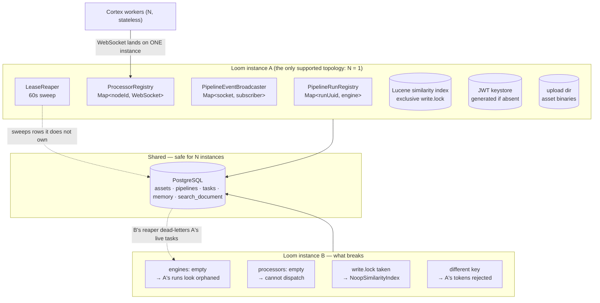

# Clustering & Multi-Instance Deployment — Technical Specification

> **Audience: AI coding agents.** This document answers one question: **what happens if more than one
> Loom server process runs against the same database?**
>
> **Status: Loom is single-instance by design. Nothing here is implemented.** Running two Loom
> instances today is not "degraded but working" — it is **actively destructive** (§3). This file exists
> so that constraint is written down in one place instead of being rediscovered per subsystem, and so
> that anything adding per-process state knows what it is signing up for.
>
> **Cortex is the opposite**: workers are stateless and scale horizontally on purpose
> ([features/helm/HELM_CORTEX.md](features/helm/HELM_CORTEX.md)). Nothing in this document restricts
> Cortex replicas.

| Component | Scales horizontally today? | Where enforced |
|---|---|---|
| **Loom server** | 🔴 **No — keep `replicaCount: 1`** | `helm/loom/values.yaml:7` (`Recreate` strategy, RWO volumes) |
| **Cortex worker** | ✅ Yes, 0..N | `helm/cortex` StatefulSet; stable `CORTEX_NODE_ID` per replica |
| **PostgreSQL** | shared by all of the above | the only real shared state |

---

## 1. Why this file exists

Several specs each note a *piece* of the constraint in passing — Lucene's index is "per-replica local
state" ([features/search/SEARCH.md](features/search/SEARCH.md) §2), the Helm chart says "keep
`replicaCount` at 1" ([features/helm/HELM_LOOM.md](features/helm/HELM_LOOM.md)), the EventBus has a
clustering TODO ([loom/EVENTBUS.md](loom/EVENTBUS.md)), MCP dispatch "is local only"
([loom/MCP.md](loom/MCP.md)). None of them states the whole picture, and none of them is where you
look before adding a `@Singleton` holding a `Map`.

**The rule for new code:** any state that is not in Postgres is *per-process*. If correctness depends
on it being global — a lock, a registry, a cap, a cache of a mutable authority — it is a clustering
blocker, and it belongs in §3 of this file.

---

## 2. Architecture — where state actually lives

**The load-bearing asymmetry:** Postgres holds the *durable* record of runs and tasks, but the
*authority* over a live run is an in-heap `PipelineRunEngine` in one process. Nothing in the database
records which process that is — there is **no owner/instance column** and **no lease on the run
itself**. Every failure in §3 follows from that one gap.

---

## 3. The blockers, worst first

🔴 **Do not treat this list as a backlog to grind through.** Items 1 and 2 cause *data-visible damage*
to healthy runs within 60 seconds of a second instance booting.

### 3.1 The lease reaper dead-letters another instance's live tasks 🔴

`LeaseReaper` runs a sweep every 60 s (started unconditionally in `RESTService.start()`).
`PipelineNodeTaskDao.loadExpiredLeases(now, limit)` filters on `state = RUNNING AND lease_expires_at <
now` — **no owner predicate**. The reaper then does `runRegistry.get(runUuid)`, a *local* map; for a
run owned by the other instance this returns `null`, so the task takes the orphan branch and is set to
`DEAD_LETTER`.

Net effect: **instance B kills instance A's perfectly healthy work.** Not a race — the steady state.

### 3.2 Boot recovery steals every in-flight run 🔴

`PipelineRunRecovery.recoverAll()` runs at boot and loads **all** runs with status `RUNNING` or
`PAUSED`, rebuilds an engine for each and registers it. It has no notion of "already owned". A second
instance booting while the first is live re-adopts every in-flight run and re-dispatches its tasks —
duplicated node execution, two engines mutating the same rows.

### 3.3 Worker dispatch cannot cross instances 🔴

`ProcessorRegistry` is a `Map<String, ConnectedProcessor>` of live WebSocket connections. A Cortex
worker's socket lands on exactly one instance. `selectProcessorForKinds(...)` only sees local entries,
so a run on instance B cannot dispatch to a worker attached to instance A — the run fails immediately
with "Processor was not reachable".

### 3.4 JWT keystores diverge 🔴

`AuthModule` generates `keystore.jceks` **if absent**, and `LoomOptionsLoader.generateDefaultConfig()`
invents a *random* keystore password when no config exists. Two instances with separate volumes get
different signing keys, so a token minted by A is rejected by B. On a *shared* RWX volume the generator
instead races: `KeyStoreHelper.gen` throws `FileExistsException` if the file appeared meanwhile →
boot crash.

### 3.5 Local disk: uploads and the similarity index 🔴

Both are shared-nothing, and the chart's PVCs are `ReadWriteOnce` anyway (a second pod on another node
simply fails to mount).

- **Upload dir** (`LOOM_STORAGE_UPLOAD_DIR`) — an asset binary uploaded to instance A **404s** on B.
- **Similarity index** (`LOOM_SIMILARITY_INDEX_PATH`) — see §3.6.

### 3.6 The Lucene index lock ⚠️ *(the constraint this file was opened for)*

`LuceneSimilarityIndex` opens an `IndexWriter` on `LOOM_SIMILARITY_INDEX_PATH`. Lucene takes an
**exclusive `write.lock`** on that directory for the lifetime of the writer. Consequences:

1. **Two instances must never share one index directory.** The second one cannot open it.
2. 🔴 **The failure is silent by design.** `SimilarityModule` catches it and binds
   `NoopSimilarityIndex` rather than failing boot — similarity is a capability, not a dependency
   ([features/search/LUCENE_PLAN.md](features/search/LUCENE_PLAN.md) §3). The instance starts
   normally and every similar-assets route answers **503**. Nothing about the *rest* of that instance
   looks wrong, so the symptom presents as "duplicate detection stopped working on some requests"
   under a load balancer — which is exactly the shape of bug that costs a day.
3. **The same lock bites a single instance**, twice over:
   - Two Loom processes on one host pointed at the same path (a stray dev server, a container plus a
     locally-run jar) — the second silently loses similarity.
   - Tests that boot a server per test method: `SimilarAssetsEndpointTest` needs a **per-test**
     `@TempDir` index path for exactly this reason. A shared static directory leaves every test after
     the first with a Noop index and unexplained 503s.
4. **Recovery is cheap, which is the saving grace.** The index is a *derived* cache of
   `asset_fingerprint_comp`; the fix for any drift or lock loss is
   `POST /api/v1/similarity-index/rebuild`, not a restore.

**Rule:** give every instance its own `LOOM_SIMILARITY_INDEX_PATH`, and never put it on a shared
volume. ⚠️ The Helm chart does **not** template `LOOM_SIMILARITY_*` at all yet, so an operator enabling
similarity in Kubernetes today is configuring it by hand — see §7.

> Note the distinction from [features/search/SEARCH.md](features/search/SEARCH.md) §2, which *rejects*
> Lucene for lexical search precisely because a per-replica index is unacceptable for a
> system-of-record. Fingerprint similarity accepts the same trade because it is derived and
> rebuildable. Both statements are correct; they are about different indexes.

### 3.7 Per-process guards that stop guarding ⚠️

Each of these enforces a limit or a mutual exclusion in heap. At N instances the limit becomes N× the
configured value, or the exclusion stops excluding:

| Guard | State | Consequence at N>1 |
|---|---|---|
| `PipelineRunEngine` in-flight caps | `inFlightByKind`, `maxInFlightByKind`, `items` | per-kind concurrency cap becomes N× configured |
| `AgentService.activeRuns` | `Map<chatUuid, AgentLoop>` | "one agent run per chat" no longer holds; cancel on the wrong instance is a no-op |
| `SandboxOrchestrator` `handles` + `locks` | `ReentrantLock` per session | two sandbox containers for one chat session; `maxConcurrent` becomes N× |
| `NodeKindCircuitBreaker.byKind` | per-kind failure stats | a kind tripped on A is still hammered from B |
| `PermissionCache` | Caffeine, **no TTL**, no invalidation channel | a permission revoked on A is honoured indefinitely by B |
| `SandboxReaper` | sweeps only its own `handles` | *leaks* the other instance's containers (does not double-reap) |

### 3.8 Fan-out is in-process ⚠️

- `PipelineEventBroadcaster` holds `Map<ServerWebSocket, Subscriber>` — a UI socket on A never sees
  events from a run on B. Sticky sessions are necessary but **not sufficient**.
- The Vert.x EventBus is **not clustered**: `VertxModule` builds a plain `Vertx` (no `ClusterManager`;
  `vertx-hazelcast` appears only in `<dependencyManagement>` and is on no runtime classpath).
  `loom/services/eventbus/` is a pom-and-README placeholder with no `src/`. MCP tool dispatch and
  `AssetPipelineTrigger` therefore only ever reach handlers in the same JVM.

### 3.9 Cold-boot races ⚠️

`DatabaseInitializer.init()` is check-then-act (`loadAdmin()` → `store()`) with no transaction and no
unique-constraint retry, so simultaneous first boots race on the admin user / default group / default
role. `DemoDatabaseInitializer` swallows the resulting failure with a `log.warn`, which hides it.

### 3.10 Flyway at boot — the one that is *mostly* fine ✅⚠️

`BootstrapInitializer.init(migrate)` calls `flyway.migrate()` as the first boot step. Flyway takes a
Postgres session-level advisory lock internally, so concurrent migration is serialized rather than
corrupting. The residual risks are operational: the second instance **blocks** for the duration of the
migration while its liveness probe is ticking, and any migration failure is a fatal boot error.

---

## 4. What is already replica-safe ✅

Worth knowing, so a future clustering effort does not "fix" it twice:

- **Agent memory** — Postgres-backed on purpose; `LOOM_AGENT_MEMORY_MOUNT_PATH` is a path *inside the
  Session Runner container*, not server-local disk. See
  [features/chat/CHAT_MEMORY_PLAN.md](features/chat/CHAT_MEMORY_PLAN.md).
- **Lexical search** — Postgres `tsvector` maintained by DB triggers; no per-instance index by
  deliberate choice ([features/search/SEARCH.md](features/search/SEARCH.md) §2).
- **Everything in Postgres** — assets, components, pipelines, runs, node tasks, RBAC, the dedup review
  model ([features/pipeline-nodes/NODE_DEDUP_PLAN.md](features/pipeline-nodes/NODE_DEDUP_PLAN.md)).
- **Cortex workers** — stateless; identity is `CORTEX_NODE_ID`, leases live in `pipeline_node_task`.

---

## 5. If clustering is ever built — the minimum honest shape

Not a plan, a sketch of what the blockers demand. Each maps to §3.

| # | Change | Unblocks |
|---|---|---|
| C-1 | **Run ownership in the DB**: an owner/instance column plus a heartbeat/lease on `pipeline_run`, and an owner predicate in `loadExpiredLeases` | §3.1, §3.2 |
| C-2 | **Leader election or an advisory lock** around `LeaseReaper` and `recoverAll()` (Postgres `pg_advisory_lock` is already available and used nowhere) | §3.1, §3.2, §3.9 |
| C-3 | **Shared object storage** (S3) or an RWX volume for asset binaries; the S3 sink/source work is the natural basis | §3.5 |
| C-4 | **Pre-provisioned keystore Secret**, never generated per instance | §3.4 |
| C-5 | **Clustered EventBus** (`Vertx.clusteredVertx()` + a `ClusterManager`) or a DB/Redis fan-out behind `PipelineEventBroadcaster`; revives `loom/services/eventbus` | §3.8, §3.7 (cache invalidation) |
| C-6 | **Worker routing across instances** — either route dispatch through the owning instance or move worker leases fully into the DB | §3.3 |
| C-7 | **Per-instance similarity index paths** (already the rule) or an external vector service behind the existing `SimilarityIndex` SPI | §3.6 |

C-7 is the cheapest by far: the SPI exists, and a shared backend is a module swap rather than a
rewrite ([features/search/LUCENE_PLAN.md](features/search/LUCENE_PLAN.md) §3).

---

## 6. Key Classes Reference

| Class | Package / module | Why it matters here |
|---|---|---|
| `PipelineRunRegistry` | `io.metaloom.loom.rest.service.impl` (`loom/services/rest`) | `Map<UUID, PipelineRunEngine>` — the authority over live runs; purely in-heap |
| `PipelineRunEngine` | `io.metaloom.loom.pipeline.engine` (`loom/pipeline`) | in-heap item state + per-kind concurrency accounting |
| `PipelineRunRecovery` | `io.metaloom.loom.rest.service.impl` | `recoverAll()` adopts every RUNNING/PAUSED run at boot (§3.2) |
| `LeaseReaper` | `io.metaloom.loom.rest.service.impl` | 60 s sweep with no ownership predicate (§3.1) |
| `PipelineNodeTaskDao.loadExpiredLeases` | `loom/db/api`, `loom/db/jooq` | the query that lacks an owner filter |
| `ProcessorRegistry` | `io.metaloom.loom.rest.service.impl` | local map of connected Cortex workers (§3.3) |
| `PipelineEventBroadcaster` | `io.metaloom.loom.rest.service.impl` | local WebSocket subscriber map (§3.8) |
| `VertxModule` | `io.metaloom.loom.common.dagger` (`loom/common`) | builds a **non-clustered** `Vertx` |
| `SimilarityModule` | `io.metaloom.loom.core.dagger` (`loom/core`) | binds `NoopSimilarityIndex` when the index cannot be opened (§3.6) |
| `LuceneSimilarityIndex` | `io.metaloom.loom.similarity.lucene` (`loom/services/lucene`) | holds the exclusive Lucene `write.lock` |
| `AuthModule` / `KeyStoreHelper` | `loom/services/auth/*` | generates the JWT keystore if absent (§3.4) |
| `AgentService` / `SandboxOrchestrator` | `loom/agent/chat`, `loom/agent/sandbox` | per-process run guards and session locks (§3.7) |
| `PermissionCache` | `io.metaloom.loom.auth` (`loom/services/auth/auth-common`) | no TTL, no cross-instance invalidation |
| `BootstrapInitializer` / `DatabaseInitializer` | `io.metaloom.loom.core.boot` (`loom/core`) | Flyway at boot + check-then-act seeding (§3.9, §3.10) |

---

## 7. Configuration

There is **no clustering configuration** — no `LOOM_CLUSTER_*` variable exists. What follows is the
set of options that are *per-instance* and must not be shared between instances.

| Env var | Default | Multi-instance rule |
|---|---|---|
| `LOOM_SIMILARITY_INDEX_PATH` | `similarity-index` | 🔴 **One directory per instance.** Sharing it silently disables similarity on all but the first (§3.6) |
| `LOOM_STORAGE_UPLOAD_DIR` | `data/storage` | 🔴 Shared-nothing today; binaries are only readable on the instance that received them |
| `LOOM_AUTH_KEYSTORE_PATH` | `keystore.jceks` in the config dir | 🔴 Must be the **same pre-provisioned key** everywhere, or tokens do not validate cross-instance |
| `LOOM_CONF_FILENAME` / config dir | `loom.yml` | Generated with a **random** keystore password when absent — pre-provision it |
| `replicaCount` (Helm) | `1` | 🔴 Keep at 1. `strategy: Recreate`, and all PVCs are `ReadWriteOnce` |

⚠️ **Chart gaps to be aware of:**
- `LOOM_SIMILARITY_*` is **not templated** in `helm/loom` at all — enabling similarity on Kubernetes
  currently means adding the env vars and a volume by hand.
- The chart and container set **`LOOM_BINARY_DIR=/uploads`**, but no Java code reads that variable
  (`StorageOptions` reads `LOOM_STORAGE_UPLOAD_DIR`). The uploads PVC may not be mounted where the
  server actually writes — worth verifying before anyone relies on it.

---

## 8. Test Setup

There is no clustering test suite, because there is no clustering. What exists, and what to add:

**Existing coverage that encodes the constraint**
- `SimilarAssetsEndpointTest` (`loom/core/src/test/...`) — uses a **per-test `@TempDir`** index path.
  That is not incidental: a shared directory reproduces §3.6 exactly (every test after the first gets a
  Noop index and 503s). Treat it as the regression test for the index lock.
- `PipelineNodeTaskDaoTest` — covers `loadExpiredLeases` semantics; the missing owner predicate is
  visible there.

**How to reproduce the blockers locally** (useful when C-1/C-2 are attempted)
1. Boot two Loom processes against the same database with distinct REST ports and **distinct** config,
   keystore and index paths.
2. Start a pipeline run on instance A with a Cortex worker attached to A.
3. Within ~60 s, observe instance B's `LeaseReaper` dead-lettering A's tasks (§3.1) — the first
   assertion any ownership work must flip.
4. Restart B and observe `recoverAll()` re-adopting A's runs (§3.2).
5. Point both at **one** `LOOM_SIMILARITY_INDEX_PATH` and confirm B logs "the index could not be
   opened" and answers 503 on `GET /assets/:uuid/similar-assets` (§3.6).

**A cheap guard worth adding before any of this**: a boot-time warning when a second instance detects
an existing live run owner or a locked index directory — the current silence is the real hazard.

---

## 9. Conventions and Gotchas

| Area | Gotcha |
|---|---|
| **Default assumption** | 🔴 Loom is **single-writer**. `replicaCount: 1` and `strategy: Recreate` are deliberate, not an oversight. A rolling update would briefly run two writers — which is why the chart does not use one. |
| **Silent degradation** | 🔴 The Lucene index lock does **not** fail boot; it downgrades to `NoopSimilarityIndex`. Absence of an error is not evidence of a working index. Check the boot log for "the index could not be opened". |
| **Derived vs. system-of-record** | ⚠️ Per-instance state is only acceptable when it is *derived and rebuildable* (the similarity index). The same pattern is rejected for lexical search because that index would be a system-of-record — [features/search/SEARCH.md](features/search/SEARCH.md) §2. |
| **New `@Singleton` holding a `Map`** | ⚠️ That is a clustering blocker by construction. If it enforces a cap, a lock, or "only one X at a time", say so in §3.7 rather than leaving it to be found later. |
| **`runRegistry.get(...) == null`** | 🔴 Means "not owned *by this process*", **not** "not running". Any code treating it as the latter (as `LeaseReaper` does) is broken under N>1. |
| **Local EventBus** | ⚠️ `vertx.eventBus()` reaches handlers in this JVM only. `vertx-hazelcast` in `<dependencyManagement>` is not a runtime dependency — do not assume clustering because the version is pinned. |
| **Tests boot a server per method** | ⚠️ Anything the server opens exclusively (an index, a lock file, a fixed port) needs per-test isolation. See [features/search/LUCENE_PLAN.md](features/search/LUCENE_PLAN.md) §9. |
| **Cortex ≠ Loom** | ⚠️ Cortex scaling is supported and unrelated. Do not generalise this document to workers. |

---

## 10. Where do I find …?

| Need | Look here |
|---|---|
| Why `replicaCount` must stay 1 | `helm/loom/values.yaml`; [features/helm/HELM_LOOM.md](features/helm/HELM_LOOM.md) |
| The index-lock rule and its rebuild escape hatch | [features/search/LUCENE_PLAN.md](features/search/LUCENE_PLAN.md) §4, §9 |
| Why Lucene was rejected for *lexical* search | [features/search/SEARCH.md](features/search/SEARCH.md) §2 |
| Clustered-EventBus TODOs | [loom/EVENTBUS.md](loom/EVENTBUS.md); `loom/services/eventbus/README.md` |
| MCP's local-only dispatch | [loom/MCP.md](loom/MCP.md) |
| The one subsystem designed replica-safe | [features/chat/CHAT_MEMORY_PLAN.md](features/chat/CHAT_MEMORY_PLAN.md) |
| Run/task lease mechanics | [features/pipeline/PIPELINE.md](features/pipeline/PIPELINE.md); `PipelineNodeTaskDao` |
| Cortex worker scaling (supported) | [features/helm/HELM_CORTEX.md](features/helm/HELM_CORTEX.md) |
| Health/readiness probes | [features/ops/MONITORING.md](features/ops/MONITORING.md) |

---

## 11. Progress Assessment

**Documented (this file)**
- [x] Current topology recorded: Loom single-instance, Cortex horizontal (§0, §4)
- [x] Blockers enumerated with severity and code locations (§3)
- [x] 🔴 **Lucene index-lock constraint written down, including the silent-degradation failure mode and
      the per-test isolation it forces** (§3.6) — the reason this file was created
- [x] Per-instance configuration rules + Helm gaps (§7)
- [x] Reproduction steps for the blockers (§8)

**Not implemented — and not scheduled**
- [ ] C-1 run ownership column + owner predicate in `loadExpiredLeases` (§3.1, §3.2)
- [ ] C-2 leader election / advisory lock around the reaper, recovery and DB seeding (§3.1, §3.2, §3.9)
- [ ] C-3 shared object storage for asset binaries (§3.5)
- [ ] C-4 pre-provisioned keystore Secret (§3.4)
- [ ] C-5 clustered EventBus or DB/Redis fan-out for the WebSocket broadcaster (§3.8)
- [ ] C-6 cross-instance worker dispatch (§3.3)
- [ ] C-7 per-instance similarity index paths enforced in the chart (§3.6, §7)

**Cheap wins, independent of any clustering effort**
- [ ] Template `LOOM_SIMILARITY_*` in `helm/loom` (currently absent entirely) (§7)
- [ ] Resolve the `LOOM_BINARY_DIR` vs `LOOM_STORAGE_UPLOAD_DIR` mismatch — the uploads PVC may be
      mounted where nothing writes (§7)
- [ ] Give `PermissionCache` a TTL so revocation converges even single-instance (§3.7)
- [ ] Boot-time warning when the similarity index directory is already locked (§8)

**Open questions**
- [ ] Is horizontal Loom scale-out actually a product goal, or is HA-by-restart (`Recreate` + fast
      recovery) sufficient? Every item above is expensive; none should start before this is answered.
- [ ] If it is a goal: does dispatch move fully into the DB (workers poll) or stay push-based with
      cross-instance routing? C-6 and C-1 depend on that choice.

---

_Git HEAD revision: `3b566b98a2280c0e60af97138db71b47cd8e5a32` (branch `master`)_
_Last updated: 2026-07-30_
