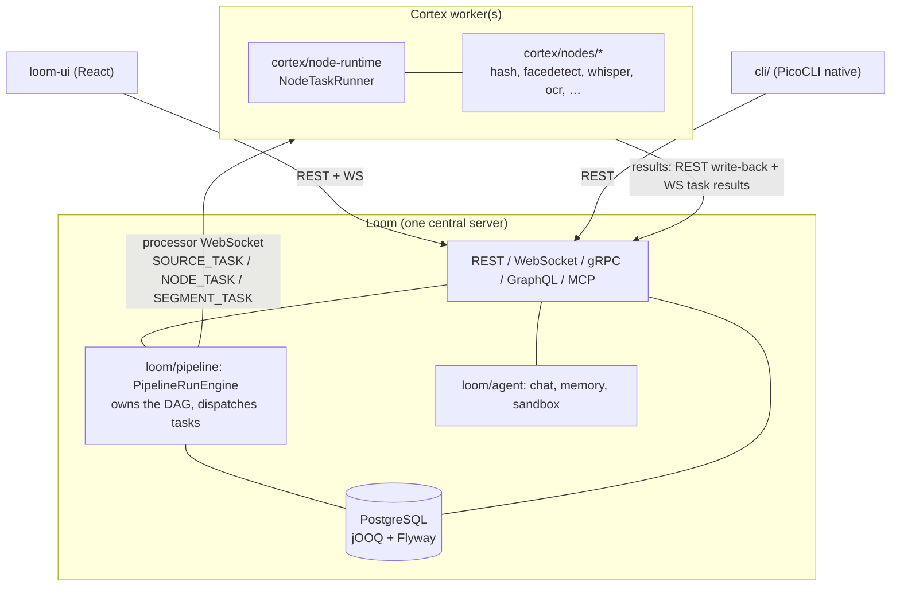

# MetaLoom — Project Context for AI Coding Agents

This document is the **entry point** for AI coding agents working on MetaLoom. It catalogues
**every** file under `spec/`, tells you which one to open for a given task, and carries the
project-wide conventions, cheat sheets and gotchas.

> **Project Root**: `/home/defaultuser/workspaces/metaloom/metaloom`
> **Spec root**: [spec/](.) — you are here.

---

## 0. Read This First

### 0.1 Mandatory rules

Two files are **rules, not background**. Read them before you write code or edit a spec.

| File | What it binds you to |
|------|----------------------|
| [guidelines/CODING.md](guidelines/CODING.md) | **Definition of done for a code change.** REST path naming + endpoint & permission tests, DAO tests incl. delete-cascade, customer-facing website docs, demo data, and the spec-sync obligation. Summarised in §0.2 — the file is the authority. |
| [SPEC_RULES.md](SPEC_RULES.md) | **Definition of done for a spec change.** Every spec file must carry progress checkboxes, a Key Classes Reference table, cross-references, diagrams, env-var tables, a Conventions & Gotchas section, a "Where do I find…?" cheat sheet, and a footer with the git HEAD revision and date. |

### 0.2 `guidelines/CODING.md` in one table

These apply to *every* change, in addition to whatever the feature spec says.

| Area | Rule | Practical consequence |
|------|------|-----------------------|
| **REST** | Paths with methods are always **plural** (`/chat-sessions`, `/sessions`, `/node-results`) | Renaming a path is a breaking change — also update `loom-client/`, `loom-ui/src/api/`, and the OpenAPI docs |
| **REST** | Every endpoint implementation is covered by a `*EndpointTest` (e.g. `UserEndpointTest`) | A new endpoint without an endpoint test is unfinished |
| **REST** | Add **permission test cases** asserting fine-grained permission handling | See [features/permissions/PERMISSIONS.md](features/permissions/PERMISSIONS.md); grant test permissions via group+role, not direct user grants |
| **DAO** | Every DAO implementation is covered by tests | Contract tests live in `loom/db/api-test`, impl tests in `loom/db/jooq/src/test/` |
| **DAO** | `delete` must have **delete-cascade tests** asserting only the targeted elements are removed | A cascade that over-deletes is the failure mode these tests exist to catch |
| **Docs** | New **customer-facing** features go into `website/content/english/docs` — no spec-file mentions, no internal coding references, customer-facing tone | See [website/WEBSITE.md](website/WEBSITE.md) |
| **Demo** | New features need meaningful default demo data | `DemoDatabaseInitializer` (`loom/core/.../boot/`) |
| **Spec** | Changing a feature **must** update the corresponding spec file | Keeps these guides in sync; the code always wins on conflict |

### 0.3 Reading order for a new task

```
CONTEXT.md (this file)
   ├─ guidelines/CODING.md ......... rules that apply to the change itself
   ├─ METALOOM.md .................. big-picture module layout
   ├─ cortex/METALOOM_ARCHITECTURE.md ... plain-language Loom↔Cortex model
   └─ the feature spec for your area (§2)
          └─ the component spec it references (loom/… or cortex/…)
                 └─ the *_TASKS.md file if you are picking up queued work
```

### 0.4 The one standing rule

**The code is the source of truth.** Where a spec and the code disagree, the code wins — and you
fix the spec in the same change (`guidelines/CODING.md` § Spec). Specs in this tree carry a
verification date in their footer; treat anything older than the last relevant commit as a claim
to re-check, not a fact.

---

## 1. Project Overview

MetaLoom is a **Digital Asset Management (DAM) platform**: point it at media and it works out what
is in it — hashes, faces, transcripts, thumbnails, text, quality metrics — then stores, indexes and
exposes that.

| Component | Role | Location |
|-----------|------|----------|
| **Loom** | Backend service: REST/gRPC/GraphQL API, DB, auth, storage, MCP, pipeline engine, AI agent | `loom/` |
| **Cortex** | Worker process: executes node tasks dispatched by Loom (hashing, fingerprint, facedetect, ASR, LLM, …) | `cortex/` |
| **CLI** | PicoCLI + Dagger client for Loom, shipped as a GraalVM native image | `cli/` |
| **loom-ui** | React/Vite/MUI web front end | `loom-ui/` |
| **loom-app** | Electron desktop wrapper around the UI | `loom-app/` |
| **website** | Hugo-based marketing + customer documentation site | `website/` |

### 1.1 Top-level reactor modules (`pom.xml`)

```
bom, loom-test-env, loom-shared, loom-client, cortex, loom,
cli, examples, integration-test, e2e-test, website
```

### 1.2 How the pieces talk



**Execution model (Variant C, built).** Loom owns the pipeline graph, persists run state, and
dispatches individual source/node/segment tasks to registered Cortex workers over the processor
WebSocket. Cortex holds no database and runs one task at a time per slot. See
[cortex/METALOOM_ARCHITECTURE.md](cortex/METALOOM_ARCHITECTURE.md) and
[cortex/METALOOM_ARCHITECTURE_V2_PLAN_C.md](cortex/METALOOM_ARCHITECTURE_V2_PLAN_C.md).

### 1.3 Key technologies

- **Backend**: Vert.x 5, Dagger 2, jOOQ, Flyway, PostgreSQL, RxJava 3
- **CLI**: PicoCLI, Dagger 2, GraalVM native image
- **Processing**: OpenCV, InspireFace, whisper.cpp, Tesseract, Apache Tika, Ollama, vLLM/llama.cpp
- **Frontend**: React 18, Vite, TypeScript, MUI v5, React Flow, Recharts, i18next
- **Build**: Maven, Docker/Podman, Hugo (website)
- **Testing**: JUnit 5, Testcontainers, AssertJ (domain-specific asserts), Playwright (UI E2E)

---

## 2. Specification Index — Every File Under `spec/`

```
spec/
├── AGENTS.md                          # One-liner: "read CONTEXT.md first"
├── CONTEXT.md                         # ← THIS FILE — entry point for AI agents
├── METALOOM.md                        # Big-picture module layout & framework map
├── SPEC_RULES.md                      # RULES for writing spec files
├── TASKS.md                           # Scratch task note (unstructured)
├── TASKS.template.md                  # Required format for every *_TASKS.md file
├── guidelines/
│   └── CODING.md                      # RULES for writing code (REST/DAO/Docs/Demo/Spec)
├── features/                          # Cross-cutting features (span Loom + Cortex + UI)
│   ├── DB_SCHEMA_FEEDBACK.md          # Schema audit vs. node results; resolved items marked in place
│   ├── chat/
│   │   ├── CHAT_MEMORY_PLAN.md        # Agent memory bank (markdown notes) — implemented
│   │   ├── CHAT_SESSIONS_CONCEPT.md   # Publishable chat sessions & context composition — concept
│   │   └── CHAT_TASKS.md              # Backend chat tasks B1–B9 — all done, records outcomes
│   ├── cli/
│   │   └── CLI_PLAN.md                # The `cli/` module — implemented 2026-07-26 (see §14 there)
│   ├── db/
│   │   └── DATABASE_TASKS.md          # Schema work for node-result persistence (V2.38–V2.50)
│   ├── ops/
│   │   ├── METRICS.md                 # Prometheus /metrics on both components — implemented
│   │   └── MONITORING.md              # Health & readiness endpoints
│   ├── permissions/
│   │   └── PERMISSIONS.md             # Authorization: RBAC model, taxonomy, enforcement points
│   ├── pipeline/
│   │   ├── PIPELINE.md                # Technical spec: engine, persistence, protocol, schemas
│   │   ├── PIPELINE_REQUIREMENTS.md   # Non-technical requirements + gap status
│   │   └── PIPELINE_TASKS.md          # Actionable pipeline work items
│   ├── pipeline-nodes/
│   │   ├── NODES.md                   # Cortex node system + per-node reference
│   │   ├── NODE_VIDEO_CAPTIONING_PLAN.md    # Video captioning node design
│   │   ├── NODE_VIDEO_CAPTIONING_REPORT.md  # Benchmark report (real runs, Qwen2.5-VL-7B)
│   │   └── video-captioning-results/        # Raw benchmark data (JSON + RUN_ENV.txt)
│   └── rbac/
│       └── RBAC.md                    # RBAC reference incl. known enforcement gaps
├── cortex/
│   ├── BUILD.md                       # Maven modules, container image, native deps
│   ├── CONFIGURATION.md               # YAML config, CLI flags, env vars, per-node options
│   ├── CORTEX.md                      # Architecture, module map, startup lifecycle, CLI
│   ├── METALOOM_ARCHITECTURE.md       # Plain-language Loom↔Cortex interaction (as built)
│   ├── METALOOM_ARCHITECTURE_TASK.md  # Open architecture tasks (+ explicitly dropped ideas)
│   └── METALOOM_ARCHITECTURE_V2_PLAN_C.md  # Variant C build record — COMPLETE
├── loom/
│   ├── BUILD.md                       # Loom build pipeline
│   ├── CONFIGURATION.md               # LoomOptions, config file, env vars, validation
│   ├── DOMAIN.md                      # Domain entities by group, derived from migrations
│   ├── EVENTBUS.md                    # Pipeline events, Vert.x EventBus, WS fan-out
│   ├── GRAPHQL.md                     # GraphQL API
│   ├── GRPC.md                        # gRPC API (asset, health, reflection)
│   ├── LOOM.md                        # Main entry point: architecture, modules, lifecycle, DI
│   ├── MCP.md                         # Model Context Protocol server (AI tool integration)
│   ├── PERSISTENCE.md                 # DAO layer, jOOQ, Flyway, test infrastructure
│   ├── PERSISTENCE_TASKS.md           # Open persistence-layer gaps
│   ├── RESTAPI.md                     # REST endpoints, auth, clients, OpenAPI
│   ├── SERVER.md                      # Server startup & lifecycle
│   ├── WEBSOCKET.md                   # Processor WS + pipeline-events WS protocols
│   └── ui/
│       ├── CHAT.md                    # Chat / Loom Agent: agentic loop, streaming, skills
│       ├── LOOM_UI.md                 # Loom UI specification
│       ├── PIPELINE_EDITOR.md         # Pipeline editor: React Flow canvas, CRUD, validation
│       ├── TASK_UI_AI_ML.md           # UI gap tasks: embeddings, clusters, detections, persons
│       ├── TASK_UI_ASSETS_MEDIA.md    # UI gap tasks: assets, locations, pools, attachments
│       ├── TASK_UI_CHAT.md            # UI chat tasks U1–U8 — all done, records outcomes
│       ├── TASK_UI_COLLABORATION.md   # UI gap tasks: tasks, comments, reactions
│       ├── TASK_UI_IDENTITY_ACCESS.md # UI gap tasks: users, groups, roles, permissions, tokens
│       ├── TASK_UI_ORGANIZATION.md    # UI gap tasks: collections, libraries, spaces, tags
│       ├── TASK_UI_PIPELINE.md        # UI gap tasks: pipelines, runs, node tasks, editor
│       └── TASK_UI_SYSTEM.md          # UI gap tasks: system info, monitoring, health
├── tasks/
│   └── TASKS.md                       # Queue of captured tasks (TASKS.template.md format)
└── website/
    └── WEBSITE.md                     # Hugo site: content, build, publish flow
```

### 2.1 Which file do I open?

| I am working on… | Start with |
|------------------|------------|
| Anything at all | [guidelines/CODING.md](guidelines/CODING.md), then this file |
| Understanding the system end to end | [cortex/METALOOM_ARCHITECTURE.md](cortex/METALOOM_ARCHITECTURE.md) |
| Pipelines (engine, runs, dispatch) | [features/pipeline/PIPELINE.md](features/pipeline/PIPELINE.md) |
| A Cortex processing node | [features/pipeline-nodes/NODES.md](features/pipeline-nodes/NODES.md) |
| A REST endpoint | [loom/RESTAPI.md](loom/RESTAPI.md) + [features/permissions/PERMISSIONS.md](features/permissions/PERMISSIONS.md) |
| A DAO / migration | [loom/PERSISTENCE.md](loom/PERSISTENCE.md) + [loom/DOMAIN.md](loom/DOMAIN.md) |
| Permissions / authorization | [features/permissions/PERMISSIONS.md](features/permissions/PERMISSIONS.md), [features/rbac/RBAC.md](features/rbac/RBAC.md) |
| Chat / AI agent / skills / memory | [loom/ui/CHAT.md](loom/ui/CHAT.md), [features/chat/CHAT_MEMORY_PLAN.md](features/chat/CHAT_MEMORY_PLAN.md) |
| The UI | [loom/ui/LOOM_UI.md](loom/ui/LOOM_UI.md) + the matching `TASK_UI_*.md` |
| Metrics / health / readiness | [features/ops/METRICS.md](features/ops/METRICS.md), [features/ops/MONITORING.md](features/ops/MONITORING.md) |
| The CLI | [features/cli/CLI_PLAN.md](features/cli/CLI_PLAN.md) |
| Customer-facing docs | [website/WEBSITE.md](website/WEBSITE.md) |
| Picking up queued work | any `*_TASKS.md`, format per [TASKS.template.md](TASKS.template.md) |

### 2.2 Feature specs vs. component specs

- **`features/`** — a capability spanning more than one component. Read these first when working
  on that capability end to end.
- **`loom/` and `cortex/`** — component-scoped architecture, configuration and build.
- **`guidelines/`** — rules that apply regardless of component.
- **`*_TASKS.md`** — actionable work items only; they follow [TASKS.template.md](TASKS.template.md)
  and record outcomes once done, so a task file is also a change log.

⚠️ The pipeline feature was previously spread over five overlapping files
(`cortex/PIPELINE.md`, `loom/PIPELINE.md`, `common/LOOM_PIPELINE.md`,
`features/pipeline/CORTEX_PIPELINE.md`, `features/pipeline/LOOM_PIPELINE.md`). They were merged and
deleted on 2026-07-18; `features/pipeline/` is the only source. Do not restore them.

---

## 3. Sub-Component Reference Guide

### 3.1 Loom Backend Service (`loom/`)

**Purpose**: central backend — assets, users, permissions, pipelines, chat agent, and Cortex worker
coordination. Owns the only database.

#### Key specifications

| Spec File | Description |
|-----------|-------------|
| [LOOM.md](loom/LOOM.md) | **Main entry point** — architecture, module layout, server lifecycle, Dagger DI, Loom↔Cortex relationship |
| [DOMAIN.md](loom/DOMAIN.md) | Domain entities grouped by area, derived from the Flyway migrations |
| [RESTAPI.md](loom/RESTAPI.md) | REST endpoints, authentication (JWT/OAuth2), CRUD patterns, OpenAPI generation |
| [WEBSOCKET.md](loom/WEBSOCKET.md) | Processor WS (`/api/v1/processors/ws`) and pipeline-events WS (`/api/v1/pipelines/events/ws`) |
| [PERSISTENCE.md](loom/PERSISTENCE.md) | jOOQ DAOs, Flyway migrations, DAO hierarchy, test infrastructure |
| [PERSISTENCE_TASKS.md](loom/PERSISTENCE_TASKS.md) | Open persistence gaps (asset-component coverage closed by V2.38–V2.50) |
| [EVENTBUS.md](loom/EVENTBUS.md) | Cortex PipelineEventBus, Vert.x EventBus (MCP only), WebSocket fan-out |
| [MCP.md](loom/MCP.md) | MCP server — JSON-RPC 2.0 over HTTP+SSE/WebSocket, tool registry via Vert.x EventBus |
| [GRPC.md](loom/GRPC.md) | gRPC API — asset, health, reflection (no pipeline surface) |
| [GRAPHQL.md](loom/GRAPHQL.md) | GraphQL API |
| [SERVER.md](loom/SERVER.md) | Server startup / lifecycle |
| [CONFIGURATION.md](loom/CONFIGURATION.md) | Configuration system, `LoomOptions` validation |
| [BUILD.md](loom/BUILD.md) | Loom build pipeline |
| [ui/CHAT.md](loom/ui/CHAT.md) | Chat / Loom Agent — server-side agentic loop, SSE streaming, skills |
| [ui/LOOM_UI.md](loom/ui/LOOM_UI.md) | Loom UI specification |
| [ui/PIPELINE_EDITOR.md](loom/ui/PIPELINE_EDITOR.md) | Pipeline editor — React Flow canvas, CRUD, validation |

> Pipeline **execution and persistence** are specified in
> [features/pipeline/PIPELINE.md](features/pipeline/PIPELINE.md); **authorization** in
> [features/permissions/PERMISSIONS.md](features/permissions/PERMISSIONS.md) — not in the files above.

#### Module layout (`loom/`)

```
loom/
├── common/          # Shared utilities, Vert.x setup, Dagger modules, LoomOptionsLoader
├── pipeline/        # ⭐ Loom-side pipeline engine (Variant C)
│   ├── engine/      #   PipelineRunEngine, NodeDispatcher, RunStateStore, RetryScheduler,
│   │                #   NodeKindCircuitBreaker, AssetSink, ItemState, RunSummary
│   └── graph/       #   PipelineGraphParser, PipelineGraph(Node), PipelineSegmenter,
│                    #   PipelineSegment, AffinityValidator, GraphValidationException
├── db/              # Database layer (parent)
│   ├── api/         #   DAO/model interfaces, Element/CRUDDao abstractions
│   ├── api-test/    #   Shared contract test infrastructure (CRUDDaoTestcases, DatabaseTest)
│   ├── jooq/        #   jOOQ-based DAO implementations (+ generate.sh)
│   ├── jooq-gen/    #   jOOQ codegen strategy (prefixes generated types with "Jooq")
│   ├── flyway/      #   SQL migrations (V1__, V2.*__)
│   ├── fs/          #   Filesystem-backed DAO implementation
│   ├── hibernate/   #   Hibernate-backed DAO implementation
│   └── memory/      #   In-memory DAO impl for fast tests (⚠️ no pipeline DAOs)
├── services/        # Service layer (parent)
│   ├── api/         #   Service-layer interfaces
│   ├── rest/        #   REST API, WebSocket endpoints, dispatcher, pipeline event broadcaster
│   ├── grpc/        #   gRPC service
│   ├── graphql/     #   GraphQL service
│   ├── mcp/         #   MCP server for AI agent integration
│   ├── auth/        #   Auth providers (JWT, Keycloak, Auth0, Okta, common)
│   ├── image/       #   Image processing
│   ├── video/       #   Video processing
│   ├── elasticsearch/, lucene/, qdrant/   # Search & vector integrations
│   ├── tika/        #   Apache Tika metadata extraction
│   ├── monitoring/  #   Health, readiness, Prometheus metrics
│   ├── logger/      #   Logging service
│   ├── plugins/     #   Plugin system
│   ├── fs/          #   Filesystem service
│   └── eventbus/    #   Placeholder
├── agent/           # AI agent subsystem (package io.metaloom.loom.agent.*)
│   ├── chat/        #   Agentic loop, ChatStreamEndpoint (SSE), AgentService, skills prompts,
│   │                #   ChatSessionEndpoint, SessionFsEndpoint
│   ├── memory/      #   Scoped markdown memory bank (MemoryService, MemoryEndpoint, memory tools)
│   ├── sandbox/     #   Coding sandbox orchestrator + podman/kubernetes backends, coding tools
│   ├── session-runner/ # Per-chat Session Runner image (runnerd.py) — metaloom/loom-session-runner
│   └── deploy/      #   Sandbox deployment reference (k8s pod template, RBAC notes)
├── core/            # Bootstrap, server lifecycle, LoomImpl, BootstrapInitializer,
│                    #   DatabaseInitializer, DemoDatabaseInitializer
├── fixture/         # Test fixtures, PoolSetupRunner, TestDBPoolManager
├── containers/      # Dockerfiles + build-containers.sh (metaloom/loom-server, metaloom/loom-demo)
├── helm/            # Helm chart
├── design/          # Design artefacts incl. DB/dbdiagram.yaml
└── doc/             # AsciiDoc documentation source + OpenAPI generator
```

> `loom/cli` **no longer exists** — the CLI moved to the top-level [cli/](../cli/) module. See
> [features/cli/CLI_PLAN.md](features/cli/CLI_PLAN.md).

#### Shared modules (outside `loom/`)

| Module | Purpose |
|--------|---------|
| `loom-shared/api` | Core interfaces: `Loom`, `LoomOptions`, `ServerOptions`, `DatabaseOptions`, `AuthenticationOptions` |
| `loom-shared/node-model` | Node/result model shared by Loom and Cortex |
| `loom-shared/pipeline-model` | `NodeTask`, `NodeTaskResult` and the dispatch protocol model |
| `loom-shared/rest-model` | REST DTOs, request/response models, validation models |
| `loom-shared/rest-model-test` | Custom AssertJ assertions for the REST model |
| `loom-shared/proto` | Protobuf/gRPC model definitions |
| `loom-client/common` | Shared client interfaces (`ClientMethods`, `PipelineMethods`) |
| `loom-client/rest` | Java HTTP client (`LoomHttpClient`) |
| `loom-client/report` | Client-side reporting helpers |
| `loom-test-env` | Test environment: DB pool leasing, JUnit 5 extensions |

#### Key classes reference (Loom)

| Class | Package | Purpose |
|-------|---------|---------|
| `LoomImpl` | `io.metaloom.loom.core` | Entry point; builds Dagger component, runs bootstrap |
| `BootstrapInitializer` | `io.metaloom.loom.core.boot` | Orchestrates startup/shutdown sequence |
| `DatabaseInitializer` | `io.metaloom.loom.core.boot` | Creates initial admin user, roles, permissions |
| `DemoDatabaseInitializer` | `io.metaloom.loom.core.boot` | Demo data — **extend when adding a feature** (CODING.md) |
| `LoomCoreComponent` | `io.metaloom.loom.core.dagger` | Dagger component wiring all services |
| `RESTService` | `io.metaloom.loom.rest` | REST API service (router, endpoints, auth) |
| `PipelineRunEngine` | `io.metaloom.loom.pipeline.engine` | Owns run state; walks the graph, dispatches tasks |
| `NodeDispatcher` | `io.metaloom.loom.pipeline.engine` | Sends node/segment tasks to a worker |
| `RunStateStore` | `io.metaloom.loom.pipeline.engine` | Durable run/item state — survives restart |
| `PipelineGraphParser` | `io.metaloom.loom.pipeline.graph` | Parses definition JSON into a `PipelineGraph` |
| `PipelineSegmenter` | `io.metaloom.loom.pipeline.graph` | Groups nodes into affinity segments |
| `PipelineValidationService` | `io.metaloom.loom.rest.validation` | Validates definitions (node types, edges) |
| `PipelineEventBroadcaster` | `io.metaloom.loom.rest.service.impl` | Fans out pipeline events to UI WebSocket clients |
| `MCPService` | `io.metaloom.loom.mcp` | MCP server |
| `MemoryService` | `io.metaloom.loom.agent.memory` | Scoped markdown memory bank for the chat agent |

#### Build & run commands

```bash
./build.sh              # Full build (Maven + UI + containers)
mvn -T 8 test-compile -q -DskipTests   # Fast compile check
./setup-pool.sh         # (RE)INITIALIZE THE TEST DB POOL — required before tests
./it.sh                 # Integration tests
./e2e.sh                # End-to-end tests
./start-postgres.sh     # Local Postgres
./start-server.sh       # Loom server
./start-cortex.sh       # Cortex worker
./start-demo.sh         # Demo stack (Postgres + Loom + Cortex)
./ui.sh                 # UI dev server
```

🔴 **`./setup-pool.sh` is mandatory** before running tests, and again after **any** Flyway migration
change — otherwise the pooled databases are stale and tests fail with confusing errors.

---

### 3.2 Cortex Processing Node (`cortex/`)

**Purpose**: worker process that executes node tasks dispatched by Loom (and, offline, runs
pipelines from the CLI). It holds no database.

#### Key specifications

| Spec File | Description |
|-----------|-------------|
| [CORTEX.md](cortex/CORTEX.md) | **Main entry point** — architecture, module map, startup lifecycle, CLI commands, online/offline modes |
| [METALOOM_ARCHITECTURE.md](cortex/METALOOM_ARCHITECTURE.md) | **How Loom and Cortex actually interact** — registration, REST vs WebSocket, dispatch, results, failure handling, monitoring, daemonization. Plain language, code-verified |
| [METALOOM_ARCHITECTURE_TASK.md](cortex/METALOOM_ARCHITECTURE_TASK.md) | Open architecture work items — plus the ideas explicitly **dropped** with the rejected variants |
| [METALOOM_ARCHITECTURE_V2_PLAN_C.md](cortex/METALOOM_ARCHITECTURE_V2_PLAN_C.md) | Variant C build record — **COMPLETE**. Decisions, phase order, and the refinements deliberately not built |
| [CONFIGURATION.md](cortex/CONFIGURATION.md) | YAML config, CLI flags, env vars, per-node options. ⚠️ documented YAML precedence does not work — see METALOOM_ARCHITECTURE.md §8 |
| [BUILD.md](cortex/BUILD.md) | Maven modules, container image, native dependencies, fast-compile recipes |
| [features/pipeline-nodes/NODES.md](features/pipeline-nodes/NODES.md) | Node system — lifecycle, MetaStorage, two-level hierarchy, per-node reference |
| [features/pipeline/PIPELINE.md](features/pipeline/PIPELINE.md) | Pipeline model, definition JSON, dispatch protocol, Loom bridge |

#### Module layout (`cortex/`)

```
cortex/
├── api/                 # Public interfaces: Cortex, CortexOptions, CortexNode, LoomMedia,
│                        #   NodeResult, ResultState, MetaStorage
├── common/              # Shared impls: MetaStorageImpl, CortexOptionsLoader, LoomMediaLoader
├── fs/                  # Filesystem scanner (Linux xattr support)
├── core-media/          # Media decorator types (HashMedia, FacedetectMedia, …) + AssertJ helpers
├── nodes/               # Concrete processing nodes (parent POM)
│   ├── common-api/, filter-api/, source-api/   # Node APIs & descriptors
│   ├── filesystem-source/  # Filesystem source node + FilesystemMediaScanner
│   ├── hash/            #   SHA-512, SHA-256, MD5, chunk-hash
│   ├── fingerprint/     #   Video fingerprinting
│   ├── facedetect/      #   Face detection + embeddings (InspireFace)
│   ├── thumbnail/       #   Contact-sheet thumbnail generation
│   ├── consistency/     #   Zero-chunk detection
│   ├── dedup/           #   SHA-512 / fingerprint deduplication
│   ├── quality/         #   Resolution, blurriness, bitrate metrics
│   ├── scene-detection/ #   Optical-flow scene boundary detection (incl. frame boundaries)
│   ├── ocr/             #   Text extraction (Tesseract)
│   ├── tika/            #   Apache Tika metadata extraction
│   ├── whisper/         #   Speech-to-text (whisper.cpp) — reference for Loom write-back
│   ├── llm/             #   Metadata extraction (Ollama LLM)
│   ├── captioning/      #   Image & video captioning (SmolVLM, Qwen2.5-VL)
│   └── loom/            #   Loom sync node
├── processor/           # MediaProcessor + FilesystemProcessor (CLI-driven batch)
├── core/                # Runtime wiring: CortexImpl, CLI commands, Dagger modules,
│                        #   LoomControlChannel, PipelineTaskHandler, RegistryNodeFactory
├── cli/                 # CLI entry point (CortexCLIMain), Dagger component, shade plugin,
│                        #   PipelineNodeFactoryModule (node-type registry)
├── container/           # Containerfile + build-container.sh for the OCI image
├── pipeline-api/        # Pipeline, PipelineNode, PipelineExecutor, events, cache SPIs
├── pipeline-core/       # DefaultPipeline, ReactivePipelineExecutor, AbstractPipelineNode, filters
├── pipeline-common/     # DefaultPipelineEventBus, cache impls, DefaultLoomBulkSyncCollector
└── node-runtime/        # Task runners for Loom-dispatched work: NodeTaskRunner, SourceTaskRunner,
                         #   SegmentTaskRunner, ResultBatcher, NodeResultMapper
```

#### Key classes reference (Cortex)

| Class | Package | Purpose |
|-------|---------|---------|
| `Cortex` / `CortexImpl` | `io.metaloom.cortex` / `.impl` | Top-level interface & implementation; lifecycle |
| `CortexCLIMain` | `io.metaloom.cortex.cli` | `main()`; builds Dagger component, runs CLI |
| `CortexComponent` | `io.metaloom.cortex.cli.dagger` | Dagger component wiring all modules |
| `PipelineNodeFactoryModule` | `io.metaloom.cortex.cli.dagger` | **Registers executable pipeline node types** — see §6 gotcha |
| `NodeCollectionModule` | `io.metaloom.cortex.cli.dagger` | Provides every concrete Cortex node to DI |
| `CortexBootstrapInitializer` | `io.metaloom.cortex.impl.boot` | Starts monitoring HTTP + Loom control channel |
| `LoomControlChannel` | `io.metaloom.cortex.impl.loom` | WebSocket client to Loom: registration, heartbeat, tasks |
| `PipelineTaskHandler` | `io.metaloom.cortex.impl.loom` | Runs `SOURCE_TASK` / `NODE_TASK` / `SEGMENT_TASK` |
| `RegistryNodeFactory` | `io.metaloom.cortex.pipeline.loader` | Maps a JSON node `type` to a concrete node; unknown → stub |
| `NodeTaskRunner` | `io.metaloom.cortex.runtime` | Executes one node task; exceptions become `FAILED` results |
| `NodeResultMapper` | `io.metaloom.cortex.runtime` | Maps Cortex `ResultState` → wire `NodeTaskResult` state |

#### Online vs offline mode

| Mode | Condition | Behaviour |
|------|-----------|-----------|
| **Online (primary)** | `LOOM_HOST` + `LOOM_PORT` configured | Registers over the processor WebSocket, receives source/node/segment tasks, writes results back |
| **Offline** | No Loom host configured | Standalone; driven by the `cortex process run` CLI command |

#### Build commands

```bash
mvn -T 8 clean package -DskipTests -pl cortex -am        # All cortex modules
mvn -T 8 clean package -DskipTests -pl cortex/cli -am    # CLI/daemon shaded JAR
mvn -T 8 test -pl cortex                                 # Tests
cortex/container/build-container.sh                      # Container image
```

---

### 3.3 MetaLoom CLI (`cli/`)

**Purpose**: PicoCLI + Dagger 2 client for Loom, shipped as a GraalVM native image. Replaced the
dead `loom/cli` stub.

| Item | Value |
|------|-------|
| Spec | [features/cli/CLI_PLAN.md](features/cli/CLI_PLAN.md) — status: implemented 2026-07-26, §14 records what landed and what did not |
| Layout | `cli/pom.xml`, `cli/src/`, `cli/build-native.sh`, `cli/README.md` |
| Talks to | Loom REST (`loom-client/rest`) and the pipeline run lifecycle (`PipelineRunRequest`, `PipelineMethods`) |

Read the plan before touching `PipelineRunRequest`, `PipelineMethods`, or the run pause/resume
surface — the CLI commands depend on those server-side capabilities.

---

### 3.4 Loom UI (`loom-ui/`)

**Purpose**: React/Vite/TypeScript/MUI web front end.

Specs: [loom/ui/LOOM_UI.md](loom/ui/LOOM_UI.md), [loom/ui/PIPELINE_EDITOR.md](loom/ui/PIPELINE_EDITOR.md),
[loom/ui/CHAT.md](loom/ui/CHAT.md), plus the eight `TASK_UI_*.md` gap-analysis files listed in §2.

#### Source layout (`loom-ui/src/`)

```
src/
├── Admin/, Asset/, Content/, Dashboard/, Login/, Pipeline/, User/, Welcome/   # Views
├── components/      # Shared UI components
├── features/        # Feature-specific components (incl. features/pipeline/PipelineEditor.tsx)
├── context/         # React context providers
├── api/             # API client layer (chatSessions.ts, …)
├── layout/          # Layout components
├── theme/           # MUI theme configuration
├── i18n/            # Internationalization
├── mock/            # Mock data for development and mocked e2e tests
├── img/, types/     # Static images, TypeScript types
└── main.tsx         # Application entry point
```

#### Commands & test tooling

```bash
npm run dev          # Dev server
npm run build        # Production build
npm run test:e2e     # Playwright E2E (also used for component tests, against mocked APIs)
```

> **Testing convention**: component-level tests are Playwright *mocked* e2e specs (e.g.
> `e2e/chat-sessions-mocked.spec.ts`) — there is no RTL/jsdom setup. Pure logic is tested with
> node-environment vitest.

Config files: `package.json`, `vite.config.ts`, `tsconfig.json`, `playwright.config.ts`.

---

### 3.5 Website (`website/`)

**Purpose**: Hugo static site — marketing landing page, blog, and **customer-facing product
documentation**. Spec: [website/WEBSITE.md](website/WEBSITE.md).

```
website/
├── config.toml      # Hugo config (baseURL https://metaloom.io, theme meghna-hugo, publishDir dist)
├── content/         # Main content — customer docs live in content/english/docs
├── content-off/     # Disabled/archived content
├── data/, i18n/, static/, themes/, resources/
├── dist/            # Build output
├── build.sh, watch.sh
└── pom.xml          # Maven wrapper (CI)
```

🔴 Per [guidelines/CODING.md](guidelines/CODING.md): new customer-facing features **must** get a
page under `website/content/english/docs`, written for customers — no spec-file references, no
internal class names.

---

### 3.6 Integration Testing (`integration-test/`)

Cross-module tests that boot the Loom stack and drive it via `LoomHttpClient`, plus per-node
end-to-end Cortex tests.

```
integration-test/
├── pom.xml
└── src/test/java/io/metaloom/loom/test/integration/
    ├── AbstractIntegrationTest.java            # Base class with LoomHttpClient setup
    ├── BasicIntegrationTest.java
    ├── LoomExtensionHelper.java
    └── PipelinePersistenceIntegrationTest.java
```

Key dependencies: `loom-container-server`, `loom-client-rest`, `cortex-cli`,
`cortex-pipeline-core`, `loom-test-env`, `loom-fixture`.

```bash
./it.sh                        # Convenience script (pool setup + tests)
mvn verify -pl integration-test
```

> Cortex node E2E tests live here too. When they fail after a Cortex change, rebuild the shaded
> `cortex/cli` JAR and the container image — the tests run against the packaged artifact, not the
> reactor classes.

---

### 3.7 End-to-End Testing (`e2e-test/`)

Full end-to-end tests against a packaged container deployment.

```
e2e-test/
├── pom.xml, run-e2e.sh, config/
└── src/test/java/io/metaloom/loom/studio/test/E2ETest.java
```

```bash
./e2e.sh
mvn test -Dloom.external=true -pl e2e-test   # Against an already-running container
```

---

### 3.8 Examples (`examples/`)

| Example | Description |
|---------|-------------|
| `cortex-custom/` | Extending Cortex with custom code (includes its own `PipelineNodeFactoryModule`) |
| `cortex-custom-node/` | Implementing a custom Cortex processing node |

---

## 4. Cross-Cutting Concerns

### 4.1 Authentication & authorization

| Component | Mechanism |
|-----------|-----------|
| REST API | JWT bearer tokens (HMAC-signed), `__Host-loom_token` cookie |
| WebSocket | `?token=<jwt>` query parameter (browsers cannot set headers on WS upgrade), strict/lenient mode |
| OAuth2 | BFF pattern with PKCE (Keycloak, Auth0, Okta) |
| API tokens | CRUD at `/api/v1/tokens`, with scoped permissions |
| Permissions | Vert.x `PermissionBasedAuthorization` (e.g. `CREATE_USER`, `READ_ASSET`, `CREATE_SKILL`) |

Details: [features/permissions/PERMISSIONS.md](features/permissions/PERMISSIONS.md) (model +
enforcement) and [features/rbac/RBAC.md](features/rbac/RBAC.md) (taxonomy + known gaps).

### 4.2 Database & persistence

| Layer | Technology |
|-------|------------|
| Primary DB | PostgreSQL |
| ORM | jOOQ (code-generated into `loom/db/jooq/src/jooq/java`) |
| Migrations | Flyway — `loom/db/flyway/src/main/resources/db/migration/` |
| DAO pattern | Interface in `loom/db/api`, impls in `loom/db/jooq`, `loom/db/memory`, `loom/db/fs`, `loom/db/hibernate` |
| Test DB | Leased from the external `testdatabase-provider` service via `loom-test-env` |

### 4.3 Event systems

| System | Scope | Transport | Purpose |
|--------|-------|-----------|---------|
| Cortex PipelineEventBus | In-process (Cortex) | Java pub/sub | Internal node coordination, caching |
| Vert.x EventBus | Vert.x instance (Loom) | Vert.x EventBus | MCP tool dispatch only (`mcp.tool.<name>`) |
| Processor WebSocket | Loom ↔ Cortex | Raw `ServerWebSocket` | Registration, heartbeat, task dispatch & results |
| Pipeline-events WebSocket | Loom → UI | Raw `ServerWebSocket` | Fan-out of run/node events to browsers |

### 4.4 Environment variables (most used)

Loom — see [loom/CONFIGURATION.md](loom/CONFIGURATION.md) for the full list:

| Variable | Default | Purpose |
|----------|---------|---------|
| `LOOM_CONF_FILENAME` | — | Path to the Loom YAML config file |
| `LOOM_NAME` | — | Instance name |
| `LOOM_SERVER_REST_PORT` | `8092` | REST/WebSocket port |
| `LOOM_SERVER_GRPC_PORT` / `_BIND_ADDRESS` | `8091` | gRPC listener |
| `LOOM_SERVER_MON_PORT` | `8989` | Monitoring/health/metrics port |
| `LOOM_SERVER_MCP_PORT` | `4041` | MCP server port |
| `LOOM_DB_HOST` / `_PORT` / `_NAME` / `_USERNAME` / `_PASSWORD` | `5432` for port | PostgreSQL connection |
| `LOOM_DB_MIN_POOL_SIZE` / `_MAX_POOL_SIZE` | — | Connection pool sizing |
| `LOOM_INITIAL_PASSWORD` | — | Bootstrap admin password |
| `LOOM_TOKEN_EXPIRATION_TIME` | — | JWT lifetime |
| `LOOM_STORAGE_UPLOAD_DIR` | — | Upload storage directory |
| `LOOM_OAUTH*` | — | OAuth2 provider settings (Keycloak/Auth0/Okta) |
| `LOOM_MCP_AUTH_ENABLED` / `_STRICT_MODE` / `_ALLOWED_ORIGINS` | — | MCP authentication |
| `LOOM_AI_ENABLED` / `_PROVIDER_TYPE` / `_URL` / `_MODEL_ID` | — | Chat agent LLM provider |
| `LOOM_AI_STREAMING` / `_THINK_ENABLED` / `_MAX_TURNS` / `_CONTEXT_WINDOW` / `_TOOL_TIMEOUT_MS` / `_TITLE_GENERATION` | — | Agentic loop tuning |
| `LOOM_AGENT_MEMORY_MOUNT_PATH` / `_MAX_SCOPE_BYTES` | — | Agent memory bank |
| `LOOM_AGENT_SANDBOX_*` | — | Coding sandbox (namespace, limits, timeouts, workspace size) |

Cortex — see [cortex/CONFIGURATION.md](cortex/CONFIGURATION.md):

| Variable | Default | Purpose |
|----------|---------|---------|
| `LOOM_HOST` | — | Loom host; **its presence selects online mode** |
| `LOOM_PORT` | `8092` | Loom REST/WebSocket port |
| `LOOM_TOKEN` | — | API token used to register and write results |
| `CORTEX_CONF_FILENAME` | — | Path to `cortex.yml` |
| `CORTEX_NODE_ID` | — | Worker identity reported at registration |
| `CORTEX_META_PATH` | — | Local metadata/index directory |
| `CORTEX_MONITORING_PORT` | `8093` | Health/readiness/metrics port |
| `CORTEX_NODE_WHITELIST` / `CORTEX_NODE_BLACKLIST` | — | Enable/disable node kinds on this worker |

### 4.5 Configuration priority (Cortex)

1. **CLI flags** (highest) → 2. **environment variables** → 3. **YAML config file**
(`~/.config/metaloom/cortex.yml`) → 4. **code defaults**.
⚠️ The YAML layer is not read on the server path — see [cortex/CONFIGURATION.md](cortex/CONFIGURATION.md).

### 4.6 Dagger dependency injection

Both Loom and Cortex use **Dagger 2**:
- Generated components under `target/generated-sources/annotations`
- Multibindings for extensibility (`Set<MCPTool>`, `Set<LoomMetaTypeHandler>`, node collections)
- Subcomponents for request-scoped DI (`RestComponent` per REST request)

---

## 5. Where Do I Find…? (Cheat Sheet)

| Need | Look Here |
|------|-----------|
| Coding rules for any change | [guidelines/CODING.md](guidelines/CODING.md) |
| Rules for writing a spec | [SPEC_RULES.md](SPEC_RULES.md), format for task files: [TASKS.template.md](TASKS.template.md) |
| REST endpoint implementations | `loom/services/rest/.../endpoint/impl/` |
| REST request/response DTOs | `loom-shared/rest-model/` |
| Java REST client | `loom-client/rest/` (`LoomHttpClient`) |
| Custom AssertJ assertions | `loom-shared/rest-model-test/.../assertj/` and `cortex/**/test/**/assertj/` |
| JWT / login / OAuth2 | `loom/services/auth/` |
| Permission enum & enforcement | `loom/db/api` (permission model), `loom/services/rest/.../endpoint/` |
| DAO interfaces | `loom/db/api/` |
| jOOQ DAO implementations | `loom/db/jooq/` |
| Generated jOOQ tables | `loom/db/jooq/src/jooq/java/…` (regenerate with `loom/db/jooq/generate.sh`) |
| SQL migrations | `loom/db/flyway/src/main/resources/db/migration/` |
| Test DB pool setup | `./setup-pool.sh`, `loom-test-env/`, `loom/fixture/`, `loom/DEVELOPMENT.md` |
| Demo data | `loom/core/.../boot/DemoDatabaseInitializer.java` |
| **Loom-side pipeline engine & graph** | `loom/pipeline/src/main/java/io/metaloom/loom/pipeline/{engine,graph}/` |
| Pipeline REST endpoints & services | `loom/services/rest/.../endpoint/impl/Pipeline*.java`, `.../service/impl/` |
| Pipeline dispatch protocol model | `loom-shared/pipeline-model/` (`NodeTask`, `NodeTaskResult`) |
| Cortex task runners | `cortex/node-runtime/src/main/java/io/metaloom/cortex/runtime/` |
| Loom↔Cortex control channel & task handler | `cortex/core/.../impl/loom/` |
| Pipeline node type registration | `cortex/cli/.../dagger/PipelineNodeFactoryModule.java` |
| Cortex processing nodes | `cortex/nodes/` |
| Cortex pipeline engine (legacy in-Cortex DAG) | `cortex/pipeline-api/`, `cortex/pipeline-core/`, `cortex/pipeline-common/` |
| Pipeline DB migrations | `loom/db/flyway/.../V2.19__add_pipeline.sql`, `V2.29__add_pipeline_run.sql`, `V2.30__add_pipeline_version.sql` |
| Chat / agent DB migrations | `V2.28__add_chat`, `V2.36__add_skill`, `V2.37__add_skill_version`, `V2.52__add_chat_session`, `V2.53__add_agent_memory`, `V2.54` (memory deny rules) |
| Node result persistence | `V2.45__add_asset_node_result`, `AssetEndpoint` `/api/v1/assets/:uuid/node-results` |
| Chat / agent code | `loom/agent/{chat,memory,sandbox}/` |
| Pipeline UI editor | `loom-ui/src/features/pipeline/PipelineEditor.tsx` |
| UI API client layer | `loom-ui/src/api/` |
| Documentation source (AsciiDoc) | `loom/doc/src/main/docs/` |
| Customer-facing docs | `website/content/english/docs/` |
| Container builds | `loom/containers/`, `cortex/container/` |
| Helm chart | `loom/helm/` |
| DB diagram | `loom/design/DB/dbdiagram.yaml` |
| Integration tests | `integration-test/src/test/java/io/metaloom/loom/test/integration/` |
| E2E tests | `e2e-test/src/test/java/io/metaloom/loom/studio/test/` |
| Examples | `examples/cortex-custom/`, `examples/cortex-custom-node/` |

---

## 6. Conventions & Gotchas

| Area | Convention / Gotcha |
|------|---------------------|
| **Test DB pool** | 🔴 Run `./setup-pool.sh` before tests **and after every Flyway change** — otherwise pooled DBs are stale and failures are misleading (`Pool not found {loom-dev}`) |
| **Java packages** | Backend `io.metaloom.loom.*`; processing `io.metaloom.cortex.*` — do not mix |
| **Dagger** | After changing generic types on nodes/services, or an endpoint constructor, do a **clean rebuild** of `loom/core` — stale generated code surfaces as `NoSuchMethodError` during setup-pool/tests |
| **jOOQ generated sources** | Live in `src/jooq/java`; never edit by hand — rerun `loom/db/jooq/generate.sh` after schema changes; converters are configured via `forcedTypes` in that pom |
| **New DB fields** | Need (a) Flyway `V*.sql`, (b) jOOQ regeneration, (c) DAO API change in `loom/db/api`, (d) impl updates in `loom/db/jooq` **and** `loom/db/memory`, (e) contract tests in `loom/db/api-test` |
| **Delete DAOs** | Must have delete-cascade tests proving only the intended rows disappear (CODING.md § DAO) |
| **`user_permission` PK** | Only one direct grant per user — grant test permissions via group+role instead (`SkillEndpointTest` is the pattern) |
| **REST paths** | Always plural for method-carrying paths (CODING.md § REST) |
| **REST updates** | `POST` creates **and** updates on all endpoints (backwards compatibility). User/Group/Asset also support `PATCH` (partial) and `PUT` (full replace — 400 if a replaceable field is missing). See [RESTAPI.md](loom/RESTAPI.md) §1.2 |
| **REST tests** | Endpoint test + fine-grained permission cases are part of "done", not follow-up work |
| **WebSocket auth** | Token via `?token=<jwt>` query param |
| **Test assertions** | Use the domain-specific `AbstractAssert` subclasses — do not hand-roll equality checks |
| **Cortex node hierarchies** | Two of them: Cortex-level (CLI/processor) and Pipeline-level (DAG), bridged by `CortexNodeAdapter`. Never extend both bases |
| **Pipeline graph rules** | Exactly one source node; node IDs must match `^[a-z0-9]([a-z0-9\-]{0,62}[a-z0-9])?$` |
| **Definition JSON** | ✅ Loom's `PipelineGraphParser` resolves the top-level `edges[]` array, falling back to `nodes[].dependencies[]` when no edges are present; when both exist **`edges` wins**. Older notes claiming edges are ignored describe the deleted Cortex-side `LoomPipelineLoader` and are stale |
| **Executable node kinds** | 🔴 `PipelineNodeFactoryModule` registers only `filesystem-source`, `asset-source`, `sha512`, `sha256`, `md5`, `chunk-hash`, `thumbnail`. Every other `type` in a pipeline definition falls back to a **stub node that reports success**. The node implementations exist (`NodeCollectionModule`) — they are simply not wired into the pipeline registry |
| **Node result write-back** | Results reach Loom via `POST /api/v1/assets/:uuid/node-results` — upsert a typed component **and** record the `asset_node_result` ledger row. `WhisperNode` is the reference implementation; copy its shape for a new node |
| **Cortex `cortex.yml`** | 🔴 Not read on the server path, despite [cortex/CONFIGURATION.md](cortex/CONFIGURATION.md) |
| **Cortex shutdown** | 🔴 No shutdown hook — `SIGTERM` abandons in-flight work and loses buffered results |
| **Pipeline validation** | Triplicated (loom-shared, loom-rest, UI). Only the loom-rest copy checks node types and is tested |
| **MCP tools** | Registered via Dagger multibinding (`Set<MCPTool>`), dispatched over the Vert.x EventBus (`mcp.tool.<name>`) |
| **UI tests** | Component tests are Playwright *mocked* e2e specs; pure logic uses node-env vitest. No RTL/jsdom |
| **Cortex node E2E tests** | Live in `integration-test/`; rebuild the shaded `cortex/cli` JAR and container before running them |
| **Spec ↔ code drift** | Spec footers carry a verification date. If a claim predates the code you are reading, verify before believing — and fix the spec in your change |

---

## 7. Progress Assessment

- [x] Every file under `spec/` catalogued with a description (§2)
- [x] `guidelines/CODING.md` surfaced as a mandatory pre-read with a summary table (§0)
- [x] `SPEC_RULES.md` surfaced as the rule set for spec edits (§0)
- [x] Reading order and "which file do I open?" routing added (§0.3, §2.1)
- [x] Loom module layout updated for `loom/pipeline` (engine + graph) and the full `services/` list
- [x] Top-level `cli/` module documented; dead `loom/cli` references removed
- [x] `loom-shared` / `loom-client` module lists corrected (`node-model`, `pipeline-model`, `report`)
- [x] Cortex module layout updated for `node-runtime`
- [x] Architecture diagram reflects Variant C (Loom owns the DAG)
- [x] Environment variable tables added for Loom and Cortex (§4.4)
- [x] Stale "edges are ignored" claim corrected against `PipelineGraphParser`
- [x] Duplicate `METALOOM_ARCHITECTURE_V2_PLAN_C.md` entry removed; `METALOOM_ARCHITECTURE_TASK.md` added
- [x] Cheat sheet extended with pipeline engine, agent, node-result and Helm paths
- [ ] `spec/AGENTS.md` is a one-line stub — decide whether it should carry agent-specific rules or be deleted
- [ ] `spec/TASKS.md` (root) is an unstructured note; fold it into [tasks/TASKS.md](tasks/TASKS.md) in the template format
- [ ] Only 7 of the ~29 node kinds are registered as executable pipeline types — see §6
- [ ] `cortex/CONFIGURATION.md` still documents a YAML precedence chain that does not work;
      `cortex/CORTEX.md` still describes the reconnect backoff as exponential (it is linear)
- [ ] Assets, auth and search are still documented per component rather than extracted into `features/`
- [ ] `loom/GRAPHQL.md` describes a service that is implemented but not registered — confirm and reconcile

---

## 8. Related Notes

⚠️ Earlier revisions of this file listed living notes under `/memories/repo/`. **That directory does
not exist in this checkout.** Those cross-references were removed on 2026-07-18; everything that
mattered is either in the `spec/` tree or must be re-derived from the code.

The authoritative specs are the ones catalogued in §2. When a spec and the code disagree,
**the code wins** — and fix the spec in the same change.

---

*This document is the primary entry point for AI coding agents. When in doubt, start here and
follow the cross-references.*

---

_Git HEAD revision: `183d36715c05e429474f7730d96869a906f3fecc`_
_Last updated: 2026-07-26 (full spec-file re-catalogue; CODING.md rules promoted to §0; `loom/pipeline` and top-level `cli/` documented; env-var tables added; edges/dependencies claim corrected)_
