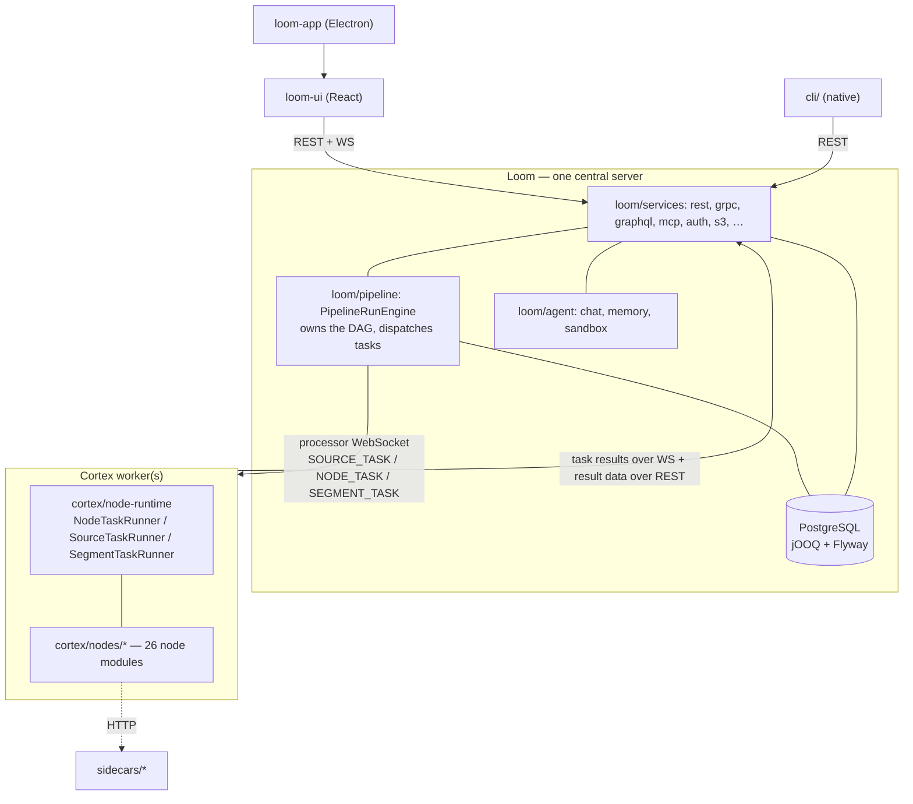

# MetaLoom — Module Layout & Framework Map

**Scope of this file:** the *big picture* — which reactor modules exist, what each one is for, and
which frameworks/versions the code is pinned to. Nothing else.

**This is not the entry point.** [CONTEXT.md](CONTEXT.md) is: it routes you to the right spec for a
task, catalogues every file under `spec/`, and carries the project-wide conventions. Read it first.
This file deliberately does **not** repeat CONTEXT.md's spec index, per-class references, build
recipes or feature descriptions.

| You want… | Go to |
|---|---|
| Which spec covers my task | [CONTEXT.md](CONTEXT.md) §2 |
| Rules for a code change | [guidelines/CODING.md](guidelines/CODING.md) |
| Rules for a spec change | [SPEC_RULES.md](guidelines/SPEC_RULES.md) |
| How Loom and Cortex interact | [cortex/METALOOM_ARCHITECTURE.md](cortex/METALOOM_ARCHITECTURE.md) |
| Loom internals / lifecycle / DI | [loom/LOOM.md](loom/LOOM.md) |
| Cortex internals / CLI / startup | [cortex/CORTEX.md](cortex/CORTEX.md) |
| Node ports, payload types, fan-out | [features/nodes/NODE_DATA_TYPES.md](features/nodes/NODE_DATA_TYPES.md) |

---

## 1. Components

MetaLoom is a Digital Asset Management platform: it ingests media, derives metadata (hashes,
faces, transcripts, thumbnails, text, quality, embeddings), and stores/indexes/exposes it.

| Component | Directory | Role |
|---|---|---|
| **Loom** | [loom/](../loom/) | Central backend. REST/gRPC/GraphQL/MCP/WebSocket, PostgreSQL, auth, storage, **owns the pipeline DAG**, AI agent. Single writer. |
| **Cortex** | [cortex/](../cortex/) | Stateless worker. Executes source/node/segment tasks Loom dispatches. No database. |
| **CLI** | [cli/](../cli/) | PicoCLI + Dagger REST client for Loom, built as a GraalVM native image. |
| **loom-ui** | [loom-ui/](../loom-ui/) | React/Vite/TypeScript/MUI web front end. |
| **loom-app** | [loom-app/](../loom-app/) | Electron Forge desktop wrapper that packages the built UI. Not a Maven module. |
| **website** | [website/](../website/) | Hugo marketing site + customer-facing docs. |
| **helm** | [helm/](../helm/) | `helm/loom` and `helm/cortex` charts. Not a Maven module. |
| **sidecars** | [sidecars/](../sidecars/) | Python GPU/model sidecar services (depth, tts, sentiment, ideogram, ltx2, mage-flow) that some nodes call over HTTP. Not Maven modules. |



Loom never dials out to Cortex; Cortex registers over `/api/v1/processors/ws`.

---

## 2. Reactor Modules

Top-level modules, exactly as declared in [pom.xml](../pom.xml):

```
bom, loom-test-env, loom-shared, loom-client, cortex, loom,
cli, examples, integration-test, e2e-test, website
```

```
bom/                    Dependency management for the whole reactor
loom-test-env/          JUnit 5 extensions, test DB pool leasing, sample media
loom-shared/            api  node-model  pipeline-model  rest-model  rest-model-test  proto
loom-client/            common  rest  grpc  report
loom/                   common  pipeline  db  services  agent  core  fixture  containers  doc
  db/                     api  api-test  flyway  memory  jooq-gen  jooq
  services/               api auth elasticsearch graphql monitoring logger plugins rest grpc
                          image video fs s3 tika lucene qdrant eventbus mcp
  agent/                  chat  memory  sandbox        (+ non-module dirs: session-runner, deploy)
cortex/                 api  common  s3-common  fs  core-media  nodes  processor  core  cli
                        container  pipeline-api  pipeline-common  pipeline-core  node-runtime
  nodes/                  filesystem-source s3-source s3-sink hash dedup thumbnail consistency
                          fingerprint facedetect scene-detection ocr llm vlm tika whisper tts
                          sentiment script depthmap scene-layout dominant-color quality
                          captioning image-generation video-generation watermark
cli/                    PicoCLI client + build-native.sh
examples/               cortex-custom  cortex-custom-node
integration-test/       Cross-module tests (boots the stack, drives it via LoomHttpClient)
e2e-test/               Tests against a packaged container (-Dloom.external=true)
website/                Maven wrapper around the Hugo build
```

Non-module directories at the top level: `helm/`, `loom-app/`, `loom-ui/`, `sidecars/`,
`spec/`, `test-database/`.

Per-module purpose tables live in [CONTEXT.md](CONTEXT.md) §3 — not repeated here.

---

## 3. Framework & Version Map

All versions below are pinned in [pom.xml](../pom.xml), [bom/pom.xml](../bom/pom.xml) or the module
POM named in the last column. Verify against those files before relying on a number.

| Area | Technology | Version | Pinned in |
|---|---|---|---|
| Language | Java (`maven.compiler.release`) | **25** | `io.metaloom:maven-parent` (sibling checkout) |
| Server runtime | Vert.x | **5.0.11** | root `pom.xml` |
| Netty | Netty | 4.2.12.Final | root `pom.xml` |
| DI | Dagger 2 | **2.57.2** | `bom`, `loom`, `cortex` |
| Persistence | jOOQ | **3.17.8** | `loom/db/pom.xml` |
| Migrations | Flyway | **9.16.1** | `bom` |
| Database | PostgreSQL (JDBC driver) | 42.7.10 | `bom` |
| Reactive | RxJava 3 | 3.1.6 | `bom` |
| JSON | Jackson | 2.18.2 | root `pom.xml` |
| gRPC model | Protobuf | 4.29.3 | root `pom.xml` |
| Serialization | Avro | 1.12.0 | root `pom.xml` |
| CLI | PicoCLI (+ GraalVM native-image) | 4.7.7 | `bom` |
| Object storage | AWS SDK v2 | 2.49.4 | `bom` |
| Metadata extraction | Apache Tika | 3.2.2 | `bom` |
| Media | video4j / OpenCV, InspireFace, whisper.cpp, Tesseract | — | `bom` (`video4j.version`) + node POMs |
| Logging | Logback / SLF4J | 1.5.19 / 2.0.7 | `bom` |
| UI | React | 18.3 | `loom-ui/package.json` |
| UI | Vite / TypeScript | 6.4 / 5.5 | `loom-ui/package.json` |
| UI | MUI | **v5** (5.16) | `loom-ui/package.json` |
| UI | reactflow (pipeline editor) | 11.11 | `loom-ui/package.json` |
| UI | recharts / i18next / react-router-dom | 2.12 / 26.0 / 6.26 | `loom-ui/package.json` |
| UI test | Playwright / vitest | 1.59 / 3.2 | `loom-ui/package.json` |
| Desktop | Electron Forge | 7.11 | `loom-app/package.json` |
| Website | Hugo (theme `meghna-hugo`) | — | `website/config.toml` |

Topology-selecting environment variables (full tables live in the CONFIGURATION specs):

| Variable | Effect | Detail spec |
|---|---|---|
| `LOOM_HOST` / `LOOM_PORT` | Set → Cortex runs **online** and registers with Loom; unset → offline CLI mode | [cortex/CONFIGURATION.md](cortex/CONFIGURATION.md) |
| `LOOM_AGENT_SANDBOX_*` | Selects the coding-sandbox backend (podman / kubernetes) | [loom/ui/CHAT.md](loom/ui/CHAT.md) |
| `LOOM_INITIAL_PASSWORD` | Keystore + initial admin password | [loom/CONFIGURATION.md](loom/CONFIGURATION.md) |
| `LOOM_BINARY_DIR` | Filesystem binary storage root | [features/rest/REST_BINARY_HANDLING.md](features/rest/REST_BINARY_HANDLING.md) |

---

## 4. Build Entry Points

| Script | Does |
|---|---|
| [build.sh](../build.sh) | Full build: Maven + UI + containers |
| `mvn -T 8 test-compile -q -DskipTests` | Fast compile check |
| [setup-pool.sh](../setup-pool.sh) | 🔴 **(Re)initialise the test DB pool** — mandatory before tests and after **any** Flyway change |
| [it.sh](../it.sh) / [e2e.sh](../e2e.sh) | Integration / end-to-end tests |
| [start-postgres.sh](../start-postgres.sh), [start-minio.sh](../start-minio.sh), [start-server.sh](../start-server.sh), [start-cortex.sh](../start-cortex.sh), [start-demo.sh](../start-demo.sh), [ui.sh](../ui.sh) | Local stack pieces |

Container images produced: `metaloom/loom-server`, `metaloom/loom-demo`
([loom/containers](../loom/containers/)), `metaloom/cortex-server`
([cortex/container](../cortex/container/)), `metaloom/loom-session-runner`
(`loom/agent/session-runner`).

---

## 5. Where do I find …?

| Need | Path |
|---|---|
| Reactor module list | [pom.xml](../pom.xml) `<modules>` |
| Dependency versions | [bom/pom.xml](../bom/pom.xml) + root `pom.xml` `<properties>` |
| Loom pipeline engine (the DAG owner) | [loom/pipeline](../loom/pipeline/) — `engine/`, `graph/` |
| Cortex task runners | [cortex/node-runtime](../cortex/node-runtime/) |
| Cortex node implementations | [cortex/nodes](../cortex/nodes/) |
| Node port/payload API | `cortex/api/.../api/node/` (`InputPort`, `OutputPort`, `payload/*Payload`) |
| REST endpoint impls | `loom/services/rest/.../endpoint/impl/` |
| Wire DTOs | [loom-shared/rest-model](../loom-shared/rest-model/) |
| Java REST client | [loom-client/rest](../loom-client/rest/) (`LoomHttpClient`) |
| SQL migrations | [loom/db/flyway/src/main/resources/db/migration](../loom/db/flyway/src/main/resources/db/migration/) (63 files, latest `V2.63__library_storage_pool.sql`) |
| Generated jOOQ sources | `loom/db/jooq/src/jooq/java/` (regen: `loom/db/jooq/generate.sh`) |
| AsciiDoc product docs | [loom/doc/src/main/docs](../loom/doc/src/main/docs/) |
| Generated OpenAPI / node descriptors | [loom/doc/src/main/generated/](../loom/doc/src/main/generated/) |
| Helm charts | [helm/loom](../helm/loom/), [helm/cortex](../helm/cortex/) |
| Developer bootstrap notes | [loom/DEVELOPMENT.md](../loom/DEVELOPMENT.md), [loom/db/README.md](../loom/db/README.md) |

---

## 6. Conventions & Gotchas

- **Package roots.** Backend `io.metaloom.loom.*`, worker `io.metaloom.cortex.*`. Don't mix. Note
  that directory and package do not always line up: `loom/agent/*` is `io.metaloom.loom.agent.*`,
  but `cortex/node-runtime` is `io.metaloom.cortex.runtime`, `cortex/s3-common` is
  `io.metaloom.cortex.s3`, and `loom/services/s3` is `io.metaloom.loom.storage.s3`.
- **Directories that are not modules.** `loom/helm/` (README placeholder — real charts are
  top-level `helm/`), `loom/design/`, `loom/agent/deploy/` and `loom/agent/session-runner/` are
  absent from their parent `pom.xml`. `loom/io/` is a stray misplaced source folder — nothing
  builds it. `cortex/nodes/loom/` used to be one of these and has been deleted; the modules listed
  in §2 are the real set.
- **There is no Cortex DAG executor any more.** `ReactivePipelineExecutor`, `DefaultPipeline` and
  `PipelineExecutor` are gone; Loom's `PipelineRunEngine` owns the graph and dispatches one task at
  a time. `cortex/pipeline-*` now only holds the node abstractions (`AbstractPipelineNode`,
  filters), event bus and node caches. Any spec still naming those classes is stale.
- **The media-decorator pattern is gone.** `MetaStorage`, `MediaType.wrap(...)`, `HashMedia`,
  `FacedetectMedia` no longer exist. Nodes exchange typed **port payloads**
  (`io.metaloom.cortex.api.node.payload.*`); `cortex/core-media` is now just result value types
  (`WhisperResult`, `Scene`, …). See
  [features/nodes/NODE_DATA_TYPES.md](features/nodes/NODE_DATA_TYPES.md).
- **Two node base classes still coexist**, bridged by `CortexNodeAdapter`: ~30 nodes extend the
  Cortex `AbstractMediaNode` (via `AbstractFilesystemNode`), ~10 extend the pipeline
  `AbstractPipelineNode`. Never extend both.
- **Adding a node kind is a one-line binding.** `@IntoMap @StringKey("<kind>")` in the node's own
  Dagger module; `RegistryNodeRegistrar` fills the registry at bootstrap. No edit to
  `PipelineNodeFactoryModule`. Unknown kinds fall back to a **stub that reports success** — a green
  run can mean nothing ran. See [features/pipeline-nodes/NODES.md](features/nodes/NODES.md).
- **`loom/db/memory` has no pipeline DAOs.** Pipelines require the jOOQ backend.
- **`integration-test/pom.xml` pins `dagger.version` to 2.45** while everything else is 2.57.2. It
  is a local override, not the project version — don't quote it as such.
- **Dagger + jOOQ staleness.** After changing generated-code inputs (node/service generics, endpoint
  constructors, the schema) do a clean rebuild; stale generated sources surface as
  `NoSuchMethodError` or nonsense compile errors.
- **The code wins.** This file has been wrong before — it once claimed a `CompletableFuture`
  executor and a `cortex/actions/` module tree, neither of which ever existed. When a claim here
  matters to your change, check it and fix this file in the same commit.

---

## 7. Progress Assessment

- [x] Reactor modules re-verified against `pom.xml` at every level (2026-08-01)
- [x] Added the modules missing from earlier revisions: `cli`, `loom/pipeline`, `loom/services/s3`,
      `cortex/s3-common`, and the 26-module `cortex/nodes` list
- [x] Framework map rebuilt with pinned versions (Java 25, Vert.x 5.0.11, Dagger 2.57.2,
      jOOQ 3.17.8, Flyway 9.16.1, React 18.3 / Vite 6.4 / MUI 5.16)
- [x] Removed the stale Cortex DAG-executor and media-decorator (`MetaStorage`/`MediaType`) claims
- [x] Removed duplication with [CONTEXT.md](CONTEXT.md): auth, REST layout, testing layers, DAO
      details and the per-class tables now live only in the specs that own them
- [x] Non-Maven top-level directories documented (`helm/`, `sidecars/`, `loom-app/`, `loom-ui/`)
- [ ] Java version is inherited from the sibling `maven-parent` checkout — it is not visible from
      this repo alone, so it can drift silently
- [ ] `loom/io/` and `loom/helm/` are dead directories that should be deleted rather than
      documented (`cortex/nodes/loom/` was the third and is now gone)
- [ ] This file overlaps [CONTEXT.md](CONTEXT.md) §1 and §3 by design (component table, module
      trees). If that pair drifts again, consider folding §1–§2 into CONTEXT.md and keeping this
      file as the framework/version map only.

---
_Git HEAD revision: `742dae2d`_
_Last updated: 2026-08-06 (reference sweep — no content changes)_