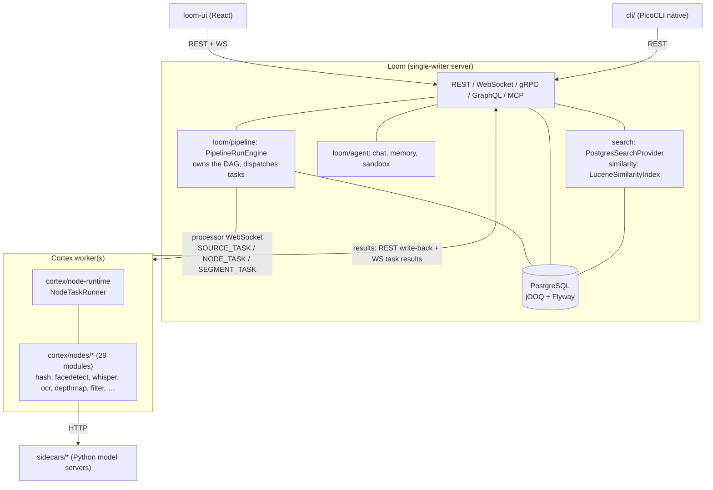

# MetaLoom — Project Context for AI Coding Agents

This document is the **entry point** for AI coding agents working on MetaLoom. It is an **index and
router**, not a second copy of the specs: it catalogues every file under `spec/`, tells you which
one to open, and carries the project-wide cheat sheet and gotchas. Everything else lives in the file
it belongs to.

> **Project root**: `/home/defaultuser/workspaces/metaloom/metaloom` — **spec root**: [spec/](.)

---

## 0. Read This First

### 0.1 Mandatory rules

Three files are **rules, not background**.

| File | What it binds you to |
|------|----------------------|
| [guidelines/CODING.md](guidelines/CODING.md) | **Definition of done for a code change** — REST path naming, endpoint + permission tests, DAO and delete-cascade tests, website docs, demo data, spec sync. Summarised in §0.2; the file is the authority. |
| [guidelines/NEW_NODE.md](guidelines/NEW_NODE.md) | **Definition of done for a new Cortex node** — module layout, ports, the `@Binds @IntoMap @StringKey` binding, descriptor, tests, docs. Read it *before* creating anything under `cortex/nodes/`. |
| [SPEC_RULES.md](guidelines/SPEC_RULES.md) | **Definition of done for a spec change** — progress checkboxes, Key Classes table, cross-references, diagrams, env-var tables, Conventions & Gotchas, "Where do I find…?" cheat sheet, git-HEAD footer. |

### 0.2 `guidelines/CODING.md` in one table

| Area | Rule | Practical consequence |
|------|------|-----------------------|
| **REST** | Method-carrying paths are always **plural** (`/chat-sessions`, `/node-results`) | Renaming a path is breaking — also update `loom-client/`, `loom-ui/src/api/`, OpenAPI docs |
| **REST** | Every endpoint has a `*EndpointTest` | An endpoint without one is unfinished |
| **REST** | Add **fine-grained permission** test cases | See [features/permissions/PERMISSIONS.md](features/permissions/PERMISSIONS.md); grant test perms via group+role, never direct user grants |
| **DAO** | Every DAO impl is covered by tests | Contract tests in `loom/db/api-test`, impl tests in `loom/db/jooq/src/test/` |
| **DAO** | `delete` needs **delete-cascade tests** | Over-deleting cascades are exactly what these catch |
| **Docs** | Customer-facing features get a page under `website/content/english/docs` | Customer tone, no spec references, no class names — [website/WEBSITE.md](website/WEBSITE.md) |
| **Demo** | New features need meaningful demo data | `DemoDatabaseInitializer` (`loom/core/.../boot/`) |
| **Spec** | A feature change **must** update its spec file | The code always wins on conflict — fix the spec in the same change |

### 0.3 Reading order for a new task

```
CONTEXT.md (this file)
   ├─ guidelines/CODING.md ............ rules for the change itself
   ├─ guidelines/NEW_NODE.md .......... additionally, if you are adding a Cortex node
   ├─ METALOOM.md ..................... big-picture module layout
   ├─ cortex/METALOOM_ARCHITECTURE.md . plain-language Loom↔Cortex model
   └─ the feature spec for your area (§2 / §2.1)
          └─ the component spec it references (loom/… or cortex/…)
                 └─ the *_TASKS.md file if you are picking up queued work
```

### 0.4 The one standing rule

**The code is the source of truth.** Where a spec and the code disagree, the code wins — and you fix
the spec in the same change. Every spec carries a verification date in its footer; treat anything
older than the last relevant commit as a claim to re-check, not a fact.

---

## 1. Project Overview

MetaLoom is a **Digital Asset Management platform**: point it at media and it works out what is in
it — hashes, faces, transcripts, thumbnails, text, depth, quality — then stores, indexes and exposes
that.

| Component | Role | Location |
|-----------|------|----------|
| **Loom** | Backend: REST/gRPC/GraphQL/MCP API, DB, auth, storage, pipeline engine, AI agent, search | `loom/` |
| **Cortex** | Worker process executing node tasks dispatched by Loom | `cortex/` |
| **CLI** | PicoCLI + Dagger client for Loom, shipped as a GraalVM native image | `cli/` |
| **loom-ui** | React / Vite / MUI web front end | `loom-ui/` |
| **loom-app** | Electron desktop wrapper — experiment, in no build ([loom-app/LOOM_APP.md](loom-app/LOOM_APP.md)) | `loom-app/` |
| **website** | Hugo marketing + customer documentation site | `website/` |
| **sidecars** | HTTP model servers ([sidecars/SIDECARS.md](sidecars/SIDECARS.md)) — six Python, one (`llamacpp`) a container; none in Helm yet | `sidecars/` |

Top-level reactor modules: `bom, loom-test-env, loom-shared, loom-client, cortex, loom, cli,
examples, integration-test, e2e-test, website`.



**Execution model (Variant C, built).** Loom owns the pipeline graph, persists run state, and
dispatches individual source/node/segment tasks to registered Cortex workers over the processor
WebSocket. Cortex holds no database and runs one task at a time per slot. Nodes exchange
`io.metaloom.cortex.api.node.payload.*` values over **typed ports**. See
[cortex/METALOOM_ARCHITECTURE.md](cortex/METALOOM_ARCHITECTURE.md).

**Key technologies** — Backend: Vert.x 5, Dagger 2, jOOQ, Flyway, PostgreSQL, RxJava 3. Processing:
OpenCV, InspireFace, whisper.cpp, Tesseract, Tika, vLLM/llama.cpp (OpenAI-compatible), Lucene. Frontend: React
18, Vite, TypeScript, MUI v5, React Flow, i18next. Testing: JUnit 5, Testcontainers, AssertJ,
Playwright.

---

## 2. Specification Index — Every File Under `spec/`

> ⚠️ Commercial and hosted-service planning lives in the sibling **`metaloom-saas`** checkout — §2.2.
> Nothing under `spec/` covers monetisation, pricing or running MetaLoom as a service.

127 files. Status markers: 🟢 built · 🟡 partly built · 🔵 plan/concept, not built.

```
spec/
├── METALOOM_CONTEXT.md                # ← THIS FILE — entry point and router
├── METALOOM.md                        # Big-picture module layout & framework map
├── GLOSSAR.md                         # Terminology
├── tasks/                             # Actionable work items + scratch. Format: TASKS.template.md
│   ├── TASKS.template.md              # Required format for every *_TASKS.md file
│   ├── METALOOM_NOTES.md              # Scratch backlog: raw ideas without a spec file yet
│   ├── WORKFLOW_TASKS.md              # NEW 2026-08-07 — W1–W15 for the workflows/ family.
│   │                                  #   W1 (FilterBy.TAG/RATING) is the keystone: without it no
│   │                                  #   pipeline can act on a human decision
│   ├── PIPELINE_TASKS.md              # Pipeline work items (Task 14: FilterPortResolver.asList)
│   ├── PERSISTENCE_TASKS.md           # Open persistence-layer gaps
│   ├── LOOM_UI_TASKS.md               # UI work items
│   ├── IMAGEGEN_NODE.md               # imagegen follow-ups
│   ├── METALOOM_ARCHITECTURE_TASK.md  # Open architecture tasks (+ explicitly dropped ideas)
│   └── METALOOM_CODEREVIEW.md         # Review findings
├── guidelines/
│   ├── SPEC_RULES.md                  # RULES for writing spec files
│   ├── CODING.md                      # RULES for code changes (REST/DAO/Docs/Demo/Spec)
│   ├── NEW_NODE.md                    # RULES for adding a Cortex node — read before cortex/nodes/*
│   └── METALOOM_STATIC_CODE_ANALYSIS.md
│                                      # PROMPT: audit Java for AI-generated defects (duplicate
│                                      #   methods, hallucinations, duplicate enum values,
│                                      #   self-contradicting values) → HTML report in spec/reports/
├── concept/
│   ├── ASSET_METADATA_WRITE.md        # 🔵 CONCEPT: a `metadata-write` node emitting sidecars /
│   │                                  #   embedded derivatives, incl. marking AI-written values
│   │                                  #   (IPTC DigitalSourceType, C2PA). The inverse of the built
│   │                                  #   `metadata` node under features/nodes/metadata/
│   └── NODE_TAG_CONCEPT.md            # 🟢 BUILT (cortex/nodes/tag): design record for the `tag` node —
│                                      #   declarative rules over wired ports, a `TagBy` seam like
│                                      #   `FilterBy`, and the provenance-guarded withdrawal rule.
│                                      #   Records the two write-path defects it had to fix first:
│                                      #   POST /assets/:uuid/tags INSERTed a new tag row, so a second
│                                      #   asset violated UNIQUE (name, collection)
├── plans/
│   ├── TASKS.md                       # Captured, not-yet-scheduled work (TASKS.template.md format)
│   ├── CLUSTERING.md                  # 🔵 Loom is single-writer; a 2nd instance is destructive
│   ├── NODE_REGISTRATION_PLAN.md      # 🔵 PLANNED: a Cortex worker announces its node specs
│   │                                  #   (cortexId + nodes[] keyed by nodeId) so custom nodes reach
│   │                                  #   the palette without rebuilding Loom. §5 derives the spec from
│   │                                  #   the node's own code; §7 adds the availability block
│   │                                  #   (available/lastSeen/providedBy) + the loom-ui task: live
│   │                                  #   palette refresh, offline nodes last, show-offline toggle.
│   │                                  #   Nothing built; §13 is the order
│   └── imagegen-node.md               # ⚠️ superseded draft — NODE_IMAGEGEN_PLAN.md is authoritative
├── chat/                              # The chat / agent feature family. Start at AGENTIC_CHAT_PLAN.md
│   ├── LOOM_UI_CHAT.md                # 🟢 The BUILT loop: agentic turn loop, SSE protocol, skills,
│   │                                  #   chat UI contract (moved here from loom/ui/CHAT.md)
│   ├── AGENTIC_CHAT_PLAN.md           # 🔵 NEW 2026-08-08 — the vision and the gap map. Five capability
│   │                                  #   tiers (retrieve/comprehend/act/produce/ship), what is missing
│   │                                  #   in backend, frontend and loop, and §6 the KEYSTONE gap:
│   │                                  #   there is NO ad-hoc node execution API. Read §6 before
│   │                                  #   designing anything that runs a node from chat
│   ├── CHAT_USER_REQUESTS.md          # 🔵 NEW 2026-08-08 — 88 user prompts worked through the stack,
│   │                                  #   24 extracted open spots (N1–N24) and a ranking of what blocks
│   │                                  #   the most. The top two blockers are reading data Loom already
│   │                                  #   computed
│   └── AGENTIC_CHAT_CONTEXT_DATA.md   # 🔵 NEW 2026-08-08 — how extracted metadata reaches the model.
│                                      #   Three layers: index (search_document, built) / dossier
│                                      #   (rendered ON READ, not materialized) / raw drill-down.
│                                      #   Rejects a per-asset markdown RAG corpus and a GraphQL agent
│                                      #   surface; recommends a bounded filter DSL. §7 flags the
│                                      #   two-whitelists hazard with search_extract_json_text
├── features/                          # Cross-cutting features (span Loom + Cortex + UI)
│   ├── DB_SCHEMA_FEEDBACK.md          # Schema audit vs. node results; resolved items marked in place
│   ├── chat/
│   │   ├── CHAT_MEMORY_PLAN.md        # 🟢 Agent memory bank (scoped markdown notes)
│   │   ├── CHAT_SESSIONS_CONCEPT.md   # 🟡 Sessions shipped (V2.52 + DAO + endpoints + UI);
│   │   │                              #   filesystem snapshot & run-time context assembly are not built
│   │   └── CHAT_TASKS.md              # 🟡 B1–B9 done; F1 (vLLM tool streaming throws) and
│   │                                  #   F2 (turn-granular abort) are open defects
│   ├── cli/
│   │   └── CLI_PLAN.md                # 🟢 The top-level cli/ module (native image)
│   ├── db/
│   │   └── DATABASE_TASKS.md          # Schema work for node-result persistence (V2.38–V2.50)
│   │                                  #   (⚠️ facedetection/FACE_WORKFLOW.md moved 2026-08-07 to
│   │                                  #    workflows/WORKFLOW_FACE.md — see the workflows/ block)
│   ├── helm/
│   │   ├── HELM_LOOM.md               # Loom chart (helm/loom) — 🔴 two live env-var bugs, see §6
│   │   └── HELM_CORTEX.md             # Cortex chart (helm/cortex) — custom-image override, StatefulSet id
│   ├── nodes/
│   │   ├── NODES.md                   # 🟢 The node system: lifecycle, ports, persistence, caching,
│   │   │                              #   registration counts, per-node options. Start here
│   │   ├── SERVICE_TIKA.md            # 🟡 The `tika` node — document body text (🔴 open defects)
│   │   ├── facedetect/
│   │   │   └── FACEDETECTION_OVERVIEW.md  # 🟢 Reference: face model landscape — InsightFace/
│   │   │                              #   InspireFace licensing (🔴 default pack is non-commercial),
│   │   │                              #   reverse-engineered pack format, permissive alternatives
│   │   │                              #   (YuNet/SFace), de-facto standard pipeline
│   │   ├── image-manipulation/
│   │   │   └── NODE_IMAGE_MANIPULATION.md  # 🟢 BUILT: the `image-manipulation` node — EXIF
│   │   │                              #   autorotate, crop, subject crop, aspect/VVS blur-pad,
│   │   │                              #   resize. Images only, ordered op chain, detections via port
│   │   ├── metadata/
│   │   │   └── METADATA_OVERVIEW.md   # 🟢 The `metadata` node — EXIF/GPS/IPTC/XMP/container
│   │   │                              #   metadata onto Dublin Core, into asset_json_comp +
│   │   │                              #   asset_geo_comp + search. Precedence rules, envelope
│   │   │                              #   contract, privacy policy; §11 tracks phases 2-3
│   │   └── sam2/
│   │       └── NODE_SAM2.md           # 🟢 BUILT: the `sam2` node — per-pixel segmentation via the
│   │                                  #   sidecar on :9130. AUTOMATIC/PROMPTED/TRACK, the three
│   │                                  #   coordinate spaces, ledger-only masks under sam2_bin
│   ├── ops/
│   │   ├── METRICS.md                 # 🟢 Prometheus /metrics on both components
│   │   └── MONITORING.md              # 🟢 Health & readiness endpoints
│   ├── permissions/
│   │   └── PERMISSIONS.md             # Authorization: model, taxonomy, enforcement points
│   ├── pipeline/
│   │   ├── PIPELINE.md                # 🟢 Technical spec: engine, persistence, protocol, schemas
│   │   ├── PIPELINE_FLOW.md           # Conceptual: WHAT travels between nodes — item vs ambient media
│   │   │                              #   reference vs per-port payload; why nothing accumulates
│   │   ├── NODE_DATA_TYPES.md         # 🟢 The typed-port model: family/subtype lattice, ONE/MANY
│   │   │                              #   cardinality, XOR groups, port-to-port edges, fan-out/gather
│   │   ├── NODE_DATA_TYPES_PLAN.md    # Design rationale + design-vs-implementation divergences
│   │   ├── NODE_SCHEMA_CONCEPT.md     # 🟡 Descriptors shipped (NodeDescriptor, /node-descriptors,
│   │   │                              #   generated snapshot, conformance test); the prose "node card"
│   │   │                              #   and a REST-served resolvePorts remain unbuilt
│   │   ├── PIPELINE_REQUIREMENTS.md   # Non-technical requirements + gap status
│   │   └── PIPELINE_TASKS.md          # Actionable pipeline work items
│   ├── pipeline-nodes/
│   │   ├── NODES.md                   # 🟢 Cortex node system + per-node reference
│   │   ├── SERVICE_IMAGE.md           # ⚪ loom/services/image — empty stub, zero consumers
│   │   ├── SERVICE_LOGGER.md          # ⚪ loom/services/logger — stub; real logging is loom/common
│   │   ├── SERVICE_PLUGINS.md         # ⚪ loom/services/plugins — marker interface only, no loader
│   │   ├── SERVICE_TIKA.md            # 🔴 loom/services/tika is a stub; the real node is
│   │   │                              #   cortex/nodes/tika — whose parser always returns null
│   │   ├── SERVICE_VIDEO.md           # ⚪ loom/services/video — empty stub, zero consumers
│   │   ├── NODE_DEDUP_PLAN.md         # 🟡 BUILT: V2.61/V2.62, 4 DEDUP permissions, DedupGroupDao,
│   │   │                              #   6 REST routes, 3 nodes, 3 descriptors. Review UI still a mock
│   │   ├── NODE_DEPTHMAP_PLAN.md      # 🟢 BUILT end to end incl. sidecars/depth (:9120)
│   │   ├── NODE_DOMINANT_COLOR_PLAN.md# 🟢 BUILT (CIELAB k-means, EN/DE naming)
│   │   ├── NODE_IMAGEGEN_PLAN.md      # 🟢 BUILT — authoritative over plans/imagegen-node.md
│   │   ├── NODE_S3SINK_PLAN.md        # 🟢 BUILT (phase 1) — kind s3-sink
│   │   ├── NODE_CLOUDSOURCE_PLAN.md   # 🟢 BUILT — kinds gdrive-source + onedrive-source and the
│   │   │                              #   shared cortex/cloud-common module (Drive v3 + MS Graph)
│   │   ├── NODE_S3SOURCE_PLAN.md      # 🟢 BUILT — kind s3-source + the shared cortex/s3-common module
│   │   ├── NODE_SAM2_PLAN.md          # 🟢 BUILT end to end incl. sidecars/sam2 (:9130) — kind sam2,
│   │   │                              #   3 modes, ledger-only, first producer of struct/masks
│   │   ├── NODE_SCENE_LAYOUT_PLAN.md  # 🟡 BUILT (12 spatial-relation predicates); objectdetect is
│   │   │                              #   still faces-only
│   │   ├── NODE_SCRIPT_PLAN.md        # 🟢 BUILT (GraalJS, declared multi-valued outputs)
│   │   ├── NODE_SENTIMENT_PLAN.md     # 🟢 BUILT (EN/DE, commercial-license models, sidecar)
│   │   ├── NODE_VIDEO_CAPTIONING_PLAN.md   # 🟢 BUILT — not a kind of its own: it is captioning's
│   │   │                                   #   videoStrategy
│   │   ├── NODE_VIDEO_CAPTIONING_REPORT.md # Benchmark report (real runs, Qwen2.5-VL-7B)
│   │   ├── NODE_WATERMARK_PLAN.md     # 🟢 BUILT — kind watermark
│   │   └── video-captioning-results/  # Raw benchmark data (JSON + RUN_ENV.txt)
│   ├── rbac/
│   │   └── RBAC.md                    # RBAC reference incl. known enforcement gaps (overlaps
│   │                                  #   PERMISSIONS.md — see §7)
│   ├── rest/
│   │   ├── REST_BINARY_HANDLING.md    # 🟢 Binary bytes over REST: byte-carrying routes, content-
│   │   │                              #   addressed layout, filesystem/S3 per asset_pool, Range
│   │   │                              #   downloads, reference-counted reclaim
│   │   └── REST_CORTEX_METADATA_BINARY_HANDLING_PLAN.md
│   │                                  # 🔵 PLAN: how Cortex pushes produced artefacts + metadata
│   │                                  #   into Loom. Loom-side counterpart of NODE_S3SINK phases 2+3
│   └── search/
│       ├── SEARCH.md                  # 🟡 Lexical search SHIPPED: V2.57–V2.59 search_document +
│       │                              #   triggers, PostgresSearchProvider, SearchEndpoint,
│       │                              #   10 LOOM_SEARCH_* options. Consumers are the gap: no UI,
│       │                              #   no GraphQL field, MCP tools still bypass it
│       ├── SEARCH_PLAN.md             # Build order: P0 prereqs ✅ → P1 Postgres ✅ → P2 Elasticsearch 🔵
│       ├── SEMANTIC_SEARCH.md         # 🔵 Vector search NOT built (no pgvector/HNSW, embedding has
│       │                              #   zero producers, qdrant is pom-only) — but the seams shipped:
│       │                              #   SearchMode.SEMANTIC/HYBRID, SearchCapability, honest 400
│       └── LUCENE_PLAN.md             # 🟢 BUILT: loom/services/lucene LuceneSimilarityIndex,
│                                      #   SimilarityModule, LOOM_SIMILARITY_* (default off),
│                                      #   /similarity-index/rebuild, /assets/:uuid/similar-assets
├── cortex/
│   ├── BUILD.md                       # Maven modules, container image, native deps
│   ├── CONFIGURATION.md               # YAML config, CLI flags, env vars, per-node options
│   ├── CORTEX.md                      # Architecture, module map, startup lifecycle, CLI
│   ├── METALOOM_ARCHITECTURE.md       # Plain-language Loom↔Cortex interaction (as built)
│   ├── METALOOM_ARCHITECTURE_TASK.md  # Open architecture tasks (+ explicitly dropped ideas)
│   └── METALOOM_ARCHITECTURE_V2_PLAN_C.md  # Variant C build record — COMPLETE (merge candidate, §7)
├── loom/
│   ├── BUILD.md                       # Loom build pipeline
│   ├── CONFIGURATION.md               # LoomOptions, config file, env vars, validation
│   ├── DOMAIN.md                      # Domain entities by group, derived from migrations
│   ├── EVENTBUS.md                    # Pipeline events, Vert.x EventBus, WS fan-out
│   ├── GRAPHQL.md                     # 🟢 GraphQL API — registered and reachable (/api/v1/graphql)
│   ├── GRPC.md                        # gRPC API (asset, health, reflection)
│   ├── LOOM.md                        # Main entry point: architecture, modules, lifecycle, DI
│   ├── MCP.md                         # Model Context Protocol server
│   ├── PERSISTENCE.md                 # DAO layer, jOOQ, Flyway, test infrastructure
│   ├── PERSISTENCE_TASKS.md           # Open persistence-layer gaps
│   ├── RESTAPI.md                     # REST endpoints, auth, clients, OpenAPI
│   ├── SERVER.md                      # Server startup & lifecycle
│   ├── WEBSOCKET.md                   # Processor WS + pipeline-events WS protocols
│   └── ui/
│       ├── CHAT.md                    # Chat / Loom Agent: agentic loop, streaming, skills
│       │                              #   (~80% server-side — move candidate, §7)
│       ├── LOOM_UI.md                 # Loom UI specification
│       ├── LOOM_UI_UPLOAD.md          # 🟢 Upload screen: background queue, multi-file drag & drop,
│       │                              #   progress/cancel/retry, library → pool targeting
│       ├── PIPELINE_EDITOR.md         # Product pipeline editor: React Flow canvas, CRUD, validation
│       ├── TASK_UI_AI_ML.md           # UI gap tasks: embeddings, clusters, detections, persons
│       ├── TASK_UI_ASSETS_MEDIA.md    # UI gap tasks: assets, locations, pools, attachments
│       ├── TASK_UI_CHAT.md            # UI chat tasks U1–U8 — all done, records outcomes
│       ├── TASK_UI_COLLABORATION.md   # UI gap tasks: tasks, comments, reactions
│       ├── TASK_UI_IDENTITY_ACCESS.md # UI gap tasks: users, groups, roles, permissions, tokens
│       ├── TASK_UI_ORGANIZATION.md    # UI gap tasks: collections, libraries, spaces, tags
│       ├── TASK_UI_PIPELINE.md        # UI gap tasks: pipelines, runs, node tasks, editor
│       └── TASK_UI_SYSTEM.md          # UI gap tasks: system info, monitoring, health
├── loom-app/
│   └── LOOM_APP.md                    # ⚪ Electron desktop shell — experiment, not in any build;
│                                      #   app:// scheme serves a copied loom-ui build
├── sidecars/                          # HTTP model servers. NONE is in Helm or covered by a test;
│   │                                  #   only llamacpp is containerised — see SIDECARS.md
│   ├── SIDECARS.md                    # Index: ports, consumers, deployment status
│   ├── DEPTH_SIDECAR.md               # :9120 — Depth-Anything-V2 / ZoeDepth → NEARNESS map
│   ├── IDEOGRAM_SIDECAR.md            # :9200 — SDXL-Turbo / Ideogram-4 nf4 image generation
│   ├── LLAMACPP_SIDECAR.md            # :8080 — llama.cpp official image (docker OR podman), the
│   │                                  #   llm/translate backend. No Python; verified live
│   ├── LTX2_SIDECAR.md                # :9220 — LTX-2 video+audio generation (dual nf4, 24 GB)
│   ├── MAGE_FLOW_SIDECAR.md           # :9210 — Mage-Flow 4B, MIT weights; imagegen's other backend
│   ├── SENTIMENT_SIDECAR.md           # :9110 — DE/EN/multilingual 3-class sentiment
│   └── TTS_SIDECAR.md                 # :9100 — Orpheus (DE) / Kokoro (EN) text-to-speech
├── website/
│   ├── WEBSITE.md                     # Hugo site: content, build, publish (incl. /tour/, /studio/)
│   └── WEBSITE_PIPELINE_EDITOR.md     # /pipeline-editor/ — backend-free in-browser editor + simulator
└── workflows/                         # NEW 2026-08-07 — the human-in-the-loop review family.
    │                                  #   A workflow = a queue of machine proposals + a durable human
    │                                  #   decision + something that acts on it. All six shipped modes
    │                                  #   are ONE screen: loom-ui/.../workflow/WorkflowView.tsx
    ├── WORKFLOWS.md                   # ← START HERE. Index + family definition, the 7-piece anatomy
    │                                  #   a new workflow must implement (§3), and 10 cross-cutting
    │                                  #   defects X1–X10 (§4) that are NOT repeated per file.
    │                                  #   🔴 Of six shipped modes, exactly one writes to the server
    ├── WORKFLOW_MANUAL_SORT.md        # 🟡 Rate + tag. Rating persists (as a reaction); 🔴 tagging
    │                                  #   writes nothing, and no filter/trigger can read either
    ├── WORKFLOW_DEDUP.md              # 🟡 The review half of dedup. Backend complete; 🔴 the screen
    │                                  #   is a mock. Node detail stays in concept/NODE_DEDUP_PLAN.md
    ├── WORKFLOW_TRASH.md              # 🔵 Marker (tag) → filter → a NEW `move` node. 🔴 cross-device
    │                                  #   moves silently copy; asset_location.filekey_stdev already
    │                                  #   records the device id
    ├── WORKFLOW_FACE.md               # 🟡 detect → embed → cluster → confirm a person. Stages 1–2
    │                                  #   run (embeddings built 2026-08-06); 🔴 no clustering code
    │                                  #   and `cluster.creator_uuid` NOT NULL blocks a worker
    ├── WORKFLOW_OBJECT_DETECT.md      # 🔴 Blocked at the schema: `detection` has no review status.
    │                                  #   Also: objectdetect is NOT faces-only, and the UI's
    │                                  #   DetectionResponse omits `label`
    ├── WORKFLOW_UPLOAD.md             # 🟢 BUILT: asset.created → PipelineMatcher (mime patterns in
    │                                  #   pipeline_version.meta.trigger) → runForAsset. 🔴 a 503 is
    │                                  #   only logged, and there is no backfill
    ├── WORKFLOW_AI_REVIEW.md          # 🔵 simple — approve/edit/reject machine-written text
    ├── WORKFLOW_COLLECTION_CURATION.md# 🔵 simple — build a collection at keyboard speed (no schema)
    ├── WORKFLOW_METADATA_REPAIR.md    # 🔵 medium — flag and bulk-fix implausible dates/GPS/rights
    ├── WORKFLOW_SAFETY_TRIAGE.md      # 🔵 medium — uphold/overturn a `guard` verdict; restricted
    │                                  #   by default is the hard part
    ├── WORKFLOW_INGEST_MIGRATION.md   # 🔵 complex — onboard an existing corpus; reconciliation is
    │                                  #   the missing phase and the failure mode is silent data loss
    └── WORKFLOW_RIGHTS_RELEASE.md     # 🔵 very complex — the gate before an asset leaves: consent,
                                       #   safety, licence, AI provenance, redaction
```

### 2.1 Which file do I open?

| I am working on… | Start with |
|------------------|------------|
| Anything at all | [guidelines/CODING.md](guidelines/CODING.md), then this file |
| **Adding a Cortex node** | [guidelines/NEW_NODE.md](guidelines/NEW_NODE.md) (rules) + [features/pipeline-nodes/NODES.md](features/nodes/NODES.md) (system) |
| **Auditing existing Java** (duplicates, hallucinations, contradictions) | [guidelines/METALOOM_STATIC_CODE_ANALYSIS.md](guidelines/METALOOM_STATIC_CODE_ANALYSIS.md) |
| Understanding the system end to end | [cortex/METALOOM_ARCHITECTURE.md](cortex/METALOOM_ARCHITECTURE.md), then [METALOOM.md](METALOOM.md) |
| Pipelines (engine, runs, dispatch) | [features/pipeline/PIPELINE.md](features/pipeline/PIPELINE.md) |
| "What actually travels between nodes?" — the mental model | [features/pipeline/PIPELINE_FLOW.md](features/pipeline/PIPELINE_FLOW.md) |
| Node inputs/outputs — ports, content types, cardinality, fan-out | [features/pipeline/NODE_DATA_TYPES.md](features/pipeline/NODE_DATA_TYPES.md) (built model); [NODE_DATA_TYPES_PLAN.md](concept/NODE_DATA_TYPES_PLAN.md) for rationale and divergences |
| Node descriptors / the palette / validating a graph outside the JVM | [features/pipeline/NODE_SCHEMA_CONCEPT.md](concept/NODE_SCHEMA_CONCEPT.md) — descriptors are built; the "node card" prose format is not |
| A REST endpoint | [loom/RESTAPI.md](loom/RESTAPI.md) + [features/permissions/PERMISSIONS.md](features/permissions/PERMISSIONS.md) |
| Binary upload/download, storage layout, S3 vs filesystem | [features/rest/REST_BINARY_HANDLING.md](features/rest/REST_BINARY_HANDLING.md) |
| Getting Cortex-produced artefacts (thumbnails, depth maps, TTS) into Loom | [features/rest/REST_CORTEX_METADATA_BINARY_HANDLING_PLAN.md](concept/REST_CORTEX_METADATA_BINARY_HANDLING_PLAN.md) — **plan**; the endpoints it needs exist |
| A DAO / migration | [loom/PERSISTENCE.md](loom/PERSISTENCE.md) + [loom/DOMAIN.md](loom/DOMAIN.md) |
| Permissions / authorization | [features/permissions/PERMISSIONS.md](features/permissions/PERMISSIONS.md), [features/rbac/RBAC.md](features/rbac/RBAC.md) |
| Chat / AI agent / skills / memory | [chat/LOOM_UI_CHAT.md](chat/LOOM_UI_CHAT.md), [features/chat/CHAT_MEMORY_PLAN.md](features/chat/CHAT_MEMORY_PLAN.md), open defects in [tasks/CHAT_TASKS.md](tasks/CHAT_TASKS.md) |
| **What the chat agent should become** — capability tiers, the gap map, the roadmap | [chat/AGENTIC_CHAT_PLAN.md](chat/AGENTIC_CHAT_PLAN.md). 🔴 §6: **ad-hoc node execution does not exist** — `POST /pipelines/:uuid/run` needs a stored pipeline, and per-node re-execution only works inside a live, breakpointed run |
| **What users will ask the chat, and whether Loom can answer** | [chat/CHAT_USER_REQUESTS.md](chat/CHAT_USER_REQUESTS.md) — 88 prompts, 24 open spots, ranked by what blocks the most |
| **Getting node results (faces, captions, GPS, transcripts, detections) in front of the model** | [chat/AGENTIC_CHAT_CONTEXT_DATA.md](chat/AGENTIC_CHAT_CONTEXT_DATA.md) — render on read, do **not** materialize a markdown corpus per asset; `search_document` is already the precomputed text layer |
| The UI | [loom/ui/LOOM_UI.md](loom/ui/LOOM_UI.md) + the matching `TASK_UI_*.md` |
| **Uploading media from the UI** (background queue, progress, which pool receives the bytes) | [loom/ui/LOOM_UI_UPLOAD.md](loom/ui/LOOM_UI_UPLOAD.md) — **shipped**; the endpoint contract itself is in [features/rest/REST_BINARY_HANDLING.md](features/rest/REST_BINARY_HANDLING.md) |
| Metrics / health / readiness | [features/ops/METRICS.md](features/ops/METRICS.md), [features/ops/MONITORING.md](features/ops/MONITORING.md) |
| The CLI | [features/cli/CLI_PLAN.md](features/cli/CLI_PLAN.md) |
| **Face detection/recognition models & their licences** | [features/nodes/facedetect/FACEDETECTION_OVERVIEW.md](features/nodes/facedetect/FACEDETECTION_OVERVIEW.md) — 🔴 the default InspireFace pack is **non-commercial**; also documents the pack format and permissive alternatives |
| **Anything a human reviews in bulk** — rating, tagging, confirming, rejecting | [workflows/WORKFLOWS.md](workflows/WORKFLOWS.md) — the family index. Read §3 (the 7-piece anatomy) before adding a workflow and §4 (defects X1–X10) before debugging one. 🔴 Of six shipped modes, exactly one writes to the server |
| **The face identity workflow** — detect → embed → cluster → confirm a person | [workflows/WORKFLOW_FACE.md](workflows/WORKFLOW_FACE.md) — 🟡 **stages 1–2 of 4 run.** Detections and embeddings persist; there is no clustering code and `cluster.creator_uuid` is `NOT NULL`, so a worker cannot write one. ⚠️ moved here from `features/facedetection/` on 2026-08-07; ⚠️ not to be confused with [concept/CLUSTERING.md](concept/CLUSTERING.md), which is about multi-instance deployment |
| Reviewing dedup candidates (the human step) | [workflows/WORKFLOW_DEDUP.md](workflows/WORKFLOW_DEDUP.md) — the workflow half; the nodes and algorithm stay in [concept/NODE_DEDUP_PLAN.md](concept/NODE_DEDUP_PLAN.md) |
| Confirming or rejecting object detections | [workflows/WORKFLOW_OBJECT_DETECT.md](workflows/WORKFLOW_OBJECT_DETECT.md) — 🔴 `detection` has no review status, so the decision has nowhere to go |
| **What happens after a file is uploaded** — which pipeline runs and why | [workflows/WORKFLOW_UPLOAD.md](workflows/WORKFLOW_UPLOAD.md) — 🟢 built. The trigger is untyped JSON in `pipeline_version.meta.trigger`, matched on mime type only |
| Moving or disposing of an asset's bytes from a pipeline | [workflows/WORKFLOW_TRASH.md](workflows/WORKFLOW_TRASH.md) — 🔵 the `move` node does not exist; 🔴 cross-device moves silently copy |
| Making a rating or a tag actually *do* something | [workflows/WORKFLOW_MANUAL_SORT.md](workflows/WORKFLOW_MANUAL_SORT.md) §5 — 🔴 `FilterBy` has no `TAG`/`RATING` strategy, which is why every manual decision is inert. Task W1 in [tasks/WORKFLOW_TASKS.md](tasks/WORKFLOW_TASKS.md) |
| **Segmentation** — masks rather than boxes, and video object tracking | [features/nodes/sam2/NODE_SAM2.md](features/nodes/sam2/NODE_SAM2.md) — the `sam2` node + its :9130 sidecar. 🔴 the only per-pixel geometry in the tree, and it is **ledger only**: masks are worker-local files, so there is no way to query them |
| **Lexical search** (`/api/v1/search/*`, `search_document`, ranking) | [features/search/SEARCH.md](features/search/SEARCH.md) — **shipped**; remaining phases in [SEARCH_PLAN.md](concept/SEARCH_PLAN.md) |
| Embeddings / semantic / hybrid search | [features/search/SEMANTIC_SEARCH.md](features/search/SEMANTIC_SEARCH.md) — **not built**; the API seams exist and reject with 400 |
| Perceptual **fingerprint** similarity (near-duplicate video) | [features/search/LUCENE_PLAN.md](concept/LUCENE_PLAN.md) — **built**, off by default |
| Deduplication (discover, review, apply) | [features/pipeline-nodes/NODE_DEDUP_PLAN.md](concept/NODE_DEDUP_PLAN.md) — nodes + REST built, review UI is a mock |
| S3 as a source or sink | [NODE_S3SOURCE_PLAN.md](concept/NODE_S3SOURCE_PLAN.md), [NODE_S3SINK_PLAN.md](concept/NODE_S3SINK_PLAN.md) — also the only home of the `cortex/s3-common` design |
| Google Drive / OneDrive / SharePoint as a source | [NODE_CLOUDSOURCE_PLAN.md](concept/NODE_CLOUDSOURCE_PLAN.md) — also the only home of the `cortex/cloud-common` design, and of why a rename is detectable there but not on S3 |
| Running more than one Loom instance / per-process state | [CLUSTERING.md](concept/CLUSTERING.md) — 🔴 Loom is **single-writer** (`replicaCount: 1`) |
| Helm deployment | [features/helm/HELM_LOOM.md](features/helm/HELM_LOOM.md), [features/helm/HELM_CORTEX.md](features/helm/HELM_CORTEX.md) |
| Customer-facing docs | [website/WEBSITE.md](website/WEBSITE.md) |
| The website's in-browser editor + simulator | [website/WEBSITE_PIPELINE_EDITOR.md](website/WEBSITE_PIPELINE_EDITOR.md) — distinct from the product editor in [loom/ui/PIPELINE_EDITOR.md](loom/ui/PIPELINE_EDITOR.md) |
| The commercial edition / hosted service | ➜ **sibling repo** `metaloom-saas` — see §2.2 |
| Picking up queued work | any `*_TASKS.md` incl. [plans/TASKS.md](plans/TASKS.md), format per [TASKS.template.md](tasks/TASKS.template.md) |
| **Metadata inside asset files** (EXIF, GPS, XMP, IPTC, Dublin Core, licence/rights) | [features/nodes/metadata/METADATA_OVERVIEW.md](features/nodes/metadata/METADATA_OVERVIEW.md) — 🟢 **built**: the `metadata` node. Also the only place that records the source-precedence rules, the envelope contract, and where a licence should live |
| **Writing metadata back into files** — sidecars, embedded copies, marking AI-generated content, redaction on export | [concept/ASSET_METADATA_WRITE.md](concept/ASSET_METADATA_WRITE.md) — 🔵 **concept, nothing built**. Obeys the attachment-vs-new-asset decision in [features/rest/REST_CORTEX_METADATA_BINARY_HANDLING_PLAN.md](concept/REST_CORTEX_METADATA_BINARY_HANDLING_PLAN.md) §2 |
| **Tagging assets automatically** — the `tag` node, and the tag write path in general | [concept/NODE_TAG_CONCEPT.md](concept/NODE_TAG_CONCEPT.md) — 🟢 built. The design record; [features/nodes/NODES.md](features/nodes/NODES.md) §3.4 is the current-state reference. 🔴 §2 is why `tagAsset` resolves rather than inserts |
| Dumping a half-formed idea | [METALOOM_NOTES.md](tasks/METALOOM_NOTES.md) — scratch only, promoted to a real spec once it has teeth |

### 2.2 The `metaloom-saas` sibling project

```
workspaces/metaloom/
├── metaloom/          ← this repo (the product)
└── metaloom-saas/     ← the SaaS/commercial project (~15 spec files)
```

| Moved from | Now at |
|---|---|
| `spec/METALOOM_STUDIO_PLAN.md` | [`../../metaloom-saas/spec/METALOOM_STUDIO_PLAN.md`](../../metaloom-saas/spec/METALOOM_STUDIO_PLAN.md) |
| `spec/saas/*.md` (13 files) | [`../../metaloom-saas/spec/`](../../metaloom-saas/spec/) — start at [README.md](../../metaloom-saas/spec/README.md) |

⚠️ Those relative links only resolve when both repos sit side by side under a common parent.

**Which repo does a task belong to?** Loom, Cortex, the UI, `helm/`, the website → **this repo**.
Pricing, tenants, provisioning, billing, control plane, portal, Terraform → **`metaloom-saas`**.
The one genuine overlap is
[LOOM_HOSTED_MODE.md](../../metaloom-saas/spec/LOOM_HOSTED_MODE.md), which specifies changes to
**this** repo's source (`B1`–`B11`, `N1`–`N7`). Several are plain bugs that hurt self-hosted users
today (the Helm env-var mismatches in §6) and get fixed here regardless.

### 2.3 Feature specs vs. component specs

- **`features/`** — a capability spanning more than one component. Read first when working on that
  capability end to end.
- **`loom/`, `cortex/`** — component-scoped architecture, configuration and build.
- **`guidelines/`** — rules that apply regardless of component.
- **`*_TASKS.md`** — actionable work items only; they follow [TASKS.template.md](tasks/TASKS.template.md)
  and record outcomes once done, so a task file doubles as a change log.

⚠️ The pipeline feature was previously spread over five overlapping files. They were merged and
deleted on 2026-07-18; `features/pipeline/` is the only source. Do not restore them.

---

## 3. Components — Pointers, Not Recaps

Module layouts, lifecycles and per-class detail live in the component specs. This section only says
where to go and what to run.

| Component | Read | Notes |
|-----------|------|-------|
| **Loom** (`loom/`) | [loom/LOOM.md](loom/LOOM.md) — architecture, module layout, lifecycle, Dagger DI | Pipeline execution is in [features/pipeline/PIPELINE.md](features/pipeline/PIPELINE.md); authorization in [features/permissions/PERMISSIONS.md](features/permissions/PERMISSIONS.md) — **not** in the component files |
| **Cortex** (`cortex/`) | [cortex/CORTEX.md](cortex/CORTEX.md) — module map, startup, online/offline | Online when `LOOM_HOST`+`LOOM_PORT` are set (registers over the processor WS). Cortex has no CLI — it is a container configured by env + `cortex.yml`, and offline means it simply idles |
| **CLI** (`cli/`) | [features/cli/CLI_PLAN.md](features/cli/CLI_PLAN.md) | Replaced the dead `loom/cli` stub. ⚠️ `./build.sh` does **not** invoke `cli/build-native.sh` — build the native image yourself |
| **loom-ui** (`loom-ui/`) | [loom/ui/LOOM_UI.md](loom/ui/LOOM_UI.md) + [loom/ui/LOOM_UI_UPLOAD.md](loom/ui/LOOM_UI_UPLOAD.md) + `TASK_UI_*.md` | Component tests are Playwright **mocked** e2e specs; pure logic uses node-env vitest. No RTL/jsdom. ⚠️ `npx` stalls in the sandbox — use `./node_modules/.bin/{vitest,playwright}` |
| **website** (`website/`) | [website/WEBSITE.md](website/WEBSITE.md) | 🔴 New customer-facing features **must** get a page under `website/content/english/docs` |
| **integration-test/** | `AbstractIntegrationTest` + per-node Cortex E2E tests | Runs against the **packaged** shaded `cortex/cli` JAR and image — rebuild both after a Cortex change |
| **e2e-test/** | `E2ETest` against a packaged container deployment | `mvn test -Dloom.external=true -pl e2e-test` targets an already-running container |
| **examples/** | `cortex-custom/`, `cortex-custom-node/` | Extending Cortex with custom code and custom nodes |

**Cortex module set** (`cortex/`): `api`, `common`, `core`, `core-media` (value types
`WhisperResult`/`Scene` + AssertJ helpers only), `cli`, `container`, `fs` (empty shell — the scanner
is the external `io.metaloom.fs` artifact), `llm-common`, `node-runtime`, `nodes/` (**29 modules**), `pipeline-api`,
`pipeline-common`, `pipeline-core`, `processor`, `s3-common`, `cloud-common`.

### 3.1 Key classes reference

| Class | Package | Purpose |
|-------|---------|---------|
| `LoomImpl` | `io.metaloom.loom.core` | Entry point; builds the Dagger component, runs bootstrap |
| `BootstrapInitializer` | `io.metaloom.loom.core.boot` | Startup/shutdown sequence (🔴 no JVM shutdown hook — see §6) |
| `DemoDatabaseInitializer` | `io.metaloom.loom.core.boot` | Demo data — **extend when adding a feature** (CODING.md) |
| `LoomCoreComponent` | `io.metaloom.loom.core.dagger` | Dagger component wiring all services, incl. `SearchModule`, `SimilarityModule` |
| `RESTService` | `io.metaloom.loom.rest` | REST router; endpoints injected via `EndpointModule` |
| `PipelineRunEngine` | `io.metaloom.loom.pipeline.engine` | Owns run state; walks the graph, dispatches tasks |
| `NodeDispatcher` / `RunStateStore` | `io.metaloom.loom.pipeline.engine` | Task dispatch to workers / durable run+item state |
| `PipelineGraphParser` | `io.metaloom.loom.pipeline.graph` | Parses definition JSON into a `PipelineGraph`; rejects `dependencies[]` |
| `PipelineSegmenter` | `io.metaloom.loom.pipeline.graph` | Groups nodes into affinity segments |
| `PostgresSearchProvider` | `io.metaloom.loom.db.jooq.search` | Lexical search over `search_document` (tsvector + pg_trgm) |
| `LuceneSimilarityIndex` | `io.metaloom.loom.similarity.lucene` | Fingerprint HNSW index behind the `SimilarityIndex` SPI |
| `NodeDescriptor` / `NodeDescriptorProvider` | `io.metaloom.loom.nodes.spec` | Palette + port contract; **39 kinds** from a generated resource (2 providers since `d9bbc2dc`), ServiceLoader-discovered |
| `MemoryService` | `io.metaloom.loom.agent.memory` | Scoped markdown memory bank for the chat agent |
| `CortexImpl` | `io.metaloom.cortex.impl` | Cortex lifecycle; **registers a shutdown hook** that drains in-flight work |
| `LoomControlChannel` | `io.metaloom.cortex.impl.loom` | WebSocket client to Loom: registration, heartbeat, tasks, reconnect |
| `PipelineTaskHandler` | `io.metaloom.cortex.impl.loom` | Runs `SOURCE_TASK` / `NODE_TASK` / `SEGMENT_TASK` |
| `RegistryNodeRegistrar` | `io.metaloom.cortex.cli.dagger` | Fills the node registry at bootstrap from the `@StringKey` map + the source producers |
| `RegistryNodeFactory` | `io.metaloom.cortex.pipeline.loader` | Maps a JSON node `type` to a node; **unknown → `null`, the task fails** |
| `NodeTaskRunner` | `io.metaloom.cortex.runtime` | Executes one node task; exceptions become `FAILED` results |
| `NodeResultMapper` | `io.metaloom.cortex.runtime` | `toWireState`: SUCCESS→COMPLETED, SKIPPED→SKIPPED, FAILED/null→FAILED |

### 3.2 Build & run commands

```bash
./build.sh              # Full build (Maven + UI + containers) — does NOT build the CLI native image
mvn -T 8 test-compile -q -DskipTests   # Fast compile check
./setup-pool.sh         # (RE)INITIALIZE THE TEST DB POOL — required before tests
./it.sh                 # Integration tests          ./e2e.sh   # End-to-end tests
./start-postgres.sh     # Local Postgres             ./ui.sh    # UI dev server
./start-server.sh       # Loom server                ./start-cortex.sh  # Cortex worker
./start-demo.sh         # Demo stack (Postgres + Loom + Cortex)

mvn -T 8 clean package -DskipTests -pl cortex -am        # All Cortex modules
mvn -T 8 clean package -DskipTests -pl cortex/cli -am    # Shaded CLI/daemon JAR
cortex/container/build-container.sh                      # Cortex container image
```

🔴 **`./setup-pool.sh` is mandatory** before running tests, and again after **any** Flyway migration
change — otherwise the pooled databases are stale and failures are misleading.

---

## 4. Cross-Cutting Concerns

### 4.1 Authentication & authorization

| Surface | Mechanism |
|---------|-----------|
| REST API | JWT bearer tokens (HMAC-signed), `__Host-loom_token` cookie |
| WebSocket | `?token=<jwt>` query parameter (browsers cannot set headers on WS upgrade); strict vs lenient via `LOOM_WS_STRICT_AUTH` |
| OAuth2 | BFF pattern with PKCE (Keycloak, Auth0, Okta) |
| API tokens | CRUD at `/api/v1/tokens`, with scoped permissions |
| Permissions | Vert.x `PermissionBasedAuthorization` (`CREATE_USER`, `READ_ASSET`, `READ_DEDUP`, `READ_SEARCH`, …) |

Details: [features/permissions/PERMISSIONS.md](features/permissions/PERMISSIONS.md) and
[features/rbac/RBAC.md](features/rbac/RBAC.md).

### 4.2 Database & persistence

| Layer | Technology |
|-------|------------|
| Primary DB | PostgreSQL |
| ORM | jOOQ (generated into `loom/db/jooq/src/jooq/java`) |
| Migrations | Flyway — `loom/db/flyway/src/main/resources/db/migration/` |
| DAO pattern | Interface in `loom/db/api`, impls in `loom/db/jooq` (prod) and `loom/db/memory` (tests, ⚠️ no pipeline DAOs) |
| Test DB | Leased from the external `testdatabase-provider` service via `loom-test-env` |

### 4.3 Event systems

| System | Scope | Transport | Purpose |
|--------|-------|-----------|---------|
| Cortex PipelineEventBus | In-process (Cortex) | Java pub/sub | Internal node coordination, caching |
| Vert.x EventBus | Loom | Vert.x EventBus | MCP tool dispatch only (`mcp.tool.<name>`) |
| Processor WebSocket | Loom ↔ Cortex | Raw `ServerWebSocket` | Registration, heartbeat, task dispatch & results |
| Pipeline-events WebSocket | Loom → UI | Raw `ServerWebSocket` | Fan-out of run/node events to browsers |

### 4.4 Loom environment variables

Full list: [loom/CONFIGURATION.md](loom/CONFIGURATION.md). Declared via `@EnvironmentVariable` on the
options classes in `loom-shared/api/.../options/`.

| Variable | Default | Purpose |
|----------|---------|---------|
| `LOOM_NAME` | — | Instance name |
| `LOOM_SERVER_REST_PORT` | `8092` | REST/WebSocket port |
| `LOOM_SERVER_GRPC_PORT` / `_BIND_ADDRESS` | `8091` | gRPC listener |
| `LOOM_SERVER_MON_PORT` | `8989` | Monitoring/health/metrics port |
| `LOOM_SERVER_MCP_PORT` | `4041` | MCP server port |
| `LOOM_DB_HOST` / `_PORT` / `_NAME` / `_USERNAME` / `_PASSWORD` | `5432` (port) | PostgreSQL connection — 🔴 note the Helm bug in §6 |
| `LOOM_DB_MIN_POOL_SIZE` / `_MAX_POOL_SIZE` | — | Connection pool sizing |
| `LOOM_INITIAL_PASSWORD` | — | Bootstrap admin password |
| `LOOM_TOKEN_EXPIRATION_TIME` | — | JWT lifetime |
| `LOOM_STORAGE_UPLOAD_DIR` | — | Upload storage directory |
| `LOOM_OAUTH*` | — | OAuth2 provider settings (Keycloak/Auth0/Okta) |
| `LOOM_WS_STRICT_AUTH` | lenient | Reject unauthenticated WebSocket upgrades (read directly via `System.getenv`) |
| `LOOM_MCP_AUTH_ENABLED` / `_STRICT_MODE` / `_ALLOWED_ORIGINS` | — | MCP authentication |
| `LOOM_AI_ENABLED` / `_PROVIDER_TYPE` / `_URL` / `_MODEL_ID` | — | Chat agent LLM provider |
| `LOOM_AI_STREAMING` / `_THINK_ENABLED` / `_MAX_TURNS` / `_CONTEXT_WINDOW` / `_TOOL_TIMEOUT_MS` / `_TITLE_GENERATION` | — | Agentic loop tuning |
| `LOOM_AGENT_MEMORY_MOUNT_PATH` / `_MAX_SCOPE_BYTES` | — | Agent memory bank |
| `LOOM_AGENT_SANDBOX_*` | — | Coding sandbox (namespace, limits, timeouts, workspace size) |
| `LOOM_SEARCH_ENABLED` / `_PROVIDER` | off / — | Master switch; backend: `postgres`, `elasticsearch`, `none`. Off ⇒ search routes answer 503 |
| `LOOM_SEARCH_DEFAULT_LIMIT` / `_MAX_LIMIT` / `_MAX_OFFSET` | — | Paging and deep-paging guard (over `_MAX_OFFSET` ⇒ 400) |
| `LOOM_SEARCH_HIGHLIGHT_ENABLED` / `_TS_CONFIG` / `_BODY_MAX_BYTES` | — | `ts_headline` snippets, text-search config, indexed-body cap (tsvector limit is 1 MB) |
| `LOOM_SEARCH_TRIGRAM_THRESHOLD` / `_TRIGRAM_WEIGHT` | — | pg_trgm fuzzy-match cutoff and its weight in the blended score |
| `LOOM_SIMILARITY_ENABLED` / `_INDEX_PATH` / `_ALGORITHM` / `_TOPK` / `_SCORE_THRESHOLD` | off | Lucene fingerprint index; failure to open falls back to `NoopSimilarityIndex`, never blocks boot |

> `LOOM_CONF_FILENAME` is **not** an environment variable. `LoomEnv.LOOM_CONF_FILENAME` is a
> compile-time constant (`"loom.yml"`) used to build the classpath/`/etc`/`~/.config`/`config`
> probe paths. Nothing reads an env var of that name. `LOOM_UI_DIR` exists only in `e2e-test`.

### 4.5 Cortex environment variables

Full list: [cortex/CONFIGURATION.md](cortex/CONFIGURATION.md). Cortex has no CLI; the variables are
applied onto `CortexOptions` by `CortexEnvOptions`.

| Variable | Default | Purpose |
|----------|---------|---------|
| `LOOM_HOST` | — | Loom host; **its presence selects online mode** |
| `LOOM_PORT` | `8092` | Loom REST/WebSocket port |
| `LOOM_TOKEN` | — | API token used to register and write results |
| `CORTEX_CONF_FILENAME` | — | Path to `cortex.yml` (🔴 never read on the CLI/server path — §6) |
| `CORTEX_NODE_ID` | — | Worker identity reported at registration |
| `CORTEX_META_PATH` | — | Local metadata/index directory |
| `CORTEX_MONITORING_PORT` | `8093` | Health/readiness/metrics port |
| `CORTEX_NODE_WHITELIST` / `CORTEX_NODE_BLACKLIST` | — | Enable/disable node kinds on this worker |
| `CORTEX_DRAIN_TIMEOUT_MS` | `30000` | Shutdown-hook budget for flushing and draining in-flight work |
| `CORTEX_S3_ENDPOINT` / `_REGION` / `_ACCESS_KEY` / `_SECRET_KEY` / `_PATH_STYLE` | — | S3 connection; without these the `s3-source` kind is not advertised |
| `CORTEX_GDRIVE_SERVICE_ACCOUNT_JSON` / `_FILE` / `_IMPERSONATE_SUBJECT` | — | Google Drive credentials (the production mode); without them `gdrive-source` is not advertised. 18 `CORTEX_GDRIVE_*` mappings in total |
| `CORTEX_ONEDRIVE_TENANT_ID` / `_CLIENT_ID` / `_CLIENT_SECRET` / `_DEFAULT_DRIVE_ID` | `common` (tenant) | OneDrive / SharePoint app-only credentials; without them `onedrive-source` is not advertised. App-only has no `/me`, so a drive id is effectively required. 15 `CORTEX_ONEDRIVE_*` mappings in total |
| `CORTEX_GDRIVE_REFRESH_TOKEN` / `CORTEX_ONEDRIVE_REFRESH_TOKEN` | — | 🔴 Development-only auth: Google's expires after 7 days in "Testing" status, Microsoft's rotates on every use and a stateless worker cannot persist the replacement |
| `CORTEX_S3_INDEX_PATH` / `_CACHE_PATH` / `_MAX_CACHE_BYTES` / `_MAX_OBJECT_SIZE` | — | Differential-scan index and local object cache |
| `CORTEX_S3_EVENTS_ENABLED` / `_MODE` / `_QUEUE_URL` / `_WEBHOOK_PATH` / `_WEBHOOK_SECRET` / `_MAX_BUFFERED_KEYS` / `CORTEX_S3_RECONCILE_INTERVAL_MS` | — | Event-driven S3 ingestion (24 `CORTEX_S3_*` mappings in total) |

**Configuration priority (Cortex)**: CLI flags → environment variables → YAML file → code defaults.
⚠️ The YAML layer is dead on this path — see §6.

### 4.6 Dagger dependency injection

Both components use **Dagger 2**: generated components under `target/generated-sources/annotations`,
multibindings for extensibility (`Set<MCPTool>`, node collections, `@IntoMap @StringKey` node kinds),
and subcomponents for request scope (`RestComponent` per REST request).

---

## 5. Where Do I Find…? (Cheat Sheet)

| Need | Look Here |
|------|-----------|
| Coding rules for any change | [guidelines/CODING.md](guidelines/CODING.md) |
| Rules for a new Cortex node | [guidelines/NEW_NODE.md](guidelines/NEW_NODE.md) |
| Auditing Java for AI-generated defects | [guidelines/METALOOM_STATIC_CODE_ANALYSIS.md](guidelines/METALOOM_STATIC_CODE_ANALYSIS.md) |
| Generated analysis reports | `spec/reports/` |
| Rules for writing a spec / task file | [SPEC_RULES.md](guidelines/SPEC_RULES.md), [TASKS.template.md](tasks/TASKS.template.md) |
| REST endpoint implementations | `loom/services/rest/.../endpoint/impl/` |
| REST request/response DTOs | `loom-shared/rest-model/` |
| Java REST client | `loom-client/rest/` (`LoomHttpClient`) |
| Custom AssertJ assertions | `loom-shared/rest-model-test/.../assertj/`, `cortex/core-media/src/test/.../assertj/` |
| JWT / login / OAuth2 | `loom/services/auth/` |
| Permission enum | `loom/db/api/.../model/perm/Permission.java` |
| DAO interfaces / jOOQ impls | `loom/db/api/` · `loom/db/jooq/` |
| Generated jOOQ tables | `loom/db/jooq/src/jooq/java/…` (regenerate with `loom/db/jooq/generate.sh`) |
| SQL migrations | `loom/db/flyway/src/main/resources/db/migration/` |
| Test DB pool setup | `./setup-pool.sh`, `loom-test-env/`, `loom/fixture/`, `loom/DEVELOPMENT.md` |
| Demo data | `loom/core/.../boot/DemoDatabaseInitializer.java` |
| **Loom-side pipeline engine & graph** | `loom/pipeline/src/main/java/io/metaloom/loom/pipeline/{engine,graph}/` |
| Pipeline REST endpoints & services | `loom/services/rest/.../endpoint/impl/Pipeline*.java`, `.../service/impl/` |
| Pipeline dispatch protocol model | `loom-shared/pipeline-model/` (`NodeTask`, `NodeTaskResult`) |
| **Node descriptors** (kinds, ports, parameters) | `loom-shared/node-model/.../nodes/spec/` + its `META-INF/services/` provider list |
| Generated descriptor snapshots | `loom/doc/src/main/generated/node-descriptors.json`, `website/static/pipeline-editor/node-descriptors.json` |
| Descriptor↔node port conformance test | `integration-test/.../node/NodePortConformanceTest.java` |
| Cortex task runners | `cortex/node-runtime/src/main/java/io/metaloom/cortex/runtime/` |
| Loom↔Cortex control channel & task handler | `cortex/core/.../impl/loom/` |
| Node kind registration | the node's own module (`@Binds @IntoMap @StringKey`) + `cortex/cli/.../dagger/RegistryNodeRegistrar.java` |
| Cortex processing nodes | `cortex/nodes/` (29 modules) |
| Shared S3 support for nodes | `cortex/s3-common/` (design currently only in `NODE_S3SOURCE_PLAN.md`) |
| Shared cloud-drive support for nodes | `cortex/cloud-common/` — the provider seam, the hand-rolled Drive/Graph clients, the OAuth token sources and the lazy materializer (design in `NODE_CLOUDSOURCE_PLAN.md`) |
| Shared LLM support for nodes | `cortex/llm-common/` — the one `LLMProvider` Dagger binding (`LLMProviderModule`), the endpoint options, `LlmInvoker`, `TextChunker`. Used by `llm` and `translate` |
| Python model servers | `sidecars/{depth,tts,sentiment,ideogram-sidecar,ltx2-sidecar,mage-flow-sidecar}/` — specs in [sidecars/SIDECARS.md](sidecars/SIDECARS.md) |
| The LLM backend those `llm`/`translate` options point at | `sidecars/llamacpp/` — llama.cpp's official image on :8080, docker or podman ([sidecars/LLAMACPP_SIDECAR.md](sidecars/LLAMACPP_SIDECAR.md)) |
| **Lexical search** | `loom/db/jooq/.../search/PostgresSearchProvider.java`, `loom/core/.../dagger/SearchModule.java`, `loom/services/rest/.../endpoint/impl/SearchEndpoint.java` |
| Search schema | `V2.57__add_search_permission.sql`, `V2.58__add_search_document.sql`, `V2.59__add_search_triggers.sql` |
| **Fingerprint similarity** | `loom/services/lucene/.../similarity/`, `loom/core/.../dagger/SimilarityModule.java`, `SimilarityIndexEndpoint` |
| Dedup | `V2.61__add_dedup_group.sql`, `V2.62__add_dedup_permission.sql`, `loom/db/api/.../model/dedup/`, `cortex/nodes/dedup/` |
| Pipeline DB migrations | `V2.19__add_pipeline.sql`, `V2.29__add_pipeline_run.sql`, `V2.30__add_pipeline_version.sql`, `V2.56__pipeline_run_paused_status.sql`, `V2.60__pipeline_node_task_element_seq.sql` |
| Chat / agent DB migrations | `V2.28__add_chat`, `V2.36__add_skill`, `V2.37__add_skill_version`, `V2.52__add_chat_session`, `V2.53__add_agent_memory`, `V2.54` (memory deny rules) |
| Node result persistence | `V2.45__add_asset_node_result`, `AssetEndpoint` `/api/v1/assets/:uuid/node-results` |
| Chat / agent code | `loom/agent/{chat,memory,sandbox}/` |
| Pipeline UI editor / UI API client | `loom-ui/src/features/pipeline/PipelineEditor.tsx` · `loom-ui/src/api/` |
| Documentation source (AsciiDoc) | `loom/doc/src/main/docs/` |
| Customer-facing docs | `website/content/english/docs/` |
| Container builds | `loom/containers/`, `cortex/container/` |
| Helm charts | `helm/loom/`, `helm/cortex/` |
| DB diagram | `loom/design/DB/dbdiagram.yaml` |
| Integration / E2E tests | `integration-test/src/test/java/…` · `e2e-test/src/test/java/…` |

---

## 6. Conventions & Gotchas

| Area | Convention / Gotcha |
|------|---------------------|
| **Test DB pool** | 🔴 Run `./setup-pool.sh` before tests **and after every Flyway change** — otherwise pooled DBs are stale and failures are misleading (`Pool not found {loom-dev}`) |
| **Java packages** | Backend `io.metaloom.loom.*`; processing `io.metaloom.cortex.*` — do not mix |
| **Dagger** | After changing generic types on nodes/services, or an endpoint constructor, **clean-rebuild `loom/core`** — stale generated code surfaces as `NoSuchMethodError` during setup-pool/tests |
| **jOOQ generated sources** | Live in `src/jooq/java`; never edit by hand — rerun `loom/db/jooq/generate.sh`; converters via `forcedTypes` in that pom |
| **New DB fields** | Need (a) Flyway `V*.sql`, (b) jOOQ regeneration, (c) DAO API change in `loom/db/api`, (d) impls in `loom/db/jooq` **and** `loom/db/memory`, (e) contract tests in `loom/db/api-test` |
| **Delete DAOs** | Must have delete-cascade tests proving only the intended rows disappear |
| **`user_permission` PK** | Only one direct grant per user — grant test permissions via group+role (`SkillEndpointTest` is the pattern) |
| **REST paths** | Always plural for method-carrying paths |
| **REST updates** | `POST` creates **and** updates everywhere (backwards compatibility). User/Group/Asset also support `PATCH` (partial) and `PUT` (full replace — 400 if a replaceable field is missing). [RESTAPI.md](loom/RESTAPI.md) §1.2 |
| **Test assertions** | Use the domain-specific `AbstractAssert` subclasses — do not hand-roll equality checks |
| **Node data is addressed by port** | A node declares typed `InputPort`/`OutputPort` constants and reads `ctx.input(PORT)` / `ctx.inputs(PORT)`; the **edge** says where data comes from. `NodeOutputKey` and `ctx.upstreamOutput(nodeId, key)` are deleted — **never reintroduce a node-id-keyed lookup**. Content types are `family/subtype` ids checked by `ContentTypeLattice.isAssignable`; `ValueCoercer` runs at both wire boundaries. See [NODE_DATA_TYPES.md](features/pipeline/NODE_DATA_TYPES.md) |
| **Cardinality drives fan-out** | A `MANY` output makes every downstream `ONE` input run **once per element**; a `MANY` input **gathers** the branch and runs once. Nothing in the JSON declares this — it falls out of the ports. The gather barrier is `NodeExecState.isSettled()`, not a merge node |
| **Every edge carries ports** | `sourcePort` + `targetPort` are **required**; the branch key is `branch` (not `edgeType`). `nodes[].dependencies[]` is **rejected outright** by `PipelineGraphParser` — the old "inline fallback" behaviour is gone |
| **Pipeline graph rules** | Exactly one source node; node IDs match `^[a-z0-9]([a-z0-9\-]{0,62}[a-z0-9])?$` |
| **Pipeline validation** | *Structural* rules (ids, uniqueness, cycles, reachability) are still duplicated in `PipelineModelValidator` (loom-shared) and `PipelineValidationService` (loom-rest). *Port* rules exist once: the service delegates to `PipelineGraphParser` → `PortGraphAnalyzer`. Do not add a third copy |
| **Descriptor ≠ registration** | A `NodeDescriptorProvider` makes a kind visible in the palette; **running** it needs `@Binds @IntoMap @StringKey("<kind>")` in the node's own module. **39 advertised kinds** — the literal asserted by `NodeDescriptorServiceLoaderTest`. Since the `d9bbc2dc` refactor the descriptors are one generated resource served by two providers (`GeneratedNodeDescriptorProvider` + `OrphanNodeDescriptorProvider`), not one hand-written provider per node. ⚠️ The runnable-kind arithmetic that used to follow here (*"35 runnable with S3 and both clouds, 32 with none, 31 `@StringKey` bindings"*) is stale — there are 34 node `@StringKey` bindings today and the derived totals were never re-checked; recount before quoting them. Visible but not runnable: `facedescription`, `loom-fetch`. Runnable without a descriptor: `sha512-dedup`, `asset-source` |
| **Filtering is one kind now** | The eight unrunnable `filter-*` kinds and their nine classes are deleted; `filter` replaces them, with dynamic bucket ports and a real `@StringKey` binding. Routing is by port (`PortSpec.selective`), not by an edge attribute — see [NODE_DATA_TYPES.md §8.6](features/pipeline/NODE_DATA_TYPES.md). All six `filterBy` values are implemented: `LANGUAGE` (one LLM round trip); `MIME`, `SIZE` and `DATE`, which read the item's metadata and take no `LLMProvider`; and `RATING` and `TAG`, which route on what reviewers recorded |
| **Unschedulable runs → 503** | `PipelineEndpointService.dispatchRun` prechecks **every** node kind in the graph against `ProcessorRegistry`; if any kind has no online worker, the run is rejected with **503** naming the kinds |
| **Unknown node kind at the worker** | `RegistryNodeFactory.createNode()` returns **`null`** — there is no stub fallback. The task fails. Anything describing a `StubPipelineNode` is stale; that class is deleted |
| **Per-instance node options** | Node parameters from the definition reach a node only if it implements `PipelineConfigurable` (`cortex/common`); otherwise `RegistryNodeRegistrar.adapt()` reads only structural fields and takes options from the worker's YAML. The parser reads `options` (the editor's `config` is accepted as an alias). See [NODES.md](features/nodes/NODES.md) §5.1 |
| **`ctx.failure(...).next()`** | 🔴 Returns **SUCCESS** — `NodeContextImpl.next()` ignores the failure cause; only `abort()` yields FAILED. Several nodes still report success on their failure paths. Use `ctx.failure(msg).abort()` in new nodes |
| **Node result write-back** | Results reach Loom via `POST /api/v1/assets/:uuid/node-results` — upsert a typed component **and** record the `asset_node_result` ledger row. `WhisperNode` is the reference implementation |
| **Two `NodeState` vocabularies** | They *are* reconciled: `NodeResultMapper.toWireState()` maps SUCCESS→COMPLETED, SKIPPED→SKIPPED, FAILED/null→FAILED. The wire enum's extra `PENDING`/`RUNNING` are never produced by a terminal result |
| **Cortex `cortex.yml`** | 🔴 Genuinely never read on the CLI/server path — `CortexOptionsLoader.load()` has no caller. Worse, the container/Helm config path is `/config` while the loader would probe `${user.home}/.config/metaloom/` — the two disagree even if the caller were restored |
| **Cortex shutdown** | ✅ `CortexImpl.registerShutdownHook()` → `syncCollector.flush()` → `drain()`, bounded by `CORTEX_DRAIN_TIMEOUT_MS` (default 30 s). SIGTERM does **not** abandon buffered results |
| **Loom shutdown** | 🔴 Loom has **no JVM shutdown hook** — SIGTERM skips `deinit()`. Only Cortex drains |
| **Reconnect backoff** | Cortex is **linear**: `min(RECONNECT_BASE_DELAY_MS × attempt, 30 000)` in `LoomControlChannel`. Only the *UI* uses exponential backoff with jitter. Any spec calling the worker backoff exponential is wrong |
| **🔴 Helm `LOOM_AUTH_KEYSTORE_PATH`** | Set by the chart, read by nothing: `AuthModule` resolves `keystore.jceks` under `baseConfigFolder()`. Mount the keystore there instead |
| **Search is a capability, not a dependency** | `SearchModule`/`SimilarityModule` never fail boot: an unusable backend binds a Noop impl and the routes answer 503 (search) or reject (similarity). `/api/v1/search/status` answers 200 even when search is unavailable |
| **Semantic search seams** | `SearchMode.SEMANTIC`/`HYBRID` and `SearchRequest.{mode,profile,clusterUuid}` exist and return an honest **400** — the vector backend does not. Do not read the enum as evidence of an implementation |
| **MCP tools** | Registered via Dagger multibinding (`Set<MCPTool>`), dispatched over the Vert.x EventBus (`mcp.tool.<name>`). They still query the DB directly rather than going through the search provider |
| **UI tests** | Component tests are Playwright *mocked* e2e specs; pure logic uses node-env vitest. No RTL/jsdom |
| **Cortex node E2E tests** | Live in `integration-test/`; rebuild the shaded `cortex/cli` JAR and container before running them |
| **Spec ↔ code drift** | Spec footers carry a verification date. If a claim predates the code you are reading, verify before believing — and fix the spec in your change |

---

## 7. Progress Assessment

### This file

- [x] All 95 files under `spec/` catalogued and matched against `find spec -name "*.md"` (§2)
- [x] Non-existent entries removed (`AGENTS.md`, root `TASKS.md`, `tasks/TASKS.md`)
- [x] Missing entries added: `METALOOM_NOTES.md`, `plans/`, `guidelines/NEW_NODE.md`,
      `PIPELINE_FLOW.md`, the S3/watermark node plans
- [x] `guidelines/NEW_NODE.md` promoted to a mandatory pre-read (§0.1, §0.3)
- [x] Build status per file corrected — search, Lucene, dedup, depthmap, scene layout, imagegen,
      script, dominant colour, sentiment, video captioning, S3 and watermark are all built
- [x] §3 per-component recaps replaced with pointers to `LOOM.md` / `CORTEX.md` / `METALOOM.md`
- [x] Deleted Cortex types purged (`MetaStorage`, media decorators, `ReactivePipelineExecutor`,
      `DefaultPipeline`, `PipelineExecutor`, `PipelineManager`, `LoomPipelineLoader`,
      `StubPipelineNode`) — all verified absent from the tree
- [x] Env-var tables extended: `LOOM_SEARCH_*`, `LOOM_SIMILARITY_*`, `LOOM_WS_STRICT_AUTH`,
      `CORTEX_DRAIN_TIMEOUT_MS`, `CORTEX_S3_*`; `LOOM_CONF_FILENAME` marked dead
- [x] Gotchas corrected: shutdown hook exists, backoff is linear, `dependencies[]` is rejected,
      `NodeState` vocabularies are unified, unknown kind → `null`
- [x] Counts re-derived from source: 26 providers / 34 kinds; 34 runnable kinds (33 without S3)

### Open items in the tree

- [x] 🔴 No `filter-*` kind is runnable — **resolved**: consolidated into one runnable `filter` kind
      with dynamic per-bucket output ports and port-based routing
- [ ] The three demo pipelines still wire their "Media Filter" to the catch-all `other` port with no
      buckets. `MIME` bucketing now exists, but restoring it needs `FilterPortResolver.asList` to
      accept a Vert.x `JsonArray` — a programmatically-built definition reaches it as a `JsonArray`,
      not a `java.util.List`, so no bucket port resolves
      ([PIPELINE_TASKS.md](tasks/PIPELINE_TASKS.md) Task 14)
- [ ] 🔴 Helm: the unread `LOOM_AUTH_KEYSTORE_PATH` (the `LOOM_DB_USER` mismatch was fixed 2026-08-02)
- [ ] 🔴 Loom has no JVM shutdown hook — SIGTERM skips `deinit()`
- [ ] `cortex/CONFIGURATION.md` documents a YAML precedence chain that does not work
      (`CortexOptionsLoader.load()` has no caller); the container path `/config` and the loader's
      `${user.home}/.config/metaloom/` probe disagree as well
- [ ] Search has **no consumers**: no UI surface, no GraphQL field, and the MCP tools still query
      the DB directly instead of the search provider
- [ ] Semantic/vector search is unbuilt behind shipped API seams (§6)
- [ ] Dedup review UI is still a mock ([NODE_DEDUP_PLAN.md](concept/NODE_DEDUP_PLAN.md))
- [ ] Chat defects F1 (vLLM tool streaming throws) and F2 (turn-granular abort) are open
      ([CHAT_TASKS.md](features/chat/CHAT_TASKS.md)); the session filesystem snapshot and run-time
      context assembly in [CHAT_SESSIONS_CONCEPT.md](features/chat/CHAT_SESSIONS_CONCEPT.md) are vapour
- [x] ~~`objectdetect` is faces-only~~ — **wrong, corrected 2026-08-07.** `YoloObjectDetector` loads
      an arbitrary ONNX model + labels file and reports `YoloLib.labels().size()` classes at init;
      `ObjectDetectNode` writes `detection.label` per box.
      [NODE_SCENE_LAYOUT_PLAN.md](concept/NODE_SCENE_LAYOUT_PLAN.md) should be re-read with this
      corrected — it was written against the false constraint
- [ ] ⚠️ **The workflow family is still mostly a screen without write paths.** Of the six modes in
      `WorkflowView.tsx`, rating, tagging and dedup persist; faces, objects and llm still discard
      the user's decisions. See [workflows/WORKFLOWS.md](workflows/WORKFLOWS.md) §4 and
      [tasks/WORKFLOW_TASKS.md](tasks/WORKFLOW_TASKS.md)
- [ ] ⚠️ **A pipeline can act on a rating or a tag, but not on any other human decision.**
      `FilterBy.RATING` and `FilterBy.TAG` landed (task W1), and the demo ships a `Review Triage`
      pipeline that routes on a rating. Still open: `PipelineMatcher` triggers on mime type only, so
      a decision cannot *start* a run, and a confirmed detection has nowhere to be recorded (W5)
- [ ] 🔴 `detection` has no review status column, so confirming a box or a face has nowhere to go
      (task W5). Related: the UI's `DetectionResponse` omits `label` (W6)
- [ ] No workflow has a page under `website/content/english/docs` (task W15)
- [ ] Assets and auth are still documented per component rather than extracted into `features/`
- [ ] `./build.sh` does not invoke `cli/build-native.sh` — the native CLI is not part of a full build

### Recommended spec-tree restructuring (recorded, not yet done)

- [ ] Merge `cortex/METALOOM_ARCHITECTURE_V2_PLAN_C.md` away, then delete it. Only ~40 lines are
      unique and live: the Q1/Q4/Q5 decision rationale (→ `METALOOM_ARCHITECTURE.md`, after §14) and
      the deferred-refinement set (→ `METALOOM_ARCHITECTURE_TASK.md` as a new section). The rest is a
      build record. Referrers to repoint: this file, `METALOOM.md`, `plans/TASKS.md`,
      `METALOOM_ARCHITECTURE_TASK.md`
- [ ] Delete `plans/imagegen-node.md` — superseded draft;
      [NODE_IMAGEGEN_PLAN.md](concept/NODE_IMAGEGEN_PLAN.md) has absorbed its three
      unique items
- [ ] Fold `features/rbac/RBAC.md` into `features/permissions/PERMISSIONS.md`, leaving a stub
      redirect — one subsystem, two drifting files
- [ ] Move `loom/ui/CHAT.md` → `features/chat/CHAT.md`; it is ~80% server-side. `TASK_UI_CHAT.md`
      stays as the UI document
- [ ] Rename now-shipped plans: `CHAT_MEMORY_PLAN.md` → `CHAT_MEMORY.md`, `CLI_PLAN.md` → `CLI.md`,
      `NODE_DOMINANT_COLOR_PLAN.md` → `NODE_DOMINANT_COLOR.md`
- [ ] `cortex/s3-common`, `cortex/llm-common` and `cortex/node-runtime` have **no spec owner** — the
      S3 design lives only inside `NODE_S3SOURCE_PLAN.md`, and `llm-common` only in the `NODES.md`
      reference tables. All three are candidates for their own file

---

## 8. Related Notes

Earlier revisions referenced living notes under `/memories/repo/`. **That directory does not exist in
this checkout**; everything that mattered is in the `spec/` tree or must be re-derived from code.

The authoritative specs are the ones catalogued in §2. When a spec and the code disagree, **the code
wins** — and fix the spec in the same change.

---
_Git HEAD revision: `43ada5a8`_
_Last updated: 2026-08-08 (registered the `chat/` family: `AGENTIC_CHAT_PLAN.md`,
`CHAT_USER_REQUESTS.md`, `AGENTIC_CHAT_CONTEXT_DATA.md`. ⚠️ the `spec/` tree above is otherwise
stale: `chat/LOOM_UI_CHAT.md` was `loom/ui/CHAT.md`, and `CHAT_TASKS.md`/`DATABASE_TASKS.md`/
`CLI_PLAN.md` have moved to `tasks/` and `plans/`)_