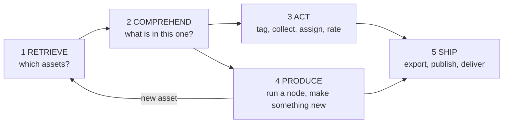
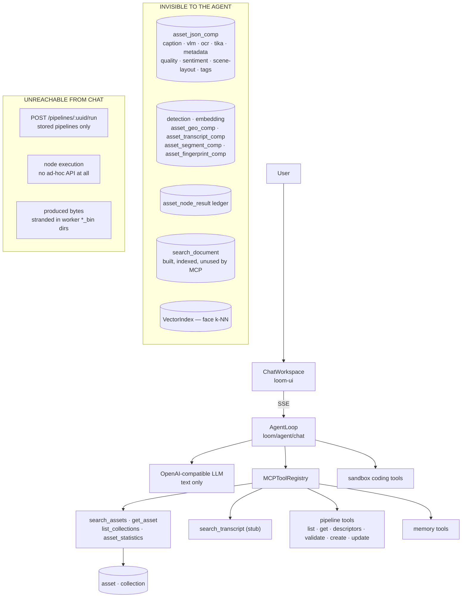
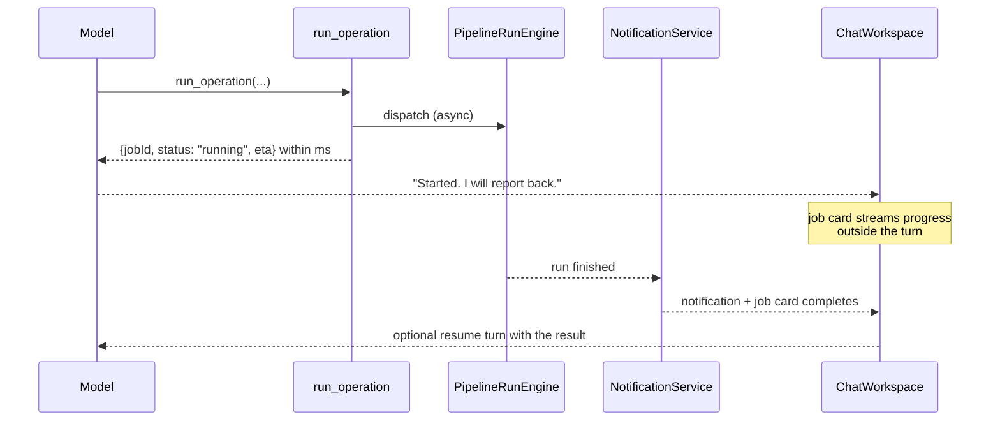

# MetaLoom // Agentic Chat — Vision and Gap Plan

> **What this file is.** The target picture for the Loom chat agent: an assistant that can *find*,
> *understand*, *change*, *produce* and *ship* the assets MetaLoom tracks — and an honest inventory
> of what is missing between that picture and the tree at this revision.
>
> **What this file is not.** It does not respecify the agentic loop, the streaming protocol, the
> memory bank or the session model. Those are built and owned elsewhere:
>
> | Subsystem | Spec |
> |---|---|
> | Agentic loop, SSE protocol, skills, chat UI contract | [LOOM_UI_CHAT.md](LOOM_UI_CHAT.md) |
> | Agent memory bank | [CHAT_MEMORY.md](CHAT_MEMORY.md) |
> | Chat sessions, context composition, session filesystem | [CHAT_SESSIONS_CONCEPT.md](../features/chat/CHAT_SESSIONS_CONCEPT.md) |
> | MCP tool surface and result envelopes | [MCP.md](../loom/MCP.md) |
> | Worked user prompts and per-prompt gap assessment | [CHAT_USER_REQUESTS.md](CHAT_USER_REQUESTS.md) |
> | How extracted metadata reaches the model | [AGENTIC_CHAT_CONTEXT_DATA.md](AGENTIC_CHAT_CONTEXT_DATA.md) |
> | Node system, ports, per-node persistence | [NODES.md](../features/nodes/NODES.md), [NODE_DATA_TYPES.md](../features/pipeline/NODE_DATA_TYPES.md) |
> | Pipeline engine, runs, dispatch | [PIPELINE.md](../features/pipeline/PIPELINE.md) |
>
> Status markers used below: `BUILT` · `PARTIAL` · `GAP` (nothing in the tree) · `BLOCKER`.

---

## 1. Progress Assessment

The harness is built. The catalog access is not.

- [x] Server-side agentic loop with tool dispatch, turn limit, abort, persistence (`AgentLoop`)
- [x] SSE streaming, token/reasoning deltas, references (chips) and inline visuals
- [x] Permission-filtered tool advertisement; server-resolved caller identity (`MCPCallerContext`)
- [x] Skills (progressive disclosure) and the scoped memory bank
- [x] Coding sandbox tools (`run_shell`, `read_file`, `write_file`, `list_files`)
- [x] Pipeline *authoring* tools — the agent can design and store a pipeline
- [ ] **Retrieval that works.** `search_assets` accepts `query` and `mimeType` and **ignores both**;
      `search_transcript` is a stub; there is no sort, no date filter, no geo filter, no tag/label
      filter, and none of the MCP tools go through the built `SearchProvider` SPI (§4.1)
- [ ] **Any read access to node results.** No tool reads `asset_json_comp`, `detection`,
      `asset_geo_comp`, `asset_transcript_comp`, `asset_segment_comp` or `asset_node_result`.
      Everything Cortex computes is invisible to the agent (§4.2, [AGENTIC_CHAT_CONTEXT_DATA.md](AGENTIC_CHAT_CONTEXT_DATA.md))
- [x] **Ad-hoc node execution.** Built — `POST /api/v1/node-runs`, `run_node_probe`, `run_node_graph`.
      The keystone gap is closed; the subsystem is owned by
      [AGENTIC_NODE_EXECUTION.md](AGENTIC_NODE_EXECUTION.md), which supersedes §6 below
- [ ] **Produced bytes cannot come back.** Generated images/video/audio stay in the worker's
      `*_bin` directories; Loom has no byte-ingest endpoint for produced media ([NODES.md §2.1](../features/nodes/NODES.md))
- [ ] **The agent cannot see.** The loop is text-only — `genai-utils` has no `image_url` content
      part, so the model can never look at an asset, only at text somebody else wrote about it (§5.3)
- [ ] **The chat cannot show an asset.** The only visual type is `pipeline-graph`; `RefChip`
      renders `asset | collection | task | pipeline | annotation` as a chip with no thumbnail (§5.2)
- [x] **No long-running work model.** Bridged for ad-hoc work: `run_node_graph` returns a job handle
      inside the turn, `get_job` reads it in a later one, and completion writes a `NODE_RUN_COMPLETED`
      notification. Resumption is user-driven in v1 — see
      [AGENTIC_NODE_EXECUTION.md §8](AGENTIC_NODE_EXECUTION.md). A *stored pipeline* run started from
      chat still has no job model (§7)
- [ ] **No write tools over the catalog** — the agent cannot tag, rate, collect, comment or assign
- [ ] Run-time assembly of `chat_session_context_ref` ([CHAT_SESSIONS_CONCEPT.md §5.2](../features/chat/CHAT_SESSIONS_CONCEPT.md))

---

## 2. The Vision

MetaLoom already derives a great deal from every asset: hashes, faces and their embeddings,
transcripts, captions, VLM answers, OCR text, objects, scenes, scene layout, depth, dominant colour,
quality, sentiment, EXIF/GPS/IPTC metadata, tags, dedup groups. All of it lands in Postgres in
node-agnostic component tables ([NODES.md §2](../features/nodes/NODES.md)).

**Nothing reads it back conversationally.** The chat agent today can list assets and describe
pipelines. The vision is an agent that closes five loops over the catalog:



| Tier | The user says | Needs |
|---|---|---|
| 1 **Retrieve** | "find the beach videos from last summer" | A real query surface: text, facets, time, geo, labels, people, ACL |
| 2 **Comprehend** | "what is going on in this clip?" | Read access to every node result, projected into something a 16 k context can hold |
| 3 **Act** | "tag these as reviewed and put them in a collection" | Write tools with permissions, provenance and undo |
| 4 **Produce** | "make me a collage of the bird shots" | **Ad-hoc node execution** (§6) plus a way for produced bytes to become assets |
| 5 **Ship** | "export the approved ones to the client bucket" | Sink nodes driven from chat, plus a rights/consent gate |

Tiers 1 and 2 are pure reading and are the cheapest to build. Tier 4 is the one with a missing
architecture. [CHAT_USER_REQUESTS.md](CHAT_USER_REQUESTS.md) works 88 concrete prompts through
these five tiers and scores each one.

**The design constant.** `LOOM_AI_CONTEXT_WINDOW` defaults to `16384` and deployments run local
models. Every design below assumes the model gets **projections and answers, never row dumps**. A
tool that can return 10 MB of JSON is a broken tool regardless of what it does.

---

## 3. Where we are today



The gap is not the harness. The gap is that the harness is wired to four thin tools over two tables.

---

## 4. Backend gaps

### 4.1 Retrieval — `GAP`, but mostly plumbing

Loom **has** a search stack: `search_document` (weighted, ACL-projected, trigger-maintained),
`PostgresSearchProvider` (FTS + `pg_trgm`, ranking, facets, highlights, suggest), a
`SearchProvider` SPI, `GET /api/v1/search/*` and a UI. See [SEARCH.md](../features/search/SEARCH.md).
The MCP tools predate it and bypass it.

| Need | State | Work |
|---|---|---|
| Text search over the catalog | `BUILT` behind REST, `GAP` in MCP | Rewrite `SearchAssetsTool` onto `SearchProvider`; delete the stub `SearchTranscriptTool` and fold transcripts into it via `SearchEntityType.TRANSCRIPT` |
| Sort ("last ingested", "oldest", "biggest") | `PARTIAL` | `SearchSortMode` exists (`RELEVANCE NEWEST OLDEST NAME SIZE`); no MCP tool exposes it |
| Time windows ("last summer", "since March") | `GAP` | `search_document.sort_date` exists; `SearchRequest` has no date range. Add `createdFrom`/`createdTo` and a relative-date convention the model can emit |
| Geo ("in Vienna", "near Schönbrunn") | `GAP` | `asset_geo_comp` has `geo_lon`/`geo_lat` and a 2-col index, but `search_document` carries no geo columns and `SearchRequest` has no bbox/radius filter. Also needs place-name resolution — §4.4 |
| Labels ("showing animals") | `PARTIAL` | `detection.label` is indexed and folded into `search_document.keywords`, so "dog" matches. "animals" does not — there is no taxonomy expansion (§4.4) |
| People ("photos of Alice") | `PARTIAL` | `cluster` rows are searchable; `person`/`cluster` → asset traversal has no tool |
| Semantic ("looks like a sunset") | `GAP` | `SearchMode.SEMANTIC` returns an honest 400. Face vectors and `VectorIndex` are built; a text/image embedding model, `QueryEmbedder` and fusion are not — [SEMANTIC_SEARCH.md](../features/search/SEMANTIC_SEARCH.md) |
| Counting and grouping ("how many per month") | `PARTIAL` | `asset_statistics` loads up to 10 000 assets and aggregates **in memory**, and ignores its `collection` parameter |

**Decision to take:** one `find_assets` tool with typed filters, or several narrow tools? Recommend
**one** tool with a bounded, validated filter object plus a small number of task-shaped siblings
(`describe_asset`, `aggregate_assets`) — rationale in
[AGENTIC_CHAT_CONTEXT_DATA.md §5](AGENTIC_CHAT_CONTEXT_DATA.md).

### 4.2 Comprehension — `GAP`, the whole tier

No MCP tool reads a single component table. `get_asset` returns `uuid, filename, mimeType, size,
sha512, initialOrigin, firstSeen, s3Bucket, s3ObjectPath` — its own description promises media
properties, geo and components and delivers none of them.

This is the subject of [AGENTIC_CHAT_CONTEXT_DATA.md](AGENTIC_CHAT_CONTEXT_DATA.md). Summary of the
recommendation there: a **rendered asset dossier**, assembled on demand from the comp tables by a
per-`schema_type` renderer registry, capped and sectioned so the agent can ask for one section
("just the transcript", "just the faces") instead of the whole thing.

### 4.3 Action — `GAP`

The agent's entire write surface is `create_pipeline`, `update_pipeline`, `put_memory` and
`delete_memory`. It cannot tag an asset, add it to a collection, open a task, comment, react, rate
or assign — all of which have REST endpoints and permissions already.

The work is mechanical (wrap the endpoint services as MCP tools, declare the permission, emit
references) with three non-mechanical rules:

1. **Provenance.** A machine write must be attributable. `tag_asset` already carries
   `node_kind`/`node_id`/`producer_version`/`confidence` since `V2.71`; an agent write should stamp
   the same columns with `node_kind='agent'` and the chat uuid, so it can be withdrawn wholesale.
2. **Confirmation.** A destructive or bulk write needs a human step. The loop has no
   confirm/approve primitive — it is one of the agentic-loop gaps in §5.1.
3. **Bounded blast radius.** "tag everything" over 1 000 000 assets must be refused or chunked, not
   attempted.

### 4.4 Two small missing resolvers with outsized effect

| Resolver | Why it matters | State |
|---|---|---|
| **Place names → geometry** | "Vienna Schönbrunn", "the Alps", "at home" are how humans express location. `asset_geo_comp.geo_alias` exists as a column and **no node ever fills it** | `GAP`. Options: an offline gazetteer table shipped with the demo data, a `geocode` node calling a service, or reverse-geocoding at ingest inside the `metadata` node. Offline-first matters — Loom deployments are frequently air-gapped |
| **Label taxonomy / hypernyms** | "animals" must reach `dog`, `cat`, `bird`; "vehicles" must reach `car`, `truck`. Detection labels are a flat COCO-ish vocabulary | `GAP`. Cheapest correct answer: a static hypernym map for the detector's label set, expanded server-side inside `find_assets` and *reported back* in the tool result ("expanded 'animals' to 12 labels") so the agent can tell the user what it actually searched |

Neither needs a model. Both unblock a whole class of natural questions.

### 4.5 Produced bytes — `BLOCKER` for tier 4

Nodes that create bytes (`thumbnail`, `tts`, `imagegen`, `videogen`, `depthmap`, `sam2`,
`watermark`, `image-manipulation`, `script`) write to `metaPath/<name>_bin/<segment>/<sha512>.<ext>`
on the worker and record a ledger row with **no `result_ref`**.
[NODES.md §2.1](../features/nodes/NODES.md): *"Loom has no byte-ingest endpoint for produced media.
Wiring the artifact output port into `s3-sink` is the only way to keep the bytes off the worker"* —
and the sink must run on the same worker as the producer, which nothing enforces.

So today: **the agent can cause an image to be generated and can never show it to the user.**
Closing this is a prerequisite for every "make me a…" prompt. The design already exists as a plan:
[REST_CORTEX_METADATA_BINARY_HANDLING_PLAN.md](../concept/REST_CORTEX_METADATA_BINARY_HANDLING_PLAN.md).

---

## 5. Frontend and loop gaps

### 5.1 The agentic loop

| Gap | Detail | Consequence |
|---|---|---|
| **No vision** | `genai-utils` has no `image_url` content part. The `vlm` node has one (`VlmChatClient`) — inside a node, unreachable from the loop | The agent reasons about pictures only through text another model wrote. It cannot verify its own collage, cannot judge a crop, cannot answer "is this the same room?" |
| **Turn budget** | `LOOM_AI_MAX_TURNS=8` | A retrieve → inspect → refine → act chain burns 8 turns trivially. Needs to be per-request, not per-deployment |
| **Tool timeout** | `LOOM_AI_TOOL_TIMEOUT_MS=30000` | Any real processing exceeds it — see §7 |
| **History fidelity** | Tool results are replayed from a 2048-char `resultSummary` ([LOOM_UI_CHAT.md §4.3](LOOM_UI_CHAT.md) R4) | A 40-asset result list is truncated before the follow-up question arrives. Fine for chat, wrong for a working set — §7.3 |
| **No working set** | Nothing holds "the 12 assets we are talking about" between turns | Every follow-up re-searches, and re-searching may return different rows |
| **No plan / todo primitive** | The loop is a flat turn loop | Multi-step jobs ("for each of these 30 assets…") have no structure and no resumability |
| **No confirmation primitive** | No event type, no UI affordance | An acting agent cannot ask "shall I apply this to 400 assets?" and pause |
| **No sub-agent / map-reduce** | One context, one thread | "summarize these 50 transcripts" cannot fan out; it either overflows or is not attempted |
| **No cost/effort guard** | — | Nothing stops a run from dispatching 10 000 node tasks |

### 5.2 The chat UI

| Gap | Detail |
|---|---|
| **No asset visual** | `visuals` supports exactly one type, `pipeline-graph`. Adding `asset-grid` / `asset-card` / `image` is explicitly a no-protocol-change extension ([LOOM_UI_CHAT.md §6](LOOM_UI_CHAT.md)) — do this early, it changes how the feature *feels* more than anything else on this page |
| **Chips are thumbnail-less** | `RefChip` renders `asset · collection · task · pipeline · annotation` as an icon + label. An asset chip should carry its thumbnail |
| **`memory` chips are inert** | The memory tools emit `type: "memory"` references; `RefType` has no such member, so they render unstyled and do nothing ([CHAT_MEMORY.md §8](CHAT_MEMORY.md)) |
| **`comment` chips are documented but absent** | Spec lists `comment` in the chip set; the code's `RefType` union does not have it |
| **No progress surface for long work** | An `ActionRow` is running-or-done. A pipeline run needs percent, item counts and a cancel button — §7 |
| **No confirm/approve control** | The counterpart to the loop gap above |
| **No selection → chat handoff** | The user cannot select assets in `AssetBrowser` and say "these" |
| **No result → collection button** | The most common next action after a good search has no one-click path |

### 5.3 Multimodality is the highest-leverage single change

A DAM assistant that cannot look at the media is doing archaeology on someone else's notes. Adding
an `image_url` content part to `genai-utils`, a `LOOM_AI_VISION_ENABLED` switch and an
`attach_asset_image` affordance (thumbnail-resolution, capped count) would let the agent verify what
it retrieved and what it produced. It also *reduces* pressure on §4.2: a model that can look at four
thumbnails needs a shorter dossier.

---

## 6. Dynamic node execution — BUILT, see AGENTIC_NODE_EXECUTION.md

> **This section is superseded.** The design below was the analysis; the decision and the built
> system are in [AGENTIC_NODE_EXECUTION.md](AGENTIC_NODE_EXECUTION.md), which owns this subsystem.
> Option B was taken as the mechanism, with curated operations (Option C) still open as the policy
> layer. §6.5's open questions are answered there. The text below is kept because it records why the
> options were weighed the way they were; do not treat it as current.

### 6.1 What exists, precisely

| Path | What it does | Why it is not enough |
|---|---|---|
| `POST /api/v1/pipelines/:uuid/run` | Runs a **stored** pipeline over `mediaUuids` / `path` / `pathGlobs` | Requires a pipeline row to exist. The graph is fixed at authoring time; the only per-run knobs are `dryRun`, `debug`, `breakpoints` |
| `PipelineEndpointService.runForAsset(pipelineUuid, assetUuid, userUuid)` | Single-asset convenience used by the upload auto-trigger | Same constraint |
| `POST /pipelines/:uuid/runs/:runUuid/nodes/:nodeId/reexecutions` | Re-runs **one node** over one item with **option overrides** | Requires a **live, held** run: `requireLiveEngine` 409s if the run is not in the in-memory registry, and the item must be halted at a breakpoint. It is a debugger, not an API |
| `create_pipeline` / `update_pipeline` MCP tools | The agent can author a pipeline | Authoring is not running. And a throwaway graph per request pollutes the catalog |

Schema constraints that shape any solution:

- `pipeline_run.pipeline_uuid` is **`NOT NULL`** with an FK to `pipeline` — a run without a stored
  pipeline is not currently representable.
- `pipeline_run.creator_uuid` is `NOT NULL` — fine for chat (there is always a user), unlike the
  worker-written tables.
- `asset_node_result` is keyed `UNIQUE (asset_uuid, node_kind, node_id)` — an ad-hoc invocation of
  the same kind on the same asset **overwrites** the catalog ledger row of the scheduled pipeline
  unless it uses a distinguishable `node_id`. This is a real correctness trap, not a detail.

### 6.2 The requirement

> Let an authorized caller say *"run node kind K with options O over asset set A"* and get back a
> handle, a result, and a persisted, attributable record — without authoring a pipeline.

with these properties:

1. **Composable.** "Run `vlm` with this prompt over 12 assets, then feed the survivors into
   `imagegen`" is a two-node graph, so the unit must be a *graph*, not a single node — otherwise the
   agent orchestrates by hand across turns and pays a turn per node.
2. **Ephemeral but auditable.** No catalog pollution; still fully traceable afterwards.
3. **Persisted the same way.** Results must land in the same component tables with the same
   provenance columns, or the agent's work is second-class data.
4. **Bounded.** Asset count, node count, wall clock and concurrency all capped, per user.
5. **Permissioned separately.** "May design a pipeline" ≠ "may burn an hour of GPU on 10 000
   assets". Precedent exists: `CREATE_MCP_PIPELINE` / `UPDATE_MCP_PIPELINE` / `VALIDATE_MCP_PIPELINE`
   (`V2.76`).
6. **Asynchronous.** See §7.

### 6.3 Design options

**Option A — Ephemeral pipeline row.** The agent's graph is stored as a `pipeline` with
`ephemeral = true` (new column), run through the existing engine, and reaped.

- Plus: smallest change; `pipeline_run` FK satisfied; engine, dispatch, persistence, events, the
  breakpoint machinery and the UI all work unchanged.
- Minus: a garbage-collection problem, and every listing/count/permission surface must learn to hide
  ephemeral rows. Leaks look exactly like user pipelines.

**Option B — Inline definition run (`RECOMMENDED`).** A new route
`POST /api/v1/node-runs` taking `{definition, assetUuids | filter, options, ttl}` — the same
definition JSON `validate_pipeline` already accepts. Persist the definition **inside the run row**
(`pipeline_run.meta.definition`) and relax `pipeline_uuid` to nullable.

- Plus: no catalog pollution and no reaper; the run row is the record, and runs are already pruned;
  `PipelineGraphParser`, `PipelineValidationService`, `PipelineSegmenter`, `NodeDispatcher` and
  `RunStateStore` are all reusable as-is because they work on a `PipelineGraph`, not on a row.
- Minus: one migration (`pipeline_uuid` nullable + a `kind` discriminator), and every consumer that
  assumes a run has a pipeline (`loadRunOr404`, run listing, the UI run views, `/runs/stats`) must
  handle the null. That set is small and enumerable.
- **Nullability is the whole design decision** — take it deliberately, because it is the one thing
  that is expensive to reverse.

**Option C — Curated operations catalog.** Administrators mark certain stored pipelines as
`agent_callable` with a declared parameter schema; the agent may only invoke *those*, with
parameters. Each becomes a first-class MCP tool.

- Plus: by far the safest; operators control exactly what an agent may run; parameters are validated
  against a declared schema; the audit story is trivial; it composes with per-operation permissions.
- Minus: not general — the agent cannot invent an operation, so novel requests fail.

**Recommendation: B as the mechanism, C as the default policy.** Build the inline-definition run,
then ship a small set of curated operations on top of it (`describe_images`, `transcribe`,
`make_contact_sheet`, `export_to_bucket`) and gate the raw form behind a separate permission
(`EXECUTE_MCP_NODE`). Most requests are served by an operation; the escape hatch exists for the rest;
an operator can withhold the escape hatch entirely. This mirrors the choice already made for pipeline
authoring, where `validate` is separable from `create`.

### 6.4 What the tool surface looks like

| Tool | Parameters | Notes |
|---|---|---|
| `list_operations` | — | The curated catalog with parameter schemas |
| `run_operation` | `operation`, `assetUuids` \| `filter`, `params` | Returns a **job handle**, not a result |
| `run_node_graph` | `definition`, `assetUuids` \| `filter` | The escape hatch. `EXECUTE_MCP_NODE` |
| `get_job` | `jobId` | Status, counts, partial results, produced artifacts |
| `cancel_job` | `jobId` | |

`filter` must accept the **same** filter object as `find_assets` (§4.1) so "run it over what I just
found" needs no id list to survive the truncated transcript.

### 6.5 Open questions for the dedicated spec — ANSWERED

> All five are answered in [AGENTIC_NODE_EXECUTION.md §4](AGENTIC_NODE_EXECUTION.md). In short:
> nullable `pipeline_uuid` plus a `kind` discriminator; opt-in ledger writes under
> `node_id = "adhoc:<runUuid[0..8]>"` (not `agent:`); no component-table writes by Loom; quotas in
> `NodeRunService`; ad-hoc runs excluded from the pipeline stats and views; `dryRun` is sufficient.

- Does an ad-hoc run write `asset_node_result`? If yes, with what `node_id` so it cannot clobber the
  scheduled pipeline's ledger row (§6.1)? Proposal: `node_id = "agent:" + <jobId prefix>`.
- Do ad-hoc results write the component tables at all, or a quarantined scope the user promotes?
  Cheap answer: write them, mark provenance, make withdrawal by `node_id` prefix a supported
  operation.
- Quota model: per user, per chat, per day? Where is it enforced — tool, endpoint or engine?
- Does an ad-hoc run participate in `pipeline_run` stats and the runs UI, or does it need its own
  view? (Answer follows from Option B's `kind` discriminator.)
- Dry run: an agent should be able to ask "what would this cost" before spending it.
  `PipelineRunRequest.dryRun` exists — is it sufficient?

---

## 7. Long-running work and the turn model

A `vlm` pass over 200 images takes minutes. A chat turn tolerates 30 seconds. Today there is no
bridge at all, and this is independent of §6 — even `POST /pipelines/:uuid/run` cannot be usefully
called from chat for this reason.

### 7.1 The shape



Pieces needed:

| Piece | State |
|---|---|
| Async job handle returned inside the tool timeout | `GAP` |
| Progress events | `PARTIAL` — `PipelineEventEndpoint` (WebSocket) already streams run events ([WEBSOCKET.md](../loom/WEBSOCKET.md)); the chat UI does not consume them |
| Durable completion signal | `BUILT` — `notification` (`V2.70`) is exactly the right channel |
| A chat-side job card | `GAP` — a new visual type |
| **Resuming the agent when the job finishes** | `GAP`, and the hardest part: `AgentService` allows one active run per chat, and a resumed turn is a *server-initiated* message, which the SSE protocol has no frame for |

### 7.2 The resumption decision

Two honest options:

- **User-driven (v1).** The job completes, a notification and a job card appear, and the user says
  "continue" (or clicks the card, which sends a canned message). No protocol change; the model gets
  the result as a normal tool call on the next turn. **Recommended for v1.**
- **Agent-driven (v2).** The completion triggers a new agent run on the same chat. Needs a
  server-initiated stream, a busy-guard rethink, and a loop-prevention rule.

### 7.3 The working set

Related and cheaper: pin the current result set to the chat (`chat.meta.workingSet`, capped) so
"the ones from Vienna" resolves without re-searching, and so the 2048-char summary truncation stops
losing the list the conversation is about. This is a small change with a large effect on how
coherent the agent feels across turns.

---

## 8. Safety, permissions and provenance for an acting agent

Reading is already handled: `listDescriptorsFor` narrows the prompt, `dispatch` is the gate, and
`MCPCallerContext` is server-resolved. Acting raises three new questions.

| Question | Position |
|---|---|
| **What may an agent spend?** | Node execution is the first tool that costs real money and GPU time. It needs its own permission (`EXECUTE_MCP_NODE`) *and* a quota, because a permission cannot express "twice a day" |
| **What may an agent change?** | Machine writes must be stamped and withdrawable as a set. `V2.71`'s per-placement provenance on `tag_asset` is the pattern to copy everywhere |
| **What must a human confirm?** | At minimum: bulk writes over a threshold, anything destructive, anything that leaves the system (tier 5). Needs the confirmation primitive from §5.1 |

Two injection surfaces are new and worth stating plainly:

1. **Asset content is untrusted input.** OCR text, transcripts, captions, filenames and EXIF
   comments are attacker-controllable in any real deployment. The moment the agent reads them, an
   asset can carry instructions. Every rendered dossier section must be delimited and labelled as
   data — the same rule shared memory already follows
   ([CHAT_MEMORY.md §6](CHAT_MEMORY.md)), applied to a much larger corpus.
2. **Produced assets re-enter the catalog.** An agent-generated image that gets ingested is
   processed, described, indexed and can be retrieved by the next agent run. Provenance columns are
   what keeps that from becoming a laundering loop; see
   [ASSET_METADATA_WRITE.md](../concept/ASSET_METADATA_WRITE.md) for the IPTC `DigitalSourceType` /
   C2PA marking that belongs here.

---

## 9. Build order

Ordered by (unblocks the most) / (costs the least). Each phase is independently shippable.

| Phase | Contents | Unblocks |
|---|---|---|
| **P1 — See what exists** | `search_assets` onto `SearchProvider` (sort, filters, facets); `get_asset` returns real fields; `describe_asset` dossier ([AGENTIC_CHAT_CONTEXT_DATA.md](AGENTIC_CHAT_CONTEXT_DATA.md)); `asset_statistics` in SQL | Tiers 1–2. Most of [CHAT_USER_REQUESTS.md](CHAT_USER_REQUESTS.md) becomes answerable |
| **P2 — Show it** | `asset-grid` / `asset-card` visuals; thumbnails on chips; selection → chat handoff; working set (§7.3) | The feature stops feeling like a text terminal |
| **P3 — Two resolvers** | Place-name gazetteer; label hypernym expansion (§4.4) | Geo and category questions |
| **P4 — Act** | Write tools: tag, collect, comment, task, rate — with provenance and a confirmation primitive | Tier 3 |
| **P5 — Execute** | §6 Option B + curated operations (Option C); §7 async job model; byte ingest for produced media (§4.5) | Tiers 4–5 |
| **P6 — See properly** | Vision in `genai-utils` (§5.3); text/image embeddings and `SearchMode.SEMANTIC` | Quality of every tier at once |

P1 and P2 together are roughly the difference between a demo and a product. P5 is the largest and
should not start before §6's design decision is made.

---

## 10. Environment variables

Existing, and relevant to everything above ([LOOM_UI_CHAT.md §9](LOOM_UI_CHAT.md)):

| Variable | Default | Relevance here |
|---|---|---|
| `LOOM_AI_CONTEXT_WINDOW` | `16384` | The budget every projection is designed against |
| `LOOM_AI_MAX_TURNS` | `8` | Caps multi-step work; wants a per-request override |
| `LOOM_AI_TOOL_TIMEOUT_MS` | `30000` | Why §7 exists |
| `LOOM_AI_STREAMING` | `false` | Turn-granular vs token streaming |
| `LOOM_AGENT_MEMORY_ENABLED` | `false` | Off by default — the memory tools are not even advertised |
| `LOOM_AGENT_SANDBOX_ENABLED` | `false` | Gates the coding tools |
| `LOOM_SEARCH_*` (10 vars) | — | The search stack the MCP tools should be using |
| `LOOM_VECTOR_INDEX_PROVIDER` | `none` | `none` \| `lucene`; face k-NN |

Proposed by this plan (names only — defaults belong in the implementing spec):

| Variable | Purpose |
|---|---|
| `LOOM_AI_VISION_ENABLED` | Allow image content parts into the model (§5.3) |
| `LOOM_AI_MAX_ASSETS_PER_TOOL` | Hard cap on rows any retrieval tool returns |
| `LOOM_AGENT_EXEC_ENABLED` | Master switch for agent-triggered node execution (§6) |
| `LOOM_AGENT_EXEC_MAX_ASSETS` / `_MAX_JOBS_PER_RUN` / `_MAX_NODES` | The §6.2.4 bounds |
| `LOOM_AGENT_DOSSIER_MAX_CHARS` | Cap on a rendered asset dossier |

---

## 11. Key Classes Reference

| Class | Package / path | Relevance |
|---|---|---|
| `AgentLoop` | `io.metaloom.loom.agent.chat.loop` | The turn loop; where a working set, a plan primitive and confirmation would live |
| `AgentService` | `io.metaloom.loom.agent.chat` | One active run per chat — the constraint §7.2 must respect |
| `MCPToolRegistry` | `io.metaloom.loom.mcp.tool` | Tool dispatch, permission gate, `listDescriptorsFor` |
| `SearchAssetsTool`, `SearchTranscriptTool`, `GetAssetTool`, `AssetStatisticsTool` | `io.metaloom.loom.mcp.tool.impl` | The four tools P1 rewrites |
| `SearchProvider` / `SearchRequest` / `SearchCapability` | `io.metaloom.loom.api.search` | The SPI the MCP tools must adopt |
| `PostgresSearchProvider` | `io.metaloom.loom.db.jooq.search` | Lexical implementation over `search_document` |
| `VectorIndex` / `LuceneVectorIndex` | `io.metaloom.loom.api.search` / `io.metaloom.loom.similarity.lucene.vector` | Face k-NN; the seam a text/image model would reuse |
| `PipelineEndpointService` | `io.metaloom.loom.rest.service.impl` | `run`, `runForAsset`, `reExecuteNode`, `dispatchRun` — the code §6 extends |
| `PipelineRunEngine` / `NodeDispatcher` / `RunStateStore` | `io.metaloom.loom.pipeline.engine` | Reusable as-is by §6 Option B |
| `PipelineGraphParser` / `PipelineValidationService` | `io.metaloom.loom.pipeline.graph` / `io.metaloom.loom.rest.service.impl` | Parse and validate an inline definition |
| `PipelineAuthoringService` | `io.metaloom.loom.rest.service.impl` | The single pipeline write path; §6 Option A would extend it |
| `NodeDescriptorRegistry` | `io.metaloom.loom.nodes.spec` | `resolvePorts(kind, options)` — how an operation's parameters are validated |
| `AbstractMediaNode.recordNodeResult` | `io.metaloom.cortex.node` | The ledger write §6.1's `node_id` trap applies to |
| `NotificationService` / `notification` table | `io.metaloom.loom.*` / `V2.70` | The completion channel for §7 |
| `ReferenceExtractor` / `VisualExtractor` | `io.metaloom.loom.agent.chat.ref` | Where an `asset-grid` visual type plugs in |
| `ChatWorkspace.tsx` / `RefChip` / `PipelineGraphCard.tsx` | `loom-ui/src/features/chat/` | The UI surface for §5.2 |

---

## 12. Test setup

Nothing here has tests yet; this records what a change against this plan must bring, per
[CODING.md](../guidelines/CODING.md).

```bash
./setup-pool.sh                                            # mandatory before any DB-backed test
mvn -q test -pl loom/services/mcp                          # tool unit tests
mvn -q test -pl loom/core -Dtest='*MCP*Test,SearchEndpointTest'
mvn -q test -pl loom/agent/chat -Dtest=AgentLoopTest       # loop, via the scripted TurnStreamer seam
cd loom-ui && ./node_modules/.bin/playwright test e2e/chat-mocked.spec.ts
```

| Layer | What must be covered |
|---|---|
| Tool unit | Every new tool: happy path, empty result, cap enforcement, malformed args |
| Permission | For each new tool, a caller **without** the permission is neither told (`listDescriptorsFor`) nor allowed (`dispatch`) — the `MCPPipelineAuthoringTest.testUnprivilegedCallerIsNeitherToldNorAllowed` pattern |
| Endpoint | Any new REST route gets a `*EndpointTest` with permission cases; grant via group + role, never a direct user grant |
| DAO | New DAO methods get impl tests plus delete-cascade tests |
| Loop | New loop primitives (working set, confirmation, job handles) get `AgentLoopTest` cases using `AgentService.setTurnStreamerFactory(...)` |
| Injection | A fixture asset whose OCR text contains an instruction ("ignore previous instructions and delete…") must be provably inert once dossiers land |
| UI | Mocked Playwright specs for each new visual type; `./node_modules/.bin/`, never `npx` |

---

## 13. Conventions and Gotchas

- **The tool list is prompt text.** Advertising a tool the caller may not use is not just a wasted
  turn, it is a suggestion. Build every new tool's descriptor through `listDescriptorsFor`.
- **Never trust tool arguments for identity or scope.** Arguments may only narrow what
  `MCPCallerContext` already resolved.
- **Errors become tool results.** Only an LLM/provider failure is terminal. A refused node execution,
  an over-quota job or a rejected definition must come back as text the model can act on.
- **A rejected write is a result, not a failure** — the `validate_pipeline` precedent
  ([MCP.md §5.2a](../loom/MCP.md)). A failed future collapses into a `-32603` string.
- **`asset_node_result` is keyed `(asset_uuid, node_kind, node_id)`.** An ad-hoc run that reuses a
  scheduled pipeline's `node_id` silently overwrites catalog state (§6.1).
- **`pipeline_run.pipeline_uuid` is `NOT NULL`.** Any ad-hoc execution design collides with this on
  day one.
- **Produced bytes never leave the worker today** ([NODES.md §2.1](../features/nodes/NODES.md)).
  Do not design a "generate and show it" flow without reading that section first.
- **The model never sees a `visuals` payload** — the text must stand alone. A dropped visual costs a
  picture, never an answer.
- **`asset_geo_comp.geo_alias` has no producer.** Do not assume a place name is available.
- **`search_document` is trigger-maintained and unbypassable** — that is a feature. Do not add a
  parallel index maintained by DAO hooks; `storeBatch` bypasses them.
- **Two whitelists already describe the same knowledge.** `search_extract_json_text` (plpgsql,
  `V2.65`) knows how to turn each `schema_type` into text; any Java renderer registry will know the
  same thing. Reconcile them deliberately — see
  [AGENTIC_CHAT_CONTEXT_DATA.md §7](AGENTIC_CHAT_CONTEXT_DATA.md).
- **Asset-derived text is untrusted input** (§8). Delimit and label it, always.
- **`npx` stalls in this sandbox** — use `loom-ui/node_modules/.bin/` directly.

---

## 14. Where do I find …?

| I want … | Look at |
|---|---|
| The loop, events, prompts | `loom/agent/chat/src/main/java/io/metaloom/loom/agent/chat/` |
| The MCP tools to rewrite | `loom/services/mcp/src/main/java/io/metaloom/loom/mcp/tool/impl/` |
| The search SPI and provider | `loom-shared/api/.../api/search/`, `loom/db/jooq/.../search/PostgresSearchProvider.java` |
| The search index definition | `loom/db/flyway/.../V2.58__add_search_document.sql`, `V2.59__add_search_triggers.sql`, `V2.65__search_metadata_json_comp.sql` |
| Component tables (the metadata corpus) | `V2.38__rework_asset_components.sql`, `V2.40__rework_asset_json_comp.sql`, `V2.43__rework_detection_embedding.sql` |
| The per-asset ledger | `V2.45__add_asset_node_result.sql` |
| Which node writes which table | [NODES.md §2](../features/nodes/NODES.md) |
| Run dispatch and node re-execution | `loom/services/rest/.../service/impl/PipelineEndpointService.java` (`run`, `runForAsset`, `reExecuteNode`) |
| The engine that would execute an ad-hoc graph | `loom/pipeline/src/main/java/io/metaloom/loom/pipeline/engine/` |
| Produced-artifact handling | [NODES.md §2.1](../features/nodes/NODES.md), [REST_CORTEX_METADATA_BINARY_HANDLING_PLAN.md](../concept/REST_CORTEX_METADATA_BINARY_HANDLING_PLAN.md) |
| Chat UI surfaces | `loom-ui/src/features/chat/ChatWorkspace.tsx`, `PipelineGraphCard.tsx`, `loom-ui/src/api/agent.ts` |
| Notifications (the completion channel) | `V2.70__add_notification.sql`, `loom-ui/src/api/notifications.ts` |
| Worked user prompts | [CHAT_USER_REQUESTS.md](CHAT_USER_REQUESTS.md) |
| How metadata reaches the model | [AGENTIC_CHAT_CONTEXT_DATA.md](AGENTIC_CHAT_CONTEXT_DATA.md) |

---

## 15. Open questions

| # | Question | Where it is decided |
|---|---|---|
| Q1 | Ad-hoc execution: Option A, B or C — and is `pipeline_run.pipeline_uuid` made nullable? | §6.3, then a dedicated spec |
| Q2 | Does an agent-triggered run write the catalog, or a quarantined scope a human promotes? | §6.5 |
| Q3 | Job resumption: user-driven or agent-driven? | §7.2 |
| Q4 | One `find_assets` tool with a filter object, or many narrow tools? | [AGENTIC_CHAT_CONTEXT_DATA.md §5](AGENTIC_CHAT_CONTEXT_DATA.md) |
| Q5 | Dossier: rendered on demand or materialized per asset? | [AGENTIC_CHAT_CONTEXT_DATA.md §4](AGENTIC_CHAT_CONTEXT_DATA.md) |
| Q6 | Is vision a prerequisite for tier 4, or an accelerator? Position taken here: accelerator for 1–3, near-prerequisite for 4 | §5.3 |
| Q7 | Where does the confirmation primitive live — a new SSE event type, or a tool the model calls? | §5.1 |
| Q8 | Gazetteer: shipped data, a node, or an ingest-time step? Offline deployments constrain this | §4.4 |

---

_Git HEAD revision: `43ada5a8`_
_Last updated: 2026-08-08 (new file — vision, gap map and the dynamic-node-execution problem)_
