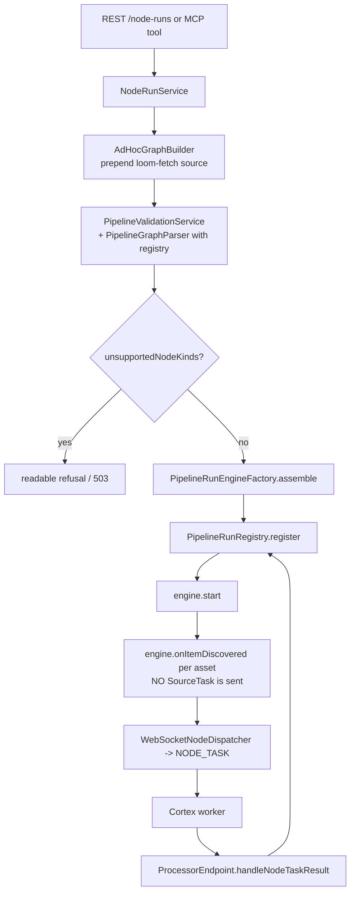

# Ad-hoc ("pipelineless") node execution

Running a processing node on chosen assets **without a stored pipeline**, over the same dispatch
machinery a scheduled pipeline uses.

This spec owns the whole ad-hoc execution path: the REST routes under `/api/v1/node-runs`, the MCP
execution tools, the `pipeline_run.kind = ADHOC` model, and the rules about what such a run may
record. It does **not** own the pipeline engine, the worker protocol or the node catalogue — see
[PIPELINE.md](../features/pipeline/PIPELINE.md), [WEBSOCKET.md](../loom/WEBSOCKET.md) and
[NODES.md](../features/nodes/NODES.md). It answers the open questions raised in
[AGENTIC_CHAT_PLAN.md §6](AGENTIC_CHAT_PLAN.md).

---

## 1. Progress Assessment

- [x] Decide the ad-hoc execution model and record it (EXE1) — this file
- [x] `pipeline_run.pipeline_uuid` nullable + `kind` discriminator (`V2.83`)
- [x] `EXECUTE_MCP_NODE` permission (`V2.82`)
- [x] `loom-fetch` established as the Loom-executed source; dead `LoomFetchNode` removed
- [x] Synchronous single-node probe (EXE2) — `POST /api/v1/node-runs/probes`, `run_node_probe`
- [x] Inline-definition runs (EXE3) — `POST /api/v1/node-runs`, `run_node_graph`
- [x] Async job model (EXE5) — job handle, `get_job`, `cancel_job`, `NODE_RUN_COMPLETED` notification
- [x] Ad-hoc runs excluded from `/pipelines/runs/stats` and from per-pipeline run listings
- [x] Restart recovery rebuilds an ad-hoc run from `meta.definition`
- [x] Opt-in catalog writes namespaced under `node_id = "adhoc:<runUuid[0..8]>"`
- [x] Java client, Python client, OpenAPI, demo grant, customer-facing docs
- [ ] Curated operations catalog (EXE4) — `list_operations` / `run_operation`
- [ ] Byte-producing nodes (EXE6) — blocked on byte ingest; structurally refused until then
- [ ] `job-card` visual rendering in the chat UI — belongs to the UI spec
- [ ] A declared `writesToLoom` flag on `NodeDescriptor`, replacing `LOOM_AGENT_PROBE_DENY_KINDS`
- [ ] Server-initiated turns so the agent resumes itself — v2, see §8

---

## 2. Why this exists

Before this, there was no way to run a node on chosen assets on demand.

- `POST /pipelines/:uuid/run` needs a stored `pipeline` row. Answering "what does `vlm` say about
  this image?" meant creating a pipeline, running it, and deleting it again.
- The node re-execution route (`.../runs/:runUuid/nodes/:nodeId/reexecutions`) requires a **live,
  halted** run — `requireLiveEngine` answers 409 otherwise. It is a debugger, not an API.

Both gaps land hardest on the chat agent, which needs to *gather data* ("describe this image",
"transcribe this clip") far more often than it needs to author a pipeline.

---

## 3. Architecture

There is deliberately **no second dispatch path**. Every ad-hoc execution is a `PipelineRunEngine`
run; what differs is only where the items come from and how the caller waits.



**`ProcessorEndpoint`, `WebSocketNodeDispatcher` and `PipelineRunEngine` are not modified by this
feature at all.** That is the acceptance criterion for "reuse rather than duplicate", and it is what
makes results route back: the registry is an in-memory `ConcurrentHashMap<UUID, PipelineRunEngine>`
with no database dependency, so a probe can register a `runUuid` that has no `pipeline_run` row and
its results still arrive.

### 3.1 Where the media come from

A `PipelineGraph` needs exactly one source, and a normal run gets its items by sending a
`SOURCE_TASK` to a worker that walks a filesystem or lists a bucket. An ad-hoc run has no filesystem
to walk — the caller already named the assets and Loom already knows their paths — so its source is
**`loom-fetch`, the one node kind Loom executes itself**:

- `AdHocGraphBuilder` prepends a `loom-fetch` node and wires it to every node with no inbound edge.
- `NodeRunService` resolves each asset through `assetBinaryDao().loadPrimaryByAssetUuid(...)` and
  feeds `engine.onItemDiscovered(mediaRef)` directly, then `engine.onSourceComplete(n)`.
- `PipelineRunEngine.onItemDiscovered` synthesises the source node's result locally on the `media`
  port. **No `SOURCE_TASK` is ever sent and no worker has to advertise a source kind.**

`loom-fetch` was already a declared `SOURCE` descriptor in `OrphanNodeDescriptorProvider` with a
single `media` output and no node class behind it. It is no longer an orphan; the dead
`cortex/pipeline-core/.../LoomFetchNode.java`, whose semantics contradicted the descriptor, was
deleted.

### 3.2 The two shapes

| | Probe | Run |
|---|---|---|
| Route | `POST /api/v1/node-runs/probes` | `POST /api/v1/node-runs` |
| Tool | `run_node_probe` | `run_node_graph` |
| Scope | one node, one asset | a graph, many assets |
| Waiting | awaited in-request, ≤ `LOOM_AGENT_PROBE_TIMEOUT_MS` | handle returned in milliseconds |
| Run row | **none** — `RunStateStore.NOOP` | `pipeline_run` with `kind = ADHOC` |
| State store | engine heap only | `DaoRunStateStore`, so it survives a restart |
| Events | none | `PIPELINE_STARTED` / `NODE_STATS` / `PIPELINE_COMPLETED` |
| Completion | the response | `NODE_RUN_COMPLETED` notification + `get_job` |

---

## 4. The five open questions, answered

Answers to [AGENTIC_CHAT_PLAN.md §6.5](AGENTIC_CHAT_PLAN.md).

**Q1 — nullable `pipeline_uuid` or an ephemeral pipeline row?**
**Nullable, plus a `kind` discriminator.** The ephemeral-row option needs a reaper, and a leaked
ephemeral row is indistinguishable from a pipeline somebody drew — a failure mode that gets worse
with time. Nullability costs one migration over an enumerable consumer set (§7), and the run row *is*
the record. `kind` exists rather than testing `pipeline_uuid IS NULL` because that test would also be
true of a future run whose pipeline was hard-deleted; `kind` states intent and survives that. A CHECK
constraint enforces the pairing, so the impossible third state cannot be stored.

**Q2 — does an ad-hoc run write `asset_node_result`?**
**Opt-in only**, and then under `node_id = "adhoc:" + runUuid[0..8]`. The table is
`UNIQUE (asset_uuid, node_kind, node_id)` and `upsert` rewrites the matching row, so an ad-hoc run
reusing a graph-local node id would silently overwrite what a scheduled pipeline recorded. A valid
graph node id matches `^[a-z0-9]([a-z0-9-]{0,62}[a-z0-9])?$` and can never contain a colon, which
makes the namespace **collision-proof rather than merely unlikely**, and makes withdrawal a single
predicate: `DELETE ... WHERE node_id LIKE 'adhoc:%'`.

**Q2b — component tables?**
**Not written by Loom.** Loom writes only the ledger. The honest limitation: several node kinds
(`metadata`, `tts`, `guard`, `watermark`, `translate`) write to Loom *themselves* through
`LoomClient` inside `process()`. Declining to call the writer stops Loom recording anything; it
cannot stop a worker that already sent its own REST request. Those kinds are therefore excluded from
probing entirely (§6). The proper fix is a declared `writesToLoom` flag on `NodeDescriptor` so the
rule becomes derived rather than a maintained string.

**Q3 — quota model, and where enforced?**
Per-user concurrent-job cap plus per-request asset and node caps, enforced in **`NodeRunService`** —
one place, shared by REST and MCP, so neither surface can end up enforcing a rule the other does not.
The concurrency count comes from the database (`countActiveAdhocByCreator`), not an in-memory
counter: a counter resets on restart while the runs it was counting are recovered and still occupying
workers.

**Q4 — do ad-hoc runs appear in the runs UI and `/runs/stats`?**
**No.** `loadDailyStats` filters to `kind = PIPELINE`, and `loadPageByPipeline` never matches a null
`pipeline_uuid`, so they are invisible to the pipeline views by construction. `/pipelines/runs/stats`
answers "how is the scheduled processing doing"; an agent probing twenty assets is not that, and
mixing the two makes the throughput chart unreadable the first time somebody uses the agent. Ad-hoc
runs surface under `/api/v1/node-runs`, scoped to their creator.

**Q5 — dry run?**
`PipelineRunRequest.dryRun` is sufficient and is plumbed through as `NodeRunRequest.dryRun`.

---

## 5. Answering the three operational questions

**How is a node called?** `POST /api/v1/node-runs/probes` or `POST /api/v1/node-runs`, or the MCP
tools built on the same `NodeRunService`. Everything is validated before anything is dispatched:
eligibility → node options → asset resolution → definition → graph parse → `unsupportedNodeKinds`.
`NodeDispatcher.dispatch` returning `null` (no worker took it) is pre-empted by that last check, so
the caller is told *"no worker currently advertises 'vlm'"* rather than watching a task never settle.

**How does data come back?** Three tiers, no new storage:

| Tier | Source of truth | Reader |
|---|---|---|
| Probe | engine heap — `engine.getItem(itemId).getResults()` | `NodeResultRenderer` → bounded text + JSON |
| Run | `pipeline_node_task.outputs`, already persisted by `DaoRunStateStore` | `GET /node-runs/:uuid`, `get_job` |
| Catalog (opt-in) | `asset_node_result`, namespaced node id | `GET /assets/:uuid/node-results` |

**How are long-running nodes handled?** Four layers:

1. **Inside the turn (≤25 s).** The probe owns a `vertx.setTimer` bounded by
   `LOOM_AGENT_PROBE_TIMEOUT_MS`, set *below* `LOOM_AI_TOOL_TIMEOUT_MS` so the agent loop sees a
   readable result naming the node instead of its own transport timeout. The lease/`LeaseReaper`
   mechanism does **not** protect a probe: `RunStateStore.NOOP` writes no `pipeline_node_task` row
   for the reaper to find, which is exactly why the probe owns its own timer.
2. **Across turns.** `POST /node-runs` answers with `{uuid, status, accepted, etaMs}` in
   milliseconds; the model polls `get_job` on a later turn.
3. **Across sessions.** Completion writes a `NODE_RUN_COMPLETED` notification (`V2.70`'s table,
   `pipeline_run_uuid` as the deep link). Live progress uses the existing `PipelineEventBroadcaster`
   `NODE_STATS` frames — no second channel.
4. **A slow-but-alive worker.** Inherited unchanged from the engine: 10-minute lease → `LeaseReaper`
   (60 s sweep) → `onNodeTaskLost` → per-node retry with backoff capped at 60 s.

---

## 6. Probe eligibility

Derived from the node's declared contract rather than listed, so it cannot go stale.
`LOOM_AGENT_PROBE_KINDS`, when non-empty, replaces the whole rule with a strict allow-list.
Otherwise a kind is eligible when **all** hold:

1. a descriptor exists;
2. `category != SOURCE` — a source produces media rather than consuming it, and Loom supplies it;
3. `category != OUTPUT` — a sink pushes data out of Loom, which is not a probe;
4. **no output port whose `contentType` starts with `artifact/`** — those bytes are written to a
   worker-local directory Loom cannot fetch, so the caller would be told "success" and handed
   nothing. This is EXE6's blocker enforced structurally rather than by a list;
5. the kind is not in `LOOM_AGENT_PROBE_DENY_KINDS` (see Q2b).

Every refusal names its reason. A "no" without a "because" is the kind of tool result that makes an
agent retry the same call.

---

## 7. The null-`pipeline_uuid` consumer checklist

| Site | Behaviour with NULL | Decision |
|---|---|---|
| `PipelineEndpointService.loadRun`, `listRunItems`, `cancelRun`, `loadRunOr404` | `pipelineUuid.equals(null)` → 404 | **No change** — ad-hoc runs are not addressable under `/pipelines/:uuid/...` |
| `PipelineEndpointService.runPipelineName` | both version lookups return null → the literal string `"null"` | **Fixed** — returns `AdhocRuns.label(run)` |
| `PipelineEndpointService.listRuns` → `loadPageByPipeline` | never matches NULL ⇒ invisible | **No change — hide.** A pipeline's history must not show runs it does not own |
| `PipelineRunDaoImpl.loadDailyStats` | no pipeline predicate ⇒ ad-hoc runs pollute `/runs/stats` | **Fixed** — `kind = PIPELINE` predicate |
| `PipelineModelBuilder.toPipelineRunRecord` | null-tolerant | No change needed |
| `PipelineRunRecovery.recover` | version lookup returns null → **`failRun("Pipeline version N no longer exists")`**: every ad-hoc run killed by a restart | **Fixed** — reads `meta.definition` for `kind = ADHOC` and skips the version lookup |
| `PipelineRunTracker.pipelineNameOf` | already null-safe (bare uuid) | **Improved** — prefers the ad-hoc label |
| GraphQL `PipelineWiring`, `AssetPipelineTrigger`, `PipelineRunItemDao`, `PipelineNodeTaskDao` | already safe / keyed by `run_uuid` | Not affected |

---

## 8. Deliberate non-goals

**No server-initiated turns.** `AgentService` allows one active run per chat and the SSE protocol has
no frame for a server-pushed message, so the agent cannot wake itself when a job finishes. v1
resumption is **user-driven**: the user (or a click on the job card sending a canned message) starts
the next turn and the model reads the outcome through `get_job` as a normal tool call. Building
server-initiated turns is a protocol change and belongs to a later revision.

**No byte ingest.** Byte-producing kinds are structurally ineligible (§6) until
[REST_CORTEX_METADATA_BINARY_HANDLING_PLAN.md](../concept/REST_CORTEX_METADATA_BINARY_HANDLING_PLAN.md)
lands. `pipeline_node_task.previews` is not a substitute — it is lossy, pruned with the run, and
[PIPELINE.md §9.1a](../features/pipeline/PIPELINE.md) explicitly forbids it becoming the write-back
path.

**No curated operations yet.** EXE4 (`list_operations` / `run_operation`) builds on `NodeRunService`
and is the policy layer an operator uses to withhold the raw graph form. `run_node_graph` is the
escape hatch it sits beside.

---

## 9. Environment variables

| Variable | Type | Default | Meaning |
|---|---|---|---|
| `LOOM_AGENT_EXEC_ENABLED` | bool | `true` | Master switch. Off ⇒ the routes answer 503. |
| `LOOM_AGENT_PROBE_TIMEOUT_MS` | int | `25000` | Wall clock for one probe. **Must stay below `LOOM_AI_TOOL_TIMEOUT_MS` (30000)**, asserted by `NodeExecutionToolTest`. |
| `LOOM_AGENT_PROBE_KINDS` | csv | *(empty)* | Non-empty ⇒ strict allow-list, replacing the derived rule. |
| `LOOM_AGENT_PROBE_DENY_KINDS` | csv | `metadata,tts,guard,watermark,translate` | Kinds excluded from the derived rule because they write to Loom out of band. |
| `LOOM_AGENT_EXEC_MAX_ASSETS` | int | `200` | Max assets per `POST /node-runs`. |
| `LOOM_AGENT_EXEC_MAX_NODES` | int | `10` | Max nodes in an inline definition, source included. |
| `LOOM_AGENT_EXEC_MAX_ACTIVE_JOBS_PER_USER` | int | `3` | Concurrent non-terminal ad-hoc runs per user. Exceeded ⇒ 429. |
| `LOOM_AGENT_EXEC_RESULT_MAX_CHARS` | int | `4000` | Per-tool output cap until CTX3's global cap exists. |
| `LOOM_AGENT_EXEC_PERSIST_DEFAULT` | bool | `false` | Default for `persist`. Flipping it is an operator decision, not an agent one. |

---

## 10. REST routes

All require `EXECUTE_MCP_NODE`. All are scoped to the caller; a foreign run answers **404, not 403** —
a 403 would confirm the uuid exists and let a caller enumerate other people's jobs.

| Route | Method | Purpose |
|---|---|---|
| `/api/v1/node-runs/probes` | POST | Run one node against one asset, answer with the result |
| `/api/v1/node-runs` | POST | Start an ad-hoc run from an inline definition (202) |
| `/api/v1/node-runs` | GET | Page the caller's own ad-hoc runs, newest first |
| `/api/v1/node-runs/:uuid` | GET | Status and per-item results (`?results=false` for status alone) |
| `/api/v1/node-runs/:uuid/cancel` | POST | Stop a run |

`/probes` is registered **before** `/:uuid` or Vert.x matches `probes` as a uuid path parameter.

### 10.1 Definition shape

Exactly the format `validate_pipeline` and the pipeline editor use, so a caller can validate an
ad-hoc graph with the existing tool and there is no second schema:

```json
{
  "version": 1,
  "nodes": [ { "id": "vlm", "type": "vlm", "options": { "prompt": "What is in this image?" } } ],
  "edges": []
}
```

The source may be omitted — Loom prepends `loom-fetch` and wires it to every node with no inbound
edge. A definition that declares a source of **any other kind** is rejected: a `filesystem-source`
would enumerate a second, unrelated set of media on a worker, so the run would silently process
something other than the assets the caller named.

---

## 11. MCP tools

All four are `requiresIdentity = true`, which keeps them off the EventBus entirely — there is no
unauthenticated address through which worker time can be spent.

| Tool | Params | Permissions |
|---|---|---|
| `run_node_probe` | `kind`*, `assetUuid`*, `options`, `persist` | `READ_ASSET`, `EXECUTE_MCP_NODE` |
| `run_node_graph` | `definition`*, `assetUuids`*, `persist`, `dryRun` | `READ_ASSET`, `EXECUTE_MCP_NODE` |
| `get_job` | `jobId`* | `EXECUTE_MCP_NODE` |
| `cancel_job` | `jobId`* | `EXECUTE_MCP_NODE` |

Every rejection is an `mcpTextResult`, **never a failed future** — a failed future collapses to a
`-32603` string the model can only report, whereas a result is something it can act on. `get_job` and
`run_node_graph` also attach a `job-card` visual; because the model never sees the visuals payload,
the counters are repeated in the text.

---

## 12. Key Classes Reference

| Class | Package | Purpose |
|---|---|---|
| `NodeRunService` | `io.metaloom.loom.rest.service.impl` | The single call surface behind REST and MCP: probe, startRun, status, cancel, list |
| `NodeRunEndpoint` / `NodeRunEndpointService` | `io.metaloom.loom.rest.endpoint.impl` / `...service.impl` | The five HTTP routes; thin by design |
| `AdHocGraphBuilder` | `io.metaloom.loom.rest.service.impl` | Definition synthesis and `loom-fetch` source injection |
| `AdhocRuns` | `io.metaloom.loom.rest.service.impl` | The `adhoc:` node-id namespace and the run label |
| `AdhocNodeResultWriter` | `io.metaloom.loom.rest.service.impl` | Opt-in ledger writes; execution → verdict state mapping |
| `NodeResultRenderer` | `io.metaloom.loom.rest.service.impl` | Bounded text and JSON rendering of port payloads |
| `ProbeEligibility` | `io.metaloom.loom.rest.service.impl` | The derived eligibility rule |
| `PipelineRunEngineFactory` | `io.metaloom.loom.rest.service.impl` | Assembles every engine; shared with `PipelineEndpointService` |
| `NodeExecOptions` | `io.metaloom.loom.api.options` | The `LOOM_AGENT_EXEC_*` / `LOOM_AGENT_PROBE_*` settings |
| `PipelineRunKind` | `io.metaloom.loom.api.pipeline` | `PIPELINE` \| `ADHOC` |
| `RunNodeProbeTool`, `RunNodeGraphTool`, `GetJobTool`, `CancelJobTool` | `io.metaloom.loom.mcp.tool.impl` | The four MCP tools |
| `NodeRunMethods` | `io.metaloom.loom.client.common.method` | Java client surface |

---

## 13. Test setup

Run `./setup-pool.sh` first — the endpoint and DAO tests need the pooled database.

```bash
mvn -q test -pl loom/db/jooq        -Dtest='PipelineRunDaoTest'
mvn -q test -pl loom/services/rest  -Dtest='AdHocGraphBuilderTest,AdHocRunEngineTest'
mvn -q test -pl loom/services/mcp   -Dtest='NodeExecutionToolTest'
mvn -q test -pl loom/core -Dtest='NodeRunEndpointTest,NodeRunRecoveryTest,MCPNodeExecutionTest,NotificationDispatchTest,PipelineRun*EndpointTest'
cd clients/python && ./test.sh
```

| Test | What it holds |
|---|---|
| `NodeRunEndpointTest.testPersistWritesTheLedgerUnderAnAdhocNodeIdAndClobbersNothing` | **The most important test in the set.** A pre-existing pipeline ledger row for the same `(asset, kind)` survives an ad-hoc write |
| `AdHocRunEngineTest.testLoomFetchIsNeverDispatchedAndItsMediaStillFeedsTheGraph` | The load-bearing claim: no `SOURCE_TASK`, and downstream nodes still get their media |
| `NodeExecutionToolTest.testTheProbeBudgetStaysUnderTheToolTimeout` | The whole "clean tool error, not a transport timeout" contract, in one assertion |
| `NodeRunRecoveryTest` | An ad-hoc run survives a restart instead of being failed for lacking a pipeline version |
| `MCPNodeExecutionTest.testUnprivilegedCallerIsNeitherToldNorAllowed` | Not advertised **and** not callable — two separate guarantees |
| `PipelineRunDaoTest.testDailyStatsExcludeAdhocRuns` | Ad-hoc runs stay out of the pipeline throughput chart |
| `PipelineRun*EndpointTest` | The regression net for the `PipelineRunEngineFactory` extraction |

No cortex worker is connected in the test environment, which is deliberate: the interesting failures
of an execution API are the ones *before* a task leaves, and each has to produce a readable answer
rather than a hang or a leaked run row.

---

## 14. Conventions and Gotchas

- **`asset_node_result.state` is a verdict, not an execution state.** Its CHECK accepts only
  `SUCCESS`, `SKIPPED`, `FAILED`. Passing the pipeline's `COMPLETED` straight through is rejected at
  insert time. Use `AdhocNodeResultWriter.ledgerState(...)`.
- **`asset_node_result.origin` cannot say "ad-hoc".** Its CHECK accepts only `COMPUTED`, `LOCAL`,
  `REMOTE`. The `adhoc:` node-id prefix is the provenance marker, and it is queryable.
- **`run_uuid` and `task_uuid` on the ledger are real foreign keys.** A probe has neither row, so it
  must write both as null — hence `writeProbe` and `writeTask` being separate entry points.
- **A parser without a `NodeDescriptorRegistry` silently loses fan-out.** It skips port checking and
  classifies every node `ExecutionMode.SINGLE`. Both `PipelineEndpointService` and
  `PipelineRunRecovery` used to construct one that way; both now inject the registry.
- **A probe registers a run uuid that has no row.** That is fine — `PipelineRunRegistry` is in-memory
  — but it means `PipelineRunTracker` must not be wired to its completion, or every probe logs a
  miss. `EngineConfig.trackRun` gates it.
- **`tryComplete`, always.** The probe's timeout timer and its natural completion race by
  construction; the loser must be a no-op. Both paths must also `unregister`, or a leaked engine
  inflates the active-runs gauge forever.
- **A refusal is a result, not a failure** — the `validate_pipeline` precedent, and the reason every
  rejection path in the tools is asserted to *succeed*.
- **`unsupportedNodeKinds` must have `loom-fetch` removed from its answer.** No worker advertises it,
  because Loom executes it.

---

## 15. Where do I find…?

| Question | File |
|---|---|
| How is an ad-hoc graph built? | `loom/services/rest/.../service/impl/AdHocGraphBuilder.java` |
| Where are quotas enforced? | `NodeRunService.startRun` |
| Why is this node not probe-eligible? | `ProbeEligibility.rejectionReason` |
| What does the ledger node id look like? | `AdhocRuns.nodeResultId` |
| Where is the engine assembled? | `PipelineRunEngineFactory.assemble` |
| Which migration made `pipeline_uuid` nullable? | `V2.83__adhoc_pipeline_run.sql` |
| Which migration added the permission? | `V2.82__execute_mcp_node_permission.sql` |
| Where do the env vars live? | `loom-shared/api/.../options/NodeExecOptions.java` |
| How does the chat call this? | `loom/services/mcp/.../tool/impl/RunNode*.java`, `GetJobTool`, `CancelJobTool` |
| What does a customer read? | `website/content/english/docs/pipeline/index.adoc` |

---

_Git HEAD revision: `8bc46dbd`_
_Last updated: 2026-08-09 (new file — EXE1 decisions plus the EXE2/EXE3/EXE5 implementation as built)_
