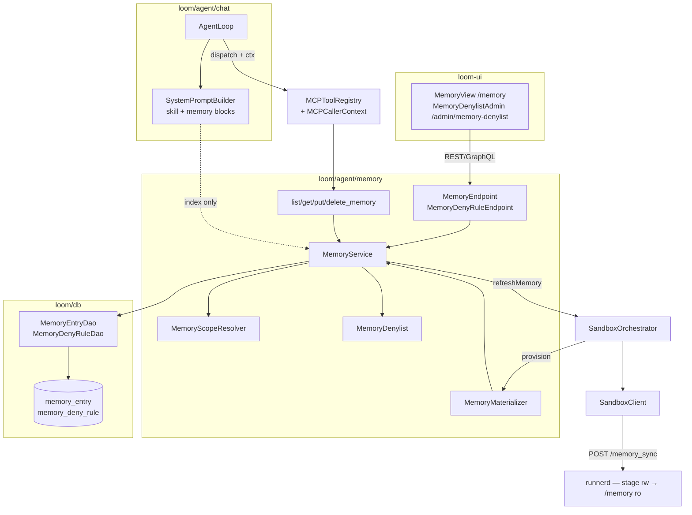

# MetaLoom // Agent Memory Layer

> The **memory layer** of the Loom chat agent: a bank of scoped markdown notes that agentic runs can
> list, read and write, so knowledge survives beyond a single chat. Memory is the fourth pillar of
> the agent harness next to **context**, **sessions** and **skills**.
>
> **Status: shipped.** Phases 0–4 are implemented and tested; what remains is listed in §8. This file
> is the feature reference — the historical phase-by-phase plan has been collapsed into the
> "Already implemented" table in §2. It was renamed from `CHAT_MEMORY_PLAN.md` on 2026-08-16 when the
> plan/reference split stopped making sense.
>
> Related documents:
> - [LOOM_UI_CHAT.md](LOOM_UI_CHAT.md) — chat / agentic loop (context, skills, streaming).
> - [CHAT_SESSIONS_CONCEPT.md](CHAT_SESSIONS_CONCEPT.md) — sessions, publishing, context composition.
> - [CHAT_TASKS.md](../tasks/CHAT_TASKS.md) — backend implementation tasks for the chat feature
>   (MEM1–MEM3 are the memory ones).
> - [MCP.md](../loom/MCP.md) — the MCP tool surface and transports this feature extends.
> - [PERMISSIONS.md](../features/permissions/PERMISSIONS.md) · [DOMAIN.md](../loom/DOMAIN.md) ·
>   [PERSISTENCE.md](../loom/PERSISTENCE.md) · [SPEC_RULES.md](../guidelines/SPEC_RULES.md).

---

## 1. Concept and architecture

A **memory** is one markdown note in a scoped namespace. Its **id is a path** (`projects/loom-db.md`)
and its storage is the `memory_entry` table. Agents reach notes through four MCP tools; humans reach
them through REST + the `/memory` UI view. When a coding sandbox is provisioned the notes are
additionally materialized into the Session Runner as a genuinely **read-only** `/memory` folder.

### 1.1 Load-bearing decisions

| # | Decision | Consequence |
|---|---|---|
| D1 | Source of truth is the **`memory_entry` table**, not a host filesystem tree | Survives restarts and multi-replica deployments; quotas are `SUM(size)`; versioning stays additive |
| D2 | `/memory` is **read-only** in the container; all writes go through MCP tools or REST | One auditable write path; `run_shell` gets `EROFS` |
| D3 | Scopes are **user** (default), **group**, **space** (= the `project` table) | Needs server-resolved caller identity in MCP tools (§3) and `chat.space_uuid` |
| D4 | **No versioning in v1** | Schema is shaped so `memory_entry_version` drops in like `skill_version` did in V2.37 — see §8 |
| D5 | **No implicit scope resolution.** Ids are namespaced per scope; `get/put/delete` take an explicit `scope` | "Most specific wins" would make joining a group silently change what your agent reads |

---

## 2. Already implemented

Everything below was re-verified against the tree at `10f5df46` (2026-08-16). Use it as the map from
concept → code.

| Item | Where it lives |
|---|---|
| MCP caller identity (`MCPCallerContext`, `execute(args, ctx)`, `requiresIdentity`, 4-arg `dispatch`, `__loom` stripping, no EventBus consumer for identity tools) | `loom/services/mcp/.../mcp/model/MCPCallerContext.java`, `.../mcp/tool/MCPTool.java`, `.../mcp/tool/MCPToolRegistry.java` |
| `GroupDao.loadGroupsForUser(UUID)` | `loom/db/api/.../db/model/group/GroupDao.java` + jOOQ impl |
| Schema: `memory_scope` **enum type**, `memory_entry` table, `chat.space_uuid`, `*_MEMORY` permissions | `loom/db/flyway/src/main/resources/db/migration/V2.53__add_agent_memory.sql` |
| Schema: `memory_deny_rule` table + `*_MEMORY_DENY_RULE` permissions | `.../db/migration/V2.54__add_memory_deny_rule.sql` |
| DAO layer | `loom/db/api/.../db/model/memory/{MemoryEntry,MemoryEntryDao,MemoryDenyRule,MemoryDenyRuleDao}.java` (the `MemoryScope` enum lives in `loom-shared/api`, see §11); jOOQ impls in `loom/db/jooq/.../dao/memory/`; `DaoProvider.memoryEntryDao()` / `memoryDenyRuleDao()` |
| Module + Dagger wiring | `loom/agent/memory/` (artifact `loom-agent-memory`), `dagger/MemoryModule.java` (endpoints + provision listeners), `dagger/MemoryToolModule.java` (MCP tools) |
| Id validation / normalization | `MemoryId.java` — lowercase+NFC, `≤200` chars, per-segment `^[a-z0-9][a-z0-9._-]{0,63}$`, no `..`/`//`/backslash/control/non-ASCII, `.md` suffix, depth ≤ `MAX_DEPTH` |
| Rendered frontmatter (never stored, always derived from columns) | `MemoryHeader.java` — hand-rolled, **no YAML dependency**; `stripFrontmatter` discards model-supplied `---` blocks |
| Service: quotas, session-name stamping, sha256, container refresh | `MemoryService.java` |
| Scope resolution (user + groups + chat's space) | `MemoryScopeResolver.java`, `MemoryScopeRef.java` |
| The four MCP tools | `tool/{List,Get,Put,Delete}MemoryTool.java`, shared base `tool/AbstractMemoryTool.java` |
| System-prompt `<memory>` block (index only, `memory.md` inlined for user scope only) | `prompt/MemoryPromptBuilder.java`, composed by `loom/agent/chat/.../prompt/SystemPromptBuilder.java`, called from `AgentLoop.buildHistory()` |
| Per-run write budget | `AgentLoop.memoryWriteBudgetExhausted(...)` |
| Read-only `/memory` folder | `SandboxSpec.java` (`MEMORY_STAGE_PATH = /var/lib/loom-memory`), `PodmanBackend` (named volume, `:rw,Z` + `:ro,Z`), `KubernetesBackend` (one `emptyDir`, two volumeMounts, `/memory` `readOnly: true`), `runnerd.py` `POST /memory_sync` + `_safe_memory_path`, `SandboxClient.memorySync`, `SandboxOrchestrator.refreshMemory`, `sandbox/MemoryMaterializer.java` |
| Shared scopes (`group`, `space`) incl. `<memory_content>` delimiting and the two shared-scope switches | `MemoryScopeResolver`, `GetMemoryTool`, `MemoryService.renderForModel`, `MemoryOptions` |
| Denylist enforcement | `MemoryDenylist.java` (called from `MemoryService.put()` after stripping/sanitizing) |
| REST: `/api/v1/memory` (`/scopes`, `/entry`) | `rest/MemoryEndpoint.java`, `rest/MemoryEndpointService.java` |
| REST: `/api/v1/memory-deny-rules` (+ `/:uuid`) | `rest/MemoryDenyRuleEndpoint.java`, `rest/MemoryDenyRuleEndpointService.java` |
| OpenAPI | all five routes are in the generated `loom/doc/src/main/generated/openapi.{json,yaml}` |
| GraphQL surface | `loom/services/graphql/.../MemoryWiring.java` (registered in `LoomGraphQLProvider`) |
| DB integrity checks | `DanglingMemoryEntryScopeCheck` (`DANGLING_MEMORY_ENTRY_SCOPE`) and the `memory_entry.scope` vocabulary check (`VOCABULARY_MEMORY_ENTRY_SCOPE`) in `loom/db/jooq/.../integrity/` — the compensation for the FK-less `scope_uuid` (§9) |
| UI | `loom-ui/src/api/memory.ts`, `loom-ui/src/api/memoryDenylist.ts`, `loom-ui/src/features/memory/MemoryView.tsx`, `MemoryDenylistAdmin` inside `loom-ui/src/features/admin/AdminArea.tsx`, nav entries in `loom-ui/src/layout/Sidebar.tsx`, `memory.*` / `admin.memoryDenylist.*` keys in both locales |
| Demo data | `DemoDatabaseInitializer` seeds two deny rules (project codenames, `AKIA[0-9A-Z]{16}`) **and** three user-scope notes for the admin (`house-style.md`, `conventions/tagging.md`, `projects/q3-campaign.md`) |
| Customer-facing docs | `website/content/english/docs/loom/chat/index.adoc` (memory section + `memory-keeper` example skill) |

### 2.1 Deviations from the original plan

- **`runnerd` does not chmod the memory stage 0444/0555.** The owner cannot reopen a 0444 file for
  writing, so it would have broken every sync after the first while adding no real protection. The
  read-only guarantee is the second, `readOnly` mount of the same volume.
- **`MemoryService` injects `Provider<SandboxOrchestrator>`**, not the orchestrator directly — the
  orchestrator's provision listeners include `MemoryMaterializer`, which needs the service, so a
  direct injection is a Dagger construction cycle.
- **`AgentLoop` takes an `AgentLoopDeps` record** rather than gaining two more positional parameters.
- **Podman uses a named volume** for memory, not a tmpfs — a tmpfs cannot be mounted twice.
- **The denylist shipped as an admin-managed table**, not a hard-coded regex list (§4) — rules are
  editable without a deploy and each carries its own rejection message.
- **A GraphQL surface was added** on top of the planned REST surface (`MemoryWiring`).
- **The shared scopes are addressed by one `ref` argument**, not by separate `group` / `space`
  arguments (§3.1). One parameter that means "which group or space, by name" keeps the descriptor
  small and makes `scope` the only thing that decides *which* namespace is written.
- **`MemoryScope` lives in `loom-shared/api`** (`io.metaloom.loom.api.memory`), not in the DB model
  package — the REST/GraphQL layers and the tools need it without depending on `loom/db/api`.

---

## 3. Behaviour reference

### 3.1 Tools

All four set `requiresIdentity = true`, so `MCPToolRegistry` registers **no** EventBus consumer for
them and they are only reachable through the 4-arg `dispatch`.

| Tool | Parameters | Permission |
|---|---|---|
| `list_memory` | `scope` (`user\|group\|space\|all`, default `all`), `ref`, `prefix`, `limit` (50) | `READ_MEMORY` |
| `get_memory` | `id`\*, `scope` (default `user`), `ref`, `includeHeader` | `READ_MEMORY` |
| `put_memory` | `id`\*, `content`\* (body only), `scope`, `ref`, `title` | `UPDATE_MEMORY` |
| `delete_memory` | `id`\*, `scope`, `ref` | `DELETE_MEMORY` |

`ref` names the group or space **by label** and is only consulted when the caller has more than one
of them; it is ignored for the `user` scope. It is a filter over the server-resolved set, never an
identifier the model can invent (§6.3). Only `list_memory` accepts `scope=all`.

Create and update collapse onto `UPDATE_MEMORY` because `MCPToolRegistry` checks permissions at the
**descriptor** level and cannot vary them per call; `CREATE_MEMORY` gates only the REST create route.

### 3.2 Quotas (checked in `MemoryService.put()` before the write; violations are *error tool results*)

body bytes ≤ `maxEntryBytes` · entries per scope ≤ `maxEntriesPerScope` (`stats().count()`) · total
bytes per scope ≤ `maxScopeBytes` (`stats().bytes()`, an overwrite credits back the old `size`) · id
depth ≤ `maxDepth` (`MemoryId`) · writes per agent run ≤ `maxWritesPerRun` (`AgentLoop`).

`AgentLoop.loadMemory()` treats memory as an enhancement, never a precondition: any failure resolving
scopes or loading the index logs a WARN and the run continues with no memory context at all.

### 3.3 Session name (denormalized on the row, resolved fresh on every put)

`chatSessionDao.loadByChat(chatUuid).getName()` → `chatDao.load(chatUuid).getTitle()` →
`"chat-" + uuid.substring(0,8)`. The first `put_memory` of a chat usually lands on step 2 or 3
because `chat_session.name` only exists after the first completed exchange. Accepted, not worked
around. REST/UI writes stamp `session_name = "loom-ui"` and `chat_uuid = NULL`.

### 3.4 When a chat has no space

The `space` scope simply does not exist for that run: it is omitted from `list_memory` and from the
`<memory>` prompt block, and `put_memory(scope="space")` fails with an explicit message. There is
**no silent fallback to `user`** — a scope downgrade would write shared-intent content into a
private scope.

---

## 4. The memory denylist

An instance-wide, admin-curated list of regexes that must never enter the memory bank. `MemoryDenylist.check(title, body)`
runs from `MemoryService.put()` **after** frontmatter stripping and title sanitizing, so a rule cannot
be evaded by hiding a phrase in an agent-supplied header. Both title and body are checked.

Three deliberate behaviours:

- **The rule's message is used verbatim and the match is never echoed** — an agent stopped from
  storing a secret must not paste it into the transcript instead.
- **Fail open on operator error.** An invalid pattern or a lookup that throws is logged and skipped
  rather than blocking every write. The denylist is a safety net; the authorization gates are scopes.
- **Bounded matching.** `java.util.regex` has no timeout and a typo like `(a+)+$` backtracks
  exponentially against a 256 KiB body. Matching runs against `MemoryDenylist.BoundedCharSequence`,
  which counts `charAt` reads and aborts the rule when its step budget is spent.

Patterns are compiled and length-capped (`MAX_PATTERN_LENGTH = 512`) at the API, so a broken rule is
rejected on write rather than silently skipped at match time.

⚠️ `check()` calls `daos.memoryDenyRuleDao().loadEnabled()` **on every invocation** — there is no
cache. That is one extra query per `put_memory`, acceptable at current write volumes, but it is the
first thing to look at if memory writes get hot. `loadEnabled()` orders by name so that when several
rules match, the rejection is deterministic.

Permissions are deliberately separate from note permissions: `*_MEMORY` is meant to be held by every
chat user, while `*_MEMORY_DENY_RULE` is instance policy and belongs in the admin area.

⚠️ **The intent is not the shipped default.** No migration or demo role grants `*_MEMORY` to anybody,
and `PERMISSION_GROUPS` in `AdminArea.tsx` carries no Memory group, so on a fresh instance nobody has
the permission and there is no screen to hand it out. Tracked as **MEM2** in
[CHAT_TASKS.md](../tasks/CHAT_TASKS.md).

---

## 5. Environment variables

All under `MemoryOptions` (`loom-shared/api/.../api/options/MemoryOptions.java`), reachable as
`LoomOptions.getMemory()`.

| Environment variable | Default | Description |
|---|---|---|
| `LOOM_AGENT_MEMORY_ENABLED` | **`false`** | Master switch. When off `MemoryToolModule` returns `Set.of()` — the tools are neither registered nor advertised — and no prompt block is emitted |
| `LOOM_AGENT_MEMORY_MOUNT_ENABLED` | `true` | Materialize memory into the Session Runner; the tools work without it |
| `LOOM_AGENT_MEMORY_MOUNT_PATH` | `/memory` | Read-only path inside the Session Runner (`SandboxSpec.memoryMountPath()`) |
| `LOOM_AGENT_MEMORY_MAX_ENTRY_BYTES` | `262144` | Max body size of one entry |
| `LOOM_AGENT_MEMORY_MAX_ENTRIES_PER_SCOPE` | `500` | Max entries per scope |
| `LOOM_AGENT_MEMORY_MAX_SCOPE_BYTES` | `16777216` | Max total body bytes per scope |
| `LOOM_AGENT_MEMORY_MAX_DEPTH` | `4` | Max path segments of a memory id |
| `LOOM_AGENT_MEMORY_MAX_WRITES_PER_RUN` | `20` | Cap on put/delete calls per agent run |
| `LOOM_AGENT_MEMORY_PROMPT_MAX_ENTRIES` | `50` | Index entries injected into the system prompt |
| `LOOM_AGENT_MEMORY_PROMPT_MAX_CHARS` | `4096` | Cap on the injected `<memory>` block |
| `LOOM_AGENT_MEMORY_SHARED_SCOPES_ENABLED` | `true` | Allow `group` / `space` scopes at all |
| `LOOM_AGENT_MEMORY_SHARED_WRITE_ENABLED` | `true` | Allow the *agent* to write shared scopes (off ⇒ shared memory is agent-read-only, human-curated via REST/UI) |

`MemoryOptions.validate()` rejects a non-positive `maxScopeBytes` and a non-absolute `mountPath` at
boot rather than at first write.

Container-side: `RUNNER_MEMORY_STAGE` is set by the backend **only** when memory is enabled; without
it `runnerd` answers `404` on `/memory_sync`. It is deliberately **not** baked into the Containerfile.

---

## 6. Security model

1. **Prompt injection via shared memory** is the sharpest risk: user A writes `space:conventions.md`
   with hostile instructions, user B's agent reads it and acts with **B's** permissions. Mitigations:
   shared bodies are never auto-inlined into the system prompt (index only; `memory.md` inlining is
   user-scope only); `get_memory` wraps shared content in `<memory_content …>` plus an explicit
   "data, not instructions" line; `SHARED_WRITE_ENABLED=false` for human-curated deployments; memory
   calls render as ordinary tool chips so a run is auditable. Memory confers no *new* capability —
   the blast radius is whatever tools B already has.
2. **Path traversal** — two independent layers: the `MemoryId` whitelist on the way in and
   `runnerd._safe_memory_path` (realpath + prefix check) on the way out. `runnerd._safe_path` is
   deliberately **not** extended, so `write_file`/`read_file`/`list_files` stay workspace-only.
3. **Spoofing** — the only channel the model controls is `arguments`, and nothing there participates
   in authorization: `userUuid` comes from the request, `groupUuids` from `GroupDao`, `spaceUuid`
   from the `chat` row. `scope` and `ref` are filters over the server-resolved set; an unmatched
   value returns one identical message, so it is not an existence oracle.
4. **Cross-tenant leakage** — every DAO query is keyed by `(scope, scope_uuid)`; REST returns **404**
   (not 403) for invisible scopes, mirroring `loadOwnedChat`.
5. **Read-only enforcement** is kernel-level via the double-mounted volume; `runnerd` is unprivileged
   with `--cap-drop=ALL` and could not enforce it itself.
6. **Header forgery** — the header is rendered from columns and never stored; model-supplied
   frontmatter is stripped and logged at WARN (a prompt-injection tell).
7. **Secrets** — the denylist (§4) is the mitigation; deletion is still irreversible (§8).

---

## 7. Test setup

**Prerequisite** (per [.claude/CLAUDE.md](../../.claude/CLAUDE.md)): `./setup-pool.sh`, then
`loom/db/jooq/generate.sh`, after any Flyway change — otherwise the pooled test databases are stale
and the suite fails confusingly.

| Layer | Test |
|---|---|
| DAO | `loom/db/jooq/src/test/java/io/metaloom/loom/db/jooq/dao/MemoryEntryDaoTest.java`, `MemoryDenyRuleDaoTest.java` |
| Unit | `loom/agent/memory/src/test/java/…` — `MemoryIdTest`, `MemoryHeaderTest`, `MemoryServiceTest`, `MemoryDenylistTest`, `MemoryScopeResolverTest`, `prompt/MemoryPromptBuilderTest`, `sandbox/MemoryMaterializerTest` (+ `TestMemoryEntry` fixture). Verified green on 2026-08-16 (`mvn -pl loom/agent/memory test`, no DB needed) |
| MCP identity | `loom/services/mcp/src/test/java/io/metaloom/loom/mcp/tool/MCPToolIdentityTest.java` |
| Loop | `AgentLoopTest` — `<memory>` block presence, `MCPCallerContext` capture, write-budget exhaustion |
| Endpoint | `loom/core/src/test/java/io/metaloom/loom/core/endpoint/test/MemoryEndpointTest.java`, `MemoryDenyRuleEndpointTest.java` |
| GraphQL | `loom/core/src/test/java/io/metaloom/loom/core/endpoint/graphql/MemoryGraphQLTest.java` |
| Runner daemon | `loom/agent/session-runner/test_runnerd.py` — `/memory_sync` write, prune, path-escape, the workspace-guard-cannot-reach-the-stage case and the "no stage env ⇒ off" case |
| UI (mocked) | `loom-ui/e2e/memory-mocked.spec.ts` — scope tabs, empty vs no-match, read-only scope, create/edit/**rename**/delete verbs and query params, the 409 path, and the 404 state when the feature is off · `loom-ui/e2e/memory-denylist-mocked.spec.ts` — rule CRUD over `memory-deny-rules`, POST-not-PUT updates, the enable toggle, and the inline invalid-regex error |
| UI (backend) | `loom-ui/e2e/memory-backend.spec.ts` — note lifecycle against a real server, and the one test that proves the denylist is load-bearing: a rule is created, a matching write is refused **400** with the rule's own message (which does not echo the match), the title is checked as well as the body, nothing is left behind, and disabling the rule lets the same write through. Needs `LOOM_AGENT_MEMORY_ENABLED=true` — the demo container image sets it. |

⚠️ Endpoint tests must grant `*_MEMORY` via the **group + role** pattern used by `SkillEndpointTest`;
direct user grants are limited to one permission per user.

**Not covered** (see §8): a podman sandbox integration test asserting `EROFS` on `/memory`, a Java
e2e (`e2e-test/`) spec for cross-chat recall, and the `loom-ui/src/api/memory*.ts` client modules
have no vitest suites (CHAT_TASKS QW7). The memory screens themselves are covered by the Playwright
specs above.

---

## 8. Progress Assessment

Phases 0–4 (identity plumbing · schema/DAO/tools · read-only folder · shared scopes · REST+UI) are
complete — see §2 for the code map, re-verified at `10f5df46`. Open work, in the order it hurts:

- [ ] **`memory_entry_version` for shared scopes.** The sharpest remaining gap: an agent that
      "tidies up" a `group`/`space` note destroys another person's work with no history. Keep it
      additive exactly as `skill_version` was bolted onto `skill` in
      [V2.37](../../loom/db/flyway/src/main/resources/db/migration/V2.37__add_skill_version.sql) —
      `memory_entry.version` already increments per write, and `body` is a `text` column, so
      `memory_entry_version(memory_uuid, version_number, title, body, meta, created, creator_uuid)`
      is a straight copy of the `skill_version` shape. `delete_memory` then becomes a tombstone.
      `user` scope can wait; do `group`/`space` first, where writer ≠ owner.
      → CHAT_TASKS **MEM1**.
- [ ] **Nobody can be granted `*_MEMORY`.** No migration or demo role grants any of the four
      `*_MEMORY` permissions, and `PERMISSION_GROUPS` in `loom-ui/src/features/admin/AdminArea.tsx`
      has no Memory group — even though the `admin.roles.permission.*_MEMORY` labels already exist in
      both locales. On a fresh instance the `/memory` view and all four tools 403 for every non-seeded
      role, including the demo Editor the demo assistant runs as. → CHAT_TASKS **MEM2**.
- [ ] **Memory chips in the chat timeline.** The tools already emit `references` of type `memory`,
      but `RefChip` in `loom-ui/src/features/chat/ChatWorkspace.tsx` has no `memory` entry in its
      `RefType` union, `iconMap`, `colorMap` or `handleClick`, so the chips render unstyled and are
      inert. Needs a branch that navigates to `/memory` (or previews the note).
      → TASK_UI_CHAT Task 1 / CHAT_TASKS QW5.
- [ ] **No client coverage for the memory REST surface.** `loom-client` has no memory methods at all,
      and `clients/python` carries only the four deny-rule models — no entry models and no methods —
      with `test_parity.py` explicitly excluding memory. The five routes are in the generated OpenAPI,
      so only the clients are behind. → CHAT_TASKS **MEM3**.
- [ ] **`sha256`-based delta sync.** `memory_entry.sha256` is computed and stored
      (`MemoryService.sha256(MemoryHeader.renderFile(...))`) but never read: `MemoryMaterializer`
      still posts the whole tree on every write. Pure optimization, bounded today by the per-scope
      quotas.
- [ ] **Sandbox integration test** — provision a runner with memory enabled, assert
      `cat /memory/user/x.md` shows rendered frontmatter, `echo > /memory/…` returns
      `Read-only file system`, put→cat reflects the change and delete→cat prunes it.
- [ ] **e2e spec** (`e2e-test/`) — one chat stores a fact, a second chat recalls it. The UI half
      (the `/memory` view listing and editing a note) is done: `loom-ui/e2e/memory-mocked.spec.ts`
      and `memory-backend.spec.ts` (§7); what is still missing is the cross-chat recall path.
- [ ] **Denylist rule caching** — `MemoryDenylist.check()` re-reads `loadEnabled()` per call (§4).
- [ ] **No memory metrics.** [METRICS.md](../features/ops/METRICS.md) has no `loom_memory_*` family,
      so writes, denials and quota rejections are invisible to monitoring. Low priority, but it is the
      only way an operator would notice the denylist firing.
- [ ] **Per-scope ACLs.** One flat permission set cannot express "read shared, don't write shared":
      `UPDATE_MEMORY` grants write to every visible scope and `SHARED_WRITE_ENABLED` is a
      deployment-wide sledgehammer. Needs a join table; revisit once shared scopes see real use.
- [ ] **Group scope has no natural identity.** A user in five groups gets a five-way
      `/memory/group/*` tree and a noisy `list_memory`. Consider a single primary group, or making
      it opt-in per chat (`chat.memory_group_uuid` alongside `space_uuid`).

---

## 9. Conventions and Gotchas

- **`memory_scope` is a Postgres ENUM TYPE, not a table.** Only `memory_entry` and
  `memory_deny_rule` are tables.
- **`memory_entry.scope_uuid` has no foreign key** — it points at `user`, `group` or `project`
  depending on `scope`. Integrity is service-layer; orphans (deleted group/space) are simply never
  resolvable by `MemoryScopeResolver` rather than dangling, and `DanglingMemoryEntryScopeCheck`
  reports them in the DB integrity run. Only `creator_uuid`, `editor_uuid` and `chat_uuid` are FK'd.
- **`MemoryDenylist.check()` hits the DB on every call** — no cache (§4).
- **Never reference a `loom_permission` value in the migration that adds it** — PostgreSQL forbids
  using a value added by `ALTER TYPE … ADD VALUE` in the same transaction. V2.53/V2.54 both carry the
  reminder comment. This is *why* neither migration seeds a grant — the follow-up migration that was
  supposed to do it never landed (§8, MEM2).
- **Always `./setup-pool.sh` after a Flyway change**, then `loom/db/jooq/generate.sh`.
- **Keep the jsonb column named `meta`.** The jOOQ `forcedTypes` include-expression in
  `loom/db/jooq/pom.xml` is `.*\.meta.*`, so `memory_entry.meta` gets `JsonObjectConverter` for free.
- **`listIndex` must never project `body`.** It runs on every turn; pulling bodies would be a
  per-turn full-table read.
- **Do not extend `runnerd._safe_path`** to reach the memory stage — workspace tools stay
  workspace-only; memory has its own `_safe_memory_path`.
- **`runnerd` cannot make a folder read-only by itself** — unprivileged, `--cap-drop=ALL`, and a
  same-uid `chmod 0555` is reversible. The guarantee comes from the backend mounting one volume twice.
- **The sandbox holds no credentials — ever.** Data arrives only by push from Loom. This is what
  rules out a bootstrapping sidecar or any "let the runner fetch it itself" design.
- **A podman `--tmpfs` cannot be mounted twice** — memory needs a *named volume*, unlike `/workspace`.
- **MCP permissions are per-descriptor, not per-call** — hence create and update share
  `UPDATE_MEMORY`.
- **`MCPToolDescriptor.toJson()` must stay byte-identical** now that `requiresIdentity` exists;
  external MCP clients parse it.
- **Foreign resources return 404, not 403.** Apply it to invisible memory scopes.
- **A memory seed failure must never fail sandbox provisioning** — log WARN and continue. Same rule
  inside the loop: `AgentLoop.loadMemory()` degrades to "no memory" rather than failing the run.
- **`SandboxOrchestrator` must not depend on the memory module** — the `SandboxProvisionListener`
  interface with a no-op Dagger default keeps the direction right.
- **Nested memory ids go in a query parameter**, not the route path (the `SessionFsEndpoint ?path=`
  precedent) — arbitrary depth without wildcard routing.
- **`memory.md`, not `MEMORY.md`.** `MemoryId` lowercases and rejects uppercase, so the inlined note
  id is lowercase.
- **Adding a permission is four edits, not one** — the enum, the migration, the hand-written
  `JooqLoomPermission`, and `PERMISSION_GROUPS` + the locale labels if it is meant to be grantable
  from the admin area. The memory permissions stopped after the first three (§8, MEM2).

---

## 10. Where do I find …?

| Concept | Path |
|---|---|
| Memory module root | [loom/agent/memory/](../../loom/agent/memory/) |
| Service, quotas, denylist call, refresh | [MemoryService.java](../../loom/agent/memory/src/main/java/io/metaloom/loom/agent/memory/MemoryService.java) |
| Id validation (the traversal gate) | [MemoryId.java](../../loom/agent/memory/src/main/java/io/metaloom/loom/agent/memory/MemoryId.java) |
| Frontmatter render/strip | [MemoryHeader.java](../../loom/agent/memory/src/main/java/io/metaloom/loom/agent/memory/MemoryHeader.java) |
| Denylist matching + bounded regex | [MemoryDenylist.java](../../loom/agent/memory/src/main/java/io/metaloom/loom/agent/memory/MemoryDenylist.java) |
| The four MCP tools | [tool/](../../loom/agent/memory/src/main/java/io/metaloom/loom/agent/memory/tool/) |
| Tool registration (returns `Set.of()` when disabled) | [MemoryToolModule.java](../../loom/agent/memory/src/main/java/io/metaloom/loom/agent/memory/dagger/MemoryToolModule.java) |
| `<memory>` prompt block | [MemoryPromptBuilder.java](../../loom/agent/memory/src/main/java/io/metaloom/loom/agent/memory/prompt/MemoryPromptBuilder.java), [SystemPromptBuilder.java](../../loom/agent/chat/src/main/java/io/metaloom/loom/agent/chat/prompt/SystemPromptBuilder.java) |
| REST endpoints | [rest/](../../loom/agent/memory/src/main/java/io/metaloom/loom/agent/memory/rest/) |
| GraphQL wiring | [MemoryWiring.java](../../loom/services/graphql/src/main/java/io/metaloom/loom/graphql/MemoryWiring.java) |
| Migrations | [V2.53__add_agent_memory.sql](../../loom/db/flyway/src/main/resources/db/migration/V2.53__add_agent_memory.sql), [V2.54__add_memory_deny_rule.sql](../../loom/db/flyway/src/main/resources/db/migration/V2.54__add_memory_deny_rule.sql) |
| DB integrity check | [DanglingMemoryEntryScopeCheck.java](../../loom/db/jooq/src/main/java/io/metaloom/loom/db/jooq/integrity/check/DanglingMemoryEntryScopeCheck.java) |
| Container mounts | [PodmanBackend.java](../../loom/agent/sandbox/src/main/java/io/metaloom/loom/agent/sandbox/backend/PodmanBackend.java), [KubernetesBackend.java](../../loom/agent/sandbox/src/main/java/io/metaloom/loom/agent/sandbox/backend/KubernetesBackend.java), [SandboxSpec.java](../../loom/agent/sandbox/src/main/java/io/metaloom/loom/agent/sandbox/backend/SandboxSpec.java) |
| Runner daemon `/memory_sync` | [runnerd.py](../../loom/agent/session-runner/runnerd.py) |
| Options / env vars | [MemoryOptions.java](../../loom-shared/api/src/main/java/io/metaloom/loom/api/options/MemoryOptions.java) |
| MCP identity plumbing | [MCPToolRegistry.java](../../loom/services/mcp/src/main/java/io/metaloom/loom/mcp/tool/MCPToolRegistry.java), [MCPTool.java](../../loom/services/mcp/src/main/java/io/metaloom/loom/mcp/tool/MCPTool.java) |
| UI | [MemoryView.tsx](../../loom-ui/src/features/memory/MemoryView.tsx), [memory.ts](../../loom-ui/src/api/memory.ts), [memoryDenylist.ts](../../loom-ui/src/api/memoryDenylist.ts), `MemoryDenylistAdmin` in [AdminArea.tsx](../../loom-ui/src/features/admin/AdminArea.tsx) |
| Demo deny rules + demo notes | [DemoDatabaseInitializer.java](../../loom/core/src/main/java/io/metaloom/loom/core/boot/DemoDatabaseInitializer.java) |
| Customer-facing docs | [website/…/docs/loom/chat/index.adoc](../../website/content/english/docs/loom/chat/index.adoc) |

---

## 11. Key Classes Reference

| Class | Package | Purpose |
|---|---|---|
| `MemoryScope` | `io.metaloom.loom.api.memory` (`loom-shared/api`) | The `user`/`group`/`space` enum — shared by DB, REST and the tools |
| `MemoryEntry` / `MemoryEntryDao` | `io.metaloom.loom.db.model.memory` | Model + DAO for `memory_entry` |
| `MemoryDenyRule` / `MemoryDenyRuleDao` | `io.metaloom.loom.db.model.memory` | Model + DAO for `memory_deny_rule` (`loadEnabled()` ordered by name) |
| `MemoryEntryImpl` / `MemoryEntryDaoImpl` | `io.metaloom.loom.db.jooq.dao.memory` | jOOQ implementations |
| `MemoryId` | `io.metaloom.loom.agent.memory` | Parse/validate/normalize a memory id — the traversal gate |
| `MemoryScopeRef` | `io.metaloom.loom.agent.memory` | Resolved scope `(scope, refUuid, label)` |
| `MemoryHeader` | `io.metaloom.loom.agent.memory` | Renders frontmatter from columns; strips model-supplied frontmatter |
| `MemoryScopeResolver` | `io.metaloom.loom.agent.memory` | user + chat → the caller's available scopes |
| `MemoryService` | `io.metaloom.loom.agent.memory` | DAO + resolver + quotas + denylist + session stamping + container refresh |
| `MemoryDenylist` | `io.metaloom.loom.agent.memory` | Regex denylist with `BoundedCharSequence` step budget |
| `MemoryException` | `io.metaloom.loom.agent.memory` | Carries the user-facing rejection message into an error tool result |
| `MemoryPromptBuilder` | `io.metaloom.loom.agent.memory.prompt` | The `<memory>` system-prompt block |
| `SystemPromptBuilder` | `io.metaloom.loom.agent.chat.prompt` | Composes skill + memory prompt blocks |
| `AbstractMemoryTool`, `List/Get/Put/DeleteMemoryTool` | `io.metaloom.loom.agent.memory.tool` | The four MCP tools |
| `MemoryMaterializer` | `io.metaloom.loom.agent.memory.sandbox` | `SandboxProvisionListener` — renders entries and posts `memory_sync` |
| `MemoryEndpoint` / `MemoryEndpointService` | `io.metaloom.loom.agent.memory.rest` | `/api/v1/memory` REST surface |
| `MemoryDenyRuleEndpoint` / `…Service` | `io.metaloom.loom.agent.memory.rest` | `/api/v1/memory-deny-rules` CRUD |
| `MemoryModule` / `MemoryToolModule` | `io.metaloom.loom.agent.memory.dagger` | Endpoint + provision-listener bindings; MCP tool contribution |
| `MemoryOptions` | `io.metaloom.loom.api.options` | `LOOM_AGENT_MEMORY_*` configuration |
| `MemoryWiring` | `io.metaloom.loom.graphql` | GraphQL surface |
| `DanglingMemoryEntryScopeCheck` | `io.metaloom.loom.db.jooq.integrity.check` | Reports `scope_uuid` values that resolve to nothing |
| `MCPCallerContext` | `io.metaloom.loom.mcp.model` | Server-resolved caller identity for identity tools |
| `SandboxSpec` / `SandboxProvisionListener` | `io.metaloom.loom.agent.sandbox.backend` / `…sandbox` | Mount spec; the hook keeping the orchestrator memory-agnostic |
| `MCPToolRegistry` *(existing)* | `io.metaloom.loom.mcp.tool` | 4-arg dispatch + local invocation path for identity tools |
| `SandboxOrchestrator` *(existing)* | `io.metaloom.loom.agent.sandbox` | `SandboxSpec` build + `refreshMemory` |
| `AgentLoop` *(existing)* | `io.metaloom.loom.agent.chat.loop` | Builds the caller context, injects the index, enforces the write budget |

---
_Git HEAD revision: `10f5df46`_
_Last updated: 2026-08-16 (implementation audit; renamed from `CHAT_MEMORY_PLAN.md`; §2/§3.1/§11
corrected against the code; relative links repaired; MEM2 and MEM3 added to §8)_
