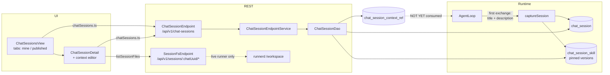

# Chat Sessions — Publishing, Discovery & Context Composition

> **Status: mostly shipped.** Despite the "concept" filename this document is now largely an
> *as-built* spec. The table + DAO + REST + UI + demo data + e2e all exist and are wired end to end.
> **Two designed parts are not implemented:** the `/session` **filesystem snapshot** (§6) and the
> **run-time** assembly of referenced context in `AgentLoop` (§5.2). Everything else below describes
> code that ships.
>
> **Context:** [CHAT.md](../../loom/ui/CHAT.md) (agentic loop, streaming, skills) ·
> [CHAT_MEMORY.md](CHAT_MEMORY.md) (agent memory bank) ·
> [CHAT_TASKS.md](CHAT_TASKS.md) (backend task record) ·
> [TASK_UI_CHAT.md](../../loom/ui/TASK_UI_CHAT.md) (UI task record)

## 0. Progress Assessment

- [x] Migration **`V2.52__add_chat_session.sql`** — `chat_session`, `chat_session_skill`,
      `chat_session_context_ref` + `CREATE/READ/UPDATE/DELETE_CHAT_SESSION`
- [x] `ChatSessionDao` (`db/api`) + `ChatSessionDaoImpl` (`db/jooq`) + `DaoCollection.chatSessionDao()`
- [x] `ChatSessionDaoTest` (CRUD, `loadByChat`, context refs, skill pins, delete-cascade)
- [x] REST `ChatSessionEndpoint` / `ChatSessionEndpointService` under `/api/v1/chat-sessions`
- [x] rest-model `io.metaloom.loom.rest.model.chatsession.*` + `ChatSessionModelBuilder` +
      `ChatSessionModelValidator` + OpenAPI registration
- [x] Auto name + description + **auto-capture** on first exchange (`AgentLoop.captureSession`)
- [x] Skill-version pinning at capture time (`chat_session_skill`)
- [x] Publish / unpublish + `?scope=mine|published` library listing (server-filtered, ownership-gated)
- [x] Context references stored + served + editable (`GET|PUT /:uuid/context`)
- [x] loom-ui: `chatSessions.ts`, `ChatSessionsView`, `ChatSessionDetail` (incl. context editor),
      routes + sidebar entry
- [x] Demo data (`DemoDatabaseInitializer` — 3 sessions, refs, pins) and
      `loom-ui/e2e/chat-sessions-mocked.spec.ts` (11 tests — CRUD, tabs, detail saves, files panel)
- [ ] **Filesystem snapshot / restore** (§6) — columns exist, nothing writes them; no `runnerd`
      `/snapshot`+`/restore`; the sandbox workspace is a **tmpfs**
- [ ] **Run-time context assembly** (§5.2) — `AgentLoop` never reads `chat_session_context_ref`
- [ ] **`ChatSessionEndpointTest`** — endpoint + permission + cross-user-isolation tests are missing
      (required by [CODING.md](../../guidelines/CODING.md)); only the DAO is covered
- [ ] Tag / free-text (`?tag=`, `?q=`) list filters — only `?scope=` plus the generic
      `FilterParameters` are honoured
- [ ] Relative ages in the UI ("edited 3 days ago") — both views render absolute `toLocaleString()`



## 1. What a "chat session" is

A **chat session** is the durable, publishable record behind one chat: its name/description, tags,
the skill **versions** that were active, and (by design) a snapshot of the coding sandbox filesystem.
Naming is uniform: table `chat_session`, REST `/api/v1/chat-sessions`, UI route `/chat/sessions`.

A session is created **automatically** by the agent loop (§2), or manually via `POST /chat-sessions`
(`chatUuid` optional — a hand-made session has no owning chat). `chat_uuid` is
**`ON DELETE SET NULL`**, so a published session survives deletion of its chat.

## 2. Auto-generated name & description

`AgentLoop` auto-titles a chat after the first exchange; the same path now also generates a
one-sentence description (≤25 words, ≤512 chars, `generateDescription`) and calls `captureSession`,
which inserts the `chat_session` row and pins the active skill versions. Both steps are
**best-effort** (every failure is logged and swallowed) and `captureSession` is **idempotent** —
`loadByChat` short-circuits if a session already exists. Name and description are afterwards
user-editable in the UI.

## 3. Data model

Authoritative source: [`V2.52__add_chat_session.sql`](../../../loom/db/flyway/src/main/resources/db/migration/V2.52__add_chat_session.sql).
Not reproduced here — read the migration. Shape summary:

| Table | Key columns | Notes |
|---|---|---|
| `chat_session` | `uuid`, `chat_uuid`, `name`, `description`, `tags text[]`, `published`, `meta jsonb`, `pool_uuid`/`blob_path`/`fs_size`/`fs_sha256`, audit columns | `chat_uuid` + `pool_uuid` are `ON DELETE SET NULL`; indexes on `published` and `creator_uuid`. The four `fs*`/pool columns are **reserved for §6 and currently always NULL**. |
| `chat_session_skill` | PK (`session_uuid`, `skill_uuid`), `skill_version` | Pins `skill_version.version_number` (V2.37) so a shared session is reproducible. |
| `chat_session_context_ref` | PK (`session_uuid`, `source_session_uuid`), `include_chat_history`, `include_skills`, `include_filesystem`, `ordinal` | Both FKs cascade — deleting a session removes *its own* ref rows in either direction, never the referenced session. |

Permissions follow the flat-enum + service-layer-ownership pattern
([PERMISSIONS.md](../permissions/PERMISSIONS.md)): global `*_CHAT_SESSION` permissions gate the
feature, per-object visibility (own rows **or** published rows) is enforced in
`ChatSessionEndpointService` (`loadOwned` / `requireOwned` / `loadViewable`).

## 4. Active skill version reference

A chat tracks `meta.activeSkillUuids`; a session additionally pins **which version** of each active
skill was in play (`ChatSessionSkillPin`, written by `AgentLoop.captureSession`, replaceable via
`ChatSessionDao.replaceSkillPins`). `ChatSessionDetail` renders them as `<uuid-prefix> @ v3` chips —
skill *names* are not resolved yet.

## 5. Context composition (no install / fork)

### 5.1 Storage + editing — shipped

A session's context is a **live, reversible** set of references to other sessions, each with three
independent toggles (**chat history**, **skills**, **filesystem**) and an `ordinal`. Nothing is
copied. `PUT /chat-sessions/:uuid/context` replaces the whole ref set (`replaceContextRefs`);
`GET` returns it; the detail response also embeds `contextRefs` and `skills` (`enrich(...)`).

### 5.2 Run-time assembly — NOT implemented

The design is: at run time `AgentLoop` walks the refs in `ordinal` order and restores the referenced
filesystem, adds the referenced pinned skill versions to the active set, and injects a condensed,
clearly-delimited transcript. **No such code exists** — `AgentLoop` has no reference to
`loadContextRefs`. Today the refs are metadata that the UI can author and read back, nothing more.
Implementing this is the main open work item for this feature.

### 5.3 Endpoints (as built)

Base path `API_V1_PATH + "/chat-sessions"`, registered by `ChatSessionEndpoint` in
`loom/agent/chat` (literal sub-paths registered **before** `/:uuid`).

| Route | Meaning |
|---|---|
| `GET /chat-sessions?scope=mine\|published` | List. `scope=published` → `findPublished`; anything else → `findByCreator(caller)`. Paging/sort/generic filters come from `PagingParameters`/`FilterParameters`. |
| `POST /chat-sessions` | Create/capture (name defaults to `"Untitled session"`). |
| `GET /chat-sessions/:uuid` | Detail — enriched with `contextRefs` + `skills`. Viewable if owned **or** published. |
| `POST /chat-sessions/:uuid` | Partial update of name/description/tags/meta (**POST, not PATCH** — loom convention). Deliberately never touches `published`. |
| `DELETE /chat-sessions/:uuid` | Owner-only delete. |
| `POST /chat-sessions/:uuid/publish` \| `/unpublish` | Owner-only publish toggle. |
| `GET \| PUT /chat-sessions/:uuid/context` | Read / replace the context refs. |
| `GET /api/v1/sessions/:chatUuid/files\|download\|preview` | `SessionFsEndpoint` — read-only proxy of the **live** runner workspace. Keyed by the **chat** uuid, not the session uuid. |

## 6. Filesystem persistence — designed, NOT implemented

Intended: the runner mounts a persisted `/session` volume; `runnerd` gains backend-only
`POST /snapshot` (tar) and `POST /restore` (path-traversal, absolute-path, max-size and entry-count
guards, as `runnerd._safe_path` already does for the workspace); snapshots are stored via
`asset_pool` + `AssetBinary` and referenced from `chat_session.pool_uuid`/`blob_path`/`fs_size`/
`fs_sha256`; the `SandboxReaper` evicts only the *runner*, the tarball outlives it.

Reality today:

- `loom/agent/session-runner/runnerd.py` exposes only `exec`, `read_file`, `write_file`,
  `list_files`, `memory_sync`, `download`, `healthz` — **no `/snapshot`, no `/restore`**.
- The sandbox workspace is `/workspace` (not `/session`) and `PodmanBackend` mounts it as a
  **`--tmpfs`**, so it is ephemeral by construction.
- Nothing ever calls `setBlobPath`/`setFsSize`/`setFsSha256`/`setPoolUuid` on a `ChatSession`.
  `ChatSessionModelBuilder` derives `hasFilesystem` from `blobPath != null`, so it is always `false`
  and the UI always shows "No filesystem".
- The detail page's Files panel therefore browses the **live** runner via `SessionFsEndpoint`; when
  no runner is up the proxy 404s and the UI shows "No live coding session".

## 7. loom-ui

Feature area [`loom-ui/src/features/chatSessions/`](../../../loom-ui/src/features/chatSessions),
client [`loom-ui/src/api/chatSessions.ts`](../../../loom-ui/src/api/chatSessions.ts), routes in
[AppShell.tsx](../../../loom-ui/src/layout/AppShell.tsx) and a sidebar entry
(`sidebar.nav.chatSessions`).

- **`/chat/sessions`** — `ChatSessionsView.tsx`: MUI `Tabs` "My sessions" / "Library (published)"
  backed by `?scope=`, a table (name + published icon, description, tags, created, edited, actions),
  a create dialog, and per-row publish/delete with a confirm step. No search/tag filter yet.
- **`/chat/sessions/:id`** — `ChatSessionDetail.tsx`: editable name/description/tags, publish toggle,
  delete, pinned skill chips, the Files panel (§6), and the **context editor** — every published
  session from the library listed with three checkboxes; unchecking all three drops the ref; Save
  `PUT`s the whole set.

## 8. Security

- Cross-session context is **untrusted content authored by other users**: filesystems must be
  restored as files (never as instructions), history injections must be delimited as third-party
  context, and referenced skills stay subject to the caller's read access. (Applies once §5.2 lands.)
- Tarball restore must enforce path-traversal, absolute-path, max-size and entry-count guards.
- Every list/detail/publish/context route re-checks ownership or published state in the service layer
  — RBAC is **not** per-object. A ref to an unpublished/deleted source degrades gracefully.
- `GET /sessions/:uuid/preview` is served under `CSP: sandbox` (see
  [CHAT.md §8](../../loom/ui/CHAT.md)).

## 9. Remaining work

1. **Run-time context assembly** in `AgentLoop` (§5.2) — the feature's headline promise is inert
   without it.
2. **Filesystem snapshot/restore** (§6) — needs a non-tmpfs workspace mount, two `runnerd` routes,
   asset-pool storage and a snapshot trigger on publish/reap.
3. **`ChatSessionEndpointTest`** — CRUD, permission denial, cross-user isolation, publish visibility,
   context replace. Required by [CODING.md](../../guidelines/CODING.md).
4. Nice-to-have: `?q=`/`?tag=` filters, relative ages, skill-name resolution in the detail page.

## 10. Key Classes Reference

| Class / file | Package or path | Purpose |
|---|---|---|
| `ChatSessionEndpoint` | `io.metaloom.loom.agent.chat.rest` | Route registration for `/api/v1/chat-sessions` |
| `ChatSessionEndpointService` | `io.metaloom.loom.agent.chat.rest` | CRUD + publish + context; ownership/published gating |
| `SessionFsEndpoint(Service)` | `io.metaloom.loom.agent.chat.rest` | Read-only proxy of the live runner workspace |
| `AgentLoop` | `io.metaloom.loom.agent.chat.loop` | `generateTitle` / `generateDescription` / `captureSession` |
| `ChatSessionDao` / `ChatSessionDaoImpl` | `io.metaloom.loom.db.model.chatsession` / `io.metaloom.loom.db.jooq.dao.chatsession` | DAO contract / jOOQ implementation |
| `ChatSession`, `ChatSessionSkillPin`, `ChatSessionContextRef` | `io.metaloom.loom.db.model.chatsession` | DB model types |
| `ChatSessionModelBuilder` | `io.metaloom.loom.rest.builder` | Entity → `ChatSessionResponse` (`hasFilesystem`, skills, refs) |
| `ChatSessionModelValidator` | `io.metaloom.loom.rest.validation` | Create/update request validation |
| `MemoryService` | `io.metaloom.loom.agent.memory` | Consumer — resolves a session via `loadByChat` |
| `DemoDatabaseInitializer` | `io.metaloom.loom.core.boot` | Seeds 3 demo sessions incl. refs + pins |
| `ChatSessionsView` / `ChatSessionDetail` | `loom-ui/src/features/chatSessions` | List + detail/context editor |

## 11. Test setup

```bash
./setup-pool.sh                                                  # required before any DB test
mvn -q test -pl loom/db/jooq -Dtest=ChatSessionDaoTest           # DAO + cascade coverage
mvn -q test -pl loom/agent/chat -Dtest=AgentLoopTest             # loop incl. capture path
cd loom-ui && ./node_modules/.bin/playwright test e2e/chat-sessions-mocked.spec.ts   # mocked e2e (11 tests)
```

`chat-sessions-mocked.spec.ts` intercepts `/chat-sessions*` and `/sessions/*/files`, so it needs no
backend. Backend endpoint coverage is the gap listed in §9.3.

The mock filters `?scope=mine|published` **server-side** (mine = created by the logged-in user), and
seeds a session published by another user plus one whose workspace listing is empty. Tests therefore
assert the request the UI issued, not only the rows it rendered — a view that fetched one page and
filtered it client-side would render identically and still be wrong.

## 12. Conventions & Gotchas

- **Migration number is `V2.52`, not `V2.38`** as the original concept text guessed. After any
  migration edit: `./setup-pool.sh`, then `loom/db/jooq/generate.sh`.
- **Updates are `POST /:uuid`, not `PATCH`** — loom-wide convention; the UI client documents this.
- `update()` deliberately ignores `published` so a partial update cannot reset the primitive boolean.
  Use the dedicated `/publish` + `/unpublish` routes.
- **Literal sub-paths must be registered before `/:uuid`**, otherwise `publish`/`context` are eaten
  as a UUID path param. Same trick as `SkillEndpoint`'s `/library`.
- `SessionFsEndpoint` is keyed by the **chat** uuid (the sandbox session key), *not* the chat-session
  uuid — `ChatSessionDetail` passes `session.chatUuid`.
- The session filesystem you see in the UI is the **live tmpfs workspace**, not a stored snapshot;
  it vanishes with the runner.
- `captureSession` and `generateDescription` are best-effort: a failing LLM must never fail the chat.
- Deleting a chat does **not** delete its session (`ON DELETE SET NULL`), by design.
- `ChatSessionDaoTest` cascade cases assert that deleting a session removes its refs but leaves the
  referenced session intact — keep that invariant when touching the FKs.

## 13. Where do I find …?

| I want … | Look at |
|---|---|
| The schema | `loom/db/flyway/src/main/resources/db/migration/V2.52__add_chat_session.sql` |
| REST routes + gating | `loom/agent/chat/src/main/java/io/metaloom/loom/agent/chat/rest/ChatSessionEndpoint{,Service}.java` |
| Session filesystem proxy | `loom/agent/chat/.../rest/SessionFsEndpoint{,Service}.java`, `loom/agent/session-runner/runnerd.py` |
| Auto name/description/capture | `loom/agent/chat/.../loop/AgentLoop.java` (`generateTitle`, `generateDescription`, `captureSession`) |
| DAO + cascade semantics | `loom/db/api/.../chatsession/ChatSessionDao.java`, `loom/db/jooq/.../chatsession/ChatSessionDaoImpl.java` |
| REST models | `loom-shared/rest-model/.../rest/model/chatsession/` |
| UI client | `loom-ui/src/api/chatSessions.ts` |
| UI views + context editor | `loom-ui/src/features/chatSessions/ChatSessionsView.tsx`, `ChatSessionDetail.tsx` |
| Demo/seed data | `loom/core/.../boot/DemoDatabaseInitializer.java` (`createDemoChatSession`) |
| Tests | `loom/db/jooq/src/test/.../ChatSessionDaoTest.java`, `loom-ui/e2e/chat-sessions-mocked.spec.ts` |
| Sandbox lifecycle / workspace mount | `loom/agent/sandbox/.../backend/PodmanBackend.java`, `KubernetesBackend.java` |

_Git HEAD revision: `499f71f7`_
_Last updated: 2026-08-01 (rewrote the concept as an as-built spec: most of it shipped; filesystem snapshots and run-time context assembly remain open)_
