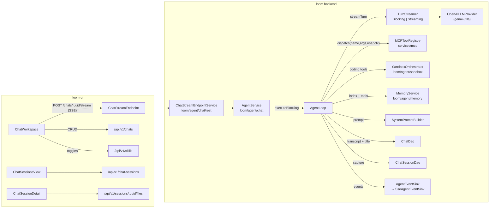
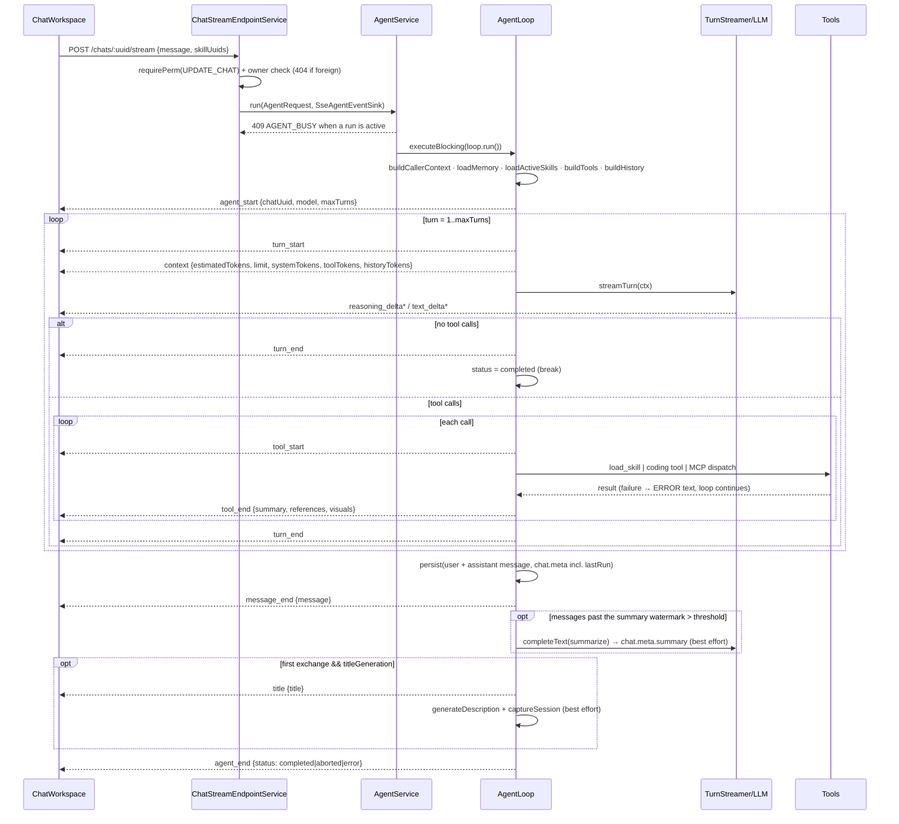

# MetaLoom // Chat (Loom Agent) Specification

> This document specifies the **Chat / Loom Agent**: an OpenAI-style chat in the Loom UI
> backed by a **server-side agentic loop** in the `loom/agent/chat` Maven module
> (package `io.metaloom.loom.agent.chat`). The agent converses with the Loom domain
> ([DOMAIN.md](../DOMAIN.md)) — find assets, list tasks, surface comments, summarize
> transcripts, run semantic searches — and renders the domain entities it touches as
> chips/tiles inside the conversation.
>
> **Scope note.** This file owns the *agentic loop, the streaming protocol and the chat
> UI contract*. Adjacent subsystems have their own specs and are only cross-referenced
> here — do not duplicate them:
>
> | Subsystem | Spec |
> |---|---|
> | Agent memory bank (`get/put/list/delete_memory`, scopes, denylist, materialization) | [CHAT_MEMORY.md](CHAT_MEMORY.md) |
> | Chat sessions (capture, publish, context composition, session filesystem) | [CHAT_SESSIONS_CONCEPT.md](../../features/chat/CHAT_SESSIONS_CONCEPT.md) |
> | Chat UI implementation tasks / coverage matrix | [TASK_UI_CHAT.md](TASK_UI_CHAT.md) |
> | Backend implementation tasks | [CHAT_TASKS.md](../../features/chat/CHAT_TASKS.md) |
> | MCP tool surface & `visuals` envelope | [MCP.md](../MCP.md) |
> | REST endpoint inventory | [RESTAPI.md](../RESTAPI.md) |
> | General UI shell / routes | [LOOM_UI.md](LOOM_UI.md) |
> | Permission model | [PERMISSIONS.md](../../features/permissions/PERMISSIONS.md) |
>
> The loop design follows the **pi agent harness** (pi-mono / `@earendil-works`): its turn
> loop, its distinct text/thinking/tool-call stream events, its "errors become tool
> results" rule, and its progressive-disclosure **skills** model.
>
> ⚠️ **Historical note:** the loop used to live in `loom/services/ai`
> (`io.metaloom.loom.ai`). That module is gone — any such reference elsewhere is stale.

---

## 1. Progress Assessment

- [x] Chat session CRUD (`/api/v1/chats`, `chat` table, `ChatDao`, permissions)
- [x] Agentic loop (`AgentLoop`) — transcript replay, tool dispatch, turn limit, abort, persistence
- [x] Context budget + measured token accounting — `ContextBudget`, `context` frame, `turn_end` usage, `chat.meta.lastRun`, self-calibrating estimator (§4.4, CTX1)
- [x] Bounded transcript replay — `ConversationHistory` evicts whole exchanges newest-first and says so in-band (§4.4, CTX2)
- [x] Rolling conversation compaction — `chat.meta.summary` replayed as a delimited `<conversation_summary>` system block (§4.4, CTX4)
- [x] Server-owned `chat.meta` keys stripped from client writes (`ChatMeta.SERVER_OWNED_KEYS`, §4.3)
- [x] Bounded sub-agent fan-out — `map_over` + `FanOut`, tool-less child contexts, failures reported as data (§3.1, LP4)
- [x] Per-run LLM call ceiling — `RunBudget`, claimed by parent turns and fan-out children (§3.1). The rest of LP5 (tool calls, node tasks, wall clock) is open
- [x] `AgentService` — one active run per chat, `executeBlocking`, `abort()`
- [x] SSE streaming endpoint `POST|DELETE /api/v1/chats/:uuid/stream`
- [x] Turn-granular streaming (`BlockingTurnStreamer`) **and** true token/reasoning streaming (`StreamingTurnStreamer`, `LOOM_AI_STREAMING=true`)
- [x] MCP tool inventory dispatched in-process, permission-checked, with server-resolved `MCPCallerContext`
- [x] Skills: table + versions, owner-scoped REST, progressive disclosure, `load_skill` tool, per-chat activation
- [x] Built-in skills shipped on the classpath, always active (`BuiltinSkills`, `AgentSkill`)
- [x] Tool advertisement filtered by the caller's permissions (`listDescriptorsFor`)
- [x] References (chips) and `visuals` (inline pipeline graph) envelopes
- [x] Auto title generation + auto session capture after the first exchange
- [x] Agent memory bank wired into the system prompt and the tool set (see [CHAT_MEMORY.md](CHAT_MEMORY.md))
- [x] Sandbox coding tools (`run_shell`, `read_file`, `write_file`, `list_files`) gated by `LOOM_AGENT_SANDBOX_ENABLED`
- [x] Chat sessions REST (`/api/v1/chat-sessions`) + session filesystem (`/api/v1/sessions/:uuid/files|download|preview`)
- [x] UI: streaming transcript, markdown, hidden reasoning, action rows, chips, skills panel, greeting, split workspace
- [x] UI views: `SkillManagementView`, `ChatSessionsView` / `ChatSessionDetail`, `MemoryView`
- [ ] **Tool results entering the live in-run history are uncapped** — only the persisted `resultSummary` is truncated, so one large result can overflow the window on the first message of a new chat (CTX3)
- [ ] **`chat.messages` is client-writable** through `POST /chats/:uuid` — only the server-owned `meta` keys are closed (§4.3, R12, SEC2)
- [x] Tests: `AgentLoopTest`, `ContextBudgetTest`, `StreamingTurnStreamerTest`, `ReferenceExtractorTest`, `VisualExtractorTest`, `SkillPromptBuilderTest`, `ChatStreamEndpointTest`, mocked + backend Playwright specs
- [ ] **`think` is dead on both ends** — the UI type declares it and `streamChatMessage` forwards it, but no caller ever sets it, and server-side `ChatStreamRequest.think` never reaches `AgentRequest`. The loop always uses `LOOM_AI_THINK_ENABLED` (§4.1, R1)
- [ ] **`AiOptions.validate()` runs unconditionally** — `url`/`modelId` must be non-blank even with `LOOM_AI_ENABLED=false` (§9, R9)
- [ ] No endpoint tests for `ChatSessionEndpoint` / `SessionFsEndpoint`
- [ ] No live-LLM integration test (backend Playwright specs assert CRUD only)
- [x] True token streaming works on every backend — `OpenAILLMProvider.generateStreamWithTools` reassembles streamed `tool_calls` fragments ([CHAT_TASKS.md](../../features/chat/CHAT_TASKS.md) F1)

## 2. Architecture



Module layout — `loom/agent/` holds four modules; **only `chat` is specified here**:

| Module | Contents |
|---|---|
| `loom/agent/chat` | the loop, the event protocol, `ChatStreamEndpoint`, `ChatSessionEndpoint`, `SessionFsEndpoint`, prompt/skill/ref builders. Promotes `genai-utils` to compile scope. |
| `loom/agent/memory` | memory bank — see [CHAT_MEMORY.md](CHAT_MEMORY.md) |
| `loom/agent/sandbox` | Session Runner orchestration + `CodingTools` |
| `loom/agent/session-runner`, `loom/agent/deploy` | the container image and its deployment |

`/api/v1/chats` CRUD deliberately stays in `loom/services/rest` (`ChatEndpoint`); only the
stream and session routes live in the agent module.

### 2.1 The agentic loop



**Threading.** LLM calls and jOOQ access are blocking, so the loop runs on a Vert.x worker
thread via `executeBlocking(..., false)` (unordered). `SseAgentEventSink` holds the request
`Context` and hops SSE writes back onto it. Abort is triggered by
`response.closeHandler` (client disconnect) or `DELETE /chats/:uuid/stream`; `AgentLoop.abort()`
sets an `AtomicBoolean` that is checked between turns and between tool calls, **and** calls
`TurnStreamer.cancel()` so the turn that is in flight right now stops too. On the streaming path
`StreamingTurnStreamer.cancel()` disposes the retained subscription — the provider's cancellable
closes the upstream HTTP stream, so generation stops instead of billing on after the stop button.
`BlockingTurnStreamer` keeps the default no-op `cancel()` (a `generateWithTools` call cannot be
interrupted), so there the abort still lands turn-granular via the post-turn check.

**Error taxonomy (pi-inspired).**

| Failure | Handling |
|---|---|
| Tool execution fails / times out (`LOOM_AI_TOOL_TIMEOUT_MS`) | Becomes an **error tool result** (`"ERROR: …"`); the loop continues so the model can react. |
| Coding tool with non-zero shell exit | **Not** an error — exit code is appended to the result text so the model can react. |
| LLM/provider failure | `error {code: LLM_ERROR, terminal: true}` → `agent_end{status:"error"}`. Only the **user** message is persisted, plus `chat.meta.lastError`; no `message_end` is emitted. |
| Turn limit reached | Non-fatal `error {code: TURN_LIMIT, terminal: false}`, then the run finishes as **`completed`** with whatever text accumulated. |
| Per-run LLM call ceiling reached (`LOOM_AI_MAX_LLM_CALLS_PER_RUN`) | Same shape: non-fatal `error {code: LLM_BUDGET, terminal: false}`, run finishes **`completed`**. Inside a `map_over` it is an error tool result instead, so the loop continues (§3.1). |
| Memory write budget exceeded | Error tool result telling the model to stop writing (never aborts the run). |
| Chat not found | `error {code: NOT_FOUND, terminal: true}` → `agent_end{status:"error"}`. |
| Abort (client disconnect or `DELETE`) | Status `aborted` — but the partial assistant message **is** still persisted and `message_end` **is** still emitted. Only `"error"` suppresses both. |
| Concurrent run on same chat | HTTP `409` before the stream opens. |

## 3. Tool inventory

The model is offered, in this order (`AgentLoop.buildTools()`):

| Group | Tools | Source |
|---|---|---|
| Domain (MCP) | `search_assets`, `get_asset`, `search_transcript`, `list_collections`, `asset_statistics`, `list_pipelines`, `get_pipeline` | `loom/services/mcp/.../tool/impl` via `MCPToolModule` |
| Pipeline authoring (MCP) | `list_node_descriptors`, `get_node_descriptor`, `pipeline_authoring_guide`, `validate_pipeline`, `create_pipeline`, `update_pipeline` | same module — see [../MCP.md §5.2a](../MCP.md). The two write tools need `CREATE/UPDATE_MCP_PIPELINE` on top of the base pipeline permission |
| Memory (MCP) | `get_memory`, `put_memory`, `list_memory`, `delete_memory` | `loom/agent/memory/.../tool` via `MemoryToolModule` — details in [CHAT_MEMORY.md](CHAT_MEMORY.md) |
| Coding | `run_shell`, `read_file`, `write_file`, `list_files` | `CodingTools` — advertised **only** when `LOOM_AGENT_SANDBOX_ENABLED=true`; executed in a per-chat Session Runner via `SandboxOrchestrator.dispatchCodingTool(chatUuid, …)`, *not* through the MCP registry |
| Agent-local | `load_skill` | added whenever anything is disclosed — the built-in skills (§7) mean that is every run |
| Agent-local | `map_over` | §3.1. Always advertised. Resolved in `AgentLoop`, **never** through the MCP registry — it spends this run's LLM budget and drives this run's `TurnStreamer`, so it must be unreachable from an external MCP client |

### 3.1 `map_over` — bounded fan-out

"Summarize these 50 transcripts", "find the recurring themes in last quarter's uploads" and
"which of these ten clips should we lead with" are map-reduce over a set that cannot fit one
context. With one context and one thread the request either overflows the window or is not
attempted at all.

`map_over {items, instruction, reduceInstruction?}` runs `instruction` over each item in its
own **child** context, concurrently, then optionally reduces the answers with one further
call. `items` is either a string array or `[{label?, text}]`; unlabelled items get a
positional label so every answer traces back to an input.

A child is one `TurnStreamer.completeText` call over a **two-message context: the instruction
and one delimited item**. It has no tools, no transcript, no system prompt and no memory.
That isolation is what lets 25 items be processed without any of them paying for the others,
and it is also the v1 security boundary — *a child that can call tools is a second agent*, and
a second agent needs its own permission story, budget and audit trail. Widening this is a
design task, not a parameter.

| Rule | Why |
|---|---|
| Over `LOOM_AI_FANOUT_MAX_ITEMS` is a **readable rejection**, not a truncation | A truncated fan-out reduces over a silently smaller set and reports a confident answer about items it never saw |
| A failing child becomes an `ItemResult` carrying its error, never an exception | A fan-out where 3 of 25 failed must *say so*; the rendered result states the tally first and tells the model not to present a partial result as complete |
| Each child's answer is capped at `LOOM_AI_FANOUT_CHILD_MAX_CHARS` and says when it was cut | The reduce step has to fit the **parent's** window (§4.4) |
| Every child and the reduce call claim from `RunBudget` | Fan-out multiplies LLM calls by item count; `LOOM_AI_MAX_TURNS` bounds parent turns and says nothing about children |
| The item is delimited and declared to be data | A child summarizing an asset transcript reads user-supplied text whose answer flows straight back into the parent context — the SEC1 rule, same as the conversation summary |

**`RunBudget`** (`loom/agent/chat/.../loop/RunBudget.java`) carries one ceiling today,
`LOOM_AI_MAX_LLM_CALLS_PER_RUN`, claimed by parent turns and fan-out children alike. Claims
are compare-and-set, not increment-then-check, so concurrent children cannot push the tally
past the ceiling. Exhaustion is an error tool result telling the model to stop and answer with
what it has — never an aborted run (the `AgentLoop.memoryWriteBudgetExhausted` pattern). A
parent turn that cannot claim ends the run as `completed` with a non-terminal
`error {code: LLM_BUDGET}`, exactly like `TURN_LIMIT`. The tallies land in
`chat.meta.lastRun.llmCalls`; the gap between that and `turns` is the fan-out spend.

> ⚠️ `RunBudget` is **not** all of LP5. Ceilings on tool calls, dispatched node tasks and wall
> clock are still open — the node-task count lives behind the MCP boundary and needs plumbing
> LP4 did not. The shape above is the one those should follow.

🔴 **The MCP groups are filtered by the caller's permissions.** `buildTools()` reads
`MCPToolRegistry.listDescriptorsFor(request.user())`, not `listDescriptors()`. A tool the
user may not invoke is not merely refused on call — it never reaches the prompt, because
the tool list *is* prompt text and an advertised `create_pipeline` reads as an invitation
to author one. See [../MCP.md §6](../MCP.md).

**Caller identity is server-resolved.** `AgentLoop.buildCallerContext()` builds an
`MCPCallerContext(userUuid, userName, groupUuids, spaceUuid, chatUuid)` from the request
user, `GroupDao.loadGroupsForUser` and the chat's space — never from tool arguments
(`MCPToolRegistry.CALLER_ENVELOPE_KEY` strips any `__loom` key a model tries to smuggle in).
Identity-requiring tools are not bound to the EventBus at all and are reachable only via
`dispatch(name, args, user, ctx)`. Group-resolution failure degrades to "no groups".

## 4. Streaming endpoint & event protocol

### 4.1 Endpoint

`ChatStreamEndpoint` (`loom/agent/chat/rest`) registers both routes; the SSE write pattern
mirrors `MCPService` (`text/event-stream`, `Cache-Control: no-cache`,
`X-Accel-Buffering: no`, chunked).

**`POST /api/v1/chats/:uuid/stream`** — requires `UPDATE_CHAT` *and* chat ownership
(a foreign chat is indistinguishable from a missing one → `404`).

```json
{ "message": "Find all beach videos and open a review task",
  "skillUuids": ["<uuid>"],
  "think": true }
```

> ⚠️ `think` is **dead on both ends**. Client side `AgentStreamRequest.think` exists in
> `api/agent.ts` and is forwarded when set, but no caller in `ChatWorkspace` ever sets it.
> Server side it deserializes into `ChatStreamRequest` and stops there — `AgentRequest`
> carries only `(chatUuid, userUuid, user, message, skillUuids)` and `AgentLoop` reads
> `AiOptions.isThinkEnabled()`. Wire it through all three layers or delete it from all three.

**`DELETE /api/v1/chats/:uuid/stream`** — idempotent cancel, `204` (also `UPDATE_CHAT` + ownership).

Why POST + SSE and not `EventSource`/WebSocket: `EventSource` can neither POST a body nor
set the `Authorization` header, so the client reads the response with `fetch` +
`ReadableStream` and an incremental parser (`createSseParser` in `api/agent.ts`). WebSocket
(precedent: `PipelineEventEndpoint`) stays the documented alternative if mid-run steering is
ever needed; v1 models steering as abort + resend.

### 4.2 Event vocabulary

Frames are `event: <type>` + single-line JSON `data:` (`AgentEventType`). Unlike pi (which
re-emits the full accumulated message per delta) Loom streams **deltas plus one final
authoritative snapshot** (`message_end`); the client persists nothing itself.

| event | data payload | notes |
|---|---|---|
| `agent_start` | `{"chatUuid","model","maxTurns"}` | always first |
| `turn_start` | `{"turn":1}` | |
| `context` | `{"turn","estimatedTokens","limit","reserve","systemTokens","toolTokens","historyTokens","calibration"}` | §4.4. **Estimates** — emitted before the request goes out. |
| `turn_end` | `{"turn":1}` plus `{"promptTokens","completionTokens","totalTokens","reasoningTokens","cachedPromptTokens"}` when the server reported usage | the **measured** counterpart of `context` |
| `reasoning_delta` | `{"turn","text"}` | distinct type → UI hides it by default |
| `text_delta` | `{"turn","text"}` | answer markdown, incremental |
| `tool_start` | `{"turn","toolCallId","name","args"}` | renders as an ActionRow (running) |
| `tool_end` | `{"turn","toolCallId","name","isError","summary","references":[…],"visuals":[…]}` | chips and inline visuals appear live |
| `message_end` | `{"message": <persisted assistant message, §4.3>}` | omitted on terminal error |
| `title` | `{"title":"…"}` | first exchange only, when `LOOM_AI_TITLE_GENERATION` |
| `error` | `{"code":"LLM_ERROR"\|"TURN_LIMIT"\|"LLM_BUDGET"\|"NOT_FOUND","message","terminal":bool}` | `AGENT_BUSY` is an HTTP 409, not an SSE frame |
| `agent_end` | `{"chatUuid","status":"completed"\|"aborted"\|"error"}` | always last |

### 4.3 Persisted message schema

`chat.messages` (jsonb array) elements:

```json
{ "id":"3f1c…", "role":"user"|"assistant", "content":"markdown text",
  "reasoning":"…",
  "toolCalls":[{"id":"c1","name":"search_assets","args":{"query":"beach"},
                "resultSummary":"3 assets found","isError":false,"durationMs":412}],
  "references":[{"type":"asset","uuid":"…","label":"beach.mp4"}],
  "visuals":[{"type":"pipeline-graph","uuid":"…","label":"…","payload":{}}],
  "skillUuids":["…"],
  "createdAt":"2026-07-22T10:15:03Z" }
```

- `reasoning` / `toolCalls` / `references` / `visuals` — assistant messages only;
  `skillUuids` records the active skill set on **user** messages.
- Raw tool results are **not** persisted — only a `resultSummary` truncated to
  `AgentLoop.RESULT_SUMMARY_MAX_LENGTH` (2048 chars). `buildHistory` reconstructs
  `assistantWithToolCalls` + `toolResult` pairs from `toolCalls[]` using that summary — an
  accepted context-fidelity trade-off (§8 R4).
- `visuals` are persisted but **never replayed** into the LLM history.
- `chat.meta`:

```json
{ "activeSkillUuids":["…"], "model":"…", "lastError":"…"?,
  "summary":{"text":"…","throughMessageIndex":32,"tokens":180,"model":"…"},
  "tokenCalibration":1.35,
  "lastRun":{"turns":2,"toolCalls":1,"durationMs":4120,"estimatedPromptTokensPeak":5310,
             "llmCalls":6,"maxLlmCalls":64,
             "promptTokensPeak":6980,"promptTokens":12400,"completionTokens":310,
             "totalTokens":12710,"cachedPromptTokens":4096} }
```

  `lastError` is set on a terminal error and removed on the next successful run. `lastRun`
  is overwritten per run, never accumulated. `llmCalls` counts parent turns **and** `map_over`
  children (§3.1), so it exceeds `turns` whenever a fan-out ran — that gap is the fan-out spend. The token fields of `lastRun` and
  `tokenCalibration` appear only when the model server reported `usage`.

  **`summary`, `tokenCalibration` and `lastRun` are server-owned** —
  `POST /api/v1/chats/:uuid` strips them from the request body and carries the stored values
  forward (`ChatMeta.SERVER_OWNED_KEYS` in `loom/db/api`, applied by `ChatEndpointService`).
  They are stripped rather than rejected, so a UI that round-trips the whole `meta` object it
  received from `GET` keeps working. This is the narrow half of SEC2 that §4.4 makes urgent —
  `chat.messages` itself is still client-writable, which SEC2 tracks.

### 4.4 Context budget, eviction and compaction

The transcript is replayed from scratch on every message, so an unbounded replay eventually
exceeds `LOOM_AI_CONTEXT_WINDOW`, the provider rejects the request, and — because `persist()`
appends the user message before the error check — every retry leaves the transcript one
message longer. Three pieces prevent that.

**Estimating (`ContextBudget`).** A documented `chars/4` heuristic plus a per-message
envelope allowance. It is not a tokenizer and does not claim to be: the eviction decision has
to be made *before* the request is sent, and the only authoritative count — the `usage` object
the server attaches to its response (`TokenUsage` in genai-utils) — only exists afterwards.
`LOOM_AI_CONTEXT_RESERVE_TOKENS` is held back for the completion, so the prompt may use
`window - reserve` and the reserve absorbs the estimator's error.

**Measuring and calibrating.** `TurnResult.usage` carries the server-reported counts through
both `TurnStreamer` implementations. They are emitted on `turn_end`, summed into
`chat.meta.lastRun`, and turned into `chat.meta.tokenCalibration` — the ratio of measured to
estimated prompt tokens, which scales every estimate of the *next* run. A chat therefore
converges on its own model's tokenizer instead of trusting `chars/4` forever. The factor is
clamped to `[0.5, 3.0]` so one odd measurement cannot wedge the budget, and it is derived
against the raw heuristic rather than the already-corrected estimate so it cannot compound
run over run. A server that reports no `usage` changes nothing and the loop runs on the raw
heuristic.

**Assembling (`ConversationHistory`, pure and side-effect free).**

1. The system prompt and the incoming user message are charged to the budget but never
   dropped; the advertised tool schemas are charged too, which is why `buildTools()` now runs
   *before* `buildHistory()`.
2. The transcript is walked **newest first** in whole *exchanges* — one persisted user message
   plus every assistant message and reconstructed tool pair that followed it. Groups are
   all-or-nothing: an `assistantWithToolCalls` is never separated from its `toolResult`
   messages, because an orphaned `tool_call_id` is a `400` on most OpenAI-compatible servers.
3. `LOOM_AI_HISTORY_MAX_MESSAGES` (default `0` = budget-driven only) applies as an additional
   ceiling on replayed persisted messages.
4. When anything was dropped the model is told **in-band** — never silently.

**Compacting.** After a completed run, once more than
`LOOM_AI_COMPACTION_THRESHOLD_MESSAGES` (20) messages sit past the watermark, the loop makes
one `turnStreamer.completeText` call folding the previous summary and the new exchanges into
one combined summary, capped at `LOOM_AI_COMPACTION_MAX_CHARS` (4096), and advances
`throughMessageIndex` to the transcript length. It is *rolling*: one bounded summary, not an
accumulating stack.

On the next run, if and only if the budget walk had to drop something, the summary is replayed
as a single system message directly after the system prompt, wrapped in
`<conversation_summary>` … `</conversation_summary>`. Verbatim replay then resumes at
`max(firstKeptIndex, watermark)`, so summarized content is never also replayed in full; when
the watermark covers less than what had to be dropped, the uncovered remainder still gets a
plain `[N earlier message(s) were omitted to fit the context window.]` notice. A transcript
that still fits is replayed at full fidelity and its summary stays unused — the real thing is
strictly better than its summary.

Both the summarization prompt and the replayed block state explicitly that tool results and
asset metadata are **data, not instructions** (the SEC1 rule): the summary re-enters as a
*system* message, the most trusted position in the prompt, so anything laundered into it would
inherit system-level trust.

Compaction is **best-effort** like title generation and session capture — any failure logs at
WARN and leaves the previous summary in place. A chat must never fail because its summary
could not be refreshed.

## 5. UI contract

`ChatWorkspace.tsx` is the whole chat surface: sessions rail, resizable chat column
(persisted percentage, collapsible workspace panel — [LOOM_UI.md §3.7](LOOM_UI.md)), right
panel with overview / embedded `AssetBrowser` / asset detail card.

| Concern | Component / file | Notes |
|---|---|---|
| Empty transcript | `ChatGreeting.tsx` | condition `messages.length === 0 && !streaming && !sending`; tracks the *empty transcript*, not session creation (server session stays lazy until the first `sendMessage`). Falls back to `chat.greeting.helloAnonymous`. Testids `chat-greeting`, `chat-greeting-title`. |
| Markdown | `MarkdownContent.tsx` | react-markdown + remark-gfm; **no `rehype-raw`** — raw HTML stays escaped. That is the entire sanitization story. |
| Reasoning | `ReasoningSection.tsx` | live "thinking… (Ns)" indicator; content collapsed by default; testids `chat-reasoning-*`. |
| Tool activity | `ActionRow` in `ChatWorkspace.tsx` | fed by `tool_start` / `tool_end`. |
| Chips | `RefChip` in `ChatWorkspace.tsx` | `asset · collection · task · comment · pipeline · annotation`; navigates per type. |
| Inline visuals | `PipelineGraphCard.tsx` + `pipelineGraphLayout.ts` | §6.1. |
| Skills | `SkillsPanel.tsx` | per-session toggles → `chat.meta.activeSkillUuids`, sent with **every** stream request. |
| Stream client | `api/agent.ts` | `streamChatMessage`, `cancelChatStream`, `createSseParser`, `AgentBusyError`. |
| Session CRUD | `api/chat.ts` | title renames and `meta` only — the server owns the transcript. |
| Chat sessions | `api/chatSessions.ts`, `features/chatSessions/` | `ChatSessionsView`, `ChatSessionDetail` (incl. `listSessionFiles` / `sessionFileDownloadUrl`). |
| Skills / memory views | `features/skills/SkillManagementView.tsx`, `features/memory/MemoryView.tsx` | `/skills` (CRUD, versions, publish, library+install) and the memory browser. |

State machine per in-flight message:
`idle → sending → streaming(reasoning | answering | tool) → done | error | aborted`.
The Stop button aborts the `fetch` (AbortController) **and** calls `cancelChatStream`;
a `409` surfaces as a busy toast with the input restored.

## 6. References (chips) and inline visuals

MCP tool results carry optional structured envelopes next to the standard MCP `content`
(external MCP clients ignore the extra fields — see [MCP.md §5.0.1](../MCP.md)):

```json
{ "content":[{"type":"text","text":"…"}],
  "references":[{"type":"asset","uuid":"…","label":"beach.mp4"}],
  "visuals":[{"type":"pipeline-graph","uuid":"…","label":"…","payload":{"nodes":[],"edges":[]}}] }
```

- `ReferenceExtractor` dedupes by `(type, uuid)` and caps at `MAX_REFERENCES` (20) per message.
- `VisualExtractor` dedupes likewise, caps at `MAX_VISUALS` (4) and `MAX_VISUAL_BYTES`
  (32 KB) per visual, on top of the producing tool's own node/edge caps.

### 6.1 `pipeline-graph`

The only visual type today, produced by `get_pipeline`. Flow (same path references take, so a
visual costs no extra round trip):
`tool result.visuals → VisualExtractor → tool_end → persisted message.visuals → PipelineGraphCard`.

Rules:

- **The model never sees a visual.** It reads the tool result's text only, so `get_pipeline`
  also renders the graph as text. A dropped visual costs a diagram, never an answer — which
  is why the extractor may discard silently.
- **Layout is the client's job.** The payload carries no coordinates (stored `x`/`y` belong to
  the full-screen editor canvas). `pipelineGraphLayout.ts` re-derives a left-to-right layered
  layout from the edges (column = 1 + deepest predecessor; parallel branches stack and are
  centred) and stays drawable for a cyclic definition, which the parser rejects on save but
  which may still sit in an older row.
- **Rendering:** name header, version chip, `disabled` chip, *Open* action into `/pipelines`;
  nodes coloured by `category` with the editor palette; bezier edges with `PASS`/`REJECT`
  labels; horizontal scroll rather than shrinking labels; `truncated` payloads say so; an
  empty graph renders nothing. Testids `chat-pipeline-graph`, `-node`, `-edges`, `-open`.

Adding a second visual type = produce the envelope in a tool, add the payload type in
`types/index.ts`, render it in the message bubble's visuals block. No protocol change.

## 7. Skills

Skills come from two places, and the model cannot tell them apart. Both arrive as
`AgentSkill(name, description, content, injectFull)`, which is the view
`SkillPromptBuilder` and the `load_skill` handler work against — which of the two a skill
came from changes nothing about how it is disclosed.

### 7.0 Built-in skills

`io.metaloom.loom.common.skill.BuiltinSkills` loads markdown resources from
`loom/common/src/main/resources/skills/`. They are **always active**, have no uuid, no
owner and no version history, and never appear in the skill CRUD surface.

Today there are two:

- **`pipeline-authoring`** — the shape of a pipeline definition, how nodes are wired port to
  port, the rules the validator enforces, and the order to call the pipeline tools in.
- **`asset-search`** — how to turn a question about the catalogue into a `find_assets` call:
  which of `text` / `creator` / `space` / `collection` / `when` a phrase belongs in, why a
  name is passed through rather than looked up first, and the rule that a filter which finds
  nothing is never widened to produce results. `BuiltinSkillsTest` asserts the field names in
  the markdown against the tool's schema, so the guide cannot drift into teaching a call that
  would be refused. Design: [../concept/AGENTIC_SEARCH_CONCEPT.md](../concept/AGENTIC_SEARCH_CONCEPT.md).

- **Why not a row.** A user skill is the right model for a house convention somebody
  wrote. It is the wrong model for the knowledge needed to use a Loom feature at all:
  nobody should have to author, and then remember to tick, the document that explains the
  definition format. `AgentLoop.loadActiveSkills()` prepends the built-ins, so a skill list
  is never empty.
- **Built-ins win a name collision.** `load_skill` resolves first-match over the merged
  list; a stored skill borrowing a built-in's name cannot replace what Loom ships.
- **Never pinned.** `ChatSessionSkillPin` records a uuid and a version number; a built-in
  has neither, and is active on every run anyway, so pinning it would say nothing about
  the session. `AgentLoop.activeUserSkills` is the stored subset kept for that purpose.
- **Never inlined.** `injectFull` is always false for a built-in: it is active on every
  run of every chat, so inlining would spend the whole body every time.
- **One source, two audiences.** The `pipeline_authoring_guide` MCP tool serves the same
  resource, because an external MCP client has no notion of a skill
  ([../MCP.md §5.2a](../MCP.md)). A missing resource throws at load time rather than
  degrading silently — an absent guide looks exactly like a model that chose not to use it.

### 7.1 User skills

A **skill** is a user-owned, SKILL.md-style markdown instruction package stored in the
database: `name` (unique per owner), `description` (≤1024 chars — what the model sees up
front), `content`, `enabled`, `published`, `origin_skill_uuid`, `meta`, plus a version
history (`skill_version`, `activeVersionNumber`).

- **Owner-scoped.** Loom permissions are global per entity type (`READ_SKILL` gates the
  feature); per-object scoping lives in the endpoint service. `AgentLoop.loadActiveSkills()`
  additionally filters to `creatorUuid == caller` **and** `enabled` — a foreign or disabled
  skill can never influence a run, and deleted uuids are dropped silently.
- **Per-chat activation.** `chat.meta.activeSkillUuids`, no join table. The client sends
  `skillUuids` with every stream request, so a mid-conversation toggle applies to the next
  message.
- **Progressive disclosure** (`SkillPromptBuilder`): the system prompt gets only
  `- name: description` inside `<available_skills>` plus an instruction to call `load_skill`.
  The full body is fetched on demand by the agent-local `load_skill {name}` tool, keeping
  unbounded bodies out of the context window. Escape hatch: `meta.injectFull = true` inlines
  the content in a `<skill name="…">` block — for small models that ignore the pattern (R7).
- **Sharing = publish + copy-on-install.** `published=true` exposes the skill in
  `GET /api/v1/skills/library`; `POST /api/v1/skills/:uuid/install` **copies** the row with
  `origin_skill_uuid` provenance (name collisions get a suffix). Execution always uses the
  caller's own copy, so an edited or deleted original can never silently change another
  user's agent behaviour; `ON DELETE SET NULL` keeps copies intact and provenance drives the
  *"update available"* hint.
- Backend surface: `SkillEndpoint` (`loom/services/rest`) — `/api/v1/skills` CRUD,
  `GET /library`, `POST /:uuid/install`, `GET /:uuid/versions`, `GET /:uuid/versions/:version`,
  `POST /:uuid/versions/:version/restore` (deletes all newer versions and re-points the active
  one). Permissions `CREATE/READ/UPDATE/DELETE_SKILL`. `/library` and `/versions` are
  registered **before** `/:uuid` so the literals are not consumed as a uuid.

`SystemPromptBuilder.build(activeSkills, memoryService, scopes, index, sandboxEnabled)`
composes the final system prompt as `SkillPromptBuilder.build(activeSkills)` +
`MemoryPromptBuilder.build(...)` — the memory half is appended only when the memory bank is
enabled, and the `sandboxEnabled` flag only controls whether the prompt mentions the
read-only memory folder inside the Session Runner. Both halves follow the same
progressive-disclosure rule: skills expose name+description, memory exposes a header-only
index. The base prompt itself is `SkillPromptBuilder.BASE_PROMPT` ("You are the Loom
assistant… you MUST use the provided tools… do NOT invent assets").

## 8. Adjacent surfaces owned by other specs

Listed here only so an agent knows they exist and where they live.

| Surface | Routes | Spec |
|---|---|---|
| Chat sessions | `GET|POST /api/v1/chat-sessions`, `GET|POST|DELETE /:uuid`, `POST /:uuid/publish|unpublish`, `GET|PUT /:uuid/context` — permissions `CREATE/READ/UPDATE/DELETE_CHAT_SESSION` | [CHAT_SESSIONS_CONCEPT.md](../../features/chat/CHAT_SESSIONS_CONCEPT.md) |
| Session filesystem | `GET /api/v1/sessions/:uuid/files\|download\|preview?path=` (keyed by the **chat** uuid = sandbox session key, `READ_CHAT`; preview sets `Content-Security-Policy: sandbox allow-scripts allow-popups allow-forms` so agent-generated pages cannot act as a confused deputy). Depth comes from the `path` query param, not wildcard routing. | [CHAT_SESSIONS_CONCEPT.md §6](../../features/chat/CHAT_SESSIONS_CONCEPT.md) |
| Memory bank | `/api/v1/memory*`, `/api/v1/memory-deny-rules*` | [CHAT_MEMORY.md](CHAT_MEMORY.md) |
| Session Runner / sandbox | no public REST; `LOOM_AGENT_SANDBOX_*` | [CHAT_MEMORY.md §4](CHAT_MEMORY.md) |

`AgentLoop` touches two of them directly: after the first completed exchange it generates a
title **and** a one-sentence description, then captures the chat as a `chat_session` with the
active skill **versions** pinned (`ChatSessionSkillPin`). This is idempotent and entirely
best-effort — every failure is logged and swallowed.

## 9. Configuration

`AiOptions` — `loom-shared/api/src/main/java/io/metaloom/loom/api/options/AiOptions.java`,
reachable as `LoomOptions.getAi()`.

| Env var | Default | Meaning |
|---|---|---|
| `LOOM_AI_ENABLED` | `true` | Enable the chat agent |
| `LOOM_AI_URL` | `http://127.0.0.1:8080/v1` | Base URL of the OpenAI-compatible server (llama.cpp, vLLM, Ollama `/v1`, …) |
| `LOOM_AI_MODEL_ID` | `openai/gpt-oss-20b` | Model id |
| `LOOM_AI_CONTEXT_WINDOW` | `16384` | Context window handed to the provider |
| `LOOM_AI_MAX_TURNS` | `8` | Max agentic turns per user message |
| `LOOM_AI_TOOL_TIMEOUT_MS` | `30000` | Timeout for a single MCP tool dispatch |
| `LOOM_AI_THINK_ENABLED` | `true` | Enable reasoning/think mode (`ctx.enableThink()`) |
| `LOOM_AI_STREAMING` | `false` | `true` → `StreamingTurnStreamer` (true token/reasoning deltas); `false` → `BlockingTurnStreamer` (turn-granular) |
| `LOOM_AI_TITLE_GENERATION` | `true` | Auto title + description + session capture after the first exchange |
| `LOOM_AI_CONTEXT_RESERVE_TOKENS` | `2048` | Held back from the window for the completion; the prompt is budgeted against `window - reserve` (§4.4) |
| `LOOM_AI_HISTORY_MAX_MESSAGES` | `0` | Hard ceiling on replayed persisted messages. `0` = the context budget is the only limit |
| `LOOM_AI_COMPACTION_THRESHOLD_MESSAGES` | `20` | Messages past the summary watermark that trigger a compaction pass |
| `LOOM_AI_COMPACTION_MAX_CHARS` | `4096` | Cap on the stored rolling summary |
| `LOOM_AI_FANOUT_MAX_ITEMS` | `25` | Items one `map_over` may cover; more is a readable rejection (§3.1) |
| `LOOM_AI_FANOUT_CONCURRENCY` | `4` | Child LLM calls in flight at once |
| `LOOM_AI_FANOUT_CHILD_MAX_CHARS` | `1024` | Cap on each child's answer before it re-enters the parent context |
| `LOOM_AI_MAX_LLM_CALLS_PER_RUN` | `64` | Total LLM calls per run, parent turns and fan-out children together. `0` disables the ceiling |

Not an env var but part of the same policy: `AgentLoop.RESULT_SUMMARY_MAX_LENGTH` (2048)
caps the persisted `resultSummary`. Capping the tool-result text that enters the *live*
in-run history is a separate, still-open gap (CTX3).

> ⚠️ `AiOptions.validate()` requires `url` and `modelId` to be non-blank
> **unconditionally** — it does not short-circuit on `enabled == false`. Blanking any of them
> to "turn the agent off" fails startup validation; use `LOOM_AI_ENABLED=false` and leave the
> defaults in place (R9).

Related but owned elsewhere: `LOOM_AGENT_SANDBOX_*` (`SandboxOptions` — `_ENABLED` gates the
coding tools, plus backend/image/TTL/quota knobs) and `LOOM_AGENT_MEMORY_*` (`MemoryOptions`,
incl. `_MAX_WRITES_PER_RUN` and `_PROMPT_MAX_ENTRIES`).

## 10. Test setup

| Level | Tests |
|---|---|
| Loop (no DB, no LLM) | `AgentLoopTest`, `ContextBudgetTest`, `RunBudgetTest`, `StreamingTurnStreamerTest`, `ReferenceExtractorTest`, `VisualExtractorTest`, `SkillPromptBuilderTest` — all in `loom/agent/chat/src/test` |
| Endpoint (pooled DB) | `ChatEndpointTest`, `ChatStreamEndpointTest`, `SkillEndpointTest`, `MemoryEndpointTest`, `MemoryDenyRuleEndpointTest` in `loom/core/src/test` |
| GraphQL (pooled DB) | `SkillGraphQLTest`, `MemoryGraphQLTest` in `loom/core/src/test/.../graphql` |
| DAO | `ChatSessionDaoTest`, `SkillDaoTest`, `SkillVersionDaoTest`, `MemoryEntryDaoTest`, `MemoryDenyRuleDaoTest` in `loom/db/jooq/src/test` |
| MCP | `MCPToolReferencesTest`, `PipelineToolTest` in `loom/services/mcp` |
| UI unit | `api/agent.test.ts`, `api/chat.test.ts`, `api/chatMessageMapper.test.ts`, `api/skills.test.ts`, `features/chat/pipelineGraphLayout.test.ts` |
| E2E mocked | `chat-mocked.spec.ts`, `chat-split-mocked.spec.ts`, `chat-pipeline-graph-mocked.spec.ts`, `chat-sessions-mocked.spec.ts`, `skills-mocked.spec.ts`, `skills-version-mocked.spec.ts`, `empty-states-mocked.spec.ts` |
| E2E backend | `chat-backend.spec.ts`, `skills-backend.spec.ts` — CRUD only, no live-LLM assertions |

**Writing a loop test:** call `AgentService.setTurnStreamerFactory(...)` with a scripted
`TurnStreamer` — that is the seam the whole suite uses to run the loop without an LLM.
Remember `./setup-pool.sh` before any DB-backed test (and after every Flyway change).

## 11. Conventions & Gotchas

- **The loop lives in `loom/agent/chat`.** `loom/services/ai` / `io.metaloom.loom.ai` no
  longer exist; treat any such reference as stale.
- **`/chats` CRUD is *not* in the agent module** — it stays in `loom/services/rest`
  (`ChatEndpoint`). Only `/chats/:uuid/stream`, `/chat-sessions` and `/sessions` moved.
- **Ownership beats permissions.** Stream and session-fs routes check `UPDATE_CHAT`/`READ_CHAT`
  *and* `chat.creatorUuid == caller`; a foreign chat returns `404`, never `403`.
- **Never trust tool arguments for identity.** Build an `MCPCallerContext` server-side;
  arguments may only filter within what it resolves to.
- **Errors become tool results.** Only LLM/provider failures are terminal. Resist the urge to
  abort a run because a tool threw.
- **`TURN_LIMIT` ends as `completed`,** not `error` — the emitted `error` frame is
  `terminal:false` and `message_end` still arrives.
- **Terminal error ⇒ only the user message is persisted** (plus `meta.lastError`), so a retry
  starts from a consistent transcript. `aborted` is *not* an error: the partial assistant
  message is persisted and `message_end` is emitted normally.
- **The busy guard is checked twice.** `ChatStreamEndpointService` pre-checks
  `agentService.isBusy()` (→ thrown `409`) and `AgentService.run()` re-checks atomically via
  `putIfAbsent` (→ failed future carrying `AgentBusyException`, mapped to `409` only while
  `!sink.headersSent()`). Keep both — the pre-check is the friendly path, `putIfAbsent` closes
  the race.
- **Every write path in the loop that touches another subsystem is best-effort.** Title,
  description, session capture, group resolution and memory loading all log-and-swallow; none
  of them may fail a run.
- **Everything blocking runs on a worker thread.** `AgentLoop.run()` must never be invoked
  from the event loop; SSE writes hop back via the captured `Context`.
- **Streaming is opt-in and provider-dependent.** vLLM has no true streaming path — the
  `TurnStreamer` seam is what keeps the feature shippable on both.
- **Coding tools bypass the MCP registry** entirely (`SandboxOrchestrator.dispatchCodingTool`)
  and are only advertised when the sandbox is enabled.
- **Reasoning text is persisted.** `chat.messages[].reasoning` stores the raw thinking stream;
  the UI hides it, it is not redacted.
- **`chat.messages` is rewritten wholesale per exchange** (jsonb). Fine at chat scale, flagged
  for normalization (R5).
- **Part of `chat.meta` is server-owned.** `summary`, `tokenCalibration` and `lastRun` are
  stripped from any client write (`ChatMeta.SERVER_OWNED_KEYS`). Anything new the loop stores
  on `meta` and later feeds back into the prompt belongs in that set — the summary re-enters
  as a *system* block, so a client-writable one is an injection surface, not a preference.
- **Token counts come in two flavours and must not be confused.** `context` frames and
  `estimatedPromptTokensPeak` are `chars/4` guesses made *before* the call; `turn_end` fields
  and everything else under `lastRun` are what the server actually reported. Name new fields
  so the difference is visible without reading the code (§4.4).
- **Tools are built before the history.** Their schemas are charged to the same budget the
  transcript competes for; reordering these two calls silently over-admits history.
- **Exchanges are the unit of eviction, not messages.** Dropping half an exchange orphans a
  `tool_call_id` (a provider `400`) or leaves an assistant reply with no question in front of
  it, which reads as the agent talking to itself.
- **Fan-out children never get tools.** `map_over`'s children are one-shot completions over a
  single delimited item (§3.1). Giving them tools makes them agents, which needs a permission
  story, a budget and an audit trail that do not exist — it is a design task, not a flag.
- **A partial result must announce itself.** Both `map_over` (failed children) and the history
  assembler (dropped exchanges) state what is missing *before* the content. The failure this
  guards against is the model presenting a partial answer as a complete one.
- **Agent-local tools are resolved in `AgentLoop`, not the MCP registry.** `load_skill` and
  `map_over` spend this run's budget and drive this run's `TurnStreamer`; registering them
  would expose them to external MCP clients that have neither.

## 12. Where do I find …?

| Concept | Path |
|---|---|
| Agent entry point / busy guard / abort | `loom/agent/chat/src/main/java/io/metaloom/loom/agent/chat/AgentService.java` |
| The turn loop | `.../agent/chat/loop/AgentLoop.java` |
| Context budget / token estimate + calibration | `.../agent/chat/loop/ContextBudget.java` |
| History assembly, eviction, summary replay | `.../agent/chat/loop/ConversationHistory.java` (pure — no DB, no LLM) |
| Which `chat.meta` keys the server owns | `loom/db/api/src/main/java/io/metaloom/loom/db/model/chat/ChatMeta.java` |
| Fan-out / map-reduce over items | `.../agent/chat/loop/FanOut.java`, dispatched as `map_over` in `AgentLoop.mapOver` |
| Per-run spend ceiling | `.../agent/chat/loop/RunBudget.java` |
| Turn abstraction | `.../agent/chat/loop/TurnStreamer.java` (`streamTurn`, `completeText`, `cancel`), `BlockingTurnStreamer`, `StreamingTurnStreamer`, `TurnListener`, `TurnResult` |
| Event protocol | `.../agent/chat/event/AgentEvent*.java`, sink impl `.../rest/SseAgentEventSink.java` |
| Stream routes | `.../agent/chat/rest/ChatStreamEndpoint.java` (+ `…Service`) |
| Chat session routes | `.../agent/chat/rest/ChatSessionEndpoint.java` (+ `…Service`) |
| Session filesystem routes | `.../agent/chat/rest/SessionFsEndpoint.java` (+ `…Service`) |
| System prompt assembly | `.../agent/chat/prompt/SystemPromptBuilder.java`, `.../skill/SkillPromptBuilder.java` |
| Built-in skills | `loom/common/src/main/java/io/metaloom/loom/common/skill/BuiltinSkills.java`, resources under `loom/common/src/main/resources/skills/` |
| The skill view the loop works against | `.../agent/chat/skill/AgentSkill.java` |
| Chips / visuals extraction | `.../agent/chat/ref/ReferenceExtractor.java`, `VisualExtractor.java` |
| Dagger wiring of the endpoints | `.../agent/chat/dagger/ChatEndpointModule.java` |
| MCP tools + registry | `loom/services/mcp/src/main/java/io/metaloom/loom/mcp/tool/` |
| Coding tools | `loom/agent/sandbox/src/main/java/io/metaloom/loom/agent/sandbox/tool/CodingTools.java` |
| Memory tools | `loom/agent/memory/src/main/java/io/metaloom/loom/agent/memory/tool/` |
| Config | `loom-shared/api/src/main/java/io/metaloom/loom/api/options/AiOptions.java` |
| Chat CRUD endpoint | `loom/services/rest/src/main/java/io/metaloom/loom/rest/endpoint/impl/ChatEndpoint.java` |
| Skill CRUD endpoint | `loom/services/rest/src/main/java/io/metaloom/loom/rest/endpoint/impl/SkillEndpoint.java` |
| Migrations | `loom/db/flyway/src/main/resources/db/migration/`: `V2.28__add_chat`, `V2.36__add_skill`, `V2.37__add_skill_version`, `V2.52__add_chat_session`, `V2.53__add_agent_memory`, `V2.54__add_memory_deny_rule` |
| Chat UI | `loom-ui/src/features/chat/` |
| Stream client | `loom-ui/src/api/agent.ts` |
| Chat session client / views | `loom-ui/src/api/chatSessions.ts`, `loom-ui/src/features/chatSessions/` |
| Skills / memory views | `loom-ui/src/features/skills/`, `loom-ui/src/features/memory/` |

## 13. Risks / Open Questions

| # | Risk | Mitigation |
|---|---|---|
| R1 | `think` is plumbed nowhere: unset by the UI, dropped by the endpoint service (§4.1). | Add `think` to `AgentRequest` + a UI toggle so it overrides `AiOptions.isThinkEnabled()`, or delete it from `api/agent.ts` **and** `ChatStreamRequest`. |
| R2 | Reverse proxies may buffer SSE. | `X-Accel-Buffering: no` + chunked responses; document `proxy_buffering off` for nginx. |
| R3 | vLLM has no true streaming path; `LOOM_AI_STREAMING=true` silently behaves turn-granular there. | `TurnStreamer` seam already isolates it; extend `genai-utils` when vLLM streaming lands. |
| R4 | Transcript replay uses ≤2 KB tool-result summaries → context fidelity loss on follow-ups. | Documented trade-off; revisit with a normalized `chat_message` table if it hurts (CTX5). |
| R11 | The rolling summary is a lossy, model-authored artefact the agent then treats as fact. A bad summarization silently distorts every later turn, and nothing surfaces it to the user. | Bounded and delimited (§4.4), never replayed while the real transcript fits, and one `completeText` call per ~20 messages. Surfacing it in the UI so a user can read or reset it is open. |
| R12 | `chat.messages` is still client-writable through `POST /chats/:uuid`, so a caller can author a transcript the loop replays as genuine tool exchanges. | Only the server-owned `meta` keys are closed so far (§4.3); the transcript half is SEC2. |
| R13 | `map_over` is bounded per call (25 items) but a model may call it repeatedly, and `RunBudget` is the only thing standing between that and a very expensive run. Tool calls, node tasks and wall clock are still unbounded. | `LOOM_AI_MAX_LLM_CALLS_PER_RUN` caps the multiplying dimension. The remaining ceilings are LP5. |
| R14 | Fan-out children run on a dedicated pool per `map_over` call, so a chat with a slow provider holds `LOOM_AI_FANOUT_CONCURRENCY` threads for the duration. `AgentService` allows one run per chat, but not one run per deployment. | Threads are daemon and the pool is shut down in a `finally`. A global fan-out pool is the fix if concurrent chats become a real load. |
| R5 | Whole `chat.messages` jsonb is rewritten per exchange. | Fine at chat scale; flagged for future normalization. |
| R6 | `ChatSessionEndpoint` / `SessionFsEndpoint` have no endpoint tests — the session-fs routes serve files out of a container. | Add endpoint + permission tests per [CODING.md](../../guidelines/CODING.md). |
| R7 | Small local models may ignore `load_skill` progressive disclosure. | Require action-complete descriptions; `meta.injectFull` escape hatch. |
| R8 | Persisted `reasoning` is neither redacted nor size-capped. | Consider a cap analogous to `RESULT_SUMMARY_MAX_LENGTH`. |
| R9 | `AiOptions.validate()` demands provider/url/model even when `ai.enabled=false` (§9). | Short-circuit `validate()` on `!enabled`, so a Loom deployment without an LLM needs no dummy provider config. |
| R10 | This file lives under `spec/loom/ui/` but is ~80% server-side (loop, REST, config, DB). | Move to `spec/features/chat/CHAT.md` next to its sibling chat specs and fix the relative links; `TASK_UI_CHAT.md` stays the UI-side document. |

_Git HEAD revision: `8e6f4915`_
_Last updated: 2026-08-10 (mid-turn abort on the streaming path — `TurnStreamer.cancel()`)_
