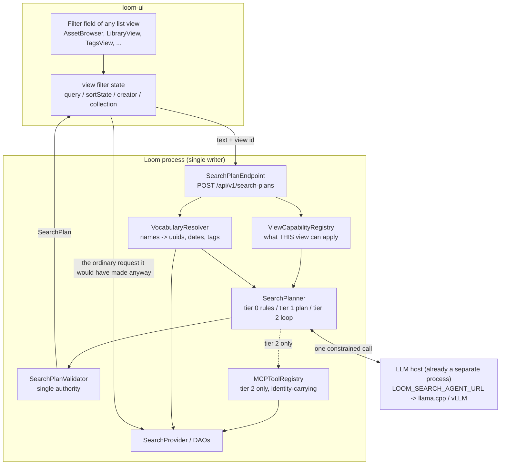
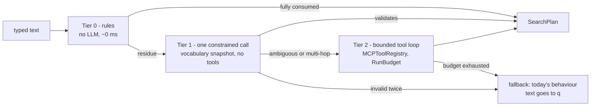

# Agentic Search — Technical Concept

> **Audience: AI coding agents.** CONCEPT. **Phase 0 of the ladder is now BUILT, in the chat agent
> only** — see §0.1. Status markers in this file are words, not emoji (see
> [SPEC_RULES.md](../guidelines/SPEC_RULES.md)).
>
> **The feature.** A user types `assets uploaded by pete today or yesterday for project xyz` into the
> ordinary filter box of any list view in loom-ui, and the view shows exactly those assets. It is
> independent of the chat page: no conversation, no session, no transcript.
>
> **The two questions this file answers.**
>
> | Question | Answer | Where |
> |---|---|---|
> | Integrated in Loom, or a dedicated process? | **Integrated**, in a new `loom/agent/search` module. The deciding argument is authorization, not performance | §3 |
> | Should the loop update the search dialogue (filters, sort) rather than return rows? | **Yes, and that is its primary output.** The loop returns a plan; the view applies it and runs its own request | §4 |
>
> **The one thing to understand before reading further.** The agent is *not* on the data path. It
> translates text into a structured `SearchPlan`; the view then issues the same request it would have
> issued had the user set the controls by hand. Every existing permission check, every ACL narrowing
> and every paging guarantee therefore keeps working unchanged, and the user can see and correct what
> the agent inferred. §4.4 is the argument; §8 is why the alternative is a security defect.

---

## 0.1 What is built today

A first slice shipped on 2026-08-19, deliberately scoped to the **chat agent** and nothing else. No
list view was touched; there is no `/api/v1/search-plans` route and no `SmartSearchField`. The
translation itself — the part this document is about — is real and reachable.

| Piece | Where | State |
|---|---|---|
| `find_assets` MCP tool — the bounded filter object, identity-scoped | `loom/services/mcp/.../tool/impl/FindAssetsTool.java` | built |
| The closed key set, its validation and the `SearchRequest` mapping | `.../tool/impl/search/FindAssetsQuery.java` | built |
| Name resolution: user / space / library / collection / tag | `.../tool/impl/search/SearchVocabulary.java` | built |
| Date-word resolution against the server clock | `.../tool/impl/search/DateExpressions.java` | built |
| The `asset-search` built-in skill | `loom/common/src/main/resources/skills/asset-search.md` | built |
| `SearchRequest.creatorUuid` and its provider clause | `loom-shared/api`, `PostgresSearchProvider.appendFilters` | built |
| Termless browse (filters with no `q`) | `PostgresSearchProvider.validate` / `lexicalSearch` | built |
| `SearchPlan`, the view manifest, the REST route, the UI field | — | not built |

**How the built slice maps onto this design.** The MCP tool schema *is* the bounded filter object of
§4.1, minus the fields that only a UI needs (`surface`, `view`, `explanation` as a separate field —
the tool folds the report into its answer text). `SearchVocabulary` is §7. `DateExpressions` is the
part of §7 about the clock. The tool is the tier-1 translator of §6.2, driven by the chat model
rather than by a dedicated single-shot call. Tier 0 and tier 2 do not exist yet, and neither does
the plan-versus-results distinction of §4 — in the chat context the agent *is* allowed to be the
data path, because the answer is prose, not a filtered grid.

**Three decisions the implementation made that this document had not.**

1. **The creator gap (B2) was closed without a migration.** `search_document` still has no creator
   column. `appendFilters` resolves the clause with a correlated `EXISTS` against `asset` on its
   primary key, applied after the text match. It costs one index probe per surviving candidate row
   and is asset-scoped by construction — a row with a null `asset_uuid` cannot match. The migration
   remains the eventual optimisation, not a prerequisite.
2. **A blocker this document missed: the provider refused every termless query.** `validate` demanded
   a non-blank `q`, so "everything Pete uploaded yesterday" — the worked example, which has no search
   term — could not be expressed at all. Fixed by allowing a blank term when at least one filter
   narrows the request. `types` deliberately does not count as narrowing: `narrowTypes` populates it
   on every REST call, so counting it would have paged the whole corpus.
3. **No `search_vocabulary` tool.** Resolution happens inside `find_assets` rather than behind a tool
   of its own. A general name-to-uuid oracle would have to require `READ_USER` and `READ_COLLECTION`
   and every other read permission at once, or leak. Folding it in keeps the disclosure to what the
   feature inherently admits — that a user by that name exists — and nothing wider. See §8.4.

---

## 1. Scope, and what this is not

| Property | This feature | The chat agent ([LOOM_UI_CHAT.md](../chat/LOOM_UI_CHAT.md)) |
|---|---|---|
| Entry point | the filter field of any list view | `/` chat page |
| Turn model | one request, one plan | multi-turn conversation |
| State | none persisted | `chat` row, sessions, memory |
| Output | a `SearchPlan` the UI applies | prose plus tool side effects |
| Failure mode | falls back to today's plain-text search | error frame in the transcript |
| Latency budget | see §6.4 | seconds are acceptable |

**Not in scope.** Conversational refinement ("no, not those"), writing anything, running nodes,
replacing `/search/*` or the CRUD list routes, and adding a user-facing query language (§12.2).

**Relationship to existing plans.** [AGENTIC_CHAT_CONTEXT_DATA.md](../chat/AGENTIC_CHAT_CONTEXT_DATA.md)
§5.2 already argues for a bounded, validated filter object behind one tool rather than a query
language, and [AGENTIC_NODE_EXECUTION.md](../chat/AGENTIC_NODE_EXECUTION.md) §6.4 requires
`run_operation` to accept the *same* filter object as `find_assets`. The `SearchPlan` in §4 is that
object, given a second consumer and a validation authority. This file does not fork the vocabulary;
it is the first concrete specification of it.

---

## 2. The two search surfaces today, and why neither alone can serve the example

Loom has two disjoint query surfaces. This is the whole reason a translation layer is needed.

| | Ranked search | CRUD list routes |
|---|---|---|
| Routes | `GET /api/v1/search/{results,assets,suggestions,status}` | `GET /api/v1/{assets,libraries,collections,tags,persons,users,…}` |
| Parameter vocabulary | `SearchQueryParameterKey` — 18 keys: `q types mode limit offset cursor sort highlight mime library space collection tag from to lang profile facets` | `QueryParameterKey` — `limit from filter sort dir` |
| Filtering | fixed named params | LHS `?filter=` over `LoomFilterKey` (13 keys) with `Operation` (`eq ne after before range gte lte`) |
| Free text | `q`, ranked, stemmed, trigram-fuzzy | none — the `Operation` enum has no `like`/`contains` |
| Paging | capped LIMIT/OFFSET, `LOOM_SEARCH_MAX_OFFSET` = 1000 | keyset (`?from=<uuid of last row>`) |
| Result shape | `SearchHitResponse` (ranked, scored) | the entity's own response type |
| Sorting | `SearchSortMode` — `RELEVANCE NEWEST OLDEST NAME SIZE` | `LoomSortKey` + `SortDirection` |
| Creator/uploader | **absent** | `creator[eq]=<uuid>` |

Now trace the worked example, `assets uploaded by pete today or yesterday for project xyz`:

| Clause | Ranked search | List route |
|---|---|---|
| `uploaded by pete` | impossible — `search_document` has no creator column (§11, B2) | `filter=creator[eq]=<uuid>` |
| `today or yesterday` | `from=<iso>` | not expressible — no date key in `LoomFilterKey` |
| `for project xyz` | `space=<uuid>` | not expressible for assets |
| `assets` | `types=asset` | implied by the route |

**Neither surface can answer it.** That is a finding, not a detail: a `SearchPlan` must be able to
name which surface it targets, and closing the example requires one of the two gaps in §11 to be
closed. It is also why "just make the model call `search_assets`" is not a design — the tool cannot
express half the query.

---

## 3. Where the loop runs

### 3.1 Recommendation: integrated, in a new module

Run the loop **inside the Loom process**, in a new Maven module `loom/agent/search`, sibling to the
existing `loom/agent/{chat,memory,sandbox}`.



Note the shape of that diagram: the plan flows back to the browser, and the browser issues the data
request. The agent box and the data box are only connected during tier 2, and even then through the
identity-carrying registry.

### 3.2 Why not a dedicated process

Four arguments, in the order of how much they matter.

**Authorization decides it.** Per-entity-type narrowing lives in
[`SearchEndpointService.narrowTypes(...)`](../../loom/services/rest/src/main/java/io/metaloom/loom/rest/service/impl/SearchEndpointService.java)
and runs against the caller's Vert.x `User`. The chat loop threads that identity all the way through
`MCPToolRegistry.dispatch(name, args, user, callerContext)`, and builds `MCPCallerContext`
server-side from `GroupDao`, never from tool arguments. A separate process has no `User`. It would
need a service account — and **there is no service user in Loom**. Worse, `user == null` is
interpreted as *authentication disabled*: `MCPToolRegistry.listDescriptorsFor(null)` advertises every
tool and no permission check runs. A dedicated agentic-search process is therefore one
misconfiguration away from being a full catalogue read oracle. §8 has the detail.

**There is no MCP client in the Java tree.** Verified: no MCP SDK dependency in any `pom.xml`. The
only client-shaped code is the test helper
[`MCPTestClient`](../../loom/core/src/test/java/io/metaloom/loom/core/mcp/MCPTestClient.java). A
dedicated process means writing and maintaining one, plus turning on and hardening the MCP server's
own auth (`LOOM_MCP_AUTH_ENABLED`, `_STRICT_MODE`, `_ALLOWED_ORIGINS`) on port 4041, plus a second
deployment unit in Helm. That is real cost for no capability.

**The expensive process is already separate.** `LOOM_AI_URL` points at llama.cpp or vLLM. Inference
— the GPU, the memory, the thing worth scaling independently — is out of process today. What a
"dedicated agentic search process" would actually move out is the orchestration: a bounded loop of
JSON manipulation and DAO calls, already run off the event loop by `vertx.executeBlocking`.

**Latency.** In-process, a tier-2 tool call is a jOOQ query. Out-of-process it is an HTTP round trip
per call, several per query, against the budget in §6.4.

### 3.3 What would reverse this

Record these so the decision can be revisited with a reason rather than a preference:

- **SaaS multi-tenancy.** Per-tenant model keys, per-tenant rate limits and per-tenant cost
  accounting are control-plane concerns; the sibling `metaloom-saas` repo owns them
  ([METALOOM_CONTEXT.md](../METALOOM_CONTEXT.md) §2.2). If those land, an agent tier in front of
  several Looms becomes attractive for the same reasons — and runs into the same trust-domain
  boundary [CORTEX_LOOM_1-TO-N.md](CORTEX_LOOM_1-TO-N.md) §7 draws for workers.
- **Independent scaling.** Loom is single-writer (`replicaCount: 1`,
  [CLUSTERING.md](CLUSTERING.md)). Search is read-only, so an agent tier could scale out where Loom
  cannot. That only matters once the plan endpoint is measurably a bottleneck, which it will not be
  while the LLM host is the serial resource.
- **A hosted model with a real API key.** `OpenAILLMProvider.buildClient(url)` hardcodes
  `.apiKey("bogus")` and no `LOOM_AI_*` variable carries a key. The day a key is needed, keeping it
  out of the main process becomes an argument on its own.

None of these hold today.

### 3.4 Why a new module rather than reusing `AgentLoop`

[`AgentLoop`](../../loom/agent/chat/src/main/java/io/metaloom/loom/agent/chat/loop/AgentLoop.java)
is hard-wired to a chat row: `run()` begins with `chatDao.load(request.chatUuid())` and returns
`NOT_FOUND` when absent, and `persist()`, `compact()`, `generateTitle()` and `captureSession()` all
write it. Reusing it would mean creating a throwaway `chat` row per keystroke-committed search.

Reuse the *pieces*, not the loop: `MCPToolRegistry`, `MCPCallerContext`, `RunBudget`, `ContextBudget`,
`TurnStreamer` and its two implementations, `AgentEventSink`/`AgentEvent`, and `ReferenceExtractor`
are all free of chat concerns.

---

## 4. The output contract: a plan, not rows

### 4.1 `SearchPlan`

```json
{
  "surface": "LIST",
  "view": "assets",
  "q": null,
  "filters": [
    { "key": "creator",    "op": "eq", "value": "e829f0f1-4775-4857-a326-850440cf9577",
      "label": "Pete Miller", "source": "RESOLVED" },
    { "key": "collection", "op": "eq", "value": "3f1b0c72-9d41-4d0a-9a2c-6b0d2f1e77aa",
      "label": "Project XYZ", "source": "RESOLVED" }
  ],
  "createdFrom": "2026-08-18T00:00:00Z",
  "createdTo": null,
  "sort": { "sort": "created", "dir": "desc" },
  "types": ["asset"],
  "explanation": "Created by Pete Miller, since yesterday, in Project XYZ",
  "unresolved": [],
  "residual": null,
  "frozenIds": null,
  "tier": "PLAN",
  "confidence": 0.86
}
```

| Field | Meaning |
|---|---|
| `surface` | `LIST` or `SEARCH` — which of the two vocabularies in §2 the rest of the plan speaks |
| `view` | the view id the plan was validated against (§5) |
| `q` | free text that survives translation, for the `SEARCH` surface or a future list-route `q` (§11, B4) |
| `filters[]` | key/op/value triples, each carrying a human `label` for the chip and a `source` (`LITERAL` when the user typed it, `RESOLVED` when §7 turned a name into a uuid) |
| `createdFrom` / `createdTo` | resolved absolute instants — never relative words |
| `sort` | the view's own `SortState` shape on the `LIST` surface, a `SearchSortMode` on `SEARCH` |
| `explanation` | one line, rendered under the field. This is the trust surface |
| `unresolved[]` | phrases the agent could not map, reported rather than dropped (§7.3) |
| `residual` | why a frozen id set was necessary, when it was |
| `frozenIds[]` | the escape hatch of §4.3 |
| `tier` | `RULES`, `PLAN` or `LOOP` — which tier produced this (§6) |
| `confidence` | drives whether the UI auto-applies or offers (§10.3) |

### 4.2 How the view consumes it

On the `LIST` surface the plan maps onto the state loom-ui already keeps
(`src/hooks/usePagedList.ts`, `src/api/paging.ts`):

```ts
// SearchPlan -> PagingParams, the shape listAssets() already takes
{ limit, from, sort: plan.sort.sort, dir: plan.sort.dir,
  filters: plan.filters.map(f => ({ key: f.key, value: f.value })) }
// serialized by filterExpression() to the single param:
//   filter=creator[eq]=<uuid>,collection[eq]=<uuid>
```

On the `SEARCH` surface it maps onto `SearchRequestParams` in `src/api/search.ts`, which
`buildSearchQuery()` already serializes.

There is no new data path. The mapper is pure, and therefore unit-testable under the node-env vitest
tier (§14).

### 4.3 The escape hatch

Some intent is not expressible as filters — "the ones where Pete is smiling", "assets that look like
this sketch". For those the plan may carry `frozenIds[]` plus a `residual` string stating why.

Rules for a frozen set, so it stays an exception rather than the design:

- It is rendered as a **pinned, non-paged, explicitly frozen** result. The UI says so.
- It is capped (`LOOM_SEARCH_AGENT_MAX_FROZEN_IDS`, default 200) and never a substitute for paging.
- It is produced **only** by tier 2, and only through identity-carrying tools (§8).
- The plan still carries whatever filters the agent *could* express, so refining stays possible.

### 4.4 Why plan-first, restated

| Property | Plan-first | Result-set-only |
|---|---|---|
| ACL enforcement | on the existing, tested path | must be reimplemented inside the agent |
| Visibility | chips show what was inferred | the filter bar stays empty |
| Correction | edit or delete a chip | retype the whole sentence |
| Paging | keyset and load-more keep working | a materialized id list breaks both |
| Shareability | the plan is a URL | not reproducible |
| Learnability | users see the vocabulary and graduate to using it directly | the box stays opaque |
| Cost of a wrong guess | one visible wrong chip | a silently wrong result set |

The last row is the one that matters for "magical feel". Magic that cannot be inspected reads as
unreliable the first time it is wrong, and it will be wrong.

---

## 5. The view-capability manifest

A plan is meaningless without a view: `creator` is implemented by `AssetDaoImpl` and `TagDaoImpl` but
not by `LibraryDaoImpl`; `priority` exists only for tasks. A key registered in `LoomLHSFilterParser`
but not implemented in that DAO's `applyFilter` answers **400 BAD_FILTER_KEY** — by design, but a
400 is a terrible thing to hand a user who typed a sentence.

**The server owns the manifest.** One authority, following the rule
[PIPELINE_VALIDATION.md](../features/pipeline/PIPELINE_VALIDATION.md) establishes for pipeline
definitions and the mirrored-validator mistake it records. The UI names its view; it does not carry a
copy of the rules.

```json
{
  "view": "assets",
  "surfaces": ["LIST", "SEARCH"],
  "keys": [
    { "key": "creator",    "ops": ["eq"],    "valueType": "USER_UUID",       "resolvable": true },
    { "key": "collection", "ops": ["eq"],    "valueType": "COLLECTION_UUID", "resolvable": true },
    { "key": "name",       "ops": ["eq"],    "valueType": "STRING" },
    { "key": "size",       "ops": ["range"], "valueType": "SIZE" }
  ],
  "sorts": ["name", "created", "edited"],
  "searchTypes": ["asset"],
  "supportsFreeText": true
}
```

The manifest does three jobs at once:

1. **Constrains the model.** It becomes the JSON Schema handed to the LLM, so an out-of-vocabulary
   key is unlikely rather than merely rejected.
2. **Validates the plan.** `SearchPlanValidator` rejects anything outside it. An unknown key is an
   error the model can read and retry from, **never a silent no-op** — the anti-pattern
   [AGENTIC_CHAT_CONTEXT_DATA.md](../chat/AGENTIC_CHAT_CONTEXT_DATA.md) §5.2 names, and exactly what
   pre-2026-08-16 `search_assets` did when it declared `mimeType` and read nothing.
3. **Generalizes the feature.** Adding a view is a manifest entry, not new agent code. This is what
   makes the field work in the asset view, library view, person view and the rest.

**A conformance test binds the manifest to reality** (§14.4), so a manifest cannot advertise a key
the DAO does not implement. Without it the manifest becomes a second, drifting copy of the DAO's
`applyFilter` — the same failure shape `AGENTIC_CHAT_CONTEXT_DATA.md` §7 describes for the two
whitelists, and the same remedy it recommends.

---

## 6. The resolution ladder

Three tiers, escalating only when the cheaper one is insufficient.



### 6.1 Tier 0 — deterministic, no model

A small grammar over the term, run server-side (so the CLI and clients get it too) and mirrored
nowhere:

- bare words become `q`
- `"quoted phrases"` stay phrases
- explicit prefixes: `mime:video`, `tag:approved`, `after:2026-01-01`, `by:pete`, `in:xyz`
- `-negation` passes through to `websearch_to_tsquery`, which already understands it

Tier 0 exists for three reasons: it serves the most common case at zero latency and zero cost, it
keeps the field fully useful when `LOOM_SEARCH_AGENT_ENABLED=false` or the LLM host is down, and it
gives power users a deterministic syntax that survives a model change.

### 6.2 Tier 1 — one constrained call

One LLM round trip. Input: the residue text, the view manifest as a schema, and the **vocabulary
snapshot** of §7. No tools, no history, no conversation. Output: a `SearchPlan`, validated; on
validation failure, exactly one re-ask carrying the error text; on a second failure, fall back.

This is the tier that answers the worked example. It answers it *because* §7 already turned "pete"
into a uuid and "today or yesterday" into an instant — not because the model is clever.

### 6.3 Tier 2 — bounded loop

Reached only when tier 1 reports low confidence or names a multi-hop dependency it cannot resolve
("assets from the same shoot as the one Pete flagged"). It is the agentic loop proper: reuses
`MCPToolRegistry` (identity-carrying, §8), `RunBudget`, `TurnStreamer`, and streams progress through
the existing `AgentEventSink` seam.

Tight ceilings — `LOOM_SEARCH_AGENT_MAX_TURNS` default 3, against 8 for chat. A search that thinks
for eight turns has already failed the UX.

### 6.4 Latency budget

| Tier | Target p95 | Behaviour on breach |
|---|---|---|
| 0 | under 5 ms | n/a |
| 1 | under 1.5 s | stream tier-0 results first, refine on arrival |
| 2 | under 6 s | show a working indicator; the field stays usable |

`LOOM_SEARCH_AGENT_TIMEOUT_MS` (default 4000) bounds a single call; on timeout the plan falls back to
tier 0 rather than erroring. **Search must never fail because the agent failed.** This mirrors the
established rule that search is a capability, not a dependency
([METALOOM_CONTEXT.md](../METALOOM_CONTEXT.md) §6): `SearchModule` binds a Noop rather than failing
boot, and the same posture applies here.

---

## 7. The vocabulary snapshot — the actual keystone

### 7.1 The problem

`LoomFilterKey.CREATOR` takes a **uuid**, and its javadoc explains why: usernames are mutable and a
bookmarked filter must survive a rename. So "pete" is not a value the model can emit. Nor is
"project xyz". A model asked to guess uuids will hallucinate them.

### 7.2 The mechanism

Before the tier-1 call, resolve server-side and hand the model a closed vocabulary:

| Snapshot entry | Source | Used for |
|---|---|---|
| users the caller may see (uuid, username, display name) | `UserDao`, ACL-narrowed | `creator`, `editor`, `by:` |
| spaces / libraries / collections | the respective DAOs, ACL-narrowed | `space`, `library`, `collection`, `in:` |
| tag names in scope | `TagDao` / `search_document.tag_names` | `tag` |
| mime families present | `search_document` facet | `mime` |
| the caller's clock and locale | request | `today`, `yesterday`, `last week` |
| the view manifest | §5 | everything |

The snapshot is small (names and uuids, not content), cacheable per user with a short TTL, and it
is what lets the default local model — `openai/gpt-oss-20b` at a 16k context — do this job quickly
and correctly. **Making the model bigger is not the alternative to this; there is no substitute.**

This is the same conclusion [AGENTIC_CHAT_PLAN.md](../chat/AGENTIC_CHAT_PLAN.md) §4.4 reaches for
place names and label hypernyms — server-side resolvers with outsized effect, reported back to the
model. Two features, one resolver layer: build it here so the chat agent can adopt it.

### 7.3 Report what was resolved, and what was not

Every resolution appears in the plan as a chip `label` with `source: "RESOLVED"`, and every
unresolved phrase appears in `unresolved[]` and is rendered ("could not match: *the coastal shoot*").
Silently dropping a clause is the failure mode that destroys trust: the user sees results, believes
they are filtered, and they are not.

Ambiguity is reported, not guessed: two users named Pete produce an `unresolved` entry naming both,
and the UI offers the choice.

---

## 8. Authorization

### 8.1 The hazard, stated plainly

`MCPTool.execute(JsonObject)` carries **no caller identity**.
[`SearchAssetsTool`](../../loom/services/mcp/src/main/java/io/metaloom/loom/mcp/tool/impl/SearchAssetsTool.java)
says so in its own javadoc: `descriptor().permissions()` gates *whether the tool runs*, not *what it
returns*. It never sets `SearchRequest.userUuid`, `allowedLibraryUuids` or `allowedSpaceUuids`. The
REST path does narrow, in `SearchEndpointService.narrowTypes(...)`.

An agentic search built on the identity-free MCP path would therefore be a permission bypass with a
friendly front end.

### 8.2 The rules this design adopts

1. **The agent is not the data path.** Tier 0 and tier 1 produce a plan and touch no rows. The view
   fetches, through the routes that already narrow.
2. **Any tool tier 2 uses declares `requiresIdentity = true`.** That is the switch
   ([`MCPToolDescriptor`](../../loom/services/mcp/src/main/java/io/metaloom/loom/mcp/model/MCPToolDescriptor.java))
   that gives a tool the resolved `MCPCallerContext` and, deliberately, no EventBus address — so no
   unauthenticated path to it exists.
3. **The snapshot of §7 is ACL-narrowed at source.** A user who cannot see a space must not learn its
   name from an autocomplete.
4. **The plan is validated server-side**, against the manifest, after the model produced it. The
   model is untrusted input.
5. **Asset-derived text is untrusted.** Filenames, OCR and transcripts are attacker-controlled
   ([AGENTIC_CHAT_CONTEXT_DATA.md](../chat/AGENTIC_CHAT_CONTEXT_DATA.md) §10). Anything from the
   corpus that enters the prompt is delimited and labelled as data, never inlined into the system
   prompt. `MCPToolRegistry` already strips the `__loom` caller envelope from model-authored
   arguments and logs the attempt; keep that.

### 8.4 The disclosure resolution inherently makes

Resolving "pete" to a uuid tells a caller who holds `READ_ASSET` but not `READ_USER` that a user
matching "pete" exists, and an ambiguous match names the alternatives so the model can ask. That is a
bounded, deliberate trade: the feature is "show me pete's uploads", which cannot work while pretending
not to know whether pete exists. What it is *not* is a general oracle — the resolvers are scoped to
the search tools rather than exposed as a tool of their own, precisely because a
`resolve(kind, name)` tool over every entity type would be a much wider disclosure and would need
every `READ_*` permission to be honest about it.

### 8.3 Permissions

`READ_SEARCH` is the gate, matching every other search route. Add a dedicated
`EXECUTE_SEARCH_AGENT` permission alongside it, following the `EXECUTE_MCP_NODE` precedent
(`V2.82`): the operation costs LLM tokens and an operator needs to be able to grant catalogue search
without granting model invocation. Per `guidelines/CODING.md`, grant it in tests via group + role,
never a direct user grant.

---

## 9. REST surface

| Route | Method | Purpose |
|---|---|---|
| `/api/v1/search-plans` | POST | text plus view id, returns a `SearchPlan` |
| `/api/v1/search-plans/stream` | POST | same, streamed, so tier 0 paints before tier 1 lands |
| `/api/v1/search-plans/views` | GET | the manifests, for client-side affordances only |

Paths are plural and method-carrying, per [CODING.md](../guidelines/CODING.md). The stream reuses the
existing SSE machinery — the frame format and the `AgentEventType` vocabulary
(`agent_start turn_start context reasoning_delta text_delta tool_start tool_end turn_end message_end
title error agent_end`) — with one added event, `plan`, carrying a `SearchPlan`. `AgentEventSink` is
a `@FunctionalInterface` and is the intended seam; `SseAgentEventSink` is the reference sink.

Request:

```json
{ "view": "assets", "text": "uploaded by pete today or yesterday for project xyz",
  "surface": "AUTO", "maxTier": "LOOP" }
```

`GET`-with-a-long-query was rejected: the text is user prose, `?q=` on a plan route would collide
conceptually with search's own `q`, and `POST /search/results` is already a recorded wish
(SEARCH_TASKS Task 16) for the same length reason.

---

## 10. loom-ui integration

### 10.1 Incremental adoption

There is no shared search-field component today: 29 views each hand-roll a MUI `TextField` with a
`SearchOutlined` adornment and a testid `<feature>-search`
([LOOM_UI.md](../loom/ui/LOOM_UI.md) §7.5.1). Introduce **one** `SmartSearchField` that keeps that
exact appearance and testid convention, and adopt it view by view. A view that has not adopted it is
unaffected — this is the property that makes the feature shippable in slices.

### 10.2 State

The plan writes into the state the views already keep — the `query` / `sortState` / filter-select
state described in `src/features/**` — so the loader `useMemo` reruns exactly as it does when a user
changes a select by hand. Nothing new to synchronize, and the existing
`src/features/pagedListCoverage.test.ts` guard keeps applying.

`/search` (`SearchView.tsx`) keeps everything in the URL already; there the plan writes the URL
params, which makes a magical search shareable for free.

### 10.3 The interaction

- Type, press Enter. Tier 0 applies immediately, so something always happens at once.
- When tier 1 or 2 refines it, chips animate in and a one-line `explanation` appears under the field.
- High confidence auto-applies; low confidence shows the plan as a suggestion with an Apply action.
- One-click undo restores the previous filter state, and one click clears everything.
- `unresolved[]` renders as a muted note, never as a silent omission.
- Chips are the ordinary, already-editable filter chips: delete one and the list refetches.

### 10.4 i18n

Every new string is added to **both** `src/i18n/locales/en.json` and `de.json` under a new
`smartSearch.*` namespace — a missing key renders the raw key.

---

## 11. Blockers

Numbered so they can be lifted into a task file. B1, B2 and B6 block the worked example; the rest
block correctness or trust.

| # | Blocker | Evidence |
|---|---|---|
| **B1** | `SearchRequest.getFilters()` has **zero readers**. `SearchParameters.toRequest()` populates it from `lrc.filterParams()`; `PostgresSearchProvider.appendFilters(...)` never reads it. LHS filters on `/search/*` are silently discarded — the exact failure mode this design forbids | `SearchRequest.java:112` is the only occurrence outside tests |
| **B2** | **ADDRESSED 2026-08-19, without a migration.** `search_document` (`V2.58`) still has no creator column, but `SearchRequest.creatorUuid` and a correlated `EXISTS` against `asset` in `appendFilters` serve the clause today, asset-scoped by construction. A `creator_uuid` projection plus a refresh-function branch remains the optimisation if it ever measures | `V2.58__add_search_document.sql`, `PostgresSearchProvider.appendFilters` |
| **B2b** | **FOUND AND FIXED 2026-08-19, and missing from this list originally.** `PostgresSearchProvider.validate` demanded a non-blank `q`, so a query made only of filters — which the worked example is — was refused outright. A blank term is now accepted when at least one filter narrows the request. `types` must never be counted as a narrowing: `narrowTypes` populates it on every REST call | `PostgresSearchProvider.validate` / `lexicalSearch` / `hasNarrowing` |
| **B3** | `?filter=` is **single-valued**: `AbstractQueryParameters.mapParameter` throws 400 "Parameter filter was found multiple times". Both `loom-client`'s `QueryParameters.addFilter` and the Python client append repeatedly. Any two-filter plan hits this immediately | `AbstractQueryParameters.java:23` |
| **B4** | No `contains` in the LHS `Operation` vocabulary, so a list route cannot carry a text term. SEARCH_TASKS Tasks 18/19 propose an optional `q` narrowing on list routes and explicitly forbid adding `q` to `QueryParameterKey`. A `SearchPlan` targeting `LIST` with free text depends on that shape | `Operation` = `eq ne after before range gte lte` |
| **B5** | No date key in `LoomFilterKey`, so `createdFrom`/`createdTo` are only expressible on the `SEARCH` surface. The `after`/`before` operations exist and are unused | `LoomFilterKey.java` — 13 keys, none temporal |
| **B6** | `OpenAILLMProvider.generateJson` is `TextUtils.extractJson(generate(ctx))` — no `response_format` / `json_schema`, no grammar. A schema-constrained plan needs real constrained decoding (llama.cpp supports GBNF) or the validate-and-reask loop of §6.2 | `genai-utils`, `llm/openai/` |
| **B7** | `generateWithTools` builds `.addUserMessage(ctx.prompt().input())` and **drops the assembled history**, unlike `generateStreamWithTools`. Tier 2 must use the streaming path, or this is fixed upstream first | `genai-utils`, `llm/openai/` |
| **B8** | Row-level ACL is dead code: `allowedLibraryUuids` / `allowedSpaceUuids` are written into the SQL clause but never populated. It reads like an enforced control and is not. A search that feels magical raises the stakes | SEARCH_TASKS Task 3 |
| **B9** | `SearchEntityType.DETECTION` and `SEGMENT` are accepted and can never produce a hit — no documents are built for them. A plan must not advertise them | SEARCH_TASKS Task 2 |
| **B10** | No rate limiting on any agent loop, and `LoomMetrics` has no agent methods. A search box that calls an LLM on Enter needs both before it is exposed broadly | `LoomMetrics`, `AgentService` |
| **B11** | English-only stemming: `text_search_en` is a generated column fixed at `english`, and `LOOM_SEARCH_TS_CONFIG` binds only the query side. A German query already recalls poorly; a natural-language front end will make that more visible, not less | SEARCH_TASKS Task 25 |

**Minimum viable set for the UI phase.** B3 and B6; B10 before any deployment where the LLM host is
shared. B2 and B2b are done, which is what let the chat slice (§0.1) ship without them. B1 stays open
and is not on the critical path while the plan targets named parameters rather than LHS filters.

---

## 12. Rejected alternatives

### 12.1 Result-set-only

Have the agent resolve everything and return ranked hits. Rejected: it puts the agent on the data
path, so every ACL narrowing must be reimplemented inside it (§8.1 is the evidence that this goes
wrong); the filter bar stays empty so the user cannot see or correct the inference; and keyset paging
and load-more stop applying. §4.4 is the full comparison.

### 12.2 A user-facing query language

Rejected for the same reason [AGENTIC_CHAT_CONTEXT_DATA.md](../chat/AGENTIC_CHAT_CONTEXT_DATA.md)
§5.2 rejects exposing GraphQL to the model: a language is a second surface to specify, validate,
document, secure and version. Tier 0's prefix syntax is deliberately tiny and is an accelerator, not
a language.

### 12.3 Reuse the chat agent with a "search skill"

Rejected: §3.4. A skill is only prompt text disclosed through `load_skill` inside a run — there is no
invoke-skill-directly API, no input schema and no output contract, and `AgentLoop` requires a chat
row.

### 12.4 Elasticsearch

Not required and already assessed. [SEARCH_ELASTICSEARCH.md](../tasks/SEARCH_ELASTICSEARCH.md) §0
defers it; nothing in this design changes that calculus, because the translation layer sits *above*
the provider and emits the same `SearchRequest` either way.

### 12.5 A client-side parser in loom-ui

Rejected: it would mirror the manifest, the resolver and the filter grammar in TypeScript — the
mistake `PIPELINE_VALIDATION.md` records for pipeline validation and explicitly forbids repeating.
The CLI and the Python client would also get nothing.

---

## 13. Environment variables

All default to their `LOOM_AI_*` counterparts where one exists, so a deployment that has configured
chat needs to set nothing.

| Variable | Default | Purpose |
|---|---|---|
| `LOOM_SEARCH_AGENT_ENABLED` | `false` | Master switch. Off means tier 0 only — the field still works |
| `LOOM_SEARCH_AGENT_URL` | `LOOM_AI_URL` | OpenAI-compatible endpoint |
| `LOOM_SEARCH_AGENT_MODEL_ID` | `LOOM_AI_MODEL_ID` | A small fast model is the right choice here |
| `LOOM_SEARCH_AGENT_MAX_TIER` | `PLAN` | `RULES`, `PLAN` or `LOOP`. Tier 2 is opt-in |
| `LOOM_SEARCH_AGENT_MAX_TURNS` | `3` | Tier 2 ceiling (chat uses 8) |
| `LOOM_SEARCH_AGENT_TIMEOUT_MS` | `4000` | Per call; on breach fall back to tier 0 |
| `LOOM_SEARCH_AGENT_MAX_LLM_CALLS_PER_REQUEST` | `6` | `RunBudget` equivalent |
| `LOOM_SEARCH_AGENT_MAX_FROZEN_IDS` | `200` | Cap on the §4.3 escape hatch |
| `LOOM_SEARCH_AGENT_SNAPSHOT_TTL_MS` | `60000` | Vocabulary snapshot cache (§7) |
| `LOOM_SEARCH_AGENT_SNAPSHOT_MAX_ENTRIES` | `500` | Per category, so the prompt stays bounded |
| `LOOM_SEARCH_AGENT_RATE_LIMIT_PER_MINUTE` | `30` | Per user. Addresses B10 for this feature |

Declared via `@EnvironmentVariable` on a new options class in
`loom-shared/api/.../options/`, alongside `AiOptions`. Note that `AiOptions.validate()` currently
demands url and modelId even when disabled (chat defect R9) — do not repeat that shape here.

---

## 14. Test setup

### 14.1 Pure logic — node-env vitest

`loom-ui` has no jsdom and no RTL; pure logic is tested directly
([LOOM_UI.md](../loom/ui/LOOM_UI.md) §8). Extract and test:

- `planToPagingParams(plan)` and `planToSearchParams(plan)` — the §4.2 mappers, table-driven, in the
  shape of `src/api/listPaging.test.ts`
- the tier-0 grammar, if a client-side mirror is ever added (it should not be — §12.5)

Run with `./node_modules/.bin/vitest` — `npx` stalls in this sandbox.

### 14.2 UI behaviour — Playwright mocked e2e

Mirror `e2e/list-sort-filter-mocked.spec.ts`, whose mock already implements `?sort=`, `?dir=` and
`?filter=` (its `parseFilters` mirrors `LHSFilterParserImpl`) and asserts on rendered order plus the
recorded query string. The new spec adds a `POST /api/v1/search-plans` route returning a canned plan,
then asserts that the chips appear, the recorded list query carries the expected `filter=` expression,
and undo restores the previous state. `e2e/chat-mocked.spec.ts` is the reference for mocking SSE.

Two mock gotchas: collection matchers must be written `/\/api\/v1\/<name>(\?|$)/` because clients
always append `?limit=`, and `page.route` handlers match most-recently-registered first.

### 14.3 Backend — endpoint and permission tests

Per [CODING.md](../guidelines/CODING.md): a `SearchPlanEndpointTest` extending `AbstractEndpointTest`
(not the CRUD base — this is not a CRUD resource, the same reason `SearchEndpointService` extends
`AbstractEndpointService`), with fine-grained permission cases granted via **group + role**, never a
direct user grant. Do not redeclare `@RegisterExtension LoomCoreTestExtension` in the subclass.

Cases that must exist: a plan is rejected when it names a key outside the manifest; the vocabulary
snapshot omits a space the caller cannot read; `EXECUTE_SEARCH_AGENT` is required; a tier-1 timeout
degrades to a tier-0 plan rather than a 500; and a plan carrying a `creator` clause selects the
`LIST` surface (or fails honestly) while B2 is open.

### 14.4 The manifest conformance test

The one test this design cannot ship without. Assert that **every key/op pair in every view manifest
is actually implemented** by that entity's DAO `applyFilter`, and that every advertised sort exists in
`LoomSortKey`. Without it the manifest silently drifts from the DAOs and users get 400s from a
sentence they typed. Model it on `MetricsCatalogScrapeTest`, which does the equivalent job for the
metrics catalogue, and allow an explicit allow-list for deliberate divergence.

### 14.5 Model-dependent tests

Anything that calls a real LLM belongs with the existing `MCP*ToolCallTest` family, which requires a
live model and is known-red without one. The tier-0 grammar, the mappers, the validator, the manifest
and the resolver are all deterministic and must be covered without a model.

### 14.6 Before running anything

`./setup-pool.sh` — mandatory before tests and again after any Flyway change (B2 and the
`EXECUTE_SEARCH_AGENT` permission both imply migrations). After an endpoint constructor change,
clean-rebuild `loom/core` or `setup-pool` fails with `NoSuchMethodError`.

---

## 15. Key classes reference

Existing classes this design builds on:

| Class | Package / path | Relevance |
|---|---|---|
| `SearchProvider` | `io.metaloom.loom.api.search` | The SPI a plan ultimately reaches |
| `SearchRequest` | `io.metaloom.loom.api.search` | Already the structured query object for the `SEARCH` surface |
| `SearchEndpointService` | `io.metaloom.loom.rest.service.impl` | `narrowTypes(...)` — the narrowing the agent must not bypass |
| `SearchParameters` / `SearchQueryParameterKey` | `io.metaloom.loom.rest.parameter` | The 18-key `SEARCH` vocabulary |
| `LoomFilterKey` / `LoomLHSFilterParser` | `io.metaloom.loom.api.filter` | The 13-key `LIST` vocabulary; a key must be registered here *and* implemented in the DAO |
| `AbstractJooqDao.applyFilter` | `io.metaloom.loom.db.jooq` | Ground truth for the manifest conformance test |
| `MCPToolRegistry` | `io.metaloom.loom.mcp.tool` | `dispatch(name, args, user, ctx)`, permission-filtered advertisement |
| `MCPToolDescriptor` | `io.metaloom.loom.mcp.model` | `requiresIdentity` — the in-process dispatch switch |
| `MCPCallerContext` | `io.metaloom.loom.mcp.model` | Server-resolved identity; never from tool arguments |
| `RunBudget` / `ContextBudget` | `io.metaloom.loom.agent.chat.loop` | Reusable ceilings |
| `TurnStreamer` | `io.metaloom.loom.agent.chat.loop` | Streaming abstraction; `StreamingTurnStreamer` for tier 2 |
| `AgentEventSink` / `AgentEventType` | `io.metaloom.loom.agent.chat.event` | The SSE seam; a functional interface |
| `AgentLoop` | `io.metaloom.loom.agent.chat.loop` | Reference, **not** a base class (§3.4) |
| `usePagedList` / `PagingParams` | `loom-ui/src/hooks/`, `loom-ui/src/api/paging.ts` | Where a `LIST` plan lands |
| `buildSearchQuery` | `loom-ui/src/api/search.ts` | Where a `SEARCH` plan lands |
| `ListSortControl` / `ListFilterSelect` | `loom-ui/src/components/ListControls.tsx` | The controls a plan drives |

New classes this concept proposes (none exist):

| Class | Proposed location | Purpose |
|---|---|---|
| `SearchPlanner` | `loom/agent/search/.../planner/` | The ladder of §6 |
| `SearchPlan` | `loom-shared/api/.../search/plan/` | The §4.1 value object |
| `SearchPlanValidator` | `loom/agent/search/.../planner/` | Single validation authority (§5) |
| `ViewCapabilityRegistry` | `loom/agent/search/.../view/` | The manifests |
| `VocabularyResolver` | `loom/agent/search/.../resolve/` | §7; shared with the chat agent later |
| `TermGrammar` | `loom/agent/search/.../rules/` | Tier 0 |
| `SearchPlanEndpoint` / `SearchPlanEndpointService` | `loom/services/rest/.../endpoint/impl/` | §9 |
| `SmartSearchField` | `loom-ui/src/components/` | §10 |

---

## 16. Conventions and gotchas

| Area | Gotcha |
|---|---|
| **The agent is not the data path** | Tier 0 and 1 touch no rows. If a change puts the planner in front of results, §8.1 applies and the review must treat it as a security change |
| **`?filter=` is one parameter** | Terms are comma-separated inside a single value: `filter=creator[eq]=<uuid>,collection[eq]=<uuid>`. Repeating the parameter is a 400, and two first-party clients get this wrong (B3) |
| **`creator` is a uuid, never a name** | Deliberate — usernames are mutable. §7 must resolve before the model sees anything |
| **A filter key needs two registrations** | `LoomLHSFilterParser` *and* the DAO's `applyFilter`. Registered-but-unimplemented answers 400 naming the type, which is intended behaviour and a terrible user-facing outcome |
| **`SearchRequest.filters` is inert** | Populated and never read (B1). Do not assume a filter you set there narrows anything |
| **An unknown key is an error, never a no-op** | The model must be able to read the error and retry. Silently ignoring a clause is the failure that makes results wrong and confident |
| **Search must not fail because the agent failed** | Timeout, unavailable host and invalid output all degrade to tier 0. Same posture as `SearchModule` binding a Noop rather than failing boot |
| **Corpus text is untrusted** | Filenames, OCR, transcripts and EXIF are attacker-controlled. Delimit and label as data; never inline into the system prompt |
| **`MCPTool.execute(JsonObject)` has no identity** | Only `requiresIdentity` tools get an `MCPCallerContext`, and only those are dispatched in-process without an EventBus address |
| **Do not mirror validation in TypeScript** | One authority, server-side (§12.5). `PIPELINE_VALIDATION.md` records what happened last time |
| **`npx` stalls here** | Use `./node_modules/.bin/{vitest,playwright}` |
| **Both locale files** | A key present only in `en.json` renders as the raw key in German |

---

## 17. Where do I find...?

| Need | Look here |
|---|---|
| What lexical search already does | [features/search/SEARCH.md](../features/search/SEARCH.md) |
| Semantic and hybrid ranking | [features/search/SEMANTIC_SEARCH.md](../features/search/SEMANTIC_SEARCH.md) (read its §0.4 first) |
| Open search work items | [tasks/SEARCH_TASKS.md](../tasks/SEARCH_TASKS.md) |
| Why Elasticsearch is deferred | [tasks/SEARCH_ELASTICSEARCH.md](../tasks/SEARCH_ELASTICSEARCH.md) |
| The built chat agentic loop | [chat/LOOM_UI_CHAT.md](../chat/LOOM_UI_CHAT.md) |
| The bounded filter DSL argument | [chat/AGENTIC_CHAT_CONTEXT_DATA.md](../chat/AGENTIC_CHAT_CONTEXT_DATA.md) §5.2, §7, §10 |
| Capability tiers and the resolver idea | [chat/AGENTIC_CHAT_PLAN.md](../chat/AGENTIC_CHAT_PLAN.md) §4.1, §4.4 |
| The MCP server and tool registration | [loom/MCP.md](../loom/MCP.md) |
| Single-authority validation, as precedent | [features/pipeline/PIPELINE_VALIDATION.md](../features/pipeline/PIPELINE_VALIDATION.md) |
| Permissions and how to grant them in tests | [features/permissions/PERMISSIONS.md](../features/permissions/PERMISSIONS.md) |
| UI conventions: search fields, list controls, tests | [loom/ui/LOOM_UI.md](../loom/ui/LOOM_UI.md) §7.5.1, §7.5.2, §8, §11.1 |
| Definition of done for the code change | [guidelines/CODING.md](../guidelines/CODING.md) |
| The search index schema | `loom/db/flyway/.../V2.58__add_search_document.sql` |
| The LHS filter library | sibling workspace `workspaces/metaloom/lhs-filter` |
| The LLM client | sibling workspace `workspaces/metaloom/genai-utils`, `llm/openai/` |

---

## 18. Progress assessment

Nothing is built. The order below is the recommended one; B-numbers refer to §11.

**Phase 0a — the chat slice (shipped 2026-08-19)**

- [x] `find_assets`: the bounded, closed key set, identity-scoped, with the report of what it applied
- [x] `SearchVocabulary`: user / space / library / collection / tag, exact before prefix before
      substring, ambiguity reported rather than broken arbitrarily
- [x] `DateExpressions`: the date words, resolved against the server clock in a caller-named zone
- [x] B2: `SearchRequest.creatorUuid` served by a correlated lookup, no migration
- [x] B2b: termless browse — filters alone are a valid query
- [x] The `asset-search` built-in skill, with `BuiltinSkillsTest` asserting its field names against
      the tool schema
- [x] Tests: `DateExpressionsTest`, `FindAssetsQueryTest`, `SearchVocabularyTest`,
      `FindAssetsToolTest` (unit) and `MCPFindAssetsTest` (registry + real search + real database,
      including the permission cases in both directions)

**Phase 0b — unblock the UI phase**

- [ ] B3: make `?filter=` multi-term safe end to end, and fix `QueryParameters.addFilter` in
      `loom-client` and the Python client to build one comma-joined value
- [ ] B6: constrained JSON decoding, or the validate-and-reask loop of §6.2 with a test that proves a
      malformed plan is recovered
- [ ] Measure the correlated creator lookup on a large corpus; promote B2 to a column if it shows

**Phase 1 — the deterministic half, no model**

- [ ] `SearchPlan` value object in `loom-shared/api`
- [ ] `ViewCapabilityRegistry` with manifests for `assets`, `libraries`, `collections`, `tags`
- [ ] `SearchPlanValidator`
- [ ] The manifest conformance test (§14.4) — before the manifests grow
- [ ] `TermGrammar` (tier 0)
- [ ] `POST /api/v1/search-plans` plus `SearchPlanEndpointTest` with permission cases
- [ ] `EXECUTE_SEARCH_AGENT` permission and its migration
- [ ] `SmartSearchField` in loom-ui, adopted by the asset view only; `planToPagingParams` unit tests;
      the mocked Playwright spec

**Phase 2 — the model**

- [ ] `VocabularyResolver` and the snapshot cache, ACL-narrowed at source
- [ ] `LOOM_SEARCH_AGENT_*` options class
- [ ] Tier 1, single constrained call, with the one re-ask and the tier-0 fallback
- [ ] B10: per-user rate limiting and `LoomMetrics` counters for tier usage, latency and fallbacks
- [ ] Streaming variant, reusing `AgentEventSink`; the `plan` event
- [ ] Adopt `SmartSearchField` in the remaining views

**Phase 3 — the loop**

- [ ] Tier 2 on `MCPToolRegistry`, tools declaring `requiresIdentity = true`
- [ ] The frozen-id escape hatch and its pinned rendering
- [ ] B8: populate `allowedLibraryUuids` / `allowedSpaceUuids` — a magical search makes dead ACL code
      materially more dangerous
- [ ] Retrieval-quality measurement: a fixed prompt set with expected plans, so a model or prompt
      change is a measurable regression rather than a vibe

**Follow-ups this file records but does not perform**

- [ ] Register this file in [METALOOM_CONTEXT.md](../METALOOM_CONTEXT.md) §2 (the `concept/` block)
      and add a §2.1 routing row
- [ ] Replace the unnumbered stub at the end of [tasks/SEARCH_TASKS.md](../tasks/SEARCH_TASKS.md)
      ("Add a agentic search loop...") with a pointer here, so the idea has one home
- [ ] Promote §11 into a numbered `AGENTIC_SEARCH_TASKS.md` once phase 0 is scheduled
- [ ] Customer-facing page under `website/content/english/docs` before this ships
      ([CODING.md](../guidelines/CODING.md)); note that search itself still has no customer page
      (DOC_TASKS Task 9)
- [ ] Demo data: a demo user and a demo space whose names make the worked example work out of the box
      in the demo container

---

_Git HEAD revision: `daefc256`_
_Last updated: 2026-08-19 (the chat slice shipped — §0.1 records what is built and the three decisions
the implementation made that this document had not; B2 closed without a migration, B2b added as a
blocker this list had missed, §8.4 added on the disclosure resolution inherently makes, and the
progress assessment split into phase 0a/0b. Earlier the same day: created — integrated loop,
plan-first output, view-capability manifest, three-tier ladder, and the eleven blockers found while
verifying it against the tree)_
