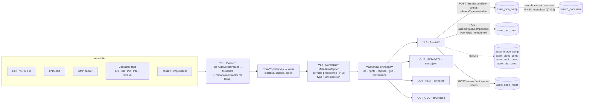

# Concept — Asset Metadata Ingest (Dublin Core / EXIF / XMP / IPTC)

Status: 🔵 **Concept, nothing built.** This file proposes a new Cortex node kind `metadata` plus the
Loom-side plumbing it needs. No code exists yet; every "today" statement below was verified against
git HEAD `4dc0390a` and is marked with the file it was read from.

> **The one-line pitch.** Every media file already carries authored metadata — who shot it, where,
> under which licence, with what title and keywords. MetaLoom currently throws all of it away. A
> `metadata` node reads it, normalises it onto a Dublin-Core-shaped vocabulary, and persists it into
> the component tables the schema *already has* (`asset_geo_comp` in particular).

Adjacent specs — read them, do not duplicate them:

| File | Why it matters here |
|---|---|
| [../features/pipeline-nodes/SERVICE_TIKA.md](../features/pipeline-nodes/SERVICE_TIKA.md) | The existing `tika` node. It already opens a Tika `Metadata` object — and prints it to `System.out`. §2.1 |
| [../guidelines/NEW_NODE.md](../guidelines/NEW_NODE.md) | **Rules.** The five registration touch-points, the persistence template, the required test set |
| [../features/pipeline-nodes/NODES.md](../features/pipeline-nodes/NODES.md) | The node system and the per-node tables this node must be added to |
| [../features/pipeline/NODE_DATA_TYPES.md](../features/pipeline/NODE_DATA_TYPES.md) | The typed-port model the ports in §6 obey |
| [../loom/PERSISTENCE.md](../loom/PERSISTENCE.md) · [../loom/DOMAIN.md](../loom/DOMAIN.md) | The component tables in §5 |
| [../loom/RESTAPI.md](../loom/RESTAPI.md) | `/assets/:assetUuid/components`, the endpoint §7 has to fix |
| [../features/search/SEARCH.md](../features/search/SEARCH.md) | `search_extract_json_text` — the hook that makes ingested titles searchable |
| [../features/rest/REST_CORTEX_METADATA_BINARY_HANDLING_PLAN.md](../features/rest/REST_CORTEX_METADATA_BINARY_HANDLING_PLAN.md) | The *other* "Cortex → Loom metadata" plan. That one is about **produced artefacts and their bytes**; this one is about **metadata already inside the source file**. Different direction, no overlap |

---

## 1. Scope

**In scope** — reading metadata *out of* an asset file and persisting it in Loom:

- Images: EXIF, GPS, IPTC-IIM, XMP, Photoshop IRB, maker notes (best effort), HEIC/AVIF, TIFF, PSD, RAW.
- Documents: PDF `Info` + XMP, OOXML core/extended properties, ODF, EPUB, HTML `<meta>`, plain Dublin Core XML.
- Audio: ID3v1/v2, Vorbis comments, MP4 `ilst`, XMP-DM.
- Video: MP4/MOV `udta`/XMP-DM, FLV, Matroska tags (gap — see §9.3).
- Sidecar files: `<asset>.xmp`, and optionally `<asset>.json` (Google Takeout shape).
- Normalisation onto one canonical vocabulary, provenance for every field, and persistence into
  `asset_geo_comp`, `asset_json_comp`, and (phase 2) the typed `asset_{image,video,audio,doc}_comp`
  tables.

**Out of scope** (named so nobody assumes it):

- **Metadata write-back / export** — embedding MetaLoom's own values back into a file, or into a
  derivative on the way out. That is the inverse direction and stays a note in
  [../tasks/METALOOM_NOTES.md](../tasks/METALOOM_NOTES.md). §12 sketches why it is harder than it looks.
- **Body text extraction** — that is the `tika` node's job and its `content` port. This node reads
  the `Metadata` object, not the `ContentHandler`.
- **Container/stream probing** (fps, frame count, real bitrate) — the `quality` node measures those
  from the decoder. This node only reports what the file *claims* about itself. §5.3 keeps them apart.
- **Reverse geocoding** (lat/lon → place name). `asset_geo_comp.geo_alias` is the column for it; a
  separate `geocode` node is the natural home. This node leaves `geo_alias` null unless the file
  itself names a location (IPTC `City`/`Country` does).

---

## 2. What exists today (verified)

### 2.1 The metadata is read and then discarded

`cortex/nodes/tika/core/.../MediaTikaParser.parse()` builds a `Metadata` object, loops over
`metadata.names()`, and does:

```java
System.out.println(name + " " + metadata.get(name));   // MediaTikaParser.java:86
```

…then falls out of the `try` and returns the literal `null`. So today: the metadata goes to stdout,
the body text is lost too, and the `tika` JSON component always stores `{"content": ""}`. Both are
already logged as 🔴 bugs 1 and 2 in
[SERVICE_TIKA.md §7](../features/pipeline-nodes/SERVICE_TIKA.md), whose progress list also carries
the open item *"Map Tika `Metadata` to something"*. **This concept is the answer to that item.**

Two more details from that parser matter here:

- `JpegParser` and `RTFParser` are **commented out** (`MediaTikaParser.java:41,62`). `JpegParser` is
  the one that runs `ImageMetadataExtractor` — i.e. **JPEG EXIF and GPS are not parsed at all today**,
  even into stdout. `ImageParser` (the plain ImageIO one) resolves JPEG instead and yields only
  width/height/bit-depth.
- The parser list is `static final` and shared process-wide, so it cannot be varied per node instance.

### 2.2 The database is already prepared for this

`V2.38__rework_asset_components.sql` created `asset_geo_comp` with exactly the columns an EXIF ingest
needs, and its own column comments name this use case:

```sql
COMMENT ON COLUMN "asset_geo_comp"."node_kind" IS 'Producing node kind, e.g. tika, llm, manual';
COMMENT ON COLUMN "asset_geo_comp"."method"    IS 'How the position was derived: exif, xmp, gps-track, llm, manual';
COMMENT ON COLUMN "asset_geo_comp"."time_from" IS 'Millisecond offset into the media; 0 for stills';
CONSTRAINT "asset_geo_comp_unique_key" UNIQUE ("asset_uuid", "node_kind", "method", "time_from")
```

The `(asset_uuid, node_kind, method, time_from)` key is what makes a **GPS track** representable: a
drone video contributes one row per sample. `asset_{doc,image,video,audio}_comp` and
`asset_json_comp` follow the same shared component contract (`node_kind` / `node_id` /
`producer_version` / `run_uuid` / `task_uuid` / `confidence` / `meta`).

### 2.3 …but nothing writes those tables

| Fact | Evidence |
|---|---|
| **No Cortex node writes a typed component.** Every node persists to `asset_json_comp` (`createAssetJsonComp`) or to the ledger only | `grep -r "createAssetComponent" cortex/` → no hits. `TikaNode.persist()`, `QualityNode.persist()` both use `JsonCompCreateRequest` |
| The generic endpoint **does** exist: `GET/POST /api/v1/assets/:assetUuid/components`, `GET/POST/DELETE …/:compUuid`, guarded by `READ_ASSET` / `UPDATE_ASSET` | `AssetComponentEndpoint.java`, `AssetComponentEndpointService.java` |
| The client method exists | `LoomHttpClientImpl.createAssetComponent()` → `assets/{uuid}/components` |
| 🔴 **`create` inserts, it does not upsert.** The service calls `compDao.storeGeoComp(comp)` which is `insertAndReturnUuid(...)`. `AssetComponentDaoImpl.upsertGeoComp()` exists and is correct — the endpoint just does not call it | `AssetComponentEndpointService.java:68-77`, `AssetComponentDaoImpl.java:328-336` |
| 🔴 **The request model cannot express the discriminators.** `AssetComponentCreateRequest` has `type` + `source` + one `*Info` payload. There is **no** `method`, `timeFrom`, `accuracyM`, `producerVersion`, `nodeId`, `confidence`, `streamIndex`, `pageNumber` | `AssetComponentCreateRequest.java`, `info/GeoLocationInfo.java` (`source`/`lon`/`lat`/`alias` only) |
| The `*Info` models are strict subsets of their tables | `ImageInfo` has no `orientation`/`bitDepth`/`imageEncoding`; `VideoInfo` no `fps`/`frameCount`/`rotation`; `AudioInfo` no `lang`/`trackTitle`/`isDefault`; `DocumentInfo` no `pageNumber`/`pageCount`/`textLang` |

**Consequence:** a `metadata` node cannot record `method='exif'` today, and a second pipeline run
would hit `asset_geo_comp_unique_key` and fail. §7 lists these as phase-1 blockers.

### 2.4 There is no home for licence / rights at all

`grep -i license` over the migrations returns exactly one hit:

```sql
"license" varchar, /* unclear */          -- V2.10__add_asset_location.sql:12
```

A column on `asset_location` (a *path*), marked unclear by its own author, is the wrong place: a
licence belongs to the content, not to where a copy happens to sit. §5.4 proposes the interim home
(the JSON component) and the eventual one.

---

## 3. The standards landscape

You cannot ingest "metadata" — you ingest half a dozen incompatible standards that overlap and
contradict each other. This is the map.

| Standard | Where it lives | What it is good for | Tika class |
|---|---|---|---|
| **Dublin Core (DCMES)** | XMP `dc:`, ODF, EPUB, `<meta>` tags, OAI-PMH, plain `DcXMLParser` files | **The lingua franca.** 15 elements: `title` `creator` `subject` `description` `publisher` `contributor` `date` `type` `format` `identifier` `source` `language` `relation` `coverage` `rights` | `DublinCore`, `XMPDC` |
| **DCMI Terms** | `dcterms:` namespace | The refinement layer over DCMES (~55 properties incl. `created`, `modified`, `license`, `rightsHolder`, `spatial`, `temporal`) | `DublinCore` (partly) |
| **EXIF** | JPEG APP1, TIFF IFD, HEIC, RAW | Camera truth: make/model/lens, exposure, ISO, orientation, `DateTimeOriginal`, GPS IFD | `TIFF`, `Geographic` |
| **IPTC-IIM** | JPEG APP13 (Photoshop IRB) | Newsroom fields: headline, caption, byline, credit, source, copyright notice, city/country, keywords | `IPTC`, `Photoshop` |
| **XMP** | RDF/XML packet in almost any format, or a `.xmp` sidecar | The modern superset. Embeds `dc:`, `photoshop:`, `Iptc4xmpCore:`, `xmpRights:`, `xmpDM:`, `crs:` (Lightroom) | `XMP`, `XMPRights`, `XMPMM`, `XMPDM` |
| **ID3 / Vorbis / MP4 ilst** | Audio containers | Artist, album, track, year, genre, BPM, cover art | `XMPDM` (Tika normalises into it) |
| **PDF Info + XMP** | PDF | Author/Title/Subject/Keywords/Producer/Creator tool, page count | `PDF`, `PagedText` |
| **OOXML / ODF properties** | Office documents | Core (title/creator/lastModifiedBy/revision) + extended (application, company, word count) | `Office`, `OfficeOpenXMLCore`, `OfficeOpenXMLExtended` |
| **Creative Commons REL** | XMP `cc:` | `cc:license`, `cc:attributionName`, `cc:morePermissions` | `CreativeCommons` |

*Verified:* every class above is present in `tika-core-3.2.2.jar` (`org/apache/tika/metadata/`), which
also ships `metadata/filter/` — `FieldNameMappingFilter`, `GeoPointMetadataFilter`,
`DateNormalizingMetadataFilter`, `ExcludeFieldMetadataFilter` — and
`metadata/writefilter/StandardWriteFilter`, which caps total metadata size. §4.4 uses these instead
of hand-rolling equivalents.

**How many Dublin Core elements are there?** (the question in
[METALOOM_NOTES.md](../tasks/METALOOM_NOTES.md)): **15** in the legacy `dc:` element set, ~**55**
properties in the `dcterms:` namespace once refinements are included. 15 is the number to design
against; the rest map into `raw` or into the extension blocks of §4.2.

**Extraction capability we get for free.** `tika-parser-image-module-3.2.2.jar` contains
`JpegParser`, `TiffParser`, `HeifParser`, `PSDParser`, `BPGParser`, `JXLParser`, `WebPParser`,
`ICNSParser` and `ImageMetadataExtractor`; `com.drewnoakes:metadata-extractor:2.19.0` and
`com.adobe.xmp:xmpcore` are already in the local repository as transitive deps. **No new third-party
dependency is required for phase 1** — the work is enabling `JpegParser` and mapping the output.

---

## 4. Design

### 4.1 Node vs. extending `tika`

**Recommendation: a new node kind `metadata`, and leave `tika` alone.**

| | New `metadata` node | Extend `TikaNode` |
|---|---|---|
| Cost | A module, a descriptor, 4 test classes | Fewer files |
| Independently schedulable | ✅ Cheap metadata-only ingest without paying for full text extraction of a 400-page PDF | ❌ One switch for both |
| Ports | Clean: `struct/json` out | ❌ Overloads a node documented as "text content out" |
| Extraction stack | Free to add `metadata-extractor` directly for RAW/maker notes Tika does not reach | Constrained by the shared `static final` parser list (§2.1) |
| Options | Its own privacy/raw/sidecar options | ❌ `TikaNodeOptions` already has zero fields and an open "give it fields or delete it" item |
| Persistence targets | geo + typed comps | ❌ `tika`'s `schemaType` is a hard search contract — see the gotcha in §11 |

Both nodes parse the same bytes twice when both are enabled. That is acceptable: metadata parsing is
cheap (headers only for most formats), and the alternative — a shared parse cache across node kinds —
is a bigger change than this concept warrants. Revisit only if profiling says so.

### 4.2 Three layers: raw → canonical → typed



**Why three layers and not two.** `raw` alone is unqueryable (thousands of vendor keys, no types).
Canonical alone is lossy and irreversible — when a mapping turns out wrong you want the source values
still there. Keeping both, with `provenance` naming which raw key won each canonical field, means a
mapping bug is fixable by re-normalising instead of re-parsing every asset.

**The canonical envelope** — the payload of the `metadata` JSON component:

```json
{
  "v": 1,
  "dc": {
    "title": "Sunrise over Fuji",
    "creator": ["Jane Doe"],
    "subject": ["sunrise", "mountain", "japan"],
    "description": "Taken from the fifth station.",
    "publisher": null, "contributor": [],
    "date": "2019-04-03T05:12:44+09:00",
    "type": "StillImage", "format": "image/jpeg",
    "identifier": "urn:uuid:8f14e45f…", "source": null,
    "language": "en", "relation": [],
    "coverage": "Shizuoka, JP",
    "rights": "© 2019 Jane Doe"
  },
  "rights": {
    "statement": "© 2019 Jane Doe", "holder": "Jane Doe",
    "licenseUrl": "https://creativecommons.org/licenses/by/4.0/",
    "licenseId": "CC-BY-4.0",
    "usageTerms": "Attribution required",
    "credit": "Jane Doe / MetaLoom", "webStatement": null, "marked": true
  },
  "capture": {
    "make": "SONY", "model": "ILCE-7M3", "lens": "FE 24-70mm F2.8 GM",
    "software": "Lightroom 12.3", "dateTimeOriginal": "2019-04-03T05:12:44",
    "exposureTime": 0.004, "fNumber": 8.0, "iso": 100,
    "focalLength": 35.0, "focalLength35": 35.0,
    "flash": false, "orientation": 1, "colorSpace": "sRGB", "whiteBalance": "auto"
  },
  "geo": {
    "lat": 35.360833, "lon": 138.727500, "altitudeM": 2305.0,
    "accuracyM": null, "directionDeg": 271.5, "timestamp": "2019-04-03T05:12:44Z",
    "place": { "city": "Fujinomiya", "state": "Shizuoka", "country": "JP" }
  },
  "provenance": {
    "dc.title":   "xmp:dc:title",
    "dc.date":    "exif:DateTimeOriginal",
    "geo.lat":    "exif:GPSLatitude",
    "rights.licenseUrl": "xmp:cc:license"
  },
  "sources": ["exif", "xmp", "iptc"],
  "raw": { "exif:Make": "SONY", "…": "…" }
}
```

Rules for the envelope:

- **`v` is mandatory** and bumps when the *meaning* of a field changes. A reader must tolerate
  unknown keys and missing blocks.
- **Absent ≠ empty.** A field the file did not carry is omitted or `null`; it is never `""`.
- **Types are normalised, not passed through.** Dates → ISO-8601 with offset when known;
  `exposureTime` → seconds as a number (not `"1/250"`); `fNumber` → number; GPS → signed decimal
  degrees (not `"35 deg 21' 39.00\" N"`); booleans → real booleans.
- **`dc.creator`, `dc.subject`, `dc.contributor`, `dc.relation` are always arrays.** Everything else
  in `dc` is scalar. This is the single most common source of downstream `ClassCastException`s.
- **`raw` is opt-in** (`includeRaw`, default `false`) and capped. Maker notes alone can be tens of
  thousands of keys; `StandardWriteFilter` is the tool for the cap.

### 4.3 Precedence — who wins when two sources disagree

A JPEG out of Lightroom routinely carries the caption three times, in three encodings, with two
different values. The rule set below follows the Metadata Working Group guidelines; it is a
**design decision, deliberately written down**, not a discovered fact.

| Canonical field | Precedence (first non-empty wins) |
|---|---|
| `dc.title` | XMP `dc:title` → IPTC `ObjectName`/`Title` → EXIF `ImageDescription` → OOXML/PDF `Title` → filename stem *(only if `dateFallback`-style option enabled)* |
| `dc.description` | XMP `dc:description` → IPTC `Caption-Abstract` → EXIF `UserComment` → PDF `Subject` |
| `dc.creator` | XMP `dc:creator` → IPTC `By-line` → EXIF `Artist` → OOXML `dc:creator` / PDF `Author` |
| `dc.subject` | XMP `dc:subject` (bag) → IPTC `Keywords` → OOXML `cp:keywords` (split on `;`/`,`) |
| `dc.date` | EXIF `DateTimeOriginal` → XMP `photoshop:DateCreated` → XMP `xmp:CreateDate` → container creation date → *(opt-in)* filesystem mtime |
| `dc.rights` / `rights.statement` | XMP `dc:rights` → IPTC `CopyrightNotice` → EXIF `Copyright` |
| `rights.licenseUrl` | XMP `cc:license` → XMP `xmpRights:WebStatement` → a URL recognised inside `dc:rights` |
| `rights.marked` | XMP `xmpRights:Marked` → EXIF `Copyright` non-empty ⇒ `true` |
| `geo.*` | EXIF GPS IFD → XMP `exif:GPS*` → sidecar → *(never)* IPTC `City`, which is a *place name*, not a coordinate |
| `capture.*` | EXIF → XMP `exif:` mirror → maker note |
| `dc.language` | XMP `dc:language` → container language tag → `null` (**never** a guess; language *detection* belongs elsewhere) |

**EXIF beats XMP for dates and camera data; XMP beats EXIF for authored text.** The reason: EXIF
dates are written by the camera and XMP dates are frequently rewritten by editors, while EXIF text
fields are ASCII-limited and mangle non-Latin scripts.

Whichever source wins is recorded in `provenance`. When two sources disagree *and both are
authoritative* (e.g. two different `DateTimeOriginal` values in EXIF and XMP more than 24 h apart),
keep the winner, and record the loser under `raw` — do not silently drop it.

### 4.4 Extraction stack

1. **Tika `AutoDetectParser`** with a parser list that *includes* `JpegParser`, `TiffParser`,
   `HeifParser` and `PSDParser` (the ones `MediaTikaParser` omits), a `BodyContentHandler` whose
   output is discarded (`new BodyContentHandler(-1)` is wrong here — use
   `new DefaultHandler()` so no body text is buffered at all), and a `StandardWriteFilter` cap.
2. **`org.apache.tika.metadata.filter`** for the mechanical parts: `DateNormalizingMetadataFilter`
   for date coercion, `GeoPointMetadataFilter` for lat/lon assembly, `ExcludeFieldMetadataFilter` for
   the deny list. Prefer these over hand-rolled equivalents — they are already on the classpath and
   already handle the format zoo.
3. **`com.drewnoakes:metadata-extractor`** directly, only where Tika's coverage is thin: camera RAW
   (`CR2`/`CR3`/`NEF`/`ARW`/`RAF`/`DNG`) and maker notes. Gate this behind a `rawFormats` option so
   the dependency stays optional in spirit.
4. **XMP sidecar**: if `readXmpSidecar` and `<asset>.xmp` exists next to the media, parse it and
   merge it at XMP precedence. `LoomMedia.absolutePath()` gives the base path; **a cloud/S3-backed
   `LoomMedia` may not have a sibling file** — treat a miss as normal, never as failure.

---

## 5. Persistence mapping

Follows the template in [NEW_NODE.md §1.2](../guidelines/NEW_NODE.md): typed component where a query
needs it, JSON component otherwise, ledger row always.

### 5.1 `asset_json_comp` — the envelope (phase 1)

```
nodeKind        = "metadata"
schemaType      = "metadata"
variant         = ""                     // one envelope per asset per node kind
producerVersion = "metadata/1"
data            = <the §4.2 envelope>
```

Unique key `(asset_uuid, node_kind, schema_type, variant)` makes a re-run an in-place replace. Uses
the existing `POST /assets/:uuid/json-comps` — **no Loom change needed for this half.**

### 5.2 `asset_geo_comp` — coordinates (phase 1, needs §7 G1+G2)

| Column | Value |
|---|---|
| `node_kind` | `metadata` |
| `method` | `exif` · `xmp` · `sidecar` · `gps-track` — **the source, exactly as the column comment prescribes** |
| `time_from` | `0` for stills; the sample offset in ms for a track |
| `geo_lon` / `geo_lat` | signed decimal degrees, `decimal(9,6)` / `decimal(8,6)` — ~11 cm resolution, plenty |
| `geo_alias` | `null` (reverse geocoding is a different node) unless IPTC named the place |
| `accuracy_m` | EXIF `GPSHPositioningError` when present |
| `confidence` | `null` — a coordinate read from a file is not a probabilistic estimate |
| `meta` | `{"directionDeg":…, "altitudeM":…, "gpsTimestamp":…}` |

A still image produces **one** row. A GPS-track video produces N rows, one per sample, and the
`gpsTrackMaxSamples` option caps N (default 1000, decimated evenly — not truncated, or you get the
first 1000 ms of a two-hour flight).

### 5.3 Typed media components (phase 2) — and the collision to avoid

| Table | Fields this node can fill | Fields it must **not** touch |
|---|---|---|
| `asset_image_comp` | `media_width`, `media_height`, `orientation`, `bit_depth`, `image_encoding` | `blurriness`, `image_dominant_color` — measured by `quality` / `dominant-color` |
| `asset_video_comp` | `media_width`, `media_height`, `media_duration`, `video_encoding`, `video_bitrate`, `rotation` | `fps`, `frame_count`, `blurriness` — measured by `quality` |
| `asset_audio_comp` | `lang`, `track_title`, `is_default`, `audio_bpm`, `audio_sampling_rate`, `audio_channels`, `audio_bitrate`, `audio_encoding`, `media_duration` | — |
| `asset_doc_comp` | `page_count`, `text_lang` (page 0 row) | `doc_plain_text`, `doc_word_count` — the `tika` node's row |

The tables key on `(asset_uuid, node_kind, <discriminator>)`, so a `metadata` row and a `tika` row
coexist by construction. The `asset_video_comp` comment already anticipates exactly this
("*two producers … yield two partially filled rows — the read side coalesces them by producer
precedence*"). **That read-side coalescing does not exist yet** — see §9.2.

⚠️ **Declared ≠ measured.** Container metadata lies: rotation flags, truncated durations, VBR files
claiming a nominal bitrate. Never overwrite a `quality` measurement with a container claim; that is
why the two node kinds write two rows instead of one.

### 5.4 Rights and licence

Phase 1: the `rights` block of the envelope, plus `dc.rights` as free text. Queryable through the
`asset_json_comp` GIN index (`data jsonb_path_ops`):

```sql
SELECT asset_uuid FROM asset_json_comp
WHERE schema_type = 'metadata' AND data @> '{"rights":{"licenseId":"CC-BY-4.0"}}';
```

That is enough for "find everything I may republish". It is **not** enough for a rights-clearance
workflow (expiry dates, model releases, territory restrictions, per-usage terms). When that is
needed, promote to a typed `asset_rights_comp` following the same shared contract — and settle
`asset_location.license` (§2.4) in the same change: drop it, or document it as the licence of a
*delivery copy*.

`rights.licenseId` is best-effort: match the `licenseUrl` against a small table of well-known licence
URLs (the six CC 4.0 variants, CC0, the public-domain mark) and emit an SPDX-style identifier. No
match ⇒ `licenseId` stays null and `licenseUrl` carries the truth. **Never guess a licence from
free text** — a wrong `CC-BY` is worse than no value.

### 5.5 Ledger

`recordNodeResult(asset, ctx, SUCCESS, null, "metadata/1", resultRef("asset_json_comp", compUuid))`
on success; a `FAILED` row with the message on failure. Per NEW_NODE §1.2 the ledger call is
best-effort and never fails the node. `resultRef` points at the envelope (the primary artefact); the
geo rows are discoverable from `asset_geo_comp WHERE node_kind='metadata'`.

---

## 6. Ports, descriptor, options

### 6.1 Ports

| Port | Dir | Id | Content type | Card. | Java type | Purpose |
|---|---|---|---|---|---|---|
| `IN_MEDIA` | in | `media` | `media/*` | ONE | `LoomMedia` | The asset |
| `OUT_METADATA` | out | `metadata` | `struct/json` | ONE | `String` | The §4.2 envelope, serialised |
| `OUT_TEXT` | out | `text` | `text/plain` | ONE | `String` | Title + description + keywords + creator, newline-joined. Feeds `translate`, `sentiment`, `llm`, `blacklist-filter` — every `text/*` consumer |
| `OUT_GEO` | out | `geo` | `struct/json` | optionalOne | `String` | `{lat,lon,altitudeM,accuracyM}`. Nothing consumes it yet; it is the seam for a future `geocode` node. **Only emitted when a coordinate was found** |

`String`-typed `struct/json` matches the existing convention (`SentimentNode.OUT_RESULT`,
`TranslateNode.OUT_RESULT`, `S3SinkNode.OUT_RESULT`). Descriptor: `kind=metadata`,
category `ANALYSIS`, icon `info`, `defaultConcurrency = 4`, `defaultMode = PARALLEL`.

No `OUT_FLAGS`. `tika`'s flags port carries `"DONE"`/`"FAILED"` and duplicates the node result —
[SERVICE_TIKA.md §7](../features/pipeline-nodes/SERVICE_TIKA.md) bug 3 already flags the mismatch
between it and its descriptor text. Do not copy it.

### 6.2 Options (`MetadataNodeOptions`, YAML key `metadata`)

| Key | Type | Default | Effect |
|---|---|---|---|
| `enabled` | boolean | `true` | inherited; `false` ⇒ `ctx.skipped("Disabled")` |
| `processIncomplete` / `retryFailed` | boolean | `false` | inherited, read by the pipeline |
| `timeoutMs` | long | `0` | inherited (`getDefaultTimeoutMs` applies when a definition omits it) |
| `includeRaw` | boolean | `false` | write the `raw` block |
| `rawMaxKeys` | int | `500` | cap on `raw` entries |
| `rawMaxValueBytes` | int | `4096` | per-value cap; longer values truncated with an ellipsis marker |
| `readXmpSidecar` | boolean | `true` | parse `<asset>.xmp` when present |
| `rawFormats` | boolean | `false` | enable the `metadata-extractor` path for camera RAW |
| `writeGeoComponent` | boolean | `true` | persist `asset_geo_comp` rows |
| `writeTypedComponents` | boolean | `false` | phase 2; §5.3 |
| `gpsTrackMaxSamples` | int | `1000` | decimation cap for GPS tracks |
| `gpsPolicy` | enum | `KEEP` | `KEEP` · `ROUND` (to `gpsRoundDecimals`) · `DROP` (§8) |
| `gpsRoundDecimals` | int | `2` | ~1.1 km at the equator |
| `emitText` | boolean | `true` | emit `OUT_TEXT` |
| `licenseDetection` | boolean | `true` | URL → `licenseId` mapping (§5.4) |
| `dateFallback` | enum | `NONE` | `NONE` · `FILESYSTEM` (use mtime as `dc.date` of last resort) |
| `excludeKeys` | list | `[]` | raw keys to drop before anything else (fed into `ExcludeFieldMetadataFilter`) |

**No environment variables.** Cortex node configuration is YAML + pipeline definition, never env —
consistent with every other node ([../cortex/CONFIGURATION.md](../cortex/CONFIGURATION.md)). The
worker-level variables that apply (`LOOM_HOST`, `LOOM_PORT`, `LOOM_TOKEN`, `CORTEX_NODE_WHITELIST`,
`CORTEX_NODE_BLACKLIST`) are the standard set and are documented there.

🔴 **The YAML layer is dead on the CLI/server path** — `CortexOptions.nodes` is never populated
(CONFIGURATION.md §1.1/§4), so a node that only reads `AbstractNodeOptions` runs on hard defaults and
**cannot be configured at all**. This node's options are the whole point of it, so
`MetadataNode` **must implement `PipelineConfigurable`** and read its options off the node definition
(`configure(JsonObject)`), like `script` and `s3-sink` do. Two consequences from NEW_NODE §1.3:
it must **not** be `@Singleton`, and it must override `nodeId()` so two differently-configured
instances in one graph do not collide on `asset_node_result`'s `(asset_uuid, node_kind, node_id)` key.

### 6.3 Cache key

`LocalResultCache` keyed by `media.absolutePath() + ":" + optionsDigest` — the options change the
output (`includeRaw`, `gpsPolicy`, `writeTypedComponents`), so the path alone would serve a stale
envelope to a second, differently-configured instance. Required by NEW_NODE §1.1 for exactly this case.

---

## 7. Loom-side gaps (the build list)

| # | Gap | Fix | Phase |
|---|---|---|---|
| **G1** | `AssetComponentCreateRequest` cannot express `method`, `timeFrom`, `accuracyM`, `producerVersion`, `nodeId`, `confidence`, `streamIndex`, `pageNumber` | Add them to the request and to the `*Info` models (§2.3). Alternative considered and rejected: a dedicated `/assets/:uuid/geo-comps` sub-resource — it would fork the component API for one type | 1 |
| **G2** | `AssetComponentEndpointService.create()` inserts; a re-run violates the unique key | Route through the existing `compDao.upsert*Comp(...)` methods. Document the endpoint as upsert, like `/fingerprints` already is | 1 |
| **G3** | Ingested titles/descriptions/keywords are not searchable | New migration: add `WHEN 'metadata' THEN` to `search_extract_json_text`, concatenating `data->'dc'->>'title'`, `->>'description'`, the `subject` array and `creator`. ⚠️ Re-run `./setup-pool.sh` after it | 1 |
| **G4** | No node-facing client method carries the new fields | Extend `AssetComponentMethods` / `LoomHttpClientImpl` alongside G1 | 1 |
| **G5** | Descriptor guard counts | `NodeDescriptorServiceLoaderTest` asserts **27 providers / 37 kinds** — both literals bump to 28/38, plus the kind list and the NODES.md §8 line | 1 |
| **G6** | Typed component writes (§5.3) | Depends on G1 landing the missing `*Info` fields | 2 |
| **G7** | No read-side coalescing across producers | A view or builder that merges `metadata` + `quality` rows by producer precedence (§9.2) | 2 |
| **G8** | The UI shows none of this | An asset metadata panel + a map pin for `asset_geo_comp`. Belongs in [../loom/ui/TASK_UI_ASSETS_MEDIA.md](../loom/ui/TASK_UI_ASSETS_MEDIA.md) | 2 |
| **G9** | `asset_location.license` is undefined (§2.4) | Decide and document, or drop it | 2 |
| **G10** | Rights need structure for a clearance workflow | `asset_rights_comp` (§5.4) | 3 |

**Suggested build order.** Phase 1 = G1–G5 + the node writing envelope and geo. Phase 2 = G6–G9 plus
video/audio breadth. Phase 3 = G10 and write-back (§12). Phase 1 alone delivers the headline
capabilities the request named: geolocation, licence, and searchable authored metadata.

---

## 8. Privacy — this node ingests PII by design

An EXIF GPS tag is a home address. A `dc:creator` is a named person. Maker notes have carried
serial numbers and, in some camera generations, owner names. Treat this as a feature with a safety
catch, not as a neutral data flow.

- **`gpsPolicy` is a first-class option**, not a footnote: `KEEP` (default — a DAM's job is to keep
  what the file says), `ROUND` (to `gpsRoundDecimals`, for shared or public pools), `DROP`.
- **The policy belongs on the pipeline**, so a "public library" pipeline can round while the internal
  archive keeps full precision. This is another reason for `PipelineConfigurable` (§6.2).
- **`includeRaw` defaults to `false`.** Maker notes are the least predictable surface in the whole
  format zoo; opting in should be a decision.
- **Ingest is not publication.** Rounding on ingest destroys data irreversibly. The better long-term
  answer is full precision in the database plus redaction on *export* — which is write-back (§12).
  Say so in the customer docs so nobody treats `ROUND` as a compliance control.
- **Deletion already works**: every component table is `ON DELETE CASCADE` from `asset`.

---

## 9. Known hard parts

### 9.1 Character encoding
IPTC-IIM has no reliable encoding declaration; legacy files carry Latin-1, Shift-JIS or CP1251 in
fields Tika will hand over as mojibake. XMP is always UTF-8. Precedence (§4.3) mitigates this by
preferring XMP for text. Do not add charset guessing — record what came out and let the XMP path win.

### 9.2 Two producers, one truth
`quality` measures 1920×1080; the container claims 1440×1080 (anamorphic). Both rows are correct
answers to different questions. The schema anticipated this; the read side did not (G7). Until then,
**the UI must show the producer** next to any coalesced value, or it will look like a bug.

### 9.3 Format coverage gaps
Matroska/WebM tags, AVCHD sidecars, and some RAW dialects are not covered by the Tika parser set.
Fail loudly per NEW_NODE ("fail, don't skip, when the worker cannot do the job") only when parsing
*errors*; a file that genuinely carries no metadata is a **SUCCESS with an empty envelope**, not a
failure and not a skip.

### 9.4 Timezones
EXIF `DateTimeOriginal` has no timezone. `OffsetTimeOriginal` (EXIF 2.31+) sometimes supplies one.
Emit a local-time string without an offset when the offset is unknown — **never** silently assume UTC,
which shifts holiday photos by up to a day and quietly corrupts date-range search.

### 9.5 Size
A PSD with layer metadata or a RAW with full maker notes can carry megabytes of metadata. `raw` caps
(§6.2) and `StandardWriteFilter` are not optional — note that `search_document` has a tsvector limit
of 1 MB (`LOOM_SEARCH_BODY_MAX_BYTES` exists for the body case).

---

## 10. Test setup

Mirrors the required set in [NEW_NODE.md §3](../guidelines/NEW_NODE.md). Run
`./setup-pool.sh` before anything that touches the database, and again after the G3 migration.

| Test | Module | Kind | Asserts |
|---|---|---|---|
| `MetadataMapperTest` | `cortex/nodes/metadata/core` | Pure unit, **no fixtures** | The §4.3 precedence table, one case per row. The highest-value test in the set — it is where the design actually lives |
| `MetadataNodeTest extends AbstractMediaTest` | same | Unit + `LoomClientMock` | Happy path emits `OUT_METADATA` and `OUT_TEXT`; a metadata-free file yields SUCCESS with an empty envelope; an unparsable file yields FAILED (via `.abort()`, **not** `.next()`); a second run is a cache hit and the mocked client is hit **once** |
| `MetadataNodePersistenceTest` | same | Mocked `LoomHttpClient` | Exactly one `asset_json_comp` POST with `schemaType=metadata`; one `asset_geo_comp` POST with `method=exif` when the fixture has GPS and **none** when it does not; one ledger row with the right `nodeKind`/`state`/`producerVersion`; a FAILED ledger row when persistence throws |
| `MetadataNodeOptionsValidationTest` | same | Plain JUnit | Defaults valid; each invalid field reported (negative caps, `gpsRoundDecimals` out of 0–6) |
| `MetadataNodePipelineTest extends AbstractNodeChainTest` | same | Adapter integration | Completion events, `OUT_TEXT` chaining into a `CapturingNode`, disabled + dry-run skip |
| `MetadataNodeIntegrationTest extends AbstractNodeIntegrationTest` | `integration-test` | E2E, real Loom + pooled DB | Read the component back via `listAssetJsonComps` and **assert the envelope is non-empty** — the mistake `TikaNodeIntegrationTest` makes (SERVICE_TIKA §7 bug 4) is asserting only non-null, which passes vacuously |
| `NodePortConformanceTest` | `integration-test` | Reflection | Add `map("io.metaloom.cortex.node.metadata.MetadataNode", "metadata")` |
| `NodeDescriptorServiceLoaderTest` | `loom-shared/node-model` | Reflection | Bump 27→28 providers, 37→38 kinds (G5) |
| `AssetComponentEndpointTest` | `loom/core` | Endpoint + permission | Extend for G1/G2: the new fields round-trip, a repeated POST **upserts** instead of 409/500, and `READ_ASSET`/`UPDATE_ASSET` are enforced. Per [CODING.md](../guidelines/CODING.md), grant test permissions via group+role, never a direct user grant |
| `AssetComponentDaoTest` | `loom/db/jooq` | DAO + cascade | `upsertGeoComp` replaces in place on `(asset,node_kind,method,time_from)`; deleting the asset cascades |

**Fixtures.** `loom-test-env` supplies the corpus through `DocData` / `ImageData` / `VideoData` /
`AudioData`. This node needs fixtures the corpus does not have yet — **add them, and keep them
small**:

| Fixture | Must carry |
|---|---|
| `imageExifGps()` | EXIF + GPS IFD + IPTC + XMP, all three disagreeing about the caption (this is the precedence test's whole point) |
| `imageNoMetadata()` | A stripped PNG — the empty-envelope path |
| `imageXmpSidecar()` | A file plus its `.xmp` sidecar |
| `audioId3()` | ID3v2 with artist/album/BPM |
| `videoGpsTrack()` | A short clip with a GPS track — the multi-row `time_from` path |

Commit the provenance of each fixture (source + licence) next to it: test media with unclear rights
in a repository that is *about* rights metadata is an avoidable irony.

---

## 11. Conventions and gotchas

- **Never change the `schemaType` string** once shipped. `search_extract_json_text` is a SQL `CASE`
  with no default branch — a renamed type is silently skipped, not an error. Same trap as `tika`.
- **`method` is the source, not the format.** `exif`, `xmp`, `sidecar`, `gps-track` — as the column
  comment prescribes. Writing `jpeg` there breaks the unique key's meaning.
- **`ctx.failure(msg).next()` reports SUCCESS.** A known 🔴 in `NodeContextImpl`; several older nodes
  do it. Failure is always `.abort()`.
- **An empty envelope is SUCCESS.** SKIPPED means "this item did not need processing"; a JPEG with no
  EXIF *was* processed.
- **The kind string appears five times** — `MetadataNodeOptions.KEY`, the `@StringKey`, `name()`, the
  descriptor `kind`, the YAML key — and they must all read `metadata`.
- **Adding or renaming a port requires editing the descriptor in the same change**, or
  `NodePortConformanceTest` fails the build. That failure is the tripwire working.
- **Clean-rebuild `cortex/core` after a node constructor change**, or `setup-pool`/tests fail with
  `NoSuchMethodError` against a stale Dagger factory.
- **Do not reuse `TikaNode`'s `LocalResultCache` shape.** Keying on the path alone (its bug — a moved
  file re-parses, a reused path returns a stale hit) is worse here because the options participate.
- **`grep` treats several files in this repo as binary.** Use `rg` or `grep -a`.
- **Dublin Core is a vocabulary, not a schema.** `dc:type` is a term from the DCMI Type vocabulary
  (`StillImage`, `MovingImage`, `Sound`, `Text`), not a MIME type. `dc:format` is the MIME type.
  Getting these two backwards is the classic DC mistake.

---

## 12. Out of scope but adjacent: write-back

The [METALOOM_NOTES.md](../tasks/METALOOM_NOTES.md) entry that prompted this concept says "metadata
**write-back**". Ingest is the tractable half; recording why write-back is not in this concept:

- Writing EXIF/XMP into an original **mutates a content-addressed asset** — the SHA-512 changes, and
  the asset identity in MetaLoom *is* the hash. Write-back therefore produces a **new derivative**,
  never an edit in place. That makes it a `TRANSFORM` node in the shape of `watermark`, not an
  extension of this one.
- It needs an authored source of truth (which of two conflicting titles do we write?) and a
  round-trip test corpus (write → re-ingest → compare) that this concept's fixtures do not cover.
- The genuinely useful near-term case is **redaction on export** (strip GPS and maker notes from a
  published derivative), which is a small, well-defined node — and a better first step than general
  write-back.

---

## 13. Key classes reference

Existing code this concept builds on (all verified present), and the classes it proposes (marked 🆕).

| Class | Package / path | Role |
|---|---|---|
| `TikaNode` | `io.metaloom.cortex.node.tika` (`cortex/nodes/tika/core`) | The sibling to copy the module shape from |
| `MediaTikaParser` | same | Where the metadata is read and discarded today (§2.1) |
| `AbstractMediaNode` | `io.metaloom.cortex.common.node` | `process()`, `client()`, `recordNodeResult()`, `resultRef()`, `nodeId()` |
| `PipelineConfigurable` | `io.metaloom.cortex.common.node` | Per-instance config — **required** (§6.2) |
| `LocalResultCache` | `io.metaloom.cortex.common.cache` | The skip cache |
| `NodeContextImpl` | `io.metaloom.cortex.api.node.context.impl` | `next()` / `abort()` / `skipped()` semantics |
| `ContentTypeRegistry` | `io.metaloom.loom.nodes.spec` (`loom-shared/node-model`) | `MEDIA_ANY`, `STRUCT_JSON`, `TEXT_PLAIN` |
| `AssetComponentDao` / `AssetComponentDaoImpl` | `io.metaloom.loom.db.model.asset` / `…db.jooq.dao.asset.comp` | `createGeoComp`, `storeGeoComp` (insert), **`upsertGeoComp`** (the one the endpoint should call) |
| `AssetComponentEndpoint` / `…EndpointService` | `io.metaloom.loom.rest.endpoint.impl` / `…service.impl` | `/assets/:assetUuid/components` — G1/G2 land here |
| `AssetComponentCreateRequest`, `GeoLocationInfo`, `ImageInfo`, `VideoInfo`, `AudioInfo`, `DocumentInfo` | `io.metaloom.loom.rest.model.asset[.info]` | The request models to extend (G1) |
| `AssetComponentType` | same | `GEO`, `DOC`, `IMAGE`, `VIDEO`, `AUDIO`, `TRANSCRIPT`, `JSON` |
| `LoomHttpClientImpl` | `io.metaloom.loom.client.http.impl` | `createAssetComponent`, `createAssetJsonComp` |
| 🆕 `MetadataNode` | `io.metaloom.cortex.node.metadata` | The node |
| 🆕 `MetadataExtractor` | same | L1: file → raw key/value map (Tika + optional metadata-extractor) |
| 🆕 `MetadataMapper` | same | L2: raw → canonical envelope; owns the §4.3 precedence table |
| 🆕 `AssetMetadata` (+ `DcBlock`, `RightsBlock`, `CaptureBlock`, `GeoBlock`) | same | The envelope value types |
| 🆕 `LicenseResolver` | same | `licenseUrl` → SPDX-style `licenseId` |
| 🆕 `MetadataNodeOptions` / `MetadataNodeModule` | same | Options + Dagger bindings |
| 🆕 `MetadataDescriptorProvider` | `io.metaloom.loom.nodes.spec` | Descriptor + ServiceLoader entry |

---

## 14. Progress Assessment

Nothing is built. Phase 1 is the minimum that delivers value.

**Phase 1 — envelope, geo, search**

- [ ] `cortex/nodes/metadata/core` module, copied from the `tika` shape
- [ ] `MetadataExtractor` — Tika parser list **including `JpegParser`/`TiffParser`/`HeifParser`/`PSDParser`**, a discarding content handler, `StandardWriteFilter` cap
- [ ] `MetadataMapper` + the §4.3 precedence table + `MetadataMapperTest` (write the test first — it is the design)
- [ ] `AssetMetadata` envelope types, `v: 1`
- [ ] `LicenseResolver` for the well-known CC/PD URLs
- [ ] `MetadataNodeOptions` (§6.2) — and `MetadataNode implements PipelineConfigurable`, **not** `@Singleton`, with an overridden `nodeId()`
- [ ] Ports `IN_MEDIA` / `OUT_METADATA` / `OUT_TEXT` / `OUT_GEO`, options-aware `LocalResultCache`
- [ ] Persist the envelope to `asset_json_comp` (`schemaType=metadata`, `producerVersion=metadata/1`) + ledger row
- [ ] **G1** — `method`/`timeFrom`/`accuracyM`/`producerVersion`/`nodeId`/`confidence` on `AssetComponentCreateRequest` and the `*Info` models
- [ ] **G2** — `AssetComponentEndpointService.create()` routed through `upsert*Comp`; endpoint documented as upsert
- [ ] **G4** — client methods carry the new fields
- [ ] Persist `asset_geo_comp` rows (`method=exif|xmp|sidecar|gps-track`), incl. the decimated GPS-track path
- [ ] **G3** — migration adding `WHEN 'metadata'` to `search_extract_json_text`; then `./setup-pool.sh`
- [ ] Registration touch-points 1–5 from [NEW_NODE.md §2](../guidelines/NEW_NODE.md)
- [ ] **G5** — descriptor guard counts 27→28 / 37→38, kind list, NODES.md §8 line
- [ ] The full test set in §10, incl. the new `loom-test-env` fixtures with recorded provenance
- [ ] `gpsPolicy` implemented and covered by a test
- [ ] Website page `website/content/english/docs/nodes/metadata/index.adoc` + the three `_index.adoc` edits
- [ ] Spec updates: NODES.md (§2 persistence, §3 node list, §4 cache key, §5.1/§5.2 wiring, §6.2/§6.3 options), NODE_DATA_TYPES.md §4 port rows
- [ ] `DemoDatabaseInitializer` — add `metadata` to a demo ingest pipeline (it needs no GPU, so unlike the sidecar nodes it belongs there)

**Phase 2 — typed components, breadth, UI**

- [ ] **G6** — `writeTypedComponents`: image/video/audio/doc rows per §5.3, never overwriting measured values
- [ ] **G7** — read-side coalescing across producers, with the producer visible in the UI
- [ ] **G8** — asset metadata panel + map pin ([TASK_UI_ASSETS_MEDIA.md](../loom/ui/TASK_UI_ASSETS_MEDIA.md))
- [ ] **G9** — settle `asset_location.license`
- [ ] `rawFormats` (camera RAW via `metadata-extractor`), Matroska/WebM coverage (§9.3)
- [ ] A `geocode` node consuming `OUT_GEO` and filling `geo_alias`

**Phase 3 — rights and write-back**

- [ ] **G10** — `asset_rights_comp` for a real clearance workflow (§5.4)
- [ ] A redaction-on-export node (strip GPS/maker notes from derivatives) — §12
- [ ] General metadata write-back, if still wanted after redaction ships

**Follow-on cleanup this concept unblocks** (owned by
[SERVICE_TIKA.md](../features/pipeline-nodes/SERVICE_TIKA.md), not by this file)

- [ ] Delete the `System.out.println` dump from `MediaTikaParser` — this node makes it redundant
- [ ] Decide `JpegParser`/`RTFParser` in `MediaTikaParser`: re-enable, or record that `metadata` owns image EXIF now

---

## 15. Where do I find …?

| I need … | Path |
|---|---|
| The node to copy | `cortex/nodes/tika/core/src/main/java/io/metaloom/cortex/node/tika/` |
| Where metadata is read and thrown away today | `…/tika/MediaTikaParser.java:80-91` |
| Tika version | `bom/pom.xml` → `<tika.version>` (3.2.2) |
| Tika metadata vocabularies | `org/apache/tika/metadata/` in `tika-core` — `DublinCore`, `XMPDC`, `XMPRights`, `XMPDM`, `IPTC`, `Photoshop`, `TIFF`, `Geographic`, `CreativeCommons`, `Office`, `PDF` |
| Tika metadata filters (date/geo/exclude/size) | `org/apache/tika/metadata/filter/` and `…/writefilter/` in `tika-core` |
| Image parsers incl. EXIF | `tika-parser-image-module` → `JpegParser`, `TiffParser`, `HeifParser`, `PSDParser`, `ImageMetadataExtractor` |
| Component tables | `loom/db/flyway/…/db/migration/V2.38__rework_asset_components.sql`, `V2.40__rework_asset_json_comp.sql` |
| Component DAO (incl. the unused `upsert*Comp`) | `loom/db/jooq/src/main/java/io/metaloom/loom/db/jooq/dao/asset/comp/AssetComponentDaoImpl.java` |
| Component REST endpoint / service | `loom/services/rest/…/endpoint/impl/AssetComponentEndpoint.java`, `…/service/impl/AssetComponentEndpointService.java` |
| Component request/response models | `loom-shared/rest-model/…/rest/model/asset/` (+ `info/`) |
| Search extraction SQL | `loom/db/flyway/…/V2.58__add_search_document.sql` (~line 155, `search_extract_json_text`) |
| Content-type constants | `loom-shared/node-model/…/nodes/spec/ContentTypeRegistry.java` |
| Descriptor examples | `loom-shared/node-model/…/spec/{Watermark,Sentiment,Translate}DescriptorProvider.java` |
| Descriptor guard test | `loom-shared/node-model/…/NodeDescriptorServiceLoaderTest.java` |
| Port conformance test | `integration-test/…/node/NodePortConformanceTest.java` |
| Node registration list | `cortex/cli/…/dagger/NodeCollectionModule.java`, `cortex/nodes/pom.xml`, `cortex/processor/pom.xml` |
| Test fixture accessors | `loom-test-env/src/main/java/io/metaloom/loom/test/data/{Image,Video,Audio,Doc}Data.java` |
| Test DB pool setup | `./setup-pool.sh` (mandatory before tests **and** after the G3 migration) |
| Dublin Core reference | <https://de.wikipedia.org/wiki/Dublin_Core> · <https://www.dublincore.org/specifications/dublin-core/dcmi-terms/> |

---

_Git HEAD revision: `4dc0390a`_
_Last updated: 2026-08-03 — initial concept. All "today" claims verified against this checkout; the
standards summary in §3 is external reference material._
