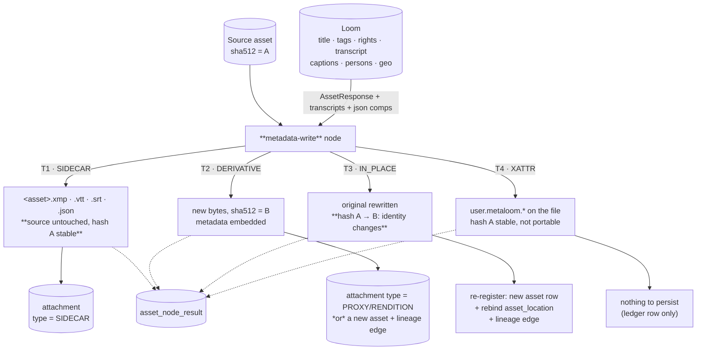

# Concept — Asset Metadata Write-Back

Status: 🔵 **Concept, nothing built.** Proposes a Cortex node kind `metadata-write` that pushes
MetaLoom's knowledge *back into* asset files — as sidecars, as embedded metadata in a derivative, or
(narrowly, opt-in) in place. Every "today" claim was verified against git HEAD `4dc0390a`.

> **The pitch.** A pipeline transcribes a video, captions it, detects the people in it and settles
> its licence — and all of that stays in PostgreSQL. The file that leaves MetaLoom is exactly as dumb
> as the file that arrived. Write-back closes the loop: the delivered copy carries its own title,
> rights, captions and transcript, and says honestly which of those a machine produced.

This is the inverse of the **`metadata` ingest node**, which is the prerequisite and is **built**:
[../features/nodes/metadata/METADATA_OVERVIEW.md](../features/nodes/metadata/METADATA_OVERVIEW.md). The canonical envelope defined in its §6 is
what this node serialises back out. Read that first — this file does not repeat the vocabulary, the
Dublin Core mapping, or the precedence rules.

| Also read | Why |
|---|---|
| [../features/rest/REST_CORTEX_METADATA_BINARY_HANDLING_PLAN.md](REST_CORTEX_METADATA_BINARY_HANDLING_PLAN.md) | **The single most relevant existing plan.** It already settled *"which shape does a produced artifact take"* — attachment vs new asset. This concept obeys that table rather than inventing a parallel answer |
| [../features/rest/REST_BINARY_HANDLING.md](../features/rest/REST_BINARY_HANDLING.md) | The byte endpoints, the pool model, the content-addressed layout |
| [NODE_WATERMARK.md](../features/nodes/watermark/NODE_WATERMARK.md) | The **worked example of a node that produces new bytes** — `.part` + atomic move, `FfmpegRunner`, artifact cache path, "the source file is never modified" |
| [../guidelines/NEW_NODE.md](../guidelines/NEW_NODE.md) | Rules: registration touch-points, persistence template, required tests |
| [NODE_S3SINK.md](../features/nodes/s3-sink/NODE_S3SINK.md) | The existing "get bytes out of MetaLoom" node — the natural downstream of this one |
| [../loom/DOMAIN.md](../loom/DOMAIN.md) · [../loom/PERSISTENCE.md](../loom/PERSISTENCE.md) | `asset`, `attachment`, `asset_remix` |

---

## 1. The constraint everything else follows from

`V2.46__asset_identity.sql` states it as a rule, in the table comment:

```
IDENTITY RULE: sha512sum stays NOT NULL, so an asset row cannot exist before a hashing
node has run.
```
```sql
ALTER TABLE "asset" ADD CONSTRAINT "asset_sha512sum_key" UNIQUE ("sha512sum");
```

**Writing metadata into a file changes its bytes, therefore its SHA-512, therefore its identity.**
There is no version chain to absorb that: `grep asset_version` over the migrations returns nothing,
and `asset_location` is documented as *"where these exact bytes are"*, never *"what was derived from
them"*.

So the design space is not "how do we edit the file". It is:

> **Write-back always produces something new** — a sidecar next to the asset, or a derivative of it.
> Editing a catalogued original in place is a *separate, dangerous mode* that must be opted into per
> pipeline and must re-register the result (§4.3).

The existing byte-producing node agrees. `WatermarkNode` re-encodes video and redraws images, and its
design record says in bold: **"The source file is never modified."**

---

## 2. What exists today (verified)

| Fact | Evidence |
|---|---|
| **Nothing in the tree writes metadata into any file.** No `exiftool`, `commons-imaging`, `jaudiotagger`, `mp4parser` or `xmpcore` dependency in any `pom.xml` | `grep -rn "commons-imaging\|jaudiotagger\|mp4parser\|exiftool\|xmpcore" --include=pom.xml .` → no hits |
| `com.adobe.xmp:xmpcore` **is** already resolvable as a transitive dependency of Tika's image module (read *and* write XMP, pure Java) | `~/.m2/repository/com/adobe/xmp/xmpcore` |
| MetaLoom already writes **one** thing into files: the SHA-512 cache, as an extended attribute | `LoomMediaImpl.java:139` → `XAttrUtils.writeXAttr(path(), SHA512_XATTR_KEY, …)` |
| …but the media API exposes xattrs **read-only** | `ProcessableMedia.listXAttr()` — no `setXAttr` |
| `ffmpeg`/`ffprobe` are already a supported runtime dependency, behind one class | `cortex/nodes/watermark/…/FfmpegRunner.java`, whose javadoc claims it is **the only class under `cortex/` that starts an external process** (the other `ProcessBuilder` in the repo is the agent sandbox's Podman backend) |
| Atomic-write helper already exists (`.part` + replacing move) | `cortex/nodes/watermark/…/AtomicFiles.java` |
| Six nodes already produce bytes and leave them on the worker (`metaPath/<name>_bin/…`), ledger row only | `thumbnail`, `depthmap`, `imagegen`, `videogen`, `tts`, `script` — table in [REST_CORTEX_METADATA_BINARY_HANDLING_PLAN.md](REST_CORTEX_METADATA_BINARY_HANDLING_PLAN.md) §"The gap" |
| **Attachment is the sanctioned sink for derived binaries** — decided, with `V2.44` saying so in its own header | that plan, §2 "Which shape does an artifact take?" |
| Attachment bytes can already be stored and served; the client can already upload one against an asset | `AttachmentEndpointService.create` → `BinaryStorage.store`; `AttachmentMethods.uploadAttachment(File, mimeType, assetUuid, type)` |
| 🔴 **The Java `AttachmentType` enum is out of sync with the database enum.** Java has `ASSET_THUMBNAIL`, `EMBEDDING_ATTACHMENT`. `V2.44` added `CONTACT_SHEET`, `POSTER_FRAME`, `WAVEFORM`, `PROXY`, `EXTRACTED_AUDIO` to the PG type | `io/metaloom/loom/api/attachment/AttachmentType.java` vs `V2.44__attachment_provenance.sql` |
| `attachment` already carries provenance columns and an idempotency index | `V2.44`: `node_kind`, `node_id`, `producer_version`, `variant`, `run_uuid`, `task_uuid`; `UNIQUE (asset_uuid, type, node_kind, variant)` |
| **The node already has almost everything it needs to read.** `AbstractMediaNode.fetchAsset()` does `client().loadAsset(sha512)`, and `AssetResponse` carries `tags`, `annotations`, `collections`, `geo`, `geoComponents`, `image/video/audio/documentComponents`, `hashes`, `locations` | `AbstractMediaNode.java:75-86`, `AssetResponse.java` |
| Transcripts and JSON components need one extra call each | `listAssetTranscripts(assetUuid)`, `listAssetJsonComps(assetUuid)` |
| 🟡 There is still **no licence field** anywhere — `AssetResponse` has `// private List<LicenseInfo> licenses` commented out | `AssetResponse.java:40`; see [METADATA_OVERVIEW.md §5.3](../features/nodes/metadata/METADATA_OVERVIEW.md) |
| Lineage between two assets: only `asset_remix (asset_a_uuid, asset_b_uuid, meta)` — untyped, undirected, unused by any node | `V2.8__add_asset.sql` |

---

## 3. Four write targets

The single most important design decision is *where the bytes go*. These are not variants of one
feature; they have different risk, different consumers and different build cost.



| | **T1 Sidecar** | **T2 Derivative** | **T3 In place** | **T4 xattr** |
|---|---|---|---|---|
| Source hash | unchanged | unchanged | 🔴 **changes** | unchanged |
| Survives copy / upload / CDN | ❌ (unless the sidecar travels too) | ✅ | ✅ | ❌ |
| Format coverage | ✅ everything (XMP is format-agnostic) | 🟡 per-format writer needed | 🟡 same | ✅ everything |
| Industry precedent | ✅ Lightroom / Bridge / Camera Raw write `.xmp` sidecars; `.srt`/`.vtt` next to video is universal | ✅ how every DAM publishes | 🟡 only in "managed" DAMs that own the storage | ❌ niche |
| Risk | low | low | **high** — see §4.3 | low |
| Build cost | **low** (pure Java, `xmpcore`) | medium (`exiftool`/`ffmpeg`) | medium + re-registration | low |
| Recommended phase | **1** | **2** | 3, if ever | 2, cheap |

**Recommendation: build T1 first.** It delivers the interoperability win (a photographer opens the
folder in Lightroom and sees MetaLoom's keywords; a player next to the video finds the AI transcript)
at the lowest risk and without a single new binary dependency. T2 is the one that matters for
*publishing*, and it composes with the existing `s3-sink`. T3 should stay unbuilt until somebody
produces a use case that T1 and T2 genuinely cannot serve.

---

## 4. Per-target design

### 4.1 T1 — sidecars

| Sidecar | Written for | Contents | Convention |
|---|---|---|---|
| `<asset>.xmp` | images, RAW, documents, anything | The ingest envelope serialised as an XMP RDF packet: `dc:`, `xmpRights:`, `Iptc4xmpExt:`, `photoshop:`, plus the `metaloom:` provenance block (§5) | Adobe's RAW convention. **Sits next to the file, same stem** |
| `<asset>.<lang>.vtt` / `.srt` | video, audio | Transcript / captions from `asset_transcript_comp` or an upstream `text/transcript` port | The universal player convention; `lang` is a BCP-47 subtag |
| `<asset>.json` | anything | The whole envelope verbatim, for consumers that do not speak XMP | MetaLoom's own shape, `v`-versioned |

- **Never overwrite an existing sidecar that MetaLoom did not write.** A `.xmp` next to a RAW file is
  the photographer's edit history (`crs:` develop settings). Check for the `metaloom:` block first;
  if absent, honour `sidecarConflict` = `SKIP` (default) · `MERGE` (preserve unknown namespaces,
  replace only what we own) · `OVERWRITE`.
- Written with `.part` + atomic replace (`AtomicFiles`, already exists).
- **The sidecar is also an artifact**: register it as an `attachment` (§6) so it is not lost when the
  worker's filesystem is not the library's.
- 🔴 **A sidecar needs a writable directory next to the media.** That is true for a filesystem
  library and false for `S3LoomMedia` / cloud-drive media, which materialise into a local cache.
  For those, write the sidecar to the artifact cache and rely on the attachment upload — **do not**
  push a `.xmp` object into the source bucket implicitly. `s3-sink` is the node that puts things in
  buckets, and it is explicit about it.

### 4.2 T2 — embedded derivative

The bytes are rewritten with metadata inside, at
`metaPath/metadata_write_bin/<segment>/<sha512>-<profileHash>.<ext>` — the `watermark` artifact-cache
convention, unchanged. Then, per the settled table in
[REST_CORTEX_METADATA_BINARY_HANDLING_PLAN.md §2](REST_CORTEX_METADATA_BINARY_HANDLING_PLAN.md):

- **attachment** (`type` = a new `RENDITION`, or `PROXY`) when it is a *view of the source asset* —
  the normal case. `variant` carries the profile name so "web delivery" and "archive" copies coexist
  under the `UNIQUE (asset_uuid, type, node_kind, variant)` index.
- **new asset + lineage edge** only when the result is meant to stand alone as catalogued media.

Format matrix:

| Container | Writer | Notes |
|---|---|---|
| JPEG / TIFF / PNG / WebP / HEIC | `exiftool` subprocess (`-overwrite_original`, `-XMP-dc:Title=…`) | The de-facto standard; nothing in Java matches its coverage. Pure-Java fallback: Apache Commons Imaging for JPEG/TIFF EXIF + PNG text chunks |
| Camera RAW | **sidecar only** | Rewriting a RAW is a data-loss risk with no upside. Force T1 |
| MP4 / MOV | `ffmpeg -map_metadata 0 -metadata key=value -c copy` | ⚠️ MP4 metadata is not one standard: iTunes-style `moov/udta/meta/ilst` vs an XMP `uuid` box. Write both, or accept that some players see nothing |
| MKV / WebM | `ffmpeg` (Matroska tags) | |
| MP3 / FLAC / M4A | `ffmpeg`, or `jaudiotagger` for precise ID3 control | Transcript → `USLT` (unsynchronised lyrics) or `SYLT` (synchronised) |
| PDF | `exiftool` (Info dict + XMP) | |

**Stream copy, never re-encode.** `-c copy` for containers; `exiftool` rewrites headers only. If a
profile ever needs a re-encode, that is a `transcode` node's job, not this one's. Silently
re-encoding a master is the kind of thing a DAM gets fired for.

### 4.3 T3 — in place, and why it is dangerous

Rewriting a catalogued original changes `sha512sum`, and `asset.sha512sum` is `UNIQUE NOT NULL`. The
minimum honest handling:

1. Write to `<file>.part`, verify, atomically replace — never a partial file at a scanned path.
2. Compute the new SHA-512. It is **a new asset row**; the old one does not mutate.
3. Rebind `asset_location (library_uuid, path)` to the new asset — the path is unchanged, the content
   is not.
4. Record a lineage edge old → new, and decide the fate of every component row attached to the old
   asset (they describe content that no longer exists at that path).
5. Make the operation idempotent: a second run must recognise "this file already carries my metadata,
   at this profile version" and skip, or it rewrites and re-registers forever.

⚠️ **Verify before building:** how the differential filesystem scanner (external `io.metaloom.fs`
artifact, `cortex/fs` is an empty shell) reacts to a file whose content changed at a known path was
**not** established while writing this concept. If it creates a second asset and leaves the old
location dangling, T3 corrupts the catalogue rather than updating it.

Gate T3 behind an explicit per-pipeline option (`target: IN_PLACE`) **and** a library-level
acknowledgement that MetaLoom owns those files. Never make it the default.

### 4.4 T4 — extended attributes

`user.metaloom.title`, `user.metaloom.envelope` (the JSON, size permitting). Content hash unchanged,
so no identity problem at all; `XAttrUtils.writeXAttr` already exists and is proven by the SHA-512
cache. Cheap to add.

Weaknesses that must be documented rather than discovered: xattrs do not survive `cp` without `-a`,
most uploads, tar without `--xattrs`, or an FTP/S3 round trip; several filesystems do not support
them at all (the repo's own notes list *"`xattr` unsupported on some test filesystems"* as a
standing test caveat); and value size is capped (commonly 64 KB per attribute on ext4).

Useful as a **local cache/marker**, not as a delivery mechanism. Its best use is idempotency for T3:
"this file already carries profile X at version Y".

---

## 5. AI-generated content — the part that is not optional

The prompting use case ("add AI audio transcript") is exactly the case where the *marking* matters
more than the payload. If MetaLoom writes a machine-made description into `dc:description` with no
marker, it has manufactured a plausible lie and shipped it downstream.

**Every value this node writes carries three things.** Externally standard, so other tools can read it:

| What | Where | Value |
|---|---|---|
| Digital source type | XMP `Iptc4xmpExt:DigitalSourceType` | The IPTC NewsCodes IRI — `…/digitalsourcetype/trainedAlgorithmicMedia` (fully synthetic), `compositeWithTrainedAlgorithmicMedia` (real media + AI parts), `algorithmicallyEnhanced` (AI-touched), `digitalCapture` (untouched). **Do not invent values; the vocabulary is controlled** |
| Writing tool | XMP `xmp:CreatorTool` | `MetaLoom <version>` |
| Per-field provenance | `metaloom:` namespace block | `metaloom:writtenAt`, `metaloom:sourceSha512`, `metaloom:profile`, `metaloom:fields` → `{"dc.description": {"by": "captioning", "model": "…", "confidence": 0.82}}` |

The `metaloom:fields` block mirrors the ingest envelope's `provenance` block
([METADATA_OVERVIEW.md §6](../features/nodes/metadata/METADATA_OVERVIEW.md)) — deliberately, because it is what makes the round trip safe.

**C2PA / Content Credentials** is the cryptographically signed version of the same idea (a signed
manifest in a JUMBF box, with an assertion chain naming the generators). It is where this is
heading industry-wide, and it is *not* a phase-1 item: it needs a signing identity, a certificate
story, and today realistically a `c2patool` subprocess since there is no Java implementation. Phase 3.
Design the provenance block so a C2PA assertion can be generated from it later rather than bolted on.

### 5.1 The round-trip loop — the failure mode nobody sees coming

```
whisper → transcript in Loom → metadata-write embeds it → file re-scanned
        → metadata ingest reads dc:description → treats it as AUTHORED ground truth
        → it now outranks the machine values in precedence → llm re-summarises it
        → written again … 
```

Each pass degrades. Breaking it is a hard requirement on **both** concepts:

- **Write side**: always emit the `metaloom:` block, including `sourceSha512` of the input.
- **Read side** — **already implemented**: [METADATA_OVERVIEW.md §5](../features/nodes/metadata/METADATA_OVERVIEW.md) ranks the `metaloom:`
  source last in every precedence chain (`MetadataMapper.expand()`), and
  `MetadataMapperTest.testMetaloomWrittenValuesNeverOutrankAnAuthoredOne` pins it. A field carrying
  the marker is ingested with `provenance = "metaloom:…"` and **cannot** be promoted to authored
  rank. A human who then edits it in Lightroom removes the
  marker naturally — which is the correct signal that it became authored.
- **Test it**: the round-trip test in §9 (`write → ingest → assert the field is still marked
  machine-written`) is the one that keeps this honest. Add it in phase 1, before there is anything to
  break.

### 5.2 Transcripts and captions are streams, not fields

The prompting example deserves a straight answer, because "write the transcript into the file" has
four different meanings:

| Meaning | Mechanism | Recommendation |
|---|---|---|
| A player shows subtitles | Muxed subtitle track (`-c:s mov_text` for MP4, `srt`/`webvtt` for MKV/WebM) | ✅ what users actually want — but it is **stream muxing, not metadata**. Phase 2, and arguably its own node kind |
| A player finds subtitles next to the file | `<asset>.<lang>.vtt` sidecar | ✅ **phase 1**, trivial, universally supported |
| The full text is searchable in someone else's DAM | XMP `dc:description` (short) or a `metaloom:transcript` property | 🟡 fine for a summary; a 90-minute transcript in an XMP packet bloats every read of the file |
| Timed text for broadcast | CEA-608/708 embedded captions | ❌ out of scope |

Keep the split clean: **this node writes fields**; a `subtitle-mux` node (phase 2) writes tracks.
Both read the same `asset_transcript_comp` / `text/transcript` port.

---

## 6. Node design

**Kind `metadata-write`**, module `cortex/nodes/metadata-write/core`, package
`io.metaloom.cortex.node.metadata.write`. One node with a `target` option rather than four nodes: the
expensive, opinionated part is *what to write and how it is marked*, which is identical across
targets; only the last step differs. (`subtitle-mux` is genuinely different and stays separate.)

### 6.1 Ports

| Port | Dir | Id | Content type | Card. | Java type | Purpose |
|---|---|---|---|---|---|---|
| `IN_MEDIA` | in | `media` | `media/*` | ONE | `LoomMedia` | The asset |
| `IN_METADATA` | in | `metadata` | `struct/json` | optionalOne | `String` | An envelope from upstream (e.g. the ingest node's `OUT_METADATA`, edited by a `script` node). Overrides the Loom-fetched values |
| `IN_TEXT` | in | `text` | `text/*` | optionalMany | `String` | Captions, descriptions, translations produced upstream. `text/transcript` elements route to the transcript field, `text/caption` to the caption field |
| `OUT_FILE` | out | `file` | `artifact/file` | optionalOne | `String` | The sidecar (T1) or rewritten copy (T2) — feeds `s3-sink` |
| `OUT_METADATA` | out | `metadata` | `struct/json` | ONE | `String` | What was actually written, incl. the provenance block |

Per [NEW_NODE.md](../guidelines/NEW_NODE.md) §1.1, a wired input port overrides the equivalent option:
`ctx.optionalInput(IN_METADATA).orElseGet(() -> fromLoom(asset))`.

Descriptor: `kind=metadata-write`, category `TRANSFORM` (it produces an artifact — same category as
`watermark`), icon `edit_note`.

### 6.2 Where the values come from

1. `IN_METADATA` if wired — the pipeline author is explicitly in control.
2. Otherwise assemble from Loom. **The `AssetResponse` the base class already fetches carries most of
   it** (`tags`, `annotations`, `collections`, `geo`, `geoComponents`, `*Components`, `locations`),
   plus one call each for `listAssetTranscripts` and `listAssetJsonComps` (where the ingest node's
   `metadata` envelope and the `caption`/`llm` outputs live).
3. `IN_TEXT` elements merge on top, by their content subtype.

A `fieldMap` option controls which canonical fields reach which output properties, so a "web
delivery" profile can publish title/description/rights and withhold GPS and person names.

### 6.3 Options

| Key | Type | Default | Effect |
|---|---|---|---|
| `enabled` / `processIncomplete` / `retryFailed` / `timeoutMs` | — | — | inherited |
| `target` | enum | `SIDECAR` | `SIDECAR` · `DERIVATIVE` · `IN_PLACE` · `XATTR` (§3) |
| `profile` | string | `default` | Named field set; becomes `attachment.variant` and part of the cache key |
| `fields` | list | *(profile default)* | Canonical field ids to write (`dc.title`, `rights.*`, `geo.*`, …) |
| `excludeFields` | list | `["geo.*"]` | **GPS withheld by default on a publish profile** — mirrors `gpsPolicy` in the ingest concept |
| `sidecarFormats` | list | `["xmp"]` | `xmp` · `vtt` · `srt` · `json` |
| `sidecarConflict` | enum | `SKIP` | `SKIP` · `MERGE` · `OVERWRITE` (§4.1) |
| `digitalSourceType` | enum | `auto` | `auto` derives it from field provenance; explicit values override |
| `stripFields` | list | `[]` | Fields to **remove** from the output — the redaction profile (§7) |
| `preserveExisting` | boolean | `true` | Never clobber a value already in the file unless the field is explicitly in `fields` |
| `registerAttachment` | boolean | `true` | Upload the artifact to Loom (§8 G2) |
| `attachmentType` | string | `RENDITION` | Needs the enum fix, §8 G1 |
| `exiftoolPath` / `ffmpegPath` | string | `exiftool` / `ffmpeg` | Resolved on `PATH` |

As in the ingest concept, the node **must implement `PipelineConfigurable`** (and therefore not be
`@Singleton`, and must override `nodeId()`): `CortexOptions.nodes` is never populated on the
CLI/server path, so YAML-only options would be unreachable. Two differently-profiled instances in one
graph are the expected case here — publish and archive — which makes `nodeId()` load-bearing for the
`asset_node_result` unique key.

**Cache key**: `media.absolutePath() + ":" + profileHash` — the profile changes the output. Verify the
cached artifact still exists on disk before serving a hit (NEW_NODE §1.1).

**Failure semantics**: a missing `exiftool`/`ffmpeg` is `ctx.failure(...).abort()` — *"fail, don't
skip, when the worker cannot do the job it was given"*. A media type with no writer for the requested
target is a **skip** with a reason. And `.abort()`, never `.next()` — `ctx.failure(msg).next()`
reports SUCCESS (a known 🔴 in `NodeContextImpl`).

---

## 7. Redaction is the same node

[METADATA_OVERVIEW.md §11](../features/nodes/metadata/METADATA_OVERVIEW.md) proposed "strip GPS and maker notes from a
published derivative" as the highest-value near-term case. It is this node with `stripFields` set and
no additions — same plumbing, same artifact path, same attachment. Ship it as a **named profile**
(`redact-publish`), not as a second node.

🔴 **But not rights.** Removing copyright management information from someone else's work is
independently unlawful in several jurisdictions (US DMCA §1202; EU InfoSoc Directive Art. 7 for
rights-management information) — separate from any infringement question. Therefore:

- `stripFields` **rejects `rights.*` and `dc.rights` at validation time.** Removing a copyright notice
  cannot be a config typo.
- A `forceStripRights` escape hatch may exist for the legitimate cases (the operator owns the
  content, or is fixing bad data), but it is explicit, logged at WARN with the asset uuid, and
  documented as the operator's call.
- The customer-facing docs say this in plain language. This is the kind of thing a DAM must be
  opinionated about.

---

## 8. Loom-side gaps

| # | Gap | Fix | Phase |
|---|---|---|---|
| **G1** | 🔴 Java `AttachmentType` has 2 values; the PG enum has 7. No type fits "a file carrying this asset's metadata" | Sync the enum, and add `SIDECAR` + `RENDITION` to both (a migration `ALTER TYPE … ADD VALUE` + the Java enum + the model). Pre-existing bug — it blocks any node from creating a `CONTACT_SHEET` today either | 1 |
| **G2** | Attachment provenance is invisible above the DB — `node_kind`/`node_id`/`producer_version`/`variant` cannot be set through REST | Already tracked as **A1** in [REST_CORTEX_METADATA_BINARY_HANDLING_PLAN.md §3](REST_CORTEX_METADATA_BINARY_HANDLING_PLAN.md). This concept is a second consumer of that work; **do not fork it** | 1 |
| **G3** | No typed lineage between a source asset and a derived one. `asset_remix` is an untyped, undirected pair table with no writer | Decide: extend `asset_remix` with a `relation` discriminator + direction, or add `asset_derivation (source_uuid, derived_uuid, node_kind, node_id, producer_version, relation)`. Needed the moment T2 produces a **new asset** rather than an attachment | 2 |
| **G4** | Nothing to write for licence — no field in the schema or `AssetResponse` (`// private List<LicenseInfo> licenses` is commented out) | The ingest concept's §5.4 / G10 (`asset_rights_comp`). Until then the node reads `rights` out of the `metadata` JSON component | 2 |
| **G5** | No per-asset "what was published where" record | The ledger + `attachment.variant` covers it thinly. A real publish history is a separate feature | 3 |
| **G6** | Re-registration path for T3 (new asset row + `asset_location` rebind + lineage) | Only if T3 is ever built — and only after the scanner behaviour in §4.3 is verified | 3 |
| **G7** | `ProcessableMedia` exposes `listXAttr()` but no write | Add `setXAttr`/`removeXAttr` for T4; `XAttrUtils.writeXAttr` already implements it | 2 |
| **G8** | `FfmpegRunner` lives inside the `watermark` module | Promote to `cortex/common` (or a `cortex/process-common`) as a general `ExternalProcessRunner` before a second node shells out — its wall clock, forcible termination and bounded stderr capture are exactly what an `exiftool` call needs, and they should not be written twice | 1 |
| **G9** | Descriptor guard counts | `NodeDescriptorServiceLoaderTest` asserts 27 providers / 37 kinds — bump both (and again for the ingest node; the two concepts collide here, land them in a known order) | 1 |
| **G10** | UI cannot trigger or show a write-back | An "export with metadata" action + the attachment list on the asset page. [TASK_UI_ASSETS_MEDIA.md](../loom/ui/TASK_UI_ASSETS_MEDIA.md) | 3 |

**Dependency on the ingest concept.** The canonical envelope and its provenance block are defined
there. Building write-back first would mean inventing them twice, so: **ingest phase 1 → write phase
1.** The one piece that can be built in parallel is G1/G8 (the attachment enum and the process
runner), both of which are pre-existing defects worth fixing regardless.

---

## 9. Test setup

Per [NEW_NODE.md §3](../guidelines/NEW_NODE.md). `./setup-pool.sh` before anything touching the DB, and
again after the G1 migration.

| Test | Module | Kind | Asserts |
|---|---|---|---|
| `MetadataWriterTest` | `cortex/nodes/metadata-write/core` | Pure unit | Canonical field → XMP/EXIF property mapping, per format. The inverse of the ingest concept's `MetadataMapperTest` |
| **`MetadataRoundTripTest`** | same | Unit, **the important one** | write → re-ingest with the ingest node's mapper → every written field comes back with `provenance = "metaloom"` and **is not** promoted to authored rank (§5.1). Add it in phase 1 |
| `SidecarWriterTest` | same | Unit, temp dir | `.xmp` is valid RDF and re-parses; `sidecarConflict=SKIP` leaves a foreign sidecar untouched; `MERGE` preserves unknown namespaces (`crs:`); `.vtt` is well-formed and cue timings match the transcript |
| `MetadataWriteNodeTest` | same | Unit + `LoomClientMock` | Happy path emits `OUT_FILE`/`OUT_METADATA`; missing `exiftool` ⇒ **FAILED via `.abort()`**, not skip; unsupported type ⇒ SKIPPED with a reason; second run is a cache hit (mocked client hit once) |
| `MetadataWriteNodePersistenceTest` | same | Mocked `LoomHttpClient` | Exactly one attachment upload with the right `type`/`variant`/`producerVersion`; one ledger row; FAILED ledger row when the upload throws |
| `MetadataWriteOptionsValidationTest` | same | Plain JUnit | Defaults valid; **`stripFields` containing `rights.*` is rejected** unless `forceStripRights` (§7); unknown `target`; empty `fields` |
| `MetadataWriteNodePipelineTest extends AbstractNodeChainTest` | same | Adapter | Events, `OUT_FILE` chaining into a `CapturingNode` (and into `s3-sink`), disabled + dry-run skip |
| `MetadataWriteNodeIntegrationTest` | `integration-test` | E2E | Real Loom + pooled DB: run, then read the attachment back and **assert its bytes parse and contain the expected fields** — not merely that a row exists (the vacuous-assert trap `TikaNodeIntegrationTest` fell into) |
| `NodePortConformanceTest` / `NodeDescriptorServiceLoaderTest` | — | Reflection | New `map(...)` line; bumped counts (G9) |
| `AttachmentEndpointTest` | `loom/core` | Endpoint + permission | G1/G2: the new types round-trip, provenance fields persist, the `UNIQUE (asset_uuid, type, node_kind, variant)` index makes a re-run an upsert. Grant test permissions via group+role |

**External-binary tests must skip, not fail**, when `exiftool`/`ffmpeg` is absent — the
`OllamaAvailability` / `FfmpegRunner.isAvailable()` pattern. CI without exiftool must stay green.

**Fixtures** (extend `loom-test-env`, keep them small, record each file's own provenance and licence):

| Fixture | For |
|---|---|
| `imageWithExistingXmp()` | the `sidecarConflict` matrix — must carry a `crs:` block that `MERGE` has to preserve |
| `imageCleanJpeg()` | the plain embed path |
| `videoShortMp4()` | container metadata + (phase 2) subtitle muxing |
| `transcriptFixture()` | a transcript with known cue timings, for the `.vtt` assertions |

---

## 10. Conventions and gotchas

- **Never modify the source file** unless `target=IN_PLACE` was explicitly configured. Every other
  node in the tree holds this line; `watermark` states it in bold.
- **The hash is the identity.** Any code path that changes an asset's bytes must produce a new asset
  or an attachment. There is no version chain to fall back on.
- **`.part` + atomic replace, always** (`AtomicFiles`). A metadata writer interrupted mid-write on a
  scanned path is a corrupted master.
- **Stream copy, never re-encode** (§4.2).
- **`preserveExisting=true` is the safe default.** A DAM overwriting a photographer's IPTC caption
  with a machine caption, silently, is a support ticket that ends in a lost customer.
- **Do not strip rights metadata** (§7) — it is a legal question, not a config question.
- **Mark everything machine-written** (§5), or the round trip poisons the catalogue (§5.1).
- **Controlled vocabularies are controlled.** `Iptc4xmpExt:DigitalSourceType` takes IRIs from the
  IPTC NewsCodes scheme; a hand-written `"AI"` is worse than nothing because it validates as a string.
- **`exiftool` is Perl, not a library.** It is a runtime prerequisite like `ffmpeg`: document it in
  the container image, probe it once (`isAvailable()`), fail loudly when it is missing.
- **One process-spawning class.** `FfmpegRunner`'s javadoc makes a point of being the only one; keep
  that true by promoting it (G8) rather than adding a second bespoke `ProcessBuilder`.
- **XMP packet size matters.** Embedding a 90-minute transcript makes every subsequent read of the
  file slower, forever. Sidecar it.
- **`grep` sees several files in this repo as binary** — use `rg` or `grep -a`.

---

## 11. Progress Assessment

Nothing is built here. Its one prerequisite — the canonical envelope and the `metaloom:`-ranks-last
read rule — is **done**: [METADATA_OVERVIEW.md](../features/nodes/metadata/METADATA_OVERVIEW.md).

**Phase 0 — pre-existing defects, buildable now, independent of both concepts**

- [ ] **G1** — sync the Java `AttachmentType` enum with the PG enum, and add `SIDECAR` + `RENDITION`
- [ ] **G8** — promote `FfmpegRunner` out of `watermark` into a shared `ExternalProcessRunner`
- [ ] **G2** — attachment provenance through REST (already owned by [REST_CORTEX_METADATA_BINARY_HANDLING_PLAN.md](REST_CORTEX_METADATA_BINARY_HANDLING_PLAN.md) A1 — coordinate, do not fork)

**Phase 1 — sidecars (T1)**

- [ ] `cortex/nodes/metadata-write/core`, copied from the `watermark` shape
- [ ] `MetadataWriter` — canonical envelope → XMP RDF via `xmpcore` (no new dependency)
- [ ] The `metaloom:` provenance block + `Iptc4xmpExt:DigitalSourceType` + `xmp:CreatorTool` (§5)
- [ ] `.xmp`, `.vtt`, `.srt`, `.json` sidecar writers, `.part` + atomic replace
- [ ] `sidecarConflict` = SKIP / MERGE / OVERWRITE, with `MERGE` preserving foreign namespaces
- [ ] Ports (§6.1), options (§6.3), `PipelineConfigurable`, non-`@Singleton`, `nodeId()` override
- [ ] Assemble values from `AssetResponse` + `listAssetTranscripts` + `listAssetJsonComps`, overridden by `IN_METADATA` / `IN_TEXT`
- [ ] Register the sidecar as an attachment (needs G1 + G2); ledger row always
- [ ] **`MetadataRoundTripTest`** and the rest of §9
- [ ] `stripFields` validation rejecting `rights.*` (§7)
- [ ] Registration touch-points 1–5, **G9** descriptor counts
- [ ] Website page `website/content/english/docs/nodes/metadata-write/index.adoc` + the three `_index.adoc` edits — including the rights-stripping warning in customer language
- [ ] Spec updates: NODES.md (§2/§3/§4/§5.1/§5.2/§6.2/§6.3), NODE_DATA_TYPES.md §4
- [ ] `DemoDatabaseInitializer` — a demo "publish" pipeline: `metadata` → `metadata-write` → `s3-sink`

**Phase 2 — embedded derivatives (T2), xattr (T4), redaction**

- [ ] `exiftool` writer for JPEG/TIFF/PNG/WebP/HEIC/PDF, behind `isAvailable()` with skipping tests
- [ ] `ffmpeg` container writer (`-c copy`) for MP4/MOV/MKV/audio
- [ ] RAW forced to sidecar-only
- [ ] Artifact cache path + attachment as `RENDITION`, `variant = profile`
- [ ] `redact-publish` profile (§7) — the strip-GPS-on-export case
- [ ] **G7** — `setXAttr` on `ProcessableMedia`; T4 target
- [ ] **G3** — typed lineage, once T2 can emit a standalone new asset
- [ ] **G4** — rights fields to write, once `asset_rights_comp` exists
- [ ] A separate `subtitle-mux` node for muxed caption tracks (§5.2)

**Phase 3 — provenance, in-place, UI**

- [ ] C2PA / Content Credentials via `c2patool`, incl. the signing-identity story (§5)
- [ ] **G6/T3** — in-place rewrite, **only after** the scanner behaviour in §4.3 is verified
- [ ] **G10** — UI: "export with metadata", attachment list, publish history
- [ ] **G5** — a real publish history

---

## 12. Key classes reference

| Class | Package / path | Role |
|---|---|---|
| `WatermarkNode` | `io.metaloom.cortex.node.watermark` | **The node to copy.** Artifact cache path, options hash, ledger-only persistence, "never modify the source" |
| `FfmpegRunner` | same | The one external-process wrapper — timeout, forcible kill, bounded stderr. Promote it (G8) |
| `AtomicFiles` | same | `.part` + replacing atomic move |
| `AbstractMediaNode` | `io.metaloom.cortex.common.node` | `process()`, `fetchAsset()` (by SHA-512), `recordNodeResult()`, `resultRef()`, `nodeId()` |
| `PipelineConfigurable` | same | Per-instance config — required (§6.3) |
| `XAttrUtils` | `cortex/common` (`…common.media`) | The existing xattr writer — T4 and G7 |
| `ProcessableMedia` / `LoomMedia` | `io.metaloom.cortex.api.media` | `path()`, `file()`, `open()`, `listXAttr()`; no write API yet |
| `S3SinkNode` | `io.metaloom.cortex.node.sink.s3` | The downstream consumer of `OUT_FILE`; also the precedent for "explicit about which bucket" |
| `AttachmentType` | `io.metaloom.loom.api.attachment` | 🔴 Out of sync with the PG enum (G1) |
| `AttachmentEndpointService` | `io.metaloom.loom.rest.service.impl` | `create` → `BinaryStorage.store`, `poolFor(...)` inheritance |
| `AttachmentMethods` | `loom-client/common/.../method` | `uploadAttachment(File, mimeType, assetUuid, type)` |
| `AssetResponse` | `io.metaloom.loom.rest.model.asset` | Already carries tags/annotations/collections/geo/components/locations — the write-back source (§6.2) |
| `TranscriptMethods` / `JsonCompMethods` | `loom-client/common/.../method` | `listAssetTranscripts`, `listAssetJsonComps` |
| 🆕 `MetadataWriteNode` | `io.metaloom.cortex.node.metadata.write` | The node |
| 🆕 `MetadataWriter` | same | Canonical envelope → format properties (the inverse of the ingest `MetadataMapper`) |
| 🆕 `SidecarWriter` | same | `.xmp` / `.vtt` / `.srt` / `.json`, incl. the merge logic |
| 🆕 `ExiftoolRunner` | same (or shared) | The `exiftool` subprocess, on the promoted process runner |
| 🆕 `ProvenanceStamper` | same | The `metaloom:` block + `DigitalSourceType` (§5) |
| 🆕 `MetadataWriteNodeOptions` / `…Module` / `MetadataWriteDescriptorProvider` | same / `loom-shared/node-model` | Options, bindings, descriptor |

---

## 13. Where do I find …?

| I need … | Path |
|---|---|
| The byte-producing node to copy | `cortex/nodes/watermark/core/src/main/java/io/metaloom/cortex/node/watermark/` |
| The process runner to promote | `…/watermark/FfmpegRunner.java` |
| Atomic write helper | `…/watermark/AtomicFiles.java` |
| The existing xattr writer | `cortex/common/…/media/` (`XAttrUtils`), used at `LoomMediaImpl.java:139` |
| Asset identity rules | `loom/db/flyway/…/V2.46__asset_identity.sql` (the `IDENTITY RULE` / `PLACEMENT RULE` comments) |
| Attachment schema + provenance columns | `loom/db/flyway/…/V2.44__attachment_provenance.sql` |
| Attachment Java enum (out of sync) | `loom-shared/…/io/metaloom/loom/api/attachment/AttachmentType.java` |
| Attachment REST + storage | `loom/services/rest/…/service/impl/AttachmentEndpointService.java`, `BinaryStorage`, `BinaryStorageResolver` |
| Lineage table (untyped, unused) | `asset_remix` in `V2.8__add_asset.sql` |
| The settled "attachment vs new asset" table | [REST_CORTEX_METADATA_BINARY_HANDLING_PLAN.md §2](REST_CORTEX_METADATA_BINARY_HANDLING_PLAN.md) |
| Transcript storage | `V2.39__rework_asset_transcript_comp.sql` (`transcript_text`, `transcript_json`, `lang`, `stream_index`) |
| The canonical envelope this node serialises | [METADATA_OVERVIEW.md §6](../features/nodes/metadata/METADATA_OVERVIEW.md) |
| Content-type constants | `loom-shared/node-model/…/nodes/spec/ContentTypeRegistry.java` (`ARTIFACT_FILE`, `STRUCT_JSON`, `TEXT_TRANSCRIPT`) |
| Descriptor guard tests | `loom-shared/node-model/…/NodeDescriptorServiceLoaderTest.java`, `integration-test/…/NodePortConformanceTest.java` |
| IPTC digital source type vocabulary | <http://cv.iptc.org/newscodes/digitalsourcetype/> |
| C2PA specification / tooling | <https://c2pa.org/specifications/> · `c2patool` |
| XMP specification | <https://developer.adobe.com/xmp/docs/> — `xmpcore` implements it |
| exiftool | <https://exiftool.org/> — the writer's tag names and `-overwrite_original` semantics |

---
_Git HEAD revision: `742dae2d`_
_Last updated: 2026-08-06 (reference sweep — no content changes)_