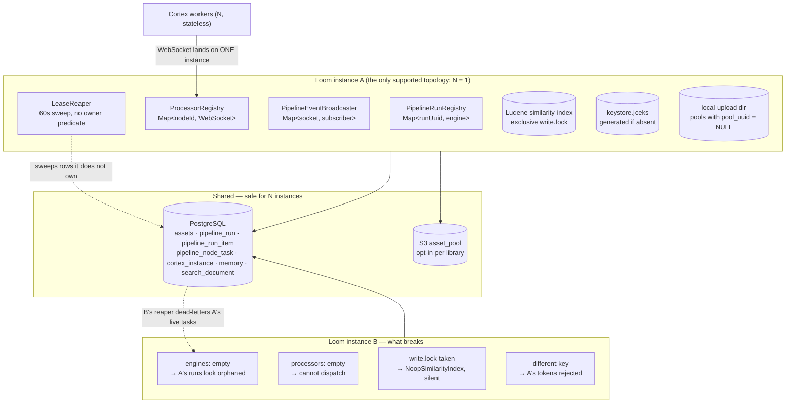

# Clustering & Multi-Instance Deployment — Technical Specification

> **Audience: AI coding agents.** One question: **what happens if more than one Loom server process
> runs against the same database?**
>
> **Status: Loom is single-writer by design. Nothing here is implemented.** A second instance is not
> "degraded but working" — it is **actively destructive** (§3). This file exists so the constraint is
> written down once instead of being rediscovered per subsystem, and so anything adding per-process
> state knows what it is signing up for.
>
> **Cortex is the opposite**: workers are stateless and scale horizontally on purpose
> ([features/helm/HELM_CORTEX.md](../features/helm/HELM_CORTEX.md)). Nothing here restricts Cortex.

| Component | Scales horizontally today? | Where enforced |
|---|---|---|
| **Loom server** | 🔴 **No — keep `replicaCount: 1`** | `helm/loom/values.yaml:7`; `strategy: Recreate` (`helm/loom/templates/deployment.yaml:11`), all PVCs `ReadWriteOnce` |
| **Cortex worker** | ✅ Yes, 0..N | `helm/cortex` StatefulSet; stable `CORTEX_NODE_ID` per replica |
| **PostgreSQL** | shared by all of the above | the only real shared state |
| **S3 / `asset_pool`** | ✅ shared, when a library opts in | `loom/services/s3`, `library.pool_uuid` (V2.63) |

**The rule for new code:** any state not in Postgres (or S3) is *per-process*. If correctness depends
on it being global — a lock, a registry, a cap, a cache of a mutable authority — it is a clustering
blocker and belongs in the §3 inventory.

---

## 1. Architecture — where state actually lives

**The load-bearing asymmetry.** Run state *is* durable now — `DaoRunStateStore` writes every
discovered item and settled task to `pipeline_run_item` / `pipeline_node_task`, which is what makes
`PipelineRunRecovery` work across a restart. What is **not** recorded is *which process owns a live
run*: `pipeline_run` has **no owner/instance column and no lease on the run itself** (V2.29, unchanged
through V2.63). The authority over a live run remains an in-heap `PipelineRunEngine`. Every failure in
§3 follows from that one gap.

---

## 2. Blocker inventory

🔴 **Not a backlog to grind through.** B-1 and B-2 cause *data-visible damage* to healthy runs within
60 seconds of a second instance booting.

| # | Class | Package / module | State held | Why it blocks clustering |
|---|---|---|---|---|
| **B-1** 🔴 | `LeaseReaper` | `io.metaloom.loom.rest.service.impl` (`loom/services/rest`) | `ScheduledExecutorService`, 60 s sweep | `loadExpiredLeases` filters only `state=RUNNING AND lease_expires_at < now` — **no owner predicate**. `runRegistry.get(runUuid)` returns `null` for another instance's run → `releaseOrphan()` sets `DEAD_LETTER`. **B kills A's healthy work.** Steady state, not a race. |
| **B-2** 🔴 | `PipelineRunRecovery` | same | — (acts on `PipelineRunRegistry`) | `recoverAll()` loads **all** `RUNNING` + `PAUSED` runs at boot, rebuilds an engine for each, has no notion of "already owned". A second boot re-adopts every in-flight run → duplicated node execution, two engines mutating the same rows. |
| **B-3** 🔴 | `PipelineRunRegistry` | same | `ConcurrentHashMap<UUID, PipelineRunEngine>` | The authority over live runs, in heap only. `get(...) == null` means "not owned *here*", never "not running" — see §5. |
| **B-4** 🔴 | `ProcessorRegistry` | same | `ConcurrentHashMap<String, ConnectedProcessor>` of live `ServerWebSocket`s | Worker *identity* and restrictions are persisted (`cortex_instance`, V2.33), but the **socket** is not. `selectProcessorForKinds(...)` sees local entries only → a run on B cannot dispatch to a worker attached to A; the run fails with "Processor was not reachable". |
| **B-5** 🔴 | `PipelineRunEngine` | `io.metaloom.loom.pipeline.engine` (`loom/pipeline`) | `items`, `inFlightCount`, `maxInFlight`, `inFlightByKind`, `maxInFlightByKind`, `parkedKinds`, `capacityWaiters`, listener lists | Per-kind and global concurrency caps are heap counters → the effective cap becomes **N×** configured. A kind parked on A is not parked on B. |
| **B-6** 🔴 | `AuthModule` + `KeyStoreHelper` | `loom/services/auth/auth-jwt`, `auth-common` | `keystore.jceks` under `optionsLookup.baseConfigFolder()` | Generated **if absent**, and `LoomOptionsLoader.generateDefaultConfig()` invents a *random* keystore password when no config exists. Separate volumes → different signing keys → A's tokens rejected by B. On a *shared* RWX volume it races instead: `KeyStoreHelper.gen` throws `FileExistsException` if the file appeared meanwhile → **boot crash**. |
| **B-7** 🔴 | local upload dir | `StorageOptions` (`LOOM_STORAGE_UPLOAD_DIR`) | filesystem | Only libraries with a `pool_uuid` pointing at an S3 `asset_pool` are shared. The default (`pool_uuid = NULL`) writes to process-local disk → a binary uploaded to A **404s** on B. The uploads PVC is `ReadWriteOnce` anyway. |
| **B-8** ⚠️ | `LuceneSimilarityIndex` / `SimilarityModule` | `loom/services/lucene`, `io.metaloom.loom.core.dagger` | exclusive Lucene `write.lock` on `LOOM_SIMILARITY_INDEX_PATH` | Two instances must never share one index directory. 🔴 **Failure is silent by design** — see §3. |
| **B-9** ⚠️ | `PipelineEventBroadcaster` | `io.metaloom.loom.rest.service.impl` | `ConcurrentHashMap<ServerWebSocket, Subscriber>`, 1024-entry queues | A UI socket on A never sees events from a run on B. Sticky sessions are necessary but **not sufficient**. |
| **B-10** ⚠️ | `VertxModule` | `io.metaloom.loom.common.dagger` (`loom/common`) | builds a plain `Vertx` — **no `ClusterManager`** | `vertx.eventBus()` reaches handlers in this JVM only. `vertx-hazelcast` appears solely in root `pom.xml` `<dependencyManagement>` (line ~119) and is on no runtime classpath. `loom/services/eventbus` is a pom-and-README placeholder with no `src/`. |
| **B-11** ⚠️ | `MCPToolRegistry` | `io.metaloom.loom.mcp.tool` (`loom/services/mcp`) | `Map<String, MCPTool> tools`, `Map<String, MessageConsumer<JsonObject>> consumers` | Tool dispatch rides the **local** EventBus (B-10) → MCP tools only reach handlers in the same JVM. The maps are mostly filled once at boot from a Dagger `Set<MCPTool>`, but `register`/`unregister` are public, so any *dynamic* registration diverges per instance. See [loom/MCP.md](../loom/MCP.md). |
| **B-12** 🔴 | `MCPService` | `io.metaloom.loom.mcp` (`loom/services/mcp`) | `Map<String, HttpServerResponse> sseSessions` | An MCP SSE stream is an open response object pinned to one JVM. A client's follow-up `POST /message?sessionId=…` landing on another instance finds no session and fails. Session affinity is **mandatory**, not an optimisation. |
| **B-13** ⚠️ | `AgentService` | `loom/agent/chat` | `ConcurrentHashMap<UUID, AgentLoop> activeRuns` (each loop's `cancelled` is a local `AtomicBoolean`) | "One agent run per chat" stops holding; cancel issued on the wrong instance is a silent no-op. |
| **B-14** ⚠️ | `SandboxOrchestrator` | `loom/agent/sandbox` | `ConcurrentHashMap<String, SandboxHandle> handles`, `ConcurrentHashMap<String, ReentrantLock> locks`, `volatile SandboxBackend backend` | The `maxConcurrent` quota is checked as `handles.size() >= cfg().getMaxConcurrent()` — a **per-JVM** quota, so N instances allow N× containers. `locks` is a per-session mutex that does not span instances → two sandboxes for one chat session. |
| **B-15** ⚠️ | `SandboxReaper` | `loom/agent/sandbox` | `volatile long timerId`, sweeps only its own orchestrator's `handles` | *Leaks* the other instance's containers (it does not double-reap). |
| **B-16** ⚠️ | `NodeKindCircuitBreaker` | `io.metaloom.loom.pipeline.engine` | `ConcurrentHashMap<String, KindStats> byKind` | Instantiated per `PipelineEndpointService` (process-wide, shared across every run on that instance). A kind tripped on A is still hammered from B → the effective failure budget is N×. |
| **B-17** ⚠️ | `PermissionCache` | `io.metaloom.loom.auth` (`loom/services/auth/auth-common`) | Caffeine, `maximumSize(10_000)` only — **no TTL**, and no `invalidate()` is even exposed | A permission revoked on A is honoured **indefinitely** by B. Converges nowhere, even single-instance, until restart. |
| **B-18** ⚠️ | `BinaryStorageResolver` | `io.metaloom.loom.rest.service.impl` | `Map<UUID, BinaryStorage> cache`, `Map<UUID, String> kindCache` — **never evicted** (deliberate; building an `S3Client` is expensive) | Caches a *mutable* authority (`asset_pool` rows). An operator editing a pool's bucket/endpoint/credentials needs a restart — of **every** instance. See [features/rest/REST_BINARY_HANDLING.md](../features/rest/REST_BINARY_HANDLING.md). |
| **B-19** ⚠️ | `GrpcHealthService` | `io.metaloom.loom.server.grpc.impl` (`loom/services/grpc`) | `Map<String, ServingStatus> statuses`, `Map<String, Set<GrpcServerResponse<…>>> watchers` | Health watch streams are per-JVM, and `statuses` reports only this instance's view — a gRPC health check is never a fleet answer. |
| **B-20** ⚠️ | `DatabaseInitializer` | `io.metaloom.loom.core.boot` (`loom/core`) | — (check-then-act) | `loadAdmin()` → create → `store()` with no transaction and no unique-constraint retry: simultaneous first boots race on the admin user / `admins` group / `admin-role`. `DemoDatabaseInitializer` swallows the failure with a `log.warn`, hiding it. |
| **B-21** ✅⚠️ | `BootstrapInitializer` | same | — | `init(migrate)` calls `flyway.migrate()` first. Flyway takes a Postgres advisory lock internally, so concurrent migration is **serialized, not corrupting**. Residual risk is operational: the second instance blocks for the migration while its liveness probe ticks, and any migration failure is a fatal boot error. |

**Deliberately *not* in the table** (checked at this revision, and each is a plausible false positive):

| Thing | Why it is not a blocker |
|---|---|
| `MemoryDenylist.compiled` | A `Map<String, Pattern>` keyed by **pattern text**, and `check()` re-reads `memoryDenyRuleDao().loadEnabled()` from the DB on *every* call. An edited rule yields a new key, so there is no staleness — only unbounded (tiny) growth. Not a privacy hole. |
| `OAuth2EndpointService` | PKCE verifier and OAuth state live in `__Host-` **cookies**, not a server-side map. Genuinely cluster-safe. |
| `PipelineGraph.segments` | `volatile` lazy memo of a pure function over an immutable parsed graph. |
| `ProcessorEndpoint.warnedPipelineEventSenders` | Log-noise suppression only. |
| `AbstractMemDao` / `MemTokenDaoImpl` (`loom/db/memory`) | `@Singleton` with a plain `HashMap`, but the module has **no production Dagger wiring** — a fixture artifact. Would be a blocker if ever wired. |
| Rate limiters / throttles / quotas | **None exist** in the Loom server main sources. If one is added it belongs in the table above on day one. |

---

## 3. The Lucene index lock (B-8) — the constraint this file was opened for

`LuceneSimilarityIndex` opens an `IndexWriter` on `LOOM_SIMILARITY_INDEX_PATH`; Lucene holds an
**exclusive `write.lock`** on that directory for the writer's lifetime.

1. **Two instances must never share one index directory.** The second cannot open it.
2. 🔴 **The failure is silent by design.** `SimilarityModule` catches every failure path — disabled,
   unwritable path, unopenable index, any exception — and binds `NoopSimilarityIndex` rather than
   failing boot; similarity is a capability, not a dependency
   ([features/search/LUCENE_PLAN.md](LUCENE_PLAN.md) §3). The instance starts normally
   and every similar-assets route answers **503**. Nothing else about that instance looks wrong, so
   behind a load balancer the symptom presents as "duplicate detection stopped working on *some*
   requests" — the shape of bug that costs a day.
3. **The same lock bites a single instance**, twice over:
   - Two Loom processes on one host pointed at the same path (a stray dev server, a container plus a
     locally-run jar) — the second silently loses similarity.
   - Tests that boot a server per method: `SimilarAssetsEndpointTest` uses a **per-test `@TempDir`**
     index path for exactly this reason. A shared static directory leaves every test after the first
     with a Noop index and unexplained 503s.
4. **Recovery is cheap**, which is the saving grace. The index is a *derived* cache of
   `asset_fingerprint_comp`; the fix for drift or a lost lock is
   `POST /api/v1/similarity-index/rebuild`, not a restore.

**Rule:** every instance gets its own `LOOM_SIMILARITY_INDEX_PATH`, never on a shared volume.
Mitigating factor: `LOOM_SIMILARITY_ENABLED` defaults to **`false`**, so the lock only bites an
operator who deliberately turned similarity on.

> Distinct from [features/search/SEARCH.md](../features/search/SEARCH.md) §2, which *rejects* Lucene for
> lexical search precisely because a per-replica index is unacceptable for a system-of-record.
> Fingerprint similarity accepts the same trade because it is derived and rebuildable. Both statements
> are correct; they are about different indexes.

---

## 4. What is already replica-safe ✅

So a future clustering effort does not "fix" it twice:

| Subsystem | Why it is safe |
|---|---|
| **Run/task durability** | `DaoRunStateStore` persists items and settled tasks to `pipeline_run_item` / `pipeline_node_task`; recovery replays them. *Ownership* is the missing piece, not durability. |
| **Cortex worker identity** | `cortex_instance` (V2.33) persists node id, restrictions and last-seen; leases live in `pipeline_node_task.leased_by`. |
| **S3 asset pools** | `S3BinaryStorage` + `asset_pool` / `library.pool_uuid` (V2.63) — genuinely shared binaries for libraries that opt in. |
| **Agent memory** | Postgres-backed on purpose; `LOOM_AGENT_MEMORY_MOUNT_PATH` is a path *inside the Session Runner container*, not server-local disk. [features/chat/CHAT_MEMORY_PLAN.md](../features/chat/CHAT_MEMORY_PLAN.md) |
| **Lexical search** | Postgres `tsvector` maintained by DB triggers; no per-instance index by deliberate choice. [features/search/SEARCH.md](../features/search/SEARCH.md) §2 |
| **OAuth2 / PKCE** | `OAuth2EndpointService` keeps the PKCE verifier and OAuth state in `__Host-` cookies, not a server-side map — no affinity needed. |
| **Everything in Postgres** | assets, components, pipelines, RBAC, the dedup review model. [features/pipeline-nodes/NODE_DEDUP_PLAN.md](NODE_DEDUP_PLAN.md) |
| **Cortex workers** | Stateless; identity is `CORTEX_NODE_ID`. |

---

## 5. If clustering is ever built — the minimum honest shape

Not a plan; a sketch of what the blockers demand.

| # | Change | Unblocks |
|---|---|---|
| C-1 | **Run ownership in the DB**: owner/instance column + heartbeat lease on `pipeline_run`, and an owner predicate in `loadExpiredLeases` | B-1, B-2, B-3 |
| C-2 | **Leader election / `pg_advisory_lock`** around `LeaseReaper`, `recoverAll()`, `SandboxReaper` and DB seeding (Postgres advisory locks are available and used nowhere) | B-1, B-2, B-15, B-20 |
| C-3 | **Make S3 pools the default** for asset binaries, or an RWX volume — the storage abstraction already exists, only the default is local | B-7 |
| C-4 | **Pre-provisioned keystore Secret**, never generated per instance | B-6 |
| C-5 | **Clustered EventBus** (`Vertx.clusteredVertx()` + a `ClusterManager`) or DB/Redis fan-out behind `PipelineEventBroadcaster`; revives `loom/services/eventbus` and gives the caches an invalidation channel | B-9, B-10, B-11, B-17, B-18 |
| C-6 | **Worker routing across instances** — route dispatch through the owning instance, or move worker leases fully into the DB (workers poll) | B-4 |
| C-8 | **Distributed quotas** for sandboxes and per-kind concurrency — move the counters into Postgres, or accept N× | B-5, B-14, B-16 |
| C-9 | **Sticky sessions** for MCP SSE and the UI event socket; necessary long before any of the above, and still not sufficient on its own | B-9, B-12 |
| C-7 | **Per-instance similarity index paths** (already the rule) or an external vector service behind the existing `SimilarityIndex` SPI | B-8 |

C-3 and C-7 are cheapest: both are backend swaps behind an SPI that already exists, not rewrites.

---

## 6. Key Classes Reference

| Class | Package / module | Why it matters here |
|---|---|---|
| `PipelineRunRegistry` | `io.metaloom.loom.rest.service.impl` (`loom/services/rest`) | in-heap authority over live runs (B-3) |
| `PipelineRunEngine` | `io.metaloom.loom.pipeline.engine` (`loom/pipeline`) | in-heap item state + concurrency accounting (B-5) |
| `RunStateStore` / `DaoRunStateStore` | `loom/pipeline`, `loom/services/rest` | the seam that made run state durable — the reason recovery works at all |
| `PipelineRunRecovery` | `io.metaloom.loom.rest.service.impl` | `recoverAll()` adopts every RUNNING/PAUSED run at boot (B-2) |
| `LeaseReaper` | `io.metaloom.loom.rest.service.impl` | 60 s sweep with no ownership predicate (B-1) |
| `PipelineNodeTaskDao.loadExpiredLeases` | `loom/db/api`, `loom/db/jooq` | the query that lacks an owner filter |
| `ProcessorRegistry` | `io.metaloom.loom.rest.service.impl` | local map of connected Cortex sockets (B-4) |
| `ProcessorEndpoint#resolveEngine` | `io.metaloom.loom.rest.endpoint.impl` | six inbound message types resolve through the local registry (see §7) |
| `PipelineEventBroadcaster` | `io.metaloom.loom.rest.service.impl` | local WebSocket subscriber map (B-9) |
| `VertxModule` | `io.metaloom.loom.common.dagger` (`loom/common`) | builds a **non-clustered** `Vertx` (B-10) |
| `MCPToolRegistry` / `MCPService` | `io.metaloom.loom.mcp.tool`, `io.metaloom.loom.mcp` (`loom/services/mcp`) | local tool map + local EventBus consumers (B-11); `sseSessions` pins MCP streams to one JVM (B-12) |
| `SimilarityModule` | `io.metaloom.loom.core.dagger` (`loom/core`) | binds `NoopSimilarityIndex` when the index cannot be opened (B-8, §3) |
| `LuceneSimilarityIndex` | `io.metaloom.loom.similarity.lucene` (`loom/services/lucene`) | holds the exclusive Lucene `write.lock` on local disk |
| `AuthModule` / `KeyStoreHelper` | `loom/services/auth/auth-jwt`, `auth-common` | generates `keystore.jceks` if absent (B-6) |
| `AgentService` / `SandboxOrchestrator` / `SandboxReaper` | `loom/agent/chat`, `loom/agent/sandbox` | per-process run guards, session locks, per-JVM quota, container reaping (B-13..B-15) |
| `PipelineEndpointService` | `io.metaloom.loom.rest.service.impl` | owns the process-wide `NodeKindCircuitBreaker` and the per-run `RunStatsAggregator` + Vert.x timers |
| `NodeKindCircuitBreaker` | `io.metaloom.loom.pipeline.engine` | per-kind failure stats in heap (B-16) |
| `PermissionCache` | `io.metaloom.loom.auth` (`auth-common`) | no TTL, no cross-instance invalidation (B-17) |
| `BinaryStorageResolver` | `io.metaloom.loom.rest.service.impl` | never-evicted pool→backend cache (B-18) |
| `GrpcHealthService` | `io.metaloom.loom.server.grpc.impl` (`loom/services/grpc`) | per-JVM health statuses and watch streams (B-19) |
| `MemoryDenylist` | `io.metaloom.loom.agent.memory` (`loom/agent/memory`) | looks like a stale cache but is not — rules are re-read per call (§2, non-blockers) |
| `BootstrapInitializer` / `DatabaseInitializer` | `io.metaloom.loom.core.boot` (`loom/core`) | Flyway at boot + check-then-act seeding (B-20, B-21) |

---

## 7. Configuration

There is **no clustering configuration** — no `LOOM_CLUSTER_*` variable exists. What follows is the
set of options that are *per-instance* and must not be shared. Full option reference:
[loom/CONFIGURATION.md](../loom/CONFIGURATION.md).

| Env var | Default | Multi-instance rule |
|---|---|---|
| `LOOM_SIMILARITY_ENABLED` | `false` | Off by default — the index lock (§3) only bites once an operator enables it |
| `LOOM_SIMILARITY_INDEX_PATH` | `similarity-index` | 🔴 **One directory per instance.** Sharing silently disables similarity on all but the first (§3) |
| `LOOM_STORAGE_UPLOAD_DIR` (alias `LOOM_BINARY_DIR`) | `data/storage` | 🔴 Shared-nothing. Binaries are readable only on the instance that received them, unless the library points at an S3 `asset_pool` (B-7) |
| keystore path | `<baseConfigFolder>/keystore.jceks` — **not configurable by env var** | 🔴 Must be the **same pre-provisioned key** everywhere, or tokens do not validate cross-instance (B-6) |
| `LOOM_CONF_FILENAME` / config dir | `loom.yml` | Generated with a **random** keystore password when absent — pre-provision it |
| `replicaCount` (Helm) | `1` | 🔴 Keep at 1. `strategy: Recreate`, all PVCs `ReadWriteOnce` |

⚠️ **Chart gaps** (`helm/loom`), verified at this revision:
- `LOOM_SIMILARITY_*` is **not templated at all** — enabling similarity on Kubernetes means adding the
  env vars and a volume by hand (C-7).
- The chart sets **`LOOM_AUTH_KEYSTORE_PATH`** (`templates/deployment.yaml:79`, from
  `auth.keystorePath: /keystore/keystore.jks`), but **no Java code reads that variable.** `AuthModule`
  always resolves `keystore.jceks` under the *config* folder. The keystore PVC is therefore mounted
  where nothing writes, and the key does **not** survive a restart in the way `values.yaml` claims —
  which breaks token validity even at `replicaCount: 1`.
- ✅ *Fixed since the previous revision:* the `LOOM_BINARY_DIR` mismatch. `StorageOptions` now accepts
  it as an alias (canonical `LOOM_STORAGE_UPLOAD_DIR` wins when both are set) and the chart emits the
  canonical name. See [features/rest/REST_BINARY_HANDLING.md](../features/rest/REST_BINARY_HANDLING.md) G5.

---

## 8. Test Setup

No clustering test suite exists, because there is no clustering.

**Existing coverage that encodes the constraint**

| Test | What it pins |
|---|---|
| `SimilarAssetsEndpointTest` (`loom/core/src/test/.../endpoint/test`) | Per-test `@TempDir` index path. Not incidental — a shared directory reproduces §3 exactly. Treat it as the regression test for the index lock. |
| `PipelineNodeTaskDaoTest` (`loom/db/jooq/src/test`) | `loadExpiredLeases` semantics; the missing owner predicate is visible there and is where C-1 lands first. |
| `FakeNodeTaskDao` (`loom/services/rest/src/test`) | In-memory `loadExpiredLeases` used to drive `LeaseReaper` sweeps without a DB — the cheapest place to assert an ownership filter. |

**How to reproduce the blockers locally** (useful when C-1/C-2 are attempted)
1. Boot two Loom processes against the same database with distinct REST ports and **distinct** config,
   keystore and index paths.
2. Start a pipeline run on instance A with a Cortex worker attached to A.
3. Within ~60 s, watch instance B's `LeaseReaper` dead-letter A's tasks (B-1) — the first assertion any
   ownership work must flip.
4. Restart B and watch `recoverAll()` re-adopt A's runs (B-2).
5. Set `LOOM_SIMILARITY_ENABLED=true` on both, point them at **one**
   `LOOM_SIMILARITY_INDEX_PATH`, and confirm B logs "could not be opened" and answers 503 on
   `GET /assets/:uuid/similar-assets` (B-8).

**A cheap guard worth adding first**: a boot-time warning when an instance finds a locked index
directory or a live run it does not own. The current silence is the real hazard.

---

## 9. Conventions and Gotchas

| Area | Gotcha |
|---|---|
| **Default assumption** | 🔴 Loom is **single-writer**. `replicaCount: 1` and `strategy: Recreate` are deliberate. A rolling update would briefly run two writers — which is exactly why the chart does not use one. |
| **Silent degradation** | 🔴 The Lucene lock does **not** fail boot; it downgrades to `NoopSimilarityIndex`. Absence of an error is not evidence of a working index — grep the boot log for "could not be opened". |
| **`runRegistry.get(...) == null`** | 🔴 Means "not owned *by this process*", **not** "not running". `LeaseReaper.reclaim` reads it as the latter and dead-letters. `ProcessorEndpoint#resolveEngine` reads the same way for all six inbound message types, so under N>1 a worker's `NODE_TASK_RESULT` / `TASK_RETURNED` for a run owned by another instance is silently dropped and the task waits out its lease anyway. |
| **Durable ≠ owned** | ⚠️ `DaoRunStateStore` made run state survive a restart; that is *not* progress toward clustering. Recovery is what makes a second instance dangerous — it adopts everything it can see. |
| **Derived vs. system-of-record** | ⚠️ Per-instance state is acceptable only when *derived and rebuildable* (the similarity index). The same pattern is rejected for lexical search because that index would be a system-of-record — [features/search/SEARCH.md](../features/search/SEARCH.md) §2. |
| **Caches of mutable authority** | ⚠️ `PermissionCache` (B-17) and `BinaryStorageResolver` (B-18) cache DB rows with **no TTL and no invalidation**; the first is security-relevant. Adding another such cache without a TTL is a bug, not a trade-off. `MemoryDenylist` looks like a third but is not — it re-reads its rules every call and keys the cache by pattern text. Check which kind you are writing. |
| **New `@Singleton` holding a `Map`** | ⚠️ A clustering blocker by construction. If it enforces a cap, a lock, or "only one X at a time", add a row to §2 rather than leaving it to be found later. |
| **Heap-counter quotas** | ⚠️ `SandboxOrchestrator.maxConcurrent` and `PipelineRunEngine`'s per-kind caps are `map.size()` / `int` checks. Every such limit silently becomes **N× configured**, and reads as a config bug rather than a topology bug when it happens. |
| **Metrics are per-instance** | ⚠️ `loom_processors_connected` and `loom_pipeline_event_subscribers` are gauges bound to *local* collections (`processors::size`, `subscribers::size`). Under N>1 they must be summed across scrape targets, never read as a fleet total. [features/ops/MONITORING.md](../features/ops/MONITORING.md) |
| **Local EventBus** | ⚠️ `vertx.eventBus()` reaches handlers in this JVM only. `vertx-hazelcast` sits in root `<dependencyManagement>` and is on no runtime classpath — do not infer clustering from a pinned version. |
| **Tests boot a server per method** | ⚠️ Anything the server opens exclusively (an index, a lock file, a fixed port) needs per-test isolation. See [features/search/LUCENE_PLAN.md](LUCENE_PLAN.md) §9. |
| **Cortex ≠ Loom** | ⚠️ Cortex scaling is supported and unrelated. Do not generalise this document to workers. |

---

## 10. Where do I find …?

| Need | Look here |
|---|---|
| Why `replicaCount` must stay 1 | `helm/loom/values.yaml:7`; [features/helm/HELM_LOOM.md](../features/helm/HELM_LOOM.md) |
| The index-lock rule and its rebuild escape hatch | [features/search/LUCENE_PLAN.md](LUCENE_PLAN.md) §4, §9 |
| Why Lucene was rejected for *lexical* search | [features/search/SEARCH.md](../features/search/SEARCH.md) §2 |
| S3 pools / the shared-binary story | [features/rest/REST_BINARY_HANDLING.md](../features/rest/REST_BINARY_HANDLING.md); `loom/services/s3`, migration `V2.63__library_storage_pool.sql` |
| Clustered-EventBus TODOs | [loom/EVENTBUS.md](../loom/EVENTBUS.md); `loom/services/eventbus/README.md` |
| MCP's local-only dispatch | [loom/MCP.md](../loom/MCP.md) |
| The one subsystem designed replica-safe | [features/chat/CHAT_MEMORY_PLAN.md](../features/chat/CHAT_MEMORY_PLAN.md) |
| Run/task lease mechanics | [features/pipeline/PIPELINE.md](../features/pipeline/PIPELINE.md); `PipelineNodeTaskDao` |
| Every env var and its default | [loom/CONFIGURATION.md](../loom/CONFIGURATION.md) |
| Cortex worker scaling (supported) | [features/helm/HELM_CORTEX.md](../features/helm/HELM_CORTEX.md) |
| Health/readiness probes | [features/ops/MONITORING.md](../features/ops/MONITORING.md) |

---

## 11. Progress Assessment

**Documented (this file)**
- [x] Current topology recorded: Loom single-writer, Cortex horizontal (§0, §4)
- [x] Blocker inventory as a table with class → package → state → consequence (§2, B-1..B-21)
- [x] Verified non-blockers listed too, so the same false positives are not re-investigated (§2)
- [x] 🔴 Lucene index-lock constraint, its silent-degradation mode and the per-test isolation it forces (§3)
- [x] Per-instance configuration rules + Helm gaps (§7)
- [x] Reproduction steps (§8)
- [x] Re-verified at `2e5981cb`: every previously listed blocker still present; four added
      (B-11 MCP tool registry, B-12 MCP SSE sessions, B-18 storage resolver, B-19 gRPC health)

**Not implemented — and not scheduled**
- [ ] C-1 run ownership column + owner predicate in `loadExpiredLeases` (B-1, B-2, B-3)
- [ ] C-2 leader election / advisory lock around reapers, recovery and DB seeding (B-1, B-2, B-15, B-20)
- [ ] C-3 S3 pool as the default for asset binaries (B-7)
- [ ] C-4 pre-provisioned keystore Secret (B-6)
- [ ] C-5 clustered EventBus / fan-out + cache invalidation channel (B-9..B-11, B-17, B-18)
- [ ] C-6 cross-instance worker dispatch (B-4)
- [ ] C-7 per-instance similarity index paths enforced in the chart (B-8, §7)
- [ ] C-8 distributed quotas for sandboxes and per-kind concurrency (B-5, B-14, B-16)
- [ ] C-9 sticky sessions for MCP SSE and the UI event socket (B-9, B-12)

**Cheap wins, independent of any clustering effort**
- [ ] 🔴 Fix the `LOOM_AUTH_KEYSTORE_PATH` dead end — the chart sets it, nothing reads it, and the
      keystore PVC is mounted where nothing writes (§7). Breaks token survival at `replicaCount: 1`.
- [ ] Template `LOOM_SIMILARITY_*` in `helm/loom` (currently absent entirely) (§7)
- [ ] Give `PermissionCache` a TTL so revocation converges even single-instance (B-17)
- [ ] Boot-time warning when the similarity index directory is already locked, or a live run is
      unowned (§8)
- [x] ~~Resolve the `LOOM_BINARY_DIR` vs `LOOM_STORAGE_UPLOAD_DIR` mismatch~~ — done; alias accepted in
      `StorageOptions`, chart emits the canonical name (§7)

**Open questions**
- [ ] Is horizontal Loom scale-out actually a product goal, or is HA-by-restart (`Recreate` + the now
      durable `DaoRunStateStore` recovery) sufficient? Every C-item is expensive; none should start
      before this is answered.
- [ ] If it is a goal: does dispatch move fully into the DB (workers poll) or stay push-based with
      cross-instance routing? C-6 and C-1 depend on that choice.

---
_Git HEAD revision: `742dae2d`_
_Last updated: 2026-08-06 (reference sweep — no content changes)_