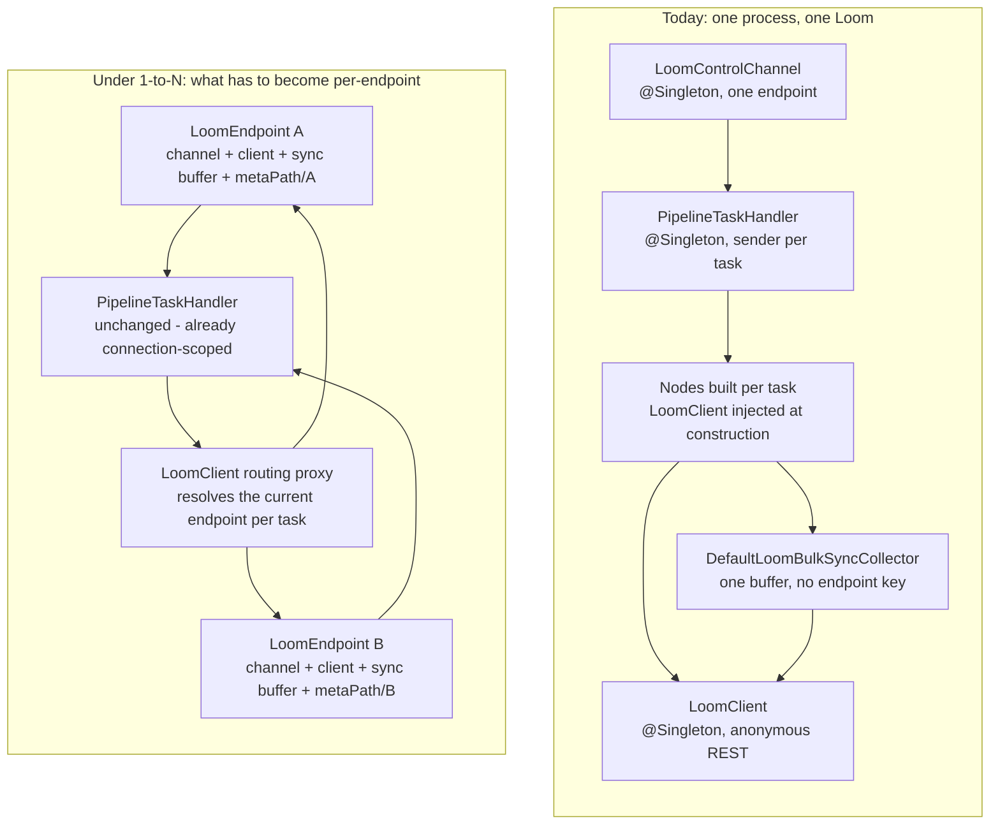

# Cortex attached to N Loom instances — Technical Specification

> **Audience: AI coding agents.** One question: **can a single Cortex worker register with more than
> one Loom instance at the same time, and should it?**
>
> **Status: NOT IMPLEMENTED, and not blocked by the protocol.** A Cortex process today holds exactly
> one Loom endpoint, one control channel and one REST client
> ([CortexOptions.java:13](../../cortex/api/src/main/java/io/metaloom/cortex/api/option/CortexOptions.java#L13)).
> The interesting finding is *where* the coupling lives: the **control plane is already
> connection-scoped** and would carry N channels essentially unchanged (§4), while the **data plane
> is a process-wide singleton** and is the whole of the work (§5). Nothing in the wire protocol,
> in Loom's registry, or in the dispatch model assumes exclusivity.
>
> **The SaaS caveat is not technical.** `SAAS_PLAN.md` §17 states *"Never share a Cortex worker
> between tenants"* ([SAAS_PLAN.md:1186](../../../metaloom-saas/spec/SAAS_PLAN.md)), and §7 of this
> file agrees with it for the cross-tenant case. 1-to-N is a legitimate feature **inside one trust
> domain** (prod + staging, several departmental Looms, a multi-site self-hosted install, a
> single customer's tenant cells). It is not a route to a multi-tenant shared worker pool, and §7
> says exactly which properties make the difference.

| Question | Answer today | Where |
|---|---|---|
| Can one Cortex process attach to 2+ Looms? | **No** — one endpoint, one channel, one client | §3 |
| Does the WebSocket protocol prevent it? | **No** — every message is answered on the socket it arrived on | §4 |
| Does Loom reject a worker that also serves another Loom? | **No** — registries are per-Loom, `nodeId` uniqueness is per-Loom | §4.2 |
| What actually blocks it? | The **single `LoomClient`** every node writes results through | §5, `CLN1` |
| Is running N containers instead a valid answer? | **Yes, and it is the recommendation for tenant isolation** | §6, option A |
| Is it safe to share one worker across tenants? | **No** — credentials, artefact cache and model state are process-wide | §7 |

---

## 1. What "1-to-N" means, precisely

Three independent planes connect a worker to a Loom. They fail differently, so they are separated
throughout this document.

| Plane | Direction | Transport | Carries | Endpoint identity today |
|---|---|---|---|---|
| **Control** | Loom → worker → Loom | WebSocket `/api/v1/processors/ws` | `REGISTER`, heartbeats, status, `NODE_TASK` / `SEGMENT_TASK` / `SOURCE_TASK`, results, hand-backs | one `LoomControlChannel` |
| **Data** | worker → Loom | REST (`LoomClient`) | asset lookup by SHA-512, typed components (transcripts, embeddings, detections), the `asset_node_result` ledger, bulk hash sync | one `LoomClient` singleton |
| **Media** | worker ↔ storage | filesystem path or `s3://` URI | the bytes themselves | one S3/GDrive/OneDrive credential set |

"Attached to N Looms" means all three planes are multiplied. Multiplying only the control plane
produces a worker that executes Loom B's tasks and writes their results into Loom A — silently, with
no error, because assets are resolved by content hash and a hash that does not exist in A simply
yields `null` (`AbstractMediaNode` returns null and the node skips persistence). That failure mode is
the reason `CLN1` is rated a blocker rather than a nice-to-have.

---

## 2. Architecture — today and under 1-to-N



The right-hand box is a design sketch, not existing code. Nothing named `LoomEndpoint` exists.

---

## 3. What the code does today

### 3.1 One endpoint, resolved once at start

[CortexOptions](../../cortex/api/src/main/java/io/metaloom/cortex/api/option/CortexOptions.java#L13)
holds a single `LoomClientOptions` (`hostname`, `port`, `token`). `CortexEnvOptions` maps `LOOM_HOST`
and `LOOM_PORT` onto that one object; there is no list form, no indexed variable and no profile
mechanism. `cortex.yml` has the same single `loom:` section — and on the server path it is never read
at all when options are supplied programmatically
([CortexClientModule.java:82](../../cortex/core/src/main/java/io/metaloom/cortex/cli/dagger/CortexClientModule.java#L82)).

[LoomControlChannel](../../cortex/core/src/main/java/io/metaloom/cortex/impl/loom/LoomControlChannel.java)
is a `@Singleton` that resolves that endpoint once in `resolveEndpoint()` (line 287), connects, and
owns the reconnect timer, the heartbeat timer, the status timer and the gauges. It is started exactly
once from
[CortexBootstrapInitializer:52](../../cortex/core/src/main/java/io/metaloom/cortex/impl/boot/CortexBootstrapInitializer.java#L52).

### 3.2 One REST client, shared by every node

[CortexClientModule.restClient](../../cortex/core/src/main/java/io/metaloom/cortex/cli/dagger/CortexClientModule.java#L52)
builds one `LoomHttpClient` from the same host/port and binds it `@Singleton @Nullable`. Nodes take
it in their constructor
([AbstractCortexNode.java:10](../../cortex/common/src/main/java/io/metaloom/cortex/common/node/AbstractCortexNode.java#L10)),
so the endpoint is baked into every node instance the moment it is built. Nodes are built per task
from Dagger `Provider`s, but the `Provider` resolves the same singleton every time.

Two independent consumers sit on that client:

- **Per-node typed writes.** `WhisperNode` resolves the asset by SHA-512
  ([AbstractMediaNode.java:81](../../cortex/common/src/main/java/io/metaloom/cortex/common/node/AbstractMediaNode.java#L81)),
  then calls `createAssetTranscript` and `createAssetNodeResult`. Every persisting node follows this
  template (see the node-result memory note and
  [REST_CORTEX_METADATA_BINARY_HANDLING_PLAN.md](REST_CORTEX_METADATA_BINARY_HANDLING_PLAN.md)).
- **Bulk hash sync.**
  [DefaultLoomBulkSyncCollector:28](../../cortex/pipeline-common/src/main/java/io/metaloom/cortex/pipeline/common/sync/DefaultLoomBulkSyncCollector.java#L28)
  buffers `SyncEntry(media, nodeId, result)` — **no Loom identity in the entry** — and flushes them
  through `LoomBulkSyncWriterImpl`, which groups by SHA-512 and calls `bulkUpdateAssets` on the one
  client.

### 3.3 The REST client is anonymous

`restClient(...)` never calls `setToken`, and `LoomHttpClient.builder()` is used without a scheme
override, so **every Cortex REST call to Loom is unauthenticated and cleartext**. `LOOM_TOKEN` is read
only by the control channel
([LoomControlChannel.java:308](../../cortex/core/src/main/java/io/metaloom/cortex/impl/loom/LoomControlChannel.java#L308)).
This is already tracked as `B5` in
[LOOM_HOSTED_MODE.md](../../../metaloom-saas/spec/LOOM_HOSTED_MODE.md) §7 and is a **prerequisite**
here: a multi-endpoint data plane whose credential is "none" cannot be reasoned about at all.

### 3.4 Process-wide state that is not the Loom connection

| State | Scope today | Why it matters for N |
|---|---|---|
| `CORTEX_META_PATH` artefact cache (`watermark_bin`, `tts_bin`, filesystem/S3 index stores) | one directory tree, keyed by SHA-512 + options hash | artefact paths recorded in Loom A point into a tree shared with Loom B |
| S3 / GDrive / OneDrive credentials | one set per process | a worker can only reach the storage of whoever owns those keys |
| Node model caches (whisper, face, OCR) | per process, built lazily | shared across endpoints; fine for cost, relevant for §7 |
| `CORTEX_NODE_ID` | one value | announced identically to every Loom (allowed — §4.2) |
| Monitoring port / health / metrics | one server, one `/ready` | readiness would need an all-vs-any policy (`CLN7`) |

---

## 4. What already works, unchanged

This is the load-bearing finding of the investigation. The control plane was written
connection-scoped, apparently deliberately.

### 4.1 Every answer goes back on the socket the task arrived on

`PipelineTaskHandler` is a `@Singleton`, but it holds no connection. The sender is passed per call —
`handleNodeTask(task, this::sendMessage)` — and stored on the in-flight record:

> *"The sink is supplied per call, because the connection to answer on is a property of the task, not
> of this handler."*
> — [PipelineTaskHandler.java:124](../../cortex/core/src/main/java/io/metaloom/cortex/impl/loom/PipelineTaskHandler.java#L124)

`ResultBatcher` follows the same rule: its per-run buffer remembers the `BatchSink`
([ResultBatcher.java:51](../../cortex/node-runtime/src/main/java/io/metaloom/cortex/runtime/ResultBatcher.java#L51)),
so a timer flush knows where to send. Two channels feeding one handler would therefore route results
correctly with **no change**, because run UUIDs from two different Loom databases do not collide.

### 4.2 Loom does not care that a worker serves someone else

- `nodeId` uniqueness is enforced **per Loom registry**
  ([ProcessorEndpoint.java:322](../../loom/services/rest/src/main/java/io/metaloom/loom/rest/endpoint/impl/ProcessorEndpoint.java#L322)):
  a second *live* socket under the same id on the *same* Loom is rejected. Two different Looms each
  see one socket, so the same `CORTEX_NODE_ID` at both is legal.
- The `cortex_instance` row and its admin-managed whitelist/blacklist override
  ([ProcessorRegistry.reconcilePersistedRestriction](../../loom/services/rest/src/main/java/io/metaloom/loom/rest/service/impl/ProcessorRegistry.java#L173))
  are per-Loom-database, so each Loom can independently restrict what the shared worker may run for
  it. That is a genuinely useful property, not an accident.
- Placement is priority-then-load
  ([ProcessorRegistry.select](../../loom/services/rest/src/main/java/io/metaloom/loom/rest/service/impl/ProcessorRegistry.java#L478)),
  and the load figure is **whole-machine CPU/IO** from `STATUS_UPDATE`. Both Looms therefore observe
  the same, honest saturation signal and back off together. There is no slot or in-flight accounting
  anywhere, so there is nothing that would double-count.
- Node contract announcement (`NODE_REGISTRATION`) is idempotent and per-Loom; each Loom adopts or
  rejects the worker's descriptors independently.

### 4.3 Duplicate execution is already a designed-for outcome

`LeaseReaper` explicitly accepts that a slow worker's task may be re-dispatched and run twice, with
`(item_uuid, node_id)` uniqueness catching the duplicate
([LeaseReaper.java:32-38](../../loom/services/rest/src/main/java/io/metaloom/loom/rest/service/impl/LeaseReaper.java#L32)).
A worker whose throughput per Loom halves because it also serves another Loom therefore degrades into
an already-handled case rather than a new one.

---

## 5. The blockers

Severity: **BLOCKER** = wrong data or silent loss · **REQUIRED** = must exist for the feature to be
operable · **ADVISORY** = quality of life.

| # | Blocker | Severity | Evidence |
|---|---|---|---|
| `CLN1` | **One `LoomClient` for all endpoints.** A node running Loom B's task writes its transcript, embedding and ledger row into Loom A. Silent: an unknown SHA-512 yields `null` and the node simply skips persistence | **BLOCKER** | [CortexClientModule.java:52](../../cortex/core/src/main/java/io/metaloom/cortex/cli/dagger/CortexClientModule.java#L52), [AbstractCortexNode.java:10](../../cortex/common/src/main/java/io/metaloom/cortex/common/node/AbstractCortexNode.java#L10) |
| `CLN2` | **The sync buffer has no endpoint key.** `SyncEntry` carries media + node + result only; a mixed buffer flushes everything to one Loom | **BLOCKER** | [DefaultLoomBulkSyncCollector.java:28](../../cortex/pipeline-common/src/main/java/io/metaloom/cortex/pipeline/common/sync/DefaultLoomBulkSyncCollector.java#L28) |
| `CLN3` | **The REST client is anonymous and cleartext**, so per-endpoint credentials do not exist to route in the first place. `B5` in the SaaS tree | **BLOCKER** (prerequisite) | §3.3 |
| `CLN4` | **Configuration is single-valued.** `CortexOptions.getLoom()` returns one object; `LOOM_HOST`/`LOOM_PORT`/`LOOM_TOKEN` are scalars | **REQUIRED** | [CortexOptions.java:13](../../cortex/api/src/main/java/io/metaloom/cortex/api/option/CortexOptions.java#L13) |
| `CLN5` | **`LoomControlChannel` is a `@Singleton` that owns global state** — timers, gauges, `started`/`connected`/`registered` flags, `resolvedHost` | **REQUIRED** | [LoomControlChannel.java:42](../../cortex/core/src/main/java/io/metaloom/cortex/impl/loom/LoomControlChannel.java#L42) |
| `CLN6` | **Metrics cannot distinguish endpoints.** `CortexMetrics.bindGauge(String, Supplier)` takes no labels, and Micrometer no-ops a duplicate registration — so `cortex_loom_connected` would silently describe whichever channel registered first | **REQUIRED** | [CortexMetrics.java:86](../../cortex/common/src/main/java/io/metaloom/cortex/common/metrics/CortexMetrics.java#L86), [LoomControlChannel.java:235](../../cortex/core/src/main/java/io/metaloom/cortex/impl/loom/LoomControlChannel.java#L235) |
| `CLN7` | **`/ready` is single-valued.** `isReady()` = configured AND connected AND registered for the one channel; with N endpoints an all-vs-any policy must be chosen, and "any" makes a pod that lost one tenant's Loom look healthy | **REQUIRED** | [HealthEndpoint.java:42](../../cortex/core/src/main/java/io/metaloom/cortex/impl/monitoring/HealthEndpoint.java#L42) |
| `CLN8` | **Drain is single-channel.** `drain()` returns early when *the* channel is down and announces `TERMINATING` once; N endpoints each need the announce → stop-accepting → hand-back sequence, and the grace period is shared | **REQUIRED** | [LoomControlChannel.java:166](../../cortex/core/src/main/java/io/metaloom/cortex/impl/loom/LoomControlChannel.java#L166) |
| `CLN9` | **The artefact cache is one tree.** `metaPath/watermark_bin/<sha512>-<hash>` is shared; two endpoints deduplicate onto each other's bytes | **REQUIRED** (BLOCKER when endpoints are different tenants) | [WatermarkNode.java:224](../../cortex/nodes/watermark/core/src/main/java/io/metaloom/cortex/node/watermark/WatermarkNode.java#L224) |
| `CLN10` | **Media credentials are process-wide.** One S3/GDrive/OneDrive credential set resolves every `s3://` reference regardless of which Loom sent it | **REQUIRED** (BLOCKER across tenants) | [S3Module.java](../../cortex/core/src/main/java/io/metaloom/cortex/cli/dagger/S3Module.java), [CloudModule.java](../../cortex/core/src/main/java/io/metaloom/cortex/cli/dagger/CloudModule.java) |
| `CLN11` | **Filesystem media needs a shared mount.** A path reference must be visible to the worker; two Looms whose libraries live on different mounts need both mounted | ADVISORY | [MediaRef.java:12-18](../../loom-shared/pipeline-model/src/main/java/io/metaloom/loom/pipeline/model/MediaRef.java#L12) |
| `CLN12` | **The channel reconnects forever on auth failure.** A `4401` close is treated like any disconnect, so a revoked endpoint retries at up to 30 s intervals with no terminal state — already flagged as a fix in `B4`; with N endpoints one revoked credential becomes permanent log noise | ADVISORY | [LoomControlChannel.java:357](../../cortex/core/src/main/java/io/metaloom/cortex/impl/loom/LoomControlChannel.java#L357) |

---

## 6. Options

### Option A — Do nothing: run one Cortex process per Loom (**recommended default**)

The worker is already a container with no persistent identity beyond `CORTEX_NODE_ID`. Two Looms get
two StatefulSets. Cost: one JVM and one copy of every loaded model per endpoint — real, and the whole
motivation for asking the question.

**Choose this whenever the endpoints belong to different tenants.** It is the only option that
preserves the cell boundary (§7), and it is what
[TENANT_HELM.md](../../../metaloom-saas/spec/TENANT_HELM.md) already renders.

Mitigate the cost the way the SaaS tree already plans to: KEDA scale-to-zero on
`loom_pipeline_tasks_pending`, and the **shared model-serving tier**
([MODEL_SERVING.md](../../../metaloom-saas/spec/MODEL_SERVING.md)) so the expensive GPU resident set
is shared while the worker is not. That combination delivers most of what "reuse the cortex instance"
is reaching for, without any of §5.

### Option B — Multi-endpoint worker: N channels in one JVM (**the feature described here**)

One process attaches to N Looms, each with its own credential, its own client and its own restriction
set. Justified when the endpoints share a trust domain: prod + staging, several Looms of one
organisation, a lab machine with an expensive model pack, a self-hosted multi-site install.

Work: `CLN1`–`CLN10`. Estimated **M** (≤ 1 week) for the routing and lifecycle, plus `CLN3` (`B5`,
**S**) as a prerequisite. §8 designs it.

### Option C — A broker in front of N Looms

A fleet-level scheduler that presents itself to each Loom as a worker and re-dispatches to a private
pool. Rejected: it duplicates `ProcessorRegistry`, `LeaseReaper` and the entire dispatch model in a
third component, and it moves the credential problem rather than solving it. Revisit only if
cross-organisation capacity sharing ever becomes a product.

**Recommendation:** implement Option B behind explicit configuration, document it as
*same-trust-domain only*, and keep Option A as the SaaS default. Do not present Option B as
multi-tenancy.

---

## 7. Isolation analysis — when sharing a worker is defensible

A Cortex worker is not stateless in the way a model server is. `MODEL_SERVING.md` §1 gives the
contract that makes GPU sharing safe — no persistence, no cross-request state, no tenant identity,
request-scoped only. Measure a worker against it:

| Property | Model server | Cortex worker |
|---|---|---|
| Holds credentials | no | **yes** — S3/GDrive/OneDrive keys, and (after `B5`) a Loom token per endpoint |
| Writes to shared storage | no | **yes** — `metaPath` artefact cache keyed by content hash |
| Caches content | no | **yes** — S3 object cache, cloud file cache, per-node result caches |
| Knows a tenant | no | **yes** — asset UUIDs, paths, library names in logs |
| Request-scoped | yes | **no** — sources run for the length of a scan |

So the honest rule is the one the SaaS plan already states, with the boundary made explicit:

- **Same trust domain → sharing is fine.** Prod/staging of one organisation, department Looms of one
  company, one tenant's several cells. `CLN9`/`CLN10` become quality issues (per-endpoint subdirs,
  per-endpoint storage config) rather than isolation failures.
- **Different tenants → do not share, even after `CLN1`–`CLN12` are done.** Fixing the routing does
  not fix the artefact cache dedup channel (`CLN9` lets tenant B learn that tenant A holds a file with
  a given hash), the shared credential set (`CLN10`), or content in shared logs. Making a worker
  genuinely multi-tenant is a different, much larger project than this file describes.

A useful third framing: **one tenant, many Looms** is the sweet spot. It is exactly the case a SaaS
customer with several cells has, it needs no isolation guarantees the code cannot give, and it is the
case Option B should be documented for.

---

## 8. Design for Option B

Nothing below exists. Names are proposals.

### 8.1 The endpoint model

Introduce `LoomEndpointOptions` (rename/extend `LoomClientOptions`) with an added `name` and `tls`,
and make `CortexOptions` hold `List<LoomEndpointOptions> looms`. Keep `getLoom()` as a compatibility
accessor returning the first entry so that existing single-endpoint code and tests do not churn.

```
CortexOptions
  looms: [ { name: "prod",    host, port, tls, token, nodeId?, nodeWhitelist? },
           { name: "staging", host, port, tls, token, nodeId?, nodeWhitelist? } ]
```

Per-endpoint `nodeId` is optional and defaults to `CORTEX_NODE_ID`; per-endpoint whitelist narrows
the global one. Loom-side admin restrictions still override whatever is announced (§4.2), so the
per-endpoint whitelist is a convenience, not a security control.

### 8.2 Channel per endpoint (`CLN5`)

`LoomControlChannel` becomes a plain (non-`@Singleton`) class constructed per endpoint by a new
`LoomEndpointRegistry @Singleton`, which owns the list and the lifecycle. `CortexBootstrapInitializer`
starts and drains the registry instead of the channel. `drain(graceMs)` announces `TERMINATING` on
every channel **first**, then waits once for the shared in-flight set — the grace period is a property
of the process, not of an endpoint.

### 8.3 Routing the data plane (`CLN1`) — the only hard part

`LoomClient` is a ~40-interface façade over a 2 300-line implementation, so a hand-written delegating
wrapper is not viable. Two workable shapes:

1. **`java.lang.reflect.Proxy` routing client (recommended).** Bind `LoomClient` to a proxy whose
   invocation handler resolves the current endpoint from a task-scoped holder and forwards. Nodes,
   `LoomBulkSyncWriterImpl` and everything else keep their existing constructor injection and compile
   unchanged. Cost: one reflective hop per call, negligible against an HTTP round trip.
2. **Thread the endpoint through the node API.** Add the client (or an endpoint handle) to the node
   execution context and change `AbstractCortexNode.client()` to read it. Cleaner statically, but it
   touches every persisting node and every node test.

Either way the scope must be established where the task starts executing — in `NodeTaskRunner` /
`SegmentTaskRunner` / `SourceTaskRunner`, which already receive the task and its sender — and cleared
in a `finally`. **The known hazard is asynchrony:** node work runs on `Schedulers.io()` and a node that
hops threads mid-execution loses a `ThreadLocal`. Use a `ScopedValue`-style holder set immediately
around the synchronous node invocation, assert non-null on every routed call, and fail loudly rather
than falling back to a default endpoint — a silent fallback reproduces exactly the cross-Loom write
this design exists to prevent.

### 8.4 Per-endpoint sync buffers (`CLN2`)

`DefaultLoomBulkSyncCollector` becomes one buffer per endpoint (a `Map<endpointName, buffer>` inside
the collector, or one collector per endpoint held by the registry). `collect()` resolves the endpoint
from the same task scope as §8.3. `flush()` on shutdown flushes all of them.

### 8.5 Per-endpoint local state (`CLN9`, `CLN10`)

- Artefact and index directories become `metaPath/<endpointName>/…`. This is a **behaviour change for
  existing single-endpoint workers** unless the first/only endpoint keeps the current bare layout —
  do that, and only nest when more than one endpoint is configured.
- Storage credentials move from one global block to an optional per-endpoint override, defaulting to
  the global one. Without this, an endpoint whose media lives in a different bucket cannot resolve
  anything.

### 8.6 Observability (`CLN6`, `CLN7`)

- Add `void bindGauge(String name, String labelKey, String labelValue, Supplier<Number> supplier)` to
  `CortexMetrics` (Loom's `LoomMetrics` already has the labelled form — copy that shape), and label
  every `cortex_loom_*` gauge with `endpoint`. **`spec/features/ops/METRICS.md` §3/§5 is parsed at
  runtime by `MetricsCatalogScrapeTest`** — the catalog rows must be updated in the same change or the
  build breaks.
- `/health` returns a map of endpoint name → status. `/ready` returns 200 only when **every**
  configured endpoint is registered; a partially-attached worker is a real incident and must be
  visible as one.

### 8.7 Ordering

`CLN3` (`B5`) → `CLN4` → `CLN5` → `CLN1` → `CLN2` → `CLN6`/`CLN7` → `CLN8` → `CLN9`/`CLN10`.
`CLN1` before `CLN2` because the sync writer routes through the same scope.

---

## 9. Environment variables

### 9.1 Today

| Variable | Default | Meaning |
|---|---|---|
| `LOOM_HOST` | (none) | The one Loom hostname. Unset = offline mode, control channel disabled |
| `LOOM_PORT` | (none) | The one Loom port. `<= 0` disables the channel |
| `LOOM_TOKEN` | (none) | Bearer token for the **WebSocket handshake only**; the REST client ignores it (`CLN3`) |
| `CORTEX_NODE_ID` | (none) | Worker identity. Mandatory; the process refuses to start without it |
| `CORTEX_NODE_WHITELIST` / `_BLACKLIST` | (none) | Announced node kinds; Loom's persisted restriction overrides |
| `CORTEX_META_PATH` | (none) | Root of the artefact/index cache |
| `CORTEX_MONITORING_PORT` | `8093` | `/health`, `/ready`, `/metrics` |
| `CORTEX_SHUTDOWN_DRAIN_TIMEOUT_MS` | `30000` | Grace period before unfinished tasks are handed back |
| `LOOM_WS_STRICT_AUTH` (Loom side) | `false` | When true, a tokenless worker handshake is rejected |

### 9.2 Proposed for Option B

Indexed variables, because the existing loader is flat `str()`/`integer()` mappings and a list needs
an explicit convention. `LOOM_HOST`/`LOOM_PORT`/`LOOM_TOKEN` continue to mean endpoint `0`.

| Variable | Default | Meaning |
|---|---|---|
| `LOOM_ENDPOINTS` | (none) | Comma-separated endpoint names, e.g. `prod,staging`. Presence switches on multi-endpoint mode |
| `LOOM_<NAME>_HOST` | (none) | Hostname of that endpoint |
| `LOOM_<NAME>_PORT` | (none) | Port |
| `LOOM_<NAME>_TLS` | `false` | `wss://` + `https://` towards this endpoint |
| `LOOM_<NAME>_TOKEN` | (none) | Credential for **both** planes of that endpoint |
| `LOOM_<NAME>_NODE_ID` | `CORTEX_NODE_ID` | Per-endpoint identity override |
| `LOOM_<NAME>_NODE_WHITELIST` | (none) | Narrows the global whitelist for that endpoint |
| `CORTEX_READY_POLICY` | `all` | `all` or `any`; `any` is unsafe in a tenant context and must be opt-in |

Any new option needs a row in
[spec/cortex/CONFIGURATION.md](../cortex/CONFIGURATION.md) and must satisfy the option/env coverage
test that guards that mapping.

---

## 10. Test setup

### 10.1 Preconditions

```bash
./setup-pool.sh          # required before any loom/core test; re-run after every Flyway change
```

`cortex/core` and `integration-test` share one JVM per module, so a Dagger constructor change needs a
clean rebuild of `loom/core` and `cortex/core` before the suite is meaningful (`NoSuchMethodError`
otherwise).

### 10.2 Unit level

| Test | Asserts |
|---|---|
| `LoomControlChannelTest` (extend) | Two channels against two stub servers register independently; one endpoint failing does not stop the other reconnecting |
| `LoomEndpointRegistryTest` (new) | Endpoint list parsing, per-endpoint defaults, and that an empty list is offline mode rather than a crash |
| `RoutingLoomClientTest` (new) | Under scope A the proxy hits client A; with no scope set it **throws** rather than defaulting |
| `PipelineTaskHandlerDrainTest` (extend) | `TERMINATING` is announced on every channel; hand-backs go to the originating sender |
| `ResultBatcherTest` (extend) | Two runs with two sinks flush to their own sink on a timer flush |
| `DefaultLoomBulkSyncCollectorTest` (extend) | Entries collected under scope A never appear in B's batch |
| `MetricsCatalogScrapeTest` (existing) | Will fail unless `METRICS.md` gains the `endpoint` label rows — treat as the guard, not an obstacle |

### 10.3 Integration level

In `integration-test`, stand up **two** `LoomContainer`s on the shared Testcontainers network plus one
`CortexContainer` configured with both endpoints, then:

1. Upload distinct fixtures to Loom A and Loom B (assets must exist first — Cortex attaches results by
   SHA-512, and without the upload a run reports success while persisting nothing).
2. Run a transcribing or hashing pipeline on each concurrently.
3. Assert each transcript and each `asset_node_result` row landed in **its own** Loom, and that neither
   database contains the other's asset. This is the regression test for `CLN1` and the reason the
   feature cannot ship on unit tests alone.
4. SIGTERM the worker mid-run and assert both runs settle without waiting for a lease.

The k3d harness (`helm/test/run.sh`) is the place for the deployed variant; note it mints a long-lived
API key rather than reusing the login JWT, because the JWT expires after
`LOOM_TOKEN_EXPIRATION_TIME` and an expired worker token looks healthy while persisting nothing.

---

## 11. Key Classes Reference

| Class | Package / path | Role in this question |
|---|---|---|
| `LoomControlChannel` | [cortex/core/…/impl/loom/](../../cortex/core/src/main/java/io/metaloom/cortex/impl/loom/LoomControlChannel.java) | The one WebSocket to Loom; owns registration, heartbeats, gauges, drain |
| `PipelineTaskHandler` | [cortex/core/…/impl/loom/](../../cortex/core/src/main/java/io/metaloom/cortex/impl/loom/PipelineTaskHandler.java) | Executes dispatched work; **already connection-agnostic** |
| `ResultBatcher` | [cortex/node-runtime/…/runtime/](../../cortex/node-runtime/src/main/java/io/metaloom/cortex/runtime/ResultBatcher.java) | Groups results per run and remembers the sink |
| `CortexClientModule` | [cortex/core/…/cli/dagger/](../../cortex/core/src/main/java/io/metaloom/cortex/cli/dagger/CortexClientModule.java) | Builds the single, anonymous `LoomClient` (`CLN1`, `CLN3`) |
| `AbstractCortexNode` | [cortex/common/…/node/](../../cortex/common/src/main/java/io/metaloom/cortex/common/node/AbstractCortexNode.java) | Gives every node its `client()`; the injection point to route |
| `AbstractMediaNode` | [cortex/common/…/node/](../../cortex/common/src/main/java/io/metaloom/cortex/common/node/AbstractMediaNode.java) | Resolves the asset by SHA-512 — where a wrong-Loom write goes silent |
| `DefaultLoomBulkSyncCollector` | [cortex/pipeline-common/…/sync/](../../cortex/pipeline-common/src/main/java/io/metaloom/cortex/pipeline/common/sync/DefaultLoomBulkSyncCollector.java) | Endpoint-less result buffer (`CLN2`) |
| `LoomBulkSyncWriterImpl` | [cortex/core/…/impl/loom/](../../cortex/core/src/main/java/io/metaloom/cortex/impl/loom/LoomBulkSyncWriterImpl.java) | Flushes the buffer through the single client |
| `CortexOptions` / `LoomClientOptions` | [cortex/api/…/option/](../../cortex/api/src/main/java/io/metaloom/cortex/api/option/CortexOptions.java) | Single-valued endpoint configuration (`CLN4`) |
| `CortexEnvOptions` | [cortex/common/…/option/](../../cortex/common/src/main/java/io/metaloom/cortex/common/option/CortexEnvOptions.java) | `LOOM_HOST` / `LOOM_PORT` mapping |
| `CortexBootstrapInitializer` | [cortex/core/…/impl/boot/](../../cortex/core/src/main/java/io/metaloom/cortex/impl/boot/CortexBootstrapInitializer.java) | Starts and drains the one channel (`CLN5`, `CLN8`) |
| `HealthEndpoint` | [cortex/core/…/impl/monitoring/](../../cortex/core/src/main/java/io/metaloom/cortex/impl/monitoring/HealthEndpoint.java) | Single-endpoint `/ready` (`CLN7`) |
| `CortexMetrics` | [cortex/common/…/metrics/](../../cortex/common/src/main/java/io/metaloom/cortex/common/metrics/CortexMetrics.java) | Label-less `bindGauge` (`CLN6`) |
| `ProcessorEndpoint` | [loom/services/rest/…/endpoint/impl/](../../loom/services/rest/src/main/java/io/metaloom/loom/rest/endpoint/impl/ProcessorEndpoint.java) | Loom's side of the protocol; per-Loom `nodeId` uniqueness |
| `ProcessorRegistry` | [loom/services/rest/…/service/impl/](../../loom/services/rest/src/main/java/io/metaloom/loom/rest/service/impl/ProcessorRegistry.java) | Presence, placement, persisted per-Loom restrictions |
| `WebSocketAuthenticator` | [loom/services/rest/…/service/impl/](../../loom/services/rest/src/main/java/io/metaloom/loom/rest/service/impl/WebSocketAuthenticator.java) | `?token=` validation; permissive unless `LOOM_WS_STRICT_AUTH` |
| `LeaseReaper` | [loom/services/rest/…/service/impl/](../../loom/services/rest/src/main/java/io/metaloom/loom/rest/service/impl/LeaseReaper.java) | Why a slower shared worker degrades gracefully |
| `MediaRef` | [loom-shared/pipeline-model/…/model/](../../loom-shared/pipeline-model/src/main/java/io/metaloom/loom/pipeline/model/MediaRef.java) | Path vs URI reference semantics (`CLN11`) |

---

## 12. Conventions and Gotchas

- **The control plane is already connection-scoped — do not "fix" it.** `PipelineTaskHandler` and
  `ResultBatcher` take their sender per call on purpose. Any change that caches a channel on either
  one silently reintroduces cross-Loom routing.
- **A wrong-Loom write does not throw.** Assets are resolved by SHA-512 and a miss returns `null`;
  the node then skips persistence and reports success. Every routing test must assert on the
  *destination* database, never on the node's return state.
- **Never let the routed client fall back to a default endpoint.** Throwing on an unset scope is the
  design; a fallback is exactly the bug.
- **`cortex.yml` is not read on the server path.** `CortexClientModule.options(...)` bypasses
  `CortexOptionsLoader` whenever options are supplied, and `CortexMain` documents the worker as
  env-configured with no flags. Configure endpoints via environment variables only. (Note: the SaaS
  tree still refers to a `CortexCLI` with picocli flags — that class does not exist at this revision;
  the entry point is `CortexMain` and it ignores all arguments.)
- **`CORTEX_NODE_ID` must be stable across restarts** and unique per worker *within* a Loom. The same
  id at two different Looms is legal and is the expected 1-to-N shape.
- **Loom's persisted whitelist wins over the announced one.** Do not treat a per-endpoint whitelist as
  an enforcement boundary; it is a hint that the admin may overwrite.
- **`METRICS.md` is parsed by a test.** Adding the `endpoint` label without updating the catalog
  tables breaks `MetricsCatalogScrapeTest`.
- **After a Flyway change run `./setup-pool.sh`**, and after a Dagger constructor change do a clean
  rebuild of `loom/core` and `cortex/core` — otherwise the failure surfaces as `NoSuchMethodError` far
  from the change.
- **Sharing a worker is not multi-tenancy.** If a reviewer reads §8 as the multi-tenant story, §7 has
  failed; say "same trust domain" explicitly in any user-facing documentation of this feature.

---

## 13. Where do I find …?

| Need | Path |
|---|---|
| The processor WebSocket protocol, message by message | [loom/WEBSOCKET.md](../loom/WEBSOCKET.md) |
| Pipeline dispatch, leases, run engine | [features/pipeline/PIPELINE.md](../features/pipeline/PIPELINE.md), [features/pipeline/PIPELINE_FLOW.md](../features/pipeline/PIPELINE_FLOW.md) |
| Cortex configuration and env variables | [cortex/CONFIGURATION.md](../cortex/CONFIGURATION.md) |
| Cortex architecture, node model, Variant C | [cortex/METALOOM_ARCHITECTURE.md](../cortex/METALOOM_ARCHITECTURE.md), [cortex/CORTEX.md](../cortex/CORTEX.md) |
| Running more than one **Loom** process (the opposite question) | [CLUSTERING.md](CLUSTERING.md) |
| Worker Helm chart, `CORTEX_NODE_ID` derivation, PDB | [features/helm/HELM_CORTEX.md](../features/helm/HELM_CORTEX.md) |
| Metrics catalog (parsed by a test) | [features/ops/METRICS.md](../features/ops/METRICS.md) |
| How a node persists a typed result plus its ledger row | [REST_CORTEX_METADATA_BINARY_HANDLING_PLAN.md](REST_CORTEX_METADATA_BINARY_HANDLING_PLAN.md) |
| SaaS tenancy model and the "never share a worker" rule | [SAAS_PLAN.md §17](../../../metaloom-saas/spec/SAAS_PLAN.md) |
| Hosted-mode Cortex topology, `B5` token work, KEDA | [LOOM_HOSTED_MODE.md §7, §10](../../../metaloom-saas/spec/LOOM_HOSTED_MODE.md) |
| The shared model-serving tier (the sanctioned way to share GPUs) | [MODEL_SERVING.md](../../../metaloom-saas/spec/MODEL_SERVING.md) |
| Tenant cell chart | [TENANT_HELM.md](../../../metaloom-saas/spec/TENANT_HELM.md) |

---

## 14. Progress Assessment

### Investigation

- [x] Establish whether the WebSocket protocol permits N attachments (§4 — it does)
- [x] Establish whether Loom rejects a worker serving another Loom (§4.2 — it does not)
- [x] Trace the data plane from node to Loom (§3.2)
- [x] Inventory process-wide state (§3.4)
- [x] Enumerate blockers with evidence (§5)
- [x] Reconcile with the SaaS "never share a worker" rule (§7)
- [x] Choose a recommended option (§6 — Option A by default, Option B for one trust domain)

### Implementation — none of this exists

- [ ] `CLN3` prerequisite: `setToken` + `setScheme` on the Cortex REST client (`B5` in the SaaS tree)
- [ ] `CLN4` `CortexOptions.looms` list + `LOOM_ENDPOINTS` / `LOOM_<NAME>_*` env mapping
- [ ] `CLN5` `LoomEndpointRegistry`; `LoomControlChannel` constructed per endpoint
- [ ] `CLN1` task-scoped routing `LoomClient` (reflective proxy), throwing on an unset scope
- [ ] `CLN2` per-endpoint sync buffers
- [ ] `CLN6` labelled `CortexMetrics.bindGauge` + `endpoint` label + `METRICS.md` catalog rows
- [ ] `CLN7` multi-endpoint `/health`, all-vs-any `/ready` with `CORTEX_READY_POLICY`
- [ ] `CLN8` drain across every channel with one shared grace period
- [ ] `CLN9` per-endpoint `metaPath` subtrees (bare layout preserved for a single endpoint)
- [ ] `CLN10` per-endpoint storage credential overrides
- [ ] `CLN12` terminal state on `4401`/`4403` instead of endless reconnect
- [ ] Two-Loom integration test asserting results land in their own database
- [ ] `CONFIGURATION.md` rows for the new variables; user-facing docs stating *same trust domain only*

### Explicitly out of scope

- [ ] ~~Cross-tenant worker sharing~~ — see §7; needs credential scoping, cache partitioning and log
      hygiene that this design does not provide
- [ ] ~~A dispatch broker in front of N Looms~~ — Option C, rejected
- [ ] ~~Running N Loom instances against one database~~ — a different question, see
      [CLUSTERING.md](CLUSTERING.md)

---

_Git HEAD revision: `5c5de81b`_
_Last updated: 2026-08-16 (initial investigation; every claim about current behaviour verified against the tree at this revision)_
