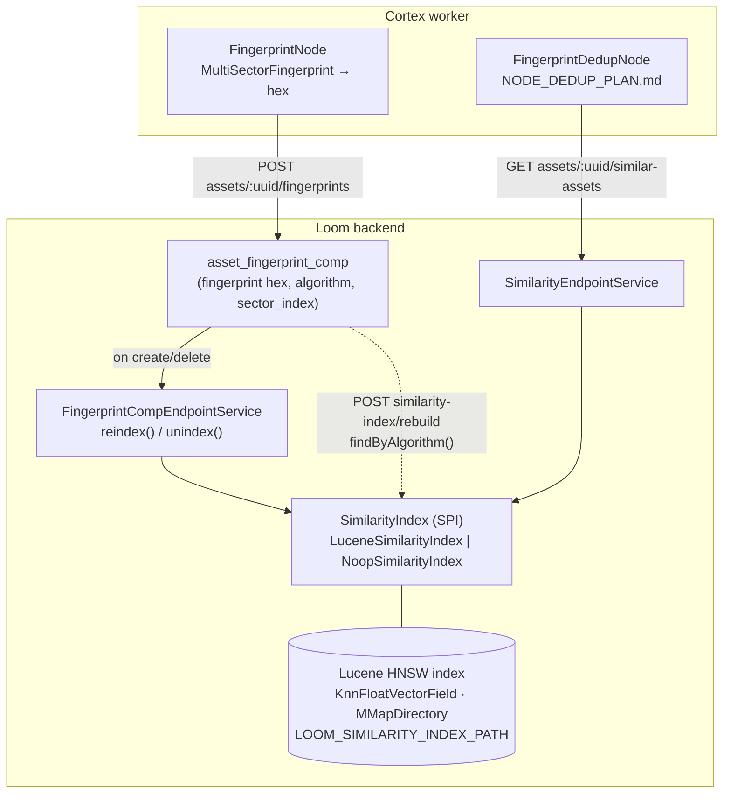

# Fingerprint Similarity Index (Lucene) — Technical Specification

> **Audience: AI coding agents.** A **perceptual video-fingerprint similarity index** owned by the
> Loom backend: a Lucene HNSW k-NN index over the 256-dim float vectors behind
> `MultiSectorFingerprint`, exposed as a `SimilarityIndex` SPI and a REST "similar assets" query. It
> is the prerequisite for the deduplication nodes in
> [../pipeline-nodes/NODE_DEDUP_PLAN.md](NODE_DEDUP_PLAN.md).

> ⚠️ **A second Lucene index now lives in the same module.** `LuceneVectorIndex`
> (`loom/services/lucene/…/vector/lucene/`) serves **embedding** k-NN — face vectors from
> `FacedetectNode` — behind the `VectorIndex` SPI. Everything below is about the **fingerprint**
> index and does not describe it. The two are deliberately separate: one 256-dim vector per asset
> answering "is this the same recording?" versus many vectors per asset answering "is this the same
> subject?", one keyed by `(asset, algorithm)` and the other by `embedding_uuid` and scoped by
> `(type, model, dimensions)`. **Separate directories, separate `IndexWriter`s** — pointing
> `LOOM_VECTOR_INDEX_PATH` at `LOOM_SIMILARITY_INDEX_PATH` puts two incompatible vector populations
> in one index. See [../features/search/SEMANTIC_SEARCH.md](../features/search/SEMANTIC_SEARCH.md).

## 🟢 Status: BUILT — verified at `499f71f7`

Everything in §3–§6 exists in the tree. The SPI, both implementations, the Dagger binding, the
comp write/delete hooks, both REST routes, the client methods and the DTOs are all present, and 15
tests cover them (`LuceneSimilarityIndexTest` 8, `SimilarAssetsEndpointTest` 7). §2 is the shipped
architecture, not a proposal.

⚠️ **Correction against the previous revision of this file.** It carried a "BUILT" header over a
"§7 — nothing below exists yet" note and a "§11 — nothing is implemented" line. Those were stale and
are removed. Three further statements were wrong and are corrected below:

| Previously specified | Actually built |
|---|---|
| Rebuild guarded by a new `MANAGE_SIMILARITY_INDEX` permission | `Permission.UPDATE_ASSET` — no new permission was added |
| Disabled index answers **400/409** | **503** `LoomRestErrorCode.SEARCH_UNAVAILABLE`, message names the cause |
| `SimilarityHit.sha512` is populated | 🔴 Always **`null` in production** — both call sites pass `null` (§7.1) |

**Open work** (details in §7): demo data, the `sha512` gap, Helm templating of `LOOM_SIMILARITY_*`,
multi-sector support, and an explicit shutdown hook. Boot-time auto-rebuild is **deliberately
skipped**.

### Scope boundary — read this first

This is **not** lexical search and **not** embedding search. Three subsystems, deliberately separate:

| Subsystem | Query | Backend | Status | Spec |
|---|---|---|---|---|
| **Lexical search** | text `q` → documents | Postgres `tsvector` (`search_document`) | Phase 1 built | [SEARCH.md](../features/search/SEARCH.md) |
| **Semantic / embedding search** | text `q` or vector → assets | pgvector (planned) | not built | [SEMANTIC_SEARCH.md](../features/search/SEMANTIC_SEARCH.md) |
| **Fingerprint similarity (this doc)** | a video fingerprint → near-duplicate videos | Lucene HNSW over `MultiSectorFingerprint.vector()` | **built** | **LUCENE_PLAN.md** |

---

## 1. Already implemented

| Item | Where it lives |
|---|---|
| `SimilarityIndex` SPI (8 methods, incl. hex overloads) | `loom-shared/api/src/main/java/io/metaloom/loom/api/search/SimilarityIndex.java` |
| `SimilarityHit` / `IndexedFingerprint` / `HexFingerprint` records | same package |
| `LuceneSimilarityIndex` (334 lines) | `loom/services/lucene/src/main/java/io/metaloom/loom/similarity/lucene/LuceneSimilarityIndex.java` |
| `NoopSimilarityIndex` | `loom/services/lucene/src/main/java/io/metaloom/loom/similarity/NoopSimilarityIndex.java` |
| Dagger binding + boot guard | `loom/core/src/main/java/io/metaloom/loom/core/dagger/SimilarityModule.java`; installed in `LoomCoreComponent` |
| `SimilarityOptions` (5 env vars) | `loom-shared/api/src/main/java/io/metaloom/loom/api/options/SimilarityOptions.java` |
| Comp write/delete hooks (`reindex` / `unindex`) | `loom/services/rest/src/main/java/io/metaloom/loom/rest/service/impl/FingerprintCompEndpointService.java` |
| `GET /api/v1/assets/:uuid/similar-assets` route | `…/rest/endpoint/impl/AssetEndpoint.java:511` |
| `POST /api/v1/similarity-index/rebuild` route | `…/rest/endpoint/impl/SimilarityIndexEndpoint.java` |
| Endpoint logic (self-exclusion, 503, param parsing) | `…/rest/service/impl/SimilarityEndpointService.java` |
| `SimilarAssetResponse` / `SimilarAssetListResponse` | `loom-shared/rest-model/src/main/java/io/metaloom/loom/rest/model/similarity/` |
| `SimilarityMethods` client interface + impl | `loom-client/common/.../method/SimilarityMethods.java`; `loom-client/rest/.../LoomHttpClientImpl.java:1567` |
| `AssetComponentDao.findByAlgorithm(String)` — the rebuild source query | `loom/db/api/.../asset/AssetComponentDao.java:198`; impl `loom/db/jooq/.../AssetComponentDaoImpl.java:804` |
| Module revived: video4j `fingerprint-indexer` dependency, **no local Lucene pin** | `loom/services/lucene/pom.xml` |
| Env vars documented | [../../loom/CONFIGURATION.md](../../loom/CONFIGURATION.md) §4.11 |
| Routes documented | [../../loom/RESTAPI.md](../loom/RESTAPI.md) |
| Multi-instance `write.lock` consequence | [../../CLUSTERING.md](CLUSTERING.md) §3.6 / §7 |

**No Flyway migration was needed.** The index is derived from `asset_fingerprint_comp` (`V2.41`), and
this feature adds **no Postgres extension** — which is the whole point of choosing Lucene here.

---

## 2. Why Lucene here, against the SEARCH.md rejection

🔴 [SEARCH.md](../features/search/SEARCH.md) §2 rejects Lucene by name and [SEARCH_PLAN.md](SEARCH_PLAN.md) P1-25 filed
its deletion. [SEMANTIC_SEARCH.md](../features/search/SEMANTIC_SEARCH.md) picked pgvector for embeddings. This subsystem
adopts Lucene anyway, **for this workload only**. Understand the reasoning before touching the module:

1. **The SEARCH.md rejection is about lexical search.** Its objection is that an embedded full-text
   index becomes per-replica local state that must be identical across replicas *and* is a
   system-of-record. A fingerprint k-NN index is none of those: it is a bounded, derived, rebuildable
   cache of one float vector per asset, reconstructable in full from `asset_fingerprint_comp`. Losing
   it costs a rebuild, never data.
2. **Lucene sidesteps the hardest constraint in [SEMANTIC_SEARCH.md](../features/search/SEMANTIC_SEARCH.md) §3.2** —
   pgvector is not in the stock Postgres image, so an unguarded `CREATE EXTENSION vector` breaks the
   build for everyone. Lucene is pure-JVM and needs no database extension.
3. **The corpus is tiny and well-behaved:** 256 dims, one vector per asset.
4. **The SPI keeps the door open.** `SimilarityIndex` mirrors the `VectorIndex` SPI sketched in
   [SEMANTIC_SEARCH.md](../features/search/SEMANTIC_SEARCH.md) §5, so a later pgvector/Qdrant implementation — or a
   unification of the two vector workloads — is a module swap, not a rewrite.

✅ Companion spec edits are done: [SEARCH.md](../features/search/SEARCH.md) §1.1/§2 scope the rejection to lexical search
and record fingerprint similarity as working; [SEARCH_PLAN.md](SEARCH_PLAN.md) P1-25 is closed as
**superseded** (the module is repurposed, not deleted — the real complaint, a stale Lucene 9.0.0 pin,
is gone); [SEMANTIC_SEARCH.md](../features/search/SEMANTIC_SEARCH.md) cross-references this file.

---

## 3. Architecture (as built)



**System-of-record vs. index.** `asset_fingerprint_comp` is the system-of-record; the Lucene index is
a derived cache. Every write path updates the comp table first and the index second, best-effort: a
failed index write is logged and never fails the comp write.

**Query path.** stored hex → `MultiSectorFingerprint.of(hex).vector()` (inside the impl) →
`KnnFloatVectorQuery` pre-filtered by an `algorithm` `TermQuery` → `List<SimilarityHit>` → response
with the query asset excluded. The endpoint asks the index for `limit + 1` neighbours precisely
because the asset matches itself and is then dropped.

---

## 4. The `SimilarityIndex` SPI

`io.metaloom.loom.api.search` in `loom-shared/api`, alongside `SearchProvider`:

```java
void index(UUID assetUuid, String sha512, String algorithm, float[] vector);
void index(UUID assetUuid, String sha512, String algorithm, String fingerprintHex);
void remove(UUID assetUuid);
List<SimilarityHit> query(String algorithm, float[] vector,      int limit, float scoreThreshold);
List<SimilarityHit> query(String algorithm, String fingerprintHex, int limit, float scoreThreshold);
void rebuild(Stream<IndexedFingerprint> all);
void rebuildFromHex(Stream<HexFingerprint> all);
void commit();
boolean isAvailable();

public record SimilarityHit(UUID assetUuid, String sha512, float score) {}
public record IndexedFingerprint(UUID assetUuid, String sha512, String algorithm, float[] vector) {}
public record HexFingerprint(UUID assetUuid, String sha512, String algorithm, String fingerprintHex) {}
```

🔴 **The hex overloads are the ones Loom actually calls.** `asset_fingerprint_comp` stores the
fingerprint as hex and decoding needs the video4j codec; keeping that knowledge inside the
implementation is what keeps video4j out of `loom/services/rest`. Malformed hex is logged and skipped,
never fatal.

`LuceneSimilarityIndex` implementation facts worth knowing before editing it:

- Fields: `KnnFloatVectorField("fingerprint")`, `StoredField("asset_uuid")` (also the update/delete
  `Term`), `StoredField("sha512sum")`, `algorithm` as a filter term.
- Codec: an anonymous `Lucene103Codec` whose k-NN format is video4j's `HighDimensionKnnVectorsFormat`
  wrapping `Lucene99HnswVectorsFormat(200, 100)`, sized by
  `MultiSectorFingerprint.FINGERPRINT_VECTOR_SIZE`. This matches `xdb-clean`'s on-disk format.
- It writes its **own** documents rather than calling `HashFingerprintIndexer.indexMedia`, which
  stores only `sha512sum` and offers no `asset_uuid` key, no `algorithm` filter and no delete.
- Concurrency: a `ReentrantLock` serializes `index`/`remove`/`rebuild`; reads go through a
  `SearcherManager` opened on the writer for near-real-time visibility.
- A commit point is forced at open so the `SearcherManager` can read a fresh index.

`NoopSimilarityIndex` is bound whenever similarity is disabled or the directory is unusable: `query`
returns empty and `isAvailable()` is `false`, which is what makes the endpoint reject rather than lie.

---

## 5. Lifecycle, REST and configuration

| Trigger | Behaviour |
|---|---|
| **Boot** | `SimilarityModule` creates the directory, checks writability, opens the index. Any failure → `NoopSimilarityIndex`, logged, **boot continues**. ⚠️ No automatic rebuild — deliberate (§7). |
| **Fingerprint comp created/updated** | `FingerprintCompEndpointService.reindex(comp)` → `index(...)` + `commit()`, best-effort, after the DB write. |
| **Fingerprint comp / asset deleted** | `unindex(assetUuid)` → `remove(...)` + `commit()`. `asset_fingerprint_comp` already cascades on asset delete. |
| **Admin rebuild** | `POST /api/v1/similarity-index/rebuild` → `findByAlgorithm(algorithm)` → `rebuildFromHex(...)`. |

🔴 **Rebuildability is the whole safety story.** If a hook is ever missed (a crash between the DB
commit and the index write) a rebuild restores correctness. Never treat the index as authoritative.

### REST surface

| Method & path | Permission | Notes |
|---|---|---|
| `GET /api/v1/assets/:uuid/similar-assets?algorithm=&limit=&threshold=` | `READ_ASSET` | Score-desc list, self excluded. Empty 200 when the asset has no fingerprint. `limit` must be a positive integer, `threshold` a float — otherwise 400 `BAD_QUERY_PARAMS`. |
| `POST /api/v1/similarity-index/rebuild?algorithm=` | `UPDATE_ASSET` | 204 No Content. ⚠️ No dedicated permission was introduced. |

Both answer **503 `SEARCH_UNAVAILABLE`** when disabled or unopenable, with a message distinguishing
"`LOOM_SIMILARITY_ENABLED=false`" from "the index could not be opened".

Client (`SimilarityMethods`, aggregated into `ClientMethods`):

```java
LoomClientRequest<SimilarAssetListResponse> listSimilarAssets(UUID assetUuid, String algorithm, Integer limit, Float threshold);
LoomClientRequest<NoResponse> rebuildSimilarityIndex();
```

### Configuration

| Env var | Default | Meaning |
|---|---|---|
| `LOOM_SIMILARITY_ENABLED` | `false` | Master switch. Also forced off (logged) when the index dir is unwritable or the index cannot open. |
| `LOOM_SIMILARITY_INDEX_PATH` | `similarity-index` | On-disk Lucene directory (`MMapDirectory`), relative to the process CWD unless absolute. |
| `LOOM_SIMILARITY_ALGORITHM` | `metaloom-multisector-v1` | Which `asset_fingerprint_comp.algorithm` participates; per-request overridable. |
| `LOOM_SIMILARITY_SCORE_THRESHOLD` | `0.10` | k-NN score floor (matches video4j `QueryResultFactory.DEFAULT_SCORE_THRESHOLD`); per-request overridable. |
| `LOOM_SIMILARITY_TOPK` | `10` | Default neighbours per query; per-request overridable. |

`SimilarityOptions.validate()` only enforces these when `enabled` — a disabled index never blocks boot
on a bad path. Full config context: [../../loom/CONFIGURATION.md](../../loom/CONFIGURATION.md) §4.11.

---

## 6. Key Classes Reference

| Class | Package / module | Purpose |
|---|---|---|
| `SimilarityIndex` | `io.metaloom.loom.api.search` (`loom-shared/api`) | SPI — sibling of `SearchProvider` |
| `SimilarityHit` / `IndexedFingerprint` / `HexFingerprint` | `io.metaloom.loom.api.search` | query result / rebuild inputs |
| `LuceneSimilarityIndex` | `io.metaloom.loom.similarity.lucene` (`loom/services/lucene`) | Lucene HNSW impl reusing video4j's codec |
| `NoopSimilarityIndex` | `io.metaloom.loom.similarity` (`loom/services/lucene`) | disabled fallback |
| `SimilarityModule` | `io.metaloom.loom.core.dagger` (`loom/core`) | Dagger binding + boot guard |
| `SimilarityOptions` | `io.metaloom.loom.api.options` (`loom-shared/api`) | the five `LOOM_SIMILARITY_*` settings |
| `SimilarityEndpointService` | `io.metaloom.loom.rest.service.impl` (`loom/services/rest`) | both routes' logic |
| `SimilarityIndexEndpoint` | `io.metaloom.loom.rest.endpoint.impl` | `/similarity-index/rebuild` |
| `AssetEndpoint` | `io.metaloom.loom.rest.endpoint.impl` | hosts `/assets/:uuid/similar-assets` |
| `FingerprintCompEndpointService` | `io.metaloom.loom.rest.service.impl` | the write/delete index hooks |
| `SimilarAssetResponse` / `SimilarAssetListResponse` | `io.metaloom.loom.rest.model.similarity` (`loom-shared/rest-model`) | REST DTOs |
| `SimilarityMethods` | `io.metaloom.loom.client.common.method` (`loom-client/common`) | client interface |
| `AssetComponentDao.findByAlgorithm` | `io.metaloom.loom.db.model.asset` | rebuild source query |
| `MultiSectorFingerprint` / `HighDimensionKnnVectorsFormat` | video4j (`fingerprint`, `fingerprint-indexer`) | **reused** vector format and codec |

---

## 7. Open work

### 7.1 🔴 `sha512` is never populated

`SimilarAssetResponse.sha512` is declared, stored as a Lucene field and covered by the record — but
**both production call sites pass `null`**:

- `FingerprintCompEndpointService.reindex(...)` → `index(assetUuid, null, algorithm, hex)`
- `SimilarityEndpointService.rebuild(...)` → `new HexFingerprint(assetUuid, null, algorithm, hex)`

So every hit returns `sha512: null`. Fix by loading the asset's `sha512sum` in both paths (the comp
already carries `asset_uuid`; the asset DAO has the hash), or drop the field from the DTO. Do **not**
leave it half-wired — a consumer that trusts it silently gets nulls.

### 7.2 Remaining items

| Item | Detail |
|---|---|
| **Demo data** | `DemoDatabaseInitializer` seeds pipelines that *mention* fingerprinting but writes no `asset_fingerprint_comp` rows, so `similar-assets` is empty out of the box. Seed two near-identical fingerprints (share the fixture with [../pipeline-nodes/NODE_DEDUP_PLAN.md](NODE_DEDUP_PLAN.md)). |
| **Helm** | `helm/loom` templates **no** `LOOM_SIMILARITY_*` value at all — the feature cannot be enabled from the chart. Add the five values plus a per-replica `indexPath` (§8, "one process per directory"). |
| **Multi-sector** | Only `sector_index = 0` (whole asset) is indexed, matching what `FingerprintNode` writes. Per-sector indexing would let a clip match a portion of a longer video. |
| **Shutdown** | The index is never closed on server shutdown; JVM exit releases `write.lock`, but an explicit lifecycle hook would be cleaner and would make tests deterministic. |
| **Boot auto-rebuild** | ⏭️ **Deliberately skipped.** The write hook plus the explicit rebuild route cover the same ground without scanning the fingerprint table on every start. |
| **Website docs** | Customer-facing docs are covered by the dedup workflow doc rather than a page of their own. |

---

## 8. Conventions and Gotchas

| Area | Gotcha |
|---|---|
| **Not lexical/embedding search** | 🔴 Keep this subsystem separate from [SEARCH.md](../features/search/SEARCH.md) and [SEMANTIC_SEARCH.md](../features/search/SEMANTIC_SEARCH.md). Same word "similarity", different index, different data, different spec. |
| **Derived index** | 🔴 The Lucene index is a rebuildable cache of `asset_fingerprint_comp`, never a system-of-record. Any drift is fixed by a rebuild. |
| **One process per index directory** | 🔴 `IndexWriter` holds an exclusive `write.lock`, so **two Loom instances must never share `LOOM_SIMILARITY_INDEX_PATH`** — the second silently gets `NoopSimilarityIndex` and its similarity routes answer 503. Give every replica its own path. This is why `SimilarAssetsEndpointTest` needs a per-test index directory (each test boots its own server). Full picture: [../../CLUSTERING.md](CLUSTERING.md) §3.6. |
| **No silent degradation** | 🔴 A disabled index makes the routes answer **503**, never an empty list — "no duplicates" and "index off" must not look alike to a dedup node. |
| **`sha512` is null** | 🔴 See §7.1 before consuming that field. |
| **Rebuild permission** | ⚠️ `UPDATE_ASSET`, not a similarity-specific permission. If you add one, update `RESTAPI.md` and the permission test together. |
| **Lucene version** | ⚠️ There is **no local Lucene pin** and there must not be one: Lucene arrives transitively from video4j's `fingerprint-indexer` (10.3.0, `Lucene103Codec`). Resurrecting the old 9.0.0 pin breaks the codec match with `xdb-clean`. |
| **Hex, not `float[]`, at the boundary** | ⚠️ REST and the hooks use the hex overloads so the video4j codec stays inside `loom/services/lucene`. Malformed hex is logged and skipped, never fatal. |
| **`limit + 1`** | ⚠️ The endpoint over-fetches by one because the query asset always matches itself. Change the k-NN limit and you change the self-exclusion arithmetic. |
| **Best-effort hooks** | ⚠️ `reindex`/`unindex` swallow failures by design. That means a silent drift is possible — the rebuild route is the recovery path, not an optional extra. |
| **Score semantics** | ⚠️ Lucene k-NN vector similarity, not a probability. `0.10` comes from video4j/xdb-clean; tune per corpus. |
| **No migration, no extension** | ✅ This feature touches no Flyway migration and adds no Postgres extension, so `./setup-pool.sh` and `loom/db/jooq/generate.sh` are unaffected. That is the deliberate contrast with [SEMANTIC_SEARCH.md](../features/search/SEMANTIC_SEARCH.md) §3.2. |

---

## 9. Test Setup

Existing coverage — extend these rather than starting new classes:

- **`LuceneSimilarityIndexTest`** (`loom/services/lucene/src/test/java/io/metaloom/loom/similarity/lucene/`) — 8 tests:
  `shouldReturnNearNeighbourAboveThresholdAndDropDissimilar`, `shouldRemoveAsset`,
  `shouldUpsertOnReindex`, `shouldFilterByAlgorithm`, `shouldRebuildFromStream`,
  `shouldIndexAndQueryByStoredHex`, `shouldIgnoreMalformedHexInsteadOfThrowing`,
  `shouldRebuildFromHexStream`. Uses a temp directory per test.
- **`SimilarAssetsEndpointTest`** (`loom/core/src/test/java/io/metaloom/loom/core/endpoint/test/`) — 7 tests
  driving the whole path through the client: `testFingerprintWriteMakesAssetsFindable`,
  `testAssetWithoutFingerprintYieldsEmptyList`, `testDeletingTheFingerprintRemovesItFromTheIndex`,
  `testRebuildRestoresTheIndexFromTheComponentTable`, `testBadLimitIsRejected`,
  `testRoutesRequirePermissions`, `testScoreIsReported`.
  🔴 It configures a **per-test index directory** — each test boots its own server and would otherwise
  collide on `write.lock`.

What a change here still needs, per [../../guidelines/CODING.md](../guidelines/CODING.md):

- A test asserting `sha512` is populated, once §7.1 is fixed.
- A demo-data assertion once §7.2 seeds fingerprints.
- 🔴 `./setup-pool.sh` before running the endpoint tests (no migration here, but the pooled DB must
  exist). Confirm the build is unaffected — this feature adds no Postgres extension, which is the point.

---

## 10. Where do I find …?

| Need | Look here |
|---|---|
| The SPI and its records | `loom-shared/api/src/main/java/io/metaloom/loom/api/search/` |
| The Lucene implementation | `loom/services/lucene/src/main/java/io/metaloom/loom/similarity/lucene/LuceneSimilarityIndex.java` |
| Which impl gets bound, and the boot guard | `loom/core/src/main/java/io/metaloom/loom/core/dagger/SimilarityModule.java` |
| The write/delete hooks | `loom/services/rest/.../service/impl/FingerprintCompEndpointService.java` (`reindex`/`unindex`) |
| Route registration | `…/endpoint/impl/AssetEndpoint.java:511`; `…/endpoint/impl/SimilarityIndexEndpoint.java` |
| Env vars in context | [../../loom/CONFIGURATION.md](../../loom/CONFIGURATION.md) §4.11 |
| Route inventory in context | [../../loom/RESTAPI.md](../loom/RESTAPI.md) |
| The fingerprint vector format / engine (reused) | video4j `…/fingerprint/v2/MultiSectorFingerprint.java`, `…/fingerprint/index/` |
| Where fingerprints are stored | `loom/db/flyway/.../V2.41__add_asset_fingerprint_comp.sql`; `loom/db/jooq/.../AssetComponentDaoImpl.java` |
| How a node writes a fingerprint | `cortex/nodes/fingerprint/core/.../FingerprintNode.java`; `loom-client/common/.../method/FingerprintCompMethods.java` |
| The consumer of this index | [../pipeline-nodes/NODE_DEDUP_PLAN.md](NODE_DEDUP_PLAN.md) |
| Entity model for `asset_fingerprint_comp` | [../../loom/DOMAIN.md](../loom/DOMAIN.md) |
| Multi-instance / `write.lock` consequences | [../../CLUSTERING.md](CLUSTERING.md) §3.6, §7 |
| Decisions this overturns | [SEARCH.md](../features/search/SEARCH.md) §2, [SEARCH_PLAN.md](SEARCH_PLAN.md) P1-25 |

---

## 11. Progress Assessment

**Design decisions closed**
- [x] Lucene (reusing video4j) over pgvector for the *fingerprint* index, behind a `SimilarityIndex` SPI (§2, §4)
- [x] Index is a derived, rebuildable cache of `asset_fingerprint_comp` (§5)
- [x] Query surface is `GET /assets/:uuid/similar-assets` (§5)
- [x] Hex overloads on the SPI so video4j stays out of `loom/services/rest` (§4)

**Implementation — done**
- [x] `SimilarityIndex` SPI + `SimilarityHit` / `IndexedFingerprint` / `HexFingerprint` (§4)
- [x] `LuceneSimilarityIndex` — own documents (`asset_uuid` key, `algorithm` filter, `remove`) on video4j's codec (§4)
- [x] `NoopSimilarityIndex` bound when disabled (§4)
- [x] `SimilarityModule` Dagger binding, degrading to Noop instead of failing boot (§4, §5)
- [x] `SimilarityOptions` on `LoomOptions` + env wiring + `validate()` (§5)
- [x] Comp write/delete hooks in `FingerprintCompEndpointService` — sector 0, best-effort (§5)
- [x] `GET /assets/:uuid/similar-assets` (self-exclusion, 503 when disabled) + `POST /similarity-index/rebuild` (§5)
- [x] `SimilarityMethods` + `LoomHttpClientImpl` impl + `SimilarAssetResponse` / `SimilarAssetListResponse` (§5)
- [x] `AssetComponentDao.findByAlgorithm(...)` (§5)
- [x] `ReentrantLock` for mutations + `SearcherManager` for reads (§4)
- [x] `algorithm` as a `TermQuery` pre-filter, so several algorithms coexist in one index (§4)
- [x] 15 tests: `LuceneSimilarityIndexTest` (8), `SimilarAssetsEndpointTest` (7) (§9)
- [x] Companion spec edits in [SEARCH.md](../features/search/SEARCH.md), [SEARCH_PLAN.md](SEARCH_PLAN.md), [SEMANTIC_SEARCH.md](../features/search/SEMANTIC_SEARCH.md), [../../loom/CONFIGURATION.md](../../loom/CONFIGURATION.md), [../../loom/RESTAPI.md](../loom/RESTAPI.md), [../../CLUSTERING.md](CLUSTERING.md) (§2)

**Open**
- [ ] 🔴 `sha512` is `null` on every hit — both call sites pass `null` (§7.1)
- [ ] Helm chart templates no `LOOM_SIMILARITY_*` value, so the feature is unreachable from the chart (§7.2)
- [ ] Demo data: no `asset_fingerprint_comp` rows are seeded, so `similar-assets` is empty out of the box (§7.2)
- [ ] Multi-sector fingerprints — only sector 0 is indexed (§7.2)
- [ ] No explicit index close on shutdown (§7.2)
- [ ] No shared-index story for multi-replica deployments; one directory per replica is the rule (§8)
- [ ] Customer-facing website docs (covered indirectly by the dedup workflow doc)
- [x] ⏭️ Boot-time auto rebuild — deliberately skipped (§7.2)

---
_Git HEAD revision: `742dae2d`_
_Last updated: 2026-08-06 (reference sweep — no content changes)_