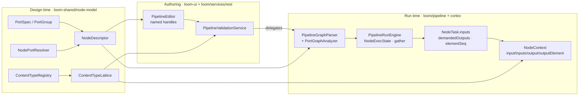

# Node Data Types — Refactor Plan (Typed Ports, Cardinality, Origin-Aware Sequences)

> **Status: the refactor has landed.** All six phases are built. What remains is a short tail of
> follow-ups (§4) and one behavioural gap in the demo/shippable graphs.
>
> **This file is no longer the reference for the built system.** That is
> [NODE_DATA_TYPES.md](NODE_DATA_TYPES.md), which owns the vocabulary, the per-node port table, the
> wire shapes, the fan-out semantics, the key-classes table and the current defect audit.
>
> **What this file is for, and the only reason to keep it:**
> 1. the **locked design decisions** (§1) — what was decided up front and is not open for
>    re-litigation;
> 2. the **recorded divergences** (§3) — every point where the implementation deliberately departed
>    from the design, and why. This is the institutional memory that exists nowhere else;
> 3. the **remaining open work** (§4) and the **deliberately deferred** items (§5).
>
> Everything the design said that the code now simply *does* has been removed from this file — read
> the code, or [NODE_DATA_TYPES.md](NODE_DATA_TYPES.md).
>
> **Companion documents**
> - [NODE_DATA_TYPES.md](NODE_DATA_TYPES.md) — the reference for the built model.
> - [PIPELINE.md](PIPELINE.md) — engine, run state, dispatch protocol, segmentation, affinity.
> - [../pipeline-nodes/NODES.md](../pipeline-nodes/NODES.md) — node lifecycle, per-node configuration
>   and persistence targets.
> - [../../guidelines/CODING.md](../../guidelines/CODING.md) — definition of done for a code change.
>
> **Source of truth is the code.** Where this plan and the code disagree, the code wins — fix this
> file in the same change.

---

## 1. What was decided, and what it bought

Four requirements drove the refactor, all of them consequences of the same root cause: **data was
addressed by author-chosen pipeline node id**, and declared types were decoration.

| # | Requirement | Delivered as |
|---|---|---|
| R1/R2 | A content-type vocabulary biased toward **editor usability**, with subtypes | `family/subtype` lattice, one editor colour per family |
| R3/R4 | **Declared, resolved and enforced input types** with **cardinality** | `PortSpec` + `Cardinality{ONE,MANY}` on every port |
| R5 | **Origin/sequence awareness**, recombined **implicitly in the engine, with no merge node** | `Origin{itemId,seq,total}` + the `dependenciesSettled` gather barrier |
| R6 | **XOR inputs** and **EXCLUSIVE output groups** | `PortGroup` / `PortGroupMode` |
| R7 | The node knows **which outputs the pipeline demanded** | `NodeTask.demandedOutputs` + `ctx.isDemanded(PORT)` |
| R8 | Pipelines stay **human-authored** in the React Flow editor | named handles = port ids, live connection validation |

### 1.1 Locked design decisions (not open for re-litigation)

| Decision | Choice | Consequence |
|---|---|---|
| Backwards compatibility | **Breaking is fine.** No migration of stored `pipeline_version.definition` JSON | Existing pipelines are re-authored / re-seeded. No legacy-alias parsing |
| Join semantics | **Gather per origin, implicit in the engine** | No merge/join node in the palette. The barrier is invisible to the author |
| Enforcement | **Hard at save time *and* at runtime** | Save rejects an invalid graph; the node boundary coerces and fails the task on mismatch |
| Scope | **Types + sequences only** | The two node hierarchies, `CortexNodeAdapter` and the `NODE_TASK` dispatch model stay |

**The one sentence to remember:** a node no longer reads *"the output named `face_count` from the
node someone named `facedetect`"*; it reads *"my input port `detections`"*, and the engine resolves
which upstream `(node, port)` fills it from the wired edges.

---

## 2. Already implemented

One row per delivered item. Paths are the place to read, not a summary of behaviour — for behaviour
see [NODE_DATA_TYPES.md](NODE_DATA_TYPES.md).

| Delivered | Lives in |
|---|---|
| `family/subtype` vocabulary (38 types, 8 families, every family has a wildcard) | `loom-shared/node-model/.../nodes/spec/ContentTypeRegistry.java` |
| `isAssignable(actual, declared)` — the single Java lattice | `…/nodes/spec/ContentTypeLattice.java` |
| Port model: `PortSpec` (`ID_PATTERN ^[a-z0-9][a-z0-9_]{0,62}$`), `PortGroup`, `PortGroupMode{XOR,EXCLUSIVE}`, `Cardinality{ONE,MANY}`, `ResolvedPorts` | `…/nodes/spec/` |
| `NodeDescriptor.inputPorts / outputPorts / inputGroups / outputGroups / dynamicPorts`; `inputs`/`outputs` deleted | `…/nodes/spec/NodeDescriptor.java` |
| Dynamic ports SPI + script / llm / vlm resolvers | `…/nodes/spec/{NodePortResolver,ScriptPortResolver,PromptPortResolver,LlmPortResolver,VlmPortResolver}.java` |
| Port-to-port edges: `sourcePort`/`targetPort` **required**, `branch` parsed, `nodes[].dependencies[]` **rejected**, per-node `options` (`config` a legacy alias) | `loom/pipeline/.../graph/PipelineGraphParser.java` (dependencies check ~190–197, port check ~297–303, branch ~305–314, options ~255–269) |
| All wiring rules + execution-mode classification (`SINGLE` / `PER_ELEMENT`, `fanOutDriver`) | `loom/pipeline/.../graph/PortGraphAnalyzer.java` (invoked from the parser) |
| Save-time rejection — **delegates** to the parser rather than reimplementing | `loom/services/rest/.../validation/PipelineValidationService.java` |
| Typed envelope `PortPayload` / `DataElement` / `Origin`; `NodeTask.inputs` + `demandedOutputs` + `elementSeq`; `MediaRef.mediaType` | `loom-shared/pipeline-model/.../model/` |
| JSONB codec for the envelope | `loom/pipeline/.../engine/PortPayloads.java` |
| `ValueCoercer`, applied on write, on emit and on read | `loom-shared/node-model/.../nodes/spec/ValueCoercer.java`, `cortex/node-runtime/.../NodeResultMapper.java` |
| Per-element engine state, dynamic `elementCount`, gather barrier, element-level skip/branch/retry | `loom/pipeline/.../engine/{NodeExecState,ItemState,PipelineRunEngine}.java` |
| `element_seq` column + `(item, node, element_seq)` uniqueness; DAO and run-state store keyed on it; recovery restores one row per element | migration `V2.60`, `loom/db/.../PipelineNodeTaskDao*`, `loom/services/rest/.../DaoRunStateStore.java`, `…/PipelineRunRecovery.java` |
| Node-author API: `InputPort` / `OutputPort` / `Element` / `NodeInputs` / `PortOutput`; `NodeOutputKey` and `ctx.upstreamOutput(nodeId,key)` **deleted** | `cortex/api/.../node/` |
| Every node swept to ports; `sentiment`/`tts`/`scene-layout`/`dominant-color` node-id options gone; the `loom` sink node deleted | `cortex/nodes/*/core/src/main` |
| Descriptor↔runtime port parity, enforced across the tree | `integration-test/.../NodePortConformanceTest.java` (with `DYNAMIC_KINDS` exemptions for script/llm/vlm) |
| Editor: handle ids **are** port ids, family colours, live validation (`isAssignable` + duplicate/cardinality/XOR/EXCLUSIVE), persistence of `sourcePort`/`targetPort`/`branch` and per-node `options` | `loom-ui/src/features/pipeline/PipelineEditor.tsx` (`isValidConnection` ~1672, `getGraphJson` ~1816) |
| TS mirrors of the lattice and the dynamic-port resolvers, with contract tests | `loom-ui/src/features/pipeline/{contentTypes,portResolvers}.ts` (+ `.test.ts`) |
| Demo pipelines rewired to ports; the website `nodeviz` renderer speaks the vocabulary | `DemoDatabaseInitializer`, [../../website/WEBSITE.md](../../website/WEBSITE.md) |



---

## 3. Design vs. implementation — recorded divergences

**This is the part of the file with no substitute elsewhere.** Each row is a deliberate choice made
while building. Where a row is still an open hole it is marked 🔴 and repeated in §4.

| # | Design said | Implementation did | Why |
|---|---|---|---|
| 1 | "31 types, 8 families" over a table that listed 35 | **38 types**, counted from `ContentTypeRegistry.all()` | Three family wildcards the design omitted — `scalar/*`, `struct/*`, `control/*` — were added so **every** family has one. `ContentTypeLatticeTest` asserts that invariant, which is what makes the third lattice arm total instead of ad hoc |
| 2 | `PortPayload` / `DataElement` / `Origin` as Java `record`s | Jackson-annotated **classes**, and `PortPayload.cardinality` is a **`String`**, not the `Cardinality` enum | `loom-shared/pipeline-model` does not depend on `node-model`, so the enum is not visible there. The wire values are still exactly `"ONE"` / `"MANY"` |
| 3 | The JSONB encoding lives with the envelope | The `PortPayloads` codec landed in **`loom/pipeline`**, not `pipeline-model` | The codec needs Vert.x `JsonObject`; `pipeline-model` has no Vert.x dependency and should not gain one |
| 4 | `InputBinding = {targetPortId, sourceNodeId, sourcePortId, branch}` | `+ targetIsMany`, stamped once by `PortGraphAnalyzer` | The engine then builds a task's inputs from the graph alone and never resolves a descriptor at dispatch time |
| 5 | Put the port rule set **in** `PipelineValidationService` | The service **delegates** to `PipelineGraphParser`, mapping `GraphValidationException` onto a `ValidationException` | The plan's own warning was "do not add a fourth copy". Delegating leaves exactly one implementation instead of two that must agree |
| 6 | `NodePortResolver` takes a `JsonObject` | It takes `Map<String, Object>` | Same reason as #3 — `node-model` is Vert.x-free |
| 7 | Separate `llm` and `vlm` resolvers | A shared `PromptPortResolver` base, plus a **`result` fallback port** when no prompts are configured | Without the fallback a freshly dropped `llm` node has no output handle at all and cannot be wired up — the author would have no way back |
| 8 | Reject nested fan-out when a `PER_ELEMENT` node's `MANY` output feeds a `ONE` input | Reject a `PER_ELEMENT` node that **declares** a `MANY` output at all | Stricter, decided during classification without a second pass, and it cannot be worked around by leaving the port unwired and wiring it later |
| 9 | Drop the legacy inline `dependencies[]` fallback | **Done, and harder than designed**: the parser *recognises* `nodes[].dependencies[]` and **throws** a `GraphValidationException` naming the replacement, rather than silently ignoring it. A definition with **no** `edges` array is still legal — a single-node pipeline is | Silently parsing such a definition into a graph with no bindings made it fail later with a message about the wrong thing. (Earlier revisions of this file recorded this as an open hole; that is no longer true) |
| 10 | `getDependencies()` becomes "derived (the distinct source node ids)" | Built in the same pass as the bindings, deduped on the port 4-tuple | Same result, one traversal instead of two |
| 11 | Segments: never merge nodes of different execution modes, with a SINGLE-only fallback "if phase 4 runs long" | **The fallback was taken.** A segment is only considered for `seq == 0` of a `SINGLE` node | Costs throughput on fanned-out affinity groups and nothing else |
| 12 | 🔴 `ValueCoercer` with a hard-`FAILED` arm for an **undeclared port id** and for a **non-selected `EXCLUSIVE`-group port** | Coercion runs at all three boundary points (`NodeContextImpl` on write and on read, `NodeResultMapper.toPayloads` on emit), but **neither hard-failure arm exists** | Outstanding — §4 |
| 13 | Demanded outputs = wired ports **plus** any port the `syncToLoom` sink consumes | Wired ports only | The sink-side half was never needed: `syncToLoom` reads whatever the node emitted, and emitting an undemanded port stays legal |
| 14 | `cortex/api` gains `InputPort` / `OutputPort` / `Element` | Also `NodeInputs` (the inbound bundle: ports + `demandedOutputs` + `origin`) and `PortOutput` (a port plus its accumulated values) | The context needs somewhere to hold the inbound bundle and the outbound accumulator, and `FilesystemNode.process` needs a parameter type |
| 15 | `NodeContext.origin()` returns the execution's origin | It does — which collided with the existing `origin(ResultOrigin)` **setter**, so the provenance **getter** was renamed `resultOrigin()` | Two unrelated meanings of "origin" now coexist. Every caller that read `ctx.origin()` as a `ResultOrigin` had to change |
| 16 | 🔴 A vitest contract test pins the TS mirror "against a fixture exported from the Java side" | The TS test carries a **hand-transcribed** fixture; **no Java-side export exists** | The two implementations can still drift, and only a reviewer notices — §4 |
| 17 | Media is validated but not transported | Also: the engine **hard-codes the source's output port name** as `PipelineRunEngine.SOURCE_MEDIA_PORT = "media"` | An implicit contract the design never named: a source descriptor that names its port anything else validates at save time and delivers nothing at runtime |
| 18 | — | An **empty** upstream sequence (`elementCount == 0`) settles the downstream node as `SKIPPED("Upstream sequence was empty")` | Not in the design. Without it, a fan-out that found nothing leaves the item permanently incomplete |
| 19 | — | `PortGraphAnalyzer.analyze` **returns silently** when the descriptor registry is null, leaving every node `SINGLE` | Needed for unit tests and the in-memory backend. It also means any caller using the no-arg parser re-parses a graph with no port checking at all |
| 20 | 🔴 `NodeDescriptorRegistry.resolvePorts` is what save-time validation uses | It is (`PortGraphAnalyzer.analyze` calls it per node), but it is **not exposed over REST** — `NodeDescriptorEndpoint` serves the static descriptor only | The editor mirrors the three resolvers in TypeScript rather than round-tripping every keystroke. The mirror is contract-tested, but there is no server-side resolve endpoint — §4 |
| 21 | — | The incremental-reuse path in `DaoRunStateStore` looks up a previous run's task with a hard-coded `elementSeq = 0` | Result reuse predates fan-out and was never extended to it: a `PER_ELEMENT` node re-runs in full on an unchanged asset |

---

## 4. Open work

Everything below is verified against the tree at the HEAD in the footer. Nothing here blocks the
model; each is a follow-up.

### 4.1 Enforcement holes

- [ ] 🔴 **`ValueCoercer` hard-failure arms** (divergence 12). Emitting an **undeclared port id** and
      emitting a **non-selected `EXCLUSIVE`-group port** should both fail the task with a message
      naming the port / group. Today both pass through. The `EXCLUSIVE` half is untestable end to
      end until a shipped descriptor actually uses an exclusive group — see below.
- [ ] **No shipped descriptor declares an `EXCLUSIVE` output group.** `PortGroupMode.EXCLUSIVE`
      exists and `PortGraphAnalyzer.validateExclusiveOutputs` enforces it, but the only exercise is
      `PortGraphAnalyzerTest`. Either give a real kind an exclusive group or accept the path as
      speculative.
- [ ] **`PipelineValidationServiceTest` is not extended.** Its edge fixtures carry no ports, so the
      rules the service delegates are never exercised from the REST side. The rules themselves are
      covered by `PortGraphAnalyzerTest`; what is untested is that the delegation and the
      `GraphValidationException` → HTTP 400 mapping still hold.

### 4.2 Missing tests

- [ ] **`ValueCoercerTest`** — one case per family; `Long` survives the round trip; a non-encodable
      `struct` fails exactly **one** task rather than clearing the persist batch.
- [ ] **`PortPayloadRoundTripTest`** — `output → JSON → JSONB → input` preserves the content type
      **and** the origin tags. This is the round trip [NODE_DATA_TYPES.md](NODE_DATA_TYPES.md) flags
      as unprotected.
- [ ] **Java-side fixture export for the TS contract tests** (divergence 16). `contentTypes.test.ts`
      and `portResolvers.test.ts` assert against hand-transcribed data, so a Java-side change to the
      vocabulary or to a resolver does not fail the TS build.

### 4.3 Provenance never reaches the wire

- [ ] **`ResultOrigin` is set by nodes and dropped by the runtime.** Nodes call
      `ctx.origin(ResultOrigin…)` (a dozen of them do), but `ResultOrigin` appears **nowhere** in
      `cortex/node-runtime/src/main` or `loom-shared/pipeline-model` — it is never serialised onto
      `NodeTaskResult` and never persisted. Every result therefore looks like it came from nowhere.
- [ ] **`run_uuid` / `task_uuid` provenance is never populated** on the Loom side of a node's
      write-back. The columns exist; nothing on the Cortex path fills them, so an `asset_node_result`
      row cannot be traced back to the pipeline run that produced it.

### 4.4 Observability and reachability

- [ ] **Counters still count nodes, not executions.** `PipelineRunEngine.nodeProgressSnapshot()`
      buckets on `state.isInFlight(nodeId)` / `isSettled(nodeId)`, so a node fanned out to 200
      elements reports the same `[active, pending]` as one running once. The run-item detail has no
      per-node `k/N elements` display either.
- [ ] ⚠️ **No shipped kind declares a `ONE`-cardinality detection input**, so no seeded or shippable
      graph exercises `PER_ELEMENT` end to end. The gather path is demoed; the fan-out path is
      covered only by `PipelineRunEngineFanOutTest`.
- [ ] **No server-side port-resolution endpoint** (divergence 20). Consider
      `POST /api/v1/node-descriptors/{kind}/resolved-ports` taking `options`, which would let the
      editor drop its two TS mirrors — or decide explicitly that the mirrors are the design and close
      this.

### 4.5 Documentation consistency

- [ ] **Descriptor-kind vs runnable-kind counts disagree across spec files.** A descriptor is not a
      registration: a kind needs `@Binds @IntoMap @StringKey("<kind>")` in Cortex to be runnable, and
      the two sets differ. Pick one derivation, state it in [NODE_DATA_TYPES.md](NODE_DATA_TYPES.md),
      and have every other spec cross-reference it instead of repeating a number.

---

## 5. Deliberately deferred (phase 7+)

| Item | Why it was cut, and what lifting it costs |
|---|---|
| **Nested fan-out** | `Origin.seq : int` would become `seqPath : int[]`, and every `(node, seq)` key in the engine widens with it. Rejected at classification today (divergence 8) |
| **JSON schemas for `struct/*`** | A `struct/*` value is any JSON object. Schemas would need a registry, a validator and a versioning story |
| **Partial-gather thresholds** | "Proceed when ≥ K elements survived". Today a gather waits for every sibling and the blocking flag decides |
| **Per-element affinity segments** | The SINGLE-only fallback was taken (divergence 11); lifting it costs `SegmentTaskRunner` complexity and buys throughput only |
| **Elements by reference for large gathers** | A gather task ships all N elements inline. Until this lands, **`MANY` ports should carry scalars or short text, not blobs** |

---

## 6. Test setup

`./setup-pool.sh` is required for anything touching the engine, REST validation or `integration-test`
— and again after any Flyway change, because the pooled databases go stale.

```bash
mvn -q test -pl loom-shared/node-model                      # vocabulary, lattice, ports, resolvers
mvn -q test -pl loom/pipeline -Dtest='PipelineGraph*Test,PortGraphAnalyzerTest'
mvn -q test -pl loom/pipeline -Dtest='PipelineRunEngine*Test'     # needs ./setup-pool.sh
mvn -q test -pl integration-test -Dtest=NodePortConformanceTest   # needs ./setup-pool.sh
cd loom-ui && yarn test && yarn test:e2e                    # TS mirrors + pipeline-ports-mocked.spec.ts
```

Re-derive the Cortex build state rather than trusting any list in a spec file:

```bash
for m in cortex/api cortex/node-runtime cortex/pipeline-core cortex/pipeline-common cortex/nodes/*/core; do
  printf "%-40s %s\n" "$m" "$(mvn -q -pl $m -DskipTests test-compile 2>&1 | grep -cE '^\[ERROR\].*\.java') errors"
done
```

---

## 7. Conventions and gotchas

| Rule | Why |
|---|---|
| **Never reintroduce a node-id-keyed lookup.** A node addresses data by *port*, full stop | Node ids are author-chosen; that was the root cause of the whole defect class this refactor removed |
| **Cardinality lives on the port, never in the content type** | The old `IMAGE_LIST → data/thumbnail` collapse is exactly what was removed. Do not invent `text/plain-list` |
| **Content type ids are always `family/subtype`, and every family has a wildcard** | `isAssignable` has no special cases and stays five lines in two languages. `ContentTypeLatticeTest` asserts the wildcard invariant — adding a family without one breaks it |
| **A source's output port must be named `media`** | The engine hard-codes `PipelineRunEngine.SOURCE_MEDIA_PORT`. Any other name validates at save time and delivers nothing at runtime (divergence 17) |
| **A descriptor is still not a registration** | Adding ports does not make a kind runnable; it still needs `@Binds @IntoMap @StringKey("<kind>")` |
| **Coerce at the boundary, never cast in a node** | `ctx.input(PORT)` is only safe because `ValueCoercer` ran on both sides |
| **`scalar/integer` is always 64-bit** | The single reason the `Long`/`Integer` narrowing is not a live defect: readers always get `Long` |
| **A `MANY` port's elements are always seq-ordered and origin-tagged** | Downstream zip and gather both depend on it; never emit unordered |
| **Element width comes from `elementCount`, not from surviving payloads** | Counting surviving elements would shrink the sequence when one fails and silently re-index everything below it |
| **Everything keyed `(node, seq)` must genuinely use `seq`** | Retry budget, in-flight release and recovery seeding included. Reading element 0's state for element *n* releases capacity never acquired, or parks a retry nothing will dispatch |
| **`ctx.origin()` ≠ `ctx.resultOrigin()`** | The first is this execution's fan-out origin; the second is provenance. The collision is real and permanent (divergence 15) |
| **Adding a `ScriptValueType` still means touching the UI mirror** | The obligation moved from `SCRIPT_VALUE_CONTENT_TYPE` to `portResolvers.ts`; it did not go away |
| **No fourth copy of validation** | Port rules live in `PortGraphAnalyzer` only; `PipelineValidationService` delegates and the editor mirrors *shapes*, not logic |
| **`PortGraphAnalyzer` with a null registry is a no-op** | Convenient in tests, dangerous in production paths: a graph parsed through the no-arg parser gets **no** port checking (divergence 19) |

**Environment variables:** this refactor introduced none, deliberately — the type system is a
property of the definition and of the descriptors, so two workers running the same graph cannot
behave differently. See [../../cortex/CONFIGURATION.md](../../cortex/CONFIGURATION.md).

---

## 8. Where do I find …?

| Need | Path |
|---|---|
| **What the model is and how to use it** (vocabulary, per-node ports, wire shapes, defect audit) | [NODE_DATA_TYPES.md](NODE_DATA_TYPES.md) |
| Engine, dispatch, run state, affinity | [PIPELINE.md](PIPELINE.md) |
| Node lifecycle, per-node config and persistence | [../pipeline-nodes/NODES.md](../pipeline-nodes/NODES.md) |
| Definition of done for a code change | [../../guidelines/CODING.md](../../guidelines/CODING.md) |
| Vocabulary and lattice | `loom-shared/node-model/.../nodes/spec/{ContentTypeRegistry,ContentTypeLattice}.java` |
| Port model and descriptors | `loom-shared/node-model/.../nodes/spec/{PortSpec,PortGroup,PortGroupMode,Cardinality,ResolvedPorts,NodeDescriptor}.java` |
| Dynamic ports | `…/nodes/spec/{NodePortResolver,ScriptPortResolver,PromptPortResolver}.java` |
| Descriptor provider SPI list | `loom-shared/node-model/src/main/resources/META-INF/services/io.metaloom.loom.nodes.spec.NodeDescriptorProvider` |
| Edge parsing, `dependencies[]` rejection, options/`config` alias | `loom/pipeline/.../graph/PipelineGraphParser.java` |
| Port validation + fan-out classification | `loom/pipeline/.../graph/PortGraphAnalyzer.java` |
| Per-element engine state and the gather barrier | `loom/pipeline/.../engine/{NodeExecState,ItemState,PipelineRunEngine}.java` |
| The JSONB codec | `loom/pipeline/.../engine/PortPayloads.java` |
| Save-time validation entry point | `loom/services/rest/.../validation/PipelineValidationService.java` |
| Run-state persistence and recovery | `loom/services/rest/.../service/impl/{DaoRunStateStore,PipelineRunRecovery}.java` |
| The wire model | `loom-shared/pipeline-model/.../model/{NodeTask,NodeTaskResult,PortPayload,DataElement,Origin,MediaRef}.java` |
| Node-author API | `cortex/api/.../node/{InputPort,OutputPort,Element,NodeInputs,PortOutput}.java`, `…/node/context/NodeContext.java` |
| Cortex ↔ wire mapping and coercion | `cortex/node-runtime/.../{NodeResultMapper,NodeTaskRunner}.java` |
| Descriptor ↔ runtime port parity | `integration-test/.../NodePortConformanceTest.java` |
| Handles, colours, connection validation, persistence | `loom-ui/src/features/pipeline/PipelineEditor.tsx` |
| The TS mirrors and their contract tests | `loom-ui/src/features/pipeline/{contentTypes,portResolvers}.ts` + `.test.ts` |
| Editor E2E coverage | `loom-ui/e2e/pipeline-ports-mocked.spec.ts` |
| Migrations | `loom/db/flyway/.../db/migration/` (`V2.60` added `element_seq`) |

---

## 9. Progress Assessment

Phase-level state. Item-level detail for anything unchecked is in §4.

- [x] **Phase 1 — vocabulary and port model.** `ContentTypeRegistry` (38 types / 8 families),
      `ContentTypeLattice`, `PortSpec` / `PortGroup` / `Cardinality` / `ResolvedPorts`, all descriptor
      providers rewritten to ports, `NodePortResolver` SPI with script / llm / vlm implementations.
- [x] **Phase 2 — validation and parser.** Required `sourcePort` / `targetPort`, `InputBinding` with
      `targetIsMany`, port-4-tuple dedupe, execution-mode classification with both v1 restrictions,
      inline `dependencies[]` rejected outright, `PipelineValidationService` delegating.
- [x] **Phase 3 — wire and envelope.** `PortPayload` / `DataElement` / `Origin`, port-keyed
      `NodeTask.inputs` + `demandedOutputs` + `elementSeq`, `MediaRef.mediaType`, `ValueCoercer` at
      all three boundaries, `PortPayloads` codec, migration `V2.60`.
- [x] **Phase 4 — engine fan-out and gather.** `NodeExecState`, per-element `advance` / `buildInputs`,
      dynamic `elementCount` (including the empty-sequence case), the implicit gather barrier,
      element-level skip / failure / branch, `(node, seq)`-keyed retry and capacity, element-aware
      recovery and DAO lookups.
- [x] **Phase 5 — node API and sweep.** `InputPort` / `OutputPort` / `NodeInputs`; `NodeOutputKey` and
      `upstreamOutput` deleted; every node and its tests swept to ports; `NodePortConformanceTest`
      green across the mapped kinds.
- [x] **Phase 6 — editor.** Named handles, family colours, TS lattice and resolver mirrors, live
      connection validation, `sourcePort` / `targetPort` / `branch` / `options` persistence, Playwright
      round-trip coverage.
- [ ] Enforcement holes — `ValueCoercer` hard-failure arms; no descriptor uses `EXCLUSIVE`;
      `PipelineValidationServiceTest` not extended (§4.1).
- [ ] Missing tests — `ValueCoercerTest`, `PortPayloadRoundTripTest`, Java-exported TS fixtures (§4.2).
- [ ] Provenance — `ResultOrigin` never reaches the wire; `run_uuid` / `task_uuid` never set (§4.3).
- [ ] Observability and reachability — counters count nodes not executions; no run-monitor
      `k/N elements`; no shipped graph exercises `PER_ELEMENT` (§4.4).
- [ ] Documentation — descriptor-kind vs runnable-kind counts disagree across spec files (§4.5).
- [ ] Deferred by design — nested fan-out, `struct/*` schemas, partial-gather thresholds, per-element
      segments, elements by reference (§5).

**When can this file be deleted?** When §4 is empty and §3 has been folded into
[NODE_DATA_TYPES.md](NODE_DATA_TYPES.md) as a "why it looks like this" section. Until then §3 is the
only record of the twenty-one places where the built system diverges from its design.

---

_Git HEAD revision: `499f71f7`_
_Last updated: 2026-08-01 (reduced from a 1148-line phase plan to the divergence record and the open tail, now that all six phases have landed; corrected the claim that inline `dependencies[]` still parses — the parser rejects it.)_
