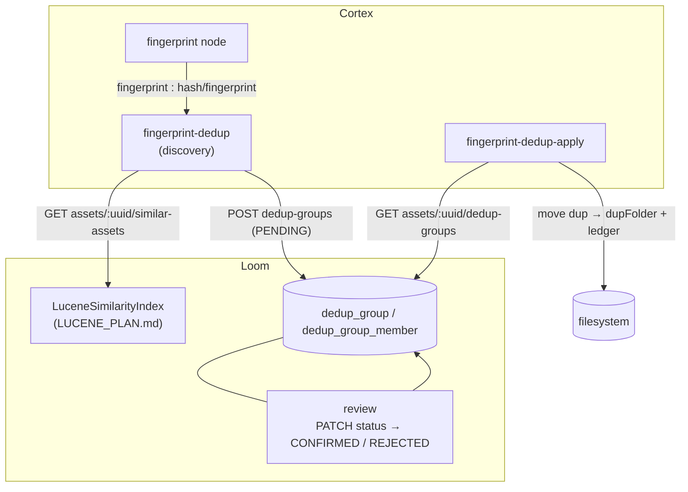

# Deduplication Nodes — Technical Specification

> **Audience: AI coding agents.** The dedup family brings `xdb-clean`'s perceptual-fingerprint
> workflow into MetaLoom, split across **two nodes and a human decision**:
>
> 1. **Discovery** (`fingerprint-dedup`) — finds near-duplicate videos via the Lucene similarity
>    index and writes **candidate groups** to Loom for review. Never touches a file.
> 2. **Review** — a human sets a group `CONFIRMED` or `REJECTED` over REST.
> 3. **Apply** (`fingerprint-dedup-apply`) — reads only **CONFIRMED** groups and moves the duplicates.
>
> Plus `sha512-dedup` / `hash-dedup` (the same class under two kind ids) for exact-hash duplicates.

## 🟢 Status: BUILT (backend + both nodes) — verified at `499f71f7`

The schema, permissions, DAO, all six REST routes, the DTOs and client, **both Cortex nodes**, the
descriptors, the kind bindings and the customer docs all exist. Test counts by `@Test`: cortex dedup
module **11**, `DedupGroupEndpointTest` **11**, `DedupGroupDaoTest` **6**. The prerequisite similarity
index ([../search/LUCENE_PLAN.md](../search/LUCENE_PLAN.md)) is built and is what discovery queries.

🔴 **The human-in-the-loop review step has no working UI.** That is the one substantial piece of this
feature still missing, and §3.1 is the only part of this file that is still a *plan*.

⚠️ **Corrections against the previous revision of this file.** It carried a "BUILT" header over a
"§9 — nothing below exists yet" note and a "§13 — Nothing is implemented" line. Those were stale and
are removed. Four further statements were wrong and are corrected here:

| Previously specified | Actually built |
|---|---|
| Website docs still open | `website/content/english/docs/nodes/dedup/index.adoc` **exists** and covers all three kinds |
| Discovery "skips already-dedupped media (assets already in a CONFIRMED/REJECTED group)" ✅ | 🔴 **Not implemented.** `FingerprintDedupNode` never queries existing groups. Server-side `createDedupGroup` refuses to *reopen* a decided group but happily creates a **new PENDING** one for the same keep+algorithm on every run (§3.2) |
| Apply "re-hashes the KEEP correctly before any move" ✅ | 🔴 **No re-hash.** `keepPassesSafeguards` checks existence, completeness, size and folder — nothing else (§3.3) |
| Discovery upserts via a client-side idempotency key | Idempotency lives **server-side**: `DedupGroupEndpointService.createDedupGroup` → `findPendingByKeep(keep, algorithm)` → delete + recreate |
| Kind-id mismatch `hash-dedup` vs `sha512-dedup` still open | **Fixed** — both `@StringKey`s bind `HashDedupNode`; the descriptor advertises `hash-dedup`, `name()` returns `sha512-dedup` |

**Module**: `cortex/nodes/dedup` (aggregator + `core`, no `-api` submodule) ·
**Package**: `io.metaloom.cortex.node.dedup` · **No model, no sidecar.**

General node conventions: [NODES.md](NODES.md). Ports and content types:
[../pipeline/NODE_DATA_TYPES.md](../pipeline/NODE_DATA_TYPES.md) §4.6. Adding a node:
[../../guidelines/NEW_NODE.md](../../guidelines/NEW_NODE.md). The dedup entities in the domain model:
[../../loom/DOMAIN.md](../../loom/DOMAIN.md). The similarity query this depends on:
[../search/LUCENE_PLAN.md](../search/LUCENE_PLAN.md). Reference algorithm and its safeguards:
`xdb-clean/FPDEDUP_PROCESS.md`. **The code is the source of truth.**

---

## 1. Already implemented

| Item | Where it lives |
|---|---|
| `FingerprintDedupNode` (185 lines) — discovery | `cortex/nodes/dedup/core/src/main/java/io/metaloom/cortex/node/dedup/FingerprintDedupNode.java` |
| `FingerprintDedupApplyNode` (182 lines) — apply | same package, `FingerprintDedupApplyNode.java` |
| `HashDedupNode` (143 lines) — exact-hash dedup, `moveMedia` template | same package, `HashDedupNode.java` |
| `FingerprintDedupDiscoverOptions` (`algorithm`, `scoreThreshold`, `topK`, `allowPartial`, `abortOnLargerDup`) | same package |
| `DedupNodeOptions` (`dupFolder`) — shared by `sha512-dedup` **and** apply | same package |
| Kind bindings `sha512-dedup`, `hash-dedup` (alias), `fingerprint-dedup`, `fingerprint-dedup-apply` | `DedupNodeModule.java` |
| Aggregation into the Dagger graph | `cortex/cli/src/main/java/io/metaloom/cortex/cli/dagger/NodeCollectionModule.java:6,40`; guarded by `NodeRegistrarTest:59-64` |
| 3 descriptors (`hash-dedup`, `fingerprint-dedup`, `fingerprint-dedup-apply`), category `OUTPUT`, `SEQUENTIAL`, concurrency 1 | `loom-shared/node-model/src/main/java/io/metaloom/loom/nodes/spec/DedupDescriptorProvider.java` + `META-INF/services` |
| Migration: `dedup_status` enum, `dedup_group`, `dedup_group_member`, 3 indexes, role CHECK, UNIQUE `(group_uuid, asset_uuid)` | `loom/db/flyway/src/main/resources/db/migration/V2.61__add_dedup_group.sql` |
| Permissions `READ/CREATE/UPDATE/DELETE_DEDUP` (`ALTER TYPE loom_permission`) | `.../V2.62__add_dedup_permission.sql`; enum at `loom/db/api/.../model/perm/Permission.java:221-227` |
| `DedupGroupDao` (10 methods incl. `findPendingByKeep`) + `DedupGroup` / `DedupGroupMember` models | `loom/db/api/src/main/java/io/metaloom/loom/db/model/dedup/` |
| jOOQ impls + generated types (`JooqDedupGroup*`, `JooqDedupStatus`) | `loom/db/jooq/src/main/java/io/metaloom/loom/db/jooq/dao/dedup/`; `loom/db/jooq/src/jooq/java/.../` |
| `DedupGroupEndpoint` (5 routes) + `DedupGroupEndpointService` (215 lines, upsert + validation) | `loom/services/rest/src/main/java/io/metaloom/loom/rest/{endpoint,service}/impl/` |
| `GET /api/v1/assets/:uuid/dedup-groups` | `loom/services/rest/.../endpoint/impl/AssetEndpoint.java:517-522` |
| DTOs `DedupGroup{Create,Update}Request`, `DedupGroup{,List}Response`, `DedupGroupMemberModel` | `loom-shared/rest-model/src/main/java/io/metaloom/loom/rest/model/dedup/` |
| `DedupGroupMethods` (6 methods) + HTTP impl | `loom-client/common/.../method/DedupGroupMethods.java`; `loom-client/rest/.../LoomHttpClientImpl.java:1585-1622` |
| Candidate retrieval (Lucene HNSW k-NN over 256-dim fingerprints) | `loom/services/lucene/.../LuceneSimilarityIndex.java` → `GET /api/v1/assets/:uuid/similar-assets` |
| Tests: `FingerprintDedupNodeTest` (2), `DedupNodeOptionsValidationTest` (5), `FingerprintDedupDiscoverOptionsValidationTest` (4), `DedupGroupEndpointTest` (11), `DedupGroupDaoTest` (6, incl. both delete-cascades) | `cortex/nodes/dedup/core/src/test/…`; `loom/core/src/test/…/DedupGroupEndpointTest.java`; `loom/db/jooq/src/test/…/DedupGroupDaoTest.java` |
| Customer docs | `website/content/english/docs/nodes/dedup/index.adoc` (+ links in `nodes/_index.adoc`) |
| Domain-model rows | [../../loom/DOMAIN.md](../../loom/DOMAIN.md) §Dedup Group / Dedup Group Member (V2.61) |
| Catalogue rows | [NODES.md](NODES.md) §2/§3/§5; [../pipeline/NODE_DATA_TYPES.md](../pipeline/NODE_DATA_TYPES.md) §4.6 |

### 1.1 The review model (as built)

```sql
CREATE TYPE "dedup_status" AS ENUM ('PENDING', 'CONFIRMED', 'REJECTED');

dedup_group        (uuid PK, algorithm, status, keep_asset_uuid → asset ON DELETE SET NULL,
                    score real, meta jsonb, created, creator_uuid, edited, editor_uuid)
dedup_group_member (uuid PK, group_uuid → dedup_group CASCADE, asset_uuid → asset CASCADE,
                    role CHECK IN ('KEEP','DUP'), score real, size bigint, zero_chunk_count bigint,
                    UNIQUE (group_uuid, asset_uuid))
```

One group = one candidate set (exactly one `KEEP` + N `DUP`). `keep_asset_uuid` is denormalised for
convenience; the authoritative KEEP is the member with `role='KEEP'` — the DAO keeps them consistent.
`SET NULL` on the keep but `CASCADE` on members: deleting the kept asset must not silently erase the
review record, but a membership row without its asset is meaningless. `size` / `zero_chunk_count` are
**discovery-time snapshots** for the review UI and the apply-node safeguards; apply re-verifies
against the live file regardless.

`creator_uuid` / `editor_uuid` are **nullable** — a Cortex worker is not a user
([../../loom/DOMAIN.md](../../loom/DOMAIN.md)).

### 1.2 REST surface

| Method & path | Purpose | Permission |
|---|---|---|
| `POST /api/v1/dedup-groups` | Create (discovery node). **Upsert**: an existing PENDING group with the same keep+algorithm is deleted and recreated; a decided group is never reopened. `201` | `CREATE_DEDUP` |
| `GET /api/v1/dedup-groups?status=PENDING` | The review queue | `READ_DEDUP` |
| `GET /api/v1/dedup-groups/:uuid` | One group + members | `READ_DEDUP` |
| `PATCH /api/v1/dedup-groups/:uuid` | Confirm / reject, optionally reassign the KEEP | `UPDATE_DEDUP` |
| `DELETE /api/v1/dedup-groups/:uuid` | Remove a group | `DELETE_DEDUP` |
| `GET /api/v1/assets/:uuid/dedup-groups` | Groups involving one asset (what apply calls) | `READ_DEDUP` |

Validation: `400` on blank algorithm, empty member list, bad role, bad uuid or bad status; `404` on an
unknown group. ⚠️ `GET` **without** a `status` param concatenates the PENDING, CONFIRMED and REJECTED
lists — no combined ordering and no pagination (§3.4).

### 1.3 What each node actually does

**`fingerprint-dedup` (discovery)** — `isProcessable` = `media().isVideo()`. Skips when offline, when
the asset is unknown to Loom, or when `asset.getFingerprint().getFingerprintV1()` is null. Otherwise:

1. `client().listSimilarAssets(uuid, algorithm, topK, scoreThreshold)` → Lucene k-NN hits.
2. Candidate set = the query asset (score `1.0`) + each hit, **self-excluded by uuid**; each hit is
   loaded with `loadAsset` for its size and `zeroChunkCount`.
3. **KEEP = the largest *complete* candidate** (`zeroChunkCount` null or `0`). If none is complete →
   skip, unless `allowPartial`, in which case the largest overall wins.
4. Every other candidate becomes a `DUP`. 🔴 If `abortOnLargerDup` (default) and **any** DUP is larger
   than the KEEP, the whole group is abandoned — never propose discarding the bigger file.
5. `createDedupGroup(...)` with group `score` = the **minimum** member score, `status=PENDING`.
6. `recordNodeResult(SUCCESS, "<n> duplicate candidate(s)", algorithm, resultRef("dedup_group", uuid))`.
7. **No file is read, moved or altered.**

**`fingerprint-dedup-apply`** — `isProcessable` = media has a SHA-512. `listAssetDedupGroups(uuid)`,
then for each group: skip unless `status == "CONFIRMED"` **and** this asset is a member with
`role='DUP'`. Load the KEEP and re-verify it live: exists on disk, `zeroChunkCount` null or `0`,
`size >= dup size`, and not itself inside `dupFolder`. Idempotent: a dup already inside `dupFolder` is
skipped. Then `FileUtils.autoRotate` + `moveFile` (dry-run aware) and a ledger-only
`recordNodeResult(SUCCESS, "fpdup of <keepPath>")`.

**`sha512-dedup` / `hash-dedup`** — `HashDedupNode`: if Loom already knows an asset for this SHA-512
and its recorded file exists at a *different* path with the same hash, move the local copy into
`dupFolder` and record a ledger row.

---

## 2. Architecture



---

## 3. Open work

### 3.1 🔴 The dedup review UI — the one real gap

**Nothing in `loom-ui` calls the dedup API.** There is no `loom-ui/src/api/dedup.ts`, and
`dedup-groups` appears nowhere under `loom-ui/src` or `loom-ui/e2e`. All four DEDUP permissions are
annotated `ui:no` in the `Permission` enum, which is accurate today.

What exists is a **mock**: `loom-ui/src/features/workflow/WorkflowView.tsx` (route `/workflow`,
registered in `layout/AppShell.tsx:61`, sidebar entry `Sidebar.tsx:68`) has a `"deduplication"` mode,
a `DeduplicationMode` component, a `dedup-default` key profile (`Y` confirm / `N` reject) and i18n
strings in `en.json` / `de.json`. But:

- groups come from `buildDuplicateGroups(assets)` (~L85-91), which simply **pairs adjacent assets** —
  it never calls `GET /api/v1/dedup-groups`;
- decisions live in local React state `dedupDecisions` (~L733) and are **never PATCHed back**.

To finish it:

| Step | Detail |
|---|---|
| 1 | `loom-ui/src/api/dedup.ts` — `listDedupGroups(status)`, `loadDedupGroup(uuid)`, `updateDedupGroup(uuid, {status, keepAssetUuid})`, `deleteDedupGroup(uuid)`. Follow any of the 45 sibling modules in `loom-ui/src/api/`. |
| 2 | Replace `buildDuplicateGroups` with a real query for `status=PENDING`. Group members carry `size` and `zeroChunkCount` snapshots — surface both, they are why a reviewer can decide without opening the files. |
| 3 | Wire confirm / reject / **choose a different KEEP** to `PATCH`, and reflect the server's response rather than local state. |
| 4 | Show a thumbnail per member. The `thumbnail` node's artifacts are worker-local; decide whether the UI uses the asset's stored thumbnail or nothing. |
| 5 | Flip the four `ui:no` annotations in `Permission.java` and grant the perms in the demo roles. |
| 6 | Playwright mocked e2e per the loom-ui test convention (component tests are mocked Playwright, not RTL/jsdom). |

Until then the workflow is only completable with `curl` or the client library.

### 3.2 🔴 Discovery re-proposes already-decided groups

`FingerprintDedupNode.compute()` never asks Loom whether this asset is already in a CONFIRMED or
REJECTED group. The server-side upsert (`findPendingByKeep`) only collapses repeated **PENDING**
proposals; a keep+algorithm pair that a human already rejected gets a **fresh PENDING group on every
run**, so the review queue refills with decisions that were already made.

Fix: have discovery call `listAssetDedupGroups(uuid)` first and skip when any group containing this
asset is `CONFIRMED` or `REJECTED` — or add a server-side guard in `createDedupGroup`. Either way it
needs an endpoint test asserting the second discovery run produces nothing.

### 3.3 🔴 Apply does not re-hash the KEEP

`keepPassesSafeguards` checks existence, completeness, size and folder. `xdb-clean`'s
`databaseConsistencyFilter` also **re-hashes the keep and compares it to the recorded SHA-512** before
any move — that is what protects against a keep whose bytes changed since discovery. Add it, and a
unit test for the mismatch path.

### 3.4 Smaller gaps

- [ ] **No apply-node test at all.** `FingerprintDedupApplyNode`'s confirmed-only gating, its four
      safeguards and its idempotent skip are entirely untested. `HashDedupNodeTest` is an **empty stub
      class with zero `@Test` methods**.
- [ ] **No per-node E2E.** Nothing under `integration-test/` or `e2e-test/` mentions dedup, and
      `NodePortConformanceTest` has no dedup case. The target: two near-identical demo videos →
      fingerprinted → discovery produces a PENDING group → `PATCH` CONFIRMED → apply moves the DUP
      into `dupFolder` and writes a ledger row → re-running apply is a no-op.
- [ ] **No demo data.** `DemoDatabaseInitializer` seeds no dedup group (shared item with
      [../search/LUCENE_PLAN.md](../search/LUCENE_PLAN.md)).
- [ ] 🔴 **`HashDedupNode` blocks on `System.in.read()`** when the local file's size disagrees with the
      DB record — an interactive halt inside a headless worker. It must log and skip instead.
- [ ] **Discovery options are unreachable from the pipeline editor.** `DedupDescriptorProvider`
      exposes only `enabled` and `dupFolder`; `algorithm`, `topK`, `scoreThreshold`, `allowPartial`
      and `abortOnLargerDup` are **not** descriptor parameters, so they are YAML-only.
- [ ] **`GET /api/v1/dedup-groups` without `status`** concatenates three separate list queries with no
      combined ordering and **no pagination** — it will not survive a real review queue.
- [ ] **Thumbnail dominant-colour safeguard not carried over.** `xdb-clean` compares generated
      thumbnails before declaring a near-duplicate; MetaLoom gates on fingerprint score plus
      size/completeness only. A deliberate gap, recorded here so it is not rediscovered as a bug.
- [ ] **Partial-file handling is simplified.** MetaLoom has a single `is_complete` /
      `zero_chunk_count` signal, not `xdb-clean`'s multi-partial ranking.
- [ ] **Delta / incremental sync deferred.** Apply does an idempotent per-asset fetch every run. When
      corpus size makes that expensive, add a worker-side processed-group index (the
      `S3DifferentialScanner` Avro pattern) plus `GET /api/v1/dedup-groups?confirmedAfter=`.
- [ ] **Stale internal doc**: `loom/doc/src/main/docs/cortex/nodes/index.adoc:109-124` lists only
      `hash-dedup` and `fingerprint-dedup` — no `fingerprint-dedup-apply`.

---

## 4. Configuration

Three node-options keys, all YAML/pipeline-JSON only. **The dedup module reads no environment
variables.**

| Options key | Option | Type | Default | Meaning |
|---|---|---|---|---|
| `dedup` (`sha512-dedup` / `hash-dedup`) | `dupFolder` | Path | `duplicates` | Where duplicates are moved |
| `fingerprint-dedup-apply` | `dupFolder` | Path | `duplicates` | Same class, `DedupNodeOptions` |
| `fingerprint-dedup` | `algorithm` | String | `metaloom-multisector-v1` | Similarity index algorithm; must be non-blank |
| | `scoreThreshold` | float | `0.10` | k-NN cutoff; must be `>= 0` |
| | `topK` | int | `10` | Neighbours requested; must be `> 0` |
| | `allowPartial` | boolean | `false` | Allow a group when no candidate is complete |
| | `abortOnLargerDup` | boolean | `true` | Abandon the group if any DUP is larger than the KEEP |

All three inherit `enabled`, `processIncomplete`, `retryFailed`, `timeoutMs` from `AbstractNodeOptions`.
`CortexOptions` sets a per-node timeout default of `60000` ms for the `dedup` key.

The only **environment variable** that gates this feature end to end is on the Loom side:

| Var | Default | Effect |
|---|---|---|
| `LOOM_SIMILARITY_ENABLED` | see [../search/LUCENE_PLAN.md](../search/LUCENE_PLAN.md) | When false, `NoopSimilarityIndex` is bound and the similarity routes answer **503** (deliberately not an empty list) — so `fingerprint-dedup` fails loudly rather than silently finding nothing |

---

## 5. Test setup

| Test | Covers |
|---|---|
| `FingerprintDedupNodeTest` (2) | `testReportsGroupWithLargerKeep` — correct KEEP/DUP split; `testAbortsWhenDuplicateLargerThanKeep` — skipped and `createDedupGroup` never called. Mockito over `LoomHttpClient` |
| `DedupNodeOptionsValidationTest` (5), `FingerprintDedupDiscoverOptionsValidationTest` (4) | Option validation |
| `DedupGroupDaoTest` (6) | Store/load, `listByStatus` + `listByAsset`, `findPendingByKeep` + `updateStatus`, invalid-role rejection, 🔴 **group-delete cascade**, 🔴 **asset-delete removes memberships and nulls `keep_asset_uuid`** |
| `DedupGroupEndpointTest` (11) | Create + load, PENDING idempotency, confirm/reject, list-by-asset, delete, invalid status, empty-members rejection, `404`, all routes require permissions (`403`), **`READ_DEDUP` does not grant `UPDATE`**, asset-delete cascade through the API |
| `NodeRegistrarTest:59-64` | `sha512-dedup`, `fingerprint-dedup`, `fingerprint-dedup-apply` are registered kinds (`hash-dedup` is not asserted) |
| — **missing** — | Apply-node unit tests, `HashDedupNodeTest` bodies, any integration/E2E test, demo data (§3.4) |

```bash
mvn -pl cortex/nodes/dedup/core -am test
mvn -pl loom/db/jooq test -Dtest=DedupGroupDaoTest
mvn -pl loom/core test -Dtest=DedupGroupEndpointTest
mvn -pl cortex/cli test -Dtest=NodeRegistrarTest
```

🔴 `./setup-pool.sh` before any DAO or endpoint test, and **after** any Flyway change — install
`loom/db/flyway` first or the pool silently skips the new migration. Regenerate jOOQ with
`loom/db/jooq/generate.sh` after a schema change. Grant test permissions via **group + role**, never a
direct `user_permission` grant (one direct grant per user — see `SkillEndpointTest` for the pattern).

---

## 6. Conventions and Gotchas

| Area | Gotcha |
|---|---|
| **Two lifecycles** | 🔴 Discovery writes review items; apply acts on human decisions. Never let discovery move files, and never let apply act on `PENDING` or `REJECTED`. |
| **Live re-verification** | 🔴 The `size` / `zero_chunk_count` columns are discovery-time **snapshots** — hints for the UI, not authority. Apply must re-check the live file (and should also re-hash — §3.3). |
| **Larger DUP aborts the group** | ⚠️ Not "drop that member" — the *whole* group is abandoned. A duplicate bigger than the keep means the keep selection is wrong, not that one member is odd. |
| **Idempotency is server-side** | ⚠️ The upsert lives in `DedupGroupEndpointService.createDedupGroup` (delete + recreate the PENDING group), **not** in the node. Do not add a second client-side key. |
| **Decided groups still get re-proposed** | 🔴 §3.2 — the queue refills with already-rejected pairs on every discovery run. |
| **`hash-dedup` vs `sha512-dedup`** | ⚠️ Two `@StringKey`s onto **one** `HashDedupNode`. The descriptor advertises `hash-dedup`; `name()` returns `sha512-dedup`, so ledger rows say `sha512-dedup` whichever id was placed. Do not "fix" this by renaming — it is a deliberate alias. |
| **`sha512-dedup` has no descriptor** | ⚠️ It is runnable but cannot be placed from the UI palette ([../pipeline/NODE_DATA_TYPES.md](../pipeline/NODE_DATA_TYPES.md) §3.3). |
| **No in-memory DAO** | ⚠️ `loom/db/memory` does not mirror `DedupGroupDao` — deliberate, following the `AssetNodeResultDao` precedent. The jOOQ impl is exercised against the pooled database. |
| **First asset-to-asset relation** | 🔴 `dedup_group` / `dedup_group_member` is the schema's first asset-to-asset relation. Respect the cascade split: `SET NULL` on `keep_asset_uuid`, `CASCADE` on members. |
| **Offline mode** | ⚠️ Both fingerprint nodes are no-ops when `client() == null` or offline — the whole workflow requires Loom **and** an enabled similarity index. |
| **Thumbnail safeguard dropped** | ⚠️ Near-duplicates are gated by fingerprint score + size/completeness only (§3.4). |
| **`System.in.read()`** | 🔴 `HashDedupNode` halts on a size mismatch waiting for a keypress. Never copy that pattern into a worker node. |

---

## 7. Key Classes Reference

| Class | Package / module | Purpose |
|---|---|---|
| `FingerprintDedupNode` | `io.metaloom.cortex.node.dedup` (`cortex/nodes/dedup/core`) | Discovery — similarity query → PENDING group |
| `FingerprintDedupApplyNode` | same | Apply — CONFIRMED groups → move the dup |
| `HashDedupNode` | same | Exact-hash dedup; `moveMedia` template |
| `FingerprintDedupDiscoverOptions` | same | Discovery options (key `fingerprint-dedup`) |
| `DedupNodeOptions` | same | `dupFolder`; shared by `sha512-dedup` and apply |
| `DedupNodeModule` | same | Dagger — four `@StringKey` bindings + option deserializers |
| `DedupDescriptorProvider` | `io.metaloom.loom.nodes.spec` (`loom-shared/node-model`) | The three UI/validation descriptors |
| `DedupGroupDao` / `DedupGroup` / `DedupGroupMember` | `io.metaloom.loom.db.model.dedup` (`loom/db/api`) | Review-record persistence contract |
| `DedupGroupDaoImpl` | `io.metaloom.loom.db.jooq.dao.dedup` (`loom/db/jooq`) | jOOQ impl (no memory impl) |
| `DedupGroupEndpoint` / `DedupGroupEndpointService` | `io.metaloom.loom.rest.{endpoint,service}.impl` | The five `/dedup-groups` routes + upsert logic |
| `AssetEndpoint` | same | Hosts `GET /assets/:uuid/dedup-groups` |
| `DedupGroup*Request/Response`, `DedupGroupMemberModel` | `io.metaloom.loom.rest.model.dedup` (`loom-shared/rest-model`) | DTOs; `ROLE_KEEP` / `ROLE_DUP` constants |
| `DedupGroupMethods` | `io.metaloom.loom.client.common.method` | Client interface (6 methods) |
| `SimilarityMethods.listSimilarAssets` | same | The candidate query ([../search/LUCENE_PLAN.md](../search/LUCENE_PLAN.md)) |
| `LuceneSimilarityIndex` | `io.metaloom.loom.similarity.lucene` (`loom/services/lucene`) | HNSW k-NN over `MultiSectorFingerprint` vectors |
| `AbstractMediaNode` | `io.metaloom.cortex.common.node` | Lifecycle + `recordNodeResult` / `resultRef` |
| `FileUtils` | `io.metaloom.utils.fs` (utils) | `autoRotate` + `moveFile` |
| `WorkflowView` | `loom-ui/src/features/workflow/` | 🔴 The **mock** review screen (§3.1) |

---

## 8. Where do I find …?

| Need | Look here |
|---|---|
| The reference algorithm and its safeguards | `xdb-clean/FPDEDUP_PROCESS.md` |
| The similarity query this depends on | [../search/LUCENE_PLAN.md](../search/LUCENE_PLAN.md) |
| The dedup entities in the domain model | [../../loom/DOMAIN.md](../../loom/DOMAIN.md) |
| The three node classes | `cortex/nodes/dedup/core/src/main/java/io/metaloom/cortex/node/dedup/` |
| Kind registration | `DedupNodeModule` (`@StringKey`) + `cortex/cli/.../dagger/NodeCollectionModule.java` |
| Descriptors / UI palette | `loom-shared/node-model/.../spec/DedupDescriptorProvider.java` + `META-INF/services` |
| Port ids and content types | [../pipeline/NODE_DATA_TYPES.md](../pipeline/NODE_DATA_TYPES.md) §4.6 |
| Node write-back / ledger pattern | [NODES.md](NODES.md) §2; `AbstractMediaNode.recordNodeResult` |
| How to add a node at all | [../../guidelines/NEW_NODE.md](../../guidelines/NEW_NODE.md) |
| Schema + permissions | `loom/db/flyway/.../V2.61__add_dedup_group.sql`, `V2.62__add_dedup_permission.sql` |
| Asset completeness fields | `loom/db/flyway/.../V2.46__asset_identity.sql` |
| Permission model and test grants | [../permissions/PERMISSIONS.md](../permissions/PERMISSIONS.md) |
| REST / DAO conventions, definition of done | [../../guidelines/CODING.md](../../guidelines/CODING.md); [../../loom/RESTAPI.md](../../loom/RESTAPI.md); [../../loom/PERSISTENCE.md](../../loom/PERSISTENCE.md) |
| The review screen that must be replaced | `loom-ui/src/features/workflow/WorkflowView.tsx` |
| Customer docs | `website/content/english/docs/nodes/dedup/index.adoc` |

---

## 9. Progress Assessment

### Prerequisite
- [x] Fingerprint similarity index — built end to end ([../search/LUCENE_PLAN.md](../search/LUCENE_PLAN.md))

### Loom backend
- [x] `V2.61` — `dedup_status`, `dedup_group`, `dedup_group_member`, indexes, role CHECK, UNIQUE
- [x] `V2.62` + `Permission` enum — `READ/CREATE/UPDATE/DELETE_DEDUP`
- [x] `DedupGroupDao` (api + jOOQ) with `findPendingByKeep`; delete-cascade tests green (memory impl deliberately skipped)
- [x] Five `/api/v1/dedup-groups` routes + `GET /api/v1/assets/:uuid/dedup-groups`, server-side PENDING upsert
- [x] DTOs + `DedupGroupMethods` client + HTTP impl
- [x] `DedupGroupEndpointTest` (11) incl. RBAC and cascade; `DedupGroupDaoTest` (6)

### Cortex nodes
- [x] `FingerprintDedupNode` (discovery) + `FingerprintDedupDiscoverOptions`
- [x] `FingerprintDedupApplyNode` reusing `DedupNodeOptions`, with live KEEP safeguards and idempotent skip
- [x] Four kind bindings incl. the `hash-dedup` ↔ `sha512-dedup` alias fix
- [x] Three descriptors + `META-INF/services`
- [x] 11 module tests (discovery split, larger-dup abort, both option validators)
- [ ] Apply-node unit tests; `HashDedupNodeTest` is an empty stub (§3.4)
- [ ] Per-node E2E in `integration-test` (§3.4)

### Docs
- [x] `website/content/english/docs/nodes/dedup/index.adoc`
- [x] [NODES.md](NODES.md) §2/§3/§5 rows; [../pipeline/NODE_DATA_TYPES.md](../pipeline/NODE_DATA_TYPES.md) §4.6; [../../loom/DOMAIN.md](../../loom/DOMAIN.md)
- [ ] `loom/doc/.../cortex/nodes/index.adoc` still omits `fingerprint-dedup-apply` (§3.4)

### Open
- [ ] 🔴 **Real dedup review UI** — today only a non-wired mock exists (§3.1)
- [ ] 🔴 Discovery must skip assets already in a CONFIRMED/REJECTED group (§3.2)
- [ ] 🔴 Apply must re-hash the KEEP before moving (§3.3)
- [ ] 🔴 `HashDedupNode` blocks on `System.in.read()` (§3.4)
- [ ] Discovery options exposed as descriptor parameters; paginated `GET /dedup-groups` (§3.4)
- [ ] Demo data (§3.4)
- [ ] Thumbnail dominant-colour safeguard; multi-partial ranking; delta sync (§3.4)

---

_Git HEAD revision: `499f71f7`_
_Last updated: 2026-08-01 (verified BUILT against the tree; removed the stale "nothing is implemented" line and the website-docs gap, corrected two safeguard claims that the code does not honour, and reduced the design narrative to an inventory plus the open review-UI work.)_
