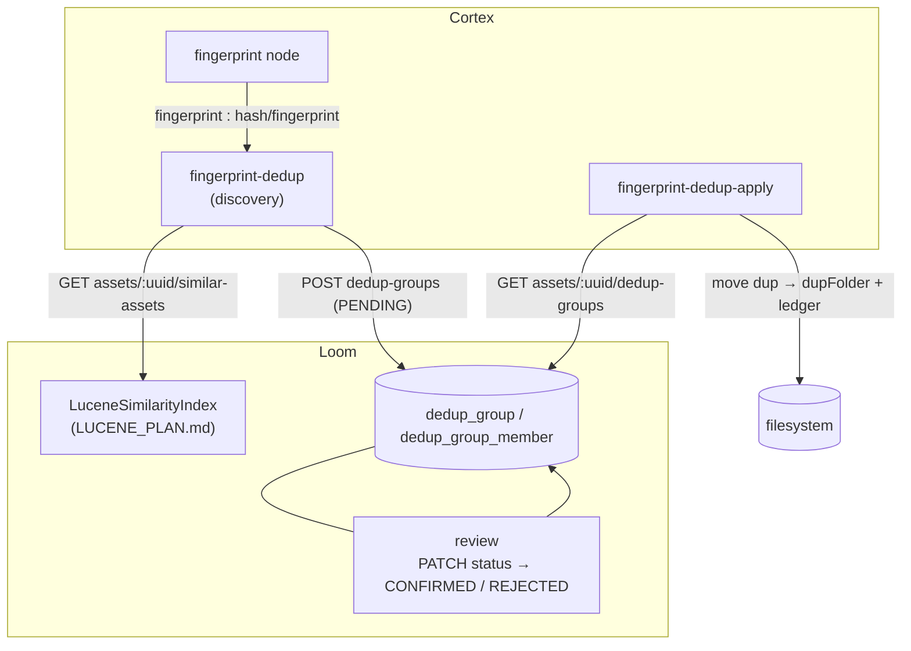

# Deduplication Nodes — Technical Specification

> **Audience: AI coding agents.** The dedup family brings `xdb-clean`'s perceptual-fingerprint
> workflow into MetaLoom, split across **two nodes and a human decision**:
>
> 1. **Discovery** (`fingerprint-dedup`) — finds near-duplicate videos via the Lucene similarity
>    index and writes **candidate groups** to Loom for review. Never touches a file.
> 2. **Review** — a human sets a group `CONFIRMED` or `REJECTED` over REST.
> 3. **Apply** (`fingerprint-dedup-apply`) — reads only **CONFIRMED** groups and moves the duplicates.
>
> Plus `sha512-dedup` / `hash-dedup` (the same class under two kind ids) for exact-hash duplicates.

## 🟢 Status: BUILT end to end — verified at `43ada5a8`

The schema, permissions, DAO, all six REST routes (keyset paged), the DTOs and both clients, **both
Cortex nodes**, the descriptors, the kind bindings, the customer docs **and the review UI** all exist.
Test counts by `@Test`: cortex dedup module **27**, `DedupGroupEndpointTest` **14**,
`DedupGroupDaoTest` **7**, plus `dedup.test.ts` (12), `dedupGroups.test.ts` (17) and
`workflow-dedup-mocked.spec.ts` (6) in loom-ui. The prerequisite similarity index
([../search/LUCENE_PLAN.md](LUCENE_PLAN.md)) is built and is what discovery queries.

The human step lives at `/workflow` → Dedup —
[../workflows/WORKFLOW_DEDUP.md](../workflows/WORKFLOW_DEDUP.md) §4 is its spec; §3.1 below is now a
record of what was built rather than a plan.

⚠️ **Corrections against the previous revision of this file.** It carried a "BUILT" header over a
"§9 — nothing below exists yet" note and a "§13 — Nothing is implemented" line. Those were stale and
are removed. Four further statements were wrong; three have since been *made* true by building them:

| Previously specified | Actually built |
|---|---|
| Website docs still open | `website/content/english/docs/nodes/dedup/index.adoc` **exists** and covers all three kinds; the review screen is documented in `docs/ui/index.adoc` |
| Discovery "skips already-dedupped media" ✅ | 🟢 **True now, but server-side.** `createDedupGroup` compares the incoming member set against the decided groups for that algorithm and answers `200` with the decision instead of creating a second proposal (§3.2) |
| Apply "re-hashes the KEEP correctly before any move" ✅ | 🟢 **True now, and cheaper than a re-hash.** `keepPassesSafeguards` compares the recorded SHA-512 against the KEEP's **stored xattr**, digesting only when no attribute is present (§3.3) |
| Discovery upserts via a client-side idempotency key | Idempotency lives **server-side**: `DedupGroupEndpointService.createDedupGroup` → `findPendingByKeep(keep, algorithm)` → delete + recreate, plus the decided-set guard |
| Kind-id mismatch `hash-dedup` vs `sha512-dedup` still open | **Fixed** — both `@StringKey`s bind `HashDedupNode`; the descriptor advertises `hash-dedup`, `name()` returns `sha512-dedup` |

**Module**: `cortex/nodes/dedup` (aggregator + `core`, no `-api` submodule) ·
**Package**: `io.metaloom.cortex.node.dedup` · **No model, no sidecar.**

General node conventions: [NODES.md](../features/nodes/NODES.md). Ports and content types:
[../pipeline/NODE_DATA_TYPES.md](../features/pipeline/NODE_DATA_TYPES.md) §4.6. Adding a node:
[../../guidelines/NEW_NODE.md](../guidelines/NEW_NODE.md). The dedup entities in the domain model:
[../../loom/DOMAIN.md](../loom/DOMAIN.md). The similarity query this depends on:
[../search/LUCENE_PLAN.md](LUCENE_PLAN.md). Reference algorithm and its safeguards:
`xdb-clean/FPDEDUP_PROCESS.md`. **The code is the source of truth.**

---

## 1. Already implemented

| Item | Where it lives |
|---|---|
| `FingerprintDedupNode` (185 lines) — discovery | `cortex/nodes/dedup/core/src/main/java/io/metaloom/cortex/node/dedup/FingerprintDedupNode.java` |
| `FingerprintDedupApplyNode` (182 lines) — apply | same package, `FingerprintDedupApplyNode.java` |
| `HashDedupNode` (143 lines) — exact-hash dedup, `moveMedia` template | same package, `HashDedupNode.java` |
| `FingerprintDedupDiscoverOptions` (`algorithm`, `scoreThreshold`, `topK`, `allowPartial`, `abortOnLargerDup`) | same package |
| `DedupNodeOptions` (`dupFolder`) — shared by `sha512-dedup` **and** apply | same package |
| Kind bindings `sha512-dedup`, `hash-dedup` (alias), `fingerprint-dedup`, `fingerprint-dedup-apply` | `DedupNodeModule.java` |
| Aggregation into the Dagger graph | `cortex/cli/src/main/java/io/metaloom/cortex/cli/dagger/NodeCollectionModule.java:6,40`; guarded by `NodeRegistrarTest:59-64` |
| 3 descriptors (`hash-dedup`, `fingerprint-dedup`, `fingerprint-dedup-apply`), category `OUTPUT`, `SEQUENTIAL`, concurrency 1 | `loom-shared/node-model/src/main/java/io/metaloom/loom/nodes/spec/DedupDescriptorProvider.java` + `META-INF/services` |
| Migration: `dedup_status` enum, `dedup_group`, `dedup_group_member`, 3 indexes, role CHECK, UNIQUE `(group_uuid, asset_uuid)` | `loom/db/flyway/src/main/resources/db/migration/V2.61__add_dedup_group.sql` |
| Permissions `READ/CREATE/UPDATE/DELETE_DEDUP` (`ALTER TYPE loom_permission`) | `.../V2.62__add_dedup_permission.sql`; enum at `loom/db/api/.../model/perm/Permission.java:221-227` |
| `DedupGroupDao` (10 methods incl. `findPendingByKeep`) + `DedupGroup` / `DedupGroupMember` models | `loom/db/api/src/main/java/io/metaloom/loom/db/model/dedup/` |
| jOOQ impls + generated types (`JooqDedupGroup*`, `JooqDedupStatus`) | `loom/db/jooq/src/main/java/io/metaloom/loom/db/jooq/dao/dedup/`; `loom/db/jooq/src/jooq/java/.../` |
| `DedupGroupEndpoint` (5 routes) + `DedupGroupEndpointService` (215 lines, upsert + validation) | `loom/services/rest/src/main/java/io/metaloom/loom/rest/{endpoint,service}/impl/` |
| `GET /api/v1/assets/:uuid/dedup-groups` | `loom/services/rest/.../endpoint/impl/AssetEndpoint.java:517-522` |
| DTOs `DedupGroup{Create,Update}Request`, `DedupGroup{,List}Response`, `DedupGroupMemberModel` | `loom-shared/rest-model/src/main/java/io/metaloom/loom/rest/model/dedup/` |
| `DedupGroupMethods` (6 methods) + HTTP impl | `loom-client/common/.../method/DedupGroupMethods.java`; `loom-client/rest/.../LoomHttpClientImpl.java:1585-1622` |
| Candidate retrieval (Lucene HNSW k-NN over 256-dim fingerprints) | `loom/services/lucene/.../LuceneSimilarityIndex.java` → `GET /api/v1/assets/:uuid/similar-assets` |
| Tests: `FingerprintDedupNodeTest` (2), `DedupNodeOptionsValidationTest` (5), `FingerprintDedupDiscoverOptionsValidationTest` (4), `DedupGroupEndpointTest` (11), `DedupGroupDaoTest` (6, incl. both delete-cascades) | `cortex/nodes/dedup/core/src/test/…`; `loom/core/src/test/…/DedupGroupEndpointTest.java`; `loom/db/jooq/src/test/…/DedupGroupDaoTest.java` |
| Customer docs | `website/content/english/docs/nodes/dedup/index.adoc` (+ links in `nodes/_index.adoc`) |
| Domain-model rows | [../../loom/DOMAIN.md](../loom/DOMAIN.md) §Dedup Group / Dedup Group Member (V2.61) |
| Catalogue rows | [NODES.md](../features/nodes/NODES.md) §2/§3/§5; [../pipeline/NODE_DATA_TYPES.md](../features/pipeline/NODE_DATA_TYPES.md) §4.6 |

### 1.1 The review model (as built)

```sql
CREATE TYPE "dedup_status" AS ENUM ('PENDING', 'CONFIRMED', 'REJECTED');

dedup_group        (uuid PK, algorithm, status, keep_asset_uuid → asset ON DELETE SET NULL,
                    score real, meta jsonb, created, creator_uuid, edited, editor_uuid)
dedup_group_member (uuid PK, group_uuid → dedup_group CASCADE, asset_uuid → asset CASCADE,
                    role CHECK IN ('KEEP','DUP'), score real, size bigint, zero_chunk_count bigint,
                    UNIQUE (group_uuid, asset_uuid))
```

One group = one candidate set (exactly one `KEEP` + N `DUP`). `keep_asset_uuid` is denormalised for
convenience; the authoritative KEEP is the member with `role='KEEP'` — the DAO keeps them consistent.
`SET NULL` on the keep but `CASCADE` on members: deleting the kept asset must not silently erase the
review record, but a membership row without its asset is meaningless. `size` / `zero_chunk_count` are
**discovery-time snapshots** for the review UI and the apply-node safeguards; apply re-verifies
against the live file regardless.

`creator_uuid` / `editor_uuid` are **nullable** — a Cortex worker is not a user
([../../loom/DOMAIN.md](../loom/DOMAIN.md)).

### 1.2 REST surface

| Method & path | Purpose | Permission |
|---|---|---|
| `POST /api/v1/dedup-groups` | Create (discovery node). **Upsert**: an existing PENDING group with the same keep+algorithm is deleted and recreated; a decided group is never reopened. `201` | `CREATE_DEDUP` |
| `GET /api/v1/dedup-groups?status=PENDING` | The review queue | `READ_DEDUP` |
| `GET /api/v1/dedup-groups/:uuid` | One group + members | `READ_DEDUP` |
| `PATCH /api/v1/dedup-groups/:uuid` | Confirm / reject, optionally reassign the KEEP | `UPDATE_DEDUP` |
| `DELETE /api/v1/dedup-groups/:uuid` | Remove a group | `DELETE_DEDUP` |
| `GET /api/v1/assets/:uuid/dedup-groups` | Groups involving one asset (what apply calls) | `READ_DEDUP` |

Validation: `400` on blank algorithm, empty member list, bad role, bad uuid or bad status; `404` on an
unknown group. ⚠️ `GET` **without** a `status` param concatenates the PENDING, CONFIRMED and REJECTED
lists — no combined ordering and no pagination (§3.4).

### 1.3 What each node actually does

**`fingerprint-dedup` (discovery)** — `isProcessable` = `media().isVideo()`. Skips when offline, when
the asset is unknown to Loom, or when `asset.getFingerprint().getFingerprintV1()` is null. Otherwise:

1. `client().listSimilarAssets(uuid, algorithm, topK, scoreThreshold)` → Lucene k-NN hits.
2. Candidate set = the query asset (score `1.0`) + each hit, **self-excluded by uuid**; each hit is
   loaded with `loadAsset` for its size and `zeroChunkCount`.
3. **KEEP = the largest *complete* candidate** (`zeroChunkCount` null or `0`). If none is complete →
   skip, unless `allowPartial`, in which case the largest overall wins.
4. Every other candidate becomes a `DUP`. 🔴 If `abortOnLargerDup` (default) and **any** DUP is larger
   than the KEEP, the whole group is abandoned — never propose discarding the bigger file.
5. `createDedupGroup(...)` with group `score` = the **minimum** member score, `status=PENDING`.
6. `recordNodeResult(SUCCESS, "<n> duplicate candidate(s)", algorithm, resultRef("dedup_group", uuid))`.
7. **No file is read, moved or altered.**

**`fingerprint-dedup-apply`** — `isProcessable` = media has a SHA-512. `listAssetDedupGroups(uuid)`,
then for each group: skip unless `status == "CONFIRMED"` **and** this asset is a member with
`role='DUP'`. Load the KEEP and re-verify it live: exists on disk, `zeroChunkCount` null or `0`,
`size >= dup size`, and not itself inside `dupFolder`. Idempotent: a dup already inside `dupFolder` is
skipped. Then `FileUtils.autoRotate` + `moveFile` (dry-run aware) and a ledger-only
`recordNodeResult(SUCCESS, "fpdup of <keepPath>")`.

**`sha512-dedup` / `hash-dedup`** — `HashDedupNode`: if Loom already knows an asset for this SHA-512
and its recorded file exists at a *different* path with the same hash, move the local copy into
`dupFolder` and record a ledger row.

---

## 2. Architecture



---

## 3. Open work

### 3.1 🟢 The dedup review UI — built

The human step is `DeduplicationMode` in `loom-ui/src/features/workflow/WorkflowView.tsx` (route
`/workflow`), backed by `loom-ui/src/api/dedup.ts` and the pure helpers in
`loom-ui/src/features/workflow/dedupGroups.ts`. It loads `GET /dedup-groups?status=PENDING`, shows
each member's size, completeness and score, offers **Keep this one** per candidate, and PATCHes
`Y`/`N` with a visible rollback when the write fails. All four DEDUP permissions are now `ui:yes`,
present in the ACL matrix and granted in the demo roles.

Everything about the screen, its test ids and its three easy-to-get-wrong details lives in
[../workflows/WORKFLOW_DEDUP.md](../workflows/WORKFLOW_DEDUP.md) §4 — not repeated here.

### 3.2 🟢 A decided candidate set is never re-proposed

`DedupGroupEndpointService.createDedupGroup` compares the incoming member set against
`DedupGroupDao.listDecidedByAssets(memberUuids, algorithm)`. On an exact set match it writes nothing
and answers **200** with the decided group; a fresh proposal still answers **201**.
`FingerprintDedupNode` reads the returned `status` and reports `skipped` rather than recording a
SUCCESS ledger row for a no-op.

⚠️ Two deliberate choices, both testable:

- **The comparison is on the whole member set**, not "this asset appears in a decided group" — the
  latter would suppress a genuinely new duplicate of an already-reviewed file.
- **Roles are ignored.** After a KEEP reassignment the same two files can come back with roles
  swapped; that is still the same decision.

Covered by `DedupGroupDaoTest.testListDecidedByAssetsFindsOnlySettledGroups`,
`DedupGroupEndpointTest.testDecidedGroupsAreNeverReProposed` /
`testANewCandidateSetIsStillProposedAfterADecision`, and
`FingerprintDedupNodeTest.testSkipsWhenTheCandidateSetWasAlreadyDecided`.

### 3.3 🟢 Apply verifies the KEEP's content

`keepPassesSafeguards` gained a fifth check after existence / completeness / size / folder: the
KEEP's recorded SHA-512 must still match the file. This is what protects against a keep whose bytes
changed between discovery and apply — existence, size and completeness all still hold for a file
replaced in place, and that file is no longer the duplicate's counterpart.

⚠️ **It trusts the xattr, and is not an unconditional re-hash.** `hashOf()` goes through
`LoomMediaImpl.getSHA512()`, which reads `loom_sha512` (and the legacy `sha512sum` key) and digests
only when neither attribute is present — writing it back for next time. Two non-failures by design:
an asset with **no** recorded hash passes the check (there is nothing to compare against, and
re-digesting would only produce a number to ignore), and a filesystem with no user-xattr support
falls back to a direct digest rather than blocking every move on the storage backend.

`FingerprintDedupApplyNodeTest.testAKeepWhoseContentChangedBlocksTheMove` writes a same-length,
different-content keep, so it fails on content and nothing else.

### 3.4 Smaller gaps

- [x] 🟢 **Apply-node tests.** `FingerprintDedupApplyNodeTest` (11) covers the confirmed-only gating,
      all five safeguards and the idempotent skip; `HashDedupNodeTest` (4) has real bodies.
- [ ] **No per-node E2E.** Nothing under `integration-test/` or `e2e-test/` mentions dedup, and
      `NodePortConformanceTest` has no dedup case. The target: two near-identical demo videos →
      fingerprinted → discovery produces a PENDING group → `PATCH` CONFIRMED → apply moves the DUP
      into `dupFolder` and writes a ledger row → re-running apply is a no-op.
- [x] 🟢 **Demo data.** `DemoDatabaseInitializer.seedDemoDedupGroup` seeds one **PENDING** group over
      two demo videos. Deliberately never CONFIRMED — the demo container's media exists as database
      rows only, so a confirmed group would instruct the apply node to move fiction.
- [x] 🟢 **`HashDedupNode` no longer blocks.** The size-mismatch branch logs both paths at `error` and
      returns `skipped`; `HashDedupNodeTest`'s `@Timeout(10)` fails by hanging if it ever comes back.
- [ ] **Discovery options are unreachable from the pipeline editor.** `DedupDescriptorProvider`
      exposes only `enabled` and `dupFolder`; `algorithm`, `topK`, `scoreThreshold`, `allowPartial`
      and `abortOnLargerDup` are **not** descriptor parameters, so they are YAML-only.
- [x] 🟢 **`GET /api/v1/dedup-groups` is keyset paged** (`?limit=`/`?from=`, default 25) and answers
      one globally ordered query with or without `status`. `DedupGroupDao.loadPage` is bespoke
      (`NotificationDaoImpl` is the template) because `AbstractJooqDao.getField(SortKey)` casts every
      sort column to `Field<UUID>` and would throw on `created`.
- [ ] ⚠️ **`PATCH keepAssetUuid` does not rewrite `dedup_group_member.role`.** Pointer and roles
      diverge after a reassignment, so readers must prefer `keepAssetUuid`. Rewriting the roles
      server-side is the real fix.
- [ ] **`toResponse` is N+1** — one `loadMembers` query per group. Bounded by the page size now, but
      still a join waiting to be written.
- [ ] **Thumbnail dominant-colour safeguard not carried over.** `xdb-clean` compares generated
      thumbnails before declaring a near-duplicate; MetaLoom gates on fingerprint score plus
      size/completeness only. A deliberate gap, recorded here so it is not rediscovered as a bug.
- [ ] **Partial-file handling is simplified.** MetaLoom has a single `is_complete` /
      `zero_chunk_count` signal, not `xdb-clean`'s multi-partial ranking.
- [ ] **Delta / incremental sync deferred.** Apply does an idempotent per-asset fetch every run. When
      corpus size makes that expensive, add a worker-side processed-group index (the
      `S3DifferentialScanner` Avro pattern) plus `GET /api/v1/dedup-groups?confirmedAfter=`.
- [ ] **Stale internal doc**: `loom/doc/src/main/docs/cortex/nodes/index.adoc:109-124` lists only
      `hash-dedup` and `fingerprint-dedup` — no `fingerprint-dedup-apply`.

---

## 4. Configuration

Three node-options keys, all YAML/pipeline-JSON only. **The dedup module reads no environment
variables.**

| Options key | Option | Type | Default | Meaning |
|---|---|---|---|---|
| `dedup` (`sha512-dedup` / `hash-dedup`) | `dupFolder` | Path | `duplicates` | Where duplicates are moved |
| `fingerprint-dedup-apply` | `dupFolder` | Path | `duplicates` | Same class, `DedupNodeOptions` |
| `fingerprint-dedup` | `algorithm` | String | `metaloom-multisector-v1` | Similarity index algorithm; must be non-blank |
| | `scoreThreshold` | float | `0.10` | k-NN cutoff; must be `>= 0` |
| | `topK` | int | `10` | Neighbours requested; must be `> 0` |
| | `allowPartial` | boolean | `false` | Allow a group when no candidate is complete |
| | `abortOnLargerDup` | boolean | `true` | Abandon the group if any DUP is larger than the KEEP |

All three inherit `enabled`, `processIncomplete`, `retryFailed`, `timeoutMs` from `AbstractNodeOptions`.
`CortexOptions` sets a per-node timeout default of `60000` ms for the `dedup` key.

The only **environment variable** that gates this feature end to end is on the Loom side:

| Var | Default | Effect |
|---|---|---|
| `LOOM_SIMILARITY_ENABLED` | see [../search/LUCENE_PLAN.md](LUCENE_PLAN.md) | When false, `NoopSimilarityIndex` is bound and the similarity routes answer **503** (deliberately not an empty list) — so `fingerprint-dedup` fails loudly rather than silently finding nothing |

---

## 5. Test setup

| Test | Covers |
|---|---|
| `FingerprintDedupNodeTest` (3) | `testReportsGroupWithLargerKeep` — correct KEEP/DUP split; `testAbortsWhenDuplicateLargerThanKeep` — skipped and `createDedupGroup` never called; `testSkipsWhenTheCandidateSetWasAlreadyDecided` — a non-PENDING response writes no ledger row. Mockito over `LoomHttpClient` |
| `FingerprintDedupApplyNodeTest` (11) | Confirmed DUP moves; **PENDING and REJECTED never move**; the KEEP of a confirmed group is never moved; missing / incomplete / smaller / **content-changed** KEEP each block; a KEEP with no recorded hash still applies; an already-moved dup is an idempotent skip |
| `HashDedupNodeTest` (4) | Known-file move; **size mismatch skips instead of blocking** (`@Timeout(10)` is the real assertion); same-file no-op; unknown file skipped |
| `DedupNodeOptionsValidationTest` (5), `FingerprintDedupDiscoverOptionsValidationTest` (4) | Option validation |
| `DedupGroupDaoTest` (7) | Store/load, `listByStatus` + `listByAsset`, `findPendingByKeep` + `updateStatus`, **`listDecidedByAssets`** (PENDING excluded, other algorithms excluded), invalid-role rejection, 🔴 **group-delete cascade**, 🔴 **asset-delete removes memberships and nulls `keep_asset_uuid`** |
| `DedupGroupEndpointTest` (14) | Create + load, PENDING idempotency, **decided sets answer 200 and write nothing**, **a different set still answers 201**, **keyset paging (page size, totalCount, no overlap across `?from=`)**, confirm/reject, list-by-asset, delete, invalid status, empty-members rejection, `404`, all routes require permissions (`403`), **`READ_DEDUP` does not grant `UPDATE`**, asset-delete cascade through the API |
| `NodeRegistrarTest:59-64` | `sha512-dedup`, `fingerprint-dedup`, `fingerprint-dedup-apply` are registered kinds (`hash-dedup` is not asserted) |
| loom-ui | `dedup.test.ts` (12), `dedupGroups.test.ts` (17), `workflow-dedup-mocked.spec.ts` (6) — see [../workflows/WORKFLOW_DEDUP.md](../workflows/WORKFLOW_DEDUP.md) §7 |
| — **missing** — | Any integration/E2E test (§3.4) |

```bash
mvn -pl cortex/nodes/dedup/core -am test
mvn -pl loom/db/jooq test -Dtest=DedupGroupDaoTest
mvn -pl loom/core test -Dtest=DedupGroupEndpointTest
mvn -pl cortex/cli test -Dtest=NodeRegistrarTest
```

🔴 `./setup-pool.sh` before any DAO or endpoint test, and **after** any Flyway change — install
`loom/db/flyway` first or the pool silently skips the new migration. Regenerate jOOQ with
`loom/db/jooq/generate.sh` after a schema change. Grant test permissions via **group + role**, never a
direct `user_permission` grant (one direct grant per user — see `SkillEndpointTest` for the pattern).

---

## 6. Conventions and Gotchas

| Area | Gotcha |
|---|---|
| **Two lifecycles** | 🔴 Discovery writes review items; apply acts on human decisions. Never let discovery move files, and never let apply act on `PENDING` or `REJECTED`. |
| **Live re-verification** | 🔴 The `size` / `zero_chunk_count` columns are discovery-time **snapshots** — hints for the UI, not authority. Apply re-checks the live file: existence, completeness, size, folder **and content** (§3.3). |
| **Trust the xattr, do not re-hash** | ⚠️ The content check reads the stored `loom_sha512` attribute and digests only when none exists. A missing *recorded* hash passes; a missing xattr *layer* falls back to a direct digest. Neither is a mismatch (§3.3). |
| **Larger DUP aborts the group** | ⚠️ Not "drop that member" — the *whole* group is abandoned. A duplicate bigger than the keep means the keep selection is wrong, not that one member is odd. |
| **Idempotency is server-side** | ⚠️ Both halves live in `DedupGroupEndpointService.createDedupGroup`: the PENDING upsert (delete + recreate) **and** the decided-set guard. Not in the node. Do not add a client-side key. |
| **A 200 from POST is not a discovery** | ⚠️ §3.2 — `201` means proposed, `200` means the candidate set was already decided and nothing was written. A node that ignores the status reports a phantom find on every run. |
| **`hash-dedup` vs `sha512-dedup`** | ⚠️ Two `@StringKey`s onto **one** `HashDedupNode`. The descriptor advertises `hash-dedup`; `name()` returns `sha512-dedup`, so ledger rows say `sha512-dedup` whichever id was placed. Do not "fix" this by renaming — it is a deliberate alias. |
| **`sha512-dedup` has no descriptor** | ⚠️ It is runnable but cannot be placed from the UI palette ([../pipeline/NODE_DATA_TYPES.md](../features/pipeline/NODE_DATA_TYPES.md) §3.3). |
| **No in-memory DAO** | ⚠️ `loom/db/memory` does not mirror `DedupGroupDao` — deliberate, following the `AssetNodeResultDao` precedent. The jOOQ impl is exercised against the pooled database. |
| **First asset-to-asset relation** | 🔴 `dedup_group` / `dedup_group_member` is the schema's first asset-to-asset relation. Respect the cascade split: `SET NULL` on `keep_asset_uuid`, `CASCADE` on members. |
| **Offline mode** | ⚠️ Both fingerprint nodes are no-ops when `client() == null` or offline — the whole workflow requires Loom **and** an enabled similarity index. |
| **Thumbnail safeguard dropped** | ⚠️ Near-duplicates are gated by fingerprint score + size/completeness only (§3.4). |
| **`System.in.read()`** | 🔴 `HashDedupNode` *used to* halt on a size mismatch waiting for a keypress; it now logs and skips. Never put an interactive read in a worker node — `HashDedupNodeTest`'s `@Timeout` is there to catch a relapse. |
| **`keepAssetUuid` vs `role`** | 🔴 `updateStatus` writes only the denormalised pointer, so a reviewer's KEEP reassignment leaves the member roles describing the machine's original choice. Readers prefer `keepAssetUuid` when set. |

---

## 7. Key Classes Reference

| Class | Package / module | Purpose |
|---|---|---|
| `FingerprintDedupNode` | `io.metaloom.cortex.node.dedup` (`cortex/nodes/dedup/core`) | Discovery — similarity query → PENDING group |
| `FingerprintDedupApplyNode` | same | Apply — CONFIRMED groups → move the dup |
| `HashDedupNode` | same | Exact-hash dedup; `moveMedia` template |
| `FingerprintDedupDiscoverOptions` | same | Discovery options (key `fingerprint-dedup`) |
| `DedupNodeOptions` | same | `dupFolder`; shared by `sha512-dedup` and apply |
| `DedupNodeModule` | same | Dagger — four `@StringKey` bindings + option deserializers |
| `DedupDescriptorProvider` | `io.metaloom.loom.nodes.spec` (`loom-shared/node-model`) | The three UI/validation descriptors |
| `DedupGroupDao` / `DedupGroup` / `DedupGroupMember` | `io.metaloom.loom.db.model.dedup` (`loom/db/api`) | Review-record persistence contract |
| `DedupGroupDaoImpl` | `io.metaloom.loom.db.jooq.dao.dedup` (`loom/db/jooq`) | jOOQ impl (no memory impl) |
| `DedupGroupEndpoint` / `DedupGroupEndpointService` | `io.metaloom.loom.rest.{endpoint,service}.impl` | The five `/dedup-groups` routes + upsert logic |
| `AssetEndpoint` | same | Hosts `GET /assets/:uuid/dedup-groups` |
| `DedupGroup*Request/Response`, `DedupGroupMemberModel` | `io.metaloom.loom.rest.model.dedup` (`loom-shared/rest-model`) | DTOs; `ROLE_KEEP` / `ROLE_DUP` constants |
| `DedupGroupMethods` | `io.metaloom.loom.client.common.method` | Client interface (6 methods) |
| `SimilarityMethods.listSimilarAssets` | same | The candidate query ([../search/LUCENE_PLAN.md](LUCENE_PLAN.md)) |
| `LuceneSimilarityIndex` | `io.metaloom.loom.similarity.lucene` (`loom/services/lucene`) | HNSW k-NN over `MultiSectorFingerprint` vectors |
| `AbstractMediaNode` | `io.metaloom.cortex.common.node` | Lifecycle + `recordNodeResult` / `resultRef` |
| `FileUtils` | `io.metaloom.utils.fs` (utils) | `autoRotate` + `moveFile` |
| `WorkflowView` | `loom-ui/src/features/workflow/` | 🔴 The **mock** review screen (§3.1) |

---

## 8. Where do I find …?

| Need | Look here |
|---|---|
| The reference algorithm and its safeguards | `xdb-clean/FPDEDUP_PROCESS.md` |
| The similarity query this depends on | [../search/LUCENE_PLAN.md](LUCENE_PLAN.md) |
| The dedup entities in the domain model | [../../loom/DOMAIN.md](../loom/DOMAIN.md) |
| The three node classes | `cortex/nodes/dedup/core/src/main/java/io/metaloom/cortex/node/dedup/` |
| Kind registration | `DedupNodeModule` (`@StringKey`) + `cortex/cli/.../dagger/NodeCollectionModule.java` |
| Descriptors / UI palette | `loom-shared/node-model/.../spec/DedupDescriptorProvider.java` + `META-INF/services` |
| Port ids and content types | [../pipeline/NODE_DATA_TYPES.md](../features/pipeline/NODE_DATA_TYPES.md) §4.6 |
| Node write-back / ledger pattern | [NODES.md](../features/nodes/NODES.md) §2; `AbstractMediaNode.recordNodeResult` |
| How to add a node at all | [../../guidelines/NEW_NODE.md](../guidelines/NEW_NODE.md) |
| Schema + permissions | `loom/db/flyway/.../V2.61__add_dedup_group.sql`, `V2.62__add_dedup_permission.sql` |
| Asset completeness fields | `loom/db/flyway/.../V2.46__asset_identity.sql` |
| Permission model and test grants | [../permissions/PERMISSIONS.md](../features/permissions/PERMISSIONS.md) |
| REST / DAO conventions, definition of done | [../../guidelines/CODING.md](../guidelines/CODING.md); [../../loom/RESTAPI.md](../loom/RESTAPI.md); [../../loom/PERSISTENCE.md](../loom/PERSISTENCE.md) |
| The review screen that must be replaced | `loom-ui/src/features/workflow/WorkflowView.tsx` |
| Customer docs | `website/content/english/docs/nodes/dedup/index.adoc` |

---

## 9. Progress Assessment

### Prerequisite
- [x] Fingerprint similarity index — built end to end ([../search/LUCENE_PLAN.md](LUCENE_PLAN.md))

### Loom backend
- [x] `V2.61` — `dedup_status`, `dedup_group`, `dedup_group_member`, indexes, role CHECK, UNIQUE
- [x] `V2.62` + `Permission` enum — `READ/CREATE/UPDATE/DELETE_DEDUP`
- [x] `DedupGroupDao` (api + jOOQ) with `findPendingByKeep`, `listDecidedByAssets` and a keyset `loadPage`; delete-cascade tests green (memory impl deliberately skipped)
- [x] Five `/api/v1/dedup-groups` routes + `GET /api/v1/assets/:uuid/dedup-groups`, server-side PENDING upsert **and** decided-set guard
- [x] Keyset paging on the list route; the endpoint is in `LoomOpenAPI` and `openapi.json`
- [x] DTOs + `DedupGroupMethods` client + HTTP impl + the Python mirror
- [x] `DedupGroupEndpointTest` (14) incl. RBAC, cascade, paging and the re-proposal guard; `DedupGroupDaoTest` (7)
- [x] Demo data: one PENDING group (`seedDemoDedupGroup`); `READ_DEDUP`/`UPDATE_DEDUP` granted to the demo Editor role

### Cortex nodes
- [x] `FingerprintDedupNode` (discovery) + `FingerprintDedupDiscoverOptions`, reporting a decided set as `skipped`
- [x] `FingerprintDedupApplyNode` reusing `DedupNodeOptions`, with live KEEP safeguards incl. the content check, and an idempotent skip
- [x] `HashDedupNode` logs and skips a size mismatch instead of blocking on `System.in.read()`
- [x] Four kind bindings incl. the `hash-dedup` ↔ `sha512-dedup` alias fix
- [x] Three descriptors + `META-INF/services`
- [x] 27 module tests (discovery split, larger-dup abort, decided-set skip, all apply-node paths, hash-dedup, both option validators)
- [ ] Per-node E2E in `integration-test` (§3.4)

### UI
- [x] `loom-ui/src/api/dedup.ts` + `features/workflow/dedupGroups.ts`; wired `DeduplicationMode` with optimistic write and rollback
- [x] `PERMISSION_GROUPS` group `Deduplication` + `admin.roles.permission.*_DEDUP` in both locales
- [x] `dedup.test.ts` (12), `dedupGroups.test.ts` (17), `workflow-dedup-mocked.spec.ts` (6)

### Docs
- [x] `website/content/english/docs/nodes/dedup/index.adoc`
- [x] `website/content/english/docs/ui/index.adoc` §Reviewing Duplicates — the first customer doc for any workflow
- [x] [NODES.md](../features/nodes/NODES.md) §2/§3/§5 rows; [../pipeline/NODE_DATA_TYPES.md](../features/pipeline/NODE_DATA_TYPES.md) §4.6; [../../loom/DOMAIN.md](../loom/DOMAIN.md)
- [ ] `loom/doc/.../cortex/nodes/index.adoc` still omits `fingerprint-dedup-apply` (§3.4)

### Open
- [ ] ⚠️ `PATCH keepAssetUuid` does not rewrite `dedup_group_member.role` (§3.4, §6)
- [ ] Per-node E2E; discovery options as descriptor parameters (§3.4)
- [ ] `toResponse` N+1 on member loads (§3.4)
- [ ] Thumbnail dominant-colour safeguard; multi-partial ranking; delta sync (§3.4)

---
_Git HEAD revision: `43ada5a8`_
_Last updated: 2026-08-08 (decided-set guard, xattr-trusted KEEP verification, `System.in.read()` fix,
keyset paging, apply-node + hash-dedup tests, demo data and the review UI all landed)_