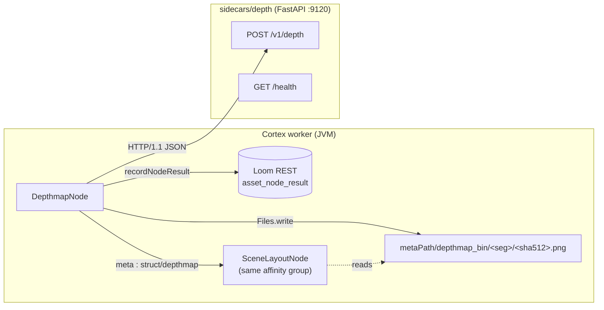

# Depth Map Node — Technical Specification

> **Audience: AI coding agents.** The Cortex `depthmap` node: monocular depth estimation for a single
> image via an HTTP sidecar, written as a 16-bit PNG on the worker and recorded in the ledger.

## 🟢 Status: BUILT — verified at `499f71f7`

The node, the sidecar, the Dagger kind binding, the descriptor, the customer docs and the tests all
exist in the tree. **29 unit tests + 1 integration test.** There is nothing left to design here; §1
is an inventory, not a proposal. The remaining work is listed in §5 and is all *operational*
(container image, licence page, a run against a real GPU) — no Java or Python is missing.

⚠️ **Correction against the previous revision of this file.** It carried an "implemented" header over
sections still marked *"Status: not built"* (§6 sidecar), *"not implemented"* (§7 node) and *"not
written"* (§9 tests). Those were stale and are removed. Two further statements were wrong:

| Previously specified | Actually built |
|---|---|
| Output keys `depthmap_flag` / `depthmap_path` / `depthmap_meta` (`NodeOutputKey`) | **Typed ports**: `media` in; `meta`, `map`, `flag` out (`InputPort`/`OutputPort` + `ContentTypeRegistry`) |
| `VlmImages` reused for image handling; JPEG base64 | Local **`DepthImages`** helper, **PNG** (JPEG blocking artifacts become spurious depth edges) |
| `loom-ui` `ICON_MAP` gains `layers` | 🔴 `PipelineEditor.tsx` has **no `ICON_MAP`** — the palette is descriptor-driven. The checklist line was fiction |

**Node kind**: `depthmap` · **Module**: `cortex/nodes/depthmap` (aggregator + `core`, no `api`
submodule) · **Package**: `io.metaloom.cortex.node.depthmap` · **Sidecar**: `sidecars/depth` (:9120).

**Consumer**: [NODE_SCENE_LAYOUT_PLAN.md](NODE_SCENE_LAYOUT_PLAN.md). The node system as a whole is
[NODES.md](NODES.md); ports and content types are [../pipeline/NODE_DATA_TYPES.md](../pipeline/NODE_DATA_TYPES.md);
the recipe for adding a node is [../../guidelines/NEW_NODE.md](../../guidelines/NEW_NODE.md).
**The code under `cortex/` and `sidecars/depth/` is the source of truth.**

---

## 1. Already implemented

| Item | Where it lives |
|---|---|
| `DepthmapNode` (216 lines) — lifecycle, cache, PNG write, ledger | `cortex/nodes/depthmap/core/src/main/java/io/metaloom/cortex/node/depthmap/DepthmapNode.java` |
| `DepthmapClient` — JDK `HttpClient`, forced HTTP/1.1, non-final for test subclassing | same package, `DepthmapClient.java` |
| `DepthmapNodeOptions` (`KEY="depthmap"`) + `validate()` | same package, `DepthmapNodeOptions.java` |
| `DepthMode { RELATIVE, METRIC }` | same package, `DepthMode.java` |
| `DepthImages` — ImageIO read / downscale / base64 **PNG**, no OpenCV | same package, `DepthImages.java` |
| `DepthmapNodeModule` — `@Binds @IntoSet`, **`@Binds @IntoMap @StringKey("depthmap")`**, option-deserializer info, `@Provides` options + client | same package, `DepthmapNodeModule.java` |
| Typed ports: `media : media/image` → `meta : struct/depthmap`, `map : artifact/image`, `flag : scalar/string` | `DepthmapNode.IN_MEDIA` / `OUT_META` / `OUT_MAP` / `OUT_FLAG` |
| `ContentTypeRegistry.STRUCT_DEPTHMAP = "struct/depthmap"` + its `all()` entry | `loom-shared/node-model/src/main/java/io/metaloom/loom/nodes/spec/ContentTypeRegistry.java:71,128` |
| `DepthmapDescriptorProvider` (icon `layers`, `ANALYSIS`, `PARALLEL`, concurrency 1) + `META-INF/services` entry | `loom-shared/node-model/src/main/java/io/metaloom/loom/nodes/spec/DepthmapDescriptorProvider.java` |
| Module aggregation | `cortex/nodes/pom.xml:33`; `cortex/processor/pom.xml:148`; `integration-test/pom.xml:174` |
| Kind registration | `cortex/cli/src/main/java/io/metaloom/cortex/cli/dagger/NodeCollectionModule.java:7,54`; guarded by `NodeRegistrarTest:60` |
| **Sidecar** `server.py` (FastAPI), `README.md`, `requirements.txt`, `setup.sh`, `run.sh` | `sidecars/depth/`; port row in `sidecars/README.md:22` |
| Sidecar endpoints `GET /health`, `POST /v1/depth`; lazy per-model `transformers` pipeline cache | `sidecars/depth/server.py` |
| NEARNESS normalization (`_normalize`) + 16-bit PNG encode (`_encode_png16`, `cv2.imencode`) | `sidecars/depth/server.py:121,147` |
| Unit tests — `DepthmapNodeTest` (12), `DepthmapOptionsValidationTest` (8), `DepthmapNodePipelineTest` (6), `DepthmapNodePersistenceTest` (3) + `DepthmapTestFixtures`, `assertj/` helpers | `cortex/nodes/depthmap/core/src/test/java/io/metaloom/cortex/node/depthmap/` |
| Integration test (stubbed client, real in-process Loom, ledger read back over REST) | `integration-test/src/test/java/io/metaloom/loom/test/integration/node/DepthmapNodeIntegrationTest.java` |
| Port-conformance + descriptor-count guards | `integration-test/.../node/NodePortConformanceTest.java:73`; `loom-shared/node-model/.../NodeDescriptorServiceLoaderTest.java:85` |
| Customer docs | `website/content/english/docs/nodes/depthmap/index.adoc` (+ 3 links in `nodes/_index.adoc`) |
| Catalogue rows | [NODES.md](NODES.md) §2/§3/§5/§12; [../pipeline/NODE_DATA_TYPES.md](../pipeline/NODE_DATA_TYPES.md) §4 |

### 1.1 What the node actually does

1. `isProcessable` → `options().isEnabled() && ctx.media().isImage()`. **Video is refused by design.**
2. `LocalResultCache<String>` (10 000 entries, keyed on `media.absolutePath()`) holds the `meta` JSON.
   A hit re-checks `Files.exists(meta.path)` and falls through to recompute if the artifact is gone.
3. `DepthImages.read` → `downscale(maxDim)` → base64 PNG → `POST /v1/depth`.
4. 🔴 The response's `convention` is **hard-validated** against `NEARNESS`; anything else throws
   rather than guessing which direction "closer" is.
5. Bytes land at `metaPath/depthmap_bin/<segment>/<sha512>.png` (`HashUtils.segmentPath`).
6. Emits `flag="DONE"`, `map=<absolute path>`, `meta=<JSON>`; `recordNodeResult(SUCCESS, reason=null,
   producerVersion=<model id>, resultRef=null)` — **ledger only**.
7. Failure → `flag="FAILED"` + a `FAILED` ledger row carrying the model id.

`meta` JSON keys: `model`, `convention`, `source`, `width`/`height` (**the map's** dimensions),
`imageWidth`/`imageHeight` (**the source image's**), `path`, optional `stats` (p05/p50/p95) and
optional `metric` (`min_m`/`max_m`).

### 1.2 The one convention that matters

> **NEARNESS.** `[0,1]`, **1 = nearest to the camera**, encoded as 16-bit grayscale PNG where
> `65535` = nearest. Relative models (disparity, bigger = nearer) are min-max normalized; metric
> models are min-max normalized **and inverted**, with the metre range reported separately.

Normalization happens **in the sidecar**, once, so no Java consumer ever has to know what the model
natively emitted. 16 bits rather than 8 because 256 levels collapse two similarly-distant objects
into one bucket and the downstream relation degrades to `SAME_DEPTH`.

### 1.3 Model choice — resolved, not open

No `TODO`/`FIXME` remains in `cortex/nodes/depthmap/` or `sidecars/depth/`.

| Mode | Model | Licence |
|---|---|---|
| `RELATIVE` (default) | **`depth-anything/Depth-Anything-V2-Small-hf`** (~25M ViT-S, CPU-viable) | **Apache-2.0** |
| `METRIC` (opt-in) | `Intel/zoedepth-nyu-kitti` | MIT |
| Quality upgrade path (documented, not wired) | `Intel/dpt-large` (MiDaS 3.0) | permissive |

🔴 Rejected and flagged in `sidecars/depth/README.md` **and** `setup.sh`: Depth-Anything-V2
**Base/Large** are `CC-BY-NC-4.0` (non-commercial) — Small is the only Apache-2.0 family member, which
is precisely why it is the default. Apple Depth Pro is research-only; Marigold is diffusion-based and
far too slow for batch. In-JVM inference (ONNX/DJL) was rejected — the sidecar is the house style.

---

## 2. Architecture



Loom has **no byte-ingest endpoint for produced derivatives**, so the PNG stays worker-local and only
the ledger marker reaches Loom — the same shape as `thumbnail`, `tts`, `imagegen`, `videogen` and
`watermark` ([NODES.md](NODES.md) §2.1). That is a deliberate, accepted decision, and its consequence
is the affinity rule in §6.

---

## 3. Configuration

### 3.1 Node options (`nodes.depthmap.*`, deserialized into `DepthmapNodeOptions`)

| Option | Type | Default | Meaning |
|---|---|---|---|
| `enabled` | boolean | `true` | inherited from `AbstractNodeOptions` |
| `processIncomplete` | boolean | `false` | inherited |
| `retryFailed` | boolean | `false` | inherited |
| `depthHost` | String | `localhost` | Sidecar host |
| `depthPort` | int | `9120` | Sidecar port |
| `mode` | `DepthMode` | `RELATIVE` | `RELATIVE` \| `METRIC` (adds `metric.min_m`/`max_m`) |
| `model` | String | `null` | Per-node checkpoint override; `null` = the sidecar's default for the mode |
| `maxDim` | int | `1024` | Longest side sent to the sidecar; also the returned map's longest side |
| `timeoutMs` | long | `120000` | **Inherited** from `AbstractNodeOptions`; the 120 s default is set in the node's constructor |

`validate()` rejects a blank host, a non-positive port / `maxDim` / `timeoutMs`, and a null `mode`.
**The Java module reads no environment variables at all.**

### 3.2 Sidecar environment variables (`sidecars/depth/`)

| Var | Default | Meaning |
|---|---|---|
| `DEPTH_HOST` | `0.0.0.0` | Listener bind address |
| `DEPTH_PORT` | `9120` | Listener port (tts 9100, sentiment 9110, **depth 9120**, imagegen 9200/9210, videogen 9220) |
| `DEPTH_MODEL` | `depth-anything/Depth-Anything-V2-Small-hf` | Relative checkpoint |
| `DEPTH_MODEL_METRIC` | `Intel/zoedepth-nyu-kitti` | Metric checkpoint |
| `DEPTH_MAX_DIM` | `1024` | Server-side cap on the longest side, applied even if the client asks for more |
| `DEVICE` | `cuda` if available, else `cpu` | torch device |
| `CUDA_VISIBLE_DEVICES` | — | Pin a GPU |
| `HF_HOME` | — | Model cache location |

🔴 No Helm chart, docker-compose entry or `Dockerfile` exists for this sidecar (§5).

---

## 4. Test setup

Every test stubs the model by **subclassing `DepthmapClient`** — no GPU, no network, no download.

| Test | Covers |
|---|---|
| `DepthmapNodeTest` (12) | Map written + all three ports emitted; `meta` carries **both** dimension pairs; artifact reads back as `TYPE_USHORT_GRAY`; options reach the client; image downscaled before inference; **unexpected `convention` rejected**; cache hit skips inference; cache **falls through when the artifact was deleted**; a failure does not poison the cache; non-image skipped; disabled skipped |
| `DepthmapNodePersistenceTest` (3) | Ledger row with the model as `producerVersion`; `FAILED` row when the sidecar throws; `FAILED` row when the convention is rejected |
| `DepthmapNodePipelineTest` (6) | `extends AbstractNodeChainTest` — completion/tracking events, `meta` reaching a downstream consumer, disabled, dry-run |
| `DepthmapOptionsValidationTest` (8) | Option validation |
| `DepthmapNodeIntegrationTest` | Real in-process Loom + real `LoomHttpClient`, stubbed depth client: `SUCCESS`, PNG present under the temp `metaPath`, bytes match, `depthmap` ledger row read back over REST |
| `DepthmapTestFixtures` | Builds a real 16-bit PNG (left half nearness 0.9, right half 0.1) + the canned sidecar response |

```bash
mvn -pl cortex/nodes/depthmap/core -am test
mvn -pl loom-shared/node-model test                       # ServiceLoader count guard
mvn -pl cortex/cli test -Dtest=NodeRegistrarTest          # kind-registration guard
mvn -pl integration-test -Dtest=DepthmapNodeIntegrationTest test
```

🔴 Run `./setup-pool.sh` before the integration test, and clean-rebuild `loom/core` after any
`NodeCollectionModule` change — a stale Dagger component surfaces as `NoSuchMethodError`.

Live smoke test (the one thing never yet run — see §5):

```bash
cd sidecars/depth && ./setup.sh && ./run.sh    # :9120
curl -s localhost:9120/health                  # expect convention:"NEARNESS"
```

**Sanity check the convention every time the model changes**: open the produced PNG and confirm the
*foreground is bright*. A dark foreground means the normalization inverted and every downstream
relation is silently backwards.

---

## 5. Open work

Everything below is operational or a deliberate v1 exclusion. **No node or sidecar code is missing.**

- [ ] **Live GPU smoke test.** The node has never been run against a real checkpoint — only against
      stubbed clients. Run §4's smoke test, confirm foreground-is-bright, then point a pipeline node's
      `depthHost`/`depthPort` at it and verify a PNG under `metaPath/depthmap_bin/…` plus an
      `asset_node_result` row with `node_kind="depthmap"`.
- [ ] **Model-licence page entry.** `website/content/english/docs/legal/model-licenses/index.adoc`
      exists but has **no depth row**, while the node's docs page links to it. Add
      Depth-Anything-V2-Small (Apache-2.0) and ZoeDepth (MIT), and re-verify both against the live
      model cards — Hub licences change.
- [ ] **`sidecars/depth/Dockerfile`** (+ Helm values) for a deployed sidecar. Follow
      `sidecars/ideogram-sidecar/Dockerfile` (`nvidia/cuda:*-runtime`, `EXPOSE 9120`).
- [ ] **Video / per-keyframe depth.** Blocked on a storage-shape decision (one PNG per keyframe with
      a `frameNumber` in the filename vs. a strip). `isProcessable` refuses video today.
- [ ] **Depth queryable in Loom.** Nothing can ask "assets whose foreground occupies >30%". A small
      `asset_json_comp` row (`schemaType="depthmap"`) carrying `stats` plus a coarse downsampled grid
      would fix that *and* remove the §6 affinity constraint for low-resolution consumers.
      **Weighed and dropped for v1** in favour of the simpler ledger-only shape.
- [ ] **Byte-ingest endpoint** for derivatives — the real fix for the whole
      `thumbnail`/`tts`/`imagegen`/`videogen`/`watermark`/`depthmap` family. Tracked outside this spec.
- [ ] **Confidence / reliability signal.** Monocular depth is unreliable on flat texture, mirrors,
      glass and sky, and no model here exports an uncertainty map. Consumers must treat small depth
      differences as noise — which is exactly what `scene-layout`'s `z`-threshold does.
- [ ] 🔴 **Cache-key hygiene.** `LocalResultCache` is keyed on the media path **only**, so the node
      re-uses a cached map when `mode`, `model` or `maxDim` changed ([NODES.md](NODES.md) §4). Copy
      `dominant-color`'s key (path + hash of every result-affecting option).

---

## 6. Conventions and Gotchas

| Area | Gotcha |
|---|---|
| **Affinity** | 🔴 **Mandatory.** The PNG is worker-local, so any consumer must sit in the same `"affinity"` group: `{"id":"depthmap","type":"depthmap","affinity":"vision"}` + the same on `scene-layout`. `AffinityValidator` warns about an *unplaceable* segment but **cannot** warn about a group you forgot to declare — that failure looks like a plain "depth map not found" skip on another worker. |
| **NEARNESS** | 🔴 **Larger = closer.** Every ordering bug in this feature traces back to getting this backwards. The node throws on any other `convention` value rather than guessing. |
| **Two dimension pairs** | 🔴 `meta.width`/`height` are the **map's** (post-`maxDim` downscale); `imageWidth`/`imageHeight` are the **source image's**. A consumer that maps boxes onto the map without rescaling gets no exception — just wrong samples. Both pairs exist precisely so that is fixable. |
| **PNG, not JPEG** | ⚠️ `DepthImages` encodes PNG deliberately: JPEG blocking artifacts become spurious depth discontinuities exactly along object edges, which is where consumers sample. Do **not** "reuse" `VlmImages` here. |
| **16-bit round trip** | Write from Python with `cv2.imencode` on a `uint16` array — PIL's `I;16` mode is fussy and version-dependent. Java reads `BufferedImage.TYPE_USHORT_GRAY` and samples `raster.getSample(x,y,0)` in `0..65535`. |
| **HTTP/1.1** | ⚠️ Force `Version.HTTP_1_1` in the client — FastAPI rejects the JDK `HttpClient`'s default HTTP/2 upgrade. Every sidecar client in this repo carries the same comment. |
| **Keep the client non-final** | Unit *and* integration tests stub `DepthmapClient` by subclassing. A `final` class or method breaks both. |
| **`ImageIO`, not OpenCV** | This module's `core/pom.xml` has **zero** declared dependencies on purpose — pulling in the video4j/OpenCV native runtime would fatten every worker that only needs an HTTP call. |
| **Ledger-only ≠ no `producerVersion`** | `resultRef` is `null`, but the **model id is not** — which checkpoint produced which numbers is not something to leave implicit. `imagegen` passes both as null; do not copy that here. |
| **Registration** | Three strings and one binding in `DepthmapNodeModule` (`@StringKey`, `CortexNodeOptionDeserializerInfo`, `nodeOptions(...)`) plus `@Binds @IntoSet`, then the module goes into `NodeCollectionModule.includes`. Adding it to `PipelineNodeFactoryModule` is the **old** way and is wrong. |
| **No `ICON_MAP`** | ⚠️ `loom-ui/src/features/pipeline/PipelineEditor.tsx` has no icon map — the palette is descriptor-driven. The descriptor's `setIcon("layers")` is the only place an icon is chosen. |
| **No demo data** | `DemoDatabaseInitializer` holds no per-node Cortex config. |

---

## 7. Key Classes Reference

| Class | Package / module | Purpose |
|---|---|---|
| `DepthmapNode` | `io.metaloom.cortex.node.depthmap` (`cortex/nodes/depthmap/core`) | The node: cache, HTTP call, PNG write, ledger |
| `DepthmapNodeOptions` | same | Config; `KEY="depthmap"` |
| `DepthMode` | same | `RELATIVE` \| `METRIC` |
| `DepthmapClient` | same | HTTP/1.1 client → `POST /v1/depth`, returns `JsonObject` |
| `DepthImages` | same | ImageIO read / `downscale(maxDim)` / base64 **PNG**; no OpenCV |
| `DepthmapNodeModule` | same | Dagger bindings incl. `@StringKey("depthmap")` |
| `DepthmapDescriptorProvider` | `io.metaloom.loom.nodes.spec` (`loom-shared/node-model`) | UI palette + pipeline-validation descriptor |
| `ContentTypeRegistry` | same package | `STRUCT_DEPTHMAP`, `ARTIFACT_IMAGE`, `MEDIA_IMAGE`, `SCALAR_STRING` |
| `AbstractMediaNode` | `io.metaloom.cortex.common.node` | Lifecycle + `recordNodeResult` / `resultRef` |
| `LocalResultCache` | `io.metaloom.cortex.common.cache` | In-heap worker-lifetime LRU skip cache |
| `NodeCollectionModule` | `io.metaloom.cortex.cli.dagger` | Aggregates node modules — the one central Dagger edit |
| `HashUtils` | `io.metaloom.utils.hash` (hash-utils) | `segmentPath(base, sha512)` |
| `SceneLayoutNode` | `io.metaloom.cortex.node.scenelayout` | The consumer — [NODE_SCENE_LAYOUT_PLAN.md](NODE_SCENE_LAYOUT_PLAN.md) |
| `PipelineGraphNode` / `AffinityValidator` | `io.metaloom.loom.pipeline.graph` | `affinity` field; split/unplaceable-group warnings |

---

## 8. Where do I find …?

| I want to … | Look at |
|---|---|
| The node itself | `cortex/nodes/depthmap/core/src/main/java/io/metaloom/cortex/node/depthmap/DepthmapNode.java` |
| The sidecar and its model table | `sidecars/depth/server.py`, `sidecars/depth/README.md` |
| The NEARNESS normalization | `sidecars/depth/server.py` (`_normalize`, `_encode_png16`) |
| Port ids and content types | [../pipeline/NODE_DATA_TYPES.md](../pipeline/NODE_DATA_TYPES.md) §4; `ContentTypeRegistry` |
| The persistence model (typed comp + ledger) | [NODES.md](NODES.md) §2 / §2.1 |
| Where a node registers as a runnable kind | its `*NodeModule` (`@StringKey`) + `NodeCollectionModule.includes` |
| Where a node registers for the UI | `loom-shared/node-model/.../spec/` + the `META-INF/services` file |
| How to add a node at all | [../../guidelines/NEW_NODE.md](../../guidelines/NEW_NODE.md) |
| The hash-segmented output path | `ThumbnailNode.resolveThumbnailPath`; `HashUtils.segmentPath` |
| Affinity / segmentation | `loom/pipeline/.../graph/{PipelineSegmenter,AffinityValidator,PipelineGraphNode}.java` |
| Sibling sidecar nodes | [NODE_SENTIMENT_PLAN.md](NODE_SENTIMENT_PLAN.md), [NODE_IMAGEGEN_PLAN.md](NODE_IMAGEGEN_PLAN.md); `sidecars/README.md` |
| Cortex config precedence | [../../cortex/CONFIGURATION.md](../../cortex/CONFIGURATION.md) |
| Definition of done for a code change | [../../guidelines/CODING.md](../../guidelines/CODING.md) |
| Model licence records | `website/content/english/docs/legal/model-licenses/index.adoc` |
| Customer docs | `website/content/english/docs/nodes/depthmap/index.adoc` |

---

## 9. Progress Assessment

### Built
- [x] Module `cortex/nodes/depthmap/` (aggregator + `core`), `cortex/nodes/pom.xml` entry, processor + integration-test dependencies
- [x] `DepthmapNode`, `DepthmapNodeOptions`, `DepthMode`, `DepthmapClient`, `DepthImages`, `DepthmapNodeModule`
- [x] `@Binds @IntoMap @StringKey("depthmap")` + `NodeCollectionModule.includes` + `NodeRegistrarTest` guard
- [x] Typed ports (`media` → `meta`, `map`, `flag`); `ContentTypeRegistry.STRUCT_DEPTHMAP` + `all()` entry
- [x] `DepthmapDescriptorProvider` + `META-INF/services` entry; descriptor-count guard updated
- [x] Sidecar `sidecars/depth/` (server, requirements, setup, run, README) + `sidecars/README.md` port row
- [x] NEARNESS convention implemented once, in the sidecar, for both model families; node hard-validates it
- [x] Model choice resolved: Depth-Anything-V2-Small (Apache-2.0) default, ZoeDepth (MIT) for `METRIC`
- [x] 29 unit tests + `DepthmapNodeIntegrationTest`; `NodePortConformanceTest` entry
- [x] Customer docs (`nodes/depthmap/index.adoc` + 3 `_index.adoc` links); [NODES.md](NODES.md) and [../pipeline/NODE_DATA_TYPES.md](../pipeline/NODE_DATA_TYPES.md) rows

### Open (all in §5)
- [ ] Live GPU smoke test against a real checkpoint (never yet run)
- [ ] `website/.../legal/model-licenses/` entry + licence re-verification against the live model cards
- [ ] `sidecars/depth/Dockerfile` + Helm/compose wiring
- [ ] Cache key includes `mode` / `model` / `maxDim`
- [ ] Video / per-keyframe depth (storage shape undecided)
- [ ] Depth stats queryable in Loom (`asset_json_comp`) — considered and dropped for v1
- [ ] Byte-ingest endpoint for derivatives (whole-family issue, tracked elsewhere)

### Deliberately not built
- [ ] ~~In-JVM inference (ONNX / DJL)~~ — rejected; the sidecar is the house style
- [ ] ~~Segmentation masks / stereo / multi-view~~ — out of scope; this node produces a dense map only
- [ ] ~~Metric depth by default~~ — single-view metric depth is meaningfully less reliable; opt-in via `mode=METRIC`

---

## 10. References

- [NODES.md](NODES.md) — node system, persistence model (§2), registration (§5), capability matrix (§12)
- [../pipeline/NODE_DATA_TYPES.md](../pipeline/NODE_DATA_TYPES.md) — port ids, content types, cardinality
- [../../guidelines/NEW_NODE.md](../../guidelines/NEW_NODE.md) — the add-a-node recipe
- [NODE_SCENE_LAYOUT_PLAN.md](NODE_SCENE_LAYOUT_PLAN.md) — the consumer node, designed alongside this one
- [NODE_SENTIMENT_PLAN.md](NODE_SENTIMENT_PLAN.md) — sibling sidecar-backed node; the sidecar template
- [NODE_IMAGEGEN_PLAN.md](NODE_IMAGEGEN_PLAN.md) — sibling ledger-only binary-artifact node
- [../pipeline/PIPELINE.md](../pipeline/PIPELINE.md) — pipeline engine, segmentation, affinity
- [../../cortex/CONFIGURATION.md](../../cortex/CONFIGURATION.md), [../../guidelines/CODING.md](../../guidelines/CODING.md), [../../SPEC_RULES.md](../../SPEC_RULES.md)

---

_Git HEAD revision: `499f71f7`_
_Last updated: 2026-08-01 (verified BUILT against the tree; removed the stale "not built"/"not implemented" section headers, corrected the output-key claims to typed ports and the `ICON_MAP` fiction, and reduced the design narrative to an inventory plus the operational open items.)_
