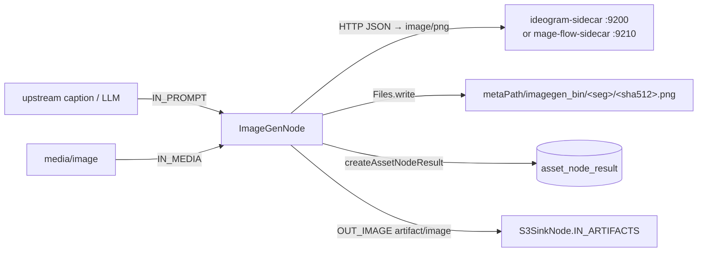

# Image Generation Node — Status & Open Work

> **Status: shipped.** Kind `imagegen`, module `cortex/nodes/image-generation`, 22 unit tests plus
> one integration test, typed ports, descriptor, website docs. **Two** interchangeable HTTP sidecars
> exist: `sidecars/ideogram-sidecar` and `sidecars/mage-flow-sidecar`.
>
> This file is the **authoritative spec for the node**. It is a status page: §1 says where everything
> lives; §2–§8 carry only what is still open or still non-obvious. It does not restate the node
> lifecycle or persistence model ([NODES.md](../features/nodes/NODES.md) §2), the port/content-type model
> ([../pipeline/NODE_DATA_TYPES.md](../features/pipeline/NODE_DATA_TYPES.md)) or the new-node checklist
> ([../../guidelines/NEW_NODE.md](../guidelines/NEW_NODE.md)).
>
> ⚠️ `spec/plans/imagegen-node.md` is a **superseded** earlier draft slated for deletion; everything
> unique to it has been folded in here. Do not add design detail there.

---

## 1. Already implemented

| Item | Where it lives in code |
|---|---|
| Maven module | `cortex/nodes/image-generation/` (parent + `core`); listed in `cortex/nodes/pom.xml`, `cortex/processor/pom.xml`, `integration-test/pom.xml` |
| Node | `.../imagegen/ImageGenNode.java` — `name() = "imagegen"`, `isProcessable = media.isImage()`, `LocalResultCache`, writes `metaPath/imagegen_bin/<seg>/<sha512>.png`, ledger-only `recordNodeResult` |
| Modes | `ImageGenMode` (`GENERATE` \| `REMIX`), chosen by `ImageGenNodeOptions.mode` |
| Options | `ImageGenNodeOptions` (`KEY = "imagegen"`) — see §2 |
| Sidecar client | `ImageGenClient` — `java.net.http.HttpClient` (HTTP/1.1) → `/generate`, `/remix`, returns PNG `byte[]` |
| Typed ports | `IN_PROMPT` (`text/*`, ONE, optional — a wired prompt wins over the option), `IN_MEDIA` (`media/image`, ONE), `OUT_IMAGE` (`artifact/image`, ONE), `OUT_FLAG` (`scalar/string`, ONE) |
| Prompt precedence | `ctx.optionalInput(IN_PROMPT).orElseGet(o::getPrompt)` — an upstream caption/LLM answer drives generation without templating |
| Metrics | `metrics.recordAiCacheHit("imagegen")` on a local-cache hit; `metrics.recordAiCall("imagegen", ok, elapsedMs)` on both the success and the exception path. `metrics` is the `CortexMetrics` field injected on `AbstractMediaNode` (no-op default for hand-built nodes) |
| Dagger wiring | `ImageGenNodeModule` — `@Binds @IntoSet`, `@Binds @IntoMap @StringKey("imagegen")`, `optionInfo()`, `options()`, `@Provides ImageGenClient`; included from `cortex/cli/.../dagger/NodeCollectionModule.java` |
| Descriptor | `ImageGenDescriptorProvider` (icon `auto_awesome`, `TRANSFORM`, 13 parameters, `defaultConcurrency=1`); serialized into `website/static/pipeline-editor/node-descriptors.json` |
| Port conformance | Covered by `NodePortConformanceTest` — `imagegen` is **not** in its `DYNAMIC_KINDS` exemption, so inputs *and* outputs are compared with the descriptor |
| Unit tests | `ImageGenNodeTest` (4), `ImageGenNodePipelineTest` (6), `ImageGenNodePersistenceTest` (2), `ImageGenOptionsValidationTest` (10) + `assertj/ImageGenNodeAssertions`, `assertj/ImageGenOptionsAssert` — 22 total, client stubbed by subclassing, no GPU |
| Integration test | `integration-test/.../node/ImageGenNodeIntegrationTest.java` — in-process Loom + pooled Postgres, stub client; asserts the PNG under `metaPath/imagegen_bin` and the `imagegen` ledger row via REST |
| Sidecar A | `sidecars/ideogram-sidecar/` — FastAPI `/health` `/generate` `/remix`, default **SDXL-Turbo**, Ideogram-4 opt-in, `gen_ideogram.py` |
| Sidecar B | `sidecars/mage-flow-sidecar/` — same contract, **MIT** weights (§3) |
| Sink for the bytes | `S3SinkNode` (`cortex/nodes/s3-sink`) — its `IN_ARTIFACTS` (`artifact/*`, MANY) port accepts `OUT_IMAGE` directly |
| Docs | `website/content/english/docs/nodes/imagegen/index.adoc` (covers both sidecars); [NODES.md](../features/nodes/NODES.md) §2/§3/§5/§12 |

**Persistence is ledger-only**: `resultRef = null`, `producerVersion = null`, no typed component —
identical to `ThumbnailNode` / `TtsNode`, because Loom has no raw-byte ingest endpoint (§4).



---

## 2. Options and environment

| Option | Default | Meaning |
|---|---|---|
| `mode` | `GENERATE` | `GENERATE` (text2img, source pixels ignored) or `REMIX` (img2img) |
| `prompt` | `""` | Generation prompt. **Required** unless `IN_PROMPT` is wired (a wired prompt wins) |
| `host` | `localhost` | Sidecar host |
| `port` | `9200` | Sidecar port — **`9210` for mage-flow** |
| `generateEndpoint` | `/generate` | text2img path |
| `remixEndpoint` | `/remix` | img2img path |
| `width` / `height` | `1024` | GENERATE output size |
| `strength` | `0.6` | REMIX denoise strength, `(0,1]`. **Ignored by mage-flow** (instruction-edit model) |
| `seed` | `null` | Optional RNG seed |
| `steps` | `30` | Inference steps — see the turbo caveat in §6 |
| `timeoutMs` | `120000` | HTTP timeout (set in the constructor) |
| `enabled` / `processIncomplete` / `retryFailed` | inherited | `AbstractNodeOptions` |

`validate()` rejects a blank prompt, a blank host, non-positive `port`/`width`/`height`/`steps`, and
`strength` outside `(0,1]`.

### Sidecar environment

| Sidecar | Variable | Default | Meaning |
|---|---|---|---|
| ideogram | `IMAGEGEN_MODEL` | `stabilityai/sdxl-turbo` | HF repo or local path |
| ideogram | `IMAGEGEN_DEVICE` | `cuda` if available | torch device |
| ideogram | `IMAGEGEN_DTYPE` | `float16` on cuda, else `float32` | precision |
| ideogram | `IMAGEGEN_STEPS` | `4` | sidecar-side default (overridden by the node's `steps`) |
| ideogram | `IMAGEGEN_GUIDANCE` | `0.0` | `none`/`default`/`""` → pipeline default |
| ideogram | `IMAGEGEN_CPU_OFFLOAD` | `0` | model CPU offload for big models on small VRAM |
| ideogram | `HF_TOKEN` | — | gated models (Ideogram) only |
| mage-flow | `MAGEFLOW_MODEL` | `microsoft/Mage-Flow-Turbo` | txt2img checkpoint |
| mage-flow | `MAGEFLOW_EDIT_MODEL` | `microsoft/Mage-Flow-Edit-Turbo` | `/remix` checkpoint |
| mage-flow | `MAGEFLOW_DEVICE` | `cuda` if available | torch device |
| mage-flow | `MAGEFLOW_ATTN` | `auto` | attention backend |
| mage-flow | `MAGEFLOW_STEPS` / `MAGEFLOW_CFG` | per-variant | sidecar-side defaults |
| mage-flow | `MAGEFLOW_MAX_BATCH` | `4` | batch cap |
| mage-flow | `MAGEFLOW_HOST` / `MAGEFLOW_PORT` | `0.0.0.0` / `9210` | bind address |
| both | `CUDA_VISIBLE_DEVICES` | — | pin a GPU |

Cortex-side: `CORTEX_META_PATH` is the parent of `imagegen_bin/`;
`CORTEX_NODE_BLACKLIST=imagegen` / `CORTEX_NODE_WHITELIST` restrict the kind per worker.

---

## 3. The two sidecars — one contract

Both expose the same model-agnostic HTTP contract, so switching backends is **one option change**
(`port`):

| Method | Path | Body | Response |
|---|---|---|---|
| GET | `/health` | — | `{status, model, device, remix_mode}` |
| POST | `/generate` | `{prompt, width?, height?, seed?, steps?}` | `image/png` |
| POST | `/remix` | `{image_b64, prompt, strength?, seed?, steps?}` | `image/png` |

| | `ideogram-sidecar` (:9200) | `mage-flow-sidecar` (:9210) |
|---|---|---|
| Default model | SDXL-Turbo (ungated) | Microsoft **Mage-Flow 4B** (NR-MMDiT + Mage-VAE, rectified flow) |
| Weight licence | SDXL: non-commercial; Ideogram-4 opt-in: non-commercial **and** gated | **MIT** — code *and* checkpoints |
| `/remix` | true img2img; degrades to txt2img when the backend has none (Ideogram-4) | instruction-edit model; **accepts and ignores `strength`** |
| Extras | `gen_ideogram.py` for the gated path | additional `POST /v1/generate` returning JSON + base64 images, model id, seed, steps, timing (a superset — the node does not use it) |
| Blocked prompt | white/grey image | HTTP **422** (unmasked) |

Mage-Flow is what makes a commercially deployable `imagegen` possible at all; the licensing decision
itself is still open (§4).

---

## 4. Progress Assessment

### Done

- [x] Module, `ImageGenMode`, `ImageGenNodeOptions` + `validate()`, `ImageGenClient`, `ImageGenNode`, `ImageGenNodeModule`
- [x] `@Binds @IntoMap @StringKey("imagegen")` + `NodeCollectionModule.includes` → kind executable
- [x] Typed ports `IN_PROMPT` / `IN_MEDIA` / `OUT_IMAGE` / `OUT_FLAG`; descriptor agrees (`NodePortConformanceTest`)
- [x] Wired `IN_PROMPT` overrides `options.prompt` — caption/LLM chaining works without templating
- [x] `metrics.recordAiCall` / `recordAiCacheHit` instrumentation
- [x] 22 unit tests + `ImageGenNodeIntegrationTest`
- [x] `ideogram-sidecar` built and verified (`/health` `/generate` `/remix`)
- [x] `mage-flow-sidecar` built — same contract, MIT weights, port 9210
- [x] [NODES.md](../features/nodes/NODES.md) + `website/content/english/docs/nodes/imagegen/` (both sidecars documented)
- [x] `OUT_IMAGE` consumable by `S3SinkNode.IN_ARTIFACTS`

### Open

- [ ] **Commercial-safe default model — still undecided.** `ideogram-sidecar`'s default (SDXL-Turbo)
      and its opt-in Ideogram-4 weights are **both non-commercial**. Decide whether MIT-licensed
      Mage-Flow becomes the documented default for shipping deployments, then record the decision in
      §3 here *and* in `website/content/english/docs/legal/model-licenses/index.adoc`.
      ⚠️ That legal page is currently **stale**: it still calls `imagegen` "planned", lists only the
      Ideogram 4.0 non-commercial weights, and says "**Do not deploy** the `imagegen` node against
      Ideogram 4.0 weights" without mentioning that Mage-Flow resolves exactly that.
- [ ] **Loom byte-ingest for generated media — a cross-node gap, not an imagegen problem.** The PNG
      stays in the local `imagegen_bin` cache because Loom has no raw byte-upload endpoint (only
      `AttachmentMethods.uploadAttachment`). The same gap affects **`thumbnail`, `depthmap`, `tts`,
      `script` and `imagegen`** alike; `S3SinkNode` is the current **workaround, not a fix** (and it
      requires the sink to run on the same worker as the producer). Solve it once at the Loom REST
      layer — design in
      [../rest/REST_CORTEX_METADATA_BINARY_HANDLING_PLAN.md](REST_CORTEX_METADATA_BINARY_HANDLING_PLAN.md)
      (which already lists `ImageGenNode → metaPath/imagegen_bin → ledger row only`).
- [ ] **No live GPU smoke test recorded.** Everything below the sidecar boundary is covered by
      stubbed clients; no end-to-end run against real weights exists.
      ```bash
      cd sidecars/ideogram-sidecar && CUDA_VISIBLE_DEVICES=1 ./venv/bin/uvicorn server:app --port 9200
      # point ImageGenNodeOptions host/port at it, run GENERATE on a real image asset
      # expect: PNG under metaPath/imagegen_bin/<seg>/<sha512>.png + asset_node_result row node_kind="imagegen"
      ```
      Repeat against `sidecars/mage-flow-sidecar` (`--port 9210`, `steps: 4`) to prove the contract is
      genuinely model-agnostic.
- [ ] **`IN_MEDIA` is declared and advertised but never read.** REMIX loads pixels from
      `ctx.media().file()` directly. `NodePortConformanceTest` compares names and types only, so it
      cannot catch an unused port. Either consume the port or document why the media handle bypasses it.
- [ ] **No `KIND` constant.** The string `"imagegen"` is repeated in `name()`, `@StringKey` and
      `ImageGenNodeOptions.KEY`. `ScriptNode.KIND` / `S3SinkNode.KIND` are the pattern to follow.
- [ ] **Prompt templating.** Placeholder substitution inside `options.prompt` (e.g. `${caption}`) is
      not implemented — the `IN_PROMPT` port covers chaining, not interpolation.
- [ ] **Sidecar prompting features** (nice-to-have): structured-JSON / magic-prompt expansion,
      bounding-box layout, colour-palette steering.
- [ ] **Sidecar hygiene.** Both sidecar directories carry non-source artifacts (`.venv/`,
      `__pycache__/`, probe PNGs and logs).

---

## 5. Test setup

```bash
mvn -pl cortex/nodes/image-generation/core -am test          # 22 unit tests, no GPU
./setup-pool.sh
mvn -pl integration-test -Dtest=ImageGenNodeIntegrationTest test
```

The model client is stubbed by **subclassing `ImageGenClient`** to return canned PNG bytes; the
`LoomClient` is a Mockito `LoomHttpClient` in `ImageGenNodePersistenceTest`. No REST or DAO tests: the
node adds no endpoint and no DAO — it reuses the `asset_node_result` ledger path.

| Test | Asserts |
|---|---|
| `ImageGenNodeTest` | both modes, PNG written with the canned bytes, non-image skipped, second run served from `LocalResultCache` |
| `ImageGenNodePipelineTest` | output-key propagation, completion/tracking events, disabled node, dry run |
| `ImageGenNodePersistenceTest` | ledger-only row (`nodeKind=imagegen`, SUCCESS, `resultRef==null`); `FAILED` when the sidecar throws |
| `ImageGenOptionsValidationTest` | blank prompt/host, non-positive port/size/steps, `strength` out of range |
| `ImageGenNodeIntegrationTest` | real Loom + Postgres: PNG under `imagegen_bin` + `imagegen` ledger row read back over REST |
| `NodePortConformanceTest` | node ports match `ImageGenDescriptorProvider` |

After any `NodeCollectionModule` / constructor change, **clean-rebuild `loom/core` before
`./setup-pool.sh`** — otherwise a stale jar produces `NoSuchMethodError`.

---

## 6. Conventions and Gotchas

- **`ImageUtils` has no PNG writer** (JPG only) — use `ImageIO.write(img, "png", os)`.
- **Ledger-only persistence**: pass `resultRef = null` / `producerVersion = null`. The base class
  no-ops when `asset == null || client() == null`, so offline runs stay clean.
- **The generated bytes are a path on *that* worker.** Downstream consumers of `OUT_IMAGE` are only
  meaningful on the same worker — use an `affinity` group, or terminate the branch in `S3SinkNode`.
- **`steps` is always sent.** `ImageGenClient` transmits the option (default `30`), so a sidecar's
  per-variant default never applies to node traffic. Turbo models want `steps: 4` — set it on the
  node, not in the sidecar's env.
- **`strength` is inert against mage-flow** — it is an instruction-edit model, not a denoise img2img.
- **Ideogram-4 nf4 on a 12 GB GPU works only at `guidance_scale = 1.0` (no CFG).** Any CFG, or
  per-step transformer CPU↔GPU swapping, collapses the 4-bit model into a grey *"Image blocked by
  safety filter"* card. That is a **quantization artifact, not a moderation filter** — the real
  Ideogram filter is external Hive API calls in their CLI, absent from the diffusers path. Full-quality
  CFG needs the fp8/bf16 build on a 24 GB GPU. See `sidecars/ideogram-sidecar/gen_ideogram.py`.
- **Registration is three strings + one binding** in `ImageGenNodeModule` (`@StringKey`,
  `CortexNodeOptionDeserializerInfo`, `nodeOptions(...)`) plus `@Binds @IntoSet`; then add the module
  to `NodeCollectionModule.includes`.
- **No demo data needed**: `DemoDatabaseInitializer` holds no per-node Cortex config, and node kinds
  in pipeline JSON are cosmetic UI labels.

---

## 7. Key Classes Reference

| Class | Package / module | Purpose |
|---|---|---|
| `ImageGenNode` | `io.metaloom.cortex.node.imagegen` (cortex/nodes/image-generation) | The node: ports, mode dispatch, PNG write, metrics, ledger |
| `ImageGenNodeOptions` | same | Config incl. `mode`, `prompt`, sidecar host/port; `KEY = "imagegen"` |
| `ImageGenMode` | same | `GENERATE` \| `REMIX` |
| `ImageGenClient` | same | HTTP/1.1 client → `/generate` `/remix`, returns PNG `byte[]` |
| `ImageGenNodeModule` | same | Dagger bindings incl. `@IntoMap @StringKey("imagegen")` and `@Provides ImageGenClient` |
| `ImageGenDescriptorProvider` | `io.metaloom.loom.nodes.spec` (loom-shared/node-model) | Palette entry, ports, 13 form parameters |
| `AbstractMediaNode` | `io.metaloom.cortex.common.node` | Lifecycle, `recordNodeResult` / `resultRef`, injected `CortexMetrics metrics` |
| `S3SinkNode` | `io.metaloom.cortex.node.sink.s3` | `IN_ARTIFACTS` (`artifact/*`, MANY) — the current outlet for generated bytes |
| `NodeCollectionModule` | `io.metaloom.cortex.cli.dagger` | Aggregates node modules (the one central edit) |
| `HashUtils` | `io.metaloom.utils.hash` | `segmentPath(base, sha512)` for the output path |
| `ImageUtils` | `io.metaloom.video4j.utils` | `load(File)` — the REMIX source |

---

## 8. Where do I find …?

| I want to … | Look at |
|---|---|
| The node | `cortex/nodes/image-generation/core/src/main/java/io/metaloom/cortex/node/imagegen/ImageGenNode.java` |
| The typed port constants | same file, top of the class |
| The sidecar client | `.../imagegen/ImageGenClient.java` |
| Where the kind becomes executable | `.../imagegen/ImageGenNodeModule.java` + `cortex/cli/.../dagger/NodeCollectionModule.java` |
| The descriptor / editor form | `loom-shared/node-model/.../spec/ImageGenDescriptorProvider.java`; serialized in `website/static/pipeline-editor/node-descriptors.json` |
| Port-vs-descriptor conformance | `integration-test/.../node/NodePortConformanceTest.java` |
| The integration test | `integration-test/.../node/ImageGenNodeIntegrationTest.java` |
| Sidecar A (SDXL-Turbo / Ideogram-4) | `sidecars/ideogram-sidecar/` (`server.py`, `README.md`, `gen_ideogram.py`) |
| Sidecar B (Mage-Flow, MIT) | `sidecars/mage-flow-sidecar/` (`server.py`, `mage_loader.py`, `run.sh`, `README.md`) |
| The byte-ingest gap and its design | [../rest/REST_CORTEX_METADATA_BINARY_HANDLING_PLAN.md](REST_CORTEX_METADATA_BINARY_HANDLING_PLAN.md) |
| The sink that ships the bytes off-worker | `cortex/nodes/s3-sink/` + [NODE_S3SINK_PLAN.md](NODE_S3SINK_PLAN.md) |
| Model licensing | `website/content/english/docs/legal/model-licenses/index.adoc` (stale — see §4) |
| Customer docs | `website/content/english/docs/nodes/imagegen/index.adoc` |
| A sibling sidecar-backed node | [NODE_VIDEO_CAPTIONING_PLAN.md](NODE_VIDEO_CAPTIONING_PLAN.md), `cortex/nodes/captioning/` |

---
_Git HEAD revision: `742dae2d`_
_Last updated: 2026-08-06 (reference sweep — no content changes)_