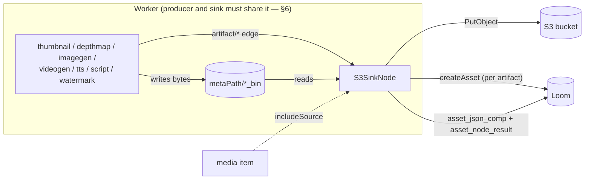

# S3 Sink Node — Design Record

> ## 🟢 Status: BUILT and shipped (phase 1)
>
> Kind `s3-sink`, module `cortex/nodes/s3-sink` (aggregator + `core/`), package
> `io.metaloom.cortex.node.sink.s3`. Bound unconditionally via
> `@Binds @IntoMap @StringKey(S3SinkNode.KIND)` in `S3SinkNodeModule`. 89 node tests, 7 integration
> tests against a real MinIO container, website docs and a demo pipeline shipped.
>
> **Corrections to earlier revisions of this file, verified against the code:**
>
> 1. 🔴 **The `recordNodeResult` ledger bug is fixed and shipped.** `AbstractMediaNode` declares
>    `protected String nodeId()` and `recordNodeResult` calls `ledger.setNodeId(nodeId())`.
>    `S3SinkNode` overrides it with its graph-local id. The old text ("hard-codes `setNodeId("")`")
>    described the pre-fix state.
> 2. 🔴 **The `artifacts` option and `autoDiscover` no longer exist.** They were replaced by a typed
>    `artifacts` **MANY** input port over `artifact/*` (`S3SinkNode.IN_ARTIFACTS`). Selection is now
>    "whatever the edge carries", in sequence order — §3.
> 3. 🔴 **Outputs are typed ports**, not the old `s3_sink_*` keys: `result : struct/json`,
>    `count : scalar/integer`, `flag : scalar/string`.
> 4. **Phases 2 and 3 are no longer this file's work.** They are superseded by
>    [../rest/REST_CORTEX_METADATA_BINARY_HANDLING_PLAN.md](REST_CORTEX_METADATA_BINARY_HANDLING_PLAN.md).
> 5. SPI counts are now **26 providers / 34 kinds**, not 22/36.
>
> **This file is now a design record, not a plan.** The code is the source of truth.

Read alongside [NODES.md](../features/nodes/NODES.md) (the node system, the persistence matrix, the affinity gap),
[../pipeline/NODE_DATA_TYPES.md](../features/pipeline/NODE_DATA_TYPES.md) (the `artifact/*` family and
ONE/MANY cardinality), [NODE_S3SOURCE_PLAN.md](NODE_S3SOURCE_PLAN.md) (the ingest half, which owns
`cortex/s3-common`) and [../../cortex/CONFIGURATION.md](../../cortex/CONFIGURATION.md) (the
`CORTEX_S3_*` flags this node shares with `s3-source`).

---

## 1. Already implemented

| Item | Where it lives |
|---|---|
| The node — upload → SHA-512 → `createAsset` → json comp + ledger | `cortex/nodes/s3-sink/core/…/S3SinkNode.java` (`KIND = "s3-sink"`, `SCHEMA_TYPE = "s3-artifact"`) |
| Typed ports `IN_ARTIFACTS` (MANY, `artifact/*`), `OUT_RESULT`, `OUT_COUNT`, `OUT_FLAG` | same |
| `PipelineConfigurable.configure(nodeDef)` — per-instance bucket/template/flags, graph-local `nodeId` | same |
| Per-instance options + `validate()` | `…/S3SinkNodeOptions.java` (`KEY = "s3-sink"`) |
| Dagger module (`@Binds @IntoSet` + `@Binds @IntoMap @StringKey`) | `…/S3SinkNodeModule.java`, collected in `cortex/cli/…/dagger/NodeCollectionModule.java` |
| Port elements → ordered files (+ `includeSource`) | `…/ArtifactSelector.java`, `…/SinkArtifact.java` |
| Key template: parse, validate, render | `…/S3KeyTemplate.java` |
| Per-artifact outcome + `toJson()` | `…/UploadedArtifact.java` (`State`: `UPLOADED`/`PRESENT`/`FAILED`/`MISSING`) |
| Idempotency policy | `…/OverwritePolicy.java` (`NEVER` \| `IF_DIFFERENT` \| `ALWAYS`) |
| `upload(...)` returning the stored `S3ObjectRef`; extension → MIME | `cortex/s3-common/…/S3ObjectStore.java`, `…/AwsS3ObjectStore.java`, `…/S3ContentTypes.java` |
| The `nodeId()` seam | `cortex/common/…/node/AbstractMediaNode.java` (`nodeId()`, used by `recordNodeResult`) |
| Descriptor: `OUTPUT`, icon `cloud_upload`, 9 parameters | `loom-shared/node-model/…/spec/S3SinkDescriptorProvider.java` |
| 89 unit tests (`S3SinkNodeTest`, `…PersistenceTest`, `…OptionsValidationTest`, `S3KeyTemplateTest`, `ArtifactSelectorTest`) | `cortex/nodes/s3-sink/core/src/test/…` |
| 7 integration tests (real MinIO + in-process Loom) | `integration-test/…/integration/node/S3SinkNodeIntegrationTest.java` |
| Two demo pipelines using `s3-sink` | `loom/core/…/boot/DemoDatabaseInitializer.java` |
| Customer-facing docs | `website/content/english/docs/nodes/s3-sink/index.adoc` |

**What it persists** (see [NODES.md](../features/nodes/NODES.md) §2): one `asset` **per uploaded artifact**
(`origin` = the `s3://` URI) plus an `asset_json_comp` (`schemaType = s3-artifact`,
`variant` = node id) and an `asset_node_result` ledger row (`producerVersion` = bucket) on the
**source** asset.

---

## 2. Why the node exists, and what it is *not*

Five nodes produce bytes and none of them can put those bytes anywhere durable — each writes a
worker-local `metaPath/*_bin` file and records a ledger row saying "this happened". `s3-sink` is the
**current workaround**: it uploads to a bucket named in the pipeline definition using *worker*
credentials and registers the artifact as a new Loom asset.

🔴 **That is not the same as raw-byte ingest into Loom's binary storage.** The real gap — a node
handing bytes to Loom so they land in whichever backend the target library uses — is owned by
[../rest/REST_CORTEX_METADATA_BINARY_HANDLING_PLAN.md](REST_CORTEX_METADATA_BINARY_HANDLING_PLAN.md),
with the byte endpoints and pool model in
[../rest/REST_BINARY_HANDLING.md](../features/rest/REST_BINARY_HANDLING.md). **Do not restate either here.**

Non-goals: a general upload endpoint in Loom (`AssetUploadEndpointService` already handles multipart
into a local directory); presigned URLs or a Loom read proxy for S3 objects; replacing the local
`*_bin` caches (§5 explains why deleting them by default would break `scene-layout`).

---

## 3. What gets uploaded



**Every element of the `artifacts` port**, in sequence order, plus the media item itself when
`includeSource` is set (which is what makes `filesystem-source → s3-sink` an archiver).

> The typed port replaced two workarounds that existed only because there was no way to say "this
> file, from that node" in the graph: an `artifacts` option holding `nodeId:outputKey` strings, which
> broke whenever a node was renamed, and an `autoDiscover` flag that uploaded anything whose output
> key ended in `_path` — silently missing every `script` image, because those keys are author-named.

When the media is already an `s3://` reference (an `s3-source` run) the sink **skips it** rather
than round-tripping bytes it fetched a moment ago.

**Resolution rules.** Blank → not an artifact. Relative → resolved against `metaPath`. Duplicates on
the normalised absolute path are dropped, first wins. `maxArtifacts` (default 64) exceeded → fail,
never truncate — a script emitting 5000 images is a bug and a truncating sink hides it.
`maxArtifactBytes` (default 0 = unbounded) exceeded → that artifact fails with its size.

🔴 **Presence is recorded, not filtered.** An element naming a file that is not on this worker
becomes `MISSING` and **fails the node**. That is the affinity failure (§6) and it must never be
quiet.

---

## 4. Key template and content type

Placeholders: `{sha512}` (of the **artifact**), `{sha512:N}` (first N hex; `{sha512:4}` matches
`HashUtils.segmentPath`), `{sourceSha512}` / `{sourceSha512:N}`, `{nodeId}`, `{sourceNode}`,
`{sourceKey}`, `{ext}` (with the dot), `{filename}`, `{basename}`, `{assetUuid}`, `{index}`,
`{indexSuffix}` (`""` when single-valued, `-<n>` when not).

```
Default: cortex/{sourceNode}/{sourceKey}/{sha512:4}/{sha512}{ext}
```

Content-addressed on the artifact's own hash, so identical bytes always land at the same key — which
is what makes the `IF_DIFFERENT` skip meaningful and re-uploads free. Sharded at the same 4-hex
level as the local `*_bin` layout.

Rejected at parse: unknown placeholder, `{sha512:0}`, `{sha512:129}`. Rejected at render: an empty
key, a key ending in `/` (`AwsS3ObjectStore.list` filters directory placeholders out, so the object
would be invisible to `s3-source`), a `.`/`..` segment, a control character, or >1024 bytes UTF-8.
Normalised: collapse `//`, strip a leading `/`. **An unresolvable placeholder fails the artifact —
never substitute.** A key containing the literal string `null` collides every asset onto it.

`S3ContentTypes` lives in `cortex/s3-common` because it stamps both the object's `Content-Type` and
the created asset's `mimeType`. There is **no reusable MIME helper anywhere else** in the workspace —
the mapping exists twice as private switches (`DaoAssetSink.mimeTypeOf`, `SessionFsEndpointService`).

---

## 5. Options

All **per pipeline instance** (`configure(nodeDef)`). Connection settings stay worker-level on
`CortexOptions.getS3()` / `CORTEX_S3_*` — see
[../../cortex/CONFIGURATION.md](../../cortex/CONFIGURATION.md) and
[NODE_S3SOURCE_PLAN.md](NODE_S3SOURCE_PLAN.md) §5 for the full 16-flag table — because a pipeline
definition is stored in Postgres and rendered verbatim in the editor, and `ParameterType` has no
`SECRET` value.

| Option | Type | Default | Notes |
|---|---|---|---|
| `bucket` | `STRING` | — | Required at `configure`, **not** at `validate()` (§7) |
| `keyTemplate` | `STRING` | `cortex/{sourceNode}/{sourceKey}/{sha512:4}/{sha512}{ext}` | §4 |
| `includeSource` | `BOOLEAN` | `false` | Also upload the media item; skipped when it is already `s3://` |
| `createAssets` | `BOOLEAN` | `true` | Off = upload only, no Loom asset per artifact |
| `overwrite` | `ENUM` | `IF_DIFFERENT` | `NEVER` \| `IF_DIFFERENT` \| `ALWAYS` |
| `deleteAfterUpload` | `BOOLEAN` | `false` | 🔴 see below |
| `maxArtifacts` | `INTEGER` | `64` | Exceeded → fail, never truncate |
| `maxArtifactBytes` | `INTEGER` | `0` | `0` = unbounded |
| `failOnPartial` | `BOOLEAN` | `true` | |
| `enabled` | `BOOLEAN` | `true` | Standard node parameter |

🔴 **`deleteAfterUpload` defaults to `false`, and the reason belongs in the javadoc, the descriptor
and [NODES.md](../features/nodes/NODES.md):** `SceneLayoutNode` reads `depthmap_path` from the **same worker's**
`depthmap_bin` cache. A sink that deleted by default would break that chain, and it would surface as
`scene-layout` skipping with "depth map not found" — which looks like a depthmap bug and is not.
When enabled: delete only artifacts confirmed present in S3; **never** the media file; only files
under `metaPath`; failures are WARN-logged and never fail the node, because the bytes are safe.

---

## 6. 🔴 The same-worker constraint

The sink reads files a producer wrote **on the same worker**. Dispatched elsewhere it sees nothing,
and there is no affinity mechanism today: `NodeTaskRunner`'s javadoc says affinity groups "**will
later** let Loom dispatch a whole subgraph", the editor has an affinity channel nothing consumes, and
no migration has an affinity column. The working configurations are a single-worker deployment or a
`CORTEX_NODE_WHITELIST` that co-locates producer and sink.

**Mitigation built into the design:** distinguish "upstream output absent" (→ skip, legitimate — the
producer did not run for this media type) from "output present but the file is not on this worker"
(→ **fail**, naming the path and the producer). A sink that silently uploads nothing looks like
success, which is the failure mode this node works hardest to avoid.

---

## 7. Conventions and Gotchas

🔴 **`ctx.failure(msg).abort()`, never `.next()`.** `NodeContextImpl.next()` ignores a recorded
failure cause and reports SUCCESS ([NODES.md](../features/nodes/NODES.md)). For a sink, "green node, nothing in the
bucket" is the worst possible outcome.

🔴 **`validate()` deliberately does not require `bucket`.** `RegistryNodeRegistrar.adapt` validates
the *worker's* options for every node it builds, so a `bucket`-required `validate()` would make every
`s3-sink` in every pipeline fail to build with a misleading message. `validate()` checks shape;
`configure(nodeDef)` requires the effective bucket and throws, which `adapt` reports as
`Node 'x' configuration failed: …`. Same split `ScriptNode` uses for its script.

| Gotcha | Detail |
|---|---|
| `ctx.abort()` returns an empty output map | `NodeContextImpl.abort()` passes `Collections.emptyMap()`, so a FAILED sink cannot report per-artifact detail through its ports. The detail still reaches Loom via the `asset_json_comp`, written **before** the node returns — but `result` is only observable on a successful or `failOnPartial=false` run |
| Zero artifacts → `ctx.skipped(...).next()`, not a failure | A sink downstream of a `depthmap` that skipped a video must not redden every video in the run |
| S3 inactive on this worker → **fail, not skip** | Skipping would be silent data loss on a green run. The kind map is static, so unlike `s3-source` the sink cannot be capability-gated away; the message names the fix (`CORTEX_NODE_WHITELIST`) |
| An asset cannot exist before its bytes are hashed | `asset.sha512sum` is `NOT NULL UNIQUE` (`V2.46`). SHA-512 the artifact first, then handle "already exists" — the same bytes are the same asset |
| Do **not** compare local MD5 to the ETag | Multipart ETags are `<md5-of-md5s>-<partcount>`. `IF_DIFFERENT` compares key + size |
| `.thumb` is a JPEG | `PreviewGenerator.save` → `ImageUtils.saveJPG` in video4j. If that changes, `S3ContentTypes` silently lies |
| Do not use `Files.probeContentType` | Platform-dependent and commonly null in slim containers, so the stored type would differ between a laptop and production |
| `JsonCompCreateRequest.setData` takes a `JsonObject` | The column is `jsonb NOT NULL`, so the payload must be an object wrapping the array, never a bare array |
| The node takes `@Nullable LoomClient` | Offline mode provides a null client, and Dagger refuses to inject a `@Nullable`-provided binding into a non-annotated parameter |
| **Not** `@Singleton` | It is `PipelineConfigurable`; `PipelineConfigurableTest.testTwoS3SinkNodesGetIndependentInstances` is the guard |
| `LocalResultCache` would be task-scoped here | The node is built per task, so a local cache would dedupe within a batch only. The HEAD is what makes re-runs cheap |
| A key ending in `/` is invisible to `s3-source` | `AwsS3ObjectStore.list` filters directory placeholders out |
| `upload(...)` returns `S3ObjectRef` | Taking the etag from `PutObjectResponse.eTag()` avoids an extra HEAD per artifact |
| `setup-pool.sh` before any IT | And again after any Flyway change |

---

## 8. Key Classes Reference

| Class | Package / module | Purpose |
|---|---|---|
| `S3SinkNode` | `io.metaloom.cortex.node.sink.s3` (`cortex/nodes/s3-sink/core`) | `AbstractMediaNode<S3SinkNodeOptions>` + `PipelineConfigurable`; overrides `nodeId()` |
| `S3SinkNodeOptions` | same | `KEY = "s3-sink"`; per-instance config + `validate()` |
| `S3SinkNodeModule` | same | `@Binds @IntoSet` + `@Binds @IntoMap @StringKey(S3SinkNode.KIND)` + options |
| `ArtifactSelector` | same | Port elements (+ optionally the media item) → ordered `List<SinkArtifact>` |
| `SinkArtifact` | same | Record: port, sequence index, multi-valued flag, file, presence |
| `UploadedArtifact` | same | Per-artifact outcome + `toJson()`; `State` = `UPLOADED`/`PRESENT`/`FAILED`/`MISSING` |
| `S3KeyTemplate` | same | Parse + render; pure, no IO |
| `OverwritePolicy` | same | `NEVER` \| `IF_DIFFERENT` \| `ALWAYS` |
| `S3ObjectStore` / `AwsS3ObjectStore` / `S3ContentTypes` / `S3Support` | `io.metaloom.cortex.s3` (`cortex/s3-common`) | Upload seam, MIME mapping, "is S3 configured" — owned by [NODE_S3SOURCE_PLAN.md](NODE_S3SOURCE_PLAN.md) |
| `FakeS3ObjectStore` | same (test scope) | In-memory store + assertion accessors; keeps unit tests MinIO-free |
| `AbstractMediaNode` | `io.metaloom.cortex.common.node` (`cortex/common`) | `nodeId()` seam; `recordNodeResult` writes `ledger.setNodeId(nodeId())` |
| `S3SinkDescriptorProvider` | `io.metaloom.loom.nodes.spec` (`loom-shared/node-model`) | `OUTPUT`, icon `cloud_upload`, 9 parameters |

---

## 9. Progress Assessment

### Done

- [x] Upload seam — `S3ObjectStore.upload` returning `S3ObjectRef`, `AwsS3ObjectStore.upload`,
      `S3ContentTypes`, `FakeS3ObjectStore.upload` + accessors
- [x] **`AbstractMediaNode.nodeId()` seam** — additive, zero behaviour change; `recordNodeResult`
      now writes `nodeId()`, so two sink instances no longer overwrite each other's ledger row
- [x] Module `cortex/nodes/s3-sink` + `core`, registered in `cortex/nodes/pom.xml` and
      `cortex/processor/pom.xml`
- [x] Pure pieces, test-first — `OverwritePolicy`, `S3KeyTemplate`, `SinkArtifact`,
      `UploadedArtifact`, `ArtifactSelector`, options + validation
- [x] The node — upload → SHA-512 → `createAsset` → json comp + ledger; 89 unit tests
- [x] CLI wiring — `NodeCollectionModule`, `PipelineConfigurableTest` case
- [x] Descriptor + SPI registration (26 providers / 34 kinds)
- [x] Integration test — `S3SinkNodeIntegrationTest`, 7 tests against real MinIO
- [x] Docs & demo — `website/content/english/docs/nodes/s3-sink/`, two demo pipelines,
      [NODES.md](../features/nodes/NODES.md), the `start-minio.sh` recipe
- [x] **Migration to the typed port model** — `artifacts` MANY input over `artifact/*`; the
      `artifacts` option and `autoDiscover` deleted; outputs are `result`/`count`/`flag`
- [x] **Loom-side phase 2** (2026-08-01, done elsewhere) — `poolUuid` through `AssetBinary`/REST, the
      S3 branches of `AssetBinaryEndpointService`, and the location-cardinality answer (an asset has
      0..n locations keyed `(library_uuid, path)`; the primary is the oldest).
      See [../rest/REST_BINARY_HANDLING.md](../features/rest/REST_BINARY_HANDLING.md)

### Open

- [ ] 🔴 **The sink still has no `poolUuid` / `poolName` option.** It uploads to its own bucket using
      worker credentials and records the location in `asset.initial_origin`. Loom now models "a pool
      that lives in S3" (`asset_pool`, `library.pool_uuid`, `BinaryStorageResolver`), and nothing
      connects the two. Wiring them raises the same question `s3-source` has: whose endpoint wins,
      the pool row's or the worker's `S3ClientOptions.endpoint`?
- [ ] 🔴 **Raw-byte ingest into Loom binary storage.** The general cross-node gap this sink works
      around is specified in
      [../rest/REST_CORTEX_METADATA_BINARY_HANDLING_PLAN.md](REST_CORTEX_METADATA_BINARY_HANDLING_PLAN.md),
      which supersedes this file's former phases 2 and 3. Not this node's work.
- [ ] **The derivation edge.** `attachment` (`V2.44`) has `node_kind`, `node_id`,
      `producer_version`, `variant`, `run_uuid` and is the sanctioned home for node-produced derived
      binaries, but its provenance columns are invisible to REST and `attachment_binary` is
      `(sha512sum, size)` only — it says a binary exists, not where. Specified as Phase A of the plan
      above.
- [ ] **`ScriptNode` still does not override `nodeId()`.** It writes `node_id = ''` like the other 20+
      nodes, so two script instances on one asset still collide in `asset_node_result`. Deferred
      because it has persistence tests asserting the current shape; existing rows need a decision.
- [ ] **Loom cannot serve these bytes.** The UI cannot render an S3-hosted thumbnail without
      presigned URLs or a Loom proxy route.
- [ ] **An asset per artifact multiplies asset count.** A 10k-video library with thumbnails and depth
      maps triples it. Acceptable — they *are* distinct binaries — but list/search should learn to
      filter derived assets, which is another argument for the `attachment` edge.
- [ ] **`IF_DIFFERENT` compares key + size only.** The clean upgrade is writing the SHA-512 as object
      metadata on PUT and comparing on HEAD; deferred because `S3ObjectRef` has no metadata field.
- [ ] **Concurrency stays at 1.** The `UrlConnectionHttpClient` is a worker-wide singleton shared
      with `s3-source` listing and materialization; raising sink concurrency competes with source
      downloads. Revisit with numbers.
- [ ] **No server-side copy** for cross-bucket archiving when the media is already `s3://`.

---

## 10. Test Setup

```bash
mvn -pl cortex/s3-common test
mvn -pl cortex/common test
mvn -pl cortex/nodes/s3-sink/core test                                 # 89 tests
mvn -pl cortex/cli test -Dtest=PipelineConfigurableTest
mvn -pl loom-shared/node-model test -Dtest=NodeDescriptorServiceLoaderTest

# regression on everything the recordNodeResult seam touches
mvn -pl cortex/nodes/depthmap/core,cortex/nodes/script/core,cortex/nodes/sentiment/core,cortex/nodes/thumbnail/core test

./setup-pool.sh
mvn -pl integration-test verify -Dtest=S3SinkNodeIntegrationTest        # 7 tests, real MinIO
mvn -pl integration-test verify -Dtest=S3SourceNodeIntegrationTest      # the shared seam
```

| Test | What it guards against |
|---|---|
| `S3KeyTemplateTest` | An unknown placeholder reaching render; a key with `..`, a trailing `/` or the literal `null`; a silent substitution |
| `ArtifactSelectorTest` | A missing file being filtered instead of reported; duplicates uploaded twice; the media item slipping in without `includeSource` |
| `S3SinkOptionsValidationTest` | `validate()` regaining a `bucket` requirement and breaking every pipeline build |
| `S3SinkNodeTest` | A green node with an empty bucket; a partial run not surfacing; zero artifacts failing instead of skipping |
| `S3SinkNodePersistenceTest` | The json comp, the ledger row and the per-artifact states not matching what was uploaded |
| `S3SinkNodeIntegrationTest` | End to end: the object present with `Content-Type: image/jpeg` for a `.thumb`; an asset created for the artifact and loadable by its SHA-512 with `origin` = the `s3://` URI; a second run uploading nothing; **two sink instances both persisting without overwriting each other's comp or ledger row**; `includeSource` uploading the media itself |
| `PipelineConfigurableTest` | Someone marking the node `@Singleton` |

Manual smoke test: `./start-minio.sh`, export the `CORTEX_S3_*` variables, build
`filesystem-source → sha512 → thumbnail → s3-sink` (`id=archive`, `bucket=media`), run it, then

```bash
mc stat metaloom-dev/media/cortex/thumbnail/<port>/<shard>/<sha512>.thumb
#   -> Content-Type: image/jpeg   (octet-stream here means S3ContentTypes regressed)
```

Re-run and confirm `Last Modified` is unchanged (the `IF_DIFFERENT` skip);
`GET /api/v1/assets/<artifactSha512>` returns the thumbnail's **own** asset; and a second sink
(`id=archive2, bucket=media2`) yields **two** `asset_node_result` rows for `node_kind='s3-sink'`.

---

## 11. Where do I find …?

| Need | Path |
|---|---|
| The node | `cortex/nodes/s3-sink/core/src/main/java/io/metaloom/cortex/node/sink/s3/S3SinkNode.java` |
| What gets uploaded | `…/sink/s3/ArtifactSelector.java` |
| The key template rules | `…/sink/s3/S3KeyTemplate.java` |
| Per-artifact outcome JSON | `…/sink/s3/UploadedArtifact.java` |
| Options + validation | `…/sink/s3/S3SinkNodeOptions.java` |
| The ledger `nodeId()` seam | `cortex/common/src/main/java/io/metaloom/cortex/common/node/AbstractMediaNode.java` |
| Upload + MIME mapping | `cortex/s3-common/…/s3/AwsS3ObjectStore.java`, `…/s3/S3ContentTypes.java` |
| The in-memory store used by unit tests | `cortex/s3-common/src/test/…/FakeS3ObjectStore.java` |
| The descriptor | `loom-shared/node-model/…/spec/S3SinkDescriptorProvider.java` |
| Kind binding | `cortex/cli/src/main/java/io/metaloom/cortex/cli/dagger/NodeCollectionModule.java` |
| Demo pipelines | `loom/core/…/boot/DemoDatabaseInitializer.java` |
| Customer-facing docs | `website/content/english/docs/nodes/s3-sink/index.adoc` |
| The `CORTEX_S3_*` flags | [../../cortex/CONFIGURATION.md](../../cortex/CONFIGURATION.md) |
| The `artifact/*` type family and MANY ports | [../pipeline/NODE_DATA_TYPES.md](../features/pipeline/NODE_DATA_TYPES.md) |
| Loom's byte endpoints and pool model | [../rest/REST_BINARY_HANDLING.md](../features/rest/REST_BINARY_HANDLING.md) |
| The real fix this node substitutes for | [../rest/REST_CORTEX_METADATA_BINARY_HANDLING_PLAN.md](REST_CORTEX_METADATA_BINARY_HANDLING_PLAN.md) |
| How to build the next node | [../../guidelines/NEW_NODE.md](../guidelines/NEW_NODE.md) |

---
_Git HEAD revision: `742dae2d`_
_Last updated: 2026-08-06 (reference sweep — no content changes)_