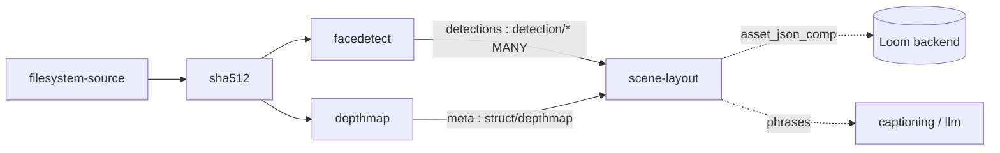

# Scene Layout Node — Technical Specification

> **Audience: AI coding agents.** The Cortex `scene-layout` node joins detector bounding boxes to a
> depth map and derives **depth bands** (`FOREGROUND` / `MIDGROUND` / `BACKGROUND`) and **pairwise
> spatial relations** (`IN_FRONT_OF`, `OCCLUDES`, `LEFT_OF`, `NEXT_TO`, …). Pure geometry and
> statistics — no model, no sidecar, no network.

## 🟢 Status: BUILT — verified at `499f71f7`

The node, the pure-logic solver and sampler, the typed ports, the descriptor, the persistence, the
customer docs and **59 unit tests** all exist. Spatial-relation derivation is *implemented*, not a
TODO; the depth dependency is *wired* through a declared `struct/depthmap` port. There are zero
`TODO`/`FIXME` markers in the module.

Two things remain genuinely open, and neither is a design question:

1. 🔴 **`SceneLayoutNodeIntegrationTest` is broken** — it feeds the pre-port payload shape (§4.1).
2. 🔴 **No object detection exists anywhere in Cortex**, so today the node relates **faces to faces**
   only (§4.2). This is a prerequisite, not a defect in this node.

⚠️ **Corrections against the previous revision of this file.** It carried an "implemented" header over
sections still marked *"Status: not implemented"* (§8 node) and *"not written"* (§12 tests), and over a
whole configuration section for options that no longer exist. Those are removed. Four further
statements were wrong:

| Previously specified | Actually built |
|---|---|
| `depthNodeId` (default `"depthmap"`) and `detectionSources` (default `["facedetect"]`) options | 🔴 **Both deleted** (commit `1f718676`). Replaced by declared ports `depth : struct/depthmap ONE` and `detections : detection/* MANY` — the pipeline author draws an edge instead ([NODES.md](NODES.md) §6.4) |
| Output keys `scene_layout_result` / `_object_count` / `_relation_count` (`NodeOutputKey`) | **Typed ports** `result`, `object_count`, `relation_count` (`OutputPort` + `ContentTypeRegistry`) |
| Normalized boxes on the REST fallback get a logged rescale heuristic | Normalized rows are **refused**, not rescaled — nothing records source image dimensions, so they cannot be converted at all. Only the ">1.0 ⇒ pixels" branch is usable |
| `loom-ui` `ICON_MAP` gains `schema` | 🔴 `PipelineEditor.tsx` has **no `ICON_MAP`** — the palette is descriptor-driven. `setIcon("schema")` in the descriptor is the only icon choice |

**Node kind**: `scene-layout` · **Module**: `cortex/nodes/scene-layout` (aggregator + `core`) ·
**Package**: `io.metaloom.cortex.node.scenelayout` · **No model, no sidecar.**

**Hard prerequisite**: [NODE_DEPTHMAP_PLAN.md](NODE_DEPTHMAP_PLAN.md). Node system:
[NODES.md](NODES.md). Ports and content types:
[../pipeline/NODE_DATA_TYPES.md](../pipeline/NODE_DATA_TYPES.md) §4. Adding a node:
[../../guidelines/NEW_NODE.md](../../guidelines/NEW_NODE.md).

> **Naming.** First sketched as "correlation"; renamed because *correlation* means a statistical
> relationship between variables, which is not what this does. Any reference to
> `NODE_CORRELATION_PLAN.md` or a `CorrelationNode` means this file. Also unrelated to the existing
> **`scene-detection`** node (temporal video cuts) — do not wire one expecting the other.

**The code under `cortex/nodes/scene-layout/` is the source of truth.**

---

## 1. Already implemented

| Item | Where it lives |
|---|---|
| `SceneLayoutNode` (428 lines) — lifecycle, input gathering, projection, persistence | `cortex/nodes/scene-layout/core/src/main/java/io/metaloom/cortex/node/scenelayout/SceneLayoutNode.java` |
| `RelationSolver` (209 lines) — **pure**: bands, relations, phrases. No I/O | same package, `RelationSolver.java` |
| `DepthSampler` (61 lines) — **pure**: box → core inset → p25/p50/p75 | same package, `DepthSampler.java` |
| `DepthMap` (155 lines) — 16-bit PNG decode, image→map projection, scene quantiles | same package, `DepthMap.java` |
| Value types `LayoutObject`, `SpatialRelation`, `BoxF`, `DepthStats`; enums `RelationPredicate` (12), `DepthBand` (3) | same package |
| `SceneLayoutNodeOptions` (12 fields, `KEY="scene-layout"`) + `validate()` | same package, `SceneLayoutNodeOptions.java` |
| `SceneLayoutNodeModule` — `@Binds @IntoSet`, **`@Binds @IntoMap @StringKey("scene-layout")`**, option-deserializer info, `@Provides` options | same package |
| Typed ports: `depth : struct/depthmap` ONE, `detections : detection/*` **MANY** → `result : struct/scene-layout`, `object_count`/`relation_count : scalar/integer` | `SceneLayoutNode.IN_DEPTH` / `IN_DETECTIONS` / `OUT_*` |
| `ContentTypeRegistry.STRUCT_SCENE_LAYOUT = "struct/scene-layout"` + `all()` entry | `loom-shared/node-model/.../spec/ContentTypeRegistry.java:69,126` |
| `SceneLayoutDescriptorProvider` (icon `schema`, `ANALYSIS`, `PARALLEL`, concurrency **4**, 11 parameters) + `META-INF/services` | `loom-shared/node-model/.../spec/SceneLayoutDescriptorProvider.java` |
| Build wiring | `cortex/nodes/pom.xml:34`; `cortex/processor/pom.xml:153`; `integration-test/pom.xml:179` |
| Kind registration | `cortex/cli/.../dagger/NodeCollectionModule.java:18,55`; guarded by `NodeRegistrarTest:60` |
| **Prerequisite P2** — `FacedetectNode` emits `detections` (MANY) with an explicit `coordinates` marker | `cortex/nodes/facedetect/core/.../FacedetectNode.java`; `FacedetectNodeDetectionsTest` |
| Persistence: `asset_json_comp`, `nodeKind`/`schemaType` = `scene-layout`, `variant=""`, `producerVersion` = the **depth model id** | `SceneLayoutNode.persist(...)`; table `V2.40__rework_asset_json_comp.sql` |
| Unit tests — `RelationSolverTest` (15), `SceneLayoutNodeTest` (15), `DepthSamplerTest` (9), `SceneLayoutNodePersistenceTest` (7), `SceneLayoutOptionsValidationTest` (7), `SceneLayoutNodePipelineTest` (6) + `SceneLayoutFixtures`, `assertj/` helpers | `cortex/nodes/scene-layout/core/src/test/java/io/metaloom/cortex/node/scenelayout/` |
| Port-conformance guard; Loom-side two-input-join fixtures | `integration-test/.../NodePortConformanceTest.java:74`; `PipelineGraphParserTest.java:238,316`; `PipelineRunEngineTest.java:369` |
| Customer docs | `website/content/english/docs/nodes/scene-layout/index.adoc` (+ 4 links in `nodes/_index.adoc`) |
| Catalogue rows | [NODES.md](NODES.md) §2/§3/§5/§12; [../pipeline/NODE_DATA_TYPES.md](../pipeline/NODE_DATA_TYPES.md) §4 |

### 1.1 What the node actually does

`isProcessable` → `options().isEnabled() && ctx.media().isImage()`. Video is out (blocked on
per-keyframe depth). `compute` then:

1. `LocalResultCache<String>` (10 000, keyed on `media().absolutePath()`) → re-emit, `origin(LOCAL)`.
2. Read `IN_DEPTH` JSON; it must carry a `path`. Missing → **skip** `"no depth map"`.
3. 🔴 `convention` must equal `"NEARNESS"`, else **skip** `"unsupported depth convention"` — the node
   refuses to guess which direction "closer" is.
4. The map file must exist on **this** worker. Missing → skip `"depth map file not found"` plus a warn
   naming affinity groups as the likely cause (§5).
5. Detections: **one element per detection** from `ctx.inputs(IN_DETECTIONS)`. Each needs a top-level
   `bbox {x,y,w,h}`; optional `coordinates:"NORMALIZED"` + `imageWidth`/`imageHeight` (then scaled to
   pixels), `type`, `label`, `index`, `confidence`. Object id = `label + "-" + index`.
6. Fallback (`allowLoomFallback`, default true): `client().listAssetDetections(uuid)`. Heuristic — any
   bbox component `> 1.0` ⇒ pixels; **normalized rows are refused** (no stored source dimensions).
7. `< 1` detection → skip `"no detections"`; `< 2` → skip `"only one detection - nothing to relate"`.
   One object has nothing to relate to, so a component row for it would carry no information.
8. `DepthMap.read(mapFile, imageWidth, imageHeight)` — 16-bit grayscale → `[0,1]` nearness (8-bit
   accepted, `/255`).
9. `maxObjects` cap by **box area descending**; relations are O(n²).
10. Per object: `map.projectFromImage(box)` then `DepthSampler.sample(map, mapBox, coreInset,
    minCorePixels)` → median / p25 / p75 / pixel count over the box's **central core**. Unsampleable
    objects are dropped; `< 2` survivors → skip.
11. `RelationSolver.assignBands(objects, map)` → `.solve(objects)` → optional `.phrases(...)`.
12. Emit all three ports, cache, `persist(...)`, `origin(COMPUTED)`. Any exception → `FAILED` ledger +
    `ctx.failure`.

### 1.2 The algorithm, in the two pure classes

**`DepthSampler`** samples only the box's central core, inset by `coreInset` (0.25) per side — the
middle 50% by width and height. This is the whole trick: a bounding box is a rectangle around a
non-rectangular thing, so its corners are background. Including them pulls a foreground person's
median toward the wall behind them, which for two people at similar distance is enough to flip the
ordering. `near` = p50; `spread` = p75 − p25 (how depth-consistent, hence how trustworthy, the object
is). Cores under `minCorePixels` are dropped.

**`RelationSolver.relate(a, b, out)`** over every ordered pair:

| Predicate | Condition |
|---|---|
| `IN_FRONT_OF` / `BEHIND` | `z = (near(a) − near(b)) / ((spread(a)+spread(b))/2 + 1e-6)`; `z ≥ depthZThreshold` / `z ≤ −t` |
| `SAME_DEPTH` | otherwise — emitted **once per unordered pair** (via `id.compareTo`) |
| `CONTAINS` | `intersection / area(b) ≥ containmentRatio` |
| `OCCLUDES` + `OCCLUDED_BY` | overlap **and** `IN_FRONT_OF` — emitted as an inverse pair |
| `LEFT_OF` / `RIGHT_OF` | boxes do **not** `overlapsX`; by `centerX` |
| `ABOVE` / `BELOW` | else, boxes do not `overlapsY`; by `centerY` |
| `NEXT_TO` | `SAME_DEPTH` and `gapRatio ≤ nextToMaxGap`; once per unordered pair |

`z` rather than raw Δ because a 0.05 gap between two flat, confidently-measured objects is real while
the same 0.05 between two noisy ones is not. Occlusion is gated on **depth as well as overlap** —
overlapping boxes at the same depth are adjacent, not occluding, and calling that occlusion is exactly
the 2D-only mistake this node exists to avoid. Every relation carries a `JsonObject evidence`
(`deltaNear`, `z`, `overlap`, `containment`, `gapRatio`). Results are sorted confidence-descending,
then truncated to `maxRelations`.

**Bands** come from `assignBands` using **whole-scene** depth quantiles (`map.sceneQuantile`), not
from the objects' own range: banding should describe where an object sits *in the picture*. Using only
the objects' depths would label the nearer of two equally-distant background faces "foreground".
Quantiles rather than k-means — explainable, dependency-free, and stable with only two objects
(clustering two points always yields two clusters, which is always the wrong answer).

### 1.3 Persisted payload

One `asset_json_comp` row per asset. Natural key `(asset_uuid, node_kind, schema_type, variant)` makes
a re-run an upsert; `variant` is `""` in v1 and reserved for a frame number once video lands.
`producerVersion` is the **depth model id** — the layout is only as good as the depth that produced it.

```jsonc
{
  "image": { "width": 1920, "height": 1080 },
  "depth": { "model": "...", "convention": "NEARNESS", "source": "RELATIVE",
             "mapWidth": 1024, "mapHeight": 576,
             "sceneQuantiles": { "background": 0.21, "foreground": 0.54 } },
  "objects":   [ { "id": "face-0", "label": "face", "type": "face", "source": "facedetect",
                   "bbox": {...}, "confidence": 1.0,
                   "depth": { "near": 0.82, "p25": 0.79, "p75": 0.85, "spread": 0.06,
                              "band": "FOREGROUND" } } ],
  "relations": [ { "subject": "face-0", "predicate": "IN_FRONT_OF", "object": "face-1",
                   "confidence": 0.91, "evidence": { "deltaNear": 0.38, "z": 5.4 } } ],
  "phrases":   [ "face-0 is in front of face-1", "face-0 is in the foreground" ],
  "truncated": { "objects": 0, "unsampled": 0, "relations": 0 }
}
```

There is **no** `SceneLayout` or `LayoutRegion` class — the payload is built as a raw `JsonObject` in
`SceneLayoutNode.buildPayload()`.

---

## 2. Configuration

**No environment variables.** This node has no sidecar and no external service; everything is node
configuration from the pipeline definition (options key `scene-layout`). Cortex-wide variables are in
[../../cortex/CONFIGURATION.md](../../cortex/CONFIGURATION.md).

| Option | Type | Default | Validation | Meaning |
|---|---|---|---|---|
| `enabled` / `processIncomplete` / `retryFailed` / `timeoutMs` | — | `true` / `false` / `false` / `0` | — | inherited from `AbstractNodeOptions` |
| `allowLoomFallback` | boolean | `true` | — | Fall back to `listAssetDetections` when the `detections` port delivers nothing |
| `coreInset` | double | `0.25` | `[0, 0.5)` | Fraction inset per side before sampling depth |
| `minCorePixels` | int | `16` | `> 0` | Smaller cores are dropped and logged. ⚠️ **not exposed in the descriptor** — YAML only |
| `depthZThreshold` | double | `1.0` | `> 0` | \|z\| above which a depth ordering is asserted |
| `occlusionMinOverlap` | double | `0.05` | `[0, 1]` | Overlap ÷ smaller-box area needed to call occlusion |
| `containmentRatio` | double | `0.85` | `(0, 1]` | Intersection ÷ area(B) needed for `CONTAINS` |
| `nextToMaxGap` | double | `0.5` | `> 0` | Gap ÷ mean box size below which `NEXT_TO` fires |
| `foregroundQuantile` | double | `0.66` | `(0, 1]`, **must exceed** background | Scene quantile at/above which an object is `FOREGROUND` |
| `backgroundQuantile` | double | `0.33` | `[0, 1)` | Scene quantile at/below which an object is `BACKGROUND` |
| `maxObjects` | int | `40` | `> 0` | Largest-first cap (relations are O(n²)) |
| `maxRelations` | int | `200` | `> 0` | Output cap |
| `emitPhrases` | boolean | `true` | — | Emit the readable `phrases[]` array |

🔴 **Deleted, do not reintroduce**: `depthNodeId` and `detectionSources`. Naming an upstream node in a
string option is the anti-pattern that ports replaced ([NODES.md](NODES.md) §6.4).

---

## 3. Pipeline placement



🔴 **`depthmap` and `scene-layout` must share an affinity group** — the depth PNG lives only on the
worker that produced it:

```jsonc
{ "id": "facedetect",   "type": "facedetect",   "affinity": "vision" },
{ "id": "depthmap",     "type": "depthmap",     "affinity": "vision" },
{ "id": "scene-layout", "type": "scene-layout", "affinity": "vision" }
```

`AffinityValidator` warns when a segment is *unplaceable* or a group got *split*, but it cannot warn
about a group you never declared — that failure surfaces as a `"depth map file not found"` skip on a
different worker, which looks like a depth-node problem and is not.

---

## 4. Open work

### 4.1 🔴 `SceneLayoutNodeIntegrationTest` is stale and fails

Commit `1f718676` mechanically converted the test to the `NodeInputs` API but left the **pre-port
batch payload shape**: it passes a single element

```jsonc
{ "imageWidth": …, "imageHeight": …, "coordinates": "ABSOLUTE_PIXELS", "detections": [ … ] }
```

whereas `SceneLayoutNode.readElement` requires a **top-level `bbox`** and is called once per element.
That element parses to `null`, detections come back empty, the REST fallback finds nothing, and the
node returns `SKIPPED` — while the test asserts `SUCCESS` and `OUT_OBJECT_COUNT == 2`.

Fix: emit **one element per detection**, exactly as `SceneLayoutFixtures.detection(...)` does in the
unit tests. A stale `java.util.Map` import also remains at line 11.

### 4.2 ✅ P3 — object detection exists

Resolved. `objectdetect` (`cortex/nodes/objectdetect`, yolo4j → `libyolib.so` → ONNX Runtime) emits
`detections : detection/object` **MANY** in the same element format `facedetect` uses, and fills the
`detection.label` column and the `type='objectdetection'` value that had sat in the schema in
anticipation of it.

It plugged in with **zero changes here**, exactly as predicted: `IN_DETECTIONS` binds on
`detection/*`, not on a producer. "Person is behind car" is now reachable — wire `objectdetect` into
`detections` instead of, or alongside, `facedetect`.

| # | Prerequisite | Status |
|---|---|---|
| P1 | [`depthmap` node](NODE_DEPTHMAP_PLAN.md) | **built** — hard dependency, wired via `struct/depthmap` |
| P2 | `FacedetectNode` emits `detections` | **built** — with an explicit `coordinates` marker |
| P3 | An `objectdetect` node (yolo4j, wired like `InspireFacedetector` in `FacedetectNodeModule`) | **built** — `ObjectDetector` is the mockable seam, as `InspireFacedetector` is for faces |
| P4 | `DetectionResponse` exposes `nodeKind` / `label` / `detectionIndex` | **partly** — `label` is exposed (it is what makes an object detection queryable at all); `nodeKind` and `detectionIndex` are still write-only |

### 4.3 Defects worth fixing

- [ ] 🔴 **`truncated.relations` is hardcoded to `0`.** `SceneLayoutNode.buildPayload()` writes
      `.put("relations", 0)` unconditionally while `RelationSolver.solve()` really does truncate at
      `maxRelations`. The block's stated purpose — "a silently shortened result reads as *these are
      all the relations*" — is defeated for the relation axis. `objects` and `unsampled` are correct.
- [ ] 🔴 **`RelationPredicate.INSIDE` is dead.** It is declared, documented as the inverse of
      `CONTAINS`, and advertised in the website's relation table, but `RelationSolver` never emits it.
      `OCCLUDES`/`OCCLUDED_BY` *are* emitted as an inverse pair; `CONTAINS` is not. Either emit
      `INSIDE` alongside `CONTAINS` or remove the enum constant and the doc row.
- [ ] 🔴 **`phrases[]` are not searchable.** `V2.58__add_search_document.sql`'s
      `search_extract_json_text` handles `ocr`, `tika`, `caption`, `video-caption`,
      `face-description`, `llm` and `vlm` — **`scene-layout` is absent**, so the payload contributes
      nothing to the search document. Both the code comment ("the primary consumers are LLM prompts
      and text search") and the website ("drop it straight into a search index") over-claim until a
      `WHEN 'scene-layout'` branch is added.
- [ ] **Cache key ignores every input.** `LocalResultCache` is keyed on `absolutePath` alone, so
      rewiring the depth map, swapping detectors or changing any threshold re-serves a stale layout
      ([NODES.md](NODES.md) §4 names `dominant-color` as the model to copy: path + hash of the wired
      payloads and every result-affecting option).
- [ ] **`minCorePixels` is not a descriptor parameter**, so it is unreachable from the pipeline editor.

### 4.4 Follow-ups (not defects)

- [ ] **Extend `DetectionResponse`** (P4) with `nodeKind` / `detectionIndex`. `label` landed with
      `objectdetect`, covered by `DetectionEndpointTest#testLabelIsReadBack`; the remaining two carry
      the same endpoint-test obligation per [../../guidelines/CODING.md](../../guidelines/CODING.md).
- [ ] **Repair the `detection` geometry convention.** `V2.43__rework_detection_embedding.sql` comments
      the column as "normalized 0-1, the single geometry convention", `FacedetectNode.persist` writes
      **absolute pixels**, `DetectionModelValidator` validates nothing, and no source dimensions are
      stored anywhere. This spec documents rather than silently patches it — quietly changing what a
      shared table means would break whatever reads it later. Its own task.
- [ ] **Video / per-frame layout** — one result per keyframe keyed by `variant = frameNumber`. Blocked
      on the `depthmap` node's own video support.
- [ ] **Relations as first-class rows** — if the UI ever renders a relation graph or search filters on
      predicates, `asset_json_comp` should graduate to a typed table (the promotion policy stated in
      that table's own comment). Not now: nothing queries it.
- [ ] **Feed `phrases[]` into captioning** — `CaptioningNode` could take the layout as prompt context
      for spatially grounded captions.
- [ ] **No example pipeline uses `scene-layout`** anywhere under `examples/`, `helm/` or `e2e-test/`.

---

## 5. Conventions and Gotchas

| Area | Gotcha |
|---|---|
| **Affinity** | 🔴 **Mandatory.** The depth PNG is worker-local (§3). The most likely production failure, and it does not announce itself — it looks like a depth-node problem. |
| **NEARNESS** | 🔴 **Larger = closer**; `65535` is nearest. Invert this and every relation is backwards while the node reports `SUCCESS`. The node refuses any other `convention` value rather than guessing. |
| **Project into map space** | 🔴 `depthMeta.width/height` are the **map's** dimensions after `maxDim` downscaling; `imageWidth`/`imageHeight` are the image's. `DepthMap.projectFromImage` exists for this. Skip it and there is no exception — just wrong samples. |
| **Sample the core, not the box** | 🔴 Corners are background. This single detail decides whether the node is right or merely plausible-looking. |
| **Score with `z`, not raw Δ** | A depth gap only means something relative to how noisy the two objects' depths are. |
| **Occlusion needs depth** | ⚠️ Overlapping boxes at the same depth are adjacent, not occluding. |
| **One element per detection** | 🔴 `IN_DETECTIONS` is a **MANY** port; `readElement` reads a top-level `bbox` from *each* element. A batch wrapper `{detections:[…]}` silently parses to nothing — this is exactly what breaks the integration test (§4.1). |
| **Detection geometry is inconsistent** | 🔴 The migration says normalized 0–1, `FacedetectNode` writes pixels, nothing validates, no source dimensions are recorded. Prefer the port payload, which carries an explicit `coordinates` marker. On the REST fallback only the ">1.0 ⇒ pixels" branch works; normalized rows are **refused**. |
| **`DetectionResponse` omits `nodeKind`/`detectionIndex`** | ⚠️ The REST fallback can distinguish rows by `type` and `label` — the object class now round-trips — but still cannot tell two producers of one type apart, nor recover a row's ordinal. |
| **A missing input is a skip, not a failure** | ⚠️ No depth map, no boxes, fewer than two objects → `ctx.skipped(reason)`. A `FAILED` result blocks downstream nodes and pollutes the run summary for what is a normal outcome. |
| **No silent caps** | `maxObjects` / unsampled truncation is logged **and** reported in `truncated` — except `relations`, which is hardcoded to 0 (§4.3). |
| **`ImageIO`, not OpenCV** | This module's `core/pom.xml` declares **zero** dependencies on purpose, including no dependency on `cortex-depthmap-node` — it reads the PNG with plain ImageIO so workers that only need arithmetic never pull the video4j native runtime. |
| **`scene-layout` ≠ `scene-detection`** | ⚠️ The latter is temporal video scene cuts. The similar names are unfortunate. |
| **No `ICON_MAP`** | ⚠️ `PipelineEditor.tsx` has no icon map — the descriptor's `setIcon("schema")` is the only place an icon is chosen. |
| **Registration** | Three strings and one binding in `SceneLayoutNodeModule`, then the module goes into `NodeCollectionModule.includes`. `PipelineNodeFactoryModule` is the **old** way and is wrong. |
| **No demo data** | `DemoDatabaseInitializer` holds no per-node Cortex config. |

---

## 6. Test setup

The interesting logic is testable with plain arrays and no filesystem — that is why `DepthSampler` and
`RelationSolver` are separate, pure classes.

| Test | Covers |
|---|---|
| **`RelationSolverTest` (15)** — the primary correctness suite | Synthetic depth gradients: clear front/behind; `SAME_DEPTH` emitted once; noisy spread suppressing a marginal ordering; overlap + depth gap → `OCCLUDES`; overlap at equal depth → **no** occlusion; containment; left/right; above/below; `NEXT_TO`; evidence recorded; cap keeps the strongest; bands from the whole scene |
| `DepthSamplerTest` (9) | 16-bit decode, clamping at edges, projection, core ≠ whole box, quartiles, tiny/outside boxes rejected, quantile ordering, inset never collapses |
| `SceneLayoutNodeTest` (15) | Full node against a real synthetic PNG; skips for no depth / missing artifact / bad convention / no detections / single detection / non-image / disabled; caching; `maxObjects` cap; image-space boxes; provenance; malformed payload |
| `SceneLayoutNodePersistenceTest` (7) | `createAssetJsonComp` with `nodeKind`/`schemaType` = `scene-layout`, `variant=""`, `producerVersion` = the depth model; ledger `resultRef.table == "asset_json_comp"`; `FAILED` path writes no component; skip writes nothing; Loom fallback on/off/precedence; **normalized rows refused** |
| `SceneLayoutNodePipelineTest` (6) | `extends AbstractNodeChainTest` — adapter, completion/tracking events, downstream chaining, disabled, dry-run |
| `SceneLayoutOptionsValidationTest` (7) | Option validation incl. the foreground > background constraint |
| `SceneLayoutFixtures` | Split / ramp / flat depth maps, `depthMeta`, and the **correct** one-element-per-detection payload |
| `SceneLayoutNodeIntegrationTest` | 🔴 **Currently broken** — see §4.1 |

Building the fixture — a synthetic depth map is what makes this node cheap to test:

```java
// left half near (nearness 0.9), right half far (nearness 0.1)
BufferedImage map = new BufferedImage(200, 100, BufferedImage.TYPE_USHORT_GRAY);
WritableRaster r = map.getRaster();
for (int y = 0; y < 100; y++)
    for (int x = 0; x < 200; x++)
        r.setSample(x, y, 0, x < 100 ? (int) (0.9 * 65535) : (int) (0.1 * 65535));
ImageIO.write(map, "png", pngFile);
```

```bash
mvn -pl cortex/nodes/scene-layout/core -am test
mvn -pl cortex/nodes/facedetect/core test           # the detections output (P2)
mvn -pl loom-shared/node-model test                 # ServiceLoader count guard
mvn -pl cortex/cli test -Dtest=NodeRegistrarTest    # kind-registration guard
mvn -pl integration-test -Dtest=SceneLayoutNodeIntegrationTest test
```

🔴 Run `./setup-pool.sh` before the integration test, and clean-rebuild `loom/core` after any
`NodeCollectionModule` change — a stale Dagger component surfaces as `NoSuchMethodError`.

---

## 7. Key Classes Reference

| Class | Package / module | Purpose |
|---|---|---|
| `SceneLayoutNode` | `io.metaloom.cortex.node.scenelayout` (`cortex/nodes/scene-layout/core`) | Gathers inputs, projects, runs the solver, persists |
| `RelationSolver` | same | **Pure**: objects → bands, relations, phrases |
| `DepthSampler` | same | **Pure**: box → core inset → p25/p50/p75 |
| `DepthMap` | same | Decoded 16-bit PNG + meta; `projectFromImage`, `nearnessAt`, `sceneQuantile` |
| `LayoutObject` / `SpatialRelation` / `BoxF` / `DepthStats` | same | Value records |
| `RelationPredicate` / `DepthBand` | same | 12 predicates (each with an English `phrase()`) / 3 bands |
| `SceneLayoutNodeOptions` | same | 12 fields; `KEY="scene-layout"` |
| `SceneLayoutNodeModule` | same | Dagger bindings incl. `@StringKey("scene-layout")` |
| `SceneLayoutDescriptorProvider` | `io.metaloom.loom.nodes.spec` (`loom-shared/node-model`) | UI palette + pipeline-validation descriptor |
| `ContentTypeRegistry` | same package | `STRUCT_SCENE_LAYOUT`, `STRUCT_DEPTHMAP`, `DETECTION_ANY`, `SCALAR_INTEGER` |
| `DepthmapNode` | `io.metaloom.cortex.node.depthmap` | Upstream producer — [NODE_DEPTHMAP_PLAN.md](NODE_DEPTHMAP_PLAN.md) |
| `FacedetectNode` | `io.metaloom.cortex.node.facedetect` | Upstream producer of `detections` (P2) |
| `AbstractMediaNode` | `io.metaloom.cortex.common.node` | Lifecycle + `recordNodeResult` / `resultRef` |
| `LocalResultCache` | `io.metaloom.cortex.common.cache` | In-heap worker-lifetime LRU skip cache |
| `NodeCollectionModule` | `io.metaloom.cortex.cli.dagger` | Aggregates node modules — the one central Dagger edit |
| `DetectionMethods` | `io.metaloom.loom.client.common.method` | `listAssetDetections` — the REST fallback |
| `JsonCompCreateRequest` | `io.metaloom.loom.rest.model.jsoncomp` | `nodeKind`/`schemaType`/`variant`/`producerVersion`/`data` |
| `AffinityValidator` | `io.metaloom.loom.pipeline.graph` | Warns about split / unplaceable affinity groups |

---

## 8. Where do I find …?

| I want to … | Look at |
|---|---|
| The relation algorithm | `cortex/nodes/scene-layout/core/src/main/java/io/metaloom/cortex/node/scenelayout/RelationSolver.java` |
| The depth sampling | `.../DepthSampler.java`, `.../DepthMap.java` |
| The depth map this node consumes | [NODE_DEPTHMAP_PLAN.md](NODE_DEPTHMAP_PLAN.md) |
| Port ids, content types, cardinality | [../pipeline/NODE_DATA_TYPES.md](../pipeline/NODE_DATA_TYPES.md) §4 |
| Why `depthNodeId` / `detectionSources` are gone | [NODES.md](NODES.md) §6.4 |
| The `asset_json_comp` + ledger write shape | [NODES.md](NODES.md) §2; `cortex/nodes/sentiment/core/.../SentimentNode.java` (`persist`) |
| How face boxes are produced and persisted | `cortex/nodes/facedetect/core/.../FacedetectNode.java` |
| The detection schema and its bbox comment | `loom/db/flyway/.../V2.43__rework_detection_embedding.sql` |
| The `asset_json_comp` schema and promotion policy | `loom/db/flyway/.../V2.40__rework_asset_json_comp.sql` |
| The search-document extractor (missing this schema type) | `loom/db/flyway/.../V2.58__add_search_document.sql` |
| How to add a node at all | [../../guidelines/NEW_NODE.md](../../guidelines/NEW_NODE.md) |
| Where a node registers as a runnable kind | its `*NodeModule` (`@StringKey`) + `NodeCollectionModule.includes` |
| Where a node registers for the UI | `loom-shared/node-model/.../spec/` + the `META-INF/services` file |
| Affinity / segmentation | `loom/pipeline/.../graph/{PipelineSegmenter,AffinityValidator,PipelineGraphNode}.java` |
| Customer docs | `website/content/english/docs/nodes/scene-layout/index.adoc` |
| Cortex config precedence | [../../cortex/CONFIGURATION.md](../../cortex/CONFIGURATION.md) |
| Definition of done for a code change | [../../guidelines/CODING.md](../../guidelines/CODING.md) |

---

## 9. Progress Assessment

### Built
- [x] Module `cortex/nodes/scene-layout/` (aggregator + `core`), `cortex/nodes/pom.xml` entry, processor + integration-test dependencies
- [x] `SceneLayoutNode`, `SceneLayoutNodeOptions`, `SceneLayoutNodeModule`
- [x] Pure logic: `RelationSolver`, `DepthSampler`, `DepthMap`, plus `LayoutObject` / `SpatialRelation` / `BoxF` / `DepthStats` / `RelationPredicate` / `DepthBand`
- [x] `@Binds @IntoMap @StringKey("scene-layout")` + `NodeCollectionModule.includes` + `NodeRegistrarTest` guard
- [x] Typed ports (`depth` ONE, `detections` MANY → `result`, `object_count`, `relation_count`); `ContentTypeRegistry.STRUCT_SCENE_LAYOUT` + `all()` entry
- [x] `SceneLayoutDescriptorProvider` + `META-INF/services`; descriptor-count guard updated
- [x] Persistence: `asset_json_comp` (`schemaType="scene-layout"`, `producerVersion` = depth model) + ledger `resultRef`
- [x] **P1** depthmap built and wired; **P2** `FacedetectNode` `detections` output + `FacedetectNodeDetectionsTest`
- [x] 59 unit tests across six classes; `NodePortConformanceTest` entry
- [x] Customer docs; [NODES.md](NODES.md) and [../pipeline/NODE_DATA_TYPES.md](../pipeline/NODE_DATA_TYPES.md) rows

### Open
- [ ] 🔴 Fix `SceneLayoutNodeIntegrationTest` — pre-port payload shape, currently asserts `SUCCESS` on a skip (§4.1)
- [ ] 🔴 `truncated.relations` hardcoded to `0` (§4.3)
- [ ] 🔴 `RelationPredicate.INSIDE` declared and advertised but never emitted (§4.3)
- [ ] 🔴 `scene-layout` missing from the `search_extract_json_text` whitelist, so `phrases[]` are not searchable (§4.3)
- [ ] Cache key includes the wired depth map, detections and thresholds (§4.3)
- [ ] `minCorePixels` exposed as a descriptor parameter (§4.3)
- [x] **P3** `objectdetect` node — the only thing that makes "person behind car" reachable (§4.2)
- [ ] **P4** `DetectionResponse` gains `nodeKind` / `detectionIndex` — `label` landed with `objectdetect` (§4.4)
- [ ] Repair the `detection` geometry convention (§4.4)
- [ ] Video / per-frame layout, blocked on depthmap video support (§4.4)
- [ ] An example pipeline that actually uses this node (§4.4)

### Deliberately not built
- [ ] ~~A learned scene-graph (SGG) model~~ — rejected; geometry is deterministic, explainable ("why behind?" → a number), unlicensed and CPU-cheap
- [ ] ~~3D reconstruction / camera pose / world coordinates~~ — out of scope; relative ordering and image-plane relations only
- [ ] ~~Relations as first-class DB rows~~ — `asset_json_comp` until something queries them
- [ ] ~~Detection of any kind~~ — this node creates no boxes; it relates boxes others produced

---

## 10. References

- [NODE_DEPTHMAP_PLAN.md](NODE_DEPTHMAP_PLAN.md) — the required upstream node, designed alongside this one
- [NODES.md](NODES.md) — node system, persistence (§2), registration (§5), the deleted node-id options (§6.4), capability matrix (§12)
- [../pipeline/NODE_DATA_TYPES.md](../pipeline/NODE_DATA_TYPES.md) — port ids, content types, cardinality
- [../../guidelines/NEW_NODE.md](../../guidelines/NEW_NODE.md) — the add-a-node recipe
- [NODE_SENTIMENT_PLAN.md](NODE_SENTIMENT_PLAN.md) — the `asset_json_comp` persistence exemplar
- [../pipeline/PIPELINE.md](../pipeline/PIPELINE.md) — pipeline engine, segmentation, affinity
- [../search/SEARCH.md](../search/SEARCH.md) — a downstream consumer, blocked on §4.3
- [../db/DATABASE_TASKS.md](../db/DATABASE_TASKS.md), [../DB_SCHEMA_FEEDBACK.md](../DB_SCHEMA_FEEDBACK.md) — schema-audit context for the detection-geometry issue
- [../../cortex/CONFIGURATION.md](../../cortex/CONFIGURATION.md), [../../guidelines/CODING.md](../../guidelines/CODING.md), [../../SPEC_RULES.md](../../SPEC_RULES.md)

---

_Git HEAD revision: `499f71f7`_
_Last updated: 2026-08-01 (verified BUILT against the tree; removed the stale "not implemented"/"not written" section headers and the deleted `depthNodeId`/`detectionSources` options, and replaced the design narrative with an inventory plus four newly found defects — the broken integration test, hardcoded `truncated.relations`, dead `INSIDE` predicate and the missing search-document branch.)_
