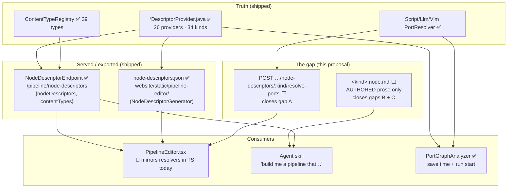

# Node Schemas — What Already Ships, and the Narrow Gap Left

> **Audience: AI coding agents.** This file used to propose **four competing concepts** for inventing a
> per-node "schema file" that would describe a pipeline node completely enough to (a) validate a
> definition outside the JVM and (b) brief an LLM on how to use the node.
>
> **Most of that has been built in the meantime.** The machine-readable half exists, is served over
> REST, and is exported as a static file. This revision states what is covered, narrows the proposal to
> the part that is still genuinely missing, and keeps **one** recommended design.
>
> **Companion documents — read before changing anything here:**
> - [NODE_DATA_TYPES.md](../features/pipeline/NODE_DATA_TYPES.md) — the built port model: content types, lattice,
>   cardinality, groups, dynamic ports, per-kind port table. **A schema must never contradict it.**
> - [NODE_DATA_TYPES_PLAN.md](NODE_DATA_TYPES_PLAN.md) — rationale and recorded divergences.
> - [PIPELINE.md](../features/pipeline/PIPELINE.md) — engine, definition JSON, validation call sites, REST surface.
> - [../pipeline-nodes/NODES.md](../features/nodes/NODES.md) — the richest source of the *prose* a node
>   card needs: lifecycle, options, persistence targets, side effects, sidecars.
> - [../../SPEC_RULES.md](../guidelines/SPEC_RULES.md), [../../guidelines/CODING.md](../guidelines/CODING.md).
>
> **Source of truth is the code.** Where this file and the code disagree, the code wins — fix this file
> in the same change.

---

## 0. Status — ALREADY COVERED

🟢 **The per-kind machine contract exists.** It is a Java object, a REST response and a checked-in JSON
snapshot. Do not design it again, and do not add a second copy of it.

| What the old proposal wanted | Shipped as | Where |
|---|---|---|
| A complete per-kind contract object | `NodeDescriptor`: `kind`, `name`, `description`, `icon`, `category`, `inputPorts`, `outputPorts`, `inputGroups`, `outputGroups`, `dynamicPorts`, `parameters`, `defaultConcurrency`, `defaultMode`, `defaultBlocking`, `events` | `loom-shared/node-model/.../nodes/spec/NodeDescriptor.java` |
| Port/group/parameter value types | `PortSpec`, `PortGroup`, `PortGroupMode`, `Cardinality`, `NodeParameter`, `ParameterType`, `NodeCategory`, `NodeMode` | same package |
| A type vocabulary and assignability rule | `ContentType`, `ContentTypeRegistry`, `ContentTypeLattice` | same package |
| **G1 — reachable without a JVM** | `GET /api/v1/pipeline/node-descriptors` returns **`{nodeDescriptors, contentTypes}` in one call**; plus `GET …/node-descriptors/:kind` and `GET /api/v1/pipeline/content-types`. The handler declares **no permission gate** | `NodeDescriptorEndpoint` (`loom/services/rest/.../endpoint/impl/`) |
| **G1 offline / out-of-JVM validation** | A generated static snapshot with the **same shape as the endpoint**, byte-compatible field names: **34 kinds, 39 content types** | `website/static/pipeline-editor/node-descriptors.json`, produced by `NodeDescriptorGenerator` (`loom/doc`, run from `ExampleGenerator`) |
| **G3 — a shared fixture for the TS mirror** | The UI fetches the endpoint (`loom-ui/src/api/nodeDescriptors.ts`) and types it (`loom-ui/src/types/nodeDescriptors.ts`); the static website editor eats the snapshot | — |
| Dynamic ports for `script` / `llm` / `vlm` | `NodePortResolver` + `ScriptPortResolver`, `PromptPortResolver`, `LlmPortResolver`, `VlmPortResolver`, returning `ResolvedPorts`; discovered by `ServiceLoader` | `…/nodes/spec/` |
| Ports actually resolved before validation | `PortGraphAnalyzer.analyze` calls `registry.resolvePorts(kind, options)` for **every** node (`PortGraphAnalyzer.java:78`) — at save time and again at run start | `loom/pipeline/.../graph/PortGraphAnalyzer.java` |
| **Drift test between contract and code** | `NodePortConformanceTest` — every node class's `InputPort`/`OutputPort` constants must match its descriptor's ports, content type and cardinality, or the build fails. Plus `NodeDescriptorPortsTest` (every `dynamicPorts` kind has a registered resolver; ids match `PortSpec` pattern; content types are registered) and `NodePortResolverTest` | `integration-test/.../node/NodePortConformanceTest.java`, `loom-shared/node-model/src/test/.../spec/` |
| **G5 — "the kind count is not agreed"** | **Settled: 34 kinds, 39 content types.** Count the snapshot or `ContentTypeRegistry.all()`; never copy a number out of a spec file | `website/static/pipeline-editor/node-descriptors.json` |

**Consequence: Concept 3 of the old file (a generated machine contract) effectively shipped**, in a
better form than proposed — live over REST *and* as a static export, with conformance tests. Concept 1
(YAML as the source of truth) is now a pure regression and is dropped. Concept 4 (a ~200-file bundle
directory) is dropped as disproportionate. See §3 for the post-mortem table.

### 0.1 What is still missing

| # | Gap | Evidence | Still worth doing? |
|---|---|---|---|
| **A** | 🔴 **`resolvePorts` is not served over REST.** The endpoint serves the *static* descriptor only, so the editor cannot ask the server what a configured `script`/`llm`/`vlm` node's ports actually are. `loom-ui` therefore **re-implements the three Java resolvers in TypeScript** — `loom-ui/src/features/pipeline/portResolvers.ts`, consumed by `PipelineEditor.tsx:55,160` | Two implementations of one rule set, pinned only by `portResolvers.test.ts` mirroring `NodePortResolverTest` by hand | ✅ **Yes — this is the one real machine gap** |
| **B** | ⚠️ **The descriptor carries no domain knowledge.** It knows content type and cardinality. It does **not** know that `hash-dedup` *moves files*, that `scene-layout` **must** share an affinity group with `depthmap`, that `tts` needs a sidecar, or that `modelPath` is worker-scoped and ignored in the pipeline JSON. `NodeParameter` has `key/type/defaultValue/label/description/min/max/step/values/language/rows` — **no `scope`** | `NodeParameter.java`; [../pipeline-nodes/NODES.md](../features/nodes/NODES.md) §3, §5 | ✅ Yes, as **prose**, not as a second type system |
| **C** | ⚠️ **A descriptor is not a registration.** Kinds with a descriptor but no runtime producer validate but cannot run | [PIPELINE.md](../features/pipeline/PIPELINE.md) §8; [../pipeline-nodes/NODES.md](../features/nodes/NODES.md) §12 | ✅ Cheap — one boolean, derived from the `@StringKey` set |
| **D** | ⚠️ No **JSON Schema** for the definition JSON / per-kind `options` block, so an editor or agent gets no shape checking before POSTing | — | 🟡 Optional; nice-to-have, generated |
| **E** | ⚠️ The snapshot is staged by a **manual copy** — nothing regenerates `website/static/pipeline-editor/node-descriptors.json` on build | `NodeDescriptorGenerator` javadoc: *"a manual copy — nothing does it automatically"* | ✅ Yes — a staleness test |
| — | The legacy inline `dependencies[]` fallback in `PipelineGraphParser` | [NODE_DATA_TYPES.md](../features/pipeline/NODE_DATA_TYPES.md) §6.1 | ❌ Unrelated to schemas — delete it regardless |

---

## 1. Architecture — where a node card would sit



---

## 2. Recommended concept — **thin authored node card + a resolve-ports route**

This is the old Concept 2 (front-matter card) with **the entire contract block deleted**. The
descriptor is already served; duplicating ports into a file would create exactly the drifting second
source of truth the old file warned about.

### 2.1 Ship gap A first — it is independent and small

```
POST /api/v1/pipeline/node-descriptors/:kind/resolve-ports
body:     { "options": { … the node instance's options block … } }
response: { "inputs": [PortSpec…], "outputs": [PortSpec…],
            "inputGroups": [PortGroup…], "outputGroups": [PortGroup…] }   // ResolvedPorts
404 when the kind is unknown (mirror the existing /:kind handler).
```

`NodeDescriptorRegistry.resolvePorts(kind, options)` already returns exactly this record — the route is
a handler plus a request model. Then `loom-ui` can call it on a debounced options change and **delete
`portResolvers.ts`**, or keep it as an optimistic pre-render pinned by a contract test against the
route. Either way one implementation becomes authoritative.

⚠️ Do **not** make this a `GET` with options in the query string; a `script` node's `outputs` array is
JSON and does not survive a query parameter cleanly.

### 2.2 The node card — authored fields only

**Location:** `loom-shared/node-model/src/main/resources/io/metaloom/loom/nodes/schema/<kind>.node.md`
— ships in the jar, so it can be served and read from a running system, and it is versioned with the
code it describes.

```markdown
---
schemaVersion: 1
kind: whisper                 # the ONLY field duplicated from the descriptor: the join key
module: cortex/nodes/whisper

runtime:
  registered: true            # false ⇒ has a descriptor but no @StringKey producer (gap C)
  bindingKey: whisper         # only when it differs from `kind` (hash-dedup → sha512-dedup)
  gpu: OPTIONAL               # NONE | OPTIONAL | REQUIRED
  model: ggml-large-v3-turbo.bin
  sidecar: null               # host/port/path of the FastAPI service, when there is one
  externalBinary: []          # e.g. [ffmpeg]
  mediaTypes: [video, audio]  # what isProcessable() really accepts
  affinityWith: []            # kinds that MUST share a worker (scene-layout → depthmap)

effects:
  persistence:
    - { method: createAssetTranscript, path: "assets/:uuid/transcripts", table: asset_transcript_comp }
  localArtifacts: []
  mutatesSource: false        # 🔴 true for hash-dedup, fingerprint-dedup-apply
  idempotent: true

parameterScopes:              # closes the NodeParameter.scope gap without changing the Java model
  modelPath: WORKER
  temperature: WORKER
  language: WORKER
  useGpu: WORKER

cost: EXPENSIVE               # TRIVIAL | CHEAP | EXPENSIVE | VERY_EXPENSIVE
typicalUpstream:  [filesystem-source, s3-source, filter]
typicalDownstream: [sentiment, filter, llm, tts]
---

# Whisper

Speech-to-text over the audio track of a video or a bare audio file. One transcript per item, with
per-segment start/end times.

## When to use
- The graph needs the *spoken* content of a media item as text.
- Upstream of any text consumer: `sentiment`, `filter`, `llm`, `tts`.

## When not to use
- On-screen text in an image → **`ocr`**.
- A visual description of what is happening → **`captioning`** or **`vlm`**.

## Wiring
One logical input, two alternatives, modelled as the XOR group `media_alt`: wire `video` for a video
source, `audio` for an audio source. Wiring both — or neither — is a save-time error. Port ids, content
types and groups are **not repeated here**: fetch `/api/v1/pipeline/node-descriptors/whisper`.

## Pitfalls
- 🔴 Do not set `modelPath`, `useGpu` or `language` in the pipeline JSON — they are worker-scoped and
  ignored. Set them on the worker via `CortexOptions.getNodes().get("whisper")`.
- ⚠️ The transcript is persisted with `streamIndex = 0` only; other audio tracks are lost.
- ⚠️ Slowest node in most graphs and it contends for the GPU.

## Example
See `DemoDatabaseInitializer` for seeded, port-wired pipelines; every example embedded in a card must
pass `NodeSchemaExampleTest` (§5.2).
```

**Why the ports are absent from the card:** the descriptor is authoritative and already fetchable, and
[NODE_DATA_TYPES.md](../features/pipeline/NODE_DATA_TYPES.md) already documents the lattice, cardinality and fan-out
semantics. Restating either in 41 files guarantees 41 stale copies. The card carries **only what no
generator can produce**.

### 2.3 What the card must never contain

| Never | Because |
|---|---|
| Port ids, content types, cardinalities, groups | `NodeDescriptor` owns them and `NodePortConformanceTest` guards them |
| Parameter types, min/max/step/values | `NodeParameter` owns them |
| Restatements of the lattice, fan-out or gather rules | [NODE_DATA_TYPES.md](../features/pipeline/NODE_DATA_TYPES.md) §2/§6/§8 owns them |
| Anything `PortGraphAnalyzer` cannot enforce, phrased as a rule | 🔴 A schema that can express what the engine cannot check is a lie with good formatting |

---

## 3. Why the other three concepts lost

| Concept | Idea | Verdict |
|---|---|---|
| **1 · YAML-first** — the file *is* the descriptor, loaded at boot; delete 26 provider classes | Zero drift by construction | ❌ **Dropped.** Trades `javac`-checked content-type constants for boot-time string checking, and now that the descriptor is served and exported the drift it solves is already solved. A large refactor for negative value |
| **2 · Front-matter card (full)** — contract block **and** prose in one file | Both consumers served by one file | 🟡 **Narrowed and adopted** as §2 — with the contract block removed. The full version needs a mandatory drift test whose only purpose is to police a copy of data the REST endpoint already serves |
| **3 · Generated JSON bundle** — an exporter emits `kinds/*.json`, `content-types.json`, a JSON Schema | Drift structurally impossible | ✅ **Effectively shipped** — `NodeDescriptorGenerator` + the endpoint. Only the `pipeline-definition.schema.json` piece (gap D) is unbuilt. Its known ceiling stands: JSON Schema expresses *shape*, never assignability, XOR satisfaction or fan-out shape |
| **4 · Bundle directory** — `contract.json` + `AGENT.md` + `examples/` + `operations.md` + `CHANGELOG.md` per kind | Richest; negative fixtures first-class | ❌ **Dropped as the starting point.** ~5 files × 34 kinds ≈ 200 files, and a half-populated bundle reads as an oversight rather than a decision. Keep as §2's growth path: split out `examples/` first, only when fixtures outgrow the card |

**Dynamic-port kinds (`script`, `llm`, `vlm`):** the old file debated three ways for a static file to
*describe* a resolver rule. That debate is closed by §2.1 — **serve the resolver** instead of describing
it. A card may mention in prose that ports follow configuration; it must not encode the rule.

---

## 4. Construction procedure (per kind)

Work one kind at a time, sweeping by module so a module's options classes and `NODE_*_PLAN.md` are open
at once. For each field use **only** the listed source; never infer a port from prose, never invent
advice.

| Field | Source | Verification |
|---|---|---|
| `kind` | `<Kind>DescriptorProvider.setKind(...)` | Must exist in `GET /pipeline/node-descriptors` |
| `module` | `find . -path '*/cortex/nodes/*' -name '<Kind>Node.java'` | Path must exist |
| `runtime.registered` / `bindingKey` | Set difference of descriptor kinds vs `grep -rho '@StringKey("[^"]*")' cortex/` | Compute **once**, reuse for all 41 |
| `runtime.{sidecar,model,externalBinary,gpu}` | [../pipeline-nodes/NODES.md](../features/nodes/NODES.md) §3 **and** the node's options class | Port numbers must match the options-class default, not the prose |
| `runtime.mediaTypes` | The node's `isProcessable(ctx)` body | Read the method; the NODES.md column is a summary |
| `runtime.affinityWith` | 🔴 markers in [../pipeline-nodes/NODES.md](../features/nodes/NODES.md) §3 | Known: `scene-layout`→`depthmap`, `s3-sink`→its producer. Grep "affinity" before concluding "none" |
| `effects.persistence` | [../pipeline-nodes/NODES.md](../features/nodes/NODES.md) §2 payload table | The `LoomClient` method must still exist |
| `effects.mutatesSource` | Read the node. 🔴 `true` only for `hash-dedup`, `fingerprint-dedup-apply` | Never guess |
| `parameterScopes` | `INSTANCE` iff the node implements `PipelineConfigurable` (`script`, `s3-sink` today), else `WORKER` | `grep -l PipelineConfigurable cortex/nodes/*/src/main/java/**/*Node.java` |
| prose body | [../pipeline-nodes/NODES.md](../features/nodes/NODES.md) §3/§5 and the kind's `NODE_*_PLAN.md` | **Every pitfall must trace to a 🔴/⚠️ in a spec file or a code comment** |

**Writing rules**

- `whenNotToUse` **must name the alternative kind**. "Don't use whisper for on-screen text" is useless;
  "use `ocr`" is the entire value of the field.
- Pitfalls are **instructions**, not observations. ❌ *"`modelPath` is worker-scoped."* ✅ *"Do not set
  `modelPath` in the pipeline JSON — it is ignored."*
- Keep each card under ~120 lines. A card an agent must summarise before using has failed.
- ⚠️ Descriptor `defaultValue` and the options class can disagree; **the options class is what runs.**
  Record that, and file the mismatch in [PIPELINE_TASKS.md](../tasks/PIPELINE_TASKS.md).
- Pilot on `whisper` (XOR group, worker-scoped params, a real persistence target, a documented
  multi-track caveat). `md5` is too simple to shake out the template.

---

## 5. Test Setup

No test database is needed for any of these — `loom-shared/node-model` has no DB dependency, so
`./setup-pool.sh` is irrelevant here. The resolve-ports endpoint test does need the standard
`loom/core` endpoint harness.

### 5.1 Resolve-ports route (gap A)

`loom/core/src/test/java/…/endpoint/test/` — extend `NodeDescriptorEndpointTest` rather than adding a
class: a `script` node with three declared outputs yields three ports with the mapped content types and
cardinalities; an `llm` node with two prompts yields one port per prompt; a fixed kind returns its
static ports unchanged; an unknown kind returns 404; empty/malformed options degrade the way
`ScriptPortResolver` already does (no exception). Mirror the cases in `NodePortResolverTest` so the two
cannot diverge.

### 5.2 Card tests (gaps B, C)

- **`NodeSchemaCoverageTest`** (`loom-shared/node-model`): set equality **in both directions** between
  the card files on the classpath and `NodeDescriptorRegistry` kinds — a card for a deleted kind must
  fail as loudly as a kind with no card. Assert `runtime.registered: false` exactly for the
  descriptor-only kinds. Assert `typicalUpstream`/`typicalDownstream`/`affinityWith` name **known**
  kinds. **Do not** assert ports — the card has none.
- **`NodeSchemaExampleTest`** (`loom/pipeline`): every definition fragment embedded in a card parses and
  validates through `PipelineGraphParser` **with a non-null descriptor registry** — ⚠️ the no-arg
  constructor passes a null registry and `PortGraphAnalyzer.analyze` then returns immediately
  (`PortGraphAnalyzer.java:70-74`), validating nothing. This test is worth building even if no card ever
  ships.

### 5.3 Snapshot staleness (gap E)

A test (or a CI step) that regenerates the snapshot into a temp dir and compares it with
`website/static/pipeline-editor/node-descriptors.json`, failing on drift — today the copy is manual and
nothing notices when it rots. `NodeDescriptorGeneratorTest` already covers generation; this covers
staging.

### 5.4 Agent-usability check

Not automatable. Once per wave, hand a fresh agent **only** the cards for that wave plus the
node-descriptors endpoint response, and ask it to author a pipeline. Anything it gets wrong is a
missing field or a weak pitfall — fix the template before the next wave.

---

## 6. Configuration

**This feature adds no environment variables.** Node cards ship as jar resources and the descriptor
routes are part of the REST verticle. The variables that decide *where a consumer reads the contract
from*:

| Variable | Default | Meaning |
|---|---|---|
| `VITE_API_BASE_URL` | `http://localhost:8092/api/v1` | loom-ui API base; decides which server's `/pipeline/node-descriptors` (and, later, `/resolve-ports`) the editor calls — `loom-ui/src/api/config.ts` |
| *(none)* | — | The static website editor has **no** backend; it reads the checked-in `website/static/pipeline-editor/node-descriptors.json` snapshot |
| `CORTEX_NODES_*` (per-node worker config) | per node | Where **`WORKER`-scoped** parameters actually come from — see [../pipeline-nodes/NODES.md](../features/nodes/NODES.md) §5.1. Setting these keys in the pipeline JSON has no effect |

---

## 7. Progress Assessment

**Already built — do not re-plan (§0)**

- [x] `NodeDescriptor` + `PortSpec`/`PortGroup`/`Cardinality`/`NodeParameter`/`ParameterType`
- [x] `ContentType` / `ContentTypeRegistry` / `ContentTypeLattice` (39 content types)
- [x] `GET /api/v1/pipeline/node-descriptors` → `{nodeDescriptors, contentTypes}`, `/:kind`,
      `/api/v1/pipeline/content-types`
- [x] Static snapshot `website/static/pipeline-editor/node-descriptors.json` (34 kinds) via
      `NodeDescriptorGenerator` — out-of-JVM validation without a server
- [x] `NodePortResolver` + three resolvers + `ResolvedPorts`, consumed by `PortGraphAnalyzer:78`
- [x] `NodePortConformanceTest`, `NodeDescriptorPortsTest`, `NodePortResolverTest`
- [x] Kind/content-type counts settled: **41 / 39**

**Decisions closed by this revision**

- [x] Concept 1 (YAML-first) and Concept 4 (bundle directory) dropped (§3)
- [x] Concept 3 recognised as already shipped; only its JSON Schema piece remains (gap D)
- [x] Concept 2 narrowed to an **authored-prose-only** card — no port or parameter duplication (§2.2)
- [x] Dynamic ports: **serve the resolver**, do not describe it in a file (§2.1)
- [x] Location: `loom-shared/node-model/src/main/resources/io/metaloom/loom/nodes/schema/`

**Open work, in value order**

- [ ] **Gap A** — `POST /api/v1/pipeline/node-descriptors/:kind/resolve-ports` + client method +
      endpoint tests (§2.1, §5.1). **Highest value, smallest change.**
- [ ] **Gap A follow-up** — `loom-ui` calls the route; delete or demote `portResolvers.ts` to a pinned
      optimistic pre-render
- [ ] **Gap C** — compute the descriptor-vs-`@StringKey` set difference once and record it (a table in
      [PIPELINE.md](../features/pipeline/PIPELINE.md) §8 is enough if cards are not written)
- [ ] **Gap E** — snapshot staleness test (§5.3)
- [ ] **Gap B** — `NodeSchemaExampleTest` first, then pilot `whisper.node.md`, review the **template**,
      then sweep by module (trivial hashes → sources → filters → analysis → fan-out pair → affinity
      trio → generative → dynamic → sinks/dedup)
- [ ] **Gap D** *(optional)* — generate `pipeline-definition.schema.json` alongside the snapshot
- [ ] Add the card directory to [../../CONTEXT.md](../../CONTEXT.md)'s spec catalogue when it exists,
      and update that file's line describing this spec as "exploration, nothing built"

**Unrelated debt this file keeps flagging (do not bundle it into a schema PR)**

- [ ] Delete the legacy inline `dependencies[]` fallback in `PipelineGraphParser` — a definition with no
      `edges` produces no `InputBinding`s and skips port validation entirely
- [ ] `PipelineRunRecovery` re-parses a resumed run with a null registry ⇒ no port checking
- [ ] Reconcile remaining descriptor/node-body port debt into one tracked table

---

## 8. Key Classes Reference

| Class / file | Package or path | Relevance |
|---|---|---|
| `NodeDescriptor` | `io.metaloom.loom.nodes.spec` ([src](../../../loom-shared/node-model/src/main/java/io/metaloom/loom/nodes/spec/NodeDescriptor.java)) | The shipped machine contract. A card must not duplicate it |
| `NodeDescriptorProvider` / `NodeDescriptorRegistry` | same | 26 providers via `ServiceLoader`; `resolvePorts(kind, options)` is the payload gap A must expose |
| `PortSpec` / `PortGroup` / `PortGroupMode` / `Cardinality` | same | Port fields; `PortSpec.ID_PATTERN` is `^[a-z0-9][a-z0-9_]{0,62}$` |
| `ContentType` / `ContentTypeRegistry` / `ContentTypeLattice` | same | 39 ids; the three-arm assignability rule |
| `NodeParameter` / `ParameterType` | same | 🔴 **No `scope` field** — the card's `parameterScopes` block fills the gap |
| `ResolvedPorts` | same | The record the resolve-ports route returns |
| `NodePortResolver`, `Script`/`Prompt`/`Llm`/`VlmPortResolver` | same | The three dynamic kinds |
| `NodeDescriptorEndpoint` | `io.metaloom.loom.rest.endpoint.impl` | Where the resolve-ports route lands |
| `NodeDescriptorGenerator` / `ExampleGenerator` | `io.metaloom.loom.doc[.impl]` (`loom/doc`) | Writes `src/main/generated/node-descriptors.json`; staged **manually** to `website/static/pipeline-editor/` |
| `PortGraphAnalyzer` | `io.metaloom.loom.pipeline.graph` ([src](../../../loom/pipeline/src/main/java/io/metaloom/loom/pipeline/graph/PortGraphAnalyzer.java)) | The five rules; `analyze` returns silently on a null registry |
| `PipelineGraphParser` | same package | Parses the definition JSON; ⚠️ null-registry no-arg constructor |
| `NodePortConformanceTest` | `integration-test/.../node/` | Descriptor ↔ node port constants parity |
| `portResolvers.ts` / `PipelineEditor.tsx` | `loom-ui/src/features/pipeline/` | The TypeScript mirror gap A removes |
| `nodeDescriptors.ts` | `loom-ui/src/api/`, `loom-ui/src/types/` | How the UI fetches and types the contract |
| `DemoDatabaseInitializer` | `io.metaloom.loom.core.boot` | Seeded, port-wired pipelines — the example corpus |

---

## 9. Conventions and Gotchas

- 🔴 **The contract already ships. Do not invent a second copy.** A file that restates ports or
  parameter types is a drifting duplicate of `NodeDescriptor`, not a schema.
- 🔴 **A card is prose, not a type system.** The moment it expresses something `PortGraphAnalyzer`
  cannot enforce, it is a lie with good formatting.
- 🔴 **`runtime.registered: false` kinds validate but cannot run** — a descriptor is not a `@StringKey`
  registration. An agent trusting the descriptor list alone will author unrunnable pipelines.
- 🔴 **`PortGraphAnalyzer.analyze` returns immediately when the registry is null** (`:70-74`), and
  `new PipelineGraphParser()` supplies null. Any test that means to assert validation must pass a real
  registry, or it asserts nothing.
- ⚠️ **Every source kind must name its output port `media`** — `PipelineRunEngine.SOURCE_MEDIA_PORT` is
  the literal string; a source named otherwise validates and delivers nothing
  ([NODE_DATA_TYPES.md](../features/pipeline/NODE_DATA_TYPES.md) §5).
- ⚠️ **Cardinality is where fan-out comes from.** Changing a port `ONE`→`MANY` silently converts every
  downstream `ONE` consumer to per-element dispatch: a behaviour change, not documentation.
- ⚠️ **`parameters[].defaultValue` in a descriptor is not always the running default** — the options
  class wins.
- ⚠️ **`EXCLUSIVE` output groups are implemented but no descriptor declares one.** Do not assume that
  path has run outside its own test.
- ⚠️ **The static snapshot is copied by hand.** After changing any descriptor, regenerate and re-stage
  `website/static/pipeline-editor/node-descriptors.json`, or the offline editor silently serves an old
  contract (gap E).
- ⚠️ **Count, never quote.** Kind and content-type counts have been wrong in three spec files. Read the
  snapshot or call `ContentTypeRegistry.all()`.
- ⚠️ **Do not add a fourth copy of graph validation.** Any out-of-JVM validator is one by definition —
  keep it thin and pin it against the Java one with shared fixtures ([PIPELINE.md](../features/pipeline/PIPELINE.md) §11.2).

---

## 10. Where do I find …?

| I want … | Look at |
|---|---|
| The live contract for every kind | `GET /api/v1/pipeline/node-descriptors` → `{nodeDescriptors, contentTypes}` |
| The same contract without a server | `website/static/pipeline-editor/node-descriptors.json` |
| The generator that produces it | `loom/doc/src/main/java/io/metaloom/loom/doc/impl/NodeDescriptorGenerator.java` |
| Descriptor providers (the source of truth) | `loom-shared/node-model/src/main/java/io/metaloom/loom/nodes/spec/*DescriptorProvider.java` |
| Dynamic port resolvers | `…/spec/{Script,Prompt,Llm,Vlm}PortResolver.java` |
| The TypeScript mirror to be retired | `loom-ui/src/features/pipeline/portResolvers.ts` |
| The built port model (vocabulary, lattice, cardinality, groups) | [NODE_DATA_TYPES.md](../features/pipeline/NODE_DATA_TYPES.md) §2–§3 |
| The per-kind port table | [NODE_DATA_TYPES.md](../features/pipeline/NODE_DATA_TYPES.md) §4 |
| The five validation rules and where they run | [NODE_DATA_TYPES.md](../features/pipeline/NODE_DATA_TYPES.md) §6.3 |
| Fan-out, gather, per-element dispatch | [NODE_DATA_TYPES.md](../features/pipeline/NODE_DATA_TYPES.md) §8 |
| Definition JSON shape and edge rules | [PIPELINE.md](../features/pipeline/PIPELINE.md) §9.2 |
| Node lifecycle, options, persistence targets, side effects (**the card's raw material**) | [../pipeline-nodes/NODES.md](../features/nodes/NODES.md) §1–§5 |
| Per-node deep dives (script, dedup, depthmap, s3, watermark, …) | `../pipeline-nodes/NODE_*_PLAN.md` |
| Descriptor ↔ node port parity test | `integration-test/src/test/java/io/metaloom/loom/test/integration/node/NodePortConformanceTest.java` |
| Seeded reference pipelines | `loom/core/src/main/java/io/metaloom/loom/core/boot/DemoDatabaseInitializer.java` |
| Spec authoring rules / definition of done | [../../SPEC_RULES.md](../guidelines/SPEC_RULES.md), [../../guidelines/CODING.md](../guidelines/CODING.md) |

---
_Git HEAD revision: `742dae2d`_
_Last updated: 2026-08-06 (reference sweep — no content changes)_