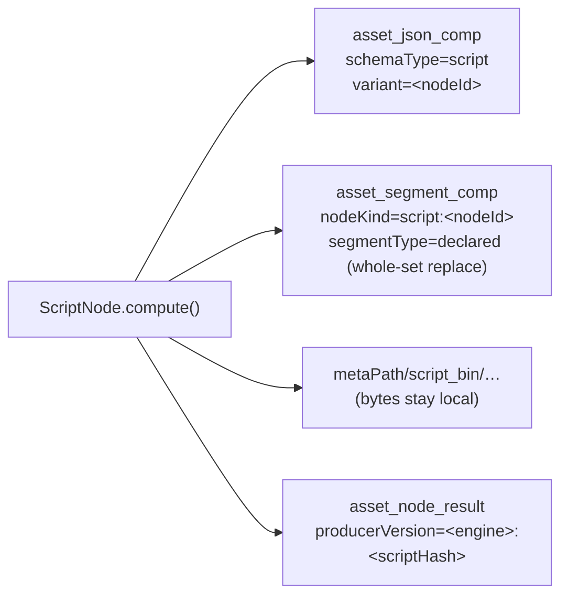

# Script Node — Status & Open Work

> **Status: shipped.** Kind `script`, module `cortex/nodes/script`, GraalJS 25.0.0, dynamic typed
> output ports resolved from the node's own `outputs` option, 50 unit tests + 2 integration tests +
> the seam and resolver tests listed in §1.
>
> This file is a **status page**: §1 says where everything lives; §2 onwards carry only what is still
> open or still non-obvious. It does not restate node lifecycle or persistence
> ([NODES.md](../features/nodes/NODES.md) §2), the port/content-type model
> ([../pipeline/NODE_DATA_TYPES.md](../features/pipeline/NODE_DATA_TYPES.md)), the engine
> ([../pipeline/PIPELINE.md](../features/pipeline/PIPELINE.md)) or the new-node checklist
> ([../../guidelines/NEW_NODE.md](../guidelines/NEW_NODE.md)).
>
> **The code is the source of truth** — where they disagree, fix this file in the same change
> ([../../guidelines/CODING.md](../guidelines/CODING.md)).

**What it is for.** The node catalogue is a closed set of compiled kinds; anything smaller than a
Maven module — glue between two nodes, a threshold, chapter marks from a transcript, reshaping an LLM
answer — had no home. `script` runs user-supplied JavaScript inside a pipeline, reads the media handle
and its wired inputs, and emits **many outputs across many data types** from one item.

**Non-goals, settled and unchanged:** true item fan-out (one media item → *N* downstream pipeline
items) is a `PipelineRunEngine` / `RunStateStore` change and belongs in
[../pipeline/PIPELINE.md](../features/pipeline/PIPELINE.md), not here; a general plugin system (a node needing
a model, native library or GPU stays a Java node with a sidecar); and untrusted multi-tenant
execution (§5).

---

## 1. Already implemented

| Item | Where it lives in code |
|---|---|
| Maven module | `cortex/nodes/script/` (parent + `core`, artifactId `cortex-script-node`); GraalVM polyglot **25.0.0** pinned in `core/pom.xml` (`polyglot` + `js-community`) |
| Node | `.../script/ScriptNode.java` — `KIND = "script"`, `SCHEMA_TYPE = "script"`, `BIN_DIR = "script_bin"`; `AbstractMediaNode<ScriptNodeOptions>` + `PipelineConfigurable` |
| Kind registration | `ScriptNodeModule` — `@Binds @IntoSet` + `@Binds @IntoMap @StringKey(ScriptNode.KIND)`; included from `cortex/cli/.../dagger/NodeCollectionModule.java`. **Not** `@Singleton` (fresh instance per task) |
| Input ports (static) | `IN_MEDIA` (`media/*`, ONE), `IN_DATA` (`struct/json`, ONE), `IN_TEXT` (`text/*`, ONE) |
| Output ports (dynamic) | Built from `ScriptOutputSpec.port()` — `OutputPort.many(...)` for list types, `OutputPort.one(...)` otherwise; MANY values fan out via `ctx.outputElement(port, …)` |
| Output type model | `ScriptValueType` (cortex side: contentType + cardinality + `binary` flag, `parse()`, `isList/isBinary/isJsonPayload`), `ScriptOutputSpec` (`record(key, type, segmentType)`) |
| Engine SPI | `ScriptEngine` / `CompiledScript` (+ `ScriptException`, `ScriptOutputException`); `GraalJsScriptEngine` (`ID = "js"`, `@Singleton`) + `GraalJsCompiledScript`. Bound `@Binds @IntoMap @StringKey(GraalJsScriptEngine.ID)` into `Map<String, ScriptEngine>`; `ScriptNode` injects `Map<String, Provider<ScriptEngine>>` and fails in `resolveEngine` listing the available ids |
| Script bindings | `ScriptBindings`, `ScriptOutputCollector`, `ScriptLogger`, `ScriptSignal`, `ScriptLimits` — installed bindings are **`media`, `data`, `params`, `out`, `log`, `ctx`** |
| Per-instance config seam | `io.metaloom.cortex.common.node.PipelineConfigurable`, invoked from `RegistryNodeRegistrar.adapt()` (`wrapped instanceof PipelineConfigurable`). Implementors: `ScriptNode`, `S3SinkNode` |
| Loom-side options | `PipelineGraphParser` reads `options`, falling back to `config` as a legacy alias |
| Editor parameter types | `ParameterType` = `STRING, INTEGER, NUMBER, BOOLEAN, ENUM, ENUM_SET, CODE, JSON`; `NodeParameter.language` / `.rows` |
| Port resolution (Java) | `NodePortResolver` SPI in `loom-shared/node-model`; `ScriptPortResolver` (`KIND = "script"`, reads the `outputs` option, never throws) registered via ServiceLoader alongside `LlmPortResolver`, `VlmPortResolver` |
| Port resolution (TS mirror) | `loom-ui/src/features/pipeline/portResolvers.ts` — `SCRIPT_OUTPUT_TYPES`, `hasPortResolver`, `resolveOutputPorts`/`resolveInputPorts`; consumed by `PipelineEditor.tsx` (handles `port-in-<id>-<port>` / `port-out-<id>-<port>`) |
| Descriptor | `ScriptDescriptorProvider` — `setOutputPorts(List.of())` + `setDynamicPorts(true)`, three optional inputs matching the node |
| Persistence | one `asset_json_comp` (`schemaType=script`, `variant=<nodeId>`); `createAssetSegmentComps` per `TIMEFRAMES` output under `nodeKind = "script:<nodeId>"`; `IMAGE`/`IMAGE_LIST` bytes → `metaPath/script_bin/…`; ledger `producerVersion = "<engineId>:<sha256(script)[0:12]>"` |
| Cache | `LocalResultCache<String>` (10 000 entries) keyed `absolutePath + "\|" + scriptHash` |
| Tests | `ScriptNodeTest` (23), `ScriptOptionsValidationTest` (15), `ScriptNodePipelineTest` (7), `ScriptNodePersistenceTest` (5); `integration-test/.../node/ScriptNodeIntegrationTest` (2); `cortex/cli/.../PipelineConfigurableTest` (~9, incl. `testScriptKindIsExecutable`, `testTwoScriptNodesGetIndependentInstances`); `loom-shared/node-model/.../NodePortResolverTest` (10, 4 script-specific); `loom-ui/src/features/pipeline/portResolvers.test.ts` (vitest); `loom-ui/e2e/pipeline-ports-mocked.spec.ts` (dynamic handles + option round-trip) |
| Docs & demo | `website/content/english/docs/nodes/script/index.adoc`; `DemoDatabaseInitializer` pipeline **"Reading Time (Script)"** (`filesystem-source → tika → script`), whose seeded script is itself executed by `ScriptNodeTest.shouldRunTheDemoReadingTimeScript` |

### Declared output types

Declared in the `outputs` option, resolved into ports before the script ever runs — the editor must be
able to draw handles and validate edges up front. Values are runtime; keys and types are configuration.

| Type | Content type | Cardinality | Persistence |
|---|---|---|---|
| `STRING` | `scalar/string` | ONE | JSON-comp field |
| `TEXT` | `text/plain` | ONE | JSON-comp field |
| `INTEGER` | `scalar/integer` | ONE | JSON-comp field |
| `NUMBER` | `scalar/number` | ONE | JSON-comp field |
| `BOOLEAN` | `scalar/boolean` | ONE | JSON-comp field |
| `JSON` | `struct/json` | ONE | JSON-comp field |
| **`TEXT_LIST`** | `text/plain` | **MANY** | JSON-comp field |
| `TIMEFRAMES` | `struct/segments` | ONE | `createAssetSegmentComps` under the output's declared `segmentType` |
| `IMAGE` | `artifact/image` | ONE (binary) | bytes → `script_bin`, ledger only |
| **`IMAGE_LIST`** | `artifact/image` | **MANY** (binary) | bytes → `script_bin`, ledger only |
| `PATH` | `artifact/file` | ONE | JSON-comp field |

Declared **and** set → coerced, validated, emitted. Declared and **not** set → omitted (downstream sees
nothing — normal). **Not** declared but set → **hard failure**, so a typo cannot make the drawn graph
lie about what flows down an edge.

⚠️ **This table exists three times** — `ScriptValueType` (cortex), `ScriptPortResolver.ScriptOutputType`
(node-model, package-private) and `SCRIPT_OUTPUT_TYPES` (TypeScript). Nothing mechanically compares
them; see §3.

### Script-facing binding contract

This is the **public API of the node** — pipeline authors write against it, so change it only additively.

| Binding | Shape |
|---|---|
| `media` | `{ path, absolutePath, size, sha512, isVideo, isImage, isAudio, isDocument, mimeType }` — a read-only façade, **not** the `LoomMedia` handle (which would leak `file()`/`open()` past the sandbox) |
| `data` | the wired `IN_DATA` / `IN_TEXT` payload |
| `params` | free-form JSON object from `ScriptNodeOptions.params`, so one script serves several node instances |
| `out` | `out.text(k,v)` `out.number` `out.integer` `out.bool` `out.json` `out.list` `out.timeframes` `out.image(k, bytes\|path)` `out.set` — the **only** way to produce results |
| `log` | `log.info/warn/error(msg)` → node logger, prefixed `[<nodeId>]`, capped at `maxLogLines` |
| `ctx` | `ctx.skip(reason)` · `ctx.fail(msg)` → `SKIPPED` / `FAILED`; both stop the script |

---

## 2. Options and environment

`ScriptNodeOptions`, config key `script`, set **per pipeline-node instance** (not per worker).

| Field | Default | Purpose |
|---|---|---|
| `engine` | `js` | Engine id; must exist in the engine map |
| `script` | — | The script body. **Required** |
| `outputs` | `[]` | Declared `{key, type, segmentType?}` list. Keys must match `^[a-z0-9][a-z0-9_]{0,62}$` |
| `params` | `{}` | Constants handed to the script as `params` |
| `requiredInputs` | `[]` | `nodeId:outputKey` entries; all must be present or the node **skips** |
| `trusted` | `true` | Sandbox off/on (§5) |
| `allowNetwork` | `false` | *Intended* to expose an `http` binding — **inert today** (§3) |
| `allowFilesystem` | `false` | *Intended* to expose a read-only `fs` binding — **inert today** (§3) |
| `timeoutMs` | `10000` | Wall-clock budget per media item. Inherited from `AbstractNodeOptions` (which defaults to `0` = no timeout); `ScriptNodeOptions` re-defaults it and **rejects `0`** |
| `statementLimit` | `10_000_000` | Runaway-loop guard |
| `maxOutputBytes` | `1048576` | Cap on the encoded output bag |
| `maxLogLines` | `200` | Cap on `log.*` calls |
| `enabled` / `processIncomplete` / `retryFailed` | inherited | `AbstractNodeOptions` |

`validate()` rejects: blank `script`, unknown `engine`, empty/duplicate/malformed `outputs`, a
`segmentType` on a non-`TIMEFRAMES` output, two `TIMEFRAMES` outputs sharing a segment type, malformed
`requiredInputs`, and non-positive `timeoutMs` / `maxOutputBytes` / `maxLogLines`.

No dedicated environment variables. Relevant existing ones:

| Variable | Default | Relevance to `script` |
|---|---|---|
| `CORTEX_META_PATH` | — | Parent of `script_bin/`, where `IMAGE` outputs are written |
| `CORTEX_NODE_BLACKLIST` | — | `script` refuses the kind on a worker — **the operational kill switch** (§5); blacklist beats whitelist |
| `CORTEX_NODE_WHITELIST` | all registered kinds | Omit `script` to confine scripting to dedicated workers |
| `CORTEX_CONF_FILENAME` | `cortex.yml` | A `nodes.script` block gives worker-level defaults a node instance layers over. ⚠️ The YAML layer is **not read on the server path** — see [../../cortex/CONFIGURATION.md](../../cortex/CONFIGURATION.md) |

---

## 3. Progress Assessment

### Done

- [x] Module, node, options + validation, Dagger `@StringKey("script")`, non-singleton proven by test
- [x] Engine SPI + `@IntoMap @StringKey("js")` engine registry; GraalJS 25.0.0 pinned and verified on stock JDK 25
- [x] Bindings `media` / `data` / `params` / `out` / `log` / `ctx`; compile-once-per-`(script, limits)` in `configure(...)`
- [x] Declared-output coercion; undeclared key = hard failure
- [x] Static input ports + **dynamic output ports** from the `outputs` option, with `TEXT_LIST` / `IMAGE_LIST` → MANY
- [x] `NodePortResolver` SPI + `ScriptPortResolver` + the TypeScript mirror and its vitest contract test
- [x] Persistence: `asset_json_comp` (`variant = nodeId`), `asset_segment_comp` per `TIMEFRAMES`, `script_bin` bytes, ledger with the script-digest producer version
- [x] `LocalResultCache` keyed by path **+ script hash**
- [x] Sandbox `trusted=false`: `HostAccess.EXPLICIT`, no host class lookup, no IO, no threads
- [x] Watchdog (`Context.close(true)`) + `ResourceLimits.statementLimit`, both verified on the Truffle fallback interpreter
- [x] Node-options path fixed end to end: editor emits `options`, `PipelineGraphParser` accepts `config` as a legacy alias, `PipelineConfigurable` seam invoked from `RegistryNodeRegistrar.adapt()`, `ParameterType.CODE` + `JSON` rendered, per-node connector override, sidebar edits mirrored onto the canvas
- [x] [NODES.md](../features/nodes/NODES.md) updated (§2/§3/§5/§5.1/§10/§12); website page; "Reading Time (Script)" demo pipeline, executed by a test

### Open

- [ ] **`script` is not actually port-conformance tested.** `NodePortConformanceTest.DYNAMIC_KINDS =
      Set.of("script", "llm", "vlm")` exempts *outputs* from comparison — but the test's `NODE_KINDS`
      map (23 classes) contains no `ScriptNode` entry at all, so the loop never reaches the node and
      its **inputs are unchecked too**. Either add `ScriptNode` to `NODE_KINDS` (the exemption then
      does its job) or delete the dead exemption.
- [ ] **Nothing keeps the three copies of the output-type table in step.** `ScriptValueType`,
      `ScriptPortResolver.ScriptOutputType` and `portResolvers.ts`'s `SCRIPT_OUTPUT_TYPES` are
      hand-mirrored, and `portResolvers.test.ts` explicitly re-states the Java expectations by hand
      rather than consuming a generated fixture. The javadoc on `ScriptValueType` and
      `ScriptPortResolver` claims `NodePortConformanceTest` "keeps them in step" — it does not.
      Generate the TS table from the Java enum, or add a test that diffs all three.
- [ ] **`http` / `fs` bindings are specified but not implemented.** `allowNetwork` / `allowFilesystem`
      are carried on `ScriptNodeOptions`, validated, threaded into `ScriptLimits` and shown as
      descriptor parameters — but `GraalJsCompiledScript.install()` installs only `media`, `data`,
      `params`, `out`, `log`, `ctx`, and `newContext()` never reads either flag. A script asking for
      `http` gets `undefined`, and a *trusted* script gets `allowAllAccess(true)` regardless.
- [x] **The documented `upstream` binding does not exist.** *(fixed 2026-08-05)* Both the website
      page and the default script body — `ScriptNodeOptions.script`'s `@ParamDoc(defaultValue=...)`,
      which is what **every new script node is created with** — showed
      `upstream['whisper']['transcript']`, and a script copied from either died with
      `ReferenceError: upstream is not defined`. Both now document the real bindings:
      `media`/`data`/`params`/`out`/`log`/`ctx`, with wired text arriving as `data.text`.
      Regenerate `node-descriptors.json` after touching the `@ParamDoc` — see
      `NodeSpecGoldenTest`.
- [ ] **Memory is unbounded.** Heap and CPU-time `ResourceLimits` need the optimized Truffle runtime,
      which a stock JDK does not provide. `statementLimit` and the wall-clock watchdog are the only
      guards. **Do not claim a memory bound.**
- [ ] **Stale javadoc:** `ScriptNode` and `ScriptNodeModule` both point at a `ScriptNodeSingletonTest`
      that does not exist — the real guard is `PipelineConfigurableTest.testTwoScriptNodesGetIndependentInstances`.
- [ ] **No metrics.** `ScriptNode` makes no `CortexMetrics` call; its cache hits and execution times
      are invisible. (`ImageGenNode` / `WhisperNode` are the instrumentation pattern.)
- [ ] **No e2e coverage of the `CODE` parameter field.** Dynamic connectors *are* covered by
      `loom-ui/e2e/pipeline-ports-mocked.spec.ts`, but nothing exercises the script-body editor, and
      the parameter inputs in `PipelineEditor.tsx` carry no `data-testid` to hook onto.
- [ ] **The polyglot artifact-size cost was never measured.** `polyglot` + `js-community` is the
      largest dependency the worker takes on; record the shaded `cortex/cli` jar and container image
      delta.
- [ ] **`ParameterType` drift between Java and TS persists.** The UI branches on `FLOAT` and
      `STRING_LIST`, which the Java enum does not define (it has `NUMBER` and `ENUM_SET`). Worth a
      separate reconciliation task — do not widen it.

### Deliberately not built

- [ ] ~~True item fan-out~~ — a `PipelineRunEngine` / `RunStateStore` change; specify it in
      [../pipeline/PIPELINE.md](../features/pipeline/PIPELINE.md), never smuggled in behind a node.
- [ ] ~~Loom-stored versioned script entity~~ — inline-in-the-definition was chosen so the script is
      versioned with the pipeline. Revisit if reuse across pipelines becomes real; the
      `skill` / `skill_version` pair is the model to copy.
- [ ] ~~A second engine~~ — GraalPy (startup + memory), expression languages (cannot express the
      output model), in-memory Java (no isolation, and `examples/cortex-custom-node/` already covers
      "I want Java") and WASM (wrong ergonomics for six lines of glue) were all surveyed and rejected.
      The SPI is insurance, not a queue. **Why GraalJS:** on JDK 25 `SecurityManager` is gone, so no
      JVM-native engine can be constrained beyond an AST allow-list; GraalJS's `Context.Builder` is an
      actual capability model. A second engine whose sandbox did not hold would make the `trusted`
      switch mean different things per engine.

---

## 4. Persistence



Everything is guarded by `asset != null && client() != null`, so offline mode is a clean no-op, and
everything is best-effort: a persistence failure is logged and recorded in the ledger, never thrown.
The script-digest producer version gives this node the per-script versioning
[NODES.md](../features/nodes/NODES.md) §10 lists as missing everywhere else.

Three things the schema forced on the design, and they are load-bearing:

1. **`segmentType` cannot be the output key.** `asset_segment_comp` CHECK-constrains `segment_type` to
   `SCENE | SILENCE | SHOT | CHAPTER` (migration `V2.42`) — an arbitrary key is rejected by the
   database as a 500, not at compile time. A `TIMEFRAMES` output therefore declares its own
   `segmentType` (default `CHAPTER`), validated up front, and two timeframe outputs on one node must
   use different ones.
2. **Segment rows are scoped `script:<nodeId>`.** The replace-set key is
   `(asset, node_kind, segment_type)`; under a plain `script` kind a second script node writing
   CHAPTER marks would delete the first node's. The ledger and the JSON component still use the plain
   `script` kind — only the segment rows carry the scoped one. (Segment `producerVersion` is
   `<engine>:<hash>;unit=ms`.)
3. **`timeoutMs` is the inherited option, not a new one** — re-defaulted to 10 s and `0` rejected,
   because a script node must never run unbounded. The inherited setter returns `void` and does not chain.

**No Flyway migration was needed**, so `./setup-pool.sh` is only the normal pre-test step.

---

## 5. Trust, sandbox and limits

**Permission to edit a pipeline is permission to execute code on a worker.** That is the honest
statement of the model and it appears in the website documentation. Existing mitigations to point at
rather than reinvent:

- `MANAGE_PIPELINE` gates who may author definitions ([../permissions/PERMISSIONS.md](../features/permissions/PERMISSIONS.md)).
- `CORTEX_NODE_BLACKLIST=script` disables the kind on a worker outright — **the kill switch**.
- Loom rejects a run with **503** when no online worker accepts a kind in the graph, so a fleet-wide
  blacklist produces a clear error rather than a stalled run.

| | `trusted = true` (default) | `trusted = false` |
|---|---|---|
| Host access | `allowAllAccess(true)` | `HostAccess.EXPLICIT`, restricted to the binding façade classes |
| Class lookup | unrestricted | `allowHostClassLookup(c -> false)` |
| I/O | unrestricted | `allowIO(false)` |
| Threads | allowed | `allowCreateThread(false)` |

Always on in both modes: the wall-clock `timeoutMs` watchdog (`Context.close(true)`), the
`statementLimit`, `maxOutputBytes` over the encoded bag, and `maxLogLines`. Verified by running, not
by reading: `statementLimit` cancels a spinning script on the fallback runtime; the watchdog cancels
what the statement counter would not; `HostAccess.EXPLICIT` + `allowHostClassLookup(false)` blocks
`Java.type('java.lang.System')` while the trusted path still reaches it. **Memory is not bounded.**

---

## 6. Conventions and Gotchas

| Area | Gotcha |
|---|---|
| **Cache key must include the script** | Every other node keys `LocalResultCache` by `media.absolutePath()`. `ScriptNode` keys `absolutePath + "\|" + scriptHash`; without it, editing a script silently re-emits stale results for the worker's lifetime with no invalidation short of a restart |
| **`ScriptNode` must never be `@Singleton`** | Per-instance configuration mutates the node. `NodeTaskRunner` creates one per task via `Provider.get()`; `@Singleton` would let two concurrent script nodes overwrite each other's script |
| **`PipelineNode.timeoutMs()` is enforced by nothing** | It is parsed by `adapt()`, stored on `AbstractPipelineNode`, and never read back — the executor that applied it no longer exists. The node owns its own wall clock |
| **`ctx.failure(cause).next()` returns SUCCESS** | Only `abort()` yields `FAILED`. Every failure test written against `.next()` passes while asserting the wrong thing. `ScriptNode` uses `.abort()`; eleven other nodes still do not ([NODES.md](../features/nodes/NODES.md) §10) |
| **Compile once, execute many** | Compile in `configure(...)`, never in `compute(...)` — a per-item compile turns a 2 ms script into a 200 ms one |
| **Undeclared output = failure** | Deliberate: a silently-dropped typo would make the graph lie about what flows down an edge |
| **`out.image` bytes stay local** | There is no Loom byte-ingest endpoint for produced media. Downstream consumers get a **path on that worker** — meaningful only to nodes on the same worker (use an `affinity` group) or to `S3SinkNode`. Cross-node gap, tracked in [../rest/REST_CORTEX_METADATA_BINARY_HANDLING_PLAN.md](REST_CORTEX_METADATA_BINARY_HANDLING_PLAN.md) |
| **Segment outputs are whole-set replace** | Correct for re-runs (a shorter re-run deletes the surplus), but two `TIMEFRAMES` outputs must not share a `segmentType` — the second would wipe the first |
| **`SecurityManager` is unavailable** | JDK 25. Never propose a policy-file sandbox for any JVM engine |
| **GraalJS is interpreted here** | No Graal JIT on a stock JDK — Truffle fallback interpreter (warning suppressed). Glue logic only; do not ship per-frame processing as a script |
| **`ScriptPortResolver` must never throw** | It runs inside the editor's port resolution on half-typed JSON. Malformed entries are skipped, not fatal — the TS mirror does the same, and `parseOption` also tolerates the option being raw JSON *text*, which is how the parameter editor holds it |
| **`PipelineEditor.tsx` contains NUL bytes** | Plain `grep` finds nothing in it; use `grep -a` |

---

## 7. Test setup

```bash
mvn -T 8 test -pl cortex/nodes/script -am            # 50 node tests, real GraalJS, no Loom
mvn test -pl cortex/cli -Dtest=PipelineConfigurableTest
mvn test -pl loom-shared/node-model -Dtest=NodePortResolverTest
./setup-pool.sh && mvn verify -pl integration-test   # ScriptNodeIntegrationTest
cd loom-ui && npx vitest run src/features/pipeline/portResolvers.test.ts
cd loom-ui && npm run test:e2e -- pipeline-ports-mocked
```

| Test | Asserts |
|---|---|
| `ScriptNodeTest` | Real GraalJS against a temp file: declared outputs and their types; `TIMEFRAMES` / `TEXT_LIST` multi-value round-trip; undeclared key fails; `ctx.skip()` → SKIPPED, `ctx.fail()` → FAILED; an infinite loop is killed by `timeoutMs`; `trusted=false` cannot reach `java.lang.System`; changed script misses the cache; the script digest is the producer version; the demo "Reading Time" script runs |
| `ScriptOptionsValidationTest` | Blank script, unknown engine, empty/duplicate/malformed `outputs`, segment-type rules, malformed `requiredInputs`, non-positive limits |
| `ScriptNodePipelineTest` | The node inside a DAG with mocked upstreams; missing required input → SKIPPED |
| `ScriptNodePersistenceTest` | With a `LoomClientMock`: json comp `variant = nodeId`, segment comps per `TIMEFRAMES` key, ledger `producerVersion = "js:<hash>"`. ⚠️ Do **not** pass a null client — that silently skips all write-back coverage |
| `PipelineConfigurableTest` | Options survive editor JSON → `PipelineGraphParser` (incl. the `config` legacy alias) → `NodeTask` → `PipelineConfigurable.configure`; `script` is executable; two instances carry independent scripts |
| `NodePortResolverTest` / `portResolvers.test.ts` | Java and TS resolvers agree on the 11 output types, the MANY cardinalities, raw-JSON options, case-insensitivity and graceful degradation |
| `ScriptNodeIntegrationTest` | Real in-process Loom + pooled Postgres: the JSON comp and the segment comps land and read back over REST |
| `pipeline-ports-mocked.spec.ts` | A script's handles come from its `outputs` option (`data-cardinality=MANY` for `TEXT_LIST`) and the option survives a save |

**Manual E2E** (nothing substitutes for it): `./start-demo.sh`, build a `filesystem-source → tika →
script` pipeline in the editor, run it, confirm the outputs land on the asset.

---

## 8. Key Classes Reference

| Class | Package / path | Purpose |
|---|---|---|
| `ScriptNode` | `io.metaloom.cortex.node.script` (cortex/nodes/script) | The node; `AbstractMediaNode<ScriptNodeOptions>` + `PipelineConfigurable`; `KIND`, input ports, cache key, persistence |
| `ScriptNodeOptions` | same | Options + `validate()` (§2) |
| `ScriptNodeModule` | same | Dagger: `@IntoSet`, `@IntoMap @StringKey(ScriptNode.KIND)`, engine binding, option deserializer info |
| `ScriptValueType` / `ScriptOutputSpec` | same | Declared output model: content type, cardinality, binary flag, `segmentType` |
| `ScriptEngine` / `CompiledScript` | `…node.script.engine` | Engine SPI |
| `ScriptBindings` / `ScriptOutputCollector` / `ScriptLogger` / `ScriptSignal` / `ScriptLimits` | same | The script-facing façade, output bag, log cap, skip/fail signals, limits record |
| `GraalJsScriptEngine` / `GraalJsCompiledScript` | `…node.script.engine.js` | GraalJS implementation; `ID = "js"`; context construction, sandbox, watchdog, binding installation |
| `PipelineConfigurable` | `io.metaloom.cortex.common.node` | Per-pipeline-node-instance configuration seam |
| `RegistryNodeRegistrar` | `io.metaloom.cortex.cli.dagger` | `adapt()` — where the seam is invoked |
| `NodeTaskRunner` | `io.metaloom.cortex.runtime` | Per-task node instantiation (`Provider.get()`) and option flattening |
| `NodePortResolver` / `ScriptPortResolver` | `io.metaloom.loom.nodes.spec` (loom-shared/node-model) | Dynamic output-port resolution from the `outputs` option |
| `ScriptDescriptorProvider` | same | UI palette + edit form; `dynamicPorts = true`, empty static outputs |
| `ParameterType` / `NodeParameter` | same | `CODE` + `JSON`, `language`, `rows` |
| `PipelineGraphParser` | `io.metaloom.loom.pipeline.graph` | Reads `options`, `config` as a legacy alias |
| `portResolvers.ts` | `loom-ui/src/features/pipeline` | The TypeScript mirror the editor draws handles from |
| `SegmentCompCreateRequest` / `JsonCompCreateRequest` | `io.metaloom.loom.rest.model.*` | Timeframe and scalar/list/JSON persistence |

---

## 9. Where do I find …?

| Need | Path |
|---|---|
| The node and its input ports | `cortex/nodes/script/core/src/main/java/io/metaloom/cortex/node/script/ScriptNode.java` |
| The output type table (cortex) | `.../script/ScriptValueType.java` + `ScriptOutputSpec.java` |
| The GraalJS context, sandbox and watchdog | `.../script/engine/js/GraalJsCompiledScript.java` |
| The installed script bindings | `.../script/engine/ScriptBindings.java` (and `install()` in `GraalJsCompiledScript`) |
| The output type table (Java, editor side) | `loom-shared/node-model/.../spec/ScriptPortResolver.java` |
| The output type table (TypeScript) | `loom-ui/src/features/pipeline/portResolvers.ts` + `portResolvers.test.ts` |
| Where kinds become executable | each `*NodeModule` (`@StringKey`) + `cortex/cli/.../dagger/NodeCollectionModule.java` |
| Where per-instance options reach the node | `RegistryNodeRegistrar.adapt()` → `PipelineConfigurable.configure(...)` |
| Where node options are parsed on the Loom side | `loom/pipeline/.../graph/PipelineGraphParser.java` |
| The pipeline editor | `loom-ui/src/features/pipeline/PipelineEditor.tsx` (⚠️ `grep -a`) |
| Port-vs-descriptor conformance (and its `DYNAMIC_KINDS` gap) | `integration-test/.../node/NodePortConformanceTest.java` |
| The kill switch | [NODES.md](../features/nodes/NODES.md) §11, `CORTEX_NODE_BLACKLIST` |
| A reference node to copy | `cortex/nodes/sentiment/` (options + JSON comp + `variant`) |
| A node that writes timeframes / produced bytes | `cortex/nodes/scene-detection/` · `cortex/nodes/tts/`, `cortex/nodes/image-generation/` |
| The demo pipeline and its script | `loom/core/.../boot/DemoDatabaseInitializer.java` (`DEMO_PIPELINE_SCRIPT`, `scriptDefinition()`) |
| Customer-facing docs | `website/content/english/docs/nodes/script/index.adoc` (⚠️ stale `upstream` binding — §3) |
| The produced-bytes ingest gap | [../rest/REST_CORTEX_METADATA_BINARY_HANDLING_PLAN.md](REST_CORTEX_METADATA_BINARY_HANDLING_PLAN.md) |

---
_Git HEAD revision: `742dae2d`_
_Last updated: 2026-08-06 (reference sweep — no content changes)_