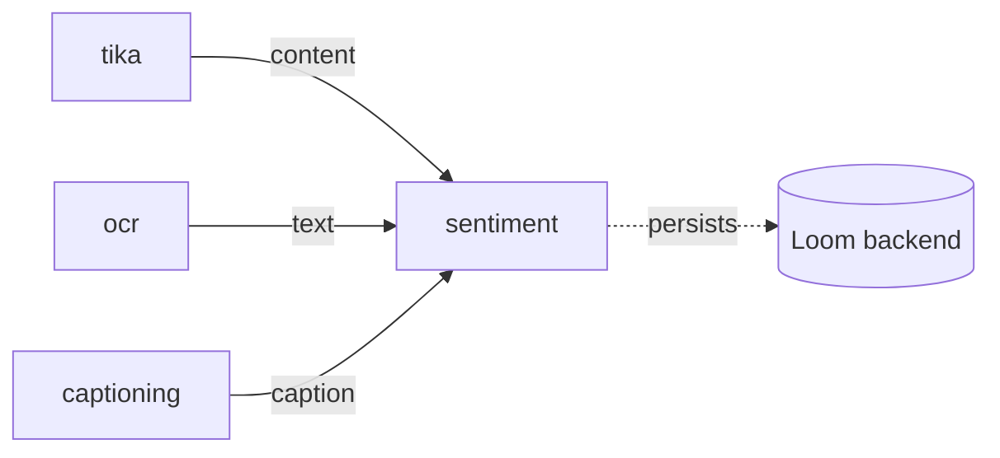

# Sentiment Analysis Node — Status & Remaining Work

> ## 🟢 SHIPPED — the `sentiment` node is built, wired and executable
>
> Node kind `sentiment`, code in [cortex/nodes/sentiment](../../../cortex/nodes/sentiment),
> sidecar in [sidecars/sentiment](../../../sidecars/sentiment). The kind is bound with
> `@Binds @IntoMap @StringKey("sentiment")`, the descriptor is registered via ServiceLoader,
> customer docs exist, and 25 unit tests + one integration test cover it.
>
> **The commercial-license model decision is SETTLED** (§2): DE → `oliverguhr/german-sentiment-bert`
> (MIT), EN → `cardiffnlp/twitter-roberta-base-sentiment-latest` (CC-BY-4.0, attribution),
> fallback → `lxyuan/distilbert-base-multilingual-cased-sentiments-student` (Apache-2.0).
> Those are the shipped sidecar defaults and are documented in `setup.sh`, the sidecar README
> and the website page.
>
> **Two things changed after this plan was written and the plan text was stale until now:**
> 1. The `textSources` option is **gone**. The node no longer picks its own upstream source —
>    it declares a typed `text` **input port** and the pipeline edge decides what feeds it
>    (see [../pipeline/NODE_DATA_TYPES.md](../pipeline/NODE_DATA_TYPES.md)).
> 2. Consequently `variant` is now `""` (one sentiment row per asset) and the persisted payload
>    no longer carries a `source` block.
>
> **Still genuinely open:** no sentiment checkpoint has ever been loaded in this checkout
> (`sidecars/sentiment/.venv` does not exist), and `SentimentNodeIntegrationTest` still asserts
> the pre-port-model payload shape. See §3.
>
> Source of truth is the code under `cortex/`. Node reference: [NODES.md](NODES.md).

---

## 1. Already implemented

| Item | Where it lives |
|---|---|
| Node | [`SentimentNode`](../../../cortex/nodes/sentiment/core/src/main/java/io/metaloom/cortex/node/sentiment/SentimentNode.java) — `name()="sentiment"`, extends `AbstractMediaNode<SentimentNodeOptions>` |
| Typed ports | `IN_TEXT` (`text`, `TEXT_ANY`, ONE) → `OUT_LABEL` (`label`, `SCALAR_STRING`), `OUT_SCORE` (`score`, `SCALAR_NUMBER`), `OUT_RESULT` (`result`, `STRUCT_JSON`) |
| Sidecar client | [`SentimentClient`](../../../cortex/nodes/sentiment/core/src/main/java/io/metaloom/cortex/node/sentiment/SentimentClient.java) — `analyze(text, lang, modelOverride)`, `POST /v1/sentiment`, HTTP/1.1 forced |
| Options | [`SentimentNodeOptions`](../../../cortex/nodes/sentiment/core/src/main/java/io/metaloom/cortex/node/sentiment/SentimentNodeOptions.java) — `KEY="sentiment"` (§4) |
| Dagger bindings | [`SentimentNodeModule`](../../../cortex/nodes/sentiment/core/src/main/java/io/metaloom/cortex/node/sentiment/SentimentNodeModule.java) — `@IntoSet` + `@IntoMap @StringKey("sentiment")` + `optionInfo()` + client provider |
| Module registration | [cortex/nodes/pom.xml](../../../cortex/nodes/pom.xml), [cortex/processor/pom.xml](../../../cortex/processor/pom.xml), [integration-test/pom.xml](../../../integration-test/pom.xml), `NodeCollectionModule` |
| UI descriptor | [`SentimentDescriptorProvider`](../../../loom-shared/node-model/src/main/java/io/metaloom/loom/nodes/spec/SentimentDescriptorProvider.java) + `META-INF/services/io.metaloom.loom.nodes.spec.NodeDescriptorProvider` |
| Sidecar | [sidecars/sentiment/](../../../sidecars/sentiment) — `server.py`, `requirements.txt`, `setup.sh`, `run.sh`, `README.md`; port `9110` |
| Sidecar features | language routing (`de`/`en`/fallback, `auto` via `lingua`), sentence-boundary chunking + length-weighted aggregation, label normalisation → `POSITIVE\|NEUTRAL\|NEGATIVE` + signed `polarity`, per-request `models` overrides, `GET /health` |
| In-heap skip cache | `LocalResultCache<String>` (10 000 entries) keyed by `media.absolutePath()`; hit ⇒ re-emit + `ResultOrigin.LOCAL`, **no re-persist** |
| Metrics | `metrics.recordAiCall("sentiment", ok, ms)` / `recordAiCacheHit("sentiment")` |
| Persistence | `asset_json_comp` — `nodeKind="sentiment"`, `schemaType="sentiment"`, `variant=""`, `producerVersion=<model id>`; then `recordNodeResult(..., resultRef("asset_json_comp", uuid))`. **No Flyway migration, no jOOQ regen.** |
| Unit tests (25) | `SentimentNodeTest` (8), `SentimentNodePipelineTest` (6), `SentimentOptionsValidationTest` (8), `SentimentNodePersistenceTest` (3) + AssertJ helpers, all under `cortex/nodes/sentiment/core/src/test/...` |
| Integration test | [`SentimentNodeIntegrationTest`](../../../integration-test/src/test/java/io/metaloom/loom/test/integration/node/SentimentNodeIntegrationTest.java) — real Loom + pooled Postgres, stub `SentimentClient` ⚠️ **stale assertions, see §3** |
| Port conformance | `NodePortConformanceTest` maps `SentimentNode` → `sentiment`; not a `DYNAMIC_KINDS` member, so its ports must match the descriptor exactly |
| Kind-registration guard | `NodeRegistrarTest` executable-kind assertion; `NodeDescriptorServiceLoaderTest` spot-check list |
| Customer docs | `website/content/english/docs/nodes/sentiment/index.adoc` + `nodes/_index.adoc` |
| Spec entries | [NODES.md](NODES.md) §2/§3/§5/§12, [spec/CONTEXT.md](../../CONTEXT.md), [sidecars/README.md](../../../sidecars/README.md) |

### Shipped data flow

```mermaid
sequenceDiagram
    participant P as Pipeline
    participant N as SentimentNode
    participant S as sentiment sidecar<br/>(FastAPI :9110)
    participant L as LoomClient

    P->>N: process(ctx) with the text port wired
    N->>N: isProcessable → ctx.input(IN_TEXT) non-blank
    N->>N: LocalResultCache.get(path) — hit? re-emit, ResultOrigin.LOCAL, skip persist
    N->>S: POST /v1/sentiment {texts:[text], lang, models?}
    S->>S: detect language → pick model → chunk → classify → length-weighted aggregate
    S-->>N: {label, score, polarity, scores, lang, model, chunks, truncated}
    N->>N: payload = response + textChars; ctx.output(label/score/result); cache.put
    N->>L: createAssetJsonComp(schemaType="sentiment", variant="")
    N->>L: recordNodeResult(SUCCESS, resultRef("asset_json_comp", uuid))
```

Placement is now an **edge**, not a node-internal source list — anything producing `text/*`
can feed it:



### Persisted payload (`asset_json_comp.data`)

```jsonc
{ "label": "NEGATIVE", "score": 0.87, "polarity": -0.81,
  "scores": { "positive": 0.06, "neutral": 0.07, "negative": 0.87 },
  "lang": "de", "model": "oliverguhr/german-sentiment-bert",
  "chunks": 12, "truncated": false, "textChars": 4211 }
```

---

## 2. Model selection — SETTLED

The constraint was **commercial usability**, not raw accuracy. All three shipped checkpoints
are ≤135M-parameter, 3-class encoders that normalise onto one label schema and run on CPU.
Model ids are options (§4), so a swap is configuration, not code.

| Role | Model | License | Note |
|---|---|---|---|
| DE default | `oliverguhr/german-sentiment-bert` | **MIT** | F1 0.9639 over 1.834M German samples (model card) |
| EN default | `cardiffnlp/twitter-roberta-base-sentiment-latest` | **CC-BY-4.0** | Commercial use allowed, **attribution required** — the model id is recorded in every payload and named on the website page |
| Fallback / attribution-free swap | `lxyuan/distilbert-base-multilingual-cased-sentiments-student` | **Apache-2.0** | 12 languages incl. DE + EN; set `SENTIMENT_MODEL_EN`/`modelEn` to this when attribution cannot be carried |

**Rejected, and why it still matters:** `tabularisai/multilingual-sentiment-analysis` is the top
hit for "multilingual sentiment" and is ⛔ **CC-BY-NC-4.0** — never adopt it or its forks.
`siebert/sentiment-roberta-large-english` and `cardiffnlp/twitter-xlm-roberta-base-sentiment`
state **no license**. `distilbert-base-uncased-finetuned-sst-2-english` and
`clapAI/modernBERT-*-multilingual-sentiment` are clean but **binary** (no neutral), so they cannot
share the schema. `nlptown/bert-base-multilingual-uncased-sentiment` emits **1–5 stars**, a
different output space. `scherrmann/GermanFinBert_SC_Sentiment` is a viable per-deployment
`modelDe` override for German financial text only.

⚠️ The accuracy figures above are **model-card claims** — none has been measured on this corpus (§3).

---

## 3. Open work

### 3.1 Blocking — verification gaps in what already shipped

**No sentiment model has ever been loaded in this checkout.** `sidecars/sentiment/.venv` does not
exist, so `./setup.sh` has never run. Every test to date substitutes the `SentimentClient` or the
whole pipeline; the pure-Python sidecar logic was exercised with a stub tokenizer and stub pipeline
only. The manual E2E is therefore outstanding:

```bash
cd sidecars/sentiment && ./setup.sh && ./run.sh        # uvicorn server:app --port 9110
curl -s localhost:9110/health
curl -s localhost:9110/v1/sentiment -H 'Content-Type: application/json' \
  -d '{"texts":["Der Kundenservice war eine Katastrophe."],"lang":"auto"}'
# expected: [{"label":"NEGATIVE","lang":"de","model":"oliverguhr/german-sentiment-bert",...}]
```

Then run a pipeline that wires `tika.content → sentiment.text` over a German and an English
document and read the rows back via `GET /api/v1/assets/:uuid/json-comps`. Until this is done the
following are unproven: weights download and load; `lingua` actually picks `de`/`en`; the **real**
word-piece tokenizer keeps chunks under 512; the wire format matches what `SentimentClient` parses.

**Accuracy has never been validated on a real corpus.** §2's numbers are model-card claims. A small
labelled sample from the actual asset mix would confirm the language-routed choice beats the single
multilingual fallback — the premise the whole §2 recommendation rests on.

**`SentimentNodeIntegrationTest` carries pre-port-model assertions.** Lines 79 and 83 assert
`comp.getVariant() == "tika_content"` and `comp.getData().getJsonObject("source").getString("nodeId") == "tika"`.
The node writes `variant=""` and no `source` block at all, so those two assertions cannot pass
against the current code. Fix the test to assert `variant=""` and drop the `source` check — do not
"fix" the node back, the port model is deliberate.

**`ctx.failure(msg).next()` does not produce a FAILED result.** `NodeContextImpl.next()` only
inspects `skipReason`; the recorded `failureCause` is ignored and only `abort()` yields
`ResultState.FAILED`. `SentimentNode` follows the repo-wide idiom rather than being the lone
exception, so on a sidecar error the observable outcome is: no outputs, nothing cached, a FAILED
**ledger** row, but a SUCCESS node result. Fixing `next()` touches ~10 nodes and is a repo-wide
change, not a sentiment change.

### 3.2 Documentation drift to correct alongside

- The website page and the sidecar README still describe **"one row per wired text source,
  discriminated by the port"**. The node writes `variant=""`, so there is exactly **one sentiment
  row per asset**; a second wired text source overwrites the first.
- `SentimentDescriptorProvider` describes the `score` output as *"Polarity in [-1, 1]; its sign
  agrees with the label"*, but the node emits `payload.getDouble("score")` — the winning label's
  **confidence in [0, 1]**. The signed polarity is only inside `result`.

### 3.3 Product follow-ups (not started)

- **Whisper transcripts as a source.** Now just an edge to draw, but `whisper_result` is transcript
  *JSON* — segments must be flattened to plain text before the `text` port will accept it.
- **Phase B — per-segment sentiment timeline.** One label per Whisper segment. Needs either a nested
  array in the JSON payload (cheap) or `asset_segment_comp` with a **new `segment_type`** — the same
  CHECK-constraint migration [NODE_VIDEO_CAPTIONING_PLAN.md](NODE_VIDEO_CAPTIONING_PLAN.md) flagged
  and which likewise was never written; that route costs `./setup-pool.sh` + `loom/db/jooq/generate.sh`.
- **Search integration.** Sentiment stays **out** of the `search_extract_json_text` whitelist in
  [SEARCH.md](../search/SEARCH.md) — it is a label plus numbers. Range-filtering on `polarity` is
  the trigger both for adding it and for promoting sentiment out of `asset_json_comp` into a typed
  table (policy: [DATABASE_TASKS.md](../db/DATABASE_TASKS.md)).
- **Aspect-based sentiment** (sentiment *per entity*, e.g. `yangheng/deberta-v3-base-absa`) is a
  different node, not an option on this one.

---

## 4. Options and environment variables

### Node options (`sentiment` block in the Cortex options file)

| Option | Default | Meaning |
|---|---|---|
| `enabled` | `true` | Standard `AbstractNodeOptions` flag |
| `processIncomplete` | `false` | Standard |
| `retryFailed` | `false` | Standard |
| `sentimentHost` | `localhost` | Sidecar host |
| `sentimentPort` | `9110` | Sidecar port — **9100 is the TTS sidecar** |
| `language` | `auto` | `de`, `en` or `auto` (sidecar detects) |
| `modelDe` | *(null)* | Per-request override of the sidecar's German checkpoint |
| `modelEn` | *(null)* | Per-request override of the sidecar's English checkpoint |
| `maxChars` | `200000` | Text is truncated to this before the request |

`textSources` **no longer exists** — it was deleted with the typed-port migration.

### Sidecar environment variables (`sidecars/sentiment/server.py`)

| Variable | Default | Meaning |
|---|---|---|
| `SENTIMENT_MODEL_DE` | `oliverguhr/german-sentiment-bert` | German checkpoint (MIT) |
| `SENTIMENT_MODEL_EN` | `cardiffnlp/twitter-roberta-base-sentiment-latest` | English checkpoint (CC-BY-4.0) |
| `SENTIMENT_MODEL_FALLBACK` | `lxyuan/distilbert-base-multilingual-cased-sentiments-student` | Any other detected language (Apache-2.0) |
| `SENTIMENT_LANGS` | `de,en` | Languages the auto-detector is constrained to |
| `MAX_CHUNK_TOKENS` | `400` | Word-piece budget per chunk (headroom under 512) |
| `MAX_CHUNKS` | `64` | Upper bound per request; excess is truncated and reported as `truncated:true` |
| `DEVICE` | `cuda` if available, else `cpu` | torch device |
| `PORT` | `9110` | HTTP port |

Dependencies: `fastapi`, `uvicorn`, `transformers`, `torch`, `lingua-language-detector`.
No gated repos, no `HF_TOKEN`.

---

## 5. Key Classes Reference

| Class | Package / module | Purpose |
|---|---|---|
| `SentimentNode` | `io.metaloom.cortex.node.sentiment` (`cortex/nodes/sentiment/core`) | Reads the `text` port, calls the sidecar, emits + persists |
| `SentimentClient` | same | HTTP client for `/v1/sentiment`; the seam tests replace |
| `SentimentNodeOptions` | same | Host/port, language, model overrides, `maxChars` |
| `SentimentNodeModule` | same | Dagger bindings incl. the `@StringKey("sentiment")` map binding |
| `SentimentDescriptorProvider` | `io.metaloom.loom.nodes.spec` (`loom-shared/node-model`) | UI/validation descriptor, ServiceLoader SPI |
| `AbstractMediaNode` | `io.metaloom.cortex.common.node` (`cortex/common`) | Lifecycle + `recordNodeResult` / `resultRef` |
| `InputPort` / `OutputPort` | `io.metaloom.cortex.api.node` (`cortex/api`) | Typed port declarations (`one(...)`) |
| `ContentTypeRegistry` | `io.metaloom.loom.nodes.spec` (`loom-shared/node-model`) | `TEXT_ANY`, `SCALAR_STRING`, `SCALAR_NUMBER`, `STRUCT_JSON` |
| `LocalResultCache` | `io.metaloom.cortex.common.cache` (`cortex/common`) | In-heap, worker-lifetime skip cache |
| `JsonCompCreateRequest` | `io.metaloom.loom.rest.model.jsoncomp` (`loom-shared/rest-model`) | `asset_json_comp` payload |
| `NodeResultCreateRequest` | `io.metaloom.loom.rest.model.noderesult` (`loom-shared/rest-model`) | Ledger payload |

---

## 6. Conventions and Gotchas

- **Nodes bind by port, not by upstream node id.** The deleted `textSources` option named node ids
  (`llm:llm_result`, `vlm:vlm_result`) that those nodes never actually wrote, so its real behaviour
  was "score the Tika content or nothing". Never reintroduce source-picking inside a node.
- **`variant` is `""` — there is one sentiment row per asset.** The natural key is
  `(asset, node_kind, schema_type, variant)`; a second wired text source overwrites the first.
- **`OUT_SCORE` is confidence, not polarity.** Signed polarity lives inside `OUT_RESULT`.
- **The `@IntoMap @StringKey` binding is mandatory.** `RegistryNodeRegistrar` builds the
  executable-kind registry from that map alone; without it the node exists but is never schedulable.
- **Adding the import is not adding the module.** `@Module(includes = { … })` needs the `.class`
  entry; an import alone compiles and silently leaves the node out of the graph. This bit this node
  once. Add the kind to `NodeRegistrarTest`'s expected-kinds assertion in the same change.
- **Ports must match the descriptor.** `NodePortConformanceTest` compares runtime ports against
  `SentimentDescriptorProvider`; `sentiment` is **not** in `DYNAMIC_KINDS`, so drift fails the build.
- **Force HTTP/1.1 in the client.** FastAPI rejects the JDK `HttpClient`'s HTTP/2 upgrade.
- **Use `AbstractMediaNode.recordNodeResult(...)`**, not `WhisperNode`'s older private copy.
- **On a `LocalResultCache` hit, skip persistence too** — the durable copy is already in Loom.
- **The cache is keyed by path only**, so a re-run with a *different* wired text source re-uses the
  first score within a worker lifetime (see [NODES.md](NODES.md)).
- **Port 9100 is the TTS sidecar**; sentiment is 9110, depthmap 9120, imagegen 9200/9210, videogen 9220.
- **Never adopt CC-BY-NC checkpoints.**
- **The code is the source of truth.** Where this document and `cortex/` disagree, the code wins —
  fix this file in the same change ([SPEC_RULES.md](../../SPEC_RULES.md)).

---

## 7. Where do I find …?

| Concept | Path |
|---|---|
| Node system reference | [NODES.md](NODES.md) |
| Typed port / content-type model | [../pipeline/NODE_DATA_TYPES.md](../pipeline/NODE_DATA_TYPES.md) |
| New-node checklist | [../../guidelines/NEW_NODE.md](../../guidelines/NEW_NODE.md) |
| Definition of done for a code change | [../../guidelines/CODING.md](../../guidelines/CODING.md) |
| Node implementation | `cortex/nodes/sentiment/core/src/main/java/io/metaloom/cortex/node/sentiment/` |
| Sidecar | `sidecars/sentiment/` (`server.py`, `setup.sh`, `run.sh`, `README.md`) |
| Sidecar index + port table | [sidecars/README.md](../../../sidecars/README.md) |
| UI descriptor | `loom-shared/node-model/src/main/java/io/metaloom/loom/nodes/spec/SentimentDescriptorProvider.java` |
| Descriptor SPI registration | `loom-shared/node-model/src/main/resources/META-INF/services/io.metaloom.loom.nodes.spec.NodeDescriptorProvider` |
| Dagger module registration | [NodeCollectionModule.java](../../../cortex/cli/src/main/java/io/metaloom/cortex/cli/dagger/NodeCollectionModule.java) |
| Unit tests | `cortex/nodes/sentiment/core/src/test/java/io/metaloom/cortex/node/sentiment/` |
| Integration test | `integration-test/src/test/java/io/metaloom/loom/test/integration/node/SentimentNodeIntegrationTest.java` |
| Port conformance test | `integration-test/src/test/java/io/metaloom/loom/test/integration/node/NodePortConformanceTest.java` |
| Component-table promotion policy | [../db/DATABASE_TASKS.md](../db/DATABASE_TASKS.md) |
| Customer-facing node docs | `website/content/english/docs/nodes/sentiment/index.adoc` |

---

## 8. Progress Assessment

**Research / model selection — settled**

- [x] Screen the Hub `sentiment-analysis` tag for commercially usable EN/DE models
- [x] Verify licenses (MIT / Apache-2.0 / CC-BY / CC-BY-NC) and reject the NC trap
- [x] Pick a 3-class schema DE and EN models can share
- [x] Decide and document the attribution position for the CC-BY-4.0 English default

**Sidecar — built, never run with real weights**

- [x] `sidecars/sentiment/` — `server.py`, `requirements.txt`, `setup.sh`, `run.sh`, `README.md`
- [x] Language routing (`de` / `en` / fallback) + `auto` detection via `lingua`
- [x] Sentence-boundary chunking, oversized-sentence hard split, length-weighted aggregation
- [x] Label normalisation to `POSITIVE|NEUTRAL|NEGATIVE` + signed `polarity`
- [x] Per-request `models` overrides + `GET /health`
- [x] Logic verified with a stub tokenizer / stub pipeline
- [ ] **`./setup.sh` run and a real checkpoint loaded** — `.venv` does not exist in this checkout
- [ ] **Chunk sizes confirmed under 512 with the real word-piece tokenizer**
- [ ] **`lingua` routing spot-checked on real German and English text**

**Node — built**

- [x] Module, `pom.xml`, reactor + `cortex/processor` + `integration-test` dependencies
- [x] `SentimentNode`, `SentimentClient`, `SentimentNodeOptions`, `SentimentNodeModule`
- [x] Typed `text` input port replacing the deleted `textSources` option
- [x] `LocalResultCache` + `recordAiCall` / `recordAiCacheHit`
- [x] `asset_json_comp` persistence + ledger, `producerVersion` = model id
- [x] Module included in `NodeCollectionModule`; kind guarded by `NodeRegistrarTest`
- [x] `SentimentDescriptorProvider` + ServiceLoader registration + port conformance

**Tests**

- [x] `SentimentNodeTest` (8), `SentimentNodePipelineTest` (6), `SentimentOptionsValidationTest` (8), `SentimentNodePersistenceTest` (3)
- [x] `SentimentNodeIntegrationTest` against real Loom + pooled Postgres
- [ ] **Update `SentimentNodeIntegrationTest`** — it still asserts `variant="tika_content"` and a `source` block the node no longer writes (§3.1)
- [ ] **Manual E2E against a running sidecar with real weights** (§3.1)
- [ ] **Accuracy validated on a labelled German/English sample** (§3.1)

**Docs**

- [x] `NODES.md`, `spec/CONTEXT.md`, `sidecars/README.md`, website node page
- [ ] Correct the "one row per wired text source" claim in the website page and sidecar README (§3.2)
- [ ] Correct the `score` output description in `SentimentDescriptorProvider` (§3.2)

**Deferred / not started**

- [ ] Whisper transcripts as a text source (needs segment→plain-text flattening)
- [ ] Phase B per-segment sentiment timeline (needs a `segment_type` migration or a nested payload)
- [ ] Search / range-filter integration on `polarity` (also the trigger for a typed table)

---

## 9. References

- `oliverguhr/german-sentiment-bert` (MIT) — <https://huggingface.co/oliverguhr/german-sentiment-bert>
- `cardiffnlp/twitter-roberta-base-sentiment-latest` (CC-BY-4.0) — <https://huggingface.co/cardiffnlp/twitter-roberta-base-sentiment-latest>
- `lxyuan/distilbert-base-multilingual-cased-sentiments-student` (Apache-2.0) — <https://huggingface.co/lxyuan/distilbert-base-multilingual-cased-sentiments-student>
- `tabularisai/multilingual-sentiment-analysis` (⛔ CC-BY-NC-4.0) — <https://huggingface.co/tabularisai/multilingual-sentiment-analysis>
- HF `sentiment-analysis` tag — <https://huggingface.co/models?other=sentiment-analysis>
- Lingua language detector (Apache-2.0) — <https://github.com/pemistahl/lingua-py>

---

_Git HEAD revision: `499f71f7`_
_Last updated: 2026-08-01 (verified shipped against code; reduced to a status + open-work document, corrected for the typed-port migration that deleted `textSources`)_
