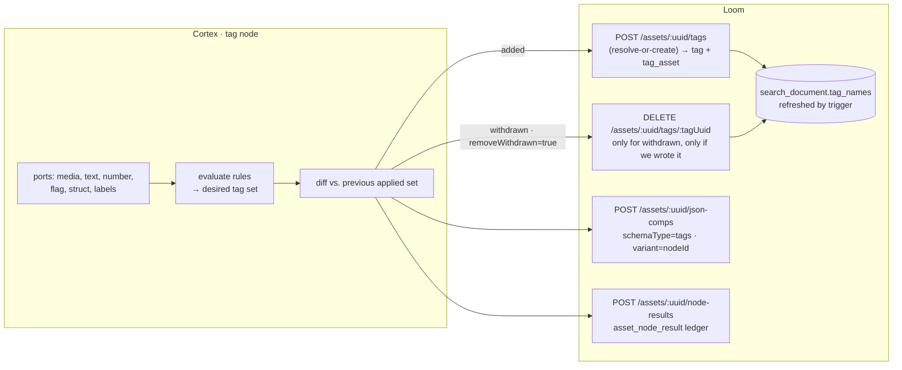

# Tag Node — Concept

> **🔵 CONCEPT — nothing is built.** This file explores a Cortex `tag` node that automatically tags an
> asset according to a configured rule. It was promoted from the one-line entry *"Add tag node. The
> node should be able to automatically be able to tag an asset"* in
> [../tasks/METALOOM_NOTES.md](../tasks/METALOOM_NOTES.md).
>
> **The headline finding is not the node.** The node is a small, well-precedented piece of work. The
> write path it needs — `POST /api/v1/assets/:uuid/tags` — **cannot tag two assets with the same tag
> name today** (§2, B1). Anything built on top of it before that is fixed fails on the second asset of
> the first run. Read §2 before §3.
>
> **Companion documents — read before changing anything here:**
> - [../guidelines/NEW_NODE.md](../guidelines/NEW_NODE.md) — the definition of done for a new node. Rules, not background.
> - [../features/nodes/NODES.md](../features/nodes/NODES.md) — node lifecycle, persistence table, caching, registration.
> - [../features/pipeline/NODE_DATA_TYPES.md](../features/pipeline/NODE_DATA_TYPES.md) — the typed-port model; §6.3 five validation rules, §8 fan-out/gather.
> - [../features/DB_SCHEMA_FEEDBACK.md](../features/DB_SCHEMA_FEEDBACK.md) §5 — the recorded defects of `tag_asset`.
> - [../features/search/SEARCH.md](../features/search/SEARCH.md) — why a tag is worth writing at all.
> - [../guidelines/SPEC_RULES.md](../guidelines/SPEC_RULES.md), [../guidelines/CODING.md](../guidelines/CODING.md).
>
> **The code is the source of truth.** Everything in §1 and §2 was read out of the code at the HEAD in
> the footer. Where this file and the code disagree, the code wins — fix this file in the same change.

---

## 0. The proposal in one page

| Question | Answer |
|---|---|
| **What is it?** | A Cortex node, kind `tag`, category `OUTPUT` — it writes into Loom's catalog rather than producing bytes |
| **What is a "rule"?** | A declarative row: *when `<wired input>` `<op>` `<value>`, attach tag `<name>` in collection `<collection>`*. A list of rows, authored in the pipeline editor, not code |
| **Where does the data come from?** | Wired input ports only — `text`, `number`, `flag`, `struct`, `labels`. Never a `nodeId:outputKey` option ([NEW_NODE.md §5](../guidelines/NEW_NODE.md)) |
| **How does it extend?** | A `tagBy` strategy seam, exactly like `FilterBy` in the `filter` node. Ship `RULES` and `LABELS`; `LLM`/`VLM` are later strategies, not later nodes |
| **What does it write?** | `tag` + `tag_asset` through the REST client, **plus** an `asset_json_comp` (`schemaType=tags`, `variant`=node id) recording what it applied, **plus** the standard `asset_node_result` ledger row |
| **Why is that third write there?** | It is the only record of *which tags this node put there*. Without it (and until B3 is fixed) the node cannot safely withdraw a tag it no longer stands behind, because nothing distinguishes an auto tag from one a human typed |
| **Blocked by** | B1 (fatal), B2 (fatal on re-run). B3–B6 are quality/scale, and B4 bounds v1 to asset-level tags |
| **Closest sibling to copy** | `cortex/nodes/filter` — same `PipelineConfigurable` shape, same per-instance rule rows, same config-hash cache key, same per-node-id ledger scoping |

---

## 1. What exists today

### 1.1 The data model

```sql
-- V2.2__add_tag.sql
CREATE TABLE "tag" (uuid, name, collection, meta jsonb, rating int, color char(6),
                    created, creator_uuid, edited, editor_uuid);
CREATE UNIQUE INDEX ON "tag" ("name", "collection");     -- ← the natural key. Tags are GLOBAL.

-- V2.8__add_asset.sql:95
CREATE TABLE "tag_asset" (tag_uuid, asset_uuid,
                          time_from, time_to, areaStartX, areaStartY, areaWidth, areaHeight,
                          PRIMARY KEY (tag_uuid, asset_uuid));
```

Three consequences an auto-tagger lives or dies by:

1. **A tag is a global, shared object.** `(name, collection)` is unique across the whole instance.
   A node that invents names writes into a namespace humans share — §3.6 exists because of this.
2. **The join row carries no provenance.** No `creator_uuid`, no `confidence`, no node id, no
   timestamp. `tag.creator_uuid` records who created *the tag*, which for a shared tag is whoever got
   there first — not who attached it to this asset.
3. **`collection` is the only grouping axis that exists today**, so it is the only handle a UI has for
   "show me the machine-written tags" without a migration.

### 1.2 The REST surface and the client

| Route | Permission | Handler |
|---|---|---|
| `POST /api/v1/assets/:uuid/tags` | `TAG_ASSET` | `TagEndpointService.tagAsset` (`loom/services/rest/.../service/impl/TagEndpointService.java:93`) |
| `DELETE /api/v1/assets/:uuid/tags/:tagUuid` | `UNTAG_ASSET` | `TagEndpointService.untagAsset` |
| `GET/POST/PUT/DELETE /api/v1/tags[/:uuid]` | `READ/CREATE/UPDATE/DELETE_TAG` | `TagEndpoint` |

`LoomClient` already carries `tagAsset(AssetId, TagCreateRequest)` and `untagAsset(AssetId, UUID)` via
`TagMethods` — **a Cortex node can call both today without a single client change.** `TagCreateRequest`
is `{name, collection, meta, area}`; `area` (`AreaInfo`) is `{startX, startY, width, height, from, to}`
and lands on the join row.

⚠️ `listTags()` takes no parameters, so a worker cannot look a tag up by name over REST. Resolve-or-create
must happen **server-side** (§6, P0) — a client-side "list, search, else create" is both a full-table
fetch per item and a race.

### 1.3 Why tags are worth writing

`tag_asset` is wired into search: `search_document.tag_names text[]` with a GIN index
(`V2.58__add_search_document.sql:53,98`), refreshed by `tg_search_tag_asset` on every insert/update/delete
(`V2.59__add_search_triggers.sql:103`), and a rename fans out to every carrying asset
(`tg_search_tag_fanout`). **A tag written by a node is searchable the moment the row lands**, with no
further plumbing. The UI already renders and edits asset tags
(`loom-ui/src/features/assetDetail/AssetDetail.tsx`, `AssetResponse.tags : List<TagReference>`).

That is the payoff: a rule-tagged catalog is a searchable, filterable catalog, using machinery that
already ships.

### 1.4 The Cortex side is empty

- `cortex/api/.../node/payload/TagsPayload.java` exists — *"Produced by auto-tagging nodes, label
  classifiers…"* — and has **zero producers and zero consumers**. It is a stub written in anticipation
  of exactly this node.
- **There is no `tag` content type.** `ContentTypeRegistry` has eight families
  (`media`, `text`, `detection`, `hash`, `scalar`, `artifact`, `struct`, `control`) and no tag member.
  §3.2 deliberately does **not** add one.
- No node calls `tagAsset`. The nodes that already produce tag-shaped values —
  `sentiment` (`label : scalar/string`), `dominant-color` (colour names, EN/DE),
  `filter` (`bucket : scalar/string`), `script` (declared string outputs), `llm`/`vlm`/`captioning`
  (text) — all persist to `asset_json_comp` and stop there. **Their output is invisible to search as
  tags.** The `tag` node is the missing terminal for all of them.

---

## 2. 🔴 Blockers found while exploring

These are defects in existing code, found by reading it for this concept. B1 and B2 are prerequisites,
not nice-to-haves.

### B1 — `tagAsset` always inserts a **new** tag row · FATAL

```java
// TagEndpointService.tagAsset:93
AssetTag tag = dao().createAssetTag(userUuid, name, collection);   // fresh POJO, uuid == null
...
dao().store(tag);                                                  // AbstractJooqDao.store:91 — plain INSERT
dao().tagAsset(tag, asset);
```

`createAssetTag` (`TagDaoImpl:63`) constructs a new pojo; `store` (`AbstractJooqDao:91`) is an
unconditional `INSERT … RETURNING`. With `UNIQUE (name, collection)` on `tag`, **the second asset that
receives the tag `"blurry"` in collection `"quality"` hits a unique violation.** Tagging N assets with
one shared tag — the entire point of an auto-tagger — is impossible through this route.

*Evidence is the code path above; no test covers it (`TagAssetEndpointTest` tags a single asset, and
`Permission.TAG_ASSET` is annotated `test:none`). **First task: a failing test that tags two assets with
the same name/collection.***

**Fix:** resolve-or-create on the natural key. `AbstractJooqDao.upsert(element, keyFields…)`
(`AbstractJooqDao:121`) already does precisely this — it excludes `uuid`/`created`/`creator_uuid` from
the update set so first-write provenance survives. `upsert(tag, TAG.NAME, TAG.COLLECTION)`.

### B2 — the join insert has no `ON CONFLICT` · FATAL on re-run

`TagDaoImpl.tagAsset:72` is a plain `insertInto(TAG_ASSET)`. `PRIMARY KEY (tag_uuid, asset_uuid)` means
re-running the same pipeline over the same asset — the normal case, and the reason every other node
path upserts — fails. **Fix:** `ON CONFLICT (tag_uuid, asset_uuid) DO UPDATE` on the region columns.

### B3 — no provenance on the join row · blocks safe reconciliation

Nothing on `tag_asset` says a machine wrote it, which node did, at what confidence, or when. Two
consequences: the UI cannot offer "hide auto tags", and **the node must never delete a tag it cannot
prove it wrote**. §3.5 works around this with its own `asset_json_comp` record; the real fix is a
migration adding `node_kind`, `node_id`, `producer_version`, `confidence`, `created` (§6, P2).

### B4 — one placement per (tag, asset) · bounds v1 to asset-level tags

Recorded already as [DB_SCHEMA_FEEDBACK §5.1](../features/DB_SCHEMA_FEEDBACK.md) (HIGH): the PK defeats
the `time_*`/`area*` columns, so a tag can be placed **once** per asset. Tagging two faces in one photo,
or one person in two shots, is impossible. **Region tagging is therefore out of scope for v1** — the
node writes asset-level tags and leaves `area` null. Revisit when §5.1 lands a surrogate PK.
Note also (§5.2) that `tag_asset` uses absolute-int boxes while `detection` uses normalized reals — a
detection-driven region tag must convert.

### B5 — `TAG_ASSET` silently confers tag creation

`tagAsset` checks `TAG_ASSET` only, yet creates a row in the global `tag` table. A principal with
`TAG_ASSET` and no `CREATE_TAG` can mint tags for the whole instance. Decide deliberately when fixing
B1: either check `CREATE_TAG` when the name is new, or document that `TAG_ASSET` implies it. Whatever is
chosen, the Cortex token needs the permissions ([PERMISSIONS.md](../features/permissions/PERMISSIONS.md);
grant via group+role, never a direct user grant).

### B6 — one HTTP round trip per tag, and one search refresh per row

Five tags on a 100k-asset run is 500k `POST`s, each firing `tg_search_tag_asset` →
`search_document_refresh_asset` for the *same* document. `detections/bulk` already exists as the
precedent (`bulkCreateAssetDetections`, `DetectionBulkCreateRequest`). §6 P1 proposes the tag
equivalent, which also makes reconciliation atomic.

---

## 3. The concept — the `tag` node

### 3.1 One kind, a strategy seam

```java
public enum TagBy {
  RULES,   // v1 — declarative predicates over wired inputs. No model, no network.
  LABELS   // v1 — every element on `labels` becomes a tag, vocabulary-gated.
  // LLM  — later: classify into a controlled vocabulary from wired text (cortex/llm-common)
  // VLM  — later: tags straight from the pixels
}
```

This is `FilterBy` applied to annotation, and it is deliberate: `FilterBy` ships with exactly **one**
constant and the seam still paid for itself. Adding a strategy is a strategy class plus a Dagger
binding plus an enum value — **never an edit to `TagNode`**. It also pre-empts the failure mode this
codebase already lived through once: eight `filter-*` kinds in the palette that could never run
([NODES.md §3.3](../features/nodes/NODES.md)). One kind, N strategies — not `tag-llm`, `tag-rules`,
`tag-color`.

### 3.2 Ports

Fixed ports, no resolver. The rules address a port by **id**, never by upstream node id.

| Dir | Id | Content type | Card | Req | Purpose |
|---|---|---|---|---|---|
| in | `media` | `media/*` | ONE | ✅ | The item being tagged. `AbstractMediaNode` needs it even though the node never reads the bytes (same as `sentiment`, `tts`) |
| in | `text` | `text/*` | ONE | — | Transcript, caption, OCR/Tika body — for `MATCHES`/`CONTAINS` rules and, later, the `LLM` strategy |
| in | `number` | `scalar/number` | ONE | — | A single metric (sentiment score, blur value emitted as a scalar) |
| in | `flag` | `scalar/boolean` | ONE | — | A boolean verdict (e.g. `filter.passed`) |
| in | `struct` | `struct/*` | ONE | — | A structured result addressed by JSON path — `quality`, `dominant-color`, `metadata`, `scene-layout` |
| in | `labels` | `scalar/string` | **MANY** | — | Label lists. MANY, so several producers may feed it (rule 4: >1 edge ⇒ MANY) and it **gathers** |
| out | `applied` | `struct/json` | ONE | — | `{applied:[…], withdrawn:[…], dryRun:bool}` — what this node did to this item |
| out | `count` | `scalar/integer` | ONE | — | Number of tags applied. Cheap to wire into a `filter` |

🔴 **No `MANY` output, on purpose.** [NODE_DATA_TYPES.md §6.4](../features/pipeline/NODE_DATA_TYPES.md):
a node that runs `PER_ELEMENT` *and* declares a `MANY` output is rejected **on the declaration**. A
`tags : scalar/string MANY` output would be the obvious design and would make the node unusable
downstream of any fan-out (`facedetect` → per-face). The applied set travels as one `struct/json` value.

🔴 **No new content type, on purpose.** `scalar/string` MANY is what `sentiment.label`,
`filter.bucket` and `script` string outputs already emit, so the node is wireable to the existing
palette on day one. A `struct/tags` type (or a live use for `TagsPayload`, §1.4) is only worth adding
when a producer needs to carry confidences *between* nodes — decide then, and delete `TagsPayload` if
that day never comes.

**Only one value per family.** A graph that must combine `quality` *and* `dominant-color` structs uses
**two tag nodes**, one per source. That is the same answer `filter` gives, and it is what keeps node ids
out of the options — the alternative (a MANY `struct` port whose rules select by `Element.origin.nodeId`)
smuggles the deleted `"nodeId:outputKey"` pattern back in through a JSON field.

### 3.3 The rule model (`tagBy: RULES`)

One JSON array, authored as a repeatable row editor (`ParameterType.PORT_LIST`'s sibling; see §3.4 for
why the widget type matters), each row independent:

```jsonc
"rules": [
  {
    "id": "blurry",                     // stable id; used in the applied record and for diagnostics
    "tag": "blurry",                    // the tag name (or "tagTemplate" — see below)
    "collection": "quality",            // optional; falls back to the node's `collection` option
    "match": "ALL",                     // ALL (default) | ANY
    "when": [
      { "input": "struct", "path": "blurriness", "op": "GT", "value": 0.6 }
    ]
  },
  {
    "id": "spoken-language",
    "tagTemplate": "lang:${value}",     // ${value} = the element being tested
    "collection": "language",
    "forEach": "labels",                // iterate the gathered elements of the MANY port
    "when": [ { "op": "NOT_BLANK" } ]
  },
  {
    "id": "negative-review",
    "tag": "needs-review",
    "when": [
      { "input": "text",   "op": "MATCHES", "value": "(?i)\\b(complaint|refund)\\b" },
      { "input": "number", "op": "LT",      "value": 0 }
    ]
  }
]
```

**Condition** = `{input, path?, op, value?}`.

| Field | Meaning |
|---|---|
| `input` | A port id — `text`, `number`, `flag`, `struct`, `labels`. Omitted inside a `forEach` rule, where the subject is the current element |
| `path` | Dot path into a `struct/*` value (`"image.width"`, `"colors.0.name"`). Ignored for scalar ports |
| `op` | `EQ` `NEQ` `GT` `GTE` `LT` `LTE` `CONTAINS` `STARTS_WITH` `MATCHES` (regex) `IN` (array `value`) `EXISTS` `NOT_BLANK` |
| `value` | The literal to compare against. Absent for `EXISTS`/`NOT_BLANK` |

**An unwired port makes every condition on it false** — never an error. Same reasoning as `filter`'s
optional `text` port: a node that refuses to start is harder to diagnose than a node that visibly tags
nothing. A rule whose port is unwired is reported once per run in the node log and appears in the
`applied` record as `skippedRules`.

**Why not a JS expression?** GraalJS exists in `cortex/nodes/script/.../engine` and a `when: "js"` rule
would be strictly more expressive. It is **rejected for v1** on three counts: the engine would have to be
extracted into a shared module first; it re-imports sandbox limits, timeouts and a
`ScriptOutputException` surface into a node that should be trivial; and a JS predicate cannot be rendered
as a form or validated at save time — the editor would degrade to a code box. The structured triple is
checkable by `validate()` before the run starts. If expressiveness proves insufficient, the escape hatch
already exists: compute the value in a `script` node and wire its output into `number`/`flag`.

### 3.4 Options

Per-instance (the node is a `PipelineConfigurable`, so these arrive **flattened onto the node object**
in the pipeline definition, alongside `id`/`type`/`mode`/…):

| Option | Type | Default | Purpose |
|---|---|---|---|
| `tagBy` | ENUM | `RULES` | The strategy (§3.1) |
| `rules` | PORT_LIST-style rows | `[]` | §3.3. Empty ⇒ the node is not processable, exactly as an unconfigured `filter` is |
| `collection` | STRING | `auto` | Default collection for rules that do not name one. **The only provenance handle that needs no migration** (§1.1) |
| `allowedTags` | JSON (array) | `[]` | Allow-list. Non-empty ⇒ a computed name outside it is dropped and recorded as `rejected` |
| `maxTags` | INTEGER | `20` | Hard cap per item. A template rule over a MANY port is otherwise unbounded |
| `normalize` | ENUM | `TRIM_LOWER` | `NONE` \| `TRIM` \| `TRIM_LOWER`. Applied before the allow-list |
| `removeWithdrawn` | BOOLEAN | `false` | Reconcile: withdraw tags this node previously applied and no longer stands behind (§3.5). Off by default — deletion is not a default |
| `dryRun` | BOOLEAN | `false` | Compute and record, write **no** `tag_asset`. The way to try a rule set against a real library |
| `minConfidence` | NUMBER | `0` | For strategies that produce confidence (`LLM`/`VLM`). Ignored by `RULES`, which is 1.0 by construction |

Worker-scoped (`CortexOptions.nodes["tag"]`): only the inherited `enabled` / `processIncomplete` /
`retryFailed` / `timeoutMs`. **Nothing model-shaped is worker-scoped in v1**, which is what keeps the
node runnable on any worker.

⚠️ The `rules` widget must be a row editor, not a raw `JSON` field. `ParameterType.JSON` commits on every
keystroke, so a half-typed rule momentarily parses to nothing; `PORT_LIST` exists precisely because a
parameter with structure needs an editor that always emits a valid array. `rules` needs the same
treatment (either reuse `PORT_LIST` semantics or add a sibling type — a decision for the implementer,
recorded in §9).

### 3.5 What the node writes



Three writes, in this order, all guarded by `asset != null && client() != null` (a clean no-op offline):

1. **`tag_asset`** — one `tagAsset` call per added tag (P1 turns this into one bulk call).
2. **`asset_json_comp`**, `schemaType = "tags"`, `variant = <pipeline node id>`, data:
   ```json
   { "tagBy": "RULES", "collection": "quality", "dryRun": false,
     "applied":  [ {"tag": "blurry", "collection": "quality", "ruleId": "blurry", "confidence": 1.0} ],
     "withdrawn":[ {"tag": "sharp",  "collection": "quality", "ruleId": "sharp"} ],
     "rejected": [ {"tag": "chartreuse", "reason": "not in allowedTags"} ],
     "skippedRules": ["negative-review: input 'number' is not wired"] }
   ```
   This is **the node's own record of what it did**, and until B3 is fixed it is the *only* thing that
   makes withdrawal safe. It upserts on `(asset, node_kind, schema_type, variant)`, so it is always the
   latest verdict of this node instance for this asset.
3. **The ledger** — `recordNodeResult(asset, ctx, SUCCESS, null, producerVersion(), resultRef("asset_json_comp", uuid))`,
   and a `FAILED` row on the failure path.

**Reconciliation rule (🔴 the safety property):** the node may withdraw a tag only when *both* hold —
it appears in the **previous `applied` list of this node instance** (read back from the json-comp), and
its collection matches the one this node is configured to write. Anything else — a tag a user typed, a
tag another node instance wrote — is never touched. When B3/P2 lands, the condition becomes a server-side
`node_id` match and this client-side read-back can go away.

**Failure semantics:** a rejected write (permission, unreachable Loom, constraint violation) is
`ctx.failure(msg).abort()` — not a skip. The worker could not do the job it was given.
🔴 `ctx.failure(msg).next()` reports SUCCESS ([NEW_NODE.md §1.1](../guidelines/NEW_NODE.md)).

### 3.6 Naming, vocabulary and safety

Auto-tagging writes into a **global namespace shared with humans** (§1.1). Four guards, none optional:

- **`normalize`** before anything else — an untrimmed `"blurry "` and `"blurry"` are two permanent rows.
- **`allowedTags`** — a controlled vocabulary. Mandatory in practice for any template-driven or
  model-driven rule; a typo in a `${value}` template is a tag row that outlives the run.
- **`maxTags`** — a template over a gathered MANY port has no natural bound.
- **`collection`** — keep machine tags in their own collection(s). It is the only axis the UI can group
  or hide by without a migration, and it makes the reconciliation rule in §3.5 meaningful.

### 3.7 Caching, versioning, instance scoping

Copy `filter` verbatim here:

| Concern | Approach |
|---|---|
| Cache | `LocalResultCache<…>` keyed `media.absolutePath() + "|" + configHash` — the same worker may run two tag nodes over one asset and they must not share an answer. A hit re-emits and returns `ctx.origin(LOCAL).next()` — SUCCESS, **not** SKIPPED |
| `configHash` | SHA-256 of `tagBy + rules + collection + allowedTags + normalize`, first 12 hex chars |
| `producerVersion()` | `"tag/1:" + tagBy + ":" + configHash` — changes whenever the meaning of the answer changes |
| `nodeId()` | `"tag:" + <pipeline node id>` — `asset_node_result` is `UNIQUE (asset_uuid, node_kind, node_id)`; two tag nodes in one graph would otherwise collide |
| Dagger | ⚠️ **Not `@Singleton`** — `PipelineConfigurable` instances are reconfigured per task. `FilterNodeSingletonTest` is the precedent for pinning that |

---

## 4. Worked examples

**A · Quality triage (no model, no network).** `filesystem-source → quality → tag`
```jsonc
{ "id": "quality-tags", "type": "tag", "collection": "quality", "removeWithdrawn": true,
  "rules": [
    {"id":"blurry",  "tag":"blurry",       "when":[{"input":"struct","path":"blurriness","op":"GT","value":0.6}]},
    {"id":"lowres",  "tag":"low-resolution","when":[{"input":"struct","path":"width","op":"LT","value":800}]},
    {"id":"hires",   "tag":"print-ready",  "match":"ALL",
     "when":[{"input":"struct","path":"width","op":"GTE","value":3000},
             {"input":"struct","path":"blurriness","op":"LT","value":0.2}]}
  ]}
```
Edge: `quality.result → tag.struct`. Re-running after a rule change withdraws `blurry` from items that
no longer match, because the node wrote it and can prove it.

**B · Colour facets from an existing node.** `dominant-color → tag`, `forEach: "labels"` with
`tagTemplate: "${value}"`, `collection: "colour"`, `allowedTags` = the 30-odd colour names the node
emits. Turns an `asset_json_comp` nobody can search into GIN-indexed facets.

**C · Editorial triage from a transcript.** `whisper → sentiment → tag`, plus `whisper → tag.text`.
`sentiment.score → tag.number`, and rules combining `MATCHES` on the transcript with `LT 0` on the score
(example 3 in §3.3). This is the case that motivates a future `tagBy: LLM` — a controlled vocabulary and
a prompt instead of hand-written regexes.

---

## 5. Alternatives considered

| # | Alternative | Verdict |
|---|---|---|
| 1 | **A `TAGS` output type on the `script` node** — declare `{"name":"tags","type":"TAGS"}` and let the existing persistence path write them | 🟡 **Cheapest and genuinely competitive**, and it should be built *eventually* on top of the same P0/P1 write path. Rejected as the starting point: it needs JS authoring, has no form in the editor, no vocabulary gating, no reconciliation, and puts a sandboxed engine on the critical path of a trivial operation. Build the node; add `TAGS` to `ScriptValueType` afterwards as a power-user path |
| 2 | **Extend the `filter` node** — a bucket already classifies; write the bucket name as a tag | ❌ Conflates routing with annotation. `filter` emits exactly one bucket per item, tags are a set; and it would give every filter node a Loom write path nobody asked for |
| 3 | **Loom-side "smart tags"** — a saved rule evaluated over the catalog, outside any pipeline | 🟡 **Complementary, not competing.** It is the only way to tag *retroactively* (a new rule over existing assets), but it can only see persisted data, and Loom has no scheduler (see [../CLUSTERING.md](../CLUSTERING.md) — single-writer). Right follow-up once the node exists; the reconciliation model in §3.5 is reusable verbatim |
| 4 | **One node kind per tagging source** (`tag-color`, `tag-llm`, …) | ❌ Exactly the mistake the eight `filter-*` kinds were. One kind, a `tagBy` seam |
| 5 | **Free-form LLM tagging in v1** | ❌ An unbounded vocabulary in a global namespace. Only ever behind `allowedTags` + `minConfidence`, and only once the deterministic strategy has proven the write path |

---

## 6. Loom-side work this depends on

**P0 — make `tagAsset` idempotent (fixes B1 + B2).** No API change; only behaviour.
- `TagDao.resolveOrCreateTag(userUuid, name, collection)` → `upsert(tag, TAG.NAME, TAG.COLLECTION)`
  (`AbstractJooqDao:121`), returning the existing row when `(name, collection)` is taken.
- `TagDaoImpl.tagAsset` → `.onConflict(TAG_ASSET.TAG_UUID, TAG_ASSET.ASSET_UUID).doUpdate()` on the
  region columns.
- Tests: two assets, one tag name (the B1 reproducer); the same asset twice (B2); an existing tag keeps
  its original `creator_uuid` and `created`.

**P1 — a bulk / reconcile route (fixes B6).** Mirror `detections/bulk`:
```
PUT /api/v1/assets/:uuid/tags        // the desired set for one writer
body: { "collection": "quality", "nodeKind": "tag", "nodeId": "quality-tags",
        "tags": [ {"name": "blurry", "confidence": 1.0} ], "removeWithdrawn": true }
```
One transaction, one search refresh, and reconciliation server-side where it belongs. Permission
`TAG_ASSET` (+ `UNTAG_ASSET` when `removeWithdrawn`).

**P2 — provenance on `tag_asset` (fixes B3, and B4 if taken together).** Flyway migration adding
`node_kind`, `node_id`, `producer_version`, `confidence real`, `created`, plus the surrogate PK from
[DB_SCHEMA_FEEDBACK §5.1](../features/DB_SCHEMA_FEEDBACK.md). 🔴 Run `loom/db/jooq/generate.sh` and then
`./setup-pool.sh` after any migration — a stale pool produces misleading failures. Adds "auto vs. human"
to `TagReference`, and makes the client-side read-back in §3.5 unnecessary.

**P3 — permissions (B5).** Decide `TAG_ASSET` vs. `CREATE_TAG` for a new name; add the 403 cases
(`TAG_ASSET` and `UNTAG_ASSET` are both marked `test:none` in `Permission.java` today); grant the Cortex
token its permissions via group+role.

**P4 — UI + docs.** Distinguish machine tags in `AssetDetail`, filter by tag in search, a
`website/content/english/docs/nodes/tag/index.adoc` page plus the three `_index.adoc` edits
([NEW_NODE.md §4](../guidelines/NEW_NODE.md)).

**Build order: P0 → node (§3) → P1 → P2 → P3/P4.** P0 alone unblocks a working node; everything after
is scale, safety and polish.

---

## 7. Test setup

🔴 `./setup-pool.sh` before any Loom-side test, and again after the P2 migration.

| Layer | Test | Asserts |
|---|---|---|
| Loom REST | `TagAssetEndpointTest` (extend) | **B1**: two assets, same `(name, collection)` → both tagged, one `tag` row. **B2**: same asset twice → 200, one join row. Original `creator_uuid`/`created` survive. 403 cases for `TAG_ASSET`/`UNTAG_ASSET` (P3) |
| Loom DAO | `TagDaoTest` (extend) | `resolveOrCreateTag` returns the existing uuid; `tagAsset` upserts the region; delete-cascade still holds (`AssetCascadeTest`) |
| Node | `TagNodeTest` | Each `op` against each port type; unwired port ⇒ condition false, not an exception; `ALL`/`ANY`; `forEach` over a gathered MANY port; `maxTags`/`allowedTags`/`normalize`; `dryRun` writes no `tag_asset`; a second run is served from the cache (mocked client hit **once**) |
| Node | `TagNodePersistenceTest` | Mock `LoomHttpClient`: exactly one `tagAsset` per applied tag, one json-comp with the right `schemaType`/`variant`, one ledger row with the right `nodeKind`/`state`/`origin`; a FAILED ledger row when the write throws; **nothing is deleted that is not in the previous applied set** |
| Node | `TagOptionsValidationTest` | Defaults valid; empty `rules`, unknown `tagBy`, unknown `op`, unknown `input`, duplicate rule id, bad regex, `maxTags <= 0` each reported. Use the generated `assertj` helpers |
| Node | `TagNodePipelineTest extends AbstractNodeChainTest` | Adapter integration: completion events, `applied`/`count` chaining into a `CapturingNode`, disabled + dry-run skip |
| Node | `TagNodeSingletonTest` | The node is **not** `@Singleton` (copy `FilterNodeSingletonTest`) |
| Graph | `NodePortConformanceTest` + `NodeDescriptorServiceLoaderTest` | Add the `map(fqn, "tag")` line; bump the asserted provider/kind counts — **count, never quote** |
| Integration | `TagNodeIntegrationTest` (`integration-test/`) | End-to-end against the packaged shaded Cortex jar: quality → tag → the tag is searchable via `/api/v1/search` |

⚠️ A ≥20-method test class exhausts the test-DB pool; split rather than fight it.

---

## 8. Configuration

**This concept adds no environment variables.** Rules are per-instance pipeline configuration, not
worker configuration — deliberately, so the same worker can serve any rule set. The existing variables
that decide whether the node can write at all:

| Variable | Default | Relevance |
|---|---|---|
| `LOOM_HOST` / `LOOM_PORT` | — / `8092` | Presence of `LOOM_HOST` selects online mode. Offline, the node evaluates rules and writes nothing (a clean no-op) |
| `LOOM_TOKEN` | — | 🔴 Must carry `TAG_ASSET` (+ `CREATE_TAG` / `UNTAG_ASSET` per P3), or every write is a 403 |
| `CORTEX_NODE_WHITELIST` / `_BLACKLIST` | — | Enable/disable the kind per worker |
| `LOOM_SEARCH_ENABLED` | off | Tags reach `search_document` via triggers regardless, but the search **routes** answer 503 while this is off — the payoff is invisible |

Worker-level node options remain the inherited `enabled` / `processIncomplete` / `retryFailed` /
`timeoutMs` under `CortexOptions.nodes["tag"]`.

---

## 9. Progress Assessment

**Established by this exploration (no code changed)**

- [x] The tag data model, its natural key and the missing provenance are mapped (§1.1)
- [x] `LoomClient.tagAsset`/`untagAsset` exist — no client change is needed for a first version (§1.2)
- [x] Tags already feed `search_document.tag_names`; the payoff needs no new plumbing (§1.3)
- [x] `TagsPayload` is dead code and there is no tag content type (§1.4)
- [x] 🔴 **B1** `tagAsset` always inserts a new `tag` row ⇒ the second asset violates `UNIQUE (name, collection)` (§2)
- [x] 🔴 **B2** the join insert has no `ON CONFLICT` ⇒ a re-run violates the PK (§2)
- [x] B3–B6 recorded; B4 already known as DB_SCHEMA_FEEDBACK §5.1 (§2)
- [x] Design settled: one kind, a `TagBy` seam, fixed ports, no `MANY` output, no new content type (§3)
- [x] Alternatives judged; the `script` `TAGS` output kept as a later power-user path (§5)

**Open work, in build order**

- [ ] **P0.1** A failing `TagAssetEndpointTest` case that tags two assets with one name — reproduce B1 first
- [ ] **P0.2** `resolveOrCreateTag` via `AbstractJooqDao.upsert(tag, TAG.NAME, TAG.COLLECTION)`; `tagAsset` join upsert (B1 + B2)
- [ ] **N1** `cortex/nodes/tag/core` from the `filter` sibling: `TagNode`, `TagNodeOptions`, `TagNodeModule`, `TagBy`, `TagStrategy` + `RulesTagStrategy`, `LabelsTagStrategy`, `TagRule`/`TagCondition`
- [ ] **N2** The five registration touch-points ([NEW_NODE.md §2](../guidelines/NEW_NODE.md)) + the two guard-test counts
- [ ] **N3** Reconciliation via the `tags` json-comp read-back (§3.5), behind `removeWithdrawn`, default off
- [ ] **N4** The full test set of §7
- [ ] **N5** Decide the `rules` widget: reuse `PORT_LIST` semantics or add a sibling `ParameterType` (§3.4)
- [ ] **P1** `PUT /assets/:uuid/tags` bulk/reconcile + client method + endpoint & permission tests (B6)
- [ ] **P2** Migration: provenance columns + surrogate PK on `tag_asset` (B3 + B4); jOOQ regen; `./setup-pool.sh`
- [ ] **P2.1** Once P2 lands: drop the client-side read-back, reconcile by `node_id` server-side
- [ ] **P3** Permission decision + 403 cases for `TAG_ASSET`/`UNTAG_ASSET` (B5)
- [ ] **P4** UI: machine tags shown distinctly; tag facet in search. Website `docs/nodes/tag/` + the three `_index.adoc` edits
- [ ] **D1** Demo data: add `tag` to a demo pipeline in `DemoDatabaseInitializer` — it needs no sidecar, so unlike the GPU nodes it *can* run in the demo container
- [ ] **X1** Region tags (`area` on the join row) — blocked on P2/§5.1, and needs the absolute-int ↔ normalized-real conversion (§2 B4)
- [ ] **X2** `tagBy: LLM` / `VLM` strategies via `cortex/llm-common`, vocabulary-gated
- [ ] **X3** `ScriptValueType.TAGS` on the `script` node, over the same P1 route (§5 #1)
- [ ] **X4** Loom-side retroactive "smart tags" (§5 #3)
- [ ] **X5** Decide `TagsPayload`'s fate — use it or delete it (§1.4)
- [ ] Add this file to [../METALOOM_CONTEXT.md](../METALOOM_CONTEXT.md) §2 once it stops being a concept, and update the routing row in §2.1

---

## 10. Key Classes Reference

| Class / file | Package or path | Relevance |
|---|---|---|
| `TagEndpointService` | `io.metaloom.loom.rest.service.impl` (`loom/services/rest/…`) | `tagAsset:93` — **where B1 lives** |
| `TagEndpoint` | `io.metaloom.loom.rest.endpoint.impl` | `/api/v1/tags` CRUD + rating routes |
| `AssetEndpoint` | same | `:242` `POST /assets/:uuid/tags`, `:248` the DELETE counterpart |
| `TagDao` / `TagDaoImpl` | `io.metaloom.loom.db.model.tag` / `…db.jooq.dao.tag` | `createAssetTag:63`, `tagAsset:72` — **where B2 lives**; `assetTags` reads the join back |
| `AbstractJooqDao` | `io.metaloom.loom.db.jooq` | `store:91` (plain insert) vs. `upsert:121` (natural-key upsert) — **the fix for B1** |
| `Tag` / `AssetTag` / `TagImpl` / `AssetTagImpl` | `io.metaloom.loom.db.model.tag`, `…db.jooq.dao.tag` | The domain objects; `AssetTag` carries the region |
| `TagCreateRequest` / `TagResponse` / `TagReference` / `AreaInfo` | `io.metaloom.loom.rest.model.tag`, `…model.annotation` | The wire model the node fills in |
| `TagMethods` | `io.metaloom.loom.client.common.method` | `tagAsset` / `untagAsset` — already on `LoomClient` |
| `Permission` | `io.metaloom.loom.db.model.perm` | `TAG_ASSET`, `UNTAG_ASSET`, `CREATE_TAG` — the last two annotated `test:none` |
| `FilterNode` / `FilterNodeOptions` / `FilterBy` / `FilterStrategy` | `io.metaloom.cortex.node.filter` | **The template to copy** — strategy seam, `PipelineConfigurable`, config hash, per-node-id ledger |
| `AbstractMediaNode` | `io.metaloom.cortex.common.node` | `process()`, `recordNodeResult`, `resultRef`, `nodeId()` |
| `PipelineConfigurable` | same | Per-instance config; ⚠️ never `@Singleton` |
| `LocalResultCache` | `io.metaloom.cortex.common.cache` | The skip cache; key = media path + config hash |
| `NodeSpec` / `PortDoc` / `ParamDoc` / `ParamOverride` | `io.metaloom.cortex.api.node.spec` | The descriptor is **harvested from these annotations** — see [NODES.md §5.3](../features/nodes/NODES.md) |
| `ContentTypeRegistry` / `ParameterType` / `NodeCategory` | `io.metaloom.loom.nodes.spec` | The vocabulary; `PORT_LIST` and why it is not `JSON`; `OUTPUT` is this node's category |
| `TagsPayload` | `io.metaloom.cortex.api.node.payload` | Written for exactly this node; zero producers today |
| `JsonCompCreateRequest` | `io.metaloom.loom.rest.model.jsoncomp` | The `schemaType=tags` record of §3.5 |
| `DetectionBulkCreateRequest` / `bulkCreateAssetDetections` | `…model.detection` / `…client.common.method` | The precedent for the P1 bulk route |
| `V2.2__add_tag.sql` · `V2.8__add_asset.sql:95` | `loom/db/flyway/…/db/migration/` | `tag` + `tag_asset`; the unique index at `V2.2:17` |
| `V2.58__add_search_document.sql` · `V2.59__add_search_triggers.sql:103` | same | `tag_names` + the refresh trigger — why a tag is searchable |
| `AssetDetail.tsx` | `loom-ui/src/features/assetDetail/` | Where machine tags must eventually look different |

---

## 11. Conventions and Gotchas

- 🔴 **`POST /assets/:uuid/tags` cannot tag two assets with the same tag name today** (B1). Do not build
  on it, demo it, or write docs for it before P0.2 lands.
- 🔴 **Never delete a tag you cannot prove you wrote.** Until P2 the only proof is this node's own
  `asset_json_comp` record, and the guard is *both* "in my previous applied set" *and* "in my
  collection". A reconciliation bug here silently destroys human curation.
- 🔴 **Tags are global.** `(name, collection)` is unique instance-wide, so a template rule without
  `allowedTags` lets one bad regex litter the shared namespace permanently.
- 🔴 **No `MANY` output port.** A `PER_ELEMENT` node declaring one is rejected *on the declaration*
  ([NODE_DATA_TYPES.md §6.4](../features/pipeline/NODE_DATA_TYPES.md)) — which would bar the node from
  ever sitting downstream of `facedetect`.
- 🔴 **Failure is `.abort()`, never `.next()`.** `NodeContextImpl.next()` ignores `failureCause` and
  reports SUCCESS. Several older nodes get this wrong; do not copy them.
- 🔴 **`PipelineConfigurable` ⇒ not `@Singleton`**, and override `nodeId()` so two tag nodes do not
  collide on `asset_node_result`'s `UNIQUE (asset_uuid, node_kind, node_id)`.
- ⚠️ **No `nodeId:outputKey` options, ever** — including disguised as a `rules[].source` field. Data
  arrives on a declared port over an edge the author drew.
- ⚠️ **An unwired optional port is a configuration, not an error.** Conditions on it are false and the
  node says so in `skippedRules`.
- ⚠️ **`tag_asset` boxes are absolute ints; `detection` boxes are normalized reals** (DB_SCHEMA_FEEDBACK
  §5.2). Any future region tag must convert.
- ⚠️ **Every `tag_asset` row refreshes the asset's search document** (`tg_search_tag_asset`). Five tags
  is five refreshes of the same row until P1.
- ⚠️ **`listTags()` has no filter parameter** — a worker cannot resolve a tag by name over REST. The
  resolve must stay server-side.
- ⚠️ **Count, never quote.** Kind/provider/content-type counts belong in the guard tests and the
  generated snapshot, not in prose.
- ⚠️ **After any migration**: `loom/db/jooq/generate.sh`, then `./setup-pool.sh`. A stale pool fails in
  ways that look like code bugs.

---

## 12. Where do I find …?

| I want … | Look at |
|---|---|
| The tag tables | `loom/db/flyway/src/main/resources/db/migration/V2.2__add_tag.sql`, `V2.8__add_asset.sql:95` |
| The tag-asset write path (and B1) | `loom/services/rest/.../service/impl/TagEndpointService.java:93` |
| The DAO (and B2, and the upsert helper that fixes B1) | `loom/db/jooq/.../dao/tag/TagDaoImpl.java`, `loom/db/jooq/.../AbstractJooqDao.java:121` |
| The client methods a node would call | `loom-client/common/.../method/TagMethods.java` |
| The node to copy | `cortex/nodes/filter/core/src/main/java/io/metaloom/cortex/node/filter/` |
| The rules for adding a node | [../guidelines/NEW_NODE.md](../guidelines/NEW_NODE.md) |
| Node lifecycle, persistence table, caching | [../features/nodes/NODES.md](../features/nodes/NODES.md) §1–§5 |
| Port cardinality, fan-out, the five validation rules | [../features/pipeline/NODE_DATA_TYPES.md](../features/pipeline/NODE_DATA_TYPES.md) §6, §8 |
| Why the descriptor is not hand-written any more | [../features/nodes/NODES.md](../features/nodes/NODES.md) §5.3 (`@NodeSpec` harvesting) |
| The recorded `tag_asset` defects | [../features/DB_SCHEMA_FEEDBACK.md](../features/DB_SCHEMA_FEEDBACK.md) §5 |
| How a tag becomes searchable | `V2.58__add_search_document.sql`, `V2.59__add_search_triggers.sql:103`, [../features/search/SEARCH.md](../features/search/SEARCH.md) |
| Permissions and how to grant them in tests | [../features/permissions/PERMISSIONS.md](../features/permissions/PERMISSIONS.md) |
| The UI that renders asset tags | `loom-ui/src/features/assetDetail/AssetDetail.tsx`, `loom-ui/src/api/tags.ts` |
| Where the customer-facing node page goes | `website/content/english/docs/nodes/<kind>/index.adoc` + three `_index.adoc` edits |
| Seeded demo pipelines | `loom/core/src/main/java/io/metaloom/loom/core/boot/DemoDatabaseInitializer.java` |

---

_Git HEAD revision: `827cd2cb`_
_Last updated: 2026-08-04 (initial concept; promoted from the METALOOM_NOTES backlog entry)_
