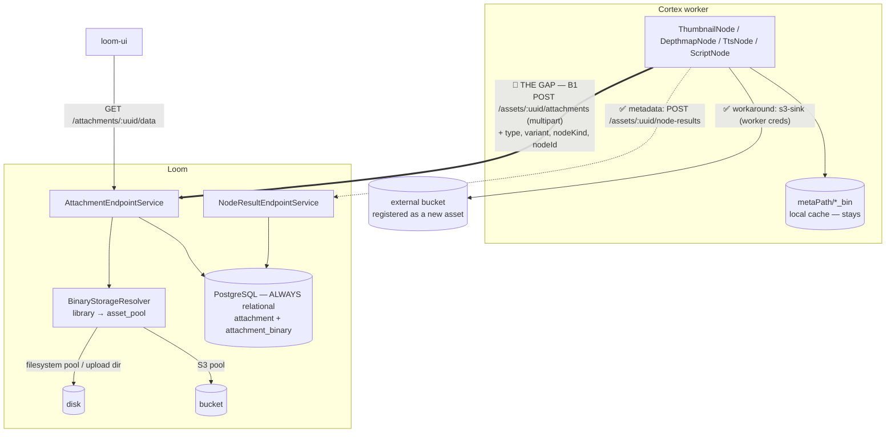

# Cortex → Loom: Binary and Metadata Persistence — Plan

## The gap, in one paragraph

**Metadata write-back from a Cortex node to Loom is done. Raw-byte ingest is not.**

A node that computes *facts* has a complete path: it writes a typed component (`asset_json_comp`,
`asset_fingerprint_comp`, `asset_segment_comp`, …) and calls
`AbstractMediaNode.recordNodeResult(...)` → `POST /api/v1/assets/:uuid/node-results`, landing a row
in the `asset_node_result` ledger. `WhisperNode` is the reference; ~15 nodes follow it.

A node that produces *bytes* has no such path. Six nodes write a file into a local `metaPath/*_bin`
cache and record a ledger row saying only "this happened". The bytes never reach Loom, so the UI
cannot show a thumbnail, a re-run on another worker recomputes it, `SceneLayoutNode` can consume
`depthmap_path` only if pinned to the same machine, and everything is lost when the worker is
replaced.

| Node | Local cache | Reaches Loom as |
|---|---|---|
| `ThumbnailNode` | `metaPath/thumbnail_bin` | ledger row only |
| `DepthmapNode` | `metaPath/depthmap_bin` | ledger row only |
| `ImageGenNode` | `metaPath/imagegen_bin` | ledger row only |
| `VideoGenNode` | `metaPath/videogen_bin` | ledger row only |
| `TtsNode` | `metaPath/tts_bin` | ledger row only |
| `ScriptNode` | `metaPath/script_bin/<nodeId>` | `asset_json_comp` + ledger — bytes still local |

`ThumbnailNode.java:117` states the reason: *"Uploading the bytes into the asset binary subsystem
requires a target library the node does not have, so that remains a follow-up."*

`S3SinkNode` (kind `s3-sink`) is the **current workaround**: it uploads to a bucket named in the
pipeline definition using *worker* credentials and registers the artifact as a new asset whose
`origin` is the `s3://` URI. That is the right answer for "put a copy where a downstream system can
read it", not for "make this a first-class Loom binary in whichever backend this library uses" (§4
B5).

> **Read first**: [REST_BINARY_HANDLING.md](REST_BINARY_HANDLING.md) — the byte endpoints, the pool
> model, the storage layout. **Read alongside**:
> [../pipeline-nodes/NODE_S3SINK_PLAN.md](../pipeline-nodes/NODE_S3SINK_PLAN.md) (the worker-side
> half; this file supersedes its phases 2 and 3),
> [../../guidelines/NEW_NODE.md](../../guidelines/NEW_NODE.md) (the node persistence template),
> [../../loom/RESTAPI.md](../../loom/RESTAPI.md) (endpoint conventions).
> **Rules**: [../../guidelines/CODING.md](../../guidelines/CODING.md),
> [../../SPEC_RULES.md](../../SPEC_RULES.md).

---

## 1. Already implemented — do not re-plan this

Verified against the code at the HEAD in the footer. Everything below exists and works; the open
work in §3–§5 is what is left after subtracting it.

| Item | Where it lives |
|---|---|
| Node **metadata** write-back (ledger) | `AbstractMediaNode.recordNodeResult(...)` → `POST /assets/:uuid/node-results`; `asset_node_result` (`V2.45`); reference node `WhisperNode`, ~15 followers |
| Typed component tables | `asset_json_comp`, `asset_fingerprint_comp`, `asset_segment_comp`, `asset_transcript_comp` (`V2.38`–`V2.43`) |
| Payload pointer + multi-instance ledger key | `AbstractMediaNode.resultRef(table, uuids…)`, `nodeId()`; `asset_node_result` is `UNIQUE (asset_uuid, node_kind, node_id)` |
| Byte-ingest endpoints for **assets** | `POST /assets/upload`, `POST /assets/:uuid/binary/data` — `AssetUploadEndpointService`; content-addressed (same SHA-512 → existing asset) |
| Serving bytes back, incl. `Range` | `AssetBinaryEndpointService.downloadByAssetUuid` |
| Attachments **store** and serve their bytes | `AttachmentEndpointService.create` → `BinaryStorage.store`; `GET /attachments/:uuid/data` |
| `POST /attachments` accepts `assetUuid` / `embeddingUuid` / `type` / `poolUuid` form fields | `AttachmentEndpointService.create`, `attachmentType()`, `optionalUuid()` |
| Attachment pool inheritance | `AttachmentEndpointService.poolFor(...)` — parent asset's primary binary's pool, else default |
| Multipart client methods | `AttachmentMethods.uploadAttachment(File, mimeType, assetUuid, type)`, `AssetBinaryMethods.uploadAsset` / `uploadAssetBinary` / `downloadAssetBinary` |
| S3 as a binary destination, per library | `asset_pool` (`s3_bucket`/`region`/`endpoint`), `BinaryStorageResolver`, `S3BinaryStorage`, `V2.63`; `asset_location.pool_uuid` written on every upload |
| The `s3-sink` worker-side upload | `cortex/nodes/s3-sink/`, `S3SinkNode`, `OverwritePolicy` |
| `attachment` provenance **columns** + idempotency index | `V2.44` — in the DB, but still invisible above it (§3 A1) |
| Location cardinality question | **answered** — §2 |

> ⚠️ `NODE_S3SINK_PLAN.md` §13 lists "Phase 2 (Loom)" as open. **Phase 2 is done** — `poolUuid`
> reaches `AssetBinary` and the REST models, and the three
> `log.error("S3 support has not yet been implemented")` branches are implemented. Its Phase 3
> (attachment provenance) is §3 A1 here.

---

## 2. Settled decisions (recorded so they are not rediscovered)

**Cardinality.** An asset has **zero or more locations, keyed `(library_uuid, path)`** (`V2.20`
enforced one per asset; `V2.48` deliberately removed that — the same content legitimately lives in
several libraries). `GET /assets/:uuid/binary` returns the **primary** (oldest, uuid tie-broken);
`/binaries` returns all; an upload replaces the one in the named `libraryUuid` and **400**s when
several exist and none is named; a pipeline run reads the primary (`SourceOptionsResolver`).
`asset_location` is *"where these exact bytes are"*, never *"what was derived from them"* — a
thumbnail is **not** a second location of its source video.

**Metadata always lives in PostgreSQL.** "S3 for metadata persistence" is satisfied by *S3-backed
bytes whose metadata rows are relational*, which is what is built; `asset_location.path` is the
self-describing pointer (filesystem path or `s3://bucket/key`). A metadata *sidecar document* in
the bucket is a different, unbuilt and currently unjustified feature (§5 C1).

**Which shape does an artifact take?** Picking wrong produces a catalogue nobody can query.

| Producer | Shape | Rationale | `attachment.type` |
|---|---|---|---|
| `ThumbnailNode` | attachment on the source asset | a view of that asset | `CONTACT_SHEET` |
| `DepthmapNode` | attachment | derived from that asset | `PROXY`, or a new `DEPTH_MAP` (§6) |
| `ScriptNode` declared file outputs | attachment | derived | per instance |
| `TtsNode` | new asset + attachment edge | stands alone *and* belongs to a source | `EXTRACTED_AUDIO` |
| `ImageGenNode`, `VideoGenNode` | new asset | not a view of a prompt; searchable, taggable, pipeline-able media | — |
| anything with no bytes | typed comp + ledger | already works, §1 | — |

`attachment` is the sanctioned default and `V2.44` says so in its own header:
*"Make attachment the sink for node-produced derived binaries."*

---

## 3. Phase A — make `attachment` a usable REST resource

No migration needed: the `V2.44` columns exist and are invisible to everything above the DB.

**A1. Carry provenance through the stack.** `attachment.node_kind`, `node_id`, `producer_version`,
`variant`, `run_uuid`, `task_uuid` have **no getters/setters on the `Attachment` DB model**, are
**not referenced anywhere in `AttachmentDaoImpl`**, and do not appear on `AttachmentResponse` (which
today carries only `sha512sum`, `filename`, `mimeType`, `size`). Add them to the DB model interface
and its impl, map them in the DAO, and expose them plus `assetUuid`, `embeddingUuid`, `type`,
`poolUuid`, `storageType` on `AttachmentModel` / `AttachmentResponse` /
`AttachmentCreateRequest`. **This is the bulk of Phase A.**

**A2. Sub-resource routes on the asset**, matching the plural convention in
[../../loom/RESTAPI.md](../../loom/RESTAPI.md). Only `/embeddings/:uuid/attachments` exists today.

| Method | Path | Purpose |
|---|---|---|
| GET | `/assets/:uuid/attachments` | list, filterable by `type` |
| POST | `/assets/:uuid/attachments` | multipart upload bound to the asset |
| GET | `/attachments/:uuid/data` | ✅ already built |

**A3. Idempotent upsert.** Honour the `V2.44` partial unique index
`(asset_uuid, type, node_kind, variant) WHERE asset_uuid IS NOT NULL AND node_kind IS NOT NULL`: a
re-run must replace its own row. Without this, every pipeline re-run 500s on the second pass.

**A4. Surface the pool.** Selection is already implemented (`poolFor`); only `poolUuid` /
`storageType` on the response are missing.

**A5. Decide byte reclaim.** `AttachmentEndpointService.delete` deliberately does not free bytes —
`attachment_binary` is shared and content-addressed and no reference count spans it and
`asset_location`. Either add that count and reclaim on the last reference, or document the leak in
[REST_BINARY_HANDLING.md](REST_BINARY_HANDLING.md). Do not leave it undecided.

---

## 4. Phase B — the Cortex-side write-back

**B0. Extend the client.** `uploadAttachment(File, mimeType, assetUuid, type)` sends only
`assetUuid` and `type`. It needs `nodeKind`, `nodeId`, `producerVersion`, `variant` and optionally
`runUuid` / `taskUuid`, and should target the A2 route.

**B1. One node-facing helper on `AbstractMediaNode`**, so six nodes do not hand-roll it:

```java
/**
 * Publish a file this node produced as an attachment of the asset it was computed from.
 * No-op when the client is null (offline mode) - the local cache is still written.
 */
protected UUID publishArtifact(AssetResponse asset, Path file, AttachmentType type, String variant);
```

It computes the SHA-512, calls the B0 client method with `name()` as `nodeKind`, `nodeId()` and the
producer version, and returns the attachment uuid so the caller can pass it to
`resultRef("attachment", uuid)` on the ledger row it already writes. Note that
`publishArtifact` does **not** exist today — the grep is empty.

**B2. Migrate the nodes**, one per change, each with its own test. Order by value: `ThumbnailNode`
(the UI wants it most), `DepthmapNode`, `TtsNode`, `ImageGenNode`, `VideoGenNode`, `ScriptNode`.
For the two generative nodes the shape is "new asset" (§2), i.e. `uploadAsset` rather than
`publishArtifact`.

**B3. Keep the local caches.** `publishArtifact` uploads *in addition to* writing
`metaPath/<node>_bin`. The cache is what makes a re-run cheap and what `SceneLayoutNode` reads.

**B4. Failure policy.** An upload failure must **not** fail the node — losing a whole video's
pipeline run because a bucket returned 503 is the wrong trade. Log, record `state = PARTIAL` on the
ledger row, continue. This mirrors `recordNodeResult`, which is already best-effort. It is the
opposite of `s3-sink`, whose entire job is the upload; there, failing is correct.

**B5. 🔴 Do not route this through `s3-sink`.** That node uploads to a bucket named in the *pipeline
definition* with worker credentials. This path uploads to whichever backend the *library* uses, with
Loom's credentials, and Loom records the location. Both should exist; they answer different
questions.

---

## 5. Phase C — make the bucket less of a black box

**C2 (do this).** `S3BinaryStorage.store` builds a bare
`PutObjectRequest.builder().bucket(bucket).key(key)`. Add the SHA-512 and the asset uuid as S3
object metadata (`x-amz-meta-*`). Free, no second request, no consistency problem — and it upgrades
`s3-sink`'s `IF_DIFFERENT` check from "key + size" (`S3SinkNode.java:294`) to a real content
comparison, which its own spec lists as the clean fix.

**C1 (do not do this yet).** A `<key>.loom.json` sidecar per object. Costs a second PUT per upload
and a consistency problem the moment metadata is edited, and has no reader. Build it only when a
concrete requirement names one — an external system, or disaster recovery.

---

## 6. Open questions

| Question | Notes |
|---|---|
| A `DEPTH_MAP` attachment type? | `PROXY` is a poor fit. `ALTER TYPE … ADD VALUE` cannot run in the transaction that added the type, so it needs its own migration file (see `V2.44`, `V2.62`) |
| Do derived assets pollute list/search? | The "new asset" shape multiplies asset count; likely needs an `is_derived` filter before the UI shows generated media at scale |
| Presigned URLs | `` is a proxy hop per thumbnail for S3 pools. A presigned redirect removes it, at the cost of a URL that escapes Loom's permission check for its lifetime |
| Attachment byte reclaim | §3 A5 |
| Should a node choose the pool? | Today it inherits the asset's; a `poolUuid` node option would allow "thumbnails cheap, masters fast" — no requirement yet |
| `ScriptNode` writes `node_id = ''` | Migrating onto `nodeId()` has a data question attached; persistence tests assert the current shape |

---

## 7. Architecture



---

## 8. Test Setup

```bash
./setup-pool.sh                                           # mandatory before any Java test
mvn test -pl loom/core -Dtest=AttachmentEndpointTest      # the resource Phase A extends
mvn test -pl loom/core -Dtest=AssetBinaryDataEndpointTest # the byte routes this builds on
mvn test -pl loom/services/fs,loom/services/s3            # storage backends
./it.sh                                                   # incl. S3SinkNodeIntegrationTest (MinIO)
```

- **Phase A** — an `AttachmentEndpointTest` case per new route plus 403 cases
  ([../permissions/PERMISSIONS.md](../permissions/PERMISSIONS.md): grant via group+role, never a
  direct user grant); a DAO test proving the `V2.44` columns round-trip; an upsert test proving a
  second POST with the same `(asset, type, nodeKind, variant)` replaces rather than fails; a delete
  cascade test ([../../guidelines/CODING.md](../../guidelines/CODING.md)).
- **Phase B** — per-node tests with a mocked `LoomClient` asserting the upload call and its
  arguments, plus one integration test per node against a live Loom
  ([../../guidelines/NEW_NODE.md](../../guidelines/NEW_NODE.md)). ⚠️ Rebuild the shaded `cortex/cli`
  jar first — node integration tests run against the packaged artifact.
- **Phase C** — a MinIO-backed test asserting object metadata is present after `store`.

**MinIO for local S3**: `start-minio.sh`. Point a pool at it with
`s3Endpoint=http://localhost:9000` and set `LOOM_S3_ACCESS_KEY`/`LOOM_S3_SECRET_KEY`; path-style
addressing turns itself on whenever a custom endpoint is set.

---

## 9. Key Classes Reference

| Class | Package | Role |
|---|---|---|
| `AbstractMediaNode` | `io.metaloom.cortex.common.node` | Has `recordNodeResult`, `resultRef`, `nodeId()`; **gains `publishArtifact`** (B1) |
| `ThumbnailNode` | `io.metaloom.cortex.node.thumbnail` | First migration target (B2); carries the "remains a follow-up" comment |
| `S3SinkNode` | `io.metaloom.cortex.node.sink.s3` | The current workaround, deliberately separate (B5) |
| `AttachmentMethods` / `LoomHttpClientImpl` | `io.metaloom.loom.client.common.method` / `…client.http.impl` | `uploadAttachment(File, …)` — needs the provenance fields (B0) |
| `AttachmentEndpoint` | `io.metaloom.loom.rest.endpoint.impl` | Route table; gains the asset sub-resource (A2) |
| `AttachmentEndpointService` | `io.metaloom.loom.rest.service.impl` | Stores/serves bytes, `poolFor`, `attachmentType`; gains upsert (A3) and reclaim decision (A5) |
| `AttachmentDaoImpl` | `io.metaloom.loom.db.jooq.dao.attachment` | Must map the `V2.44` provenance columns (A1) — currently references none |
| `Attachment` / `AttachmentResponse` | `io.metaloom.loom.db.model.attachment` / `io.metaloom.loom.rest.model.attachment` | Must gain the provenance accessors (A1) |
| `BinaryStorageResolver` | `io.metaloom.loom.rest.service.impl` | pool → backend; already used by attachments |
| `S3BinaryStorage` | `io.metaloom.loom.storage.s3` | Gains object metadata on PUT (C2) |
| `AssetBinaryDao` | `io.metaloom.loom.db.model.asset` | Carries the §2 cardinality contract |

---

## 10. Environment Variables

No new settings. Full documentation in [REST_BINARY_HANDLING.md](REST_BINARY_HANDLING.md) §11.

| Variable | Default | Role here |
|---|---|---|
| `LOOM_STORAGE_UPLOAD_DIR` | `data/storage` | Where artefacts land for libraries with no pool — the default case |
| `LOOM_S3_ENDPOINT` / `LOOM_S3_REGION` | — / `us-east-1` | Fallbacks when a pool does not name its own |
| `LOOM_S3_ACCESS_KEY` / `LOOM_S3_SECRET_KEY` | — | Loom's bucket credentials; unset uses the AWS default chain |
| `LOOM_S3_PATH_STYLE` | on when an endpoint is set | MinIO/Ceph addressing |
| `CORTEX_S3_*` | — | The **worker's** own S3 access, used by `s3-source`/`s3-sink`. Deliberately separate from Loom's |

---

## 11. Conventions and Gotchas

- 🔴 **`attachment` is not `asset_location`.** One is "what was derived from this asset", the other
  is "where these exact bytes are". Recording a thumbnail as a second location of its source video
  makes the video's own download ambiguous.
- 🔴 **Never fail a node on an upload failure** (B4) — except in `s3-sink`, where uploading *is* the
  job.
- 🔴 **Metadata write-back is already solved.** Do not invent a second ledger. If a node needs to
  say "I produced X", it calls `recordNodeResult` with a `resultRef` — that part is done.
- **The metadata always stays in Postgres.** "S3 metadata persistence" means S3-backed bytes, not a
  document store.
- **Attachment idempotency is a *partial* index**, `WHERE asset_uuid IS NOT NULL AND node_kind IS
  NOT NULL`. An attachment created without a `node_kind` is not covered and will duplicate on re-run.
- **`POST /attachments` defaults `type` to `EMBEDDING_ATTACHMENT`** when the form field is absent —
  a historic default kept for existing callers. A node must always send an explicit `type`.
- **`ScriptNode` still writes `node_id = ''`** and has persistence tests asserting that shape.
- **Two `s3-sink` instances in one graph** used to overwrite each other's ledger row; the `nodeId()`
  seam fixed it. Any new multi-instance node must override `nodeId()`.
- **Rebuild the shaded cortex jar** before running node integration tests, or they run against a
  stale artifact and the failure looks like a logic bug.
- **Loom and Cortex do not share S3 credentials.** `LOOM_S3_*` is the server's, `CORTEX_S3_*` the
  worker's. They may point at the same bucket; one being set says nothing about the other.

---

## 12. Where do I find …?

| I need … | Look at |
|---|---|
| The metadata write-back that already works | `AbstractMediaNode.recordNodeResult`, `POST /assets/:uuid/node-results`, `WhisperNode` |
| The node persistence template | [../../guidelines/NEW_NODE.md](../../guidelines/NEW_NODE.md) |
| The byte endpoints this plan builds on | [REST_BINARY_HANDLING.md](REST_BINARY_HANDLING.md) §2, [../../loom/RESTAPI.md](../../loom/RESTAPI.md) |
| The worker-side S3 upload that already works | `cortex/nodes/s3-sink/`, [../pipeline-nodes/NODE_S3SINK_PLAN.md](../pipeline-nodes/NODE_S3SINK_PLAN.md) |
| Why `attachment` is the sanctioned sink | `loom/db/flyway/…/V2.44__attachment_provenance.sql` header |
| The ledger table | `loom/db/flyway/…/V2.45__add_asset_node_result.sql` |
| The typed component tables | `V2.38`–`V2.43` |
| The pool/library storage decision | `loom/db/flyway/…/V2.63__library_storage_pool.sql` |
| Node artefact caches | `cortex/nodes/*/core/…/*Node.java` → `resolve*Path` |
| MinIO for local testing | `start-minio.sh` |

---

## 13. Progress Assessment

### Done — metadata write-back and the byte-storage substrate (details in §1)

- [x] `recordNodeResult` ledger, typed comps, `resultRef`, `nodeId()` seam
- [x] Asset byte-ingest endpoints, content-addressed upload, multipart client, `Range` download
- [x] Attachments store and serve their bytes; pool inherited from the parent asset
- [x] S3 as a per-library binary destination; `asset_location.pool_uuid`; cardinality answered (§2)
- [x] `s3-sink` as the interim byte-export path

### Phase A — attachment as a REST resource

- [ ] **A1** provenance accessors on `Attachment`, mapping in `AttachmentDaoImpl`, fields on
      `AttachmentModel`/`AttachmentResponse`/`AttachmentCreateRequest`
- [ ] **A2** `GET`/`POST /assets/:uuid/attachments`, filterable by `type`
- [ ] **A3** idempotent upsert on `(asset_uuid, type, node_kind, variant)`
- [ ] **A4** surface `poolUuid`/`storageType` on `AttachmentResponse`
- [ ] **A5** decide attachment byte reclaim — implement or document the leak
- [ ] Endpoint tests incl. 403 cases; DAO round-trip test; delete cascade test

### Phase B — Cortex byte write-back (**the gap**)

- [ ] **B0** provenance fields on `uploadAttachment(...)`, targeting the A2 route
- [ ] **B1** `AbstractMediaNode.publishArtifact(...)`
- [ ] **B2** migrate `ThumbnailNode`, then `DepthmapNode`, `TtsNode`, `ScriptNode`; `ImageGenNode`
      and `VideoGenNode` via `uploadAsset` (new-asset shape)
- [ ] **B3** keep the local `*_bin` caches
- [ ] **B4** upload failure → `PARTIAL`, never a failed node
- [ ] Per-node unit tests with a mocked client + one integration test each

### Phase C — S3 object richness

- [ ] **C2** SHA-512 + asset uuid as S3 object metadata on PUT
- [ ] Upgrade `s3-sink`'s `IF_DIFFERENT` to compare content hashes
- [ ] **C1** sidecar documents — **only** with a named reader

### Follow-ups

- [ ] Decide `DEPTH_MAP` vs. `PROXY` (own migration file — §6)
- [ ] Migrate `ScriptNode` onto `nodeId()` and decide what to do with its `node_id = ''` rows
- [ ] UI: render attachments (thumbnails) once Phase A lands — see
      [../../loom/ui/TASK_UI_ASSETS_MEDIA.md](../../loom/ui/TASK_UI_ASSETS_MEDIA.md)
- [ ] Customer-facing docs once Phase B lands ([../../website/WEBSITE.md](../../website/WEBSITE.md))

---

_Git HEAD revision: `499f71f7`_
_Last updated: 2026-08-01 (reduced to the one open gap — raw-byte ingest from a Cortex node — after verifying the metadata write-back path had shipped.)_
