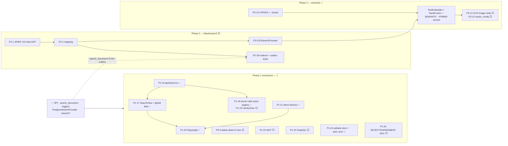

# Search — Build Plan

> **Status: Phase 0, the whole Phase 1 backend and the loom-ui consumer are shipped and green.** Query
> path, schema, triggers, REST, client, the UI (client, `SearchContext`, global field, `/search` view,
> asset-browser wiring), demo fixtures and tests exist and work. What is **not** built: the remaining
> consumers (MCP, GraphQL, `LibraryView`), all of Phase 2 (Elasticsearch), and the **image** half of
> Phase 3. The **text** half of Phase 3 — semantic and hybrid ranking — is shipped and off by default.
>
> **This file is the execution order for what remains.** Shipped work is collapsed into one table below —
> do not re-plan it. Design, rationale and the full class reference live in [SEARCH.md](../features/search/SEARCH.md); read it
> first. Phase 3 is designed in [SEMANTIC_SEARCH.md](../features/search/SEMANTIC_SEARCH.md). The repurposed Lucene module is
> [LUCENE_PLAN.md](LUCENE_PLAN.md). Schema context: [../../loom/DOMAIN.md](../loom/DOMAIN.md).

**Status legend:** ✅ done · 🔨 partial · ⬜ not started · ⏭️ deliberately skipped

## Strategy in one paragraph

Ship **Postgres full-text search** behind a provider SPI, then swap in **Elasticsearch/OpenSearch** behind
the same SPI without touching the endpoint, the models or the UI. The hinge is the `search_document` table
([SEARCH.md](../features/search/SEARCH.md) §5): it is the Postgres index, the pre-assembled Elasticsearch document, *and* the
outbox that feeds it. That hinge is **built**. Phase 2 therefore adds a provider and a drain loop; it does
not rebuild the pipeline.

---

## Already implemented — do not re-plan

| What | Where it lives |
|---|---|
| **Prereqs:** `Page(perPage, totalCount, list)` + `TOTAL_COUNT_UNKNOWN` and real totals from `ModelBuilder`; `ListResponseModelAssert.hasSize()`/`hasTotalCount()` split; `LoomRoutingContext.permissions()` → `Future<Predicate<Permission>>`; `SEARCH_UNAVAILABLE`/`SEARCH_UNSUPPORTED` in **both** `LoomRestErrorCode` copies | `loom-shared/api`, `loom/common`, `loom/services/rest` |
| **SPI** (13 types: `SearchProvider`, `SearchIndexer`, `SearchRequest/Result/Hit/Document`, `SearchEntityType`, `SearchMode`, `SearchSortMode`, `SearchCapability`, `FacetBucket`, `IndexStatus`, `SearchProviderInfo`) | `loom-shared/api/…/api/search/` |
| **Options** — `SearchOptions`, 10 `LOOM_SEARCH_*` vars + `validate()`, registered on `LoomOptions` | `loom-shared/api/…/api/options/SearchOptions.java` |
| **Schema** — `Permission.READ_SEARCH` (no seed grant needed and none should be added: `DatabaseInitializer` grants the admin role every `Permission.values()`); `search_document` + 12 indexes; `search_document_deleted`; `search_extract_json_text`, `search_jsonb_all_text`, `search_tokenize_path`, `search_body_cap`, per-entity `search_document_refresh_*`, `search_document_rebuild()` | `V2.57`, `V2.58__add_search_document.sql` |
| **Triggers** on `asset`, `asset_location`, `asset_{json,transcript,segment}_comp`, `detection`, `tag`/`tag_asset`, `annotation`, `person`, `collection(_asset)`, `library(_asset)`; tombstone + un-tombstone; tag-rename fan-out; backfill call | `V2.59__add_search_triggers.sql` |
| **Provider** — `PostgresSearchProvider` (`websearch_to_tsquery`, `ts_rank_cd(…,32)` + trigram blend, second-pass highlight, trigram typeahead), `NoopSearchProvider`, `NoopSearchIndexer` (`rebuild()` = repair path); codegen exclusion widened to `.*\.text_search.*\|.*\.trgm_text` | `loom/db/jooq/…/db/jooq/search/`, `loom/db/jooq/pom.xml` |
| **Wiring** — `SearchModule` binds provider/indexer from options and falls back to Noop, so **search never fails boot** | `loom/core/…/core/dagger/SearchModule.java` (in `LoomCoreComponent`) |
| **REST** — `SearchQueryParameterKey`, `SearchParameters.create(lrc)`, `addSearchRoute(...)`; 8 response models + `SearchExamples`; `SearchEndpoint`/`SearchEndpointService` serving `/api/v1/search/{results,assets,suggestions,status}` with a global `READ_SEARCH` gate, per-type narrowing, withheld types in `_metainfo.warnings`, capped offset and 403 when nothing survives; `SearchMethods` on the HTTP client | `loom/services/rest/…/endpoint/impl/SearchEndpoint.java`, `loom-shared/rest-model/…/model/search/`, `loom-shared/client` |
| **Tests** — 33 DAO tests split 13/15/5 (gotcha 6) incl. delete-cascade and rebuild-equals-incremental; 16 endpoint tests incl. 4 permission cases | `loom/db/jooq/src/test/…/search/`, `…/endpoint/test/SearchEndpointTest.java` |
| ~~Delete `loom/services/lucene`~~ **superseded** — repurposed for perceptual-fingerprint k-NN | `LuceneSimilarityIndex`, [LUCENE_PLAN.md](LUCENE_PLAN.md) |

**Backend exit criteria — met.** `GET /api/v1/search/results?q=…` finds an asset by filename, path segment,
transcript word, OCR text, caption, per-scene video caption, LLM answer, face description and tag name;
ranked, paged, highlighted, permission-gated; `/search/status` reports `provider: postgres`.

### Shipped but incomplete — small, cheap follow-ups

| ID | Gap | Fix |
|---|---|---|
| ~~**P1-2b**~~ ✅ | ~~`LoomOptionsValidationTest` never exercises `SearchOptions.validate()`~~ | Done — unknown provider, `defaultLimit > maxLimit`, threshold out of `[0,1]`, blank `tsConfig`, disabled-skips-validation, plus 8 semantic cases |
| **P1-6b** | No `SearchDocumentCodegenTest` — the codegen exclusion was verified by inspection, so a future `generate.sh` can silently reintroduce `TEXT_SEARCH`/`TEXT_SEARCH_EN`/`TRGM_TEXT` | Four lines of reflection over `JooqSearchDocument.class.getFields()` |
| **P1-9b** | No `LoomRoutingContext.searchParams()`; services call `SearchParameters.create(lrc)` directly | Optional symmetry with `pagingParams()` |

---

## Remaining work map



The dashed edge is the point of the whole design: `search_document.dirty`/`synced_at`/`es_synced_at` and
the `search_document_deleted` tombstone table are **already written and maintained by triggers**, but
**nothing reads them today** — no Java code outside generated jOOQ classes touches them. They are a live,
correct, unconsumed feed, so P2-4 starts from a populated outbox rather than a backfill project.

---

## Phase 1 consumers — loom-ui is done; MCP, GraphQL and P1-26 are not

| ID | Status | Task | Depends on |
|---|---|---|---|
| **P0-5** | ⬜ | Delete the orphaned `loom-ui/src/{Dashboard,User,Content}/` trees (all three still present). **Verify reachability from `main.tsx` per file first** — `AppShell.tsx` is the only live route table, and both `MainSearchBar` copies live in this dead tree ([SEARCH.md](../features/search/SEARCH.md) §1.4). The three reference only each other, so nothing live imports them. **No longer blocks any UI work** — the search UI landed alongside them. | — |
| **P1-16** | ✅ | `loom-ui/src/api/search.ts` — `searchResults`, `searchAssets`, `searchSuggestions`, `searchStatus`, `buildSearchQuery` and a typed `SearchApiError`; 25 cases in `src/api/search.test.ts`. | — |
| **P1-17** | ✅ | Shipped, but **not** in the shape planned here: no `useSearch.ts` hook and no Cmd/Ctrl-K overlay. Query state lives in the URL (`useSearchParams`), so a result page is shareable and the back button re-runs it; availability is a `SearchContext` provider, not a per-view fetch; the field is `src/layout/GlobalSearchField.tsx` in the **sidebar** — the "no top bar" warning was resolved by not adding one. `SearchView.tsx` has type chips, facet chips, sort, pager with the deep-paging cap, permission-narrowing warnings and per-status error states; the mode toggle is capability-gated and therefore invisible today (§Phase 3). | P1-16 |
| **P1-18** | ✅ | `AssetBrowser.tsx` routes a non-empty query to `/search/assets` and browses through `listAssets(token, paging)` — the parameterless whole-catalog load is gone. | P1-16 |
| **P1-19** | ⬜ | `LibraryView.tsx` → server-side, scoped by library. Still a client-side filter over a loaded page. | P1-18 |
| **P1-20** | ✅ | `e2e/search-mocked.spec.ts`, `e2e/asset-search-mocked.spec.ts`, `e2e/list-search-mocked.spec.ts` (43 green) and `e2e/search-backend.spec.ts`. | P1-17, P1-21 |
| **P1-21** | ✅ | Demo search fixtures land in `DemoDatabaseInitializer`. The shared magic string is **`quarterly`**, not `aurora` — it is what `search-backend.spec.ts` queries. `aurora` survives only as the OpenAPI example in `SearchExamples`. | — |
| **P1-22** | ⬜ | Un-stub the MCP tools on the SPI. `SearchAssetsTool` still calls `assetDao.loadPage(null, limit, null, null, null)` — inject `SearchProvider`, issue a real `SearchRequest`, add `library`/`tag`/`offset` params. `SearchTranscriptTool` → `types=[TRANSCRIPT]`, `highlight=true`, return snippet + `assetUuid` + `timeFromMs`; ⚠️ its comment still points at `asset_doc_comp.doc_plain_text` — rewrite it. Neither needs new registration.<br>⚠️ `MCPTool.execute(JsonObject)` carries no user context, so per-type narrowing cannot apply there. Acceptable (matches today's global-gate model) but record it in [../rbac/RBAC.md](../features/rbac/RBAC.md). | — |
| **P1-23** | ⬜ | GraphQL: **one** new top-level `search(q, types, mode, limit, offset)` field plus `SearchResult`/`SearchHit` types and the two enums. Do **not** add filter args to the ~20 existing list fields. Guard with `READ_SEARCH` via `GraphQLPermissionChecker`; test through `AbstractGraphQLEndpointTest`. | — |
| **P1-24** | 🔨 | Customer-facing docs ✅ — `website/content/english/docs/ui/index.adoc` §Search covers the box, refining a search and the three syntax operators. Spec sync still owed: [../rbac/RBAC.md](../features/rbac/RBAC.md), [../permissions/PERMISSIONS.md](../features/permissions/PERMISSIONS.md), [../../loom/RESTAPI.md](../loom/RESTAPI.md), [../../loom/MCP.md](../loom/MCP.md), [../tasks/DATABASE_TASKS.md](../tasks/DATABASE_TASKS.md). | — |
| **P1-26** | ⬜ | Emit `DETECTION` and `SEGMENT` documents. Both enum constants and their permission mappings exist, but **no refresh function writes those rows** — their text folds into the owning asset's `keywords`, so it is findable but never surfaces as its own hit. One more refresh function plus triggers. | — |

---

## Phase 2 — Elasticsearch / OpenSearch — ⬜ not started

`loom/services/elasticsearch` is **pom + README only, no `src/`**. So is `loom/services/qdrant`.

| ID | Status | Task | Depends on |
|---|---|---|---|
| **P2-1** | ⬜ | 🔴 **Spike first.** The pom depends on the internal `io.metaloom.elasticsearch:elasticsearch-client` `1.2.0-SNAPSHOT`, whose API is unverified. Confirm bulk indexing, `search_after`, aliases, index templates and (for Phase 3) `knn`. Fallbacks in preference order: official `co.elastic.clients:elasticsearch-java`, or plain HTTP via the Vert.x `WebClient` (dependency-free, covers OpenSearch identically). **Do not write ES code before this resolves.** | — |
| **P2-2** | ⬜ | `loom-search-mapping.json` + `LoomSearchMapping` + `ensureSchema()`. One index per entity type behind a single read alias. Fields mirror `search_document` 1:1, plus `title` sub-fields, `body` with `index_options: offsets` (the proper fix for the `ts_headline` cost), the three ACL `keyword` arrays **from the first mapping**, and a declared-but-unpopulated `dense_vector` so Phase 3 needs no reindex. | P2-1 |
| **P2-3** | ⬜ | `ElasticsearchSearchIndexer` — bulk, retry with backoff, per-document `error` capture, dead-letter after N attempts. | P2-2 |
| **P2-4** | ⬜ | `ElasticsearchIndexSyncService` (Vert.x periodic verticle). `SELECT … WHERE dirty ORDER BY synced_at LIMIT :bulk FOR UPDATE SKIP LOCKED` — 🔴 `SKIP LOCKED` is what makes it safe on every replica with no coordination. Also drains `search_document_deleted`; 🔴 tombstones are required because the asset cascade removes rows before an indexer can observe the delete. Prune after 7 days.<br>**Backfill is not a separate code path** — `search_document_rebuild()` marks everything dirty and the normal drain handles it. | P2-3 |
| **P2-5** | ⬜ | `ElasticsearchSearchProvider` — query, highlight, facets, `search_after` populating `nextCursor`. Advertises `DEEP_PAGING`, `FACETS`, `HIGHLIGHT`. | P2-2 |
| **P2-6** | ⬜ | `ElasticsearchHealthCheck`; add a `search` component to `HealthEndpoint`/`HealthCheckResponse`. ⚠️ `HealthEndpoint` is registered **without** `secure(...)` — do not leak the ES URL through it. | P2-5 |
| **P2-7** | ✅ | **Superseded and shipped** as `POST /api/v1/search-indices/lexical/jobs {"action":"REINDEX"}` — one admin surface over the lexical, vector and fingerprint indices instead of one route per backend. Permission resolved (open item 3). See [SEARCH_INDEX_ADMIN.md](../features/search/SEARCH_INDEX_ADMIN.md) | — |
| **P2-8** | ⬜ | Testcontainers ES tests + a **provider-parity test**: same fixture corpus in both backends returns the same *top-5 set* for a fixed query list. Use `refresh=wait_for`. ⚠️ `org.testcontainers:elasticsearch` is managed at **1.17.6 — old** (open item 2). Keep classes ≤15 methods (gotcha 6). | P2-5 |
| **P2-9** | ⬜ | Ops: an `elasticsearch` service behind a **compose profile** (so the default dev loop stays fast); a `search:` block in `helm/loom/values.yaml`; optional bundled single-node StatefulSet following the chart's "official images, no third-party subcharts, works offline" policy. | P2-6 |
| **P2-10** | ⬜ | `POST /api/v1/search/results` — body-encoded for long queries and many filters. | — |
| **P2-11** | ⬜ | `?q=` substring narrowing on list routes (`ILIKE`/trigram in the DAO `WHERE`, **keyset paging untouched**, no ranking) + DAO tests. A different feature from `/search/*` — [SEARCH.md](../features/search/SEARCH.md) §7.2. | — |
| **P2-12** | ⬜ | Migrate remaining UI views to `?q=`. 🔴 **Criterion, so nobody churns views for free:** migrate a view when its list can plausibly exceed 500 rows. Migrate `TagsView` (keep client-side tree grouping — a render concern), `CollectionsView`, `AssetPoolsView`, the six `AdminArea` boxes, the detection views. **Do not migrate** `CortexView` or `PipelineEditor`. | P2-11 |
| **P2-13** | ⬜ | `/search/facets` + facet UI. The provider already computes facets for `mime_type`/`entity_type`/`lang`; this is the dedicated route and the UI. | P2-5 |

---

## Phase 3 — Semantic / hybrid — 🔨 the text path is shipped; the image path is not

**Status and design in [SEMANTIC_SEARCH.md](../features/search/SEMANTIC_SEARCH.md); read its §0.4 before its §2–§6.**

✅ **Text→text semantic and hybrid search work**, off by default behind `LOOM_SEARCH_SEMANTIC_ENABLED`.
`SearchMode.SEMANTIC` and `HYBRID` are served by `PostgresSearchProvider`: the query is embedded by
`TextEmbedder`, matched through the existing `VectorIndex`, and fused with the lexical ranking by
`RankFusion` (RRF, k=60). The corpus is the `search_document` text itself, embedded by
`SearchEmbeddingService` into ordinary `embedding` rows (`node_kind='search'`) and indexed by the drain
that already existed. The loom-ui mode toggle needed no work — it is capability-gated and appears on its
own.

🔴 **It took none of the route this plan expected**, and the three departures are deliberate: no
pgvector, no migration, no new table (the `VectorIndex` SPI is reused); fusion in Java, not one SQL
statement; and text embeddings before CLIP. See [SEMANTIC_SEARCH.md](../features/search/SEMANTIC_SEARCH.md) §0.4 — re-planning
any of them backwards would be a regression.

Both spikes are closed. **P3-1** resolved to neither option it offered: the llama.cpp server image
already in `sidecars/` serves `/v1/embeddings` with `--embeddings`, so the inference host is
`sidecars/llamacpp-embeddings` and nothing was written. **P3-2** (pgvector availability) is moot for the
text path.

| ID | Status | Task |
|---|---|---|
| **P3-12** | ⬜ | `cortex/nodes/embedding` — CLIP/SigLIP whole-image vectors. **The only thing between here and text→image search**; the ranker, the fusion and the UI are all in place and would consume its output unchanged |
| **P3-13** | ⬜ | `VectorConfigDao` + `GET /api/v1/vector-configs` + seeded `default` profile. Fusion weights are env vars today, so A/B'ing two rankings is a redeploy and `?profile=` still reaches nothing |
| **P3-14** | ⬜ | Face similarity query route and `SearchRequest.clusterUuid` — the SPI is shaped for both, nothing calls them |
| **P3-15** | ⬜ | ES `dense_vector` / native `knn` + `rrf`, once Phase 2 exists |

`loom/services/qdrant` is still pom-only, and is now unlikely to be needed.

---

## Configuration

`SearchOptions` carries **25** `@EnvironmentVariable` settings: the ten lexical ones below, plus fifteen
semantic ones documented in [SEMANTIC_SEARCH.md](../features/search/SEMANTIC_SEARCH.md) §9 and not duplicated here. Design reasoning for
the lexical ten is in [SEARCH.md](../features/search/SEARCH.md) §7.

⚠️ Regenerate `loom/doc/src/main/generated/loom-config.yaml` when adding any of them —
`mvn -o exec:java -Dexec.mainClass=io.metaloom.loom.doc.ExampleGenerator` **from inside `loom/doc`**. It
rewrites the OpenAPI files too, and those churn on random example UUIDs; revert that noise rather than
committing it.

| Variable | Default | Note |
|---|---|---|
| `LOOM_SEARCH_ENABLED` | `true` | `false` ⇒ routes 503, `/status` 200 with `available:false` |
| `LOOM_SEARCH_PROVIDER` | `postgres` | `postgres` \| `elasticsearch` \| `none` — `elasticsearch` currently resolves to Noop (no `src/`) |
| `LOOM_SEARCH_DEFAULT_LIMIT` | `25` | must be ≤ max limit (validated) |
| `LOOM_SEARCH_MAX_LIMIT` | `100` | |
| `LOOM_SEARCH_MAX_OFFSET` | `1000` | deep-paging guard; exceeding it is a 400 naming the cap |
| `LOOM_SEARCH_HIGHLIGHT_ENABLED` | `true` | `ts_headline` runs only over the returned page |
| `LOOM_SEARCH_TRIGRAM_THRESHOLD` | `0.3` | validated to `[0,1]`; applied via `SET LOCAL` (gotcha 5) |
| `LOOM_SEARCH_TRIGRAM_WEIGHT` | `0.35` | blend weight of `similarity()` in the score |
| `LOOM_SEARCH_BODY_MAX_BYTES` | `524288` | tsvector caps at 1 MB; overflow sets `body_truncated` |
| `LOOM_SEARCH_TS_CONFIG` | `english` | regconfig for the stemmed column |

## Conventions and Gotchas

Build-order rules for *this* plan; design-level ones are [SEARCH.md](../features/search/SEARCH.md) §12. Every one below was
learned the hard way while building Phase 1 — none is theoretical.

| # | Rule |
|---|---|
| 1 | **`./setup-pool.sh` after every new Flyway migration**, and clean-rebuild `loom/core` after endpoint constructor changes *before* running it — otherwise Dagger-generated factories throw a confusing `NoSuchMethodError`. |
| 2 | **The jOOQ codegen exclusion must cover every generated column.** It is `.*\.text_search.*\|.*\.trgm_text` in `loom/db/jooq/pom.xml`. The obvious `.*\.text_search` misses `text_search_en` and `trgm_text`, emitting `Object`-typed columns that can reach an `INSERT`. Widen *before* running `generate.sh`. Nothing tests this yet (P1-6b). |
| 3 | 🔴 **`LoomRestErrorCode` exists twice** in the same package `io.metaloom.loom.api.error` — `loom-shared/api` and `loom/common` (the latter has the extra `BAD_FILTER_KEY`/`CONFLICT`). `loom/db/jooq` resolves the `loom/common` copy. New constants go in **both**, or you get a "cannot find symbol" whose cause is invisible from the import. |
| 4 | 🔴 **jOOQ plain SQL does not escape `%`.** `%%` reaches Postgres literally (*operator does not exist: text %% …*). Use a single `%` and cast the bind: `trgm_text % ?::text`. Binds are positional **in the order the `?` appear in the SQL text**, so a placeholder in the SELECT list precedes every one in the WHERE. |
| 5 | 🔴 **`SET LOCAL` is discarded outside a transaction.** `pg_trgm.similarity_threshold` is a session GUC the `%` operator reads, so the SET and the query must share one `ctx.transactionResult(...)` — which also pins the pooled connection and leaves nothing mutated. |
| 6 | ⚠️ **A 33-method class has been seen failing with *"Got error from server {Unknown error}"***, which looks like a logic bug and is not; it was attributed to test-DB pool provisioning. Treat that attribution as unverified — the superficially similar `AssetEndpointTest` errors turned out to be a **leaked JDBC connection pool**, not the provider pool, and are fixed (see [../loom/SERVER.md](../loom/SERVER.md) §shutdown). Check PostgreSQL connection counts before blaming the pool. |
| 7 | **A new `loom_permission` enum value cannot be USED in the migration that adds it** — Flyway wraps each migration in one transaction. Other DDL alongside is fine; a `role_permission` insert referencing the new value is not. `V2.57` is standalone for exactly this reason. |
| 8 | **`generate.sh` re-runs every migration from scratch in a `postgres:latest` Testcontainer.** Any migration not runnable on a stock image breaks codegen for everyone. `pg_trgm` ships with the official image; **`pgvector` does not** — see [SEMANTIC_SEARCH.md](../features/search/SEMANTIC_SEARCH.md). |
| 9 | ⚠️ **`pg_trgm` is not a *trusted* extension** — it needs superuser or `rds_superuser`. Every environment here qualifies, but document the managed-Postgres failure mode and the "ask your DBA to pre-create it" remedy in P1-24. |
| 10 | **Check the highest migration before claiming a version**, sorting **numerically** (`sort -t. -k2 -n`) — lexical sort puts `V2.9` after `V2.84`. Search took `V2.57`–`V2.59`; unrelated work has since reached **`V2.84__read_metric_permission.sql`**. Another branch may take the next one. ℹ️ The semantic path needed **no** migration at all. |
| 11 | **`SearchParameters` deliberately does not extend `AbstractQueryParameters`** — that base types `mapParameter` against `QueryParameterKey`, and its typed default-value fallback throws `ClassCastException` (Integer default from a String accessor) on the first request that omits a parameter. Likewise the HTTP client encodes the whole path, so query strings must go through `request.addQueryParameter(...)`; a baked-in `?` arrives as `%3F` and the route 404s. |
| 12 | ℹ️ **Per-entity refresh, not per-source patching.** Each trigger only identifies the affected entity; one refresh function recomputes that entity's whole document family, and `search_document_rebuild()` calls the *same* functions — rebuild-equals-incremental therefore holds by construction. Cost measured at **~0.13 ms per asset insert** (200 inserts: 31.7 ms vs 4.8 ms). Preserve this in P1-26. |
| 13 | ℹ️ **`search_tokenize_path()` is not optional.** Postgres classifies `/archive/expedition7/clip.mp4` as a *single* `file` token, so no path segment is searchable alone. It splits on `/\_-.` into weight-D keywords while the raw path stays in `subtitle`. Also: `tag_asset.asset_uuid` has no `ON DELETE CASCADE`, so a tagged asset cannot be deleted — this shapes the delete-cascade test. |
| 14 | ⚠️ **ACL columns are wired but never populated.** `library_uuids`/`space_uuids`/`collection_uuids` are maintained by the triggers and `PostgresSearchProvider` already emits the narrowing clause, but nothing sets `SearchRequest.allowedLibraryUuids`/`allowedSpaceUuids`. Enforcement today is the global permission gate plus per-type narrowing. Switching on row-level ACL is that clause and no reindex — do not describe it as active. |

## Test Setup

Full setup in [SEARCH.md](../features/search/SEARCH.md) §10, per-source test list in §10.2, Phase 3 in
[SEMANTIC_SEARCH.md](../features/search/SEMANTIC_SEARCH.md) §10. **Key Classes Reference** is not duplicated here —
[SEARCH.md](../features/search/SEARCH.md) §11 (lexical) and [SEMANTIC_SEARCH.md](../features/search/SEMANTIC_SEARCH.md) §11 (vector).

```bash
./setup-pool.sh                              # after every Flyway migration (gotcha 1)
loom/db/jooq/generate.sh                     # after any codegen-exclusion change (gotchas 2, 8)
mvn -o -pl loom-shared/api test -Dtest='RankFusionTest,LoomOptionsValidationTest'  # 51
mvn -o -pl loom/db/jooq    test -Dtest='Search*'                                   # 55
mvn -o -pl loom/core       test -Dtest=SearchEndpointTest                          # 16
```

ℹ️ The semantic work added **no migration**, so neither `setup-pool.sh` nor `generate.sh` is needed to
run or extend it.

🔴 `mvn install` at the reactor root currently fails in **`integration-test`** — `DocsLoomFixtureGenerator`
calls `DedupNodeOptions.setDupFolder(...)`, which was deliberately removed. Pre-existing and unrelated to
search; build with `-pl '!integration-test'` until it is fixed.

⚠️ Add `-Dmaven.javadoc.skip=true` for a full `install`. The `javadoc` goal fails on pre-existing doclint
errors in `PipelineRunEngine`, `ProcessorEndpoint`, `WebSocketAuthenticator` and `MCPService` — unrelated
to search, but it will stop your build.

## Definition of done (per [../../guidelines/CODING.md](../guidelines/CODING.md))

✅ **Met:** plural REST paths (`search` is a handler-less namespace, all leaves plural); endpoint test
(`SearchEndpointTest`, 16, incl. four fine-grained permission cases); DAO coverage (33 tests) including
`testDeleteCascadeRemovesOnlyTheDeletedAssetsDocuments`.

✅ **Also met since:** customer-facing website docs (P1-24) and demo data (P1-21).

⬜ **Outstanding:** the spec sync into RBAC / PERMISSIONS / RESTAPI / MCP (P1-24). SEARCH.md and this
file are current.

## Open items

| # | Status | Question | Blocks |
|---|---|---|---|
| 1 | ⬜ | Does `io.metaloom.elasticsearch:elasticsearch-client` 1.2.0-SNAPSHOT support bulk / `search_after` / aliases / templates / `knn`? | P2-1 (gates all of Phase 2) |
| 2 | ⬜ | Can `org.testcontainers:elasticsearch` 1.17.6 pull a current ES image without conflicting with the version resolved elsewhere? | P2-8 |
| 3 | ✅ | ~~Which permission guards `/search/reindexes`?~~ **Resolved:** a new pair, `READ_SEARCH_INDEX` / `MANAGE_SEARCH_INDEX` (`V2.85`, granted to the existing admin role by `V2.86`). The existing maintenance routes were checked and rejected as the answer — they were gated on `UPDATE_ASSET`, which makes anyone who can retag a photo able to empty the face index. | — |
| 4 | ✅ | ~~`SearchAssetHitResponse extends AssetResponse` vs. a side-car score map~~ — resolved by **not subclassing**: `/search/assets` returns the same `SearchResultResponse` filtered to assets, so there is one hit model. | — |
| 5 | ⏭️ | ~~Does pgvector allow a `PARTITION BY LIST (dimensions)` child to narrow `vector` → `vector(768)`?~~ **Moot** — the text path took the `VectorIndex` SPI, not pgvector, so nothing waits on this answer. Reopen only if a `PgVectorIndex` is ever built. | — |

## Where do I find …?

| Need | Look here |
|---|---|
| Why any of this is shaped the way it is | [SEARCH.md](../features/search/SEARCH.md) |
| Class-by-class reference and the SPI shapes | [SEARCH.md](../features/search/SEARCH.md) §4, §11 |
| The `search_document` DDL and its role in the schema | `V2.58__add_search_document.sql`; [SEARCH.md](../features/search/SEARCH.md) §5.2; [../../loom/DOMAIN.md](../loom/DOMAIN.md) |
| The triggers and the refresh/rebuild functions | `V2.59__add_search_triggers.sql`; `search_document_rebuild()` |
| The jsonb text-extraction whitelist | `search_extract_json_text()`; [SEARCH.md](../features/search/SEARCH.md) §6 |
| The query implementation | `loom/db/jooq/src/main/java/io/metaloom/loom/db/jooq/search/PostgresSearchProvider.java` |
| Route registration and permission gating | `loom/services/rest/src/main/java/io/metaloom/loom/rest/endpoint/impl/SearchEndpoint.java` |
| Provider selection / boot-safety fallback | `loom/core/src/main/java/io/metaloom/loom/core/dagger/SearchModule.java` |
| Vector / hybrid design, and where it departs from this plan | [SEMANTIC_SEARCH.md](../features/search/SEMANTIC_SEARCH.md), §0.4 first |
| The semantic/hybrid query path | `PostgresSearchProvider.fusedSearch`; `RankFusion` in `loom-shared/api` |
| How documents become vectors | `loom/db/jooq/…/search/SearchEmbeddingService.java`; `loom/services/rest/…/search/SearchEmbeddingDrainer.java` |
| Running the embedding host | `sidecars/llamacpp-embeddings/README.md` |
| The loom-ui search code | `loom-ui/src/api/search.ts`, `src/features/search/`, `src/context/SearchContext.tsx`, `src/layout/GlobalSearchField.tsx` |
| Customer-facing search docs | `website/content/english/docs/ui/index.adoc` |
| The repurposed Lucene module (fingerprint k-NN, *not* lexical search) | [LUCENE_PLAN.md](LUCENE_PLAN.md) |
| Definition of done for code / for a spec change | [../../guidelines/CODING.md](../guidelines/CODING.md) · [../../SPEC_RULES.md](../guidelines/SPEC_RULES.md) |

## Progress Assessment

- [x] **Phase 0** — `Page.totalCount`, list-endpoint regression sweep, `permissions()`, both error codes
- [ ] **P0-5** — the three dead `loom-ui` trees are still present (no longer blocking anything)
- [x] **Phase 1 backend** — SPI, options, `V2.57`–`V2.59`, codegen, `PostgresSearchProvider`, `SearchModule`, REST + models + client, suggestions; 49 tests green
- [ ] **Phase 1 follow-ups** — P1-6b (`SearchDocumentCodegenTest`), P1-9b (`searchParams()` accessor); P1-2b is done
- [x] **Phase 1 loom-ui consumer** — P1-16…P1-18, P1-20, P1-21 and the P1-24 website docs; 57 vitest + 43 mocked Playwright cases green. Boolean/phrase/negation, trigram typeahead and the faceted filter surface are all reachable from the UI
- [ ] **Phase 1 remaining consumers** — P1-19 (`LibraryView`), P1-22 (MCP still returns an unfiltered `loadPage`), P1-23 (GraphQL), P1-24 spec sync, P1-26 (DETECTION/SEGMENT documents)
- [ ] **Phase 2** — not started; `loom/services/elasticsearch` is pom-only. Gated on the P2-1 spike. The outbox it will drain already exists and is maintained
- [x] **Phase 3 (text)** — `TextEmbedder`, `RankFusion`, `SearchEmbeddingService`, dynamic capabilities, `sidecars/llamacpp-embeddings`; 45 tests. Off by default
- [ ] **Phase 3 (image)** — P3-12 `cortex/nodes/embedding` is the whole remaining gap; P3-13…P3-15 follow it
- [x] Open item 4 resolved; items 1 and 2 remain (both Phase 2). Item 3 (reindex permission) is still
      open. **Item 5 (pgvector dimension partitioning) is moot** — the text path never took pgvector, so
      nothing depends on that answer any more

---
_Git HEAD revision: `27894151`_
_Last updated: 2026-08-09 (two passes. First: Phase 1 consumer status re-verified against the tree —
the loom-ui tasks P1-16…P1-18, P1-20, P1-21 and the P1-24 docs page had shipped and were still recorded
as not started. Second: the text half of Phase 3 implemented, so Phase 3 is now 🔨 with P3-12 the
remaining gap; both spikes closed; migration high-water mark and test commands corrected)_