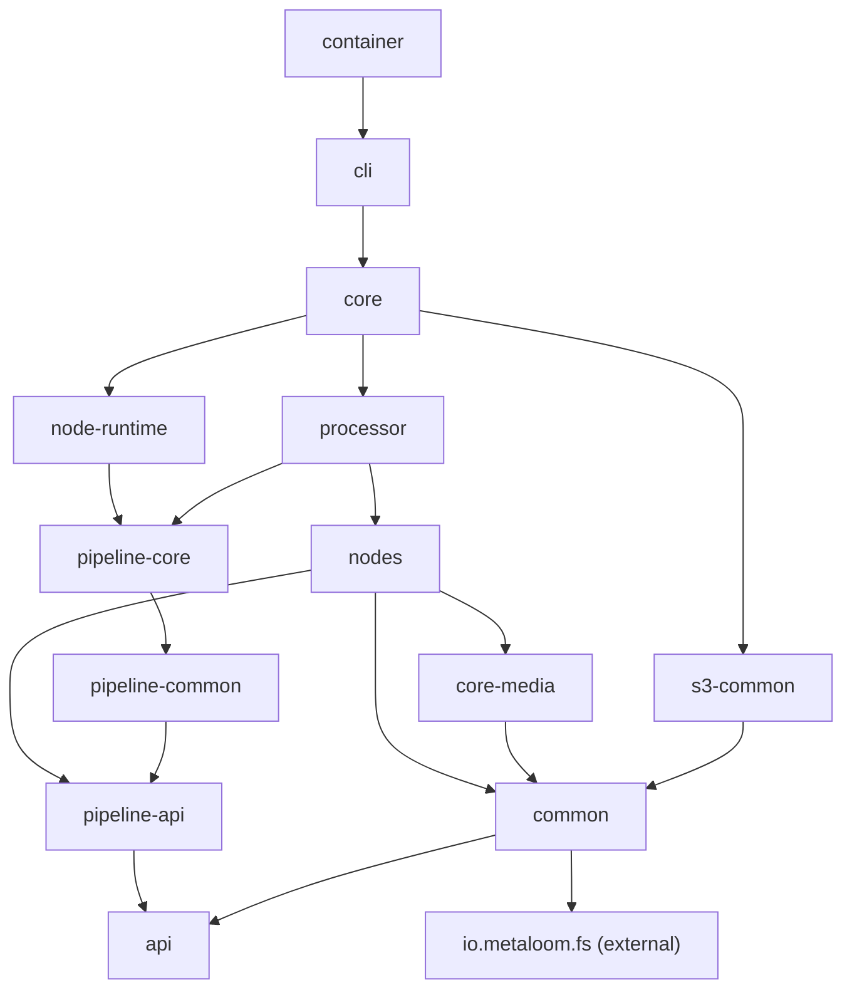

# Cortex — General Information Specification

Entry point for coding tasks inside the `cortex/` reactor: module layout, startup
lifecycle, CLI, online/offline mode, node-kind registration, monitoring and the Loom
control channel.

**Scope delineation** — do not duplicate content from these:

| Topic | Spec |
|---|---|
| `CortexOptions`, env vars, CLI flags, `cortex.yml`, per-node options | [CONFIGURATION.md](CONFIGURATION.md) |
| Maven build, dependency versions, container image, native deps | [BUILD.md](BUILD.md) |
| Node lifecycle, per-node reference, ports/payloads, filter & source nodes | [NODES.md](../features/pipeline-nodes/NODES.md) |
| Pipeline DAG engine (Loom-side), persistence, events, caching, sync | [PIPELINE.md](../features/pipeline/PIPELINE.md) |
| Processor WebSocket protocol (Loom perspective) | [../loom/WEBSOCKET.md](../loom/WEBSOCKET.md) |
| Top-level project context | [../METALOOM.md](../METALOOM.md) |

---

## 1. Overview

Cortex is the **processing layer** of MetaLoom: a standalone worker process that
analyses media (image, video, audio, document) and syncs results back to Loom.

**Cortex does not own a DAG.** Loom's `PipelineRunEngine` owns the graph and dispatches
one unit of work at a time; Cortex executes it and reports back. There is no
`Pipeline`, `PipelineManager` or `PipelineExecutor` class in the reactor — the pipeline
modules only contribute node implementations, filters, an event bus, caches and the
bulk-sync collector. See [PIPELINE.md](../features/pipeline/PIPELINE.md).

### 1.1 Online vs Offline

| Mode | Condition | Behaviour |
|---|---|---|
| **Online** | Loom hostname resolvable from `--hostname`/`LOOM_HOST` (+ port) | `LoomControlChannel` opens the WebSocket, REGISTERs, receives source/node/segment tasks, syncs results |
| **Offline** | `CortexOptions.getLoom()` is `null` or its hostname is `null` | `CortexClientModule#restClient` returns `null`; no WebSocket, no tasks, no sync. Work is driven by `cortex po run` |

`LoomClient` is `@Nullable` in Dagger. All Loom-dependent components must degrade
gracefully: `LoomBulkSyncWriterImpl` no-ops, `LoomControlChannel` logs
`"LOOM host not configured"` and does not connect (`endpointConfigured = false`).

Note that `--hostname` **defaults to `localhost`**, so a plain `cortex server start`
is *online* against localhost, not offline. True offline requires clearing the Loom
options in `cortex.yml`.

---

## 2. Module Map

Maven reactor `cortex/pom.xml`. Build ordering and dependency versions live in
[BUILD.md](BUILD.md).

| Module | Artifact | Responsibility |
|---|---|---|
| `api/` | `cortex-api` | `Cortex`, `CortexFactory`, `CortexEnv`, `LoomWorker`; options (`CortexOptions`, `LoomClientOptions`, `S3ClientOptions`, `S3EventOptions`); node SPI (`CortexNode`, `FilesystemNode`, `SourceNode`, `NodeResult`, `ResultState`, `InputPort`/`OutputPort`, `payload/*`); `LoomMedia` |
| `common/` | `cortex-common` | `CortexOptionsLoader`, `LoomMediaLoader`, `LoomMediaComponent`, media impls, `PipelineConfigurable` |
| `s3-common/` | `cortex-s3-common` | `S3Support`, object store/materializer, `S3ObjectIndexStore`, event sources (`WebhookS3EventSource`, `SqsS3EventSource`), `S3EventBuffer` |
| `fs/` | `cortex-fs` | **Empty shell** — only `module-info.java.off`. The Linux scanner comes from the external `io.metaloom.fs` artifact (`differential-filesystem-scanner`) |
| `core-media/` | `cortex-core-media` | Result value types (`WhisperResult`, `SceneDetectionResult`, `Scene`) + the shared AssertJ/node test harness (test-jar) |
| `nodes/` | 26 submodules | Concrete nodes; see [NODES.md](../features/pipeline-nodes/NODES.md) |
| `processor/` | `cortex-processor` | `MediaProcessor` + `FilesystemProcessor` (CLI-driven batch walk) |
| `node-runtime/` | `cortex-node-runtime` | `NodeTaskRunner`, `SegmentTaskRunner`, `SourceTaskRunner`, `ResultBatcher`, `NodeResultMapper` — executes what Loom hands down |
| `core/` | `cortex-core` | `CortexImpl`, `CortexCLI` + commands, Dagger modules, `LoomControlChannel`, `PipelineTaskHandler`, monitoring, node registry |
| `cli/` | `cortex-cli` | `CortexCLIMain`, `CortexComponent`, `NodeCollectionModule`, `PipelineNodeFactoryModule`, `RegistryNodeRegistrar`; shaded jar |
| `container/` | `cortex-container` | `Containerfile`, `build-container.sh`, `logback.xml` |
| `pipeline-api/` | `cortex-pipeline-api` | `PipelineNode`, `MediaSourceNode`, `PipelineResult`, `NodeMode`, filter SPI, `PipelineEventBus`, `LoomBulkSyncCollector` |
| `pipeline-core/` | `cortex-pipeline-core` | `AbstractPipelineNode`, `CortexNodeAdapter`, `AssetSourceNode`, `LoomFetchNode`, filter nodes |
| `pipeline-common/` | `cortex-pipeline-common` | `DefaultPipelineEventBus`, `DefaultLoomBulkSyncCollector` |



---

## 3. Key Classes Reference

| Class | Package | Purpose |
|---|---|---|
| `Cortex` | `io.metaloom.cortex` (api) | `run()`, `run(boolean)`, `shutdown()`, `shutdownAndTerminate(int)`, `checkNodes()`, `actualMonitoringPort()` |
| `CortexImpl` | `io.metaloom.cortex.impl` (core) | Lifecycle; registers the JVM shutdown hook, flushes the sync buffer, blocks on a `CountDownLatch` |
| `CortexEnv` | `io.metaloom.cortex` (api) | `CORTEX_CONF_FILENAME = "cortex.yml"` |
| `CortexCLI` | `io.metaloom.cortex.cli` (**core**) | Picocli root; all global `@Option`s use `ScopeType.INHERIT` |
| `CortexCLIMain` | `io.metaloom.cortex.cli` (**cli**) | `main()`; pre-parses args into `CortexOptions`, builds the Dagger component, executes |
| `EnvDefaultProvider` | `io.metaloom.cortex.cli` (core) | Maps CLI flags to env vars |
| `CortexComponent` | `io.metaloom.cortex.cli.dagger` (cli) | Dagger `@Component`; exposes `cortex()`, `cli()`, `nodeFactory()`, `nodeRegistrar()` |
| `CortexBootstrapInitializer` | `io.metaloom.cortex.impl.boot` | `init(port)`: registrar → monitoring → SQS source → control channel. `deinit()`: drain → stop |
| `LoomControlChannel` | `io.metaloom.cortex.impl.loom` | Vert.x 5 `WebSocketClient` to `/api/v1/processors/ws`; register, heartbeat, status, task dispatch, drain |
| `PipelineTaskHandler` | `io.metaloom.cortex.impl.loom` | Owns the three task runners plus `beginDrain`/`awaitDrain`/`returnOutstanding` |
| `NodeTaskRunner` / `SegmentTaskRunner` / `SourceTaskRunner` | `io.metaloom.cortex.runtime` | Execute a single node, an affinity segment, a source enumeration |
| `ResultBatcher` / `NodeResultMapper` | `io.metaloom.cortex.runtime` | Batch results for the wire; map `NodeResult` to the Loom model |
| `NodeFactory` / `RegistryNodeFactory` | `io.metaloom.cortex.pipeline.loader` | Kind → `PipelineNode` registry; `registeredTypes()` feeds the REGISTER whitelist |
| `NodeRegistrar` / `RegistryNodeRegistrar` | `…loader` (core) / `…cli.dagger` (cli) | Seam that fills the registry at bootstrap from the node multibinding |
| `CortexNodeAdapter` | `io.metaloom.cortex.pipeline.core.node` | Wraps a `FilesystemNode` as a `PipelineNode` (mode, blocking, concurrency, timeout, `syncToLoom`) |
| `MonitoringService` | `io.metaloom.cortex.impl.monitoring` | Vert.x HTTP server hosting health, metrics and the S3 webhook route |
| `HealthEndpoint` / `MetricsEndpoint` / `MicrometerCortexMetrics` | `…impl.monitoring` | `/api/health`, `/api/ready`, `/metrics`; `cortex_*` meters |
| `MediaProcessor` / `FilesystemProcessor` | `io.metaloom.cortex.processor` / `.scanner` | CLI batch processing |
| `S3Support` | `io.metaloom.cortex.s3` | Worker-level S3 client, materializer, index base dir; `isActive()` gates the `s3-source` kind |
| `CloudSupportRegistry` / `CloudSupport` | `io.metaloom.cortex.cloud` | The same shape per cloud provider; `isActive(provider)` gates `gdrive-source` and `onedrive-source` independently |
| `SchemeMediaReferenceResolver` | `io.metaloom.cortex.common.media` | Routes a media reference to the branch owning its URI scheme; falls back to a local path |

---

## 4. Startup Lifecycle

### 4.1 Entry point

```
CortexCLIMain.main(args)
  ├── parseOptions(args)     // CortexCLI + EnvDefaultProvider → CortexOptions
  ├── DaggerCortexComponent.builder().options(options).build()
  └── component.cli().execute(args)
```

### 4.2 Subcommands (picocli)

| Invocation | Registered by | Notes |
|---|---|---|
| `cortex server start [-a <nodes>]` | `PicoCLIModule` under name `server`, annotation alias `s` | Calls `requireNodeId()` first, then `cortex.run()` (blocking) |
| `cortex po run [-a <nodes>] <path>` | `PicoCLIModule` under name **`po`**, annotation alias `p` | Offline batch walk via `MediaProcessor.process(actions, folder)` |

`ProcessCommand` is annotated `@Command(name = "process", aliases = {"p"})` but
`PicoCLIModule` registers it with the explicit name `"po"`. Picocli's
`CommandSpec#addSubcommand(name, cl)` keys the lookup on the passed name plus the
annotation aliases, so **`cortex process run` does not resolve** — only `po` and `p`
do. This reads like a typo; treat `process` in older docs as stale.

### 4.3 Server mode

```mermaid
sequenceDiagram
    participant SC as ServerCommand
    participant C as CortexImpl
    participant Boot as CortexBootstrapInitializer
    participant NR as NodeRegistrar
    participant MS as MonitoringService
    participant LCC as LoomControlChannel
    participant Loom as Loom Server

    SC->>C: requireNodeId(); cortex.run()
    C->>C: registerShutdownHook()
    C->>Boot: init(options.getMonitoringPort())
    Boot->>NR: registerAll()  (must precede REGISTER)
    Boot->>MS: init(port)  → health + /metrics + S3 webhook route
    Boot->>Boot: SqsS3EventSource.start()  (no-op unless configured)
    Boot->>LCC: start()
    LCC->>Loom: WS connect /api/v1/processors/ws
    LCC->>Loom: REGISTER (nodeId, capabilities, whitelist=registeredTypes())
    Loom-->>LCC: REGISTERED
    LCC->>LCC: HEARTBEAT 10s / STATUS_UPDATE 20s / health log 30s
    C->>C: dontExit()  — blocks on CountDownLatch
```

### 4.4 Task-driven work (online)

| Message from Loom | Handler | Reply |
|---|---|---|
| `SOURCE_TASK` | `handleSourceTask` → `SourceTaskRunner` | `SOURCE_ITEMS` batches (flow-controlled by `SOURCE_ITEMS_ACK`), then `SOURCE_COMPLETE` |
| `NODE_TASK` | `handleNodeTask` → `NodeTaskRunner` | `NODE_TASK_RESULT` (batched as `NODE_TASK_RESULT_BATCH`) |
| `SEGMENT_TASK` | `handleSegmentTask` → `SegmentTaskRunner` | `SEGMENT_TASK_RESULT` |

Loom sends the node definition inline with the task; Cortex materialises the node via
`NodeFactory#createNode`. There is **no** startup-time pipeline fetch — the former
`LoomPipelineLoader` no longer exists.

---

## 5. Dagger Wiring

`@Component(modules = { CortexBindModule, CortexMediaModule, PicoCLIModule,
PipelineNodeFactoryModule, CortexClientModule, S3Module })`

| Module | Location | Provides |
|---|---|---|
| `CortexBindModule` | core | `Cortex`, `MediaProcessor`, `FilesystemProcessor`, `BulkSyncWriter`, `CortexMetrics`, `PrometheusMeterRegistry`, `Vertx` (micrometer-bound), `PipelineEventBus`, `LoomBulkSyncCollector`, `LinuxFilesystemScanner` |
| `CortexClientModule` | core | `@Nullable LoomClient` (REST; `null` offline), `CortexOptions` (injected default or `CortexOptionsLoader.load()`) |
| `CortexMediaModule` | core | `LoomMediaComponent` subcomponent |
| `PicoCLIModule` | core | `CommandLine` + the two subcommands |
| `S3Module` | core | `S3ClientOptions`, `S3Support`, `S3EventBuffer`, `WebhookS3EventSource`, `SqsS3EventSource`, `MediaReferenceResolver` |
| `PipelineNodeFactoryModule` | cli | `NodeFactory` ← `RegistryNodeFactory` (singleton, initially empty), `NodeRegistrar` |
| `NodeCollectionModule` | cli | Includes all 26 node modules (via `PipelineNodeFactoryModule`) |

### 5.1 Node-kind registration

Each node module contributes its kind with a one-line multibinding:

```java
@Binds @IntoMap @StringKey("thumbnail")
abstract FilesystemNode<?, ?> bindKind(ThumbnailNode node);
```

`RegistryNodeRegistrar` consumes `Map<String, Provider<FilesystemNode<?,?>>>` and wraps
each entry in a `CortexNodeAdapter`. **Adding a node kind requires no edit outside its
own module** (plus one `includes = …` line in `NodeCollectionModule`).

The `Provider` indirection is load-bearing: a kind is advertised without constructing
the node, so a worker that only hashes never loads face-detection model packs.
`CortexImpl` uses `Lazy<Set<CortexNode<?,?>>>` for the same reason.

Registered kinds (`registeredTypes()`):

| Group | Kinds |
|---|---|
| Sources | `filesystem-source`, `asset-source`, `s3-source` *(only when `S3Support.isActive()`)*, `gdrive-source` / `onedrive-source` *(each only when that provider's credentials are configured)* |
| Hash / dedup | `sha512`, `sha256`, `md5`, `chunk-hash`, `sha512-dedup`, `hash-dedup`, `fingerprint-dedup`, `fingerprint-dedup-apply` |
| Analysis | `fingerprint`, `facedetect`, `ocr`, `tika`, `quality`, `consistency`, `scene-detection`, `scene-layout`, `dominant-color`, `depthmap`, `sentiment` |
| AI | `llm`, `vlm`, `captioning`, `whisper`, `tts`, `imagegen`, `videogen` |
| Transform / sink | `thumbnail`, `watermark`, `script`, `s3-sink` |

---

## 6. Monitoring

`MonitoringService` starts one Vert.x HTTP server (default port 8093).

| Route | Description |
|---|---|
| `/api/health` | `{"status":"up","loom":{…}}` — always 200 |
| `/api/ready` | 200 when `endpointConfigured && connected && registered`, else 503; same `loom` body |
| `/health`, `/ready` | Legacy aliases, identical handlers |
| `/metrics` | Prometheus scrape (`cortex_*` meters + Vert.x/JVM built-ins) |
| S3 webhook path | Registered only when webhook events are enabled **and** a shared secret is set |

`loom` object (`LoomControlChannel#healthStatus`): `configured`, `connected`,
`registered`, `host`, `port`, `reconnectAttempts`, `lastConnectedAt`, `lastMessageAt`,
`lastHeartbeatAckAt`, `error` (the three timestamps are `null` when zero).

Meter families: `cortex_loom_messages_received`, `cortex_loom_reconnects`,
`cortex_tasks_{received,returned,completed}`, `cortex_task_duration`,
`cortex_node_operations`, `cortex_node_operation_duration`, `cortex_files_missing`,
`cortex_results_{batches_sent,sent}`, `cortex_bulk_sync_assets`,
`cortex_source_items_enumerated`, `cortex_source_ack_timeouts`, `cortex_ai_calls`,
`cortex_ai_call_duration`, `cortex_ai_cache_hits`, plus gauges
`cortex_loom_reconnect_attempts` and `cortex_memory_max_bytes`.

---

## 7. Loom Control Channel

### 7.1 Timings and constants (`LoomControlChannel`)

| Constant | Value |
|---|---|
| `HEARTBEAT_INTERVAL_MS` | 10 000 |
| `STATUS_INTERVAL_MS` | 20 000 |
| `HEALTH_LOG_INTERVAL_MS` | 30 000 |
| `RECONNECT_BASE_DELAY_MS` | 2 000 |
| `RECONNECT_MAX_DELAY_MS` | 30 000 |

### 7.2 Reconnection — **linear**, not exponential

```java
long delay = Math.min(RECONNECT_BASE_DELAY_MS * Math.max(1, attempt), RECONNECT_MAX_DELAY_MS);
```

Delays run 2s, 4s, 6s … capped at 30s from attempt 15 on. `reconnectAttempts` resets to
0 on a successful `REGISTERED`; every reconnect re-sends `REGISTER`.

### 7.3 Registration payload

`ProcessorRegistration`: `nodeId` (from `--node-id`, mandatory for `server start`),
`name = "cortex"`, `priority = 100`, `host = <hostname>:<monitoringPort>`,
`capabilities = EnumSet.of(CPU, IO)`, `nodeWhitelist`, `nodeBlacklist`.

The announced whitelist is `options.getNodeWhitelist()` when non-empty, otherwise
`nodeFactory.registeredTypes()` — so a worker cannot advertise work it cannot run. If
that lookup throws, it registers `null` (= unrestricted). The blacklist always narrows
the whitelist.

### 7.4 Graceful shutdown (drain)

`SIGTERM` does not reach `CortexImpl#shutdown` on its own, so `run()` registers a JVM
shutdown hook that calls it; a direct `shutdown()` removes the hook, so it fires at
most once. `shutdown()` flushes the bulk-sync buffer *before* `boot.deinit()`, which
drains while the socket is still open:

1. `STATE_CHANGE` → `TERMINATING` — Loom places nothing more here.
2. `PipelineTaskHandler#beginDrain` — a dispatch already on the wire is answered with `TASK_RETURNED` instead of being started.
3. `awaitDrain(--drain-timeout-ms)` (default 30 000) — node, segment *and* source tasks get the grace period.
4. `returnOutstanding(reason)` — whatever still runs is handed back; the task keeps running locally, Loom is simply free to re-place it.
5. One final frame is written and awaited, because frames queued on the event loop are lost when the socket closes.

Without this, held tasks stay `RUNNING` until the lease lapses (10 min default). See
[../loom/WEBSOCKET.md](../loom/WEBSOCKET.md) for the wire protocol and attempt-budget
effect.

**Gap:** a source task already enumerating cannot be handed back — there is no reclaim
path, and fabricating `SOURCE_COMPLETE` would mark a truncated scan as whole. It is
logged and abandoned; the run must be dispatched again.

---

## 8. Environment Variables

Full flag/env/default matrix: [CONFIGURATION.md §2](CONFIGURATION.md). The ones this
document's behaviour depends on:

| Env | Flag | Default | Effect here |
|---|---|---|---|
| `LOOM_HOST` | `-h`, `--hostname` | `localhost` | Absent/blank ⇒ offline; otherwise the WS endpoint host |
| `LOOM_PORT` | `-p`, `--port` | `7733` | WS + REST port; `<= 0` ⇒ not configured |
| `CORTEX_MONITORING_PORT` | `--monitoring-port` | `8093` | Health/metrics/webhook server; also reported as the registration `host` suffix |
| `CORTEX_NODE_ID` | `--node-id` | — | **Required by `server start`**; must be unique and restart-stable |
| `CORTEX_DRAIN_TIMEOUT_MS` | `--drain-timeout-ms` | `30000` | Grace period in step 3 of the drain |
| `CORTEX_NODE_WHITELIST` | `--node-whitelist` | — (announces `registeredTypes()`) | Narrows what this worker accepts |
| `CORTEX_NODE_BLACKLIST` | `--node-blacklist` | — | Refusals; wins over the whitelist |
| `CORTEX_META_PATH` | `--meta-path` | `${user.home}/.cache/metaloom/cortex/meta` | Base for `filesystem-index/`, S3 index fallback |
| `LOOM_TOKEN` | — | — | Bearer token for the WebSocket/REST auth |

---

## 9. Test Setup

Build and test commands: [BUILD.md §3](BUILD.md).

| Layer | Where | Notes |
|---|---|---|
| Unit tests | `<module>/src/test` | `mvn test -pl cortex/<module>` |
| Shared node harness | `cortex/core-media` test-jar — `AbstractNodeTest`, `AbstractBasicNodeTest`, `NodeTestcases`, `NodeAssertions` | Depend on it with `<type>test-jar</type>` |
| Node E2E ITs | `integration-test/src/test/java/io/metaloom/loom/test/integration/node/` (`AbstractNodeIntegrationTest`, `NodePortConformanceTest`, `*NodeIntegrationTest`) | Testcontainers: `LoomContainer`, `CortexContainer`, `MinioContainer` |
| Distributed / drain / health ITs | `…/integration/` — `PipelineDistributedExecutionIntegrationTest`, `PipelineAffinitySegmentIntegrationTest`, `PipelineContainerExecutionIntegrationTest`, `HealthEndpointIntegrationTest`, `CliIntegrationTest` | Rebuild the shaded `cortex-cli` jar **and** the container image before running |
| Model-heavy comparisons | `*IT.java` inside node modules (e.g. `SceneBoundaryIT`, `VideoCaptioningComparisonIT`) | Not part of the default surefire run |

AssertJ helpers: `PipelineResultAssert`/`PipelineNodeResultAssert`
(`cortex/pipeline-core/src/test/.../pipeline/test/assertj/`), `NodeResultAssert`/
`LoomMediaAssert` (`cortex/core-media/src/test/.../media/test/assertj/`),
`CortexNodeOptionsAssert`/`ValidationResultAssert` (`cortex/api/src/test/…`), and one
`<Node>OptionsAssert` per node module.

---

## 10. Conventions and Gotchas

- **`process` is registered as `po`.** See [§4.2](#42-subcommands-picocli). Fixing it means changing `PicoCLIModule`, not the annotation.
- **Registrar before channel.** `NodeRegistrar#registerAll()` must run before `LoomControlChannel#start()`, or REGISTER advertises an empty whitelist and the worker silently receives nothing. `registerAll()` is guarded by a `registered` flag and is idempotent.
- **Never eagerly inject node sets.** Use `Provider`/`Lazy`. Injecting `Set<CortexNode>` directly constructs every node — face detection loads its model pack merely to print help.
- **Conditional kinds.** `s3-source` is only registered when `S3Support.isActive()`, and `gdrive-source` / `onedrive-source` only when that cloud's credentials are configured. Registering one unconditionally turns a missing capability into a dead run. This per-provider gate is why the two clouds are two kinds sharing one implementation rather than a single kind with a `provider` parameter.
- **Package roots.** `io.metaloom.cortex.*` only; `io.metaloom.loom.*` is Loom backend. Note `CortexCLI` lives in `cortex/core` while `CortexCLIMain` lives in `cortex/cli`, both in package `io.metaloom.cortex.cli`.
- **Two node hierarchies.** `CortexNode`/`FilesystemNode` (Cortex level) vs `PipelineNode` (pipeline level), bridged by `CortexNodeAdapter`. Never mix without the adapter — see [NODES.md](../features/pipeline-nodes/NODES.md).
- **Offline safety.** `LoomClient` may be `null`; never dereference it unguarded.
- **Dagger incrementality.** After changing generic types on nodes/services or adding a multibinding, run a clean `mvn compile` — the annotation processor may not re-trigger and you get a `NoSuchMethodError` at runtime.
- **`cortex/fs` is empty.** The real scanner is the external `io.metaloom.fs` artifact; do not add code to `cortex/fs` expecting it to be picked up.
- **Vert.x 5** shared with Loom; the singleton comes from `CortexBindModule#provideVertx` and is bound to the Prometheus registry, so replacing it drops all Vert.x metrics.
- **Port collisions.** Monitoring 8093 vs Loom HTTP 7733. The WebSocket shares the Loom HTTP port at `/api/v1/processors/ws`.
- **Container** runs `java … -jar cortex-cli.jar server start` (Java 25, `--enable-native-access=ALL-UNNAMED`). See [BUILD.md](BUILD.md).

---

## 11. Where do I find …?

| Need | Path (relative to repo root) |
|---|---|
| `main()` | `cortex/cli/src/main/java/io/metaloom/cortex/cli/CortexCLIMain.java` |
| Global CLI options | `cortex/core/src/main/java/io/metaloom/cortex/cli/CortexCLI.java` |
| Subcommand registration | `cortex/core/src/main/java/io/metaloom/cortex/cli/dagger/PicoCLIModule.java` |
| Subcommands | `cortex/core/src/main/java/io/metaloom/cortex/cli/cmd/` |
| Runtime lifecycle | `cortex/core/src/main/java/io/metaloom/cortex/impl/CortexImpl.java` |
| Bootstrap order | `cortex/core/src/main/java/io/metaloom/cortex/impl/boot/CortexBootstrapInitializer.java` |
| Dagger component | `cortex/cli/src/main/java/io/metaloom/cortex/cli/dagger/CortexComponent.java` |
| Dagger bindings | `cortex/core/src/main/java/io/metaloom/cortex/cli/dagger/` |
| Node-kind registry fill | `cortex/cli/src/main/java/io/metaloom/cortex/cli/dagger/RegistryNodeRegistrar.java` |
| Node module list | `cortex/cli/src/main/java/io/metaloom/cortex/cli/dagger/NodeCollectionModule.java` |
| WebSocket client | `cortex/core/src/main/java/io/metaloom/cortex/impl/loom/LoomControlChannel.java` |
| Task dispatch + drain | `cortex/core/src/main/java/io/metaloom/cortex/impl/loom/PipelineTaskHandler.java` |
| Task execution | `cortex/node-runtime/src/main/java/io/metaloom/cortex/runtime/` |
| Health / metrics | `cortex/core/src/main/java/io/metaloom/cortex/impl/monitoring/` |
| Config loading | `cortex/common/src/main/java/io/metaloom/cortex/common/option/CortexOptionsLoader.java` |
| S3 support | `cortex/s3-common/src/main/java/io/metaloom/cortex/s3/` |
| Node → pipeline adapter | `cortex/pipeline-core/src/main/java/io/metaloom/cortex/pipeline/core/node/CortexNodeAdapter.java` |
| Filter nodes | `cortex/pipeline-core/src/main/java/io/metaloom/cortex/pipeline/core/node/filter/` |
| Node result cache (per node, across items) | `cortex/common/src/main/java/io/metaloom/cortex/common/cache/LocalResultCache.java` |
| Artifact scope (per segment, one item) | `cortex/api/src/main/java/io/metaloom/cortex/api/node/artifact/` |
| Concrete nodes | `cortex/nodes/<kind>/core/` |
| Containerfile / build | `cortex/container/`, `build.sh` (repo root) |
| Integration tests | `integration-test/src/test/java/io/metaloom/loom/test/` |

---

## 12. Progress Assessment

- [x] Module map matches `cortex/*/pom.xml` (incl. `s3-common`, `node-runtime`, empty `fs`)
- [x] Key classes reference table
- [x] Startup lifecycle and bootstrap ordering
- [x] Subcommand names verified against `PicoCLIModule` (`po`, not `process`)
- [x] Dagger wiring matches `CortexComponent`
- [x] Node-kind registration via `@Binds @IntoMap @StringKey` documented
- [x] Monitoring endpoints + `cortex_*` meter families
- [x] Control channel: linear backoff, registration payload, drain sequence
- [x] Online vs offline selection (incl. the `localhost` default caveat)
- [x] Test setup incl. integration-test module
- [x] Conventions and gotchas, "Where do I find" cheat sheet, diagrams
- [ ] Fix the `po` subcommand name in `PicoCLIModule` (code change, then update §4.2)
- [ ] Container deployment guide (Kubernetes manifests, probes, HPA on `cortex_*` metrics)
- [ ] Source-task reclaim path so a drained enumeration is not abandoned ([§7.4](#74-graceful-shutdown-drain))
- [ ] GraalVM native image notes
- [ ] Performance tuning guide (`maxConcurrentMedia`, per-node timeouts, batch sizes)

---

_Git HEAD revision: `2e5981cb`_
_Last updated: 2026-08-02 (added CloudSupportRegistry and SchemeMediaReferenceResolver; recorded the per-provider conditional registration of gdrive-source / onedrive-source)_
