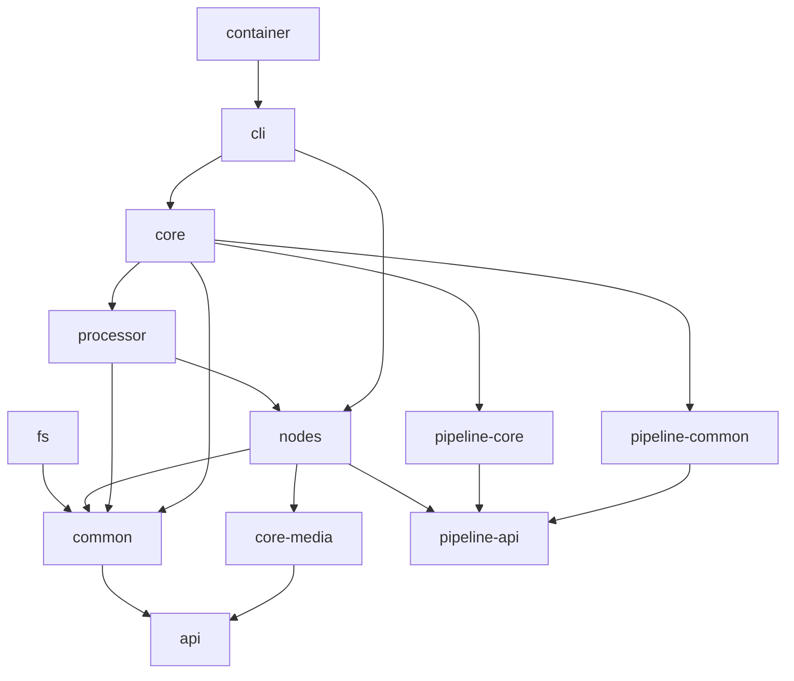
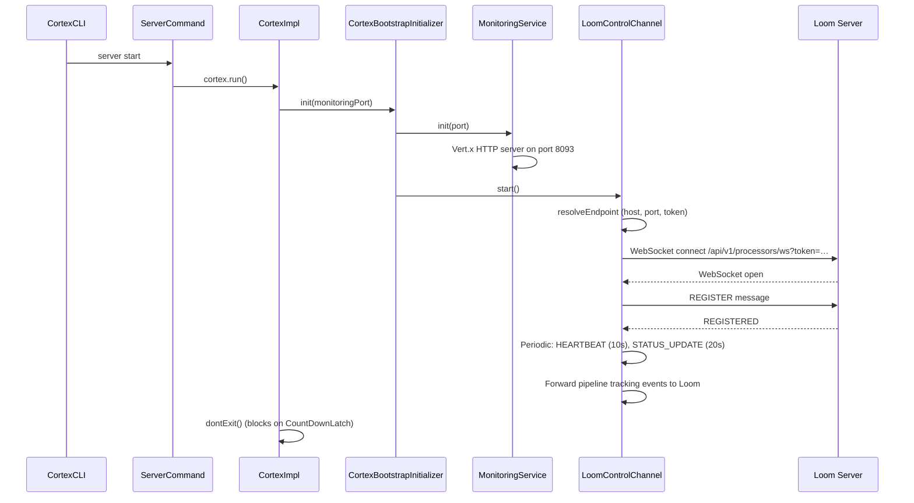

# Cortex — General Information Specification

> This document describes the Cortex processing node at a high level: its
> architecture, module layout, startup lifecycle, CLI commands, online/offline
> modes, and Loom integration. It is the entry point for AI coding tasks
> inside the `cortex/` reactor.
>
> **Subsystem-specific specs** (do not duplicate content from these):
> - [CONFIGURATION.md](CONFIGURATION.md) — `CortexOptions`, env vars, CLI flags, YAML config
> - [BUILD.md](BUILD.md) — Maven build, container image, native dependencies
> - [PIPELINE.md](../features/pipeline/PIPELINE.md) — Pipeline DAG engine, executor, events, caching, sync
> - [NODES.md](../features/pipeline-nodes/NODES.md) — Node lifecycle, MetaStorage, per-node reference, filter nodes
>
> **Companion docs in the Loom spec directory**:
> - [../features/pipeline/PIPELINE.md](../features/pipeline/PIPELINE.md) — Loom-side pipeline persistence + event bridge (PIPELINE_CONTEXT.md was merged into it)
> - [../loom/WEBSOCKET.md](../loom/WEBSOCKET.md) — Processor WebSocket protocol (Loom perspective)
> - [../METALOOM.md](../METALOOM.md) — Top-level project context

---

## 1. Overview

Cortex is the **processing layer** of MetaLoom. It runs as a standalone
worker process that analyses media files (images, videos, audio, documents)
and optionally syncs results back to the Loom backend.

### 1.1 What Cortex Does

| Capability | Description |
|---|---|
| **Hashing** | SHA-512, SHA-256, MD5, chunk-hash for deduplication |
| **Fingerprinting** | Video fingerprinting for content identification |
| **Face detection** | Face detection + embeddings via InspireFace |
| **Thumbnail** | Contact-sheet thumbnail generation for videos |
| **Consistency** | Zero-chunk detection for incomplete/corrupt media |
| **Metadata extraction** | Apache Tika metadata extraction |
| **OCR** | Text extraction from images via Tesseract |
| **Whisper (ASR)** | Speech-to-text via whisper.cpp |
| **LLM** | Metadata extraction via Ollama LLM prompts |
| **Captioning** | Image captioning via SmolVLM vision model |
| **Quality** | Resolution, blurriness, bitrate metrics |
| **Scene detection** | Optical-flow scene boundary detection |
| **Dedup** | SHA-512 or fingerprint-based deduplication |

### 1.2 Online vs Offline Mode

Cortex operates in two modes:

| Mode | Condition | Behaviour |
|---|---|---|
| **Online** | Loom host + port configured (`--hostname` / `--port` or env vars) | Connects to Loom via WebSocket, registers capabilities, receives work orders, syncs results back |
| **Offline** | No Loom host configured | Runs standalone; no WebSocket, no work orders, no result sync. Processing is driven by the `process run` CLI command |

The `LoomClient` is `@Nullable` in Dagger — when the host is absent,
`CortexClientModule` returns `null`, and all Loom-dependent components
gracefully degrade (e.g. `LoomBulkSyncWriterImpl` becomes a no-op,
`LoomPipelineLoader` skips loading, `LoomControlChannel` logs a warning
and does not start).

---

## 2. Module Map

Cortex is a Maven reactor under `cortex/pom.xml` with these modules:

```
cortex/
├── api/              # Public interfaces: Cortex, CortexOptions, CortexNode, LoomMedia, NodeResult, MetaStorage
├── common/           # Shared impls: MetaStorageImpl, CortexOptionsLoader, LoomMediaLoader, media types
├── fs/               # Filesystem scanner (Linux xattr support)
├── core-media/       # Media decorator types (HashMedia, FacedetectMedia, etc.) + AssertJ test helpers
├── nodes/            # Concrete processing nodes (hash, facedetect, fingerprint, ocr, thumbnail, llm, whisper, tika, dedup, quality, captioning, consistency, scene-detection, loom)
├── processor/        # MediaProcessor + FilesystemProcessor (CLI-driven batch processing)
├── core/             # Runtime wiring: CortexImpl, CLI commands, Dagger modules, LoomControlChannel, monitoring, pipeline loader
├── cli/              # CLI entry point (CortexCLIMain), Dagger component, node collection module
├── container/        # Containerfile + build-container.sh for OCI image
├── pipeline-api/     # Pipeline, PipelineNode, PipelineExecutor, PipelineManager, NodeResult, events, cache SPIs
├── pipeline-core/    # DefaultPipeline, ReactivePipelineExecutor, AbstractPipelineNode, filter nodes, JSON serde
├── pipeline-common/  # DefaultPipelineEventBus, cache impls, DefaultLoomBulkSyncCollector
```

### Module Dependency Graph



---

## 3. Key Classes Reference

| Class | Package | Purpose |
|---|---|---|
| `Cortex` | `io.metaloom.cortex` | Top-level interface: `run()`, `shutdown()`, `checkNodes()` |
| `CortexImpl` | `io.metaloom.cortex.impl` | Implementation of `Cortex`; manages startup/shutdown lifecycle |
| `CortexFactory` | `io.metaloom.cortex` | Static factory (currently throws — use Dagger component) |
| `CortexEnv` | `io.metaloom.cortex` | Constants (config filename `cortex.yml`) |
| `CortexOptions` | `io.metaloom.cortex.api.option` | Root config object (nodes, loom, dryrun, metaPath, monitoringPort) |
| `CortexOptionsLoader` | `io.metaloom.cortex.common.option` | Loads `cortex.yml` from `~/.config/metaloom/cortex.yml` |
| `CortexCLI` | `io.metaloom.cortex.cli` | Picocli command root (`cortex` command with global options) |
| `CortexCLIMain` | `io.metaloom.cortex.cli` | `main()` entry point; builds Dagger component, runs CLI |
| `CortexComponent` | `io.metaloom.cortex.cli.dagger` | Dagger component; wires all modules |
| `CortexBindModule` | `io.metaloom.cortex.cli.dagger` (core) | Dagger bindings: Cortex, MediaProcessor, MetaStorage, Vertx, PipelineExecutor, etc. |
| `CortexClientModule` | `io.metaloom.cortex.cli.dagger` (core) | Dagger: LoomClient (nullable), CortexOptions |
| `CortexMediaModule` | `io.metaloom.cortex.cli.dagger` (core) | Dagger: LoomMediaComponent subcomponent |
| `PicoCLIModule` | `io.metaloom.cortex.cli.dagger` (core) | Dagger: CommandLine + subcommands (process, server) |
| `NodeCollectionModule` | `io.metaloom.cortex.cli.dagger` | Dagger: includes all node modules (hash, facedetect, etc.) |
| `PipelineNodeFactoryModule` | `io.metaloom.cortex.cli.dagger` | Dagger: RegistryNodeFactory populated with concrete node producers |
| `LoomStorageModule` | `io.metaloom.cortex.cli.dagger` | Dagger: multibindings for `LoomMetaTypeHandler` (XATTR, FS, HEAP, AVRO) |
| `CortexBootstrapInitializer` | `io.metaloom.cortex.impl.boot` | Starts monitoring HTTP server + Loom control channel |
| `LoomControlChannel` | `io.metaloom.cortex.impl.loom` | WebSocket client to Loom (`/api/v1/processors/ws`); registration, heartbeat, work orders, pipeline event forwarding |
| `PipelineWorkOrderHandler` | `io.metaloom.cortex.impl.loom` | Handles work orders from Loom (reload-pipelines, flush-sync, list-pipelines, run-pipeline) |
| `MonitoringService` | `io.metaloom.cortex.impl.monitoring` | Vert.x HTTP server for health/ready endpoints |
| `HealthEndpoint` | `io.metaloom.cortex.impl.monitoring` | `/api/health` and `/api/ready` endpoints |
| `MediaProcessor` | `io.metaloom.cortex.processor` | Interface for CLI-driven batch processing |
| `DefaultMediaProcessorImpl` | `io.metaloom.cortex.processor.impl` | Delegates to `FilesystemProcessor` |
| `FilesystemProcessor` | `io.metaloom.cortex.scanner` | Filesystem scanner interface |
| `FilesystemProcessorImpl` | `io.metaloom.cortex.scanner.impl` | Walks directories, feeds media to nodes |
| `LoomPipelineLoader` | `io.metaloom.cortex.pipeline.loader` | Loads pipeline definitions from Loom REST API |
| `RegistryNodeFactory` | `io.metaloom.cortex.pipeline.loader` | Maps JSON node definitions to concrete `PipelineNode` impls |
| `NodeFactory` | `io.metaloom.cortex.pipeline.loader` | SPI for node creation from JSON |

---

## 4. Startup Lifecycle

### 4.1 CLI Entry Point

```
CortexCLIMain.main(args)
  ├── parseOptions(args)          // Pre-parse CLI args + env vars → CortexOptions
  ├── DaggerCortexComponent.builder().options(options).build()
  └── cli.execute(args)           // Picocli dispatches subcommands
```

### 4.2 Server Mode (`cortex server start`)



### 4.3 Process Mode (`cortex process run -a hash,thumbnail /path`)

```
ProcessCommand.run(enabledNodes, path)
  └── MediaProcessor.process(actionList, folder)
        └── FilesystemProcessor.analyze(enabledNodes, folder)
              // Walks directory, applies enabled Cortex nodes to each file
```

### 4.4 Work-Order-Driven Mode (Online)

When Cortex is running in server mode and connected to Loom, the
`LoomControlChannel` receives `WORK_ORDER` messages. The
`PipelineWorkOrderHandler` dispatches them:

| Work-order command | Handler action |
|---|---|
| `reload-pipelines` | `LoomPipelineLoader.loadAndRegister()` — fetches pipeline definitions from Loom REST API |
| `flush-sync` | `PipelineExecutor.flushSync()` — drains pending `LoomBulkSyncCollector` entries |
| `list-pipelines` | Returns registered pipeline names |
| `run-pipeline` | Resolves pipeline by name, collects media from `pathGlobs`, executes reactively |

---

## 5. Dagger DI Wiring

The Dagger component `DaggerCortexComponent` is generated from
`CortexComponent` and includes these modules:

| Module | Provides |
|---|---|
| `CortexBindModule` | `Cortex`, `MediaProcessor`, `FilesystemProcessor`, `MetaStorage`, `Vertx`, `PipelineManager`, `PipelineEventBus`, `PipelineExecutor`, `LoomBulkSyncCollector`, `BulkSyncWriter`, `LinuxFilesystemScanner` |
| `CortexClientModule` | `LoomClient` (nullable, offline = null), `CortexOptions` |
| `CortexMediaModule` | `LoomMediaComponent` subcomponent |
| `PicoCLIModule` | `CommandLine` with `process` and `server` subcommands |
| `NodeCollectionModule` | All node Dagger modules (hash, facedetect, fingerprint, etc.) |
| `PipelineNodeFactoryModule` | `NodeFactory` (RegistryNodeFactory with concrete node producers) |
| `LoomStorageModule` | `Set<LoomMetaTypeHandler>` multibinding (XATTR, FS, HEAP, AVRO) |

---

## 6. Monitoring Endpoints

The `MonitoringService` starts a Vert.x HTTP server on the configured
monitoring port (default 8093). The following endpoints are exposed:

| Endpoint | Method | Description |
|---|---|---|
| `/api/health` | GET | Always returns `{"status":"up","loom":{…}}` |
| `/api/ready` | GET | Returns 200 if connected + registered, 503 otherwise |
| `/health` | GET | Legacy alias for `/api/health` |
| `/ready` | GET | Legacy alias for `/api/ready` |

The `loom` object in the health response contains:

| Field | Type | Description |
|---|---|---|
| `configured` | boolean | Whether Loom host+port are configured |
| `connected` | boolean | Whether the WebSocket is currently open |
| `registered` | boolean | Whether Loom acknowledged the REGISTER message |
| `host` | string | Resolved Loom hostname |
| `port` | int | Resolved Loom port |
| `reconnectAttempts` | long | Number of reconnection attempts since last success |
| `lastConnectedAt` | long\|null | Epoch millis of last successful connection |
| `lastMessageAt` | long\|null | Epoch millis of last received message |
| `lastHeartbeatAckAt` | long\|null | Epoch millis of last heartbeat acknowledgement |
| `error` | string\|null | Last connection error message |

---

## 7. Loom Control Channel (WebSocket)

The `LoomControlChannel` is the persistent WebSocket connection from
Cortex to the Loom server. It uses Vert.x 5's `WebSocketClient`.

### 7.1 Connection Lifecycle

| Step | Message | Direction | Description |
|---|---|---|---|
| 1 | WebSocket connect | Cortex → Loom | `ws://{host}:{port}/api/v1/processors/ws?token=…` |
| 2 | `REGISTER` | Cortex → Loom | `ProcessorRegistration` with nodeId, name, priority, host, capabilities |
| 3 | `REGISTERED` | Loom → Cortex | Acknowledgement; sets `registered=true` |
| 4 | `HEARTBEAT` | Cortex → Loom | Sent every 10 seconds |
| 5 | `HEARTBEAT_ACK` | Loom → Cortex | Acknowledgement |
| 6 | `STATUS_UPDATE` | Cortex → Loom | System status (CPU, memory, disk) every 20 seconds |
| 7 | `WORK_ORDER` | Loom → Cortex | Work order (reload-pipelines, flush-sync, run-pipeline, etc.) |
| 8 | `WORK_ORDER_RESULT` | Cortex → Loom | Result of processing the work order |
| 9 | `PIPELINE_EVENT` | Cortex → Loom | Forwarded pipeline tracking event (NODE_STARTED, NODE_COMPLETED, etc.) |
| 10 | `ERROR` | Loom → Cortex | Error message |

### 7.2 Reconnection

- Base delay: 2 seconds, exponential backoff up to 30 seconds max.
- On reconnect: re-sends `REGISTER`, resets `reconnectAttempts`.

### 7.3 Capabilities

Cortex registers with `EnumSet.of(CPU, IO)` capabilities. Future
extensions may add `GPU`.

---

## 8. Environment Variables

See [CONFIGURATION.md](CONFIGURATION.md) for the full environment variable
table and CLI flag reference.

---

## 9. Test Setup

### 9.1 Unit Tests

Each module has its own `src/test` directory. Tests are run with
`mvn test -pl <module>`.

### 9.2 Integration Tests

Cortex integration tests live alongside the main test source in each
module. They use the `cortex-common` test-jar for shared test utilities.

### 9.3 Custom AssertJ

Cortex provides custom AssertJ assertions for pipeline testing:

| Assert | Location |
|---|---|
| `PipelineResultAssert` | `cortex/pipeline-core/src/test/.../assertj/PipelineResultAssert.java` |
| `PipelineNodeResultAssert` | `cortex/pipeline-core/src/test/.../assertj/PipelineNodeResultAssert.java` |
| `NodeResultAssert` | `cortex/core-media/src/test/.../assertj/NodeResultAssert.java` |
| `FaceAssert` | `cortex/nodes/facedetect/core/src/test/.../assertj/FaceAssert.java` |

### 9.4 Running Tests

```bash
# Fast compile check (no tests)
mvn -T 8 test-compile -q -DskipTests -pl cortex

# Run cortex tests
mvn -T 8 test -pl cortex

# Run a specific module's tests
mvn test -pl cortex/pipeline-core
```

---

## 10. Conventions and Gotchas

- **Package roots**: `io.metaloom.cortex.*` for all Cortex code. Do not
  mix with `io.metaloom.loom.*` (Loom backend code).
- **Dagger**: After touching generic types on nodes/services, do a full
  `mvn clean compile` — Dagger annotation processors may not
  re-trigger on incremental compiles.
- **Two node hierarchies**: Cortex-level nodes (`CortexNode` /
  `AbstractMediaNode`) and pipeline-level nodes (`PipelineNode` /
  `AbstractPipelineNode`) are bridged by `CortexNodeAdapter`. Do not
  mix them without the adapter. See [NODES.md](../features/pipeline-nodes/NODES.md).
- **Offline mode**: When `LoomClient` is null, all Loom-dependent
  components must gracefully degrade. Never NPE a null `LoomClient`.
- **Vert.x**: Cortex uses Vert.x 5 (shared with Loom). The Vert.x
  instance is provided by `CortexBindModule.provideVertx()` as a
  singleton.
- **Config file**: `cortex.yml` in `~/.config/metaloom/`. If missing,
  `CortexOptionsLoader` generates a default config. See
  [CONFIGURATION.md](CONFIGURATION.md).
- **Monitoring port**: Default 8093. Must not conflict with the Loom
  HTTP port (default 7733).
- **Loom port**: Default 7733 for HTTP. The WebSocket endpoint is at
  `/api/v1/processors/ws` on the same host/port.
- **Token**: The Loom bearer token for WebSocket auth can be set via
  `LoomClientOptions.token` or the `LOOM_TOKEN` environment variable.
- **Container**: The container image runs `java -jar cortex-cli.jar
  server start` by default. See [BUILD.md](BUILD.md).

---

## 11. Where do I find …?

| Need | Look here |
|---|---|
| CLI entry point | `cortex/cli/src/main/java/io/metaloom/cortex/cli/CortexCLIMain.java` |
| CLI commands (process, server) | `cortex/core/src/main/java/io/metaloom/cortex/cli/cmd/` |
| Cortex runtime impl | `cortex/core/src/main/java/io/metaloom/cortex/impl/CortexImpl.java` |
| Dagger component | `cortex/cli/src/main/java/io/metaloom/cortex/cli/dagger/CortexComponent.java` |
| Dagger bindings | `cortex/core/src/main/java/io/metaloom/cortex/cli/dagger/CortexBindModule.java` |
| Options/config loading | `cortex/common/src/main/java/io/metaloom/cortex/common/option/CortexOptionsLoader.java` |
| Loom WebSocket client | `cortex/core/src/main/java/io/metaloom/cortex/impl/loom/LoomControlChannel.java` |
| Work-order handler | `cortex/core/src/main/java/io/metaloom/cortex/impl/loom/PipelineWorkOrderHandler.java` |
| Monitoring/health | `cortex/core/src/main/java/io/metaloom/cortex/impl/monitoring/` |
| Pipeline loader | `cortex/core/src/main/java/io/metaloom/cortex/pipeline/loader/LoomPipelineLoader.java` |
| Node factory | `cortex/core/src/main/java/io/metaloom/cortex/pipeline/loader/RegistryNodeFactory.java` |
| Pipeline API | `cortex/pipeline-api/src/main/java/io/metaloom/cortex/pipeline/api/` |
| Pipeline executor | `cortex/pipeline-core/src/main/java/io/metaloom/cortex/pipeline/core/executor/ReactivePipelineExecutor.java` |
| Concrete nodes | `cortex/nodes/` |
| Containerfile | `cortex/container/Containerfile` |
| Build script | `cortex/container/build-container.sh` |
| Root build script | `build.sh` (project root) |

---

## 12. Progress Assessment

- [x] Module map documented
- [x] Key classes reference table
- [x] Startup lifecycle (server, process, work-order modes)
- [x] Dagger DI wiring documented
- [x] Monitoring endpoints documented
- [x] Loom control channel (WebSocket) protocol documented
- [x] Online vs offline mode explained
- [x] Environment variable pointers (cross-ref to CONFIGURATION.md)
- [x] Test setup section
- [x] Conventions and gotchas
- [x] "Where do I find" cheat sheet
- [x] Architecture diagrams (module graph, sequence diagram)
- [ ] Container deployment guide (K8S, Cron)
- [ ] GraalVM native image notes
- [ ] Performance tuning guide
