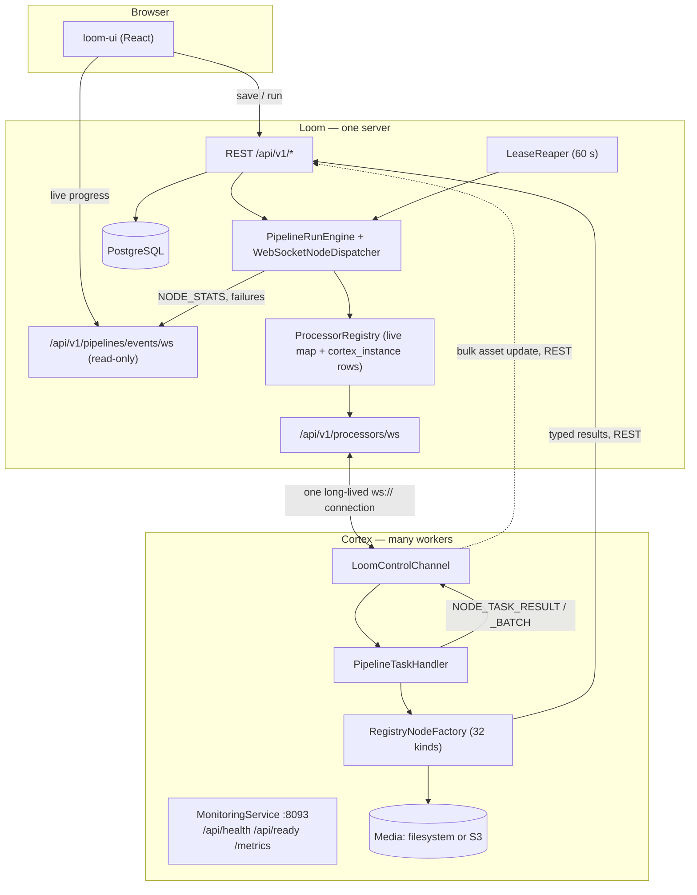

# MetaLoom Architecture — How Loom and Cortex Work Together

> **Scope:** the Loom ↔ Cortex boundary — registration, wire protocol, dispatch,
> results, monitoring, deployment. Written as built, verified against the code.
>
> **Not here (do not duplicate):** pipeline graph model and validation →
> [../features/pipeline/PIPELINE.md](../features/pipeline/PIPELINE.md) · node kinds,
> ports and descriptors → [../features/pipeline-nodes/NODES.md](../features/nodes/NODES.md) ·
> port/content types → [../features/nodes/NODE_DATA_TYPES.md](../features/nodes/NODE_DATA_TYPES.md) ·
> Cortex CLI/config → [CONFIGURATION.md](CONFIGURATION.md) · Cortex internals →
> [CORTEX.md](CORTEX.md) · WebSocket frames → [../loom/WEBSOCKET.md](../loom/WEBSOCKET.md) ·
> metrics catalogue → [../features/ops/METRICS.md](../features/ops/METRICS.md) ·
> Helm → [../features/helm/HELM_CORTEX.md](../features/helm/HELM_CORTEX.md),
> [../features/helm/HELM_LOOM.md](../features/helm/HELM_LOOM.md) ·
> binary/asset locations → [../features/rest/REST_BINARY_HANDLING.md](../features/rest/REST_BINARY_HANDLING.md).
>
> **Open work — one file:** [METALOOM_ARCHITECTURE_TASK.md](../tasks/METALOOM_ARCHITECTURE_TASK.md).
> Tasks 1-12 are correctness, security and repo-truth; **Tasks 13-18** are the deferred
> scheduling/batching refinements, and **Appendix A** is the Variant C decision record (Q1/Q4/Q5).
> Both were merged in from `METALOOM_ARCHITECTURE_V2_TASKS.md` on 2026-08-16; that file and its
> predecessor `concept/METALOOM_ARCHITECTURE_V2_PLAN_C.md` are gone. The build record they used to
> carry is §11 of this file.

---

## 1. The two programs

| | **Loom** | **Cortex** |
|---|---|---|
| Role | orchestrator + system of record | worker |
| Instances | one server | many |
| Holds | PostgreSQL, users, web UI, API, **the pipeline graph** | no database, no graph |
| Decides | what runs, where, in what order, what to retry | nothing — executes one instruction at a time |
| Speaks | REST, WebSocket, gRPC, GraphQL | WebSocket + REST **to Loom**, filesystem/S3 |

Two invariants that explain most of the design:

- **Cortex always dials out.** Loom never opens a connection to a worker, so workers
  may sit behind NAT with no inbound ports. Work is pushed down the connection the
  worker already opened.
- **Loom reads the pipeline definition; Cortex never does.** A worker receives a
  concrete task (`NODE_TASK` / `SEGMENT_TASK` / `SOURCE_TASK`), not a recipe. The
  Cortex-side `LoomPipelineLoader` is deleted.

## 2. Topology

**Progress and results travel different roads.** Orchestration outcomes go over the
WebSocket; result *payloads* go over REST. Either can break without the other.

---

## 3. Registration and liveness

A worker registers itself at startup — Loom holds no configured worker list.
Connect → `REGISTER` → `REGISTERED`, then eligible for work.

| `ProcessorRegistration` field | Value today |
|---|---|
| `nodeId` | **configured and mandatory** — `CORTEX_NODE_ID`. Missing ⇒ `CortexMain` exits 2; a blank id throws at `LoomControlChannel.start()`; a duplicate of a live worker is closed by Loom with code **4409** |
| `name` | hardcoded `"cortex"` |
| `priority` | hardcoded `100` |
| `host` | hostname + **monitoring** port |
| `capabilities` | hardcoded `CPU` + `IO`. 🔴 **`GPU` is never advertised**, so GPU routing matches nothing |
| `nodeWhitelist` | defaults to `NodeFactory.registeredTypes()` — a worker cannot advertise what it cannot run. `CORTEX_NODE_WHITELIST` narrows it |
| `nodeBlacklist` | `CORTEX_NODE_BLACKLIST`; **wins over the whitelist** |

**Registration is persisted.** `V2.33__add_cortex_instance.sql` creates
`cortex_instance` (unique `node_id`, `state`, `priority`, `last_seen`) and
`cortex_instance_node_kind` (`WHITELIST` / `BLACKLIST`). First registration seeds the
restriction from what the worker announced; afterwards the **persisted row is the
override**, so an admin edit via `PUT /api/v1/processors/:uuid/restrictions`
(`MANAGE_CORTEX_INSTANCE`) survives reconnects. A persistence failure never takes a
worker offline. `GET /api/v1/processors` merges the live map with persisted offline rows.

| Signal | Direction | Interval |
|---|---|---|
| `HEARTBEAT` → `HEARTBEAT_ACK` | Cortex ↔ Loom | 10 s |
| `STATUS_UPDATE` | Cortex → Loom | 20 s |
| health log line | Cortex-local | 30 s |

Reconnect backoff is **linear**: `2 s × attempt`, capped at 30 s
(`RECONNECT_BASE_DELAY_MS`, `RECONNECT_MAX_DELAY_MS`), re-registering each time.
[CORTEX.md](CORTEX.md) calling it exponential is wrong.

**The heartbeat is enforced.** `ProcessorPresenceReaper` sweeps every heartbeat
interval and evicts any worker whose in-memory `lastSeen` is older than
`interval × missedBeats` (10 s × 6 = **60 s of silence**, tunable via
`LOOM_PROCESSOR_HEARTBEAT_INTERVAL_MS` / `LOOM_PROCESSOR_MISSED_HEARTBEATS`, switchable
off with `LOOM_PROCESSOR_EXPIRY_ENABLED=false`). The eviction runs the same
`OFFLINE` → unregister path a socket close does, and then hands the worker's in-flight
tasks straight back through `LeaseReaper.reclaimWorker` instead of waiting out each
lease. Without it a half-open socket left a dead worker `ONLINE`, selectable, and
receiving back the very tasks the lease reaper had just rescued from it. See
[../loom/WEBSOCKET.md](../loom/WEBSOCKET.md) §3.6.1.

> 🔴 `cortex_instance.last_seen` is still written only at REGISTER — the durable row's
> timestamp is a registration time, not a liveness signal. Only the in-memory `lastSeen`
> is maintained, so presence does not survive a Loom restart (nor does it need to: every
> worker re-registers).

---

## 4. The wire

### 4.1 Control channel — `ws://<host>:<port>/api/v1/processors/ws`

Envelope: `{"type": "...", "body": {...}}` (`ProcessorMessageType`, 19 values).

| Cortex → Loom | Loom → Cortex |
|---|---|
| `REGISTER`, `HEARTBEAT`, `STATUS_UPDATE` | `REGISTERED`, `HEARTBEAT_ACK` |
| `STATE_CHANGE` (e.g. `TERMINATING` on drain) | `SOURCE_TASK` — enumerate this source |
| `SOURCE_ITEMS` / `SOURCE_COMPLETE` | `SOURCE_ITEMS_ACK` — send the next batch |
| `NODE_TASK_RESULT`, `NODE_TASK_RESULT_BATCH` | `NODE_TASK` — run one node on one item |
| `SEGMENT_TASK_RESULT` | `SEGMENT_TASK` — run one affinity segment |
| `TASK_RETURNED` — hand work back unfinished | `ERROR` |
| ~~`PIPELINE_EVENT`, `PIPELINE_RUN_COMPLETED`~~ | |

`PIPELINE_EVENT` / `PIPELINE_RUN_COMPLETED` still exist in the enum but a worker holds
no graph, so nothing emits them; Loom accepts and drops `PIPELINE_EVENT` with a
once-per-node warning. Progress is now aggregated Loom-side by `RunStatsAggregator`.

Source enumeration is **acked and back-pressured**: the worker streams `SOURCE_ITEMS`
batches and waits for `SOURCE_ITEMS_ACK` before sending the next.

### 4.2 UI events — `/api/v1/pipelines/events/ws`

Read-only fan-out for browsers. Clients send nothing; filters `?pipeline=<name>` and
`?run=<uuid>` are ANDed. Registered with `.order(-1000)` so the upgrade beats the
wildcard auth routes.

### 4.3 REST from Cortex to Loom

Cortex no longer fetches pipeline definitions. It calls Loom REST for **result
payloads and asset lookups** only, via `loom-client` (`LoomHttpClient`):

| Call | Used by |
|---|---|
| `bulkUpdateAssets` | `LoomBulkSyncWriterImpl` — batched `syncToLoom` outputs, keyed by SHA-512 |
| `POST /api/v1/assets/:uuid/node-results` | typed node write-back ledger (`AssetNodeResult`, `V2.45`) |
| `createAssetJsonComp` | ocr, tika, quality, sentiment, captioning, vlm, scene-layout, s3-sink, facedescription |
| `bulkCreateAssetDetections`, `createAssetSegmentComps` | facedetect, scene-detection |
| `loadAsset` (uuid or SHA-512), `createAsset`, `updateAsset` | s3-sink, dedup, consistency |
| `listSimilarAssets`, `createDedupGroup`, `listAssetDedupGroups` | dedup nodes |

### 4.4 Authentication

| Aspect | Reality |
|---|---|
| Handshake | JWT in `?token=` (browsers cannot set handshake headers) |
| Default | 🔴 **lenient** — a token-less connection is accepted with a warning. `LOOM_WS_STRICT_AUTH=true` (or `-Dloom.ws.strictAuth`) rejects with close code 4401 |
| Per message | none — the token is never tied to the announced `nodeId` |
| Cortex side | token from `LoomClientOptions` or `LOOM_TOKEN` env; **no CLI flag exists** |
| Transport | 🔴 `ws://` unconditionally — no TLS path in the control channel |

---

## 5. Status, load and metrics

`STATUS_UPDATE` carries `SystemStatusInfo`, produced by `SystemLoadProbe`:

| Field | Reality |
|---|---|
| `cpuLoad` | `OperatingSystemMXBean.getCpuLoad() × 100`, falling back to load-avg ÷ cores. `null` when unknown — never a substituted zero |
| `ioLoad` | busiest physical device `%util` from `/proc/diskstats`, re-sampled at most every 2 s. Linux-only, `null` elsewhere. **Stateful** — the first update after connect has none |
| `memoryUsed` / `memoryTotal` | **JVM heap only**, despite the naming |
| `diskUsed` / `diskTotal` | filesystem of the process working directory, not necessarily where media lives |
| `gpuLoad` | 🔴 **never populated** — the field exists only in the shared model |

**Metrics exist.** `MicrometerCortexMetrics` (Micrometer + `PrometheusMeterRegistry`)
is scraped at `GET /metrics` on the monitoring port, alongside JVM and Vert.x binders.
Counters/timers cover Loom messages, reconnects, task receipt/completion, node
operations, bulk sync outcomes and AI calls; the connection and load gauges are bound
in `LoomControlChannel.registerGauges()`. Full catalogue and known gaps:
[../features/ops/METRICS.md](../features/ops/METRICS.md).

> ⚠️ Live UI events are **fire-and-forget**. `PipelineEventBroadcaster` drops the
> **newest** event when `ws.writeQueueFull()` and counts the loss. Its own Javadoc and
> `DEFAULT_QUEUE_CAPACITY = 1024` describe a drop-oldest bounded queue that does not
> exist — `Subscriber` discards the capacity argument.

---

## 6. Dispatch and placement

A run selects media, then walks each item through the graph:

1. One worker gets a `SOURCE_TASK` and streams `SOURCE_ITEMS` batches back, acked.
2. Loom processes early items while the scan is still running.
3. Each ready node becomes a `NODE_TASK` (or a `SEGMENT_TASK` for a whole affinity
   segment) dispatched to a selected worker.
4. Outcomes are recorded, unblock successors, and the run completes when everything
   discovered has settled.

**Worker selection** (`ProcessorRegistry.select`), in order:

1. `isPlaceable` — state is `ONLINE` (a `TERMINATING`/`PAUSED`/`STARTING` worker is skipped)
2. required capability — hardcoded `CPU` at every call site
3. `accepts(nodeKind)` — blacklist wins, empty whitelist means unrestricted
4. **configured `priority`, descending** (primary)
5. **reported load, ascending** (secondary) — `max(cpuLoad, ioLoad)`; a status older
   than 60 s or absent scores `UNKNOWN_LOAD = 50.0`, so silence neither attracts nor repels
6. `nodeId` — deterministic final tiebreak

### What a worker can actually run

**32 kinds** are registered today (33 with S3 configured): 30 processing kinds bound
by each node module with `@Binds @IntoMap @StringKey`, plus `filesystem-source` and
`asset-source` registered directly by `RegistryNodeRegistrar`, plus `s3-source` **only
when `S3Support.isActive()`**. That set is exactly what the worker announces as its
whitelist, so advertisement cannot drift from capability.

**There is no stub node.** `RegistryNodeFactory.produce()` returns `null` for an
unregistered kind (its "falling back to stub" log line is a leftover), and
`NodeTaskRunner` turns the resulting NPE into a `FAILED` result. A `SOURCE_TASK` for a
non-source kind is rejected outright. Unknown kinds no longer report silent success.

The palette is dynamic — `GET /api/v1/pipeline/node-descriptors`, served from
`NodeDescriptorRegistry` (26 `ServiceLoader` providers, 34 kinds). **The descriptor set
is wider than the executable set:** the 8 `filter-*` kinds and
`facedescription` have descriptors but no producer; `asset-source` and `sha512-dedup`
are the reverse. Details in [../features/pipeline-nodes/NODES.md](../features/nodes/NODES.md).

### Rejecting a run that cannot execute

A run whose graph contains a node kind no online worker accepts is **rejected with
503** naming the kinds (`PipelineEndpointService.unsupportedNodeKinds`) — every kind
is checked, not just the source.

⚠️ The *descriptor* check (`PipelineValidationService`, "Unknown node type") runs only
on pipeline **create/update**. At run start `PipelineEndpointService` builds
`PipelineGraphParser` with the no-arg constructor, whose registry is `null`, so the
unknown-kind branch is skipped. A saved pipeline containing an unregistered kind therefore
fails at run start as a 503 capability error, not as a validation error.

**Affinity segments** group connected nodes onto one worker, saving a round trip per
node per item. Everything is in one group by default. Grouping alone does not avoid
re-reading the file — the round trips it saves were never the expensive part, and
segment dispatch measured 1.01× per-node dispatch. What makes decode-once possible is
the **artifact scope** the segment opens: nodes publish an expensive intermediate into
`NodeInputs.artifacts()` and later nodes in the same segment read it instead of
decoding again. Opt-in per node, one scope per item, closed when the segment ends —
see [../features/pipeline/PIPELINE.md](../features/pipeline/PIPELINE.md) §7.4.

---

## 7. Results

| Path | Carries | Mechanism |
|---|---|---|
| **Orchestration** | state, duration, failure cause, outputs | `NODE_TASK_RESULT`, or `NODE_TASK_RESULT_BATCH` (a transport saving; each entry is assimilated as if it arrived alone) |
| **Bulk asset sync** | outputs of nodes with `syncToLoom == true` | `DefaultLoomBulkSyncCollector` buffers, flushes on batch size or explicit `flush()`, and `LoomBulkSyncWriterImpl` groups by SHA-512 into one `bulkUpdateAssets`. Entries without a SHA-512 are skipped; a failed flush re-queues |
| **Typed write-back** | transcripts, detections, OCR text, captions, quality, scenes | the node itself calls `loom-client` during execution (see §4.3) and records an `asset_node_result` ledger row |

Nothing is lost if Loom restarts: outcomes are persisted as they arrive and in-flight
runs resume. Buffered results survive a `SIGTERM` because the shutdown hook flushes
them (§8).

> ⚠️ `syncToLoom` is read from the definition by `RegistryNodeRegistrar` but the UI
> editor never sets it, so the bulk path is effectively opt-in via hand-edited JSON.
> The typed write-back path does not depend on it.

---

## 8. Running and stopping a worker

The worker runs in the **foreground** and blocks on a latch — no CLI, no subcommand, no
fork, no PID file, no `--daemon`. That is what a container wants; supervision is the
orchestrator's job. There is no offline one-shot mode any more: the former
`cortex process run` subcommand went away with the picocli layer.

**Shutdown is graceful.** `CortexImpl.registerShutdownHook()` installs a
`cortex-shutdown` thread, so `SIGTERM` runs the ordinary path:

1. `syncCollector.flush()` — buffered results go out **while the client is still up**
2. `LoomControlChannel.drain(drainTimeoutMs)` — announce `STATE_CHANGE: TERMINATING`
   (Loom stops placing here), `beginDrain()` stops accepting locally, wait out the
   grace period, then `returnOutstanding()` hands the rest back as `TASK_RETURNED`
   for immediate re-placement, then flush the socket (5 s)
3. `stop()` — cancel timers, close socket; `MonitoringService.deinit()`

A hard `kill -9` still falls back to lease expiry.

### Monitoring endpoints (default port 8093)

| Endpoint | Returns |
|---|---|
| `GET /api/health`, `GET /health` | **always 200**, `{"status":"up","loom":{…}}` — pure liveness |
| `GET /api/ready`, `GET /ready` | 200 when `configured && connected && registered`, else **503** — readiness |
| `GET /metrics` | Prometheus scrape |
| `POST /s3-events` | only when S3 events are enabled in `WEBHOOK` mode with a secret |

The `loom` block reports configured/connected/registered, resolved host+port,
reconnect attempts, last connect/message/heartbeat-ack timestamps and last error.

### Environment variables (Cortex)

There are no flags — the environment is the whole runtime surface.

| Variable | Default | Note |
|---|---|---|
| `LOOM_HOST` | `localhost` | presence selects online mode |
| `LOOM_PORT` | `7733` | container + `start-cortex.sh` set **8092** |
| `LOOM_TOKEN` | none | read directly by `LoomControlChannel`, not by `CortexEnvOptions` |
| `CORTEX_NODE_ID` | none | **required**; unique per worker, stable across restarts |
| `CORTEX_MONITORING_PORT` | `8093` | health + ready + metrics |
| `CORTEX_META_PATH` | `~/.cache/metaloom/cortex/meta` | |
| `CORTEX_DRAIN_TIMEOUT_MS` | `30000` | raise with the orchestrator grace period for long nodes |
| `CORTEX_NODE_WHITELIST` | all runnable kinds | comma separated |
| `CORTEX_NODE_BLACKLIST` | none | wins over the whitelist |
| `CORTEX_S3_*` | — | endpoint, region, keys, path-style, cache/index paths, size budgets, reconcile interval, events (mode/webhook/secret/queue) |
| `LOOM_WS_STRICT_AUTH` | `false` (Loom side) | reject token-less WebSockets |
| `LOOM_PROCESSOR_EXPIRY_ENABLED` | `true` (Loom side) | evict a worker that stops heartbeating; `false` while debugging a worker |
| `LOOM_PROCESSOR_HEARTBEAT_INTERVAL_MS` / `LOOM_PROCESSOR_MISSED_HEARTBEATS` | `10000` / `6` (Loom side) | the silence a worker is allowed before eviction (§3) |
| — | `-Xms256m -Xmx512m` | container `JAVA_TOOL_OPTIONS`; low for video work |

> 🔴 **`cortex.yml` is loaded, but not from where the container mounts it.**
> `CortexOptionsLoader` reads `${user.home}/.config/metaloom/cortex.yml` and the
> environment is applied on top; the image's `/config` mount is a different path, so a
> file placed there is still ignored. See [CONFIGURATION.md](CONFIGURATION.md) §1.2.

Kubernetes deployment is covered by the charts under `helm/loom/` and `helm/cortex/`
(StatefulSet, per-ordinal stable `nodeId`, probes on `/api/health` + `/api/ready`) —
see [../features/helm/HELM_CORTEX.md](../features/helm/HELM_CORTEX.md).

---

## 9. Media never crosses the wire — only a locator does

Loom sends a **string** from `asset_location.path`; the worker resolves it itself.

| What Loom stores | What the worker does | What the deployment must provide |
|---|---|---|
| filesystem path | opens it on **its own** filesystem | 🔴 the worker must see that identical path — shared volume or same host |
| `s3://bucket/key` | `S3MediaMaterializer` downloads into its cache | `CORTEX_S3_*` on the worker; **no shared filesystem** |

An S3-backed `asset_pool` removes the co-location constraint; a filesystem-backed one
does not. This is the most common cause of "the run starts but every item fails to
open". Worker S3 credentials (`CORTEX_S3_*`) are independent of Loom's (`LOOM_S3_*`).
See [../features/rest/REST_BINARY_HANDLING.md](../features/rest/REST_BINARY_HANDLING.md) §7.1.

---

## 10. Failure handling and guarantees

| Situation | Behaviour |
|---|---|
| Node fails on one item | recorded FAILED; dependants skipped **for that item only** |
| Node marked non-blocking | successors still run and can see the failure |
| Retryable node kind | retried with growing delay, then given up on with history kept |
| Worker dies mid-task | lease expires, `LeaseReaper` (60 s) re-places the work |
| Worker drains | `TASK_RETURNED` re-places immediately, no lease wait |
| Node kind failing nearly everywhere | set aside and retried periodically instead of burning the fleet |
| Run saturated | the source scan is slowed; per-run and per-node-kind ceilings apply |
| Loom restarts mid-run | run resumes; completed work is not repeated |
| Loom restarts mid-**scan** | ⚠️ unreachable files were never recorded — the run completes over what it saw and is **marked truncated** |
| Slow (not dead) worker | a task may be reassigned and run twice; results are recorded once, so this costs time, not correctness |

A failure affects one item, not the run. Runs can be cancelled, paused and resumed
(`POST /api/v1/pipelines/:uuid/runs/:runUuid/{cancel,pause,resume}`).

---

## 11. Progress Assessment

- [x] Registration persisted (`cortex_instance`) with admin-editable node-kind restrictions
- [x] Stable, mandatory `nodeId`; duplicate registrations rejected (4409)
- [x] Loom is the sole reader of the pipeline definition; `LoomPipelineLoader` deleted
- [x] Unschedulable runs rejected with 503 naming the missing node kinds
- [x] Placement uses priority **then** live load, with staleness handling
- [x] Graceful drain + JVM shutdown hook; buffered results flushed on `SIGTERM`
- [x] 32 executable node kinds derived from the Dagger node collection; the announced whitelist is derived from them
- [x] No stub node — an unregistered kind fails the task instead of reporting success
- [x] Typed per-node write-back to assets (json comps, detections, segments, `node-results` ledger)
- [x] Prometheus `/metrics` on the monitoring port; health + readiness probes
- [x] Run inspection API: `GET .../runs`, `.../runs/:runUuid`, `.../runs/:runUuid/items`, `/runs/stats`
- [x] Helm charts for Loom and Cortex
- [x] Heartbeat/`lastSeen` expiry sweep (`ProcessorPresenceReaper`) — a silent worker is evicted after 6 missed beats and its leases reclaimed at once
- [ ] 🔴 **Control channel is unauthenticated by default** (`LOOM_WS_STRICT_AUTH=false`) and has **no TLS**
- [ ] 🔴 `gpuLoad` never populated and `GPU` never advertised — GPU routing matches nothing
- [ ] `PipelineEventBroadcaster` has no bounded queue despite its Javadoc; drops newest
- [ ] `syncToLoom` not settable from the UI editor
- [ ] 9 palette kinds (8 `filter-*`, `facedescription`) have descriptors but no producer — savable, then 503 at run start. `loom-fetch` is no longer one of them: Loom executes it itself as the source of an ad-hoc node run ([AGENTIC_NODE_EXECUTION.md](../chat/AGENTIC_NODE_EXECUTION.md))
- [ ] `PipelineGraphParser` is built without the descriptor registry on the run path, so the unknown-kind check is skipped there
- [x] `cortex/nodes/loom/` was a dead directory (stale `target/`, no `src/`, not a Maven module) — deleted
- [ ] Round-trip cost of per-node dispatch, and the saving from affinity segments, **unmeasured**
- [ ] No run at 100 000-item scale executed; multi-worker placement proven in tests only

---

## 12. Key Classes Reference

| Class | Package / module | Purpose |
|---|---|---|
| `LoomControlChannel` | `io.metaloom.cortex.impl.loom` (cortex/core) | WebSocket to Loom: register, heartbeat, status, reconnect, drain, gauges |
| `PipelineTaskHandler` | `io.metaloom.cortex.impl.loom` (cortex/core) | Executes `NODE_TASK` / `SEGMENT_TASK` / `SOURCE_TASK`; in-flight set, drain, hand-back |
| `SystemLoadProbe` | `io.metaloom.cortex.impl.loom` (cortex/core) | `cpuLoad` / `ioLoad`, `null` for unknown |
| `LoomBulkSyncWriterImpl` | `io.metaloom.cortex.impl.loom` (cortex/core) | Groups sync entries by SHA-512 → `bulkUpdateAssets` |
| `DefaultLoomBulkSyncCollector` | `io.metaloom.cortex.pipeline.common.sync` | Buffers `syncToLoom` results; `flush()` called on shutdown |
| `CortexImpl` | `io.metaloom.cortex.impl` (cortex/core) | Lifecycle, shutdown hook, sync flush |
| `CortexBootstrapInitializer` | `io.metaloom.cortex.impl.boot` | Boot/deinit order: node registrar → monitoring → control channel |
| `MonitoringService`, `HealthEndpoint`, `MetricsEndpoint` | `io.metaloom.cortex.impl.monitoring` | The only HTTP server in Cortex (8093) |
| `MicrometerCortexMetrics` | `io.metaloom.cortex.impl.monitoring` | Micrometer/Prometheus impl of `CortexMetrics` (cortex/common) |
| `RegistryNodeRegistrar` | `io.metaloom.cortex.cli.dagger` | Populates `RegistryNodeFactory` from the `@IntoMap @StringKey` node collection + source producers |
| `RegistryNodeFactory` | `io.metaloom.cortex.pipeline.loader` (cortex/core) | Kind → producer lookup; `registeredTypes()` backs the announced whitelist |
| `NodeTaskRunner` | `io.metaloom.cortex.runtime` (cortex/node-runtime) | Runs one node, turns any throw into a `FAILED` `NodeTaskResult` |
| `NodeDescriptorRegistry` | `io.metaloom.loom.nodes.spec` (loom-shared/node-model) | `ServiceLoader` palette catalogue behind `/api/v1/pipeline/node-descriptors` |
| `CortexMain` | `io.metaloom.cortex.cli` (cortex/cli) | Entry point; component build, mandatory `CORTEX_NODE_ID`, blocking run |
| `CortexEnvOptions`, `CortexOptionsLoader` | `io.metaloom.cortex.common.option` (cortex/common) | `cortex.yml` + environment → `CortexOptions` |
| `S3MediaMaterializer` | `io.metaloom.cortex.s3` (cortex/s3-common) | Downloads `s3://` locators into the local cache |
| `ProcessorEndpoint` | `io.metaloom.loom.rest.endpoint.impl` | Loom side of `/api/v1/processors/ws` + processor REST |
| `ProcessorRegistry` | `io.metaloom.loom.rest.service.impl` | Live worker map, `cortex_instance` reconciliation, `select()` placement |
| `WebSocketNodeDispatcher` | `io.metaloom.loom.rest.service.impl` | Turns a ready node/segment into a dispatched task |
| `PipelineEndpointService` | `io.metaloom.loom.rest.service.impl` | Run start/cancel/pause/resume, 503 precheck, stats timer |
| `PipelineRunEngine` | `io.metaloom.loom.pipeline.engine` (loom/pipeline) | Graph walk, readiness, retries, flow control |
| `LeaseReaper` | `io.metaloom.loom.rest.service.impl` | Reclaims expired task leases every 60 s; `reclaimWorker` empties a departed worker at once |
| `ProcessorPresenceReaper` | `io.metaloom.loom.rest.service.impl` | Evicts a worker that stopped heartbeating and reclaims its work (§3) |
| `PipelineEventBroadcaster` | `io.metaloom.loom.rest.service.impl` | Fan-out to UI subscribers, drop-newest |
| `WebSocketAuthenticator` | `io.metaloom.loom.rest.service.impl` | `?token=` handshake auth, `LOOM_WS_STRICT_AUTH` |
| `ProcessorMessageType` | `io.metaloom.loom.rest.model.processor.message` (loom-shared/rest-model) | The 19-value protocol enum |
| `NodeTask`, `SegmentTask`, `NodeTaskResult` | `io.metaloom.loom.pipeline.model` (loom-shared/pipeline-model) | Dispatch payloads |

---

## 13. Where do I find …?

| Need | Path |
|---|---|
| Control channel + task handler | `cortex/core/src/main/java/io/metaloom/cortex/impl/loom/` |
| Cortex lifecycle / shutdown hook | `cortex/core/src/main/java/io/metaloom/cortex/impl/CortexImpl.java` |
| Health / ready / metrics | `cortex/core/src/main/java/io/metaloom/cortex/impl/monitoring/` |
| Which node kinds are executable | each node's `*NodeModule` under `cortex/nodes/*/core/`, collected by `cortex/cli/.../dagger/NodeCollectionModule.java` |
| Node kind registration into the factory | `cortex/cli/.../dagger/RegistryNodeRegistrar.java` |
| Cortex env vars and option loading | `cortex/common/.../option/CortexEnvOptions.java`, `.../option/CortexOptionsLoader.java` |
| Loom side of the socket | `loom/services/rest/.../endpoint/impl/ProcessorEndpoint.java` |
| Worker registry + placement | `loom/services/rest/.../service/impl/ProcessorRegistry.java` |
| Run dispatch, 503 precheck, stats | `loom/services/rest/.../service/impl/PipelineEndpointService.java` |
| Graph engine | `loom/pipeline/src/main/java/io/metaloom/loom/pipeline/{engine,graph}/` |
| Protocol enum + DTOs | `loom-shared/rest-model/.../processor/`, `loom-shared/pipeline-model/` |
| Worker persistence migration | `loom/db/flyway/.../V2.33__add_cortex_instance.sql` |
| Node result ledger migration | `loom/db/flyway/.../V2.45__add_asset_node_result.sql` |
| Container image | `cortex/container/Containerfile`; scripts `start-cortex.sh`, `start-server.sh` |
| Helm charts | `helm/cortex/`, `helm/loom/` |

---

## 14. Conventions and Gotchas

| Gotcha | Detail |
|---|---|
| 🔴 `ctx.failure(msg).next()` | Returns **SUCCESS** — `NodeContextImpl.next()` ignores `failureCause`. Only `abort()` yields `FAILED`. Use `ctx.failure(msg).abort()` |
| 🔴 `cortex.yml` on the CLI path | Never read — the CLI always supplies a `CortexOptions`, so `CortexOptionsLoader` is skipped (§8) |
| 🔴 No worker liveness sweep | Heartbeats are acked but never audited; only a socket close evicts (§3) |
| Stale Javadoc | `PipelineEventBroadcaster` (claims a 1024-entry drop-oldest queue), `WebSocketNodeDispatcher` (claims load is ignored and kinds cannot be routed) and `RegistryNodeFactory` ("falling back to stub") all contradict their own code |
| `nodeId` is load-bearing | Loom keys registration, leases, restrictions and attribution on it. Never generate it per start; the Helm chart derives it from the StatefulSet ordinal |
| Announce ≠ implement | The whitelist defaults to `NodeFactory.registeredTypes()`. `s3-source` is only registered when S3 is actually configured, so an unconfigured worker never advertises it |
| Descriptor ≠ registration | A palette descriptor makes a kind *visible*; running it needs `@Binds @IntoMap @StringKey("<kind>")` in the node's own module — see [../features/pipeline-nodes/NODES.md](../features/nodes/NODES.md) |
| Node options are flattened | When a task is turned back into a node definition, options land at the top level, because that is where node producers read them |
| `loom/pipeline` must not depend on Cortex | Enforced by `maven-enforcer` — it is what keeps the orchestrator independent of its workers |
| Dagger is stale-prone | After changing an injected constructor, run a full `mvn clean install`; incremental builds fail at runtime with `NoSuchMethodError` |
| DB tests use an external pool | Re-seed with `./setup-pool.sh` after any Flyway change, or DAO tests fail with `relation … does not exist` |

---

## 15. Test setup

| Layer | Where | Notes |
|---|---|---|
| Drain / hand-back | `cortex/core/src/test/.../impl/loom/PipelineTaskHandlerDrainTest.java` | `TERMINATING` → refuse → return outstanding |
| Load probe | `cortex/core/src/test/.../impl/loom/SystemLoadProbeTest.java` | `null` semantics, `/proc/diskstats` parsing |
| Metrics endpoint | `cortex/core/src/test/.../impl/monitoring/MetricsEndpointTest.java` | Scrape asserts `cortex_*` and JVM meters. **No HealthEndpoint test exists** |
| Node registration | `cortex/cli/src/test/.../dagger/NodeRegistrarTest.java`, `PipelineConfigurableTest.java` | `registeredTypes()`, idempotence, conditional `s3-source` |
| Loom protocol | `loom/core/src/test/.../endpoint/test/ProcessorEndpointTest.java` | Register/heartbeat/status over a real socket |
| Placement | `loom/services/rest/src/test/.../service/ProcessorPlacementTest.java` | Priority vs load vs staleness |
| Run lifecycle | `loom/core/src/test/.../endpoint/test/PipelineRun*EndpointTest.java` | Items, cancel, pause, stats, completion |
| End to end | `integration-test/.../Pipeline{Distributed,Container,AffinitySegment,Persistence}ExecutionIntegrationTest.java` | Rebuild the shaded `cortex/cli` JAR and container image first |

Run DB-backed tests only after `./setup-pool.sh`.

---
_Git HEAD revision: `8c153347`_
_Last updated: 2026-08-11 (repointed the PLAN_C reference: that file is a task list now, this file's
§11 is the build record). Earlier: 2026-08-06 (reference sweep — no content changes)_