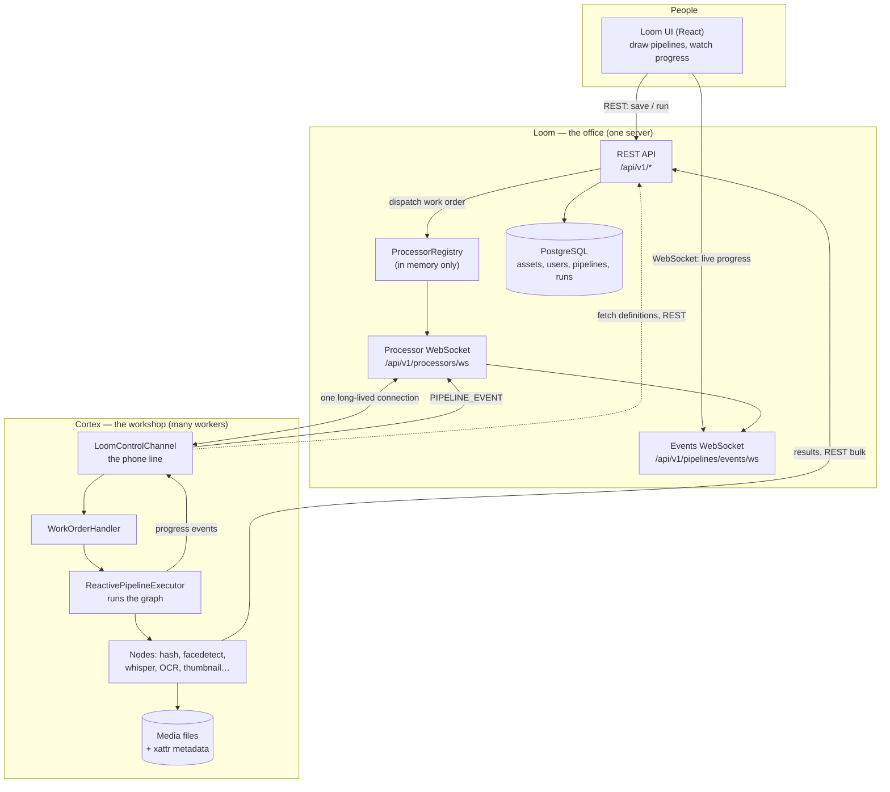
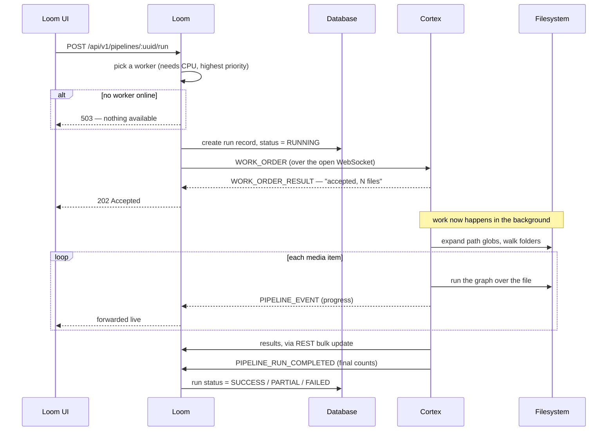

# MetaLoom Architecture — How Loom and Cortex Work Together

> **Audience:** anyone who needs to understand the shape of MetaLoom without
> reading Java first — product owners, new contributors, operators, and AI
> agents orienting themselves before a task.
>
> This document favours plain language over precision-by-jargon, but it does
> **not** soften the facts. Where something is documented but not actually
> built, it says so. Every claim was checked against the code at
> `92bc115` on 2026-07-18.
>
> **Deeper references:** [CORTEX.md](CORTEX.md) ·
> [../loom/LOOM.md](../loom/LOOM.md) ·
> [../loom/WEBSOCKET.md](../loom/WEBSOCKET.md) ·
> [../features/pipeline/PIPELINE.md](../features/pipeline/PIPELINE.md) ·
> [../features/pipeline-nodes/NODES.md](../features/pipeline-nodes/NODES.md)
>
> **Work items derived from this document:**
> [METALOOM_ARCHITECTURE_TASK.md](METALOOM_ARCHITECTURE_TASK.md)

---

> ⚠️ **Staleness note (2026-07-19).** Sections 1–5, 7, 8, 12, 13 describe the
> system accurately. **Sections 6, 9, 10 and 11 were written against the previous
> architecture**, in which a Cortex worker received a run and executed the whole
> pipeline itself. Loom now owns the graph and dispatches individual node tasks.
> **[§14](#14-how-a-pipeline-runs) supersedes them** wherever
> they disagree; rewriting them is an open task.

## 1. The system in one page

MetaLoom is a **Digital Asset Management (DAM)** platform. You point it at a
pile of media — images, video, audio, documents — and it works out what is in
that media: hashes, faces, transcripts, thumbnails, text, quality metrics.

It is split into two programs that do very different jobs:

| | **Loom** | **Cortex** |
|---|---|---|
| Think of it as | the office | the workshop |
| Runs | one central server | one or more worker machines |
| Holds | the database, the users, the web UI, the API | no database at all |
| Does | remembers, coordinates, shows | the heavy lifting |
| Talks | REST, WebSocket, gRPC, GraphQL | to Loom, and to the filesystem |

The reason for the split is simple: analysing video is expensive and slow, and
you want to be able to add more machines to make it faster without touching the
part that holds your data.

Around those two there is a **web UI** (`loom-ui`), a desktop wrapper
(`loom-app`), and a documentation site (`website`).

### The one-sentence version of the interaction

> A user draws a processing recipe in the Loom UI; Loom stores it and tells a
> Cortex worker to run it; Cortex fetches the recipe, walks a folder, processes
> every file, streams live progress back to Loom, and posts the results back so
> Loom can attach them to assets.

### The honest caveat

That sentence describes the **intended** design, and most of the machinery for
it genuinely exists. But **the end-to-end path is currently broken in three
independent places**, all of which fail *silently* — runs go green while doing
almost nothing:

1. **Loom and Cortex do not agree on how to write down a graph.** Loom saves the
   connections between nodes in an `edges` list. Cortex reads connections from a
   `dependencies` field on each node and never looks at `edges`. So a recipe
   drawn in the UI arrives at Cortex as a pile of *disconnected* nodes, and only
   the first one runs.
2. **Most node types are not actually wired up.** The UI palette offers 29 kinds
   of node. Only 6 (`filesystem-source`, `sha512`, `sha256`, `md5`, `chunk-hash`,
   `thumbnail`) map to real code. The other 23 — including face detection,
   transcription, OCR, and every filter — silently resolve to a stub that
   **reports success without doing anything**.
3. **Almost nothing gets sent back.** The result-sync path forwards only hash
   values; transcripts, faces, OCR text and thumbnails are computed and then
   discarded. And the streaming path that a real run uses never flushes its
   buffer at the end, so a typical run sends nothing at all.

Each of these is independently sufficient to defeat the round trip, and fixing
any one alone changes nothing observable.

Read [§12](#12-what-actually-works-today) before drawing conclusions about what
the system can do today. The rest of this document describes the architecture as
built, marking the gaps as it goes.

---

## 2. The big picture

Two things to notice, because they are the most common source of confusion:

- **Cortex always calls Loom first.** Loom never dials out to Cortex. Cortex
  opens the connection and keeps it open; Loom pushes work down that existing
  pipe. This is deliberate — it means Cortex workers can sit behind NAT or a
  firewall with no inbound ports open.
- **Progress and results travel by different roads.** Live progress goes over
  the WebSocket. Actual result *data* goes over REST. They are unrelated code
  paths, and one can work while the other is broken.

---

## 3. How Cortex registers with Loom

Nobody configures a list of workers on the Loom side. **Registration is
self-service and happens at startup.**

When a Cortex process starts in server mode:

1. It reads a Loom hostname and port from its CLI flags or environment.
2. It opens a WebSocket to `ws://<host>:<port>/api/v1/processors/ws`.
3. It immediately sends a `REGISTER` message introducing itself.
4. Loom replies `REGISTERED`, and from that moment the worker is eligible for
   work.

What the worker says about itself in that `REGISTER` message:

| Field | What it should mean | What it actually is today |
|---|---|---|
| `nodeId` | stable identity of this worker | `"cortex-" + random UUID`, **generated fresh on every process start** |
| `name` | human-readable name | hardcoded `"cortex"` |
| `priority` | dispatch preference, higher wins | hardcoded `100` |
| `host` | where to reach it | hostname + **monitoring** port |
| `capabilities` | what it can do — `CPU`, `IO`, `GPU` | hardcoded `CPU` + `IO`; **`GPU` is never advertised** |

Four consequences follow from that right-hand column, and they matter for
anything you plan to build on top:

- **Worker identity does not survive a restart.** A restarted Cortex is a
  brand-new entry as far as Loom is concerned. There is no way to pin a worker,
  recognise it after a reboot, or address it deliberately.
- **Registration is not persisted anywhere.** `ProcessorRegistry` is a plain
  in-memory map on the Loom side; there is no `processor` table. Restart Loom
  and every worker vanishes from the registry until it reconnects.
- **Every worker looks identical.** Same name, same priority, same
  capabilities. Loom has no basis on which to prefer one over another.
- **GPU work cannot be routed.** The capability exists in the enum and in the
  docs, but no Cortex ever claims it, so asking for a GPU worker matches nothing.

### Staying registered

| Signal | Direction | Every | Purpose |
|---|---|---|---|
| `HEARTBEAT` → `HEARTBEAT_ACK` | Cortex → Loom → Cortex | 10 s | "still alive" |
| `STATUS_UPDATE` | Cortex → Loom | 20 s | CPU / memory / disk |
| health log | local only | 30 s | writes connection state to the Cortex log |

If the connection drops, Cortex reconnects on its own with a backoff of
2 s, 4 s, 6 s … capped at 30 s, and re-registers each time.

> ⚠️ **The heartbeat is decorative.** Cortex sends it faithfully, and Loom
> replies — but **Loom never checks whether one stopped arriving.** There is no
> timeout sweep. A worker whose network half-opens stays `ONLINE` in the
> registry forever and keeps being handed work that vanishes. The only thing
> that removes a worker is a cleanly closed socket.
>
> Note this also contradicts [CORTEX.md](CORTEX.md), which describes the
> reconnect backoff as *exponential*; the code is linear.

---

## 4. How the two talk: REST vs WebSocket

This is the question that most often gets answered wrongly, so here it is
explicitly. **The split is not arbitrary — it follows who starts the
conversation.**

| Road | Used for | Why |
|---|---|---|
| **WebSocket** | anything Loom needs to *push* to a worker, and any small, frequent status message coming back | Loom cannot dial out to Cortex, so it needs a pipe that is already open |
| **REST** | anything Cortex chooses to *fetch* or *submit* in bulk | ordinary request/response, no need for a persistent channel |

### Over the WebSocket (`/api/v1/processors/ws`)

| Cortex → Loom | Loom → Cortex |
|---|---|
| `REGISTER` — introduce myself | `REGISTERED` — acknowledged |
| `HEARTBEAT` — still alive | `HEARTBEAT_ACK` |
| `STATUS_UPDATE` — machine load | `WORK_ORDER` — **do this** |
| `WORK_ORDER_RESULT` — accepted / failed | `ERROR` |
| `PIPELINE_EVENT` — live progress | |
| `PIPELINE_RUN_COMPLETED` — final tally | |

Everything is a small JSON envelope: `{"type": "...", "body": {...}}`.

### Over REST

There are exactly **three** places where Cortex calls Loom's REST API:

| Call | Purpose |
|---|---|
| `GET /api/v1/pipelines` | fetch the pipeline definitions |
| `POST` bulk asset update | **push results back** |
| load asset by SHA-512 | look up an existing asset before processing |

Note the important one: **pipeline definitions are pulled over REST, not pushed
over the WebSocket.** The `reload-pipelines` work order does not carry a recipe
— it is just a nudge telling Cortex to go and re-fetch over REST.

### A third road, for the UI only

`/api/v1/pipelines/events/ws` is a **read-only** WebSocket for browsers. Loom
receives `PIPELINE_EVENT` messages from workers and fans them out to any UI
client watching. Clients never send anything on it, and may filter with
`?pipeline=<name>`.

> ⚠️ **Authentication is lopsided.** The WebSocket authenticates with a JWT in
> the `?token=` query string (query string, not a header, because browsers
> cannot set headers on a WebSocket handshake) — but it is **lenient by
> default**: a connection with no token is accepted with a warning unless
> `LOOM_WS_STRICT_AUTH=true`. Meanwhile the **REST client inside Cortex is never
> given a token at all** and talks plain HTTP. There is also no TLS path in the
> control channel — it constructs `ws://` unconditionally. Do not put this on an
> untrusted network as it stands.

---

## 5. How Cortex reports its status

Three different things get called "status", and they are worth separating.

**1. Is the worker alive and connected?** — the heartbeat, plus Cortex's own
HTTP health endpoint (see [§7](#7-monitoring-and-health)).

**2. How loaded is the machine?** — the `STATUS_UPDATE` message, every 20
seconds. It carries CPU load, memory, and disk. What is actually in it:

| Field | Reality |
|---|---|
| `cpuLoad` | derived from the system load average and multiplied by 100 — **this is wrong.** Load average counts runnable processes; it is not a percentage. On any machine, a load of 1.0 reports as "100%" regardless of core count |
| `memoryUsed` / `memoryTotal` | **JVM heap only**, not system memory, despite the field naming |
| `diskUsed` / `diskTotal` | the filesystem of the process working directory — not necessarily where the media lives |
| `gpuLoad`, `ioLoad` | **always null** — never populated |

So the load figures exist, but nothing consumes them, and they would be
misleading if it did. **Loom's worker selection ignores them entirely.**

**3. How is the actual work going?** — `PIPELINE_EVENT` messages, streamed as
they happen. These are the ones the UI draws:

`PIPELINE_STARTED` · `NODE_STARTED` · `NODE_COMPLETED` · `NODE_FAILED` ·
`NODE_SKIPPED` · `NODE_BUFFERED` · `NODE_STATS` (every 500 ms) ·
`PIPELINE_COMPLETED`

Each carries the pipeline name, node id, media path, timestamp, duration, and
counters. They are deliberately kept to simple scalars so they are cheap to
forward.

> ⚠️ Live events are **fire-and-forget**. If a UI client is too slow to keep up,
> Loom **drops the newest event** and counts the loss. Nothing is replayed or
> persisted, so the live view is a courtesy, not a record. (Both the spec and
> the class's own Javadoc claim a 1024-entry queue that drops the *oldest* — the
> queue does not exist; the capacity constant is passed in and discarded.)

---

## 6. How Loom tells Cortex what to run

A user clicks "Run" in the UI. Here is the whole journey.

### Choosing the worker

Loom filters the registry to workers that are `ONLINE` and have the required
capability, sorts by priority, and takes the first. If none match, the request
fails with **503** and no run record is created.

> ⚠️ The required capability is **hardcoded to `CPU`** at the call site. And
> since every worker registers with identical priority, "highest priority wins"
> in practice means *whichever happens to sort first*. There is **no
> load-balancing, no round-robin, and no queueing** — one worker is chosen and
> the load figures it has been dutifully reporting are never consulted.

### What the work order says

| Parameter | Meaning | Honoured? |
|---|---|---|
| `command` | which of four actions to take | ✅ |
| `pipelineName` | which recipe to run | ✅ — matched **by name string** |
| `pipelineUuid`, `pipelineVersion` | which recipe, precisely | ❌ sent, then ignored |
| `pipelineRunUuid` | correlation id for tracking | ✅ |
| `pathGlobs` | **which files to process** | ✅ — the only working selector |
| `mediaUuids` | process these specific assets | ❌ logs a warning, does nothing |
| `dryRun` | run without side effects | ❌ sent and stored, never read by the worker |

**On "configuring the start folder":** there is no start-folder concept in the
code. Media selection is done entirely by `pathGlobs` — shell-style patterns
such as `/media/incoming/**/*.mp4`. Cortex splits each pattern at the first
wildcard, treats the fixed prefix as the directory to walk, and matches the rest
against every file underneath, to unlimited depth. A pattern with no wildcard is
treated as a literal file path.

> ⚠️ These paths are resolved **on the worker, relative to its own working
> directory**, and a path that does not exist yields an empty list *silently*.
> Loom has no idea what any worker can see. Selecting a folder in the UI that
> the worker cannot reach produces a green, instant, empty run.

### The four commands a worker understands

| Command | What it does |
|---|---|
| `run-pipeline` | resolve the recipe by name, expand the globs, start processing |
| `reload-pipelines` | re-fetch pipeline definitions from Loom over REST |
| `flush-sync` | push any buffered results to Loom now |
| `list-pipelines` | report which recipes this worker has loaded |

### Two meanings of "done"

This trips people up. `WORK_ORDER_RESULT` comes back within milliseconds and
means **"accepted, I found N files"** — not "finished". The real completion
signal is `PIPELINE_RUN_COMPLETED`, which may arrive hours later.

Loom guards against a worker that never answers with a **60-second watchdog** on
the *acknowledgement*. If the ack says zero files were found, the run is closed
as `SUCCESS` immediately, since no completion message will ever arrive. The
first terminal verdict wins, so a late watchdog cannot overwrite a real result.

---

## 7. Monitoring and health

**Yes, Cortex has a monitoring endpoint** — a small HTTP server, separate from
the Loom connection, on port **8093** by default.

| Endpoint | Returns |
|---|---|
| `GET /api/health` | always `200` with `{"status":"up", "loom":{…}}` |
| `GET /api/ready` | `200` if connected *and* registered with Loom, else **`503`** |
| `GET /health`, `GET /ready` | legacy aliases |

The `loom` block is genuinely useful for debugging: whether an endpoint is
configured, whether the socket is connected, whether registration succeeded,
the resolved host and port, the reconnect attempt count, timestamps of the last
connection / message / heartbeat ack, and the last error.

`/api/health` is a **liveness** check and `/api/ready` is a **readiness** check
in the Kubernetes sense — which maps cleanly onto a `livenessProbe` and
`readinessProbe`.

> ⚠️ **There are no metrics.** No Prometheus endpoint, no `/metrics`, no
> Micrometer. The per-node throughput numbers *are* computed every 500 ms — but
> they are emitted as WebSocket events to Loom and formatted into a display
> string, so they cannot be scraped, and they are never stored anywhere. If
> Loom is down, that telemetry is simply lost. Also note `pending` in those
> stats is **hardcoded to 0**, because queue depth is not observable.

---

## 8. Is Cortex a daemon?

**No — and this is a deliberate design choice, not an oversight.**

`cortex server start` runs in the **foreground** and blocks forever on a latch.
There is no fork, no `setsid`, no PID file, no `--daemon` flag, and no systemd
unit anywhere in the repo. The process runs until it is killed.

That is exactly what you want for a container: the container image runs it as
PID 1 and exposes 8093. Process supervision is the orchestrator's job —
Kubernetes, Docker's restart policy, or systemd if you write your own unit. The
CLI also supports a one-shot batch mode (`cortex process run -a hash /path`)
that processes a folder and exits, which suits a Cron job or a Kubernetes `Job`.

> ⚠️ **Shutdown is abrupt, and this can lose data.** There is no shutdown hook
> anywhere in the codebase. On `SIGTERM` the JVM dies with in-flight work simply
> abandoned, and — importantly — **the buffered result queue is not flushed**.
> Up to 100 results that were computed but not yet sent to Loom are silently
> lost. Redoing that work is the only recovery, and nothing reports that it
> happened.

### Operational defaults worth knowing

| Setting | Env var | Default | Note |
|---|---|---|---|
| Loom host | `LOOM_HOST` | `localhost` | |
| Loom port | `LOOM_PORT` | `7733` | but the shipped container and `start-cortex.sh` both set **8092** |
| Monitoring port | `CORTEX_MONITORING_PORT` | `8093` | |
| Metadata path | `CORTEX_META_PATH` | `~/.cache/metaloom/cortex/meta` | |
| Loom token | `LOOM_TOKEN` | none | **no CLI flag exists** |
| Container heap | — | `-Xmx512m` | low for video work |

> ⚠️ **The YAML config file does not work on the server path.** `CORTEX.md` and
> `CONFIGURATION.md` both describe a precedence chain of CLI → env → 
> `~/.config/metaloom/cortex.yml` → defaults. In reality the loader is only
> consulted when no options object is supplied, and the CLI always supplies one
> — so **`cortex.yml` is never read**, and its merge logic is commented out.
> Anything set only in that file, including `maxConcurrentMedia` and the Loom
> token, is silently ignored. The container's `/config` volume compounds this by
> mounting to a path the loader would not look at anyway.

---

## 9. How results get back to Loom

Results take the **REST** road, not the WebSocket, and they are **batched**.

1. A node finishes successfully and is marked `syncToLoom`.
2. Its output is added to a buffer.
3. When the buffer reaches **100 entries**, or someone calls `flush-sync`, the
   whole batch is posted to Loom's bulk asset update endpoint in one request.
4. Loom attaches the values to the matching assets as metadata.

Entries are grouped by SHA-512, which is how a result finds its asset. **An item
with no SHA-512 is skipped silently** — so a hashing node effectively has to run
upstream for results to be attributable at all.

If the bulk write fails, the batch is **put back in the buffer** and retried on
the next flush. That is a reasonable default, but note it retries forever with
no dead-letter and no cap, so a persistently failing Loom means an
ever-growing in-memory buffer.

> 🔴 **Only hashes actually make the trip.** The writer that builds the REST
> request reads exactly four output keys — `sha512`, `sha256`, `md5`,
> `chunkHash` — and discards everything else. **Transcripts, captions, OCR text,
> face embeddings, fingerprints, and thumbnails never reach Loom through this
> path at all.** The code concedes this in a comment: other outputs "can be
> plumbed here as their corresponding update fields are exercised". So the
> expensive analysis Cortex is built for is, today, computed and then dropped on
> the floor as far as the central database is concerned. It survives only in the
> local xattr storage described below.
>
> 🔴 **The streaming path never flushes at the end.** A flush happens at 100
> entries, at the end of an `executeBatch` call, or on an explicit `flush-sync`
> command — but the streaming `execute()` used by the `run-pipeline` work order
> has **no flush on completion**. A run that finishes with fewer than 100
> pending entries leaves them sitting in memory indefinitely. Since 100 items is
> a large run, the common case is that a pipeline run sends **nothing**.
>
> ⚠️ **A cached result is never synced.** A cache hit returns early, before the
> collection step — so re-running a pipeline over already-processed media syncs
> nothing to Loom, even for the four hash fields that do work.
>
> ⚠️ The buffer drain is **not atomic** despite its comment saying so; entries
> added concurrently between the copy and the clear are lost.

### Results are also stored locally, independently

Separately from any of this, Cortex writes what it learns **next to the file
itself** — in Linux extended attributes (xattr), or a sidecar file. This is what
the README means by "un-opinionated": Cortex does not move, import, or reshape
your media, and it does not need Loom in order to be useful. Run it offline and
the knowledge still accumulates on disk.

> ⚠️ **Only explicitly flagged results are ever sent.** A node syncs only if
> `syncToLoom` is set on it, and only when it `COMPLETED`. Failures and skips
> are never synced. Critically, **the Loom UI's saved format has no
> `syncToLoom` field at all**, so it defaults to `false` — meaning that even
> after the graph-schema bug is fixed, a UI-authored pipeline would still send
> **nothing** back. This is a second, independent break in the same round trip.
>
> ⚠️ There is also no store on Loom for *intermediate* node results. Only
> whitelisted outputs land, and only as flat asset metadata — there is no
> per-node result or stats table.

---

## 10. What "reactive processing" means here

"Reactive" is used in a specific technical sense, and the specs disagree about
it — [METALOOM.md](../METALOOM.md) claims the engine is built on
`CompletableFuture` with "no RxJava". **That is stale and wrong.** The engine is
**RxJava 3**.

In plain terms, reactive processing means the engine treats media as a
**flowing stream** rather than a list to be chewed through:

- **Nothing is loaded up front.** Files are pulled in as capacity frees up, so a
  folder of a million files does not become a million objects in memory.
- **The consumer sets the pace.** This is *backpressure*: the slow part of the
  system throttles the fast part automatically, rather than the fast part
  flooding a queue until something falls over.
- **Independent work overlaps.** While one file waits on disk, another is being
  hashed, and a third is having faces detected. The graph decides what *must* be
  sequential; everything else can proceed in parallel.
- **Failure is a value, not an explosion.** A node that throws produces a
  `FAILED` result that flows onward like any other, so one bad file cannot take
  down the run.

Concretely there are two throttles:

| Level | Mechanism | Default |
|---|---|---|
| How many files in flight at once | RxJava `flatMap` width | **4** |
| How many files inside one node at once | a semaphore per node | **1** |

> ⚠️ **The 4 is effectively hardcoded in a deployed container.** There is no CLI
> flag or env var for `maxConcurrentMedia`, and the YAML file is never read
> (§8), so it is always 4. On a 32-core machine, this is the binding constraint
> — and it is the single most important number to make configurable before any
> scaling work.
>
> ⚠️ **Per-node throttling is not actually reactive.** It is a blocking
> semaphore acquired inside the work itself, so a saturated node **parks
> threads** rather than exerting backpressure upstream. The per-file timeout is
> applied *outside* the permit, so a hung node keeps its permit and starves its
> peers anyway. The genuine backpressure is the `flatMap` width alone.

---

## 11. What happens when a node fails

The guiding principle: **one bad file, or one bad step, must not kill the run.**

| Situation | What happens |
|---|---|
| A node throws an exception | caught, converted to a `FAILED` result, `NODE_FAILED` emitted; the run continues |
| A node exceeds its timeout | treated as a failure (per-node, opt-in, `0` = no limit) |
| A dependency failed and **this node is blocking** | it is **skipped** with `"Dependency <id> failed"` |
| A dependency failed and **this node is not blocking** | it **runs anyway**, with the failed result visible in its inputs |
| A filter rejected the item | nodes on the non-matching branch are skipped |
| Dry-run mode | every node is skipped, no side effects |
| The whole file fails | that file is marked a failure; other files are unaffected |

A run's final verdict is derived from the tally: no failures → `SUCCESS`; all
media failed → `FAILED`; anything in between → `PARTIAL`.

Known sharp edges:

- **There are no retries.** A `retryFailed` parameter is advertised by 10 node
  descriptors in the UI, but **nothing reads it**. A transient failure — a
  network blip, a busy GPU — is permanent for that item.
- **Skips do not cascade the way people expect.** The check is on the *child's*
  own blocking flag, applies only to *direct* parents, and fires only on
  `FAILED`, not on `SKIPPED`. Since a skipped node is `SKIPPED` rather than
  `FAILED`, its own children do not skip — so a grandchild of a rejecting filter
  will happily run unless it is explicitly wired to that filter's branch.
- **A failed node's duration is discarded** (recorded as 0), so you cannot see
  whether it failed fast or hung.
- **Unregistered node types report success.** This is the most dangerous
  behaviour in the system: a node kind with no implementation resolves to a stub
  that logs and returns `COMPLETED`. A pipeline built entirely from unimplemented
  nodes produces a fully green run having done nothing at all.
- **The executor is single-use.** Its internal stats scheduler is shut down
  after the first run, so a **second run on the same instance throws** — and
  Dagger provides it as a singleton. This is a live production hazard.
- **`node.shutdown()` is never called**, so nodes holding native resources
  (OpenCV, whisper.cpp, InspireFace) leak.

---

## 12. What actually works today

Being blunt about the state of things, because the failure modes are all silent.

**Works:**

- ✅ Cortex connects, registers, heartbeats, reconnects, and reports health
- ✅ Live progress events reach the UI, with filtering and drop-on-full handling
- ✅ Pipelines can be authored, validated, versioned, and restored in Loom
- ✅ Run records are created and closed out with real counters — **on the happy
  path**; a run killed by an upstream error or cancellation emits no completion
  event and relies on the watchdog
- ✅ DAG ordering, concurrency, timeouts and filters — **now evaluated on Loom**
  by `PipelineRunEngine`; the in-Cortex engine has been deleted
- ✅ Run state survives a Loom restart; a dead worker's tasks are reclaimed
- ✅ An unexecutable pipeline definition fails at run time with a 400, instead of
  producing a green run that did nothing
- ✅ Local xattr / sidecar storage of results next to the media
- ✅ Offline/CLI batch processing, which bypasses all the Loom coupling

**Broken end-to-end:**

- 🔴 **A UI-authored pipeline does not run as drawn** — `edges` vs
  `dependencies`; it collapses to just the source node
- 🔴 **23 of 29 node kinds are silent no-ops** that report success
- 🔴 **Only hash values are ever synced to Loom.** Transcripts, faces, OCR,
  fingerprints, and thumbnails are computed and then discarded
- 🔴 **The streaming run path never flushes its result buffer**, so a run with
  under 100 results typically sends nothing at all
- 🔴 **A UI-authored pipeline syncs no results**, because `syncToLoom` is absent
  from the UI format and defaults to `false`

**Not built, despite appearing in docs or UI:**

- 🟡 GPU routing · `mediaUuids` selection · `dryRun` on the worker ·
  `retryFailed` · the YAML config file · heartbeat timeouts · TLS on the control
  channel · REST authentication from Cortex

The common thread: **every one of these fails quietly.** Nothing errors, nothing
alerts — you get a green run. That is the single most important property to fix,
and it is why [§14](#14-turning-cortex-into-a-processing-grid) argues against
building distribution on this foundation before the silent-success behaviour is
gone.

---

## 13. Where things live

| Need | Path |
|---|---|
| Cortex ↔ Loom control channel | `cortex/core/…/impl/loom/LoomControlChannel.java` |
| Work-order handling | `cortex/core/…/impl/loom/PipelineWorkOrderHandler.java` |
| Health / readiness | `cortex/core/…/impl/monitoring/` |
| Startup + shutdown | `cortex/core/…/impl/boot/CortexBootstrapInitializer.java` |
| The execution engine | `cortex/pipeline-core/…/executor/ReactivePipelineExecutor.java` |
| Pipeline loading from Loom | `cortex/core/…/pipeline/loader/LoomPipelineLoader.java` |
| Which node kinds are real | `cortex/cli/…/dagger/PipelineNodeFactoryModule.java` |
| Result batching | `cortex/pipeline-common/…/sync/DefaultLoomBulkSyncCollector.java` |
| Loom's side of the socket | `loom/services/rest/…/endpoint/impl/ProcessorEndpoint.java` |
| Worker registry + dispatch | `loom/services/rest/…/service/impl/ProcessorRegistry.java` |
| Run dispatch + watchdog | `loom/services/rest/…/service/impl/PipelineEndpointService.java` |
| Live event fan-out | `loom/services/rest/…/service/impl/PipelineEventBroadcaster.java` |
| Container image | `cortex/container/Containerfile` |

---

## 14. How a pipeline runs

> **This section supersedes §6, §9, §10 and §11 wherever they disagree.** Those
> describe an earlier arrangement in which a Cortex worker was handed a run and
> executed the whole pipeline itself. That is no longer how MetaLoom works.

### Who decides what

**Loom owns the pipeline. Cortex does the work it is asked to do.**

Loom holds the graph, reads the definition, decides which node runs next, and
records what happened. A Cortex worker is given one piece of work at a time — run
*this* node against *this* file — and answers with the outcome. It holds no
pipelines and makes no scheduling decisions.

The important consequence is that **the definition is read in exactly one place**.
Previously both sides parsed it, and disagreed: the editor wrote one shape and the
worker read another, so pipelines that looked correct in the UI quietly did
nothing. A single reader removes that whole class of problem rather than fixing
instances of it.

### What a run does

Starting a run selects media, then processes each item through the graph.

1. A worker walks the filesystem and streams back what it finds, in batches.
2. As items arrive, Loom works out which nodes are ready for each one and sends
   them out.
3. Workers answer; Loom records each outcome and works out what that unblocks.
4. The run finishes when everything discovered has been fully processed.

**A pipeline that cannot run is rejected when you start it**, with a reason —
unknown node types, no source, circular dependencies, edges to nodes that do not
exist. It does not start and quietly finish having done nothing, which is what
used to happen.

### What MetaLoom guarantees

| Guarantee | What it means in practice |
|---|---|
| **A run survives a restart** | Progress is recorded as it happens. If Loom restarts, in-flight runs resume from where they were. Work already done is not repeated |
| **A worker dying does not lose work** | Every dispatched task has a deadline. Work from a worker that never answers is given to another one |
| **A bad file cannot stall a run** | Repeated failures on one item are given up on, with the history kept, rather than retried forever |
| **A broken node type cannot burn the fleet** | If a node type starts failing on nearly everything, it is set aside and retried periodically instead of failing every remaining item |
| **One run cannot consume everything** | Each run has a ceiling on outstanding work, and a scan is slowed down when its run is saturated |
| **One slow node type cannot consume a run** | Each node type can be given its own ceiling, so transcription cannot occupy every slot while hashing waits behind it |
| **Failures are reported individually; progress is summarised** | You are told which file failed and why, promptly. Volume is reported as counts, not as one message per file — including how much is running and how much is still waiting |

### Two limits worth knowing

**A scan interrupted by a restart cannot be resumed.** If Loom restarts while a
worker is still enumerating files, the files it had not reached yet were never
recorded anywhere. The run completes with the media it already knew about, and is
**marked as such** — it does not claim to have processed a folder it only partly
saw.

**Duplicate work is possible, and preferred to stalling.** A worker that is merely
slow can have its task reassigned while it is still working. A node may therefore
run twice on the same file. Results are recorded once, so this costs time rather
than correctness — and the alternative, waiting indefinitely for a worker that may
be dead, is worse.

### Putting work on the right machine

Not every worker can do every job. A worker can declare which node types it
accepts, so a GPU machine can be reserved for models and a machine with the media
mounted can be reserved for scanning. A worker that declares nothing accepts
everything.

⚠️ Work is currently placed by **configured priority**, not by how busy a machine
is, because the load figure workers report is wrong. Placing work on a bad
measurement would be worse than not using it at all. Fixing that is an open task.

### Grouping nodes onto one machine

Nodes can be marked as belonging to the same **affinity group**. Connected nodes in
the same group are sent to one worker together and run there as a unit, rather than
being handed out one at a time.

By default **everything is in one group**, so a pipeline is only split across
machines when someone asks for it.

🔴 **What this saves is network round trips — not repeated file reads.** It is
tempting to assume grouping lets a video be decoded once and analysed many times.
It does not: each node still reads the file itself, because there is no way for one
node to hand a decoded frame to the next. A measurement over 155 MiB of video found
grouping **1.01×** faster than not grouping — within noise. The round-trip saving is
real but has not been measured. Whether genuine decode-once is wanted is an open
product question, and answering "yes" means changing how nodes exchange data.

---

## 15. What is not yet proven

Being explicit, because these are the claims most likely to be assumed:

- **The cost this architecture pays has never been measured.** Sending each node to
  a worker individually costs a network round trip. Nobody has measured what that
  costs, and therefore nobody has measured what grouping saves.
- **No run at realistic scale has been executed.** The mechanisms for handling
  100 000 items exist and are individually tested. A run of that size has not been
  performed.
- **Spreading a run across several machines is proven in tests, not in a
  deployment.** The placement logic is tested; a real multi-worker cluster has not
  been run.

---

## 16. Conventions and gotchas

> Developer-facing notes. Everything above is requirements and behaviour; this is
> the small set of things that will otherwise cost someone an afternoon.

- **Dagger 2 annotation processing is stale-prone.** After changing an injected
  constructor, run a full `mvn clean install` — an incremental build leaves the
  generated factory on the old signature and fails at runtime with
  `NoSuchMethodError`.
- **DB tests draw from an external pool, not a fresh container.** After adding a
  Flyway migration you **must** re-seed it with `PoolSetupRunner` from
  `loom/fixture`, or every DAO test fails with `relation … does not exist`.
- **The `loom/pipeline` module may not depend on Cortex.** Enforced by
  `maven-enforcer`; it is what keeps the orchestrator independent of its workers.
- **Node options are flattened to the top level** when a task is turned back into
  a node definition, because that is where the existing node producers read them.

---

## 17. Progress Assessment

- [x] Plain-language overview of Loom and Cortex
- [x] Registration, REST/WebSocket split, status reporting, monitoring
- [x] Daemonization, result return path, reactive processing, node failure
- [x] **How a pipeline runs, in requirements terms** (§14)
- [x] Durability, recovery, leases, retries and flow control described
- [x] Affinity groups described **with the benchmark that corrects their stated
      purpose**
- [x] Unproven claims stated as unproven (§15)
- [ ] ⚠️ **§6, §9, §10 and §11 not yet rewritten** — they describe the
      pre-Variant-C model where a worker executed a whole run. §14 supersedes them,
      but the contradiction should be resolved properly rather than left to a
      cross-reference
- [ ] Deployment guide (Kubernetes manifests, Helm) — none exist in the repo
- [ ] Security review of the control channel (no TLS, lenient auth, no REST token)
- [ ] **Round-trip cost and saving unmeasured** — the justification for this whole
      architecture. Tracked as task 1
- [ ] No run at 100 000-item scale has been executed

---

_Last updated: 2026-07-19_
