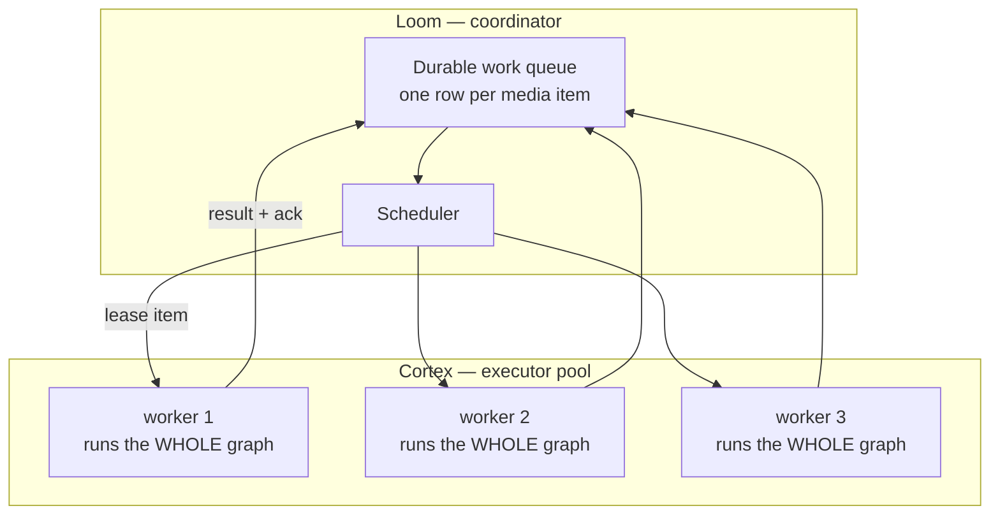
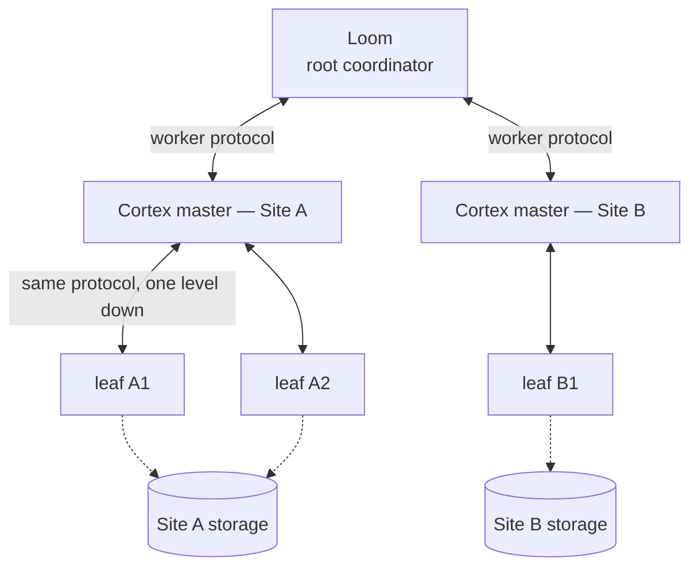
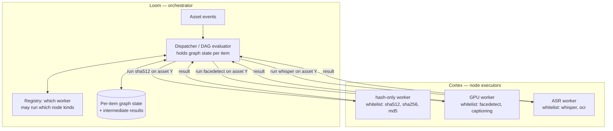
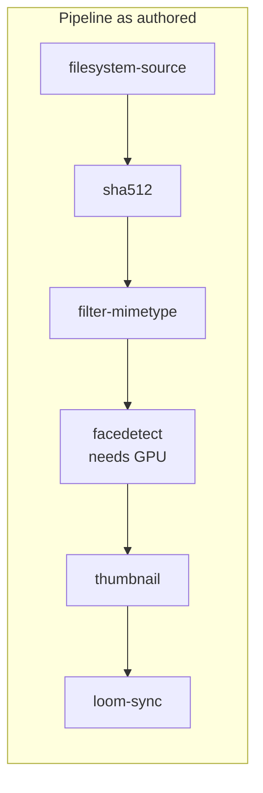
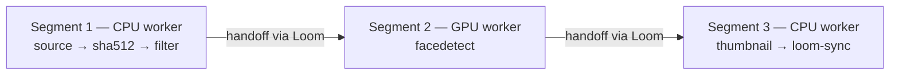
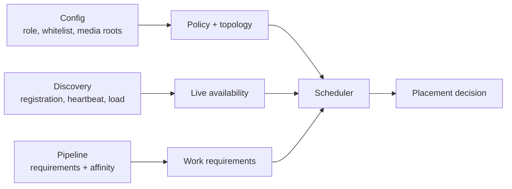

# MetaLoom Architecture V2 — Multi-Instance Cortex

> **Status: DESIGN PROPOSAL. None of this is built.**
>
> This document explores how MetaLoom could run many Cortex instances as a
> coordinated system rather than as independent workers each executing a whole
> run. It covers four candidate topologies, how orchestration would be driven,
> node capability whitelisting, node affinity, and what "asynchronous node
> delegation" would mean concretely in this codebase.
>
> **It is not a description of the system.** For what exists today, read
> [METALOOM_ARCHITECTURE.md](METALOOM_ARCHITECTURE.md) — this document assumes
> you have, and does not repeat it.
>
> **Start at [§7](#7-comparing-the-variants)** if you only want the comparison
> table and the recommendation.
>
> **Work items:**
> [METALOOM_ARCHITECTURE_V2_TASK.md](METALOOM_ARCHITECTURE_V2_TASK.md)
> · Prerequisites live in
> [METALOOM_ARCHITECTURE_TASK.md](METALOOM_ARCHITECTURE_TASK.md)

---

## 1. Read this first

Two things frame everything below, and skipping them leads to building the
wrong thing.

**Distribution multiplies whatever the system already does.** MetaLoom
currently reports success for work it did not do — 24 of 29 node kinds are
silent no-ops, only hash values are ever synced, and the streaming run path
never flushes its result buffer. Distributing that across a fleet does not
surface those problems; it hides them further, because now you cannot even tell
*which machine* produced the empty result. **The silent-failure defects must be
closed before any topology work starts.** They are Tasks 1–4 in
[METALOOM_ARCHITECTURE_TASK.md](METALOOM_ARCHITECTURE_TASK.md).

**Nobody has measured anything.** There is no benchmark anywhere in the repo. A
deployed Cortex is pinned to 4 concurrent media items on a 512 MB heap, neither
configurable in a container. It is entirely possible that a single properly
tuned worker outperforms today's four, at zero architectural cost. Scaling *up*
is the cheap experiment and it must be run first — otherwise there is no
baseline against which any of this can be justified or measured.

Everything below is worth designing. None of it is worth building yet.

---

## 2. What problem is actually being solved?

Worth stating plainly, because the variants solve *different* problems and the
choice depends entirely on which one you have.

| Problem | Symptom | Which variant helps |
|---|---|---|
| **Throughput** | one run takes too long | A or D — after scaling up one worker |
| **Fault tolerance** | a worker dies mid-run and work is lost | A or D — needs durable queueing, not topology |
| **Heterogeneous hardware** | one GPU box, ten CPU boxes | C or D |
| **Isolation / least privilege** | an exposed worker must not run LLM or Loom-sync nodes | **the whitelist** (§8) — independent of topology |
| **Locality** | media at several sites, moving it is impractical | B |
| **Coordinator load** | Loom cannot keep up with worker connections | **no evidence this is real** — see §4 |

The honest position: **throughput, fault tolerance, and heterogeneous hardware
are the real problems.** Locality is a deployment question nobody has answered
yet. Coordinator load is speculative.

---

## 3. Variant A — the flat pool

Many equal Cortex workers, one coordinator (Loom), work distributed **per media
item**. Each worker still evaluates the whole pipeline graph itself.



Two essential changes from today:

- **The unit of work becomes one media item**, not one whole run. Today a
  single work order sends an entire folder to a single worker.
- **Workers lease rather than receive.** A worker with spare capacity asks for
  N items and gets a time-bounded lease; an expired lease returns the item to
  the queue. This is what makes worker death survivable without coordination
  logic on the workers, and it inverts today's push model so backpressure works
  across the pool — a busy worker simply stops asking.

**Why it fits:** Cortex is stateless, dials outward, and the registry is
already a pool. The reactive engine stays exactly as it is — it is already good
at running a graph over a stream of media.

**What it does not solve:** every worker must be able to run every node. A
10-node pipeline with one GPU node needs GPUs on every machine, or that node
does not run.

---

## 4. Variant B — the hierarchical tree

Loom at the root, a **master Cortex** per branch, leaf Cortex instances
beneath it. A master accepts work from Loom and delegates to its own children.



**Where it genuinely wins:** *locality*. If media lives at two sites and moving
it is impractical, a per-site master handing work only to leaves that share
that site's storage is a natural fit. A site losing connectivity can degrade to
that site rather than stopping everything. Administrative boundaries — per-site
credentials, tenant isolation, network segmentation — map onto a tier cleanly.

**Where it costs more than it looks:**

- **A master is a new single point of failure per subtree.** A master built
  like today's in-memory `ProcessorRegistry` loses its whole subtree's
  in-flight work when it dies. A tree only improves fault recovery if the
  master's state is *recoverable* — stateless relay or durably queued. Those
  are different designs and the choice must be explicit.
- **Cortex would need a server role it does not have.** It is purely a
  WebSocket *client* today. A master must implement the entire
  `ProcessorEndpoint` side: upgrades, auth, registration, dispatch, result
  tracking. Substantial new code, two roles, two auth paths.
- **Observability degrades.** Events traverse master → Loom → UI, adding
  latency and **a second place to drop events** — and the broadcaster already
  drops on backpressure with no replay.
- **Cross-subtree balancing becomes hard.** A leaf under a busy master cannot
  help a leaf under an idle one without work stealing.
- **The throughput premise is unproven.** A single Vert.x server handles
  thousands of idle WebSockets. MetaLoom's real bottleneck is whole-run
  dispatch with no queue — and **adding a tier without fixing that helps not at
  all**, since each master would still hand whole runs to single leaves.

---

## 5. Variant C — Loom-orchestrated node dispatch

**The pipeline graph is evaluated on Loom, not Cortex.** Cortex becomes a pure
node executor: it advertises which node kinds it is permitted to run, receives
"apply node X to asset Y" requests, and returns the result. Loom holds the DAG,
decides what runs next, and picks a worker for each step.



Three mechanisms make this work, and two of them are valuable on their own:

- **Node whitelist** (§8) — a Cortex declares which node kinds it may execute.
- **Node affinity** (§9) — the pipeline marks groups of nodes that must run
  together on one instance, so not every edge becomes a network round trip.
- **A dispatcher on Loom** — receives asset events, advances each item through
  the graph, and chooses a worker per step.

### What is genuinely strong about this

- **Heterogeneous fleets become natural.** One GPU box does face detection for
  the whole cluster; cheap CPU boxes do hashing. Variant A cannot express this
  at all.
- **Least privilege becomes possible.** A worker in a DMZ can be restricted to
  hashing and never handed an LLM prompt or a Loom-sync node.
- **Central visibility.** Loom knows exactly where every item is, per node. That
  is a large observability gain over today, where a run is opaque until it ends.
- **Node-level retry and reassignment.** A failed `whisper` step retries on a
  different ASR worker without redoing the hash.
- **It dissolves the definition-schema bug as a side effect.** Today Loom writes
  `edges[]` and the Cortex loader reads `dependencies[]`, which silently
  collapses every UI-authored pipeline to one node. If **only Loom** ever parses
  the definition, that entire class of divergence disappears — along with
  `LoomPipelineLoader` and the `RegistryNodeFactory` stub fallback that hides
  24 unimplemented node kinds. This is not a small benefit; two of the three
  currently-broken paths are consequences of having two parsers.

### What it costs

- **Granularity mismatch — the central risk.** Distributed workflow engines
  (Temporal, Argo, Airflow) use this model for steps measured in seconds to
  hours. Hashing a small file takes **milliseconds**; a network round trip is
  comparable or worse. A 10-node pipeline over 100 000 files becomes ~1 000 000
  dispatch decisions where today it is one work order. Affinity (§9) is the
  mitigation, and it works — but see the observation in §6.
- **Intermediate results must go somewhere.** Today a node reads its upstream
  results from an **in-memory map** on the same JVM. Centralised evaluation
  means either shipping those results to Loom and back (expensive for
  embeddings, thumbnails, transcripts) or keeping them worker-local — which
  makes affinity a *correctness constraint*, not an optimisation.
- **Loom becomes a stateful scheduler.** Per-item graph state must be durable,
  or a Loom restart strands every in-flight item mid-graph. This is a
  substantial new subsystem with its own failure modes.
- **Loom becomes the bottleneck and the single point of failure** for every
  node transition, not just for run start and finish.
- **Much of the Cortex engine becomes redundant.** The DAG walker, dependency
  resolution, filter branching, and per-node semaphores would move to Loom or
  be discarded. That is a lot of working, tested machinery to throw away —
  `ReactivePipelineExecutor` and `DefaultPipeline` are among the better-covered
  parts of the codebase.
- **Backpressure must be rebuilt across the wire.** Today it is a `flatMap`
  width in one process.

### Feasibility note

Loom already walks the graph — `PipelineValidationService` implements Kahn's
algorithm for cycle detection over `nodes[]`/`edges[]`. So the graph-reasoning
foundation exists on the Loom side; what is missing is execution state,
scheduling, and the dispatch protocol.

> 📋 **A phased implementation plan for this variant exists:**
> [METALOOM_ARCHITECTURE_V2_PLAN_C.md](METALOOM_ARCHITECTURE_V2_PLAN_C.md).
> Phase 1 (restructuring + first delegation) is largely **shared between C and
> D**, so building it does not commit to C — it produces the measurement that
> decides between them.

---

## 6. Variant D — segmented dispatch (the synthesis)

Variant C's per-node dispatch and Variant A's whole-graph dispatch are not
opposites. **They are the two ends of one dial, and affinity is the dial.**

- Give every node its own affinity group → per-node dispatch → **Variant C**.
- Put every node in one affinity group → whole-graph dispatch → **Variant A**.

That observation suggests the useful design sits between them: **Loom splits the
pipeline into segments at capability boundaries, and dispatches a whole segment
to one worker.**





Each segment runs entirely in-process on one worker, using the existing
reactive engine unchanged. Only **segment boundaries** cross the network — so a
6-node pipeline costs 2 handoffs, not 5. Boundaries fall where they must
(capability changes), not on every edge.

**Why this is the sweet spot:**

- Gets Variant C's heterogeneous-fleet and least-privilege benefits.
- Avoids Variant C's per-node chattiness and its intermediate-result shipping
  problem, since results stay in memory *within* a segment.
- Reuses the Cortex DAG engine rather than discarding it — a segment is just a
  smaller pipeline.
- Degrades gracefully: a fleet where every worker can run everything produces
  exactly one segment, i.e. Variant A, with no special-casing.
- Segments are a natural retry and lease unit, so Variant A's queue design
  carries over unchanged.

**What it still costs:** Loom must compute the segmentation (a graph partition
by capability), intermediate results must cross segment boundaries, and the
handoff protocol is new work. It is meaningfully more than Variant A, and
meaningfully less than Variant C.

---

## 7. Comparing the variants

| | **A — Flat pool** | **B — Tree** | **C — Loom-orchestrated** | **D — Segmented** |
|---|---|---|---|---|
| **Unit of dispatch** | one media item | one media item | one node × one item | one segment × one item |
| **Who evaluates the DAG** | Cortex | Cortex | **Loom** | Loom splits, Cortex runs each part |
| **Throughput** | ✅ good | ➖ same as A, plus a hop | ⚠️ risk: per-node round trips | ✅ good |
| **Heterogeneous hardware** | ❌ every worker needs everything | ❌ same | ✅ excellent | ✅ good |
| **Least privilege / whitelist** | ➖ possible but unused | ➖ same | ✅ core to the design | ✅ core to the design |
| **Multi-site / edge** | ❌ awkward | ✅ the reason to build it | ❌ chatty over WAN | ➖ workable |
| **Fault recovery** | ✅ one durable queue | ⚠️ only if masters durable | ✅ per-node retry | ✅ per-segment retry |
| **Observability** | ➖ per item | ❌ two hops, extra drop point | ✅ per node, centrally | ✅ per segment |
| **Intermediate results** | ✅ stay in memory | ✅ stay in memory | ❌ must ship or pin | ✅ in memory within a segment |
| **Fixes the two-parser schism** | ❌ no | ❌ no | ✅ yes, structurally | ✅ yes, structurally |
| **Reuses the Cortex engine** | ✅ fully | ✅ fully | ❌ largely discarded | ✅ fully |
| **New protocol surface** | small | **large** (Cortex gains a server role) | large | medium |
| **Loom becomes stateful scheduler** | no | no | **yes, per item per node** | yes, per segment |
| **Single point of failure** | Loom (run start/end only) | + one per subtree | **Loom, on every step** | Loom, per handoff |
| **Implementation cost** | moderate | high | **highest** | moderate–high |

### Recommendation

**Variant D, reached incrementally through A — with the whitelist (§8) pulled
forward and delivered first.**

The reasoning, in order:

1. **Build the whitelist now, independent of any variant.** It is small, it is
   useful immediately (least privilege, and it makes the "5 of 29 kinds are
   real" problem *visible* rather than silent), and every variant except A
   depends on it. There is no scenario where this is wasted work.

2. **Then Variant A.** The durable item-grained queue with leases solves the two
   demonstrated problems — throughput and fault tolerance — and it is the
   prerequisite for D anyway. A segment is dispatched and leased exactly like an
   item, so nothing is thrown away.

3. **Then Variant D, if and only if the fleet is actually heterogeneous.** If
   every worker can run every node, D degenerates to A and adds nothing. D earns
   its cost the moment you have one GPU box and ten CPU boxes — which is the
   realistic shape for face detection and ASR.

4. **Variant C only if per-node visibility or per-node retry turns out to
   matter more than throughput.** Its benefits are real, but the granularity
   mismatch is a genuine risk, and D captures most of the same value at a
   fraction of the cost. C is the right model for coarse steps; MetaLoom's
   steps are fine-grained.

5. **Variant B only if multi-site is confirmed.** It is orthogonal to the
   others: a tree of segment-dispatching sites is coherent. But it is expensive
   and solves a problem nobody has confirmed MetaLoom has.

### The insight that makes the variants a continuum, not a menu

**A and C are only opposites because affinity is missing.** Add it and they
become the two settings of one dial, with D anywhere in between — which is why
D costs less than it looks: it is not a fourth architecture, it is A plus a
partitioning step.

The same collapse is available for A and B, but only if the protocol allows it.
Today it is asymmetric: Loom speaks "coordinator", Cortex speaks "worker", in
different codebases. If instead the **worker protocol were uniform and
recursive** — same messages, same lease semantics, same registration,
regardless of who is above you — then a "master Cortex" is simply a Cortex with
the coordinator role enabled, and **topology becomes a deployment choice rather
than an architectural one.**

Concretely:

1. Define the worker protocol once, as an interface, with no assumption that
   the peer above is Loom.
2. Give Cortex an optional coordinator role implementing the peer side.
3. Let a coordinator advertise its subtree's *aggregate* capability, capacity,
   and node whitelist upward, so its parent treats it as one large worker.

Do this and Variant A is the one-level case of Variant B, and the segmentation
in D works identically at either level. Skip it and dispatch gets implemented
twice. This is Task V3, and it is much cheaper as a design constraint than as a
later refactor.

**On the proposal as stated:** the two mechanisms — whitelist and affinity — are
the strong parts and should be built regardless. The part worth pushing back on
is *"the pipeline is no longer evaluated on Cortex but instead on Loom."* Moving
evaluation wholesale to Loom is what makes Variant C expensive: it discards a
tested engine, forces intermediate results onto the wire, and makes Loom
stateful on every step. Variant D keeps evaluation distributed while still
letting **Loom decide placement** — which is the part that actually delivers the
benefit you are after.

---

## 8. Node capability whitelist

**This is the strongest single idea in the proposal and it is independent of
topology.** Build it first.

A Cortex instance declares which node kinds it is permitted to execute. Loom
records that at registration and never dispatches anything outside the list.

### Design

```yaml
# cortex config
nodes:
  allowed: [filesystem-source, sha512, sha256, md5, chunk-hash]
```

- Advertised in `REGISTER` — `ProcessorRegistration` gains
  `supportedNodeKinds: Set<String>` alongside the existing `capabilities`.
  (Today it carries only `nodeId`, `name`, `priority`, `host`, `capabilities`.)
- **Default: everything the instance can actually execute**, so existing
  deployments behave unchanged.
- Loom filters candidates on it during scheduling.
- A pipeline requiring a kind no worker offers must fail **at save or at
  dispatch, loudly** — never silently, given this system's history.

### Why it is worth doing on its own

| Benefit | Detail |
|---|---|
| **Least privilege** | A DMZ or tenant-shared worker runs hashing only — it never receives an LLM prompt, never gets Loom-sync credentials |
| **Cost control** | Expensive GPU instances only accept the nodes that need a GPU |
| **Makes the stub problem visible** | Today 24 of 29 kinds silently no-op. If workers advertise what they can *really* run, the gap becomes queryable instead of invisible — a direct complement to [Task 1](METALOOM_ARCHITECTURE_TASK.md) |
| **Rollout safety** | A new node implementation can be enabled on one worker and observed before fleet-wide rollout |
| **Prerequisite for C and D** | Both need it; neither is possible without it |

Note the distinction from `ProcessorCapability` (`CPU`/`IO`/`GPU`): capability
describes *hardware*, the whitelist describes *policy*. Both are needed —
a worker may have a GPU but be policy-restricted to hashing.

---

## 9. Node affinity

Affinity marks nodes that must execute together on one instance.

```json
{
  "nodes": [
    { "id": "pn1", "type": "filesystem-source", "affinity": "ingest" },
    { "id": "pn2", "type": "sha512",            "affinity": "ingest" },
    { "id": "pn3", "type": "facedetect",        "affinity": "gpu-work" },
    { "id": "pn4", "type": "thumbnail",         "affinity": "ingest" }
  ]
}
```

### Semantics that must be decided explicitly

- **Affinity is a constraint, not a hint.** Because upstream results live in an
  in-memory map, splitting an affinity group is not a performance regression —
  it is a *correctness* failure unless results are shipped. Treat a violated
  affinity as an error.
- **Default grouping matters enormously.** Defaulting to "each node its own
  group" silently turns every pipeline into Variant C, with a network hop per
  edge. **Default to one group per pipeline** (= Variant A behaviour) and make
  splitting opt-in. Safe by default; distribution is the deliberate act.
- **Affinity and whitelist can conflict.** A group containing `sha512` and
  `facedetect` requires one worker permitted to run both. Validation must detect
  unsatisfiable groups at save time and say so precisely — this is exactly the
  kind of constraint that would otherwise fail as a silent empty run.
- **Affinity does not pin to a *specific* worker.** It says "these run
  together", never "these run on worker-7". Placement stays the scheduler's
  output — see §11.

---

## 10. Asynchronous / deferred nodes

The proposal asks for "a way to make a node act as async/dereferenced" and
notes uncertainty about the term.

### Naming

| Term | Means |
|---|---|
| **Delegating node** | *what it does* — forwards the work elsewhere |
| **Deferred result** | *what it returns* — a promise resolved later |
| **Detached** | it does not hold a thread while waiting |

"Dereferenced" is close in the pointer sense — the node returns a handle you
later dereference — but **"deferred"** is the conventional word. This document
uses "delegating node returning a deferred result".

### Why it matters

Without it, a node that sends work elsewhere blocks a thread for the entire
remote execution, which defeats delegation. It is **required for Variant C and
for cross-segment handoff in D**, and it is useful on a *single* worker today
for nodes that wait on external services (Ollama, remote ASR, HTTP APIs).

### The concrete change

`PipelineNode.process(...)` returns a `NodeResult` synchronously, and
`ReactivePipelineExecutor` wraps it in `Single.fromCallable(...)`. Add:

```java
// Default keeps every existing node working unchanged.
default Single<NodeResult> processAsync(LoomMedia media, Map<String, NodeResult> upstream) {
    return Single.fromCallable(() -> process(media, upstream));
}
```

and have the executor subscribe to `processAsync(...)` instead of wrapping
`process(...)` itself. Because the executor is already `Single`-based, this is a
**small change at the seam**.

⚠️ Do **not** revive the existing `apply(Flowable<MediaContext>)` /
`partition(...)` operator API. It is dead code the executor never calls — a
second, unfinished execution design.

### Three consequences that must be handled

- **Semaphore release moves.** Per-node concurrency is a blocking
  `semaphore.acquire()` released in a `finally`. With no callable to return
  from, the permit must release on the `Single`'s terminal event (`doFinally`),
  or permits leak and the node wedges after N deferred executions.
- **Fix the timeout placement first.** The per-node timeout is already applied
  *outside* the permit-holding body, so a hung node keeps its permit; with
  deferred results that window becomes unbounded.
- **Completion semantics shift.** `PIPELINE_COMPLETED` fires from
  `doOnComplete`. A result resolving afterwards would be reported against a
  finished run *and* would miss the `syncToLoom` buffer, since collection
  happens on `COMPLETED`. Either await outstanding deferred results, or reject
  late ones explicitly.

---

## 11. How orchestration would be driven

The proposal identifies three candidate mechanisms. They are **not competing
options — they answer three different questions**, and a working system needs
all three.

| Mechanism | Answers | Good at | Bad at |
|---|---|---|---|
| **Cortex config** | *Who exists, what may they run, who may they talk to?* | the whitelist, roles, trust boundaries | elasticity |
| **Pipeline settings** | *What does this work need?* | capability requirements, affinity groups | encoding deployment topology into a user's recipe |
| **Discovery** | *Who is available now, and how loaded?* | elasticity, autoscaling, failure detection | expressing intent or policy |

**Config declares policy and topology.** Role, parent, media roots, and the node
whitelist. These are deployment facts that must not be discoverable — a worker
guessing its own permissions is a security hazard.

**The pipeline declares requirements and grouping, never placement.** An author
may say *"this node needs a GPU"* or *"these nodes run together"*. They must
**not** say *"run this on worker-7"*. Requirements and affinity are portable and
survive redeployment; placement is a layering violation that breaks the moment
the fleet changes. This is the Kubernetes model, and it is the right one here.

**Discovery supplies live membership and capacity.** Registration already *is*
discovery. It extends to carry the whitelist and, in a tree, a subtree's
aggregate capability.



The scheduler is the only component that sees all three. **Placement is its
output, never an input from anywhere else.**

---

## 12. Failure and recovery

| Failure | A / D | B | C |
|---|---|---|---|
| A worker dies | lease expires, item/segment requeued | same, if the master requeues | in-flight node retried elsewhere |
| A master dies | n/a | ⚠️ subtree work lost unless durable | n/a |
| Loom dies | queue survives in DB; workers idle | subtrees could continue if autonomous | ⚠️ **every in-flight item stranded mid-graph unless state is durable** |
| Network partition | leases expire and reassign | ✅ a site keeps working | items stall |
| A worker hangs | lease expiry reclaims | same | node timeout, retry elsewhere |
| Scale-down | drain, then exit | master must not re-lease to a draining child | drain in-flight nodes |

The load-bearing rule for every variant: **a lease must be the only thing that
grants the right to process a unit of work, and it must expire.** Worker death,
hangs, partitions, and scale-down then all reduce to "the lease expired and
someone else picked it up".

Two consequences:

- **In a tree, a master must be either stateless or durable — decide
  explicitly.** An in-memory master holding lease state has the costs of both
  and the benefits of neither.
- **Shared storage remains a hard prerequisite for A, C, and D.** Cortex reads
  local paths and writes results into xattrs *on the file*. Any two workers
  touching the same media must both see it. Object storage would require
  changing how media is read *and* how results are stored. **Settle this before
  building anything.**

---

## 13. Prerequisites

| # | Prerequisite | Where tracked |
|---|---|---|
| 1 | Unregistered node types fail loudly | ARCH_TASK Task 1 |
| 2 | Results actually return (flush, writer, `syncToLoom`) | ARCH_TASK Tasks 2–4 |
| 3 | Graceful shutdown with drain | ARCH_TASK Task 5 |
| 4 | One worker is tuneable, and benchmarked | ARCH_TASK Task 6 |
| 5 | Load metrics are correct | ARCH_TASK Task 7 |
| 6 | Stable, persistent worker identity | ARCH_TASK Task 9 |
| 7 | Heartbeat timeout and eviction | ARCH_TASK Task 10 |
| 8 | Control channel secured (TLS, auth) | ARCH_TASK Task 14 |
| 9 | Shared storage decision | **unresolved** — V2 Task V1 |
| 10 | Executor reusable; timeout placement fixed | PIPELINE_TASKS Task 4 |

Items 1–2 are non-negotiable. Item 9 is a decision, not code. Item 10 matters
specifically for deferred nodes (§10).

---

## 14. Open questions

1. **Is the fleet actually heterogeneous?** Determines whether D earns its cost
   over A. One GPU box among CPU boxes → yes.
2. **What does the storage layer look like?** Gates everything.
3. **Is there a real multi-site requirement?** Gates B entirely.
4. **What is the throughput ceiling of one tuned worker?** Unmeasured; may
   remove the need for any of this.
5. **How many workers is the target?** 5 changes nothing architecturally; 500
   changes everything.
6. **Where do intermediate results live at a segment boundary?** Shipped
   through Loom, written to shared storage, or re-derived? Determines D's cost.
7. **Should a subtree keep working when disconnected from Loom?** B's best
   feature and its hardest correctness problem.
8. **Multi-tenancy?** If the whitelist is used for tenant isolation, it becomes
   a security boundary and needs to be enforced, not advisory.

---

## 15. Progress Assessment

- [x] Flat pool (A) captured, moved from `METALOOM_ARCHITECTURE.md` §14
- [x] Tree (B) investigated, with the master-failure caveat stated
- [x] Loom-orchestrated dispatch (C) documented, including the two-parser
      side benefit and the granularity risk
- [x] Segmented dispatch (D) proposed as the synthesis, with affinity framed as
      the dial between A and C
- [x] Comparison table across all four variants, with a recommendation
- [x] Node capability whitelist specified as topology-independent, build-first
- [x] Node affinity semantics specified, including the default-grouping trap
- [x] Async/deferred node concept, terminology, and the concrete SPI change
- [x] Orchestration answered across config / pipeline / discovery
- [x] Failure and recovery per variant
- [ ] **Fleet heterogeneity confirmed** — gates D over A
- [ ] **Shared storage decision** — gates A, C, and D
- [ ] **Single-worker benchmark** — gates the justification for any of it
- [ ] **Multi-site requirement confirmed or ruled out** — gates B
- [ ] Intermediate-result handoff mechanism chosen (Q6)

---

_Git HEAD revision: `92bc1153e50c43efb65e4d78874823c9ec1f4408`_
_Last updated: 2026-07-18 19:30 UTC_
