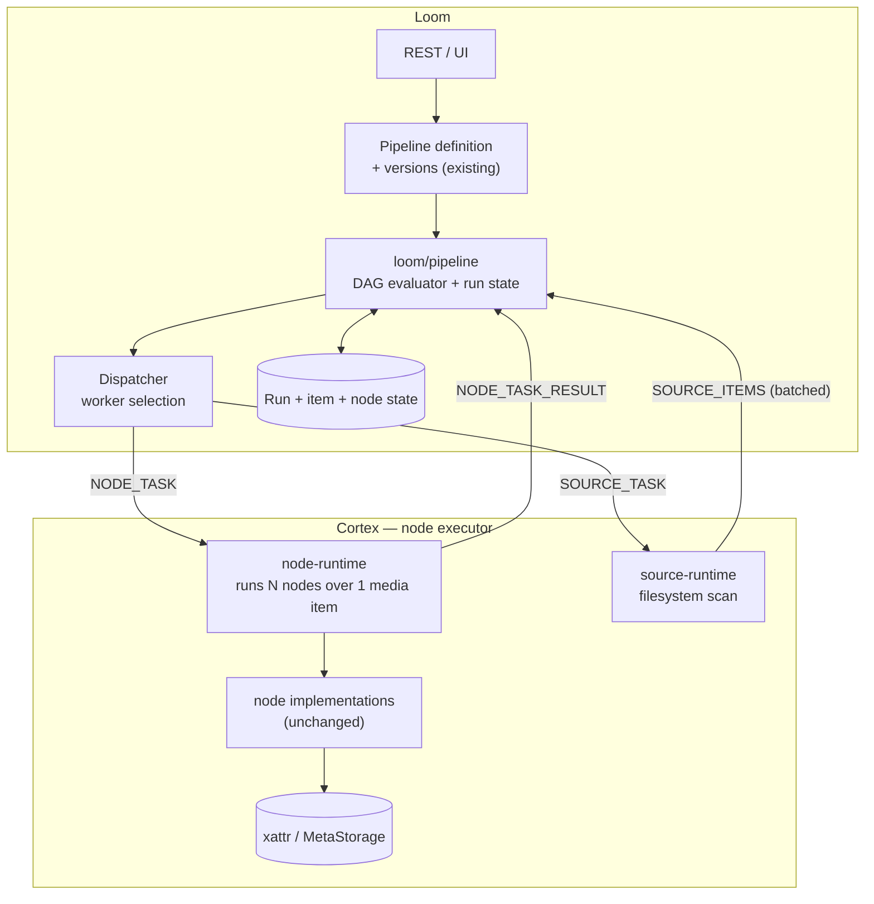

# Variant C — Implementation Plan

> **Status: PHASES 1 AND 2 COMPLETE. PHASE 3 PARTIAL.**
>
> Loom owns the pipeline graph and dispatches node tasks — or whole affinity
> segments — to Cortex workers. Run state is durable, leases reclaim work from
> dead workers, and a restart resumes. Of Phase 3, affinity segmentation, event
> aggregation and circuit breakers have landed; **batching (P3.4) is
> deliberately blocked** on measurements that do not exist.
>
> ⚠️ **A benchmark disproved this plan's stated justification for affinity**
> (§2.9). Read that before extending it.
>
> This document is the **record of the work and the decisions behind it**. For
> what the system does today, see
> [METALOOM_ARCHITECTURE.md](METALOOM_ARCHITECTURE.md) §14–§15. For what remains,
> see [METALOOM_ARCHITECTURE_TASK.md](METALOOM_ARCHITECTURE_TASK.md).
>
> The variant comparison that justified this choice (`METALOOM_ARCHITECTURE_V2.md`)
> has been deleted as outdated — Variant C is no longer one option among four, it
> is the architecture.
>
> Plan verified against `92bc115` (2026-07-18); implementation notes current to
> 2026-07-19.

---

## 1. Direction of travel

**Execution moves from Cortex → Loom.** Loom evaluates the graph and decides
what runs next; Cortex executes individual node invocations on request.

| | Today | Variant C |
|---|---|---|
| Holds the graph | Cortex (`DefaultPipeline`) | **Loom** |
| Decides what runs next | Cortex (`ReactivePipelineExecutor`) | **Loom** |
| Executes a node | Cortex | Cortex *(unchanged)* |
| Executes the source | Cortex | Cortex *(unchanged — see §5.4)* |
| Parses the definition | **both**, incompatibly | Loom only |

That last row is not a side note. Two of the three currently-broken end-to-end
paths exist purely because two parsers disagree; a single parser removes the
class of bug rather than fixing an instance of it.

---

## 2. Five findings that shape this plan

Established by reading the code, not the specs. Each one changes the work.

### 2.1 ✅ `filesystem-source` now exists — and fits this plan well

> **Updated 2026-07-18.** This was previously a 🔴 blocker: the kind had a
> descriptor only and resolved to a success-reporting stub. **It has since been
> implemented.** Phase 1 no longer starts by writing a source node.

What now exists:

| Artefact | Location |
|---|---|
| `FilesystemSourceNode` | `cortex/nodes/filesystem-source` |
| `FilesystemSourceNodeOptions` (defaults: `path`, `pathGlobs`) | same module |
| `FilesystemMediaScanner` (`expand(globs)`, `walk(root)`) | same module |
| `FilesystemSourceNodeModule` (Dagger) | same module |
| Factory registration for kind `filesystem-source` | `PipelineNodeFactoryModule` |
| Tests | `FilesystemSourceNodeTest`, `FilesystemSourceNodeOptionsTest` |

The executable set is now **6 of 29** kinds (`filesystem-source`, `sha512`,
`sha256`, `md5`, `chunk-hash`, `thumbnail`), not 5.

**This is better for the plan than a from-scratch node would have been**, because
of the SPI that came with it. `MediaSourceNode` exposes:

```java
Flowable<LoomMedia> stream();   // cold — walks on subscription
```

That is exactly the seam Variant C needs. The Cortex `source-runtime` (§5.4)
subscribes to `stream()` and forwards batches over the wire instead of into the
local engine. **The node is reused unchanged; only its sink changes.** Globs take
precedence over `root`, and both fall back to configured defaults — semantics
Phase 1 should preserve rather than reinvent.

Two residual caveats, both of which Phase 1 must handle:

- ⚠️ **It materialises the whole selection.** `FilesystemMediaScanner.expand()`
  and `walk()` both return `List<Path>`, so the entire file list is built in
  memory before the first item is emitted. The `MediaSourceNode` Javadoc
  explicitly advises against this — *"implementations should stream rather than
  materialise a full list where the selection may be large"* — so the node
  currently contradicts its own SPI's guidance. At 100 000 files this defeats
  the ack-based backpressure in §5.4, because Cortex has already paid the memory
  cost before the first batch is sent. **Converting the scanner to a lazy
  `Flowable` is Phase 1 work**, and it is worth doing regardless of Variant C —
  today's local engine has the same exposure.
- ⚠️ **The node has two roles that split across the boundary.** `stream()`
  enumerates; `process()` additionally returns `{path, source}` per item. In
  Variant C the enumeration happens on Cortex while per-item evaluation happens
  on Loom. Since the source's own `process()` output is trivially derivable from
  a `SourceItem`, **Loom should synthesise it rather than issuing a `NODE_TASK`
  back to Cortex for the source node** — one saved round trip per item, and it
  keeps the source's semantics in one place.

### 2.2 ✅ Loom depended on Cortex — inverted in P1.1

> **Resolved 2026-07-18 (step P1.1).** Previously `loom/services/rest`
> depended on **17** `cortex-*-api` modules for node descriptors, and
> `NodeDescriptorRegistry` lived in a *cortex* module under an
> `io.metaloom.loom.nodes.spec` **loom package** — the naming already conceded
> it was shared.

Investigation showed the situation was cleaner than it looked:

- Each `cortex/nodes/*-api` module contained **exactly one** class.
- **Only `loom/services/rest` consumed them** (4 files). No Cortex code imported
  `io.metaloom.loom.nodes.spec` at all, and node `core` modules did not depend
  on their sibling `api` module.
- All 27 classes already shared one package, so relocating them required **zero
  import changes** — only pom edits.

They were Loom artefacts living in the Cortex tree. Resolution:

| Change | Detail |
|---|---|
| New module | `loom-shared/node-model` (`loom-node-model`) — descriptor metadata only, no runtime dependency on either side |
| Moved | all 27 classes, package unchanged |
| Deleted | 17 `cortex/nodes/*-api` modules |
| `loom/services/rest` | 17 `cortex-*` deps → **1** `loom-node-model` dep; the Loom tree now has **no** `io.metaloom.cortex` pom reference |

⚠️ **The subtle part was `ServiceLoader`.** Providers are discovered via
`META-INF/services/io.metaloom.loom.nodes.spec.NodeDescriptorProvider`, and each
of the 16 provider modules shipped its own copy. Merging modules meant merging
16 service files into one — a change that fails *silently*: a dropped line
removes a node kind from validation and the UI palette while everything still
compiles and every other test still passes.

`NodeDescriptorServiceLoaderTest` in the new module guards this: it asserts 16
providers load, 29 kinds register, one kind from each former module is present,
and no kind is advertised twice. It was verified to actually fail (3 of 5 tests,
with a precise diagnostic) when a single service entry is removed.

### 2.3 ✅ The offline CLI path is unaffected

`cortex process run` goes through `FilesystemProcessorImpl`, which drives the
**legacy** `FilesystemNode` tree — not `PipelineExecutor`. Removing the pipeline
engine does not break offline batch processing.

**Consequence:** less risk than expected. But see §8.4 — "Cortex is useful
standalone" becomes a weaker claim, and that is a product decision.

### 2.4 ⚠️ Ten test classes depend on the executor harness

`AbstractPipelineNodeTest` builds a linear pipeline and runs the real executor.
Eight concrete node tests extend it (`MD5NodePipelineTest`,
`SHA512NodePipelineTest`, `ChunkHashNodePipelineTest`,
`ThumbnailNodePipelineTest`, `FingerprintNodePipelineTest`,
`LLMNodePipelineTest`, `FacedetectNodePipelineTest`, `WhisperNodePipelineTest`)
plus `AbstractFilterNodeTest`.

**Consequence:** when the executor leaves Cortex, that harness dies. A
replacement single-node harness is Phase 1 work, and it touches ten files. This
is the largest mechanical cost in Phase 1.

### 2.5 ⚠️ Phase 3 needs back what Phase 1 would delete

Affinity groups (Phase 3) require Cortex to run a *subgraph* locally — which is
a small DAG engine. Deleting `ReactivePipelineExecutor` outright in Phase 1 and
rewriting it in Phase 3 is waste.

**Consequence — the single most important planning decision here:** Phase 1
**shrinks and relocates** the engine rather than deleting it. Cortex keeps a
`node-runtime` that executes a *set* of nodes over one media item. In Phase 1
that set always has size 1. In Phase 3 it is a segment. Same code path, same
tests, no rewrite.

---

## 2.6 Decisions taken

Recorded 2026-07-18. These were the open questions blocking Phase 1 start.

| # | Question | Decision | Consequence |
|---|---|---|---|
| Q1 | Must standalone Cortex pipeline execution survive? | **No — Loom-only is acceptable** | `node-runtime` needs no local driver. Offline use is limited to the legacy `cortex process run --actions` path. ⚠️ The README and website claims about standalone use must be updated before Phase 1 ships |
| Q4 | Push or pull dispatch? | **Push for Phase 1** | Loom sends `NODE_TASK` when a node becomes ready. Accepted risk: Phase 2 leases favour pull, so the protocol will change twice |
| Q5 | Version the definition format? | **Yes, from the start** | The format gains `syncToLoom`, filter branches, and typed options; version it before the first breaking change rather than after |

**Sequencing:** Phase 1 is being executed step by step (P1.1 … P1.6, see §5), not
as one large change. Each step is independently reviewable and leaves the build
green.

### Step status

| Step | Scope | Status |
|---|---|---|
| **P1.1** | Invert the Loom→Cortex dependency; extract `loom-shared/node-model` | ✅ **done** — see §2.2 |
| **P1.2** | `loom/pipeline` module: graph model + engine against a fake dispatcher | ✅ **done** — see §2.7 |
| **P1.3** | Protocol: fix the envelope, add `SOURCE_*` / `NODE_TASK` messages | ✅ **done** — see §2.8 |
| **P1.4** | `cortex/node-runtime` + source runner; Cortex answers tasks | ✅ **done** — see §2.9 |
| **P1.5** | Test migration (10 classes, §5.8) | ✅ **done** — see §2.10 |
| **P1.6** | Wire end to end; run driven by the engine (§5.9) | ✅ **done** — see §2.11 |
| **P1.7** | Delete the old engine + rewire Dagger (deferred from P1.5) | ✅ **done** — see §2.12 |

**P1.1 verification:** full reactor `install` green; 5 new ServiceLoader guard
tests; 23 `PipelineValidationServiceTest` cases (the real descriptor consumer)
green; 187 Cortex node/pipeline tests green.

⚠️ **Pre-existing failure, unrelated to this work.**
`NodeDescriptorEndpointTest` has 2 of 6 tests failing
(`testListAllNodeDescriptors`, `testFilterNodesHaveFilterCategory`): the
endpoint returns a JSON *object* where the test decodes a JSON *array*, so the
client times out after 10 s. **Confirmed identical on the pre-change tree**, so
P1.1 neither caused nor fixed it. It should be fixed on its own — it is the only
coverage of the descriptor REST surface the UI palette depends on.

## 2.7 What was built, step by step

Every step landed with tests and a green reactor build. The detail of *what each
component does and why* now lives in
[METALOOM_ARCHITECTURE.md](METALOOM_ARCHITECTURE.md) §14–§15; this table is the
record of **when and in what order**, plus the decisions that would otherwise be
invisible.

### Phase 1 — restructuring and first delegation ✅ complete

| Step | Scope | Notes |
|---|---|---|
| **P1.1** | Invert the Loom→Cortex dependency; extract `loom-shared/node-model` | 17 `cortex/nodes/*-api` modules deleted; ServiceLoader merge guarded by a test proven to fail on a dropped entry |
| **P1.2** | `loom/pipeline`: graph model + engine against a fake dispatcher | The `edges[]` schema defect closed **structurally**; filter branches expressible for the first time; cortex dependency banned by `maven-enforcer` |
| **P1.3** | Protocol: fix the envelope, add `SOURCE_*` / `NODE_TASK` | String-concatenated envelope replaced; 6 message types, 5 DTOs |
| **P1.4** | `cortex/node-runtime` with `NodeTaskRunner` + `SourceTaskRunner` | Added **additively** — the old engine kept running until P1.5 migrated its tests |
| **P1.5** | Test migration | `AbstractNodeChainTest` replaces the executor harness; 9 classes migrated |
| **P1.6** | Wire end to end | An unexecutable definition now returns **400** instead of a silent no-op run |
| **P1.7** | Delete the old engine; rewire Dagger | `ReactivePipelineExecutor`, `DefaultPipeline`, `PipelineManager`, `LoomPipelineLoader` gone; work-order handler reduced to `flush-sync` |

**Deliberate deviations, both documented rather than silently reordered:** P1.4
added the new runtime alongside the old engine; P1.5 deferred the executor
deletion into a new P1.7 so the replacement could be proven first.

### Phase 2 — durability and correctness ✅ complete

| Step | Scope | Notes |
|---|---|---|
| **P2.1** | `pipeline_run_item` + `pipeline_node_task`, DAOs, contract tests | §5.1 was **wrong** on two counts — see below |
| **P2.2** | `RunStateStore` port; engine writes through it; batched | Item identity moved from an in-memory counter to the store |
| **P2.3** | Leases, retries with backoff, dead-letter, `LeaseReaper` | `retryFailed` finally does something |
| **P2.4** | Restart recovery | A run whose *source* had not finished cannot be resumed faithfully, and says so |
| **P2.5** | Node-kind whitelist in worker selection | Load-aware placement deliberately **not** built — `cpuLoad` is broken |
| **P2.6** | Per-run in-flight ceiling + source-ack backpressure | Two liveness bugs found and fixed — see below |
| **P2.7** | Worker attribution (`leased_by`) | Run inspection API **not** built; still open |

### Phase 3 — DAG, affinity, resilience 🔶 partially complete

| Step | Scope | Status |
|---|---|---|
| **P3.1** | `affinity` in the definition; segment computation; save-time validation | ✅ |
| **P3.2** | `SEGMENT_TASK` protocol + Cortex segment runner | ✅ |
| **P3.3** | Engine dispatches segments; filter edges bound segments | ✅ |
| **P3.5** | Event aggregation — per-node counters on a timer | ✅ taken **ahead of** P3.4 |
| **P3.6** | Circuit breaker per node kind | ✅ per-kind *concurrency ceiling* still open |
| **P3.4** | Dispatch/result batching | ⛔ **blocked** — needs measurements that do not exist |

---

## 2.8 Corrections to this plan, discovered by building it

Recorded because each one contradicts something written earlier in this document.

**§5.1 said to write "both jooq and memory impls". Wrong.** `loom/db/memory`
implements only `Token` and `User`, has no Dagger module and no test suite.
Writing memory impls would have invented a pattern the codebase abandoned. All 20
existing DAOs are jOOQ-only with a shared `CRUDDaoTestcases` contract test.

**§5.2's idempotency key was wider than needed.** `(item_uuid, node_id)` suffices;
an item belongs to one run and a run pins one pipeline version, so the version
column is functionally dependent.

**§6.4's "decode-once" justification is not supported by measurement** — see
§2.9. This is the most consequential correction in the document.

**Q4 (push vs pull) was revisited and stands.** Phase 2 leases were expected to
favour pull. In practice push + leases + a per-worker in-flight cap achieves the
same backpressure without a second protocol rewrite, so push was kept.

### Bugs the tests caught, worth remembering

| Bug | Why it mattered |
|---|---|
| In-flight counter leaked on retry and reclaim | Enough leaked slots wedge a run permanently at capacity — indistinguishable from a hang |
| `pumpDeferred` re-dispatched nodes awaiting a retry | Defeated the backoff entirely; retries would have fired immediately |
| `segmentReady` called `evaluateSkip` on nodes with unsettled internal deps | 20 tests failed with a NullPointer |
| Un-parking a circuit-broken kind recursed without bound | Stack overflow with the default immediate scheduler |

Three of these four are the same shape: **every new reason to *not* dispatch needs
an explicit answer to "what wakes it up?"** Capacity, retry backoff and circuit
parking each introduced a state that is neither settled nor in flight, and each
one needed its own release path.

---

## 2.9 🔴 Benchmark result — the affinity premise is not what we assumed

Run 2026-07-19 on real media (`SegmentDispatchBenchmark`, `cortex/nodes/hash/core`).
10 files, **155.3 MiB**, graph `sha512 → md5` — two nodes that both read the whole
file. Median of 3 rounds after warmup.

| Mode | Median |
|---|---|
| Per-node dispatch (media resolved twice) | 281 ms |
| Segment dispatch (media resolved once) | 279 ms |
| **Ratio** | **1.01×** |

**The worker-side saving is approximately zero.**

§6.4 claims affinity wins because "decode-once, analyse-many stays in one process
instead of re-reading the file per node". **The measurement does not support
this.** Resolving the media handle once is cheap and saves almost nothing, because
`LoomMedia` is a lightweight file reference, **not** a decoded shareable artifact.
Both nodes still read the file in both modes.

Two confounds bound how far this generalises, and neither rescues the claim:

1. **Page cache** — 155 MiB against 63 GiB of RAM, so the second read comes from
   memory. On a cold cache or a network mount, per-node looks worse — but that
   penalty comes from *re-reading*, which segmenting does not prevent.
2. **Hashing has no decode step**, so there is no expensive intermediate state to
   share. A video pipeline might — but only if nodes shared decoded frames, and
   **the node API has nowhere to put them**: nodes receive upstream *outputs*.

**What affinity actually delivers is one round trip instead of N**, plus one
dispatch decision instead of N. Real, worth having at 100 000 items — but a
*network and orchestration* saving, not an I/O one, and this harness cannot see it
(no socket, no Loom).

**Decode-once is unimplemented, not merely unmeasured.** Making it real needs a
shared per-segment context — a node API change no phase of this plan scoped.

Consequences are tracked as tasks 1 and 2 in
[METALOOM_ARCHITECTURE_TASK.md](METALOOM_ARCHITECTURE_TASK.md). The javadoc on
`SegmentTaskRunner` and its test have been corrected in code.

**This is the value of running it.** Three steps were built on a stated reason that
one afternoon's measurement shows to be unfounded. The work is not wasted — the
round-trip saving is real — but the *reason* recorded throughout this plan was
wrong, and would have gone on being wrong.

---

## 3. Prerequisites

Variant C does not remove the need to fix what is broken. From
[METALOOM_ARCHITECTURE_TASK.md](METALOOM_ARCHITECTURE_TASK.md):

| Prerequisite | Why it blocks this plan |
|---|---|
| **Task 1** — unregistered kinds fail loudly | Otherwise Phase 1's "it works" criterion is unverifiable — a green run proves nothing |
| **Task 2–4** — results actually return | Phase 1 exit criteria include results landing on assets |
| **Task 9** — stable worker identity | Loom must address a specific worker per node task |
| **Task 10** — heartbeat timeout | A dead worker must stop receiving node tasks |
| **Task 14** — secured control channel | Node tasks carry more than today's work orders |
| **V11** — node capability whitelist | Loom must know which worker can run which kind |
| **V1** — shared storage decision | Workers must see the media a task names |

Tasks 1–4 and V11 are hard blockers. The rest can land alongside Phase 1 but
must precede Phase 2.

---

## 4. Target architecture



---

## 5. Phases 1 and 2 — delivered

**Removed from this plan on 2026-07-19, having been verified as implemented.**
What they built is described, in requirements terms, in
[METALOOM_ARCHITECTURE.md](METALOOM_ARCHITECTURE.md) §14–§15.

Verification performed against the code, not against this document's own claims:
the superseded Cortex engine classes are absent from the tree; the Loom engine,
shared pipeline model, node runtime, `V2.31` migration, DAO layer, state store,
lease reaper and recovery service all exist; the reaper and recovery are wired
into `RESTService.start()`; ack gating and whitelist selection are wired into the
processor endpoint. Full reactor build green, 147 engine tests passing.

### Exit criteria — four of five met

| Criterion | |
|---|---|
| A Loom restart mid-run resumes without losing or duplicating work | ✅ ⚠️ with one exception: a run whose **source** had not finished enumerating cannot be resumed faithfully — the unscanned files were never recorded anywhere. Such a run completes with what it knew and is marked accordingly |
| A killed worker's in-flight tasks are reassigned and complete | ✅ |
| A poison item dead-letters with history instead of retrying forever | ✅ |
| A run spreads across workers, respecting whitelists | ✅ ⚠️ verified by unit tests over the selection logic, **not** by a real ≥3 worker deployment |
| A 100 000-item run completes without unbounded memory or DB write stalls | ⛔ **not met** — the mechanisms exist (batched writes, in-flight ceiling, source-ack backpressure) but **no run of that size has been executed**. Tracked in [the task list](METALOOM_ARCHITECTURE_TASK.md) |

The last criterion cannot be honestly ticked from unit tests, and it is the same
measurement §8.1 asks for.

---

## 6. Phase 3 — full DAG, batching, affinity

### §5.1 The DAG manager

Phases 1–2 give a correct-but-naive evaluator. Phase 3 makes it a real
scheduler.

**What it should own:**

| Concern | Responsibility |
|---|---|
| Topology | Immutable graph per pipeline *version*; cached, never re-parsed per item |
| Item state | Which nodes are done / running / pending / failed / skipped |
| Readiness | Which nodes are dispatchable now — deps satisfied, branch resolved |
| Placement | Which worker, how many items batched |
| Assimilation | Record results, unblock downstream, detect terminal state |
| Policy | Retry/backoff, timeout, priority, quota per node kind |
| Accounting | Per-run and per-kind resource usage |

**Resilience mechanisms:**

- **Idempotent, durable, resumable** — every decision reconstructible from
  persisted state. No scheduler state that exists only in memory.
- **Leases everywhere.** Worker death, hangs, partitions, and scale-down all
  reduce to "the lease expired". One mechanism, not four.
- **Circuit breaker per node kind.** If `whisper` fails on 90% of tasks across
  workers, stop dispatching it and surface that, rather than burning the fleet
  and the dead-letter queue. This is the highest-value resilience feature and
  the one most often omitted.
- **Bulkheads.** Per-run and per-kind concurrency ceilings so one pathological
  run or one broken node kind cannot starve everything else.
- **Poison detection.** An item failing the same node repeatedly is quarantined
  with its history — never retried indefinitely.
- **Graceful degradation.** No worker for a kind → park with a timeout, not an
  immediate run failure. Workers come and go.

**Reacting to load and faults:**

- **Adaptive dispatch width** from live worker load and queue depth, rather than
  a fixed concurrency number.
- **Priority with aging** — pipeline priority plus run priority, with aging so
  low-priority runs cannot starve forever.
- **Node-kind-aware pacing.** A `whisper` task costs seconds; a `md5` task costs
  milliseconds. One dispatch policy cannot serve both — pace per kind.
- **Straggler handling.** Optional speculative re-dispatch of the slowest
  outstanding tasks near run end. Expensive; measure before adopting.
- **Drain-aware placement.** Never place work on a worker that announced
  `TERMINATING`.

### §5.2 Batching

The concern raised — that per-asset processing could overwhelm the API — is
correct, and it applies on **four** axes, not just events:

| Axis | Batch what | Notes |
|---|---|---|
| Source | discovered items | already batched in Phase 1 (§5.4) |
| Dispatch | N items × same node × same worker in one `NODE_TASK_BATCH` | the biggest win; turns 1 000 000 messages into ~4 000 |
| Results | N results in one `NODE_TASK_RESULT_BATCH` | symmetric; same win |
| Persistence | bulk upserts of task state | 1 000 000 row-at-a-time writes will not work |

**Adaptive sizing:** batch large for cheap nodes (hashing — 500+), small for
expensive ones (whisper — 1). Fixed batch sizes get this wrong in both
directions. Derive it from observed per-task duration per kind.

**Partial batch failure** must be explicit: a batch result reports per-item
outcomes, never a single status for the whole batch. Getting this wrong turns
one bad file into 500 failed items.

### 6.3 Event aggregation

Distinct from batching and easy to overlook. Today every node × every item emits
tracking events forwarded to every UI subscriber. At 100 000 items × 10 nodes
that is millions of events for a UI that renders a progress bar.

- Aggregate to per-node counters, pushed on a timer (the existing `NODE_STATS`
  shape, done properly and with `pending` no longer hardcoded to 0).
- Emit per-item events **only** for failures and terminal states.
- Let a client opt into a detailed stream for a *single* item when debugging.

### 6.4 Affinity groups

The mechanism that keeps Variant C's round trips from dominating — and the
reason §2.5 says not to delete the engine.

- Definition gains `affinity: "<group>"` per node
  (node affinity (now built)).
- Loom computes **segments**: maximal connected subgraphs sharing an affinity
  group *and* executable by one worker's whitelist.
- Dispatch becomes `SEGMENT_TASK` — a mini-pipeline plus item(s).
- Cortex's `node-runtime` runs the segment locally with results staying in
  memory. **This is the Phase 1 runner with N > 1** — no new engine.
- Results return once per segment, not once per node.

**Default to one group per pipeline.** A default of "each node its own group"
silently makes every pipeline maximally chatty. Distribution must be deliberate.

**Validate satisfiability at save time.** A group spanning `sha512` and
`facedetect` needs one worker permitted to run both; if none exists, say so
precisely at save rather than failing as an empty run.

For video, this is where the performance case is won: decode-once,
analyse-many stays in one process instead of re-reading the file per node.

---

## 7. Sequencing summary

| Phase | Theme | Ends when |
|---|---|---|
| **0** | Prerequisites (§3) | Silent failures are gone; whitelist exists |
| **1** | It works | Loom drives a real pipeline over one worker, in memory |
| **2** | It survives | Restart-safe, retrying, multi-worker, durable state |
| **3** | It scales | Real scheduler, batching everywhere, affinity segments |

Phase 1 is a **refactor with a working demo**, not a production system. Do not
let it acquire Phase 2 scope; the module boundaries and the protocol are the
deliverable.

---

## 8. Risks

### 8.1 🔴 Granularity — the defining risk

Hashing a small file takes milliseconds; a round trip is comparable or worse.
Phase 1 will be **slower than today** on small files, possibly much slower, and
that is expected rather than a defect. The mitigations are Phase 3 (batching and
affinity).

**Guard against it:** benchmark at the end of Phase 1 against the Variant A
baseline ([V0](METALOOM_ARCHITECTURE_TASK.md)). If the gap is worse than
roughly 5× on a hash-only pipeline, reconsider before starting Phase 2 —
Variant D reaches most of the same goal without ever paying this cost.

### 8.2 🔴 Loom becomes a stateful scheduler and a per-step SPOF

Today Loom is involved at run start and finish. Afterwards it is on the path of
every node transition. Its availability and write throughput become the ceiling
for all processing.

### 8.3 ⚠️ Payload size

§6.5. Inline upstream results work for hashes and break for embeddings,
transcripts, and thumbnails — the outputs that matter most.

### 8.4 ⚠️ Standalone Cortex weakens

`cortex process run` survives (§2.3), but it drives the *legacy* node tree. After
Phase 1, Cortex cannot execute a pipeline without Loom. The README markets
Cortex as un-opinionated and usable offline at scale.

**This is a product decision, not an engineering one, and it should be made
before Phase 1 starts.** If standalone pipeline execution must survive, the
`node-runtime` needs a local driver — which is Phase 3's segment runner with the
segment being the whole graph. Cheap if planned, expensive if retrofitted.

### 8.5 ⚠️ Test migration is the bulk of Phase 1's mechanical cost

Ten test classes (§2.4), plus new protocol, source, and engine tests. Budget for
it explicitly; it is easy to under-estimate and it is what protects the refactor.

---

## 9. Open questions

1. **Does standalone Cortex pipeline execution need to survive?** (§8.4) —
   answer before Phase 1.
2. **Where do intermediate results live?** (§6.5) — inline, side channel, shared
   storage, or avoided via affinity.
3. **Task state retention.** 1 000 000 rows per run is real. How long are
   per-node task rows kept, and at what granularity after that?
4. **Is `NODE_TASK` dispatch pull or push?** Push is simpler for Phase 1; pull
   composes better with leases and worker-side backpressure in Phase 2. Choosing
   pull later means changing the protocol twice.
5. **Does the definition format become versioned?** It must gain `syncToLoom`,
   filter branches, options, and later affinity — four breaking changes to
   stored JSONB. Version it now.
6. **Is Variant D the better target after all?** (§8.1) — Phase 1 is largely
   shared between C and D, so this can be answered *after* Phase 1 with real
   numbers rather than guessed ones. That is a deliberate property of this plan.

---

## 10. Progress Assessment

### Delivered

- [x] **Phase 1 complete** (P1.1–P1.7) — Loom owns the graph; the in-Cortex engine
      is gone; one parser instead of two incompatible ones
- [x] **Phase 2 complete** (P2.1–P2.7) — durable run state, leases, retries,
      dead-lettering, restart recovery, node whitelisting, flow control end to end
- [x] **Phase 3 partial** (P3.1, P3.2, P3.3, P3.5, P3.6) — affinity segments
      dispatched as units, aggregated progress events, per-kind circuit breakers
- [x] The `edges[]` schema defect closed **structurally**, not patched
- [x] An unexecutable definition fails at save/run time instead of producing a
      green run that did nothing
- [x] **Benchmark run** — and it disproved this plan's stated case for affinity (§2.9)

### Decisions taken

| # | Question | Decision |
|---|---|---|
| Q1 | Must standalone Cortex execution survive? | **No** — Loom-only is acceptable |
| Q3 | Task state retention | ⛔ **still open** |
| Q4 | Push or pull dispatch? | **Push**, revisited at Phase 2 and kept — push + leases + per-worker caps gives the same backpressure without a second protocol rewrite |
| Q5 | Version the definition format? | Agreed **yes**, ⛔ **not done** — the format has since gained four fields without a version |
| — | Is Variant D the better target? | **Moot.** Segmented dispatch *is* what was built; per-node is the degenerate case of a segment |

### Outstanding

Tracked in full in
[METALOOM_ARCHITECTURE_TASK.md](METALOOM_ARCHITECTURE_TASK.md). The two that
gate everything else:

- [ ] **Measure the round-trip saving** (task 1) — the justification for this
      entire architecture is still unquantified
- [ ] **Decide whether decode-once is wanted** (task 2) — a node API change, not a
      scheduling one

- [ ] **P3.4 batching** — blocked on task 1, and its premise needs re-deriving
- [ ] Phase 2 exit criterion "a 100 000-item run completes without unbounded
      memory" — the mechanisms exist; **no run of that size has been executed**
- [ ] Multi-worker spread verified by unit tests over the selection logic, **not**
      by a real ≥3 worker deployment

---

_Plan verified against `92bc115` (2026-07-18). Implementation notes current to
2026-07-19._
