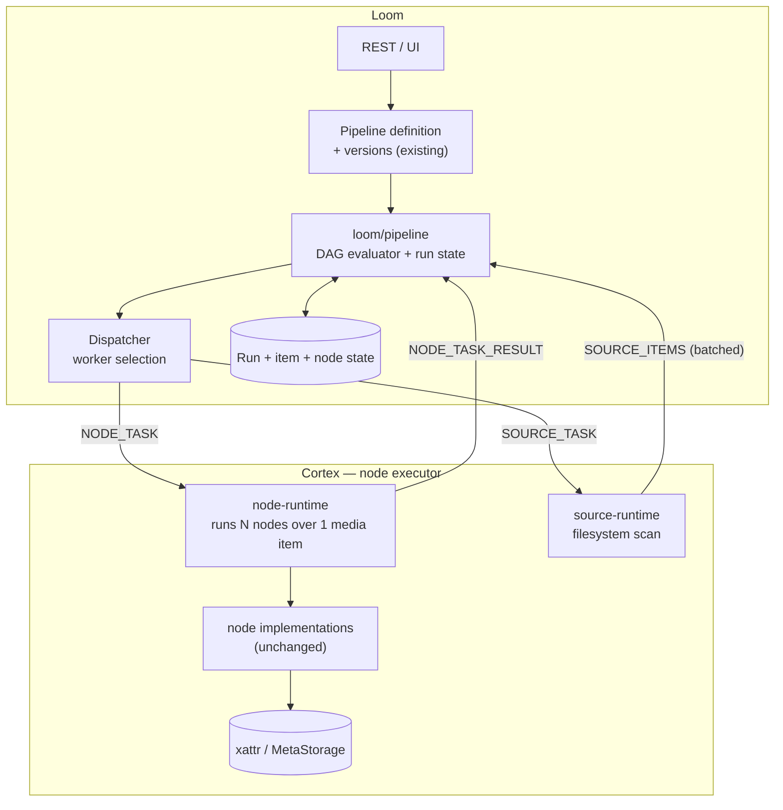
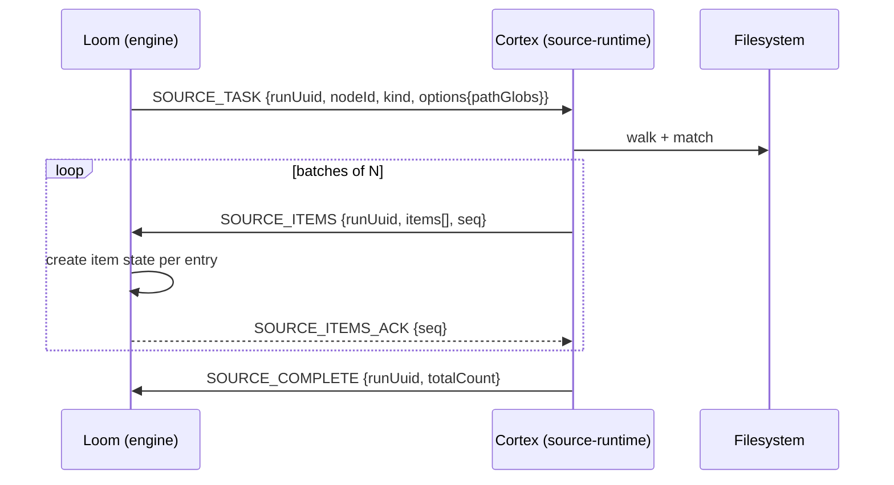

# Variant C — Implementation Plan

> **Status: PHASE 1 COMPLETE.** Steps P1.1–P1.7 have landed (§2.2, §2.7–§2.12).
> Loom owns the graph and drives execution one node at a time; the in-Cortex
> engine has been removed. **Phase 2 (durability, §6) has not started** — run
> state is still in memory, so a Loom restart loses in-flight runs.
>
> Phased implementation plan for **Variant C**: moving pipeline execution off
> Cortex and onto Loom, leaving Cortex as a node executor.
>
> **Design rationale, trade-offs, and the comparison against Variants A/B/D live
> in [METALOOM_ARCHITECTURE_V2.md](METALOOM_ARCHITECTURE_V2.md) §5 and §7.**
> This document does not re-argue the choice; it plans the work.
>
> **Current-state reference:**
> [METALOOM_ARCHITECTURE.md](METALOOM_ARCHITECTURE.md) ·
> [../features/pipeline/PIPELINE.md](../features/pipeline/PIPELINE.md)
>
> Verified against the code at `92bc115` on 2026-07-18.

---

## 1. Direction of travel

**Execution moves from Cortex → Loom.** Loom evaluates the graph and decides
what runs next; Cortex executes individual node invocations on request.

| | Today | Variant C |
|---|---|---|
| Holds the graph | Cortex (`DefaultPipeline`) | **Loom** |
| Decides what runs next | Cortex (`ReactivePipelineExecutor`) | **Loom** |
| Executes a node | Cortex | Cortex *(unchanged)* |
| Executes the source | Cortex | Cortex *(unchanged — see §5.4)* |
| Parses the definition | **both**, incompatibly | Loom only |

That last row is not a side note. Two of the three currently-broken end-to-end
paths exist purely because two parsers disagree; a single parser removes the
class of bug rather than fixing an instance of it.

---

## 2. Five findings that shape this plan

Established by reading the code, not the specs. Each one changes the work.

### 2.1 ✅ `filesystem-source` now exists — and fits this plan well

> **Updated 2026-07-18.** This was previously a 🔴 blocker: the kind had a
> descriptor only and resolved to a success-reporting stub. **It has since been
> implemented.** Phase 1 no longer starts by writing a source node.

What now exists:

| Artefact | Location |
|---|---|
| `FilesystemSourceNode` | `cortex/nodes/filesystem-source` |
| `FilesystemSourceNodeOptions` (defaults: `path`, `pathGlobs`) | same module |
| `FilesystemMediaScanner` (`expand(globs)`, `walk(root)`) | same module |
| `FilesystemSourceNodeModule` (Dagger) | same module |
| Factory registration for kind `filesystem-source` | `PipelineNodeFactoryModule` |
| Tests | `FilesystemSourceNodeTest`, `FilesystemSourceNodeOptionsTest` |

The executable set is now **6 of 29** kinds (`filesystem-source`, `sha512`,
`sha256`, `md5`, `chunk-hash`, `thumbnail`), not 5.

**This is better for the plan than a from-scratch node would have been**, because
of the SPI that came with it. `MediaSourceNode` exposes:

```java
Flowable<LoomMedia> stream();   // cold — walks on subscription
```

That is exactly the seam Variant C needs. The Cortex `source-runtime` (§5.4)
subscribes to `stream()` and forwards batches over the wire instead of into the
local engine. **The node is reused unchanged; only its sink changes.** Globs take
precedence over `root`, and both fall back to configured defaults — semantics
Phase 1 should preserve rather than reinvent.

Two residual caveats, both of which Phase 1 must handle:

- ⚠️ **It materialises the whole selection.** `FilesystemMediaScanner.expand()`
  and `walk()` both return `List<Path>`, so the entire file list is built in
  memory before the first item is emitted. The `MediaSourceNode` Javadoc
  explicitly advises against this — *"implementations should stream rather than
  materialise a full list where the selection may be large"* — so the node
  currently contradicts its own SPI's guidance. At 100 000 files this defeats
  the ack-based backpressure in §5.4, because Cortex has already paid the memory
  cost before the first batch is sent. **Converting the scanner to a lazy
  `Flowable` is Phase 1 work**, and it is worth doing regardless of Variant C —
  today's local engine has the same exposure.
- ⚠️ **The node has two roles that split across the boundary.** `stream()`
  enumerates; `process()` additionally returns `{path, source}` per item. In
  Variant C the enumeration happens on Cortex while per-item evaluation happens
  on Loom. Since the source's own `process()` output is trivially derivable from
  a `SourceItem`, **Loom should synthesise it rather than issuing a `NODE_TASK`
  back to Cortex for the source node** — one saved round trip per item, and it
  keeps the source's semantics in one place.

### 2.2 ✅ Loom depended on Cortex — inverted in P1.1

> **Resolved 2026-07-18 (step P1.1).** Previously `loom/services/rest`
> depended on **17** `cortex-*-api` modules for node descriptors, and
> `NodeDescriptorRegistry` lived in a *cortex* module under an
> `io.metaloom.loom.nodes.spec` **loom package** — the naming already conceded
> it was shared.

Investigation showed the situation was cleaner than it looked:

- Each `cortex/nodes/*-api` module contained **exactly one** class.
- **Only `loom/services/rest` consumed them** (4 files). No Cortex code imported
  `io.metaloom.loom.nodes.spec` at all, and node `core` modules did not depend
  on their sibling `api` module.
- All 27 classes already shared one package, so relocating them required **zero
  import changes** — only pom edits.

They were Loom artefacts living in the Cortex tree. Resolution:

| Change | Detail |
|---|---|
| New module | `loom-shared/node-model` (`loom-node-model`) — descriptor metadata only, no runtime dependency on either side |
| Moved | all 27 classes, package unchanged |
| Deleted | 17 `cortex/nodes/*-api` modules |
| `loom/services/rest` | 17 `cortex-*` deps → **1** `loom-node-model` dep; the Loom tree now has **no** `io.metaloom.cortex` pom reference |

⚠️ **The subtle part was `ServiceLoader`.** Providers are discovered via
`META-INF/services/io.metaloom.loom.nodes.spec.NodeDescriptorProvider`, and each
of the 16 provider modules shipped its own copy. Merging modules meant merging
16 service files into one — a change that fails *silently*: a dropped line
removes a node kind from validation and the UI palette while everything still
compiles and every other test still passes.

`NodeDescriptorServiceLoaderTest` in the new module guards this: it asserts 16
providers load, 29 kinds register, one kind from each former module is present,
and no kind is advertised twice. It was verified to actually fail (3 of 5 tests,
with a precise diagnostic) when a single service entry is removed.

### 2.3 ✅ The offline CLI path is unaffected

`cortex process run` goes through `FilesystemProcessorImpl`, which drives the
**legacy** `FilesystemNode` tree — not `PipelineExecutor`. Removing the pipeline
engine does not break offline batch processing.

**Consequence:** less risk than expected. But see §9.4 — "Cortex is useful
standalone" becomes a weaker claim, and that is a product decision.

### 2.4 ⚠️ Ten test classes depend on the executor harness

`AbstractPipelineNodeTest` builds a linear pipeline and runs the real executor.
Eight concrete node tests extend it (`MD5NodePipelineTest`,
`SHA512NodePipelineTest`, `ChunkHashNodePipelineTest`,
`ThumbnailNodePipelineTest`, `FingerprintNodePipelineTest`,
`LLMNodePipelineTest`, `FacedetectNodePipelineTest`, `WhisperNodePipelineTest`)
plus `AbstractFilterNodeTest`.

**Consequence:** when the executor leaves Cortex, that harness dies. A
replacement single-node harness is Phase 1 work, and it touches ten files. This
is the largest mechanical cost in Phase 1.

### 2.5 ⚠️ Phase 3 needs back what Phase 1 would delete

Affinity groups (Phase 3) require Cortex to run a *subgraph* locally — which is
a small DAG engine. Deleting `ReactivePipelineExecutor` outright in Phase 1 and
rewriting it in Phase 3 is waste.

**Consequence — the single most important planning decision here:** Phase 1
**shrinks and relocates** the engine rather than deleting it. Cortex keeps a
`node-runtime` that executes a *set* of nodes over one media item. In Phase 1
that set always has size 1. In Phase 3 it is a segment. Same code path, same
tests, no rewrite.

---

## 2.6 Decisions taken

Recorded 2026-07-18. These were the open questions blocking Phase 1 start.

| # | Question | Decision | Consequence |
|---|---|---|---|
| Q1 | Must standalone Cortex pipeline execution survive? | **No — Loom-only is acceptable** | `node-runtime` needs no local driver. Offline use is limited to the legacy `cortex process run --actions` path. ⚠️ The README and website claims about standalone use must be updated before Phase 1 ships |
| Q4 | Push or pull dispatch? | **Push for Phase 1** | Loom sends `NODE_TASK` when a node becomes ready. Accepted risk: Phase 2 leases favour pull, so the protocol will change twice |
| Q5 | Version the definition format? | **Yes, from the start** | The format gains `syncToLoom`, filter branches, and typed options; version it before the first breaking change rather than after |

**Sequencing:** Phase 1 is being executed step by step (P1.1 … P1.6, see §5), not
as one large change. Each step is independently reviewable and leaves the build
green.

### Step status

| Step | Scope | Status |
|---|---|---|
| **P1.1** | Invert the Loom→Cortex dependency; extract `loom-shared/node-model` | ✅ **done** — see §2.2 |
| **P1.2** | `loom/pipeline` module: graph model + engine against a fake dispatcher | ✅ **done** — see §2.7 |
| **P1.3** | Protocol: fix the envelope, add `SOURCE_*` / `NODE_TASK` messages | ✅ **done** — see §2.8 |
| **P1.4** | `cortex/node-runtime` + source runner; Cortex answers tasks | ✅ **done** — see §2.9 |
| **P1.5** | Test migration (10 classes, §5.8) | ✅ **done** — see §2.10 |
| **P1.6** | Wire end to end; run driven by the engine (§5.9) | ✅ **done** — see §2.11 |
| **P1.7** | Delete the old engine + rewire Dagger (deferred from P1.5) | ✅ **done** — see §2.12 |

**P1.1 verification:** full reactor `install` green; 5 new ServiceLoader guard
tests; 23 `PipelineValidationServiceTest` cases (the real descriptor consumer)
green; 187 Cortex node/pipeline tests green.

⚠️ **Pre-existing failure, unrelated to this work.**
`NodeDescriptorEndpointTest` has 2 of 6 tests failing
(`testListAllNodeDescriptors`, `testFilterNodesHaveFilterCategory`): the
endpoint returns a JSON *object* where the test decodes a JSON *array*, so the
client times out after 10 s. **Confirmed identical on the pre-change tree**, so
P1.1 neither caused nor fixed it. It should be fixed on its own — it is the only
coverage of the descriptor REST surface the UI palette depends on.

## 2.7 P1.2 — the engine, as built

Landed 2026-07-18. Two new modules, no behaviour change to the running system yet
(nothing calls the engine; P1.3 wires the protocol).

| Module | Contents |
|---|---|
| `loom-shared/pipeline-model` (`loom-pipeline-model`) | The wire contract: `NodeState`, `FilterBranch`, `MediaRef`, `NodeTask`, `NodeTaskResult`. Free of Vert.x and of both runtimes |
| `loom/pipeline` (`loom-pipeline`) | `PipelineGraph`, `PipelineGraphNode`, `PipelineGraphParser`, `NodeDispatcher` (SPI), `PipelineRunEngine`, `ItemState`, `RunSummary` |

**The schema defect is closed structurally.** `PipelineGraphParser` reads
`edges[]` — the shape the UI actually writes — and builds the full graph. It also
keeps reading `nodes[].dependencies[]` as a fallback so older Cortex-serde
definitions still load; `edges` wins when both are present. Because Variant C
leaves exactly one parser, the two formats cannot drift apart again.

Two gaps in the old Loom format are now expressible:

- **filter branches** — an edge may carry `"branch": "PASS" | "REJECT" | "ANY"`,
  which is what makes PASS/REJECT routing authorable from the UI at all;
- **`syncToLoom`, `blocking` and per-node `options`** — read from the node
  declaration. `blocking` defaults to **true** (failing open would hide upstream
  errors) and `syncToLoom` to **false** (results must be opted into).

⚠️ The parser *reads* these; `PipelineValidationService` and the UI editor do not
yet *write* them. Closing that is P1.3/P1.6 work.

**Ambiguity is now an error.** The previous loader picked the first
dependency-free node as the source, which is how a broken graph became a
plausible one-node run. `PipelineGraphParser` throws on: no source, more than one
declared source, several dependency-free candidates, dangling edge references,
duplicate ids, and cycles.

**Evaluation semantics are preserved deliberately** — they are what the Cortex
executor already does and what existing tests pin down:

| Rule | Behaviour |
|---|---|
| Readiness | a node runs once every dependency holds a terminal result |
| Failed dependency | skips the dependent node **if that node is blocking** — blocking is a property of the *dependent*, not the dependency |
| Skipped dependency | does **not** cascade |
| Filter branch | consults only *direct* conditional dependencies, so filter skipping is not transitive |
| Dry run | every node skipped, nothing dispatched |
| Disabled pipeline | completes immediately with no work |

Two decisions worth recording:

- **The source node is not dispatched.** Its `{path, source}` output is derivable
  from the discovered item, so Loom synthesises it — saving one network round
  trip per item (§2.1).
- **An undispatchable node fails rather than stalling.** If no worker accepts the
  task, the node is failed immediately instead of leaving the run waiting for a
  result that will never arrive.

**Verification:** 28 tests (13 parser, 15 engine), full reactor `install` green.
The engine is exercised through a `FakeNodeDispatcher`, so the entire evaluation
model is tested with no WebSocket, no worker and no database — which is why
`NodeDispatcher` is an interface.

`loom/pipeline` also carries a `maven-enforcer-plugin` rule banning
`io.metaloom.cortex:*`. It was verified to fail the build with a clear message
when a cortex dependency is added. The orchestrator/worker boundary is the point
of the module, and a convenient import is exactly how such a boundary gets
quietly undone.

## 2.8 P1.3 — the protocol, as built

Landed 2026-07-18. Loom can now dispatch node tasks and route replies; the Cortex
side that answers them is P1.4.

**The envelope no longer assembles itself by string concatenation.**
`ProcessorRegistry.dispatchWorkOrder` used to build
`"{\"type\":\"WORK_ORDER\",\"body\":" + json + "}"` by hand. It is now a generic
`send(nodeId, type, body)` that serialises a real `ProcessorMessage`, handles a
null body, and is type-checked rather than relying on a string literal.

**Six message types**, mirroring the design in §5.5:

| Loom → Cortex | Cortex → Loom |
|---|---|
| `SOURCE_TASK` | `SOURCE_ITEMS` |
| `SOURCE_ITEMS_ACK` | `SOURCE_COMPLETE` |
| `NODE_TASK` | `NODE_TASK_RESULT` |

**Five DTOs** in `loom-shared/rest-model/…/processor/message/`:
`SourceTaskMessage`, `SourceItemsMessage`, `SourceItemsAckMessage`,
`SourceCompleteMessage`, `NodeTaskResultMessage`. They reuse the pipeline wire
types rather than duplicating them — `rest-model` now depends on
`pipeline-model`, and `NodeTask`/`NodeTaskResult`/`MediaRef` gained Jackson
constructors so they serialise directly.

**Two new components in `loom/services/rest`:**

- `WebSocketNodeDispatcher` — the production `NodeDispatcher`. Selects a
  processor and sends `NODE_TASK`. Returns **false** when no worker is available
  or the socket died between selection and write, which is what lets the engine
  settle the node instead of waiting for a result that cannot arrive.
- `PipelineRunRegistry` — maps run id to engine so inbound messages can be
  routed. Self-cleaning: it deregisters on run completion, otherwise the map
  would grow for the process lifetime.

`ProcessorEndpoint` handles the three inbound types. Each `SOURCE_ITEMS` batch is
acknowledged, which is the only backpressure in the source path. A message for an
unknown or already-finished run is logged and dropped rather than treated as a
protocol error — a late reply is normal and must not disconnect a worker.

**Verification:** 13 new tests (11 protocol round-trip, 2 dispatcher). The
round-trip tests encode exactly as Loom does and decode exactly as Cortex will,
including a path containing quotes, backslashes, newlines and non-ASCII — the
contract is pinned *before* the Cortex side is written against it. Full reactor
build green; `ProcessorEndpointTest` (9) and `PipelineRunCompletionEndpointTest`
(8) still pass.

⚠️ **A clean rebuild was required.** Adding a constructor parameter to
`ProcessorEndpoint` left `DaggerLoomCoreComponent` in `loom/core` generated
against the old 7-argument factory, and all 9 `ProcessorEndpointTest` cases failed
with `NoSuchMethodError` until the reactor was rebuilt with `clean`. This is the
Dagger staleness gotcha the specs already warn about; expect it again in P1.4.

⚠️ **Known Phase 1 limitations, deliberate.** Dispatch is fire-and-forget: no
lease, no timeout, no retry, so a worker that accepts a task and then dies leaves
that node outstanding. Worker selection still hardcodes `CPU` because nothing yet
declares what a node kind needs. Run state remains in memory. All three are Phase
2 items.

## 2.9 P1.4 — the Cortex side, as built

Landed 2026-07-18. Cortex can now answer node tasks and stream a source; what
remains is migrating the old tests (P1.5) and wiring a run end to end (P1.6).

**Added, not swapped.** The old in-Cortex engine is untouched and still passing.
Deleting it before its ten dependent test classes are migrated would break the
build for the duration of P1.5, so the new path was built alongside and the
deletion moved into P1.5 where the tests move with it.

| Component | Role |
|---|---|
| `cortex/node-runtime` (`cortex-node-runtime`) | New module — the reduced executor |
| `NodeTaskRunner` | Runs a node over one media item and answers |
| `NodeResultMapper` | The single place internal and wire results meet |
| `SourceTaskRunner` | Enumerates a source, batches, waits for acks |
| `PipelineTaskHandler` (`cortex/core`) | Binds both runners to the protocol |
| `LoomControlChannel` | Now dispatches `NODE_TASK`, `SOURCE_TASK`, `SOURCE_ITEMS_ACK` |

**`NodeTaskRunner` runs a *set* of nodes over one media item**, where the set has
size 1 today. That shape is deliberate: affinity groups (Phase 3) dispatch a
subgraph so intermediate results stay in-process, and keeping the shape now makes
that a change of N rather than a rewrite. This is §2.5 honoured in code.

**The node factory and every producer are reused unchanged.** Options are
flattened onto the JSON node definition because that is where existing producers
read them from — `filesystem-source` reads `path` directly — so no producer
needed rewriting.

**The source node is reused unchanged too.** `PipelineTaskHandler` builds it via
the same factory and takes `MediaSourceNode.stream()`; only the sink differs.
Instead of feeding the local executor, batches go over the wire.

**Every dispatched task gets exactly one answer.** A node that throws, returns
null, or names an unregistered kind all come back as a definite `FAILED`. The
engine holds an item's progress until a result arrives, so a silently dropped
task would stall the run rather than fail it.

**Work runs on `Schedulers.io()`, never the WebSocket thread.** A transcription
task would otherwise stall heartbeats and every other message for minutes.

**Verification:** 17 tests (9 runner, 8 source). Full clean reactor build green;
all prior steps still pass — P1.1 (5), P1.2 (28), P1.3 (13), plus
`PipelineValidationServiceTest` (23), `ProcessorEndpointTest` (9),
`PipelineRunCompletionEndpointTest` (8), and the untouched Cortex pipeline tests
(32).

⚠️ **A real bug was caught by the cancel test.** `cancel()` released the ack latch,
which the scan loop could not distinguish from a genuine acknowledgement — so a
cancelled source carried on scanning and sending batches after the connection was
gone. Cancellation is now tracked separately from acking. Worth noting because
the failure mode was "keeps working after it should have stopped", which no
happy-path test would have surfaced.

⚠️ **The Dagger staleness gotcha recurred**, as predicted in §2.8: adding a
constructor parameter to `LoomControlChannel` required a full `clean` rebuild
before `DaggerCortexComponent` regenerated.

## 2.10 P1.5 — test migration, as built

Landed 2026-07-18. The ten test classes that depended on the in-Cortex executor
now run against a harness that does not need it, and the unambiguously dead code
is gone.

**`AbstractNodeChainTest` replaces `AbstractPipelineNodeTest`.** It executes nodes
in a linear chain directly — node 1, then node 2 with node 1's outputs — which is
exactly the guarantee the Loom engine offers a node, without scheduling,
concurrency or branch routing. The assertion surface is unchanged, so migrating
each node test was a one-line change of the `extends` clause.

| Migrated | How |
|---|---|
| 8 `*NodePipelineTest` classes | `extends` change; `testDryRunPipeline` rewritten onto `executeDryRun(...)` |
| `AbstractFilterNodeTest` | `route(...)` reimplemented on `executeWithBranches(...)`, preserving all 16 branch assertions |

**Deleted:**

- `MediaContext`, `PartitionedFlowable`, and `PipelineNode.apply()` /
  `isPartitioning()` / `partition()` — the reactive-operator API the executor
  never called. `AbstractFilterNode`'s overrides went with them.
- `PipelineSerializer` / `PipelineDeserializer` and their two tests. Loom owns
  the definition format now; a second parser is the defect this plan exists to
  remove.
- `AbstractPipelineNodeTest`.

### 🔶 The executor deletion was deferred to after P1.6 — deliberately

§5.7 lists `ReactivePipelineExecutor`, `DefaultPipeline`, `DefaultPipelineManager`
and `LoomPipelineLoader` for removal here. They are still present, and that is a
considered deviation rather than an omission.

Deleting them now would leave Cortex with **no working execution path at all**:
the old one gone, the new one not yet wired end to end. P1.6 is precisely the step
that proves the replacement and gets the demo pipelines green. Removing the
incumbent before its replacement is demonstrated gives up the ability to compare
behaviour at exactly the moment that comparison is most useful — and this document
already recommends the same discipline for V4 ("run both … until the queue path is
proven").

The cost is a temporary duplicate: 32 executor-specific tests
(`PipelineExecutorTest`, `PipelineRunCompletionTest`, `SourceDrivenExecutionTest`)
still run and still pass. They should be deleted together with the executor as the
first act of P1.7, along with rewiring `CortexBindModule` and reducing
`PipelineWorkOrderHandler` to `flush-sync`.

**Verification:** 136 pipeline-core tests green (including all 8 filter tests via
the reimplemented `route()`), 47 migrated node tests green, full clean reactor
build green, and every prior step still passing — P1.1 (5), P1.2 (28), P1.3 (13),
P1.4 (17), plus the Loom endpoint tests (17).

⚠️ **A pre-existing failure was confirmed, not introduced.** `MD5NodeTest`,
`SHA512NodeTest`, `SHA256NodeTest`, `ChunkHashNodeTest` and `HashMediaTest` fail
with `expected SUCCESS but was SKIPPED` — the nodes skip because their test media
is not processable in this environment. Verified identical on a stashed clean
tree. Unrelated to this work, but worth fixing: these are the hash nodes, which
are among the few genuinely executable kinds.

## 2.11 P1.6 — end to end, as built

Landed 2026-07-18. `POST /api/v1/pipelines/:uuid/run` now drives the Variant C
path: Loom parses the definition, owns the graph, and dispatches one node at a
time.

**The run endpoint was rewritten onto the engine:**

1. Parse the stored definition into a `PipelineGraph`. **A definition that cannot
   execute as drawn now returns `400` with the reason** instead of dispatching a
   run that would quietly do nothing — this is the single most important
   behavioural change in Phase 1.
2. Create the `pipeline_run` record.
3. Build a `PipelineRunEngine`, register completion into `PipelineRunTracker`,
   register the engine in `PipelineRunRegistry`, start it.
4. Dispatch a `SOURCE_TASK` for the graph's source node, with options taken from
   the definition and overridden by the request's `pathGlobs`.
5. Respond `202`.

Everything after that is driven by inbound messages: `SOURCE_ITEMS` creates
items, `SOURCE_COMPLETE` closes enumeration, and each `NODE_TASK_RESULT` advances
one item until the run closes itself.

**The old work-order machinery is gone from this path.** `WorkOrder`,
`WorkOrderType`, the `WorkOrderResultRegistry` callback and the 60-second
dispatch watchdog were all scaffolding for a dispatch model that no longer
exists — the engine closes its own run, so there is nothing for a watchdog to
guard. `mediaUuids` is still accepted and still unimplemented; it now warns
explicitly rather than being silently dropped.

**`PipelineRunEndToEndTest`** is the test this feature has never had. It starts
from the JSON the UI actually writes and drives a complete run against a scripted
worker: two files enumerated, `sha256` then `thumbnail` per item, run closed as
`SUCCESS`. It also covers a failed upstream skipping its blocking downstream, dry
run dispatching nothing, an empty selection closing immediately, a late message
for a finished run being ignored, and the envelope round trip.

That test is what the `edges[]`/`dependencies[]` defect needed: it asserts the
graph survives from stored definition through to a downstream node reading its
upstream's output. The first assertion — `assertEquals(3, graph.size())` — fails
if the graph ever collapses again.

**Verification:** 7 end-to-end tests green; full clean reactor build green; every
prior step still passing — P1.1 (5), P1.2 (28), P1.3 (13), P1.4 (17), P1.5
(136 + 47).

⚠️ **Two pre-existing failures confirmed by stashing the whole change and
rebuilding**, both unrelated:

- `CombinedEndpointTest.testBasics` — `404 Path not Found: /api/v1/locations`.
- 13 `*ModelBuilderTest` classes in `loom/services/rest` — 16 failures + 6 errors,
  **identical counts before and after**.

## 2.12 P1.7 — the old engine removed

Landed 2026-07-18, once P1.6 had proven the replacement. **Phase 1 is complete.**

**Deleted from Cortex:**

| Class | Superseded by |
|---|---|
| `ReactivePipelineExecutor` | `PipelineRunEngine` (Loom) + `NodeTaskRunner` (Cortex) |
| `DefaultPipeline`, `Pipeline` | `PipelineGraph` (Loom) |
| `DefaultPipelineManager`, `PipelineManager` | — Loom loads definitions from its own database |
| `PipelineExecutor`, `PipelineRunContext` | the `NODE_TASK` / `NODE_TASK_RESULT` protocol |
| `LoomPipelineLoader` | `PipelineGraphParser` (Loom) — the second parser is gone |

With it went `PipelineExecutorTest`, `PipelineRunCompletionTest`,
`SourceDrivenExecutionTest`, `PipelineWorkOrderHandlerTest` and
`PipelineIntegrationTest`.

**Rewired:**

- `PipelineWorkOrderHandler` reduced from four commands to one. `run-pipeline`,
  `reload-pipelines` and `list-pipelines` are meaningless now that Cortex holds
  no pipelines; only `flush-sync` remains, and it talks to the sync collector
  directly. An unknown command now **fails loudly** rather than falling through.
- `CortexBindModule` lost its `PipelineExecutor` and `PipelineManager` providers.
- `CortexBootstrapInitializer` lost the `NodeFactory` field that existed purely to
  force eager instantiation, because `RegistryNodeFactory` no longer pushes itself
  onto a loader as a construction side effect. That was flagged as "deliberate but
  fragile" in the original spec; it is now simply unnecessary.
- `PipelineNodeFactoryModule` (both the real one and the `examples/` copy) no
  longer wires a loader.
- `PipelinePersistenceIntegrationTest` was **rewritten rather than deleted**. It
  runs the nodes in the order Loom would dispatch them, so it still proves what it
  always did: node outputs reach Loom through `LoomNode` and are persisted.
- Stale `{@link}` javadoc pointing at the deleted classes was cleaned up rather
  than left dangling.

**Verification:** full clean reactor build green. 104 pipeline-core tests (down
from 136 — the 32 executor tests went with the executor), 28 loom/pipeline, 17
node-runtime, 43 loom REST pipeline tests, 17 loom endpoint tests, and the
migrated node tests all pass. No `ReactivePipelineExecutor`, `DefaultPipeline`,
`PipelineManager` or `LoomPipelineLoader` reference remains anywhere in Cortex.

### What Phase 1 achieved

- 🟢 **One parser.** Loom reads `edges[]` — the shape the UI writes. The
  `edges[]`/`dependencies[]` divergence cannot recur, because there is no second
  parser to diverge from.
- 🟢 **Unexecutable definitions fail loudly.** A graph that cannot run as drawn
  returns `400`; an unknown node kind, an ambiguous source and a cycle are all
  errors rather than a silently smaller run.
- 🟢 **Filter branches are expressible** from the stored format for the first time.
- 🟢 **The orchestrator no longer depends on its workers**, enforced by the build.
- 🟢 **A real end-to-end test exists** covering stored definition → dispatch →
  results → closed run.

---

## 3. Prerequisites

Variant C does not remove the need to fix what is broken. From
[METALOOM_ARCHITECTURE_TASK.md](METALOOM_ARCHITECTURE_TASK.md):

| Prerequisite | Why it blocks this plan |
|---|---|
| **Task 1** — unregistered kinds fail loudly | Otherwise Phase 1's "it works" criterion is unverifiable — a green run proves nothing |
| **Task 2–4** — results actually return | Phase 1 exit criteria include results landing on assets |
| **Task 9** — stable worker identity | Loom must address a specific worker per node task |
| **Task 10** — heartbeat timeout | A dead worker must stop receiving node tasks |
| **Task 14** — secured control channel | Node tasks carry more than today's work orders |
| **V11** — node capability whitelist | Loom must know which worker can run which kind |
| **V1** — shared storage decision | Workers must see the media a task names |

Tasks 1–4 and V11 are hard blockers. The rest can land alongside Phase 1 but
must precede Phase 2.

---

## 4. Target architecture



---

## 5. Phase 1 — restructuring and first delegation

**Goal:** a UI-authored pipeline executes end to end with **Loom driving**, one
node at a time, against **one** worker, with in-memory run state.

**Explicit non-goals** — deferred to Phase 2, and stating them keeps Phase 1
finishable:

- durability of execution state (a Loom restart may lose in-flight runs)
- retries, leases, timeouts on node tasks
- multi-worker scheduling or load awareness
- batching of node dispatch (source emission *is* batched — §5.4)
- per-node result persistence
- affinity or segments

### 5.1 Module layout

```
loom-shared/
  node-model/          # DONE (P1.1) — moved out of cortex/nodes/*-api
                       #   NodeDescriptor, NodeCategory, NodeInput/Output,
                       #   NodeParameter, NodeDescriptorRegistry,
                       #   + the 16 *DescriptorProvider impls and the merged
                       #   META-INF/services registry
  pipeline-model/      # DONE (P1.2) — wire types
                       #   PipelineDefinition, NodeDefinition, EdgeDefinition,
                       #   NodeResultDTO, NodeState, NodeOutputKey,
                       #   NodeTask, NodeTaskResult, SourceTask, SourceItem
loom/
  pipeline/            # DONE (P1.2) — the engine
                       #   PipelineGraph, PipelineGraphNode, PipelineGraphParser
                       #   PipelineRunEngine (replaces ReactivePipelineExecutor)
                       #   NodeDispatcher (SPI — impl lands in services/rest in P1.3)
                       #   ItemState, RunSummary (in-memory in Phase 1)
cortex/
  node-runtime/        # DONE (P1.4) — shrunk from pipeline-core
                       #   NodeTaskRunner: run N nodes over 1 media item
                       #   (N == 1 in Phase 1, a segment in Phase 3)
                       #   SourceTaskRunner: batched, ack-throttled enumeration
                       #   NodeResultMapper: internal <-> wire results
  pipeline-api/        # SHRINKS — keeps PipelineNode, NodeResult (internal),
                       #   AbstractPipelineNode; loses Pipeline, PipelineManager,
                       #   PipelineExecutor
  pipeline-core/       # SHRINKS — keeps node base classes + filters;
                       #   loses DefaultPipeline, executor, serde
  pipeline-common/     # KEEPS caches + sync; loses nothing initially
```

`loom/pipeline` must **not** depend on any `cortex-*` artifact. Enforce it with
the build (`maven-enforcer-plugin` banned-dependencies) so the boundary cannot
regress silently.

### 5.2 The shared-model split

`NodeResult` today is `io.metaloom.cortex.pipeline.api.NodeResult`, holding live
objects. It cannot go on the wire as-is.

**Keep two types, map at the boundary:**

| Type | Lives in | Purpose |
|---|---|---|
| `NodeResult` (internal) | `cortex/pipeline-api` | what a node returns in-process |
| `NodeResultDTO` (wire) | `loom-shared/pipeline-model` | what crosses the network |

Resist collapsing them into one. The internal type will grow
implementation-specific concerns; the wire type must stay stable and versioned.
Map once, in `node-runtime`.

Move the descriptor modules (§2.2) in the same change — that is what lets
`loom/services/rest` drop its ten `cortex-*-api` dependencies.

### 5.3 Definition parsing and the schema fix

Loom becomes the only parser. Concretely:

- `loom/pipeline` reads the Loom format (`nodes[]` + `edges[]`) — the one the UI
  writes and `PipelineValidationService` already validates.
- `LoomPipelineLoader` and the Cortex-side `PipelineDeserializer` are deleted.
- The `edges[]` vs `dependencies[]` divergence **cannot recur**, because there is
  no second parser.

This closes [PIPELINE_TASKS](../features/pipeline/PIPELINE_TASKS.md) Task 1
structurally. If Variant C proceeds, do **not** separately fix the Cortex loader
first — that work would be thrown away.

⚠️ Loom's format still lacks `syncToLoom` and `conditionalDependencies` (filter
branches). Phase 1 must extend it for both, or result sync and filter routing
stay broken. Coordinate with [Task 4](METALOOM_ARCHITECTURE_TASK.md).

**Per-node options are a partial exception.** The `filesystem-source` work
established a precedent: its factory producer reads `path` and `pathGlobs`
directly off the node definition, falling back to configured defaults. So
per-node options *are* already carried for at least one kind — but ad hoc, read
by each producer rather than through a declared schema. Phase 1 should
generalise this into a typed `options` object validated against
`NodeDescriptor.parameters`, and keep the defaults-fallback behaviour that node
already has.

### 5.4 Source execution

The source node stays on Cortex and streams discovered media to Loom.



Decisions:

- **Batch from day one.** A 100 000-file scan must not become 100 000 WebSocket
  frames. Default batch 250 items. This is the one place Phase 1 cannot defer
  batching.
- **Ack-based backpressure.** Cortex waits for `SOURCE_ITEMS_ACK` before sending
  the next batch. Crude but sufficient, and it prevents a fast scanner from
  burying a slow engine. Credit-based flow control can come in Phase 2.
- **A source item is a reference, not content:** absolute path, size, mtime.
  **Do not hash in the source** — hashing is a node, and doing it in the source
  hides cost and breaks the model.
- `SOURCE_COMPLETE` carries the total so Loom knows when discovery ended; a run
  cannot complete before it arrives.
- **Synthesise the source node's own result on Loom** rather than round-tripping
  a `NODE_TASK` for it (§2.1) — its `{path, source}` output is derivable from
  the `SourceItem`.

**Reuses existing code (§2.1).** `FilesystemSourceNode` and its
`MediaSourceNode.stream()` contract already provide the enumeration; the
`source-runtime` subscribes and forwards batches instead of feeding the local
engine.

**Required change:** make the scan lazy. `FilesystemMediaScanner.expand()` and
`walk()` return `List<Path>`, materialising the full selection before the first
emission, which defeats the backpressure above. Convert them to a lazy
`Flowable<Path>` walk. This is a genuine improvement to the existing node, not
Variant C scaffolding — the local engine benefits identically.

### 5.5 Node task protocol

New message types on the existing processor WebSocket:

| Type | Direction | Body |
|---|---|---|
| `SOURCE_TASK` | Loom → Cortex | runUuid, nodeId, kind, options |
| `SOURCE_ITEMS` | Cortex → Loom | runUuid, seq, items[] |
| `SOURCE_ITEMS_ACK` | Loom → Cortex | runUuid, seq |
| `SOURCE_COMPLETE` | Cortex → Loom | runUuid, totalCount, error? |
| `NODE_TASK` | Loom → Cortex | taskUuid, runUuid, itemUuid, nodeId, kind, options, media{path, sha512?}, upstream{} |
| `NODE_TASK_RESULT` | Cortex → Loom | taskUuid, state, durationMs, outputs{}, message? |

⚠️ **Fix the envelope first.** `ProcessorRegistry.dispatchWorkOrder` currently
builds its message by **string concatenation**
(`"{\"type\":\"WORK_ORDER\",\"body\":" + json + "}"`). That is survivable for
today's small work orders and a liability for a protocol carrying node payloads.
Replace it with real serialisation before adding any message type.

**Upstream results.** A node needs its upstream outputs. Phase 1 ships them
inline in `NODE_TASK`, but **only the keys the node declares it needs** —
`NodeDescriptor` already models `inputs`. Use it. Inline shipping of large
values (thumbnails, embeddings, transcripts) is a known Phase 2 problem
(§6.5); Phase 1 should assert a payload size ceiling and fail loudly above it
rather than silently degrading.

### 5.6 The engine

`loom/pipeline` in Phase 1 is deliberately simple:

1. Load definition → `PipelineGraph` (topological order, cycle check — reuse the
   existing Kahn's implementation from `PipelineValidationService`).
2. Dispatch the source task; on each `SOURCE_ITEMS` batch, create item states.
3. Per item, compute the ready set: nodes whose blocking dependencies are
   `COMPLETED` and whose filter branch matches.
4. Dispatch one `NODE_TASK` per ready node.
5. On `NODE_TASK_RESULT`, record it, recompute the ready set, dispatch again.
6. When every item is terminal and the source is complete, roll up the run.

Preserve today's semantics exactly — they are tested and understood:

- a `FAILED` **blocking** dependency skips the dependent node
- a `SKIPPED` dependency does **not** cascade
- filter branches follow `filter_passed` on a *direct* conditional dependency
- dry-run skips every node

Where Phase 1 differs from today, say so in the code: run state is in-memory,
there are no retries, and there is exactly one worker.

`NodeDispatcher` is an interface in `loom/pipeline`, implemented in
`loom/services/rest` over the processor WebSocket — so the engine is testable
with a fake dispatcher and no WebSocket at all.

### 5.7 What leaves Cortex

| Deleted | Reduced to |
|---|---|
| `ReactivePipelineExecutor` | `NodeTaskRunner` in `cortex/node-runtime` (§2.5) |
| `DefaultPipeline`, `DefaultPipelineManager` | — (Loom owns the graph) |
| `LoomPipelineLoader`, `RegistryNodeFactory` stub fallback | node-kind registry only |
| `PipelineSerializer` / `PipelineDeserializer` | — (Loom owns the format) |
| `PipelineWorkOrderHandler` run/reload/list commands | `flush-sync` retained |
| `MediaContext`, `PartitionedFlowable`, `apply()`/`partition()` | — **dead code today**; delete, do not port |

**Kept unchanged:** every node implementation, `AbstractPipelineNode`,
`AbstractFilterNode` and the 8 filters, `CortexNodeAdapter`, MetaStorage, the
caches, and the legacy CLI path.

### 5.8 Test migration

| Work | Detail |
|---|---|
| **New** `AbstractNodeTaskTest` on Cortex | Invokes one node with synthetic upstream results. Must keep the ergonomics of today's `execute(media, nodes...)` so the ten dependants (§2.4) migrate mechanically |
| **Migrate** 8 node tests + `AbstractFilterNodeTest` | Assertions stay; only the harness changes |
| **Move + rewrite** `PipelineExecutorTest` | Into `loom/pipeline`, against a fake `NodeDispatcher`. Keep every existing case: DAG ordering, skip semantics, filter branches, dry-run, disabled pipeline |
| **New** protocol round-trip tests | Every new message type, both directions |
| **New** source streaming tests | Batching, ack backpressure, empty result, unreadable path |
| **New** loader/parser test | The absent `LoomPipelineLoader` test is why the schema bug survived — its replacement must not repeat that |
| **New** end-to-end test | Definition → source → 2 nodes → results on assets, with a real Cortex |

### 5.9 Exit criteria

Phase 1 is done when **all** hold:

- [ ] A UI-authored pipeline (`filesystem-source → sha512 → thumbnail`) runs end
      to end, driven by Loom, against one Cortex.
- [ ] The graph executes **as drawn** — verified by asserting node count and
      order, not by a green run.
- [ ] Results land on assets in Postgres.
- [ ] The three seeded demo pipelines execute.
- [ ] No `cortex-*` dependency remains in `loom/services/rest` or
      `loom/pipeline`, enforced by the build.
- [ ] All ten migrated node tests pass.
- [ ] `cortex process run` still works (regression check on the legacy path).
- [ ] A node kind no worker supports fails loudly.

---

## 6. Phase 2 — durability and correctness

Phase 1 proves the model. **Phase 2 makes it survive contact with production.**
The theme: *it works → **it survives** → it scales.*

Nothing here is optional if Variant C is to be run in anger — Phase 1's
in-memory state means a Loom restart strands every in-flight item mid-graph.

### 6.1 Durable execution state

The core of the phase. Per-run, per-item, per-node state in Postgres:

```
pipeline_run          (exists)
pipeline_run_item     NEW — uuid, run_uuid, media_path, sha512, state, created
pipeline_node_task    NEW — uuid, item_uuid, node_id, state, attempt,
                            leased_by, lease_expires_at, started, finished,
                            duration_ms, error, outputs JSONB
```

Follow the project's DB convention: Flyway migration → jOOQ regeneration →
`db/api` DAO → **both** jooq and memory impls → `db/api-test` contract test.

This simultaneously closes long-standing gaps: **A-PE3** (per-node stats table),
**A-PE4** (intermediate node results on Loom), and **R10** — none of which have
a home today. That is a real bonus and worth sequencing here rather than later.

⚠️ **Write volume is the risk.** 100 000 items × 10 nodes = 1 000 000 task rows
per run. Bulk upserts, not row-at-a-time. Consider retaining terminal task rows
only in aggregate after a retention window.

### 6.2 Node task lifecycle

- **Leases with expiry** — a task leased to a worker that dies returns to
  pending. This is the same mechanism as [V4](METALOOM_ARCHITECTURE_V2_TASK.md)
  and must not be built twice.
- **Retries with backoff**, capped by `attempt`. This is finally where
  `retryFailed` — advertised by 10 descriptors and read by nothing — becomes
  real.
- **Per-task timeouts**, enforced by Loom rather than only by the worker.
- **Dead-letter** after N attempts, retaining the error history.
- **Idempotency.** A task must be safely re-executable: key on
  `(itemUuid, nodeId, pipelineVersion)`. Duplicate delivery is inevitable once
  retries exist.

### 6.3 Scheduling across workers

Phase 1 targets one worker. Phase 2 makes it a pool:

- Filter candidates by the **node whitelist** (V11) and capability.
- Prefer workers by live load — after fixing `cpuLoad`
  ([Task 7](METALOOM_ARCHITECTURE_TASK.md)); scheduling on today's broken metric
  would be worse than not scheduling.
- **Per-run concurrency ceiling** so one large run cannot consume the fleet.
- Park rather than fail when no worker supports a kind, with a timeout.

### 6.4 Flow control end to end

Phase 1 backpressures only the source. Phase 2 needs a global bound: cap
in-flight items per run and per worker, and stop pulling from the source when
the cap is reached. Without this, a fast scan and slow nodes produce unbounded
item state.

### 6.5 Large payload handling

Inline upstream results (§5.5) do not survive real data — embeddings,
thumbnails, and transcripts are large and are exactly what downstream nodes
consume.

Options, to be decided with measurements:

| Option | Note |
|---|---|
| Content-addressed side channel | Worker fetches by hash over REST; Loom stores once |
| Shared storage handoff | Write to the shared mount, pass a reference — cheap if V1 chose a shared mount |
| Keep worker-local + affinity | Pre-figures Phase 3; avoids the transfer entirely |

The third is the reason affinity exists. Do not over-invest here before Phase 3.

### 6.6 Observability

- Per-node events with **origin attribution** (which worker ran it).
- Run inspection API: where is each item, what failed, what is retrying.
- Metrics ([Task 15](METALOOM_ARCHITECTURE_TASK.md)) — dispatch latency, queue
  depth, per-kind failure rate.
- ⚠️ **Do not forward per-item-per-node events to the UI.** At 100 000 items
  that is a flood. Aggregate — see §7.3.

### 6.7 Phase 2 exit criteria

- [ ] A Loom restart mid-run resumes without losing or duplicating work.
- [ ] A killed worker's in-flight tasks are reassigned and complete.
- [ ] A poison item dead-letters with history instead of retrying forever.
- [ ] A run spreads across ≥3 workers, respecting whitelists.
- [ ] A 100 000-item run completes without unbounded memory or DB write stalls.

---

## 7. Phase 3 — full DAG, batching, affinity

### 7.1 The DAG manager

Phases 1–2 give a correct-but-naive evaluator. Phase 3 makes it a real
scheduler.

**What it should own:**

| Concern | Responsibility |
|---|---|
| Topology | Immutable graph per pipeline *version*; cached, never re-parsed per item |
| Item state | Which nodes are done / running / pending / failed / skipped |
| Readiness | Which nodes are dispatchable now — deps satisfied, branch resolved |
| Placement | Which worker, how many items batched |
| Assimilation | Record results, unblock downstream, detect terminal state |
| Policy | Retry/backoff, timeout, priority, quota per node kind |
| Accounting | Per-run and per-kind resource usage |

**Resilience mechanisms:**

- **Idempotent, durable, resumable** — every decision reconstructible from
  persisted state. No scheduler state that exists only in memory.
- **Leases everywhere.** Worker death, hangs, partitions, and scale-down all
  reduce to "the lease expired". One mechanism, not four.
- **Circuit breaker per node kind.** If `whisper` fails on 90% of tasks across
  workers, stop dispatching it and surface that, rather than burning the fleet
  and the dead-letter queue. This is the highest-value resilience feature and
  the one most often omitted.
- **Bulkheads.** Per-run and per-kind concurrency ceilings so one pathological
  run or one broken node kind cannot starve everything else.
- **Poison detection.** An item failing the same node repeatedly is quarantined
  with its history — never retried indefinitely.
- **Graceful degradation.** No worker for a kind → park with a timeout, not an
  immediate run failure. Workers come and go.

**Reacting to load and faults:**

- **Adaptive dispatch width** from live worker load and queue depth, rather than
  a fixed concurrency number.
- **Priority with aging** — pipeline priority plus run priority, with aging so
  low-priority runs cannot starve forever.
- **Node-kind-aware pacing.** A `whisper` task costs seconds; a `md5` task costs
  milliseconds. One dispatch policy cannot serve both — pace per kind.
- **Straggler handling.** Optional speculative re-dispatch of the slowest
  outstanding tasks near run end. Expensive; measure before adopting.
- **Drain-aware placement.** Never place work on a worker that announced
  `TERMINATING`.

### 7.2 Batching

The concern raised — that per-asset processing could overwhelm the API — is
correct, and it applies on **four** axes, not just events:

| Axis | Batch what | Notes |
|---|---|---|
| Source | discovered items | already batched in Phase 1 (§5.4) |
| Dispatch | N items × same node × same worker in one `NODE_TASK_BATCH` | the biggest win; turns 1 000 000 messages into ~4 000 |
| Results | N results in one `NODE_TASK_RESULT_BATCH` | symmetric; same win |
| Persistence | bulk upserts of task state | 1 000 000 row-at-a-time writes will not work |

**Adaptive sizing:** batch large for cheap nodes (hashing — 500+), small for
expensive ones (whisper — 1). Fixed batch sizes get this wrong in both
directions. Derive it from observed per-task duration per kind.

**Partial batch failure** must be explicit: a batch result reports per-item
outcomes, never a single status for the whole batch. Getting this wrong turns
one bad file into 500 failed items.

### 7.3 Event aggregation

Distinct from batching and easy to overlook. Today every node × every item emits
tracking events forwarded to every UI subscriber. At 100 000 items × 10 nodes
that is millions of events for a UI that renders a progress bar.

- Aggregate to per-node counters, pushed on a timer (the existing `NODE_STATS`
  shape, done properly and with `pending` no longer hardcoded to 0).
- Emit per-item events **only** for failures and terminal states.
- Let a client opt into a detailed stream for a *single* item when debugging.

### 7.4 Affinity groups

The mechanism that keeps Variant C's round trips from dominating — and the
reason §2.5 says not to delete the engine.

- Definition gains `affinity: "<group>"` per node
  ([V12](METALOOM_ARCHITECTURE_V2_TASK.md)).
- Loom computes **segments**: maximal connected subgraphs sharing an affinity
  group *and* executable by one worker's whitelist.
- Dispatch becomes `SEGMENT_TASK` — a mini-pipeline plus item(s).
- Cortex's `node-runtime` runs the segment locally with results staying in
  memory. **This is the Phase 1 runner with N > 1** — no new engine.
- Results return once per segment, not once per node.

**Default to one group per pipeline.** A default of "each node its own group"
silently makes every pipeline maximally chatty. Distribution must be deliberate.

**Validate satisfiability at save time.** A group spanning `sha512` and
`facedetect` needs one worker permitted to run both; if none exists, say so
precisely at save rather than failing as an empty run.

For video, this is where the performance case is won: decode-once,
analyse-many stays in one process instead of re-reading the file per node.

---

## 8. Sequencing summary

| Phase | Theme | Ends when |
|---|---|---|
| **0** | Prerequisites (§3) | Silent failures are gone; whitelist exists |
| **1** | It works | Loom drives a real pipeline over one worker, in memory |
| **2** | It survives | Restart-safe, retrying, multi-worker, durable state |
| **3** | It scales | Real scheduler, batching everywhere, affinity segments |

Phase 1 is a **refactor with a working demo**, not a production system. Do not
let it acquire Phase 2 scope; the module boundaries and the protocol are the
deliverable.

---

## 9. Risks

### 9.1 🔴 Granularity — the defining risk

Hashing a small file takes milliseconds; a round trip is comparable or worse.
Phase 1 will be **slower than today** on small files, possibly much slower, and
that is expected rather than a defect. The mitigations are Phase 3 (batching and
affinity).

**Guard against it:** benchmark at the end of Phase 1 against the Variant A
baseline ([V0](METALOOM_ARCHITECTURE_V2_TASK.md)). If the gap is worse than
roughly 5× on a hash-only pipeline, reconsider before starting Phase 2 —
Variant D reaches most of the same goal without ever paying this cost.

### 9.2 🔴 Loom becomes a stateful scheduler and a per-step SPOF

Today Loom is involved at run start and finish. Afterwards it is on the path of
every node transition. Its availability and write throughput become the ceiling
for all processing.

### 9.3 ⚠️ Payload size

§6.5. Inline upstream results work for hashes and break for embeddings,
transcripts, and thumbnails — the outputs that matter most.

### 9.4 ⚠️ Standalone Cortex weakens

`cortex process run` survives (§2.3), but it drives the *legacy* node tree. After
Phase 1, Cortex cannot execute a pipeline without Loom. The README markets
Cortex as un-opinionated and usable offline at scale.

**This is a product decision, not an engineering one, and it should be made
before Phase 1 starts.** If standalone pipeline execution must survive, the
`node-runtime` needs a local driver — which is Phase 3's segment runner with the
segment being the whole graph. Cheap if planned, expensive if retrofitted.

### 9.5 ⚠️ Test migration is the bulk of Phase 1's mechanical cost

Ten test classes (§2.4), plus new protocol, source, and engine tests. Budget for
it explicitly; it is easy to under-estimate and it is what protects the refactor.

---

## 10. Open questions

1. **Does standalone Cortex pipeline execution need to survive?** (§9.4) —
   answer before Phase 1.
2. **Where do intermediate results live?** (§6.5) — inline, side channel, shared
   storage, or avoided via affinity.
3. **Task state retention.** 1 000 000 rows per run is real. How long are
   per-node task rows kept, and at what granularity after that?
4. **Is `NODE_TASK` dispatch pull or push?** Push is simpler for Phase 1; pull
   composes better with leases and worker-side backpressure in Phase 2. Choosing
   pull later means changing the protocol twice.
5. **Does the definition format become versioned?** It must gain `syncToLoom`,
   filter branches, options, and later affinity — four breaking changes to
   stored JSONB. Version it now.
6. **Is Variant D the better target after all?** (§9.1) — Phase 1 is largely
   shared between C and D, so this can be answered *after* Phase 1 with real
   numbers rather than guessed ones. That is a deliberate property of this plan.

---

## 11. Progress Assessment

- [x] Code-verified findings that reshape the plan (§2)
- [x] **P1.1 landed** — Loom→Cortex dependency inverted, `loom-shared/node-model`
      created, 17 `cortex/nodes/*-api` modules deleted, ServiceLoader merge
      guarded by a test proven to fail on a dropped entry
- [x] **P1.2 landed** — `loom-shared/pipeline-model` + `loom/pipeline`; the
      `edges[]` schema defect closed structurally; filter branches expressible;
      28 tests against a fake dispatcher; cortex dependency banned by the build
- [x] **P1.3 landed** — string-concatenated envelope replaced; 6 message types and
      5 DTOs added; `WebSocketNodeDispatcher` + `PipelineRunRegistry`; inbound
      routing in `ProcessorEndpoint`; 13 protocol round-trip tests
- [x] **P1.7 landed** — `ReactivePipelineExecutor`, `DefaultPipeline`,
      `PipelineManager` and `LoomPipelineLoader` deleted; work-order handler
      reduced to `flush-sync`; Dagger rewired. **Phase 1 complete**
- [x] **P1.6 landed** — the run endpoint drives `PipelineRunEngine`; an
      unexecutable definition now returns 400 instead of a silent no-op run; the
      work-order watchdog removed; `PipelineRunEndToEndTest` covers a full run
      from stored definition to closed run
- [x] **P1.5 landed** — `AbstractNodeChainTest` replaces the executor-based
      harness; 9 test classes migrated; dead reactive-operator API and the Cortex
      serde deleted. Executor removal deferred to P1.7 with reasoning (§2.10)
- [x] **P1.4 landed** — `cortex/node-runtime` with `NodeTaskRunner` and
      `SourceTaskRunner`; control channel answers `NODE_TASK` / `SOURCE_TASK` /
      `SOURCE_ITEMS_ACK`; 17 tests. Added **additively** — the old engine is
      untouched and still passing, so nothing is broken before P1.5 migrates its
      tests
- [x] §2.1 updated 2026-07-18 — `filesystem-source` is implemented; the
      `MediaSourceNode.stream()` SPI turns out to be the right seam for Phase 1
- [ ] **Make `FilesystemMediaScanner` lazy** (§2.1) — it materialises the whole
      selection, defeating source backpressure. Worth fixing today, independent
      of Variant C
- [x] Prerequisites mapped to existing task lists
- [x] Phase 1 scoped with explicit non-goals and exit criteria
- [x] Module layout, shared-model split, and dependency inversion specified
- [x] Source-node streaming designed with batching and backpressure from day one
- [x] Node task protocol specified
- [x] Deletion list separated from the "shrink, don't delete" decision (§2.5)
- [x] Test migration cost identified and sized
- [x] Phase 2 proposed: durability, leases, retries, scheduling, flow control
- [x] Phase 3: DAG manager proposal, four-axis batching, event aggregation,
      affinity segments
- [x] Risks and open questions recorded
- [ ] **Standalone-Cortex decision** (Q1) — blocks Phase 1 start
- [ ] **Definition format versioning decision** (Q5) — blocks Phase 1 schema work
- [ ] **Push vs pull dispatch decision** (Q4) — cheap now, expensive later
- [ ] Phase 1 benchmark against the Variant A baseline (§9.1)
- [ ] Task state retention policy (Q3)

---

_Git HEAD revision: `92bc1153e50c43efb65e4d78874823c9ec1f4408`_
_Last updated: 2026-07-18 19:50 UTC_
