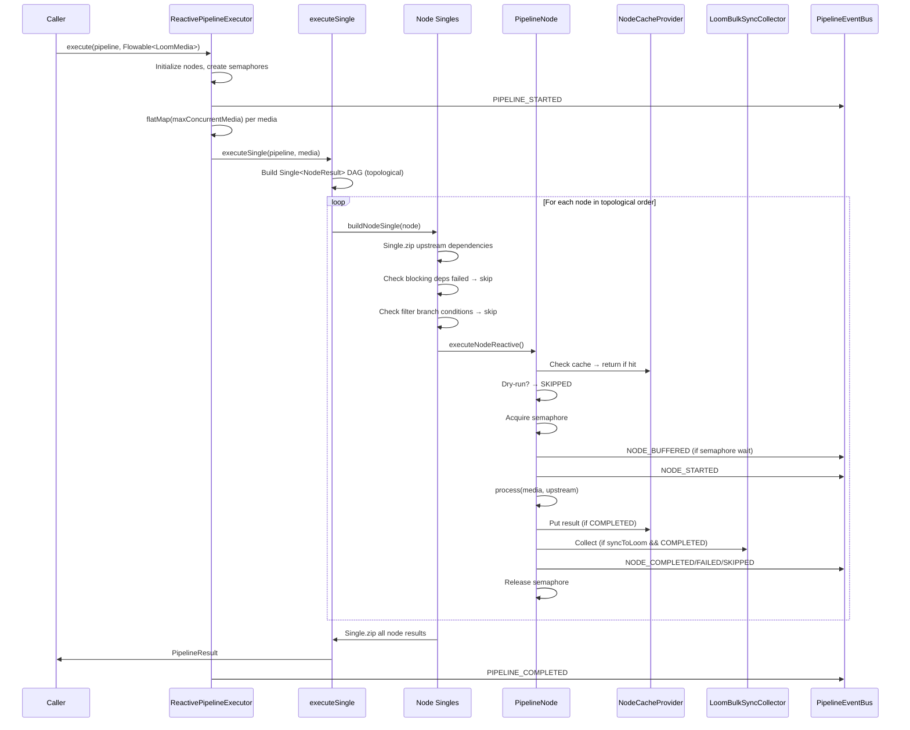

# Cortex Pipeline System Specification

> This document describes the Cortex pipeline execution engine — the reactive DAG-based processing system that runs media assets through a graph of nodes. It covers the pipeline architecture, node model, execution model, serialization, caching, bulk sync, event bus, and integration with the Loom backend.
>
> **Source of truth**: the code under `cortex/pipeline-api/`, `cortex/pipeline-core/`, `cortex/pipeline-common/`. This spec is a companion guide, not a replacement for reading the code.
>
> **Related specs**: [NODES.md](NODES.md) for the node lifecycle and concrete processing nodes, [CORTEX.md](CORTEX.md) for overall Cortex architecture, [LOOM.md](../loom/LOOM.md) for Loom backend integration.

---

## 1. Overview

The Cortex pipeline system is a **reactive, backpressure-aware DAG execution engine** built on **RxJava 3**. It processes streams of `LoomMedia` items through a directed acyclic graph of `PipelineNode` instances, with support for:

- **Per-node concurrency control** via semaphores
- **Filter-based branching** (PASS/REJECT branches)
- **Result caching** (in-memory, xattr, sidecar, layered)
- **Bulk synchronization** to Loom backend
- **Event tracking** for observability and UI integration
- **JSON serialization** for pipeline definitions stored in Loom
- **Two-node-hierarchy bridging** via `CortexNodeAdapter`

### Key Concepts

| Concept | Description |
|---------|-------------|
| **Pipeline** | A named, prioritized DAG with exactly one source node |
| **PipelineNode** | A processing unit with id, mode, concurrency, dependencies |
| **NodeResult** | Outcome of a node execution (COMPLETED, FAILED, SKIPPED) |
| **PipelineResult** | Aggregated result for one media item across all nodes |
| **FilterBranch** | Conditional execution based on upstream filter output (PASS/REJECT/ANY) |
| **NodeCacheProvider** | Pluggable cache for node results (heap, xattr, sidecar, layered) |
| **LoomBulkSyncCollector** | Batches sync-eligible node results for bulk upload to Loom |
| **PipelineEventBus** | Dual-channel event bus (node completion + lightweight tracking) |

---

## 2. Architecture Diagram

```mermaid
graph TB
    subgraph "Pipeline Definition (Loom DB)"
        PD[Pipeline JSON Definition]
    end
    
    subgraph "Cortex Pipeline Engine"
        PL[PipelineManager] -->|register| DP[DefaultPipeline]
        DP -->|topological sort| TN[Topological Node List]
        TN --> RE[ReactivePipelineExecutor]
        
        RE -->|per media| ESM[executeSingle]
        ESM -->|build DAG| NS[Single<NodeResult> per node]
        NS -->|Single.zip| PR[PipelineResult]
        
        RE -->|concurrency| SEM[Semaphore per node]
        RE -->|cache| NCP[NodeCacheProvider]
        RE -->|sync| LSC[LoomBulkSyncCollector]
        RE -->|events| PEB[PipelineEventBus]
    end
    
    subgraph "Node Hierarchies"
        PN[PipelineNode] --> APN[AbstractPipelineNode]
        APN --> AFN[AbstractFilterNode]
        APN --> CNA[CortexNodeAdapter]
        CNA --> FN[FilesystemNode (legacy)]
        FN --> AMN[AbstractMediaNode]
        AMN --> CN[Concrete Nodes: Hash, FaceDetect, Whisper, etc.]
    end
    
    subgraph "Loom Backend"
        LDB[(Loom DB)]
        LDB -->|GET /pipelines| PL
        PEB -->|tracking events| LWS[Processor WebSocket]
        LWS -->|broadcast| UIWS[UI WebSocket /api/v1/pipelines/events/ws]
        LSC -->|bulk API| LREST[Loom REST API]
    end
    
    PD --> LDB
    PL -->|loadAndRegister| LDB
```

---

## 3. Module Structure

```
cortex/
├── pipeline-api/          # Public interfaces (SPI)
│   ├── Pipeline.java
│   ├── PipelineExecutor.java
│   ├── PipelineManager.java
│   ├── PipelineResult.java
│   ├── NodeResult.java
│   ├── NodeState.java
│   ├── NodeMode.java
│   ├── MediaContext.java
│   ├── PartitionedFlowable.java
│   ├── node/
│   │   └── PipelineNode.java
│   ├── filter/
│   │   ├── FilterBranch.java
│   │   ├── PipelineFilter.java
│   │   └── MediaFilter.java
│   ├── event/
│   │   ├── PipelineEventBus.java
│   │   ├── NodeCompletionEvent.java
│   │   └── PipelineTrackingEvent.java
│   ├── cache/
│   │   └── NodeCacheProvider.java
│   └── sync/
│       └── LoomBulkSyncCollector.java
│
├── pipeline-core/         # Implementation
│   ├── DefaultPipeline.java
│   ├── DefaultPipelineManager.java
│   ├── executor/
│   │   └── ReactivePipelineExecutor.java
│   ├── node/
│   │   ├── AbstractPipelineNode.java
│   │   ├── CortexNodeAdapter.java
│   │   ├── AssetSourceNode.java
│   │   ├── LoomFetchNode.java
│   │   └── filter/
│   │       ├── AbstractFilterNode.java
│   │       ├── MimeTypeFilterNode.java
│   │       ├── DateFilterNode.java
│   │       ├── SizeFilterNode.java
│   │       ├── DuplicateFilterNode.java
│   │       ├── BlacklistFilterNode.java
│   │       ├── QualityFilterNode.java
│   │       ├── ThresholdFilterNode.java
│   │       ├── AssetAttributeFilterNode.java
│   │       └── SamplingFilterNode.java
│   └── serde/
│       ├── PipelineSerializer.java
│       └── PipelineDeserializer.java
│
└── pipeline-common/       # Shared utilities
    ├── event/
    │   └── DefaultPipelineEventBus.java
    ├── cache/
    │   ├── NoOpNodeCache.java
    │   ├── HeapNodeCache.java
    │   ├── XAttrNodeCache.java
    │   ├── SidecarFileNodeCache.java
    │   └── LayeredNodeCache.java
    └── sync/
        └── DefaultLoomBulkSyncCollector.java
```

---

## 4. Core API Reference (pipeline-api)

### 4.1 Pipeline Interface

```java
public interface Pipeline {
    String name();
    String description();
    int priority();
    boolean isEnabled();
    boolean isDryRun();
    PipelineNode sourceNode();
    List<PipelineNode> nodes();           // Topological order
    PipelineNode node(String nodeId);     // Lookup by id
}
```

**Construction**: `DefaultPipeline.builder("name").description("...").priority(100).enabled(true).dryRun(false).source(sourceNode).build()`

**Validation**:
- Exactly one source node required (validated in builder)
- Node IDs must match `^[a-z0-9]([a-z0-9\-]{0,62}[a-z0-9])?$` (lowercase alphanumeric + hyphens, 1-64 chars)
- No dependency cycles (Kahn's algorithm throws `IllegalStateException`)

### 4.2 PipelineNode Interface

```java
public interface PipelineNode {
    // Identity
    String id();
    String name();
    boolean isSource();
    
    // Execution config
    NodeMode mode();              // SEQUENTIAL | PARALLEL
    boolean isBlocking();         // Downstream waits if true
    int concurrency();            // Semaphore permits
    boolean syncToLoom();         // Collect for bulk sync
    
    // Dependencies (computed from connectTo graph)
    Set<String> dependencies();
    Map<String, FilterBranch> conditionalDependencies();
    List<PipelineNode> children();
    
    // Wiring
    PipelineNode connectTo(PipelineNode downstream);
    PipelineNode connectTo(PipelineNode downstream, FilterBranch branch);
    
    // Processing
    NodeResult process(LoomMedia media, Map<String, NodeResult> upstreamResults);
    
    // Reactive operator (default wraps process in flatMap)
    Flowable<MediaContext> apply(Flowable<MediaContext> input);
    
    // Filter partitioning
    boolean isPartitioning();
    PartitionedFlowable<MediaContext> partition(Flowable<MediaContext> input);
    
    // Config & lifecycle
    Map<String, Object> options();
    NodeCacheProvider cacheProvider();
    void initialize();
    void shutdown();
    
    // Standard filter output key
    String FILTER_PASSED = "filter_passed";
}
```

### 4.3 NodeState Enum

```java
enum NodeState {
    PENDING,      // Not yet started
    RUNNING,      // Currently executing
    COMPLETED,    // Success with outputs
    FAILED,       // Exception or error
    SKIPPED       // Disabled, filtered, dry-run, cache hit
}
```

### 4.4 NodeResult Class

```java
public final class NodeResult {
    private final String nodeId;
    private final NodeState state;
    private final long durationMs;
    private final String message;
    private final Map<String, Object> output;  // Immutable copy
    
    // Factories
    static NodeResult success(String nodeId, long durationMs);
    static NodeResult success(String nodeId, long durationMs, Map<String, Object> output);
    static NodeResult failed(String nodeId, long durationMs, String message);
    static NodeResult skipped(String nodeId, String reason);  // durationMs = 0
    
    // Accessors
    <T> T getOutput(String key);  // Unchecked cast
    <T> T getOutput(NodeOutputKey<T> key);  // Type-safe
}
```

**Common output keys**: `sha512`, `md5`, `sha256`, `description`, `transcript`, `tags`, `embedding`, `image`, `answer`, `filter_passed`, `filter_reason`

### 4.5 PipelineResult Class

```java
public final class PipelineResult {
    private final String pipelineName;
    private final LoomMedia media;
    private final Map<String, NodeResult> nodeResults;
    private final long totalDurationMs;
    private final boolean dryRun;
    
    boolean isSuccess();  // All nodes COMPLETED or SKIPPED
}
```

### 4.6 FilterBranch Enum

```java
enum FilterBranch {
    ANY,      // Execute regardless (default for regular deps)
    PASS,     // Execute only if filter output filter_passed == true
    REJECT    // Execute only if filter output filter_passed == false
}
```

### 4.7 MediaContext & PartitionedFlowable

```java
// Immutable carrier for reactive streams
public interface MediaContext {
    LoomMedia getMedia();
    Map<String, NodeResult> getUpstreamResults();
    MediaContext withResult(String nodeId, NodeResult result);
    MediaContext merge(MediaContext other);
}

// Filter branch output
public interface PartitionedFlowable<T> {
    Flowable<T> pass();
    Flowable<T> reject();
}
```

### 4.8 PipelineExecutor Interface

```java
public interface PipelineExecutor {
    // Blocking single-item
    PipelineResult execute(Pipeline pipeline, LoomMedia media);
    
    // Reactive stream (backpressure-aware)
    Flowable<PipelineResult> execute(Pipeline pipeline, Flowable<LoomMedia> media);
    
    // Batch convenience
    List<PipelineResult> executeBatch(Pipeline pipeline, List<LoomMedia> media);
    
    // Sync & lifecycle
    int flushSync();
    void shutdown();
}
```

### 4.9 PipelineManager Interface

```java
public interface PipelineManager {
    void register(Pipeline pipeline);
    void unregister(String name);
    List<Pipeline> pipelines();  // Sorted by priority DESC
    Optional<Pipeline> pipeline(String name);
    Optional<Pipeline> resolve(LoomMedia media);  // Highest-priority enabled
}
```

### 4.10 PipelineEventBus Interface

```java
public interface PipelineEventBus {
    // Node completion (full fidelity)
    void publish(NodeCompletionEvent event);
    String subscribe(String nodeId, Consumer<NodeCompletionEvent> listener);
    String subscribeAll(Consumer<NodeCompletionEvent> listener);
    
    // Tracking (lightweight, WebSocket-friendly)
    void publishTracking(PipelineTrackingEvent event);
    String subscribeTracking(Consumer<PipelineTrackingEvent> listener);
    
    void unsubscribe(String handle);
    void clear();
}
```

### 4.11 PipelineTrackingEvent

```java
public class PipelineTrackingEvent {
    enum Type {
        PIPELINE_STARTED, PIPELINE_COMPLETED,
        NODE_STARTED, NODE_COMPLETED, NODE_FAILED, NODE_SKIPPED, NODE_BUFFERED
    }
    
    private final Type type;
    private final String pipelineName;
    private final String nodeId;
    private final String mediaPath;
    private final long timestamp;
    private final long durationMs;
    private final String message;
}
```

---

## 5. Node Model & Hierarchy

### 5.1 Two Parallel Hierarchies

| Hierarchy | Base Interface | Base Class | Purpose |
|-----------|---------------|------------|---------|
| **Pipeline-level** (DAG) | `PipelineNode` | `AbstractPipelineNode` | DAG execution, reactive streams, filter branching |
| **Cortex-level** (legacy/CLI) | `CortexNode<I, T>` | `AbstractCortexNode` → `AbstractFilesystemNode` → `AbstractMediaNode` | Direct CLI invocation, standalone processing |

**Bridge**: `CortexNodeAdapter` wraps a `FilesystemNode` as a `PipelineNode`.

### 5.2 AbstractPipelineNode

```java
public abstract class AbstractPipelineNode implements PipelineNode {
    // Immutable constructor params
    protected AbstractPipelineNode(String id, String name, NodeMode mode, 
                                   boolean blocking, int concurrency, boolean syncToLoom)
    
    // Mutable via setters
    void setSource(boolean source);
    void setSyncToLoom(boolean syncToLoom);
    void setCacheProvider(NodeCacheProvider cacheProvider);
    void addDependency(String parentId);                    // For deserialization
    void setConditionalDependency(String parentId, FilterBranch branch);
    
    // Abstract - must implement
    NodeResult process(LoomMedia media, Map<String, NodeResult> upstreamResults);
}
```

### 5.3 AbstractFilterNode

```java
public abstract class AbstractFilterNode extends AbstractPipelineNode {
    // Template method
    protected abstract boolean evaluate(LoomMedia media, Map<String, NodeResult> upstreamResults);
    
    // Optional override
    protected String rejectReason(LoomMedia media, Map<String, NodeResult> upstreamResults);
    
    // Always emits { filter_passed: boolean, filter_reason: String }
    // isPartitioning() = true
    // partition() splits Flowable via share() + filter()
}
```

**Concrete filters** (in `pipeline-core`):
- `MimeTypeFilterNode` — filters by MIME type patterns
- `DateFilterNode` — filters by date range
- `SizeFilterNode` — filters by file size
- `DuplicateFilterNode` — filters duplicates
- `BlacklistFilterNode` — filters blacklisted paths
- `QualityFilterNode` — filters by quality thresholds
- `ThresholdFilterNode` — generic threshold filter
- `AssetAttributeFilterNode` — filters by Loom asset attributes
- `SamplingFilterNode` — probabilistic sampling

### 5.4 Built-in Pipeline Nodes

| Node | ID | Type | Description |
|------|-----|------|-------------|
| `AssetSourceNode` | `asset-source` | Source | Emits a single pre-configured `LoomMedia` |
| `LoomFetchNode` | `loom-fetch` | Processor | Fetches user metadata (tags, annotations) from Loom |
| `CortexNodeAdapter` | (wrapped node's name) | Processor | Bridges legacy `FilesystemNode` to pipeline |

---

## 6. Execution Model (ReactivePipelineExecutor)

### 6.1 Constructor Variants

```java
new ReactivePipelineExecutor(int maxConcurrentMedia);
new ReactivePipelineExecutor(int maxConcurrentMedia, PipelineEventBus eventBus);
new ReactivePipelineExecutor(int maxConcurrentMedia, PipelineEventBus eventBus, 
                             LoomBulkSyncCollector syncCollector);
```

### 6.2 Execution Flow



### 6.3 Concurrency Model

| Level | Mechanism | Configuration |
|-------|-----------|---------------|
| **Media-level** | `Flowable.flatMap(fn, maxConcurrentMedia)` | `ReactivePipelineExecutor(maxConcurrentMedia)` |
| **Per-node** | `Semaphore(node.concurrency())` | `PipelineNode.concurrency()` (e.g., hasher=4, whisper=1, llm=4) |
| **Node mode** | `NodeMode.PARALLEL` vs `SEQUENTIAL` | `PipelineNode.mode()` |
| **Blocking** | `isBlocking()` — downstream waits | `PipelineNode.isBlocking()` |

### 6.4 Dependency Resolution

Before executing a node, the executor checks:

1. **Blocking failure**: If any blocking dependency has `state == FAILED` → skip with `"Dependency X failed"`
2. **Filter branch**: For each entry in `conditionalDependencies()`:
   - If required branch is `PASS` but filter output `filter_passed == false` → skip
   - If required branch is `REJECT` but filter output `filter_passed == true` → skip
   - `ANY` (default) never skips

### 6.5 Caching Integration

```java
NodeCacheProvider cache = node.cacheProvider() != null 
    ? node.cacheProvider() 
    : NoOpNodeCache.INSTANCE;

Optional<NodeResult> cached = cache.get(node.id(), media);
if (cached.isPresent()) {
    return cached.get();  // Skip execution, emit cached result
}

// ... execute node ...

if (result.getState() == NodeState.COMPLETED) {
    cache.put(node.id(), media, result);
}
```

### 6.6 Dry-Run Mode

When `pipeline.isDryRun() == true`:
- No node `process()` is called
- All nodes return `NodeResult.skipped(nodeId, "dry-run")`
- Tracking events: `NODE_SKIPPED` with message `"dry-run"`
- Useful for testing pipeline graphs without side effects

### 6.7 Error Handling

- Exceptions in `process()` → caught by `.onErrorReturn()` → `NodeResult.failed(nodeId, 0, e.getMessage())`
- Tracking event: `NODE_FAILED` with exception message
- Failed node does not stop pipeline; downstream nodes evaluate blocking/filter conditions

---

## 7. Pipeline Serialization (JSON)

### 7.1 PipelineSerializer

```java
@Singleton
public class PipelineSerializer {
    @Inject ObjectMapper mapper;
    
    String serialize(Pipeline pipeline);
    ObjectNode toObjectNode(Pipeline pipeline);
}
```

**Output structure**:

```json
{
  "name": "video-analysis",
  "description": "Full processing for video",
  "priority": 100,
  "enabled": true,
  "dryRun": false,
  "sourceNode": "filesystem",
  "nodes": [
    {
      "id": "sha512",
      "name": "SHA-512 Hash",
      "type": "processor",
      "mode": "PARALLEL",
      "blocking": true,
      "concurrency": 4,
      "syncToLoom": true,
      "dependencies": ["filesystem"],
      "conditionalDependencies": {},
      "options": {},
      "children": ["tika", "fingerprint"]
    }
  ],
  "tree": {
    "root": "filesystem",
    "branches": {
      "filesystem": ["sha512"],
      "sha512": ["tika", "fingerprint"]
    }
  }
}
```

**Node `type` inference**:
- `isSource()` → `"source"`
- Class name contains `FilterNode`/`AbstractFilterNode` → `"filter"`
- Otherwise → `"processor"`

### 7.2 PipelineDeserializer

```java
@Singleton
public class PipelineDeserializer {
    @Inject ObjectMapper mapper;
    
    void setNodeResolver(NodeResolver resolver);
    Pipeline deserialize(String json);
    Pipeline fromJsonNode(JsonNode root);
}
```

**NodeResolver SPI**:

```java
@FunctionalInterface
public interface NodeResolver {
    PipelineNode resolve(String id, JsonNode def);
}
```

- If resolver returns `null`, a `DeserializedNode` stub is used (logs and returns success)
- Used by `LoomPipelineLoader` to replace stubs with real `CortexNodeAdapter`-wrapped nodes

### 7.3 Round-Trip Guarantee

`serialize → deserialize → serialize` yields identical JSON (tested in `PipelineSerdeRoundTripTest`). Preserved fields:
- Node ids, names, mode, blocking, concurrency, syncToLoom
- Dependencies, conditionalDependencies, options
- Pipeline name, description, priority, enabled, dryRun, sourceNode

---

## 8. Caching (NodeCacheProvider)

### 8.1 SPI

```java
public interface NodeCacheProvider {
    Optional<NodeResult> get(String nodeId, LoomMedia media);
    void put(String nodeId, LoomMedia media, NodeResult result);
    void invalidate(String nodeId, LoomMedia media);
    void clear();
}
```

**Cache key**: `nodeId + ":" + (media.getSHA512() != null ? media.getSHA512() : media.absolutePath())`

### 8.2 Implementations

| Implementation | Description | Use Case |
|----------------|-------------|----------|
| `NoOpNodeCache.INSTANCE` | Singleton, always empty | Default when node returns `null` |
| `HeapNodeCache` | Caffeine, maxSize=10k, TTL=60min | Single-instance, development |
| `XAttrNodeCache` | Linux extended attributes on media file | Persistent, file-local |
| `SidecarFileNodeCache` | `.json` sidecar files next to media | Persistent, portable |
| `LayeredNodeCache` | Chained providers (e.g., heap → xattr → sidecar) | Multi-tier with back-fill |

### 8.3 Configuration

Attached per-node via `AbstractPipelineNode.setCacheProvider(NodeCacheProvider)`. No global binding in Dagger today.

---

## 9. Bulk Sync to Loom (LoomBulkSyncCollector)

### 9.1 SPI

```java
public interface LoomBulkSyncCollector {
    void collect(LoomMedia media, String nodeId, NodeResult result);
    int flush();      // Returns count flushed
    int pending();    // Unflushed count
}
```

### 9.2 DefaultLoomBulkSyncCollector

```java
public class DefaultLoomBulkSyncCollector implements LoomBulkSyncCollector {
    public DefaultLoomBulkSyncCollector(BulkSyncWriter writer, int batchSize);
    public DefaultLoomBulkSyncCollector(BulkSyncWriter writer);  // batchSize=100
    
    // Auto-flushes when buffer >= batchSize
    // On write failure: re-adds batch to buffer for retry
}
```

**SyncEntry**: Tuple of `(LoomMedia, nodeId, NodeResult)`

**BulkSyncWriter** (functional interface):

```java
@FunctionalInterface
public interface BulkSyncWriter {
    void writeBulk(List<SyncEntry> entries) throws Exception;
}
```

### 9.3 Integration

- Only nodes with `syncToLoom() == true` are collected
- Collected only when node result state is `COMPLETED`
- `ReactivePipelineExecutor.flushSync()` called at end of batch execution
- Cortex Dagger module provides `LoomBulkSyncCollector` via `CortexBindModule`

---

## 10. Event Bus & Tracking

### 10.1 Dual Channels

| Channel | Event Type | Use Case |
|---------|------------|----------|
| **Node Completion** | `NodeCompletionEvent` | Internal coordination, sync collection, caching |
| **Tracking** | `PipelineTrackingEvent` | High-volume observability, WebSocket forwarding to UI |

### 10.2 NodeCompletionEvent

```java
public class NodeCompletionEvent {
    private final String nodeId;
    private final LoomMedia media;
    private final NodeResult result;
    private final long timestamp;
}
```

### 10.3 PipelineTrackingEvent

```java
public class PipelineTrackingEvent {
    enum Type {
        PIPELINE_STARTED, PIPELINE_COMPLETED,
        NODE_STARTED, NODE_COMPLETED, NODE_FAILED, NODE_SKIPPED, NODE_BUFFERED
    }
    // Scalar fields only: type, pipelineName, nodeId, mediaPath, timestamp, durationMs, message
}
```

### 10.4 Loom Integration (Processor WebSocket)

```
Cortex PipelineEventBus.subscribeTracking()
    → LoomControlChannel.forwardPipelineTrackingEvent()
    → Processor WebSocket (/api/v1/processors/ws)
    → Loom ProcessorEndpoint.handlePipelineEvent()
    → PipelineEventBroadcaster.broadcast()
    → UI WebSocket (/api/v1/pipelines/events/ws)
```

**Message type alignment**: `PipelineTrackingEvent.Type` names match `PipelineEventType` in `loom-shared/rest-model` (plus `NODE_STATS` on Loom side).

---

## 11. CortexNodeAdapter (Bridging Legacy Nodes)

### 11.1 Purpose

Wraps a legacy `FilesystemNode<?, ?>` (from `cortex/nodes/`) as a `PipelineNode` so it can participate in DAG execution.

### 11.2 Constructors

```java
// Default: uses wrappedNode.name() for both id and display name
new CortexNodeAdapter(FilesystemNode<?, ?> wrappedNode, 
                      NodeMode mode, boolean blocking, int concurrency);

// Override pipeline node id (useful when downstream expects specific upstream id)
new CortexNodeAdapter(String id, FilesystemNode<?, ?> wrappedNode,
                      NodeMode mode, boolean blocking, int concurrency);
```

### 11.3 Key Behaviors

| Aspect | Behavior |
|--------|----------|
| `isSource()` | `true` iff wrapped node implements `SourceNode` |
| Upstream conversion | `Map<String, NodeResult>` → `Map<String, Map<String, Object>>` for `NodeContext.upstreamOutputs()` |
| State mapping | Legacy `SUCCESS` → `COMPLETED`, `SKIPPED` → `SKIPPED`, `FAILED` → `FAILED` |
| Output forwarding | Legacy `NodeResult.getOutputs()` → pipeline `NodeResult` output map |
| `initialize()` | Delegates to `wrappedNode.initialize()` |

### 11.4 Common ID Mismatch Example

`LoomNode` reads `ctx.upstreamOutput("md5sum", "md5")` but `MD5Node.name()` is `"md5"`. Solution:

```java
new CortexNodeAdapter("md5sum", md5Node, PARALLEL, true, 1);
```

---

## 12. Pipeline Loading from Loom

### 12.1 LoomPipelineLoader

```java
@Singleton
public class LoomPipelineLoader {
    @Inject LoomClient loomClient;
    @Inject PipelineManager pipelineManager;
    
    void setNodeFactory(NodeFactory factory);
    int loadAndRegister();  // GET /api/v1/pipelines, build & register
}
```

### 12.2 Pipeline Definition JSON (Loom format)

```json
{
  "filters": { "mimeTypes": ["video/*"], "pathGlobs": ["**/*.mp4"] },
  "nodes": [
    {
      "id": "sha512",
      "name": "SHA-512 Hash",
      "mode": "PARALLEL",
      "blocking": true,
      "concurrency": 4,
      "syncToLoom": true,
      "dependencies": ["filesystem"],
      "options": {},
      "source": false,
      "type": "processor"
    }
  ]
}
```

### 12.3 NodeFactory SPI

```java
public interface NodeFactory {
    PipelineNode createNode(JsonObject nodeDef);
}
```

**Default implementation**: `RegistryNodeFactory` — maps `nodeDef.getString("type")` to producer functions registered at startup (typically from Dagger module with access to concrete cortex nodes).

---

## 13. Configuration Reference

### 13.1 Cortex-Side (Dagger)

| Setting | Location | Default |
|---------|----------|---------|
| `maxConcurrentMedia` | `CortexBindModule.providePipelineExecutor()` | `4` |
| Node concurrency | `AbstractPipelineNode` constructor / `CortexNodeAdapter` | Per-node (e.g., hash=4, whisper=1) |
| Node mode | `AbstractPipelineNode` constructor | `PARALLEL` |
| Blocking | `AbstractPipelineNode` constructor | `true` |
| `syncToLoom` | `AbstractPipelineNode.setSyncToLoom()` / constructor | `false` |
| Cache provider | `AbstractPipelineNode.setCacheProvider()` | `null` → `NoOpNodeCache` |
| Pipeline `dryRun`/`enabled`/`priority` | JSON definition from Loom | From definition |
| Control channel WS | `LoomControlChannel.resolveEndpoint()` from `LoomClientOptions` | Disabled if not configured |

### 13.2 Loom-Side

| Setting | Description |
|---------|-------------|
| Pipeline permissions | `CREATE_PIPELINE`, `READ_PIPELINE`, `UPDATE_PIPELINE`, `DELETE_PIPELINE` |
| WS broadcast | No throttling; track event volume if adding types |

---

## 14. Testing Patterns

### 14.1 Unit Tests (PipelineExecutorTest)

Location: `cortex/pipeline-core/src/test/java/io/metaloom/cortex/pipeline/core/PipelineExecutorTest.java`

**Covers**:
- Multi-node DAG execution with dependency ordering
- Per-node concurrency limiting via semaphores
- Cache hit/miss with `HeapNodeCache`
- Dry-run mode (all nodes SKIPPED)
- Disabled pipeline (empty results)
- Event bus subscription/filtering
- `syncToLoom` + `DefaultLoomBulkSyncCollector` integration
- Cycle detection (throws `IllegalStateException`)
- `PipelineManager` priority resolution

**Test doubles**:
- `TestNode` — sleeps `delayMs`, logs execution order
- `OutputTestNode` — emits configurable output map
- `StubLoomMedia` — no-op `LoomMedia` factory (`ofFile`, `ofBytes`)

### 14.2 Node Pipeline Tests (AbstractPipelineNodeTest)

**Base class**: `cortex/pipeline-core/src/test/java/io/metaloom/cortex/pipeline/test/AbstractPipelineNodeTest.java`

**Provides**:
- `execute(media, PipelineNode...)` — builds linear `AssetSourceNode → n1 → n2 → ...`
- `executeWithSync(media, LoomBulkSyncCollector, PipelineNode...)` — with sync collector
- `adapt(FilesystemNode)` / `adapt(node, mode, blocking, concurrency)` — wrap legacy node
- `assertCompletionEvent(nodeId)` / `assertTrackingEvent(nodeId, Type)` — event assertions

**Pattern**:

```java
class MyNodePipelineTest extends AbstractPipelineNodeTest {
    @TempDir File tempDir;
    
    @Test
    void testOutputChaining() {
        LoomMedia media = StubLoomMedia.ofBytes(tempDir, "data.bin", "payload");
        CortexNodeAdapter node = adapt(new SHA512Node(null, opts, new HashNodeOptions()));
        CapturingNode capture = new CapturingNode("consumer", "sha512", "sha512");
        
        PipelineResult result = execute(media, node, capture);
        
        assertThat(result).isSuccess().hasCompletedNode("sha512");
        assertThat(capture.capturedValues()).containsExactly(expectedSha512);
        assertCompletionEvent("sha512");
        assertTrackingEvent("sha512", PipelineTrackingEvent.Type.NODE_COMPLETED);
    }
}
```

**AssertJ helpers** (use instead of raw assertions):
- `PipelineResultAssert`, `PipelineNodeResultAssert`, `PipelineAssertions` in `cortex/pipeline-core/src/test/.../assertj/`
- Legacy node asserts in `cortex/core-media/src/test/.../assertj/`

**Canonical examples** (all extend `AbstractPipelineNodeTest`):
- `MD5NodePipelineTest`, `SHA512NodePipelineTest`, `ChunkHashNodePipelineTest`
- `FingerprintNodePipelineTest`, `ThumbnailNodePipelineTest`
- `LLMNodePipelineTest`, `FacedetectNodePipelineTest`, `WhisperNodePipelineTest`

---

## 15. Key Classes Reference

| Class | Package | Purpose |
|-------|---------|---------|
| `DefaultPipeline` | `io.metaloom.cortex.pipeline.core` | Pipeline DAG builder, topological sort |
| `DefaultPipelineManager` | `io.metaloom.cortex.pipeline.core` | Registry, priority resolution |
| `ReactivePipelineExecutor` | `io.metaloom.cortex.pipeline.core.executor` | RxJava 3 reactive execution engine |
| `AbstractPipelineNode` | `io.metaloom.cortex.pipeline.core.node` | Base pipeline node implementation |
| `AbstractFilterNode` | `io.metaloom.cortex.pipeline.core.node.filter` | Filter node base (PASS/REJECT branching) |
| `CortexNodeAdapter` | `io.metaloom.cortex.pipeline.core.node` | Bridges legacy `FilesystemNode` to pipeline |
| `AssetSourceNode` | `io.metaloom.cortex.pipeline.core.node` | Single-asset source node |
| `LoomFetchNode` | `io.metaloom.cortex.pipeline.core.node` | Fetches metadata from Loom |
| `PipelineSerializer` | `io.metaloom.cortex.pipeline.core.serde` | Pipeline → JSON |
| `PipelineDeserializer` | `io.metaloom.cortex.pipeline.core.serde` | JSON → Pipeline (with NodeResolver) |
| `DefaultPipelineEventBus` | `io.metaloom.cortex.pipeline.common.event` | Dual-channel event bus |
| `HeapNodeCache` | `io.metaloom.cortex.pipeline.common.cache` | Caffeine in-memory cache |
| `XAttrNodeCache` | `io.metaloom.cortex.pipeline.common.cache` | Extended attribute cache |
| `SidecarFileNodeCache` | `io.metaloom.cortex.pipeline.common.cache` | Sidecar file cache |
| `LayeredNodeCache` | `io.metaloom.cortex.pipeline.common.cache` | Multi-layer cache with back-fill |
| `DefaultLoomBulkSyncCollector` | `io.metaloom.cortex.pipeline.common.sync` | Batches sync-eligible results for Loom |
| `LoomPipelineLoader` | `io.metaloom.cortex.pipeline.loader` | Loads pipelines from Loom REST API |
| `RegistryNodeFactory` | `io.metaloom.cortex.pipeline.loader` | Maps JSON node types to concrete nodes |

---

## 16. Environment Variables

| Variable | Component | Description | Default |
|----------|-----------|-------------|---------|
| `LOOM_HOST` | Cortex | Loom backend host for control channel | — |
| `LOOM_PORT` | Cortex | Loom backend port for control channel | — |
| `LOOM_WS_PATH` | Cortex | WebSocket path (default `/api/v1/processors/ws`) | `/api/v1/processors/ws` |
| `CORTEX_PIPELINE_MAX_CONCURRENT` | Cortex | `maxConcurrentMedia` for executor | `4` (hardcoded in Dagger) |
| `CORTEX_PIPELINE_DRY_RUN` | Cortex | Global dry-run mode | `false` |

---

## 17. Conventions and Gotchas

| Area | Convention / Gotcha |
|------|---------------------|
| **Node IDs** | Must match `^[a-z0-9]([a-z0-9\-]{0,62}[a-z0-9])?$` — lowercase, hyphens, 1-64 chars |
| **Exactly one source** | `DefaultPipeline` validates this; `PipelineManager.resolve()` expects it |
| **Two NodeResult classes** | Pipeline: `io.metaloom.cortex.pipeline.api.NodeResult`; Legacy: `io.metaloom.cortex.api.node.NodeResult` — adapter maps between them |
| **Two NodeState enums** | Pipeline: `PENDING/RUNNING/COMPLETED/FAILED/SKIPPED`; Legacy: `SUCCESS/SKIPPED/FAILED` — not unified |
| **Filter branch defaults** | Regular deps default to `FilterBranch.ANY`; only filter deps need explicit `PASS`/`REJECT` |
| **Cache key uses SHA-512** | Falls back to absolute path if hash not available — ensure upstream hash node runs first |
| **CortexNodeAdapter ID override** | Use `new CortexNodeAdapter("custom-id", node, ...)` when downstream expects specific upstream ID |
| **syncToLoom only on COMPLETED** | Failed/skipped results are not collected |
| **Dry-run skips all nodes** | No `process()` calls, no cache writes, no sync collection |
| **Semaphore per executor instance** | Shared across pipeline runs; not reset between `execute()` calls |
| **Event bus synchronous** | Listeners run on publisher thread; avoid blocking operations |
| **JSON serialization** | Uses Jackson `ObjectMapper` (Dagger `@Singleton`); `type` field inferred, not stored |
| **LoomPipelineLoader stubs** | Without `NodeFactory`, creates `StubPipelineNode` that logs and succeeds — must register factory for real nodes |

---

## 18. Where Do I Find...? (Cheat Sheet)

| Need | File / Location |
|------|-----------------|
| Pipeline DAG construction | `cortex/pipeline-core/src/main/java/io/metaloom/cortex/pipeline/core/DefaultPipeline.java` |
| Reactive execution engine | `cortex/pipeline-core/src/main/java/io/metaloom/cortex/pipeline/core/executor/ReactivePipelineExecutor.java` |
| Base pipeline node | `cortex/pipeline-core/src/main/java/io/metaloom/cortex/pipeline/core/node/AbstractPipelineNode.java` |
| Filter node base | `cortex/pipeline-core/src/main/java/io/metaloom/cortex/pipeline/core/node/filter/AbstractFilterNode.java` |
| Concrete filters | `cortex/pipeline-core/src/main/java/io/metaloom/cortex/pipeline/core/node/filter/` |
| CortexNodeAdapter | `cortex/pipeline-core/src/main/java/io/metaloom/cortex/pipeline/core/node/CortexNodeAdapter.java` |
| JSON serialization | `cortex/pipeline-core/src/main/java/io/metaloom/cortex/pipeline/core/serde/PipelineSerializer.java` |
| JSON deserialization | `cortex/pipeline-core/src/main/java/io/metaloom/cortex/pipeline/core/serde/PipelineDeserializer.java` |
| Loom pipeline loading | `cortex/core/src/main/java/io/metaloom/cortex/pipeline/loader/LoomPipelineLoader.java` |
| Node factory registry | `cortex/core/src/main/java/io/metaloom/cortex/pipeline/loader/RegistryNodeFactory.java` |
| Event bus | `cortex/pipeline-common/src/main/java/io/metaloom/cortex/pipeline/common/event/DefaultPipelineEventBus.java` |
| Cache implementations | `cortex/pipeline-common/src/main/java/io/metaloom/cortex/pipeline/common/cache/` |
| Bulk sync collector | `cortex/pipeline-common/src/main/java/io/metaloom/cortex/pipeline/common/sync/DefaultLoomBulkSyncCollector.java` |
| Unit tests | `cortex/pipeline-core/src/test/java/io/metaloom/cortex/pipeline/core/PipelineExecutorTest.java` |
| Node test base | `cortex/pipeline-core/src/test/java/io/metaloom/cortex/pipeline/test/AbstractPipelineNodeTest.java` |
| AssertJ helpers | `cortex/pipeline-core/src/test/java/io/metaloom/cortex/pipeline/test/assertj/` |
| Loom REST pipeline endpoints | `loom/services/rest/src/main/java/io/metaloom/loom/rest/endpoint/impl/PipelineEndpoint.java` |
| Loom pipeline event WS | `loom/services/rest/src/main/java/io/metaloom/loom/rest/endpoint/impl/PipelineEventEndpoint.java` |
| Loom pipeline broadcaster | `loom/services/rest/src/main/java/io/metaloom/loom/rest/service/impl/PipelineEventBroadcaster.java` |
| Loom pipeline DB migration | `loom/db/flyway/src/main/resources/db/migration/V2.19__add_pipeline.sql` |

---

## 19. Progress Assessment

### Architecture & Design

- [ ] **Unify NodeResult classes**: Two separate `NodeResult` classes (pipeline-api vs cortex-api) with different state enums. Consider unifying or formalizing the adapter mapping for all state transitions.
- [ ] **Unify NodeState enums**: Pipeline uses `PENDING/RUNNING/COMPLETED/FAILED/SKIPPED`; legacy uses `SUCCESS/SKIPPED/FAILED`. Alignment needed.
- [ ] **Formalize CortexNodeAdapter mapping**: The adapter manually converts between Cortex and pipeline result types. This should be formalized and tested for all state transitions.

### Node Implementations

- [ ] **CortexNodeAdapter missing `syncToLoom` propagation**: Constructor doesn't accept `syncToLoom` flag; defaults to false. Wrapped nodes that should sync need manual `setSyncToLoom(true)` after adaptation.
- [ ] **CortexNodeAdapter missing `cacheProvider` propagation**: Adapter doesn't propagate cache provider from wrapped Cortex node; must be set externally.
- [ ] **No reactive `apply()` override on CortexNodeAdapter**: Relies on default `AbstractPipelineNode.apply()` which wraps `process()` in `flatMap`. Long-running nodes (whisper, LLM) cannot express streaming operators.

### Configuration

- [x] **Node options not validated**: Implemented validation framework for node options. All node options classes now have a `validate()` method that checks configuration at load time (config file, pipeline creation). Invalid configs (negative concurrency, empty model paths, etc.) are caught early with descriptive error messages.
- [x] **Configurable `maxConcurrentMedia`**: Implemented via `CortexOptions.setMaxConcurrentMedia()` with default value of 4, used by `ReactivePipelineExecutor` through Dagger injection in `CortexBindModule`. Can be configured via YAML config file, environment variables, or CLI flags.

### Persistence & Caching

- [ ] **XAttrNodeCache serialization fragile**: Line-based `key=value` format breaks on values containing newlines or `=`. Should use JSON or robust format.
- [ ] **SidecarFileNodeCache.clear() not implemented**: Logs warning and does nothing; prevents full cache invalidation.
- [ ] **MetaStorage and NodeCacheProvider separate systems**: MetaStorage (xattr/avro/fs) for domain metadata; NodeCacheProvider for pipeline NodeResult objects. Separation causes duplication; consider unification.
- [ ] **No cache eviction for SidecarFileNodeCache**: Sidecar files accumulate indefinitely with no cleanup mechanism.

### Pipeline Integration

- [x] **Per-node timeout**: Implemented with configurable `timeoutMs` property on `PipelineNode`, default timeouts from Cortex config (`CortexOptions.DEFAULT_TIMEOUTS`), and proper timeout handling in `ReactivePipelineExecutor` using RxJava's `timeout()` operator. Hung nodes (e.g., LLM calls) now fail with timeout error instead of blocking semaphore indefinitely.
- [ ] **No retry mechanism**: `retryFailed` option in `AbstractNodeOptions` declared but never checked by executor. Failed nodes not retried.
- [ ] **Virtual thread support missing**: Executor uses RxJava `Schedulers.io()` with platform threads. I/O-bound nodes (whisper, OCR, LLM, facedetect) could benefit from `Thread.ofVirtual()`-based scheduler.

### Serialization & Loading

- [ ] **PipelineDeserializer NodeResolver not typed**: Returns raw `PipelineNode`; no compile-time safety for node-specific options.
- [ ] **LoomPipelineLoader filter field ignored**: Definition JSON has `filters` object (mimeTypes, pathGlobs) but loader doesn't use it — filtering now done via filter nodes inside pipeline.

---

## 20. Related Specifications

- [NODES.md](NODES.md) — Node lifecycle, MetaStorage, concrete processing nodes
- [CORTEX.md](CORTEX.md) — Overall Cortex architecture, CLI, online/offline modes
- [CONFIGURATION.md](CONFIGURATION.md) — YAML config, CLI flags, env vars, per-node options
- [BUILD.md](BUILD.md) — Build system, container image, native dependencies
- [LOOM.md](../loom/LOOM.md) — Loom backend architecture, pipeline persistence
- [PIPELINE.md](../loom/PIPELINE.md) — Loom-side pipeline context (this document's counterpart)
- [EVENTBUS.md](../loom/EVENTBUS.md) — Event bus systems (pipeline events, Vert.x EventBus, WebSocket fan-out)
- [WEBSOCKET.md](../loom/WEBSOCKET.md) — Processor & pipeline-events WebSocket protocols