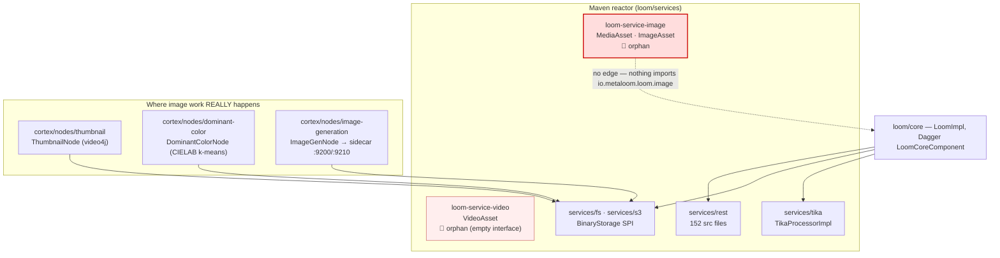

# `loom/services/image` — Image Service Module

**Status: 🔴 EMPTY STUB.** The module compiles and is part of the reactor, but it contains
**two placeholder types, no logic, no tests, no configuration and zero consumers**. Nothing in
MetaLoom depends on it. Treat this file as a *demolition/implementation brief*, not as a
description of a working subsystem.

> ⚠️ Read this before believing older docs: [../../loom/LOOM.md](../loom/LOOM.md) §module table
> describes `services/image`, `services/video` as *"Image/video processing helpers"*. **That claim is
> wrong** — neither module performs any processing. Per the "code wins" rule in
> [../../guidelines/CODING.md](../guidelines/CODING.md), the LOOM.md row should be corrected to
> "empty stubs" in the same change that touches this area.

---

## 1. Scope

| Covered here | Covered elsewhere |
| --- | --- |
| The Maven module `loom/services/image` and its two types | Actual image work in Cortex nodes → [NODES.md](../features/nodes/NODES.md) |
| Why it is orphaned and what the options are | Image generation → [NODE_IMAGEGEN_PLAN.md](../concept/NODE_IMAGEGEN_PLAN.md) |
| Its (non-)configuration and (non-)tests | Colour analysis → [NODE_DOMINANT_COLOR_PLAN.md](../concept/NODE_DOMINANT_COLOR_PLAN.md) |
| — | Binary/thumbnail storage → [../rest/REST_BINARY_HANDLING.md](../features/rest/REST_BINARY_HANDLING.md) |

This file is filed under `spec/features/pipeline-nodes/` because every consumer that *would*
plausibly use it is a Cortex node; the module itself is Loom-side (`loom/services/`).

---

## 2. What the module actually is

Complete source inventory — this is **all** of it:

```java
// io/metaloom/loom/image/MediaAsset.java
public interface MediaAsset {
    /** Return a text which describes the asset. */
    String altText();
}

// io/metaloom/loom/image/ImageAsset.java
public class ImageAsset implements MediaAsset {
    @Override
    public String altText() {
        return null;   // ← unconditionally null; never called by anything
    }
}
```

Maven facts (`loom/services/image/pom.xml`):

| Property | Value |
| --- | --- |
| Coordinates | `io.metaloom.loom.service:loom-service-image:1.0.0-SNAPSHOT` |
| Name | `MetaLoom // Loom :: Service :: Image` |
| Parent | `io.metaloom.loom.service:loom-services` (`loom/services/pom.xml`) |
| Own `<dependencies>` | **none declared** |
| Inherited deps | `loom-api`, `loom-db-api`, `dagger` (from the `loom-services` parent) |
| Packaging | default `jar` |
| `src/test` | **does not exist** |
| `src/main/resources` | **does not exist** |

Registered as `<module>image</module>` in `loom/services/pom.xml` and version-managed in
`loom/pom.xml` (`<dependencyManagement>`) — the latter is a *declaration only*; no POM in the repo
lists `loom-service-image` as a dependency.

Git history: touched by exactly two structural commits — `47e74fa3` (2026-04-01, "Initialize
monorepo") and `4c9e9326` (2026-04-03, "Restructure maven artifacts"). **No feature commit has
ever landed here.**

---

## 3. Architecture — where it sits (and doesn't)



The dashed edge is the point of the diagram: the jar is built and then dropped on the floor.

---

## 4. Key Classes Reference

| Class / file | Package · path | Purpose |
| --- | --- | --- |
| `MediaAsset` | `io.metaloom.loom.image` · `loom/services/image/src/main/java/io/metaloom/loom/image/MediaAsset.java` | Single-method interface `String altText()`. Javadoc: "Return a text which describes the asset." |
| `ImageAsset` | `io.metaloom.loom.image` · `loom/services/image/src/main/java/io/metaloom/loom/image/ImageAsset.java` | Only implementation of `MediaAsset`; `altText()` returns `null`. No state, no constructor, no fields. |
| `pom.xml` | `loom/services/image/pom.xml` | 20 lines, no dependencies of its own |
| `README.md` | `loom/services/image/README.md` | One line: `# Loom - Image Service` |

Sibling for comparison — `VideoAsset` (`loom/services/video/.../VideoAsset.java`) is an interface
whose entire body is the commented-out line `//String altText`. The two modules were clearly
created together as a sketch of a media-asset abstraction that was never pursued.

---

## 5. Consumers — there are none

Verified with these exact commands (use `rg` or `/usr/bin/grep`; **plain `grep` silently returns
nothing on some files in this repo**):

```bash
rg -n --glob '!**/target/**' 'loom-service-image' .
#   → only loom/pom.xml:272 (dependencyManagement) and the module's own pom.xml

rg -n --glob '!**/target/**' 'io\.metaloom\.loom\.image|\bMediaAsset\b|\bImageAsset\b' .
#   → only the two source files themselves

rg -n --glob '!**/target/**' 'altText' .
#   → the two source files + the commented-out line in VideoAsset
```

Consequences to internalise:

- **No REST endpoint** references it — nothing in `loom/services/rest` imports the package.
- **No Cortex node** references it — the image nodes live in `cortex/nodes/**` and depend on
  `cortex/*` APIs, never on `loom-service-image`.
- **No CLI, no GraphQL, no MCP tool** references it.
- **No Dagger `@Module`, `@Component`, `@Provides` or `@Inject`** exists in this module, despite
  `dagger` being on the inherited classpath. It participates in no DI graph.
- Deleting the module would break **only** the two `<module>`/`<dependencyManagement>` entries.

---

## 6. Where image functionality actually lives

Route work here instead of extending this stub:

| Need | Real location | Spec |
| --- | --- | --- |
| Thumbnail / sprite generation | `cortex/nodes/thumbnail/core/…/ThumbnailNode.java` (video4j) | [NODES.md](../features/nodes/NODES.md) `thumbnail` |
| Dominant colour, palettes, colour naming | `cortex/nodes/dominant-color/core/…/DominantColorNode.java` | [NODE_DOMINANT_COLOR_PLAN.md](../concept/NODE_DOMINANT_COLOR_PLAN.md) |
| Image generation / remix | `cortex/nodes/image-generation/core/…/ImageGenNode.java` + sidecars `:9200`/`:9210` | [NODE_IMAGEGEN_PLAN.md](../concept/NODE_IMAGEGEN_PLAN.md) |
| Depth maps, watermarks | `cortex/nodes/…` | [NODE_DEPTHMAP_PLAN.md](../concept/NODE_DEPTHMAP_PLAN.md), [NODE_WATERMARK_PLAN.md](../concept/NODE_WATERMARK_PLAN.md) |
| Storing/serving image binaries | `loom/services/fs`, `loom/services/s3` (`BinaryStorage` SPI) | [../rest/REST_BINARY_HANDLING.md](../features/rest/REST_BINARY_HANDLING.md) |
| Image metadata extraction | `loom/services/tika/…/TikaProcessorImpl.java` | none yet |
| Alt text / captions (the thing `altText()` gestures at) | Cortex `captioning` / `vlm` nodes → `asset_json_comp` | [NODES.md](../features/nodes/NODES.md) §result persistence |

**Note the overlap:** `MediaAsset.altText()` duplicates, in an unused form, a capability the
`captioning`/`vlm` nodes already deliver end to end and persist as `asset_json_comp` rows. Any
revival of this interface must reconcile with that, not compete with it.

---

## 7. Environment variables

**None.** The module reads no environment variable, no system property and no options class —
there is no code that could. Verified: the two source files contain no `System.getenv`,
`System.getProperty`, no `*Options` type, and no `@Inject`ed config.

Loom-wide configuration lives in [../../loom/CONFIGURATION.md](../../loom/CONFIGURATION.md); Cortex
node options are tabulated in [NODES.md](../features/nodes/NODES.md) §options.

---

## 8. Test Setup

**There are no tests.** `loom/services/image/src/test` does not exist, and the module declares no
test dependencies.

To add a test you must first add the deps the module does not inherit — copy the block from
`loom/services/s3/pom.xml`, which declares `junit-jupiter`, `assertj` and `mockito` at
`<scope>test</scope>` (versions come from the imported `io.metaloom:bom`). Then:

```bash
mvn test -pl loom/services/image        # pure unit module, no DB needed
```

Conventions for a service-module unit test (pattern: `loom/services/s3/…/S3LocatorTest.java`,
`loom/services/lucene/…/LuceneSimilarityIndexTest.java`,
`loom/services/monitoring/…/MonitoringServiceTest.java`):

- Plain JUnit 5 `@Test` + AssertJ; **no** `LoomCoreTestExtension`, no pooled test DB.
- `./setup-pool.sh` is irrelevant here — it is only needed for modules that hit the database
  (see the project `CLAUDE.md` and [../../loom/PERSISTENCE.md](../loom/PERSISTENCE.md)).
- Do **not** redeclare `@RegisterExtension LoomCoreTestExtension` if a future test ever subclasses
  an endpoint test base — configure the inherited field instead.

---

## 9. Progress Assessment

- [x] Module exists in the reactor and compiles (`loom/services/pom.xml` → `<module>image</module>`)
- [x] Version-managed in `loom/pom.xml` `<dependencyManagement>`
- [x] `MediaAsset` interface declared
- [x] `ImageAsset` skeleton implementation declared
- [ ] `ImageAsset.altText()` returns anything but `null`
- [ ] Any state on `ImageAsset` (no fields, no constructor, no source/binary reference)
- [ ] Any actual image operation (decode, resize, crop, transcode, EXIF, colour, format sniffing)
- [ ] Any consumer anywhere in the repo — **zero**, grep-verified
- [ ] Dagger module / bindings
- [ ] Environment variables or an options class
- [ ] Tests (`src/test` does not exist)
- [ ] Test dependencies in `pom.xml`
- [ ] `README.md` with more than a title line
- [ ] Reconciliation with the `captioning`/`vlm` nodes that already produce alt text
- [ ] **Decision recorded: implement or delete** (see §10)

### Recommended next action

Deleting is the honest default: `loom-service-image` and `loom-service-video` are dead weight that
misleads readers of the module table. A deletion change is small — drop the two directories, the
two `<module>` entries in `loom/services/pom.xml`, the two `<dependencyManagement>` blocks in
`loom/pom.xml`, and fix the LOOM.md row plus its
`- [ ] No spec for services/image and services/video` gap item. Only implement instead if a
concrete consumer is being written in the same change.

---

## 10. Conventions and Gotchas

- **The module table lies.** [../../loom/LOOM.md](../loom/LOOM.md) calls these "Image/video
  processing helpers". They process nothing. Do not plan work on the assumption that a helper layer
  already exists.
- **"It's in the reactor" ≠ "it's used".** `loom/pom.xml` `<dependencyManagement>` only pins a
  version; it creates no dependency edge. Always confirm consumption with a second grep for the
  *package name*, not just the artifact id.
- **`altText()` returns `null`, not `""`.** If anything is ever wired to this, every caller needs a
  null check — or, better, change the contract to `Optional<String>` / a non-null default at the
  same time as the first real implementation.
- **Dagger is on the classpath but unused.** Adding an `@Inject` constructor here does *not*
  automatically make the type available anywhere; it must be bound into `LoomCoreComponent`
  (`loom/core`). After changing any Dagger-visible constructor, clean-rebuild `loom/core` or
  `setup-pool.sh` and the test suite fail with `NoSuchMethodError`.
- **Don't grow this module to serve a Cortex node.** Cortex workers do not depend on `loom-service-*`
  jars; they talk to Loom over REST/gRPC. Image logic needed by a node belongs in
  `cortex/nodes/<kind>/core` or a shared `cortex/*` module — see
  [../../guidelines/NEW_NODE.md](../guidelines/NEW_NODE.md).
- **Use `rg` or `/usr/bin/grep`.** Plain `grep` silently returns nothing on some files in this repo,
  which can make a dead module look alive (or a live one look dead).
- **`services/video` is in exactly the same state** and should be handled in the same change; its
  `VideoAsset` interface has no members at all.

---

## 11. Where do I find ...?

| I want ... | Path |
| --- | --- |
| The whole module's source | `loom/services/image/src/main/java/io/metaloom/loom/image/` (2 files) |
| The `MediaAsset` contract | `loom/services/image/src/main/java/io/metaloom/loom/image/MediaAsset.java` |
| The stub implementation | `loom/services/image/src/main/java/io/metaloom/loom/image/ImageAsset.java` |
| Module registration | `loom/services/pom.xml` → `<module>image</module>` |
| Version pin | `loom/pom.xml` → `loom-service-image` in `<dependencyManagement>` |
| The sibling stub | `loom/services/video/src/main/java/io/metaloom/loom/video/VideoAsset.java` |
| A service-module unit-test template | `loom/services/s3/src/test/java/io/metaloom/loom/storage/s3/S3LocatorTest.java` |
| Test deps to copy into the pom | `loom/services/s3/pom.xml` (`<scope>test</scope>` block) |
| Loom module overview + the gap list | [../../loom/LOOM.md](../loom/LOOM.md) §module table, §13.7 |
| Spec catalogue / routing | [../../CONTEXT.md](../../CONTEXT.md) |
| Real image nodes | `cortex/nodes/{thumbnail,dominant-color,image-generation}/core/` |
| Node system reference | [NODES.md](../features/nodes/NODES.md) |
| Pipeline execution model | [../pipeline/PIPELINE.md](../features/pipeline/PIPELINE.md) |
| Definition of done for a code change | [../../guidelines/CODING.md](../guidelines/CODING.md) |

---

_Last updated: 2026-08-02 — git HEAD `d930e222`_
_Git HEAD revision: `742dae2d`_
_Last updated: 2026-08-06 (reference sweep — no content changes)_