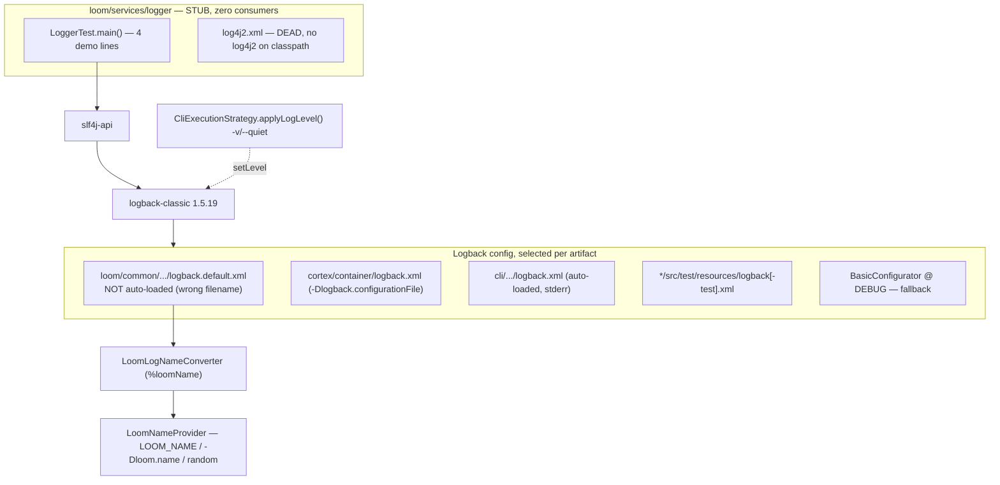

# MetaLoom — `loom/services/logger` Specification

> **Audience: AI coding agents.** Covers the Maven module `loom/services/logger`
> (`io.metaloom.loom.service:loom-service-logger`) and, because that module is a stub, the logging
> setup that *actually* runs. **Source of truth is the code** — if this file contradicts it, the code
> wins and this file must be fixed in the same change ([../../SPEC_RULES.md](../../SPEC_RULES.md),
> [../../guidelines/CODING.md](../../guidelines/CODING.md)).
>
> **Scope note:** this file lives under `pipeline-nodes/` for filing reasons only; the module is not a
> pipeline node and has nothing to do with [NODES.md](NODES.md).
>
> **Scope split:**
> - *This file* — the `logger` module, the logback backend, log config files, log level control.
> - Health / readiness / metrics HTTP surfaces — [../ops/MONITORING.md](../ops/MONITORING.md),
>   [../ops/METRICS.md](../ops/METRICS.md). Neither mentions logging; there is no overlap today.
> - `LOOM_NAME` as a configuration knob — [../../loom/CONFIGURATION.md](../../loom/CONFIGURATION.md).
> - Container `CMD` / `-Dlogback.configurationFile` — [../../loom/BUILD.md](../../loom/BUILD.md).

---

## 1. TL;DR

**The module is an empty shell.** `loom/services/logger` contains exactly one Java class — a `main()`
demo — and one Log4j2 XML file that nothing on any classpath can read. **No other module depends on
it** (verified: `rg "loom-service-logger|io\.metaloom\.loom\.logger"` matches only the module's own
`pom.xml` and its own source). It is built solely because `loom/services/pom.xml` lists
`<module>logger</module>`.

Real logging in MetaLoom is: **SLF4J API + Logback Classic 1.5.19**, configured by per-artifact XML
files, with the only Loom-specific code being the instance-name converter in `loom/common`
(`io.metaloom.loom.log`). There is **no** Log4j2 on any classpath, **no** MDC usage anywhere in the
repo, **no** structured/JSON logging, and **no** REST endpoint or environment variable that changes
a log level at runtime.

---

## 2. Architecture



---

## 3. The module itself

### 3.1 `pom.xml`

- `artifactId` `loom-service-logger`, name `MetaLoom // Loom :: Service :: Logging`.
- Parent `io.metaloom.loom.service:loom-services` → `io.metaloom.loom:loom` → `io.metaloom:metaloom-parent`.
- Imports `io.metaloom:bom` into `dependencyManagement`.
- **One** declared dependency: `ch.qos.logback:logback-classic` (version from the BOM,
  `logback.classic.version` = `1.5.19`). This is redundant — the root `pom.xml` already declares
  `logback-classic` and `slf4j-api` as unconditional dependencies inherited by every module.
- No shade/assembly/surefire configuration of its own.

### 3.2 Source

`src/main/java/io/metaloom/loom/logger/LoggerTest.java` — the only Java file in the module. It is
**not a JUnit test** despite the name (it sits in `src/main`, has no annotations, and nothing runs
it). It holds a `public static final Logger` and a `main()` that emits one `error`, `info`, `warn`
and `debug` line — a manual smoke check for "is a binding wired and at what level".

### 3.3 Resources

`src/main/resources/log4j2.xml` — a Log4j2 `<Configuration>` with a `Console` appender
(`SYSTEM_OUT`, pattern `%d{HH:mm:ss.SSS} [%t] %-5level %logger{36} - %msg%n`) and `<Root level="error">`.

**This file is inert.** Log4j2 is commented out in `bom/pom.xml` (the `log4j-core` and
`log4j-slf4j-impl` entries are inside an XML comment) and no `pom.xml` in the repo declares a log4j
dependency. The module's only binding is logback, which never reads `log4j2.xml`. A near-identical
dead copy exists at `loom/common/src/main/resources/log4j2.xml` (root level `info`) — that one *is*
shipped inside `loom-common`, so it travels into the shaded jars while still doing nothing.

---

## 4. Environment variables

**The `logger` module reads no environment variables and no system properties.** Its single class
touches neither `System.getenv` nor `System.getProperty`.

For completeness, the variables that affect logging elsewhere:

| Variable / property | Default | Read by | Effect |
|---|---|---|---|
| `LOOM_NAME` | none → random `"adjective Noun"`, else `loom` | `LoomNameProvider` (`loom/common`) | Value rendered by the `%loomName` pattern word. Resolved **once** per process and cached. |
| `-Dloom.name` | none | `LoomNameProvider` | Same as above; **wins over** `LOOM_NAME`. |
| `-Dlogback.configurationFile` | unset | logback itself | Selects the config file. Passed by the demo and Cortex container `CMD`s; **not** by the Loom *server* container. |
| `-Dmetaloom.containerLogs` | unset | `MetaLoomTestContext` (integration tests) | Relays container stdout under the `container.<name>` logger. |
| `-Dmetaloom.cli.loglevel` | unset | **nothing** | Set by `CliExecutionStrategy.applyLogLevel()` and never read back. Dead property — do not rely on it. |

There is **no** `LOOM_LOG_LEVEL` / `LOG_LEVEL` variable on the Java side. (`LOG_LEVEL` exists only in
`examples/cortex-python/daemon.py`, a Python sidecar example, default `INFO`.)

---

## 5. How the level is controlled at runtime

Verified: **Loom CLI flags only. No REST endpoint, no env var, no admin API.** Cortex has no CLI,
so a Cortex worker's level can only be set through its logback configuration file
(`-Dlogback.configurationFile=/cortex/logback.xml` in the image).

| Surface | Code | Mapping |
|---|---|---|
| Loom CLI | `cli/.../dagger/CliExecutionStrategy.java` `applyLogLevel()` | `--quiet` → `ERROR`; verbosity `0` → `WARN`, `1` → `INFO`, `≥2` → `DEBUG`. Applied via `((ch.qos.logback.classic.Logger) root).setLevel(...)`, guarded by an `instanceof` check and a `catch (NoClassDefFoundError)` so a non-logback binding does not break startup. |
| File-based | `logback.default.xml` declares `scan="true" scanPeriod="30 seconds"` | An *externally referenced* config file is re-read every 30s, so editing it changes levels live — but only when logback was pointed at it via `-Dlogback.configurationFile`. |

---

## 6. Logback configuration inventory

| File | Auto-loaded? | Root | Notable |
|---|---|---|---|
| `loom/common/src/main/resources/logback.default.xml` | **No** — logback only auto-loads `logback.xml` | `ERROR`, `io.metaloom`/`io.vertx` at `INFO` | Declares `%loomName` via `<conversionRule>`; `STDOUT` + an `ERROR`-only `STDERR` appender; `NopStatusListener`; `scan="true"` |
| `cortex/container/logback.xml` | No — referenced from the Containerfile `CMD` | `ERROR`, `io.metaloom`/`io.vertx` at `INFO` | Mirrors the levels above. Integration tests wait on the `INFO` line "Connected to Loom control websocket" — **do not raise `io.metaloom` above INFO here** |
| `cli/src/main/resources/logback.xml` | **Yes** | `WARN` → **stderr** | Deliberately stderr so logs never contaminate piped JSON stdout; `okhttp3` and `io.netty` pinned to `WARN` |
| `loom/services/logger/src/main/resources/log4j2.xml` | n/a | — | Dead (§3.3) |
| `loom/common/src/main/resources/log4j2.xml` | n/a | — | Dead (§3.3) |

Note the `STDERR` appender in `logback.default.xml` is defined but **never referenced** by
`<root>` — only `STDOUT` is wired up, so ERROR lines go to stdout like everything else.

---

## 7. Test Setup

**The `logger` module has no tests.** `loom/services/logger/src/` contains only `main` — there is no
`src/test` directory, no JUnit dependency, and no surefire configuration. `LoggerTest` is a
`main()` class, so `mvn test` on this module runs zero tests. Exercise it manually:

```
java -cp <module-classpath> io.metaloom.loom.logger.LoggerTest
```

With no logback config on the classpath this prints all four lines at `DEBUG` via
`BasicConfigurator`; that is the whole point of the class.

Logging config used by the rest of the suite (no `pom.xml` sets `-Dlogback.configurationFile` for
surefire — selection is purely by classpath filename):

| Module | File | Root |
|---|---|---|
| `cortex/pipeline-core` | `src/test/resources/logback-test.xml` | `DEBUG` |
| `cortex/processor` | `src/test/resources/logback-test.xml` | see file |
| `cortex/nodes/facedetect/core` | `src/test/resources/logback-test.xml` | see file |
| `cortex/common` | `src/test/resources/logback.xml` | `DEBUG` |
| `loom-client/rest` | `src/test/resources/logback.xml` | `error`, `io.metaloom` at `DEBUG` |
| `integration-test` | `src/test/resources/logback-test.xml` | `WARN`; `com.github.dockerjava` at `WARN`, `org.testcontainers`/`container`/`io.metaloom` at `INFO` |

**No module under `loom/` ships a `logback.xml` or `logback-test.xml`** — the only logback file there
is the non-auto-loaded `logback.default.xml`. Loom's own tests therefore run on logback's
`BasicConfigurator` at root `DEBUG` (including every jOOQ statement) unless a dependency happens to
drag a config onto the test classpath. Pool/database test setup is unrelated and lives in
[../../CONTEXT.md](../../CONTEXT.md).

---

## 8. Conventions and Gotchas

- **Do not add code to `loom/services/logger` expecting it to be picked up.** Nothing depends on it.
  Logging helpers belong in `loom/common` under `io.metaloom.loom.log`, which *is* on every classpath.
- **`LoggerTest` is not a test.** Renaming it to end in `Test` inside a `src/test` tree would make
  surefire try to run a class with no test methods. Leave it in `src/main` or delete it.
- **`log4j2.xml` files are traps.** Two exist, neither has an engine. Editing them changes nothing.
  If Log4j2 is ever wanted, un-comment the BOM entries *and* remove logback-classic — having both
  bindings on one classpath produces an SLF4J multiple-binding warning and non-deterministic routing.
- **`logback.default.xml` is not auto-loaded** — logback looks for `logback-test.xml` then
  `logback.xml`. The `%loomName` conversion rule lived in an unread file long enough that the
  converter class it named did not exist (see the `LoomLogNameConverter` javadoc). The **demo**
  container passes `-Dlogback.configurationFile=logback.default.xml`; the **server** container
  (`loom/containers/server/Containerfile`) does **not**, so the packaged Loom server falls back to
  `BasicConfigurator` at DEBUG. Treat that as a live defect, not as intended behaviour.
- **Nothing in `LoomNameProvider` / `LoomLogNameConverter` may log or throw.** They run while logback
  is still configuring; a throw kills logging for the whole process. Failures fall back to the
  literal `loom` silently. Keep it that way.
- **The name is resolved once and cached** — a restart yields a new random name unless `LOOM_NAME`
  is pinned.
- **No MDC anywhere.** `rg "MDC\."` over all `*.java` returns nothing. There is no request-id or
  tenant-id in log lines; if correlation is needed it must be built from scratch.
- **No structured/JSON logging.** No `logstash-logback-encoder`, no `JsonEncoder`, no `JsonLayout`
  anywhere in the repo. All output is human-readable `PatternLayout`.
- **Levels are per-artifact and drift.** `cortex/container/logback.xml` explicitly documents that it
  mirrors `logback.default.xml`; a level change in one must be mirrored by hand in the other.
- **Cortex has no runtime level switch.** The old `-v` flag went away with the picocli layer and
  was not replaced by an env var; changing a worker's level means editing its logback file (which
  is re-read every 30 s when referenced via `-Dlogback.configurationFile`).

---

## 9. Key Classes Reference

| Class / file | Package or path | Purpose |
|---|---|---|
| `LoggerTest` | `io.metaloom.loom.logger` — `loom/services/logger/src/main/java/io/metaloom/loom/logger/LoggerTest.java` | The module's only class. `main()` emitting one line per level as a manual binding smoke test. Not a JUnit test. |
| `log4j2.xml` | `loom/services/logger/src/main/resources/log4j2.xml` | Log4j2 console config, root `error`. Inert — no Log4j2 on any classpath. |
| `LoomNameProvider` | `io.metaloom.loom.log` — `loom/common/src/main/java/io/metaloom/loom/log/LoomNameProvider.java` | Resolves the per-process instance name from `-Dloom.name`, then `LOOM_NAME`, then a random `"adjective Noun"` from `/json/{adjectives,names}.json`; caches it. Never throws, never logs. |
| `LoomLogNameConverter` | `io.metaloom.loom.log` — `loom/common/src/main/java/io/metaloom/loom/log/LoomLogNameConverter.java` | Logback `ClassicConverter` backing the `%loomName` pattern word. |
| `logback.default.xml` | `loom/common/src/main/resources/logback.default.xml` | Loom's intended runtime config. Needs `-Dlogback.configurationFile` to be read. |
| `CliExecutionStrategy` | `io.metaloom.cli.dagger` — `cli/src/main/java/io/metaloom/cli/dagger/CliExecutionStrategy.java` | `applyLogLevel()` maps `-v`/`--quiet` onto the logback root level. |

---

## 10. Progress Assessment

- [x] Module exists and builds (listed in `loom/services/pom.xml`)
- [x] SLF4J + Logback Classic selected as the backend repo-wide
- [x] Instance naming (`%loomName`, `LOOM_NAME`) implemented — **in `loom/common`, not here**
- [x] Per-artifact logback configs for CLI, Cortex container, and the test modules
- [x] Log level controllable from both CLIs via `-v` / `--quiet`
- [ ] Module has any consumer — currently zero; it is dead weight in the reactor
- [ ] Module has any tests — no `src/test` directory at all
- [ ] Dead `log4j2.xml` files removed (`loom/services/logger`, `loom/common`); `LoggerTest` renamed or removed
- [ ] Loom **server** container passes `-Dlogback.configurationFile` (demo does, server does not), or
      `logback.default.xml` is renamed to `logback.xml` so it auto-loads and the flag disappears
- [ ] `STDERR` appender in `logback.default.xml` wired to `<root>` (defined but unreferenced)
- [x] Cortex `-v` mapping removed together with the picocli layer (logback file only)
- [ ] `metaloom.cli.loglevel` system property either consumed or removed
- [ ] Runtime log level change without restart (REST/admin endpoint) — none exists
- [ ] MDC / correlation ids, and structured (JSON) logging for aggregation — neither exists
- [ ] `loom/*` modules given a `logback-test.xml` so tests stop running at `BasicConfigurator` DEBUG
- [ ] Decision recorded: delete the module, or grow it into the real logging service
- [ ] This file registered in the [../../CONTEXT.md](../../CONTEXT.md) spec catalogue

---

## 11. Where do I find ...?

| I want to ... | Look at |
|---|---|
| The whole `logger` module's source | `loom/services/logger/src/main/java/io/metaloom/loom/logger/LoggerTest.java` (one file) |
| Its dependency set | `loom/services/logger/pom.xml` |
| Why `log4j2.xml` does nothing | `bom/pom.xml` (log4j entries commented out) |
| The logback version | `bom/pom.xml` → `logback.classic.version` |
| The global logback/slf4j dependency | root `pom.xml` `<dependencies>` |
| The config the Loom runtime intends to use | `loom/common/src/main/resources/logback.default.xml` |
| The `%loomName` implementation | `loom/common/src/main/java/io/metaloom/loom/log/` |
| The word lists for random names | `loom/common/src/main/resources/json/{adjectives,names}.json` |
| Container logging config | `cortex/container/logback.xml`, `loom/containers/{demo,server}/Containerfile` |
| CLI log level mapping | `cli/.../dagger/CliExecutionStrategy.java` (Loom CLI only) |
| Test logging config | `*/src/test/resources/logback-test.xml` and `logback.xml` |
| `LOOM_NAME` as a config knob | [../../loom/CONFIGURATION.md](../../loom/CONFIGURATION.md) |
| Container `CMD` and the `-Dlogback.configurationFile` flag | [../../loom/BUILD.md](../../loom/BUILD.md) |
| Health / readiness / metrics endpoints | [../ops/MONITORING.md](../ops/MONITORING.md), [../ops/METRICS.md](../ops/METRICS.md) |
| Definition of done for changing this | [../../guidelines/CODING.md](../../guidelines/CODING.md) |

---

_Last updated: 2026-08-02 — git HEAD `d930e222`_
