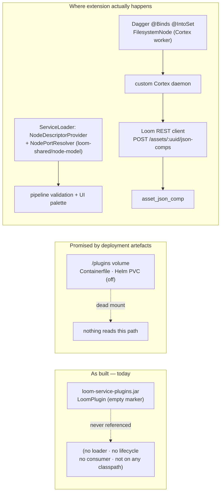

# Loom Plugin Subsystem (`loom/services/plugins`)

> **Status: 🔴 EMPTY SCAFFOLDING.** The module contains exactly **one** Java file — an empty marker
> interface — no dependencies, no tests, no discovery code, no consumers. Nothing in the repository
> references it. This spec documents *what exists* (almost nothing), *what the surrounding
> deployment artefacts already promise* (a `/plugins` volume), and *where the real extension points
> live* (elsewhere), so an agent does not waste time looking for a plugin runtime that was never
> written.

**Scope delineation.** This file covers the Maven module `loom/services/plugins` only.
It does **not** cover the shipped extension mechanisms — those have their own specs:
Cortex nodes → [NODES.md](../features/nodes/NODES.md) and [../../guidelines/NEW_NODE.md](../guidelines/NEW_NODE.md);
node descriptors → [NODE_SCHEMA.md](../features/pipeline/NODE_SCHEMA.md);
MCP tools → [../../loom/MCP.md](../loom/MCP.md);
scripted logic → [NODE_SCRIPT.md](../features/nodes/script/NODE_SCRIPT.md).

---

## 1. Module inventory (complete — verified by `find`)

| Path | Content |
|---|---|
| `loom/services/plugins/pom.xml` | 20 lines. `artifactId` `loom-service-plugins`, parent `io.metaloom.loom.service:loom-services`. **Zero `<dependencies>`**, zero build plugins. |
| `loom/services/plugins/README.md` | 2 lines: the title `# Loom - Plugins Service`. No body. |
| `.../src/main/java/io/metaloom/loom/plugin/LoomPlugin.java` | 9 lines. The whole subsystem. |
| `.../src/test/**` | **Does not exist.** No test sources at all. |

The full source of the module:

```java
package io.metaloom.loom.plugin;

/**
 * A loom plugin is just a registration in loom which provides an API key and
 * endpoint for a custom plugin to hook into.
 */
public interface LoomPlugin {

}
```

`git log -- loom/services/plugins/` returns **two** commits: `47e74fa3` (2026-04-01, "Initialize
monorepo") and `4c9e9326` (2026-04-03, "Restructure maven artifacts"). The module has not been
touched since the repository was created.

---

## 2. The SPI a third party must implement

`io.metaloom.loom.plugin.LoomPlugin` — an **empty marker interface**. It declares no methods, no
constants, and no annotations. Implementing it is a no-op: nothing loads it, nothing calls it,
nothing type-checks against it. There is **no** `Plugin`, `PluginManager`, `PluginRegistry`,
`PluginContext`, `PluginDescriptor`, or `PluginService` type anywhere in the repo (verified with
`rg -n "LoomPlugin|io\.metaloom\.loom\.plugin|loom-service-plugins"` across the tree excluding
`target/` — the only hits are the file itself and its own `pom.xml`).

The javadoc states the *intent*: a plugin would be "a registration in loom which provides an API key
and endpoint". No code implements that intent. The nearest shipped primitives are:

- **API keys** → the Token subsystem, `/api/v1/tokens` CRUD, `TokenEndpoint` / `TokenDao`
  (see [../../loom/RESTAPI.md](../loom/RESTAPI.md) §3 and [../rbac/RBAC.md](../features/rbac/RBAC.md)).
- **A registered external worker with a token** → Cortex worker registration
  (see [../../cortex/CORTEX.md](CORTEX.md)).

Neither of them mentions `LoomPlugin`.

---

## 3. Discovery / loading mechanism

**None.** No `ServiceLoader.load(LoomPlugin.class)`, no `META-INF/services/io.metaloom.loom.plugin.LoomPlugin`
file, no classpath scan, no `URLClassLoader`, no directory watcher, no jar loading. Verified:

- `find . -path '*META-INF/services*'` yields exactly three provider files repo-wide, none for plugins:
  `io.metaloom.loom.api.LoomFactory` (loom/core), `io.metaloom.loom.nodes.spec.NodeDescriptorProvider`
  and `...NodePortResolver` (both `loom-shared/node-model`).
- `rg -n "PLUGIN"` over Java/config sources returns **zero** matches outside the vendored
  `graphiql.min.js` bundle.

## 4. Lifecycle and isolation model

**None.** There is no `init()` / `start()` / `stop()`, no `Closeable`, no per-plugin `ClassLoader`,
no sandbox, no permission gate. A plugin would today run — if anything loaded it — on the flat
application classpath with full JVM privileges. The only sandboxing that exists in Loom is unrelated:
the agent coding sandbox (`loom/agent/sandbox`, podman/kubernetes) and the GraalJS script node
([NODE_SCRIPT.md](../features/nodes/script/NODE_SCRIPT.md)).

## 5. Extension points the module hooks into

**Zero.** The module has no dependencies, so it cannot see any Loom type — not the REST router, not
Dagger, not the event bus. It is not on any other module's classpath either (`loom-service-plugins`
appears in no `<dependency>` block, and is absent from `bom/pom.xml`), so the artifact is built by
`loom/services/pom.xml` and then discarded — it is **not** in the shaded server jar.

---

## 6. Architecture



Intended (but unimplemented) lifecycle, for whoever builds it:

```
 drop jar in /plugins ─▶ discover ─▶ instantiate ─▶ init(ctx) ─▶ start() ─▶ … ─▶ stop()
        (no code)        (no code)     (no code)     (no method)  (no method)   (no method)
```

---

## 7. Deployment surface that already exists (and is unused)

The container images and the Helm chart already carve out a plugin drop directory. **No Java code
reads it** — it is inert.

| Artefact | Line | Detail |
|---|---|---|
| `loom/containers/server/Containerfile` | 22, 34 | `mkdir /plugins && chown 1000:0 -R && chmod 770`; `VOLUME /plugins` |
| `loom/containers/server/Containerfile.native` | 34, 49 | same |
| `loom/containers/demo/Containerfile` | 18, 30 | same |
| `loom/containers/demo/Containerfile.native` | 27, 42 | same |
| `helm/loom/values.yaml` | 74–80 | `persistence.plugins`: `enabled: false`, `ReadWriteOnce`, `1Gi`, `existingClaim: ""` |
| `helm/loom/templates/deployment.yaml` | 173–175, 213–220 | conditional `plugins` volume mounted at `/plugins` |
| `website/content/english/docs/playbooks/docker/index.adoc` | 152 | "The image also declares `/plugins`. Mount it only if you ship plugins." — customer-facing promise with no implementation behind it |

Cross-refs: [../helm/HELM_LOOM.md](../features/helm/HELM_LOOM.md) (PVC table), [../../loom/BUILD.md](../../loom/BUILD.md) (volume table).

## 8. Environment variables and options

**The module reads none.** There is no `PluginOptions` class, no `LOOM_PLUGIN_*` variable, and no
entry in Loom's options tree ([../../loom/CONFIGURATION.md](../../loom/CONFIGURATION.md)) for
plugins. `rg -n "PLUGIN"` over sources confirms this.

| Variable | Default | Status |
|---|---|---|
| *(none)* | — | If a loader is built, add `LOOM_PLUGIN_ENABLED` (default `false`) and `LOOM_PLUGIN_DIR` (default `/plugins`, matching the container volume) to Loom's options class and to [../../loom/CONFIGURATION.md](../../loom/CONFIGURATION.md). This is a **recommendation, not existing behaviour.** |

---

## 9. Test Setup

**There are no tests.** `loom/services/plugins/src/test` does not exist and the pom declares no test
dependencies (not even JUnit — it inherits none explicitly; any test would need deps added).

When the subsystem gets real code, follow the repo conventions:

- Pure unit tests (loader resolution, descriptor parsing) → plain JUnit 5 in
  `loom/services/plugins/src/test/java`, no database. Add `junit-jupiter` + `assertj` deps to the pom.
- Anything touching Loom state (registration, tokens, endpoints) belongs in `loom/core` /
  `loom/services/rest` endpoint tests, which need the pooled test database — run `./setup-pool.sh`
  first (see the root `CLAUDE.md`), and grant permissions via group+role, never a direct
  `user_permission` row.
- Endpoint + permission tests are **mandatory** for any new REST route per
  [../../guidelines/CODING.md](../guidelines/CODING.md).
- A ServiceLoader-based loader should get a test modelled on
  `loom-shared/node-model/src/test/java/io/metaloom/loom/nodes/spec/NodeDescriptorServiceLoaderTest.java`
  — that is the in-repo reference for "the provider file and the classes agree".

## 10. Progress Assessment

- [x] Maven module exists, is listed in `loom/services/pom.xml` (`<module>plugins</module>`) and builds
- [x] Marker interface `LoomPlugin` exists
- [x] `/plugins` volume declared in all four Containerfiles
- [x] Helm `persistence.plugins` PVC wired (disabled by default)
- [ ] SPI has any method at all (currently empty marker)
- [ ] Discovery mechanism (ServiceLoader / directory scan / jar loading) — none
- [ ] Lifecycle (`init` / `start` / `stop`) — none
- [ ] Isolation (per-plugin ClassLoader, permission gate) — none
- [ ] Plugin registration model (the javadoc's "API key + endpoint") — none; Tokens exist but are unconnected
- [ ] Any consumer of `LoomPlugin` anywhere in the repo — none
- [ ] Any in-repo example plugin — none (`examples/` contains Cortex node examples, not Loom plugins)
- [ ] Module on the server classpath / in the shaded jar — no
- [ ] Configuration options (`LOOM_PLUGIN_*`) — none
- [ ] Tests — none
- [ ] Customer-facing docs beyond the dead `/plugins` mention in the Docker playbook — none
- [ ] Resolve the contradiction: either implement a loader for `/plugins`, or drop the volume and the
      docs sentence and delete the module (tracked in [../../loom/LOOM.md](../loom/LOOM.md) §13.7)

## 11. Key Classes Reference

| Class / file | Package or path | Purpose |
|---|---|---|
| `LoomPlugin` | `io.metaloom.loom.plugin` — `loom/services/plugins/src/main/java/io/metaloom/loom/plugin/LoomPlugin.java` | Empty marker interface. The entire subsystem. |
| `loom-service-plugins` (pom) | `loom/services/plugins/pom.xml` | Module coordinates; no dependencies, no consumers |
| **Not this module —** `NodeDescriptorRegistry` | `io.metaloom.loom.nodes.spec` — `loom-shared/node-model/.../NodeDescriptorRegistry.java` | The **real** ServiceLoader extension point: loads `NodePortResolver` in its constructor; descriptors registered at startup and served to the UI |
| `NodeDescriptorProvider` | `loom-shared/node-model/.../nodes/spec/NodeDescriptorProvider.java` + `src/main/resources/META-INF/services/…NodeDescriptorProvider` (27 providers) | Add a provider here and a node kind becomes visible to pipeline validation and the UI palette |
| `HelloWorldNode` / `HelloWorldNodeModule` | `examples/cortex-custom-node/.../node/hello/` | The closest thing to an "example plugin": a custom Cortex node registered via Dagger `@Binds @IntoSet` |
| `CortexCustomMain` | `examples/cortex-custom/.../cli/CortexCustomMain.java` | Custom Cortex daemon that includes the example node |
| `TokenEndpoint` / `TokenDao` | `loom/services/rest/.../endpoint/impl/TokenEndpoint.java`, `loom/db/api/.../model/token/TokenDao.java` | The shipped "API key" primitive the plugin javadoc alludes to |
| `CortexFactory` | `cortex/api/.../CortexFactory.java` | ⚠️ Mentions ServiceLoader **in a comment only** — the method throws `UnsupportedOperationException`. Do not mistake it for a working SPI. |

## 12. Conventions and Gotchas

1. **Do not "extend the plugin system" — there isn't one.** A request to "add a plugin" almost always
   means one of: a Cortex node ([../../guidelines/NEW_NODE.md](../guidelines/NEW_NODE.md)), a node
   contract declared with `@NodeSpec` ([NODE_SCHEMA.md](../features/pipeline/NODE_SCHEMA.md)), an
   MCP tool ([../../loom/MCP.md](../loom/MCP.md)), or a script node
   ([NODE_SCRIPT.md](../features/nodes/script/NODE_SCRIPT.md)). Route there first.
2. **The `/plugins` volume is a trap.** It exists in every container image, in the Helm chart and in
   the public Docker playbook, which makes the subsystem look shipped. No Java code opens that path.
3. **The module is built but not linked.** Because no pom depends on `loom-service-plugins`, adding
   code to it changes nothing at runtime. A first real implementation must also add the dependency to
   `loom/core` (or wherever it is wired) and to the shaded container jars, or it will silently not run.
4. **`bom/pom.xml` does not manage this artifact.** Any module depending on it must pin
   `${project.version}` explicitly, like `loom-service-api` does in `loom/services/pom.xml`.
5. **The javadoc is a design note, not documentation of behaviour.** "provides an API key and
   endpoint" describes an unbuilt idea; the Token subsystem it hints at has no plugin awareness.
6. **`CortexFactory`'s ServiceLoader comment is stale** — the body throws
   `UnsupportedOperationException("Use the container runner to create Cortex instances")`.
7. **If you implement a loader**, prefer `ServiceLoader` over a custom ClassLoader: the repo already
   uses it (`LoomFactory`, `NodeDescriptorProvider`, `NodePortResolver`) and the container poms
   already configure the shade plugin's `ServicesResourceTransformer`, so provider files merge
   correctly in the fat jar. A directory-scanning `URLClassLoader` would additionally break the
   GraalVM native images (`Containerfile.native`), which cannot load classes at runtime.
8. **Spec obligation.** [../../loom/LOOM.md](../loom/LOOM.md) §13.7 lists "No spec for
   `services/plugins`" as an open item — flip that checkbox when linking this file, and add the entry
   to [CONTEXT.md](../../CONTEXT.md)'s tree if the subsystem becomes real.

## 13. Where do I find ...?

| I want to ... | Look at |
|---|---|
| The entire plugin subsystem | `loom/services/plugins/src/main/java/io/metaloom/loom/plugin/LoomPlugin.java` (9 lines) |
| The module's build config | `loom/services/plugins/pom.xml`; registered in `loom/services/pom.xml` line 49 |
| Why `/plugins` exists | `loom/containers/{server,demo}/Containerfile{,.native}`; `helm/loom/values.yaml` `persistence.plugins`; `website/content/english/docs/playbooks/docker/index.adoc:152` |
| The real, working SPI | `loom-shared/node-model/src/main/resources/META-INF/services/io.metaloom.loom.nodes.spec.NodeDescriptorProvider` + `NodeDescriptorRegistry` |
| An example of extending MetaLoom | `examples/cortex-custom-node/` (node), `examples/cortex-custom/` (daemon), `examples/cortex-python/` (Python worker); `examples/README.md` |
| How a custom node persists results | `POST /api/v1/assets/:uuid/json-comps` → `asset_json_comp`; see `examples/cortex-custom-node/README.md` and [NODES.md](../features/nodes/NODES.md) |
| The "API key" primitive | `loom/services/rest/.../endpoint/impl/TokenEndpoint.java` (`/api/v1/tokens`), [../../loom/RESTAPI.md](../loom/RESTAPI.md) §3 |
| Sandboxing prior art | `loom/agent/sandbox/` (podman/k8s), GraalJS script node [NODE_SCRIPT.md](../features/nodes/script/NODE_SCRIPT.md) |
| The module map for all of Loom | [../../loom/LOOM.md](../loom/LOOM.md) §"services/*", [../../METALOOM.md](../METALOOM.md) |
| Rules before changing code here | [../../guidelines/CODING.md](../guidelines/CODING.md), [../../SPEC_RULES.md](../guidelines/SPEC_RULES.md) |

---

_Last updated: 2026-08-02 — git HEAD `d930e222`_
_Git HEAD revision: `742dae2d`_
_Last updated: 2026-08-06 (reference sweep — no content changes)_