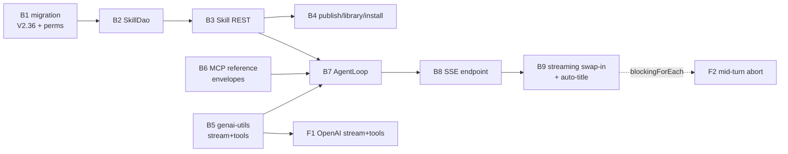

# CHAT_TASKS — Chat Agent & Skills (Backend) — Task List

> Build record for the backend chat feature. **Tasks B1–B9 are all done** and re-verified against
> the code on 2026-08-01; they are kept as one-line outcome records because other specs cite the
> numbers. Remaining work lives in "Open Follow-ups" below, in template form.
> Format follows [../../TASKS.template.md](../../TASKS.template.md).
>
> **Context:** [CHAT.md](../../loom/ui/CHAT.md) (design rationale, event protocol, tool inventory) ·
> [CHAT_SESSIONS_CONCEPT.md](CHAT_SESSIONS_CONCEPT.md) (publishable sessions) ·
> [CHAT_MEMORY_PLAN.md](CHAT_MEMORY_PLAN.md) (memory bank) ·
> [TASK_UI_CHAT.md](../../loom/ui/TASK_UI_CHAT.md) (UI counterpart U1–U8)
>
> Nothing here blocks anything else — F1 gates F2 (both concern the streaming path); F3–F5 are
> independent and unscheduled.

## Progress Assessment

- [x] B1–B9 — the full backend chat/skills stack (see the table)
- [ ] F1 vLLM `generateStreamWithTools` (blocks `LOOM_AI_STREAMING=true` on vLLM)
- [x] F1 streaming tool calls on the OpenAI provider — **done**, see the F1 entry below
- [ ] F2 mid-turn abort on the streaming path
- [ ] F3 transcript normalization (`chat_message` table) — deferred, revisit on pain
- [ ] F4 group-scoped skill library — deferred
- [ ] F5 live-LLM smoke coverage in CI — deferred



## Implementation Status (verified 2026-08-01 @ `499f71f7`)

| Task | Outcome (one line) |
|---|---|
| B1 migration + permissions | ✅ `V2.36__add_skill.sql` (+ `V2.37__add_skill_version.sql`), `CREATE/READ/UPDATE/DELETE_SKILL`, jOOQ codegen regenerated. |
| B2 Skill DAO stack | ✅ `SkillDao`/`SkillDaoImpl` + `loadByName`; covered by `SkillDaoTest`. |
| B3 Skill REST + client | ✅ `SkillEndpoint` + owner-scoped service; `SkillEndpointTest` incl. cross-user isolation. |
| B4 sharing (publish/library/install) | ✅ `GET /skills/library`, `POST /skills/:uuid/install` — copy + `origin_skill_uuid` provenance, name-collision suffix, derived `updateAvailable`; re-install yields a fresh suffixed copy. |
| B5 genai-utils streaming | ✅ `LLMProvider.generateStreamWithTools` is a plain interface method; `OpenAILLMProvider` implements it for every OpenAI-compatible backend (see F1). |
| B6 MCP reference envelopes | ✅ `MCPToolResults` helper; loom tools populate `references`; `MCPToolReferencesTest`. |
| B7 `loom/agent/chat` loop | ✅ `AgentLoop`/`AgentService`/`SkillPromptBuilder`/`ReferenceExtractor`/`load_skill`; `AiOptions` (`LOOM_AI_*`); `AgentLoopTest` with a fake streamer. |
| B8 SSE stream endpoint | ✅ `ChatStreamEndpoint` (`POST/DELETE /chats/:uuid/stream`) contributed from `loom/agent/chat` via the AI endpoint module; `ChatStreamEndpointTest`. |
| B9 streaming swap-in + auto-title | ✅ `StreamingTurnStreamer` opt-in via `LOOM_AI_STREAMING=true` (default: `BlockingTurnStreamer`); auto-title after the first exchange — since extended to also generate a description and capture a `chat_session`. |

**Deviations from the original task text** (still true):
`ChatStreamEndpoint` lives in `loom/agent/chat`, not `loom-service-rest`, because the MCP module
depends on the rest module · `ReferenceExtractor` consumes only the structured `references` field
(the name→type heuristic was dropped as fragile) · a missing jOOQ converter for `chat.messages`
(jsonb → `JsonArray`) was fixed with `JsonArrayConverter` + a `chat\.messages` forcedType ·
`user_permission`'s single-permission-per-user PK ([PERMISSIONS.md](../permissions/PERMISSIONS.md)
§3.2) forces endpoint tests to grant the second fixture user permissions via a group + role.

---

## Open Follow-ups

### Task F1: Implement `generateStreamWithTools` for the OpenAI provider — ✅ DONE

**Argumentation Summary (historical):** `LLMProvider.generateStreamWithTools` had a throwing default
and only the Ollama provider overrode it, so any other deployment with `LOOM_AI_STREAMING=true`
failed the run terminally and had to stay on the turn-granular `BlockingTurnStreamer`.

**Outcome:** Resolved together with the Ollama removal. `OpenAILLMProvider.generateStreamWithTools`
accumulates `delta.tool_calls` fragments per `index` (id/name arrive once, argument JSON arrives in
slices) via the package-visible `ToolCallAccumulator`, and emits the full `StreamEvent` vocabulary —
`ReasoningDelta` for both the non-standard `reasoning_content` field and inline `<think>` content,
`TextDelta`, `ToolCallsComplete`, `Completed`. `generateStreamWithTools` is now a plain interface
method rather than a throwing default, so the compiler rejects a provider that forgets it.
`TurnStreamer`/`StreamingTurnStreamer` were not touched — the contract was already
provider-agnostic.

**Covered by:** `ToolCallAccumulatorTest` (genai-utils core, fragment reassembly incl. parallel calls
keyed by index) · `MockLLMServerTest.testStreamingToolCallResponse` / `testStreamingParallelToolCalls`
/ `testStreamingWithToolsEmitsTextWhenNoToolIsCalled`, driven through `MockLLMServer`, which now
streams `tool_calls` deltas when the client asks for a stream.

---

### Task F2: Make aborts take effect mid-turn on the streaming path

**Argumentation Summary:** `StreamingTurnStreamer.streamTurn` consumes the provider flowable with
`blockingForEach`, which cannot be disposed from outside. `AgentLoop` only checks its `cancelled`
flag between turns, so `DELETE /chats/:uuid/stream` does not stop generation until the current turn
finishes — a long tool-heavy turn keeps burning tokens after the user pressed stop.

**Improvement Summary:** Subscribe with a retained `Disposable` and wire the loop's cancel flag to
it so an abort interrupts the in-flight turn.

```
1. In loom/agent/chat/.../loop/StreamingTurnStreamer.java replace blockingForEach with an
   explicit subscribe(...) that retains the io.reactivex.rxjava3.disposables.Disposable, and
   block on a CountDownLatch released by onComplete/onError.
2. Expose a cancel()/close() on TurnStreamer (default no-op so BlockingTurnStreamer is unaffected)
   that disposes the subscription and releases the latch.
3. In AgentLoop, call turnStreamer.cancel() where the cancelled flag is set, and keep the existing
   post-turn `if (cancelled.get()) return "aborted"` guard as the fallback.
```

**References:** [CHAT.md §4.1](../../loom/ui/CHAT.md) · B8, B9
**Test Requirements:** Extend `StreamingTurnStreamerTest` with a cancel-mid-stream case (assert the
upstream is disposed and no further deltas are emitted); `ChatStreamEndpointTest`'s 409+cancel case
must stay green. `mvn -q test -pl loom/agent/chat`.

---

### Task F3: Normalize the chat transcript into a `chat_message` table — deferred

**Argumentation Summary:** `chat.messages` is one jsonb array rewritten in full per exchange, and
replay reconstructs tool results from ≤2 KB summaries ([CHAT.md §4.3](../../loom/ui/CHAT.md) R4/R5).
Row-size growth and lossy replay are the risks; neither has bitten yet.

**Improvement Summary:** Move to a normalized `chat_message` table with per-message rows and full
tool payloads, behind a migration + DAO change.

```
Revisit only when fidelity or row growth actually hurts. Sketch: new migration adding
chat_message(uuid, chat_uuid, ordinal, role, content, tool_calls jsonb, created); ChatDao gains
append/loadMessages; AgentLoop appends instead of rewriting; keep chat.messages as a read fallback
for one release.
```

**References:** [CHAT.md §4.3](../../loom/ui/CHAT.md)
**Test Requirements:** `ChatDaoTest` message append/ordering/cascade cases; `AgentLoopTest` replay
fidelity case. Requires `./setup-pool.sh` after the migration.

---

### Task F4: Group-scoped skill library — deferred

**Argumentation Summary:** Library visibility is a single global `published` flag; there is no way to
share a skill with one RBAC group only ([CHAT.md §7](../../loom/ui/CHAT.md)). No `skill_group`
table exists.

**Improvement Summary:** Optional `skill_group` join layered on `published` — no schema conflict with
today's behaviour.

```
Add migration creating skill_group(skill_uuid, group_uuid); extend SkillDao.findLibrary to also
match skills shared with any group the caller belongs to; keep published=true as "everyone".
```

**References:** [CHAT.md §7](../../loom/ui/CHAT.md) · [PERMISSIONS.md](../permissions/PERMISSIONS.md) · B4
**Test Requirements:** `SkillDaoTest` group-visibility cases and a `SkillEndpointTest` case proving a
non-member cannot see a group-scoped skill.

---

### Task F5: Live-LLM smoke coverage in CI — deferred

**Argumentation Summary:** `MCPServerToolCallTest` / `MCPDirectToolCallTest` need a local
OpenAI-compatible server with a tool-calling model, so they never run in CI and real tool-calling
regressions are caught only by hand.

**Improvement Summary:** A scheduled/optional CI job with an LLM service that runs just these
tests.

```
Add an opt-in profile or tag for the live-LLM tests and a scheduled workflow that pulls the model
and runs only that tag; keep them excluded from the default build.
```

**References:** [CHAT.md §10](../../loom/ui/CHAT.md) · B6
**Test Requirements:** The two tests pass in the scheduled job; the default `mvn test` remains green
without a live model server.

---

## Key Classes Reference

| Class | Package | Purpose |
|---|---|---|
| `AgentLoop` | `io.metaloom.loom.agent.chat.loop` | The agentic loop: turns, tools, title/description, session capture |
| `AgentService` | `io.metaloom.loom.agent.chat` | Entry point; selects the turn streamer from `AiOptions` |
| `TurnStreamer` / `BlockingTurnStreamer` / `StreamingTurnStreamer` | `io.metaloom.loom.agent.chat.loop` | Turn-granular vs token-level streaming strategies |
| `ChatStreamEndpoint(Service)` | `io.metaloom.loom.agent.chat.rest` | `POST/DELETE /api/v1/chats/:uuid/stream` (SSE) |
| `SkillPromptBuilder` | `io.metaloom.loom.agent.chat.skill` | Injects active skills into the system prompt |
| `ReferenceExtractor` | `io.metaloom.loom.agent.chat.ref` | Turns tool `references` envelopes into UI chips |
| `AiOptions` | `io.metaloom.loom.api.options` | `LOOM_AI_*` configuration incl. `LOOM_AI_STREAMING` |
| `MCPToolResults` | `io.metaloom.loom.mcp.tool` | Builds the structured tool-result + references envelope |
| `SkillEndpoint` | `io.metaloom.loom.rest.endpoint.impl` | Skill CRUD + `/library` + `/:uuid/install` |
| `LLMProvider` / `OpenAILLMProvider` | `io.metaloom.ai.genai.llm[.openai]` (genai-utils) | Streaming-with-tools contract and its implementation |

## Test Setup

```bash
./setup-pool.sh                                              # required before any DB-backed test
mvn -q test -pl loom/agent/chat                              # AgentLoopTest, StreamingTurnStreamerTest
mvn -q test -pl loom/core -Dtest=SkillEndpointTest,ChatStreamEndpointTest
mvn -q test -pl loom/db/jooq -Dtest=SkillDaoTest
mvn -q test -pl loom/core -Dtest=MCPToolReferencesTest
```

`MCPServerToolCallTest` / `MCPDirectToolCallTest` need a local OpenAI-compatible server (`openai/gpt-oss-20b`) — see F5.

## Conventions & Gotchas

- The chat endpoints live in **`loom/agent/chat`**, not `loom-service-rest` — the MCP module depends
  on the rest module, so putting them there would create a cycle. They are contributed via the AI
  endpoint module.
- `LOOM_AI_STREAMING=true` requires a provider that implements `generateStreamWithTools`. On vLLM
  this fails the run terminally (F1) — leave it `false` there.
- Abort is currently **turn-granular** on the streaming path (F2).
- jsonb columns need an explicit jOOQ `forcedType` + converter, or loading the row blows up with a
  Jackson `MappingException` — the `chat.messages` fix is the cautionary example. After any Flyway
  change: `./setup-pool.sh`, then `loom/db/jooq/generate.sh`.
- `user_permission` allows **one direct grant per user** — grant additional test permissions via a
  group + role, as `SkillEndpointTest` does.
- Register literal sub-paths (`/library`, `/publish`, `/context`) **before** `/:uuid` or they are
  consumed as a UUID path param.

## Where do I find …?

| I want … | Look at |
|---|---|
| The loop, tools, turn handling | `loom/agent/chat/src/main/java/io/metaloom/loom/agent/chat/loop/AgentLoop.java` |
| SSE endpoint + event protocol | `loom/agent/chat/.../rest/ChatStreamEndpoint{,Service}.java`, [CHAT.md §4](../../loom/ui/CHAT.md) |
| Streaming strategy selection | `loom/agent/chat/.../AgentService.java`, `loom-shared/api/.../options/AiOptions.java` |
| Skill CRUD / library / install | `loom/services/rest/.../endpoint/impl/SkillEndpoint.java` |
| Skill schema | `loom/db/flyway/src/main/resources/db/migration/V2.36__add_skill.sql`, `V2.37__add_skill_version.sql` |
| Tool reference envelopes | `loom/services/mcp/.../tool/MCPToolResults.java` |
| Provider streaming contract | `genai-utils/core/src/main/java/io/metaloom/ai/genai/llm/LLMProvider.java` |
| Chat session capture / publishing | [CHAT_SESSIONS_CONCEPT.md](CHAT_SESSIONS_CONCEPT.md) |
| Agent memory bank | [CHAT_MEMORY_PLAN.md](CHAT_MEMORY_PLAN.md) |
| UI-side task record | [TASK_UI_CHAT.md](../../loom/ui/TASK_UI_CHAT.md) |

_Git HEAD revision: `4dc0390a`_
_Last updated: 2026-08-03 (F1 closed — `OpenAILLMProvider.generateStreamWithTools` implemented; Ollama removed from genai-utils)_
