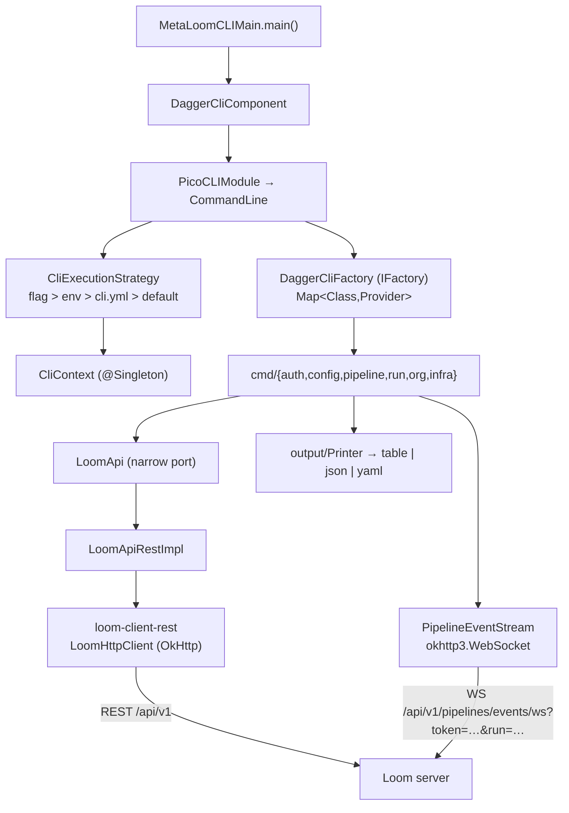

# MetaLoom CLI — `cli/` module

> **Status**: shipped 2026-07-26, re-verified against the code 2026-08-01.
> The plan phases P0–P7 are all landed; this file now documents **what exists** and keeps
> full detail only for the **open work** in §7.
> **Scope**: the top-level `cli/` module — a PicoCLI + Dagger 2 client for a Loom server,
> shipped as a runnable JAR and as a GraalVM (Substrate VM) native image.
> `cortex/cli` is a *worker launcher* and is **not** covered here — see
> [../../cortex/BUILD.md](../../cortex/BUILD.md).
> **Related**: [../pipeline/PIPELINE.md](../pipeline/PIPELINE.md) ·
> [../../loom/RESTAPI.md](../../loom/RESTAPI.md) ·
> [../../loom/WEBSOCKET.md](../../loom/WEBSOCKET.md) ·
> [../../guidelines/CODING.md](../../guidelines/CODING.md)

---

## 1. Already implemented

The old `loom/cli` stub (one class printing `"TBD"`) is gone. Everything below is verified
present at `499f71f7`.

| Item | Where it lives |
| --- | --- |
| Module registered after `loom`, before `integration-test` | `pom.xml:49` (`<module>cli</module>`) |
| Coordinates `io.metaloom.cli:metaloom-cli`, binary `metaloom` | `cli/pom.xml` |
| picocli unified at **4.7.7**, no cortex override | `bom/pom.xml:23` |
| Root command + INHERIT-scoped global options | `cli/…/MetaLoomCLI.java` |
| Single parse (no cortex-style bootstrap pass) | `cli/…/dagger/CliExecutionStrategy.java` |
| Dagger `IFactory` over `@IntoMap @ClassKey` | `cli/…/dagger/DaggerCliFactory.java`, `CommandModule.java` |
| `CommandLine` assembly, recursive `--help`, error handlers | `cli/…/dagger/PicoCLIModule.java` |
| Narrow `LoomApi` port + REST impl | `cli/…/client/LoomApi.java`, `LoomApiRestImpl.java` |
| `cli.yml` profiles, precedence chain, `0600` credentials | `cli/…/config/` (`CliConfigLoader`, `CliConfigFile`, `Profile`, `CredentialStore`, `CliPaths`, `ServerUrl`) |
| table / json / yaml renderers, colour, quiet mode | `cli/…/output/` (`Printer`, `Table`, `Ansi`, `CliJson`, `OutputFormat`, `ColorMode`) |
| 14 exit codes | `cli/…/ExitCode.java` |
| `--follow` over OkHttp WebSocket (NDJSON in json mode) | `cli/…/client/PipelineEventStream.java` |
| `--wait` polling to a terminal status | `cli/…/cmd/run/RunWaiter.java` |
| Run-UUID → pipeline-UUID resolution | `cli/…/cmd/run/RunLocator.java` |
| GraalVM `native` profile, `-Os`, `--install-exit-handlers` | `cli/pom.xml` (`<profile><id>native</id>`) |
| Native metadata + build/agent/smoke/install driver | `cli/build-native.sh`, `cli/src/main/resources/META-INF/native-image/io.metaloom.cli/metaloom-cli/` |
| Version from a maven-filtered resource (no jar manifest) | `cli/src/main/resources/cli-version.properties`, `CliVersion.java` |
| **Server**: `path` on the run request + precedence resolver | `PipelineRunRequest.java`, `loom/services/rest/…/impl/SourceOptionsResolver.java` |
| **Server**: pause/resume routes, `PAUSED` status, recovery | `PipelineEndpoint.java:56,57,159,168`, `V2.56__pipeline_run_paused_status.sql` |
| **Server**: WebSocket `?run=<uuid>` filter | `PipelineEventEndpoint.java:84` (`extractQueryParam`) |
| **Client**: `runPipeline`, pause/resume/cancel, versions, `InfoMethods`, `setPathPrefix` | `loom-client/common/…/method/PipelineMethods.java`, `InfoMethods.java`, `LoomHttpClientImpl.java:276` |
| Demo run history incl. a `PAUSED` run | `DemoDatabaseInitializer.java:365` |
| Customer docs | `website/content/english/docs/cli/index.adoc` |

---

## 2. Architecture



`LoomApi` exists so tests can fake **one** ~25-method interface instead of the 33 aggregated
interfaces behind `LoomHttpClient`.

---

## 3. The real command tree

Verified against `MetaLoomCLI.@Command(subcommands)`, `PicoCLIModule.commandLine()` and each
group class. `CliCommandTreeTest` asserts this tree stays reachable and Dagger-constructed.

```
metaloom [-s URL] [-P NAME] [--token T|--token-file F] [-o table|json|yaml]
         [-q] [-v…] [--color WHEN|--no-color] [--timeout DUR] [--config FILE] [-k]
  login | logout | whoami
  config    list|ls · get · set · use-profile · path
  pipeline  list|ls · get · delete|rm
            run <name|uuid> [-d|--dir PATH] [-g|--glob G]… [-a|--asset UUID]…
                            [--dry-run] [-f|--follow] [--wait] [--wait-timeout DUR]
  run       list|ls [-p PIPELINE] · get · items · follow
            pause · resume (alias start) · cancel (alias stop) · stats
  space | library | pool | user | group | role     list|ls
  health | version | completion
```

- `--dir` → `PipelineRunRequest.path`, `--glob` → `pathGlobs`, `--asset` → `mediaUuids`.
  Server-side precedence (`SourceOptionsResolver`): `mediaUuids` > `pathGlobs` > `path`.
- "Pause / start / stop" is `run pause` / `run resume` / `run cancel`.
- `space`/`library`/`pool`/`user`/`group`/`role` and `completion` are registered
  **programmatically** in `PicoCLIModule`, not via the root annotation — the org groups are
  nested classes of the shared `ListCommands` holder.
- There is **no `project` command**: the hierarchy is spaces → libraries → pools →
  collections → assets.

### 3.1 Not implemented (the plan's §6 listed these; they do not exist)

`pipeline create -f` / `update -f` / `export` / `import` / `validate` / `versions` /
`restore` · `collection` · `get`/`create`/`delete` on the org and IAM groups ·
`token` · `processor` · `node descriptors|content-types` · top-level `stats` ·
`run stats --days N`. See §7.

---

## 4. Environment variables

| Variable | Consumed by | Default |
| --- | --- | --- |
| `METALOOM_SERVER` | `CliConfigLoader.ENV_SERVER` | `http://localhost:6333` (`CliContext.DEFAULT_SERVER`) |
| `LOOM_HOST` + `LOOM_PORT` | `CliConfigLoader` — fallback when `METALOOM_SERVER` is unset | — |
| `METALOOM_PROFILE` | `CliConfigLoader.ENV_PROFILE` | `default` |
| `METALOOM_TOKEN` | `TokenResolver` | stored credentials |
| `METALOOM_OUTPUT` | `CliConfigLoader.ENV_OUTPUT` | `table` |
| `METALOOM_TIMEOUT` | `CliConfigLoader.ENV_TIMEOUT` | `30s` |
| `METALOOM_CONFIG` | `CliConfigLoader.ENV_CONFIG` | `$XDG_CONFIG_HOME/metaloom/cli.yml` |
| `XDG_CONFIG_HOME` | `CliPaths` | `~/.config` |
| `NO_COLOR` | `Ansi.resolve` — wins even over `--color=always` | unset |
| `TERM=dumb` | `Ansi.resolve` | — |
| `GRAALVM_HOME` | `cli/build-native.sh` | `/opt/jvm/graalvm-25` |
| `METALOOM_AGENT_SERVER` | `build-native.sh agent` — optional, records the success paths too | unset |

**Precedence**: flag > env > active profile in `cli.yml` > built-in default. Decided in
`CliExecutionStrategy` using `ParseResult.hasMatchedOption(...)` walked down the whole
subcommand chain (`matchedAnywhere`), because "unset" and "explicitly set to the default"
are indistinguishable once a default has been applied.

## 4.1 Exit codes (`ExitCode`)

| Code | Meaning | Code | Meaning |
| --- | --- | --- | --- |
| 0 `OK` | success | 10 `ERROR` | generic |
| 2 `USAGE` | bad usage / parameter | 15 `CONNECT_ERROR` | transport failure |
| 3 `FILE_ERROR` | config / file error | 20 `SERVER_FAILURE` | 5xx incl. 503 "no processor" |
| 4 `NOT_FOUND` | 404 | 21 `RUN_NOT_SUCCESSFUL` | `--wait` saw a non-SUCCESS terminal status |
| 5 `AUTH_REQUIRED` | 401 / WS close 4401 | 124 `TIMEOUT` | matches `timeout(1)` |
| 6 `FORBIDDEN` | 403 | 130 `INTERRUPTED` | SIGINT |
| 7 `CONFLICT` | 409 | | |
| 8 `VALIDATION_FAILED` | 400 | | |

---

## 5. Key Classes Reference

| Class | Package / path | Purpose |
| --- | --- | --- |
| `MetaLoomCLIMain` | `io.metaloom.cli` | Entry point; `main` plus `execute(String…)` and `execute(out, err, String…)` overloads used by tests |
| `MetaLoomCLI` | `io.metaloom.cli` | Root `@Command`; global options as `ScopeType.INHERIT` setters writing into `CliContext` |
| `CliContext` | `io.metaloom.cli` | `@Singleton` mutable holder of the resolved settings for one invocation |
| `ExitCode` | `io.metaloom.cli` | The 14 exit-code constants |
| `CliVersion` | `io.metaloom.cli` | Reads `cli-version.properties` (a native image has no jar manifest) |
| `CliComponent` | `io.metaloom.cli.dagger` | `@Component(modules = {CliModule, CommandModule, PicoCLIModule})`; exposes `CommandLine cli()` |
| `PicoCLIModule` | `io.metaloom.cli.dagger` | Builds `CommandLine`; registers the org groups + `completion`; `addStandardHelpRecursively`; execution/parameter exception handlers |
| `DaggerCliFactory` | `io.metaloom.cli.dagger` | `IFactory` over a Dagger `Map<Class<?>, Provider<Object>>`, falling back to `CommandLine.defaultFactory()` |
| `CommandModule` | `io.metaloom.cli.dagger` | `@Binds @IntoMap @ClassKey` entry per command class |
| `CliExecutionStrategy` | `io.metaloom.cli.dagger` | Applies the precedence chain and the log level between parse and execute; maps a broken config to exit 3 |
| `AbstractCliCommand` | `io.metaloom.cli.cmd` | Base: `api()`, `printer()`, `usage()` |
| `PipelineCommand` / `PipelineRunCommand` | `io.metaloom.cli.cmd.pipeline` | `pipeline` group; `run` with `--dir/--glob/--asset/--follow/--wait` |
| `RunCommand` | `io.metaloom.cli.cmd.run` | `run` group (8 subcommands) |
| `RunLocator` / `RunWaiter` | `io.metaloom.cli.cmd.run` | Resolve a pipeline UUID from a run UUID; poll to a terminal status |
| `ListCommands` | `io.metaloom.cli.cmd.org` | Holder for the space/library/pool/user/group/role groups (list-only) |
| `LoomApi` / `LoomApiRestImpl` | `io.metaloom.cli.client` | Narrow port over `LoomHttpClient` + its REST implementation |
| `ClientErrors` / `CliException` | `io.metaloom.cli.client` | HTTP status → exit code mapping; carries code, message, detail |
| `PipelineEventStream` | `io.metaloom.cli.client` | `okhttp3.WebSocket` follow stream |
| `TokenResolver` | `io.metaloom.cli.client` | `--token` > `--token-file` > `METALOOM_TOKEN` > credentials file |
| `CliConfigLoader` | `io.metaloom.cli.config` | Env constants, `resolve(context, matched)`, `parseDuration` |
| `CredentialStore` / `CliPaths` | `io.metaloom.cli.config` | `credentials.yml` at `0600`; XDG path resolution |
| `Printer` / `Table` / `Ansi` / `CliJson` | `io.metaloom.cli.output` | Rendering, colour, CLI-local `ObjectMapper` |
| `SourceOptionsResolver` | `io.metaloom.loom.rest.service.impl` | `mediaUuids` > `pathGlobs` > `path` precedence for `/run` |
| `PipelineRunEngine` | `io.metaloom.loom.pipeline.engine` | `pause()` / `unpause()`; gates `advance`, `releaseCapacityWaiters`, `whenCapacityAvailable` |

---

## 6. Test setup

| Suite | Path | Tests |
| --- | --- | --- |
| `PipelineRunEnginePauseTest` | `loom/pipeline/src/test/…/engine/` | 10 |
| `PipelineRunPauseEndpointTest` | `loom/core/src/test/…/endpoint/test/` | 12 |
| `SourceOptionsResolverTest` | `loom/services/rest/src/test/…/service/impl/` | 12 |
| CLI unit tests | `cli/src/test/…` — `CliCommandTreeTest` 11, `CliConfigLoaderTest` 16, `CredentialStoreTest` 10, `ClientErrorsTest` 11, `ServerUrlTest` 8, `AnsiTest` 8, `TableTest` 6 | 70 |
| `CliIntegrationTest` | `integration-test/src/test/…/integration/` — real Loom over real HTTP | 18 |
| `build-native.sh smoke` | not JUnit; a native build takes minutes | 10 checks |

```bash
mvn -T 8 test-compile -q -DskipTests
./setup-pool.sh                      # REQUIRED — V2.56 touches pipeline_run
mvn test -pl cli
mvn test -pl loom/pipeline      -Dtest='PipelineRunEnginePauseTest'
mvn test -pl loom/core          -Dtest='PipelineRunPauseEndpointTest'
mvn test -pl loom/services/rest -Dtest='SourceOptionsResolverTest'
./it.sh                              # incl. CliIntegrationTest
cli/build-native.sh && cli/build-native.sh smoke
```

`cli/src/test` has **no** Dagger test component: commands are exercised through
`MetaLoomCLIMain.execute(out, err, args)` with captured writers, and the end-to-end
behaviour is covered by `CliIntegrationTest` against a real server.

---

## 7. Open work

### 7.1 `build.sh` does not build the native binary — **confirmed**

`build.sh` runs `mvn clean package`, the UI build, `loom/containers/build-containers.sh` and
`cortex/container/build-container.sh`. It never calls `cli/build-native.sh`. A full repo build
therefore produces `cli/target/metaloom-cli.jar` but **no `cli/target/metaloom` binary**.

Deliberate or not, it is undocumented. Options, in order of preference:

1. Append an optional step guarded on `GRAALVM_HOME` being executable, so a machine without
   GraalVM still completes `build.sh` — a native build adds minutes and a hard toolchain
   dependency to every full build.
2. Leave it out and say so in `cli/README.md` and in `build.sh`'s header.

Whichever is chosen, `cli/README.md` must state which command produces the binary.

### 7.2 `-k, --insecure` is a dead flag

`MetaLoomCLI.setInsecure` writes `CliContext.insecure`, and `CliContext.isInsecure()` is read
by **nothing** — `LoomApiRestImpl` and `CliModule` never consult it. A user passing `-k`
against a self-signed server still gets a TLS failure, with no warning that the flag did
nothing. Either wire a permissive `X509TrustManager` + hostname verifier into the OkHttp
client builder, or remove the option.

### 7.3 Command surface gaps

| Missing | Notes |
| --- | --- |
| `pipeline versions` / `restore` | `PipelineMethods.listPipelineVersions` / `loadPipelineVersion` / `restorePipelineVersion` **already exist** on the client; only the `LoomApi` port and the commands are absent. Cheapest remaining win. Endpoint tests tracked in [../pipeline/PIPELINE_TASKS.md](../pipeline/PIPELINE_TASKS.md) Task 7 |
| `pipeline create -f` / `update -f` | Blocked on an authoring-format decision: raw definition JSON, or a wrapper carrying name/priority/enabled |
| `pipeline export` / `import` | Pipeline definitions belong in git; this is the only path to that |
| `run stats --days N` | `StatsCommand` renders the whole `PipelineRunStatsResponse.getDaily()` with no window option |
| `collection` group | The only hierarchy level with no command |
| `get` / `create` / `delete` on space/library/pool/user/group/role | All six groups are `list`-only |
| `token` | Long-lived API keys (`/api/v1/tokens`) are the right CI credential; JWTs expire |
| `processor list` | "no processor accepts source kind X" (503) is the most common `/run` failure and is invisible from a terminal |
| `node descriptors` / `content-types` | Answers "what node kinds exist and what options do they take" when authoring a definition |
| Asset search via `GraphQLMethods` | One command, large payoff |
| `watch <pipeline> --dir` | Poll/inotify a folder and trigger runs; pairs with the differential scan |

### 7.4 Carried-over risks

- **A paused run pins a live engine and a WebSocket-connected worker indefinitely.** No
  reaper, no `loom_pipeline_runs_paused` gauge. An operator can wedge the fleet by pausing
  and walking away.
- **Pause bites one batch late.** Withholding `SOURCE_ITEMS_ACK` halts the scan only after the
  current batch drains; with a large `batchSize` pause takes a batch to take effect. A
  `PAUSE_SOURCE` processor message would make it immediate.
- **`rest-model` → vertx-core → Netty** still lands ~8 MB of unused dependency on every
  client, because `PipelineModel.getDefinition()` and `PipelineRunRecord.getMeta()` are
  `JsonObject`. Contained for the native image by `--initialize-at-run-time=io.netty` and by
  never touching `LoomJson`'s `Buffer` methods; the real fix is `JsonObject` → Jackson
  `JsonNode`.
- **`build-native.sh metadata` regenerates `reflect-config.json` by enumerating the jar**, so
  a model class added anywhere under `io.metaloom.loom.rest.model` is picked up only on the
  next native build. Nothing fails at compile time if it is skipped.

---

## 8. Conventions and Gotchas

1. **Adding a command needs two edits**: the `@Command(subcommands = …)` entry (or an
   `addSubcommand` in `PicoCLIModule` for the `ListCommands` groups) **and** an
   `@IntoMap @ClassKey` binding in `CommandModule`. Miss the binding and `DaggerCliFactory`
   silently falls back to picocli's reflective factory, producing a command with null
   injected fields — it compiles and fails only at runtime. `CliCommandTreeTest` catches it.
2. **Do not add `mixinStandardHelpOptions` per command.** `PicoCLIModule`
   `addStandardHelpRecursively` attaches `-h`/`-V` to the whole tree; that was a real defect
   (`Unknown option: '--help'` on every subcommand).
3. **Never call `LoomJson.parse(Buffer, …)` / `encodeToBuffer(…)` from the CLI.** They route
   through `io.vertx.core.internal.buffer.BufferInternal` and drag Netty into a path that
   must stay cold under Substrate. Use `CliJson`.
4. **Machine output → stdout; progress, warnings, prompts → stderr**, so
   `metaloom -o json pipeline list | jq` is always clean. `-q` degrades TABLE to bare
   identifiers, one per line, no header, and drops logging to `ERROR`.
5. **Shade requires `ServicesResourceTransformer`.** Without it the shaded jar loses
   `META-INF/services/org.slf4j.spi.SLF4JServiceProvider` and SLF4J 2.x silently becomes a
   NOP logger. `cli/pom.xml` has it; `cortex/cli/pom.xml` does **not**.
6. **Shade in place** (no `shadedArtifactAttached`) — the native profile points `<classpath>`
   at the single `target/metaloom-cli.jar`.
7. **`--follow` has an ordering requirement**: connect the WebSocket and wait for it to open
   **before** POSTing `/run`, buffering events until the `runUuid` is known. The socket
   carries no history, so the other order loses `PIPELINE_STARTED`.
8. **Credential file permissions**: reads refuse a group/other-readable `credentials.yml`
   (the ssh rule), but **writes are lenient and tighten the file** — otherwise a loosened file
   could never be repaired, because the read guard blocked the very `login` that would rewrite
   it. Skipped with a warning on filesystems with no POSIX view.
9. **A transport failure is not a 5xx.** The client reports it as a synthetic HTTP 500;
   `ClientErrors` distinguishes it by the absent body and maps it to 15, not 20.
10. **The config is read before picocli's exception handler is reachable**, so
    `CliExecutionStrategy` catches config failures itself and reports them as exit 3.
11. **`GET /api/v1` needs the empty-path handling** in `LoomClientRequestImpl` — an empty path
    produced a trailing slash the router does not match. `InfoMethods.restInfo()` depends on
    the fix.
12. **After touching `V2.56` or any migration, re-run `./setup-pool.sh`** or every endpoint
    test runs against a stale pooled database.
13. **`run` subcommands take a run UUID but REST nests runs under a pipeline.** `RunLocator`
    does a `listPipelines()` + `listPipelineRuns()` sweep when `-p/--pipeline` is omitted —
    one extra round trip, deliberately not cached.

---

## 9. Where do I find …?

| I want … | Look at |
| --- | --- |
| The root command and global options | `cli/src/main/java/io/metaloom/cli/MetaLoomCLI.java` |
| How the command tree is assembled | `cli/src/main/java/io/metaloom/cli/dagger/PicoCLIModule.java` |
| Where to register a new command | `cli/src/main/java/io/metaloom/cli/dagger/CommandModule.java` |
| Config / env / flag precedence | `cli/src/main/java/io/metaloom/cli/config/CliConfigLoader.java` + `dagger/CliExecutionStrategy.java` |
| Credential storage and its `0600` rule | `cli/src/main/java/io/metaloom/cli/config/CredentialStore.java` |
| HTTP status → exit code | `cli/src/main/java/io/metaloom/cli/client/ClientErrors.java`, `cli/src/main/java/io/metaloom/cli/ExitCode.java` |
| The `--follow` WebSocket | `cli/src/main/java/io/metaloom/cli/client/PipelineEventStream.java` |
| Native image build args | `cli/pom.xml` (`native` profile) |
| Native metadata generation / smoke test | `cli/build-native.sh` (`metadata`, `agent`, `smoke`, `install`) |
| Committed reflection metadata | `cli/src/main/resources/META-INF/native-image/io.metaloom.cli/metaloom-cli/` |
| Developer notes for the module | `cli/README.md` |
| Customer-facing CLI docs | `website/content/english/docs/cli/index.adoc` |
| Server-side `/run` source selection | `loom/services/rest/src/main/java/io/metaloom/loom/rest/service/impl/SourceOptionsResolver.java` |
| Server-side pause/resume routes | `loom/services/rest/src/main/java/io/metaloom/loom/rest/endpoint/impl/PipelineEndpoint.java:56,159` |
| The engine pause gates | `loom/pipeline/src/main/java/io/metaloom/loom/pipeline/engine/PipelineRunEngine.java` |
| WebSocket `?run=` filter | `loom/services/rest/src/main/java/io/metaloom/loom/rest/endpoint/impl/PipelineEventEndpoint.java:84` |

---

## 10. Progress Assessment

**Shipped**

- [x] `loom/cli` removed; stale doc references fixed; picocli unified at 4.7.7
- [x] `path` on `PipelineRunRequest` + `SourceOptionsResolver` precedence
- [x] Client gaps: `runPipeline`, pause/resume/cancel, versions, `InfoMethods`, `setPathPrefix`
- [x] Server pause/resume: engine gates, tracker `transition`, two REST routes, recovery, `V2.56`
- [x] `cli/` module: Dagger `IFactory` (single parse), config + credentials, three output
      formats, 14 exit codes
- [x] `--follow` over OkHttp WebSocket, server `?run=` filter, `--wait`
- [x] Native image builds and passes `build-native.sh smoke`
- [x] Website CLI docs, demo run history (incl. a `PAUSED` run), spec updates
- [x] 122 automated tests (10 + 12 + 12 + 70 + 18) + 10 native smoke checks

**Open** (details in §7)

- [ ] Decide and document whether `build.sh` should invoke `cli/build-native.sh` (§7.1)
- [ ] Wire or remove `-k, --insecure` — currently parsed and ignored (§7.2)
- [ ] `pipeline versions` / `restore` commands (client methods already exist) (§7.3)
- [ ] `pipeline create -f` / `update -f` — needs an authoring-format decision (§7.3)
- [ ] `pipeline export` / `import` as YAML (§7.3)
- [ ] `run stats --days N` window option (§7.3)
- [ ] `collection` group; `get`/`create`/`delete` beyond `list` on the org and IAM groups (§7.3)
- [ ] `token`, `processor list`, `node descriptors|content-types` (§7.3)
- [ ] Asset search via `GraphQLMethods`; `watch <pipeline> --dir` (§7.3)
- [ ] Reaper and/or `loom_pipeline_runs_paused` gauge for abandoned paused runs (§7.4)
- [ ] `PAUSE_SOURCE` processor message so pause is immediate rather than one batch late (§7.4)
- [ ] `JsonObject` → Jackson `JsonNode` in `rest-model` to drop Vert.x/Netty from clients (§7.4)
- [ ] Rename this file to `spec/features/cli/CLI.md` — it is a component spec now, not a plan

---

_Git HEAD revision: `499f71f7`_
_Last updated: 2026-08-01 (reduced the shipped plan to a component spec; verified the real command tree, confirmed `build.sh` never invokes `cli/build-native.sh`, and found `--insecure` unwired)_
