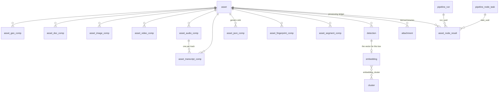

# MetaLoom Database — Asset Result Persistence Task List

> Work items to prepare the **database schema** for persisting Cortex node results.
> Format follows [../../TASKS.template.md](../../TASKS.template.md).
>
> **Context:** [../pipeline-nodes/NODES.md](../pipeline-nodes/NODES.md) (what the nodes
> produce) · [../DB_SCHEMA_FEEDBACK.md](../DB_SCHEMA_FEEDBACK.md) (audit that motivated
> this list) · [../pipeline/PIPELINE.md](../pipeline/PIPELINE.md) (run/task ledger) ·
> [../permissions/PERMISSIONS.md](../permissions/PERMISSIONS.md)
>
> **Scope:** schema only — migrations, the jOOQ-generated layer, and the DAO/model
> interfaces needed to keep the build green. REST endpoints and the Cortex→Loom sync
> path are explicitly **out of scope** and come after this list.

---

## 1. Why this list exists

Today exactly **one** node persists anything to Loom:

```
cortex/nodes/whisper/core/.../WhisperNode.java:82   client().createAssetTranscript(assetUuid, request).sync();
```

Every other node in [NODES.md §3](../pipeline-nodes/NODES.md) — facedetect, OCR, Tika,
quality, captioning, LLM, scene detection, fingerprint, consistency — writes only to
xattrs or sidecar files. The single generic sync path, `AssetBulkUpdateEntry`, carries
only `HashInfo`, so it cannot express anything but hashes.

The component tables exist and their *shape of idea* is right, but they cannot receive
node output safely:

- **No idempotency key.** Every `asset_*_comp` table is keyed only by its surrogate
  `uuid`. A retry, a lease expiry or a manual re-run appends a second row.
  `pipeline_node_task` got `UNIQUE (item_uuid, node_id)` for exactly this reason; the
  reasoning was never applied one layer down.
- **No provenance.** Nothing records which node, which version, or which run produced
  a row. `source varchar` carries four different meanings across the seven tables.
- **No multiplicity discriminator.** A video with two audio tracks needs two audio
  components and two transcripts. Nothing expresses "which track".

Because almost nothing reads or writes these tables yet, this is the cheapest possible
moment to fix the shape. Migrations here are allowed to be **destructive**.

### 1.1 Decisions already taken

| Decision | Choice | Consequence |
|---|---|---|
| Re-run semantics | **Replace in place** | Unique keys exclude `producer_version`; a re-run upserts. `producer_version` is stored so stale rows stay findable. |
| Multi-track / multi-page | **Typed discriminators per table** | `stream_index`, `page_number`, `lang`, `sector_index` — no separate `asset_stream` table. |
| Migration style | **Destructive rewrite** | `DROP`/recreate. No data preservation, no legacy `source` semantics carried forward. |
| Scope | Node-result surface + 2 blockers | Asset identity (PK/FK split) and nullable machine-written audit columns are in. ACL PKs, `timestamptz`, `tag_asset`, `asset_location`, delete cascades are **out** — separate document. |

---

## 2. The three-layer model

```
                    ┌─────────────────────────────────────────────┐
                    │ Layer 3 — asset_node_result (ledger)        │
                    │ "has node X @ version V processed asset A?" │
                    │ node-agnostic, one row per (asset,node)     │
                    └─────────────────────────────────────────────┘
                                       │ describes
        ┌──────────────────────────────┴──────────────────────────────┐
        ▼                                                             ▼
┌───────────────────────────────────┐        ┌──────────────────────────────────┐
│ Layer 1 — typed component tables  │        │ Layer 2 — asset_json_comp        │
│ asset_geo/doc/image/video/audio/  │        │ generic, node-agnostic sink      │
│ transcript/fingerprint/segment    │        │ keyed by schema_type + variant   │
│ + detection / embedding           │        │                                  │
│ USE WHEN a feature must filter,   │        │ USE WHEN the result is opaque    │
│ search, sort, or render the value │        │ to Loom, or the node is new      │
└───────────────────────────────────┘        └──────────────────────────────────┘
```

**Layer 1 — typed component tables.** Domain-modelled. A column exists because a
feature needs it: full-text search over transcripts and OCR text, filtering by
resolution or duration, plotting geo points on a map, seeking to a scene boundary,
looking up a fingerprint for dedup.

**Layer 2 — the generic sink.** `asset_json_comp` absorbs anything that has no query
requirement yet. **Promotion policy:** a new node kind starts in `asset_json_comp`; it
graduates to a typed table when — and only when — one of these becomes true:

1. a query must filter or sort on a field inside the JSON,
2. the UI renders it as a first-class object with its own lifecycle,
3. it must participate in a foreign-key relationship.

**Layer 3 — the processing ledger.** `asset_node_result` answers "has this node already
run on this asset, at which version, and what happened" **regardless of which table the
payload landed in**. This is the node-agnostic layer the user asked for; it does not
compete with the typed tables, it indexes them.

It replaces the ad-hoc short-circuit in [NODES.md §1](../pipeline-nodes/NODES.md), step 4
("fetch the `AssetResponse` … so nodes can short-circuit if the result already exists
remotely"), which today works by probing individual asset fields — `md5 != null` and
friends — and does not generalise to nodes whose result is a JSON blob.

> **Not the same as `pipeline_node_task`.** That table is per *run item*: it is
> execution state, it is pruned with the run, and it is keyed by `(item_uuid, node_id)`.
> `asset_node_result` is per *asset*: it is catalog state, it outlives every run, and it
> is keyed by `(asset_uuid, node_kind, node_id)`.

---

## 3. Worked cases

These scenarios drive the schema below. Each one must be expressible **without** a
schema change.

| # | Scenario | Tables | Rows | Discriminator |
|---|---|---|---|---|
| 1 | Video with a German and an English audio track | `asset_audio_comp` | 2 | `stream_index` 0, 1 |
| 2 | …both tracks transcribed by Whisper | `asset_transcript_comp` | 2 | `stream_index` + `lang` |
| 3 | …re-transcribed with `large-v3` after `small` | `asset_transcript_comp` | 2 (upserted) | same key → row replaced, `producer_version` rewritten |
| 4 | Drone video with a continuous GPS track | `asset_geo_comp` | N | `time_from` (ms) |
| 5 | Photo with EXIF geo **and** an LLM location guess | `asset_geo_comp` | 2 | `node_kind` (`tika` vs `llm`) + `method` + `confidence` |
| 6 | Scanned 40-page PDF: Tika whole-doc text + per-page OCR | `asset_doc_comp` | 1 + 40 | `node_kind` + `page_number` (0 = whole document) |
| 7 | MP3 with embedded cover art | `asset_audio_comp` + `asset_image_comp` | 1 + 1 | an **audio** asset legitimately owns an image component — never gate component writes on the asset's mime type |
| 8 | Video scene detection → 120 scenes | `asset_segment_comp` | 120 | `segment_type = SCENE` + `seq` |
| 9 | …plus silence detection and LLM chapters on the same video | `asset_segment_comp` | +N | `segment_type` `SILENCE` / `CHAPTER` |
| 10 | Face detection on a video: 3 faces on frame 900 | `detection` | 3 | `frame_number` + `detection_index` |
| 11 | …each face embedded and clustered | `embedding` → `embedding_cluster` | 3 | `detection_uuid` FK |
| 12 | Object detection finds a dog and two cars in a photo | `detection` | 3 | `label` + `detection_index` |
| 13 | Multi-sector video fingerprint (8 sectors) | `asset_fingerprint_comp` | 8 | `algorithm` + `sector_index` |
| 14 | LLM node configured with three prompts | `asset_json_comp` | 3 | `schema_type` + `variant` (prompt id) |
| 15 | Contact-sheet thumbnail + a poster frame | `attachment` | 2 | `type` + `variant` |
| 16 | Tika probes a video, then QualityNode measures it | `asset_video_comp` | 2 | `node_kind` `tika` vs `quality` — **two partially-filled rows**, not one merged row (see the read-side rule below) |
| 17 | Consistency node finds a truncated download | `asset` | — | `zero_chunk_count` + new `is_complete` (intrinsic binary facts stay on `asset`) |

**Rules the cases establish:**

- A component's multiplicity is **always** expressed by typed columns, never by
  appending rows with the same key.
- The asset's mime type never restricts which component tables may be written (case 7).
- Two producers of the same *kind* of fact coexist by `node_kind` (case 5); the same
  producer re-running replaces (case 3).
- Intrinsic properties of the **bytes** (hashes, size, completeness) live on `asset`.
  Everything *derived by interpretation* lives in a component table.
- **Because `node_kind` is in every key, two producers of the same dimension yield two
  rows** (cases 5 and 16). This is intentional — it is what makes provenance and
  selective invalidation possible — but it puts a **merge rule on the read side**: a
  consumer that wants "the" width of a video coalesces across the rows for that
  `stream_index` in a documented producer precedence. Do not try to make writers merge
  into one row; that reintroduces the lost-update problem the keys exist to prevent.
  When the REST layer lands, that precedence belongs in `AssetComponentModelBuilder`.

### 3.1 Coverage: every node has a home

Checked against the node table in [NODES.md §3](../pipeline-nodes/NODES.md). No node
that produces persistable output is left without a target.

| Node | Output | Target after this list | Task |
|---|---|---|---|
| `MD5Node`, `SHA256Node`, `SHA512Node`, `ChunkHashNode` | hashes | `asset` columns (already exist) | — |
| `ConsistencyNode` | `zero_chunk_count`, `is_complete` | `asset` columns | 9 |
| `FingerprintNode` | multi-sector fingerprint | `asset_fingerprint_comp` | 4 |
| `TikaNode` | container/stream metadata, text | `asset_video/audio/image/doc_comp` | 1 |
| `QualityNode` | resolution, fps, frame count, blurriness | `asset_image_comp`, `asset_video_comp` | 1 |
| `OCRNode` | per-page text | `asset_doc_comp` (`page_number`) | 1 |
| `WhisperNode` | per-track transcript | `asset_transcript_comp` | 2 |
| `SceneDetectionNode` | time ranges | `asset_segment_comp` | 5 |
| `FacedetectNode` | bounding boxes, embeddings | `detection` + `embedding` | 6 |
| `FacedescriptionNode` | free-text description | `detection.meta`, or `asset_json_comp` | 3, 6 |
| `CaptioningNode` | caption | `asset_json_comp` (`schema_type = 'caption'`) | 3 |
| `LLMNode` | per-prompt answers | `asset_json_comp` (`variant` = prompt id) | 3 |
| `ThumbnailNode` | contact sheet | `attachment` (`CONTACT_SHEET`) | 7 |
| *every node* | did it run, at what version, with what outcome | `asset_node_result` | 8 |
| `HashDedupNode`, `FingerprintDedupNode` | moved files | `asset_location` — **out of scope**, blocked on its `UNIQUE (asset_uuid)` defect ([../DB_SCHEMA_FEEDBACK.md](../DB_SCHEMA_FEEDBACK.md) §2.3) | — |
| ~~`LoomNode`~~ | bulk hash sync | deleted — the hash nodes write `asset` themselves inside `compute()` | — |
| Filter nodes, `FilesystemSourceNode` | pass/reject, discovery | `pipeline_run_item` / `pipeline_node_task` — execution state, not catalog | — |

---

## 4. The shared component contract

Every `asset_*_comp` table gets this preamble. Deviating from it is a review failure.

```sql
uuid              uuid PRIMARY KEY DEFAULT uuid_generate_v4(),
asset_uuid        uuid    NOT NULL REFERENCES "asset" ("uuid") ON DELETE CASCADE,

-- provenance ---------------------------------------------------------------
node_kind         varchar NOT NULL,              -- 'whisper','ocr','tika','facedetect','manual'
node_id           varchar,                       -- graph-local id; NULL when not pipeline-produced
producer_version  varchar NOT NULL DEFAULT '',   -- model/algorithm version, e.g. 'whisper-large-v3'
run_uuid          uuid REFERENCES "pipeline_run" ("uuid")       ON DELETE SET NULL,
task_uuid         uuid REFERENCES "pipeline_node_task" ("uuid") ON DELETE SET NULL,
confidence        real,                          -- extraction confidence, where meaningful

meta              jsonb,

-- audit (nullable: these rows are written by workers, not users) ------------
created           timestamp NOT NULL DEFAULT now(),
creator_uuid      uuid REFERENCES "user" ("uuid"),
edited            timestamp NOT NULL DEFAULT now(),
editor_uuid       uuid REFERENCES "user" ("uuid")
```

plus, per table, typed discriminators and

```sql
UNIQUE (asset_uuid, node_kind, <discriminators>)
```

`source` is **removed** everywhere. Its four conflicting meanings split into `node_kind`
(who produced it), `producer_version` (with what), and — for geo only — a typed `method`
column (how).

`producer_version` is deliberately **not** in the unique key: a model upgrade upserts the
row and rewrites the version, and
`WHERE node_kind = 'whisper' AND producer_version <> 'large-v3'` finds everything that
needs recomputing.

### 4.1 Per-table discriminators

| Table | Unique key | New domain columns |
|---|---|---|
| `asset_geo_comp` | `(asset_uuid, node_kind, method, time_from)` | `method varchar NOT NULL DEFAULT ''`, `time_from bigint NOT NULL DEFAULT 0`, `accuracy_m real` |
| `asset_doc_comp` | `(asset_uuid, node_kind, page_number)` | `page_number int NOT NULL DEFAULT 0`, `page_count int`, `text_lang varchar`, `text_search tsvector` (generated) |
| `asset_image_comp` | `(asset_uuid, node_kind, stream_index)` | `stream_index int NOT NULL DEFAULT 0`, `blurriness real`, `orientation int`, `bit_depth int`, `image_encoding varchar` (was dropped by `V2.18`) |
| `asset_video_comp` | `(asset_uuid, node_kind, stream_index)` | `stream_index int NOT NULL DEFAULT 0`, `fps real`, `frame_count bigint`, `rotation int`, `blurriness real` |
| `asset_audio_comp` | `(asset_uuid, node_kind, stream_index)` | `stream_index int NOT NULL DEFAULT 0`, `lang varchar`, `track_title varchar`, `is_default boolean` |
| `asset_transcript_comp` | `(asset_uuid, node_kind, stream_index, lang)` | `stream_index int NOT NULL DEFAULT 0`, `lang varchar NOT NULL DEFAULT ''`, `audio_comp_uuid uuid` FK, `text_search tsvector` (generated) |
| `asset_json_comp` | `(asset_uuid, node_kind, schema_type, variant)` | `schema_type varchar NOT NULL`, `variant varchar NOT NULL DEFAULT ''`, GIN on `data` |
| `asset_fingerprint_comp` *(new)* | `(asset_uuid, node_kind, algorithm, sector_index)` | `algorithm varchar NOT NULL`, `sector_index int NOT NULL DEFAULT 0`, `fingerprint varchar NOT NULL`, `time_from/time_to bigint` |
| `asset_segment_comp` *(new)* | `(asset_uuid, node_kind, segment_type, seq)` | `segment_type varchar NOT NULL`, `seq int NOT NULL`, `time_from/time_to bigint NOT NULL`, `score real`, `title varchar` |

`asset_transcript_comp` carries **both** `audio_comp_uuid` and `stream_index`: the FK is
for navigation and cascade, the index is in the key because an audio-only asset may be
transcribed before any audio component row exists.

### 4.2 Target model



---

## 5. Working agreement

These steps apply to **every** migration task below. They are stated once; each task
assumes them.

1. Add the migration under
   `loom/db/flyway/src/main/resources/db/migration/` using the next free `V2.x` number.
2. Regenerate the jOOQ sources: `loom/db/jooq/generate.sh`
   (spins a testcontainer, migrates, regenerates into `src/jooq/java/`).
3. Reprovision the pooled test databases: `./setup-pool.sh` — **mandatory** after any
   Flyway change, otherwise every `loom/core` test fails with `Pool not found {loom-dev}`.
4. Fix what the regen breaks (the compiler will point at all of it):
   `loom/db/jooq/src/main/java/io/metaloom/loom/db/jooq/dao/asset/comp/*`,
   `AssetComponentDaoImpl`, `AssetComponentModelBuilder`, `AssetComponentEndpointService`,
   `DemoDatabaseInitializer` (~line 852 writes a transcript comp), and the
   `loom-shared/rest-model` example/response classes.
5. New `jsonb` columns: either extend the `forcedTypes` `includeExpression` in
   `loom/db/jooq/pom.xml` (currently `.*\.meta.*|.*\.outputs|.*\.definition`) so the
   column arrives as `io.vertx.core.json.JsonObject`, or convert manually from
   `org.jooq.JSONB` the way `AssetJsonCompImpl` already does.
6. Generated columns (`tsvector`): add them to the codegen `<excludes>` so jOOQ never
   tries to write them.
7. Clean-rebuild `loom/core` if an endpoint constructor changed, or Dagger will fail at
   runtime with `NoSuchMethodError`.
8. Update `loom/design/DB/dbdiagram.yaml` — its header says it must be regenerated from
   the migrations, not hand-edited to describe an unmigrated design.

---

## Task 1: Rewrite the geo/doc/image/video/audio components on the shared contract

**Argumentation Summary:** These five tables are the typed half of the result model and
none of them can currently receive node output safely. There is no unique key, so a
retried OCR or quality node silently appends a duplicate row; there is no provenance, so
a model upgrade cannot be detected let alone invalidated; and there is no discriminator,
so a video with two audio tracks or a PDF with 40 OCR'd pages cannot be represented at
all (worked cases 1, 6, 7). They also lost columns that nodes actually produce —
`V2.18` dropped `image_encoding` and never added `fps`, `frame_count` or `blurriness`,
all of which `QualityNode` emits.

**Improvement Summary:** Drop and recreate all five tables on the shared component
contract (§4) with typed discriminators, provenance columns, and the domain columns the
nodes need.

```
Create loom/db/flyway/src/main/resources/db/migration/V2.38__rework_asset_components.sql.

Destructive rewrite is explicitly sanctioned: nothing writes these tables except the
V2.18 'migrated' backfill.

  DROP TABLE IF EXISTS "asset_geo_comp","asset_doc_comp","asset_image_comp",
                       "asset_video_comp","asset_audio_comp" CASCADE;

Recreate each with the §4 preamble verbatim (uuid PK, asset_uuid FK CASCADE, node_kind,
node_id, producer_version, run_uuid, task_uuid, confidence, meta, audit with NULLABLE
creator_uuid/editor_uuid), then the per-table columns and key:

  asset_geo_comp
    method       varchar NOT NULL DEFAULT '',   -- 'exif' | 'xmp' | 'gps-track' | 'llm' | 'manual'
    time_from    bigint  NOT NULL DEFAULT 0,    -- ms offset; 0 for stills
    geo_lon      decimal(9,6),
    geo_lat      decimal(8,6),
    geo_alias    varchar,
    accuracy_m   real,
    UNIQUE (asset_uuid, node_kind, method, time_from)
    INDEX (asset_uuid), INDEX (geo_lon, geo_lat)

  asset_doc_comp
    page_number    int NOT NULL DEFAULT 0,      -- 0 = whole document
    page_count     int,
    text_lang      varchar,
    doc_plain_text text,
    doc_word_count int,
    text_search    tsvector GENERATED ALWAYS AS
                     (to_tsvector('simple', coalesce(doc_plain_text,''))) STORED,
    UNIQUE (asset_uuid, node_kind, page_number)
    INDEX (asset_uuid), GIN INDEX (text_search)

  asset_image_comp
    stream_index         int NOT NULL DEFAULT 0,   -- multi-frame TIFF/GIF, embedded cover art
    media_width          int,
    media_height         int,
    image_dominant_color varchar,
    image_encoding       varchar,                  -- restored; V2.18 dropped it
    orientation          int,
    bit_depth            int,
    blurriness           real,                     -- QualityNode
    UNIQUE (asset_uuid, node_kind, stream_index)

  asset_video_comp
    stream_index   int NOT NULL DEFAULT 0,
    media_width    int,
    media_height   int,
    media_duration bigint,                          -- ms
    video_bitrate  int,
    video_encoding varchar,
    fps            real,                            -- QualityNode
    frame_count    bigint,                          -- QualityNode
    rotation       int,
    blurriness     real,
    UNIQUE (asset_uuid, node_kind, stream_index)

  asset_audio_comp
    stream_index        int NOT NULL DEFAULT 0,
    lang                varchar,
    track_title         varchar,
    is_default          boolean,
    audio_bpm           int,
    audio_sampling_rate int,
    audio_channels      int,
    audio_bitrate       int,
    audio_encoding      varchar,
    media_duration      bigint,                     -- ms
    UNIQUE (asset_uuid, node_kind, stream_index)

Use 'simple' as the tsvector config — it is immutable and language-neutral, which a
GENERATED column requires and a multi-language corpus wants.

Then follow the working agreement (§5). In step 4 the model layer changes are:
  - AssetComponent (loom/db/api/.../model/asset/AssetComponent.java): replace
    getSource()/setSource() with getNodeKind()/setNodeKind(), and add nodeId,
    producerVersion, runUuid, taskUuid, confidence.
  - Each AssetXComp interface gains its discriminator accessors.
  - AssetComponentDao.createXComp(userUuid, assetUuid, source) becomes
    createXComp(userUuid, assetUuid, nodeKind) — see Task 12 for the upsert methods.
```

**References:** [../DB_SCHEMA_FEEDBACK.md](../DB_SCHEMA_FEEDBACK.md) §3.2, §3.3, §3.8 ·
[../pipeline-nodes/NODES.md](../pipeline-nodes/NODES.md) §3 · `V2.18__add_asset_components.sql`

**Test Requirements:** Extend `loom/db/jooq/src/test/java/io/metaloom/loom/db/jooq/dao/`
with a `AssetComponentKeyTest` following `AssetJsonCompDaoTest`. Per table: (a) two rows
with different `stream_index`/`page_number` coexist, (b) a second row with the same key
is rejected, (c) two rows with the same discriminator but different `node_kind` coexist,
(d) audit columns accept NULL. Plus one test that writes an `asset_image_comp` for an
audio asset (worked case 7).

---

## Task 2: Rework `asset_transcript_comp` — per-track transcripts and full-text search

**Argumentation Summary:** Transcription is the one result path that already works
end-to-end (`WhisperNode` → `createAssetTranscript` → UI `TranscriptPanel`), which makes
it the template for every other node. It is also the case where multiplicity is
unavoidable: a video with two audio tracks has two transcripts, and the same track may
be transcribed into two languages. Today nothing ties a transcript to the track it came
from, and nothing prevents a retry from producing a second identical row. Full-text
search over transcripts — "find the video where someone says X" — is a stated product
capability with no index to serve it.

**Improvement Summary:** Rebuild the table with a track discriminator, an FK to the
audio component, and a generated `tsvector`. Keep `transcript_json`: the UI already
consumes `transcriptJson.sections[]` with word-level timings
(`loom-ui/src/api/transcripts.ts`), so segment rows are not needed yet.

```
Create V2.39__rework_asset_transcript_comp.sql.

  DROP TABLE IF EXISTS "asset_transcript_comp" CASCADE;

Recreate with the §4 preamble plus:

    stream_index    int     NOT NULL DEFAULT 0,   -- which audio track
    lang            varchar NOT NULL DEFAULT '',  -- BCP-47; '' = undetermined
    audio_comp_uuid uuid REFERENCES "asset_audio_comp" ("uuid") ON DELETE SET NULL,
    model           varchar,                      -- keep; mirrors producer_version for readability
    transcript_text text,
    duration        bigint,                       -- ms (was int seconds)
    word_count      int,
    transcript_json jsonb,                        -- whisper sections/words, consumed by the UI
    text_search     tsvector GENERATED ALWAYS AS
                      (to_tsvector('simple', coalesce(transcript_text,''))) STORED,
    UNIQUE (asset_uuid, node_kind, stream_index, lang)
    INDEX (asset_uuid), INDEX (lang), INDEX (audio_comp_uuid)
    GIN INDEX (text_search)

Note on ON DELETE SET NULL for audio_comp_uuid: re-running the probe node replaces the
audio comp row (new uuid), and that must not delete the transcript. The transcript's
own link to the asset is the CASCADE one.

duration moves from int seconds to bigint milliseconds to match media_duration in
Task 1. Update TranscriptInfo / TranscriptResponse and the UI type
(loom-ui/src/api/transcripts.ts comments "whole seconds — send integers") accordingly,
or keep the REST field in seconds and convert in the model builder — pick one and
state it in the Javadoc.

Then follow the working agreement (§5). transcript_json must keep arriving as a
JsonObject: it is outside the forcedTypes includeExpression today and is converted by
hand in AssetTranscriptCompImpl — either extend the expression or keep the manual
conversion, but do not leave it as raw org.jooq.JSONB.
```

**References:** [../DB_SCHEMA_FEEDBACK.md](../DB_SCHEMA_FEEDBACK.md) §3.2, §3.8 ·
`WhisperNode.java` · `loom-ui/src/api/transcripts.ts` · `AssetTranscriptCompImpl.java`

**Test Requirements:** DAO test asserting: two tracks of one asset yield two rows; the
same `(node_kind, stream_index, lang)` upserts; a German and an English transcript of
the *same* track coexist; deleting the audio comp nulls the FK but keeps the transcript;
`text_search` is populated and a `plainto_tsquery` match returns the row.

---

## Task 3: Harden `asset_json_comp` as the generic node sink

**Argumentation Summary:** This is the table that carries the "node-agnostic
persistence" half of the design, and it is the destination for `LLMNode`,
`CaptioningNode`, `SceneDetectionNode` output and every node kind added in future. It
currently allows NULL `schema_type`, has no unique key, and has no discriminator — so an
LLM node configured with three prompts (worked case 14) produces three rows that cannot
be told apart, and a retry produces six. `data` has no GIN index, so the generic table
is also the unqueryable one.

**Improvement Summary:** Make `schema_type` mandatory, add a `variant` discriminator,
add the unique key and a GIN index, and write down the promotion policy that decides
when a node graduates out of this table.

```
Create V2.40__rework_asset_json_comp.sql.

  DROP TABLE IF EXISTS "asset_json_comp" CASCADE;

Recreate with the §4 preamble plus:

    schema_type varchar NOT NULL,               -- 'yolo-detection','caption','llm-answer'
    variant     varchar NOT NULL DEFAULT '',    -- prompt id, model tag, whatever sub-divides the kind
    data        jsonb   NOT NULL DEFAULT '{}',
    UNIQUE (asset_uuid, node_kind, schema_type, variant)
    INDEX (asset_uuid), INDEX (schema_type)
    GIN INDEX (data jsonb_path_ops)

Add a COMMENT ON TABLE stating the promotion policy verbatim:
  'Generic sink for node results with no query requirement. A node kind starts here and
   graduates to a typed component table when a query must filter on a field inside data,
   when the UI renders it as a first-class object, or when it needs a foreign key.'

data becomes NOT NULL DEFAULT '{}' so that "the node ran and produced nothing" is
expressed by the ledger (Task 8), not by a NULL payload.
```

**References:** [../DB_SCHEMA_FEEDBACK.md](../DB_SCHEMA_FEEDBACK.md) §3.8 ·
`V2.23__add_asset_json_comp.sql` · `AssetJsonCompDaoTest.java`

**Test Requirements:** Update `AssetJsonCompDaoTest`: three rows differing only by
`variant` coexist (worked case 14); a duplicate key is rejected; a `data @> '{...}'`
containment query uses the GIN index and returns the row.

---

## Task 4: Add `asset_fingerprint_comp`

**Argumentation Summary:** `FingerprintNode` computes a multi-sector video fingerprint
and `FingerprintDedupNode` consumes it, but there is nowhere to put it: it is not a hash
column on `asset`, not an `embedding`, and not a component. `FingerprintInfo`
(`loom-shared/rest-model/.../info/FingerprintInfo.java`) already declares a
`fingerprintV1` field with no backing column. Because there is no table, dedup-by-
fingerprint cannot be a database query at all — the whole point of computing it.

**Improvement Summary:** New component table, one row per sector, indexed for exact
lookup so "which other assets share this fingerprint" is an index scan.

```
Create V2.41__add_asset_fingerprint_comp.sql.

  CREATE TABLE "asset_fingerprint_comp" (
    <§4 preamble>,
    algorithm    varchar NOT NULL,             -- e.g. 'metaloom-multisector-v1'
    sector_index int     NOT NULL DEFAULT 0,   -- 0 for whole-asset fingerprints
    time_from    bigint,                       -- ms window this sector covers
    time_to      bigint,
    fingerprint  varchar NOT NULL,
    UNIQUE (asset_uuid, node_kind, algorithm, sector_index)
  );
  CREATE INDEX ON "asset_fingerprint_comp" ("asset_uuid");
  -- the dedup lookup: given a fingerprint, find every asset that shares it
  CREATE INDEX ON "asset_fingerprint_comp" ("algorithm", "fingerprint");

Store the fingerprint as varchar (hex/base64) for now — matching FingerprintInfo — and
note in a COMMENT that bytea is the better long-term type if the values grow.
```

**References:** [../DB_SCHEMA_FEEDBACK.md](../DB_SCHEMA_FEEDBACK.md) §3.8 ·
[../pipeline-nodes/NODES.md](../pipeline-nodes/NODES.md) §3 (`FingerprintNode`,
`FingerprintDedupNode`) · `FingerprintInfo.java`

**Test Requirements:** DAO test: 8 sectors of one asset coexist; re-running the node
upserts each sector rather than appending; a lookup by `(algorithm, fingerprint)`
returns both assets that share a sector.

---

## Task 5: Add `asset_segment_comp`

**Argumentation Summary:** `SceneDetectionNode` produces a list of time ranges and has
nowhere to put it. Time-ranged results are a whole category, not a one-off: scene
boundaries, silence detection, shot changes, and LLM-generated chapters all have the
same shape, and the UI's `VideoTimeline` needs them as rows to render and seek. Forcing
them into `asset_json_comp` means the timeline cannot query "segments overlapping
00:12:30" without parsing every blob.

**Improvement Summary:** One time-range component table covering all segment kinds,
discriminated by `segment_type`.

```
Create V2.42__add_asset_segment_comp.sql.

  CREATE TABLE "asset_segment_comp" (
    <§4 preamble>,
    segment_type varchar NOT NULL,             -- 'SCENE' | 'SILENCE' | 'SHOT' | 'CHAPTER'
    seq          int     NOT NULL,             -- ordinal within (asset, node_kind, segment_type)
    time_from    bigint  NOT NULL,             -- ms
    time_to      bigint  NOT NULL,             -- ms
    title        varchar,                      -- chapter titles from the LLM node
    score        real,                         -- detector score, distinct from `confidence`
    UNIQUE (asset_uuid, node_kind, segment_type, seq)
  );
  CREATE INDEX ON "asset_segment_comp" ("asset_uuid");
  CREATE INDEX ON "asset_segment_comp" ("asset_uuid", "segment_type", "time_from");
  ALTER TABLE "asset_segment_comp"
    ADD CONSTRAINT asset_segment_comp_range_check CHECK (time_to >= time_from);

segment_type stays a CHECKed varchar rather than a PG enum: node authors will add kinds,
and ALTER TYPE ... ADD VALUE cannot run inside a Flyway transaction. Add the CHECK with
the known values and a COMMENT saying to extend it.

Replace-in-place at the SET level: a re-run writes seq 0..N-1 again and must DELETE rows
with seq >= N for that (asset, node_kind, segment_type). Document that contract in a
COMMENT — it is the one place where the upsert is not a single statement.
```

**References:** [../pipeline-nodes/NODES.md](../pipeline-nodes/NODES.md) §3
(`SceneDetectionNode`) · [../DB_SCHEMA_FEEDBACK.md](../DB_SCHEMA_FEEDBACK.md) §3.8 ·
`loom-ui/src/features/assetDetail/VideoTimeline.tsx`

**Test Requirements:** DAO test: 120 scenes coexist; scenes and chapters for the same
asset coexist; a re-run producing fewer segments leaves no orphans; an overlap query
`time_from <= t AND time_to >= t` returns the right segment; the range CHECK rejects
`time_to < time_from`.

---

## Task 6: Rework `detection` and `embedding`

**Argumentation Summary:** A face detection and the embedding computed from that same
region are the canonical pair, and there is no FK between them. Both carry an
independent copy of the geometry in *different units and conventions* — `detection` uses
normalized `real` bounding boxes, `embedding` uses absolute `int` `areaStartX/Y` — so
correlating them requires floating-point matching plus the asset's pixel dimensions.
Neither table has provenance or an idempotency key, so re-running `FacedetectNode` on a
video appends a complete second set of detections for every frame. `embedding` also has
no `dimensions` and no model identity, so a 512-d InspireFace vector and a 128-d dlib
vector are distinguishable only by a free-text `type`.

**Improvement Summary:** Give both tables the provenance columns and an idempotency key,
link `embedding` to `detection`, drop the duplicated geometry, and normalise the
camelCase column names.

```
Create V2.43__rework_detection_embedding.sql.

detection — recreate with:
    <§4 preamble, minus `confidence` which detection already has as NOT NULL DEFAULT 0>
    type            varchar NOT NULL,           -- 'facedetection' | 'objectdetection'
    label           varchar,                    -- object class; was buried in meta
    frame_number    int  NOT NULL DEFAULT 0,    -- 0 for images
    detection_index int  NOT NULL DEFAULT 0,    -- ordinal within the frame
    time_from       bigint,                     -- ms, for video
    bbox_x/y/width/height real NOT NULL DEFAULT 0,   -- normalized 0..1, unchanged
    confidence      real NOT NULL DEFAULT 0,
    UNIQUE (asset_uuid, node_kind, frame_number, detection_index)
    INDEX (asset_uuid), INDEX (type), INDEX (label)
    FK asset_uuid ... ON DELETE CASCADE      -- V2.27 omitted the cascade

embedding — recreate with:
    <§4 preamble>
    type           varchar NOT NULL,            -- 'dlib_facemark', 'inspireface'
    model          varchar,                     -- readable mirror of producer_version
    dimensions     int NOT NULL,                -- length of `vector`; guards mismatched models
    vector         real[] NOT NULL,
    detection_uuid uuid REFERENCES "detection" ("uuid") ON DELETE CASCADE,
    frame_number   int NOT NULL DEFAULT 0,
    subject_index  int NOT NULL DEFAULT 0,      -- nth subject when there is no detection row
    time_from      bigint,                      -- ms window, for audio/video embeddings
    time_to        bigint,
    UNIQUE (asset_uuid, node_kind, type, frame_number, subject_index)
    INDEX (asset_uuid), INDEX (detection_uuid)

Drop embedding.areaStartX/areaStartY/areaWidth/areaHeight entirely — the geometry lives
on the linked detection, in one convention. Rename fromTime/toTime to time_from/time_to;
the quoted camelCase identifiers are a wart that every query has to quote.

Do NOT introduce pgvector in this task. Record the open decision in a COMMENT ON COLUMN
embedding.vector: similarity search is either pgvector-in-Postgres or an external index
fed via vector_config, and until that is decided `vector` is a staging buffer with no
ANN index. See DB_SCHEMA_FEEDBACK.md §4.2.

embedding_cluster and attachment.embedding_uuid reference embedding.uuid — recreate
those FKs after the rewrite.
```

**References:** [../DB_SCHEMA_FEEDBACK.md](../DB_SCHEMA_FEEDBACK.md) §4.1, §4.2, §4.4 ·
`V2.12__add_embedding.sql`, `V2.27__add_detection.sql` ·
[../pipeline-nodes/NODES.md](../pipeline-nodes/NODES.md) §3 (`FacedetectNode`)

**Test Requirements:** DAO test: three detections on one frame coexist (worked case 10);
a re-run upserts them instead of doubling; an embedding linked to a detection is deleted
with it; an embedding with no detection (whole-image) round-trips via `subject_index`;
`dimensions` mismatch against `vector.length` is caught by the DAO.

---

## Task 7: Make `attachment` the derived-binary sink

**Argumentation Summary:** `ThumbnailNode` produces contact sheets and has nowhere to
record them — `attachment` exists with `attachment_type = ASSET_THUMBNAIL`, but it has
no node provenance and no discriminator, so thumbnails from different node versions are
indistinguishable and an asset cannot have both a contact sheet and a poster frame
(worked case 15). `annotation.thumbnail varchar` is a third, parallel thumbnail
mechanism. Derived binaries are a general category — proxies, waveforms, extracted audio
— and every one of them will hit the same wall.

**Improvement Summary:** Add provenance and a `variant` discriminator to `attachment`,
extend `attachment_type`, and make it the single home for node-produced derived
binaries.

```
Create V2.44__attachment_provenance.sql. This one is ADDITIVE — attachment_binary holds
real content-addressed rows and attachment is referenced by embedding.

  ALTER TYPE "attachment_type" ADD VALUE IF NOT EXISTS 'CONTACT_SHEET';
  ALTER TYPE "attachment_type" ADD VALUE IF NOT EXISTS 'POSTER_FRAME';
  ALTER TYPE "attachment_type" ADD VALUE IF NOT EXISTS 'WAVEFORM';
  ALTER TYPE "attachment_type" ADD VALUE IF NOT EXISTS 'PROXY';
  ALTER TYPE "attachment_type" ADD VALUE IF NOT EXISTS 'EXTRACTED_AUDIO';

  ALTER TABLE "attachment"
    ADD COLUMN "node_kind"        varchar,
    ADD COLUMN "node_id"          varchar,
    ADD COLUMN "producer_version" varchar NOT NULL DEFAULT '',
    ADD COLUMN "variant"          varchar NOT NULL DEFAULT '',   -- 'sheet-1', 't=00:10'
    ADD COLUMN "run_uuid"         uuid REFERENCES "pipeline_run" ("uuid")       ON DELETE SET NULL,
    ADD COLUMN "task_uuid"        uuid REFERENCES "pipeline_node_task" ("uuid") ON DELETE SET NULL;

  -- asset_uuid is nullable (an attachment may hang off an embedding instead), so the
  -- idempotency key must be a partial index
  CREATE UNIQUE INDEX attachment_asset_variant_key
    ON "attachment" ("asset_uuid","type","node_kind","variant")
    WHERE "asset_uuid" IS NOT NULL AND "node_kind" IS NOT NULL;

  ALTER TABLE "attachment" ADD CONSTRAINT attachment_target_check
    CHECK (num_nonnulls("asset_uuid","embedding_uuid") = 1);

IMPORTANT: ALTER TYPE ... ADD VALUE cannot run inside a transaction block on PostgreSQL
versions before 12, and Flyway wraps migrations in one. Put the ALTER TYPE statements in
their own migration file with `-- flyway:executeInTransaction=false` if the migration
fails; V2.25 and V2.27 already add enum values, so check how those behave first.

Leave annotation.thumbnail alone in this task, but add a COMMENT marking it as
superseded by an attachment of type POSTER_FRAME.
```

**References:** [../DB_SCHEMA_FEEDBACK.md](../DB_SCHEMA_FEEDBACK.md) §3.8, §8.4 ·
`V2.13__add_attachment.sql` · [../pipeline-nodes/NODES.md](../pipeline-nodes/NODES.md) §3
(`ThumbnailNode`)

**Test Requirements:** DAO test: a contact sheet and a poster frame for one asset
coexist; re-running the thumbnail node upserts each variant; an attachment linked to an
embedding (no asset) is unaffected by the partial index; the target CHECK rejects rows
with both or neither target.

---

## Task 8: Add the `asset_node_result` processing ledger

**Argumentation Summary:** This is the node-agnostic layer. Today "has this node already
processed this asset?" is answered by `AbstractMediaNode` fetching the asset and probing
a field it knows about — `md5 != null`, `facedetect_flag` in an xattr. That does not
generalise: a node whose result is a JSON blob, or whose result is legitimately empty,
has nothing to probe. Nor can anyone answer "which assets did the old face model touch?"
after a model upgrade — the open *"No node versioning"* item in
[NODES.md §10](../pipeline-nodes/NODES.md). `pipeline_node_task` cannot serve this: it
is per run item and is pruned with the run.

**Improvement Summary:** One row per `(asset, node_kind, node_id)` recording the outcome
and the producer version, independent of where the payload landed.

```
Create V2.45__add_asset_node_result.sql.

  CREATE TABLE "asset_node_result" (
    uuid             uuid PRIMARY KEY DEFAULT uuid_generate_v4(),
    asset_uuid       uuid    NOT NULL REFERENCES "asset" ("uuid") ON DELETE CASCADE,
    node_kind        varchar NOT NULL,
    node_id          varchar NOT NULL DEFAULT '',
    producer_version varchar NOT NULL DEFAULT '',
    state            varchar NOT NULL,          -- SUCCESS | SKIPPED | FAILED  (ResultState)
    origin           varchar,                   -- COMPUTED | LOCAL | REMOTE  (ResultOrigin)
    reason           varchar,                   -- skip reason / failure detail
    run_uuid         uuid REFERENCES "pipeline_run" ("uuid")       ON DELETE SET NULL,
    task_uuid        uuid REFERENCES "pipeline_node_task" ("uuid") ON DELETE SET NULL,
    started          timestamp,
    finished         timestamp,
    duration_ms      bigint,
    result_ref       jsonb,                     -- {"table":"asset_transcript_comp","uuids":[...]}
    meta             jsonb,
    created          timestamp NOT NULL DEFAULT now(),
    creator_uuid     uuid REFERENCES "user" ("uuid"),
    edited           timestamp NOT NULL DEFAULT now(),
    editor_uuid      uuid REFERENCES "user" ("uuid"),
    CONSTRAINT asset_node_result_unique UNIQUE (asset_uuid, node_kind, node_id),
    CONSTRAINT asset_node_result_state_check
      CHECK (state IN ('SUCCESS','SKIPPED','FAILED'))
  );
  CREATE INDEX ON "asset_node_result" ("asset_uuid");
  -- the invalidation sweep: "everything facedetect produced before v2"
  CREATE INDEX ON "asset_node_result" ("node_kind", "producer_version");
  CREATE INDEX ON "asset_node_result" ("run_uuid");

state/origin mirror ResultState and ResultOrigin from the Cortex node API
(NODES.md §1) so the sync path is a direct mapping with no translation table.

Document in a COMMENT ON TABLE how this differs from pipeline_node_task: per-asset and
permanent vs per-run-item and prunable. Both may exist for the same execution; the
run_uuid/task_uuid columns are the join.

result_ref is advisory, not a foreign key — a node may write to several tables, and the
rows it points at have their own task_uuid back-reference. Do not build integrity on it.
```

**References:** [../pipeline-nodes/NODES.md](../pipeline-nodes/NODES.md) §1 (lifecycle
step 4, `ResultState`, `ResultOrigin`), §10 ("No node versioning") ·
[../DB_SCHEMA_FEEDBACK.md](../DB_SCHEMA_FEEDBACK.md) §3.4 ·
`V2.31__add_pipeline_execution_state.sql`

**Test Requirements:** DAO test: one row per node per asset; re-running upserts and
rewrites `producer_version`, `state` and `finished`; the invalidation query
`WHERE node_kind = ? AND producer_version <> ?` returns exactly the stale assets;
deleting the run nulls `run_uuid` but keeps the ledger row; deleting the asset removes it.

---

## Task 9: Fix asset identity and add the consistency flag

**Argumentation Summary:** `asset` has `PRIMARY KEY (sha512sum)` and a separate unique
`uuid`, and **every child table foreign-keys `uuid` — not the primary key**. Two identity
columns must be kept consistent forever, the PK is a 128-character varchar in every
index, and `uuid` is nullable despite being the FK target of a dozen tables. All the new
tables above FK `asset(uuid)`, so this should be settled before they multiply.
Separately, `ConsistencyNode` emits `zero_chunk_count` *and* `is_complete`; only the
first has a column, and it is the second that `ThumbnailNode` reads upstream.

**Improvement Summary:** Make `uuid` the primary key, keep `sha512sum` as a `NOT NULL
UNIQUE` natural key, and add `is_complete`.

```
Create V2.46__asset_identity.sql.

  -- 1. uuid becomes the real primary key
  UPDATE "asset" SET "uuid" = uuid_generate_v4() WHERE "uuid" IS NULL;
  ALTER TABLE "asset" ALTER COLUMN "uuid" SET NOT NULL;
  ALTER TABLE "asset" DROP CONSTRAINT "asset_pkey";
  ALTER TABLE "asset" ADD PRIMARY KEY ("uuid");

  -- 2. sha512sum stays the content identity, now as a natural key
  ALTER TABLE "asset" ADD CONSTRAINT asset_sha512sum_key UNIQUE ("sha512sum");
  -- (it is already NOT NULL; keep it that way — see the note below)

  -- 3. ConsistencyNode's second output
  ALTER TABLE "asset" ADD COLUMN "is_complete" boolean;
  COMMENT ON COLUMN "asset"."is_complete" IS
    'ConsistencyNode verdict. NULL = not yet checked.';

  -- 4. drop the superseded inline S3 pointer (asset_location.pool_uuid replaces it)
  ALTER TABLE "asset" DROP COLUMN IF EXISTS "s3_bucket_name";
  ALTER TABLE "asset" DROP COLUMN IF EXISTS "s3_object_path";

Check first whether any child FK explicitly targets sha512sum (grep the migrations for
REFERENCES "asset" ("sha512sum") — as of V2.37 there are none, every child targets uuid).

DECISION TO RECORD, not to implement: sha512sum stays NOT NULL. An asset row therefore
still cannot exist before a hashing node has run. That is deliberate — the entire node
system already assumes SHA-512 is available (AbstractMediaNode fetches the asset by
SHA-512 in lifecycle step 4), and pipeline_run_item already carries the pre-hash
identity (media_path + nullable sha512). Nodes upstream of hashing hold their outputs
in pipeline_node_task.outputs and the sync flushes them once identity exists. Write
this rule into a COMMENT ON TABLE "asset" so the next reader does not re-litigate it.

Intrinsic properties of the BYTES (hashes, size, zero_chunk_count, is_complete) stay on
asset. Everything derived by interpretation goes into a component table. State that rule
in the same COMMENT.
```

**References:** [../DB_SCHEMA_FEEDBACK.md](../DB_SCHEMA_FEEDBACK.md) §2.1, §2.2, §2.5,
§3.8 · `V2.8__add_asset.sql` ·
[../pipeline-nodes/NODES.md](../pipeline-nodes/NODES.md) §1, §3 (`ConsistencyNode`)

**Test Requirements:** Existing `AssetDaoTest` must pass unchanged. Add: inserting two
assets with the same `sha512sum` is rejected; `uuid` cannot be NULL; a child row in each
of the tables from Tasks 1–8 still cascades on asset delete.

---

## Task 10: Make audit columns nullable on machine-written tables

**Argumentation Summary:** `creator_uuid`/`editor_uuid` are `NOT NULL` on every result
table, but these rows are written by *workers*, not users. `cortex_instance` already
recognised this in `V2.33` and made its audit columns nullable with a comment explaining
why; the result tables have exactly the same property and did not get the same
treatment. The consequence is that the sync path — which does not exist yet, so this is
free to fix now — would have to invent a synthetic user for every row.

**Improvement Summary:** Relax the audit columns on tables written by machines. Tasks
1–8 already create their new tables this way; this task cleans up the ones they do not
recreate.

```
Create V2.47__machine_written_audit_columns.sql.

  ALTER TABLE "detection"  ALTER COLUMN "creator_uuid" DROP NOT NULL;
  ALTER TABLE "detection"  ALTER COLUMN "editor_uuid"  DROP NOT NULL;
  ALTER TABLE "embedding"  ALTER COLUMN "creator_uuid" DROP NOT NULL;
  ALTER TABLE "embedding"  ALTER COLUMN "editor_uuid"  DROP NOT NULL;
  ALTER TABLE "attachment" ALTER COLUMN "creator_uuid" DROP NOT NULL;
  ALTER TABLE "attachment" ALTER COLUMN "editor_uuid"  DROP NOT NULL;

  COMMENT ON COLUMN "detection"."creator_uuid" IS
    'NULL when written by a Cortex worker rather than a user (see cortex_instance).';
  -- ...same comment on the others

If Tasks 6 and 7 already recreated detection/embedding with nullable audit columns, this
migration reduces to attachment only — verify before writing it rather than assuming.

Then check the Java side: AbstractEditableElement and the DAO impls must tolerate a null
creator/editor, and AssetComponentModelBuilder must not NPE when building the `status`
block of a response for a machine-written row. That builder currently assumes a creator
exists.
```

**References:** [../DB_SCHEMA_FEEDBACK.md](../DB_SCHEMA_FEEDBACK.md) §8.2 ·
`V2.33__add_cortex_instance.sql` · `AssetComponentModelBuilder.java`

**Test Requirements:** DAO test inserting a row with null creator/editor into each
affected table; a REST model build over such a row produces a response with an absent
(not crashed) `status.creator`.

---

## Task 11: Settle the permission model for the new tables

**Argumentation Summary:** `loom_permission` has `*_ASSET`, `*_ASSET_LOCATION`,
`*_ASSET_BINARY`, `*_ASSET_POOL`, `*_DETECTION` and `*_EMBEDDING`, but nothing for
components — while `detection` and `embedding`, which are equally sub-resources of an
asset, got their own. Tasks 4, 5 and 8 add three more tables. Without a stated rule the
next table will guess, and the inconsistency compounds. The endpoints land after this
list, so the rule must be fixed now, not discovered later.

**Improvement Summary:** Adopt the sub-resource rule already used by
`pipeline_run_item` — components are guarded by their parent's permissions — and
document it. No enum change unless the UI needs an independent grant.

```
This task is mostly a decision + documentation task.

RECOMMENDED RULE:
  - All asset_*_comp tables, asset_fingerprint_comp, asset_segment_comp and
    asset_node_result are SUB-RESOURCES of an asset: reads require READ_ASSET, writes
    require UPDATE_ASSET. No new permission values.
    Precedent: V2.31 states "No new permissions are introduced: both tables are
    sub-resources of a run and are guarded by the existing READ_PIPELINE_RUN /
    UPDATE_PIPELINE_RUN."
  - detection and embedding KEEP their existing dedicated permissions — they are already
    granted in the wild and are exposed as first-class REST resources.

1. Write the rule into ../permissions/PERMISSIONS.md with the reasoning and the
   precedent, so the next table follows it.
2. Add a COMMENT ON TABLE to each new table naming the permission that guards it.
3. Only if the UI needs to grant component access independently of asset access, add a
   V2.48 migration with CREATE/READ/UPDATE/DELETE_ASSET_COMPONENT and wire it into
   loom/db/api/.../model/perm/Permission.java. Do not add it speculatively — an unused
   enum value still has to be maintained and mapped forever.

Note the ALTER TYPE gotcha from Task 7 if a V2.48 does turn out to be needed.
```

**References:** [../permissions/PERMISSIONS.md](../permissions/PERMISSIONS.md) ·
[../DB_SCHEMA_FEEDBACK.md](../DB_SCHEMA_FEEDBACK.md) §7.2 ·
`V2.31__add_pipeline_execution_state.sql` (the precedent) ·
`loom/db/api/src/main/java/io/metaloom/loom/db/model/perm/Permission.java`

**Test Requirements:** If no enum change: an endpoint test asserting a user with
`READ_ASSET` but no component-specific grant can read components (once endpoints exist —
until then, this is a documentation-only assertion). Grant test permissions via
group+role, never a direct `user_permission` insert (see §7 Gotchas).

---

## Task 12: Realign the Java model and DAO layer

**Argumentation Summary:** The migrations above break the generated jOOQ layer and every
class built on it. Doing this cleanup once, deliberately, is better than patching it
five times as each migration lands. The DAO also lacks the one operation the whole
design depends on: **upsert by the component's unique key**. `AssetComponentDao` today
exposes only `createXComp(userUuid, assetUuid, source)` and `loadXComps(assetUuid)` —
there is no load-by-key and no conflict handling, so even with the constraints in place
the sync path would have nothing to call.

**Improvement Summary:** Update the model interfaces to the new contract and give the
DAO an upsert per component type.

```
1. loom/db/api/src/main/java/io/metaloom/loom/db/model/asset/AssetComponent.java
   Replace getSource()/setSource() with:
     String  getNodeKind();          SELF setNodeKind(String kind);
     String  getNodeId();            SELF setNodeId(String id);
     String  getProducerVersion();   SELF setProducerVersion(String v);
     UUID    getRunUuid();           SELF setRunUuid(UUID uuid);
     UUID    getTaskUuid();          SELF setTaskUuid(UUID uuid);
     Float   getConfidence();        SELF setConfidence(Float c);

2. Each AssetXComp interface gains its discriminator accessors (streamIndex,
   pageNumber, method/timeFrom, lang, schemaType/variant, algorithm/sectorIndex,
   segmentType/seq).

3. AssetComponentDao gains, per component type:
     AssetXComp loadXComp(UUID assetUuid, String nodeKind, <discriminators>);
     AssetXComp upsertXComp(AssetXComp comp);      // INSERT ... ON CONFLICT DO UPDATE
   Implement upsert in AssetComponentDaoImpl using jOOQ's
     insertInto(...).onConflict(KEY_FIELDS).doUpdate().set(...)
   NOT store(), which is INSERT-only and will throw on the second write — the exact trap
   PIPELINE_TASKS.md Task 2 hit with PipelineRunTracker.

4. New DAOs for the new tables: AssetFingerprintCompDao / AssetSegmentCompDao folded
   into AssetComponentDao, and a standalone AssetNodeResultDao with
   loadByAsset(assetUuid), loadByNode(assetUuid, nodeKind, nodeId),
   findStale(nodeKind, currentVersion) and upsert. Register it on DaoCollection /
   DaoCollectionImpl / DaoProvider alongside the existing DAOs, jOOQ-only (no in-memory
   implementation, matching the pipeline and cortex_instance DAOs).

5. Update the consumers the compiler flags: AssetComponentModelBuilder,
   AssetComponentEndpointService, DemoDatabaseInitializer (~line 852), and the
   loom-shared/rest-model classes (AssetComponentCreateRequest/UpdateRequest/Response,
   AssetComponentExamples, TranscriptInfo, FingerprintInfo — which finally gets a
   backing table).

Endpoint SHAPE changes are out of scope: keep the existing routes compiling and
behaving, and leave new endpoints to the follow-up REST work.
```

**References:** `AssetComponent.java`, `AssetComponentDao.java`,
`AssetComponentDaoImpl.java` (552 lines), `AssetComponentModelBuilder.java`,
`AssetComponentEndpointService.java`, `DaoCollection.java` ·
[../pipeline/PIPELINE_TASKS.md](../pipeline/PIPELINE_TASKS.md) Task 2 (the `store()` trap)

**Test Requirements:** Every DAO test from Tasks 1–8 runs through `upsertXComp` and
asserts the second call updates rather than inserts (row count stays 1, `producer_version`
changed). `AssetJsonCompDaoTest` is the pattern to follow.

---

## Task 13: Regenerate `loom/design/DB/dbdiagram.yaml`

**Argumentation Summary:** The diagram's own header says it reflects the migrations
"up to and including V2.37" and that it must be regenerated when the schema changes
rather than hand-edited. After Tasks 1–11 it describes a schema that no longer exists,
and it is the artefact people read before they read SQL.

**Improvement Summary:** Bring the diagram back in sync and re-point the audit document
at it.

```
1. Update loom/design/DB/dbdiagram.yaml to match the migrations through the last one
   this list adds. Preserve the existing conventions: headercolor per group, tablegroup
   blocks, notes on non-obvious columns.
2. Add a tablegroup AssetResults covering the component tables, asset_fingerprint_comp,
   asset_segment_comp and asset_node_result.
3. Update the Project note's "up to and including V2.xx" line.
4. Mark the resolved findings in ../DB_SCHEMA_FEEDBACK.md — do not delete them; annotate
   with the task and migration that closed each, the way PIPELINE_TASKS.md annotates its
   done tasks.
```

**References:** `loom/design/DB/dbdiagram.yaml` ·
[../DB_SCHEMA_FEEDBACK.md](../DB_SCHEMA_FEEDBACK.md)

**Test Requirements:** None (documentation). Verify by pasting into dbdiagram.io and
confirming it renders without parse errors.

---

## 6. Test setup

```bash
# once, and again after EVERY Flyway change
./setup-pool.sh                     # provisions + populates the pooled test databases

# after every migration
loom/db/jooq/generate.sh            # testcontainer -> flyway migrate -> jOOQ codegen

# the tests that matter for this list
mvn test -pl loom/db/jooq           # DAO round-trip + constraint tests
mvn test -pl loom/core              # endpoint tests (needs the pool)
```

`AbstractJooqTest` (`loom/db/jooq/src/test/java/io/metaloom/loom/db/jooq/`) provides
`asset()`, `dummyUser()` and `assetComponentDao()`; `AssetJsonCompDaoTest` is the
reference for a component DAO test.

---

## 7. Conventions and Gotchas

- **`./setup-pool.sh` after every Flyway change.** Otherwise the pooled databases are
  stale and `loom/core` tests fail with `Pool not found {loom-dev}`. Compile
  `loom/fixture` first.
- **`store()` is INSERT-only.** It throws on the second write. Every idempotent write
  path in this document must use `insertInto(...).onConflict(...).doUpdate()`. This bit
  `PipelineRunTracker` already — see [../pipeline/PIPELINE_TASKS.md](../pipeline/PIPELINE_TASKS.md)
  Task 2.
- **`ALTER TYPE … ADD VALUE` cannot run inside a transaction block** on older
  PostgreSQL, and Flyway wraps migrations in one. If a migration adding enum values
  fails, split it out with `-- flyway:executeInTransaction=false`.
- **`user_permission` has `PRIMARY KEY (user_uuid)`** — one direct grant per user, ever.
  Grant test permissions via group+role (the `SkillEndpointTest` pattern), never a
  second direct insert. This is a known schema defect, out of scope here.
- **Clean-rebuild `loom/core`** after endpoint constructor changes or Dagger fails at
  runtime with `NoSuchMethodError`.
- **jOOQ and generated columns.** A `tsvector GENERATED ALWAYS AS … STORED` column must
  be excluded from codegen or jOOQ will try to write it on insert.
- **jsonb columns** only arrive as `io.vertx.core.json.JsonObject` if they match the
  `forcedTypes` `includeExpression` in `loom/db/jooq/pom.xml`
  (`.*\.meta.*|.*\.outputs|.*\.definition`). Otherwise they come through as
  `org.jooq.JSONB` and need manual conversion, as in `AssetJsonCompImpl`.
- **Never gate a component write on the asset's mime type.** An audio file has cover
  art; a PDF has embedded images; a video has a document track. Worked case 7.
- **Milliseconds, everywhere.** New time columns are `bigint` milliseconds. The legacy
  `int`-second columns are being replaced as their tables are rewritten.
- **`timestamp` vs `timestamptz`.** The whole schema uses `timestamp without time zone`.
  New tables follow suit for consistency; converting the schema is a separate,
  out-of-scope task ([../DB_SCHEMA_FEEDBACK.md](../DB_SCHEMA_FEEDBACK.md) §8.1).

---

## 8. Key Classes Reference

| Class / file | Package or path | Purpose |
|---|---|---|
| `AssetComponent` | `io.metaloom.loom.db.model.asset` | Base interface for all component types — gains the provenance contract in Task 12 |
| `AssetComponentDao` | `io.metaloom.loom.db.model.asset` | CRUD for all seven (soon ten) component types; gains upsert-by-key |
| `AssetComponentDaoImpl` | `io.metaloom.loom.db.jooq.dao.asset.comp` | jOOQ implementation, 552 lines — the main edit surface |
| `AssetJsonCompImpl` | `io.metaloom.loom.db.jooq.dao.asset.comp` | Reference for manual `JSONB` → `JsonObject` conversion |
| `AssetTranscriptComp` | `io.metaloom.loom.db.model.asset` | Transcript model; the template for per-track results |
| `AssetComponentModelBuilder` | `io.metaloom.loom.rest.builder` | DB model → REST response; assumes a non-null creator (Task 10) |
| `AssetComponentEndpointService` | `io.metaloom.loom.rest.service.impl` | Existing component routes; must keep compiling |
| `DemoDatabaseInitializer` | `io.metaloom.loom.core.boot` | Seeds demo data; writes a transcript comp at ~line 852 |
| `DaoCollection` / `DaoCollectionImpl` / `DaoProvider` | `io.metaloom.loom.db.dagger` | Where a new DAO is registered |
| `AbstractJooqTest` | `io.metaloom.loom.db.jooq` | Test base: `asset()`, `dummyUser()`, `assetComponentDao()` |
| `AssetJsonCompDaoTest` | `io.metaloom.loom.db.jooq.dao` | Reference component DAO test |
| `LoomJooqStrategy` | `io.metaloom.loom.db.jooq.codegen` | Codegen naming strategy |
| `WhisperNode` | `io.metaloom.cortex.node.whisper` | The only node that persists today (line 82) |
| `AssetBulkUpdateEntry` | `io.metaloom.loom.rest.model.asset` | The hash-shaped bulk sync payload the follow-up work must generalise |

---

## 9. Where do I find …?

| Concept | Path |
|---|---|
| Migrations | `loom/db/flyway/src/main/resources/db/migration/` |
| Generated jOOQ sources | `loom/db/jooq/src/jooq/java/io/metaloom/loom/db/jooq/` |
| Codegen config (`forcedTypes`, includes/excludes) | `loom/db/jooq/pom.xml` (~line 220) |
| Regenerate jOOQ | `loom/db/jooq/generate.sh` |
| Test pool provisioning | `./setup-pool.sh` → `io.metaloom.loom.test.PoolSetupRunner` |
| DAO interfaces | `loom/db/api/src/main/java/io/metaloom/loom/db/model/asset/` |
| DAO implementations | `loom/db/jooq/src/main/java/io/metaloom/loom/db/jooq/dao/asset/comp/` |
| REST models | `loom-shared/rest-model/src/main/java/io/metaloom/loom/rest/model/asset/` |
| REST services | `loom/services/rest/src/main/java/io/metaloom/loom/rest/service/impl/` |
| UI consumers | `loom-ui/src/api/transcripts.ts`, `loom-ui/src/features/assetDetail/` |
| ER diagram | `loom/design/DB/dbdiagram.yaml` |
| Node behaviour | [../pipeline-nodes/NODES.md](../pipeline-nodes/NODES.md) |
| Schema audit | [../DB_SCHEMA_FEEDBACK.md](../DB_SCHEMA_FEEDBACK.md) |

---

## 10. Progress Assessment

### Schema

- [x] **Task 1** — Rewrite geo/doc/image/video/audio comps on the shared contract (`V2.38`)
- [x] **Task 2** — Rework `asset_transcript_comp`: per-track FK, `lang` in key, FTS (`V2.39`)
- [x] **Task 3** — Harden `asset_json_comp` as the generic sink (`V2.40`)
- [x] **Task 4** — Add `asset_fingerprint_comp` (`V2.41`)
- [x] **Task 5** — Add `asset_segment_comp` (`V2.42`)
- [x] **Task 6** — Rework `detection` and `embedding` (`V2.43`)
- [x] **Task 7** — Make `attachment` the derived-binary sink (`V2.44`)
- [x] **Task 8** — Add the `asset_node_result` processing ledger (`V2.45`)
- [x] **Task 9** — Fix asset identity, add `is_complete`, drop legacy S3 columns (`V2.46`)
- [x] **Task 10** — Nullable audit columns on machine-written tables (`V2.47`)
- [x] **Task 11** — Settle the permission model for the new tables
      ([../permissions/PERMISSIONS.md](../permissions/PERMISSIONS.md) §2.5; no enum change)

### Code and documentation

- [x] **Task 12** — Realign the Java model and DAO layer, add upsert-by-key
- [x] **Task 13** — Regenerate `dbdiagram.yaml`, annotate resolved findings in the audit

### 10.1 Deviations from the plan, and why

Five things turned out differently once the migrations met the codebase. They are
recorded here rather than silently absorbed.

1. **`attachment` got no "exactly one target" CHECK.** The plan (and
   [../DB_SCHEMA_FEEDBACK.md](../DB_SCHEMA_FEEDBACK.md) §8.4) called for
   `num_nonnulls(asset_uuid, embedding_uuid) = 1`. `TestFixtureProvider` proves the
   assumption wrong: an `EMBEDDING_ATTACHMENT` deliberately carries **both** the embedding
   it depicts and the asset that embedding came from. The constraint was dropped and the
   reasoning written into `V2.44`. That finding is withdrawn, not deferred.

2. **`attachment.asset_uuid` gained `ON DELETE CASCADE`** even though delete cascades were
   scoped out. A node-produced thumbnail blocking deletion of the asset it depicts would
   have made the derived-binary sink unusable.

3. **`detection` and `embedding` needed model-layer work beyond the plan.** Both tables
   gained `NOT NULL` provenance columns, so `Detection`, `Embedding` and their DAOs had to
   learn `nodeKind` / `producerVersion` / `dimensions` / `detectionUuid` / `subjectIndex`.
   `EmbeddingDaoImpl.store` derives `dimensions` from the vector length rather than making
   callers repeat it.

4. **Transcript `duration` moved to milliseconds** (`Long`) across the DB, the REST model
   and the UI type. `WhisperNode` was already computing milliseconds and truncating them
   into an `int` seconds field — the cast is gone.

5. **The REST/GraphQL field stays named `source`.** It now maps to `node_kind` in the
   builders and services. Renaming the public field belongs with the endpoint rework, not
   with a schema-only change. `EmbeddingEndpointService.create` now honours `source` (it
   previously only did so on update), because it is part of the embedding's identity.

### 10.1a Follow-up: the pre-existing failures were fixed too (`V2.48`–`V2.50`)

The suite had 3 failures + 13 errors that predated this work. Fixing them turned up seven
defects, five of them in product code rather than in the tests.

**Schema**

| Migration | Defect |
|---|---|
| `V2.48` | `asset_location UNIQUE (asset_uuid)` dropped and replaced with the real natural key `(library_uuid, path)` — audit §2.3. Also `reaction`/`comment` → `annotation` gained `ON DELETE CASCADE`, so deleting an annotation anyone had reacted to no longer 500s. |
| `V2.49` | `pipeline.latest_version_uuid` and `skill.active_version_uuid` became `ON DELETE SET NULL`. The cycle with `pipeline_version.pipeline_uuid ON DELETE CASCADE` meant `DELETE /pipelines/:uuid` always failed — audit §6.3. |
| `V2.50` | `blacklist.name` added. The whole stack — REST request, endpoint, DAO, POJO, response builder — spoke `name`, but the column never existed, so every name was silently dropped on insert and came back null. |

**Code**

- `ClusterEndpointService.create` hardcoded `name = null` and `type = null` and ignored the
  request entirely; `cluster.name` is `NOT NULL`, so *every* cluster create 500'd.
  `ClusterModelBuilder.toResponse` also dropped `type`, `meta` and the creator/editor block.
- `AssetBinaryEndpointService.update` carried a `// TODO update` and never applied the
  filesystem path, so updating a binary silently kept the old one.
- An unknown sort key surfaced as a 500. It now returns 400 `BAD_QUERY_PARAMS`, mirroring
  `applyFilter`, which already rejected unknown *filter* keys that way.
- `PipelineModelValidator` read `definition.nodes` with `getJsonArray`, so a wrong-shaped
  definition threw `ClassCastException` → 500 instead of a 400.
- `UserModelBuilder.setStatus` NPE'd on rows with no creator (the machine-written case this
  work introduces); it now leaves the status block empty instead.

**Tests** — `AnnotationEndpointTest` never set the required `type`; `CombinedEndpointTest`
called `/api/v1/locations`, a route that does not exist (the table is served by `binaries`),
and sent a legacy map-shaped pipeline definition; `NodeDescriptorEndpointTest` parsed the
combined `{nodeDescriptors, contentTypes}` object as an array, and the helper swallowed the
decode error into a 10 s timeout; the DAO CRUD harness builds 1024 elements, so
`AssetLocation`/`Token`/`Blacklist` had to vary their unique fields and `PipelineDaoTest` had
to stop storing the row the harness also stores; nine `*ModelBuilderTest` snapshots asserted a
creator that only appeared because the mocked DAO returned a user for a null uuid; the MCP
tests now skip when no Ollama is reachable instead of erroring; `RxDaoTest` needed the
`r2dbc-postgresql` driver it resolves through the SPI.

### 10.2 Verification performed

- `loom/db/jooq/generate.sh` — 47 migrations apply cleanly; codegen produces the three new
  tables and excludes the generated `tsvector` columns.
- `./setup-pool.sh` — pool provisions and the fixture loads against the new schema.
- `mvn test -pl loom/db/jooq` — the new/changed suites pass:
  `AssetComponentKeyTest` (8), `AssetJsonCompDaoTest` (13), `AssetTranscriptCompDaoTest` (5),
  `AssetFingerprintSegmentCompDaoTest` (8), `AssetNodeResultDaoTest` (8), `AssetDaoTest` (10),
  `EmbeddingDaoTest` (5), `DetectionDaoTest`, `AttachmentDaoTest` (5).
- `mvn test -pl loom/core` — `AssetEndpointTest` (19), `AssetComponentEndpointTest` (5),
  `EmbeddingEndpointTest` (5), `DetectionEndpointTest` (6) all pass.
- **Pre-existing failures were confirmed by an A/B run** (stash + rebuild + re-provision the
  pool from the old migrations) before being fixed in `V2.48`-`V2.50` - see §10.1a.
- Final state of every module this work touches, against a freshly provisioned pool:

  | Module | Result |
  |---|---|
  | `loom/db/jooq` | 211 tests, 0 failures, 0 errors |
  | `loom/db/api` | 8 tests, 0 failures, 0 errors |
  | `loom/services/rest` | 161 tests, 0 failures, 0 errors |
  | `loom/services/graphql` | 8 tests, 0 failures, 0 errors |
  | `loom/core` | 229 tests, 0 failures, 0 errors, 3 skipped (need a local Ollama) |

- Still failing elsewhere and **not** caused by this work, confirmed identical on a stashed
  checkout: the `cortex/nodes/*` suites (e.g. `cortex/nodes/hash/core`: 73 tests, 23 failures,
  2 errors before and after) and the `loom-client-rest` container tests, which fail to register
  `LoomContainer` as a JUnit extension.

### Deliberately out of scope (separate document)

- [ ] ACL primary keys — `user_permission` / `token_permission` / `role_permission`
      ([../DB_SCHEMA_FEEDBACK.md](../DB_SCHEMA_FEEDBACK.md) §7.1)
- [x] `asset_location UNIQUE (asset_uuid)` and the missing `(library_uuid, path)` key (§2.3)
      — done in `V2.48` while fixing the failing suite, see §10.1a
- [ ] Asset delete cascades — `detection` (`V2.43`), `attachment` (`V2.44`) and
      `reaction`/`comment` → `annotation` (`V2.48`) are done; the join tables remain (§2.6)
- [ ] `tag_asset` primary key vs. its own placement columns (§5.1)
- [ ] `timestamptz` sweep (§8.1) and `filekey_*` widening (§2.4)
- [ ] pgvector vs. external vector index decision (§4.2)
- [ ] Execution-ledger retention — **policy decided**, sweep not built. Windows and the
      reasoning are in [../pipeline/PIPELINE.md](../pipeline/PIPELINE.md) §10.1a: 7 days of
      per-item/per-task detail after a run finishes, 30 days for failures, the `pipeline_run`
      row and its counters forever. (The former pointer to a §3.6 of this document was
      dangling — no such section was ever written.)

### Follow-up work unlocked by this list (not part of it)

- [ ] Generalise `AssetBulkUpdateEntry` beyond `HashInfo` so nodes can sync components
- [ ] REST endpoints for the new component tables and the processing ledger
- [ ] Wire the remaining nodes' `syncToLoom()` path
      ([../pipeline-nodes/NODES.md](../pipeline-nodes/NODES.md) §10)

---

*GIT HEAD: `72aac7e5de812fc12f2f053bbb5ca04599bd29e5` · Generated: 2026-07-23 · Tasks 1-13 implemented 2026-07-23 (migrations `V2.38`-`V2.47`), pre-existing suite failures fixed the same day (`V2.48`-`V2.50`)*
