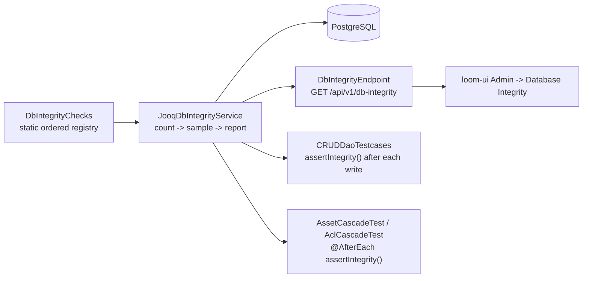

# Database Integrity Checks

A named set of queries that ask whether the database still holds the invariants the code assumes,
runnable from the admin area and from any test. **What** the entities mean is in
[DOMAIN.md](../../loom/DOMAIN.md); **how** they are persisted is in
[PERSISTENCE.md](../../loom/PERSISTENCE.md). This file owns the checks, their severities, and the
list of things deliberately not checked.

Related: [DB_SCHEMA_FEEDBACK.md](DB_SCHEMA_FEEDBACK.md) (the audit these checks make executable) ·
[../../tasks/DATABASE_TASKS.md](../../tasks/DATABASE_TASKS.md) ·
[../permissions/PERMISSIONS.md](../permissions/PERMISSIONS.md) ·
[../../loom/RESTAPI.md](../../loom/RESTAPI.md) · [../../loom/ui/LOOM_UI.md](../../loom/ui/LOOM_UI.md)

## Why this exists

The schema has 80 tables and 236 foreign keys, and Postgres enforces every one of those. What it
cannot enforce is the rest: columns holding a UUID with no constraint behind it, a `varchar` the
application reads back through `Enum.valueOf`, a singleton table with no primary key, an audit
timestamp pair whose ordering is a convention rather than a rule.

The second use is the one that motivated the feature: a test can perform an action and then ask
whether it left the database consistent. That turns "something broke somewhere" into "this operation
violates `DANGLING_SEARCH_DOCUMENT`", with the offending uuids printed.

**Naming.** This is *integrity*, not *consistency* - `consistency` is already a Cortex node kind
(`ConsistencyNode`, media-file integrity). Nothing here inspects a media file.



## Module placement

`loom/db/jooq/pom.xml` declares a **test-scoped dependency on `loom-db-api-test`**. Maven rejects
reactor cycles regardless of scope, so api-test can never depend on jooq. The subsystem therefore
splits along the same seam the DAO layer already uses - `DaoCollection` in api, `*DaoImpl` in jooq:

| Layer | Module | Package |
|---|---|---|
| Consumer API, jOOQ-free | `loom/db/api` | `io.metaloom.loom.db.integrity` |
| Check SPI, bases, registry, service | `loom/db/jooq` | `io.metaloom.loom.db.jooq.integrity` |
| The checks | `loom/db/jooq` | `io.metaloom.loom.db.jooq.integrity.check` |
| Test helper | `loom/db/api-test` | `io.metaloom.loom.db.DbIntegrityAsserts` |

No pom changes anywhere: `loom-db-api` is already a dependency of api-test, jooq, `loom-service-rest`
and `loom-core`.

## The SPI

```java
public interface DbIntegrityCheck {
    DbIntegrityCheckInfo info();
    long count(DSLContext ctx);
    List<DbIntegrityFinding> sample(DSLContext ctx, int limit);
}
```

Two methods, deliberately. The clean case - which is what almost every run is - costs one aggregate
per check and never materialises a row. That is what makes the `CRUDDaoTestcases` auto-assert
affordable. Samples are fetched only after the count says there is something to look at, and are
capped (default 20, ceiling 100) because a broken trigger can leave six-figure orphan counts.

Three bases, in order of preference:

| Base | Use when |
|---|---|
| `AbstractConditionCheck` | One generated `Table<?>` plus a `Condition`. Column references are compile-checked, so a renamed column breaks the build rather than silently turning the check into a no-op |
| `AbstractSweepCheck` | One invariant asked of many tables. Emits a single `UNION ALL` so a 47-table sweep is one round trip, not 47 |
| `AbstractSqlCheck` | Raw SQL for what the DSL cannot express: `num_nonnulls`, `array_length`, the polymorphic anti-joins |

**Registration is a static `List.of(...)`** in `DbIntegrityChecks`. Not Dagger `@IntoSet` - a `Set`
has no defined iteration order, so the report and its OpenAPI example would reorder between runs. Not
`ServiceLoader` - a forgotten `META-INF/services` line fails silently, which is the worst possible
failure mode for a subsystem whose entire job is noticing things that fail silently.

A check that throws is caught per-check into `DbIntegrityCheckResult.error` and the sweep continues.
An errored result counts as a **failure**, never a pass: "the check could not run" and "the invariant
holds" must not collapse into the same answer.

## The check catalogue

29 registered checks. Severity policy: **ERROR** = data the application will misread or crash on, or
an invariant the schema claims but does not enforce. **WARN** = suspicious, a human must judge.
**INFO** = informational (nothing uses it yet; it exists so a check can be demoted without deletion).
`assertIntegrity()` fails on ERROR only.

Every check carries a **code** and a **name**. The code is the contract - it is what
`ignoredIntegrityChecks()` lists, what `?check=` accepts and what an operator quotes in a bug report,
and it never changes. The name is the label the admin table and the assertion message show, and it
may be reworded freely. `DbIntegrityChecksTest` asserts names are unique, because two rows reading
alike in the catalogue table is indistinguishable from one row listed twice.

### DANGLING (8)

| Code | Name | Sev | What it finds |
|---|---|---|---|
| `DANGLING_TOKEN_EDITOR` | API token editor | ERROR | `token.editor_uuid` naming no user. V2.1 declares the FK for `creator_uuid` and omits this one |
| `DANGLING_ASSET_REMIX_EDITOR` | Remix link editor | ERROR | Same omission repeated by V2.8 |
| `DANGLING_VECTOR_CONFIG_ACTOR` | Vector config creator and editor | ERROR | `vector_config.creator_uuid`/`editor_uuid`. V2.6 declares no PK and no FKs at all |
| `DANGLING_SEARCH_DOCUMENT` | Search document target | ERROR | A `search_document` row whose subject is gone - a gap in the V2.58/V2.59 triggers |
| `STALE_SEARCH_TOMBSTONE` | Search deletion tombstone | WARN | A `search_document_deleted` row whose subject exists again |
| `DANGLING_MEMORY_ENTRY_SCOPE` | Memory entry scope target | WARN | `memory_entry.scope_uuid` unresolvable in the table its `scope` names |
| `DANGLING_NODE_TASK_LEASE` | Node task lease holder | WARN | An unfinished task leased to an unregistered `cortex_instance.node_id` |
| `SOFT_DELETED_USER_HAS_LIVE_WORK` | Work left behind by a deleted user | ERROR | A soft-deleted user still holding tokens, assignments, notifications, memberships or grants |

`SOFT_DELETED_USER_HAS_LIVE_WORK` is the one worth reading twice. `user.deleted` is the only soft
delete in the schema, and because the row is never removed, **every `ON DELETE CASCADE` pointed at
`"user"` is bypassed** - most seriously `token`, which means a deleted account's API keys still
authenticate.

### TIMESTAMP (3)

| Code | Name | Sev | What it finds |
|---|---|---|---|
| `TIMESTAMP_EDITED_BEFORE_CREATED` | Edited before created | ERROR | `edited < created` across all 47 audited tables |
| `TIMESTAMP_IMPLAUSIBLE` | Timestamp out of range | WARN | A timestamp before 2020-01-01 or more than 15 hours in the future |
| `TIMESTAMP_CHILD_BEFORE_PARENT` | Child created before its parent | WARN | `asset_location`/`asset`, `pipeline_run_item`/`pipeline_run`, `pipeline_version`/`pipeline`, `skill_version`/`skill` |

### MANDATORY_FIELD (4)

| Code | Name | Sev | What it finds |
|---|---|---|---|
| `BLANK_NAME` | Empty name | ERROR | `trim(col) = ''` over 14 NOT NULL name columns |
| `MISSING_TOKEN_NAME` | Unnamed API token | ERROR | `token.name IS NULL`, which defeats `UNIQUE (creator_uuid, name)` |
| `MISSING_BLACKLIST_NAME` | Unnamed blacklist entry | WARN | `blacklist.name IS NULL` - V2.50 made it nullable only to admit older rows |
| `SOFT_DELETED_USER_NOT_ANONYMISED` | Deleted user still holds personal data | WARN | `deleted` set but `firstname`/`lastname`/`meta` still populated |

### VOCABULARY (8)

One `EnumColumnCheck` class driven by a hand-written `(table, column, enum)` list, each row emitting
its own stable code, plus `INVALID_REACTION_TYPE` as its own class.

| Code | Name | Column | Why it matters |
|---|---|---|---|
| `INVALID_REACTION_TYPE` | Reaction type | `reaction.type` | Nothing guards it - no converter, no CHECK - and the REST layer reads it with `valueOf`, so a bad string makes **every** read of the row a 500 |
| `VOCABULARY_PIPELINE_RUN_STATUS` | Pipeline run status | `pipeline_run.status` | forcedType converter throws on read |
| `VOCABULARY_PIPELINE_RUN_ITEM_STATE` | Run item state | `pipeline_run_item.state` | ditto; V2.77 repaired exactly this |
| `VOCABULARY_PIPELINE_NODE_TASK_STATE` | Node task state | `pipeline_node_task.state` | ditto |
| `VOCABULARY_NOTIFICATION_TYPE` | Notification type | `notification.type` | has a CHECK; a hit means CHECK and enum drifted |
| `VOCABULARY_NODE_DESCRIPTOR_STATUS` | Node descriptor status | `node_descriptor.status` | ditto |
| `VOCABULARY_SEARCH_DOCUMENT_ENTITY_TYPE` | Search document entity type | `search_document.entity_type` | does not throw - the row simply becomes unreachable, because the provider filters on the raw string |
| `VOCABULARY_MEMORY_ENTRY_SCOPE` | Memory entry scope value | `memory_entry.scope` | without it nothing can resolve `scope_uuid` |

`search_document.entity_type` stores the lowercase `SearchEntityType.id()`, not the constant name -
that check compares in lower case.

### CARDINALITY (6)

| Code | Name | Sev | What it finds |
|---|---|---|---|
| `LOOM_SINGLETON` | Single instance row | ERROR | More than one `loom` row. Reports the **surplus**, not the total |
| `DUPLICATE_VECTOR_CONFIG_UUID` | Vector config identity | ERROR | Duplicate or null `vector_config.uuid` - V2.6 declares no PK |
| `XOR_ASSET_POOL_BACKEND` | Asset pool backend | ERROR | `num_nonnulls(fs_path, s3_bucket) <> 1` |
| `XOR_TASK_ASSIGNEE` | Task assignee | ERROR | `num_nonnulls(user_uuid, group_uuid) <> 1` |
| `EMBEDDING_DIMENSION_MISMATCH` | Embedding vector length | ERROR | `array_length(vector,1)` disagrees with `dimensions` |
| `PIPELINE_RUN_KIND_MISMATCH` | Pipeline run kind | ERROR | `kind` disagrees with whether `pipeline_uuid` is set (V2.83) |

The last four duplicate `CHECK` constraints **on purpose**. A constraint stops the application; it
does not stop a migration backfill, a `NOT VALID` constraint, a bulk load with
`session_replication_role` set, or a constraint dropped during a schema change and never restored.

### Deliberately not checked

Do not add these. Each was considered and rejected for a reason that has not changed.

| Candidate | Why not |
|---|---|
| Generic sweep over all 236 declared FKs | Postgres enforces them. 236 queries per run for a hit rate of zero. The five columns with *no* FK are checked by name instead |
| Generic NOT NULL sweep | Same - the schema enforces it |
| `creator_uuid IS NULL` broadly | NULL is *correct* on the 17 machine-written tables (the `asset_*_comp` family, `detection`, `embedding`, `asset_node_result`, `attachment`, `cortex_instance`, `cluster`, `dedup_group`, `node_descriptor`, `notification`, `tag_asset`). Pure noise |
| `person`/`user` firstname/lastname, `cluster.name`, `annotation.title`, `comment.title`, `detection.label`, `memory_entry.title` null | Legitimately unset. `cluster.name IS NULL` specifically means "unnamed machine proposal" |
| `asset_node_result.result_ref` resolution | DOMAIN.md declares it advisory and says never to build integrity on it |
| `pipeline_run_item.sha512` to `asset.sha512sum` | A run item legitimately records input that never became an asset. No signal |
| `pipeline_run.pipeline_version` (bare int) | No documented join key |
| `user_permission`/`token_permission` one-row PK | A schema bug (DATABASE_TASKS Task 15), not a data defect. No query distinguishes "correct given the schema" from "wrong" |
| Clock-skew detection between `created` and `now()` | Not decidable across a `timestamp WITHOUT TIME ZONE` written from two clocks. See Gotchas |

## REST

| Route | Permission | Notes |
|---|---|---|
| `GET /api/v1/db-integrity` | `READ_DB_INTEGRITY` | Runs the sweep. `?check=` `?category=` `?severity=` `?limit=`, comma-separated where repeatable |
| `GET /api/v1/db-integrity/checks` | `READ_DB_INTEGRITY` | The catalogue, nothing run |

Singular base path: [CODING.md](../../guidelines/CODING.md) reserves the singular for singleton and
RPC-style resources, and this is one report about one database. `/checks` underneath it is a genuine
collection and is plural.

**No `POST /run`.** The report reads and computes; it writes nothing and repairs nothing. A POST
would imply a job with a lifecycle to poll, and there is none - the caller asks again.

An unknown code or category is a **400**, never an empty report: a mistyped filter must not read as a
clean database.

## Test setup

```java
// Any DAO test - one override on AbstractJooqTest reaches all ~50 subclasses.
assertIntegrity();                                   // fails on ERROR
assertIntegrity(DbIntegritySeverity.WARN);           // stricter
assertIntegrity(DbIntegrityCodes.DANGLING_SEARCH_DOCUMENT);  // one invariant
DbIntegrityReport report = integrityReport();        // assert a finding IS present
```

Wired in automatically at three places:

| Site | When |
|---|---|
| `CRUDDaoTestcases` | end of `testCreate`, `testDelete`, `testUpdate`. Not `testLoad` (stores nothing new) and not `testLoadPage` (1024 inserts) |
| `AssetCascadeTest`, `AclCascadeTest` | `@AfterEach` |
| `DbIntegrityEndpointTest` | explicit, over the REST route |

Two opt-outs, coarse and fine:

```java
@Override public boolean integrityCheckEnabled() { return false; }          // all checks, this class
@Override public Set<String> ignoredIntegrityChecks() { return Set.of(...); } // one code, this class
```

Prefer the second. `grep -rn "integrityCheckEnabled"` is a complete audit of every wholesale
exemption; there is currently none. The only per-code exemption is `AclCascadeTest`, which ignores
`SOFT_DELETED_USER_HAS_LIVE_WORK` because producing that state is what
`testSoftDeletingAUserKeepsGrantsAndMemberships` is *for*.

Test classes:

| Class | Module | Covers |
|---|---|---|
| `DbIntegrityChecksTest` | `loom/db/jooq` | Registry guards: unique well-formed codes, unique readable names, descriptions present, `DbIntegrityCodes` matches the registry exactly, every `SearchEntityType` is mapped. No database |
| `DbIntegrityServiceTest` | `loom/db/jooq` | 18 tests. Breaks the database one way at a time and asserts the matching check fires and names the row; plus the negative cases (`edited == created` is legal, a timezone-sized offset is not implausible), scoping and the sample cap |
| `DbIntegrityFixtureReportTest` | `loom/db/jooq` | The pooled fixture must pass its own checks. Prints the whole report - the fastest way to see the catalogue's verdict on a database |
| `DbIntegrityEndpointTest` | `loom/core` | 12 tests: shape, catalogue agreement, the three filters, both 400s, and the four RBAC cases. Also the full loop - create a row with a dangling editor through the ordinary DAO and read the finding off the endpoint |
| `dbIntegrity.test.ts` | `loom-ui` | 15 vitest cases over the pure helpers, including that a check which could not run counts as a failure and is never `PASSED` |
| `db-integrity-mocked.spec.ts` | `loom-ui` | 10 Playwright cases: clean vs dirty, the full catalogue table, name and code both on screen, the findings filter both ways, sample truncation, did-not-run, failed refresh keeps the last report, 403 |

A check that never fires in a test is a check nobody knows works, which is why
`DbIntegrityServiceTest` exists in the shape it does.

## Environment variables

None. The subsystem has no configuration: the check set is a compiled registry, the scope comes from
query parameters per request, and there is no cache, schedule or store to tune.

## Conventions and gotchas

- **`TIMESTAMP_EDITED_BEFORE_CREATED` compares strictly `<`, and must keep doing so.**
  `AbstractJooqDao.setCreatorEditor` calls `Instant.now()` twice, so a fresh row has `edited` a few
  microseconds after `created`; `NotificationDaoImpl`, `CortexInstanceDaoImpl` and
  `NodeDescriptorRecordDaoImpl` capture one instant for both, so `edited == created` exactly. Both
  are correct. Only an inversion is a defect.
- 🔴 **The fixture used to write `edited` before `created`.** `TestFixtureProvider.setupACL()` called
  `setEdited(Instant.now())` and then `setCreated(Instant.now())` for both fixture users. It never
  failed, because both calls landed in the same millisecond and the column stores milliseconds - but
  it would have failed intermittently, whenever the pair straddled a boundary. Fixed by capturing one
  `Instant`. Watch for the same shape elsewhere.
- 🔴 **`ReactionDaoTest` used to store `type_0` and `new` in `reaction.type`,** with a class javadoc
  arguing the DAO layer is not the enum boundary. That is true and beside the point: the REST layer
  reads the column with `ReactionType.valueOf`, so those rows were unreadable over REST. Found by
  `INVALID_REACTION_TYPE` the first time the auto-assert ran. Java writers pass `ReactionType.X.name()`.
- **`TIMESTAMP_IMPLAUSIBLE` tolerates 15 hours into the future, and the width is deliberate.**
  `created`/`edited` are `timestamp WITHOUT TIME ZONE`; the SQL default is `now()` in the session's
  local zone while a DAO write carries a Java `Instant`. If those clocks are in different zones the
  values disagree by a whole offset, legitimately and systematically. A tight window would report
  that as corruption on every non-UTC deployment. Skew is not decidable from inside the column, so
  this check does not try - it only catches dates no timezone can explain.
- **Counts, not rows.** A finding carries a total plus a capped sample. Anything rendering a sample
  list must also say how many rows it is not showing, or the list reads as complete.
- **`code` is the contract, `name` is the label.** The code is what an ignore list, a `?check=`
  filter and a bug report carry, and changing one is a breaking change. The name exists so the admin
  table has something readable in its first column, and is free to be reworded. Both cross the wire
  on every catalogue entry, and both are shown - a table of codes alone is unreadable, a table of
  names alone gives the operator nothing to quote.
- **The admin table lists the whole catalogue, not only the findings.** "What is broken" and "what
  was looked at" are different questions, and an operator opening this screen because something is
  wrong needs the second one answered too. The findings filter narrows to the subset; it is not the
  default.
- **A check that threw is a failure, not a pass.** `DbIntegrityCheckResult.error` is non-null and
  `count` is 0; `isClean()` is false and `failures()` includes it. The UI renders "Did not run". Any
  new consumer must preserve that distinction.
- **The vocabulary checks compare raw SQL text and never read the column through jOOQ.** Three of
  those columns have `forcedTypes` converters that throw on an unknown string, so selecting them the
  ordinary way would fail with the exact problem being looked for.
- **`AuditedTables.ALL` and `SearchDocumentEntities.TABLES` are hand-written lists.** Both are guarded
  by `DbIntegrityChecksTest`, which is what stops a new table or entity type from quietly losing
  coverage. Add to them when adding either.
- **`asset_remix` has no `uuid`** - it is keyed by `(asset_a_uuid, asset_b_uuid)`. `AuditedTables.hasUuid`
  is the exception list, currently of size one.
- **`token.token` is the SQL column; `TOKEN_` is the generated Java field.** jOOQ renames it because
  `token` collides with the table. Raw SQL in a check or a test must use the former.
- **Running the report changes nothing** - no repair, no write, no stored result. Keep it that way; a
  repair path needs its own permission and its own design.

## Where do I find ...?

| Concept | Path |
|---|---|
| Service contract, report, scope, severities | `loom/db/api/src/main/java/io/metaloom/loom/db/integrity/` |
| Stable check codes | `loom/db/api/.../integrity/DbIntegrityCodes.java` |
| Check SPI and bases | `loom/db/jooq/src/main/java/io/metaloom/loom/db/jooq/integrity/` |
| The registry | `loom/db/jooq/.../integrity/DbIntegrityChecks.java` |
| The checks | `loom/db/jooq/.../integrity/check/` |
| Dagger binding | `loom/db/jooq/.../dagger/JooqIntegrityBindModule.java` |
| Test helper | `loom/db/api-test/src/main/java/io/metaloom/loom/db/DbIntegrityAsserts.java` |
| Auto-assert wiring | `loom/db/api-test/.../CRUDDaoTestcases.java`, `loom/db/jooq/src/test/.../AbstractJooqTest.java` |
| REST endpoint / service | `loom/services/rest/.../endpoint/impl/DbIntegrityEndpoint.java`, `.../service/impl/DbIntegrityEndpointService.java` |
| REST models | `loom-shared/rest-model/src/main/java/io/metaloom/loom/rest/model/dbintegrity/` |
| Java client | `loom-client/common/.../method/DbIntegrityMethods.java`, `loom-client/rest/.../LoomHttpClientImpl.java` |
| Python client | `clients/python/loom_client/methods/db_integrity.py` |
| UI api layer | `loom-ui/src/api/dbIntegrity.ts` |
| UI panel | `loom-ui/src/features/admin/DbIntegrityAdmin.tsx` |
| Permission | `loom/db/api/.../model/perm/Permission.java`, `V2.87__read_db_integrity_permission.sql` |
| Customer docs | `website/content/english/docs/loom/database-integrity/index.adoc` |

## Key Classes Reference

| Class | Package | Purpose |
|---|---|---|
| `DbIntegrityService` | `io.metaloom.loom.db.integrity` | Contract: `check(scope)` and `catalog()` |
| `DbIntegrityReport` | `io.metaloom.loom.db.integrity` | Results plus `isClean`/`has`/`failures`/`describe` |
| `DbIntegrityCheckResult` | `io.metaloom.loom.db.integrity` | Count, capped samples, duration, per-check error |
| `DbIntegrityScope` | `io.metaloom.loom.db.integrity` | Code/category/severity filters, exclusions, sample limit |
| `DbIntegrityCodes` | `io.metaloom.loom.db.integrity` | The stable identifiers, in api so api-test can name one |
| `DbIntegrityCheck` | `io.metaloom.loom.db.jooq.integrity` | The SPI: `info`, `count`, `sample` |
| `AbstractConditionCheck` / `AbstractSweepCheck` / `AbstractSqlCheck` | `io.metaloom.loom.db.jooq.integrity` | Typed / multi-table / raw-SQL bases |
| `DbIntegrityChecks` | `io.metaloom.loom.db.jooq.integrity` | The static ordered registry |
| `JooqDbIntegrityService` | `io.metaloom.loom.db.jooq.integrity` | Runs the sweep, isolates a throwing check |
| `AuditedTables` / `SearchDocumentEntities` | `io.metaloom.loom.db.jooq.integrity.check` | The two hand-written lists, both test-guarded |
| `DbIntegrityAsserts` | `io.metaloom.loom.db` | `assertIntegrity()` and the two opt-outs |
| `DbIntegrityEndpoint` / `DbIntegrityEndpointService` | `io.metaloom.loom.rest.endpoint.impl` / `.service.impl` | The two routes, gated on `READ_DB_INTEGRITY` |

## Progress Assessment

- [x] API types in `loom-db-api` (service, report, result, finding, scope, severity, category, codes)
- [x] Check SPI plus three bases; per-check error isolation
- [x] Static registry with uniqueness and code-constant guards
- [x] 8 DANGLING checks
- [x] 3 TIMESTAMP checks
- [x] 4 MANDATORY_FIELD checks
- [x] 8 VOCABULARY checks
- [x] 6 CARDINALITY checks
- [x] `READ_DB_INTEGRITY` permission, `V2.87`, jOOQ enum regenerated, `RolePermission` mirrored
- [x] Dagger binding in both `LoomCoreComponent` and the jOOQ `TestComponent`
- [x] `DbIntegrityAsserts` plus auto-asserts in `CRUDDaoTestcases` and both cascade suites
- [x] Fixture passes its own checks; `TestFixtureProvider` timestamp inversion fixed
- [x] `ReactionDaoTest` no longer stores non-`ReactionType` values
- [x] `GET /api/v1/db-integrity` and `/checks`, with filters and 400s
- [x] Java and Python clients; parity test updated
- [x] Every check carries a human-readable `name` alongside its code, uniqueness test-guarded
- [x] Admin UI tab listing the whole catalogue with a per-check status and a findings filter,
  i18n (en + de), 15 vitest and 10 Playwright cases
- [x] Demo data grant on the editor role
- [x] Customer documentation page, with screenshots of the admin panel clean and with findings
- [ ] The five missing foreign keys these checks detect are still missing - detection is not a fix.
  `token.editor_uuid`, `asset_remix.editor_uuid` and `vector_config`'s two, plus `vector_config`'s
  absent primary key, want a migration of their own
- [ ] `search_document` anti-joins have not been `EXPLAIN`ed against a million-row catalogue; if the
  report ever gets slow, that is the first place to look
- [ ] No check covers `attachment_binary.pool_uuid` or `asset_location.pool_uuid` reachability
- [ ] The report is read-only by design; a guarded repair path (with its own permission) is unbuilt
  and unplanned

_Git HEAD revision: `27894151`_
_Last updated: 2026-08-09 (new file: the database integrity check subsystem - 29 checks across five
categories, the REST routes, the test-side `assertIntegrity()` seam and its two opt-outs, and the
list of candidates deliberately not checked. Records the two defects the first auto-assert run found:
the fixture's inverted `edited`/`created` write order and `ReactionDaoTest` storing values the REST
layer cannot read.)_
