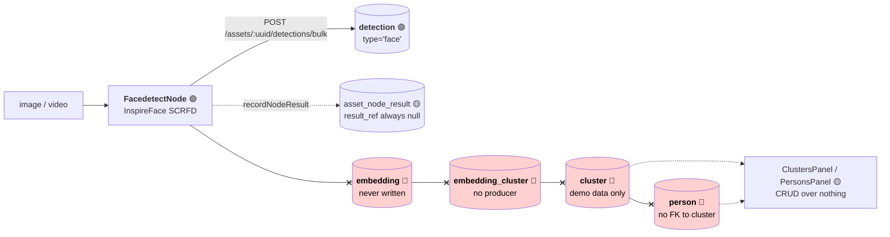
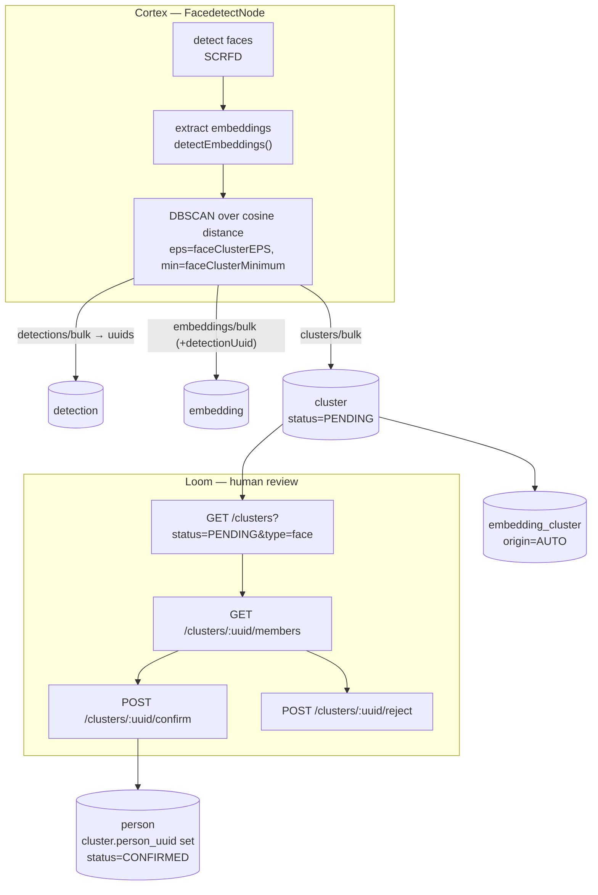

# Face Workflow — Detect → Embed → Cluster → Confirm a Person

> **Status**: 🔴 **Not built.** Only the first of four stages runs. Detection works and writes
> `detection` rows; **embedding, clustering and confirmation do not exist**. Everything downstream —
> the `cluster` / `embedding_cluster` tables, the `faceClusterEPS` / `faceClusterMinimum` node
> options, `ClustersPanel` / `PersonsPanel` — is present but **connected to nothing**.
> **Scope**: the end-to-end identity loop across Cortex, Loom, the database and the UI: from a face
> in a frame to a human-confirmed `person`.
> **Audience**: AI coding agents and humans working on
> [cortex/nodes/facedetect/](../../../cortex/nodes/facedetect/), `loom/services/rest` and
> `loom-ui/src/features/faceDetection/`.

**Out of scope, and where it lives instead:**

| Not here | There |
|---|---|
| Which face models exist, their licences, the InspireFace pack format, model accuracy | [../nodes/facedetect/FACEDETECTION_OVERVIEW.md](../nodes/facedetect/FACEDETECTION_OVERVIEW.md) |
| The node system, lifecycle, ports, registration, caching | [../nodes/NODES.md](../nodes/NODES.md) |
| Typed ports and cardinality | [../pipeline/NODE_DATA_TYPES.md](../pipeline/NODE_DATA_TYPES.md) |
| Open UI work items for AI/ML entities (Embedding, Cluster, Detection, Person) | [../../loom/ui/TASK_UI_AI_ML.md](../../loom/ui/TASK_UI_AI_ML.md) |
| Vector / ANN search strategy and the pgvector decision | [../search/SEMANTIC_SEARCH.md](../search/SEMANTIC_SEARCH.md) |
| The human-confirms-a-machine-proposal precedent this file copies | [../../concept/NODE_DEDUP_PLAN.md](../../concept/NODE_DEDUP_PLAN.md) |
| Rules for adding a node at all | [../../guidelines/NEW_NODE.md](../../guidelines/NEW_NODE.md) |

> ⚠️ **Name collision.** [../../concept/CLUSTERING.md](../../concept/CLUSTERING.md) is about
> **multi-instance Loom deployment**, not face clustering. It has nothing to do with this file. If you
> opened it looking for face clusters, you want this one.

Status legend: 🟢 built · 🟡 partly built · 🔵 plan/concept · 🔴 defect or blocker · ⚪ stub.

---

## 0. Executive Summary

| Question | Short answer |
|---|---|
| **Does the detect → cluster → confirm loop work?** | **No.** Stage 1 of 4 runs. |
| **Where exactly does it break?** | 🔴 **At link 1, not at confirmation.** No face embedding has ever been persisted, so there is nothing to cluster. |
| **Is there clustering code?** | **None.** `faceClusterEPS` / `faceClusterMinimum` are validated, shown in the UI, and read by no algorithm. The only "DBSCAN" in the repo is that option's label text. |
| **Can a Cortex worker even create a cluster?** | 🔴 **No.** `cluster.creator_uuid` is `NOT NULL` referencing `user`. `V2.47` relaxed this for `detection`/`embedding`/comp tables and skipped `cluster`. |
| **Is `cluster` linked to `person`?** | **No FK, no join table, no code path.** They are two unrelated islands. |
| **What does the UI show today?** | Cluster/person CRUD over empty data, and 🔴 an asset face panel that is **always empty** because of a type-string mismatch (§6.1). |
| **How much of the fix is new invention?** | Little. The embedder already exists in `video4j`, the review model already exists as `dedup_group`, and the tables already exist. The work is wiring plus one migration. |

---

## 1. Current State — the chain, honestly



### 1.1 What actually runs

`FacedetectNode.persist(...)`
([FacedetectNode.java](../../../cortex/nodes/facedetect/core/src/main/java/io/metaloom/cortex/node/facedetect/FacedetectNode.java))
writes **detection rows and nothing else**:

```java
items.add(new DetectionCreateRequest()
    .setType("face")
    .setNodeKind(name())            // "facedetect"
    .setDetectionIndex(index++)
    .setFrameNumber(detection.frameIndex())
    .setBboxX((float) box.x()) ... .setConfidence(detection.confidence()));
client().bulkCreateAssetDetections(asset.getUuid(), new DetectionBulkCreateRequest().setDetections(items)).sync();
recordNodeResult(asset, ctx, ResultState.SUCCESS, null, null, resultRef("detection"));
```

Upsert key `(asset_uuid, node_kind, frame_number, detection_index)` (`V2.43`), so a re-run replaces
rather than appends.

### 1.2 Embeddings — built (2026-08-06)

✅ **Face embeddings are computed and persisted.** This section previously listed three reasons there
were none; all three are resolved, and the diagnosis was one step too generous — the vectors were not
"discarded", they were never computed. The node called only `detectFaces(image)`, which sets no
embedding.

| Was | Now |
|---|---|
| `FaceStorage.java` — an Avro sidecar, every line commented out | **Deleted.** Superseded by the `embedding` table; a per-asset file store was never the destination |
| `VideoFaceScanner.processFaces` gated on `hasEmbedding()`, which nothing could satisfy | Gate removed earlier; `scan(video, n, withEmbeddings)` now embeds the selected faces from the crops the scan already took |
| `DetectionModel` has no vector field | Still true, and correct — vectors travel on their own resource, `POST /assets/:uuid/embeddings/bulk`, keyed to the detection by `detection_uuid` |
| `detectEmbeddings`/`extractEmbeddings` exist with zero metaloom callers | `InspireFacedetector.detectFaces(img, withEmbeddings)` (new in video4j) produces boxes and vectors in **one filtered pass** |

🔴 **Do not pair `detectFaces(img)` with `detectEmbeddings(VideoFrame)` to get both.**
`detectEmbeddings` runs detection *unfiltered*, so its ordinals do not line up with the ones
`detectFaces` returns after the size and confidence gates. Zipping the two lists attaches each vector
to the wrong face — silently, and with entirely plausible output.

Persistence, storage and the pluggable index are specified in
[../search/SEMANTIC_SEARCH.md](../search/SEMANTIC_SEARCH.md); `embedding` is the system of record and
the ANN index is a rebuildable cache behind the `VectorIndex` SPI, keyed by
`(type, model, dimensions)` so the recognition model can change without invalidating what is stored.

### 1.3 Why there is no clustering

| Thing | State |
|---|---|
| `faceClusterEPS` (0.6, labelled *"DBSCAN cluster radius threshold"*) | validated, surfaced in the UI, **read by nothing** |
| `faceClusterMinimum` (2) | same |
| Any DBSCAN/HDBSCAN implementation | **does not exist**; the only k-means in the tree is `LabKMeans` in the `dominant-color` node, for colour quantisation |
| `ClusterDao.link(Cluster, Embedding)` / `unlink` | implemented as plain inserts into `embedding_cluster`; **no caller outside `ClusterDaoTest`** |
| Cluster-row producers | `DemoDatabaseInitializer` and the generic CRUD endpoint. That is all. |
| ANN index over `embedding.vector` | none — `real[]`, no pgvector (§3.4) |

`OUT_FACE_COUNT` is documented as *"How many distinct faces survived clustering"* but is emitted as
`(long) elements.size()` — a raw detection count. The port's own description is aspirational.

### 1.4 Why `cluster` and `person` cannot meet

`cluster` (`V2.12`, never altered except the `V2.51` FK fix) and `person` (`V2.26`) have **no foreign
key, no join table and no code path** between them. Two competing models of "a person" coexist:
`cluster(type='person')` + `embedding_cluster`, and the standalone `person` / `person_image` island.
`person_image` has **no writer at all** — it is referenced only by DAO cascade tests. This duplication
is already recorded in [../DB_SCHEMA_FEEDBACK.md](../DB_SCHEMA_FEEDBACK.md) §4.3.

---

## 2. Target Design



### 2.1 Stage by stage

| Stage | Where | Produces |
|---|---|---|
| **Detect** | `FacedetectNode` (unchanged) | `detection` rows, `type='face'` |
| **Embed** | `FacedetectNode`, calling `detectEmbeddings(...)` | `embedding` rows linked by `detection_uuid` |
| **Cluster** | `FacedetectNode`, **per asset** | `cluster` rows (`type='face'`, `status='PENDING'`) + `embedding_cluster` links |
| **Confirm** | Loom REST + UI | `cluster.person_uuid` set, `status='CONFIRMED'` |

### 2.2 Why clustering runs in the node, and what that costs

Clustering runs **inside `FacedetectNode`, scoped to one asset**. This is a deliberate phase-1 choice:

- It consumes the two options that already exist and are already exposed in the pipeline editor.
- It needs no cross-asset query, no ANN index, and no new service — a few dozen face vectors per
  asset is a trivially small DBSCAN.
- It makes `OUT_FACE_COUNT`'s documented meaning true for the first time: *distinct people in this
  video*, not *number of boxes*.

⚠️ **The cost, stated plainly: this groups faces within one asset only, never across the library.**
"Confirm this cluster is Anna" therefore means "confirm Anna appears in *this* video". The same person
in a second video produces a second, unrelated `PENDING` cluster with no memory of the first.

Cross-asset identity is **phase 2** and needs a library-wide pass plus a vector index
([../search/SEMANTIC_SEARCH.md](../search/SEMANTIC_SEARCH.md)). The schema in §3 is designed so that
pass reuses the same tables: `cluster.asset_uuid` is **nullable** precisely so a library-wide cluster
can exist alongside per-asset ones, distinguished by `node_kind`, without a second destructive
migration.

### 2.3 Distance metric

Cosine distance over L2-normalised embeddings, per the industry-standard pipeline documented in
[../nodes/facedetect/FACEDETECTION_OVERVIEW.md](../nodes/facedetect/FACEDETECTION_OVERVIEW.md) §5.

> ⚠️ **There is no `cosineSimilarity()` helper to reuse.** An earlier draft of this file claimed
> `Face.cosineSimilarity` exists in `facedetect4j`; it does not — the string appears only inside
> javadoc prose (`SFaceEmbedder`, `ArcFaceAlign`). It must be written. It is three lines: on
> L2-normalised vectors cosine similarity is a plain dot product. Note also that **metaloom has no
> dependency on `facedetect4j`** — the node reaches InspireFace through `video4j`.

The `faceClusterEPS` default of `0.6` is a **cosine-distance** radius and is unvalidated against any
real corpus. InspireFace's own pack manifest recommends a *similarity* threshold of `0.48` for Pikachu
and `0.32` for Megatron — different packs, different geometry. Calibrate before trusting the default,
and record what it was calibrated against.

---

## 3. Schema — migration `V2.75` (design; not yet written)

> ⚠️ **Check the highest migration before claiming the version.** `V2.74__asset_social_cascade.sql` is
> the highest at this revision, but another branch may take `V2.75` first — this is an explicit gotcha
> in [../../concept/SEARCH_PLAN.md](../../concept/SEARCH_PLAN.md).

### 3.1 `cluster` — today it cannot be machine-written

Current DDL (`V2.12`) is a generic, human-authored entity:

```sql
CREATE TABLE "cluster" (
  "uuid" uuid DEFAULT uuid_generate_v4 (),
  "name" varchar NOT NULL,
  "meta" jsonb,
  "type" varchar NOT NULL,
  "created" timestamp NOT NULL DEFAULT (now()), "creator_uuid" uuid NOT NULL,
  "edited"  timestamp NOT NULL DEFAULT (now()), "editor_uuid"  uuid NOT NULL,
  PRIMARY KEY ("uuid")
);
CREATE UNIQUE INDEX ON "cluster" ("name");   -- globally unique across ALL types
```

Required changes:

| # | Change | Why |
|---|---|---|
| 1 | `creator_uuid` / `editor_uuid` → **NULLABLE** | 🔴 A Cortex worker is not a user. `V2.47` did exactly this for `detection`, `embedding` and the comp tables and **skipped `cluster`**. Without it the node physically cannot insert a row. |
| 2 | Drop `UNIQUE (name)`; `name` → **NULLABLE**; add partial `UNIQUE (type, name) WHERE name IS NOT NULL` | 🔴 A global unique name forbids two people called "Anna Meyer" and collides across unrelated cluster types. Machine-proposed clusters have no meaningful name until a human confirms one. Recommended in [../DB_SCHEMA_FEEDBACK.md](../DB_SCHEMA_FEEDBACK.md). |
| 3 | Add `node_kind`, `node_id`, `producer_version`, `run_uuid`, `task_uuid` | The component-contract provenance every other producer table carries (`V2.38`). Enables the standard invalidation sweep `WHERE node_kind = ? AND producer_version <> ?` — which is how a pack change (§2.3) retires stale clusters. |
| 4 | Add nullable `asset_uuid` → `asset(uuid) ON DELETE CASCADE` | Per-asset clusters now; **nullable** so a phase-2 library-wide cluster fits the same table. |
| 5 | Add `cluster_index` int + `UNIQUE (asset_uuid, node_kind, cluster_index)` | Idempotent re-runs. Without an upsert key, re-running the node appends a second full set — exactly the bug `V2.43` fixed for detections. |
| 6 | Add `status` (`PENDING`/`CONFIRMED`/`REJECTED`, default `PENDING`) + index | The review state. Mirrors `dedup_status`. |
| 7 | Add `person_uuid` → `person(uuid) **ON DELETE SET NULL**` | The missing link. `SET NULL` not `CASCADE`: deleting a person must not erase the review record — the same reasoning `V2.61` applies to `dedup_group.keep_asset_uuid`. |
| 8 | Add `score real` (cohesion) and optional `centroid real[]` | Lets the review queue rank by confidence and lets phase 2 match a new face against a cluster without rescanning members. |

Mirror the enum exactly as `V2.61` does, since a Postgres enum cannot be added and used in the same
transaction for `loom_permission` — that constraint applies to permission enums, not to a fresh type,
but keeping the shape identical avoids the question:

```sql
CREATE TYPE "cluster_status" AS ENUM ('PENDING', 'CONFIRMED', 'REJECTED');
```

### 3.2 `embedding_cluster` — a join with no facts

Today it is `(embedding_uuid, cluster_uuid)` and nothing else. Add `confidence real`, `origin`
(`CHECK (origin IN ('AUTO','MANUAL'))`) and `created`, so an auto-assignment is distinguishable from a
human correction and a member can be re-assigned with an audit trail. Both FKs already cascade
(`V2.12` + `V2.51`).

### 3.3 `person` — leave alone

`creator_uuid` / `editor_uuid` stay `NOT NULL`: a person is only ever created by a human confirming a
cluster. No schema change needed. (Its `primaryImageUuid` write path is broken for an unrelated
reason — §6.9.)

### 3.4 What deliberately does **not** change

`embedding.vector` stays `real[]` with **no ANN index**. pgvector is an open decision owned by
[../search/SEMANTIC_SEARCH.md](../search/SEMANTIC_SEARCH.md), and
[../../concept/SEARCH_PLAN.md](../../concept/SEARCH_PLAN.md) gotcha 8 warns that
`loom/db/jooq/generate.sh` re-runs every migration in a stock `postgres:latest` Testcontainer —
**`pgvector` is not in that image**, so an unguarded `CREATE EXTENSION vector` breaks jOOQ codegen for
everyone. Per-asset clustering (§2.2) needs no index at all, which is part of why it is phase 1.

### 3.5 Obligations a migration triggers

Per [../../guidelines/CODING.md](../../guidelines/CODING.md):

```bash
mvn install -pl loom/db/flyway     # or the pool skips the new migration silently
loom/db/jooq/generate.sh           # DESTRUCTIVE: rm -rf's src/jooq/java first
./setup-pool.sh                    # re-provision the pooled test databases
```

`meta` / `centroid` columns need a `forcedTypes` converter entry in the jOOQ pom.

---

## 4. REST — the confirmation endpoint

Current surface is plain CRUD at `/api/v1/clusters` and `/api/v1/persons`: **no member list, no
person link, no confirm.** Proposed additions:

| Method | Path | Purpose | Permission |
|---|---|---|---|
| GET | `/api/v1/clusters?status=PENDING&type=face` | the review queue | `READ_CLUSTER` |
| GET | `/api/v1/clusters/:uuid/members` | member embeddings + their detections, for face crops | `READ_CLUSTER` |
| POST | `/api/v1/clusters/:uuid/confirm` | link to an existing person **or** create one; sets `CONFIRMED` | `UPDATE_CLUSTER` (+ `CREATE_PERSON` when it creates) |
| POST | `/api/v1/clusters/:uuid/reject` | sets `REJECTED` | `UPDATE_CLUSTER` |
| GET | `/api/v1/persons/:uuid/clusters` | inverse lookup | `READ_PERSON` |
| POST | `/api/v1/assets/:uuid/embeddings/bulk` | the node's embedding write path | `CREATE_EMBEDDING` |

All permissions already exist in the `loom_permission` enum — **no new permission value is needed**,
which avoids the Flyway single-transaction trap (`SEARCH_PLAN.md` gotcha 7).

`ClusterResponse` gains `status`, `personUuid`, `assetUuid`, `memberCount` and `score`;
`PersonResponse` gains `clusterUuids`.

### 4.1 Two blockers on the write path

1. 🔴 **`EmbeddingCreateRequest` has no `detectionUuid`.** Its fields are `source`, `area`, `type`,
   `vector`, `assetUuid`. `V2.43` added the `embedding.detection_uuid` FK, but **no REST caller can
   ever set it** — an embedding created over REST is permanently unlinkable from the face it came
   from. This must be added before the loop can work.
2. **`EmbeddingType` has no InspireFace value** — the enum is
   `{DLIB_FACE_RESNET_v1, VIDEO4J_FINGERPRINT_V1, VIDEO4J_FINGERPRINT_V2}`. Add a pack-versioned
   value. Per [../nodes/facedetect/FACEDETECTION_OVERVIEW.md](../nodes/facedetect/FACEDETECTION_OVERVIEW.md)
   §6.3, **switching the pack invalidates every stored embedding and every cluster**, so the stored
   `(type, model, dimensions, producer_version)` tuple is what makes that detectable.

### 4.2 A convention to settle

Dedup decides with `PATCH /dedup-groups/:uuid`; `ClusterEndpoint` updates with
`POST /clusters/:uuid`. Both are in the codebase today. `/confirm` and `/reject` are proposed as
RPC-style sub-resources because the operation is not a field write — it creates a person and mutates
two tables atomically. Collection paths stay plural per
[../../guidelines/CODING.md](../../guidelines/CODING.md); that rule explicitly reserves singular for
RPC-style resources.

---

## 5. Node changes

| Change | Detail |
|---|---|
| Extract embeddings | Call the existing `detectEmbeddings(...)` / `extractEmbeddings(...)` on the configured backend. `Face.getEmbedding()` already carries the result. |
| Persist them | `detections/bulk` already returns a `DetectionBulkResponse`; use the returned uuids as `detectionUuid` on `embeddings/bulk`. |
| Cluster | DBSCAN over cosine distance with `faceClusterEPS` / `faceClusterMinimum` — **the first code to read either option**. |
| Emit honest counts | `OUT_FACE_COUNT` becomes the cluster count, matching its own `@PortDoc`. |
| Ledger | Pass the real uuids to `resultRef(...)` — see §6.6. |

**Do not add a new node kind.** [../../guidelines/NEW_NODE.md](../../guidelines/NEW_NODE.md) applies to
new kinds; this is a change to an existing one. Note that `facedetect` (kind) and `facedetection`
(options `KEY`) genuinely differ — see `NODES.md`.

---

## 6. Defects found while writing this spec

Recorded, **not fixed** in this pass. Each was read in this checkout.

| # | Sev | Defect | Location |
|---|---|---|---|
| 6.1 | 🔴 | **The asset face panel is always empty.** The UI filters `d.type === "facedetection"`; the node writes `.setType("face")` (pinned by `FacedetectNodeDetectionsTest`). The filter can never match. **Cheapest real bug in this file.** | `loom-ui/src/features/assetDetail/AssetDetail.tsx:229` |
| 6.2 | 🔴 | **Cluster→person assignment is a no-op.** `// TODO: implement cluster-to-person assignment via REST API when backend supports it` — mutates local state only, lost on reload. This is the *"has no confirmation endpoint"* of the original task note. | `FaceDetectionManagement.tsx:113-120` |
| 6.3 | 🔴 | **`faceIds: []` / `clusterIds: []` hardcoded.** Every cluster card shows "0 faces", person cluster chips never render, and `FaceDetectionPanel`'s grouping is always empty so every face reads as unclustered. Unfixable client-side: no REST shape returns membership. | `FaceDetectionManagement.tsx:44-50`, `AssetDetail.tsx:240-246` |
| 6.4 | ⚠️ | **bbox written in absolute pixels** into a column `V2.43` documents as *"normalized 0-1"*. The node works around it by stamping `"coordinates": "ABSOLUTE_PIXELS"` on the emitted port elements; nothing converts or validates on the DB side. | `FacedetectNode.persist` vs `V2.43` |
| 6.5 | ⚠️ | **Face confidence is overwritten with a literal `1.0f`** before persisting, discarding the detector's actual score. Every face row reads `confidence = 1.0`. | `FacedetectNode` |
| 6.6 | ⚠️ | **`resultRef("detection")` is called with zero uuids**, and `resultRef` returns `null` when `uuids.length == 0`. The ledger's `result_ref` is therefore always empty for facedetect; the bulk-create response uuids are discarded. | `AbstractMediaNode.java:169-179` |
| 6.7 | ⚠️ | **`facedescription` has a descriptor but no `@IntoMap` binding** — advertised in the pipeline editor, not instantiable. Pinned deliberately: `assertThat(kinds).doesNotContain("facedescription")`. | `FacedetectNodeModule`, `NodeRegistrarTest:100` |
| 6.8 | ⚠️ | **`maxFaceAngle` gates the video path only.** The check sits in `detectFaces(VideoFrame)` with no counterpart in `detectFaces(BufferedImage)` — the same frame yields faces as an image and none as a video. | `InspireFacedetectorImpl` (video4j) |
| 6.9 | ⚠️ | **`PersonEndpointService.update` silently drops `primaryImageUuid`.** The DTO carries it, the validator passes it, `update()` never applies it — person avatars can never be set. | `PersonEndpointService.java:65-79`; already [TASK_UI_AI_ML.md](../../loom/ui/TASK_UI_AI_ML.md) Task 3 |
| 6.10 | ⚠️ | **Dead node options.** `videoChopRate` and `videoScaleSize` are validated but unused — `VideoFaceScanner` uses its own `WINDOW_STEPS = 15` and `DETECTION_SCALE_SIZE = 640`. Same class of defect as the cluster options. | `FacedetectNodeOptions` |
| 6.11 | ⚠️ | **Face crops are fetched from `https://i.pravatar.cc`**, a third-party avatar service, for data that is by definition PII-adjacent. There is no face-crop endpoint. | `ClustersPanel.tsx:103` |
| 6.12 | ⚪ | `person_image` has **no writer** — only cascade tests touch it. `AssetCascadeTest` pins it so *"the table cannot grow a writer and an orphan problem at the same time."* | `V2.26` |

> ℹ️ **Stale claim corrected elsewhere.** `FACEDETECTION_OVERVIEW.md` §6.3 lists *"Add a
> `video4j-facedetect-opencv` module"* as not started. That module **exists**
> (`video4j/facedetect/opencv/`, with `detectEmbeddings`/`extractEmbeddings` implemented). What is
> still missing is the metaloom side: `FacedetectNodeCapabilities` is still `{INSPIREFACE, DLIB}`.
> Licensing remains that file's subject, not this one's.

---

## 7. Progress Assessment

**Research / documentation (this file)**
- [x] Trace the real end-to-end path and locate where it breaks (link 1, not confirmation)
- [x] ~~Verify no embedding is persisted~~ — **resolved (2026-08-06)**: embeddings are computed and persisted (§1.2)
- [x] Verify no clustering code exists and both cluster options are dead
- [x] Verify `cluster` cannot be machine-written (`creator_uuid NOT NULL`)
- [x] Verify `cluster` and `person` have no relation at any layer
- [x] Confirm the embedder already exists in `video4j` with zero metaloom callers
- [x] Identify `dedup_group` as the in-repo precedent for machine-proposes / human-confirms
- [x] Enumerate the 12 defects in §6 against this checkout
- [x] Correct the false `Face.cosineSimilarity` claim (§2.3) before it propagated

**Implementation — none started**
- [ ] `V2.75` migration: cluster provenance, nullable audit columns, `status`, `person_uuid`, upsert key (§3.1)
- [ ] `embedding_cluster` gains `confidence` / `origin` / `created` (§3.2)
- [ ] jOOQ regen + `./setup-pool.sh` after the migration (§3.5)
- [ ] `EmbeddingCreateRequest.detectionUuid` — 🔴 blocks the whole loop (§4.1)
- [ ] `EmbeddingType` value for the InspireFace pack (§4.1)
- [ ] `POST /assets/:uuid/embeddings/bulk`
- [ ] `FacedetectNode` extracts and persists embeddings (§5)
- [ ] Cosine-distance DBSCAN consuming `faceClusterEPS` / `faceClusterMinimum` (§2.3, §5)
- [ ] `GET /clusters/:uuid/members`
- [ ] `POST /clusters/:uuid/confirm` + `/reject` (§4)
- [ ] `GET /persons/:uuid/clusters`
- [ ] `ClusterEndpointTest` / `PersonEndpointTest` extended incl. 403 cases; `ClusterDaoTest` cascade coverage (§8)
- [ ] UI: review queue, real member thumbnails, working confirm — coordinate with [TASK_UI_AI_ML.md](../../loom/ui/TASK_UI_AI_ML.md)
- [ ] Face-crop endpoint, retiring the `i.pravatar.cc` placeholder (§6.11)
- [ ] Customer-facing docs under `website/content/english/docs/` (required by CODING.md)
- [ ] Demo data: at least one PENDING face cluster in `DemoDatabaseInitializer`

**Defects, none fixed**
- [ ] 6.1 🔴 `"facedetection"` vs `"face"` — the one-line fix that makes the panel work
- [ ] 6.2 🔴 assignment no-op · [ ] 6.3 🔴 hardcoded empty membership
- [ ] 6.4 bbox units · [ ] 6.5 confidence 1.0 · [ ] 6.6 empty `result_ref`
- [ ] 6.7 `facedescription` unbound · [ ] 6.8 `maxFaceAngle` asymmetry
- [ ] 6.9 `primaryImageUuid` dropped · [ ] 6.10 dead options · [ ] 6.11 third-party crops

**Open questions**
- [ ] Is per-asset identity useful on its own, or is phase 2 (library-wide) required before shipping? §2.2 is honest that phase 1 answers *"who is in this video"*, not *"who is this"*.
- [ ] What corpus calibrates `faceClusterEPS`? The `0.6` default is unverified against anything.
- [ ] Confirm semantics: `PATCH`-style status write or the `/confirm` sub-resource? (§4.2)
- [ ] Does a pack change auto-invalidate clusters via the `producer_version` sweep, or require an explicit re-cluster action?

---

## 8. Test Setup

Nothing here is built, so this is the coverage a future implementation **owes**, per
[../../guidelines/CODING.md](../../guidelines/CODING.md).

```bash
mvn install -pl loom/db/flyway    # before setup-pool, or a new migration is silently skipped
./setup-pool.sh                   # required before any loom/core or loom/db test
```

| Test | Module | Must assert |
|---|---|---|
| `ClusterEndpointTest` | `loom/core/src/test/.../endpoint/test` | confirm/reject routes, member list, `status` filter, **403 cases per permission** — grant via group + role, never a direct user grant |
| `PersonEndpointTest` | same | `/persons/:uuid/clusters`; regression for `primaryImageUuid` (§6.9) |
| `ClusterDaoTest` | `loom/db/jooq/src/test/.../dao` | delete cascade: deleting a person **nulls** `cluster.person_uuid` and does not delete the cluster; a second untouched cluster survives |
| `EmbeddingEndpointTest` | `loom/core/src/test` | `detectionUuid` round-trips (§4.1) |
| `FacedetectNodeTest` / `FacedetectNodeDetectionsTest` | `cortex/nodes/facedetect/core` | embeddings extracted; DBSCAN groups a known multi-face fixture; re-run upserts rather than appends |
| `FacedetectNodeIntegrationTest` | `integration-test` | full loop against a live server |

⚠️ **Existing hazards that will bite here**: InspireFace tests need a pack on disk
(`inspireface4j/packs/Pikachu`, gitignored); there is a known OpenCV ABI split between `inspireface4j`
and `video4j` that has produced SIGSEGVs — check that before blaming new code
([FACEDETECTION_OVERVIEW.md](../nodes/facedetect/FACEDETECTION_OVERVIEW.md) §11). The test corpus at
`/opt/metaloom/loom-testdata` is unversioned.

---

## 9. Configuration

Node options live under `FacedetectNodeOptions`, `KEY = "facedetection"` (**not** the kind
`facedetect`).

| Option | Default | Used today? | After this work |
|---|---|---|---|
| `faceClusterEPS` | `0.6` | 🔴 **no** | DBSCAN cosine radius — becomes live |
| `faceClusterMinimum` | `2` | 🔴 **no** | DBSCAN min points — becomes live |
| `inspirefacePackPath` | `packs/Pikachu` | ✅ | unchanged; a change invalidates every embedding and cluster |
| `capabilities` | `{INSPIREFACE}` | ✅ | unchanged (🔴 non-commercial default — see the overview) |
| `minFaceHeightFactor` | `0.05` | ✅ | unchanged |
| `maxFaceAngle` | `30` | 🟡 video path only (§6.8) | should gate both paths |
| `videoChopRate` | `5` | 🔴 dead (§6.10) | remove or wire |
| `videoScaleSize` | `384` | 🔴 dead (§6.10) | remove or wire |

**No environment variables are specific to this feature.** The node is configured entirely through
pipeline node options. Server-side env vars are in [../../loom/CONFIGURATION.md](../../loom/CONFIGURATION.md).

---

## 10. Key Classes Reference

| Class / file | Package or module | Role |
|---|---|---|
| `FacedetectNode` | `io.metaloom.cortex.node.facedetect` | The only stage that runs; `persist()` writes detections |
| `FacedetectNodeOptions` | same | `KEY="facedetection"`; holds the two dead cluster knobs |
| `FacedetectNodeCapabilities` | same | `{INSPIREFACE, DLIB}` — the backend seam |
| `VideoFaceScanner` | `...facedetect.video` | Frame sampling; `scan(video, n, withEmbeddings)` embeds the selected faces |
| `FacedescriptionNode` | `io.metaloom.cortex.node.facedescription` | VLM text descriptions → `asset_json_comp`. **Not part of the identity loop** and not runnable (§6.7) |
| `AbstractMediaNode` | `io.metaloom.cortex.common.node` | `recordNodeResult` / `resultRef` (§6.6) |
| `InspireFacedetectorImpl` | `video4j-facedetect-inspireface` | `detectFaces(img, withEmbeddings)` — the call the node uses. `detectEmbeddings`/`extractEmbeddings` remain, unfiltered; see §1.2 |
| `Face` | `video4j-facedetect-common` | `setEmbedding` / `getEmbedding` / `hasEmbedding` |
| `ClusterDao` / `ClusterDaoImpl` | `loom/db/api`, `loom/db/jooq` | `link`/`unlink` over `embedding_cluster`; no caller outside tests |
| `ClusterEndpoint` / `ClusterEndpointService` | `loom/services/rest` | CRUD only; `DEFAULT_CLUSTER_TYPE = "generic"` |
| `PersonEndpointService` | same | CRUD; drops `primaryImageUuid` (§6.9) |
| `EmbeddingCreateRequest` | `loom-shared/rest-model` | 🔴 no `detectionUuid` (§4.1) |
| `EmbeddingType` | `loom-shared/api` | 3 values, none for InspireFace |
| `FaceDetectionManagement` / `ClustersPanel` / `PersonsPanel` | `loom-ui/src/features/faceDetection` | CRUD panels; assignment is a TODO |
| `AssetDetail` / `FaceDetectionPanel` | `loom-ui/src/features/assetDetail` | 🔴 always-empty face tab (§6.1) |
| `DemoDatabaseInitializer` | `loom/core/src/main/.../boot` | With the CRUD endpoint, the only cluster-row producer |

---

## 11. Conventions and Gotchas

| # | Gotcha |
|---|---|
| 1 | 🔴 **The loop breaks at link 1, not at confirmation.** Adding a confirm endpoint alone changes nothing — there would be no clusters to confirm. Fix the embedding write first. |
| 2 | 🔴 **`cluster.creator_uuid` is `NOT NULL`.** A Cortex worker cannot insert a cluster today. `V2.47` fixed exactly this for the other producer tables and skipped this one — the same trap for any new machine-written table. |
| 3 | 🔴 **An option that is validated is not an option that is used.** `faceClusterEPS`, `faceClusterMinimum`, `videoChopRate`, `videoScaleSize` all validate, all appear in the editor, none are read. Grep for the *getter*, not the field. |
| 4 | **`facedetect` (kind) ≠ `facedetection` (options `KEY`) ≠ `"face"` (`detection.type`).** Three different strings for one feature, and §6.1 is the bug that produces. Check which one a comparison means. |
| 5 | ⚠️ **Switching the InspireFace pack invalidates every embedding and every cluster.** Pikachu and Megatron have different embedders and different similarity thresholds (0.48 vs 0.32). Never mix; version stored embeddings by (model, pack, dim). |
| 6 | ⚠️ **`cluster.name` is globally unique across all types** until `V2.75` lands. Two people with the same name cannot coexist. |
| 7 | ⚠️ **`embedding.vector` has no ANN index and pgvector is not in the codegen image.** An unguarded `CREATE EXTENSION vector` breaks `generate.sh` for everyone. |
| 8 | ⚠️ **`generate.sh` is destructive** — it `rm -rf`s `src/jooq/java` before regenerating; a failed codegen leaves the build broken. |
| 9 | ⚠️ **Install `loom/db/flyway` before `./setup-pool.sh`**, or the pool reports success while silently skipping the new migration. |
| 10 | ⚠️ **Grant test permissions via group + role**, never a direct user grant — `user_permission` allows only one direct permission per user. |
| 11 | ⚠️ **Don't confuse this file with [../../concept/CLUSTERING.md](../../concept/CLUSTERING.md)**, which is about multi-instance deployment. |
| 12 | ⚠️ **Face data is PII.** Embeddings are biometric identifiers; §6.11's third-party crop fetch is a privacy defect, not only a cosmetic one. Compare the deliberate PII section in [../nodes/metadata/METADATA_OVERVIEW.md](../nodes/metadata/METADATA_OVERVIEW.md). |
| 13 | ⚠️ **The default face stack is non-commercially licensed.** Not a code defect, but a shipping blocker — see the overview. |

---

## 12. Where do I find …?

| I need … | Look at |
|---|---|
| The node implementation | [cortex/nodes/facedetect/core/](../../../cortex/nodes/facedetect/core/) |
| Where detections are persisted | `FacedetectNode.persist` → `POST /assets/:uuid/detections/bulk` |
| How embeddings are produced and stored | §1.2; `FacedetectNode.persist`/`persistEmbeddings`, [../search/SEMANTIC_SEARCH.md](../search/SEMANTIC_SEARCH.md) |
| The embedder that is never called | `InspireFacedetectorImpl.detectEmbeddings` (video4j) |
| Current cluster/person DDL | `V2.12__add_embedding.sql`, `V2.26__add_person.sql`, `V2.51__…_delete_cascade.sql` |
| The review-model precedent to copy | `V2.61__add_dedup_group.sql` + [../../concept/NODE_DEDUP_PLAN.md](../../concept/NODE_DEDUP_PLAN.md) |
| The component/provenance contract | `V2.38__rework_asset_components.sql` |
| Machine-written audit columns precedent | `V2.47__machine_written_audit_columns.sql` |
| Model licensing and pack internals | [../nodes/facedetect/FACEDETECTION_OVERVIEW.md](../nodes/facedetect/FACEDETECTION_OVERVIEW.md) |
| The node catalogue rows | [../nodes/NODES.md](../nodes/NODES.md) §3 |
| Open UI tasks for these entities | [../../loom/ui/TASK_UI_AI_ML.md](../../loom/ui/TASK_UI_AI_ML.md) |
| Vector search / pgvector decision | [../search/SEMANTIC_SEARCH.md](../search/SEMANTIC_SEARCH.md) |
| Schema criticism of the cluster/person split | [../DB_SCHEMA_FEEDBACK.md](../DB_SCHEMA_FEEDBACK.md) §4.3 |
| Definition of done for a code change | [../../guidelines/CODING.md](../../guidelines/CODING.md) |
| Customer-facing face docs | `website/content/english/docs/nodes/facedetect/` |

---

**GIT HEAD**: `1e12f39eaf2d27d461338c89c1d8dc3fee6bebee` (master)
**Last updated**: 2026-08-06 — written to close the "Rework the face workflow" item in
`spec/tasks/METALOOM_NOTES.md`. Every "today" claim was read from this checkout; §6 was enumerated by
reading each cited file rather than by inference. The `Face.cosineSimilarity` claim in an earlier
draft was checked and **removed as false** (§2.3) — it exists only in javadoc prose.
