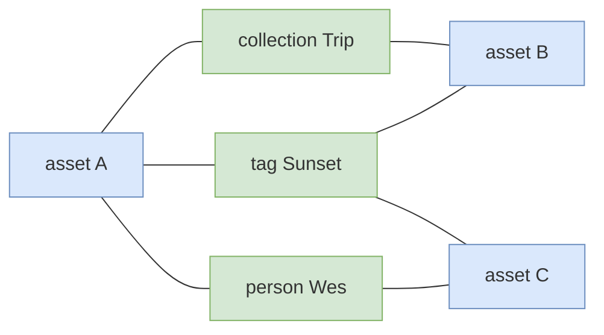

# Asset Relationship Graph Index

The traversal index behind "what else is like this asset" - the tags, collections, remixes and people that connect one
asset to another.

This is a **prototype**, integrated behind an interface and disabled by default. Read section 9 before switching it on.

---

## 1. What It Is

MetaLoom's assets are connected through four link tables: `tag_asset`, `collection_asset`, `remix_member`, and the
asset-to-person path through `detection`. The question "which other assets share something with this one, and what"
is a self-join across all four, unioned and grouped. Postgres answers it correctly. The cost is that every relation
added to the schema adds a branch to the union, and every branch scans another table.

The asset graph index answers the same question as a two-hop traversal instead: out of the asset to whatever it is
attached to, and back down to the other assets attached to the same things.



Asset B shares two connections with A (the tag and the collection); asset C shares two as well (the tag and the
person). Both are returned, ranked by how many they share, each carrying the intermediates that explain it.

## 2. The Contract

**The index is a derived, rebuildable projection of the link tables, never a system of record.** Every fact in it
exists in Postgres first. It can be dropped and rebuilt at any time. Every write path writes Postgres first and the
index second; a failed index write is logged and never fatal.

This is the same contract as the vector index ([VectorIndex](../../../loom-shared/api/src/main/java/io/metaloom/loom/api/search/VectorIndex.java))
and it is not a formality. It is what makes three otherwise disqualifying properties of the backend acceptable:

| Backend property | Why it is survivable here |
|------------------|---------------------------|
| One writer at a time | An index is written in batches by a projector, not concurrently by the pipeline |
| No backup mechanism | Nothing to back up; a rebuild reconstructs it from Postgres |
| Compaction invalidates internal ids | Nothing outside the index ever sees one - every entry point takes a uuid |

None of these would be acceptable for a system of record, and the design does not ask them to be.

## 3. Architecture

```
   Postgres (system of record)          AssetGraphIndex (derived)
   ┌──────────────────────┐             ┌───────────────────────────────┐
   │ tag_asset            │             │ GraphStoreAssetGraphIndex     │
   │ collection_asset     │ ──project──▶│   nodes:  asset/tag/...       │
   │ remix_member         │             │           + uuid property     │
   │ detection → person   │             │   edges:  TAGGED, IN_REMIX... │
   └──────────────────────┘             └───────────────────────────────┘
              │                                        │
              │ relatedAssets: 4-way union self-join   │ relatedAssets: 2 hops
              ▼                                        ▼
                     AssetGraphDifferentialTest asserts these agree
```

Node identity is the part worth understanding. Loom addresses everything by `UUID`; the engine addresses everything
by a `long` that decodes arithmetically into a file offset. The translation goes through the **engine's property
index on every call**, not through a map held in the index class. That costs an index probe per lookup and buys the
one thing that matters: compaction relocates records and changes every internal id, so a cached mapping would be
wrong precisely when compaction ran.

## 4. Environment Variables

| Variable | Default | Meaning |
|----------|---------|---------|
| `LOOM_ASSET_GRAPH_PROVIDER` | `none` | `none` or `graphstore`. The link tables are the system of record either way |
| `LOOM_ASSET_GRAPH_PATH` | `asset-graph-index` | Directory holding the on-disk index. Rebuildable at any time |
| `LOOM_ASSET_GRAPH_LIMIT` | `50` | Default related assets per query; overridable per request |
| `LOOM_ASSET_GRAPH_SYNC_BATCH_SIZE` | `1000` | Link rows projected per batch during a rebuild. Each batch is one transaction, and a transaction is bounded by heap in this backend |

Disabled by default, deliberately. An index whose backend has no backup mechanism should not arrive switched on.

## 5. Key Classes Reference

| Class | Package | Purpose |
|-------|---------|---------|
| `AssetGraphIndex` | `io.metaloom.loom.api.graph` | The SPI. Mirrors `VectorIndex` exactly, including the availability contract |
| `GraphNodeRef` | `io.metaloom.loom.api.graph` | One vertex: a kind and a uuid. The kind is a string so a new relation does not need a release of this module |
| `GraphEdge` | `io.metaloom.loom.api.graph` | One relationship, with factories per link table |
| `RelatedAssetsQuery` / `RelatedAsset` | `io.metaloom.loom.api.graph` | The question and the answer, the answer carrying the intermediates that explain it |
| `AssetGraphOptions` | `io.metaloom.loom.api.options` | Configuration, validated at boot like every other option |
| `GraphStoreAssetGraphIndex` | `io.metaloom.loom.graph.store` | The implementation over `io.metaloom.graph:graph-storage-ffm-poc` |
| `NoopAssetGraphIndex` | `io.metaloom.loom.graph` | Bound when disabled or when the backend fails to open |
| `AssetGraphIndexModule` | `io.metaloom.loom.core.dagger` | The binding. Never fails boot |
| `PostgresLinkTables` | `io.metaloom.loom.graph` (test) | The other half of the differential check: the real SQL, against a real Postgres |

## 6. Test Setup

Three test classes, two of which need a Postgres and skip without one.

| Test | Tag | Needs Postgres | What it proves |
|------|-----|----------------|----------------|
| `AssetGraphIndexTest` | - | no | The SPI contract in isolation: idempotent links, availability semantics, the Noop |
| `AssetGraphDifferentialTest` | `graphdiff` | yes | The index and the SQL return **identical** answers, including after deletions, a rebuild and a compaction |
| `AssetGraphBenchmarkTest` | `graphbench` | yes | How each side's latency moves with graph size |

```bash
# The differential check. Skips if nothing answers on 5432.
mvn test -pl loom/services/graphstore -Dtest=AssetGraphDifferentialTest

# Point it somewhere else:
mvn test -pl loom/services/graphstore -Dtest=AssetGraphDifferentialTest \
  -Dassetgraph.test.jdbc.url=jdbc:postgresql://localhost:5444/loom \
  -Dassetgraph.test.jdbc.user=postgres -Dassetgraph.test.jdbc.password=finger
```

Each run creates and drops its own uniquely named schema (`assetgraph_difftest_<random>`), so it never touches
existing data and two runs cannot collide. A fixed name looked tidier and was a trap: the benchmark and the
differential check running together dropped each other's tables mid-run, and the failure surfaced as
"relation does not exist" a long way from its cause.

**The SQL is not a mock**, and there are two of it. Both the obvious four-way union self-join and a tuned version
that pushes the asset filter into each branch run against a real Postgres with the same indexes the real link tables
have, and the index is asserted to agree with both. A differential test against a hand-written expectation would only
prove that two pieces of the same author's reasoning agree; a benchmark against only the naive form would have
flattered the index by two orders of magnitude. See section 8.

## 7. Conventions and Gotchas

- **Never treat an empty result as "nothing is related".** Check `isAvailable()` first. "No index" and "no matches"
  are opposite answers and a route that conflates them turns a broken index into a wrong one. This is the same rule
  the vector index states, for the same reason.
- **Never hold an engine id.** Everything crossing this boundary is a uuid. Compaction invalidates internal ids, and
  the only reason that is safe is that nothing outside `GraphStoreAssetGraphIndex` has one.
- **Never write per row.** The backend fsyncs per commit at roughly a thousand commits a second. `linkAll` and
  `rebuild` batch; a per-row hook would serialise the pipeline behind the index.
- **The index is not in any REST route yet.** The SPI, the implementation and the binding exist; nothing calls them
  in production. Section 9 says why.
- **A new relation is three edits**: a `TYPE_` constant on `GraphEdge`, a factory beside it, and a branch in whatever
  projects the rows. It is not a change to the engine or to the SPI.

## 8. Measured Results

From `AssetGraphBenchmarkTest`: one process, Postgres 16 in a container on the same machine, link tables indexed and
analysed exactly as the real schema has them. Median of 200 queries after a warmup.

| assets | edges | naive SQL | tuned SQL | index | vs naive | vs tuned | index size |
|--------|-------|-----------|-----------|-------|----------|----------|------------|
| 1,000 | 8,000 | 1,684 us | 388 us | 165 us | 10.2x | **2.4x** | 54 MB |
| 10,000 | 80,000 | 14,204 us | 303 us | 127 us | 111.6x | **2.4x** | 160 MB |
| 50,000 | 400,000 | 126,755 us | 456 us | 193 us | 657.1x | **2.4x** | 590 MB |

Two SQL formulations are measured, and the difference between them is the whole result.

The **naive** query is the obvious one: a CTE unioning all four link tables, self-joined. A CTE referenced twice is
materialised, so it scans every link row in the system on every call - and its cost grows linearly with the graph,
from 1.7 ms to 127 ms across a 50x increase. Against that, the index looks 657x faster.

The **tuned** query pushes the asset filter into each branch first, then looks up the other assets on the handful of
intermediates that come back. Every join rides the leading column of a primary key. It is flat: 388, 303, 456
microseconds across the same 50x increase, with no trend. Against that, the index is **2.4x faster and stays 2.4x
faster**.

Reporting only the first comparison would have been the easiest possible way to justify this work, and it would have
been wrong. Postgres is not structurally disadvantaged at this query; the obvious way of writing it is.

## 9. Status and Recommendation

**Recommendation: do not adopt.** Integrated behind an interface, disabled by default, wired into no route.

The measured advantage over SQL anyone would actually deploy is 2.4x on a query that takes 0.3 milliseconds. The cost
of collecting it is a second copy of every relationship, a projector to keep it in step, an orphan sweep, a backend
with one writer and no backup mechanism, and an operational surface that has to be understood before it can be
trusted. That is not a trade worth making for 0.2 milliseconds on a query nothing is currently waiting on.

What the phase did establish, and what makes it worth keeping rather than deleting:

- **The fit is real.** The traversal returns byte-identical answers to both SQL formulations across insertions,
  deletions, a full rebuild and a compaction. The model maps cleanly; there is no impedance mismatch here.
- **The integration shape is right.** Everything is uuid-addressed, so the backend's id-invalidating compaction cannot
  reach a caller. Writes batch, so its single-writer limit never touches the pipeline. The binding cannot fail boot.
- **The number to watch is the tuned SQL, not the naive one.** It is flat today because each branch is an index scan
  over a few rows. It stops being flat when an asset accumulates thousands of intermediates - a tag applied to half
  the library, say - because then each branch returns thousands of rows and the group-by grows with it. The index
  degrades more slowly in that case, since its cost is the same traversal without the union.

**Revisit when** one of these becomes true, and re-run `AssetGraphBenchmarkTest` before deciding:

1. The union grows past six or seven branches, or relatedness moves onto a hot path where 0.3 ms per call matters.
2. Assets routinely carry high-degree intermediates, which is where the flatness of the tuned SQL breaks down.
3. The question changes shape - three hops, or path-finding between two assets, which SQL expresses badly and a
   traversal expresses naturally. This is the most likely trigger and the least like the query measured here.

Until then: the SPI stays, the implementation stays, the tests stay green, and `LOOM_ASSET_GRAPH_PROVIDER` stays
`none`. The artefact is **not published** to the MetaLoom Maven repository, because nothing depends on it.

## 10. Where Do I Find ...?

| Concept | File |
|---------|------|
| The SPI and its contract | `loom-shared/api/src/main/java/io/metaloom/loom/api/graph/AssetGraphIndex.java` |
| The implementation | `loom/services/graphstore/src/main/java/io/metaloom/loom/graph/store/GraphStoreAssetGraphIndex.java` |
| The binding, and why it cannot fail boot | `loom/core/src/main/java/io/metaloom/loom/core/dagger/AssetGraphIndexModule.java` |
| The SQL being compared against | `loom/services/graphstore/src/test/java/io/metaloom/loom/graph/PostgresLinkTables.java` |
| The engine itself | `/home/defaultuser/workspaces/metaloom/graph-storage-ffm-poc` |
| The precedent this follows | [features/search/SEMANTIC_SEARCH.md](../search/SEMANTIC_SEARCH.md), `VectorIndex` |

## 11. Progress Assessment

- [x] `AssetGraphIndex` SPI, mirroring the `VectorIndex` contract
- [x] `GraphNodeRef`, `GraphEdge`, `RelatedAssetsQuery`, `RelatedAsset`
- [x] `GraphStoreAssetGraphIndex` over the graph engine, with uuid-addressed identity
- [x] `NoopAssetGraphIndex` and a boot-safe Dagger binding
- [x] `AssetGraphOptions`, validated at boot, disabled by default
- [x] Differential check against real Postgres, including deletions, rebuild and compaction
- [x] Benchmark against the SQL at three scales
- [x] Naive and tuned SQL both measured, and both asserted to agree with the index
- [x] Recommendation recorded with the numbers behind it (section 9): **do not adopt yet**

Deliberately not done, because the recommendation is not to adopt. Each becomes work if that changes:

- [ ] A projector that keeps the index in step with the link tables (the `EmbeddingIndexSyncService` equivalent)
- [ ] REST route for relatedness, plus its endpoint and permission tests
- [ ] Orphan sweep using `streamIndexedAssetUuids()`
- [ ] Customer-facing documentation under `website/content/english/docs` - there is nothing a customer can use yet
- [ ] Demo data exercising the relation

---

_Git HEAD revision: `836d2509`_
_Last updated: 2026-08-13_
