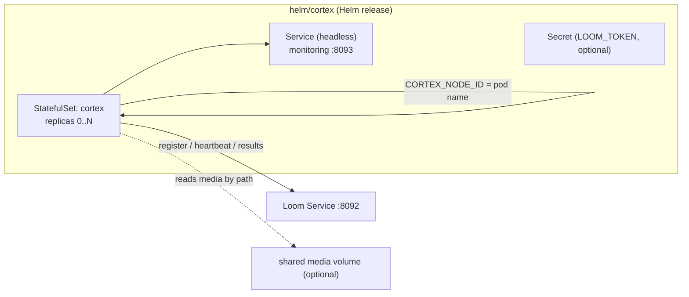

# Helm Chart — Cortex (`helm/cortex`)

> **Audience: AI coding agents.** How the Cortex worker Helm chart is structured, what it renders, and
> the constraints it must honor. The customer-facing version is
> [`website/content/english/docs/deployment/helm/`](../../../website/content/english/docs/deployment/helm/index.adoc).
> See [HELM_LOOM.md](HELM_LOOM.md) for the server chart.

The chart deploys one or more **Cortex workers**. A worker dials **out** to Loom over the processor
WebSocket, registers, and runs the node tasks Loom dispatches. The headline capability is the
overridable `image.repository`: the same chart runs the stock worker
([`cortex/container/Containerfile`](../../../cortex/container/Containerfile)) or a **custom node image**
(see [`examples/cortex-custom`](../../../examples/cortex-custom) and
[`examples/cortex-python`](../../../examples/cortex-python)).

## Architecture

## What each template renders

| Template | Kind | Notes |
|----------|------|-------|
| `templates/statefulset.yaml` | StatefulSet | `CORTEX_NODE_ID` from `metadata.name` (stable ordinal); configurable liveness/readiness probes; optional media + meta + config mounts; `volumeClaimTemplates` for meta when persisted |
| `templates/service.yaml` | Service (headless) | Fronts monitoring port `8093` for health/metrics scraping |
| `templates/secret.yaml` | Secret | `<fullname>-token` (`token`), only if `loom.token` set and no `existingSecret` |
| `templates/configmap.yaml` | ConfigMap | Only when `.Values.config` set → mounted `/config/cortex.yml` |
| `templates/serviceaccount.yaml` | ServiceAccount | Gated `serviceAccount.create` |
| `templates/poddisruptionbudget.yaml` | PodDisruptionBudget | Gated `podDisruptionBudget.enabled` |
| `templates/_helpers.tpl` | — | name/labels, image ref (tag defaults to appVersion), token-secret name |
| `templates/NOTES.txt` | — | Registration check + token/media/custom-image hints |

## Why a StatefulSet (not a Deployment)

`CORTEX_NODE_ID` must be a **stable per-replica identity** — Loom keys worker leases on it, and a
random suffix would orphan the lease on every restart. The StatefulSet gives each pod a stable name
(`cortex-0`, `cortex-1`, …) which is injected as `CORTEX_NODE_ID` via `fieldRef: metadata.name`. This
matches the rule in the Kubernetes playbook.

## Custom node image — the override surface

| Value | Purpose |
|-------|---------|
| `image.repository` / `image.tag` / `pullPolicy` | **Point at any worker image** (stock, `metaloom/cortex-custom`, `metaloom/cortex-python`, your own). |
| `command` / `args` | Entrypoint override for images that don't use the stock CMD. |
| `extraEnv` | Image-specific env. |
| `nodeKinds` | Advertised kinds → both `CORTEX_NODE_WHITELIST` and `CORTEX_NODE_KINDS` (the Python example reads the latter). |
| `livenessProbe` / `readinessProbe` | `type: httpGet|tcpSocket|exec`, or `enabled: false`. A minimal worker with no `/api/health` (the Python example) sets `readinessProbe.enabled=false` + `livenessProbe.type=tcpSocket`. |

The example images:

| Example | Image | Base | Probes |
|---------|-------|------|--------|
| `examples/cortex-custom` | `metaloom/cortex-custom` | `metaloom/cortex-server` (thin overlay: adds only the example jars, reuses the base classpath via `-cp`) | default HTTP probes work |
| `examples/cortex-python` | `metaloom/cortex-python` | `python:3.12-slim` | no monitoring port → disable/retype probes |

## Environment variables the chart sets

| Env | Source | Default |
|-----|--------|---------|
| `LOOM_HOST` / `LOOM_PORT` | `loom.host` / `loom.port` | `loom` / `8092` |
| `LOOM_TOKEN` | token Secret (`token`) | unset (token-less = no result write-back) |
| `CORTEX_MONITORING_PORT` | `monitoring.port` | `8093` |
| `CORTEX_META_PATH` | `meta.path` | `/meta` |
| `CORTEX_NODE_ID` | `nodeId` or pod name (`fieldRef`) | pod name |
| `CORTEX_NODE_WHITELIST` / `CORTEX_NODE_KINDS` | `nodeKinds` | all kinds |
| `CORTEX_NODE_BLACKLIST` | `nodeBlacklist` | — |

## Key files reference

| Item | Path |
|------|------|
| Chart metadata / values / README | `helm/cortex/{Chart.yaml,values.yaml,README.md}` |
| Container contract mirrored | `cortex/container/Containerfile` |
| Health/readiness endpoints | `cortex/core/.../impl/monitoring/HealthEndpoint.java` (`/api/health`, `/api/ready` on 8093) |
| Config env reference | [`../../cortex/CONFIGURATION.md`](../../cortex/CONFIGURATION.md) |
| Monitoring/health/metrics | [`../ops/MONITORING.md`](../ops/MONITORING.md), [`../ops/METRICS.md`](../ops/METRICS.md) |
| Custom worker examples | `examples/cortex-custom/`, `examples/cortex-python/` |
| Customer-facing page | `website/content/english/docs/deployment/helm/index.adoc` |

## Conventions & Gotchas

| Area | Gotcha |
|------|--------|
| **Stable node id** | 🔴 StatefulSet, not Deployment: `CORTEX_NODE_ID = metadata.name`. Never inject a random suffix. |
| **Direction** | Cortex dials **out** to Loom; Loom never connects in. The Service is headless and exists only for health/metrics scraping. |
| **Media by path** | Loom hands the worker a *path*, not bytes. Source/hash/whisper-style nodes need the same media mounted (`media.enabled` with `existingClaim`/`hostPath`/`nfs`). |
| **Token-less mode** | Without `loom.token`/`existingSecret` the worker still registers and answers tasks but skips result persistence — same graceful degradation as an offline worker. |
| **Probes vs image** | Default probes assume the stock monitoring server (`/api/health`, `/api/ready` on 8093). A minimal custom image without them must disable/retype the probes, or the pod never becomes Ready. |
| **GPU** | The stock image ships a CUDA runtime; request a GPU via `resources.limits.nvidia.com/gpu`. |
| **Validation** | `helm lint helm/cortex`; render the stock, custom-JVM and Python-worker variants with `helm template`. |

## Where do I find …?

| Need | Look here |
|------|-----------|
| A value's effect | `helm/cortex/values.yaml` (commented) |
| Env/probe/node-id wiring | `helm/cortex/templates/statefulset.yaml` |
| Image ref / token secret helpers | `helm/cortex/templates/_helpers.tpl` |
| How to build a custom image | `examples/cortex-custom/build-image.sh`, `examples/cortex-python/build-image.sh` |
| Server chart | [HELM_LOOM.md](HELM_LOOM.md) |

## Progress Assessment

- [x] `Chart.yaml`, commented `values.yaml`, `.helmignore`, README
- [x] StatefulSet with stable `CORTEX_NODE_ID`, headless Service, optional token Secret/ConfigMap/PDB
- [x] Overridable image + `command`/`args`/`extraEnv` + configurable probes (JVM and Python images)
- [x] `nodeKinds` → whitelist + kinds; optional media / meta volumes
- [x] Example `Containerfile` + `build-image.sh` for `cortex-custom` (thin overlay) and `cortex-python`
- [x] `helm lint` clean; `helm template` renders across stock/custom/python variants
- [ ] No automated `helm lint`/`helm template` gate in CI yet
- [ ] Live registration smoke test (worker reaches `/api/ready` and appears in `GET /api/v1/processors`)
      not yet part of the standard verification
- [ ] The stock worker still advertises only a subset of node kinds (see the pipeline-node registry
      note in [CONTEXT.md](../../CONTEXT.md) §6) — unrelated to the chart, but affects what `nodeKinds`
      can usefully request

---

_Git HEAD: `65e6c4649c639303932384942d4c68d8e9e8360d` (branch `master`)_
_Last updated: 2026-07-26_
