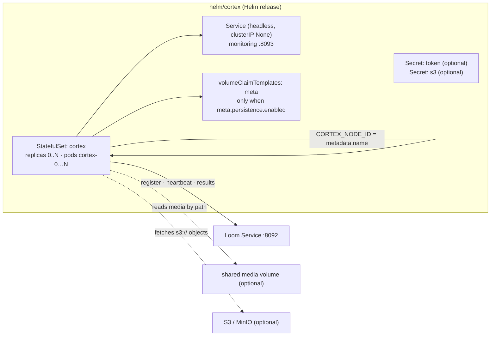

# Helm Chart — Cortex (`helm/cortex`)

> **Audience: AI coding agents.** How the Cortex worker Helm chart is structured, what it renders, and
> the constraints it must honor. The customer-facing version is
> [`website/content/english/docs/deployment/helm/`](../../../website/content/english/docs/deployment/helm/index.adoc).
> See [HELM_LOOM.md](HELM_LOOM.md) for the server chart.

The chart deploys one or more **Cortex workers**. A worker dials **out** to Loom over the processor
WebSocket, registers, and runs the node tasks Loom dispatches. The headline capability is the
overridable `image.repository`: the same chart runs the stock worker
([`cortex/container/Containerfile`](../../../cortex/container/Containerfile)) or a **custom node image**
(see [`examples/cortex-custom`](../../../examples/cortex-custom) and
[`examples/cortex-python`](../../../examples/cortex-python)).

Env/CLI-option semantics live in [`../../cortex/CONFIGURATION.md`](../../cortex/CONFIGURATION.md) and
are not duplicated here. Unlike Loom, Cortex scales horizontally on purpose — nothing in
[`../../CLUSTERING.md`](../../CLUSTERING.md) restricts it.

## Architecture

## What each template renders

| Template | Kind | Notes |
|----------|------|-------|
| `templates/statefulset.yaml` | StatefulSet | `CORTEX_NODE_ID` from `metadata.name` unless `nodeId` is set; typed liveness/readiness probes; optional meta + media + config mounts; `volumeClaimTemplates` for `meta` when persisted |
| `templates/service.yaml` | Service (headless) | Gated `service.enabled`; `clusterIP: None`; fronts monitoring `8093` for health/metrics scraping only |
| `templates/secret.yaml` | Secret | `<fullname>-token` (key `token`), only if `loom.token` set and no `existingSecret` |
| `templates/s3-secret.yaml` | Secret | `<fullname>-s3` (`accessKey`, `secretKey`, `webhookSecret`); only when `s3.enabled` **and** something to store **and** no `s3.existingSecret` |
| `templates/cloud-secret.yaml` | Secret | `<fullname>-gdrive` (`serviceAccountJson`, `clientSecret`, `refreshToken`) and `<fullname>-onedrive` (`clientSecret`, `refreshToken`); each rendered per provider under the same three conditions |
| `templates/configmap.yaml` | ConfigMap | Only when `.Values.config` set → mounted `/config/cortex.yml` (subPath). 🔴 **Inert — see gotchas** |
| `templates/serviceaccount.yaml` | ServiceAccount | Gated `serviceAccount.create` |
| `templates/poddisruptionbudget.yaml` | PodDisruptionBudget | Gated `podDisruptionBudget.enabled` |
| `templates/_helpers.tpl` | — | name/labels, `cortex.image` (tag defaults to `appVersion`), `cortex.tokenSecretName`, `cortex.s3SecretName` |
| `templates/NOTES.txt` | — | Registration check (`GET /api/v1/processors`) + token/media/custom-image hints |

## Why a StatefulSet (not a Deployment) — and why the node id is now mandatory

`CORTEX_NODE_ID` must be a **stable per-replica identity**: Loom keys registration, node-kind
restrictions, leases and run attribution on it, and rejects a second worker announcing an id already
in use. The StatefulSet gives each pod a stable name (`cortex-0`, `cortex-1`, …), injected via
`fieldRef: metadata.name`.

🔴 **A missing id is a hard, up-front failure, not a silent fallback.**
`CortexMain` checks the resolved options before the worker starts and **exits with code 2** unless
`CORTEX_NODE_ID` is set. A bare `podman run metaloom/cortex-server` therefore fails by design. The
chart always sets the var, so a chart install is unaffected — but a custom `main`
(`CortexCustomMain` does this) must supply an id too; that path is caught later by
`LoomControlChannel` (`IllegalStateException` on a blank id at registration time) rather than at
startup.

## Custom node image — the override surface

| Value | Purpose |
|-------|---------|
| `image.repository` / `.tag` / `.pullPolicy` | **Point at any worker image** (stock, `metaloom/cortex-custom`, `metaloom/cortex-python`, your own). Empty tag → chart `appVersion`. |
| `command` / `args` | Entrypoint override. **Neither example needs it** — both bake their own `CMD`. Reserve it for third-party images or for appending flags to the stock CLI. |
| `extraEnv` | Image-specific env, appended last (also the escape hatch for anything untemplated). |
| `nodeKinds` | Advertised kinds → both `CORTEX_NODE_WHITELIST` (stock worker) and `CORTEX_NODE_KINDS` (only the Python example reads this one; it is **not** in `CortexEnvOptions`). |
| `livenessProbe` / `readinessProbe` | `type: httpGet\|tcpSocket\|exec`, or `enabled: false`. Both probes always target the `monitoring` port. |

The example images:

| Example | Image | Base | Entry point | Probes |
|---------|-------|------|-------------|--------|
| `examples/cortex-custom` | `metaloom/cortex-custom` | `metaloom/cortex-server` (thin overlay: adds only the example jars, reuses the base classpath via `-cp`) | own `CMD` → `io.metaloom.cortex.cli.CortexCustomMain` (same shape as the stock `CortexMain`, different class) | default HTTP probes work |
| `examples/cortex-python` | `metaloom/cortex-python` | `python:3.12-slim` | own `CMD ["python","daemon.py"]` | no monitoring port → `readinessProbe.enabled=false` + `livenessProbe.type=tcpSocket` |

## Environment variables the chart sets

All `LOOM_*`/`CORTEX_*` names below (except `LOOM_TOKEN`) are applied by **`CortexEnvOptions`**,
which writes them onto `CortexOptions` after `cortex.yml` is loaded. Cortex has no CLI, so there are
no flags behind them. A name absent from `CortexEnvOptions` is read by nobody in the stock image.

| Env | Source | Chart default | Lands on |
|-----|--------|---------------|----------|
| `LOOM_HOST` / `LOOM_PORT` | `loom.host` / `loom.port` | `loom` / `8092` | `CortexOptions.loom.hostname` / `.port` |
| `LOOM_TOKEN` | token Secret, key `token`; only if `loom.token` or `loom.existingSecret` | unset (token-less = no result write-back) | `LoomControlChannel#resolveToken` (`System.getenv`, not `CortexEnvOptions`) |
| `CORTEX_MONITORING_PORT` | `monitoring.port` | `8093` | `CortexOptions.monitoringPort` |
| `CORTEX_META_PATH` | `meta.path` | `/meta` | `CortexOptions.metaPath` |
| `CORTEX_NODE_ID` | `nodeId`, else pod name via `fieldRef` | pod name | `CortexOptions.nodeId` (mandatory) |
| `CORTEX_NODE_WHITELIST` | `nodeKinds` (comma-joined) | unset = announce everything | `CortexOptions.nodeWhitelist` |
| `CORTEX_NODE_KINDS` | `nodeKinds` (same value) | unset | **Python example only** |
| `CORTEX_NODE_BLACKLIST` | `nodeBlacklist` | unset | `CortexOptions.nodeBlacklist` (wins over the whitelist) |
| `CORTEX_S3_ENDPOINT` / `_REGION` / `_PATH_STYLE` | `s3.endpoint` / `.region` / `.pathStyleAccess` | — / `us-east-1` / `true` | `S3ClientOptions` |
| `CORTEX_S3_ACCESS_KEY` / `_SECRET_KEY` | s3 Secret | unset → AWS default credential chain (IRSA) | `S3ClientOptions` |
| `CORTEX_GDRIVE_SERVICE_ACCOUNT_JSON` | gdrive Secret | unset → the `gdrive-source` kind is not advertised | `GDriveClientOptions` |
| `CORTEX_ONEDRIVE_CLIENT_SECRET` / `_TENANT_ID` / `_CLIENT_ID` | onedrive Secret / values | unset → the `onedrive-source` kind is not advertised | `OneDriveClientOptions` |
| `CORTEX_S3_CACHE_PATH` / `_MAX_CACHE_BYTES` / `_RECONCILE_INTERVAL_MS` | `s3.*` | `<meta.path>/s3_bin` / 50Gi / 6h | `S3ClientOptions` |

⚠️ A blank value counts as unset, and a malformed one (a non-numeric port, a boolean that is not
`true`/`false`) **aborts the startup** rather than falling back to a default.
| `CORTEX_S3_EVENTS_ENABLED` / `_MODE` / `_QUEUE_URL` / `_WEBHOOK_SECRET` | `s3.events.*` | off / `WEBHOOK` | `S3EventOptions` |

Everything under `s3.*` is rendered only inside `if .Values.s3.enabled`.

## Values worth knowing

| Key | Default | Note |
|-----|---------|------|
| `replicaCount` | `1` | 0..N, each replica its own worker identity |
| `nodeId` | `""` | Overrides the pod name — only sane for a single replica |
| `nodeKinds` / `nodeBlacklist` | `[]` / `[]` | Empty whitelist = announce everything the image supports |
| `loom.{host,port,token,existingSecret}` | `loom`, `8092`, `""`, `""` | Token-less is a supported degraded mode |
| `meta.path` / `meta.persistence.*` | `/meta` / **disabled**, RWO, 2Gi | 🔴 When persistence is off the mount is omitted entirely — `/meta` is container-local and lost per restart (a worker rebuilds it) |
| `media.{enabled,mountPath,existingClaim,hostPath,nfs,readOnly}` | off, `/media`, …, `true` | Provide exactly one volume source |
| `s3.*` | disabled | Belongs on **every** worker touching `s3://` media, not just the source-node worker |
| `gdrive.*` / `onedrive.*` | disabled | Same rule for `gdrive://` and `onedrive://` media. Each provider gates its own node kind independently, so a worker may serve one cloud and not the other |
| `monitoring.port` / `service.{enabled,type,port}` | `8093` / on, `ClusterIP`, `8093` | Service is headless regardless of `type` |
| `livenessProbe` / `readinessProbe` | on, `httpGet`, `/api/health` / `/api/ready` | Ready = connected **and** registered with Loom |
| `resources.requests` | `250m` / `512Mi` | GPU via `resources.limits["nvidia.com/gpu"]` |
| `podSecurityContext` | `runAsUser 1000`, `runAsGroup 0`, `fsGroup 0` | matches the image user |
| `podDisruptionBudget.{enabled,minAvailable,maxUnavailable}` | off | |
| `config` | `{}` | 🔴 inert — see gotchas |

## Key classes reference

| Class | Package (`cortex/…`) | Why it matters here |
|---|---|---|
| `CortexEnvOptions` | `io.metaloom.cortex.common.option` (`common`) | **The authoritative env-var list.** If a name is not here, the chart setting it does nothing |
| `CortexMain` | `io.metaloom.cortex.cli` (`cli`) | Entry point; hard startup failure (exit 2) when no `CORTEX_NODE_ID` is configured |
| `LoomControlChannel` | `io.metaloom.cortex.impl.loom` (`core`) | `resolveToken` (`LOOM_TOKEN`), blank-id guard, registration/heartbeat |
| `CortexOptionsLoader` | `io.metaloom.cortex.common.option` (`common`) | `defaultConfigPath()` = `$HOME/.config/metaloom/cortex.yml` — why `.Values.config` is inert |
| `HealthEndpoint` | `io.metaloom.cortex.impl.monitoring` (`core`) | Registers `/api/health` and `/api/ready` on the monitoring port |
| `S3Support` / `S3Module` | `io.metaloom.cortex.s3` (`s3-common`) / `io.metaloom.cortex.cli.dagger` (`core`) | Where the `CORTEX_S3_*` values land; cache-path fallback |
| `CortexCustomMain` | `io.metaloom.cortex.cli` (`examples/cortex-custom`) | Custom-image entry point; must enforce the node id itself |

## Conventions & Gotchas

| Area | Gotcha |
|------|--------|
| **Stable node id** | 🔴 StatefulSet, not Deployment: `CORTEX_NODE_ID = metadata.name`. Never inject a random suffix — and never drop the var: the stock image now **refuses to start** without one. |
| **`.Values.config` is inert** | 🔴 The ConfigMap mounts `/config/cortex.yml`, but `CortexOptionsLoader#defaultConfigPath` only reads `$HOME/.config/metaloom/cortex.yml` (`HOME=/cortex`). The image's `/cortex/config` → `/config` symlink does **not** bridge that. The file *is* loaded when it sits at the loader's path; from a chart, use `extraEnv`. Same class of bug as Loom's B3 ([HELM_LOOM.md](HELM_LOOM.md)). |
| **Env names are explicitly mapped** | ⚠️ Adding `CORTEX_FOO` to the StatefulSet does nothing unless `CortexEnvOptions` reads it. `CORTEX_NODE_KINDS` is the deliberate exception — it exists purely for the Python example. |
| **Direction** | Cortex dials **out** to Loom; Loom never connects in. The Service is headless and exists only for health/metrics scraping — it is not a load-balancing target. |
| **Media by path** | Loom hands the worker a *path*, not bytes. Source/hash/whisper-style nodes need the same media mounted (`media.enabled` with `existingClaim`/`hostPath`/`nfs`) — **unless** the media is `s3://`, in which case `s3.enabled` removes the shared-volume requirement entirely (objects are fetched lazily by whichever worker runs the task). |
| **S3 is per-worker, not per-node** | ⚠️ Any worker that may execute a task against `s3://` media needs the `s3.*` block — not only the one running the `s3-source` node. |
| **Cloud drives are per-worker too, and per provider** | ⚠️ The same applies to `gdrive.*` / `onedrive.*`. Note that OneDrive app-only credentials have no `/me`, so `onedrive.defaultDriveId` (or a `driveId` on every node) is effectively required. |
| **Token-less mode** | Without `loom.token`/`existingSecret` the worker still registers and answers tasks but skips result persistence — the same graceful degradation as an offline worker. |
| **Probes vs image** | Default probes assume the stock monitoring server (`/api/health`, `/api/ready` on 8093). A minimal custom image without them must disable or retype the probes, or the pod never becomes Ready. Probes always target the `monitoring` port — an image serving health elsewhere needs `type: exec`. |
| **`meta` volume is conditional** | ⚠️ The `/meta` mount and its `volumeClaimTemplate` are both gated on `meta.persistence.enabled`. `CORTEX_META_PATH` is set either way, so with persistence off the worker writes to the pod filesystem (including the S3 cache, which defaults under it). |
| **GPU** | The stock image ships a CUDA runtime; request a GPU via `resources.limits["nvidia.com/gpu"]`. |

## Test Setup / validation

| Step | Command |
|------|---------|
| Lint | `helm lint helm/cortex` |
| Render the variants | `helm template t helm/cortex` · `--set image.repository=metaloom/cortex-python --set readinessProbe.enabled=false --set livenessProbe.type=tcpSocket` · `--set s3.enabled=true --set s3.accessKey=a --set s3.secretKey=b` · `--set meta.persistence.enabled=true` · `--set loom.token=x` |
| Assert env names against the code | `helm template t helm/cortex \| grep -E 'name: (LOOM\|CORTEX)_'` then check each against `CortexEnvOptions` |
| Live registration | worker reaches `/api/ready`, then `GET /api/v1/processors` on Loom lists the `CORTEX_NODE_ID` |

No CI gate and no `helm unittest` suite exist for either check.

## Where do I find …?

| Need | Look here |
|------|-----------|
| A value's effect | `helm/cortex/values.yaml` (commented) |
| Env / probe / node-id wiring | `helm/cortex/templates/statefulset.yaml` |
| Whether an env var is actually read | `cortex/common/.../option/CortexEnvOptions.java` |
| Option semantics and defaults | [`../../cortex/CONFIGURATION.md`](../../cortex/CONFIGURATION.md) |
| Image ref / token + S3 secret helpers | `helm/cortex/templates/_helpers.tpl` |
| How to build a custom image | `examples/cortex-custom/{Containerfile,build-image.sh}`, `examples/cortex-python/{Containerfile,build-image.sh}` |
| Health/readiness endpoints | `cortex/core/.../impl/monitoring/HealthEndpoint.java` (`/api/health`, `/api/ready` on 8093) |
| Monitoring / metrics | [`../ops/MONITORING.md`](../ops/MONITORING.md), [`../ops/METRICS.md`](../ops/METRICS.md) |
| Why Loom cannot scale the way workers do | [`../../CLUSTERING.md`](../../CLUSTERING.md) |
| Server chart | [HELM_LOOM.md](HELM_LOOM.md) |

## Progress Assessment

- [x] `Chart.yaml`, commented `values.yaml`, `.helmignore`, README
- [x] StatefulSet with stable `CORTEX_NODE_ID`, headless Service, optional token Secret/ConfigMap/PDB
- [x] Overridable image + `command`/`args`/`extraEnv` + typed probes (JVM and Python images)
- [x] `nodeKinds` → whitelist + kinds; optional media / meta volumes
- [x] S3 media access templated end to end (credentials Secret, cache, bucket notifications)
- [x] Example `Containerfile` + `build-image.sh` for `cortex-custom` (thin overlay) and `cortex-python`
- [x] `helm lint` clean; `helm template` renders across stock/custom/python/S3 variants
- [x] Chart stays correct under the mandatory `requireNodeId()` — `CORTEX_NODE_ID` is always emitted
- [ ] 🔴 `.Values.config` is inert — mount at `$HOME/.config/metaloom/cortex.yml` or remove the knob
- [ ] No automated `helm lint` / `helm template` gate in CI; no rendered-env-vs-`CortexEnvOptions` check
- [ ] Live registration smoke test (worker reaches `/api/ready` and appears in `GET /api/v1/processors`)
      not yet part of the standard verification
- [ ] The stock worker still advertises only a subset of node kinds (see the pipeline-node registry
      note in [CONTEXT.md](../../CONTEXT.md) §6) — unrelated to the chart, but bounds what `nodeKinds`
      can usefully request

---

_Git HEAD revision: `aab85cb3`_
_Last updated: 2026-08-02 (env vars now land via `CortexEnvOptions` instead of picocli defaults; the missing-node-id failure is `CortexMain` exiting 2)_
