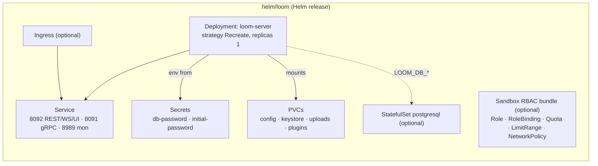

# Helm Chart — Loom (`helm/loom`)

> **Audience: AI coding agents.** How the Loom Helm chart is structured, what it renders, and the
> constraints it must honor. The customer-facing version is
> [`website/content/english/docs/deployment/helm/`](../../../website/content/english/docs/deployment/helm/index.adoc).
> See [HELM_CORTEX.md](HELM_CORTEX.md) for the worker chart.

The chart deploys the **Loom backend server** (REST/gRPC/GraphQL, DB, auth, storage, MCP, pipeline
engine, AI agent) plus the bundled UI, and — optionally — a self-contained PostgreSQL. It mirrors the
container contract of [`loom/containers/server/Containerfile`](../../../loom/containers/server/Containerfile);
the chart invents no new runtime behavior, only parameterizes env vars, volumes and K8s objects.

## Architecture

## What each template renders

| Template | Kind(s) | Notes |
|----------|---------|-------|
| `templates/deployment.yaml` | Deployment | `strategy: Recreate` (single-writer server); env from values + Secrets; mounts config/keystore/uploads/(plugins); HTTP probes on the REST port |
| `templates/service.yaml` | Service | Three named ports: `rest` 8092, `grpc` 8091, `monitoring` 8989 |
| `templates/secret.yaml` | Secret ×2 | `<fullname>-auth` (`initial-password`), `<fullname>-db` (`db-password`) — each skipped if an `existingSecret` is set |
| `templates/pvc.yaml` | PersistentVolumeClaim | One per enabled `persistence.*` entry (range over the map); skipped if `existingClaim` set |
| `templates/configmap.yaml` | ConfigMap | Only when `.Values.config` is non-empty → mounted as `/etc/loom/loom.yml`, `LOOM_CONF_FILENAME` set |
| `templates/ingress.yaml` | Ingress | Gated `ingress.enabled`; routes to the REST port |
| `templates/postgresql.yaml` | Secret + Service + StatefulSet | Gated `postgresql.enabled`; official `postgres` image; **not** a Bitnami/third-party subchart |
| `templates/sandbox-rbac.yaml` | Namespace? + Role + RoleBinding + ResourceQuota + LimitRange + NetworkPolicy | Gated `sandbox.enabled`; the runner-namespace guardrail unit |
| `templates/serviceaccount.yaml` | ServiceAccount | Also the RBAC subject for the sandbox bundle |
| `templates/_helpers.tpl` | — | name/labels + DB host/secret-name/secret-key resolution |
| `templates/NOTES.txt` | — | Post-install hints + warnings (no DB, default password, sandbox) |

## Key files reference

| Item | Path |
|------|------|
| Chart metadata | `helm/loom/Chart.yaml` |
| Default values (commented) | `helm/loom/values.yaml` |
| Chart README | `helm/loom/README.md` |
| Container contract mirrored | `loom/containers/server/Containerfile` |
| Health endpoint (probe target) | `loom/services/rest/.../endpoint/impl/HealthEndpoint.java` (`GET /api/v1/health`) |
| Config env reference | [`../../loom/CONFIGURATION.md`](../../loom/CONFIGURATION.md) |
| Monitoring/health/metrics | [`../ops/MONITORING.md`](../ops/MONITORING.md), [`../ops/METRICS.md`](../ops/METRICS.md) |
| Customer-facing page | `website/content/english/docs/deployment/helm/index.adoc` |

## Environment variables the chart sets

| Env | Source (value) | Default |
|-----|----------------|---------|
| `LOOM_SERVER_REST_PORT` | `service.restPort` | `8092` |
| `LOOM_SERVER_GRPC_PORT` | `service.grpcPort` | `8091` |
| `LOOM_SERVER_MON_PORT` | `service.monitoringPort` | `8989` |
| `LOOM_DB_HOST` | bundled PG Service name, else `database.host` | — |
| `LOOM_DB_PORT` / `_NAME` / `_USER` | `database.*` or `postgresql.auth.*` | `5432` / `loom` / `loom` |
| `LOOM_DB_PASSWORD` | Secret ref (`loom.database.secretName`/`secretKey`) | — |
| `LOOM_INITIAL_PASSWORD` | auth Secret (`initial-password`) | `changeme` (value) |
| `LOOM_AUTH_KEYSTORE_PATH` | `auth.keystorePath` | `/keystore/keystore.jks` |
| `LOOM_BINARY_DIR` | fixed | `/uploads` |
| `LOOM_CONF_FILENAME` | when `config` set | `/etc/loom/loom.yml` |
| `LOOM_AI_ENABLED` / `_PROVIDER_TYPE` / `_URL` / `_MODEL_ID` | `ai.*` | off |
| `LOOM_AGENT_MEMORY_ENABLED` / `_MOUNT_PATH` | `memory.*` | off |
| `LOOM_AGENT_SANDBOX_ENABLED` / `_NAMESPACE` | `sandbox.*` | off |

Additional passthrough: `ai.extraEnv`, `sandbox.extraEnv` (name→value maps) and top-level
`extraEnv` (raw env list).

## Conventions & Gotchas

| Area | Gotcha |
|------|--------|
| **Keystore PVC** | 🔴 `persistence.keystore` holds the JWT signing key. It is enabled by default and **must** stay a real PVC — losing it invalidates every issued token after a restart. Same rationale for `persistence.config`. |
| **Probe target** | Loom's health check is `GET /api/v1/health` on the **REST port 8092** (does a DB check). Port 8989 serves `/metrics` only — do not point probes there. Path/port are values-overridable. |
| **Postgres = not Bitnami** | The bundled Postgres is a self-contained StatefulSet on the official `postgres` image, deliberately **not** the `bitnami/postgresql` subchart (Broadcom moved the free Bitnami images to a paid tier / unmaintained `bitnamilegacy` in 2025). Keeps the chart offline-capable. Production path is an external DB. |
| **DB secret key** | Bundled PG secret uses key `password`; external DB secret uses key `db-password`. Resolved by `loom.database.secretKey` — keep the two paths consistent when editing. |
| **Sandbox is a unit** | `sandbox.enabled` renders the env flag **and** Role/RoleBinding/Quota/LimitRange/NetworkPolicy together. Never template `LOOM_AGENT_SANDBOX_ENABLED` alone. |
| **Recreate strategy** | Loom owns pipeline run state (single writer); the Deployment uses `strategy: Recreate`, not RollingUpdate, to avoid two writers. `replicaCount` should stay 1. |
| **Image user** | The image runs as uid 1000 / gid 0; `podSecurityContext` defaults match (`fsGroup: 0`). |
| **Validation** | `helm lint helm/loom`; render the matrix with `helm template` (external DB / bundled PG / sandbox / ingress). No cluster needed for template validation. |

## Where do I find …?

| Need | Look here |
|------|-----------|
| A value's effect | `helm/loom/values.yaml` (every key is commented) |
| Env var → template wiring | `helm/loom/templates/deployment.yaml` |
| DB host / secret resolution logic | `helm/loom/templates/_helpers.tpl` (`loom.database.*`) |
| Bundled Postgres | `helm/loom/templates/postgresql.yaml` |
| Sandbox guardrails | `helm/loom/templates/sandbox-rbac.yaml` |
| The manifests explained step by step | [`website/.../playbooks/kubernetes/`](../../../website/content/english/docs/playbooks/kubernetes/index.adoc) |
| Cortex worker chart | [HELM_CORTEX.md](HELM_CORTEX.md) |

## Progress Assessment

- [x] `Chart.yaml`, commented `values.yaml`, `.helmignore`, README
- [x] Deployment + Service + Secrets + PVCs + Ingress templates
- [x] Optional self-contained PostgreSQL (no Bitnami dependency)
- [x] Optional sandbox RBAC/guardrail bundle gated behind `sandbox.enabled`
- [x] Probes target `/api/v1/health` on the REST port (values-overridable)
- [x] `helm lint` clean; `helm template` renders across the value matrix
- [x] Customer-facing docs page + de-placeholdered `loom/helm-chart` and k8s playbook
- [ ] No automated `helm lint`/`helm template` gate in CI yet
- [ ] Bundled Postgres has no backup/HA story — external managed DB remains the production path
- [ ] Live `helm install` smoke test against a cluster not yet part of the standard verification

---

_Git HEAD: `65e6c4649c639303932384942d4c68d8e9e8360d` (branch `master`)_
_Last updated: 2026-07-26_
