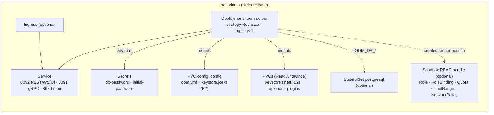

# Helm Chart — Loom (`helm/loom`)

> **Audience: AI coding agents.** How the Loom Helm chart is structured, what it renders, and the
> constraints it must honor. The customer-facing version is
> [`website/content/english/docs/deployment/helm/`](../../../website/content/english/docs/deployment/helm/index.adoc).
> See [HELM_CORTEX.md](HELM_CORTEX.md) for the worker chart.

The chart deploys the **Loom backend server** (REST/gRPC/GraphQL, DB, auth, storage, MCP, pipeline
engine, AI agent) plus the bundled UI, and — optionally — a self-contained PostgreSQL. It mirrors the
container contract of [`loom/containers/server/Containerfile`](../../../loom/containers/server/Containerfile);
the chart invents no new runtime behavior, only parameterizes env vars, volumes and K8s objects.
Env-var semantics live in [`../../loom/CONFIGURATION.md`](../../loom/CONFIGURATION.md); the
single-writer rule lives in [`../../CLUSTERING.md`](../../CLUSTERING.md). Neither is duplicated here.

## 🔴 Known chart bugs (verified at this revision)

Three env vars the chart sets are **not the names the process reads**. All three are chart-side
one-liners; the Java side is correct. Fix them here, not in `loom-shared/api`.

| # | Chart sets | Code actually reads | Effect | Workaround until fixed |
|---|---|---|---|---|
| **B1** | `LOOM_DB_USER` — `templates/deployment.yaml:59,66` | `LOOM_DB_USERNAME` — `DatabaseOptions.java:29,143` | 🔴 **Every Helm install silently connects as the default `postgres` user.** `database.user` / `postgresql.auth.username` are inert; the value falls back to `DatabaseOptions` default. Only visible as a permission/ownership error, or not at all when the bundled PG superuser happens to work. | `--set extraEnv[0].name=LOOM_DB_USERNAME --set extraEnv[0].value=loom` |
| **B2** | `LOOM_AUTH_KEYSTORE_PATH` — `templates/deployment.yaml:79` from `auth.keystorePath: /keystore/keystore.jks` | **nothing.** `AuthModule.java:32-33` always resolves `AuthenticationOptions.DEFAULT_KEYSTORE_FILENAME` (`keystore.jceks`) under `optionsLookup.baseConfigFolder()` | 🔴 The `persistence.keystore` PVC is mounted at `/keystore` where **nothing ever writes** — it stays empty. See the nuance below: the key is not lost, but `values.yaml` documents the wrong volume, and disabling `persistence.config` (documented as merely "configuration") destroys the JWT signing key. | Keep `persistence.config.enabled: true`. `persistence.keystore` may be set to `enabled: false` with no loss. |
| **B3** | `LOOM_CONF_FILENAME=/etc/loom/loom.yml` — `templates/deployment.yaml:91`, ConfigMap mounted at `/etc/loom` | **nothing.** `LoomEnv.LOOM_CONF_FILENAME` (`LoomEnv.java:10`) is a compile-time constant `"loom.yml"`, never an env lookup | 🔴 **`.Values.config` is entirely inert.** Two independent reasons: the env var is not read, *and* the mount path is wrong — the loader (`LoomOptionsLoader#loadLoomOptions`) probes `/etc/metaloom/loom.yml`, `$HOME/.config/metaloom/loom.yml`, `config/loom.yml` — never `/etc/loom`. | Express settings as `extraEnv`, or mount the ConfigMap at `/etc/metaloom`. |

**B2 nuance — where the keystore really lands.** The image sets `HOME=/loom`, `WORKDIR /loom`,
`-Duser.dir=/loom` and symlinks `/config` → `/loom/config`. No `loom.yml` ships on the classpath, so
the loader falls through to generating `config/loom.yml` → `/loom/config/loom.yml` → **`/config`, the
`persistence.config` PVC**. `baseConfigFolder()` is therefore `/config`, and `AuthModule` writes
`/config/keystore.jceks` there. The signing key *does* survive restarts today — on the **config**
volume, not the keystore volume. The keystore **password** is generated into the same `loom.yml`, so
config and keystore must never be split across volumes. `values.yaml:25-27` and `:58-65` describe the
opposite arrangement and are wrong.

The image's own `ENV LOOM_AUTH_KEYSTORE_PATH` / `ENV LOOM_DB_USER` (Containerfile) are dead for the
same reasons. ✅ *Already fixed:* the old `LOOM_BINARY_DIR`-only mismatch — the chart now emits
`LOOM_STORAGE_UPLOAD_DIR` (canonical) **and** `LOOM_BINARY_DIR` (accepted as an alias by
`StorageOptions#overrideWithEnv`, canonical wins).

## Architecture

## What each template renders

| Template | Kind(s) | Notes |
|----------|---------|-------|
| `templates/deployment.yaml` | Deployment | `strategy: Recreate` (single-writer server); `replicas: .Values.replicaCount`; env from values + Secrets; mounts config/keystore/uploads/(plugins); HTTP probes on the REST port |
| `templates/service.yaml` | Service | Three named ports: `rest` 8092, `grpc` 8091, `monitoring` 8989 |
| `templates/secret.yaml` | Secret ×2 | `<fullname>-auth` (`initial-password`), `<fullname>-db` (`db-password`) — each skipped if the matching `existingSecret` is set; the DB one is also skipped when `postgresql.enabled` |
| `templates/pvc.yaml` | PersistentVolumeClaim | `range` over `.Values.persistence`; one PVC per entry with `enabled` and no `existingClaim` |
| `templates/configmap.yaml` | ConfigMap | Only when `.Values.config` is non-empty → mounted `/etc/loom/loom.yml`. 🔴 **Inert — see B3** |
| `templates/ingress.yaml` | Ingress | Gated `ingress.enabled`; single host/path → the REST port |
| `templates/postgresql.yaml` | Secret + Service + StatefulSet | Gated `postgresql.enabled`; official `postgres` image; **not** a Bitnami/third-party subchart |
| `templates/sandbox-rbac.yaml` | Namespace? + Role + RoleBinding + ResourceQuota + LimitRange + NetworkPolicy | Gated `sandbox.enabled`; the runner-namespace guardrail unit |
| `templates/serviceaccount.yaml` | ServiceAccount | Also the RBAC subject of the sandbox RoleBinding |
| `templates/_helpers.tpl` | — | name/labels/image + `loom.database.host` / `.secretName` / `.secretKey`, `loom.auth.secretName`, `loom.postgres.fullname` |
| `templates/NOTES.txt` | — | Post-install hints + warnings (no DB, `changeme` password, sandbox namespace) |

## Environment variables the chart sets

Defaults below are the **chart** defaults. ✅ = a reader exists in `loom-shared/api`; 🔴 = dead.

| Env | Source (value) | Chart default | Reader |
|-----|----------------|---------------|--------|
| `LOOM_SERVER_REST_PORT` / `_GRPC_PORT` / `_MON_PORT` | `service.restPort` / `grpcPort` / `monitoringPort` | `8092` / `8091` / `8989` | ✅ `ServerOptions` |
| `LOOM_DB_HOST` | `loom.database.host` helper (bundled PG Service, else `database.host`) | `""` | ✅ `DatabaseOptions` |
| `LOOM_DB_PORT` / `LOOM_DB_NAME` | `database.*` or `postgresql.auth.*` | `5432` / `loom` | ✅ `DatabaseOptions` |
| `LOOM_DB_USER` | `database.user` / `postgresql.auth.username` | `loom` | 🔴 **B1** — code reads `LOOM_DB_USERNAME` |
| `LOOM_DB_PASSWORD` | Secret ref (`loom.database.secretName`/`secretKey`) | — | ✅ `DatabaseOptions` |
| `LOOM_INITIAL_PASSWORD` | auth Secret key `initial-password` | `changeme` | ✅ `AuthenticationOptions` |
| `LOOM_AUTH_KEYSTORE_PATH` | `auth.keystorePath` | `/keystore/keystore.jks` | 🔴 **B2** — no reader |
| `LOOM_STORAGE_UPLOAD_DIR` | fixed | `/uploads` | ✅ `StorageOptions` (canonical) |
| `LOOM_BINARY_DIR` | fixed | `/uploads` | ✅ `StorageOptions` (alias, loses to the canonical name) |
| `LOOM_CONF_FILENAME` | when `.Values.config` set | `/etc/loom/loom.yml` | 🔴 **B3** — compile-time constant, never an env lookup |
| `LOOM_AI_ENABLED` / `_PROVIDER_TYPE` / `_URL` / `_MODEL_ID` | `ai.*`, each emitted only when non-empty | off | ✅ `AiOptions` |
| `LOOM_AGENT_MEMORY_ENABLED` / `_MOUNT_PATH` | `memory.*` | off | ✅ `MemoryOptions` |
| `LOOM_AGENT_SANDBOX_ENABLED` / `_NAMESPACE` | `sandbox.enabled` / `sandbox.namespace` | off / `loom-runners` | ✅ `SandboxOptions` |

Passthrough: `ai.extraEnv` and `sandbox.extraEnv` (name→value maps, rendered only inside their gate)
and top-level `extraEnv` (raw env list — **the escape hatch for B1/B3**, appended last).
Not templated at all: `LOOM_SIMILARITY_*` (see [`../../CLUSTERING.md`](../../CLUSTERING.md) §7).

## Values worth knowing

| Key | Default | Note |
|-----|---------|------|
| `replicaCount` | `1` | 🔴 Must stay 1 — [`../../CLUSTERING.md`](../../CLUSTERING.md) enumerates what breaks at N>1 |
| `image.repository` / `.tag` | `metaloom/loom-server` / `""`→`appVersion` | append `-native` for the GraalVM variant |
| `persistence.{config,keystore,uploads,plugins}` | on / on / on / off | all `ReadWriteOnce`, 128Mi / 128Mi / 20Gi / 1Gi; each takes `existingClaim`, `storageClass`, `accessModes`, `size` |
| `database.{host,port,name,user,password,existingSecret}` | `""`,`5432`,`loom`,`loom`,`""`,`""` | external DB — the production path |
| `postgresql.enabled` + `.image` + `.auth` + `.persistence` | off, `postgres:17-alpine`, `loom`/`loom`/`loom`, 10Gi | quick-start only; overrides `database.host` |
| `auth.initialPassword` / `.existingSecret` / `.keystorePath` | `changeme` / `""` / `/keystore/keystore.jks` | the last one is 🔴 B2 |
| `ingress.{enabled,className,host,path,pathType,tls,annotations}` | off, `loom.example.com`, `/`, `Prefix` | routes to the REST port only |
| `sandbox.{enabled,namespace,createNamespace,rbac,resourceQuota,limitRange,networkPolicy}` | off, `loom-runners`, off, on, on, on, on | one unit — see gotchas |
| `ai.{enabled,providerType,url,modelId}`, `memory.{enabled,mountPath}` | off | |
| `livenessProbe` / `readinessProbe` | on, `/api/v1/health`, 30s/15s initial delay | values-overridable path, no port choice (always `rest`) |
| `podSecurityContext` | `runAsUser 1000`, `runAsGroup 0`, `fsGroup 0` | matches the image user |
| `resources.requests` | `500m` / `768Mi` | no limits by default |
| `config` | `{}` | 🔴 inert — B3 |

## Key classes reference

| Class / file | Package or path | Why it matters here |
|---|---|---|
| `DatabaseOptions` | `io.metaloom.loom.api.options` (`loom-shared/api`) | Owns `LOOM_DB_USERNAME` — the B1 counterpart |
| `AuthenticationOptions` | same | `DEFAULT_KEYSTORE_FILENAME = "keystore.jceks"`; `LOOM_INITIAL_PASSWORD` |
| `AuthModule#jwtAuthProvider` | `io.metaloom.loom.auth.jwt` (`loom/services/auth/auth-jwt`) | Resolves + generates the keystore under `baseConfigFolder()` — the B2 site |
| `StorageOptions` | `io.metaloom.loom.api.options` | `LOOM_STORAGE_UPLOAD_DIR` + `LOOM_BINARY_DIR` alias |
| `LoomEnv` / `LoomOptionsLoader` | `io.metaloom.loom.api` / `io.metaloom.loom.common.options` | Config lookup order + `baseConfigFolder` — the B3 site |
| `HealthEndpoint` | `loom/services/rest/.../endpoint/impl` | `GET /api/v1/health`, the probe target (does a DB check) |

## Conventions & Gotchas

| Area | Gotcha |
|------|--------|
| **Env-var names** | 🔴 Adding an env var to `deployment.yaml` is **not** enough — grep `loom-shared/api/**/*Options.java` for an `applyEnv("<NAME>")` call first. B1/B2/B3 above all shipped without one. |
| **Config volume is the crown jewel** | 🔴 `/config` holds `loom.yml` **and** `keystore.jceks` **and** the generated keystore password. Losing or splitting it invalidates every issued token. `persistence.keystore` is decoration until B2 is fixed. |
| **Probe target** | Loom's health check is `GET /api/v1/health` on the **REST port 8092**. Port 8989 serves `/metrics` only — do not point probes there. Templates hardcode `port: rest`; only the path is a value. |
| **Postgres = not Bitnami** | The bundled Postgres is a self-contained StatefulSet on the official `postgres` image, deliberately **not** the `bitnami/postgresql` subchart (Broadcom moved the free Bitnami images to a paid tier / unmaintained `bitnamilegacy` in 2025). Keeps the chart offline-capable. Production path is an external DB. |
| **DB secret key** | Bundled PG secret uses key `password`; external DB secret uses key `db-password`. Resolved by `loom.database.secretKey` — keep both branches consistent when editing `_helpers.tpl`. |
| **Sandbox is a unit** | `sandbox.enabled` renders the env flag **and** Role/RoleBinding/Quota/LimitRange/NetworkPolicy together. Never template `LOOM_AGENT_SANDBOX_ENABLED` alone. The RoleBinding subject is the release ServiceAccount in `.Release.Namespace`, bound into `sandbox.namespace`. |
| **Recreate strategy** | Loom owns pipeline run state (single writer); `strategy: Recreate`, not RollingUpdate. All PVCs are `ReadWriteOnce`, which reinforces it. Keep `replicaCount: 1` — [`../../CLUSTERING.md`](../../CLUSTERING.md). |
| **Image user** | uid 1000 / gid 0; `podSecurityContext` defaults match (`fsGroup: 0`). PVCs must be group-writable. |
| **`ai.*` gating** | Every `LOOM_AI_*` var is inside `if .Values.ai.enabled` — setting `ai.url` alone renders nothing. |

## Test Setup / validation

No cluster is needed to validate a chart change:

| Step | Command |
|------|---------|
| Lint | `helm lint helm/loom` |
| Render the matrix | `helm template t helm/loom` · `--set postgresql.enabled=true` · `--set sandbox.enabled=true` · `--set ingress.enabled=true` · `--set database.existingSecret=x` · `--set auth.existingSecret=y` |
| Assert an env name against the code | `helm template t helm/loom \| grep 'name: LOOM_'` then grep each hit in `loom-shared/api/src/main/java/io/metaloom/loom/api/options/` |
| Server-side schema check | `helm template t helm/loom \| kubectl apply --dry-run=server -f -` (needs a cluster) |

There is **no CI gate** for any of this yet, and no `helm unittest` suite.

## Where do I find …?

| Need | Look here |
|------|-----------|
| A value's effect | `helm/loom/values.yaml` (every key is commented) |
| Env var → template wiring | `helm/loom/templates/deployment.yaml` |
| Whether an env var is actually read | `loom-shared/api/src/main/java/io/metaloom/loom/api/options/*Options.java` → `overrideWithEnv()`; catalogue in [`../../loom/CONFIGURATION.md`](../../loom/CONFIGURATION.md) |
| DB host / secret resolution logic | `helm/loom/templates/_helpers.tpl` (`loom.database.*`) |
| Config-file lookup order + `baseConfigFolder` | `loom/common/.../LoomOptionsLoader.java`, `loom-shared/api/.../LoomEnv.java` |
| Bundled Postgres | `helm/loom/templates/postgresql.yaml` |
| Sandbox guardrails | `helm/loom/templates/sandbox-rbac.yaml` |
| Why `replicaCount` must stay 1 | [`../../CLUSTERING.md`](../../CLUSTERING.md) |
| Monitoring / metrics endpoints | [`../ops/MONITORING.md`](../ops/MONITORING.md), [`../ops/METRICS.md`](../ops/METRICS.md) |
| The manifests explained step by step | [`website/.../playbooks/kubernetes/`](../../../website/content/english/docs/playbooks/kubernetes/index.adoc) |
| Cortex worker chart | [HELM_CORTEX.md](HELM_CORTEX.md) |

## Progress Assessment

- [x] `Chart.yaml`, commented `values.yaml`, `.helmignore`, README
- [x] Deployment + Service + Secrets + PVCs + Ingress templates
- [x] Optional self-contained PostgreSQL (no Bitnami dependency)
- [x] Optional sandbox RBAC/guardrail bundle gated behind `sandbox.enabled`
- [x] Probes target `/api/v1/health` on the REST port (path values-overridable)
- [x] `helm lint` clean; `helm template` renders across the value matrix
- [x] Customer-facing docs page + de-placeholdered `loom/helm-chart` and k8s playbook
- [x] `LOOM_STORAGE_UPLOAD_DIR` emitted (old `LOOM_BINARY_DIR`-only mismatch fixed)
- [ ] 🔴 **B1** — rename `LOOM_DB_USER` → `LOOM_DB_USERNAME` in `templates/deployment.yaml:59,66`
- [ ] 🔴 **B2** — either make `AuthModule` honour a keystore-path option, or drop `auth.keystorePath` +
      the `/keystore` PVC and re-document `persistence.config` as the key-bearing volume
- [ ] 🔴 **B3** — mount the ConfigMap at `/etc/metaloom/loom.yml` (and drop `LOOM_CONF_FILENAME`), or
      remove `.Values.config` rather than shipping an inert knob
- [ ] `LOOM_SIMILARITY_*` not templated — enabling similarity on K8s needs hand-written env + volume
- [ ] No automated `helm lint` / `helm template` gate in CI; no rendered-env-vs-code assertion
- [ ] Bundled Postgres has no backup/HA story — external managed DB remains the production path
- [ ] Live `helm install` smoke test against a cluster not yet part of the standard verification

---

_Git HEAD revision: `499f71f7`_
_Last updated: 2026-08-01 (documented the three dead env vars — `LOOM_DB_USER`, `LOOM_AUTH_KEYSTORE_PATH`, `LOOM_CONF_FILENAME` — and re-verified every template against the code)_
