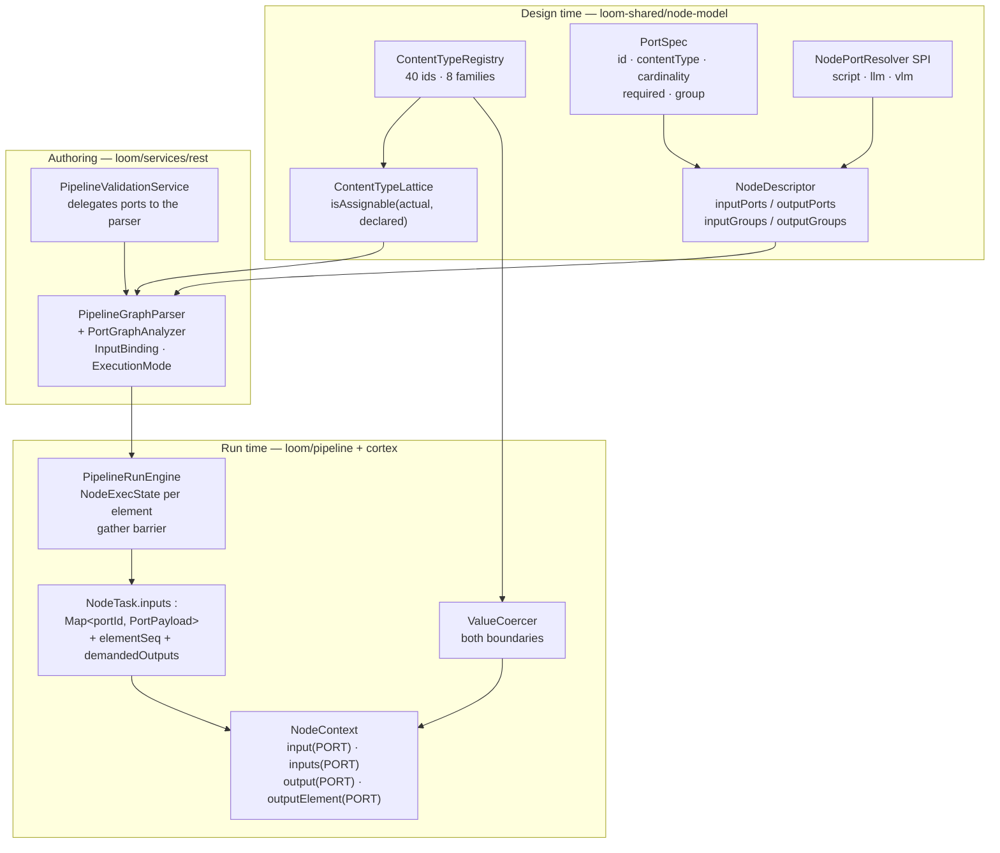
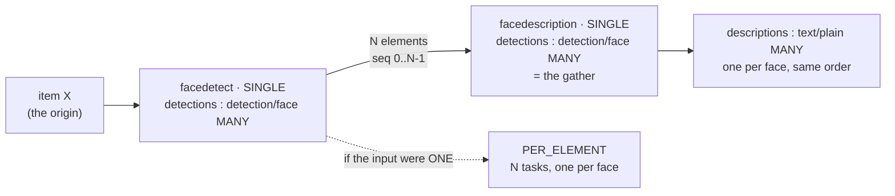

# Node Data Types — Typed Ports, Cardinality, and Origin-Tagged Sequences

> **Scope.** What data flows between pipeline nodes, and how it is typed, wired, checked and
> carried. Which ports a node has, what content type and cardinality each carries, how an edge
> binds one port to another, what the engine hands a node at dispatch time, and where a value is
> coerced.
>
> **Not in scope** — covered elsewhere, do not duplicate:
> - Node lifecycle, per-node configuration and persistence targets, capability matrix →
>   [NODES.md](NODES.md)
> - Engine internals, run state, dispatch protocol, segmentation, affinity, DB schema →
>   [PIPELINE.md](../pipeline/PIPELINE.md)
> - Design rationale, locked decisions, phase plan → [NODE_DATA_TYPES_PLAN.md](../../concept/NODE_DATA_TYPES_PLAN.md)
> - DAOs and persistence → [../../loom/PERSISTENCE.md](../../loom/PERSISTENCE.md),
>   [../../loom/DOMAIN.md](../../loom/DOMAIN.md)
>
> **Source of truth is the code.** Where a claim here and the code disagree, the code wins — fix
> this file in the same change ([../../guidelines/CODING.md](../../guidelines/CODING.md)).

---

## 1. One Type System, Checked in One Place

A value travelling between two nodes is described **once**, by the port it leaves and the port it
arrives at. Three previously independent concerns are now one statement:

| Concern | Declared by | Enforced by |
|---|---|---|
| **What kind of thing this is** | `PortSpec.contentType` — an id `family/subtype` from `ContentTypeRegistry` | `ContentTypeLattice.isAssignable(actual, declared)` — one implementation, called at save time **and** at run start (`PortGraphAnalyzer.validateEdgeTypes`) |
| **One or many** | `PortSpec.cardinality` = `ONE` \| `MANY` | Multi-edge rule (`PortGraphAnalyzer.validateEdgeTypes`) and the execution-mode computation (§6.4) |
| **What Java type the value is** | `InputPort<T>` / `OutputPort<T>` plus the content type | `ValueCoercer.coerce(...)` on write and on read, then `port.valueType().cast(...)` (`NodeContextImpl.read`) |



**The sentence to remember:** a node no longer reads *"the output named `face_count` from the node
someone called `facedetect`"*; it reads *"my input port `detections`"*, and the engine resolves
which upstream `(node, port)` fills it from the wired edges (`PipelineRunEngine.buildInputs`).

---

## 2. The Content-Type Vocabulary

A content type id is **always** `family/subtype`; `family/*` is the family root. There are
**8 families and 40 registered ids**, every family carrying its own wildcard
(`ContentTypeRegistry.FAMILIES`, `ContentTypeRegistry.all()`).

`ContentType` — the record served to the UI — carries `id`, `label`, `family`, `description`,
`wildcard`. `family` and `wildcard` are **derived from the id** in the constructor
(`ContentType`); there is no `superType` parent pointer, because the supertype of
`detection/face` is structurally `detection/*`.

| Family (one editor colour) | Ids |
|---|---|
| **media** | `media/*` · `media/image` · `media/video` · `media/audio` · `media/document` |
| **text** | `text/*` · `text/plain` · `text/transcript` · `text/caption` |
| **detection** | `detection/*` · `detection/face` · `detection/object` · `detection/region` |
| **hash** | `hash/*` · `hash/md5` · `hash/sha256` · `hash/sha512` · `hash/chunk` · `hash/fingerprint` |
| **scalar** | `scalar/*` · `scalar/string` · `scalar/integer` · `scalar/number` · `scalar/boolean` |
| **artifact** | `artifact/*` · `artifact/image` · `artifact/video` · `artifact/audio` · `artifact/file` |
| **struct** | `struct/*` · `struct/embedding` · `struct/segments` · `struct/scene-layout` · `struct/quality` · `struct/depthmap` · `struct/masks` · `struct/color` · `struct/json` |
| **control** | `control/*` · `control/filter` |

Two distinctions the families exist to enforce:

- **`artifact/*` is a worker-local produced file**, not a resolvable media reference. This is what
  stops a thumbnail path being wired into a node that expects to open a media item.
- **`hash/*` is split per algorithm**, so a consumer binds by *port type* rather than by node id.
  Every hash kind names its output port `hash`; the content type is what distinguishes them.

The whole vocabulary is served by `NodeDescriptorEndpoint` at
`GET /api/v1/pipeline/node-descriptors` (`{nodeDescriptors, contentTypes}`) and at
`GET /api/v1/pipeline/content-types`. **Never hardcode labels or families in TypeScript** — only
the *rule* is mirrored (§10).

### 2.1 The lattice — the whole rule

`ContentTypeLattice.isAssignable`:

```
assignable(actual, declared) :=
     actual == declared                       // exact
  || declared == family(actual) + "/*"        // the consumer accepts the whole family
  || actual   == family(declared) + "/*"      // the producer is unspecific (a source emits media/*)
```

- **Assignability never crosses families.** A `hash/md5` does not satisfy a `scalar/string`, even
  though both travel as a Java `String`. The absence of cross-family rules is what keeps the
  TypeScript mirror five lines long.
- **Sibling subtypes are not assignable.** `media/image` does not satisfy `media/video`.
- **The producer-wildcard arm is *provisional*.** `isProvisional(actual, declared)`
  marks the case where a source declares `media/*` and the consumer wants `media/image`: save-time
  accepts it; the real verdict is only reachable at runtime with the file in hand, and `MediaRef`
  carries the answer (§5).

`ContentTypeLatticeTest` (11 cases) pins all of it, including the *absence* of cross-family
assignability and that every family in `FAMILIES` has a registered wildcard.

---

## 3. The Port Model

### 3.1 `PortSpec` — one connector

| Field | Meaning |
|---|---|
| `id` | Stable identity. Edges reference it as `sourcePort`/`targetPort`, the editor uses it as the React Flow handle id, the node addresses its data by it. Pattern `^[a-z0-9][a-z0-9_]{0,62}$` — **not positional**, so reordering a node's ports never re-points an edge |
| `label` | Shown by the editor |
| `contentType` | An id from §2 |
| `cardinality` | `ONE` \| `MANY` (default `ONE`) |
| `required` | Whether an input must be wired (default `true`). **Ignored for grouped ports — the group owns it** |
| `group` | Id of the `PortGroup` this port belongs to |
| `description` | Shown on hover. `NodeDescriptorPortsTest` asserts every port has one |

Fluent factories `one` / `many` / `optionalOne` / `optionalMany` (`PortSpec`), plus
`.inGroup(groupId)` and `.describedAs(label, description)`.

### 3.2 `PortGroup` — alternatives and exclusivity

| Mode | Applies to | Rule | Factory |
|---|---|---|---|
| *(ungrouped)* | inputs | Independent **AND**. Each port's own `required` applies | — |
| `XOR` | inputs | **Exactly one** member wired when the group is `required`; **at most one** otherwise | `PortGroup.xor(id, label)` / `optionalXor` |
| `EXCLUSIVE` | outputs | **At most one** member may have outgoing edges | `PortGroup.exclusive(id, label)` |

> ⚠️ **No descriptor uses `EXCLUSIVE`.** The mode, its validation
> (`PortGraphAnalyzer.validateExclusiveOutputs`) and its factory all exist and are wired, but the
> only groups declared anywhere are **five** `XOR` `media_alt` groups — on `captioning`,
> `facedetect`, `objectdetect`, `sam2` and `whisper`, each pairing an `image`/`audio` port with a
> `video` one. Note that `watermark` — which emits `image` *or* `video` depending on the item — is
> the obvious `EXCLUSIVE` candidate and does **not** use it. Do not assume the exclusive path has
> run outside `PortGraphAnalyzerTest` and the editor's client-side mirror.

### 3.3 Where descriptors come from, and the kind counts

**A node declares its contract once, on itself.** `@NodeSpec` on the class, `@PortDoc` on the
`InputPort`/`OutputPort` constants it executes against, `@ParamDoc` / `@ParamOverride` on its
options fields (`cortex/api/.../node/spec/`). There is no second copy to keep in agreement — the
26 hand-written `*DescriptorProvider` classes this document used to enumerate are **gone**.

Loom cannot read those annotations: the node classes live in `cortex/`, and `loom-shared` must not
depend on it — the dependency runs the other way, and inverting it would drag every node's
transitive native libraries into the server. So the harvest runs at **build time**, in a module that
can see both trees, and its output is committed:

```
@NodeSpec/@PortDoc/@ParamDoc on the node class          (cortex/nodes/**, the only copy anyone edits)
   → NodeSpecHarvester / NodeSpecCatalog                 (cortex/api)
   → loom-shared/node-model/src/main/resources/node-descriptors.json   (committed, 44 kinds)
   → GeneratedNodeDescriptorProvider                     (ServiceLoader, what Loom boots with)
```

Only **two** providers are registered in the SPI file now: `GeneratedNodeDescriptorProvider`, which
reads that resource, and `OrphanNodeDescriptorProvider`, a holding pen for the one contract with no
node class behind it (`loom-fetch`, executed by Loom itself — see below).

> **The committed resource is kept honest by `NodeSpecGoldenTest`** (`integration-test`), which
> re-harvests every annotated node and fails if the result differs from what is committed. A stale
> resource is a build failure, not a silently wrong palette. Regenerate with:
>
> ```bash
> mvn -o -pl integration-test test -Dtest=NodeSpecGoldenTest -Dloom.regenerateNodeDescriptors=true
> ```
>
> ⚠️ Install the cortex node module first — the harvest reads the **installed** jar, so an
> un-installed annotation edit regenerates the old contract.

**Distinguish two counts — they are not the same set:**

| Count | Value | Derivation |
|---|---|---|
| **Descriptor kinds** (in the palette, validated by the parser) | **45** | 44 in `node-descriptors.json` + `loom-fetch` from `OrphanNodeDescriptorProvider` |
| **Runnable kinds** (a worker can execute) | **46** with S3 and both clouds configured, **43** with none | 41 × `@Binds @IntoMap @StringKey` in `cortex/nodes/*/…NodeModule.java`, plus 5 hand-registered in `RegistryNodeRegistrar`: `filesystem-source` and `asset-source` always, `s3-source` / `gdrive-source` / `onedrive-source` each only when that provider is configured |

The two sets still do not coincide, and the mismatch is smaller and better understood than it was:

- **Descriptor but not runnable (1): `loom-fetch`** — and this is **not a gap**. It is executed by
  Loom, not by a worker: it is the source of every ad-hoc node run (`POST /api/v1/node-runs`), and
  `PipelineRunEngine.onItemDiscovered` synthesises its `media` output directly rather than
  dispatching a `SOURCE_TASK`. A `loom-fetch` node reaching a dispatcher is a graph-builder bug, not
  a missing worker. `facedescription`, which used to sit in this row, now has a `@StringKey` binding.
- **Runnable but no descriptor (2): `sha512-dedup` and `asset-source`.** Neither can be placed from
  the palette, and `PipelineGraphParser` rejects an unknown kind, so `asset-source` reaches a worker
  only via a Loom-injected asset-scoped run.

> ⚠️ **Do not copy a kind count out of another spec file.** They disagree, and they rot. Re-derive
> with the commands in §14; this section is the one place that states the derivation.

### 3.4 Dynamic ports — `NodePortResolver`

**Four** kinds only know their ports once configured. The SPI is discovered by `ServiceLoader` and
applied only to descriptors that set `dynamicPorts`; `NodeDescriptorRegistry.resolvePorts(kind,
options)` returns a `ResolvedPorts` record either way, so a `script` node's per-instance outputs are
validated exactly like a fixed kind's. The four kinds with `dynamicPorts: true` in the committed
resource are exactly the four resolvers registered in the SPI file — a descriptor that sets the flag
without a resolver draws no output handles at all and cannot be wired up.

| Kind | Resolver | Resolves to |
|---|---|---|
| `script` | `ScriptPortResolver` | One output port per `outputs[]` declaration — see the mapping below |
| `filter` | `FilterPortResolver` | One **selective** port per `buckets[]` row, plus `other` (selective), `passed` and `bucket` (§4.5). The only selective ports anywhere |
| `llm` | `LlmPortResolver` (extends `PromptPortResolver`) | One `result_<promptId> : text/plain ONE` per configured prompt; a single `result` port when none are configured, so the node stays connectable |
| `vlm` | `VlmPortResolver` (extends `PromptPortResolver`) | Same shape |

`ScriptPortResolver.ScriptOutputType` maps the `ScriptValueType` vocabulary onto a content
type **plus a cardinality**:

| Declared type | Content type | Cardinality |
|---|---|---|
| `STRING` | `scalar/string` | ONE |
| `TEXT` | `text/plain` | ONE |
| `INTEGER` | `scalar/integer` | ONE |
| `NUMBER` | `scalar/number` | ONE |
| `BOOLEAN` | `scalar/boolean` | ONE |
| `JSON` | `struct/json` | ONE |
| `TIMEFRAMES` | `struct/segments` | ONE |
| `IMAGE` | `artifact/image` | ONE |
| `PATH` | `artifact/file` | ONE |
| **`TEXT_LIST`** | `text/plain` | **MANY** |
| **`IMAGE_LIST`** | `artifact/image` | **MANY** |

The two `MANY` rows are the point: `TEXT_LIST` used to declare the same type as `TEXT`, so "I emit
N of these" was invisible. **A `script` node is the canonical fan-out producer.**

> **Nothing in a resolver throws.** Options come from a definition an author typed, so a malformed
> entry degrades to "this port does not exist" and save-time validation reports the unwired edge. A
> resolver that threw would take out the whole descriptor listing.

> 🔴 **`resolvePorts` is not reachable over REST.** It has two callers — `PortGraphAnalyzer.analyze`
> (save time and run start) and the MCP tool `GetNodeDescriptorTool` — and the REST descriptor
> endpoint serves only the *static* descriptor, with no route taking `kind` + `options`. The editor
> therefore cannot ask the server for a configured `script`/`filter`/`llm`/`vlm` node's effective
> ports; it mirrors all four resolvers in TypeScript instead (§10). Owned by
> [../pipeline/NODE_SCHEMA.md](../pipeline/NODE_SCHEMA.md) §7 and
> [../../tasks/NODE_SCHEMA_TASKS.md](../../tasks/NODE_SCHEMA_TASKS.md) Task 1.

---

## 4. Per-Node Port Reference

Regenerated from the committed `node-descriptors.json` (§3.3). Cardinality is `ONE`
unless marked **MANY**; `(opt)` marks `required = false`.

### 4.1 Sources — category `SOURCE`

| Kind | Input ports | Output ports |
|---|---|---|
| `filesystem-source` | — | `media : media/*` |
| `s3-source` | — | `media : media/*` |
| `gdrive-source` | — | `media : media/*` |
| `onedrive-source` | — | `media : media/*` |
| `loom-fetch` | — | `media : media/*` |

All five emit the family wildcard: the concrete kind is unknown until the file is opened (§2.1, §5).
`loom-fetch` is the odd one — it is the only descriptor with no node class, because Loom executes it
itself (§3.3).

### 4.2 Hash and identity

| Kind | Input ports | Output ports |
|---|---|---|
| `md5` | `media : media/*` | `hash : hash/md5` |
| `sha256` | `media : media/*` | `hash : hash/sha256` |
| `sha512` | `media : media/*` | `hash : hash/sha512` |
| `chunk-hash` | `media : media/*` | `hash : hash/chunk` |
| `fingerprint` | `media : media/video`, `is_complete : scalar/boolean` *(opt)* | `fingerprint : hash/fingerprint` |

### 4.3 Analysis

| Kind | Input ports | Output ports |
|---|---|---|
| `consistency` | `media : media/*` | `zero_chunk_count : scalar/integer`, `is_complete : scalar/boolean` |
| `quality` | `media : media/*` | `metrics : struct/quality`, `blurriness : scalar/number`, `width : scalar/integer`, `height : scalar/integer`, `fps : scalar/number`, `frame_count : scalar/integer`, `flag : scalar/string` |
| `tika` | `media : media/*` | `content : text/plain`, `flags : scalar/string` |
| `metadata` | `media : media/*` | `metadata : struct/json`, `text : text/plain`, `geo : struct/json` |
| `ocr` | `media : media/image` | `text : text/plain` |
| `captioning` | **XOR `media_alt`**: `image : media/image` \| `video : media/video` | `caption : text/caption` |
| `facedetect` | **XOR `media_alt`**: `image : media/image` \| `video : media/video` | `detections : detection/face` **MANY**, `face_count : scalar/integer`, `flag : scalar/string` |
| `facedescription` | `detections : detection/face` **MANY** | `descriptions : text/plain` **MANY** |
| `objectdetect` | **XOR `media_alt`**: `image : media/image` \| `video : media/video` | `detections : detection/object` **MANY**, `labels : scalar/string` **MANY**, `object_count : scalar/integer`, `flag : scalar/string` |
| `depthmap` | `media : media/image` | `meta : struct/depthmap`, `map : artifact/image`, `flag : scalar/string` |
| `sam2` | **XOR `media_alt`**: `image : media/image` \| `video : media/video`; `detections : detection/*` **MANY** *(opt)* | `masks : artifact/image` **MANY**, `segments : struct/masks`, `overlay : artifact/image`, `mask_count : scalar/integer`, `flag : scalar/string` |
| `scene-detection` | `media : media/video` | `scenes : struct/segments` |
| `scene-layout` | `depth : struct/depthmap`, `detections : detection/*` **MANY** | `result : struct/scene-layout`, `object_count : scalar/integer`, `relation_count : scalar/integer` |
| `dominant-color` | `media : media/image`, `detections : detection/*` **MANY** *(opt)* | `result : struct/color`, `hex : scalar/string`, `term : scalar/string`, `name_en : scalar/string`, `name_de : scalar/string`, `region_count : scalar/integer` |
| `whisper` | **XOR `media_alt`**: `audio : media/audio` \| `video : media/video` | `transcript : text/transcript` |
| `sentiment` | `text : text/*` | `label : scalar/string`, `score : scalar/number`, `result : struct/json` |
| `translate` | `text : text/*` | `translation : text/plain`, `language : scalar/string`, `result : struct/json` |
| `guard` | `text : text/*` *(opt)*, `media : media/image` *(opt)* | `safe : control/filter`, `label : scalar/string`, `score : scalar/number`, `categories : scalar/string` **MANY**, `result : struct/json` |
| `llm` | `media : media/*` | **dynamic** — `result_<promptId> : text/plain` per prompt |
| `vlm` | `media : media/image` | **dynamic** — same shape |

`facedetect.detections` is the reference fan-out: **one element per detected face**, so
`facedescription` runs once per face rather than once per file.

`guard.safe` is `control/filter`, the same content type `filter.passed` carries — `NodeTaskResult`
finds the branch decision by content type, not by port name — so a guard gates a downstream node
directly and `filter` is only needed when the routing has more than two ways to go. `guard.media` is
an image input declared the way every image-consuming node declares one: a `media/*` port names the
**item**, which the node reads through `ctx.media()` rather than `ctx.input(...)` (a wired
`media/image` edge would arrive as a path string, not a `LoomMedia`).

`metadata.geo` is declared `ONE` even though it is written only for a file that carried a coordinate:
`OutputPort` has no optional cardinality, and an unwritten port simply delivers nothing downstream —
the same shape `watermark` uses for its image/video branch.

### 4.4 Transform and generative

| Kind | Input ports | Output ports |
|---|---|---|
| `thumbnail` | `media : media/*`, `is_complete : scalar/boolean` *(opt)* | `thumbnail : artifact/image`, `flag : scalar/string` |
| `tts` | `text : text/*` | `audio : artifact/audio`, `flag : scalar/string` |
| `imagegen` | `prompt : text/*` *(opt)*, `media : media/image` *(opt)* | `image : artifact/image`, `flag : scalar/string` |
| `videogen` | `prompt : text/*` *(opt)*, `media : media/image` *(opt)* | `video : artifact/video`, `flag : scalar/string` |
| `watermark` | `media : media/*` | `image : artifact/image`, `video : artifact/video`, `flag : scalar/string` |
| `image-manipulation` | `image : media/image`, `detections : detection/*` **MANY** *(opt)* | `image : artifact/image`, `geometry : struct/json`, `flag : scalar/string` |
| `script` | `media : media/*` *(opt)*, `data : struct/json` *(opt)*, `text : text/*` *(opt)* | **dynamic** — from the `outputs` option (§3.4) |

`fingerprint.is_complete` and `thumbnail.is_complete` exist so those nodes stop hard-coding an
upstream `consistency` node id. Leave them unwired and a half-written file is processed anyway,
which is the historic behaviour.

### 4.5 The filter — category `FILTER`

**One kind, `filter`, and the port *is* the branch.** It replaced eight `filter-*` kinds that were
advertised in the palette and could never run — they extended `AbstractPipelineNode` rather than
`FilesystemNode`, so they could not be bound into the executable-kind map at all, and they advertised
a `media` output no filter ever emitted.

| Side | Port | Type | Card | Selective |
|---|---|---|---|---|
| in | `media` | `media/*` | ONE | — |
| in | `text` | `text/*` | ONE *(opt)* | — |
| out | `<bucketId>` ×N | `media/*` | ONE | **yes** |
| out | `other` | `media/*` | ONE | **yes** |
| out | `passed` | `control/filter` | ONE | no |
| out | `bucket` | `scalar/string` | ONE | no |

The outputs are **dynamic** (`dynamicPorts`, `FilterPortResolver`), derived from the `buckets` option
— a `PORT_LIST` of `{id, label?, match?}` rows whose `id` becomes the port. `other`, `passed` and
`bucket` are always present, so a freshly dropped node is connectable and a graph is never a dead end.
Reserved bucket ids: `other`, `passed`, `bucket`, `media`, `text`.

`passed` keeps the older `PASS`/`REJECT` edge routing working — `NodeTaskResult.getFilterPassed()`
finds it by its `control/` family, not by name. `bucket` is deliberately **not** selective: a node
wired to it runs whichever branch the item took, which is the escape hatch from routing.

`filterBy` selects a `FilterStrategy` from the `@FilterByKey` map multibinding. **Six** values:

| `filterBy` | Reads | Bucket `match` hints | Cost |
|---|---|---|---|
| `LANGUAGE` | the wired `text` port | other names for the language (`german, deutsch`) | one LLM round trip via the shared `LLMProvider` |
| `MIME` | the file name, through `MediaContentTypes` (`cortex-common`) | `image/*`, `video/mp4`, bare `image` = `image/*`, `*` = everything; **no hint falls back to the bucket id** | none |
| `SIZE` | `LoomMedia.size()` | `<10MB`, `>=1GB`, `1MB..100MB` (lower inclusive, upper exclusive), bare `10MB` = `<=10MB`. `KB`/`MB`/`GB`/`TB` are 1024-based | none |
| `DATE` | `Files.getLastModifiedTime` | `>=2024-01-01`, `2024-01-01..2024-12-31` (**both ends cover the whole day**), bare `2024-03-17` = that day, `age<30d` / `age>1y` (`h`/`d`/`w`/`m`/`y`) | none |
| `RATING` | the asset's rating on the `FilterItem` | comma-separated conditions — `>=8`, a bare `8` for exactly that rating, and a hint for "nobody rated this". Outside the review screen's scale a hint is a typo, and `validateBuckets` says so | one Loom read per item |
| `TAG` | the asset's tags on the `FilterItem`, scoped by the `tagSource` option (`ANY` by default) | comma-separated hints with `!` negation. A bucket matches when **at least one positive hint matches and no negated one does**; a bucket of only negations matches when none are present. Like `MIME`, no `match` falls back to the bucket id | one Loom read per item |

`RATING` and `TAG` route on a **human decision** rather than on the file, which is why
`classify(...)` takes a `FilterItem` — the item's media *plus* the `AssetResponse` `FilterNode`
already holds — instead of a bare `NodeContext`. Handing it down beats giving a strategy a
`LoomClient`: a strategy has no asset identity of its own and would re-derive the SHA-512 and load
the asset a second time, per item, forever.

Buckets are tried in declaration order and the first match wins, so a narrow bucket above a broad one
behaves as written. The five non-`LANGUAGE` strategies take **no `LLMProvider`**, which is the point: a graph that only
splits images from video runs on a worker with no model backend reachable.

Adding a way of filtering is a strategy class plus a `@FilterByKey` binding plus a value in the
descriptor's enum — never an edit to `FilterNode`. Two seam methods carry the per-strategy parts:

- `FilterStrategy.version()` is mixed into the cache key and `producerVersion`, so a strategy that
  changes its meaning invalidates its own old verdicts (`LanguageFilterStrategy` returns its
  `PROMPT_VERSION`).
- `FilterStrategy.validateBuckets(...)` is called from `configure(...)`. `SIZE` and `DATE` use it to
  refuse `<10 megabytes` or `last month` up front. Without it a typo'd hint would start a run in
  which **every** item lands in `other` — indistinguishable from data that genuinely did not match.
  `RATING` rejects a condition outside the review screen's scale for the same reason. `LANGUAGE`,
  `MIME` and `TAG` keep the permissive default — each falls back to the bucket id, so an empty
  `match` column is legal rather than a typo.

**Routing semantics** — see §8.6.

### 4.6 Sinks and dedup — category `OUTPUT`

| Kind | Input ports | Output ports |
|---|---|---|
| `hash-dedup` | `hash : hash/*` | `duplicate : media/*`, `original : scalar/string` |
| `fingerprint-dedup` | `fingerprint : hash/fingerprint` | — |
| `fingerprint-dedup-apply` | `hash : hash/*` | `confirmed_dup : media/*`, `keep_path : scalar/string` |
| `move` | `media : media/*` | `moved : scalar/boolean`, `path : scalar/string`, `flag : scalar/string` |
| `assign` | `media : media/*` | `assigned : scalar/boolean`, `target : scalar/string` |
| `s3-sink` | `artifacts : artifact/*` **MANY** | `result : struct/json`, `count : scalar/integer`, `flag : scalar/string` |
| `tag` | `media : media/*`, `text : text/*` *(opt)*, `number : scalar/number` *(opt)*, `flag : scalar/boolean` *(opt)*, `struct : struct/*` *(opt)*, `labels : scalar/string` **MANY** *(opt)* | `applied : struct/json`, `count : scalar/integer` |

Neither dedup node moves a file any more: each reports on a media port and a `move` node acts.
`hash-dedup.duplicate` and `fingerprint-dedup-apply.confirmed_dup` are the report ports.

> 🔴 **Those two ports are documented as selective and are not.** Both nodes' javadoc says silence on
> the port is the "do not act" signal, exactly as a filter's bucket ports work — but neither
> `@PortDoc` sets `selective = true`, so the harvested descriptor carries `selective: false` and the
> engine's routing rule (§8.6) never fires for them. A `move` node wired to `duplicate` is therefore
> dispatched for **every** item, with nothing on its required `media` input, instead of only for the
> duplicates. This has never been true in any descriptor — it is a doc-vs-code gap, not a regression
> of the annotation sweep — and it is Task 1 in
> [../../tasks/NODE_DATA_TYPES_TASKS.md](../../tasks/NODE_DATA_TYPES_TASKS.md).

⚠️ `move`'s `path` is a `scalar/string`, deliberately not `artifact/file`. That family means "a file
this node produced", and typing a relocated original as one would make it an upload candidate for a
downstream `s3-sink`.

`tag` writes into the catalog rather than producing bytes, which is why it is an `OUTPUT` node with
outputs: `applied` and `count` describe what it did, so a downstream node can branch on whether an
item was tagged at all.

🔴 **`tag` has no `MANY` output on purpose.** A `tags : scalar/string` MANY port is the obvious design
and is rejected on the declaration (§6.4: a `PER_ELEMENT` node may not declare a `MANY` output), which
would bar the node from sitting downstream of any fan-out. Its five value inputs are all `ONE` for the
same reason a `filter` has one `text` port: a rule addresses a *port*, and a MANY port whose rules
picked their source by the element's origin node id would reintroduce `nodeId:outputKey` addressing.

A fourth sink, `loom`, used to sit here with three optional hash input ports. Porting it to bind by
**port type** killed the `md5sum` id-override trap; it was then deleted altogether, because every
hash node persists its own hash inside `compute()`. See [NODES.md](NODES.md) §2.

---

## 5. Media: Ambient **and** a Port

Media stays on the wire as `NodeTask.media : MediaRef` — the `process(LoomMedia, …)` lifecycle needs
a resolvable handle, and per-element dispatch reuses the same reference. **But** every
media-consuming node also declares a real `media/*`-family input port, and every source declares a
`media` output port, so the graph is fully wired and type-checked.

`MediaRef` carries `mediaType` and a derived `contentType()`:

```java
public static final String IMAGE = "image", VIDEO = "video", AUDIO = "audio",
                           DOCUMENT = "document", UNKNOWN = "unknown";

public String contentType() {
    return UNKNOWN.equals(mediaType) ? "media/*" : "media/" + mediaType;
}
```

`mediaType` defaults to `UNKNOWN` in the constructor, so an un-annotated `MediaRef` degrades
to the wildcard rather than lying. The engine stamps the source node's `media` output from it when
an item is discovered (`PipelineRunEngine.onItemDiscovered`):

```java
outputs.put(SOURCE_MEDIA_PORT, PortPayload.one(media.contentType(), origin, media.getPath()));
```

`SOURCE_MEDIA_PORT` is the literal `"media"` (`PipelineRunEngine.SOURCE_MEDIA_PORT`) — **every source descriptor
must name its output port `media`**, otherwise the first hop of every graph is unwired at runtime
while still validating at save time.

The rest of the media-reference story (`ProcessableMedia.reference()`, `MediaReferenceResolver`,
`s3://` URIs, the S3 materializer and cache) is unchanged and documented in
[NODES.md](NODES.md) and
[../../cortex/CONFIGURATION.md](../../cortex/CONFIGURATION.md).

---

## 6. Edges, Bindings, and Execution Mode

### 6.1 Definition JSON — edges carry ports

```json
{
  "version": 1,
  "nodes": [
    { "id": "pn1", "type": "filesystem-source", "name": "File Source", "x": 60,  "y": 160 },
    { "id": "pn5", "type": "facedetect",        "name": "Face Detect",  "x": 460, "y": 60  },
    { "id": "pn6", "type": "facedescription",   "name": "Describe",     "x": 660, "y": 60  }
  ],
  "edges": [
    { "id": "pe4", "source": "pn1", "sourcePort": "media",
      "target": "pn5", "targetPort": "image", "branch": "ANY" },
    { "id": "pe5", "source": "pn5", "sourcePort": "detections",
      "target": "pn6", "targetPort": "detections" }
  ]
}
```

| Rule | Where |
|---|---|
| `sourcePort` and `targetPort` are **required on every edge**; no positional fallback, no legacy alias | `PipelineGraphParser:297-303` — *"Every edge must carry sourcePort and targetPort"* |
| `branch` stays edge-level (`ANY` \| `PASS` \| `REJECT`) | `:305-314` |
| **The dedupe key is the whole port tuple** `from.sourcePort->to.targetPort` | `applyEdges` |
| `dependencies` are derived from the same pass: each distinct `(source, target)` pair contributes one scheduling dependency, however many ports it feeds | `:325-327` |
| A definition declares a top-level `version`; the parser reads up to `CURRENT_DEFINITION_VERSION = 1` and refuses anything higher by name. An absent version means 1 | `:68, :110-130` |
| `options` is the documented per-node shape; `config` is accepted as a **legacy alias** and loses to `options` when both are present | `readOptions:255-269` |

> ✅ **The legacy inline `dependencies[]` shape is rejected, not silently accepted.** A node object
> carrying a `dependencies` key throws `GraphValidationException` naming the fix
> (`PipelineGraphParser`, pass 1). There is no `applyInlineDependencies` method. This closes the hole
> where such a graph passed port validation vacuously and every node received empty inputs.

### 6.2 `InputBinding`

```java
public record InputBinding(String targetPortId, String sourceNodeId, String sourcePortId,
                           FilterBranch branch, boolean targetIsMany) {}
```

The parser constructs bindings through the 4-arg convenience constructor (`targetIsMany = false`);
`PortGraphAnalyzer` then re-stamps each one via `withTargetCardinality(...)`, so the
engine builds a task's inputs from the graph alone and never consults the descriptor registry at
dispatch time. `PipelineGraphNode` carries `inputBindings`, `demandedOutputs`, `executionMode` and
`fanOutDriver`.

### 6.3 `PortGraphAnalyzer` — the five rules

`analyze(graphName, nodes, topologicalOrder)` runs when a definition is saved **and**
again when a run starts.

| # | Rule | Where |
|---|---|---|
| 1 | `targetPort` exists on the consumer; `sourcePort` exists on the producer | `:117-134` |
| 2 | `ContentTypeLattice.isAssignable(source.contentType, target.contentType)` | `:135-140` |
| 3 | Required ungrouped inputs wired; required `XOR` groups get exactly one member, optional ones at most one; `EXCLUSIVE` output groups at most one | `:153-214` |
| 4 | An input port with more than one incoming edge must be `MANY` | `:141-146` |
| 5 | Execution modes propagate; nested fan-out and cross-driver zips are rejected | `:234-291` |

Source nodes are exempt from rule 3 (`node.isSource()` short-circuits satisfaction).

> ⚠️ **A null registry disables all of it.** `analyze` returns immediately when `registry == null`,
> leaving every node `SINGLE`. That is the path taken by the no-arg `new PipelineGraphParser()`,
> which most unit tests use. ✅ **`PipelineRunRecovery` no longer does** — it builds
> `new PipelineGraphParser(nodeDescriptorRegistry)`, so a resumed run gets the same port checking and
> fan-out classification as the original.

### 6.4 Effective multiplicity and `ExecutionMode`

```
eff(output port p of node n) = MANY  if p declares MANY
                             = MANY  if n runs PER_ELEMENT
                             = ONE   otherwise

mode(n) = PER_ELEMENT  iff some ONE-cardinality input of n is bound to an effectively-MANY output
        = SINGLE       otherwise   // a MANY input consuming MANY is the gather, and runs once
```

Propagation runs in topological order, so a node's inputs are always resolved before it is
classified. `fanOutDriver(n)` is the node whose `MANY` output made `n` per-element; a
per-element node passes its own driver on rather than naming itself (`driverOf`).

**Two v1 restrictions, enforced as validation errors:**

- **No nested fan-out.** A node that runs `PER_ELEMENT` and *also* declares a `MANY` output is
  rejected outright — *"Nested fan-out is not supported - gather with a sequence input
  first"*. This fires on the **declaration**, not on the downstream wiring: stricter than the design,
  which only rejected such an output when it fed a `ONE` input. A single integer `Origin.seq` cannot
  address a sequence of sequences either way.
- **One origin lineage per zip.** Two `ONE` inputs fed by per-element branches must trace to the same
  `fanOutDriver`, otherwise the elements have no meaningful correspondence.

⚠️ **A `SINGLE` node may declare more than one `MANY` output, and one does.** `objectdetect` emits
`detections` (one per object) *and* `labels` (one per distinct class) — the first node to do so.
Nothing rejects it and nothing should: the restriction above is about `PER_ELEMENT` nodes. But the
two sequences have **different lengths**, so wiring both into a single downstream node zips elements
that do not correspond. A consumer takes one or the other; `labels` exists for `tag`, `detections`
for `scene-layout` and `image-manipulation`.

---

## 7. The Element Envelope

### 7.1 `PortPayload` / `DataElement` / `Origin`

In `loom-shared/pipeline-model`. A port's value on the wire is always a payload, never a bare object:

```json
"outputs": {
  "detections": {
    "contentType": "detection/face",
    "cardinality": "MANY",
    "elements": [
      { "origin": { "itemId": "5c1f…", "seq": 0, "total": 3 }, "value": "{…box…}" },
      { "origin": { "itemId": "5c1f…", "seq": 1, "total": 3 }, "value": "{…box…}" },
      { "origin": { "itemId": "5c1f…", "seq": 2, "total": 3 }, "value": "{…box…}" }
    ]
  }
}
```

| Type | Fields | Notes |
|---|---|---|
| `PortPayload` | `contentType`, `cardinality`, `elements` | `cardinality` is a **`String`** (`"ONE"`/`"MANY"`), not the `Cardinality` enum — `pipeline-model` does not depend on `node-model`. Helpers: `one`, `many`, `single`, `atSeq`, `values`, `isMany`, `size` |
| `DataElement` | `origin`, `value` | `value` is a JSON-native tree |
| `Origin` | `itemId`, `seq`, `total` | `Origin.single(itemId)` → `seq = 0`. **The item is the origin**: `itemId` is the run item id, which is why fan-out needs no lineage columns |

### 7.2 Wire model

| Type | Port-model fields |
|---|---|
| `NodeTask` | `inputs : Map<inputPortId, PortPayload>`, `elementSeq : int`, `demandedOutputs : Set<String>` + `isDemanded(portId)` |
| `NodeTaskResult` | `outputs : Map<outputPortId, PortPayload>` + `output(portId)`, `elementSeq` echoed back from the task |
| `SegmentTask` | `getInputs() : Map<String, PortPayload>` |
| `MediaRef` | `+ mediaType`, `+ contentType()` (§5) |

`NodeTaskResult.getFilterPassed()` scans the outputs for the first payload whose content
type starts with `control/`, so a filter may name its port whatever it likes and branch routing still
works. It tolerates a stringified `"true"`, because the Cortex disk caches stringify every value.

### 7.3 Storage codec — `PortPayloads`

Converts payload maps to and from `io.vertx.core.json.JsonObject` for the
`pipeline_node_task.outputs` JSONB column.

- It lives in **`loom/pipeline`, not `pipeline-model`** — deliberately. `pipeline-model` has no
  Vert.x dependency and the codec needs `JsonObject`.
- **Encoding is total; decoding is deliberately lenient**. A row written before this
  shape existed yields an empty payload map rather than throwing, and one unreadable port does not
  cost the caller the others: *"losing a cached result is an inconvenience, failing recovery over it
  is an outage."*

### 7.4 Coercion — `ValueCoercer`

One arm per family (`ValueCoercer.coerce`, family switch), throwing `ValueCoercionException` naming
the port, the content type and what was wrong.

| Declared family / type | Rule |
|---|---|
| `scalar/integer` | Any `Number` → **`Long`**; a `Double`/`Float` with a fractional part is rejected; a numeric string is parsed |
| `scalar/number` | Any `Number` → `Double`; a numeric string is parsed |
| `scalar/boolean`, `control/*` | `Boolean`, or the strings `"true"`/`"false"` (case-insensitive) |
| `scalar/string`, `media/*`, `text/*`, `hash/*`, `artifact/*` | `CharSequence` → `String` |
| `scalar/*` | Any primitive, passed through |
| `detection/*` | A `Map` or an already-encoded JSON string |
| `struct/*` | `Map`, `Collection` or an encoded string — **validated here, at the boundary**, so a non-encodable value fails *that one task* instead of blowing up at persist time and clearing the whole batch |
| unknown family | Hard failure |

**`scalar/integer` always widens to `Long`**. Running the coercer at both boundaries is
not redundant: the JSON round trip in between re-narrows a `Long` that fits in 32 bits back to an
`Integer`, and the read-side pass re-widens it. That is the single reason the historic
`ClassCastException` on `video_frame_count` stops being reachable.

**Where it is applied:**

| Site | When |
|---|---|
| `NodeContextImpl.coerce(OutputPort, value)` | A node calls `output(...)` or `outputElement(...)` |
| `NodeResultMapper.toPayloads(...)` | The result is turned into wire `PortPayload`s, with the origin stamped per element |
| `NodeContextImpl.read(InputPort, raw)` | A node calls `input(...)` / `inputs(...)`; the coerced value is then checked with `port.valueType().isInstance(...)` and cast |

Two arms the design called for are **not** implemented: emitting an **undeclared port id** and
emitting a **non-selected `EXCLUSIVE`-group port** are not hard failures.

---

## 8. Fan-Out and the Implicit Gather

### 8.1 Engine state

`ItemState` holds `Map<String, NodeExecState>`. Each `NodeExecState` holds, per element sequence
index: the result, the in-flight task uuid, the attempt count and the retry marker.

```java
boolean isSettled() { return elementCount != null && elementResults.size() >= elementCount; }
```

**That redefinition IS the gather barrier** (`NodeExecState.isSettled`). `elementCount` is `1` at
construction for a `SINGLE` node and `null` for a `PER_ELEMENT` one, so a fanned-out node is
*never* settled until its driver has told it how many elements there are.

`rollup()` folds elements into one `NodeState` for callers that still think in whole
nodes — any `FAILED` ⇒ `FAILED`, else any `COMPLETED` ⇒ `COMPLETED`, else `SKIPPED`.
`representative()` picks a result for branch evaluation and the asset sink.

### 8.2 The dispatch loop

`PipelineRunEngine.advance(ItemState)` walks the topological order and, for each node:

1. `dependenciesSettled(state, node)` — **this is the gather.** For a dependency that fanned
   out it asks "have *all* of its elements settled?", so a node consuming a fanned-out branch
   automatically waits for the whole branch.
2. If `PER_ELEMENT` and `elementCount == null`, read it off the driver's settled result via
   `fanOutSize`.
3. `elementCount == 0` — the upstream sequence was empty — settles the node as
   `SKIPPED("Upstream sequence was empty")` rather than leaving the item permanently
   incomplete.
4. For every `seq` in `0 .. elementCount-1`, run the skip check, then the capacity / kind-capacity /
   circuit-breaker / retry gates — all of which guard `(node, seq)` rather than `(node)` — then
   dispatch.

The `seq` is carried on `NodeTask` and echoed back on `NodeTaskResult` so `record` can route the
result to the right slot.

> **Segments stay SINGLE-only.** A segment is only considered for `seq == 0` of a `SINGLE` node
>; a `PER_ELEMENT` node always dispatches per node. This is the fallback the design allowed
> for, taken deliberately.

### 8.3 `buildInputs` — where the gather materialises

`PipelineRunEngine.buildInputs`. For each binding, the producer's elements are collected **in sequence
order** across all of its executions, then:

| Target port | Behaviour |
|---|---|
| `MANY` | Every element of every edge feeding it concatenates — the origin-grouped workunit |
| `ONE`, producer emitted ≤ 1 element | Taken as-is |
| `ONE`, producer fanned out | The element whose `origin.seq` equals **this execution's** `seq` — the zip |

The `ONE` arm matches on `origin.seq`, not on list position, so a gap left by a failed sibling
element cannot silently shift the alignment.

### 8.4 Element-level skip, failure and branch semantics

`evaluateSkip(state, node, seq)` with `elementScopedState`:

| Situation | Behaviour |
|---|---|
| Element `seq` of a dependency FAILED; the consumer is `PER_ELEMENT` and blocking | *That* element is skipped — *"Dependency X failed for element N"*. **Sibling elements are unaffected** |
| A gather node (`SINGLE`, `MANY` input), blocking, any upstream element FAILED | The node is skipped — `rollup()` reports `FAILED` |
| Gather node, non-blocking | Runs with the surviving elements; the gaps show as missing `seq` values in the origin tags |
| A filter runs `PER_ELEMENT` | `FilterBranch.admits(...)` is evaluated against **that element's** result when one exists, else the dependency's representative |

### 8.5 The scenario, walked through



1. `facedetect` settles with N elements, each tagged `origin { itemId: X, seq: i, total: N }`.
2. `facedescription` declares `detections : detection/face` **MANY**, so it **gathers**: it waits for
   the whole branch and runs **once** with all N elements, seq-ordered, emitting one description per
   face in the same order.
3. Had it declared `detection/face` **ONE**, the analyzer would have classified it `PER_ELEMENT` and
   the engine would have dispatched N tasks, each reusing `NodeTask.media` = X's `MediaRef` and
   carrying only its own element.
4. Nothing in the definition JSON says "gather" or "fan out" — both fall out of the two ports'
   cardinalities, decided when the graph is parsed.

The `Full Processing` demo pipeline is exactly this shape (`DemoDatabaseInitializer`).

> ⚠️ **No shipped kind declares a `ONE`-cardinality `detection/*` input**, so no seeded pipeline
> exercises `PER_ELEMENT` end to end. The gather path has a demo; the fan-out path is covered only by
> `PipelineRunEngineFanOutTest` and `PortGraphAnalyzerTest`.

### 8.6 Port routing — the port *is* the branch

An output port may declare `PortSpec.selective`: *"this port carries data for some items and not
others"*. The engine turns that into routing — a consumer wired only to ports the producer did not
write for an item is **SKIPPED** for that item. No `branch` attribute is involved, and an N-way split
needs no new vocabulary, just N ports.

**It is opt-in per port, and that is not negotiable.** Leaving a declared output unwritten is normal
and must stay harmless: `facedetect` finds no faces, a `script` does not set every declared key.
~15 engine tests complete a node with `Map.of()` outputs and then expect its consumer to run. Gating
on the producing node's *category* or on `dynamicPorts` would be wrong too — `script`/`llm`/`vlm`
routinely leave declared ports unwritten, and the filter's own `passed` port fires on every item and
must never gate anything.

**Selectivity is inherited.** `InputBinding` carries two flags, stamped by `PortGraphAnalyzer` in
topological order (`stampBindings`):

| Flag | Meaning | Read by |
|---|---|---|
| `sourceSelective` | the producing port *declares* selective — the edge where the branch is decided | `PipelineSegmenter.isRoutingEdge` |
| `routed` | `sourceSelective` **or** the producing node is itself downstream of a routed edge | `PipelineRunEngine.routedDependencyDelivered` |

Inheritance is what makes a branch of any depth work: if the branch does not fire, the node on it is
skipped, its own outputs are empty, and *its* consumers must skip in turn. A one-hop rule would leave
the grandchild running with empty inputs — exactly the non-transitivity `FilterBranch` still has
(`PipelineGraphNode`).

The predicate (`evaluateSkip`, after the `FilterBranch` block):

| Case | Behaviour |
|---|---|
| Some routed binding from a dependency delivered | Runs. It is an **or** across that dependency's routed bindings — `watermark`'s `image`\|`video` into one port runs when either delivers |
| No routed binding from that dependency at all | Rule does not apply |
| Two different dependencies each routed | **And** across dependencies, matching `FilterBranch` |
| Dependency FAILED | Rule **not** applied. A blocking consumer already skipped above; a non-blocking one must run and see the failure, or `blocking:false` silently breaks |
| Consumer is `PER_ELEMENT` | Element-scoped: the shared `collect(...)` picks by `origin.seq`, so skip and zip agree by construction |
| Gather (`targetIsMany`) | Delivered when **any** producer element wrote the port; the gather sees only the routed elements, keeping their original `seq` |
| Consumer's only routed binding targets an *optional* input | Skipped. The edge from a routed port **is** the routing statement; wire from `bucket`/`passed` for "run always" |
| Gated on `isBlocking()`? | **No.** Routing is not an error, and `FilterBranch` is not gated either |

🔴 **`collect(...)` is shared between `buildInputs` and `routedDependencyDelivered` on purpose.**
"Delivered" must mean exactly "`buildInputs` would put something on the target port from this
binding". Deriving it twice is how the two drift, and the failure is silent in both directions: a node
dispatched with an empty required input, or a node skipped while its data sat there.

**The segmenter must break at a selective edge.** `PipelineSegmenter.isRoutingEdge` already split a
segment at a `PASS`/`REJECT` edge because a worker runs a segment as a unit and knows nothing about
branch verdicts. Port routing carries `branch: ANY`, so without the added `sourceSelective` case a
filter and its branch consumers would be packed into one segment and run unconditionally. It reads
the *declared* flag, not `routed()` — using the inherited one would stop segment batching across the
whole subgraph below any filter, for no correctness gain.

**Containment.** `PortGraphAnalyzer.analyze` returns early when there is no descriptor registry, and
every `PipelineRunEngine*Test` parses without one. So every existing engine test stamps `routed=false`
and no existing graph changes behaviour. In production `routed` is true only below a port some
descriptor explicitly marks selective — today, only the `filter` node's buckets.

Covered by `PipelineRunEnginePortRoutingTest` (which parses **with** a registry, unlike its siblings),
plus stamping cases in `PortGraphAnalyzerTest` and two segment cases in `PipelineSegmenterTest`.

---

## 9. Known Gaps

The historical defect audit — what the typed-port model fixed and why — lives in
[NODE_DATA_TYPES_PLAN.md](../../concept/NODE_DATA_TYPES_PLAN.md). What follows is only what is **still open**.

| # | Gap | Detail | Task |
|---|---|---|---|
| 1 | 🔴 **The two dedup report ports are not selective** | `hash-dedup.duplicate` and `fingerprint-dedup-apply.confirmed_dup` are documented in their own javadoc as "silence means do not act", but neither `@PortDoc` sets `selective = true`. A `move` node wired to one runs for every item with an empty required input (§4.6) | 1 |
| 2 | 🔴 **`ResultOrigin` never reaches the wire** | `NodeTaskResult` has no origin field. `AbstractMediaNode.recordNodeResult` hardcodes `ledger.setOrigin(ResultOrigin.COMPUTED.name())` instead of reading `ctx.resultOrigin()`, so `asset_node_result.origin` is always `COMPUTED` even on a `LOCAL` cache hit | 2 |
| 3 | 🔴 **No run/task provenance on the node-result ledger** | `AssetNodeResult` has `setRunUuid`/`setTaskUuid` and the columns exist, but `NodeResultCreateRequest` carries neither field and nothing on the Cortex write path sets them. A ledger row cannot be traced back to the run that produced it | 3 |
| 4 | **Undeclared and non-selected-`EXCLUSIVE` ports are not rejected on emit** | The design called for both to fail the task by name (§7.4). `ValueCoercer` has neither arm | 4 |
| 5 | **No `ValueCoercerTest`, no `PortPayload` round-trip test** | The coercer is the only thing between a node and a `ClassCastException` and has no direct test; nothing asserts `output → JSON → JSONB → input` preserves type *and* origin tags, and `PortPayloads`' lenient decode path is untested | 5 |
| 6 | **`PipelineValidationServiceTest` barely exercises ports** | 38 test methods, one mention of `sourcePort`. The delegated §6.3 rules are almost never reached from the REST side | 6 |
| 7 | **No descriptor uses `EXCLUSIVE`** | The mode, its validation and the editor's mirror all exist; the only groups declared anywhere are five `XOR` `media_alt` groups. `watermark` is the obvious candidate (§3.2) | 7 |
| 8 | **No server-side port-resolution endpoint** | `resolvePorts(kind, options)` is reachable from `PortGraphAnalyzer.analyze` and from the MCP `GetNodeDescriptorTool`, but from no REST route, so the editor mirrors all four resolvers in TypeScript (§3.4, §10) | *owned by [NODE_SCHEMA_TASKS.md](../../tasks/NODE_SCHEMA_TASKS.md) Task 1* |
| 9 | **No Java-side fixture export for the TS contract tests** | `contentTypes.test.ts` and `portResolvers.test.ts` transcribe their fixtures by hand; the two implementations can drift and only a reviewer notices. Moot for the resolver half if [NODE_SCHEMA_TASKS.md](../../tasks/NODE_SCHEMA_TASKS.md) Task 1 deletes that mirror; the lattice mirror stays either way | 11 |
| 10 | **Port checking is skipped when a definition has no `edges` key** | `PipelineValidationService.collectErrors` returns before the port pass. A single-node definition is legal, so this is not always wrong — but it is not stated anywhere the author can see | 6 |
| 11 | **Counters count nodes, not executions** | `PipelineRunEngine.nodeProgressSnapshot()` buckets on `isInFlight(nodeId)` / `isSettled(nodeId)`, so a node fanned out to 200 elements reports the same `[active, pending]` as one running once, and the run-item detail has no per-node `k/N elements` display | 10 |
| 12 | ⚠️ **No shipped kind declares a `ONE`-cardinality `detection/*` input** | So no seeded or shippable graph exercises `PER_ELEMENT` end to end. The gather path is demoed; the fan-out path is covered only by `PipelineRunEngineFanOutTest` and `PortGraphAnalyzerTest` (§8.5) | 11 |
| 13 | **Result reuse is hard-coded to element 0** | `DaoRunStateStore`'s incremental-reuse lookup passes `elementSeq = 0`, so a `PER_ELEMENT` node re-runs in full on an unchanged asset | 12 |

**Closed since the last revision of this file**, verified against the tree:

- ~~`facedescription` and `loom-fetch` have descriptors but no runnable binding~~ — `facedescription`
  has a `@StringKey` binding; `loom-fetch` is executed by Loom itself and is not a gap (§3.3).
- ~~Recovery re-parses with a null registry~~ — `PipelineRunRecovery` now builds
  `new PipelineGraphParser(nodeDescriptorRegistry)`, so a resumed run gets full port checking and
  fan-out classification.
- ~~`FILTER_PASSED` exists as two constants with different values~~ — the dead
  `FilterBranch.FILTER_PASSED` is deleted; routing reads neither, matching on the `control/` family.
- ~~The nine `filter-*` descriptor kinds are advertised and cannot run~~ — replaced by one runnable
  `filter` kind (§4.5).

---

## 10. TypeScript Mirror

The vocabulary is **served**; only the *rule* is mirrored, because round-tripping every drag over
HTTP is not viable.

| File | Contents |
|---|---|
| `loom-ui/src/features/pipeline/contentTypes.ts` (101 lines) | `family`, `isWildcard`, `wildcardOf`, `isAssignable` (the three arms, never crossing families), `isProvisional`, `FAMILY_COLORS` (eight entries), `contentTypeColor`, `findContentType`, `contentTypeLabel` |
| `loom-ui/src/features/pipeline/portResolvers.ts` (239 lines) | `SCRIPT_OUTPUT_TYPES` (with `MANY` on `TEXT_LIST` / `IMAGE_LIST`), `PROMPT_PORT_PREFIX = "result_"`, the `result` fallback, the filter's bucket ports, `hasPortResolver`, `resolveOutputPorts`, `resolveInputPorts`. **Mirrors all four Java resolvers** |
| `contentTypes.test.ts` / `portResolvers.test.ts` | Vitest contract suites pinned against the Java `ContentTypeLatticeTest` / `NodePortResolverTest` |

> ⚠️ **`FAMILY_COLORS` is the only thing the UI owns**, because a colour is a UI decision. Type ids,
> labels and descriptions are served by `/api/v1/pipeline/content-types` and must never be hardcoded
> in TypeScript.
>
> ⚠️ **The contract tests are hand-written, not generated** (§9 gap 9).

### The editor — port-aware, shipped

`PipelineEditor.tsx` (4949 lines). React Flow handle ids **are** port ids, one handle per declared
port, family-coloured, with a squared-off doubled mark for `MANY` and a tooltip stating `ONE`/`MANY`.

| Behaviour | Where |
|---|---|
| `isValidConnection(conn)` — unknown port, `isAssignable`, duplicate edge, non-`MANY` single-connection, `XOR` input group, `EXCLUSIVE` output group, each with a message naming the ports | `isValidConnection` |
| Wired `XOR`/`EXCLUSIVE` siblings grey out | the handle renderer |
| `getGraphJson` persists `sourcePort` / `targetPort` / `branch` | `getGraphJson` |
| A whole-graph client-side validator mirroring unknown-port, assignability and multi-edge rules | `validateGraph` |
| Playwright coverage | `loom-ui/e2e/pipeline-ports-mocked.spec.ts` (447 lines) |

Note that the editor reads `data.portsIn` / `data.portsOut`, which come from the served descriptor
plus the TS resolver mirrors — it never asks the server for a configured node's effective ports (§3.4).

---

## 11. Conventions and Gotchas

| Rule | Why |
|---|---|
| **Never reintroduce a node-id-keyed lookup** | Node ids are author-chosen. `NodeOutputKey` and `ctx.upstreamOutput(nodeId, key)` are **deleted** — they survive only in javadoc explaining what replaced them. A node addresses data by **port**, full stop |
| **Cardinality lives on the port, never in the content type** | Do not invent `text/plain-list`. The `IMAGE_LIST → data/thumbnail` collapse is exactly what this removes |
| **Content type ids are always `family/subtype`** | `isAssignable` then has no special cases and stays five lines in two languages |
| **A source's output port must be named `media`** | `PipelineRunEngine.SOURCE_MEDIA_PORT` is the literal `"media"`; any other name validates at save time and delivers nothing at runtime (§5) |
| **`scalar/integer` is always 64-bit** | The single reason the `Long`/`Integer` narrowing stops being a live defect |
| **Coerce at the boundary, never cast in a node** | `ctx.input(PORT)` is only safe because `ValueCoercer` ran on both sides |
| **A `MANY` port's elements are always seq-ordered and origin-tagged** | The gather concatenates in seq order and the zip matches on `origin.seq`. Never emit unordered |
| **A per-element node may not declare a `MANY` output** | Nested fan-out is rejected at validation; a single integer `seq` cannot address a sequence of sequences |
| **A descriptor is still not a registration** | Adding ports does not make a kind runnable; it needs `@Binds @IntoMap @StringKey("<kind>")` or a `factory.register(...)`. Exactly one descriptor kind has neither, and it is deliberate: `loom-fetch` is executed by Loom (§3.3) |
| **Emit structured data as JSON** | A `struct/*` value must be a `Map`, `Collection` or encoded string — `ValueCoercer.coerceStruct` rejects anything else *at the node*, which stops one bad value clearing a persist batch |
| **Adding a script value type means touching the TS mirror** | The obligation moved from `SCRIPT_VALUE_CONTENT_TYPE` to `portResolvers.ts`; it did not go away |
| **Adding a content type means touching three places** | `ContentTypeRegistry.all()`, the `nodeviz` `TYPES` table on the website, and — only if you added a *family* — `FAMILY_COLORS` |
| **Never hardcode content-type labels in TypeScript** | They are served by `/api/v1/pipeline/content-types`; only the *rule* is mirrored |
| **Port rules live in the parser, not in a second validator** | `PipelineValidationService.collectPortErrors` delegates. Validation here drifted across three copies until Task 8 collapsed them into that one class — do not add another. See [PIPELINE_VALIDATION.md](../pipeline/PIPELINE_VALIDATION.md) |
| **A null `NodeDescriptorRegistry` silently disables port checking** | `new PipelineGraphParser()` is the no-checking constructor. Convenient in tests, dangerous in production paths (§6.3) |
| **Port checking only runs when an `edges` key is present** | `PipelineValidationService.collectErrors` returns before it otherwise. A definition with no `edges` array skips port validation on the REST path entirely |
| **Re-run `./setup-pool.sh` after a Flyway change** | `V2.60__pipeline_node_task_element_seq.sql` and later migrations make pooled test databases stale |

---

## 12. Key Classes Reference

| Class | Module / package | Purpose |
|---|---|---|
| `ContentTypeRegistry` | `loom-shared/node-model` · `io.metaloom.loom.nodes.spec` | The `family/subtype` vocabulary — 40 ids, 8 families |
| `ContentTypeLattice` | ″ | `isAssignable(actual, declared)` / `isProvisional` — the single Java implementation |
| `ContentType` | ″ | Served vocabulary entry: `id`, `label`, `family`, `description`, `wildcard` |
| `PortSpec` / `PortGroup` / `PortGroupMode` / `Cardinality` | ″ | The port model |
| `NodeDescriptor` | ″ | `inputPorts` / `outputPorts` / `inputGroups` / `outputGroups` / `dynamicPorts` |
| `NodeDescriptorProvider` | ″ | ServiceLoader SPI — **two** implementations: `GeneratedNodeDescriptorProvider` (reads the committed harvest, 44 kinds) and `OrphanNodeDescriptorProvider` (`loom-fetch`) |
| `NodePortResolver` | ″ | SPI for options-derived ports — four registered implementations |
| `ScriptPortResolver` / `FilterPortResolver` / `PromptPortResolver` / `LlmPortResolver` / `VlmPortResolver` | ″ | The four registered resolvers (`PromptPortResolver` is the shared llm/vlm base) |
| `ResolvedPorts` | ″ | A node instance's effective ports; what validation always works against |
| `NodeDescriptorRegistry` | ″ | `resolvePorts(kind, options)`; loads both SPIs |
| `ValueCoercer` / `ValueCoercionException` | ″ | One arm per family; applied at both boundaries |
| `PortPayload` / `DataElement` / `Origin` | `loom-shared/pipeline-model` · `…pipeline.model` | The typed element envelope |
| `NodeTask` / `NodeTaskResult` / `SegmentTask` / `MediaRef` | ″ | The wire model |
| `InputBinding` | `loom/pipeline` · `…pipeline.graph` | One wired edge, seen from the consumer |
| `PortGraphAnalyzer` | ″ | Port validation + execution-mode computation |
| `ExecutionMode` | ″ | `SINGLE` \| `PER_ELEMENT` |
| `PipelineGraphParser` / `PipelineGraphNode` | ″ | Definition → graph; bindings, dependencies, demanded outputs |
| `NodeExecState` | `loom/pipeline` · `…pipeline.engine` | Per-node, per-element state. `isSettled()` **is** the gather barrier |
| `ItemState` | ″ | `Map<String, NodeExecState>` per item |
| `PortPayloads` | ″ | JSONB codec (lives here, not in `pipeline-model`, because Vert.x) |
| `PipelineRunEngine` | ″ | `advance`, `buildInputs`, `fanOutSize`, per-element gates |
| `AssetSink` | ″ | `persist(MediaRef, nodeId, Map<String, PortPayload>)` |
| `PipelineValidationService` | `loom/services/rest` · `…rest.validation` | Structural rules + delegated port rules |
| `DaoRunStateStore` / `PipelineRunRecovery` / `DaoAssetSink` | `loom/services/rest` · `…rest.service.impl` | Run-state and output persistence. Both fan-out keying bugs are fixed: the buffer key is `item/node#seq`, recovery restores a `List<RestoredTask>` carrying `elementSeq`, and `DaoAssetSink` selects hashes by **content type** via `hashOfType(...)` |
| `NodeDescriptorEndpoint` | `loom/services/rest` · `…rest.endpoint.impl` | Serves descriptors + content types |
| `InputPort<T>` / `OutputPort<T>` / `Element<T>` / `NodeInputs` / `PortOutput` | `cortex/api` · `io.metaloom.cortex.api.node` | The node-author port API |
| `NodeContext` / `NodeContextImpl` | `cortex/api` · `…node.context` | `input`/`inputs`/`isWired`/`isDemanded`/`origin`/`output`/`outputElement`/`artifacts` |
| `NodeResultMapper` | `cortex/node-runtime` · `io.metaloom.cortex.runtime` | `toPayloads` (coerce + stamp origin), `toInputs` |
| `ArtifactCache` / `ArtifactKey` / `Artifact` | `cortex/api` · `…node.artifact` | Not a port type — the segment-scoped home for an intermediate that must **not** be serialised. Reached via `NodeInputs.artifacts()` |
| `RegistryNodeRegistrar` | `cortex/cli` · `…cli.dagger` | Hand-registers `filesystem-source` / `asset-source` and, per configured provider, `s3-source` / `gdrive-source` / `onedrive-source`; adapts every `@StringKey` kind |
| `NodeSpec` / `PortDoc` / `ParamDoc` / `ParamOverride` / `PortGroupDoc` | `cortex/api` · `…node.spec` | The annotations a node declares its contract with — the only copy anyone edits |
| `NodeSpecHarvester` / `NodeSpecCatalog` | ″ | Reads those annotations into `NodeDescriptor`s at build time |
| `NodeSpecGoldenTest` / `NodeDescriptorResourceGenerator` | `integration-test` · `…test.integration.node` | Re-harvests every annotated node and fails if `node-descriptors.json` differs; the generator writes it (§3.3). **Replaced `NodePortConformanceTest`** — parity is now structural, not asserted |
| `contentTypes.ts` / `portResolvers.ts` / `PipelineEditor.tsx` | `loom-ui/src/features/pipeline` | The TS mirrors and the port-aware editor |
| `nodeviz.js` | `website/themes/meghna-hugo/static/plugins/nodeviz` | Docs renderer; speaks the same vocabulary |

---

## 13. Environment Variables

**This feature introduces no environment variables.** The type system is a property of a pipeline
definition and of the node descriptors, both of which travel through the database and the descriptor
SPI — deliberately, so behaviour cannot differ between two workers running the same graph.

Variables that decide what a worker can run at all (node whitelist/blacklist, S3 settings) are
unchanged: [../../cortex/CONFIGURATION.md](../../cortex/CONFIGURATION.md),
[../../loom/CONFIGURATION.md](../../loom/CONFIGURATION.md). Note that S3 configuration is what makes
`s3-source` runnable at all (§3.3).

---

## 14. Where Do I Find…?

| Need | Path |
|---|---|
| The content-type vocabulary | `loom-shared/node-model/.../spec/ContentTypeRegistry.java` |
| The assignability rule | `loom-shared/node-model/.../spec/ContentTypeLattice.java` |
| The port model | `loom-shared/node-model/.../spec/{PortSpec,PortGroup,PortGroupMode,Cardinality,ResolvedPorts}.java` |
| Every kind's ports | `loom-shared/node-model/src/main/resources/node-descriptors.json` (the committed harvest; table in §4) |
| Where a kind's ports are **declared** | `@NodeSpec` / `@PortDoc` on the node class in `cortex/nodes/<kind>/core/.../<Kind>Node.java` — the only copy to edit |
| The harvest and its golden test | `cortex/api/.../node/spec/NodeSpecHarvester.java`, `integration-test/.../NodeSpecGoldenTest.java` |
| Dynamic ports | `loom-shared/node-model/.../spec/{NodePortResolver,ScriptPortResolver,FilterPortResolver,PromptPortResolver}.java` |
| The descriptor SPI list | `loom-shared/node-model/src/main/resources/META-INF/services/io.metaloom.loom.nodes.spec.NodeDescriptorProvider` |
| The resolver SPI list | `…/META-INF/services/io.metaloom.loom.nodes.spec.NodePortResolver` |
| Boundary coercion | `loom-shared/node-model/.../spec/ValueCoercer.java` |
| The element envelope | `loom-shared/pipeline-model/.../model/{PortPayload,DataElement,Origin}.java` |
| The wire model | `loom-shared/pipeline-model/.../model/{NodeTask,NodeTaskResult,SegmentTask,MediaRef}.java` |
| Edge parsing, port tuple, `branch`, version gate | `loom/pipeline/.../graph/PipelineGraphParser.java` (`applyEdges`) |
| Port validation + fan-out classification | `loom/pipeline/.../graph/PortGraphAnalyzer.java` |
| The gather barrier | `loom/pipeline/.../engine/NodeExecState.java` (`isSettled`) and `PipelineRunEngine.dependenciesSettled` |
| How a task's inputs are filled | `loom/pipeline/.../engine/PipelineRunEngine.java` (`buildInputs`) |
| Outputs → JSONB | `loom/pipeline/.../engine/PortPayloads.java`; column in `V2.31`, `element_seq` in `V2.60` |
| Save-time validation | `loom/services/rest/.../validation/PipelineValidationService.java` (`collectPortErrors`) |
| Demo pipelines (7) | `loom/core/.../boot/DemoDatabaseInitializer.java` (`edge(id, src, srcPort, tgt, tgtPort)`) |
| The node-author API | `cortex/api/.../node/{InputPort,OutputPort,Element,NodeInputs}.java`, `…/node/context/NodeContext.java` |
| **Count descriptor kinds** | `python3 -c "import json;print(len(json.load(open('loom-shared/node-model/src/main/resources/node-descriptors.json'))))"` **+ 1** for `loom-fetch` from `OrphanNodeDescriptorProvider` |
| **Count runnable kinds** | `grep -ran '@StringKey(' cortex/ --include=*.java \| grep -v target \| grep -v /test/` — resolve the ~9 symbolic `XNode.KIND` keys, drop the `GraalJsScriptEngine.ID` script-*engine* binding and the `@StringKey("<id>")` that lives in a javadoc — then add `factory.register(` in `cortex/cli/.../RegistryNodeRegistrar.java` |
| The TS mirrors and the editor | `loom-ui/src/features/pipeline/{contentTypes,portResolvers}.ts`, `PipelineEditor.tsx` |
| Docs diagram vocabulary | `website/themes/meghna-hugo/static/plugins/nodeviz/nodeviz.js` (`TYPES`) |
| Typed payload persistence targets | [NODES.md](NODES.md) §2 |

> **Gotcha when grepping:** `PipelineEditor.tsx` **and `PortGraphAnalyzer.java`** have lines long
> enough (or bytes odd enough — `file` calls the latter `data`) that GNU grep treats them as binary
> and reports *nothing at all*, not even a "Binary file matches" line. Always use `grep -a` on them.
> A silent empty result from either file means the flag, not the absence of the symbol.

---

## 15. Test Setup

The type model itself needs no database. **`./setup-pool.sh` is required** for the engine
persistence, REST-validation and integration tests.

```bash
# Vocabulary, lattice, port model, descriptor providers, dynamic-port resolvers
mvn -q test -pl loom-shared/node-model

# Graph parsing, port checking, fan-out classification
mvn -q test -pl loom/pipeline -Dtest='PortGraphAnalyzerTest+PipelineGraphParserTest'

# Engine (needs ./setup-pool.sh for the persistence/recovery suites)
mvn -q test -pl loom/pipeline

# The committed descriptor resource still equals the annotations (sees both trees)
mvn -q test -pl integration-test -Dtest=NodeSpecGoldenTest
# ...and to regenerate it after an annotation edit (install the cortex module first):
mvn -o -pl integration-test test -Dtest=NodeSpecGoldenTest -Dloom.regenerateNodeDescriptors=true

# TS mirrors
cd loom-ui && yarn vitest run src/features/pipeline
cd loom-ui && yarn playwright test e2e/pipeline-ports-mocked.spec.ts
```

| Test | Cases | Asserts |
|---|---|---|
| `ContentTypeLatticeTest` | 11 | Every arm of `isAssignable`, both wildcard directions, the *absence* of cross-family and sibling assignability, and that every family has a registered wildcard |
| `NodeDescriptorPortsTest` | 10 | Well-formed port ids, no duplicates per side, every port names a **known** content type and has a description, grouped ports reference a group on their own side, every group has ≥ 2 members, dynamic kinds declare no static outputs and have a resolver |
| `NodePortResolverTest` | 15 | Script list types become `MANY`; every declared type maps; case-insensitive parsing; graceful degradation on malformed options; one prompt port per prompt; the `result` fallback |
| `PortGraphAnalyzerTest` | 23 | Type mismatch, wildcard-into-subtype, unknown ports, unsatisfied/over-satisfied XOR, EXCLUSIVE outputs, multi-edge into `ONE`, `PER_ELEMENT` classification, nested fan-out, cross-driver zip, demanded outputs |
| `PipelineGraphParserTest` | — | Port-tuple dedupe, the `dependencies[]` rejection, the version gate, `options`/`config` aliasing |
| `PipelineRunEngineFanOutTest` | 12 | Driver runs once and branches run per element; each element task carries only its own element; the gather waits for every element of both branches and receives them seq-ordered; out-of-order arrival still gathers in order; an empty sequence skips the chain and the run completes; a failed element skips only that element downstream; a blocking gather is skipped when any element failed while a non-blocking one runs with the survivors; a failed element is retried *as that element*; two items fan out independently |
| `PipelineRunEngineRecoveryTest` | — | A half-fanned item is restored from persisted rows |
| `NodeSpecGoldenTest` | 3 | Re-harvests every annotated node and asserts the result equals the committed `node-descriptors.json`, kind for kind and port for port. **This is what makes the `llm_result` / `md5sum` defect class a build failure**, and it replaced `NodePortConformanceTest`: with the descriptor derived from the node's own constants there is no second declaration left to drift |
| `contentTypes.test.ts` / `portResolvers.test.ts` | — | The TypeScript mirrors against a hand-transcribed fixture |
| `pipeline-ports-mocked.spec.ts` | — | One handle per declared port, a valid connection, a refused incompatible connection with a reason, XOR sibling disabling, script handles from the `outputs` option, and a save → reload → save round trip preserving ports and `branch` |

Per-node end-to-end coverage lives in `integration-test/` — see
[NODES.md](NODES.md) §12. Those **do** need `./setup-pool.sh`.

---

## 16. Progress Assessment

### Vocabulary and port model

- [x] `ContentTypeRegistry` (40 ids, 8 families, one wildcard each); `ContentTypes` deleted
- [x] `ContentTypeLattice.isAssignable` + `isProvisional`; `ContentType.superType` deleted
- [x] `PortSpec`, `PortGroup`, `PortGroupMode`, `Cardinality`; `NodeInput` / `NodeOutput` deleted
- [x] `NodeDescriptor` carries `inputPorts` / `outputPorts` / `inputGroups` / `outputGroups` / `dynamicPorts`
- [x] All 45 descriptor kinds declare ports, incl. five `XOR` `media_alt` groups. The 26 hand-written providers are gone: a node declares its contract with `@NodeSpec`/`@PortDoc`/`@ParamDoc` and the build-time harvest is committed to `node-descriptors.json`, guarded by `NodeSpecGoldenTest` (§3.3)
- [x] `NodePortResolver` SPI + `script` / `filter` / `llm` / `vlm` implementations; `ResolvedPorts`
- [x] `ValueCoercer` + `ValueCoercionException`
- [ ] Java fixture export for the TS contract test (the TS fixture is hand-transcribed)
- [ ] No descriptor uses `EXCLUSIVE`; that path is untested outside `PortGraphAnalyzerTest` and the editor (gap 7)
- [x] `facedescription` is runnable; `loom-fetch` is executed by Loom, not a worker, and is no longer counted as a gap. `sha512-dedup` and `asset-source` remain runnable with no descriptor, deliberately (§3.3)
- [x] The nine `filter-*` descriptor kinds are gone — one runnable `filter` kind replaces them (§4.5)
- [x] Port routing: `PortSpec.selective`, inherited `InputBinding.routed`, the segmenter break (§8.6)
- [ ] 🔴 The two dedup report ports are documented as selective and are not, so routing never fires for them (gap 1)

### Parser, validation and engine

- [x] Edges carry `sourcePort` / `targetPort`; `InputBinding` with `targetIsMany`
- [x] Dedupe on the port 4-tuple; `dependencies` derived from the same pass
- [x] The legacy inline `dependencies[]` shape is **rejected with a message**, not silently accepted
- [x] `PortGraphAnalyzer`: all five rules, `ExecutionMode`, `fanOutDriver`, the two v1 restrictions
- [x] `PipelineValidationService` delegates port checking to the parser — no fourth copy
- [x] `NodeExecState`; `ItemState` holds one per node; `isSettled` **is** the gather barrier
- [x] Per-element `advance` + `buildInputs`; dynamic `elementCount` from the driver's result
- [x] Element-level skip / failure / branch semantics
- [x] Retry, circuit breaker, capacity and dead-letter re-keyed to `(node, seq)`
- [x] `PortPayloads` JSON codec; `AssetSink.persist` takes port payloads
- [x] Segmenter: `PER_ELEMENT` nodes always dispatch per node (the SINGLE-only fallback)
- [x] `PipelineRunRecovery` re-parses **with** the descriptor registry, so a resumed run gets full port checking
- [ ] Port checking is skipped entirely when a definition has no `edges` key (gap 10)

### Wire and persistence

- [x] `PortPayload` / `DataElement` / `Origin`; `NodeTask.inputs` + `elementSeq` + `demandedOutputs`
- [x] `NodeTaskResult` port outputs + `elementSeq`; `getFilterPassed()` reads the `control/` family
- [x] `MediaRef.mediaType` + `contentType()`; `SegmentTask.getInputs()`
- [x] Migration `V2.60`: `pipeline_node_task.element_seq`, key `(item_uuid, node_id, element_seq)`
- [x] `pipeline_run_item` deliberately unchanged — the item **is** the origin
- [x] `DaoRunStateStore` buffers and looks up by `(item, node, elementSeq)`
- [x] `PipelineRunRecovery` restores a `List<RestoredTask>` carrying `elementSeq` — a half-fanned item survives
- [x] `DaoAssetSink` selects hashes by **content type**, not by port id
- [ ] 🔴 `ResultOrigin` never reaches the wire; `asset_node_result.origin` is hardcoded `COMPUTED` (gap 2)
- [ ] 🔴 `run_uuid` / `task_uuid` are never set on a node-result ledger row (gap 3)
- [ ] No `PortPayload` round-trip test; no `ValueCoercerTest` (gap 5)
- [ ] Result reuse in `DaoRunStateStore` is hard-coded to `elementSeq = 0` (gap 13)

### Node API and the Cortex sweep

- [x] `InputPort` / `OutputPort` / `Element` / `NodeInputs` / `PortOutput`; `NodeOutputKey` deleted
- [x] New `NodeContext` surface; `upstreamOutput(nodeId, key)` deleted — **never reintroduce it**
- [x] `NodeContextImpl` coerces on both sides and enforces `valueType()`; `NodeResultMapper` coerces on emit and stamps origins
- [x] Outputs preserved on SKIPPED / FAILED
- [x] `CortexNodeAdapter.process(LoomMedia, NodeInputs)` delivers ports
- [x] All node-id-string options deleted (`textSources`, `sourceNodeId`/`sourceOutputKey`, `detectionSources`, `depthNodeId`, `ScriptNodeOptions.requiredInputs`, `S3SinkNodeOptions.artifacts`/`autoDiscover`)
- [x] `NodeInputs` carries a segment-scoped `ArtifactCache` alongside the ports: outputs are what travels to Loom, artifacts are what must not
- [x] `NodeSpecGoldenTest` keeps the committed descriptor resource equal to the annotations — the defect class `NodePortConformanceTest` used to catch is now structurally impossible
- [x] `FILTER_PASSED` reconciled — the dead loom-shared constant is deleted

### Editor

- [x] `contentTypes.ts` (`isAssignable` mirror + eight family colours) and `portResolvers.ts`
- [x] `toConnectorDataType` and `SCRIPT_VALUE_CONTENT_TYPE` deleted
- [x] `contentTypes.test.ts` / `portResolvers.test.ts`
- [x] Handle ids **are** port ids; one handle per declared port, family-coloured
- [x] `isValidConnection` enforces unknown-port, assignability, duplicate-edge, non-`MANY` single-connection, XOR and EXCLUSIVE rules with messages naming the ports
- [x] Edges persist `sourcePort` / `targetPort` / `branch`
- [x] A client-side whole-graph port validator
- [x] XOR input groups and EXCLUSIVE output groups grey out their siblings once one member is wired
- [x] A `MANY` handle renders squared-off and doubled; the port tooltip states `ONE`/`MANY`
- [x] `pipeline-ports-mocked.spec.ts` covers the round trip
- [ ] No per-node `k/N elements` progress in the run monitor; counters still count nodes, not executions (gap 11)

### Deferred (out of scope by design)

- [ ] Nested fan-out (`Origin.seqPath`)
- [ ] JSON schemas for `struct/*`
- [ ] Partial-gather thresholds
- [ ] Per-element affinity segments
- [ ] Elements by reference for large gathers (a gather task ships all N elements inline)

---
_Git HEAD revision: `67000540`_
_Last updated: 2026-08-16 (moved here from `features/pipeline/` and re-verified against the tree.
The 26 hand-written descriptor providers are gone — a node declares its contract with
`@NodeSpec`/`@PortDoc`/`@ParamDoc` and the build-time harvest is committed and guarded by
`NodeSpecGoldenTest` (§3.3); 45 descriptor kinds / 46 runnable; 40 content-type ids; five XOR groups,
not three; `filter` is a fourth dynamic-port kind and now carries six strategies; §4 tables
regenerated from the committed resource; §9 rewritten — four gaps closed, the dedup selectivity gap
found; line-number citations replaced with symbol names, which had drifted by up to 500 lines. Work
items split out to tasks/NODE_DATA_TYPES_TASKS.md. Earlier: port-validation entry points renamed and
re-pointed at PIPELINE_VALIDATION.md)_